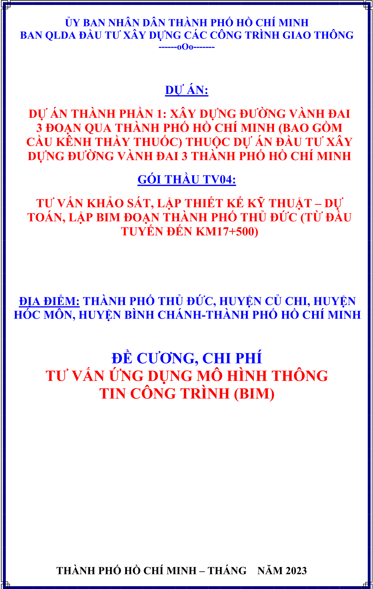

## Outline (Tự động tạo)

  - [D Ự ÁN:](#d-ự-án)
  - [GÓI TH Ầ U TV04:](#gói-th-ầ-u-tv04)
  - [ĐỊ A Đ I Ể M: THÀNH PH Ố TH Ủ ĐỨ C, HUY Ệ N C Ủ CHI, HUY Ệ N HÓC MÔN, HUY Ệ N BÌNH CHÁNH-THÀNH PH Ố H Ồ CHÍ MINH](#đị-a-đ-i-ể-m-thành-ph-ố-th-ủ-đứ-c-huy-ệ-n-c-ủ-chi-huy-ệ-n-hóc-môn-huy-ệ-n-bình-chánh-thành-ph-ố-h-ồ-chí-minh)
  - [ĐỀ C ƯƠ NG, CHI PHÍ T Ư V Ấ N Ứ NG D Ụ NG MÔ HÌNH THÔNG TIN CÔNG TRÌNH (BIM)](#đề-c-ươ-ng-chi-phí-t-ư-v-ấ-n-ứ-ng-d-ụ-ng-mô-hình-thông-tin-công-trình-bim)
  - [M Ụ C L Ụ C](#m-ụ-c-l-ụ-c)
  - [ĐỀ C ƯƠ NG, CHI PHÍ Ứ NG D Ụ NG MÔ HÌNH THÔNG TIN CÔNG TRÌNH (BIM) Đ O Ạ N THÀNH PH Ố TH Ủ ĐỨ C (T Ừ ĐẦ U TUY Ế N ĐẾ N KM17+500)](#đề-c-ươ-ng-chi-phí-ứ-ng-d-ụ-ng-mô-hình-thông-tin-công-trình-bim-đ-o-ạ-n-thành-ph-ố-th-ủ-đứ-c-t-ừ-đầ-u-tuy-ế-n-đế-n-km17500)
  - [1. GI Ớ I THI Ệ U CHUNG](#1-gi-ớ-i-thi-ệ-u-chung)
  - [1.1 Tên gói th ầ u:](#11-tên-gói-th-ầ-u)
  - [1.2 Tên d ự án:](#12-tên-d-ự-án)
  - [1.3 Đị a đ i ể m xây d ự ng:](#13-đị-a-đ-i-ể-m-xây-d-ự-ng)
  - [1.5 Đơ n v ị l ậ p đề c ươ ng:](#15-đơ-n-v-ị-l-ậ-p-đề-c-ươ-ng)
  - [2. CÁC C Ă N C Ứ PHÁP LÝ ÁP D Ụ NG BIM](#2-các-c-ă-n-c-ứ-pháp-lý-áp-d-ụ-ng-bim)
  - [3.1 Ph ạ m vi áp d ụ ng BIM](#31-ph-ạ-m-vi-áp-d-ụ-ng-bim)
  - [3. QUY MÔ, GI Ả I PHÁP THI Ế T K Ế PH Ạ M VI ÁP D Ụ NG BIM](#3-quy-mô-gi-ả-i-pháp-thi-ế-t-k-ế-ph-ạ-m-vi-áp-d-ụ-ng-bim)
  - [3.2 Quy mô, gi ả i pháp thi ế t k ế](#32-quy-mô-gi-ả-i-pháp-thi-ế-t-k-ế)
  - [4. MÔ HÌNH THÔNG TIN CÔNG TRÌNH (BIM)](#4-mô-hình-thông-tin-công-trình-bim)
  - [4.1 Thu ậ t ng ữ và đị nh ngh ĩ a](#41-thu-ậ-t-ng-ữ-và-đị-nh-ngh-ĩ-a)
  - [4.2 T ầ m quan tr ọ ng và l ợ i ích c ủ a vi ệ c áp d ụ ng BIM vào d ự án Vành đ ai 3:](#42-t-ầ-m-quan-tr-ọ-ng-và-l-ợ-i-ích-c-ủ-a-vi-ệ-c-áp-d-ụ-ng-bim-vào-d-ự-án-vành-đ-ai-3)
  - [4.2.1 T ầ m quan tr ọ ng áp d ụ ng BIM:](#421-t-ầ-m-quan-tr-ọ-ng-áp-d-ụ-ng-bim)
  - [4.2.2 L ợ i ích c ủ a vi ệ c áp d ụ ng BIM vào d ự án Vành đ ai 3:](#422-l-ợ-i-ích-c-ủ-a-vi-ệ-c-áp-d-ụ-ng-bim-vào-d-ự-án-vành-đ-ai-3)
  - [ Đố i v ớ i giai đ o ạ n thi ế t k ế k ỹ thu ậ t:](#đố-i-v-ớ-i-giai-đ-o-ạ-n-thi-ế-t-k-ế-k-ỹ-thu-ậ-t)
  - [ Đố i v ớ i công tác ph ố i h ợ p gi ữ a các bên](#đố-i-v-ớ-i-công-tác-ph-ố-i-h-ợ-p-gi-ữ-a-các-bên)
  - [ Đố i v ớ i công tác th ẩ m tra, th ẩ m đị nh thi ế t k ế , an toàn giao thông](#đố-i-v-ớ-i-công-tác-th-ẩ-m-tra-th-ẩ-m-đị-nh-thi-ế-t-k-ế-an-toàn-giao-thông)
  - [4.3 Nh ữ ng h ạ n ch ế và cách kh ắ c ph ụ c khi áp d ụ ng BIM](#43-nh-ữ-ng-h-ạ-n-ch-ế-và-cách-kh-ắ-c-ph-ụ-c-khi-áp-d-ụ-ng-bim)
  - [4.3.1 Nh ữ ng h ạ n ch ế :](#431-nh-ữ-ng-h-ạ-n-ch-ế)
  - [4.3.2 Bi ệ n pháp kh ắ c ph ụ c:](#432-bi-ệ-n-pháp-kh-ắ-c-ph-ụ-c)
  - [4.4 Quy trình áp d ụ ng BIM trong quá trình đầ u t ư xây d ự ng](#44-quy-trình-áp-d-ụ-ng-bim-trong-quá-trình-đầ-u-t-ư-xây-d-ự-ng)
  - [4.5 Ti ế n trình t ổ ng quát tri ể n khai áp d ụ ng BIM](#45-ti-ế-n-trình-t-ổ-ng-quát-tri-ể-n-khai-áp-d-ụ-ng-bim)
  - [4.5.1 Xác đị nh n ộ i dung áp d ụ ng BIM](#451-xác-đị-nh-n-ộ-i-dung-áp-d-ụ-ng-bim)
  - [4.5.2 L ự a ch ọ n đơ n v ị th ự c hi ệ n:](#452-l-ự-a-ch-ọ-n-đơ-n-v-ị-th-ự-c-hi-ệ-n)
  - [4.5.3 Công tác chu ẩ n b ị th ự c hi ệ n cho Nhóm d ự án:](#453-công-tác-chu-ẩ-n-b-ị-th-ự-c-hi-ệ-n-cho-nhóm-d-ự-án)
  - [4.5.4 Xây d ự ng và Phát tri ể n và ứ ng d ụ ng mô hình BIM:](#454-xây-d-ự-ng-và-phát-tri-ể-n-và-ứ-ng-d-ụ-ng-mô-hình-bim)
  - [4.5.5 Ki ể m tra, nghi ệ m thu mô hình BIM:](#455-ki-ể-m-tra-nghi-ệ-m-thu-mô-hình-bim)
  - [4.5.6 L ư u tr ữ mô hình và đ ánh giá quá trình th ự c hi ệ n:](#456-l-ư-u-tr-ữ-mô-hình-và-đ-ánh-giá-quá-trình-th-ự-c-hi-ệ-n)
  - [5. M Ụ C TIÊU ÁP D Ụ NG BIM](#5-m-ụ-c-tiêu-áp-d-ụ-ng-bim)
  - [5.1 M ụ c tiêu chung](#51-m-ụ-c-tiêu-chung)
  - [5.2 M ụ c tiêu c ụ th ể](#52-m-ụ-c-tiêu-c-ụ-th-ể)
  - [đ o ạ n thi ế t k ế k ỹ thu ậ t v ớ i các m ụ c tiêu c ụ th ể nh ư sau:](#đ-o-ạ-n-thi-ế-t-k-ế-k-ỹ-thu-ậ-t-v-ớ-i-các-m-ụ-c-tiêu-c-ụ-th-ể-nh-ư-sau)
  - [6.1 Nguyên t ắ c l ự a ch ọ n n ộ i dung áp d ụ ng BIM](#61-nguyên-t-ắ-c-l-ự-a-ch-ọ-n-n-ộ-i-dung-áp-d-ụ-ng-bim)
  - [6. PH Ạ M VI CÔNG VI Ệ C T Ư V Ấ N BIM](#6-ph-ạ-m-vi-công-vi-ệ-c-t-ư-v-ấ-n-bim)
  - [6.2 Các h ạ ng m ụ c áp d ụ ng BIM](#62-các-h-ạ-ng-m-ụ-c-áp-d-ụ-ng-bim)
  - [6.3 Ti ế n độ th ự c hi ệ n](#63-ti-ế-n-độ-th-ự-c-hi-ệ-n)
  - [7. GI Ả I PHÁP TH Ự C HI Ệ N - H Ồ S Ơ YÊU C Ầ U THÔNG TIN (EIR)](#7-gi-ả-i-pháp-th-ự-c-hi-ệ-n---h-ồ-s-ơ-yêu-c-ầ-u-thông-tin-eir)
  - [7.1 Quy trình áp d ụ ng BIM giai đ o ạ n thi ế t k ế k ỹ thu ậ t](#71-quy-trình-áp-d-ụ-ng-bim-giai-đ-o-ạ-n-thi-ế-t-k-ế-k-ỹ-thu-ậ-t)
  - [7.2 Vai trò trách nhi ệ m các bên](#72-vai-trò-trách-nhi-ệ-m-các-bên)
  - [7.3 Quy trình ph ố i h ợ p BIM gi ữ a các bên](#73-quy-trình-ph-ố-i-h-ợ-p-bim-gi-ữ-a-các-bên)
  - [7.4 Quy trình ki ể m soát va ch ạ m các h ạ ng m ụ c:](#74-quy-trình-ki-ể-m-soát-va-ch-ạ-m-các-h-ạ-ng-m-ụ-c)
  - [Ghi chú:](#ghi-chú)
  - [7.5 Yêu c ầ u v ề s ả n ph ẩ m và k ỹ thu ậ t](#75-yêu-c-ầ-u-v-ề-s-ả-n-ph-ẩ-m-và-k-ỹ-thu-ậ-t)
  - [7.5.1 K ế ho ạ ch chuy ể n giao thông tin nhi ệ m v ụ (TIDP)](#751-k-ế-ho-ạ-ch-chuy-ể-n-giao-thông-tin-nhi-ệ-m-v-ụ-tidp)
  - [7.5.2 S ả n ph ẩ m bàn giao](#752-s-ả-n-ph-ẩ-m-bàn-giao)
  - [ L ư u ý:](#l-ư-u-ý)
  - [7.5.3 K ế ho ạ ch chuy ể n giao thông tin t ổ ng th ể (MIDP)](#753-k-ế-ho-ạ-ch-chuy-ể-n-giao-thông-tin-t-ổ-ng-th-ể-midp)
  - [7.6 Yêu c ầ u v ề qu ả n lý](#76-yêu-c-ầ-u-v-ề-qu-ả-n-lý)
  - [7.6.1 Phân chia mô hình](#761-phân-chia-mô-hình)
  - [B ả ng phân chia mô hình d ự ki ế n](#b-ả-ng-phân-chia-mô-hình-d-ự-ki-ế-n)
  - [7.6.2 Yêu c ầ u v ề m ứ c độ phát tri ể n thông tin (LOD)](#762-yêu-c-ầ-u-v-ề-m-ứ-c-độ-phát-tri-ể-n-thông-tin-lod)
  - [7.6.3 Qu ả n lý h ệ th ố ng và môi tr ườ ng d ữ li ệ u chung CDE](#763-qu-ả-n-lý-h-ệ-th-ố-ng-và-môi-tr-ườ-ng-d-ữ-li-ệ-u-chung-cde)
  - [Trong đ ó:](#trong-đ-ó)
  - [quy ế t đị nh 348/Q Đ -BXD, c ụ th ể nh ư sau:](#quy-ế-t-đị-nh-348q-đ--bxd-c-ụ-th-ể-nh-ư-sau)
  - [7.7 Quy trình ki ể m tra và nghi ệ m thu mô hình](#77-quy-trình-ki-ể-m-tra-và-nghi-ệ-m-thu-mô-hình)
  - [8. C Ơ S Ở H Ạ T Ầ NG VÀ NHÂN S Ự TH Ự C HI Ệ N BIM](#8-c-ơ-s-ở-h-ạ-t-ầ-ng-và-nhân-s-ự-th-ự-c-hi-ệ-n-bim)
  - [8.1 C ơ s ở h ạ t ầ ng](#81-c-ơ-s-ở-h-ạ-t-ầ-ng)
  - [8.2 Vai trò nhân s ự BIM](#82-vai-trò-nhân-s-ự-bim)
  - [-Vai trò các nhân s ự BIM đượ c th ể hi ệ n theo b ả ng sau: Ch ủ th ể Vi ế t t ắ](#-vai-trò-các-nhân-s-ự-bim-đượ-c-th-ể-hi-ệ-n-theo-b-ả-ng-sau-ch-ủ-th-ể-vi-ế-t-t-ắ)
  - [-S ố l ượ ng các nhân s ự BIM ứ ng v ớ i các gói th ầ u:](#-s-ố-l-ượ-ng-các-nhân-s-ự-bim-ứ-ng-v-ớ-i-các-gói-th-ầ-u)
  - [8.3 Cung c ấ p môi tr ườ ng d ữ li ệ u chung](#83-cung-c-ấ-p-môi-tr-ườ-ng-d-ữ-li-ệ-u-chung)
  - [9. CHI PHÍ TRI Ể N KHAI Ứ NG D Ụ NG BIM CHO D Ự ÁN:](#9-chi-phí-tri-ể-n-khai-ứ-ng-d-ụ-ng-bim-cho-d-ự-án)
  - [9.1 C ă n c ứ l ậ p d ự toán:](#91-c-ă-n-c-ứ-l-ậ-p-d-ự-toán)
  - [Trong đ ó:](#trong-đ-ó)
  - [9.2 D ự toán chi phí:](#92-d-ự-toán-chi-phí)
  - [DỰ TOÁN CHI PHÍ TƯ VẤN LẬP MÔ HÌNH THÔNG TIN CÔNG TRÌNH (BIM)](#dự-toán-chi-phí-tư-vấn-lập-mô-hình-thông-tin-công-trình-bim)
  - [BẢNG TỔNG HỢP DỰ TOÁN GÓI THẦU TV04](#bảng-tổng-hợp-dự-toán-gói-thầu-tv04)
  - [B Ả NG CHI PHÍ CHUYÊN GIA (BIM)](#b-ả-ng-chi-phí-chuyên-gia-bim)
  - [CHI PHÍ CHUYÊN GIA - GÓI TH Ầ U TV04](#chi-phí-chuyên-gia---gói-th-ầ-u-tv04)
  - [Chú thích :](#chú-thích)
  - [I. Thành ph ầ n nhân s ự :](#i-thành-ph-ầ-n-nhân-s-ự)
  - [II. Chi ti ế t s ố tháng công (5) xem ph ụ l ụ c A : B ả](#ii-chi-ti-ế-t-s-ố-tháng-công-5-xem-ph-ụ-l-ụ-c-a-b-ả)
  - [B Ả NG PHÂN TÍCH L ƯƠ NG CHO CHUYÊN GIA (BIM)](#b-ả-ng-phân-tích-l-ươ-ng-cho-chuyên-gia-bim)
  - [Quy đị nh v ề m ứ c l ươ ng chuyên gia, yêu c ầ u chuyên gia theo Thông t ư s ố 11/2021/TT-BXD ngày 31/8/2021. - Chuyên gia nhóm I:](#quy-đị-nh-v-ề-m-ứ-c-l-ươ-ng-chuyên-gia-yêu-c-ầ-u-chuyên-gia-theo-thông-t-ư-s-ố-112021tt-bxd-ngày-3182021---chuyên-gia-nhóm-i)
  - [- Chuyên gia nhóm II:](#--chuyên-gia-nhóm-ii)
  - [- Chuyên gia nhóm III:](#--chuyên-gia-nhóm-iii)
  - [- Chuyên gia nhóm IV:](#--chuyên-gia-nhóm-iv)
  - [PH Ụ L Ụ C A : B Ả NG PHÂN TÍCH NGÀY CÔNG (BIM) GÓI TH Ầ U TV04](#ph-ụ-l-ụ-c-a-b-ả-ng-phân-tích-ngày-công-bim-gói-th-ầ-u-tv04)
  - [Ghi chú:](#ghi-chú)
  - [PHỤ LỤC B: KHẤU HAO THIẾT BỊ VĂN PHÒNG (BIM)](#phụ-lục-b-khấu-hao-thiết-bị-văn-phòng-bim)
  - [Ghi chú:](#ghi-chú)
  - [PH Ụ L Ụ C C : B Ả NG TÍNH CHI PHÍ PH Ầ N M Ề M MÔI TR ƯỜ NG D Ữ LI Ệ U CHUNG](#ph-ụ-l-ụ-c-c-b-ả-ng-tính-chi-phí-ph-ầ-n-m-ề-m-môi-tr-ườ-ng-d-ữ-li-ệ-u-chung)
  - [B Ả NG SO SÁNH Ư U NH ƯỢ C Đ I Ể M V Ề TÍNH KINH T Ế VÀ K Ỹ THU Ậ T C Ủ A CÁC GI Ả I PHÁP CDE](#b-ả-ng-so-sánh-ư-u-nh-ượ-c-đ-i-ể-m-v-ề-tính-kinh-t-ế-và-k-ỹ-thu-ậ-t-c-ủ-a-các-gi-ả-i-pháp-cde)
  - [PH Ụ L Ụ C D : B Ả NG TÍNH S Ố L ƯỢ NG NG ƯỜ I DÙNG THAM GIA MÔI TR ƯỜ NG D Ữ LI Ệ U CHUNG](#ph-ụ-l-ụ-c-d-b-ả-ng-tính-s-ố-l-ượ-ng-ng-ườ-i-dùng-tham-gia-môi-tr-ườ-ng-d-ữ-li-ệ-u-chung)
  - [PHUÏ LUÏC BAÙO GIAÙ PHẦN MỀM DỮ LIỆU CHUNG](#phuï-luïc-baùo-giaù-phần-mềm-dữ-liệu-chung)
  - [THU BÁO GIÁ](#thu-báo-giá)
  - [KÍnh gi: BAN QUÀN LÝ D ÁN ĐÀU TU XÂY D'NG CÁC CÔNG TRINH GIAO THÔNG](#kính-gi-ban-quàn-lý-d-án-đàu-tu-xây-dng-các-công-trinh-giao-thông)
  - [LOC PHAT SOFTWARE TRADING COMPANY LIMITED](#loc-phat-software-trading-company-limited)
  - [SOFTWARE QUOTATION](#software-quotation)
  - [TRANSPORTATION WORKS CONSTRUCTION INVESTMENT PROJECT MANAGEMENT AUTHORITY OF HO CHI MINH CITY](#transportation-works-construction-investment-project-management-authority-of-ho-chi-minh-city)
  - [Dear Sir;](#dear-sir)
  - [Terms and Conditions:](#terms-and-conditions)
  - [QUOTATION](#quotation)
  - [221214-010-111-TCIPHCM0 (Quote, BIM Pro)](#221214-010-111-tciphcm0-quote-bim-pro)
  - [Sales and Condition Terms](#sales-and-condition-terms)
  - [Quoted by:](#quoted-by)
  - [PHUÏ LUÏC BAÙO GIAÙ THIẾT BỊ VĂN PH Ò NG, MÁY TÍNH](#phuï-luïc-baùo-giaù-thiết-bị-văn-ph-ò-ng-máy-tính)
  - [CÔNG TY TNHH GIÅI PHÁP CÔNG NGH ĐIN T TIN HQC KHÁNH LINH](#công-ty-tnhh-giåi-pháp-công-ngh-đin-t-tin-hqc-khánh-linh)
  - [HÓA ĐON GIÁ TRI GIA TĂNG (VAT INVOICE)](#hóa-đon-giá-tri-gia-tăng-vat-invoice)
  - [CÔNG TY TNHH GIÅI PHÁP CÔNG NGH ĐIN TÚ TIN HQC KHÁNH LINH](#công-ty-tnhh-giåi-pháp-công-ngh-đin-tú-tin-hqc-khánh-linh)
  - [HÓA ĐON GIÁ TRI GIA TĂNG](#hóa-đon-giá-tri-gia-tăng)
  - [(VAT INVOICE)](#vat-invoice)
  - [CÔNG TY TNHH GIÅI PHÁP CÔNG NGH ĐIN T TIN HQC KHÁNH LINH](#công-ty-tnhh-giåi-pháp-công-ngh-đin-t-tin-hqc-khánh-linh)
  - [HÓA ĐON GIÁ TRI GIA TĂNG](#hóa-đon-giá-tri-gia-tăng)
  - [(VAT INVOICE)](#vat-invoice)

Ủ Y BAN NHÂN DÂN THÀNH PH Ố H Ồ CHÍ MINH BAN QLDA ĐẦ U T Ư XÂY D Ự NG CÁC CÔNG TRÌNH GIAO THÔNG ------oOo-------

## D Ự ÁN:

## GÓI TH Ầ U TV04:

D Ự ÁN THÀNH PH Ầ N 1: XÂY D Ự NG ĐƯỜ NG VÀNH Đ AI 3 Đ O Ạ N QUA THÀNH PH Ố H Ồ CHÍ MINH (BAO G Ồ M C Ầ U KÊNH TH Ầ Y THU Ố C) THU Ộ C D Ự ÁN ĐẦ U T Ư XÂY D Ự NG ĐƯỜ NG VÀNH Đ AI 3 THÀNH PH Ố H Ồ CHÍ MINH

T Ư V Ấ N KH Ả O SÁT, L Ậ P THI Ế T K Ế K Ỹ THU Ậ T - D Ự TOÁN, L Ậ P BIM Đ O Ạ N THÀNH PH Ố TH Ủ ĐỨ C (T Ừ ĐẦ U TUY Ế N ĐẾ N KM17+500)

## ĐỊ A Đ I Ể M: THÀNH PH Ố TH Ủ ĐỨ C, HUY Ệ N C Ủ CHI, HUY Ệ N HÓC MÔN, HUY Ệ N BÌNH CHÁNH-THÀNH PH Ố H Ồ CHÍ MINH

## ĐỀ C ƯƠ NG, CHI PHÍ T Ư V Ấ N Ứ NG D Ụ NG MÔ HÌNH THÔNG TIN CÔNG TRÌNH (BIM)

ĐƠ N V Ị L Ậ P CÔNG TY C Ổ PH Ầ N T Ư V Ấ N XÂY D Ự NG TAM KI Ệ T GIÁM ĐỐ C CH Ủ ĐẦ U T Ư BAN QLDA ĐẦ U T Ư XÂY D Ự NG CÁC CÔNG TRÌNH GIAO THÔNG TUQ. GIÁM ĐỐ C PHÓ TR ƯỞ NG BAN Đ I Ề U HÀNH D Ự ÁN VÀNH Đ AI 3

Đ OÀN V Ă N HI Ệ P LÊ XUÂN B Ắ C

D Ự ÁN THÀNH PH Ầ N 1: XÂY D Ự NG ĐƯỜ NG VÀNH Đ AI 3 Đ O Ạ N QUA THÀNH PH Ố H Ồ CHÍ MINH (BAO G Ồ M C Ầ U KÊNH TH Ầ Y THU Ố C)

:

THÀNH PH Ố TH Ủ ĐỨ C, HUY Ệ N C Ủ CHI, HÓC MÔN, BÌNH CHÁNH

H

Ạ

NG M

Ụ

C

:

ĐỀ C ƯƠ NG Ứ NG D Ụ NG MÔ HÌNH THÔNG TIN CÔNG TRÌNH BIM GÓI TH Ầ U TV04

Ớ

Ệ

## M Ụ C L Ụ C

| 1. GI I THI U CHUNG ...........................................................................................................                                                                | 1. GI I THI U CHUNG ...........................................................................................................                                                                | 1. GI I THI U CHUNG ...........................................................................................................                                                                |   3 |
|------------------------------------------------------------------------------------------------------------------------------------------------------------------------------------------------|------------------------------------------------------------------------------------------------------------------------------------------------------------------------------------------------|------------------------------------------------------------------------------------------------------------------------------------------------------------------------------------------------|-----|
| 1.1                                                                                                                                                                                            | Tên gói th ầ u: .......................................................................................................................                                                        | Tên gói th ầ u: .......................................................................................................................                                                        |   3 |
| 1.2                                                                                                                                                                                            | Tên d ự án: .............................................. .............................................................................                                                       | Tên d ự án: .............................................. .............................................................................                                                       |   3 |
| 1.3                                                                                                                                                                                            | Đị a đ i ể m xây d ự ng: .............................................................................................................                                                         | Đị a đ i ể m xây d ự ng: .............................................................................................................                                                         |   3 |
| 1.4                                                                                                                                                                                            | Ch ủ đầ u t ư d ự án: Ban Qu ả n lý d ự án đầ u t ư xây d ự ng các công trình giao thông. ...........                                                                                          | Ch ủ đầ u t ư d ự án: Ban Qu ả n lý d ự án đầ u t ư xây d ự ng các công trình giao thông. ...........                                                                                          |     |
| 1.5                                                                                                                                                                                            | Đơ n v ị l ậ p đề c ươ ng: ..........................................................................................................                                                          | Đơ n v ị l ậ p đề c ươ ng: ..........................................................................................................                                                          |   3 |
| 2. CÁC C Ă N C Ứ PHÁP LÝ ÁP D Ụ NG BIM ..........................................................................                                                                              | 2. CÁC C Ă N C Ứ PHÁP LÝ ÁP D Ụ NG BIM ..........................................................................                                                                              | 2. CÁC C Ă N C Ứ PHÁP LÝ ÁP D Ụ NG BIM ..........................................................................                                                                              |   3 |
| 3. QUY MÔ, GI Ả I PHÁP THI Ế T K Ế PH Ạ M VI ÁP D Ụ NG BIM .......................................                                                                                             | 3. QUY MÔ, GI Ả I PHÁP THI Ế T K Ế PH Ạ M VI ÁP D Ụ NG BIM .......................................                                                                                             | 3. QUY MÔ, GI Ả I PHÁP THI Ế T K Ế PH Ạ M VI ÁP D Ụ NG BIM .......................................                                                                                             |   4 |
| 3.1                                                                                                                                                                                            | Ph ạ m vi áp d ụ ng BIM .........................................................................................................                                                              | Ph ạ m vi áp d ụ ng BIM .........................................................................................................                                                              |   4 |
| 3.2                                                                                                                                                                                            | Quy mô, gi ả i pháp thi ế t k ế ..................................................................................................                                                             | Quy mô, gi ả i pháp thi ế t k ế ..................................................................................................                                                             |   4 |
| 4. MÔ HÌNH THÔNG TIN CÔNG TRÌNH (BIM) ................ .................................................                                                                                       | 4. MÔ HÌNH THÔNG TIN CÔNG TRÌNH (BIM) ................ .................................................                                                                                       | 4. MÔ HÌNH THÔNG TIN CÔNG TRÌNH (BIM) ................ .................................................                                                                                       |   7 |
| 4.1 Thu ậ t ng ữ và đị nh ngh ĩ a .....................................................................................................                                                        | 4.1 Thu ậ t ng ữ và đị nh ngh ĩ a .....................................................................................................                                                        | 4.1 Thu ậ t ng ữ và đị nh ngh ĩ a .....................................................................................................                                                        |   7 |
| 4.2 T ầ m quan tr ọ ng và l ợ i ích c ủ a vi ệ c áp d ụ ng BIM vào d ự án Vành đ ai 3: ..........................                                                                              | 4.2 T ầ m quan tr ọ ng và l ợ i ích c ủ a vi ệ c áp d ụ ng BIM vào d ự án Vành đ ai 3: ..........................                                                                              | 4.2 T ầ m quan tr ọ ng và l ợ i ích c ủ a vi ệ c áp d ụ ng BIM vào d ự án Vành đ ai 3: ..........................                                                                              |   9 |
|                                                                                                                                                                                                |                                                                                                                                                                                                | T ầ m quan tr ọ ng áp d ụ ng BIM: ...................................................................................                                                                          |   9 |
| 4.2.1 4.2.2 L ợ i ích c ủ a vi ệ c áp d ụ ng BIM vào d ự án Vành đ ai 3: ............................................. ữ ạ ế ắ ụ ụ                                                             | 4.2.1 4.2.2 L ợ i ích c ủ a vi ệ c áp d ụ ng BIM vào d ự án Vành đ ai 3: ............................................. ữ ạ ế ắ ụ ụ                                                             | 4.2.1 4.2.2 L ợ i ích c ủ a vi ệ c áp d ụ ng BIM vào d ự án Vành đ ai 3: ............................................. ữ ạ ế ắ ụ ụ                                                             |  10 |
|                                                                                                                                                                                                |                                                                                                                                                                                                | ........................................................................................................                                                                                       |  11 |
| 4.3 Nh                                                                                                                                                                                         | 4.3 Nh                                                                                                                                                                                         | Nh ng h n ch :                                                                                                                                                                                 |  11 |
| ng h n ch và cách kh c ph c khi áp d ng BIM ....................................................... ữ ạ ế                                                                                      | ng h n ch và cách kh c ph c khi áp d ng BIM ....................................................... ữ ạ ế                                                                                      | ng h n ch và cách kh c ph c khi áp d ng BIM ....................................................... ữ ạ ế                                                                                      |     |
| 4.3.1 4.3.2                                                                                                                                                                                    | 4.3.1 4.3.2                                                                                                                                                                                    | Bi ệ n pháp kh ắ c ph ụ c: ...............................................................................................                                                                     |  12 |
| 4.4 Quy trình áp d ụ ng BIM trong quá trình đầ u t ư xây d ự ng ................................................. ế ổ ể ụ .................................................................... | 4.4 Quy trình áp d ụ ng BIM trong quá trình đầ u t ư xây d ự ng ................................................. ế ổ ể ụ .................................................................... | 4.4 Quy trình áp d ụ ng BIM trong quá trình đầ u t ư xây d ự ng ................................................. ế ổ ể ụ .................................................................... |  12 |
| 4.5 Ti n trình t ng quát tri n khai áp d ng BIM                                                                                                                                                | 4.5 Ti n trình t ng quát tri n khai áp d ng BIM                                                                                                                                                | 4.5 Ti n trình t ng quát tri n khai áp d ng BIM                                                                                                                                                |  13 |
| 4.5.1                                                                                                                                                                                          | 4.5.1                                                                                                                                                                                          | Xác đị nh n ộ i dung áp d ụ ng BIM ..............................................................................                                                                              |  13 |
| 4.5.2                                                                                                                                                                                          | 4.5.2                                                                                                                                                                                          | L ự a ch ọ n đơ n v ị th ự c hi ệ n: ......................................................................................                                                                    |  13 |
| 4.5.3                                                                                                                                                                                          | 4.5.3                                                                                                                                                                                          | Công tác chu ẩ n b ị th ự c hi ệ n cho Nhóm d ự án: .............................................. ..........                                                                                  |  13 |
| 4.5.4                                                                                                                                                                                          | 4.5.4                                                                                                                                                                                          | Xây d ự ng và Phát tri ể n và ứ ng d ụ ng mô hình BIM: ...............................................                                                                                         |  14 |
| 4.5.5                                                                                                                                                                                          | 4.5.5                                                                                                                                                                                          | Ki ể m tra, nghi ệ m thu mô hình BIM: .......................................................................                                                                                  |  14 |
| 4.5.6                                                                                                                                                                                          | 4.5.6                                                                                                                                                                                          | L ư u tr ữ mô hình và đ ánh giá quá trình th ự c hi ệ n: ....................................................                                                                                  |  14 |
| 5. M Ụ C TIÊU ÁP D Ụ NG BIM ................................................................................................                                                                   | 5. M Ụ C TIÊU ÁP D Ụ NG BIM ................................................................................................                                                                   | 5. M Ụ C TIÊU ÁP D Ụ NG BIM ................................................................................................                                                                   |  14 |
| 5.1 M ụ c tiêu chung ...................................... ...........................................................................                                                        | 5.1 M ụ c tiêu chung ...................................... ...........................................................................                                                        | 5.1 M ụ c tiêu chung ...................................... ...........................................................................                                                        |  14 |
| 5.2                                                                                                                                                                                            | 5.2                                                                                                                                                                                            | M ụ c tiêu c ụ th ể .................................................................................................................                                                          |  14 |
| 6. PH Ạ M VI CÔNG VI Ệ C T Ư V Ấ N BIM .............................................................................                                                                           | 6. PH Ạ M VI CÔNG VI Ệ C T Ư V Ấ N BIM .............................................................................                                                                           | 6. PH Ạ M VI CÔNG VI Ệ C T Ư V Ấ N BIM .............................................................................                                                                           |  15 |
| 6.1                                                                                                                                                                                            | Nguyên t ắ c l ự a ch ọ n n ộ i dung áp d ụ ng BIM ....................................................................                                                                        | Nguyên t ắ c l ự a ch ọ n n ộ i dung áp d ụ ng BIM ....................................................................                                                                        |  15 |
| 6.2                                                                                                                                                                                            | Các h ạ ng m ụ c áp d ụ ng BIM .............................................................................................                                                                   | Các h ạ ng m ụ c áp d ụ ng BIM .............................................................................................                                                                   |  17 |
| 6.3                                                                                                                                                                                            | Ti ế n độ th ự c hi ệ n ..............................................................................................................                                                         | Ti ế n độ th ự c hi ệ n ..............................................................................................................                                                         |  18 |

Ự

Ầ

Ự

ĐƯỜ

Đ

Đ

Ạ

Ố

Ồ

| TÊN D Ự ÁN                                                                                        | :                                                                                                                                                                   | D ÁN THÀNH PH N 1: XÂY D NG NG VÀNH AI 3 O N QUA THÀNH PH H CHÍ MINH (BAO G Ồ M C Ầ U KÊNH TH Ầ Y THU Ố C)   |
|---------------------------------------------------------------------------------------------------|---------------------------------------------------------------------------------------------------------------------------------------------------------------------|--------------------------------------------------------------------------------------------------------------|
| ĐỊ A Đ I Ể M                                                                                      | THÀNH PH Ố TH Ủ ĐỨ C, HUY Ệ N C Ủ CHI, HÓC MÔN, BÌNH CHÁNH                                                                                                          |                                                                                                              |
| H Ạ NG M Ụ C                                                                                      | : :                                                                                                                                                                 | ĐỀ C ƯƠ NG Ứ NG D Ụ NG MÔ HÌNH THÔNG TIN CÔNG TRÌNH BIM GÓI TH Ầ U TV04                                      |
| 7. GI Ả I PHÁP TH Ự C HI Ệ N - H Ồ S Ơ YÊU C Ầ U THÔNG TIN (EIR) ............................. 19 |                                                                                                                                                                     |                                                                                                              |
| 7.1 7.2 Vai trò trách nhi m các bên                                                               | Quy trình áp d ụ ng BIM giai đ o ạ n thi ế t k ế k ỹ thu ậ t .......................................................... ệ ......................................... | 19 ..................................................... 19                                                  |
| 7.3                                                                                               | Quy trình ph ố i h ợ p BIM gi ữ a các bên ......................................... .....................................                                           | 22                                                                                                           |
| 7.4                                                                                               | Quy trình ki ể m soát va ch ạ m các h ạ ng m ụ c: ....................................................................                                              | 23                                                                                                           |
| 7.5                                                                                               | Yêu c ầ u v ề s ả n ph ẩ m và k ỹ thu ậ t .....................................................................................                                     | 26                                                                                                           |
| 7.5.1                                                                                             | K ế ho ạ ch chuy ể n giao thông tin nhi ệ m v ụ (TIDP) ..................................................                                                           | 26                                                                                                           |
| 7.5.2                                                                                             | S ả n ph ẩ m bàn giao ...................................................................................................                                           | 29                                                                                                           |
| 7.5.3                                                                                             | K ế ho ạ ch chuy ể n giao thông tin t ổ ng th ể (MIDP) ...................................................                                                          | 31                                                                                                           |
| 7.6                                                                                               | Yêu c ầ u v ề qu ả n lý ............................................................................................................                                | 31                                                                                                           |
| 7.6.1                                                                                             | Phân chia mô hình ...................................................................................................                                               | 31                                                                                                           |
| 7.6.2                                                                                             | Yêu c ầ u v ề m ứ c độ phát tri ể n thông tin (LOD) .......................................................                                                         | 32                                                                                                           |
| 7.6.3                                                                                             | Qu ả n lý h ệ th ố ng và môi tr ườ ng d ữ li ệ u chung CDE...............................................                                                           | 38                                                                                                           |
| 7.7                                                                                               | Quy trình ki ể m tra và nghi ệ m thu mô hình ......................................................................                                                 | 40                                                                                                           |
| 8.                                                                                                | C Ơ S Ở H Ạ T Ầ NG VÀ NHÂN S Ự TH Ự C HI Ệ N BIM......................................................                                                              | 41                                                                                                           |
| 8.1                                                                                               | C ơ s ở h ạ t ầ ng ....................................................................................................................                             | 41                                                                                                           |
| 8.2                                                                                               | Vai trò nhân s ự BIM .........................................................................................................                                      | 41                                                                                                           |
| 8.3                                                                                               | Cung c ấ p môi tr ườ ng d ữ li ệ u chung .................................................................................                                          | 42                                                                                                           |
| 9.                                                                                                | CHI PHÍ TRI Ể N KHAI Ứ NG D Ụ NG BIM CHO D Ự ÁN: ..............................................                                                                     | 44                                                                                                           |
| 9.1                                                                                               | C ă n c ứ l ậ p d ự toán: ............................................ ...............................................................                              | 44                                                                                                           |
| 9.2                                                                                               | D ự toán chi phí: .................................... ............................................................................                                 | 45                                                                                                           |

## ĐỀ C ƯƠ NG, CHI PHÍ Ứ NG D Ụ NG MÔ HÌNH THÔNG TIN CÔNG TRÌNH (BIM) Đ O Ạ N THÀNH PH Ố TH Ủ ĐỨ C (T Ừ ĐẦ U TUY Ế N ĐẾ N KM17+500)

GÓI TH Ầ U :

## 1. GI Ớ I THI Ệ U CHUNG

(B ƯỚ C THI Ế T K Ế K Ỹ THU Ậ T)

TV04: T Ư V Ấ N KH Ả O SÁT, L Ậ P THI Ế T K Ế K Ỹ THU Ậ T - D Ự TOÁN, L Ậ P BIM Đ O Ạ N THÀNH PH Ố TH Ủ ĐỨ C (T Ừ ĐẦ U TUY Ế N ĐẾ N KM17+500)

D ÁN

Ự

:   D Ự ÁN THÀNH PH Ầ N 1: XÂY D Ự NG ĐƯỜ NG VÀNH Đ AI 3 Đ O Ạ N QUA THÀNH PH Ố H Ồ CHÍ MINH (BAO G Ồ M C Ầ U KÊNH TH Ầ Y THU Ố C)

ĐỊ A Đ I Ể M

:  THÀNH PH Ố TH Ủ ĐỨ C - THÀNH PH Ố H Ồ CHÍ MINH

## 1.1 Tên gói th ầ u:

## 1.2 Tên d ự án:

TV04: T ư v ấ n kh ả o sát, l ậ p thi ế t k ế k ỹ thu ậ t - d ự toán, l ậ p BIM đ o ạ n Thành ph ố Th ủ Đứ c (t ừ đầ u tuy ế n đế n Km17+500).

D ự án thành ph ầ n 1: Xây d ự ng đườ ng Vành đ ai 3 đ o ạ n qua Thành ph ố H ồ Chí Minh (bao g ồ m c ầ u Kênh Th ầ y Thu ố c) thu ộ c D ự án Đầ u t ư xây d ự ng đườ ng Vành đ ai 3 Thành ph ố H ồ Chí Minh.

Thành ph ố Th ủ Đứ c - Thành ph ố H ồ Chí Minh.

## 1.3 Đị a đ i ể m xây d ự ng:

- 1.4 Ch ủ đầ u t ư d ự án: Ban Qu ả n lý d ự án đầ u t ư xây d ự ng các công trình giao thông.
- -Công ty C ổ ph ầ n T ư v ấ n xây d ự ng Tam Ki ệ t.

## 1.5 Đơ n v ị l ậ p đề c ươ ng:

- -Đị a ch ỉ : S ố 36, Nguy ễ n Đ ình Chính, Ph ườ ng 15, Qu ậ n Phú Nhu ậ n, TP. HCM.
- -V ă n phòng đạ i di ệ n: S ố 06 đườ ng Thành Công, Ph ườ ng Tân Thành, Qu ậ n Tân Phú, TP. HCM.
- -Đ i ệ n tho ạ i: 028 3948 3303 - Fax: 028 3948 3303.
- -Quy ế t đị nh s ố 2500/Q Đ -TTg ngày 22/12/2016 c ủ a Th ủ t ướ ng Chính ph ủ Phê duy ệ t Đề án áp d ụ ng mô hình thông tin công trình (BIM) trong ho ạ t độ ng xây d ự ng và qu ả n lý v ậ n hành công trình;

## 2. CÁC C Ă N C Ứ PHÁP LÝ ÁP D Ụ NG BIM

- -Quy ế t đị nh s ố 749/Q Đ -TTg ngày 03 tháng 6 n ă m 2020 phê duy ệ t 'Ch ươ ng trình chuy ể n đổ i s ố qu ố c gia đế n n ă m 2025, đị nh h ướ ng đế n n ă m 2030;
- -Quy ế t đị nh s ố 347/Q Đ -BXD ngày 02 tháng 4 n ă m 2021 c ủ a B ộ Xây D ự ng v ề vi ệ c 'Công b ố H ướ ng d ẫ n chi ti ế t áp d ụ ng Mô hình thông tin công trình (BIM) đố i v ớ i công trình dân d ụ ng và công trình h ạ t ầ ng k ỹ thu ậ t đ ô th ị ';
- -Ngh ị đị nh s ố 15/2021/N Đ -CP ngày 03 tháng 3 n ă m 2021 c ủ a Chính ph ủ quy đị nh chi ti ế t m ộ t s ố n ộ i dung v ề qu ả n lý d ự án đầ u t ư xây d ự ng;
- -Quy ế t đị nh s ố 348/Q Đ -BXD ngày 02 tháng 4 n ă m 2021 c ủ a B ộ Xây D ự ng v ề vi ệ c 'Công b ố H ướ ng d ẫ n chung áp d ụ ng Mô hình thông tin công trình (BIM)'.
- -Thông t ư s ố 12/2021/TT-BXD ngày 31 tháng 8 n ă m 2021 c ủ a B ộ Xây d ự ng ban hành đị nh m ứ c xây d ự ng;
- -Quy ế t đị nh s ố 1004/Q Đ -BXD ngày 3 tháng 7 n ă m 2021 phê duy ệ t k ế ho ạ ch chuy ể n đổ i s ố ngành Xây d ự ng giai đ o ạ n 2020-2025, đị nh h ướ ng đế n n ă m 2030;
- -T ờ trình s ố 51/TTr-BXD ngày 05 tháng 12 n ă m 2022 c ủ a B ộ Xây D ự ng g ử i Th ủ t ướ ng v ề vi ệ c ban hành L ộ trình áp d ụ ng mô hình thông tin công trình trong ho ạ t độ ng xây d ự ng.

## 3.1 Ph ạ m vi áp d ụ ng BIM

## 3. QUY MÔ, GI Ả I PHÁP THI Ế T K Ế PH Ạ M VI ÁP D Ụ NG BIM

- -Đố i v ớ i gói th ầ u TV04: T ư v ấ n kh ả o sát, l ậ p TKKT - d ự toán, l ậ p BIM đ o ạ n Thành ph ố Th ủ Đứ c (t ừ đầ u tuy ế n đế n Km17+500) s ẽ áp d ụ ng Mô hình thông tin công trình (BIM) ở v ị trí có tính ch ấ t ph ứ c t ạ p cao t ạ i nút giao cao t ố c TP.HCM - Long Thành - D ầ u Giây (t ừ Km12+600 đế n Km13+800).
- -Ph ạ m vi áp d ụ ng BIM t ạ i nút giao cao t ố c TP.HCM - Long Thành - D ầ u Giây (t ừ Km12+600 đế n Km13+800), dài kho ả ng 1,2 Km.

## 3.2 Quy mô, gi ả i pháp thi ế t k ế

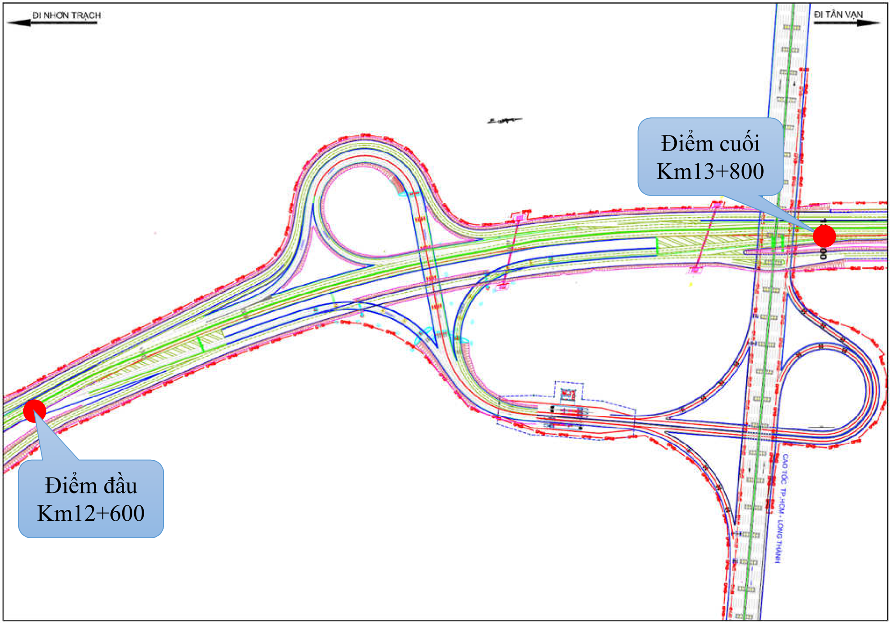

- -Quy mô nhánh nút giao giai đ o ạ n 1: M ặ t c ắ t ngang c ủ a các đườ ng nhánh ph ả i đượ c b ố trí theo quy đị nh t ạ i đ i ể m 6.14 - TCVN 5729-2012 nh ư sau:

M ặ t b ằ ng nút giao cao t ố c TP.HCM - Long Thành giai đ o ạ n 1

+ Chi ề u r ộ ng m ặ t đườ ng c ủ a đườ ng nhánh m ộ t chi ề u trên đ o ạ n th ẳ ng t ố i thi ể u là 4,00 m, hai chi ề u t ố i thi ể u là 7,0 m; t ạ i các đ o ạ n cong ph ả i m ở r ộ ng thêm quy đị nh. N ế u h ướ ng xe ra vào nhi ề u thì chi ề u r ộ ng m ặ t đườ ng đượ c tính theo s ố làn xe c ầ n thi ế t nh ư đố i v ớ i đườ ng ô tô thông th ườ ng đượ c h ướ ng d ẫ n t ạ i m ụ c 4.2 TCVN 4054:2005.
+ M ặ t c ắ t ngang đ o ạ n đườ ng nhánh hai chi ề u g ồ m: m ặ t đườ ng, m ỗ i bên m ộ t d ả i an toàn r ộ ng 1,0 m và l ề c ỏ 0,75 m cho c ả hai phía.
+ M ặ t c ắ t ngang đườ ng nhánh m ộ t chi ề u g ồ m: m ặ t đườ ng, m ộ t d ả i an toàn r ộ ng 2,0 m v ề phía ph ả i và 1,0 m l ề tr ồ ng c ỏ cho c ả hai phía.
+ Quy mô các nhánh nút giao đượ c b ố trí phù h ợ p v ớ i l ư u l ượ ng d ự báo và có d ự tr ữ trong t ươ ng lai khi nhu c ầ u l ư u thông t ă ng lên.

D Ự ÁN THÀNH PH Ầ N 1: XÂY D Ự NG ĐƯỜ NG VÀNH Đ AI 3 Đ O Ạ N QUA THÀNH PH Ố H Ồ CHÍ MINH (BAO G Ồ M C Ầ U KÊNH TH Ầ Y THU Ố C)

THÀNH PH Ố TH Ủ ĐỨ C, HUY Ệ N C Ủ CHI, HÓC MÔN, BÌNH CHÁNH

ĐỀ C ƯƠ NG Ứ NG D Ụ NG MÔ HÌNH THÔNG TIN CÔNG TRÌNH BIM GÓI TH Ầ U TV04

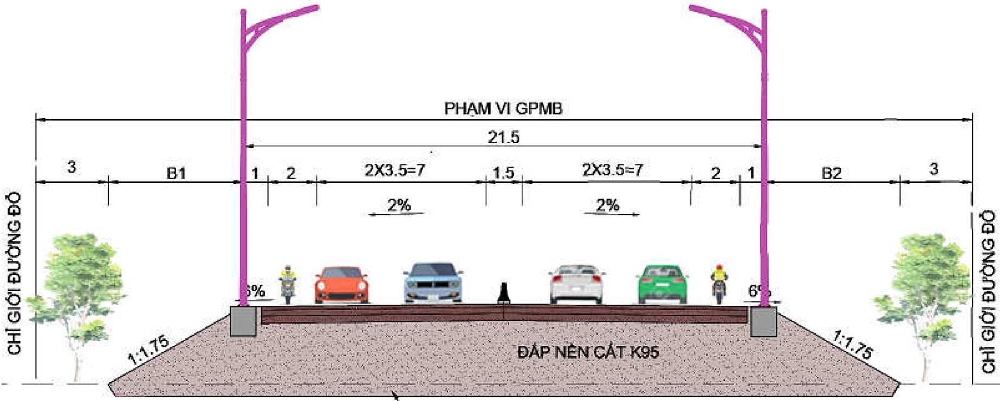

M ặ t c ắ t ngang đ i ể n hình nhánh nút giao hai chi ề u

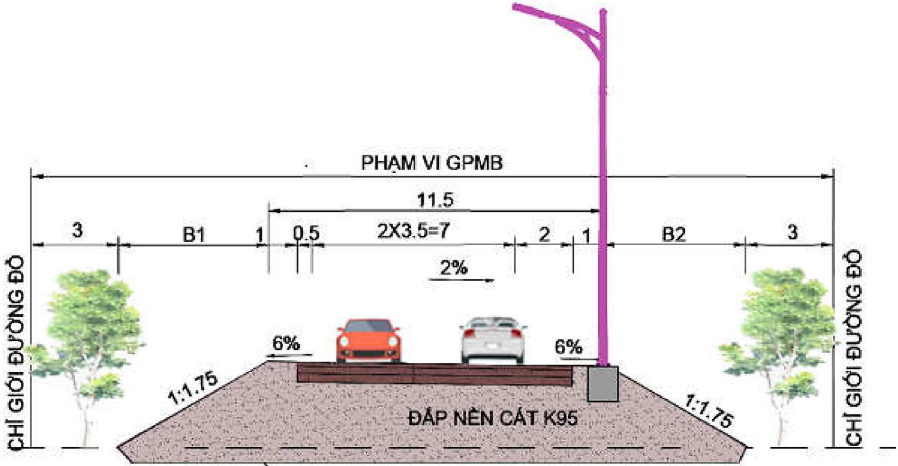

- -Các công trình ch ủ y ế u trong ph ạ m vi nút giao cao t ố c TP.HCM - Long Thành - D ầ u Giây (t ừ Km12+600 đế n Km13+800) bao g ồ m:

M ặ t c ắ t ngang đ i ể n hình nhánh nút giao m ộ t chi ề u

+ C ầ u v ượ t  V Đ 3 (nút giao HLD) t ạ i  lý  trình  Km13+220 dài 220,4m, r ộ ng 20,5m, s ơ đồ nh ị p d ầ m Super-T: 39,1+42,5+45,0+42,5+39,1 (m);
+ C ầ u nhánh C (nút giao HLD) t ạ i lý trình Km13+220 dài 207,5m, r ộ ng 10,5m, s ơ đồ nh ị p d ầ m b ả n r ỗ ng liên t ụ c: 30,0+3x35,0+30,0 (m);
+ C ầ u nhánh B (nút giao HLD) t ạ i lý trình Km13+220 dài 207,5m, r ộ ng 10,5m, s ơ đồ nh ị p d ầ m b ả n r ỗ ng liên t ụ c: 30,0+4x35,0+30,0 (m);
+ C ố ng ngang trong ph ạ m vi áp d ụ ng BIM:

|   STT | Lý trình   | Kh ẩ u độ (theo TKCS)   | Ghi chú   |
|-------|------------|-------------------------|-----------|
|     1 | Km13+342,3 | 2.0x2.0                 |           |
|     2 | Km13+629,0 | 2.0x2.0                 |           |

D Ự ÁN THÀNH PH Ầ N 1: XÂY D Ự NG ĐƯỜ NG VÀNH Đ AI 3 Đ O Ạ N QUA THÀNH PH Ố H Ồ CHÍ MINH (BAO G Ồ M C Ầ U KÊNH TH Ầ Y THU Ố C)

ĐỊ A Đ I Ể M :

THÀNH PH Ố TH Ủ ĐỨ C, HUY Ệ N C Ủ CHI, HÓC MÔN, BÌNH CHÁNH

ĐỀ C ƯƠ NG Ứ NG D Ụ NG MÔ HÌNH THÔNG TIN CÔNG TRÌNH BIM GÓI TH Ầ U TV04

## 4. MÔ HÌNH THÔNG TIN CÔNG TRÌNH (BIM)

Các thu ậ t ng ữ và đị nh ngh ĩ a đượ c quy đị nh t ạ i đ i ề u 4, ph ầ n M ở đầ u c ủ a H ướ ng d ẫ n chung áp d ụ ng mô hình thông tin công trình (BIM) ban hành kèm theo Quy ế t đị nh s ố 348/Q Đ -BXD ngày 02 tháng 4 n ă m 2021 c ủ a B ộ Xây d ự ng, c ụ th ể : STT  Thu ậ ữ Đị ĩ ừ ế ế

## 4.1 Thu ậ t ng ữ và đị nh ngh ĩ a

|   STT | Thu t ng                                        | nh ngh a                                                                                                                                                                                                                                                           | T Ti ng Anh                      | Vi t t t   |
|-------|-------------------------------------------------|--------------------------------------------------------------------------------------------------------------------------------------------------------------------------------------------------------------------------------------------------------------------|----------------------------------|------------|
|     1 | B ộ ph ậ n th ự c hi ệ n BIM                    | B ộ ph ậ n th ự c hi ệ n BIM thu ộ c qu ả n lý c ủ a Đơ n v ị th ự c hi ệ n BIM                                                                                                                                                                                    |                                  |            |
|     2 | Ch ủ đầ u t ư                                   |                                                                                                                                                                                                                                                                    | Employer                         |            |
|     3 | Đ i ề u ph ố i BIM                              | Ng ườ i ch ị u trách nhi ệ m đ i ề u ph ố i công vi ệ c thi ế t k ế , ph ố i h ợ p                                                                                                                                                                                 | BIM Coordinator                  |            |
|     4 | Đị nh d ạ ng t ậ p tin IFC                      | Chu ẩ n đị nh d ạ ng m ở , giúp trao đổ i d ữ li ệ u gi ữ a các ph ầ n m ề m, ph ụ c v ụ công tác qu ả n lý mô hình BIM trong su ố t vòng đờ i d ự án                                                                                                              | Industry Foundation Classes      | IFC        |
|     5 | Đơ n v ị th ự c hi ệ n                          | Đơ n v ị ch ị u trách nhi ệ m chính trong quá trình th ự c hi ệ n BIM (t ư v ấ n l ậ p mô hình BIM)                                                                                                                                                                |                                  |            |
|     6 | K ế ho ạ ch chuy ể n giao thông tin nhi ệ m v ụ | Danh sách các s ả n ph ẩ m đượ c phân tách thành nhi ệ m v ụ riêng l ẻ , bao g ồ m các n ộ i dung chi ti ế t nh ư đị nh d ạ ng, ngày tháng và nhá nhân ph ụ trách. Các giai đ o ạ n chuy ể n giao thông tin ph ả i đượ c liên k ế t theo giai đ o ạ n c ủ a d ự án | Task Information Delivery Plan   | TIDP       |
|     7 | K ế ho ạ ch chuy ể n giao thông tin t ổ ng th ể | K ế ho ạ ch t ổ ng th ể để th ự c hi ệ n các nhi ệ m v ụ chính trong d ự án. Nó đượ c xây d ự ng d ự a trên các k ế ho ạ ch chuy ể n giao thông tin nhi ệ m v ụ (TIDP)                                                                                             | Master Information Delivery Plan | MIDP       |
|     8 | K ế ho ạ ch                                     | Tài li ệ u trong đ ó xác đị nh các                                                                                                                                                                                                                                 | BIM Execution                    | BEP        |

ắ

ĐỀ C ƯƠ NG Ứ NG D Ụ NG MÔ HÌNH THÔNG TIN CÔNG TRÌNH BIM GÓI TH Ầ U TV04

ự

ệ

ẩ

ươ

|    | th c hi n BIM                         | tiêu chu n, ph ng pháp, các quy đị nh s ẽ s ử d ụ ng trong d ự án để đ áp ứ ng các m ụ c tiêu và yêu c ầ u đặ t ra trong EIR. K ế ho ạ ch th ự c hi ệ n BIM đượ c th ố ng nh ấ t b ở i các bên có liên quan đế n quá trình th ự c hi ệ n BIM. K ế ho ạ ch th ự c hi ệ n BIM đượ c so ạ n th ả o sau khi đ ã l ự a ch ọ n đượ c đơ n v ị th ự c hi ệ n   | Plan                   |         |
|----|---------------------------------------|---------------------------------------------------------------------------------------------------------------------------------------------------------------------------------------------------------------------------------------------------------------------------------------------------------------------------------------------------------|------------------------|---------|
|  9 | K ế ho ạ ch th ự c hi ệ n BIM s ơ b ộ | Tài li ệ u c ủ a nhà th ầ u (t ư v ấ n) đề xu ấ t ph ươ ng pháp và th ể hi ệ n các yêu c ầ u v ề n ă ng l ự c để đ áp ứ ng yêu c ầ u c ủ a ch ủ đầ u t ư đư a ra. Đ ây là m ộ t ph ầ n c ủ a h ồ s ơ d ự th ầ u                                                                                                                                         | Pre- Appointment BEP   | Pre-BEP |
| 10 | K ỹ thu ậ t viên BIM                  | Ng ườ i tr ự c ti ế p t ạ o l ậ p mô hình BIM                                                                                                                                                                                                                                                                                                           | BIM Modeler            |         |
| 11 | Mô hình BIM                           | Mô hình s ố hóa 3D ch ứ a d ữ li ệ u thông tin                                                                                                                                                                                                                                                                                                          | BIM Model              | BIModel |
| 12 | Môi tr ườ ng d ữ li ệ u dùng chung    | N ơ i thu th ậ p, l ư u tr ữ , qu ả n lý và ph ổ bi ế n t ấ t c ả các thông tin, d ữ li ệ u, tài li ệ u đượ c t ạ o ra b ở i các bên tham gia th ự c hi ệ n BIM                                                                                                                                                                                         | Common Data Enviroment | CDE     |
| 13 | M ứ c độ phát tri ể n thông tin       | Khái ni ệ m dùng để ch ỉ ch ấ t l ượ ng, s ố l ượ ng và m ứ c độ chi ti ế t c ủ a thông tin trong mô hình BIM ở các giai đ o ạ nk khác nhau trong quá trình đầ u t ư xây d ự ng                                                                                                                                                                         | Level of Development   | LOD     |
| 14 | Qu ả n lý BIM                         | Ng ườ i ch ị u trách nhi ệ m xác đị nh chi ế n l ượ c áp d ụ ng BIM, ch ủ trì đ i ề u ph ố i và qu ả n lý thông tin trong quá trình áp d ụ ng BIM                                                                                                                                                                                                       | BIM Manager            |         |
| 15 | Nhóm d ự án                           | Nhóm các cá nhân (bao g ồ m ch ủ đầ u t ư /ban qu ả n lý d ự án, c ủ a t ư v ấ n, nhà th ầ u và các đơ n                                                                                                                                                                                                                                                | Project Team           |         |

ị

ẽ

ố

## 4.2 T ầ m quan tr ọ ng và l ợ i ích c ủ a vi ệ c áp d ụ ng BIM vào d ự án Vành đ ai 3:

|    |                                   | v khác có liên quan) s ph i h ợ p chính để th ự c hi ệ n áp d ụ ng BIM trong d ự án                                                 |                                   |     |
|----|-----------------------------------|-------------------------------------------------------------------------------------------------------------------------------------|-----------------------------------|-----|
| 16 | Nhóm th ự c hi ệ n BIM            | Các b ộ ph ậ n th ự c hi ệ n BIM                                                                                                    | Task Team (s)                     |     |
| 17 | Nhóm th ự c hi ệ n chính          | Bao g ồ m đơ n v ị th ự c hi ệ n và b ộ ph ậ n th ự c hi ệ n BIM                                                                    | Illustration of a delivery team   |     |
| 18 | Yêu c ầ u v ề thông tin trao đổ i | Các yêu c ầ u c ủ a ch ủ đầ u t ư để t ạ o l ậ p thông tin liên quan đế n vi ệ c áp d ụ ng BIM. EIR là m ộ t ph ầ n trong HSMT/HSYC | Exchange Information Requirements | EIR |

## 4.2.1 T ầ m quan tr ọ ng áp d ụ ng BIM:

- -Để kh ắ c ph ụ c nh ữ ng v ấ n đề b ấ t c ậ p nêu trên, m ộ t s ố n ướ c trên th ế gi ớ i (M ỹ , Nh ậ t B ả n, Ph ầ n Lan, Singapore…) đ ã ứ ng d ụ ng thành công mô hình thông tin xây d ự ng BIM (Building Information Modeling - g ọ i t ắ t ứ ng d ụ ng mô hình BIM) vào công tác qu ả n lý công trình xây d ự ng t ừ lúc l ậ p k ế ho ạ ch cho đế n khi hoàn thành, khai thác v ậ n hành công trình (toàn b ộ vòng đờ i d ự án, công trình), mang l ạ i hi ệ u qu ả to l ớ n. Đ ây là mô hình k ỹ thu ậ t s ố , t ự độ ng hóa trong x ử lý, tính toán, thi ế t k ế và qu ả n lý thông tin công trình, đồ ng th ờ i là mô hình t ổ ng h ợ p toàn di ệ n các thông tin công trình đượ c s ố hóa và trình bày qua hình ả nh 3 chi ề u đ a lu ồ ng d ữ li ệ u, cung c ấ p cho ng ườ i dùng cách nhìn tr ự c quan và cho kh ả n ă ng t ư duy g ầ n v ớ i suy ngh ĩ t ự nhiên nh ấ t c ủ a con ng ườ i. BIM cho phép xây d ự ng công trình ả o để ph ả n ánh chính xác c ấ u t ạ o cùng các thu ộ c tính c ủ a công trình trên th ự c t ế s ẽ đượ c hình thành trong t ươ ng lai. B ằ ng cách này các đố i tác tham gia d ự án có th ể xem xét tr ướ c và đ ánh giá hi ệ u qu ả c ủ a nó tr ướ c khi th ự c hi ệ n, ki ể m soát đượ c các xung
- -Hi ệ n nay, vi ệ c ứ ng d ụ ng công ngh ệ thông tin đố i v ớ i các đơ n v ị tham gia vào ho ạ t độ ng đầ u t ư xây d ự ng h ệ th ố ng h ạ t ầ ng giao thông công chính trên đị a bàn thành ph ố ch ư a đượ c th ố ng nh ấ t, đơ n l ẻ , r ờ i r ạ c, thi ế u tính liên thông gi ữ a các đơ n v ị , gi ữ a các khâu trong quá trình l ậ p k ế ho ạ ch, thi ế t k ế , phân tích l ự a ch ọ n ph ươ ng án, qu ả n lý, đ i ề u hành thi công, nghi ệ m thu hoàn thành, khai thác v ậ n hành công trình, c ũ ng nh ư vi ệ c ki ể m soát h ồ s ơ (vi ệ c l ư u tr ữ các thông tin công trình b ằ ng th ủ công, trên gi ấ y t ờ l ư u kho làm h ạ n ch ế tra c ứ u thông tin, chia s ẻ thông tin, th ấ t l ạ c h ồ s ơ ) và tham m ư u, quy ế t đị nh gi ả i quy ế t các công vi ệ c t ươ ng ứ ng v ớ i các quá trình trên còn m ấ t nhi ề u th ờ i gian, ch ư a mang l ạ i hi ệ u qu ả nh ư mong mu ố n.

độ t, độ chính xác c ủ a b ả n thi ế t k ế , gi ả i quy ế t đượ c các v ấ n đề liên quan ngay ở giai đ o ạ n b ắ t đầ u c ủ a d ự án, đạ t đượ c k ế t qu ả ti ế t ki ệ m đượ c đ áng k ể v ề m ặ t th ờ i gian, chi phí và n ă ng l ượ ng. BIM cung c ấ p công c ụ , ph ươ ng pháp để lên k ế ho ạ ch toàn di ệ n và nâng cao kh ả n ă ng đ i ề u hành, qu ả n lý đố i v ớ i c ả vòng đờ i d ự án ở trình độ công ngh ệ tiên ti ế n.

- -Mô hình thông tin xây d ự ng (BIM) đượ c ứ ng d ụ ng vào công tác qu ả n lý công trình trong toàn b ộ vòng đờ i c ủ a d ự án t ừ lúc l ậ p k ế ho ạ ch cho đế n khi hoàn thành, khai thác v ậ n hành công trình.
- -V ớ i kh ả n ă ng k ế t h ợ p thông tin các b ộ ph ậ n công trình v ớ i các thông tin v ề đị nh m ứ c, đơ n giá, ti ế n độ thi công, ch ế độ b ả o d ưỡ ng v ậ n hành…, BIM mang l ạ i nh ữ ng thay đổ i mang tính cách m ạ ng trong vi ệ c t ạ o ra, th ể hi ệ n và s ử d ụ ng thông tin c ủ a công trình xuyên su ố t các quá trình thi ế t k ế , xây d ự ng và v ậ n hành. Kh ả n ă ng g ắ n k ế t và h ợ p nh ấ t thông tin t ừ t ấ t c ả các công đ o ạ n c ủ a công trình làm BIM ngày càng tr ở thành xu h ướ ng t ấ t y ế u c ủ a ngành xây d ự ng để t ố i ư u hóa vi ệ c thi ế t k ế , thi công và qu ả n lý công trình.
- -Đặ c bi ệ t, đố i v ớ i d ự án đườ ng Vành đ ai 3 là d ự án có quy mô r ấ t l ớ n kéo dài qua nhi ề u t ỉ nh thành v ớ i r ấ t nhi ề u gói th ầ u, h ạ ng m ụ c có k ế t c ấ u ph ứ c t ạ p. Do đ ó, vi ệ c áp d ụ ng mô hình BIM để t ố i ư u hóa thi ế t k ế , đẩ y nhanh ti ế n độ thi công và ti ế t ki ệ m chi phí d ự án là h ế t s ứ c c ầ n thi ế t.

V ị trí nút giao Vành đ ai 3 và cao t ố c HLD là v ị trí k ế t n ố i các d ự án, tuy ế n đườ ng có quy mô, tính ch ấ t quan tr ọ ng cao; nút giao ở d ạ ng trumpet v ớ i các nhánh c ầ u có k ế t c ấ u cong, siêu cao, các đ o ạ n r ẽ nhánh, m ở r ộ ng h ế t s ứ c ph ứ c t ạ p mà khi thi ế t k ế truy ề n th ố ng r ấ t khó hình dung và t ố i ư u đượ c thi ế t k ế đ òi h ỏ i ph ả i áp d ụ ng mô hình BIM để đả m b ả o t ố i ư u hóa thi ế t k ế , h ạ n ch ế các sai sót, s ự c ố có th ể x ả y ra.

## 4.2.2 L ợ i ích c ủ a vi ệ c áp d ụ ng BIM vào d ự án Vành đ ai 3:

##  Đố i v ớ i giai đ o ạ n thi ế t k ế k ỹ thu ậ t:

- -Phát hi ệ n, ki ể m soát các l ỗ i xung độ t gi ữ a các d ự án thành ph ầ n, các gói th ầ u; gi ữ a các b ộ môn thi ế t k ế ; gi ữ a c ấ u ki ệ n, h ạ ng m ụ c công trình v ớ i các h ạ t ầ ng hi ệ n h ữ u,... s ẽ gi ả m vi ệ c thay đổ i ho ặ c đ i ề u ch ỉ nh, b ổ sung thi ế t k ế trong su ố t quá trình th ự c hi ệ n d ự án.
- -Mô hình hóa để th ể hi ệ n tr ự c quan, giúp các thành viên tham gia d ự án hi ể u rõ khi th ả o lu ậ n, phân công các nhi ệ m v ụ ho ặ c l ự a ch ọ n các gi ả i pháp thi ế t k ế hi ệ u qu ả . Các bên liên quan d ự án hi ể u rõ v ề gi ả i pháp thi ế t k ế để đư a ra các quy ế t đị nh cho phù h ợ p.

- -Ki ể m soát kh ố i l ượ ng thi ế t k ế , tránh các sai sót do các l ỗ i khách quan.

##  Đố i v ớ i công tác ph ố i h ợ p gi ữ a các bên

- -Ngu ồ n d ữ li ệ u ứ ng d ụ ng BIM trong giai đ o ạ n thi ế t k ế k ỹ thu ậ t t ạ o c ơ s ở cho công tác áp d ụ ng BIM cho các giai đ o ạ n thi ế t k ế b ả n v ẽ thi công, thi công và qu ả n lý v ậ n hành sau này c ủ a d ự án.
- -Xây d ự ng và s ử d ụ ng Môi tr ườ ng d ữ li ệ u chung (CDE) để t ă ng hi ệ u qu ả công tác l ư u tr ữ và chia s ẻ thông tin b ằ ng đị nh d ạ ng k ỹ thu ậ t s ố đả m b ả o thu ậ n l ợ i trong vi ệ c ph ố i h ợ p các ho ạ t độ ng, ti ế t ki ệ m th ờ i gian chu ẩ n b ị tài li ệ u, trao đổ i thông tin d ự án.
-  Đố i v ớ i công tác Báo cáo: Thông qua mô hình BIM và các ch ứ c n ă ng đượ c thi ế t l ậ p trên CDE, BIM mang l ạ i các l ợ i ích cho công tác báo cáo nh ư sau:
- -T ạ o các th ả o lu ậ n, trao đổ i theo các ch ủ đề để các bên có th ể t ươ ng tác và ph ả n h ồ i m ộ t cách nhanh nh ấ t, l ư u tr ữ thông tin và n ộ i dung cu ộ c h ọ p trên CDE giúp các bên tham gia d ự án có th ể d ễ dàng truy xu ấ t thông tin c ầ n thi ế t.
- -S ố hóa d ữ li ệ u báo cáo, h ỗ tr ợ xu ấ t các báo cáo công vi ệ c đ ã th ự c hi ệ n.

##  Đố i v ớ i công tác th ẩ m tra, th ẩ m đị nh thi ế t k ế , an toàn giao thông

- -D ự ki ế n và theo dõi đượ c ti ế n độ các công vi ệ c hoàn thành m ộ t cách tr ự c quan và nhanh chóng nh ấ t.
- -Cung c ấ p mô hình 3D tr ự c quan giúp các đơ n v ị th ẩ m tra, th ẩ m đị nh có th ể hình dung và ki ể m tra d ễ dàng các y ế u t ố c ủ a thi ế t k ế , an toàn giao thông.
- -T ấ t c ả d ữ li ệ u mô hình, thi ế t k ế đượ c t ổ ch ứ c và ph ầ n quy ề n trên CDE chính vì v ậ y đơ n v ị th ẩ m tra, th ẩ m đị nh s ẽ d ễ dàng ki ể m tra và theo dõi k ị p th ờ i các d ữ li ệ u c ầ n ki ể m tra c ủ a các bên.
- -Ứ ng d ụ ng BIM có công tác ph ố i h ợ p x ử lý va ch ạ m các b ộ môn, h ạ ng m ụ c h ỗ tr ợ công tác ki ể m tra c ủ a đơ n v ị th ẩ m tra, th ẩ m đị nh.

## 4.3 Nh ữ ng h ạ n ch ế và cách kh ắ c ph ụ c khi áp d ụ ng BIM

- -Nhân l ự c: Ngu ồ n nhân l ự c có trình độ áp d ụ ng BIM ở t ấ t c ả các ch ủ th ể nh ư Ch ủ đầ u t ư , nhà th ầ u, giám sát, th ẩ m tra, c ơ quan qu ả n lý nhà n ướ c,... còn thi ế u.

## 4.3.1 Nh ữ ng h ạ n ch ế :

- -Quy trình: So v ớ i quy trình thi ế t k ế truy ề n th ố ng, quy trình BIM có s ự khác bi ệ t r ấ t l ớ n v ề cách th ứ c v ậ n hành và ph ố i h ợ p c ũ ng nh ư quá trình áp d ụ ng BIM

đ òi h ỏ i vi ệ c qu ả n lý thông tin r ấ t ch ặ t ch ẽ chính vì v ậ y t ạ o ra rào c ả n v ề tâm lý ng ạ i thay đổ i cho các ch ủ th ể tham gia d ự án.

- -Pháp lý: Các pháp lý ứ ng d ụ ng BIM ở n ướ c ta hi ệ n nay đ ã đủ để tri ể n khai tuy nhiên còn ch ư a hoàn ch ỉ nh.
- -Công ngh ệ : Hi ệ n nay, các công c ụ mô hình thông tin công trình c ủ a các hãng n ướ c ngoài v ẫ n có m ộ t s ố h ạ n ch ế và quá trình t ạ o l ậ p đượ c b ả n v ẽ 2D nh ư thi ế t k ế truy ề n th ố ng t ạ i Vi ệ t Nam. Đồ ng th ờ i, đ a ph ầ n các ph ầ n m ề m h ướ ng nhi ề u đế n l ĩ nh v ự c dân d ụ ng nên công tác áp d ụ ng BIM cho ngành giao thông s ẽ t ố n nhi ề u th ờ i gian và công s ứ c h ơ n.

## 4.3.2 Bi ệ n pháp kh ắ c ph ụ c:

- -Tr ướ c khi tri ể n khai áp d ụ ng BIM ph ả i xây d ự ng K ế ho ạ ch tri ể n khai BIM bao g ồ m các quy trình làm vi ệ c và ph ố i h ợ p m ộ t cách chi ti ế t, đồ ng th ờ i có s ự th ả o lu ậ n và góp ý c ủ a t ấ t c ả các đơ n v ị tham gia d ự án.
- -Th ườ ng xuyên t ổ ch ứ c các h ộ i th ả o, đ ào t ạ o để chuy ể n giao công ngh ệ cho các ch ủ th ể tham gia d ự án.
- -Có yêu c ầ u nh ấ t đị nh v ề n ă ng l ự c BIM đố i v ớ i các ch ủ th ể tham gia d ự án. Yêu c ầ u b ắ t bu ộ c t ấ t c ả các bên ph ả i cùng trao đổ i, ph ố i h ợ p thông tin trên CDE để đả m b ả o nh ữ ng l ợ i ích BIM mang l ạ i.
- -Xây d ự ng thêm các b ộ công c ụ k ế t h ợ p v ớ i các ph ầ n m ề m mô hình BIM c ủ a các hãng để có s ả n ph ẩ m phù h ợ p v ớ i yêu c ầ u áp d ụ ng BIM ở Vi ệ t Nam.
- -Th ườ ng xuyên c ậ p nh ậ t, theo dõi các pháp lý ứ ng d ụ ng BIM c ủ a nhà n ướ c.

## 4.4 Quy trình áp d ụ ng BIM trong quá trình đầ u t ư xây d ự ng

- -Quá trình áp d ụ ng BIM: cho giai đ o ạ n thi ế t k ế k ỹ thu ậ t
- -Hình th ứ c th ự c hi ệ n d ự án: theo hình th ứ c thi ế t k ế -đấ u th ầ u - thi công truy ề n th ố ng.
- -Giai đ o ạ n thi ế t k ế k ỹ thu ậ t:
+ Th ự c hi ệ n mô hình hóa thông tin công trình theo t ừ ng b ộ môn;
+ Đơ n v ị t ư v ấ n l ậ p k ế ho ạ ch th ự c hi ệ n BIM;
+ T ạ o mô hình t ổ ng h ợ p các b ộ môn và ki ể m tra xung độ t, đề xu ấ t x ử lý xung độ t.
+ Hoàn ch ỉ nh mô hình t ừ ng b ộ môn theo ý ki ế n c ủ a c ơ quan th ẩ m đị nh.
+ Hoàn ch ỉ nh mô hình t ổ ng h ợ p sau khi x ử lý va ch ạ m, xung độ t các b ộ môn. Phát hành s ả n ph ẩ m ứ ng d ụ ng BIM giai đ o ạ n thi ế t k ế k ỹ thu ậ t;

D Ự ÁN THÀNH PH Ầ N 1: XÂY D Ự NG ĐƯỜ NG VÀNH Đ AI 3 Đ O Ạ N QUA THÀNH PH Ố H Ồ CHÍ MINH (BAO G Ồ M C Ầ U KÊNH TH Ầ Y THU Ố C)

ĐỀ C ƯƠ NG Ứ NG D Ụ NG MÔ HÌNH THÔNG TIN CÔNG TRÌNH BIM GÓI TH Ầ U TV04

## 4.5 Ti ế n trình t ổ ng quát tri ể n khai áp d ụ ng BIM

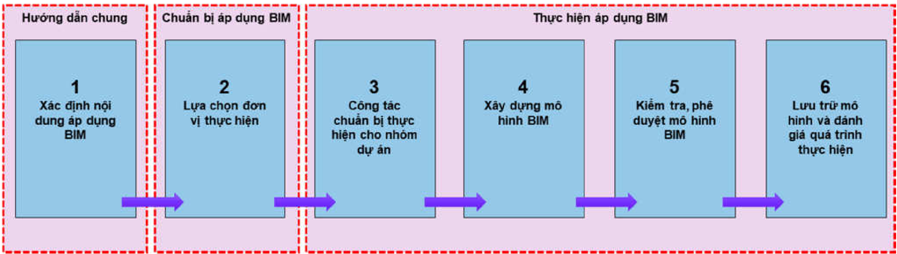

## 4.5.1 Xác đị nh n ộ i dung áp d ụ ng BIM

Ti ế n trình t ổ ng quát vi ệ c áp d ụ ng BIM

- -Ch ủ đầ u t ư c ă n c ứ vào chi ế n l ượ c phát tri ể n c ủ a ngành, đị a ph ươ ng ho ặ c c ủ a t ổ ch ứ c; các m ụ c tiêu c ầ n đạ t đượ c c ủ a d ự án và kh ả n ă ng đ áp ứ ng c ủ a công ngh ệ BIM để l ự a ch ọ n n ộ i dung áp d ụ ng BIM trong d ự án.
- -Ch ủ đầ u t ư chu ẩ n b ị Yêu c ầ u v ề thông tin trao đổ i (EIR) (l ồ ng ghép trong h ồ s ơ m ờ i th ầ u/ h ồ s ơ yêu c ầ u), trong đ ó xác đị nh rõ các yêu c ầ u v ề s ả n ph ẩ m, ti ế n độ bàn giao. Đơ n v ị cung c ấ p d ị ch vụ (có thể là nhà thầu tư vấn, thi công) căn cứ vào Yêu cầu về thông tin trao đổi để xây dựng Kế hoạch thực hiện BIM sơ bộ (pre-BEP) (lồng ghép trong Hồ sơ dự thầu/hồ sơ đề xuất) trình Chủ đầu tư xem xét.

## 4.5.2 L ự a ch ọ n đơ n v ị th ự c hi ệ n:

- -Tr ườ ng h ợ p c ầ n thi ế t Ch ủ đầ u t ư có th ể yêu c ầ u Đơ n vị cung cấp dịch vụ gửi một số mô hình mẫu mà đơn vị đã thực hiện để Chủ đầu tư xem xét và đ ánh giá thêm.

## 4.5.3 Công tác chu ẩ n b ị th ự c hi ệ n cho Nhóm d ự án:

- -Trên c ơ s ở đ ánh giá các gi ả i pháp đề xu ấ t, n ă ng l ự c c ủ a t ừ ng đơ n v ị c ấ p d ị ch v ụ , Ch ủ đầ u t ư s ẽ l ự a ch ọ n đơ n v ị th ự c hi ệ n BIM cho d ự án, ti ế n hành th ươ ng th ả o,  ký  k ế t  h ợ p đồ ng và hoàn thi ệ n  K ế ho ạ ch th ự c  hi ệ n  BIM (BEP).
- -Nhóm d ự án đượ c hi ể u là nhóm các cá nhân (bao g ồ m c ủ a ch ủ đầ u t ư /ban qu ả n lý d ự án, c ủ a t ư v ấ n, nhà th ầ u, và các đơ n v ị khác có liên quan) s ẽ ph ố i h ợ p chính để th ự c hi ệ n áp d ụ ng BIM trong d ự án
- -Sau khi đ ã th ố ng nh ấ t K ế ho ạ ch th ự c hi ệ n BIM (BEP), Ch ủ đầ u t ư , Đơ n v ị th ự c hi ệ n BIM và các bên liên quan t ổ ch ứ c thi ế t l ậ p các đ i ề u ki ệ n c ầ n

thi ế t cho vi ệ c tri ể n khai xây d ự ng và qu ả n lý mô hình BIM. Các công vi ệ c chính bao g ồ m:

+ T ổ ch ứ c đ ào t ạ o, ph ổ bi ế n các quy đị nh cho vi ệ c ph ố i h ợ p gi ữ a các bên tham gia;
+ Thi ế t l ậ p môi tr ườ ng làm vi ệ c chung (bao g ồ m xây d ự ng môi tr ườ ng d ữ li ệ u chung (CDE), các quy đị nh c ủ a vi ệ c ph ố i h ợ p,…);
+ Thi ế t l ậ p và th ố ng nh ấ t các bi ể u m ẫ u (b ả n v ẽ , công v ă n, tài li ệ u,…), các tiêu chu ẩ n h ướ ng d ẫ n áp d ụ ng trong d ự án.
- -Đơ n v ị th ự c hi ệ n đượ c l ự a ch ọ n s ử d ụ ng các công c ụ ,  h ướ ng d ẫ n, tiêu chu ẩ n đ ã th ố ng nh ấ t trong BEP để xây d ự ng mô hình BIM đ áp ứ ng yêu c ầ u c ủ a d ự án.

## 4.5.4 Xây d ự ng và Phát tri ể n và ứ ng d ụ ng mô hình BIM:

- -M ộ t s ố công c ụ để xây d ự ng mô hình BIM nh ư : Revit, Tekla Structures, Navisworks, Civil 3D,… ho ặ c các s ả n ph ẩ m khác có kh ả n ă ng t ạ o l ậ p mô hình đả m b ả o k ỹ thu ậ t t ươ ng t ự .
- -Đơ n v ị th ự c hi ệ n chuy ể n giao mô hình BIM ho ặ c t ừ ng ph ầ n c ủ a Mô hình cho Ch ủ đầ u t ư để xem xét và ch ấ p thu ậ n đư a vào s ử d ụ ng theo các m ố c th ờ i gian đ ã quy đị nh trong K ế ho ạ ch th ự c hi ệ n BIM (BEP).

## 4.5.5 Ki ể m tra, nghi ệ m thu mô hình BIM:

## 4.5.6 L ư u tr ữ mô hình và đ ánh giá quá trình th ự c hi ệ n:

## 5. M Ụ C TIÊU ÁP D Ụ NG BIM

- -Khi hoàn thành xây d ự ng mô hình BIM đ áp ứ ng các yêu c ầ u theo quy đị nh trong BEP, Ch ủ đầ u t ư t ổ ch ứ c l ư u tr ữ mô hình để s ử d ụ ng cho m ụ c đ ích c ụ th ể và h ỗ tr ợ các công vi ệ c ở giai đ o ạ n sau. Ch ủ đầ u t ư ph ố i h ợ p v ớ i các đơ n v ị liên quan t ổ ch ứ c đ ánh giá quá trình th ự c hi ệ n áp d ụ ng BIM để rút ra bài h ọ c khi tri ể n khai các d ự án ti ế p theo.

## 5.1 M ụ c tiêu chung

## 5.2 M ụ c tiêu c ụ th ể

Vi ệ c áp d ụ ng BIM vào d ự án đườ ng Vành đ ai 3 trong giai đ o ạ n thi ế t k ế k ỹ thu ậ t nh ằ m m ụ c tiêu t ố i ư u hóa thi ế t k ế , h ạ n ch ế sai sót, xung độ t t ạ i các v ị trí nút giao có tính ch ấ t ph ứ c t ạ p cao đồ ng th ờ i giúp đẩ y nhanh ti ế n độ th ự c hi ệ n gói th ầ u, d ữ li ệ u BIM ở b ướ c này chính là ngu ồ n d ữ li ệ u c ơ s ở cho công tác áp d ụ ng BIM ở các giai đ o ạ n ti ế p theo c ủ a d ự án.

Công tác ứ ng d ụ ng mô hình thông tin công trình (BIM) vào d ự án ở giai

## đ o ạ n thi ế t k ế k ỹ thu ậ t v ớ i các m ụ c tiêu c ụ th ể nh ư sau:

- -Mô hình hóa các h ạ ng m ụ c công trình để th ể hi ệ n tr ự c quan, giúp các thành viên tham gia d ự án hi ể u rõ khi th ả o lu ậ n, phân công các nhi ệ m v ụ ho ặ c l ự a ch ọ n các gi ả i pháp thi ế t k ế hi ệ u qu ả . Các bên liên quan d ự án hi ể u rõ v ề gi ả i pháp thi ế t k ế để ra các quy ế t đị nh cho phù h ợ p.
- -Xây d ự ng mô hình hi ệ n tr ạ ng làm c ơ s ở để ki ể m tra các v ấ n đề v ề vi ệ c đả m b ả o thông tin (thông tin v ề h ệ th ố ng h ạ t ầ ng hi ệ n h ữ u, thông tin v ề m ặ t b ằ ng thi công...), so sánh thay đổ i sau khi đầ u t ư xây d ự ng các h ạ ng m ụ c công trình, đồ ng th ờ i là c ơ s ở đ ánh giá ch ấ t l ượ ng các công vi ệ c th ự c hi ệ n ở giai đ o ạ n sau.
- -Xây d ự ng và s ử d ụ ng môi tr ườ ng d ữ li ệ u chung (CDE) để t ă ng hi ệ u qu ả công tác l ư u tr ữ và chia s ẻ thông tin b ằ ng đị nh d ạ ng k ỹ thu ậ t s ố đả m b ả o thu ậ n l ợ i trong vi ệ c ph ố i h ợ p các ho ạ t độ ng, ti ế t ki ệ m th ờ i gian chu ẩ n b ị tài li ệ u, trao đổ i thông tin d ự án.
- -Ki ể m soát kh ố i l ượ ng thi ế t k ế , tránh các sai sót do l ỗ i khách quan.
- -Phát hi ệ n, ki ể m soát xung độ t gi ữ a các b ộ môn thi ế t k ế , gi ữ a các h ạ t ầ ng làm m ớ i v ớ i các h ạ t ầ ng hi ệ n h ữ u,… d ẫ n đế n gi ả m vi ệ c thay đổ i ho ặ c đ i ề u ch ỉ nh, b ổ sung thi ế t k ế trong quá trình th ự c hi ệ n.
- -Ngu ồ n d ữ li ệ u ứ ng d ụ ng BIM trong giai đ o ạ n thi ế t k ế k ỹ thu ậ t t ạ o c ơ s ở cho công tác áp d ụ ng BIM cho các giai đ o ạ n thi ế t k ế b ả n v ẽ thi công, thi công và qu ả n lý v ậ n hành sau này c ủ a d ự án.

## 6.1 Nguyên t ắ c l ự a ch ọ n n ộ i dung áp d ụ ng BIM

## 6. PH Ạ M VI CÔNG VI Ệ C T Ư V Ấ N BIM

ứ

Ch ủ đầ u t ư c ă n c ứ vào các m ụ c tiêu c ầ n đạ t đượ c c ủ a d ự án và kh ả n ă ng đ áp ứ ng c ủ a công ngh ệ BIM để l ự a ch ọ n n ộ i dung áp d ụ ng BIM trong d ự án. độ M ụ c tiêu áp d ụ ộ ụ ề ă

| M c ư u tiên                         | M c tiêu áp d ng BIM                                                                                             | N i dung áp d ng BIM ti m n ng                                     |
|--------------------------------------|------------------------------------------------------------------------------------------------------------------|--------------------------------------------------------------------|
| Giai đ o ạ n thi ế t k ế k ỹ thu ậ t | Giai đ o ạ n thi ế t k ế k ỹ thu ậ t                                                                             | Giai đ o ạ n thi ế t k ế k ỹ thu ậ t                               |
| 1                                    | Mô hình hóa tr ự c quan, phát hi ệ n, ki ể m soát xung độ t gi ữ a các h ạ ng m ụ c, t ố i ư u hóa thi ế t k ế . | - Thi ế t k ế d ự a trên n ề n t ả ng BIM. - Đ ánh giá thi ế t k ế |
| 1                                    | Ki ể m soát kh ố i l ượ ng t ừ mô hình.                                                                          | - Thi ế t k ế d ự a trên n ề n t ả ng BIM.                         |

D Ự ÁN THÀNH PH Ầ N 1: XÂY D Ự NG ĐƯỜ NG VÀNH Đ AI 3 Đ O Ạ N QUA THÀNH PH Ố H Ồ CHÍ MINH (BAO G Ồ M C Ầ U KÊNH TH Ầ Y THU Ố C)

TÊN D Ự ÁN :

ĐỊ A Đ I Ể M :

THÀNH PH Ố TH Ủ ĐỨ C, HUY Ệ N C Ủ CHI, HÓC MÔN, BÌNH CHÁNH

H Ạ NG M Ụ C :

ĐỀ C ƯƠ NG Ứ NG D Ụ NG MÔ HÌNH THÔNG TIN CÔNG TRÌNH BIM GÓI TH Ầ U TV04

ă

|   1 | T ng c ng h p tác gi a các bên tham gia d ự án   | - Ph i h p 3D gi a các h ng m c, gi ữ a thi ế t k ế và hi ệ n h ữ u. - T ươ ng tác tr ự c tuy ế n thông qua môi tr ườ ng d ữ li ệ u chung (CDE).   |
|-----|--------------------------------------------------|----------------------------------------------------------------------------------------------------------------------------------------------------|
|   2 | Đ ánh giá hi ệ n tr ạ ng h ạ t ầ ng k ỹ thu ậ t  | - L ậ p mô hình hi ệ n tr ạ ng                                                                                                                     |

ườ

ợ

ữ

- Ph ố i h ợ p 3D gi ữ a các h ạ ng m ụ c, gi ữ a thi ế t k ế và hi ệ n h ữ u.

Ghi chú : 1: m ứ c độ ư u tiên cao, 2: m ứ c độ ư u tiên trung bình, 3: m ứ c độ ư u tiên th ấ p B ả ng: Phân tích n ộ i dung áp d ụ ng BIM giai đ o ạ n thi ế t k ế k ỹ thu ậ t

| N ộ i dung áp d ụ ng BIM                |   L i ích cho d ự án | Bên tham gia th ự c hi ệ n                                                                                    | Yêu c ầ u v ề n ă ng l ự c, kinh nghi ệ m, chi phí                                                                                                                                       | L ự a ch ọ n   |
|-----------------------------------------|----------------------|---------------------------------------------------------------------------------------------------------------|------------------------------------------------------------------------------------------------------------------------------------------------------------------------------------------|----------------|
| L ậ p mô hình hi ệ n tr ạ ng            |                    2 | Đơ n v ị kh ả o sát, đơ n v ị t ư v ấ n thi ế t k ế ( đơ n v ị t ạ o l ậ p mô hình BIM)                       | - Có kinh nghi ệ m xây d ự ng mô hình BIM cho gói th ầ u t ư v ấ n thi ế t k ế công trình h ạ t ầ ng k ỹ thu ậ t, giao thông; - S ử d ụ ng ph ầ n m ề m chuyên ngành (có b ả n quy ề n). | Áp d ụ ng      |
| Thi ế t k ế d ự a trên n ề n t ả ng BIM |                    1 | Các đơ n v ị t ư v ấ n thi ế t k ế ( đơ n v ị t ạ o l ậ p mô hình BIM)                                        | - Có kinh nghi ệ m xây d ự ng mô hình BIM cho gói th ầ u t ư v ấ n thi ế t k ế công trình h ạ t ầ ng k ỹ thu ậ t, giao thông; - S ử d ụ ng ph ầ n m ề m chuyên ngành (có b ả n quy ề n). | Áp d ụ ng      |
| Ph ố i h ợ p 3D                         |                    1 | Các đơ n v ị t ư v ấ n thi ế t k ế ( đơ n v ị t ạ o l ậ p mô hình BIM), th ẩ m tra, đơ n v ị qu ả n lý d ự án | - Cung c ấ p môi tr ườ ng d ữ li ệ u chung (CDE) t ừ khi b ắ t đầ u thi ế t k ế đế n khi bàn giao đư a công trình vào s ử d ụ ng;                                                        | Áp d ụ ng      |

ợ

Ư

ả

Ghi chú : 1: m ứ c độ ư u tiên cao, 2: m ứ c độ ư u tiên trung bình, 3: m ứ c độ ư u tiên th ấ p

|                                                                           |    |                                                                                                                                | - u tiên các gi i pháp không h ạ n ch ế v ề th ờ i gian s ử d ụ ng và s ố l ượ ng thành viên tham gia d ự án; - S ử d ụ ng ph ầ n m ề m chuyên ngành d ự ng BIM (có b ả n quy ề n).                                                           |           |
|---------------------------------------------------------------------------|----|--------------------------------------------------------------------------------------------------------------------------------|-----------------------------------------------------------------------------------------------------------------------------------------------------------------------------------------------------------------------------------------------|-----------|
| T ươ ng tác tr ự c tuy ế n thông qua môi tr ườ ng d ữ li ệ u chung (CDE). |  1 | Đơ n v ị qu ả n lý d ự án, T ư v ấ n giám sát, T ư v ấ n thi ế t k ế ( đơ n v ị t ạ o l ậ p mô hình BIM), T ư v ấ n th ẩ m tra | - Cung c ấ p môi tr ườ ng d ữ li ệ u chung t ừ khi b ắ t đầ u thi ế t k ế đế n khi bàn giao đư a công trình vào s ử d ụ ng; - Ư u tiên các gi ả i pháp không h ạ n ch ế v ề th ờ i gian s ử d ụ ng và s ố l ượ ng thành viên tham gia d ự án. | Áp d ụ ng |
| Qu ả n lý, s ố hóa d ữ li ệ u d ự án                                      |  1 | Đơ n v ị qu ả n lý d ự án, T ư v ấ n giám sát, T ư v ấ n thi ế t k ế ( đơ n v ị t ạ o l ậ p mô hình BIM), T ư v ấ n th ẩ m tra |                                                                                                                                                                                                                                               | Áp d ụ ng |

## 6.2 Các h ạ ng m ụ c áp d ụ ng BIM

Các h ạ ng m ụ c áp d ụ ng Mô hình thông tin công trình (BIM) bao g ồ m:

- -Đố i v ớ i gói th ầ u TV04: T ư v ấ n kh ả o sát, l ậ p TKKT - d ự toán, l ậ p BIM đ o ạ n Thành ph ố Th ủ Đứ c (t ừ đầ u tuy ế n đế n Km17+500) s ẽ áp d ụ ng Mô hình thông tin công trình (BIM) t ạ i v ị trí có tính ch ấ t ph ứ c t ạ p cao ở nút giao TP.HCM - Long Thành - D ầ u Giây (Km12+600 đế n Km13+800) dài kho ả ng 1,2Km.
- -H ệ th ố ng đườ ng giao thông (tuy ế n chính; đườ ng song hành):
+ X ử lý n ề n;

D Ự ÁN THÀNH PH Ầ N 1: XÂY D Ự NG ĐƯỜ NG VÀNH Đ AI 3 Đ O Ạ N QUA THÀNH PH Ố H Ồ CHÍ MINH (BAO G Ồ M C Ầ U KÊNH TH Ầ Y THU Ố C)

THÀNH PH Ố TH Ủ ĐỨ C, HUY Ệ N C Ủ CHI, HÓC MÔN, BÌNH CHÁNH

ĐỀ C ƯƠ NG Ứ NG D Ụ NG MÔ HÌNH THÔNG TIN CÔNG TRÌNH BIM GÓI TH Ầ U TV04

+ N ề n, m ặ t đườ ng;
+ Nút giao; + H ệ th ố ng ATGT (v ạ ch s ơ n, bi ể n báo, đ èn tín hi ệ u giao thông).
+ H ệ th ố ng thoát n ướ c m ư a:
- -H ệ th ố ng h ạ t ầ ng k ỹ thu ậ t (tuy ế n chính; đườ ng song hành):
-  Thoát n ướ c d ọ c;
-  Và các h ạ ng m ụ c khác.
-  Thoát n ướ c ngang;
+ Hào, Tuynel k ỹ thu ậ t;
- -S ố hóa d ữ li ệ u ch ỉ d ẫ n k ỹ thu ậ t, đ ính kèm m ộ t s ố thông tin c ầ n thi ế t vào mô hình trên CDE t ừ đ ó làm c ơ s ở cho công tác ứ ng d ụ ng BIM giai đ o ạ n thi công.
+ H ệ th ố ng chi ế u sáng (không bao g ồ m h ệ th ố ng đườ ng dây);
- -S ố hóa d ữ li ệ u quy trình b ả o trì t ừ đ ó làm c ơ s ở cho công tác ứ ng d ụ ng BIM giai đ o ạ n qu ả n lý v ậ n hành sau này.
- -H ệ th ố ng các công trình ch ủ y ế u trên tuy ế n:
- -Đ ính kèm m ộ t s ố thông tin b ả n tính c ầ n thi ế t vào các c ấ u ki ệ n mô hình trên CDE để ph ụ c v ụ công tác ki ể m tra, ki ể m toán khi c ầ n thi ế t.

ề

ề

ộ

- -L ư u ý: Không áp d ụ ng BIM cho các h ạ ng m ụ c h ệ th ố ng cây xanh, ITS, tr ạ m thu phí, d ự toán BIM 4D, t ổ ch ứ c thi công BIM 5D (Chi phí BIM không tính các h ạ ng m ụ c này)

| STT   | H ạ ng m ụ c                        | Lý trình             | Chi u dài (m)        | B r ng (m)           | Ghi chú                                                        |
|-------|-------------------------------------|----------------------|----------------------|----------------------|----------------------------------------------------------------|
| I     | C ầ u trong nút giao                | C ầ u trong nút giao | C ầ u trong nút giao | C ầ u trong nút giao | C ầ u trong nút giao                                           |
| 1     | C ầ u v ượ t V Đ 3 (nút giao HLD)   | Km13+220             | 220,4                | 20,5                 | D ầ m Super T, S ơ đồ nh ị p: 39,1+42,5+45,0+42,5+39,1         |
| 2     | C ầ u v ượ t nhánh B (nút giao HLD) | Km13+220             | 207,5                | 10,5                 | D ầ m b ả n r ỗ ng liên t ụ c, S ơ đồ nh ị p: 30,0+4x35,0+30,0 |
| 3     | C ầ u v ượ t nhánh C (nút giao HLD) | Km13+220             | 173,5                | 10,5                 | D ầ m b ả n r ỗ ng liên t ụ c, S ơ đồ nh ị p: 30,0+4x35,0+30,0 |

## 6.3 Ti ế n độ th ự c hi ệ n

Ti ế n độ th ự c hi ệ n công tác áp d ụ ng BIM ở b ướ c thi ế t k ế k ỹ thu ậ t: 5 tháng (130 ngày công).

## 7. GI Ả I PHÁP TH Ự C HI Ệ N - H Ồ S Ơ YÊU C Ầ U THÔNG TIN (EIR)

- -Nâng cao ch ấ t l ượ ng c ủ a h ồ s ơ thi ế t k ế tr ướ c khi ti ế n hành thi công và nâng cao ch ấ t l ượ ng d ự án nói chung. Ứ ng d ụ ng công ngh ệ m ớ i trong qu ả n lý công trình xây d ự ng.

H ồ s ơ yêu c ầ u thông tin (Exchange Information Requirements, vi ế t t ắ t là EIR) đượ c xây d ự ng c ă n c ứ trên các m ụ c tiêu c ụ th ể đượ c đề c ậ p t ạ i m ụ c II. M ụ c tiêu chung c ủ a h ồ s ơ yêu c ầ u thông tin nh ằ m đả m b ả o ứ ng d ụ ng BIM trong công tác thi ế t k ế k ỹ thu ậ t c ủ a d ự án đạ t đượ c các tiêu chí:

- -Đư a ra quy ế t đị nh nhanh chóng nh ờ vào tính tr ự c quan c ủ a mô hình BIM.
- -Ki ể m soát t ố t kh ố i l ượ ng, gi ả m chi phí phát sinh do các r ủ i ro v ề các s ự c ố , đ i ề u ch ỉ nh thi ế t k ế .
- -Nâng cao kh ả n ă ng ph ố i h ợ p gi ữ a các bên có liên quan để đả m b ả o x ử lý k ị p th ờ i nhanh chóng các tình hu ố ng.

## 7.1 Quy trình áp d ụ ng BIM giai đ o ạ n thi ế t k ế k ỹ thu ậ t

- -Độ i ng ũ thi ế t k ế ho ặ c t ư v ấ n l ậ p mô hình BIM xây d ự ng mô hình BIM theo t ừ ng gói th ầ u, b ộ môn, h ạ ng m ụ c công trình.
- -Thi ế t l ậ p K ế ho ạ ch th ự c hi ệ n BIM áp d ụ ng cho toàn d ự án tr ướ c khi mô hình hóa (K ế ho ạ ch th ự c hi ệ n BIM (BIM BEP) s ẽ đượ c th ự c hi ệ n ở gói th ầ u TV06 và áp d ụ ng cho công tác ứ ng d ụ ng BIM đố i v ớ i t ấ t c ả các gói th ầ u còn l ạ i c ủ a d ự án).
- -T ạ o các mô hình liên h ợ p và phát hi ệ n va ch ạ m, xung độ t.
- -N ộ p h ồ s ơ thi ế t k ế sau khi x ử lý các va ch ạ m, xung độ t theo các yêu c ầ u đượ c th ể hi ệ n trong K ế ho ạ ch  th ự c hi ệ n BIM (BEP).
- -Va ch ạ m, xung độ t s ẽ đượ c gi ả i quy ế t trong các cu ộ c h ọ p ph ố i h ợ p.

## 7.2 Vai trò trách nhi ệ m các bên

S ử d ụ ng ma tr ậ n RACI để phân ph ố i vai trò và trách nhi ệ m các bên tham gia nh ư trình bày trong các b ả ng bi ể u d ướ i đ ây:

Sau khi xác đị nh rõ các công tác qu ả n lý đượ c ứ ng d ụ ng BIM gi ữ a Ch ủ đầ u t ư và T ư v ấ n t ạ o l ậ p mô hình BIM. T ư v ấ n t ạ o l ậ p mô hình BIM đề xu ấ t vai trò và trách nhi ệ m c ủ a các bên có liên quan công tác qu ả n lý, theo tài li ệ u H ướ ng d ẫ n chung áp d ụ ng Mô hình thông tin công trình (BIM) - Quy ế t đị nh s ố 348/Q Đ -BXD ngày 02 tháng 4 n ă m 2021.

- -R (Responsible) = Ch ị u trách nhi ệ m th ự c hi ệ n nhi ệ m v ụ

- -A (Accountable) = Ch ị u trách nhi ệ m Phê duy ệ t - Phân công nhi ệ m v ụ và xác nh ậ n k ế t qu ả
- -I (Informed) = Có nhi ệ m v ụ báo cáo, chia s ẻ thông tin v ề nhi ệ m v ụ và/ho ặ c k ế t qu ả
- -C (Consulted)= Có nhi ệ m v ụ tham m ư u, cung c ấ p đầ u vào để hoàn thành nhi ệ m v ụ
- -* = nh ư yêu c ầ u.

| TRÁCH NHI Ệ M                                                                                                                                                              | Ch ủ đầ u t ư   | B ộ ph ậ n BIM   | B ộ ph ậ n thi ế t k ế   | T ư v ấ n th ẩ m tra   | S ở GTVT   |
|----------------------------------------------------------------------------------------------------------------------------------------------------------------------------|-----------------|------------------|--------------------------|------------------------|------------|
| Góp ý v ề các yêu c ầ u liên quan đế n CDE                                                                                                                                 | A               | C                |                          | R                      |            |
| Cung c ấ p CDE                                                                                                                                                             | A               | R                | I                        | I                      |            |
| Thi ế t l ậ p CDE                                                                                                                                                          | A               | R                | C                        | C                      |            |
| B ả o trì CDE                                                                                                                                                              | A               | R                | I                        | I                      |            |
| T ả i v ề /T ả i lên t ấ t c ả thông tin c ủ a d ự án                                                                                                                      | R               | R                | R                        |                        | R          |
| Đả m b ả o ph ầ n c ứ ng và ph ầ n m ề m c ầ n thi ế t đ ã đượ c thi ế t l ậ p trong các đơ n v ị để h ỗ tr ợ hi ệ u qu ả cho quá trình cung c ấ p s ả n ph ẩ m cho d ự án | R               | R                | R                        | R                      |            |
| Thi ế t l ậ p các yêu c ầ u c ủ a BIM cho d ự án                                                                                                                           | A               | R                | C                        | C                      | C          |
| Xây d ự ng, th ự c hi ệ n và c ậ p nh ậ t K ế ho ạ ch th ự c hi ệ n BIM (BEP)                                                                                              | A               | R                | C                        | C                      |            |
| Xây d ự ng và tri ể n khai k ế ho ạ ch chuy ể n giao thông tin                                                                                                             |                 | R                | C                        | C                      |            |
| Thu th ậ p và c ậ p nh ậ t K ế ho ạ ch chuy ể n giao thông tin t ổ ng th ể (MIDP).                                                                                         |                 | R                | C                        | C                      |            |
| H ướ ng d ẫ n các v ấ n đề liên quan đế n BIM và theo dõi các bên tham gia d ự án                                                                                          | I               | R                |                          |                        |            |
| Cung c ấ p các thông tin tham kh ả o (bao g ồ m d ữ li ệ u kh ả o sát và các mô hình hi ệ n tr ạ ng)                                                                       |                 | R                |                          |                        |            |

D Ự ÁN THÀNH PH Ầ N 1: XÂY D Ự NG ĐƯỜ NG VÀNH Đ AI 3 Đ O Ạ N QUA THÀNH PH Ố H Ồ CHÍ MINH (BAO G Ồ M C Ầ U KÊNH TH Ầ Y THU Ố C)

TÊN D Ự ÁN :

ĐỊ A Đ I Ể M :

THÀNH PH Ố TH Ủ ĐỨ C, HUY Ệ N C Ủ CHI, HÓC MÔN, BÌNH CHÁNH

H Ạ NG M Ụ C :

ĐỀ C ƯƠ NG Ứ NG D Ụ NG MÔ HÌNH THÔNG TIN CÔNG TRÌNH BIM GÓI TH Ầ U TV04

ạ

ồ

ệ

ọ

độ

ố

ệ

ướ

ụ

| T o mô hình bao g m h t a g c và h l i tr c để s ử d ụ ng ph ổ bi ế n cho t ấ t c ả các đơ n v ị tham gia d ự án ế      | A   | R   |    |    |    |
|-------------------------------------------------------------------------------------------------------------------------|-----|-----|----|----|----|
| Cung c ấ p mô hình phù h ợ p v ớ i các yêu c ầ u trong K ho ạ ch chuy ể n giao thông tin t ổ ng th ể (MIDP)             |     | R   | C  | C  |    |
| Chia s ẻ mô hình thông tin BIM ph ụ c v ụ cho ph ố i h ợ p                                                              |     | R   | C  | C  |    |
| Tri ể n khai K ế ho ạ ch th ự c hi ệ n BIM (BEP) trong đơ n v ị                                                         |     | R   | C  | C  |    |
| T ạ o báo cáo phát hi ệ n xung độ t t ừ mô hình liên k ế t                                                              |     | R   | C  | C  |    |
| Xác đị nh các d ữ li ệ u c ầ n thi ế t (bao g ồ m m ụ c đ ích và th ờ i gian chuy ể n giao)                             | A   | I   | I  | C  | C  |
| Kh ở i t ạ o, thu th ậ p và l ư u tr ữ các thông tin theo yêu c ầ u                                                     |     | R   | R  | R  |    |
| Xem xét và ch ấ p thu ậ n d ữ li ệ u đượ c chuy ể n giao tr ướ c khi đệ trình                                           | A   | C   | C  | R  |    |
| Báo cáo các r ủ i ro có th ể d ự a trên mô hình BIM và chia s ẻ thông qua Môi tr ườ ng d ữ li ệ u chung (CDE)           | C   | C   | C  | C  | C  |
| Đả m b ả o t ấ t c ả các thông tin đ áp ứ ng yêu c ầ u (ch ấ t l ượ ng và s ố l ượ ng)                                  |     | R   | R  | R  |    |
| Ki ể m tra và ph ố i h ợ p mô hình, bao g ồ m công tác phát hi ệ n xung độ t đầ y đủ và liên t ụ c theo k ế ho ạ ch BIM |     | R   | C  | C  |    |
| Báo cáo chung v ề ch ấ t l ượ ng mô hình v ề m ặ t hình h ọ c, v ậ t li ệ u và siêu d ữ li ệ u                          |     |     |    | R  |    |
| Báo cáo v ề s ự tuân th ủ K ế ho ạ ch th ự c hi ệ n BIM (BEP)                                                           |     |     |    | R  |    |
| Xem xét d ữ li ệ u nh ậ n đượ c và so sánh v ớ i yêu c ầ u trong h ồ s ơ Yêu c ầ u v ề thông tin (EIR)                  |     | R   | R  | R  |    |
| S ử d ụ ng mô hình trong các cu ộ c h ọ p gi ữ a các bên liên quan                                                      |     | R   | R  | R  |    |
| T ổ ch ứ c các cu ộ c h ọ p c ủ a nhóm BIM                                                                              |     | R   | I  | I  |    |
| T ổ ch ứ c các cu ộ c h ọ p chính, giai đ o ạ n v ề BIM                                                                 | C   | R   | C  | C  |    |
| T ổ ch ứ c các cu ộ c h ọ p g ặ p g ỡ h ọ c t ậ p/ đ ào t ạ o                                                           | R   | C   | C  | C  | C  |
| T ổ ch ứ c các cu ộ c h ọ p rút kinh nghi ệ m                                                                           | I   | R   | R  | R  |    |

## 7.3 Quy trình ph ố i h ợ p BIM gi ữ a các bên

Hình 1. Quy trình ph ố i h ợ p BIM giai đ o ạ n thi ế t k ế k ỹ thu ậ t

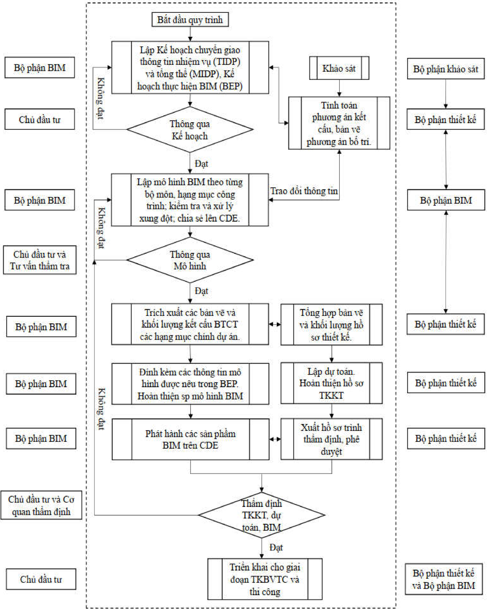

## 7.4 Quy trình ki ể m soát va ch ạ m các h ạ ng m ụ c:

- -Ki ể m tra giao c ắ t n ộ i b ộ trong các h ạ ng m ụ c: Các b ộ ph ậ n c ấ u ki ệ n c ủ a t ừ ng h ạ ng m ụ c s ẽ đượ c t ổ ng h ợ p l ạ i và x ử lý giao c ắ t tr ướ c khi ti ế n hành xây d ự ng mô hình t ổ ng h ợ p x ử lý giao c ắ t gi ữ a các h ạ ng m ụ c, b ộ môn v ớ i nhau:

Đố i v ớ i d ự án đườ ng Vành đ ai 3 là d ự án giao thông quan tr ọ ng bao g ồ m r ấ t nhi ề u gói th ầ u và h ạ ng m ụ c k ế t c ấ u ph ứ c t ạ p vì v ậ y công tác phát hi ệ n và x ử lý giao c ắ t  gi ữ a các h ạ ng m ụ c, c ấ u ki ệ n n ế u s ử d ụ ng thi ế t k ế truy ề n th ố ng s ẽ r ấ t khó kh ă n. Vi ệ c áp d ụ ng BIM s ẽ giúp công tác phát hi ệ n và x ử lý giao c ắ t tr ở nên hi ệ u qu ả và tri ệ t để h ơ n, sau đ ây là quy trình ki ể m soát va ch ạ m các h ạ ng m ụ c, b ộ môn:

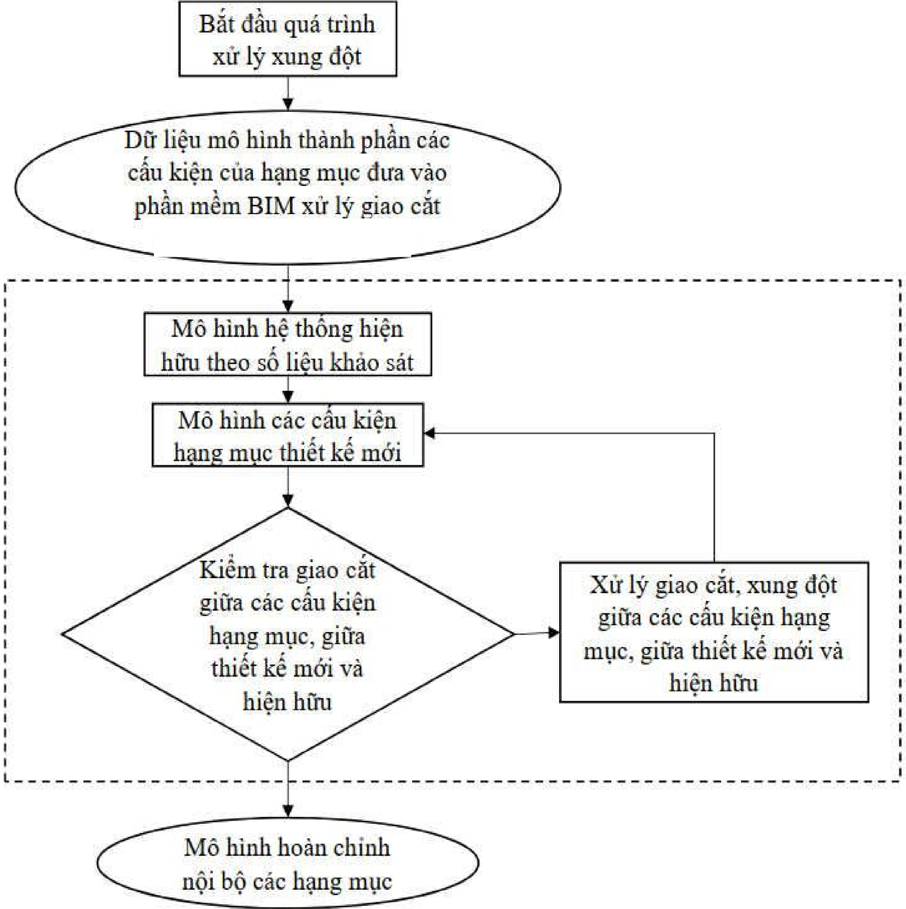

- -Ki ể m tra và x ử lý giao c ắ t các h ệ th ố ng h ạ t ầ ng k ỹ thu ậ t hi ệ n h ữ u, di d ờ i, thi ế t k ế m ớ i và h ệ th ố ng n ề n, m ặ t đườ ng, nút giao:

D Ự ÁN THÀNH PH Ầ N 1: XÂY D Ự NG ĐƯỜ NG VÀNH Đ AI 3 Đ O Ạ N QUA THÀNH PH Ố H Ồ CHÍ MINH (BAO G Ồ M C Ầ U KÊNH TH Ầ Y THU Ố C)

TÊN D Ự ÁN :

ĐỊ A Đ I Ể M :

THÀNH PH Ố TH Ủ ĐỨ C, HUY Ệ N C Ủ CHI, HÓC MÔN, BÌNH CHÁNH

H Ạ NG M Ụ C :

ĐỀ C ƯƠ NG Ứ NG D Ụ NG MÔ HÌNH THÔNG TIN CÔNG TRÌNH BIM GÓI TH Ầ U TV04

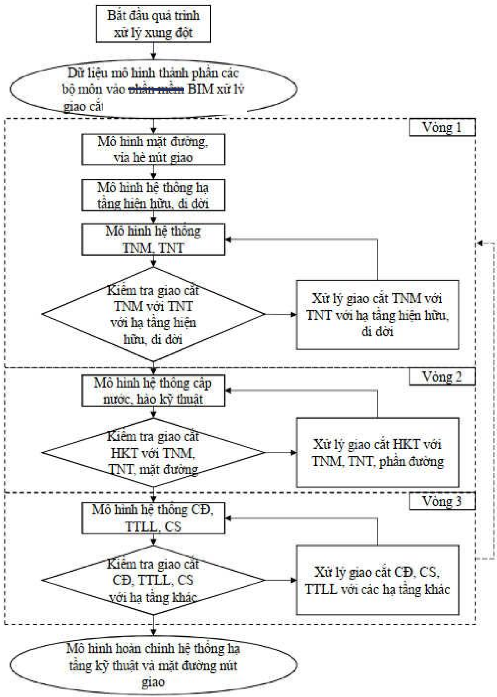

## Ghi chú:

+ TNM: Thoát n

+ TNT: Thoát n

ướ c th ả i;

+ CS: Chi ế

u sáng;

+ HKT: Hào k thu t;

ỹ ậ

+ TTLL: Thông tin liên l

ướ c m ư a;

+ C Đ : C

ấ p đ i ệ n;

- -Ki ể m tra giao c ắ t gi ữ a h ệ th ố ng h ạ t ầ ng k ỹ thu ậ t và các h ạ ng m ụ c k ế t c ấ u công trình khác (c ầ u, h ầ m,…); gi ữ a h ệ th ố ng trên h ạ t ầ ng đườ ng cao t ố c và h ệ th ố ng trên đườ ng song hành; gi ữ a các gói th ầ u thu ộ c d ự án:

ạ c D Ự ÁN THÀNH PH Ầ N 1: XÂY D Ự NG ĐƯỜ NG VÀNH Đ AI 3 Đ O Ạ N QUA THÀNH PH Ố H Ồ CHÍ MINH (BAO G Ồ M C Ầ U KÊNH TH Ầ Y THU Ố C)

THÀNH PH Ố TH Ủ ĐỨ C, HUY Ệ N C Ủ CHI, HÓC MÔN, BÌNH CHÁNH

ĐỀ C ƯƠ NG Ứ NG D Ụ NG MÔ HÌNH THÔNG TIN CÔNG TRÌNH BIM GÓI TH Ầ U TV04

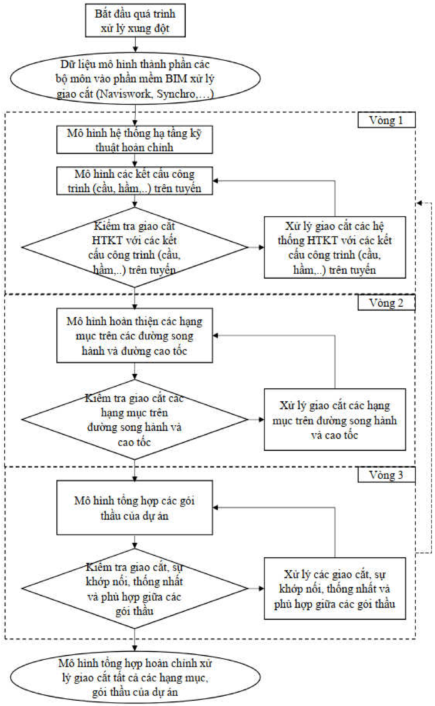

D Ự ÁN THÀNH PH Ầ N 1: XÂY D Ự NG ĐƯỜ NG VÀNH Đ AI 3 Đ O Ạ N QUA THÀNH PH Ố H Ồ CHÍ MINH (BAO G Ồ M C Ầ U KÊNH TH Ầ Y THU Ố C)

THÀNH PH Ố TH Ủ ĐỨ C, HUY Ệ N C Ủ CHI, HÓC MÔN, BÌNH CHÁNH

H Ạ NG M Ụ C :

ĐỀ C ƯƠ NG Ứ NG D Ụ NG MÔ HÌNH THÔNG TIN CÔNG TRÌNH BIM GÓI TH Ầ U TV04

## 7.5 Yêu c ầ u v ề s ả n ph ẩ m và k ỹ thu ậ t

- -H ồ s ơ yêu c ầ u thông tin đượ c l ậ p ra theo các n ộ i dung chính v ề s ả n ph ẩ m, k ỹ thu ậ t và qu ả n lý c ụ th ể nh ư sau:
- -M ứ c độ phát tri ể n thông tin các c ấ u ki ệ n, h ạ ng m ụ c tham kh ả o Quy ế t đị nh s ố 347/Q Đ -BXD ngày 02 tháng 4 n ă m 2021 c ủ a BXD ở giai đ o ạ n b ướ c thi ế t k ế k ỹ thu ậ t.

## 7.5.1 K ế ho ạ ch chuy ể n giao thông tin nhi ệ m v ụ (TIDP)

| STT   | M Ố C CÔNG TÁC                                                                                                                                                                                                                             | Ứ NG D Ụ NG                                                                                                                                                                                                                                | NH D Ạ NG D Ữ LI Ệ U G Ố C                                                                                                                                                                                                                 | NH D Ạ NG TRAO ĐỔ I CHUNG                                                                                                                                                                                                                  | M Ứ C ĐỘ CHI TI Ế T LOD                                                                                                                                                                                                                    | CÁC CH Ứ C N Ă NG CDE                                                                                                                                                                                                                      | THÔNG TIN TRAO ĐỔ I                                                                                                                                                                                                                        |
|-------|--------------------------------------------------------------------------------------------------------------------------------------------------------------------------------------------------------------------------------------------|--------------------------------------------------------------------------------------------------------------------------------------------------------------------------------------------------------------------------------------------|--------------------------------------------------------------------------------------------------------------------------------------------------------------------------------------------------------------------------------------------|--------------------------------------------------------------------------------------------------------------------------------------------------------------------------------------------------------------------------------------------|--------------------------------------------------------------------------------------------------------------------------------------------------------------------------------------------------------------------------------------------|--------------------------------------------------------------------------------------------------------------------------------------------------------------------------------------------------------------------------------------------|--------------------------------------------------------------------------------------------------------------------------------------------------------------------------------------------------------------------------------------------|
| I     | Ph ầ n chung ( Để đả m b ả o tính th ố ng nh ấ t trong công tác ứ ng d ụ ng BIM c ủ a d ự án, m ụ c này s ẽ đượ c th ự c hi ệ n trong ph ạ m vi công vi ệ c gói th ầ u TV06 và áp d ụ ng chung cho các gói th ầ u còn l ạ i c ủ a d ự án). | Ph ầ n chung ( Để đả m b ả o tính th ố ng nh ấ t trong công tác ứ ng d ụ ng BIM c ủ a d ự án, m ụ c này s ẽ đượ c th ự c hi ệ n trong ph ạ m vi công vi ệ c gói th ầ u TV06 và áp d ụ ng chung cho các gói th ầ u còn l ạ i c ủ a d ự án). | Ph ầ n chung ( Để đả m b ả o tính th ố ng nh ấ t trong công tác ứ ng d ụ ng BIM c ủ a d ự án, m ụ c này s ẽ đượ c th ự c hi ệ n trong ph ạ m vi công vi ệ c gói th ầ u TV06 và áp d ụ ng chung cho các gói th ầ u còn l ạ i c ủ a d ự án). | Ph ầ n chung ( Để đả m b ả o tính th ố ng nh ấ t trong công tác ứ ng d ụ ng BIM c ủ a d ự án, m ụ c này s ẽ đượ c th ự c hi ệ n trong ph ạ m vi công vi ệ c gói th ầ u TV06 và áp d ụ ng chung cho các gói th ầ u còn l ạ i c ủ a d ự án). | Ph ầ n chung ( Để đả m b ả o tính th ố ng nh ấ t trong công tác ứ ng d ụ ng BIM c ủ a d ự án, m ụ c này s ẽ đượ c th ự c hi ệ n trong ph ạ m vi công vi ệ c gói th ầ u TV06 và áp d ụ ng chung cho các gói th ầ u còn l ạ i c ủ a d ự án). | Ph ầ n chung ( Để đả m b ả o tính th ố ng nh ấ t trong công tác ứ ng d ụ ng BIM c ủ a d ự án, m ụ c này s ẽ đượ c th ự c hi ệ n trong ph ạ m vi công vi ệ c gói th ầ u TV06 và áp d ụ ng chung cho các gói th ầ u còn l ạ i c ủ a d ự án). | Ph ầ n chung ( Để đả m b ả o tính th ố ng nh ấ t trong công tác ứ ng d ụ ng BIM c ủ a d ự án, m ụ c này s ẽ đượ c th ự c hi ệ n trong ph ạ m vi công vi ệ c gói th ầ u TV06 và áp d ụ ng chung cho các gói th ầ u còn l ạ i c ủ a d ự án). |
| 1     | L ự a ch ọ n gi ả i pháp Môi tr ườ ng d ữ li ệ u chung (CDE). Thi ế t l ậ p ho ạ t độ ng và phân quy ề n trên CDE cho toàn b ộ d ự án. (Yêu c ầ u c ụ th ể và n ộ i dung chi ti ế t c ủ a CDE xem ở m ụ c 7.6.3 và m ụ c 8.3).             | L ự a ch ọ n gi ả i pháp Môi tr ườ ng d ữ li ệ u chung (CDE). Thi ế t l ậ p ho ạ t độ ng và phân quy ề n trên CDE cho toàn b ộ d ự án. (Yêu c ầ u c ụ th ể và n ộ i dung chi ti ế t c ủ a CDE xem ở m ụ c 7.6.3 và m ụ c 8.3).             | L ự a ch ọ n gi ả i pháp Môi tr ườ ng d ữ li ệ u chung (CDE). Thi ế t l ậ p ho ạ t độ ng và phân quy ề n trên CDE cho toàn b ộ d ự án. (Yêu c ầ u c ụ th ể và n ộ i dung chi ti ế t c ủ a CDE xem ở m ụ c 7.6.3 và m ụ c 8.3).             | L ự a ch ọ n gi ả i pháp Môi tr ườ ng d ữ li ệ u chung (CDE). Thi ế t l ậ p ho ạ t độ ng và phân quy ề n trên CDE cho toàn b ộ d ự án. (Yêu c ầ u c ụ th ể và n ộ i dung chi ti ế t c ủ a CDE xem ở m ụ c 7.6.3 và m ụ c 8.3).             | L ự a ch ọ n gi ả i pháp Môi tr ườ ng d ữ li ệ u chung (CDE). Thi ế t l ậ p ho ạ t độ ng và phân quy ề n trên CDE cho toàn b ộ d ự án. (Yêu c ầ u c ụ th ể và n ộ i dung chi ti ế t c ủ a CDE xem ở m ụ c 7.6.3 và m ụ c 8.3).             | L ự a ch ọ n gi ả i pháp Môi tr ườ ng d ữ li ệ u chung (CDE). Thi ế t l ậ p ho ạ t độ ng và phân quy ề n trên CDE cho toàn b ộ d ự án. (Yêu c ầ u c ụ th ể và n ộ i dung chi ti ế t c ủ a CDE xem ở m ụ c 7.6.3 và m ụ c 8.3).             | L ự a ch ọ n gi ả i pháp Môi tr ườ ng d ữ li ệ u chung (CDE). Thi ế t l ậ p ho ạ t độ ng và phân quy ề n trên CDE cho toàn b ộ d ự án. (Yêu c ầ u c ụ th ể và n ộ i dung chi ti ế t c ủ a CDE xem ở m ụ c 7.6.3 và m ụ c 8.3).             |
| 2     | Xây d ự ng k ế ho ạ ch th ự c hi ệ n BIM chi ti ế t (BEP) áp d ụ ng cho toàn b ộ d ự án.                                                                                                                                                   | Microsoft Office                                                                                                                                                                                                                           | *.docx; *.xlsx; *.ppt; *.mpp …                                                                                                                                                                                                             | *.pdf                                                                                                                                                                                                                                      |                                                                                                                                                                                                                                            | - Kho l ư u tr ữ tài li ệ u, quy trình, quy chu ẩ n. - Cách th ứ c chia s ẻ cho các bên liên quan. Nh ậ n các ph ả n h ồ i và thông báo khi có thay đổ i.                                                                                  | - Các tài li ệ u, bi ể u m ẫ u, quy trình. - Các thông tin ph ả n h ồ i, trao đổ i thông qua CDE.                                                                                                                                          |
| 3     | Xây d ự ng các quy trình th ự c hi ệ n mô hình hóa, ph ố i h ợ p áp d ụ ng chung cho d ự án: - Đặ t tên file, c ấ u ki ệ n mô hình.                                                                                                        | Microsoft Office                                                                                                                                                                                                                           | *.docx; *.xlsx; *.ppt; *.mpp …                                                                                                                                                                                                             | *.pdf                                                                                                                                                                                                                                      |                                                                                                                                                                                                                                            | - Kho l ư u tr ữ tài li ệ u, quy trình, quy chu ẩ n. - Cách th ứ c chia s ẻ cho các bên liên quan. Nh ậ n các ph ả n h ồ i và thông báo khi có thay đổ i.                                                                                  | - Các tài li ệ u, bi ể u m ẫ u, quy trình. - Các thông tin ph ả n h ồ i, trao đổ i thông qua CDE.                                                                                                                                          |

ĐỊ

ĐỊ

TÊN D Ự ÁN :

D Ự ÁN THÀNH PH Ầ N 1: XÂY D Ự NG ĐƯỜ NG VÀNH Đ AI 3 Đ O Ạ N QUA THÀNH PH Ố H Ồ CHÍ MINH (BAO G Ồ M C Ầ U KÊNH TH Ầ Y THU Ố C)

ĐỊ A Đ I Ể M :

THÀNH PH Ố TH Ủ ĐỨ C, HUY Ệ N C Ủ CHI, HÓC MÔN, BÌNH CHÁNH

H Ạ NG M Ụ C :

ĐỀ C ƯƠ NG Ứ NG D Ụ NG MÔ HÌNH THÔNG TIN CÔNG TRÌNH BIM GÓI TH Ầ U TV04

ử

ụ

ố

|     | - Quy trình s d ng và ph i h ợ p gi ữ a các bên trên CDE. - Quy trình mô hình hóa thông tin công trình. - Quy trình th ể hi ệ n b ả n v ẽ đượ c trích xu ấ t t ừ mô hình. - Quy trình ki ể m tra và đả m b ả o ch ấ t l ượ ng k ỹ thu ậ t c ủ a   |                                                                                                                                       |                                                                                                                                       |                                                                                                                                       |                                                                                                                                       |                                                                                                                                       | mô hình.                                                                                                                              |                                                                                                                                       |
|-----|---------------------------------------------------------------------------------------------------------------------------------------------------------------------------------------------------------------------------------------------------|---------------------------------------------------------------------------------------------------------------------------------------|---------------------------------------------------------------------------------------------------------------------------------------|---------------------------------------------------------------------------------------------------------------------------------------|---------------------------------------------------------------------------------------------------------------------------------------|---------------------------------------------------------------------------------------------------------------------------------------|---------------------------------------------------------------------------------------------------------------------------------------|---------------------------------------------------------------------------------------------------------------------------------------|
| II  | Gói th ầ u TV04: T ư v ấ n Kh ả o sát, l ậ p TKKT - d ự toán, l ậ p BIM đ o ạ n thành ph ố Th ủ Đứ c (t ừ đầ u tuy ế n đế n Km17+500)                                                                                                             | Gói th ầ u TV04: T ư v ấ n Kh ả o sát, l ậ p TKKT - d ự toán, l ậ p BIM đ o ạ n thành ph ố Th ủ Đứ c (t ừ đầ u tuy ế n đế n Km17+500) | Gói th ầ u TV04: T ư v ấ n Kh ả o sát, l ậ p TKKT - d ự toán, l ậ p BIM đ o ạ n thành ph ố Th ủ Đứ c (t ừ đầ u tuy ế n đế n Km17+500) | Gói th ầ u TV04: T ư v ấ n Kh ả o sát, l ậ p TKKT - d ự toán, l ậ p BIM đ o ạ n thành ph ố Th ủ Đứ c (t ừ đầ u tuy ế n đế n Km17+500) | Gói th ầ u TV04: T ư v ấ n Kh ả o sát, l ậ p TKKT - d ự toán, l ậ p BIM đ o ạ n thành ph ố Th ủ Đứ c (t ừ đầ u tuy ế n đế n Km17+500) | Gói th ầ u TV04: T ư v ấ n Kh ả o sát, l ậ p TKKT - d ự toán, l ậ p BIM đ o ạ n thành ph ố Th ủ Đứ c (t ừ đầ u tuy ế n đế n Km17+500) | Gói th ầ u TV04: T ư v ấ n Kh ả o sát, l ậ p TKKT - d ự toán, l ậ p BIM đ o ạ n thành ph ố Th ủ Đứ c (t ừ đầ u tuy ế n đế n Km17+500) | Gói th ầ u TV04: T ư v ấ n Kh ả o sát, l ậ p TKKT - d ự toán, l ậ p BIM đ o ạ n thành ph ố Th ủ Đứ c (t ừ đầ u tuy ế n đế n Km17+500) |
| 1   | Mô hình hi ệ n tr ạ ng trong ph ạ m vi áp d ụ ng BIM                                                                                                                                                                                              | S ử d ụ ng các ứ ng d ụ ng phù h ợ p đả m b ả o các y ế t ố sau: - S ả n ph ẩ mô hóa th ủ m ứ c phát tri ể thông                      | u m hình tuân theo độ n tin (LOD) đượ đề                                                                                              | đượ c l ự a ch ọ n (ph ả i đượ c th ể hi ệ n c ụ th ể trong K ế ho ạ ch th ự c ệ                                                      | 250                                                                                                                                   | - L ư u tr ữ và trao đổ i thông tin trong quá trình thi ế t k ế , th ẩ m tra.                                                         | - Các mô hình thành ph ầ n. - Các thông tin ph ả n h ồ i, trao đổ i.                                                                  |                                                                                                                                       |
| 2   | Mô hình hóa h ệ th ố ng đườ ng giao thông và h ạ t ầ ng k ỹ thu ậ t trong ph ạ m vi gói th ầ u. (tuy ế n chính và đườ ng song hành)                                                                                                               | S ử d ụ ng các ứ ng d ụ ng phù h ợ p đả m b ả o các y ế t ố sau: - S ả n ph ẩ mô hóa th ủ m ứ c phát tri ể thông                      | u m hình tuân theo độ n tin (LOD) đượ đề                                                                                              | đượ c l ự a ch ọ n (ph ả i đượ c th ể hi ệ n c ụ th ể trong K ế ho ạ ch th ự c ệ                                                      | 300~350                                                                                                                               | - L ư u tr ữ và trao đổ i thông tin trong quá trình thi ế t k ế , th ẩ m tra.                                                         | - Các mô hình thành ph ầ n. - Các thông tin ph ả n h ồ i, trao đổ i.                                                                  |                                                                                                                                       |
| 2.1 | X ử lý n ề n, k ế t c ấ u n ề n đườ ng.                                                                                                                                                                                                           | S ử d ụ ng các ứ ng d ụ ng phù h ợ p đả m b ả o các y ế t ố sau: - S ả n ph ẩ mô hóa th ủ m ứ c phát tri ể thông                      | u m hình tuân theo độ n tin (LOD) đượ đề                                                                                              | đượ c l ự a ch ọ n (ph ả i đượ c th ể hi ệ n c ụ th ể trong K ế ho ạ ch th ự c ệ                                                      | 300                                                                                                                                   | - L ư u tr ữ và trao đổ i thông tin trong quá trình thi ế t k ế , th ẩ m tra.                                                         | - Các mô hình thành ph ầ n. - Các thông tin ph ả n h ồ i, trao đổ i.                                                                  |                                                                                                                                       |
| 2.2 | K ế t c ấ u m ặ t đườ ng, nút giao.                                                                                                                                                                                                               | S ử d ụ ng các ứ ng d ụ ng phù h ợ p đả m b ả o các y ế t ố sau: - S ả n ph ẩ mô hóa th ủ m ứ c phát tri ể thông                      | u m hình tuân theo độ n tin (LOD) đượ đề                                                                                              | đượ c l ự a ch ọ n (ph ả i đượ c th ể hi ệ n c ụ th ể trong K ế ho ạ ch th ự c ệ                                                      | 350                                                                                                                                   | - L ư u tr ữ và trao đổ i thông tin trong quá trình thi ế t k ế , th ẩ m tra.                                                         | - Các mô hình thành ph ầ n. - Các thông tin ph ả n h ồ i, trao đổ i.                                                                  |                                                                                                                                       |
| 2.3 | H ệ th ố ng ATGT (v ạ ch s ơ n, bi ể n báo, đ èn tín hi ệ u giao thông).                                                                                                                                                                          | S ử d ụ ng các ứ ng d ụ ng phù h ợ p đả m b ả o các y ế t ố sau: - S ả n ph ẩ mô hóa th ủ m ứ c phát tri ể thông                      | u m hình tuân theo độ n tin (LOD) đượ đề                                                                                              | đượ c l ự a ch ọ n (ph ả i đượ c th ể hi ệ n c ụ th ể trong K ế ho ạ ch th ự c ệ                                                      | 300                                                                                                                                   | - L ư u tr ữ và trao đổ i thông tin trong quá trình thi ế t k ế , th ẩ m tra.                                                         | - Các mô hình thành ph ầ n. - Các thông tin ph ả n h ồ i, trao đổ i.                                                                  |                                                                                                                                       |
| 2.4 | H ệ th ố ng thoát n ướ c, hào k ỹ thu ậ t                                                                                                                                                                                                         | S ử d ụ ng các ứ ng d ụ ng phù h ợ p đả m b ả o các y ế t ố sau: - S ả n ph ẩ mô hóa th ủ m ứ c phát tri ể thông                      | u m hình tuân theo độ n tin (LOD) đượ đề                                                                                              | đượ c l ự a ch ọ n (ph ả i đượ c th ể hi ệ n c ụ th ể trong K ế ho ạ ch th ự c ệ                                                      | 300                                                                                                                                   | - L ư u tr ữ và trao đổ i thông tin trong quá trình thi ế t k ế , th ẩ m tra.                                                         | - Các mô hình thành ph ầ n. - Các thông tin ph ả n h ồ i, trao đổ i.                                                                  |                                                                                                                                       |

ĐỊ A Đ I Ể M :

THÀNH PH Ố TH Ủ ĐỨ C, HUY Ệ N C Ủ CHI, HÓC MÔN, BÌNH CHÁNH

H Ạ NG M Ụ C :

ĐỀ C ƯƠ NG Ứ NG D Ụ NG MÔ HÌNH THÔNG TIN CÔNG TRÌNH BIM GÓI TH Ầ U TV04

ệ

ố

ạ

ầ

ỹ

Đả

ả

|   2.5 | Các h th ng h t ng k thu ậ t khác (t ủ đ i ệ n, chi ế u sáng)                                | - m kh ả xu ấ t hình đượ c đ uôi d ạ ng đổ i mà làm đổ i m ấ t đ tính h ọ c tr ườ ng thông b ắ t c ầ n kèm mô theo ế   | b o n ă ng mô ra các đị nh trao chung không thay (ho ặ c i) đặ c hình và các   | BIM (BEP))   |   300 | - Mô hình t ổ ng h ợ p đượ c l ư u tr ữ tr ự c tuy ế n, tích h ợ p thông tin phi   |                                                                                                |
|-------|----------------------------------------------------------------------------------------------|------------------------------------------------------------------------------------------------------------------------|--------------------------------------------------------------------------------|--------------|-------|------------------------------------------------------------------------------------|------------------------------------------------------------------------------------------------|
|     3 | Các công trình c ầ u, h ầ m áp d ụ ng BIM                                                    | - m kh ả xu ấ t hình đượ c đ uôi d ạ ng đổ i mà làm đổ i m ấ t đ tính h ọ c tr ườ ng thông b ắ t c ầ n kèm mô theo ế   | b o n ă ng mô ra các đị nh trao chung không thay (ho ặ c i) đặ c hình và các   | BIM (BEP))   |   350 | - Mô hình t ổ ng h ợ p đượ c l ư u tr ữ tr ự c tuy ế n, tích h ợ p thông tin phi   |                                                                                                |
|   3.1 | C ầ u v ượ t V Đ 3 (nút giao HLD)                                                            | - m kh ả xu ấ t hình đượ c đ uôi d ạ ng đổ i mà làm đổ i m ấ t đ tính h ọ c tr ườ ng thông b ắ t c ầ n kèm mô theo ế   | b o n ă ng mô ra các đị nh trao chung không thay (ho ặ c i) đặ c hình và các   | BIM (BEP))   |   350 | - Mô hình t ổ ng h ợ p đượ c l ư u tr ữ tr ự c tuy ế n, tích h ợ p thông tin phi   |                                                                                                |
|   3.2 | C ầ u v ượ t nhánh B (nút giao HLD)                                                          | - m kh ả xu ấ t hình đượ c đ uôi d ạ ng đổ i mà làm đổ i m ấ t đ tính h ọ c tr ườ ng thông b ắ t c ầ n kèm mô theo ế   | b o n ă ng mô ra các đị nh trao chung không thay (ho ặ c i) đặ c hình và các   | BIM (BEP))   |   350 | - Mô hình t ổ ng h ợ p đượ c l ư u tr ữ tr ự c tuy ế n, tích h ợ p thông tin phi   |                                                                                                |
|   3.3 | C ầ u v ượ t nhánh C (nút giao HLD)                                                          | - m kh ả xu ấ t hình đượ c đ uôi d ạ ng đổ i mà làm đổ i m ấ t đ tính h ọ c tr ườ ng thông b ắ t c ầ n kèm mô theo ế   | b o n ă ng mô ra các đị nh trao chung không thay (ho ặ c i) đặ c hình và các   | BIM (BEP))   |   350 | - Mô hình t ổ ng h ợ p đượ c l ư u tr ữ tr ự c tuy ế n, tích h ợ p thông tin phi   |                                                                                                |
|     4 | Xây d ự ng mô hình t ổ ng h ợ p, ph ố i h ợ p 3D các b ộ môn, h ạ ng m ụ c trong gói th ầ u. | - m kh ả xu ấ t hình đượ c đ uôi d ạ ng đổ i mà làm đổ i m ấ t đ tính h ọ c tr ườ ng thông b ắ t c ầ n kèm mô theo ế   | b o n ă ng mô ra các đị nh trao chung không thay (ho ặ c i) đặ c hình và các   | BIM (BEP))   |   300 | hình h ọ c.                                                                        | - Mô hình t ổ ng h ợ p c ủ a d ự án. Có th ể có nhi ề u phiên b ả n khác nhau.                 |
|     5 | Ki ể m tra xung độ t. T ố i ư u thi ế t k ế .                                                | - m kh ả xu ấ t hình đượ c đ uôi d ạ ng đổ i mà làm đổ i m ấ t đ tính h ọ c tr ườ ng thông b ắ t c ầ n kèm mô theo ế   | b o n ă ng mô ra các đị nh trao chung không thay (ho ặ c i) đặ c hình và các   | BIM (BEP))   |   300 | - Các báo cáo và gi ả i quy ế t xung độ t h ạ ng m ụ c.                            | - Danh sách báo xung độ t - Các thông tin trao đổ i liên quan. - Ph ươ ng án x ử lý xung độ t. |

D Ự ÁN THÀNH PH Ầ N 1: XÂY D Ự NG ĐƯỜ NG VÀNH Đ AI 3 Đ O Ạ N QUA THÀNH PH Ố H Ồ CHÍ MINH (BAO G Ồ M C Ầ U KÊNH TH Ầ Y THU Ố C)

TÊN D Ự ÁN :

ĐỊ A Đ I Ể M :

THÀNH PH Ố TH Ủ ĐỨ C, HUY Ệ N C Ủ CHI, HÓC MÔN, BÌNH CHÁNH

H Ạ NG M Ụ C :

ĐỀ C ƯƠ NG Ứ NG D Ụ NG MÔ HÌNH THÔNG TIN CÔNG TRÌNH BIM GÓI TH Ầ U TV04

## 7.5.2 S ả n ph ẩ m bàn giao

|   STT | S ả n ph ẩ m bàn giao                                                                                       | Hình th c bàn giao   | Ghi chú                                                                                                                                                                                                         |
|-------|-------------------------------------------------------------------------------------------------------------|----------------------|-----------------------------------------------------------------------------------------------------------------------------------------------------------------------------------------------------------------|
|     1 | Mô hình hi ệ n tr ạ ng công trình.                                                                          | File m ề m           | Các s ả n ph ẩ m bàn giao b ằ ng file m ề m s ẽ bao g ồ m c ả đị nh d ạ ng d ữ li ệ u g ố c và đị nh d ạ ng d ữ li ệ u trao đổ i chung. Ngoài ra, các s ả n ph ẩ m quá trình áp d ụ ng BIM còn đượ c l ư u tr ữ |
|     2 | Các mô hình thành ph ầ n gói th ầ u.                                                                        | File m ề m           |                                                                                                                                                                                                                 |
|     3 | Báo cáo xung độ t các b ộ môn, h ạ ng m ụ c, mô hình thành ph ầ n d ự án.                                   | B ả n c ứ ng         |                                                                                                                                                                                                                 |
|     4 | Mô hình t ổ ng h ợ p.                                                                                       | File m ề m           |                                                                                                                                                                                                                 |
|     5 | B ả n v ẽ k ế t c ấ u BTCT các h ạ ng m ụ c chính c ủ a d ự án để đư a vào h ồ s ơ thi ế t k ế k ỹ thu ậ t. | B ả n c ứ ng         |                                                                                                                                                                                                                 |
|     6 | Báo cáo t ổ ng h ợ p giai đ o ạ n thi ế t k ế k ỹ thu ậ t.                                                  | B ả n c ứ ng         |                                                                                                                                                                                                                 |
|     7 | Các thông tin, d ữ li ệ u đ ã trao đổ i trên CDE.                                                           | File m ề m           | trên CDE.                                                                                                                                                                                                       |

+ Mô hình hi ệ n tr ạ ng công trình;

ứ

- -Danh m ụ c các s ả n ph ẩ m ph ụ c v ụ quá trình th ẩ m đị nh:
+ Các mô hình thành ph ầ n gói th ầ u;
+ Mô hình t ổ ng h ợ p;
+ Báo cáo xung độ t các b ộ môn, h ạ ng m ụ c;
+ B ả n v ẽ k ế t c ấ u BTCT các h ạ ng m ụ c chính c ủ a d ự án để đư a vào h ồ s ơ thi ế t k ế k ỹ thu ậ t:

| STT   | Danh m ụ c b ả n v ẽ                            | B ph n BIM                                      | B ph n TK                                       |
|-------|-------------------------------------------------|-------------------------------------------------|-------------------------------------------------|
| A     | Ph ầ n tuy ế n                                  | Ph ầ n tuy ế n                                  | Ph ầ n tuy ế n                                  |
| I     | Ph ầ n chung                                    | Ph ầ n chung                                    | Ph ầ n chung                                    |
| 1     | Ghi chú chung                                   |                                                 |                                                |
| 2     | Bình đồ hi ệ n tr ạ ng tuy ế n                  |                                                |                                                |
| 3     | M ặ t c ắ t ngang đạ i đ i ệ n                  |                                                |                                                |
| II    | Bình đồ tr ắ c d ọ c và tr ắ c ngang chi ti ế t | Bình đồ tr ắ c d ọ c và tr ắ c ngang chi ti ế t | Bình đồ tr ắ c d ọ c và tr ắ c ngang chi ti ế t |
| 1     | Bình đồ - tr ắ c d ọ c thi ế t k ế              |                                                |                                                |
| 2     | Tr ắ c ngang chi ti ế t                         |                                                 |                                                |
| III   | X ử lý n ề n                                    | X ử lý n ề n                                    | X ử lý n ề n                                    |
| 1     | Bình đồ , mô hình t ổ ng th ể x ử lý n ề n      |                                                |                                                |

ộ

ậ

ộ

ậ

D Ự ÁN THÀNH PH Ầ N 1: XÂY D Ự NG ĐƯỜ NG VÀNH Đ AI 3 Đ O Ạ N QUA THÀNH PH Ố H Ồ CHÍ MINH (BAO G Ồ M C Ầ U KÊNH TH Ầ Y THU Ố C)

ĐỊ A Đ I Ể M :

THÀNH PH Ố TH Ủ ĐỨ C, HUY Ệ N C Ủ CHI, HÓC MÔN, BÌNH CHÁNH

H Ạ NG M Ụ C :

ĐỀ C ƯƠ NG Ứ NG D Ụ NG MÔ HÌNH THÔNG TIN CÔNG TRÌNH BIM GÓI TH Ầ U TV04

ộ

| STT   | Danh m ụ c b ả n v ẽ                                                   | B ph n BIM                                                             | B ph n TK                                                              |
|-------|------------------------------------------------------------------------|------------------------------------------------------------------------|------------------------------------------------------------------------|
| 2     | Tr ắ c d ọ c x ử lý n ề n                                              |                                                                        |                                                                       |
| 3     | Chi ti ế t quan tr ắ c lún                                             |                                                                       |                                                                       |
| IV    | H ạ t ầ ng k ỹ thu ậ t (thoát n ướ c, hào k ỹ thu ậ t, chi ế u sáng) ậ | H ạ t ầ ng k ỹ thu ậ t (thoát n ướ c, hào k ỹ thu ậ t, chi ế u sáng) ậ | H ạ t ầ ng k ỹ thu ậ t (thoát n ướ c, hào k ỹ thu ậ t, chi ế u sáng) ậ |
| 1     | T ổ ng th ể h ệ th ố ng h ạ t ầ ng k ỹ thu t                           |                                                                       |                                                                       |
| 2     | Chi ti ế t k ế t c ấ u h ạ t ầ ng k ỹ thu ậ t                          |                                                                       |                                                                        |
| B     | Ph ầ n c ầ u                                                           | Ph ầ n c ầ u                                                           | Ph ầ n c ầ u                                                           |
| I     | Ph ầ n chung                                                           |                                                                        |                                                                        |
| 1     | Ghi chú chung                                                          |                                                                        |                                                                       |
| 2     | Bình đồ - tr ắ c d ọ c c ầ u                                           |                                                                       |                                                                       |
| 3     | B ố trí chung c ầ u                                                    |                                                                       |                                                                       |
| 4     | M ặ t b ằ ng đị nh v ị c ầ u                                           |                                                                       |                                                                        |
| II    | K ế t c ấ u ph ầ n d ướ i                                              | K ế t c ấ u ph ầ n d ướ i                                              | K ế t c ấ u ph ầ n d ướ i                                              |
| 1     | B ố trí chung m ố , tr ụ c ầ u                                         |                                                                       |                                                                       |
| 2     | C ố t thép m ố tr ụ c ầ u                                              |                                                                       |                                                                        |
| 3     | H ệ c ọ c                                                              |                                                                       |                                                                       |
| III   | K ế t c ấ u ph ầ n trên                                                |                                                                        |                                                                        |
| 1     | S ơ đồ b ố trí d ầ m                                                   |                                                                        |                                                                       |
| 2     | C ấ u t ạ o ph ầ n d ầ m các lo ạ i                                    |                                                                       |                                                                        |
| 3     | S ơ đồ b ố trí b ả n m ặ t c ầ u                                       |                                                                        |                                                                       |
| 4     | C ấ u t ạ o b ả n m ặ t c ầ u                                          |                                                                       |                                                                        |
| IV    | K ế t c ấ u khác                                                       |                                                                       |                                                                       |
| C     | An toàn giao thông                                                     | An toàn giao thông                                                     | An toàn giao thông                                                     |
| 1     | M ặ t c ắ t ngang đạ i di ệ n ATGT                                     |                                                                       |                                                                       |
| 2     | Bình đồ t ổ ch ứ c giao thông                                          |                                                                       |                                                                       |
| 3     | Chi ti ế t v ạ ch s ơ n, bi ể n báo                                    |                                                                       |                                                                       |
| D     | T ổ ch ứ c thi công                                                    | T ổ ch ứ c thi công                                                    | T ổ ch ứ c thi công                                                    |
| 1     | M ặ t b ằ ng b ố trí công tr ườ ng                                     |                                                                       |                                                                       |
| 2     | T ổ ch ứ c thi công đườ ng giao thông                                  |                                                                        |                                                                       |
| 3     | T ổ ch ứ c thi công ph ầ n c ầ u                                       |                                                                        |                                                                       |
| 4     | T ổ ch ứ c thi công h ạ t ầ ng k ỹ thu ậ t                             |                                                                        |                                                                       |

ậ

ộ

ậ

+ Các b ả n v ẽ b ộ ph ậ n BIM tri ể n khai d ự a trên b ả n v ẽ b ố trí chung, c ố t thép đ i ể n hình và b ả n tính do b ộ ph ậ n thi ế t k ế cung c ấ p.

##  L ư u ý:

+ Các chi ti ế t khác b ộ ph ậ n BIM v ẫ n tri ể n khai mô hình theo h ồ s ơ c ủ a b ộ ph ậ n thi ế t k ế cung c ấ p nh ư ng không trình bày b ả n v ẽ .
- -Danh m ụ c các s ả n ph ẩ m ph ụ c v ụ giai đ o ạ n  sau th ẩ m đị nh:
+ B ộ ph ậ n thi ế t k ế có trách nhi ệ m ki ể m tra l ạ i các b ả n v ẽ b ộ ph ậ n BIM tri ể n khai. Các b ả n v ẽ này chính là s ả n ph ẩ m chung c ủ a quá trình ph ố i h ợ p gi ữ a các b ộ ph ậ n.
+ Báo cáo t ổ ng h ợ p ứ ng d ụ ng BIM giai đ o ạ n thi ế t k ế k ỹ thu ậ t;

## 7.5.3 K ế ho ạ ch chuy ể n giao thông tin t ổ ng th ể (MIDP)

+ Các thông tin, d ữ li ệ u đ ã trao đổ i trên CDE trong quá trình th ự c hi ệ n BIM.

K ế ho ạ ch chuy ể n giao thông tin t ổ ng th ể (MIDP) c ủ a d ự án tính t ừ th ờ i gian b ắ t đầ u th ự c hi ệ n gói th ầ u, c ụ th ể nh ư sau:

## 7.6 Yêu c ầ u v ề qu ả n lý

|   STT | S ả n ph ẩ m                                                                                                | Lo ạ i d ữ li ệ u      |   Th i gian bàn giao (ngày th ứ ) |
|-------|-------------------------------------------------------------------------------------------------------------|------------------------|-----------------------------------|
|     1 | Mô hình hi ệ n tr ạ ng công trình.                                                                          | File m ề m và trên CDE |                                30 |
|     2 | Các mô hình thành ph ầ n d ự án.                                                                            | File m ề m và trên CDE |                               120 |
|     3 | Báo cáo xung độ t các b ộ môn, h ạ ng m ụ c, mô hình thành ph ầ n d ự án.                                   | File m ề m và trên CDE |                               130 |
|     4 | Mô hình t ổ ng h ợ p.                                                                                       | File m ề m và trên CDE |                               140 |
|     5 | B ả n v ẽ k ế t c ấ u BTCT các h ạ ng m ụ c chính c ủ a d ự án để đư a vào h ồ s ơ thi ế t k ế k ỹ thu ậ t. | File m ề m và trên CDE |                               150 |
|     6 | Báo cáo t ổ ng h ợ p giai đ o ạ n thi ế t k ế k ỹ thu ậ t.                                                  | File m ề m và trên CDE |                               150 |
|     7 | Các thông tin, d ữ li ệ u đ ã trao đổ i trên CDE.                                                           | File m ề m và trên CDE |                               150 |

## 7.6.1 Phân chia mô hình

-  Gói th ầ u TV04: T ư v ấ n Kh ả o sát, l ậ p TKKT - d ự toán, l ậ p BIM đ o ạ n thành ph ố Th ủ Đứ c (t ừ đầ u tuy ế n đế n Km17+500)

Để đả m b ả o dung l ượ ng các mô hình ho ạ t độ ng t ố t ngay c ả trong quá trình th ự c hi ệ n tri ể n khai c ũ ng nh ư quá trình khai thác. T ổ ng th ể d ữ li ệ u mô hình gói th ầ u đượ c đề xu ấ t chia thành các mô hình thành ph ầ n nh ỏ nh ư sau:

ờ

ĐỀ C ƯƠ NG Ứ NG D Ụ NG MÔ HÌNH THÔNG TIN CÔNG TRÌNH BIM GÓI TH Ầ U TV04

## B ả ng phân chia mô hình d ự ki ế n

|   STT | Mô hình chính                                                                                                                   | Mô hình thành ph n                                                                                                          |
|-------|---------------------------------------------------------------------------------------------------------------------------------|-----------------------------------------------------------------------------------------------------------------------------|
|     1 | Mô hình hi ệ n tr ạ ng                                                                                                          | Mô hình h ệ th ố ng đườ ng giao thông (m ặ t đườ ng, v ỉ a hè)                                                              |
|     1 | Mô hình hi ệ n tr ạ ng                                                                                                          | Mô hình h ệ th ố ng h ạ t ầ ng k ỹ thu ậ t ng ầ m (c ấ p thoát n ướ c, b ể cáp,…)                                           |
|     1 | Mô hình hi ệ n tr ạ ng                                                                                                          | Mô hình h ệ th ố ng h ạ t ầ ng k ỹ thu ậ t n ổ i (chi ế u sáng, tr ụ đ i ệ n,…)                                             |
|     1 | Mô hình hi ệ n tr ạ ng                                                                                                          | Các đị a v ậ t khác trong ph ạ m vi gói th ầ u (bi ể n qu ả ng cáo, c ơ quan, công viên,…)                                  |
|     2 | Mô hình h ệ th ố ng đườ ng giao thông và h ạ t ầ ng k ỹ thu ậ t trong ph ạ m vi gói th ầ u (tuy ế n chính và đườ ng song hành). | Mô hình h ệ th ố ng n ề n, m ặ t đườ ng, nút giao, an toàn giao thông.                                                      |
|     2 | Mô hình h ệ th ố ng đườ ng giao thông và h ạ t ầ ng k ỹ thu ậ t trong ph ạ m vi gói th ầ u (tuy ế n chính và đườ ng song hành). | Mô hình h ệ th ố ng thoát n ướ c, hào k ỹ thu ậ t                                                                           |
|     2 | Mô hình h ệ th ố ng đườ ng giao thông và h ạ t ầ ng k ỹ thu ậ t trong ph ạ m vi gói th ầ u (tuy ế n chính và đườ ng song hành). | Các h ệ th ố ng h ạ t ầ ng k ỹ thu ậ t khác (chi ế u sáng, c ấ p đ i ệ n, tr ạ m bi ế n áp, hàng rào, t ườ ng ch ố ng ồ n). |
|     3 | C ầ u v ượ t V Đ 3 (nút giao HLD)                                                                                               | Mô hình t ổ ng th ể .                                                                                                       |
|     3 | C ầ u v ượ t V Đ 3 (nút giao HLD)                                                                                               | Các mô hình chi ti ế t k ế t c ấ u.                                                                                         |
|     4 | C ầ u v ượ t nhánh B (nút giao HLD)                                                                                             | Mô hình t ổ ng th ể .                                                                                                       |
|     4 | C ầ u v ượ t nhánh B (nút giao HLD)                                                                                             | Các mô hình chi ti ế t k ế t c ấ u.                                                                                         |
|     5 | C ầ u v ượ t nhánh C (nút giao HLD)                                                                                             | Mô hình t ổ ng th ể .                                                                                                       |
|     5 | C ầ u v ượ t nhánh C (nút giao HLD)                                                                                             | Các mô hình chi ti ế t k ế t c ấ u.                                                                                         |

ầ

Tùy thu ộ c vào tình hình tri ể n khai th ự c t ế nhà th ầ u t ư v ấ n áp d ụ ng BIM có th ể đề xu ấ t đ i ề u ch ỉ nh k ế ho ạ ch phân chia d ữ li ệ u mô hình này.

- -Trong ứ ng d ụ ng BIM, quá trình d ự ng hình cho công trình đượ c quy đị nh v ề m ứ c độ phát tri ể n c ủ a mô hình hay m ứ c độ chi ti ế t c ủ a mô hình để đả m b ả o d ữ li ệ u khai thác t ừ mô hình cho các giai đ o ạ n khác nhau c ủ a d ự án. Thang đ ánh giá m ứ c độ này đượ c g ọ i là LOD (Level Of Development).

## 7.6.2 Yêu c ầ u v ề m ứ c độ phát tri ể n thông tin (LOD)

- -H ệ th ố ng LODXXX v ề c ơ b ả n là các con s ố mô ph ỏ ng s ự khác nhau c ủ a m ứ c độ phát tri ể n đố i t ượ ng mô hình qua các c ấ p độ . Ch ỉ s ố LOD càng cao thì thu ộ c tính hình h ọ c và n ộ i dung thông tin càng c ụ th ể và đ áng tin c ậ y. Các c ấ p độ chính nh ư sau:

D Ự ÁN THÀNH PH Ầ N 1: XÂY D Ự NG ĐƯỜ NG VÀNH Đ AI 3 Đ O Ạ N QUA THÀNH PH Ố H Ồ CHÍ MINH (BAO G Ồ M C Ầ U KÊNH TH Ầ Y THU Ố C)

ĐỀ C ƯƠ NG Ứ NG D Ụ NG MÔ HÌNH THÔNG TIN CÔNG TRÌNH BIM GÓI TH Ầ U TV04

LOD 100: là c ấ p độ th ấ p nh ấ t, th ườ ng đượ c th ể hi ệ n b ằ ng m ộ t hình kh ố i chung ho ặ c b ằ ng m ộ t ký hi ệ u làm đạ i di ệ n hay mang tính bi ể u t ượ ng (không ph ả i là hình d ạ ng, kích th ướ c hay v ị trí chính xác c ủ a đố i t ượ ng). LOD100 th ườ ng đượ c s ử d ụ ng trong giai đ o ạ n l ậ p ý t ưở ng; thi ế t k ế s ơ b ộ , ướ c tính chi phí (khái toán). các thông tin v ề gi ả i pháp xây d ự ng, chi phí d ự tính trên mét vuông v.v…nên đượ c tích h ợ p trong mô hình c ủ a c ấ p độ này. các thông tin t ừ c ấ p độ này đề u là g ầ n đ úng (ch ư a chính xác).

LOD 300: là c ấ p độ khi đố i t ượ ng đượ c mô hình b ằ ng đồ h ọ a chính xác v ề hình d ạ ng s ố l ượ ng, kích th ướ c, v ị trí và ph ươ ng/chi ề u. Các thông tin này có th ể đượ c đ o tr ự c ti ế p t ừ mô hình mà không c ầ n tham chi ế u các ghi chú hay ch ỉ d ẫ n. Các thông tin ở c ấ p độ LOD300 ph ả i phù h ợ p v ớ i các quy chu ẩ n, tiêu chu ẩ n xây d ự ng và đủ thông tin để có th ể bóc tách kh ố i l ượ ng, để th ố ng kê, phân lo ạ i, phân chia các giai đ o ạ n thi công. C ấ p độ này phù h ợ p v ớ i giai đ o ạ n thi ế t k ế k ỹ thu ậ t c ủ a d ự án đầ u t ư xây d ự ng. Các thông tin phi hình h ọ c c ũ ng có th ể đượ c tích h ợ p vào mô hình c ủ a đố i t ượ ng ở c ấ p độ này.

LOD 200: là c ấ p độ trong đ ó đố i t ượ ng đượ c mô hình b ằ ng đồ h ọ a có hình d ạ ng hình h ọ c nh ư ng g ầ n đ úng v ề s ố l ượ ng, kích th ướ c, v ị trí và ph ươ ng/chi ề u. C ấ p độ này c ũ ng có th ể tích h ợ p các thông tin phi hình h ọ c vào đố i t ượ ng mô hình. LOD200 th ườ ng đượ c dùng trong giai đ o ạ n thi ế t k ế c ơ s ở c ủ a d ự án đầ u t ư xây d ự ng; h ỗ tr ợ trong vi ệ c ướ c tính chi phí, th ố ng kê, s ắ p x ế p và phân lo ạ i h ệ th ố ng trong công trình. Các thông tin t ừ c ấ p độ này đề u là g ầ n đ úng (ch ư a chính xác).

LOD 350: là c ấ p độ trong đ ó đố i t ượ ng đượ c bi ể u di ễ n b ằ ng đồ h ọ a theo h ệ th ố ng chính xác v ề hình d ạ ng, s ố l ượ ng, kích th ướ c, v ị trí và ph ươ ng/chi ề u, và có s ự liên k ế t v ớ i các h ệ th ố ng khác c ủ a công trình. Các thông tin này có th ể đượ c đ o tr ự c ti ế p chính xác t ừ mô hình mà không c ầ n tham chi ế u t ừ các ghi chú hay ch ỉ d ẫ n. Các thông tin ở c ấ p độ LOD350 ph ả i phù h ợ p v ớ i các quy chu ẩ n, tiêu chu ẩ n xây d ự ng và đủ thông tin và chính xác để có th ể bóc tách kh ố i l ượ ng chính xác và xu ấ t đầ y đủ các tài li ệ u cho thi công xây d ự ng và phân chia các giai đ o ạ n để thi công. C ấ p độ này phù h ợ p v ớ i giai đ o ạ n thi ế t k ế b ả n v ẽ thi công c ủ a d ự án đầ u t ư xây d ự ng.

LOD 400: là c ấ p độ trong đ ó đố i t ượ ng đượ c bi ể u di ễ n b ằ ng đồ h ọ a theo h ệ th ố ng chính xác v ề hình d ạ ng, s ố l ượ ng, kích th ướ c, v ị trí và ph ươ ng/chi ề u, và có đủ thông tin v ề c ấ u t ạ o, chi ti ế t cho ch ế t ạ o và l ắ p d ự ng. Các thông tin v ề s ố l ượ ng, kích th ướ c, hình d ạ ng, v ị trí và h ướ ng c ủ a các b ộ ph ậ n đượ c đ o tr ự c ti ế p chính xác t ừ mô hình mà không c ầ n tham chi ế u t ừ các ghi chú hay ch ỉ d ẫ n. C ấ p độ LOD400 đượ c hi ể u là mô hình thi công do đ ó ph ả i phù h ợ p v ớ i các bi ệ n D Ự ÁN THÀNH PH Ầ N 1: XÂY D Ự NG ĐƯỜ NG VÀNH Đ AI 3 Đ O Ạ N QUA THÀNH PH Ố H Ồ CHÍ MINH (BAO G Ồ M C Ầ U KÊNH TH Ầ Y THU Ố C)

THÀNH PH Ố TH Ủ ĐỨ C, HUY Ệ N C Ủ CHI, HÓC MÔN, BÌNH CHÁNH

ĐỀ C ƯƠ NG Ứ NG D Ụ NG MÔ HÌNH THÔNG TIN CÔNG TRÌNH BIM GÓI TH Ầ U TV04

pháp thi công xây l ắ p. C ấ p độ này th ể hi ệ n chi ti ế t đế n bi ệ n pháp thi công, l ắ p d ự ng và có th ể có c ả các thông tin v ề ph ươ ng ti ệ n máy móc thi công.

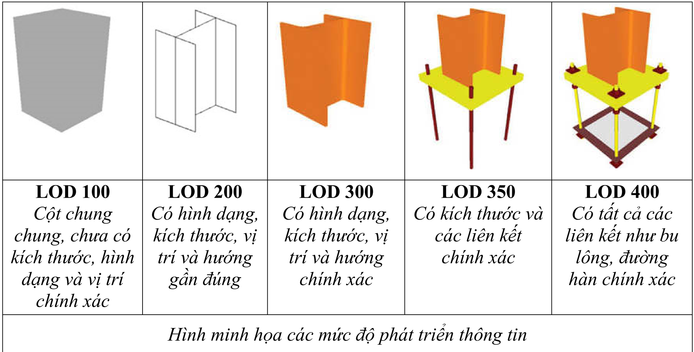

LOD 500: là c ấ p độ v ớ i m ứ c độ thông tin chi ti ế t v ề kích th ướ c, hình d ạ ng, v ị trí, s ố l ượ ng và ph ươ ng/chi ề u đ ã đượ c ki ể m tra chính xác trên công tr ườ ng. C ấ p độ này không th ể hi ệ n m ứ c d ộ chi ti ế t cao h ơ n v ề thông tin hình h ọ c c ũ ng nh ư phi hình h ọ c so v ớ i LOD 400.

M ứ c độ phát tri ể n thông tin t ừ ng c ấ u ki ệ n, c ủ a t ừ ng h ạ ng m ụ c s ẽ đượ c quy đị nh c ụ th ể trong H ồ s ơ yêu c ầ u thông tin (EIR) làm n ề n t ả ng xây d ự ng K ế ho ạ ch th ự c hi ệ n BIM (BEP).

| STT                                            | Tên c ấ u ki ệ n                               | M c phát tri ể n thông tin (LOD)               | Thông tin phi hình h ọ c c ầ n đ ính kèm       |
|------------------------------------------------|------------------------------------------------|------------------------------------------------|------------------------------------------------|
| I. Mô hình hi ệ n tr ạ ng                      | I. Mô hình hi ệ n tr ạ ng                      | I. Mô hình hi ệ n tr ạ ng                      | I. Mô hình hi ệ n tr ạ ng                      |
| 1                                              | B ề m ặ t hi ệ n tr ạ ng                       | 250                                            | - Lo ạ i b ề m ặ t (BTN, đấ t, cát,…).         |
| 2                                              | Các h ệ th ố ng h ạ t ầ ng hi ệ n h ữ u        | 250                                            | - Tên c ấ u ki ệ n (ga, c ố ng, b ể cáp).      |
| II. Mô hình giao thông, h ạ t ầ ng k ỹ thu ậ t | II. Mô hình giao thông, h ạ t ầ ng k ỹ thu ậ t | II. Mô hình giao thông, h ạ t ầ ng k ỹ thu ậ t | II. Mô hình giao thông, h ạ t ầ ng k ỹ thu ậ t |

B ả ng M ứ c độ phát tri ể n thông tin (LOD) c ủ a m ộ t s ố b ộ ph ậ n, c ấ u ki ệ n chính trong d ự án đượ c quy đị nh theo b ả ng d ướ i đ ây: (Nhà th ầ u t ư v ấ n BIM tham kh ả o n ộ i dung bên d ướ i, có th ể đệ trình n ộ i dung đ i ề u ch ỉ nh cho phù h ợ p v ớ i tình hình tri ể n khai th ự c t ế trong K ế ho ạ ch th ự c hi ệ n BIM chi ti ế t (BEP). ứ độ

D Ự ÁN THÀNH PH Ầ N 1: XÂY D Ự NG ĐƯỜ NG VÀNH Đ AI 3 Đ O Ạ N QUA THÀNH PH Ố H Ồ CHÍ MINH (BAO G Ồ M C Ầ U KÊNH TH Ầ Y THU Ố C)

TÊN D Ự ÁN :

ĐỊ A Đ I Ể M :

THÀNH PH Ố TH Ủ ĐỨ C, HUY Ệ N C Ủ CHI, HÓC MÔN, BÌNH CHÁNH

H Ạ NG M Ụ C :

ĐỀ C ƯƠ NG Ứ NG D Ụ NG MÔ HÌNH THÔNG TIN CÔNG TRÌNH BIM GÓI TH Ầ U TV04

ứ

độ

|   STT | Tên c ấ u ki ệ n                                                                                |   M c phát tri ể n thông tin (LOD) | Thông tin phi hình h ọ c c ầ n đ ính kèm                                                                                                                                                                               |
|-------|-------------------------------------------------------------------------------------------------|------------------------------------|------------------------------------------------------------------------------------------------------------------------------------------------------------------------------------------------------------------------|
|     1 | Các l ớ p k ế t c ấ u n ề n m ặ t đườ ng, v ỉ a hè, x ử lý n ề n.                               |                                300 | - Lo ạ i v ậ t li ệ u. - Thông s ố và đặ c tính k ỹ thu ậ t các l ớ p v ậ t li ệ u thi ế t k ế ( độ ch ặ t, đườ ng kính, b ề dày k ế t c ấ u,…) - Kh ố i l ượ ng l ớ p k ế t c ấ u.                                    |
|     2 | Các chi ti ế t k ế t c ấ u giao thông (Bó v ỉ a, bó l ề , d ả i phân cách,…)                    |                                300 | - Lo ạ i v ậ t li ệ u. - C ườ ng độ ch ị u nén bê tông sau 28 ngày (Mpa). - Kh ố i l ượ ng bê tông, ván khuôn.                                                                                                         |
|     3 | K ế t c ấ u h ố ga, h ố cáp các lo ạ i (ph ầ n đ úc s ẵ n, đỗ t ạ i ch ỗ , c ổ ga, đ à h ầ m,…) |                                300 | - Lo ạ i v ậ t li ệ u. - C ườ ng độ ch ị u nén bê tông sau 28 ngày (Mpa). - Kh ố i l ượ ng bê tông, ván khuôn. - Cao độ đ áy, đỉ nh h ầ m ga                                                                           |
|     4 | K ế t c ấ u ố ng, c ố ng, g ố i c ố ng các lo ạ i ch ế t ạ o s ẵ n (Mua ở nhà máy)              |                                300 | - Lo ạ i v ậ t li ệ u. - Thông s ố k ỹ thu ậ t đườ ng ố ng, c ố ng (t ả i tr ọ ng, nhà s ả n xu ấ t, chi ề u dài,…). - Cao độ đầ u, cu ố i c ố ng.                                                                     |
|     5 | K ế t c ấ u c ố ng, g ố i c ố ng t ự s ả n xu ấ t ngoài công tr ườ ng                           |                                300 | - Lo ạ i v ậ t li ệ u. - Thông s ố k ỹ thu ậ t đườ ng ố ng, c ố ng (t ả i tr ọ ng, c ườ ng độ ch ị u nén bê tông sau 28 ngày (Mpa), chi ề u dài,…). - Kh ố i l ượ ng bê tông, ván khuôn. - Cao độ đầ u, cu ố i c ố ng. |
|     6 | Cáp các h ệ th ố ng h ạ t ầ ng k ỹ thu ậ t (c ấ p c ấ p đ i ệ n, chi ế u sáng, TTLL,…)          |                                200 | - Lo ạ i cáp. - Thông s ố k ỹ thu ậ t c ơ b ả n cáp.                                                                                                                                                                   |
|     7 | Bê tông lót móng các lo ạ i                                                                     |                                300 | - Lo ạ i v ậ t li ệ u. - Kh ố i l ượ ng bê tông, ván khuôn.                                                                                                                                                            |
|     8 | Chi ti ế t mi ệ ng thu n ướ c                                                                   |                                300 | - Lo ạ i v ậ t li ệ u. - Kh ố i l ượ ng bê tông, ván khuôn.                                                                                                                                                            |
|     9 | Các chi ti ế t khác (n ắ p, ch ắ n rác,…)                                                       |                                300 | - Lo ạ i, thông s ố v ậ t li ệ u                                                                                                                                                                                       |

D Ự ÁN THÀNH PH Ầ N 1: XÂY D Ự NG ĐƯỜ NG VÀNH Đ AI 3 Đ O Ạ N QUA THÀNH PH Ố H Ồ CHÍ MINH (BAO G Ồ M C Ầ U KÊNH TH Ầ Y THU Ố C)

THÀNH PH Ố TH Ủ ĐỨ C, HUY Ệ N C Ủ CHI, HÓC MÔN, BÌNH CHÁNH

H Ạ NG M Ụ C :

ĐỀ C ƯƠ NG Ứ NG D Ụ NG MÔ HÌNH THÔNG TIN CÔNG TRÌNH BIM GÓI TH Ầ U TV04

ứ

độ

| STT                              | Tên c ấ u ki ệ n                                                            | M c phát tri ể n thông tin (LOD)   | Thông tin phi hình h ọ c c ầ n đ ính kèm                                                                                                                                      |
|----------------------------------|-----------------------------------------------------------------------------|------------------------------------|-------------------------------------------------------------------------------------------------------------------------------------------------------------------------------|
| 10                               | K ế t c ấ u hào k ỹ thu ậ t, b ể cáp các lo ạ i                             | 300                                | - Lo ạ i v ậ t li ệ u. - C ườ ng độ ch ị u nén bê tông sau 28 ngày (Mpa). - Kh ố i l ượ ng bê tông, ván khuôn. - Cao độ đ áy, đỉ nh h ầ m ga                                  |
| Mô hình k ế t c ấ u c ầ u, h ầ m | Mô hình k ế t c ấ u c ầ u, h ầ m                                            | Mô hình k ế t c ấ u c ầ u, h ầ m   | Mô hình k ế t c ấ u c ầ u, h ầ m                                                                                                                                              |
| III. 1                           | K ế t c ấ u c ọ c các lo ạ i (c ọ c khoan nh ồ i, c ọ c đ óng, c ọ c DUL,…) | 350                                | - Lo ạ i v ậ t li ệ u. - C ườ ng độ ch ị u nén bê tông sau 28 ngày (Mpa). - Lo ạ i c ọ c. - Cao độ đỉ nh, cao độ đ áy c ọ c.                                                  |
| 2                                | Bê tông lót (b ệ m ố , tr ụ , đố t h ầ m,…)                                 | 350                                | - Lo ạ i v ậ t li ệ u. - Kh ố i l ượ ng bê tông, ván khuôn.                                                                                                                   |
| 3                                | B ệ m ố , tr ụ                                                              | 350                                | - Lo ạ i v ậ t li ệ u. - C ườ ng độ ch ị u nén bê tông sau 28 ngày (Mpa). - Kh ố i l ượ ng bê tông, ván khuôn, di ệ n tích quét bitum ch ố ng th ấ m. - Cao độ đ áy b ệ .     |
| 4                                | T ườ ng đỉ nh, t ườ ng thân, t ườ ng cánh m ố                               | 350                                | - Lo ạ i v ậ t li ệ u. - C ườ ng độ ch ị u nén bê tông sau 28 ngày (Mpa). - Kh ố i l ượ ng bê tông, ván khuôn, di ệ n tích quét bitum ch ố ng th ấ m. - Cao độ đỉ nh t ườ ng. |
| 5                                | Thân tr ụ                                                                   | 350                                | - Lo ạ i v ậ t li ệ u. - C ườ ng độ ch ị u nén bê tông sau 28 ngày (Mpa). - Kh ố i l ượ ng bê tông, ván khuôn, di ệ n tích quét bitum ch ố ng th ấ m. - Cao độ đỉ nh tr ụ .   |
| 6                                | Xà m ũ                                                                      | 350                                | - Lo ạ i v ậ t li ệ u.                                                                                                                                                        |

D Ự ÁN THÀNH PH Ầ N 1: XÂY D Ự NG ĐƯỜ NG VÀNH Đ AI 3 Đ O Ạ N QUA THÀNH PH Ố H Ồ CHÍ MINH (BAO G Ồ M C Ầ U KÊNH TH Ầ Y THU Ố C)

TÊN D Ự ÁN :

ĐỊ A Đ I Ể M :

THÀNH PH Ố TH Ủ ĐỨ C, HUY Ệ N C Ủ CHI, HÓC MÔN, BÌNH CHÁNH

H Ạ NG M Ụ C :

ĐỀ C ƯƠ NG Ứ NG D Ụ NG MÔ HÌNH THÔNG TIN CÔNG TRÌNH BIM GÓI TH Ầ U TV04

ứ

độ

|   STT | Tên c ấ u ki ệ n                         |   M c phát tri ể n thông tin (LOD) | Thông tin phi hình h ọ c c ầ n đ ính kèm                                                                                                                                             |
|-------|------------------------------------------|------------------------------------|--------------------------------------------------------------------------------------------------------------------------------------------------------------------------------------|
|       |                                          |                                    | - C ườ ng độ ch ị u nén bê tông sau 28 ngày (Mpa). - Kh ố i l ượ ng bê tông, ván khuôn, di ệ n tích quét bitum ch ố ng th ấ m. - Cao độ đỉ nh tr ụ .                                 |
|     7 | B ả n quá độ                             |                                350 | - Lo ạ i v ậ t li ệ u. - C ườ ng độ ch ị u nén bê tông sau 28 ngày (Mpa). - Kh ố i l ượ ng bê tông, ván khuôn, bao t ả i t ẩ m nh ự a đườ ng.                                        |
|     8 | T ườ ng ch ắ n                           |                                350 | - Lo ạ i v ậ t li ệ u. - C ườ ng độ ch ị u nén bê tông sau 28 ngày (Mpa). - Kh ố i l ượ ng bê tông, ván khuôn. - Cao độ đỉ nh t ườ ng.                                               |
|     9 | Đố t h ầ m h ở , h ầ m kín               |                                350 | - Lo ạ i v ậ t li ệ u. - C ườ ng độ ch ị u nén bê tông sau 28 ngày (Mpa). - Kh ố i l ượ ng bê tông, ván khuôn, di ệ n tích quét bitum ch ố ng th ấ m.                                |
|    10 | D ầ m đ úc s ẵ n (D ầ m I, T, super T,…) |                                350 | - Lo ạ i v ậ t li ệ u. - C ườ ng độ ch ị u nén bê tông t ạ i th ờ i đ i ể m c ắ t cáp. - T ả i tr ọ ng thi ế t k ế . - Tr ọ ng l ượ ng d ầ m. - L ự c c ă ng cáp. - Đồ v ồ ng d ầ m. |
|    11 | D ầ m h ộ p b ả n r ỗ ng                 |                                350 | - Lo ạ i v ậ t li ệ u. - C ườ ng độ ch ị u nén bê tông sau 28 ngày (Mpa). - T ả i tr ọ ng thi ế t k ế . - Cao độ đỉ nh d ầ m. - Kh ố i l ượ ng bê tông, ván khuôn.                   |
|    12 | D ầ m ngang                              |                                350 | - Lo ạ i v ậ t li ệ u.                                                                                                                                                               |

D Ự ÁN THÀNH PH Ầ N 1: XÂY D Ự NG ĐƯỜ NG VÀNH Đ AI 3 Đ O Ạ N QUA THÀNH PH Ố H Ồ CHÍ MINH (BAO G Ồ M C Ầ U KÊNH TH Ầ Y THU Ố C)

THÀNH PH Ố TH Ủ ĐỨ C, HUY Ệ N C Ủ CHI, HÓC MÔN, BÌNH CHÁNH

H Ạ NG M Ụ C :

ĐỀ C ƯƠ NG Ứ NG D Ụ NG MÔ HÌNH THÔNG TIN CÔNG TRÌNH BIM GÓI TH Ầ U TV04

ứ

độ

## 7.6.3 Qu ả n lý h ệ th ố ng và môi tr ườ ng d ữ li ệ u chung CDE

| STT                             | Tên c ấ u ki ệ n                                                                                                    | M c phát tri ể n thông tin (LOD)   | Thông tin phi hình h ọ c c ầ n đ ính kèm                                                                       |
|---------------------------------|---------------------------------------------------------------------------------------------------------------------|------------------------------------|----------------------------------------------------------------------------------------------------------------|
|                                 |                                                                                                                     |                                    | - C ườ ng độ ch ị u nén bê tông sau 28 ngày (Mpa). - Kh ố i l ượ ng bê tông, ván khuôn.                        |
| 13                              | B ả n m ặ t c ầ u, b ả n liên t ụ c nhi ệ t                                                                         | 350                                | - Lo ạ i v ậ t li ệ u. - C ườ ng độ ch ị u nén bê tông sau 28 ngày (Mpa). - Kh ố i l ượ ng bê tông, ván khuôn. |
| 14                              | L ớ p ph ủ                                                                                                          | 300                                | - Lo ạ i v ậ t li ệ u.                                                                                         |
| 15                              | Đ á kê g ố i, ụ ch ố ng xô                                                                                          | 350                                | - Lo ạ i v ậ t li ệ u. - C ườ ng độ ch ị u nén bê tông sau 28 ngày (Mpa). - Kh ố i l ượ ng bê tông, ván khuôn. |
| 16                              | G ố i                                                                                                               | 200                                | - Lo ạ i v ậ t li ệ u. - T ả i tr ọ ng thi ế t k ế . - Cao độ g ố i.                                           |
| 17                              | Các chi ti ế t k ế t c ấ u khác (g ờ lan can, g ờ ch ắ n, t ấ m đ an b ộ hành, t ấ m ván khuôn b ả n m ặ t c ầ u,…) | 300                                | - Lo ạ i v ậ t li ệ u. - Kh ố i l ượ ng bê tông, ván khuôn.                                                    |
| IV. H ạ t ầ ng k ỹ thu ậ t khác | IV. H ạ t ầ ng k ỹ thu ậ t khác                                                                                     | IV. H ạ t ầ ng k ỹ thu ậ t khác    | IV. H ạ t ầ ng k ỹ thu ậ t khác                                                                                |
| 1                               | Tr ụ Chi ế u sáng                                                                                                   | 300                                | - Lo ạ i tr ụ đ èn chi ế u sáng.                                                                               |
| 2                               | T ủ đ i ề u khi ể n, phân ph ố i c ấ p đ i ệ n, tr ạ m bi ế p áp,…                                                  | 300                                | - Lo ạ i v ậ t li ệ u                                                                                          |

- -Gi ả i pháp Môi tr ườ ng d ữ li ệ u chung (CDE) c ầ n đượ c th ố ng nh ấ t áp d ụ ng cho toàn b ộ d ự án. T ư v ấ n t ạ o l ậ p mô hình BIM có trách nhi ệ m v ậ n hành, chuy ể n giao c ũ ng nh ư đ ào t ạ o cho các đơ n v ị liên quan cách th ứ c s ử d ụ ng và ph ố i h ợ p trên CDE.
- -H ệ th ố ng CDE c ủ a d ự án đượ c l ự a ch ọ n ph ả i đả m b ả o ho ạ t độ ng trong su ố t th ờ i gian th ự c hi ệ n gói th ầ u.
- -CDE c ủ a d ự án ph ả i đả m b ả o c ấ u trúc yêu c ầ u t ố i thi ể u theo tài li ệ u H ướ ng d ẫ n chung áp d ụ ng Mô hình thông tin công trình (BIM) - Quy ế t đị nh s ố 348/Q Đ -BXD ngày 02 tháng 4 n ă m 2021 c ủ a B ộ Xây d ự ng.

D Ự ÁN THÀNH PH Ầ N 1: XÂY D Ự NG ĐƯỜ NG VÀNH Đ AI 3 Đ O Ạ N QUA THÀNH PH Ố H Ồ CHÍ MINH (BAO G Ồ M C Ầ U KÊNH TH Ầ Y THU Ố C)

TÊN D Ự ÁN :

THÀNH PH Ố TH Ủ ĐỨ C, HUY Ệ N C Ủ CHI, HÓC MÔN, BÌNH CHÁNH

H Ạ NG M Ụ C :

ĐỀ C ƯƠ NG Ứ NG D Ụ NG MÔ HÌNH THÔNG TIN CÔNG TRÌNH BIM GÓI TH Ầ U TV04

- -H ệ th ố ng phân quy ề n  s ử d ụ ng t ạ i  CDE ph ả i  phù  h ợ p  v ớ i  vai  trò  trách nhi ệ m c ủ a các bên tham gia d ự án. Các ch ứ c n ă ng chia s ẽ d ữ li ệ u ph ả i đả m b ả o quy t ắ c v ề an toàn b ả o m ậ t d ữ li ệ u cho các bên.
- -T ấ t c ả các d ữ li ệ u liên quan đế n h ồ s ơ thi ế t k ế c ủ a d ự án bao g ồ m: Pháp lý d ự án, b ả n v ẽ , thuy ế t minh, d ự toán,.. c ũ ng ph ả i đượ c đơ n v ị t ư v ấ n thi ế t k ế l ư u tr ữ trên Môi tr ườ ng d ữ li ệ u chung (CDE) để l ư u tr ữ và khai thác thông tin.
- -T ấ t c ả các d ữ li ệ u ứ ng d ụ ng BIM ph ả i đượ c các đơ n v ị t ư v ấ n BIM c ậ p nh ậ t  lên CDE theo đ úng nh ư K ế ho ạ ch chuy ể n giao thông tin t ổ ng th ể (MIDP) để t ấ t c ả các đơ n v ị tham gia d ự án có th ể ki ể m tra, trao đổ i và truy xu ấ t các thông tin c ầ n thi ế t trong xu ấ t quá trình th ự c hi ệ n d ự án tr ự c ti ế p trên môi tr ườ ng CDE.
- -CDE ph ả i đả m b ả o có các ch ứ c n ă ng c ộ ng tác, th ả o lu ậ n các v ấ n đề liên quan đế n quá trình thi ế t k ế , quá trình t ạ o l ậ p mô hình BIM và l ư u tr ữ các thông tin này để có th ể truy xu ấ t d ữ li ệ u khi c ầ n thi ế t.
- -C ấ u trúc th ư m ụ c và vai trò c ủ a các ch ủ th ể trong qu ả n lý, s ử dung Môi tr ườ ng d ữ li ệ u chung (CDE) đượ c th ể hi ệ n qua b ả ng sau:

|                                  | Các ch ủ th ể tham gia   | Các ch ủ th ể tham gia   | Các ch ủ th ể tham gia   | Các ch ủ th ể tham gia   | Các ch ủ th ể tham gia                 |
|----------------------------------|--------------------------|--------------------------|--------------------------|--------------------------|----------------------------------------|
| Khu v ự c / th ư m ụ c trong CDE | Ch ủ đầ u t ư            | T ư v ấ n BIM            | T ư v ấ n thi ế t k ế    | T ư v ấ n th ẩ m tra     | Các c ơ quan ban ngành khác (S ở GTVT) |
| WIP ( Đ ang tri ể n khai)        | R                        | W                        | W                        | N                        | N                                      |
| Shared (Chia s ẻ )               | R                        | W                        | W                        | R                        | N                                      |
| Published (Phát hành)            | R                        | R                        | R                        | R                        | R                                      |
| Archived (L ư u tr ữ )           | R                        | R                        | N                        | N                        | N                                      |

W Ghi d ữ li ệ u (Write)

## Trong đ ó:

R Đọ ữ ệ

c d li u (Read)

N Không đượ c phép truy c ậ p (No access)

Ghi chú: Các th ư m ụ c, khu v ự c l ư u tr ữ trong CDE đượ c đị nh ngh ĩ

a theo

## quy ế t đị nh 348/Q Đ -BXD, c ụ th ể nh ư sau:

- -Khu v ự c 'CHIA S Ẻ ' (SHARED) đượ c dùng để l ư u tr ữ thông tin đ ã đượ c ch ấ p thu ậ n cho vi ệ c chia s ẻ . Thông tin này đượ c chia s ẻ để các đơ n v ị khác s ử d ụ ng làm d ữ li ệ u tham kh ả o cho vi ệ c phát tri ể n n ộ i dung có liên quan. Khi t ấ t c ả đ ã hoàn thành, thông tin (s ả n ph ẩ m theo k ế ho ạ ch) ph ả i đượ c đặ t ở tr ạ ng thái 'Ch ờ phát hành'.
- -Khu v ự c 'CÔNG VI Ệ C Đ ANG  TI Ế N  HÀNH ' (WORK  IN PROGRESS, vi ế t t ắ t WIP ) c ủ a CDE là n ơ i m ỗ i nhóm hay cá nhân th ự c hi ệ n công vi ệ c c ủ a mình, WIP đượ c dùng để l ư u tr ữ các thông tin ch ư a đượ c ch ấ p thu ậ n chia s ẻ cho các nhóm/cá nhân khác có liên quan. Trong m ộ t d ự án có th ể có nhi ề u khu v ự c WIP, th ườ ng m ỗ i 1 bên tham gia th ự c hi ệ n có m ộ t khu v ự c WIP c ủ a riêng mình.
- -Khu v ự c 'PHÁT HÀNH' (PUBLISHED DOCUMENTATION) đượ c s ử d ụ ng để l ư u tr ữ các thông tin đượ c phát hành, là nh ữ ng thông tin đ ã đượ c ch ấ p thu ậ n b ở i ch ủ đầ u t ư .

## 7.7 Quy trình ki ể m tra và nghi ệ m thu mô hình

- -Khu v ự c 'L Ư U TR Ữ ' (ARCHIVE) ghi l ạ i m ọ i ti ế n tri ể n t ạ i  m ỗ i m ố c th ờ i đ i ể m và ph ả i l ư u l ạ i b ả n ghi c ủ a t ấ t c ả các trao đổ i và thay đổ i nh ằ m cung c ấ p các d ấ u v ế t l ị ch s ử trao đổ i để ki ể m tra và đố i chi ế u trong tr ườ ng h ợ p có tranh ch ấ p…

Ki ể m soát ch ấ t l ượ ng mô hình ph ả i đả m b ả o: N ộ i dung k ỹ thu ậ t tuân th ủ theo các h ướ ng d ẫ n; Thông tin d ữ li ệ u theo yêu c ầ u t ừ ng giai đ o ạ n d ự án, và vi ệ c s ử d ụ ng ph ả i phù h ợ p v ớ i m ụ c tiêu áp d ụ ng BIM:

- -V ề thông tin: Mô hình ph ả i ch ứ a d ữ li ệ u theo yêu c ầ u thông tin trong t ừ ng giai đoạn dự án (thiết kế, thi công và bảo trì...);
- -V ề k ỹ thu ậ t: Mô hình đượ c t ạ o l ậ p tuân th ủ theo quy trình, h ướ ng d ẫ n và h ệ th ố ng phân lo ạ i;
- -Đ ánh giá ch ấ t l ượ ng: Các gi ả i pháp x ử lý xung độ t gi ữ a các đố i t ượ ng mô hình, độ chính xác và m ứ c độ chi ti ế t theo yêu c ầ u.
- -Bi ể u m ẫ u ki ể m tra mô hình đượ c áp d ụ ng nh ư sau:

ể

ộ

ầ

| Ki m tra   | N i dung   | Ph n m ề m s ử d ụ ng   | Bên nh n trách nhi ệ m   | T n su t   |
|------------|------------|-------------------------|--------------------------|------------|

ậ

ầ

ấ

D Ự ÁN THÀNH PH Ầ N 1: XÂY D Ự NG ĐƯỜ NG VÀNH Đ AI 3 Đ O Ạ N QUA THÀNH PH Ố H Ồ CHÍ MINH (BAO G Ồ M C Ầ U KÊNH TH Ầ Y THU Ố C)

THÀNH PH Ố TH Ủ ĐỨ C, HUY Ệ N C Ủ CHI, HÓC MÔN, BÌNH CHÁNH

ĐỀ C ƯƠ NG Ứ NG D Ụ NG MÔ HÌNH THÔNG TIN CÔNG TRÌNH BIM GÓI TH Ầ U TV04

ể

ứ

## 8. C Ơ S Ở H Ạ T Ầ NG VÀ NHÂN S Ự TH Ự C HI Ệ N BIM

| Ki m tra tr ự c quan    | Thông tin ch a trong mô hình BIM ph ả i đượ c xác minh để xác đị nh tính chính xác.                                  | [Ghi tên ph ầ n m ề m]   | [Ghi ghi tên bên nh ậ n trách nhi ệ m]   | [Ghi t ầ n su ấ t ki ể m tra]   |
|-------------------------|----------------------------------------------------------------------------------------------------------------------|--------------------------|------------------------------------------|---------------------------------|
| Ki ể m tra xung độ t    | Phát hi ệ n các v ấ n đề trong mô hình n ơ i các thành ph ầ n khác nhau c ủ a công trình có s ự va ch ạ m, xung độ t | [Ghi tên ph ầ n m ề m]   | [Ghi ghi tên bên nh ậ n trách nhi ệ m]   | [Ghi t ầ n su ấ t ki ể m tra]   |
| Ki ể m tra tiêu chu ẩ n | Đả m b ả o vi ệ c tuân th ủ các tiêu chu ẩ n, ph ươ ng pháp, h ướ ng d ẫ n áp d ụ ng                                 | [Ghi tên ph ầ n m ề m]   | [Ghi ghi tên bên nh ậ n trách nhi ệ m]   | [Ghi t ầ n su ấ t ki ể m tra]   |
| …                       | …                                                                                                                    | …                        | …                                        | …                               |

## 8.1 C ơ s ở h ạ t ầ ng

- -Môi tr ườ ng d ữ li ệ u chung (CDE) đượ c áp d ụ ng cho toàn d ự án đả m b ả o đ áp ứ ng theo yêu c ầ u ở m ụ c 7.6.3.
- -S ử d ụ ng các ph ầ n m ề m chuyên ngành (có b ả n quy ề n) để t ạ o l ậ p mô hình thông tin công trình (BIM), có đị nh d ạ ng d ữ li ệ u và kh ả n ă ng t ạ o l ậ p mô hình theo m ứ c độ chi ti ế t (LOD) phù h ợ p v ớ i yêu c ầ u ở m ụ c 7.5 và 7.6.2. Các ph ầ n m ề m tri ể n khai mô hình BIM nên đượ c th ố ng nh ấ t và s ử d ụ ng chung cho t ấ t c ả các gói th ầ u c ủ a d ự án.

## 8.2 Vai trò nhân s ự BIM

| Ch th                                  | Vi t t t    | Vai trò                                                                                                                                                                                                                                                                                                                                                                                                                                                                                                    |
|----------------------------------------|-------------|------------------------------------------------------------------------------------------------------------------------------------------------------------------------------------------------------------------------------------------------------------------------------------------------------------------------------------------------------------------------------------------------------------------------------------------------------------------------------------------------------------|
| Chuyên gia th ự c hi ệ n qu ả n lý BIM | BIM Manager | - Ch ỉ đạ o vi ệ c xây d ự ng k ế ho ạ ch. - Qu ả n lý nhóm tri ể n khai BIM. - Tìm hi ể u công ngh ệ m ớ i. - Xác nh ậ n tiêu chu ẩ n BIM d ự án cho độ i ng ũ thi ế t k ế trong d ự án. - T ổ ch ứ c xây d ự ng K ế ho ạ ch th ự c hi ệ n BIM cho d ự án; - Xác nh ậ n nh ữ ng n ộ i dung thông tin chung cho nhóm thi ế t k ế ; - Ph ố i h ợ p v ớ i ng ườ i đượ c giao qu ả n lý CDE để đả m b ả o nh ữ ng yêu c ầ u đượ c th ự c hi ệ n trong môi tr ườ ng BIM cho giai đ o ạ n qu ả n lý v ậ n hành; |

## -Vai trò các nhân s ự BIM đượ c th ể hi ệ n theo b ả ng sau: Ch ủ th ể Vi ế t t ắ

D Ự ÁN THÀNH PH Ầ N 1: XÂY D Ự NG ĐƯỜ NG VÀNH Đ AI 3 Đ O Ạ N QUA THÀNH PH Ố H Ồ CHÍ MINH (BAO G Ồ M C Ầ U KÊNH TH Ầ Y THU Ố C)

- Thi ế t l ậ p quy trình trao đổ i d ữ li ệ u cho toàn d ự án trong t ấ t c ả các giai đ o ạ n;

## -S ố l ượ ng các nhân s ự BIM ứ ng v ớ i các gói th ầ u:

|                                             |                 | - Thi t l p quy trình trao i d li u cho toàn d án trong t ấ t c ả các giai đ o ạ n; - Đả m b ả o mô hình liên k ế t đ a b ộ môn đạ t yêu c ầ u.                                                                                                                                                                                                                                                                                                                                                                                                                                                                                                                                                                                                                                                                                                                                                       |
|---------------------------------------------|-----------------|-------------------------------------------------------------------------------------------------------------------------------------------------------------------------------------------------------------------------------------------------------------------------------------------------------------------------------------------------------------------------------------------------------------------------------------------------------------------------------------------------------------------------------------------------------------------------------------------------------------------------------------------------------------------------------------------------------------------------------------------------------------------------------------------------------------------------------------------------------------------------------------------------------|
| Chuyên gia th ự c hi ệ n đ i ề u ph ố i BIM | BIM Coordinator | - Tham gia xây d ự ng và tri ể n khai K ế ho ạ ch th ự c hi ệ n BIM cho d ự án; - C ậ p nh ậ t K ế ho ạ ch th ự c hi ệ n BIM cho d ự án trong quá trình triển khai; - Ch ỉ đạ o l ậ p k ế ho ạ ch, thi ế t l ậ p và duy trì các file d ữ li ệ u; - Đả m b ả o các bên có liên quan th ố ng nh ấ t v ề K ế ho ạ ch th ự c hi ệ n BIM cho d ự án; - Xác đị nh và t ạ o đ i ề u ki ệ n cho vi ệ c tri ể n khai đ ào t ạ o nhân s ự phù h ợ p v ớ i chi ế n l ượ c th ự c hi ệ n d ự án; - Đả m b ả o ph ầ n c ứ ng và ph ầ n m ề m c ầ n thi ế t cho vi ệ c tri ể n khai; - Xây d ự ng Mô hình BIM liên k ế t đ a b ộ môn t ừ nh ữ ng mô hình BIM t ừ ng b ộ môn, xu ấ t báo cáo xung độ t t ạ i các m ố c quan tr ọ ng xác đị nh trong K ế ho ạ ch th ự c hi ệ n BIM cho d ự án; - Đả m b ả o các xung độ t trong mô hình BIM t ừ ng b ộ môn đượ c gi ả i quy ế t tr ướ c khi ph ố i h ợ p đ a b ộ môn. |
| Chuyên gia th ự c hi ệ n d ự ng hình BIM    | BIM Modeler     | - Ch ị u trách nhi ệ m s ả n xu ấ t các s ả n ph ầ m thi ế t k ế . - Trích xu ấ t thông tin, tri ể n khai b ả n v ẽ t ừ mô hình. - Đả m b ả o s ự nh ấ t quán trong mô hình hóa. - Ph ố i h ợ p v ớ i b ộ ph ậ n công ngh ệ thông tin để gi ả i quy ế t các yêu c ầ u v ề m ặ t công ngh ệ .                                                                                                                                                                                                                                                                                                                                                                                                                                                                                                                                                                                                          |

ầ

## 8.3 Cung c ấ p môi tr ườ ng d ữ li ệ u chung

| Gói th u                                                                                                                         |   BIM Modeler |   BIM Coordinator |   BIM Manager |
|----------------------------------------------------------------------------------------------------------------------------------|---------------|-------------------|---------------|
| TV04: T ư v ấ n Kh ả o sát, l ậ p TKKT- d ự toán, l ậ p BIM đ o ạ n Thành ph ố Th ủ Đứ c (T ừ Km17+500 đế n nút giao Tân V ạ n). |            11 |                 1 |             1 |

- -Để h ỗ tr ợ quá trình th ự c hi ệ n áp d ụ ng BIM, công tác trao đổ i thông tin c ầ n đượ c th ự c hi ệ n và ki ể m soát. Các thành viên tham gia c ầ n trao đổ i th ườ ng

ĐỀ C ƯƠ NG Ứ NG D Ụ

xuyên. Các thông tin c ầ n đượ c  l ư u  tr ữ trên  môi  tr ườ ng  d ữ li ệ u  chung (CDE) để các thành viên có liên quan có th ể truy c ậ p đượ c k ị p th ờ i.

- -S ố l ượ ng ng ườ i dùng d ự ki ế n cho b ướ c thi ế t k ế k ỹ thu ậ t: 9 ng ườ i dùng s ử d ụ ng trong th ờ i gian t ố i thi ể u 5 tháng.
- -S ố l ượ ng ng ườ i dùng tham gia môi tr ườ ng d ữ li ệ u chung ph ả i đ áp ứ ng t ố i thi ể u 01 ng ườ i/ 01 đơ n v ị , đồ ng th ờ i đả m b ả o vi ệ c trao đổ i thông tin không b ị gián đ o ạ n.

ầ

|               |                                                                                                       | Gói th u TV04    | Gói th u TV04                        |                                                                                          |
|---------------|-------------------------------------------------------------------------------------------------------|------------------|--------------------------------------|------------------------------------------------------------------------------------------|
| STT           | Đơ n v ị                                                                                              | S ố l ượ ng User | Th ờ i gian s ử d ụ ng t ố i thi ể u | Ghi chú                                                                                  |
| I             | Ch ủ đầ u t ư                                                                                         |                  |                                      |                                                                                          |
| 1             | Ban giám đố c                                                                                         |                  | 3 tháng                              | Tài kho ả n đượ c tính trong gói th ầ u TV06 và s ử d ụ ng cho các gói th ầ u còn l ạ i. |
| 2             | Ban qu ả n lý d ự án                                                                                  |                  | 3 tháng                              | Tài kho ả n đượ c tính trong gói th ầ u TV06 và s ử d ụ ng cho các gói th ầ u còn l ạ i. |
| 3             | Các phòng ban liên quan khác (phòng ch ấ t l ượ ng, phòng k ế ho ạ ch,..)                             |                  | 3 tháng                              | Tài kho ả n đượ c tính trong gói th ầ u TV06 và s ử d ụ ng cho các gói th ầ u còn l ạ i. |
| II            | B ộ ph ậ n BIM                                                                                        |                  |                                      |                                                                                          |
| 1             | Ch ủ nhi ệ m d ự án                                                                                   | 1                |                                      |                                                                                          |
| 2             | Ch ủ trì thi ế t k ế các h ạ ng m ụ c ( đườ ng b ộ , h ầ m, c ầ u, h ạ t ầ ng k ỹ thu ậ t)            | 2                |                                      |                                                                                          |
| 3             | BIM Manager                                                                                           | 1                |                                      |                                                                                          |
| 4             | BIM Coordinator                                                                                       | 1                | 5 tháng                              |                                                                                          |
| 5             | BIM Modeler                                                                                           | 2                |                                      |                                                                                          |
| III           | T ư v ấ n th ẩ m tra                                                                                  |                  |                                      |                                                                                          |
| 1             | Ch ủ nhi ệ m th ẩ m tra d ự án                                                                        | 1                | 5 tháng                              |                                                                                          |
| 2             | Ch ủ trì th ẩ m tra thi ế t k ế các h ạ ng m ụ c ( đườ ng b ộ , h ầ m, c ầ u, h ạ t ầ ng k ỹ thu ậ t) | 1                | 5 tháng                              |                                                                                          |
| IV            | C ơ quan ban ngành                                                                                    |                  |                                      |                                                                                          |
| 1             | S ở Giao thông V ậ n t ả i                                                                            |                  | 3 tháng                              | Tài kho ả n đượ c tính trong gói th ầ u TV06 và s ử d ụ ng cho các gói th ầ u còn l ạ i. |
| T ổ ng c ộ ng | T ổ ng c ộ ng                                                                                         | 9                |                                      |                                                                                          |

D Ự ÁN THÀNH PH Ầ N 1: XÂY D Ự NG ĐƯỜ NG VÀNH Đ AI 3 Đ O Ạ N QUA THÀNH PH Ố H Ồ CHÍ MINH (BAO G Ồ M C Ầ U KÊNH TH Ầ Y THU Ố C)

THÀNH PH Ố TH Ủ ĐỨ C, HUY Ệ N C Ủ CHI, HÓC MÔN, BÌNH CHÁNH

ĐỀ C ƯƠ NG Ứ NG D Ụ NG MÔ HÌNH THÔNG TIN CÔNG TRÌNH BIM GÓI TH Ầ U TV04

## 9. CHI PHÍ TRI Ể N KHAI Ứ NG D Ụ NG BIM CHO D Ự ÁN:

- -Thông t ư 45/2018/TT-BTC ngày 07/5/2018 c ủ a B ộ Tài chính H ướ ng d ẫ n ch ế độ qu ả n lý, tính hao mòn, kh ấ u hao tài s ả n c ố đị nh t ạ i c ơ quan, t ổ ch ứ c, đơ n v ị và tài s ả n c ố đị nh do Nhà n ướ c giao cho doanh nghi ệ p qu ả n lý không tính thành ph ầ n v ố n Nhà n ướ c t ạ i doanh nghi ệ p.

## 9.1 C ă n c ứ l ậ p d ự toán:

- -Thông t ư s ố 11/2021/TT-BXD ngày 31/8/2021 c ủ a B ộ Xây d ự ng h ướ ng d ẫ n m ộ t s ố n ộ i dung xác đị nh và qu ả n lý chi phí đầ u t ư xây d ự ng;
- -Theo thông t ư 12 d ự toán chi phí áp d ụ ng BIM xác đị nh b ằ ng d ự toán chi phí nh ư ng không quá 50% chi phí thi ế t k ế . C ụ th ể giá tr ị max chi phí BIM đượ c xác đị nh nh ư sau:
- -Thông t ư s ố 12/2021/TT-BXD ngày 31/08/2021c ủ a  B ộ Xây  D ự ng ban hành đị nh m ứ c xây d ự ng;
+ Chi phí áp d ụ ng BIM đượ c xác đị nh b ằ ng d ự toán và không v ượ t quá giá tr ị sau:

## Trong đ ó:

<!-- formula-not-decoded -->

-  GBIM: chi phí áp d ụ ng BIM (sau thu ế );

ệ

-  Gtk: chi phí thi ế t k ế k ỹ thu ậ t (sau thu ế ), Gtk= 4.592.828.674 ( đồ ng);

| GÓI TH Ầ U   | H ạ ng m ụ c   | H s i u ch ỉ nh Chi phí TKKT   | nh m ứ c chi phí   | G XD (tr ướ c thu ế )   | G TKKT (tr ướ c thu ế )   | G TKKT (sau thu ế )   |
|--------------|----------------|--------------------------------|--------------------|-------------------------|---------------------------|-----------------------|
|              |                | (1)                            | (2)                | (3)                     | (4)=1x2x3                 | (5)=(4)x1,1           |
| TV04         | Tuy ế n        | 1                              | 0,361%             | 0,000                   | 0                         | 4.592.828.674         |
| TV04         | Nút giao       | 1,5                            | 0,361%             | 771,062                 | 4.175.298.794             | 4.592.828.674         |
| TV04         | C ầ u          | 1                              | 0,271%             | 0,000                   | 0                         | 4.592.828.674         |
| TV04         | H ầ m          | 1,65                           | 0,271%             | 0,000                   | 0                         | 4.592.828.674         |

ố

đ

ề

Đị

-  k: H ệ s ố đ i ề u ch ỉ nh gi ả m tr ừ không áp d ụ ng BIM 4D cho công tác l ậ p d ự toán, chi ế m kho ả ng 12% chi phí thi ế t k ế , k= 100%-12% = 88%.
+ Chi phí th ự c hi ệ n BIM gói th ầ u TV04 theo quy đị nh Thông t ư 12/2021: GBIM ≤ 4.592.828.674x50%x88% = 2.020.844.616 ( đồ ng).

## 9.2 D ự toán chi phí:

| STT           | Kho n m c chi phí                    | Di n gi i                                             | Chi Phí       | Ký hi u   |
|---------------|--------------------------------------|-------------------------------------------------------|---------------|-----------|
| 1             | Chi phí chuyên gia                   | Theo b ả ng chi phí chuyên gia và đị nh m ứ c l ươ ng | 964.560.000   | Ccg       |
| 2             | Chi phí qu ả n lý                    | 55%*Ccg                                               | 530.508.000   | Cql       |
| 3             | Chi phí khác                         | Theo b ả ng tính chi phí khác                         | 64.114.510    | Ck        |
| 4             | Thu nh ậ p ch ị u thu ế tính tr ướ c | 6%*( Ccg + Cql )                                      | 89.704.080    | TL        |
| 5             | Thu ế GTGT                           | 10%*(Ccg + Cql + Ck + TL)                             | 164.888.659   | T         |
| T ổ ng c ộ ng | T ổ ng c ộ ng                        | Ccg + Cql + Ck + TL + T                               | 1.813.775.249 | Ctv       |

ả

ụ

ễ

ả

ệ

B ằ ng ch ữ : M ộ t t ỷ , tám tr ă m m ườ i ba tri ệ u, b ả y tr ă m b ả y m ươ i l ă m nghìn, hai tr ă m b ố n m ươ i chín đồ ng.

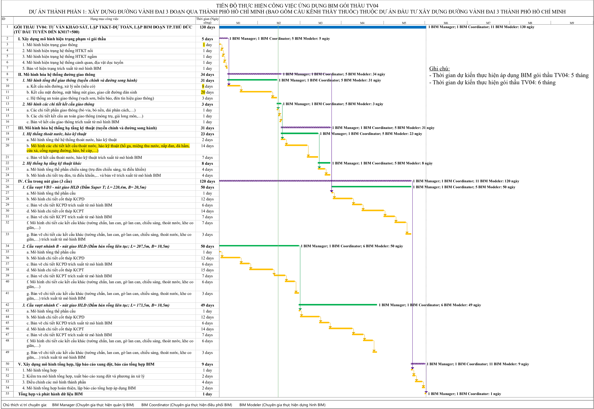

## DỰ TOÁN CHI PHÍ TƯ VẤN LẬP MÔ HÌNH THÔNG TIN CÔNG TRÌNH (BIM)

DỰ ÁN THÀNH PHẦN 1:  XÂY DỰNG ĐƯỜNG VÀNH ĐAI 3 ĐOẠN QUA THÀNH PHỐ HỒ CHÍ MINH (BAO GỒM CẦU KÊNH THẦY THUỐC) THUỘC DỰ ÁN ĐẦU TƯ XÂY DỰNG ĐƯỜNG VÀNH ĐAI 3 THÀNH PHỐ HỒ CHÍ MINH

ĐỊA ĐIỂM:  TP. THỦ ĐỨC, CÁC HUYỆN (CỦ CHI, HÓC MÔN, BÌNH CHÁNH) - TP. HỒ CHÍ MINH

## BẢNG TỔNG HỢP DỰ TOÁN GÓI THẦU TV04

| STT       | Khoản mục chi phí             | Diễn giải                                      | Chi Phí       | Ký hiệu   |
|-----------|-------------------------------|------------------------------------------------|---------------|-----------|
| 1         | Chi phí chuyên gia            | Theo bảng chi phí chuyên gia và định mức lương | 964.560.000   | Ccg       |
| 2         | Chi phí quản lý               | 55%*Ccg                                        | 530.508.000   | Cql       |
| 3         | Chi phí khác                  | Theo bảng tính chi phí khác                    | 64.114.510    | Ck        |
| 4         | Thu nhập chịu thuế tính trước | 6%*( Ccg + Cql )                               | 89.704.080    | TL        |
| 5         | Thuế GTGT                     | 10%*(Ccg + Cql + Ck + TL)                      | 164.888.659   | T         |
| Tổng cộng | Tổng cộng                     | Ccg + Cql + Ck + TL + T                        | 1.813.775.249 | Ctv       |

Bằng chữ : Một tỷ, tám trăm mười ba triệu, bảy trăm bảy mươi lăm nghìn, hai trăm bốn mươi chín đồng.

## B Ả NG CHI PHÍ CHUYÊN GIA (BIM)

D Ự ÁN THÀNH PH Ầ N 1:  XÂY D Ự NG ĐƯỜ NG VÀNH Đ AI 3 Đ O Ạ N QUA THÀNH PH Ố H Ồ CHÍ MINH (BAO G Ồ M C Ầ U KÊNH TH Ầ Y THU Ố C) THU Ộ C D Ự ÁN ĐẦ U T Ư XÂY D Ự NG ĐƯỜ NG VÀNH Đ AI 3 THÀNH PH Ố H Ồ CHÍ MINH

## CHI PHÍ CHUYÊN GIA - GÓI TH Ầ U TV04

ĐỊ A Đ I Ể M:  TP. TH Ủ ĐỨ C, CÁC HUY Ệ N (C Ủ CHI, HÓC MÔN, BÌNH CHÁNH) - TP. H Ồ CHÍ MINH

ươ

: Chuyên gia th ự c hi ệ n qu ả n lý BIM

| STT           | Ch ứ c danh     | L ng chuyên gia/tháng   | S ố ng ườ i   | S ố tháng công   | Chi phí chuyên gia   |
|---------------|-----------------|-------------------------|---------------|------------------|----------------------|
| (1)           | (2)             | (3)                     | (4)           | (5)              | (6)=(3)*(5)          |
| 1             | BIM Manager     | 29.900.000              | 1             | 5,00             | 149.500.000          |
| 2             | BIM Coordinator | 20.020.000              | 1             | 4,85             | 97.020.000           |
| 3             | BIM Modeler     | 15.080.000              | 11            | 47,62            | 718.040.000          |
| T ổ ng c ộ ng | T ổ ng c ộ ng   | T ổ ng c ộ ng           | 13            | 57,46            | 964.560.000          |

## Chú thích :

## I. Thành ph ầ n nhân s ự :

- BIM Manager

- BIM Coordinator

: Chuyên gia th ự c hi ệ n đ i ề u ph ố i BIM

- BIM Modeler

: Chuyên gia th ự c hi ệ n d ự ng hình BIM

ng tính nhân công

## II. Chi ti ế t s ố tháng công (5) xem ph ụ l ụ c A : B ả

## B Ả NG PHÂN TÍCH L ƯƠ NG CHO CHUYÊN GIA (BIM)

| STT Ch ứ c danh   | M ứ c l ươ ng theo ngày   | S ố ngày công/ Tháng   | Chi phí tr ả cho chuyên gia/ tháng = (2)*(3)   | Nhóm nhân công   | Ghi chú                                          |
|-------------------|---------------------------|------------------------|------------------------------------------------|------------------|--------------------------------------------------|
| (1)               | (2)                       | (3)                    | (4)                                            | (5)              | (6)                                              |
| 1 BIM Manager     | 1.150.000                 | 26                     | 29.900.000                                     | Nhóm II          | Theo Thông t ư s ố 11/2021/TT-BXD ngày 31/8/2021 |
| 2 BIM Coordinator | 770.000                   | 26                     | 20.020.000                                     | Nhóm III         | Theo Thông t ư s ố 11/2021/TT-BXD ngày 31/8/2021 |
| 3 BIM Modeler     | 580.000                   | 26                     | 15.080.000                                     | Nhóm IV          | Theo Thông t ư s ố 11/2021/TT-BXD ngày 31/8/2021 |

## Quy đị nh v ề m ứ c l ươ ng chuyên gia, yêu c ầ u chuyên gia theo Thông t ư s ố 11/2021/TT-BXD ngày 31/8/2021. - Chuyên gia nhóm I:

+ Chuyên gia t ư v ấ n có b ằ ng th ạ c s ỹ tr ở lên, có chuyên môn đượ c đ ào t ạ o phù h ợ p v ớ i chuyên ngành t ư v ấ n và có t ừ 8 n ă m kinh nghi ệ m tr ở lên trong chuyên ngành t ư v ấ n.
+ Chuyên gia t ư v ấ n có chuyên môn đượ c đ ào t ạ o phù h ợ p v ớ i chuyên ngành t ư v ấ n và có t ừ 15 n ă m kinh nghi ệ m tr ở lên trong chuyên ngành t ư v ấ n.
+ Tr ưở ng nhóm t ư v ấ n ho ặ c ch ủ trì t ổ ch ứ c, đ i ề u hành gói th ầ u t ư v ấ n.
+ M ứ c l ượ ng không v ượ t quá 1.500.000 đồ ng/ngày công

## - Chuyên gia nhóm II:

+ Chuyên gia t ư v ấ n có b ằ ng th ạ c s ỹ tr ở lên, có chuyên môn đượ c đ ào t ạ o phù h ợ p v ớ i chuyên ngành t ư v ấ n và có t ừ 5 đế n d ướ i 8 n ă m kinh nghi ệ m trong chuyên ngành t ư v ấ n.
+ Chuyên gia t ư v ấ n có chuyên môn đượ c đ ào t ạ o phù h ợ p v ớ i chuyên ngành t ư v ấ n và có t ừ 10 đế n d ướ i 15 n ă m kinh nghi ệ m trong chuyên ngành t ư v ấ n.
+ Ch ủ trì m ộ t ho ặ c m ộ t s ố h ạ ng m ụ c thu ộ c gói th ầ u t ư v ấ n.
+ M ứ c l ượ ng không v ượ t quá 1.150.000 đồ ng/ngày công

## - Chuyên gia nhóm III:

+ Chuyên gia t ư v ấ n có b ằ ng th ạ c s ỹ tr ở lên, có chuyên môn đượ c đ ào t ạ o phù h ợ p v ớ i chuyên ngành t ư v ấ n và có t ừ 3 đế n d ướ i 5 n ă m kinh nghi ệ m trong chuyên ngành t ư v ấ n.
+ Chuyên gia t ư v ấ n có chuyên môn đượ c đ ào t ạ o phù h ợ p v ớ i chuyên ngành t ư v ấ n và có t ừ 5 đế n d ướ i 10 n ă m kinh nghi ệ m trong chuyên ngành t ư v ấ n.
+ Ch ủ trì m ộ t ho ặ c m ộ t s ố h ạ ng m ụ c thu ộ c gói th ầ u t ư v ấ n.
+ M ứ c l ượ ng không v ượ t quá 770.000 đồ ng/ngày công

## - Chuyên gia nhóm IV:

+ Chuyên gia t ư v ấ n có b ằ ng th ạ c s ỹ tr ở lên, có chuyên môn đượ c đ ào t ạ o phù h ợ p v ớ i chuyên ngành t ư v ấ n và có d ướ i 3 n ă m kinh nghi ệ m trong chuyên ngành t ư v ấ n.
+ Chuyên gia t ư v ấ n có chuyên môn đượ c đ ào t ạ o phù h ợ p v ớ i chuyên ngành t ư v ấ n và có d ướ i 5 n ă m kinh nghi ệ m trong chuyên ngành t ư v ấ n.
+ M ứ c l ượ ng không v ượ t quá 580.000 đồ ng/ngày công

## PH Ụ L Ụ C A : B Ả NG PHÂN TÍCH NGÀY CÔNG (BIM) GÓI TH Ầ U TV04

|                                                                                                                                                                          | BIM Modeler                                                                                                                 | BIM Modeler                                                                                                                 | BIM Modeler                                                                                                                 | BIM Modeler                                                                                                                 | BIM Coordinator                                                                                                             | BIM Coordinator                                                                                                             | BIM Coordinator                                                                                                             | BIM Coordinator                                                                                                             | BIM Manager                                                                                                                 | BIM Manager                                                                                                                 | BIM Manager                                                                                                                 |                                                                                                                             |
|--------------------------------------------------------------------------------------------------------------------------------------------------------------------------|-----------------------------------------------------------------------------------------------------------------------------|-----------------------------------------------------------------------------------------------------------------------------|-----------------------------------------------------------------------------------------------------------------------------|-----------------------------------------------------------------------------------------------------------------------------|-----------------------------------------------------------------------------------------------------------------------------|-----------------------------------------------------------------------------------------------------------------------------|-----------------------------------------------------------------------------------------------------------------------------|-----------------------------------------------------------------------------------------------------------------------------|-----------------------------------------------------------------------------------------------------------------------------|-----------------------------------------------------------------------------------------------------------------------------|-----------------------------------------------------------------------------------------------------------------------------|-----------------------------------------------------------------------------------------------------------------------------|
| H ạ ng M ụ c                                                                                                                                                             | Th ờ i gian (ngày)                                                                                                          | S ố ng ườ i                                                                                                                 | Nhân s ự                                                                                                                    | S ố công                                                                                                                    | Th ờ i gian (ngày)                                                                                                          | S ố ng ườ i                                                                                                                 | Nhân s ự                                                                                                                    | S ố công                                                                                                                    | Th ờ i gian (ngày)                                                                                                          | S ố ng ườ i                                                                                                                 | S ố công                                                                                                                    |                                                                                                                             |
| GÓI TH Ầ U TV04: T Ư V Ấ N KH Ả O SÁT, L Ậ P TKKT-D Ự TOÁN, L Ậ P BIM Đ O Ạ N TP.TH Ủ ĐỨ C (T Ừ ĐẦ U TUY Ế N ĐẾ N KM17+500)                                              | GÓI TH Ầ U TV04: T Ư V Ấ N KH Ả O SÁT, L Ậ P TKKT-D Ự TOÁN, L Ậ P BIM Đ O Ạ N TP.TH Ủ ĐỨ C (T Ừ ĐẦ U TUY Ế N ĐẾ N KM17+500) | GÓI TH Ầ U TV04: T Ư V Ấ N KH Ả O SÁT, L Ậ P TKKT-D Ự TOÁN, L Ậ P BIM Đ O Ạ N TP.TH Ủ ĐỨ C (T Ừ ĐẦ U TUY Ế N ĐẾ N KM17+500) | GÓI TH Ầ U TV04: T Ư V Ấ N KH Ả O SÁT, L Ậ P TKKT-D Ự TOÁN, L Ậ P BIM Đ O Ạ N TP.TH Ủ ĐỨ C (T Ừ ĐẦ U TUY Ế N ĐẾ N KM17+500) | GÓI TH Ầ U TV04: T Ư V Ấ N KH Ả O SÁT, L Ậ P TKKT-D Ự TOÁN, L Ậ P BIM Đ O Ạ N TP.TH Ủ ĐỨ C (T Ừ ĐẦ U TUY Ế N ĐẾ N KM17+500) | GÓI TH Ầ U TV04: T Ư V Ấ N KH Ả O SÁT, L Ậ P TKKT-D Ự TOÁN, L Ậ P BIM Đ O Ạ N TP.TH Ủ ĐỨ C (T Ừ ĐẦ U TUY Ế N ĐẾ N KM17+500) | GÓI TH Ầ U TV04: T Ư V Ấ N KH Ả O SÁT, L Ậ P TKKT-D Ự TOÁN, L Ậ P BIM Đ O Ạ N TP.TH Ủ ĐỨ C (T Ừ ĐẦ U TUY Ế N ĐẾ N KM17+500) | GÓI TH Ầ U TV04: T Ư V Ấ N KH Ả O SÁT, L Ậ P TKKT-D Ự TOÁN, L Ậ P BIM Đ O Ạ N TP.TH Ủ ĐỨ C (T Ừ ĐẦ U TUY Ế N ĐẾ N KM17+500) | GÓI TH Ầ U TV04: T Ư V Ấ N KH Ả O SÁT, L Ậ P TKKT-D Ự TOÁN, L Ậ P BIM Đ O Ạ N TP.TH Ủ ĐỨ C (T Ừ ĐẦ U TUY Ế N ĐẾ N KM17+500) | GÓI TH Ầ U TV04: T Ư V Ấ N KH Ả O SÁT, L Ậ P TKKT-D Ự TOÁN, L Ậ P BIM Đ O Ạ N TP.TH Ủ ĐỨ C (T Ừ ĐẦ U TUY Ế N ĐẾ N KM17+500) | GÓI TH Ầ U TV04: T Ư V Ấ N KH Ả O SÁT, L Ậ P TKKT-D Ự TOÁN, L Ậ P BIM Đ O Ạ N TP.TH Ủ ĐỨ C (T Ừ ĐẦ U TUY Ế N ĐẾ N KM17+500) | GÓI TH Ầ U TV04: T Ư V Ấ N KH Ả O SÁT, L Ậ P TKKT-D Ự TOÁN, L Ậ P BIM Đ O Ạ N TP.TH Ủ ĐỨ C (T Ừ ĐẦ U TUY Ế N ĐẾ N KM17+500) | GÓI TH Ầ U TV04: T Ư V Ấ N KH Ả O SÁT, L Ậ P TKKT-D Ự TOÁN, L Ậ P BIM Đ O Ạ N TP.TH Ủ ĐỨ C (T Ừ ĐẦ U TUY Ế N ĐẾ N KM17+500) |
| I. Xây d ự ng mô hình hi ệ n tr ạ ng ph ạ m vi gói th ầ u                                                                                                                |                                                                                                                             |                                                                                                                             |                                                                                                                             |                                                                                                                             |                                                                                                                             |                                                                                                                             |                                                                                                                             |                                                                                                                             |                                                                                                                             |                                                                                                                             |                                                                                                                             |                                                                                                                             |
| 1. Mô hình hi ệ n tr ạ ng giao thông                                                                                                                                     | 1,00                                                                                                                        | 5,00                                                                                                                        | M1-M5                                                                                                                       | 5,00                                                                                                                        |                                                                                                                             |                                                                                                                             |                                                                                                                             |                                                                                                                             |                                                                                                                             |                                                                                                                             |                                                                                                                             | 2.                                                                                                                          |
| Mô hình hi ệ n tr ạ ng h ệ th ố ng HTKT n ổ i                                                                                                                            | 1,00                                                                                                                        | 5,00                                                                                                                        | M1-M5                                                                                                                       | 5,00                                                                                                                        |                                                                                                                             |                                                                                                                             |                                                                                                                             |                                                                                                                             |                                                                                                                             |                                                                                                                             |                                                                                                                             |                                                                                                                             |
| 3. Mô hình hi ệ n tr ạ ng h ệ th ố ng HTKT ng ầ m                                                                                                                        | 1,00                                                                                                                        | 5,00                                                                                                                        | M1-M5                                                                                                                       | 5,00                                                                                                                        |                                                                                                                             |                                                                                                                             |                                                                                                                             |                                                                                                                             |                                                                                                                             |                                                                                                                             |                                                                                                                             |                                                                                                                             |
| 4. Mô hình hi ệ n tr ạ ng h ệ th ố ng c ả nh quan, đị a v ậ t d ọ c tuy ế n                                                                                              | 1,00                                                                                                                        | 5,00                                                                                                                        | M1-M5                                                                                                                       | 5,00                                                                                                                        |                                                                                                                             |                                                                                                                             |                                                                                                                             |                                                                                                                             |                                                                                                                             |                                                                                                                             |                                                                                                                             |                                                                                                                             |
| 5. B ả n v ẽ hi ệ n tr ạ ng trích xu ấ t t ừ mô hình BIM                                                                                                                 | 1,00                                                                                                                        | 5,00                                                                                                                        | M1-M5                                                                                                                       | 5,00                                                                                                                        |                                                                                                                             |                                                                                                                             |                                                                                                                             |                                                                                                                             |                                                                                                                             |                                                                                                                             |                                                                                                                             |                                                                                                                             |
| T ổ ng                                                                                                                                                                   |                                                                                                                             |                                                                                                                             |                                                                                                                             | 25,00                                                                                                                       |                                                                                                                             |                                                                                                                             |                                                                                                                             |                                                                                                                             |                                                                                                                             |                                                                                                                             |                                                                                                                             |                                                                                                                             |
| II. Mô hình hóa h ệ th ố ng đườ ng giao thông                                                                                                                            |                                                                                                                             |                                                                                                                             |                                                                                                                             |                                                                                                                             |                                                                                                                             |                                                                                                                             |                                                                                                                             |                                                                                                                             |                                                                                                                             |                                                                                                                             |                                                                                                                             |                                                                                                                             |
| 1. Mô hình t ổ ng th ể giao thông (tuy ế n chính và đườ ng song hành)                                                                                                    |                                                                                                                             |                                                                                                                             |                                                                                                                             |                                                                                                                             |                                                                                                                             |                                                                                                                             |                                                                                                                             |                                                                                                                             |                                                                                                                             |                                                                                                                             |                                                                                                                             |                                                                                                                             |
| a. K ế t c ấ u n ề n đườ ng, x ử lý n ề n (n ế u có)                                                                                                                     | 8,00                                                                                                                        | 5,00                                                                                                                        | M1-M5                                                                                                                       | 40,00                                                                                                                       |                                                                                                                             |                                                                                                                             |                                                                                                                             |                                                                                                                             |                                                                                                                             |                                                                                                                             |                                                                                                                             |                                                                                                                             |
| b. K ế t c ấ u m ặ t đườ ng, m ặ t b ằ ng nút giao, giao c ắ t đườ ng dân sinh                                                                                           | 20,00                                                                                                                       | 5,00                                                                                                                        | M1-M5                                                                                                                       | 100,00                                                                                                                      |                                                                                                                             |                                                                                                                             |                                                                                                                             |                                                                                                                             |                                                                                                                             |                                                                                                                             |                                                                                                                             |                                                                                                                             |
| c. H ệ th ố ng an toàn giao thông (v ạ ch s ơ n, bi ể n báo, đ èn tín hi ệ u giao thông) ổ                                                                               | 3,00                                                                                                                        | 5,00                                                                                                                        | M1-M5                                                                                                                       | 15,00                                                                                                                       |                                                                                                                             |                                                                                                                             |                                                                                                                             |                                                                                                                             |                                                                                                                             |                                                                                                                             |                                                                                                                             |                                                                                                                             |
|                                                                                                                                                                          |                                                                                                                             |                                                                                                                             |                                                                                                                             | 155,00                                                                                                                      |                                                                                                                             |                                                                                                                             |                                                                                                                             |                                                                                                                             |                                                                                                                             |                                                                                                                             |                                                                                                                             |                                                                                                                             |
| 2. Mô hình các chi ti ế t k ế t c ấ u giao thông                                                                                                                         |                                                                                                                             |                                                                                                                             |                                                                                                                             |                                                                                                                             |                                                                                                                             |                                                                                                                             |                                                                                                                             |                                                                                                                             |                                                                                                                             |                                                                                                                             |                                                                                                                             |                                                                                                                             |
| a. Các chi ti ế t ph ầ n giao thông (bó v ỉ a, bó n ề n, d ả i phân cách,…)                                                                                              | 1,00                                                                                                                        | 5,00                                                                                                                        | M1-M5                                                                                                                       | 5,00                                                                                                                        |                                                                                                                             |                                                                                                                             |                                                                                                                             |                                                                                                                             |                                                                                                                             |                                                                                                                             |                                                                                                                             |                                                                                                                             |
| b. Các chi ti ế t k ế t c ấ u an toàn giao thông (móng tr ụ , giá long môn,…)                                                                                            | 1,00                                                                                                                        | 5,00                                                                                                                        | M1-M5                                                                                                                       | 5,00                                                                                                                        |                                                                                                                             |                                                                                                                             |                                                                                                                             |                                                                                                                             |                                                                                                                             |                                                                                                                             |                                                                                                                             |                                                                                                                             |
| c. B ả n v ẽ k ế t c ấ u giao thông trích xu ấ t t ừ mô hình BIM                                                                                                         | 1,00                                                                                                                        | 5,00                                                                                                                        | M1-M5                                                                                                                       | 5,00                                                                                                                        |                                                                                                                             |                                                                                                                             |                                                                                                                             |                                                                                                                             |                                                                                                                             |                                                                                                                             |                                                                                                                             |                                                                                                                             |
| T ổ ng III. Mô hình hóa h ệ th ố ng h ạ t ầ ng k ỹ thu ậ t (tuy ế n chính và đườ ng song hành)                                                                           |                                                                                                                             |                                                                                                                             |                                                                                                                             | 15,00                                                                                                                       |                                                                                                                             |                                                                                                                             |                                                                                                                             |                                                                                                                             |                                                                                                                             |                                                                                                                             |                                                                                                                             |                                                                                                                             |
| H ệ th ố ng thoát n ướ c, hào k ỹ thu ậ t                                                                                                                                |                                                                                                                             |                                                                                                                             |                                                                                                                             |                                                                                                                             |                                                                                                                             |                                                                                                                             |                                                                                                                             |                                                                                                                             |                                                                                                                             |                                                                                                                             |                                                                                                                             | 1.                                                                                                                          |
| a. Mô hình t ổ ng th ể h ệ th ố ng thoát n ướ c, hào k ỹ thu ậ t                                                                                                         | 2,00                                                                                                                        | 5,00                                                                                                                        | M1-M5                                                                                                                       | 10,00                                                                                                                       |                                                                                                                             |                                                                                                                             |                                                                                                                             |                                                                                                                             |                                                                                                                             |                                                                                                                             |                                                                                                                             |                                                                                                                             |
| b. Mô hình các chi ti ế t k ế t c ấ u thoát n ướ c, hào k ỹ thu ậ t (h ố ga, mi ệ ng thu n ướ c, n ắ p đ an, đ à h ầ m, c ử a x ả , c ố ng ngang đườ ng, hào, b ể cáp,…) | 14,00                                                                                                                       | 5,00                                                                                                                        | M1-M5                                                                                                                       | 70,00                                                                                                                       |                                                                                                                             |                                                                                                                             |                                                                                                                             |                                                                                                                             |                                                                                                                             |                                                                                                                             |                                                                                                                             |                                                                                                                             |
| c. B ả n v ẽ k ế t c ấ u thoát n ướ c, hào k ỹ thu ậ t trích xu ấ t t ừ mô hình BIM                                                                                      | 7,00                                                                                                                        | 5,00                                                                                                                        | M1-M5                                                                                                                       | 35,00                                                                                                                       |                                                                                                                             |                                                                                                                             |                                                                                                                             |                                                                                                                             |                                                                                                                             |                                                                                                                             |                                                                                                                             |                                                                                                                             |
| T ổ ng                                                                                                                                                                   |                                                                                                                             |                                                                                                                             |                                                                                                                             | 115,00                                                                                                                      |                                                                                                                             |                                                                                                                             |                                                                                                                             |                                                                                                                             |                                                                                                                             |                                                                                                                             |                                                                                                                             |                                                                                                                             |
| 4. H ệ th ố ng h ạ t ầ ng k ỹ thu ậ t khác                                                                                                                               |                                                                                                                             |                                                                                                                             |                                                                                                                             |                                                                                                                             |                                                                                                                             |                                                                                                                             |                                                                                                                             |                                                                                                                             |                                                                                                                             |                                                                                                                             |                                                                                                                             |                                                                                                                             |
| Mô hình t ổ ng th ể ph ầ n chi ế u sáng (tr ụ đ èn chi ế u sáng, t ủ đ i ề u khi ể n)                                                                                    | 4,00                                                                                                                        | 5,00                                                                                                                        | M1-M5                                                                                                                       | 20,00                                                                                                                       |                                                                                                                             |                                                                                                                             |                                                                                                                             |                                                                                                                             |                                                                                                                             |                                                                                                                             |                                                                                                                             | c.                                                                                                                          |
| d. Mô hình chi ti ế t tr ụ đ èn, t ủ đ i ề u khi ể n,... và b ả n v ẽ trích xu ấ t t ừ mô hình BIM                                                                       | 4,00                                                                                                                        | 5,00                                                                                                                        | M1-M5                                                                                                                       | 20,00                                                                                                                       |                                                                                                                             |                                                                                                                             |                                                                                                                             |                                                                                                                             |                                                                                                                             |                                                                                                                             |                                                                                                                             |                                                                                                                             |
| T ổ ng                                                                                                                                                                   |                                                                                                                             |                                                                                                                             |                                                                                                                             | 40,00                                                                                                                       |                                                                                                                             |                                                                                                                             |                                                                                                                             |                                                                                                                             |                                                                                                                             |                                                                                                                             |                                                                                                                             |                                                                                                                             |
| IV. C ầ u trong nút giao (3 c ầ u)                                                                                                                                       |                                                                                                                             |                                                                                                                             |                                                                                                                             |                                                                                                                             |                                                                                                                             |                                                                                                                             |                                                                                                                             |                                                                                                                             |                                                                                                                             |                                                                                                                             |                                                                                                                             |                                                                                                                             |
| C ầ u v ượ t V Đ 3 - nút giao HLD (D ầ m Super T; L= 220,4m, B= 20,5m)                                                                                                   |                                                                                                                             |                                                                                                                             |                                                                                                                             |                                                                                                                             |                                                                                                                             |                                                                                                                             |                                                                                                                             |                                                                                                                             |                                                                                                                             |                                                                                                                             |                                                                                                                             | 1.                                                                                                                          |
| a. Mô hình t ổ ng th ể ph ầ n c ầ u                                                                                                                                      | 1                                                                                                                           | 5,00                                                                                                                        | M1-M5                                                                                                                       | 5,00                                                                                                                        | 120,00                                                                                                                      | 1,00                                                                                                                        | C1                                                                                                                          | 120,00                                                                                                                      |                                                                                                                             |                                                                                                                             |                                                                                                                             |                                                                                                                             |
| b. Mô hình chi ti ế t c ố t thép KCPD                                                                                                                                    | 12                                                                                                                          | 5,00                                                                                                                        | M1-M5                                                                                                                       | 60,00                                                                                                                       |                                                                                                                             |                                                                                                                             |                                                                                                                             |                                                                                                                             |                                                                                                                             |                                                                                                                             |                                                                                                                             |                                                                                                                             |
| c. B ả n v ẽ chi ti ế t KCPD trích xu ấ t t ừ mô hình BIM                                                                                                                | 6                                                                                                                           | 5,00                                                                                                                        | M1-M5                                                                                                                       | 30,00                                                                                                                       |                                                                                                                             |                                                                                                                             |                                                                                                                             |                                                                                                                             |                                                                                                                             |                                                                                                                             |                                                                                                                             |                                                                                                                             |
| Mô hình chi ti ế t c ố t thép KCPT                                                                                                                                       | 14                                                                                                                          | 5,00                                                                                                                        | M1-M5                                                                                                                       | 70,00                                                                                                                       |                                                                                                                             |                                                                                                                             |                                                                                                                             |                                                                                                                             | 130,00                                                                                                                      | 1,00                                                                                                                        | 130,00                                                                                                                      | d.                                                                                                                          |
| e. B ả n v ẽ chi ti ế t KCPT trích xu ấ t t ừ mô hình BIM                                                                                                                | 7                                                                                                                           | 5,00                                                                                                                        | M1-M5                                                                                                                       | 35,00                                                                                                                       |                                                                                                                             |                                                                                                                             |                                                                                                                             |                                                                                                                             |                                                                                                                             |                                                                                                                             |                                                                                                                             |                                                                                                                             |
| f. Mô hình chi ti ế t các k ế t c ấ u khác (t ườ ng ch ắ n, lan can, g ờ lan can, chi ế u sáng, thoát n ướ c, khe co giãn,…)                                             | 7                                                                                                                           | 5,00                                                                                                                        | M1-M5                                                                                                                       | 35,00                                                                                                                       |                                                                                                                             |                                                                                                                             |                                                                                                                             |                                                                                                                             |                                                                                                                             |                                                                                                                             |                                                                                                                             |                                                                                                                             |

|                                                                                                                                                               | BIM Modeler        | BIM Modeler   | BIM Modeler   | BIM Modeler   | BIM Coordinator    | BIM Coordinator   | BIM Coordinator   | BIM Coordinator   | BIM Manager        | BIM Manager   | BIM Manager   |
|---------------------------------------------------------------------------------------------------------------------------------------------------------------|--------------------|---------------|---------------|---------------|--------------------|-------------------|-------------------|-------------------|--------------------|---------------|---------------|
| H ạ ng M ụ c                                                                                                                                                  | Th ờ i gian (ngày) | S ố ng ườ i   | Nhân s ự      | S ố công      | Th ờ i gian (ngày) | S ố ng ườ i       | Nhân s ự          | S ố công          | Th ờ i gian (ngày) | S ố ng ườ i   | S ố công      |
| g. B ả n v ẽ chi ti ế t các k ế t c ấ u khác (t ườ ng ch ắ n, lan can, g ờ lan can, chi ế u sáng, thoát n ướ c, khe co giãn,…) trích xu ấ t t ừ mô hình BIM   | 3                  | 5,00          | M1-M5         | 15,00         |                    |                   |                   |                   |                    |               |               |
| T ổ ng                                                                                                                                                        |                    |               |               | 250,00        |                    |                   |                   |                   |                    |               |               |
| 2. C ầ u v ượ t nhánh B - nút giao HLD (D ầ m b ả n r ỗ ng liên t ụ c; L= 207,5m, B= 10,5m)                                                                   |                    |               |               |               |                    |                   |                   |                   |                    |               |               |
| a. Mô hình t ổ ng th ể ph ầ n c ầ u                                                                                                                           | 1                  | 6,00          | M6-M11        | 6,00          |                    |                   |                   |                   |                    |               |               |
| b. Mô hình chi ti ế t c ố t thép KCPD                                                                                                                         | 12                 | 6,00          | M6-M11        | 72,00         |                    |                   |                   |                   |                    |               |               |
| c. B ả n v ẽ chi ti ế t KCPD trích xu ấ t t ừ mô hình BIM                                                                                                     | 6                  | 6,00          | M6-M11        | 36,00         |                    |                   |                   |                   |                    |               |               |
| d. Mô hình chi ti ế t c ố t thép KCPT                                                                                                                         | 15                 | 6,00          | M6-M11        | 90,00         |                    |                   |                   |                   |                    |               |               |
| e. B ả n v ẽ chi ti ế t KCPT trích xu ấ t t ừ mô hình BIM                                                                                                     | 7                  | 6,00          | M6-M11        | 42,00         |                    |                   |                   |                   |                    |               |               |
| f. Mô hình chi ti ế t các k ế t c ấ u khác (t ườ ng ch ắ n, lan can, g ờ lan can, chi ế u sáng, thoát n ướ c, khe co giãn,…)                                  | 6                  | 6,00          | M6-M11        | 36,00         |                    |                   |                   |                   |                    |               |               |
| g. B ả n v ẽ chi ti ế t các k ế t c ấ u khác (t ườ ng ch ắ n, lan can, g ờ lan can, chi ế u sáng, thoát n ướ c, khe co giãn,…) trích xu ấ t t ừ mô hình BIM   | 3                  | 6,00          | M6-M11        | 18,00         |                    |                   |                   |                   |                    |               |               |
| T ổ ng                                                                                                                                                        |                    |               |               | 300,00        |                    |                   |                   |                   |                    |               |               |
| 3. C ầ u v ượ t nhánh C - nút giao HLD (D ầ m b ả n r ỗ ng liên t ụ c; L= 173,5m, B= 10,5m)                                                                   |                    |               |               |               |                    |                   |                   |                   |                    |               |               |
| a. Mô hình t ổ ng th ể ph ầ n c ầ u                                                                                                                           | 1                  | 6,00          | M6-M11        | 6,00          |                    |                   |                   |                   |                    |               |               |
| b. Mô hình chi ti ế t c ố t thép KCPD                                                                                                                         | 12                 | 6,00          | M6-M11        | 72,00         |                    |                   |                   |                   |                    |               |               |
| c. B ả n v ẽ chi ti ế t KCPD trích xu ấ t t ừ mô hình BIM                                                                                                     | 6                  | 6,00          | M6-M11        | 36,00         |                    |                   |                   |                   |                    |               |               |
| d. Mô hình chi ti ế t c ố t thép KCPT                                                                                                                         | 14                 | 6,00          | M6-M11        | 84,00         |                    |                   |                   |                   |                    |               |               |
| e. B ả n v ẽ chi ti ế t KCPT trích xu ấ t t ừ mô hình BIM                                                                                                     | 7                  | 6,00          | M6-M11        | 42,00         |                    |                   |                   |                   |                    |               |               |
| f. Mô hình chi ti ế t các k ế t c ấ u khác (t ườ ng ch ắ n, lan can, g ờ lan can, chi ế u sáng, thoát n ướ c, khe co giãn,…)                                  | 6                  | 6,00          | M6-M11        | 36,00         |                    |                   |                   |                   |                    |               |               |
| g. B ả n v ẽ chi ti ế t các k ế t c ấ u khác (t ườ ng ch ắ n, lan can, g ờ lan can, chi ế u sáng, thoát n ướ c, khe co giãn,…) trích xu ấ t t ừ mô hình BIM ổ | 3                  | 6,00          | M6-M11        | 18,00         |                    |                   |                   |                   |                    |               |               |
| T ng                                                                                                                                                          |                    |               |               | 294,00        |                    |                   |                   |                   |                    |               |               |

|                                                                                       | BIM Modeler        | BIM Modeler   | BIM Modeler   | BIM Modeler   | BIM Coordinator    | BIM Coordinator   | BIM Coordinator   | BIM Coordinator   | BIM Manager        | BIM Manager   | BIM Manager   |                    |
|---------------------------------------------------------------------------------------|--------------------|---------------|---------------|---------------|--------------------|-------------------|-------------------|-------------------|--------------------|---------------|---------------|--------------------|
| H ạ ng M ụ c                                                                          | Th ờ i gian (ngày) | S ố ng ườ i   | Nhân s ự      | S ố công      | Th ờ i gian (ngày) | S ố ng ườ i       | Nhân s ự          | S ố công          | Th ờ i gian (ngày) | S ố ng ườ i   | S ố công      | Ghi chú            |
| V. Xây d ự ng mô hình t ổ ng h ợ p, l ậ p báo cáo xung độ t, báo cáo t ổ ng h ợ p BIM |                    |               |               |               |                    |                   |                   |                   |                    |               |               |                    |
| 1. Mô hình t ổ ng h ợ                                                                 |                    |               |               |               |                    | 1,00              | C1                | 1,00              |                    |               |               |                    |
| p ử                                                                                   |                    |               |               |               | 1,00               |                   |                   |                   |                    |               |               | T ổ ng th ờ i gian |
| 2. Ki ể m tra mô hình t ổ ng h ợ p, xu ấ t báo cáo xung độ t và ph ươ ng án x lý      |                    |               |               |               | 2,00               | 1,00              | C1                | 2,00              |                    |               |               | làm 9 ngày         |
| 3. Đ i ề u ch ỉ nh các mô hình thành ph ầ n                                           | 4,00               | 11,00         | M1-M11        | 44,00         |                    |                   |                   |                   |                    |               |               |                    |
| 4. Mô hình t ổ ng h ợ p hoàn thi ệ n, l ậ p báo cáo t ổ ng h ợ p áp d ụ ng BIM        |                    |               |               |               | 2,00               | 1,00              | C1                | 2,00              |                    |               |               |                    |
|                                                                                       |                    |               |               | 44,00         |                    |                   |                   | 5,00              |                    |               |               | T ổ ng th ờ i gian |
| T ổ ng h ợ p và phát hành d ữ li ệ u BIM                                              |                    |               |               |               | 1,00               | 1,00              | C1                | 1,00              |                    |               |               |                    |
| T ổ ng gói th ầ u TV04                                                                |                    |               |               | 1238          |                    |                   |                   | 126               |                    |               | 130           | làm 1 ngày         |

## Ghi chú:

- C1: Nhân s ự BIM Coordinator.
- M1; M2; M3;…;M11: Nhân s ự BIM Modeler.
- Mx-My; Cx-Cy: T ươ ng ứ ng t ừ nhân s ự x đế n nhân s ự y (x,y là s ố th ứ t ự nhân s ự )

## PHỤ LỤC B: KHẤU HAO THIẾT BỊ VĂN PHÒNG (BIM)

| STT              | Loại máy và thiết bị   | Đơn giá (đồng)   | Tỷ lệ khấu hao/năm (%)   | Số năm khấu hao ( năm)   | Đơn vị    | Số lượng   | Thành tiền (đồng)   |
|------------------|------------------------|------------------|--------------------------|--------------------------|-----------|------------|---------------------|
| (1)              | (2)                    | (3)              | (4)                      | (5)                      | (6)       | (7)        | (8)=(3)*(4)*(5)*(7) |
| I. Gói thầu TV04 | I. Gói thầu TV04       |                  |                          |                          |           |            |                     |
| 1                | Máy tính               | 28.181.818       | 20,0                     | 0,37                     | Bộ        | 13         | 26.989.510          |
| Tổng cộng        | Tổng cộng              | Tổng cộng        | Tổng cộng                | Tổng cộng                | Tổng cộng | Tổng cộng  | 26.989.510          |

## Ghi chú:

- Đơn giá thiết bị là giá trị thấp nhất của 3 hóa đơn;
- Tỉ lệ khấu hao/năm của thiết bị căn cứ theo Phụ lục số 1 Ban hành kèm theo Thông tư số 45/2018/TT-BTC ngày 07/5/2018 của Bộ Tài chính;
- Số năm tính khấu hao: là thời gian làm việc trung bình của các nhân sự trong giai đoạn thực hiện áp dụng BIM.

Tổng số tháng công giai đoạn thiết kế (57,46 tháng) 12 tháng x Tổng số nhân sự giai đoạn thiết kế (13 người) (Chi tiết xem Bảng chi phí chuyên gia và định mức lương) + Gói thầu TV04 = = 0,37 năm

## PH Ụ L Ụ C C : B Ả NG TÍNH CHI PHÍ PH Ầ N M Ề M MÔI TR ƯỜ NG D Ữ LI Ệ U CHUNG

ờ

| STT                 | Miêu t ả                                                                                                                                                                                                   | Đơ n v ị     | Đơ n giá   |   S ố l ượ ng |   Th i h n (n ă m) | Thành ti ề n   | Di ễ n gi ả i                                                                                                                                          |
|---------------------|------------------------------------------------------------------------------------------------------------------------------------------------------------------------------------------------------------|--------------|------------|---------------|--------------------|----------------|--------------------------------------------------------------------------------------------------------------------------------------------------------|
| I. Giói th ầ u TV04 | I. Giói th ầ u TV04                                                                                                                                                                                        | ng ườ i dùng |            |             9 |                    | 37.125.000     | L ấ y giá tr ị th ấ p nh ấ t                                                                                                                           |
| 1                   | Báo giá nhà cung c ấ p 1                                                                                                                                                                                   | ng ườ i dùng |            |             9 |                    | 55.875.000     | 'Theo báo giá s ố 220214-010-111- TCIPHCM0 ngày 13 tháng 12 n ă m 2022 c ủ a Công ty TNHH T ư v ấ n K ỹ thu ậ t Tin h ọ c & Th ươ ng m ạ i Vi ệ t CAD. |
| 1.1                 | - Autodesk BIM Collaborate, s ố l ượ ng ng ườ i dùng 01 , th ờ i h ạ n 01 n ă m, môi tr ườ ng CDE áp d ụ ng trong giai đ o ạ n thi ế t k ế .                                                               | B ộ          | 14.900.000 |             9 |              0,417 | 55.875.000     |                                                                                                                                                        |
| 2                   | Báo giá nhà cung c ấ p 2                                                                                                                                                                                   | ng ườ i dùng |            |             9 |                    | 37.125.000     | Theo báo giá DPU-PO-CTGT- 1213 ngày 13 tháng 12 n ă m 2022 c ủ a Công ty C ổ ph ầ n Công ngh ệ DP Unity                                                |
| 2.1                 | B ả n quy ề n 01 n ă m gi ả i pháp CDE BIMNEXT. - S ử d ụ ng c ộ ng tác trong giai đ o ạ n thi ế t k ế và thi công. - Kèm khóa đ ào t ạ o, h ướ ng d ẫ n s ử d ụ ng. - S ố l ượ ng User t ố i thi ể u 10 . | License      | 9.900.000  |             9 |              0,417 | 37.125.000     |                                                                                                                                                        |
| 3                   | Báo giá nhà cung c ấ p 3                                                                                                                                                                                   | ng ườ i dùng |            |             9 |                    | 51.525.000     | Theo báo giá s ố C1GJ1-NS5025- V662 ngày 13 tháng 12 n ă m 2022 c ủ a Công ty TNHH th ươ ng m ạ i ph ầ n m ề m L ộ c Phát                              |
| 3.1                 | - Autodesk BIM Collaborate Pro, s ố l ượ ng ng ườ i dùng 1, th ờ i h ạ n 01 n ă m, môi tr ườ ng CDE áp d ụ ng trong giai đ o ạ n thi ế t k ế .                                                             | B ộ          | 13.740.000 |             9 |              0,417 | 51.525.000     |                                                                                                                                                        |

ạ

- Ghi chú: - S ố l ượ ng ng ườ i dùng c ủ a các đơ n v ị , ứ ng v ớ i t ừ ng giai đ o ạ n xem Ph ụ l ụ c D: B ả n tính s ố l ượ ng ng ườ i dùng tham gia môi tr ườ ng D ữ li ệ u chung (CDE).
- Th ờ i gian 3 tháng là th ờ i gian d ự ki ế n tham gia vào h ệ th ố ng CDE c ủ a Ch ủ đầ u t ư và c ơ quan th ẩ m đị nh.
- Th ờ i gian 5 tháng là th ờ i gian d ự ki ế n th ự c hi ệ n công tác ứ ng d ụ ng BIM gói th ầ u TV04.

## B Ả NG SO SÁNH Ư U NH ƯỢ C Đ I Ể M V Ề TÍNH KINH T Ế VÀ K Ỹ THU Ậ T C Ủ A CÁC GI Ả I PHÁP CDE

| STT                              | GI Ả I PHÁP HÃNG AUTODESK (NHÀ CUNG C Ấ P VI Ệ T CAD)                                                                                                                                                                                                                                                                                         | GI Ả I PHÁP HÃNG AUTODESK (NHÀ CUNG C Ấ P L Ộ C PHÁT)                                                                                                                                                                                                                                                                                         | GI Ả I PHÁP BIMNEXT (NHÀ CUNG C Ấ P DP UNITY)                                                                                                                                                                     |
|----------------------------------|-----------------------------------------------------------------------------------------------------------------------------------------------------------------------------------------------------------------------------------------------------------------------------------------------------------------------------------------------|-----------------------------------------------------------------------------------------------------------------------------------------------------------------------------------------------------------------------------------------------------------------------------------------------------------------------------------------------|-------------------------------------------------------------------------------------------------------------------------------------------------------------------------------------------------------------------|
| I. So sánh v ề m ặ t k ỹ thu ậ t | I. So sánh v ề m ặ t k ỹ thu ậ t                                                                                                                                                                                                                                                                                                              | I. So sánh v ề m ặ t k ỹ thu ậ t                                                                                                                                                                                                                                                                                                              | I. So sánh v ề m ặ t k ỹ thu ậ t                                                                                                                                                                                  |
| 1                                | Các gi ả i pháp đề u đượ c phát tri ể n trên n ề n t ả ng Autodesk Fogre cùng h ệ sinh thái v ớ i b ộ công c ụ mô hình BIM chính c ủ a d ự án.                                                                                                                                                                                                | Các gi ả i pháp đề u đượ c phát tri ể n trên n ề n t ả ng Autodesk Fogre cùng h ệ sinh thái v ớ i b ộ công c ụ mô hình BIM chính c ủ a d ự án.                                                                                                                                                                                                | Các gi ả i pháp đề u đượ c phát tri ể n trên n ề n t ả ng Autodesk Fogre cùng h ệ sinh thái v ớ i b ộ công c ụ mô hình BIM chính c ủ a d ự án.                                                                    |
| 2                                | Các gi ả i pháp đề u cung c ấ p kh ả n ă ng t ươ ng tác v ớ i đ a s ố các đị nh d ạ ng d ữ li ệ u mô hình hi ệ n nay nh ư : *.nwd, *.ifc, *.dwg, *.rvt;...                                                                                                                                                                                    | Các gi ả i pháp đề u cung c ấ p kh ả n ă ng t ươ ng tác v ớ i đ a s ố các đị nh d ạ ng d ữ li ệ u mô hình hi ệ n nay nh ư : *.nwd, *.ifc, *.dwg, *.rvt;...                                                                                                                                                                                    | Các gi ả i pháp đề u cung c ấ p kh ả n ă ng t ươ ng tác v ớ i đ a s ố các đị nh d ạ ng d ữ li ệ u mô hình hi ệ n nay nh ư : *.nwd, *.ifc, *.dwg, *.rvt;...                                                        |
| 3                                | Không cung c ấ p các công c ụ , ch ứ c n ă ng liên quan đế n ả nh 360 và đ ám mây đ i ể m Point Cloud.                                                                                                                                                                                                                                        | Không cung c ấ p các công c ụ , ch ứ c n ă ng liên quan đế n ả nh 360 và đ ám mây đ i ể m Point Cloud.                                                                                                                                                                                                                                        | Cung c ấ p thêm các đị nh d ạ ng và ch ắ c n ă ng b ổ sung nh ư ả nh 360, đ ám mây đ i ể m Point Cloud,…                                                                                                          |
| 4                                | H ệ th ố ng l ư u tr ữ d ữ li ệ u ch ư a đượ c t ổ ch ứ c theo h ướ ng d ẫ n 348 c ủ a BXD.                                                                                                                                                                                                                                                   | H ệ th ố ng l ư u tr ữ d ữ li ệ u ch ư a đượ c t ổ ch ứ c theo h ướ ng d ẫ n 348 c ủ a BXD.                                                                                                                                                                                                                                                   | H ệ th ố ng l ư u tr ữ d ữ li ệ u đượ c tri ể n khai theo h ướ ng d ẫ n 348 c ủ a BXD. Đả m b ả o đượ c các yêu c ầ u v ề qu ả n lý, khai khác và an toàn d ữ li ệ u.                                             |
| 5                                | Không kh ả n ă ng tùy bi ế n và phát tri ể n thêm các ch ứ c n ă ng, công c ụ nh ằ m phù h ợ p v ớ i nhu c ầ u th ự c t ế d ự án ở Vi ệ t Nam.                                                                                                                                                                                                | Không kh ả n ă ng tùy bi ế n và phát tri ể n thêm các ch ứ c n ă ng, công c ụ nh ằ m phù h ợ p v ớ i nhu c ầ u th ự c t ế d ự án ở Vi ệ t Nam.                                                                                                                                                                                                | Có kh ả n ă ng tùy bi ế n và phát tri ể n thêm các ch ứ c n ă ng, công c ụ nh ằ m phù h ợ p v ớ i nhu c ầ u th ự c t ế d ự án ở Vi ệ t Nam.                                                                       |
| 6                                | M ỗ i giai đ o ạ n th ự c hi ệ n d ự án c ầ n nhi ề u ph ầ n m ề m khác nhau: + Giai đ o ạ n thi ế t k ế : Autodesk BIM Collaborate. + Giai đ o ạ n thi công: Autodesk Build. Sau khi k ế t thúc giai đ o ạ n thi ế t k ế (Autodesk BIM Collaborate) các d ữ li ệ u s ẽ t ự độ ng đượ c chuy ể n đế n giai đ o ạ n thi công (Autodesk Build). | M ỗ i giai đ o ạ n th ự c hi ệ n d ự án c ầ n nhi ề u ph ầ n m ề m khác nhau: + Giai đ o ạ n thi ế t k ế : Autodesk BIM Collaborate. + Giai đ o ạ n thi công: Autodesk Build. Sau khi k ế t thúc giai đ o ạ n thi ế t k ế (Autodesk BIM Collaborate) các d ữ li ệ u s ẽ t ự độ ng đượ c chuy ể n đế n giai đ o ạ n thi công (Autodesk Build). | S ử d ụ ng 1 gi ả i pháp duy nh ấ t cho c ả quá trình thi ế t k ế và thi công đả m b ả o tính k ế th ừ a c ủ a các giai đ o ạ n.                                                                                  |
| 7                                | Tr ướ c th ờ i h ạ n k ế t thúc b ả n quy ề n (h ợ p đồ ng), ng ườ i dùng ph ả i t ả i toàn b ộ d ữ li ệ u v ề ổ c ứ ng để l ư u tr ữ . Nhà cung c ấ p s ẽ cho th ờ i h ạ n là 30 ngày để gia h ạ n b ả n quy ề n , sau th ờ i h ạ n trên d ữ li ệ u s ẽ b ị xóa v ĩ nh vi ễ n.                                                               | Tr ướ c th ờ i h ạ n k ế t thúc b ả n quy ề n (h ợ p đồ ng), ng ườ i dùng ph ả i t ả i toàn b ộ d ữ li ệ u v ề ổ c ứ ng để l ư u tr ữ . Nhà cung c ấ p s ẽ cho th ờ i h ạ n là 30 ngày để gia h ạ n b ả n quy ề n , sau th ờ i h ạ n trên d ữ li ệ u s ẽ b ị xóa v ĩ nh vi ễ n.                                                               | Sau khi k ế t thúc b ả n quy ề n (h ợ p đồ ng) ph ầ n m ề m, Ng ườ i dùng không có quy ề n t ươ ng tác nh ư ng có th ể truy xu ấ t đượ c các d ữ li ệ u (xem, t ả i v ề ) trong th ờ i gian th ự c hi ệ n d ự án. |
| 8                                | S ả n ph ẩ m đượ c phát tri ể n c ủ a hãng Autodesk - Hoa K ỳ                                                                                                                                                                                                                                                                                 | S ả n ph ẩ m đượ c phát tri ể n c ủ a hãng Autodesk - Hoa K ỳ                                                                                                                                                                                                                                                                                 | S ả n ph ẩ m đượ c phát tri ể n b ở i đơ n v ị Vi ệ t Nam, d ễ dàng h ỗ tr ợ khi có yêu c ầ u.                                                                                                                    |
| 9                                | S ả n ph ẩ m không h ỗ tr ợ Ti ế ng Vi ệ t                                                                                                                                                                                                                                                                                                    | S ả n ph ẩ m không h ỗ tr ợ Ti ế ng Vi ệ t                                                                                                                                                                                                                                                                                                    | S ả n ph ẩ m s ử d ụ ng có Ti ế ng Vi ệ t, thân thi ệ n v ớ i ng ườ i dùng Vi ệ t Nam                                                                                                                             |
| II. So sánh v ề m ặ t kinh t ế   | II. So sánh v ề m ặ t kinh t ế                                                                                                                                                                                                                                                                                                                | II. So sánh v ề m ặ t kinh t ế                                                                                                                                                                                                                                                                                                                | II. So sánh v ề m ặ t kinh t ế                                                                                                                                                                                    |
| 1                                | Chi phí 2 nhà cung c ấ p gi ả i pháp hãng Autodesk g ầ n nh ư t ươ ng đươ ng nhau nh ư ng cao h ơ n so v ớ i gi ả i pháp BIMNEXT                                                                                                                                                                                                              | Chi phí 2 nhà cung c ấ p gi ả i pháp hãng Autodesk g ầ n nh ư t ươ ng đươ ng nhau nh ư ng cao h ơ n so v ớ i gi ả i pháp BIMNEXT                                                                                                                                                                                                              | Chi phí r ẻ h ơ n so v ớ i gi ả i pháp CDE c ủ a Autodesk                                                                                                                                                         |

K ế t lu ậ n: D ự a vào b ả ng so sánh các tiêu chí v ề m ặ t kinh t ế và k ỹ thuât các gi ả i pháp CDE c ủ a các hãng, l ự a ch ọ n gi ả i pháp CDE BIMNEXT c ủ a nhà cung c ấ p công ty DP Unity để áp d ụ ng cho d ự án.

## PH Ụ L Ụ C D : B Ả NG TÍNH S Ố L ƯỢ NG NG ƯỜ I DÙNG THAM GIA MÔI TR ƯỜ NG D Ữ LI Ệ U CHUNG

|               |                                                                                                                     | Gói th u TV04    | Gói th u TV04                        |                                                                                         |
|---------------|---------------------------------------------------------------------------------------------------------------------|------------------|--------------------------------------|-----------------------------------------------------------------------------------------|
| STT           | Đơ n v ị                                                                                                            | S ố l ượ ng User | Th ờ i gian s ử d ụ ng t ố i thi ể u | Ghi chú                                                                                 |
| I             | Ch ủ đầ u t ư                                                                                                       |                  |                                      |                                                                                         |
| 1             | Ban giám đố c                                                                                                       |                  | 3 tháng                              | Tài kho ả n đượ c tính trong gói th ầ u TV06 và s ử d ụ ng cho các gói th ầ u còn l ạ i |
| 2             | Ban qu ả n lý d ự án                                                                                                |                  | 3 tháng                              | Tài kho ả n đượ c tính trong gói th ầ u TV06 và s ử d ụ ng cho các gói th ầ u còn l ạ i |
| 3             | Các phòng ban liên quan khác (phòng ch ấ t l ượ ng, phòng k ế ho ạ ch,..)                                           |                  | 3 tháng                              | Tài kho ả n đượ c tính trong gói th ầ u TV06 và s ử d ụ ng cho các gói th ầ u còn l ạ i |
| II            | T ư v ấ n thi ế t k ế                                                                                               |                  |                                      |                                                                                         |
| 1             | Ch ủ nhi ệ m d ự án                                                                                                 | 1                | 5 tháng                              |                                                                                         |
| 2             | Ch ủ trì thi ế t k ế các h ạ ng m ụ c ( đườ ng b ộ , h ầ m, c ầ u, h ạ t ầ ng k ỹ thu ậ t, chi ế u sáng)            | 2                | 5 tháng                              |                                                                                         |
| 3             | BIM Manager                                                                                                         | 1                | 5 tháng                              |                                                                                         |
| 4             | BIM Coordinator                                                                                                     | 1                | 5 tháng                              |                                                                                         |
| 5             | BIM Modeler                                                                                                         | 2                | 5 tháng                              |                                                                                         |
| III           | T ư v ấ n th ẩ m tra                                                                                                |                  | 5 tháng                              |                                                                                         |
| 1             | Ch ủ nhi ệ m th ẩ m tra d ự án                                                                                      | 1                | 5 tháng                              |                                                                                         |
| 2             | Ch ủ trì th ẩ m tra thi ế t k ế các h ạ ng m ụ c ( đườ ng b ộ , h ầ m, c ầ u, h ạ t ầ ng k ỹ thu ậ t, chi ế u sáng) | 1                | 5 tháng                              |                                                                                         |
| VI            | C ơ quan ban ngành                                                                                                  |                  |                                      |                                                                                         |
| 1             | S ở Giao thông V ậ n t ả i                                                                                          |                  | 3 tháng                              | Tài kho ả n đượ c tính trong gói th ầ u TV06 và s ử d ụ ng cho các gói th ầ u còn l ạ i |
| T ổ ng c ộ ng | T ổ ng c ộ ng                                                                                                       | 9                |                                      |                                                                                         |

ầ

## PHUÏ LUÏC BAÙO GIAÙ PHẦN MỀM DỮ LIỆU CHUNG

## THU BÁO GIÁ

CÔNG TY CÔ PHÀN CÔNG NGHÊ DP UNITY GIÁM ĐÓC

CÔNG TY

CO PHAN

hen

CÔNG NGHÊ

DP UNITY

BUI QUANG HIÊN

Báo giá s / Quotation No: DPU-QUO-01-02 Ngày / Date: 13/12/2022 Nguòi báo giá / Sales in charge: Mr. Hien Din thoai / Tel: 0975.500.963 Email: contact@dpunity.com

## KÍnh gi: BAN QUÀN LÝ D ÁN ĐÀU TU XÂY D'NG CÁC CÔNG TRINH GIAO THÔNG

Đa chi: S 3, Nguyn Th Diu, Phưng Võ Th Sáu, Qun 3, TP H Chí Minh

Ngưòi nhn: Anh Thành

Đu tiên, chúng tôi xin gi li trân trng cm ơn đn quý Ban đã quan tâm đn dch v ca chúng tôi. Theo yêu cu ca quý Ban, công ty chúng tôi xin gi bng báo giá vi ni dung chi tit như sau:

|   STT | Din gii ni dung                                                                                                                         | Mã đt hàng       | Đon vi   |   ső lu'ng | Don giá VND   | Thành tiên VND   |
|-------|-----------------------------------------------------------------------------------------------------------------------------------------|------------------|----------|------------|---------------|------------------|
|     1 | Bn quyn 01 năm gii pháp CDE BIMNEXT. - S dng cng tác trong giai đon thit k. - Kèm khóa đào to, hưng dn s dng. - S lưng User ti thiu 10. | DPU-PO-CTGT-1213 | user     |          1 | 9.000.0000    | 9.000.000        |

Ba      a               anh toán s đưc tho thun trưc khi ký hp đồng chính thc;

Giá báo cho phn mm không chu thu VAT

dpunity

## LOC PHAT SOFTWARE TRADING COMPANY LIMITED

Add: 67/38 Street 10, Binh Hung Hoa B Ward, Binh Tan Dist, Ho Chi Minh City.

Tel.: +84(28)73025808

Website: www.Lpsoft.com.vn

Hotline: 0938 636 583

Email: info@Lpsoft.com.vn

## SOFTWARE QUOTATION

## TRANSPORTATION WORKS CONSTRUCTION INVESTMENT PROJECT MANAGEMENT AUTHORITY OF HO CHI MINH CITY

KIND ATTN: Mr. Thanh

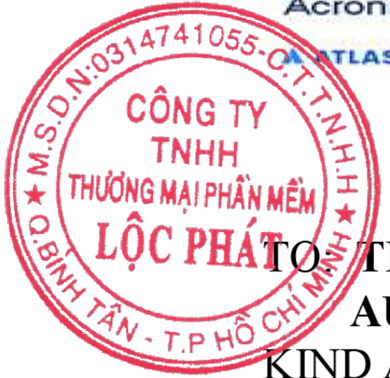

## Dear Sir;

Thank you for your attention to our products and services. Regarding your inquiry, we are pleased to send you our best quotation as below:

| No       | Part number         | Product name & Description                                                          | Qty      | Unit Price (VND)   | Sub-Total (VND)   |
|----------|---------------------|-------------------------------------------------------------------------------------|----------|--------------------|-------------------|
| Autodesk | Autodesk            | Autodesk                                                                            | Autodesk | Autodesk           | Autodesk          |
| 1        | C1GJ1- NS5025- V662 | BIM Collaborate Pro - Single User CLOUD Commercial New Annual Subscription (1 year) | 1        | 13,740,000         | 13,740,000        |

Grand Total (Exempt VAT), VND:

13,740,000

## Terms and Conditions:

1. Warranty: Warranty is in accordance with the license of respective manufacturer.
2. Delivery : elicense within 07 working days after confirming to purchase.
3. Payment : Pay adcancce 100% of total value within 03 days after the date of PO signed and 0% of total value within 20 days since the goods delivered.
4. Our bank's information :
5. Order Cancellation : All software licenses can't return to the producers, so your company must pay us 100% if you cancel the P/O.
6. Quotation Validity : This quotation is valid until 13 Jan, 2023.

Account name : CÔNG TY TNHH THUONG MAI PHÀN MM LC PHÁT

Account Number (in VND): 20 11 17 88

Bank name : Ngân Hàng TMCP Á Châu (ACB), CN. Tân Phú.

Bank Address: 973 Tân K Tân Quý, P. Bình Hưng Hòa A, Q. Bình Tân, TP.HCM

We hope you will find our price competitive and looking forward to your soonest reply. If you have any question or comments with regards to the items above, feel free to contact us at anytime. Sincerely Yours,

We hereby to confirm the above order

Ms. Vo Thi An Tien

Date:

.../2022

Phone: 0919281789

Name:

Email: tien.vo@Lpsoft.com.vn

Job title:

Updated on: 13-Dec-22

VietCAD Company Ltd.

email: info@vietcad.com

web:www.vietcad.com

Hotline: 0913 920 632

HoChiMinh City Office:

Rooms K2.25 - K2.27, 2th floor, Kingston Residence building, 223 Hoang Van Thu Str, Phu Nhuan Dist., HCMC, Vietnam

| To:        | TCIP                                     | From: VietCAD - HCMC   |
|------------|------------------------------------------|------------------------|
| Attention: | Mr. Thanh                                | Quote by: Thoi Van Ban |
| Reference: | 221214-010-111-TCIPHCM0 (Quote, BIM Pro) | Tel: 0902 432 791      |

## QUOTATION

## 221214-010-111-TCIPHCM0 (Quote, BIM Pro)

Thank you for your invitation quote on our products &amp; services. We are glad to provide you with the following quotation for your kind consideratiONG MAI SiderationHUAT ￥

| No.                      | Product Name & Description                                                              | PN                       | Offer Price (VND)        | Qty                      | Amount Price (VND)   |
|--------------------------|-----------------------------------------------------------------------------------------|--------------------------|--------------------------|--------------------------|----------------------|
| 1                        | BIM Collaborate Pro - Single User CLOUD Commercial New Annual Subscription (1 year)     | C1GJ1- NS5025- V662      | 14,900,000               | 1                        | 14,900,000           |
| 2                        | BIM Collaborate Pro - 10 Subscription CLOUD Commercial New Annual Subscription (1 year) | C1GJ1- NS4728- V996      | 137,700,000              | 1                        | 137,700,000          |
| 3                        | BIM Collaborate Pro - 25 Subscription CLOUD Commercial New Annual Subscription (1 year) | C1GJ1- NS3379- V624      | 309,000,000              | 1                        | 309,000,000          |
| Sub-Total (VND):         | Sub-Total (VND):                                                                        | Sub-Total (VND):         | Sub-Total (VND):         | Sub-Total (VND):         | NA                   |
| VAT (%):                 | VAT (%):                                                                                | VAT (%):                 | VAT (%):                 | VAT (%):                 |                      |
| Grand-Total Price (VND): | Grand-Total Price (VND):                                                                | Grand-Total Price (VND): | Grand-Total Price (VND): | Grand-Total Price (VND): | NA                   |

## Sales and Condition Terms

- 1 Prices are quoted in Vietnam dong (VNĐ)
- 3 Payment term: 100% after delivery with our documents
- 2 This quotation is valid until 13 Jan, 2023
- 4Our bank's information:

Bank: Ngân hàng TMCP Ngoi Thương Vit Nam

Account: Cong Ty TNHH Tu Van Ky Thuat Tin Hoc &amp;Thuong Mai Viet C.A.D

Account No (VND): 1033332659

- 5 Date of quotation: 13 Dec, 2022

Should you have any quetion or need more information, please contact me at 0902 432 791 and my email ban.thoi@vietcad.com

## Quoted by:

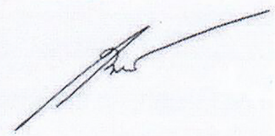

Thoi Van Ban Approved by:

## PHUÏ LUÏC BAÙO GIAÙ THIẾT BỊ VĂN PH Ò NG, MÁY TÍNH

## CÔNG TY TNHH GIÅI PHÁP CÔNG NGH ĐIN T TIN HQC KHÁNH LINH

Mã s thu (Tax Code): 0315317603

Đa ch (Address): 5A/12 Nguyn Duy, Phưòng 9, Qun 8, Thành ph Hò Chí Minh, Vit Nam

Đin thoi (Tel): 0977939777

Tài khon (A/C number): 799338888 Ngân Hàng Á Châu ( ACB ) - CN 3/2

## HÓA ĐON GIÁ TRI GIA TĂNG (VAT INVOICE)

Ngày(Date) 30 Tháng(Month) 05 Năm(Year) 2022

Ký hiu (Serial): 1C22TKL

S (No.): 266

H tên ngưi mua hàng (Buyer):

Tên đon vi (Company name):CÔNG TY C PHÀN TU VÁN XÂY DUNG TAM KIÉT

Đia chi (Address):36 Nguyn Đinh Chính, Phưòng 15, Qun Phú Nhuân, Thành Ph H Chí Minh, Viêt Nam

S tài khon (A/C No.):

Mã s thu (Tax Code):0312150258.

Hinh thc thanh toán (Payment method):Chuyn khon

| STT (No.)                                               | Tên hàng hóa, dch v (Name of goods, services)                                                               | Đon vi tính (Unit)                                      | Só lung (Quantity)                                      | Đon giá (Unit price)                                    | Thành tin (Amount)   |
|---------------------------------------------------------|-------------------------------------------------------------------------------------------------------------|---------------------------------------------------------|---------------------------------------------------------|---------------------------------------------------------|----------------------|
| 1                                                       | 2                                                                                                           | 3                                                       | 4                                                       | 5                                                       | 6=4x5                |
| 1                                                       | B vi x lý vi tính Intel Core i7-12700F (BX8071512700FSRL4R) + Qut                                           | CÁI                                                     | 2                                                       | 7.850.000                                               | 15.700.000           |
| 2                                                       | Mch chính vi tính Gigabyte GA-B660M DS3H DDR4                                                               | CÁI                                                     | 2                                                       | 2.600.000                                               | 5.200.000            |
| 3                                                       | B nhó trong Corsair DDR4,3200MHz 32GB 2x16GB DIMM,XMP 2.0,Vengeance RGB RS,RGB LED,1.35V/CMG32GX4M2E3200C16 | CÃP                                                     | 3                                                       | 3.800.000                                               | 11.400.000           |
| 4                                                       | V máy tính Xigmatek Fadil 1F                                                                                | CÁI                                                     | 2                                                       | 700.000                                                 | 1.400.000            |
| 5                                                       | BÔ NGUÒN MÁY TÍNH GIGABYTE GP - P650B 650W                                                                  | CÁI                                                     | 2                                                       | 1.150.000                                               | 2.300.000            |
| 6                                                       | Ô cng MSI 500G Spatium M390 NVME M.2                                                                        | CAI                                                     | 2                                                       | 1.700.000                                               | 3.400.000            |
| 7                                                       | Ô CÚNG VI TÍNH SEAGATE 1TB BARACUDA                                                                         | CI                                                      | 2                                                       | 800.000                                                 | 1.600.000            |
| 8                                                       | Cc màn hình Gigabyte 8GB GV-N3050GAMING OC-8GD                                                              | CI                                                      | 2                                                       | 10.100.000                                              | 20.200.000           |
| 9                                                       | B TÅN NHIT KHÍ CPU ID-COOLING SE- 226-XT ARGB                                                               | CÁI                                                     | 2                                                       | 750.000                                                 | 1.500.000            |
| 10                                                      | Màn hình LCD Dell P2422H 23.8                                                                               | CI                                                      | 2                                                       | 5.218.182                                               | 10.436.364           |
| Cng tin hàng (Total):                                   | Cng tin hàng (Total):                                                                                       | Cng tin hàng (Total):                                   | Cng tin hàng (Total):                                   | Cng tin hàng (Total):                                   | 73.136.364           |
| Thu sut GTGT (VAT Rate): 10% Tin thu GTGT (VAT Amount): | Thu sut GTGT (VAT Rate): 10% Tin thu GTGT (VAT Amount):                                                     | Thu sut GTGT (VAT Rate): 10% Tin thu GTGT (VAT Amount): | Thu sut GTGT (VAT Rate): 10% Tin thu GTGT (VAT Amount): | Thu sut GTGT (VAT Rate): 10% Tin thu GTGT (VAT Amount): | 7.313.636            |
| Tồng cng (Equivalent amount paid):                      | Tồng cng (Equivalent amount paid):                                                                          | Tồng cng (Equivalent amount paid):                      | Tồng cng (Equivalent amount paid):                      | Tồng cng (Equivalent amount paid):                      | 80.450.000           |

Ngưòi mua hàng (Buyer)

Nguòi bán hàng (Seller)

Signature Valid

Ky bi: CÔNG TY TNHH GIÅI PHÁP CÔNG NGH DIN T TIN HC KHÁNH LINH Ký ngày: 30-05-2022

Mã cůa co quan thu (Tax authority code): 00A4FA23F06A3C4A90A433C5C2BA0D2A39

Trang tra cu: http://0315317603hd.easyinvoice.vn

Mã tra cúu: c6c3q7g8093281075429720

## CÔNG TY TNHH GIÅI PHÁP CÔNG NGH ĐIN TÚ TIN HQC KHÁNH LINH

Mã sô thu (Tax Code): 0315317603

Đa chi (Address): 5A/12 Nguyn Duy, Phưòng 9, Qun 8, Thành ph H Chí Minh, Vit Nam

Đin thoi (Tel): 0977939777

Tài khon (A/C number): 799338888 Ngân Hàng Á Châu (ACB ) - CN 3/2

## HÓA ĐON GIÁ TRI GIA TĂNG

## (VAT INVOICE)

Ngày (Date) 26 Tháng (Month) 10 Năm (Year) 2022

Ký hiu (Serial): 1C22TKL

S (No.): 752

H tên ngưòi mua hàng (Buyer):

Tên don vi (Company name):CÔNG TY CO PHÀN TU VÁN XÂY DUNG TAM KIÉT.

Đia chi (Address):36 Nguyn Đinh Chính, Phuòng 15, Quân Phú Nhuîn, Thành Ph Hò Chí Minh, Vit Nam

S tài khon (A/C No.):

Mã s thu (Tax Code):0312150258.

Hinh thc thanh toán (Payment method):Chuyn khon

| STT (No.)                                               | Tên hàng hóa, dch v (Name of goods, services)                       | Đon v tính (Unit)                                       | S lung (Quantity)                                       | Đon giá (Unit price)                                    | Thành tin (Amount)   |
|---------------------------------------------------------|---------------------------------------------------------------------|---------------------------------------------------------|---------------------------------------------------------|---------------------------------------------------------|----------------------|
| 1                                                       | 2                                                                   | 3                                                       | 4                                                       | 5                                                       | 6=4x5                |
| 1                                                       | B vi x lý vi tính Intel CPU Core i7-12700 (BX8071512700SRL4Q) + Qut | Cái                                                     | 1                                                       | 8.420.000                                               | 8.420.000            |
| 2                                                       | Mch chính vi tính Gigabyte GA-Z690M A ELITE DDR4                    | Cái                                                     | 1                                                       | 4.600.000                                               | 4.600.000            |
| 3                                                       | BÔ NHÓ CUA MÁY TÍNH RAM 16GB PNY XLR8 D4 3200 U CL16                | Cái                                                     | 4                                                       | 1.020.000                                               | 4.080.000            |
| 4                                                       | đĩa cng ca máy vi tính hiu Gigabyte GP- GM30512G-G 512GB (M.2 PCIe) | Cái                                                     | 1                                                       | 1.330.000                                               | 1.330.000            |
| 5                                                       | Ô CÚNG VI TÍNH SEAGATE 1TB BARACUDA                                 | Cái                                                     | 1                                                       | 830.000                                                 | 830.000              |
| 6                                                       | Cc màn hình Asus TUF-GTX1660S-6G-GAMING                             | Cái                                                     | 1                                                       | 3.900.000                                               | 3.900.000            |
| 7                                                       | Ngun Máy Vi Tính CM MWE Bronze V2 230V 650W                         |                                                         | CáDNPUTE                                                | F1.200.000                                              | 1.200.000            |
| 8                                                       | V máy vi tính Deepcool Matrexx 40 3FS                               | Cái                                                     | 1                                                       | 790.000                                                 | 790.000              |
| 9                                                       | MÀN HINH MÁY TÍNH VIEWSONIC VX2476 - SMHD, 23.8" IPS BORDERLESS     | Cái                                                     | 5                                                       | 2.700.000                                               | 13.500.000           |
| 10                                                      | QUAT TÅN NHIT CHO CPU NOCTUA NH - D15S CPU COOLER                   | Cái                                                     | 1                                                       | 1.986.364                                               | 1.986.364            |
| Cng tin hàng (Sub total):                               | Cng tin hàng (Sub total):                                           | Cng tin hàng (Sub total):                               | Cng tin hàng (Sub total):                               | Cng tin hàng (Sub total):                               | 40.636.364           |
| Thu sut GTGT (VAT Rate): 10% Tin thu GTGT (VAT Amount): | Thu sut GTGT (VAT Rate): 10% Tin thu GTGT (VAT Amount):             | Thu sut GTGT (VAT Rate): 10% Tin thu GTGT (VAT Amount): | Thu sut GTGT (VAT Rate): 10% Tin thu GTGT (VAT Amount): | Thu sut GTGT (VAT Rate): 10% Tin thu GTGT (VAT Amount): | 4.063.636            |
| Tồng cng (Equivalent amount paid):                      | Tồng cng (Equivalent amount paid):                                  | Tồng cng (Equivalent amount paid):                      | Tồng cng (Equivalent amount paid):                      | Tồng cng (Equivalent amount paid):                      | 44.700.000           |

Ngưòi mua hàng (Buyer)

Ngưòi bán hàng (Seller)

Signature Valid K bi: CÔNG TY TNHH GIÅI PHÁP CÔNG NGH DIN TÚ TIN HQC KHÁNH LINH Ký ngày: 26- 10- 2022

Mã ca co quan thu (Tax authority code): 0050A072624C0641A4BBA3F2A9B92AC4F6

Trang tra cu: http://0315317603hd.easyinvoice.vn

Mã tra cúu: V6V3L8e0024225831017959

## CÔNG TY TNHH GIÅI PHÁP CÔNG NGH ĐIN T TIN HQC KHÁNH LINH

Mã s thu (Tax Code): 0315317603

Đa chi (Address): 5A/12 Nguyn Duy, Phưòng 9, Qun 8, Thành ph H Chí Minh, Vit Nam

Đin thoi (Tel): 0977939777

Tài khon (A/C number): 799338888 Ngân Hàng Á Châu ( ACB ) - CN 3/2

## HÓA ĐON GIÁ TRI GIA TĂNG

## (VAT INVOICE)

Ngày (Date) 08 Tháng (Month) 09 Năm (Year) 2022

Ký hiu (Serial): 1C22TKL

S (No.): 628

H tên ngưi mua hàng (Buyer):

Tn đon vi (Company name):CÔNG TY CO PHÀN TU VÁN XÂY DUNG TAM KIÉT

Đia chi (Address):36 Nguyn Đinh Chính, Phưòng 15, Qun Phú Nhun, Thành Ph H Chí Minh, Vit Nam

S tài khon (A/C No.):

Mã s thu (Tax Code):0312150258

Hinh thc thanh toán (Payment method):Chuyn khon

| STT (No.)                                                 | Tên hàng hóa, dch v (Name of goods, services)                                  | Đon vi tính (Unit)                                        | Só lung (Quantity)                                        | Don giá (Unit price)                                      | Thành tin (Amount)                                        |
|-----------------------------------------------------------|--------------------------------------------------------------------------------|-----------------------------------------------------------|-----------------------------------------------------------|-----------------------------------------------------------|-----------------------------------------------------------|
| 1                                                         | 2                                                                              | 3                                                         | 4                                                         | 5                                                         | 6=4x5                                                     |
| 1                                                         | B vi x lý vi tính Intel Core i7-12700F (BX8071512700FSRL4R) + Qut              | cái                                                       | 1                                                         | 7.400.000                                                 | 7.400.000                                                 |
| 2                                                         | Tm mch in đã lp ráp ASROCK B660M PRO RS/AX                                     | cái                                                       | 1                                                         | 2.900.000                                                 | 2.900.000                                                 |
| 3                                                         | B NHÓ CÚA MÁY TÍNH RAM 16GB PNY XLR8 D4 3200 U CL16                            | cái                                                       | 2                                                         | 1.150.000                                                 | 2.300.000                                                 |
| 4                                                         | Ô CÚNG VI TÍNH SEAGATE 1TB BARACUDA                                            | cái                                                       | 1                                                         | 850.000                                                   | 850.000                                                   |
| 5                                                         | Cc màn hình Nvidia 4GB QUADRO T600                                             | cái                                                       | 1                                                         | 4.400.000                                                 | 4.400.000                                                 |
| 6                                                         | NGUÔN MÁY TÍNH CM MWE BRONZE V2 230V 750W                                      | cái                                                       | 1                                                         | 1.500.000                                                 | 1.500.000                                                 |
| 7                                                         | V máy vi tính Deepcool Matrexx 40 3FS                                          | cái                                                       |                                                           | 800.000                                                   | 800.000                                                   |
| 8                                                         | Màn hình LCD Dell P2422H 23.8                                                  | cái                                                       | 1                                                         | 5.000.000                                                 | 5.000.000                                                 |
| 9                                                         | Ô đĩa cng ca máy vi tính hiu Gigabyte GP- GM30512G-G 512GB (M.2 PCIe)          | cái                                                       | 1                                                         | 1.350.000                                                 | 1.350.000                                                 |
| 10                                                        | B tn nhit ca CPU máy tính hiu Thermalrigth , loi Frozen Magic EX240 , có 2 qut | cái                                                       | 1                                                         | 1.681.818                                                 | 1.681.818                                                 |
| Cng tin hàng (Sub total):                                 | Cng tin hàng (Sub total):                                                      | Cng tin hàng (Sub total):                                 | Cng tin hàng (Sub total):                                 | Cng tin hàng (Sub total):                                 | 28.181.818                                                |
| Thu sut GTGT (VAT Rate): 10%                              | Thu sut GTGT (VAT Rate): 10%                                                   | Tin thu GTGT (VAT Amount):                                | Tin thu GTGT (VAT Amount):                                | Tin thu GTGT (VAT Amount):                                | 2.818.182                                                 |
| Tồng cng (Equivalent amount paid):                        | Tồng cng (Equivalent amount paid):                                             | Tồng cng (Equivalent amount paid):                        | Tồng cng (Equivalent amount paid):                        | Tồng cng (Equivalent amount paid):                        | 31.000.000                                                |
| S tin vit bàng ch (Amount in words): Ba mưoi mt triu đng. | S tin vit bàng ch (Amount in words): Ba mưoi mt triu đng.                      | S tin vit bàng ch (Amount in words): Ba mưoi mt triu đng. | S tin vit bàng ch (Amount in words): Ba mưoi mt triu đng. | S tin vit bàng ch (Amount in words): Ba mưoi mt triu đng. | S tin vit bàng ch (Amount in words): Ba mưoi mt triu đng. |

Ngưòi mua hàng (Buyer)

Ngưòi bán hàng (Seller)

Signature Valid Ký bi: CÔNG TY TNHH GIÅI PHÁP CÔNG NGH ĐIN TÚ TIN HC KHÁNH LINH Ký ngày: 08- 09- 2022

Mã cůa co quan thu (Tax authority code): 006AE6D9052294444F90402EC3BB68CB28

Trang tra cu: http://0315317603hd.easyinvoice.vn

Mã tra cu: e6e3N7e9082249223251392