## TÀI LIỆU

## HƯỚNG DẪN CHI TIẾT NỘI DUNG ÁP DỤNG MÔ HÌNH THÔNG TIN CÔNG TRÌNH (BIM) ĐỐI VỚI CÔNG TRÌNH GIAO THÔNG TRÊN ĐỊA BÀN THÀNH PHỐ HÀ NỘI

## Hà Nội - 2024

## MỤC LỤC

## Outline (Tự động tạo)

  - [TÀI LIỆU](#tài-liệu)
  - [HƯỚNG DẪN CHI TIẾT NỘI DUNG ÁP DỤNG MÔ HÌNH THÔNG TIN CÔNG TRÌNH (BIM) ĐỐI VỚI CÔNG TRÌNH GIAO THÔNG TRÊN ĐỊA BÀN THÀNH PHỐ HÀ NỘI](#hướng-dẫn-chi-tiết-nội-dung-áp-dụng-mô-hình-thông-tin-công-trình-bim-đối-với-công-trình-giao-thông-trên-địa-bàn-thành-phố-hà-nội)
  - [Hà Nội - 2024](#hà-nội---2024)
  - [1. Lời giới thiệu](#1-lời-giới-thiệu)
  - [2. Phạm vi hướng dẫn](#2-phạm-vi-hướng-dẫn)
  - [3. Căn cứ pháp lý và tài liệu viện dẫn tham khảo](#3-căn-cứ-pháp-lý-và-tài-liệu-viện-dẫn-tham-khảo)
  - [3.1. Cơ sở pháp lý](#31-cơ-sở-pháp-lý)
  - [3.2. Tài liệu viện dẫn, tham khảo nước ngoài](#32-tài-liệu-viện-dẫn-tham-khảo-nước-ngoài)
  - [4. Tiến trình triển khai áp dụng BIM](#4-tiến-trình-triển-khai-áp-dụng-bim)
  - [4.1. Tiến trình chung thực hiện áp dụng BIM](#41-tiến-trình-chung-thực-hiện-áp-dụng-bim)
  - [4.2. Vai trò và tránh nhiệm tham gia vào quá trình áp dụng BIM trong dự án](#42-vai-trò-và-tránh-nhiệm-tham-gia-vào-quá-trình-áp-dụng-bim-trong-dự-án)
  - [4.3. Sơ đồ tổ chức và danh sách nhân sự](#43-sơ-đồ-tổ-chức-và-danh-sách-nhân-sự)
  - [4.4. Xác định nội dung áp dụng BIM](#44-xác-định-nội-dung-áp-dụng-bim)
  - [4.5. Phạm vi công việc](#45-phạm-vi-công-việc)
  - [4.6. Sản phẩm bàn giao](#46-sản-phẩm-bàn-giao)
  - [4.7. Lựa chọn đơn vị thực hiện](#47-lựa-chọn-đơn-vị-thực-hiện)
  - [4.8. Công tác chuẩn bị thực hiện cho nhóm dự án](#48-công-tác-chuẩn-bị-thực-hiện-cho-nhóm-dự-án)
  - [4.9. Xây dựng / Phát triển và ứng dụng mô hình BIM](#49-xây-dựng-phát-triển-và-ứng-dụng-mô-hình-bim)
  - [4.10. Kiểm tra, phê duyệt mô hình BIM](#410-kiểm-tra-phê-duyệt-mô-hình-bim)
  - [4.11. Lưu trữ mô hình và đánh giá quá trình thực hiện](#411-lưu-trữ-mô-hình-và-đánh-giá-quá-trình-thực-hiện)
  - [5. Môi trường dữ liệu chung (CDE) cho dự án](#5-môi-trường-dữ-liệu-chung-cde-cho-dự-án)
  - [5.1. Yêu cầu tối thiểu đối khi lựa chọn CDE sử dụng cho dự án công trình giao thông](#51-yêu-cầu-tối-thiểu-đối-khi-lựa-chọn-cde-sử-dụng-cho-dự-án-công-trình-giao-thông)
  - [5.2. Nguyên tắc chung cho hoạt động của CDE](#52-nguyên-tắc-chung-cho-hoạt-động-của-cde)
  - [5.3. Cấu trúc các khu vực dữ liệu trong CDE](#53-cấu-trúc-các-khu-vực-dữ-liệu-trong-cde)
  - [5.4. Quy tắt đặt tên](#54-quy-tắt-đặt-tên)
  - [a. Mục đích](#a-mục-đích)
  - [b. Phạm vi áp dụng](#b-phạm-vi-áp-dụng)
  - [c. Quy tắc chung](#c-quy-tắc-chung)
  - [d. Quy tắc đặt tên tệp](#d-quy-tắc-đặt-tên-tệp)
  - [6. Tạo lập mô hình thông tin công trình (BIM)](#6-tạo-lập-mô-hình-thông-tin-công-trình-bim)
  - [6.1. Yêu cầu chung trong việc mô hình hóa đối tượng](#61-yêu-cầu-chung-trong-việc-mô-hình-hóa-đối-tượng)
  - [6.2. Hệ tọa độ và cao độ](#62-hệ-tọa-độ-và-cao-độ)
  - [6.3. Phân chia mô hình](#63-phân-chia-mô-hình)
  - [6.4. Mức độ phát triển thông tin (LOD)](#64-mức-độ-phát-triển-thông-tin-lod)
  - [6.5. Bảng gán màu hệ thống](#65-bảng-gán-màu-hệ-thống)
  - [6.6. Bản vẽ](#66-bản-vẽ)
  - [6.7. Quy định chung về trao đổi dữ liệu](#67-quy-định-chung-về-trao-đổi-dữ-liệu)
  - [6.8. Phần mềm và phiên bản](#68-phần-mềm-và-phiên-bản)
  - [6.9. Định dạng trao đổi dữ liệu](#69-định-dạng-trao-đổi-dữ-liệu)
  - [6.10. Quản lý dung lượng tệp](#610-quản-lý-dung-lượng-tệp)
  - [7. Quy trình phối hợp](#7-quy-trình-phối-hợp)
  - [7.1. Quy trình phối hợp BIM giữa các bên liên quan](#71-quy-trình-phối-hợp-bim-giữa-các-bên-liên-quan)
  - [7.2. Quy trình kiểm soát xung đột](#72-quy-trình-kiểm-soát-xung-đột)
  - [8. Kiểm tra và đảm bảo chất lượng mô hình](#8-kiểm-tra-và-đảm-bảo-chất-lượng-mô-hình)
  - [8.1. Đảm bảo chất lượng mô hình của bộ phân thực hiện BIM](#81-đảm-bảo-chất-lượng-mô-hình-của-bộ-phân-thực-hiện-bim)
  - [8.2. Đảm bảo chất lượng mô hình của đơn vị thực hiện chính](#82-đảm-bảo-chất-lượng-mô-hình-của-đơn-vị-thực-hiện-chính)
  - [8.3. Kiểm tra và nghiệm thu mô hình của Chủ đâu tư](#83-kiểm-tra-và-nghiệm-thu-mô-hình-của-chủ-đâu-tư)
  - [thống phân loại;](#thống-phân-loại)
  - [9. Lịch họp dự án](#9-lịch-họp-dự-án)
  - [PHỤ LỤC 01: NỘI DUNG ÁP DỤNG BIM](#phụ-lục-01-nội-dung-áp-dụng-bim)
  - [1. Tạo lập mô hình hiện trạng](#1-tạo-lập-mô-hình-hiện-trạng)
  - [2. Tạo lập thiết kế với mô hình 3D BIM](#2-tạo-lập-thiết-kế-với-mô-hình-3d-bim)
  - [a. Tạo lập mô hình BIM trong bước thiết kế cơ sở](#a-tạo-lập-mô-hình-bim-trong-bước-thiết-kế-cơ-sở)
  - [b. Tạo lập mô hình BIM trong các bước thiết kế sau thiết kế cơ sở](#b-tạo-lập-mô-hình-bim-trong-các-bước-thiết-kế-sau-thiết-kế-cơ-sở)
  - [3. Diễn họa phương án thiết kế](#3-diễn-họa-phương-án-thiết-kế)
  - [4. Phân tích mô phỏng giao thông](#4-phân-tích-mô-phỏng-giao-thông)
  - [5. Phối hợp giữa các bộ môn](#5-phối-hợp-giữa-các-bộ-môn)
  - [6. Kiểm tra thiết kế](#6-kiểm-tra-thiết-kế)
  - [7. Triển khai bản vẽ thiết kế từ mô hình](#7-triển-khai-bản-vẽ-thiết-kế-từ-mô-hình)
  - [8. Xuất và kiểm soát khối lượng thông qua mô hình](#8-xuất-và-kiểm-soát-khối-lượng-thông-qua-mô-hình)
  - [9. Phối hợp giữa các bên liên quan trong dự án](#9-phối-hợp-giữa-các-bên-liên-quan-trong-dự-án)
  - [10. Mô phỏng biện pháp và trình tự thi công 4D](#10-mô-phỏng-biện-pháp-và-trình-tự-thi-công-4d)
  - [11. Lập mô hình hoàn công](#11-lập-mô-hình-hoàn-công)
  - [12. Chuyển giao mô hình BIM hoàn công](#12-chuyển-giao-mô-hình-bim-hoàn-công)
  - [PHỤ LỤC 02:](#phụ-lục-02)
  - [YÊU CẦU MỨC ĐỘ PHÁT TRIỂN THÔNG TIN HÌNH HỌC (LOD-G) VÀ THÔNG TIN PHI HÌNH HỌC (LOD-I) CHO CÔNG TRÌNH GIAO THÔNG GẮN VỚI CÁC GIAI ĐOẠN TRIỂN KHAI DỰ ÁN](#yêu-cầu-mức-độ-phát-triển-thông-tin-hình-học-lod-g-và-thông-tin-phi-hình-học-lod-i-cho-công-trình-giao-thông-gắn-với-các-giai-đoạn-triển-khai-dự-án)
  - [PHỤ LỤC 03:](#phụ-lục-03)
  - [BIỂU MẪU KẾ HOẠCH CHUYỂN GIAO THÔNG TIN TỔNG THỂ (MIDP)](#biểu-mẫu-kế-hoạch-chuyển-giao-thông-tin-tổng-thể-midp)

| 1. Lời giới thiệu                                                                                                                                                                          | ........................................................................................................................ 3                                                            |
|--------------------------------------------------------------------------------------------------------------------------------------------------------------------------------------------|---------------------------------------------------------------------------------------------------------------------------------------------------------------------------------------|
| 2. Phạm vi hướng dẫn                                                                                                                                                                       | ............................................................................................................. 3                                                                       |
| 3. Căn cứ pháp lý và tài liệu viện dẫn tham khảo                                                                                                                                           | ................................................................. 4                                                                                                                   |
| 3.1. Cơ sở pháp lý                                                                                                                                                                         | .................................................................................................................. 4                                                                  |
| 3.2. Tài liệu viện dẫn, tham khảo nước ngoài                                                                                                                                               | ........................................................................ 4                                                                                                            |
| 4. Tiến trình triển khai áp dụng BIM ....................................................................................                                                                  | 5                                                                                                                                                                                     |
| 4.1. Tiến trình chung thực hiện áp dụng BIM ........................................................................                                                                       | 5                                                                                                                                                                                     |
| 4.2. Vai trò và tránh nhiệm tham gia vào quá trình áp dụng BIM trong dự án ......................                                                                                          | 5                                                                                                                                                                                     |
| 4.3. Sơ đồ tổ chức và danh sách nhân sự                                                                                                                                                    | ............................................................................. 10                                                                                                      |
| 4.4. Xác định nội dung áp dụng BIM...................................................................................                                                                      | 11                                                                                                                                                                                    |
| 4.5. Phạm vi công việc                                                                                                                                                                     | ......................................................................................................... 15                                                                          |
| 4.6. Sản phẩm bàn giao                                                                                                                                                                     | ........................................................................................................ 16                                                                           |
| 4.7. Lựa chọn đơn vị thực hiện                                                                                                                                                             | ............................................................................................ 17                                                                                       |
| 4.8. Công tác chuẩn bị thực hiện cho nhóm dự án ...............................................................                                                                            | 19                                                                                                                                                                                    |
| 4.9. Xây dựng / Phát triển và ứng dụng mô hình BIM.........................................................                                                                                | 19                                                                                                                                                                                    |
| 4.10. Kiểm tra, phê duyệt mô hình BIM ..............................................................................                                                                       | 20                                                                                                                                                                                    |
| 4.11. Lưu trữ mô hình và đánh giá quá trình thực hiện                                                                                                                                      | ....................................................... 20                                                                                                                            |
| 5. Môi trường dữ liệu chung (CDE) cho dự án                                                                                                                                                | ................................................................... 20                                                                                                                |
| 5.1. Yêu cầu tối thiểu đối khi lựa chọn CDE sử dụng cho dự án công trình giao thông                                                                                                        | ..... 20                                                                                                                                                                              |
| 5.2. Nguyên tắc chung cho hoạt động của CDE ..................................................................                                                                             | 21                                                                                                                                                                                    |
| 5.3. Cấu trúc các khu vực dữ liệu trong CDE ......................................................................                                                                         | 21                                                                                                                                                                                    |
| 5.4. Quy tắt đặt tên                                                                                                                                                                       | 22                                                                                                                                                                                    |
| 6. Tạo lập mô hình thông tin công trình (BIM)                                                                                                                                              | ............................................................................................................... .................................................................. 27 |
| 6.1. Yêu cầu chung trong việc mô hình hóa đối tượng                                                                                                                                        | ........................................................ 27                                                                                                                           |
| 6.2. Hệ tọa độ và cao độ .......................................................................................................                                                           | 28                                                                                                                                                                                    |
| 6.3. Phân chia mô hình .........................................................................................................                                                           | 28                                                                                                                                                                                    |
| 6.4. Mức độ phát triển thông tin (LOD) ...............................................................................                                                                     | 29                                                                                                                                                                                    |
| 6.5. Bảng gán màu hệ thống                                                                                                                                                                 | ................................................................................................ 30                                                                                   |
| 6.6. Bản vẽ                                                                                                                                                                                | ........................................................................................................................... 31                                                        |
| 6.7. Quy định chung về trao đổi dữ liệu ..............................................................................                                                                     | 31                                                                                                                                                                                    |
| 6.8. Phần mềm và phiên bản ................................................................................................                                                                | 32                                                                                                                                                                                    |
| 6.9. Định dạng trao đổi dữ liệu                                                                                                                                                            | ............................................................................................ 33                                                                                       |
| 6.10. Quản lý dung lượng tệp                                                                                                                                                               | .............................................................................................. 33                                                                                     |
| 7. Quy trình phối hợp                                                                                                                                                                      | ............................................................................................................ 34                                                                       |
| 7.1. Quy trình phối hợp BIM giữa các bên liên quan ..........................................................                                                                              | 34                                                                                                                                                                                    |
| 7.2. Quy trình kiểm soát xung đột                                                                                                                                                          | ....................................................................................... 35                                                                                            |
| 8. Kiểm tra và đảm bảo chất lượng mô hình                                                                                                                                                  | ....................................................................... 37                                                                                                            |
| 8.1. Đảm bảo chất lượng mô hình của bộ phân thực hiện BIM ...........................................                                                                                      | 37                                                                                                                                                                                    |
| 8.2. Đảm bảo chất lượng mô hình của đơn vị thực hiện chính                                                                                                                                 | ............................................ 38                                                                                                                                       |
| 8.3. Kiểm tra và nghiệm thu mô hình của Chủ đâu tư .........................................................                                                                               | 39                                                                                                                                                                                    |
| 9. Lịch họp dự án                                                                                                                                                                          | ................................................................................................................... 43                                                                |
| PHỤ LỤC 01: .........................................................................................................................                                                      | 44                                                                                                                                                                                    |
| NỘI DUNG ÁP DỤNG BIM                                                                                                                                                                       | ................................................................................................. 44                                                                                  |
| PHỤ LỤC 02: .........................................................................................................................                                                      | 58                                                                                                                                                                                    |
| YÊU CẦU MỨC ĐỘ PHÁT TRIỂN THÔNG TIN HÌNH HỌC (LOD-G) VÀ                                                                                                                                    |                                                                                                                                                                                       |
| THÔNG                                                                                                                                                                                      |                                                                                                                                                                                       |
| TIN PHI HÌNH HỌC (LOD-I) CHO CÔNG TRÌNH GIAO THÔNG GẮN VỚI CÁC GIAI ĐOẠN TRIỂN KHAI DỰ ÁN .................................................................................... PHỤ LỤC 03: | 58 ......................................................................................................................... 74                                                       |
| BIỂU MẪU KẾ HOẠCH CHUYỂN GIAO THÔNG TIN TỔNG THỂ (MIDP)                                                                                                                                    | ............ 74                                                                                                                                                                       |

## 1. Lời giới thiệu

Đối với mỗi quốc gia, hệ thống công trình hạ tầng kỹ thuật đóng vai trò rất quan trọng và là nền tảng cho hoạt động kinh tế, văn hóa, xã hội. Trong quá trình phát triển, hệ thống cơ sở hạ tầng cần phải được xem xét, đánh giá và lựa chọn phương án kỹ càng để có thể phát huy hiệu quả tốt đa của dự án và giảm thiểu những thất thoát, lãng phí.

Hiện nay, để thực hiện chương trình chuyển đổi số quốc gia, TP. Hà Nội đã ban hành kế hoạch chuyển đổi số, xây dựng thành phố Hà Nội thông minh đến năm 2025 định hướng 2030. Một trong những nội dung quan trọng của đề án trên, TP. Hà Nội đang tiến hành thực hiện Đề án xây dựng hệ thống giao thông thông minh. Để có thể thực hiện được đề án này, cần thực hiện xây dựng cơ sở dữ liệu về công trình giao thông của thành phố một cách đồng bộ và đảm bảo tính kết nối giữa các hệ thống. Qua xem xét đánh giá việc áp dụng BIM cho công trình hạ tầng kỹ thuật tại các quốc gia trên thế giới và qua quá trình thực hiện Quyết định số 2500/QĐ-TTg với các dự án thí điểm, BIM đã từng bước phát huy được hiệu quả trong việc nâng cao chất lượng và giảm tiến độ trong quá trình thực hiện các dự án. Đồng thời các thông tin từ BIM cũng sẽ là cơ sở nền tảng quan trọng trong giai đoạn vận hành, khai thác công trình và xây dựng hệ thống giao thông thông minh. Tuy nhiên, việc áp dụng BIM đòi hỏi một lộ trình chuyển đổi hợp lý về hành lang pháp lý, quy trình BIM, con người và công nghệ. Đặc biệt, đối với các dự án xây dựng công trình giao thông với đặc thù thường có quy mô lớn, triển khai trên phạm vi rộng và tác động lớn đến đời sống,  kinh tế,  xã  hội,  việc  xây  dựng  các  nội  dung  hướng  dẫn  chi  tiết  áp dụng càng trở nên cấp thiết.  Để  tạo  điều  kiện  thuận  lợi  và  thúc  đẩy  việc  áp dụng BIM vào các dự án theo Quyết định số 258/QĐ-TTg ngày 17/3/2023 của Thủ tướng Chính phủ về phê duyệt Lộ trình áp dụng Mô hình thông tin công trình (BIM) trong hoạt động xây dựng. Sở Giao thông Vận tải biên soạn Hướng dẫn dẫn chi tiết nội dung áp dụng mô hình thông tin công trình (BIM) đối với công trình giao thông trên địa bàn thành phố Hà Nội và được Ủy ban nhân dân Thành phố Hà Nội công bố để làm căn cứ hướng dẫn áp dụng BIM đối với công trình giao thông trên địa bàn Thành phố.

Trong Hướng dẫn này làm rõ các mục tiêu, nội dung áp dụng BIM tối thiểu, Môi trường dữ liệu chung (CDE) và các yêu cầu thông tin chuyển giao trong các giai đoạn thực hiện dự án đối với công trình giao thông trên địa bàn Thành phố Hà Nội.

## 2. Phạm vi hướng dẫn

Hướng dẫn này để các bên có liên quan tham khảo khi triển khai áp dụng BIM trong hoạt động xây dựng công trình giao thông trên địa bàn Thành phố Hà Nội.

Nội dung hướng dẫn cung cấp những trình tự và nội dung chi tiết để triển khai áp dụng BIM cho công trình giao thông trên địa bàn Thành phố Hà Nội.

Hướng dẫn này có thể táp dụng cho toàn bộ giai đoạn đầu tư xây dựng công trình giao thông, bao gồm các giai đoạn chuẩn bị dự án, giai đoạn thực hiện dự án, giai đoạn kết thúc xây dựng và đưa công trình vào vận hành.

Các nội  dung  trong  hướng  dẫn  này  được  hiểu  và  áp  dụng  phù  hợp  với từng quy mô và mức độ phức tạp của dự án. Các bên liên quan cần xem xét các nội  dung  và  thỏa  thuận  thống  nhất  trong  quá  trình  triển  khai,  dựa  trên  kinh nghiệm của mỗi bên, khả năng huy động nguồn lực, mức độ phức tạp của dự án và các quy định pháp lý khác có liên quan.

## 3. Căn cứ pháp lý và tài liệu viện dẫn tham khảo

## 3.1. Cơ sở pháp lý

+ Nghị định 15/2021/NĐ-CP ngày 3/3/2021 của Chính phủ về quản lý dự án đầu tư xây dựng;
+ Quyết định 258/QĐ-TTg ngày 17/03/2023 của Thủ tướng chính phủ về Lộ trình áp dụng Mô hình thông tin công trình (BIM) trong hoạt động xây dựng.
+ Quyết định số 348/QĐ-BXD ngày 02/04/2021 của Bộ Xây dựng về việc Công bố Hướng dẫn chung áp dụng Mô hình thông tin công trình (BIM);
+ Quyết định số 347/QĐ-BXD ngày 02/04/2021 của Bộ Xây dựng về việc Công bố Hướng dẫn chi tiết áp dụng Mô hình thông tin công trình (BIM) đối với công trình dân dụng và công trình hạ tầng kỹ thuật đô thị;
+  Thông  tư  số  12/2021/TT-BXD  ngày  31/8/2021  của  Bộ  Xây  dựng  về việc Ban hành định mức Xây dựng;
+  Kế  hoạch  số  57/KH-UBND  ngày  08/02/2024  của  Ủy  ban  Nhân  dân Thành phố Hà Nội ban hành Kế hoạch 'Chuyển đổi số, xây dựng thành phố Hà Nội thông minh năm 2024'.

## 3.2. Tài liệu viện dẫn, tham khảo nước ngoài

+ ISO 19650-1:2018: Organization and digitization of information about buildings  and  civil  engineering  works,  including  building  information modelling (BIM) - Information management using building information modelling - Part 1: Concepts and principles;
+ ISO 19650-2:2018: Organization and digitization of information about buildings  and  civil  engineering  works,  including  building  information modelling  (BIM)  -  Information  management  using  building  information modelling - Part 2: Delivery phase of the assets
+ Singapore BIM Guide Version 2;
+ Common InfraBIM Requirements YIV 2019 (Phần Lan):

+ Tiêu chuẩn BIM quốc gia của Hòa Kỳ - NBIMS v3.

## 4. Tiến trình triển khai áp dụng BIM

## 4.1. Tiến trình chung thực hiện áp dụng BIM

Tiến trình thực hiện áp dụng BIM trong một dự án không làm thay đổi tiến trình triển khai dự án theo các quy định hiện hành mà hướng tới việc thúc đẩy quá trình chuyển giao thông tin ở dạng số và thúc đẩy quá trình phối hợp, trao đổi thông tin giữa các bên liên quan trong dự án.

Căn cứ theo hướng dẫn chung áp dụng Mô hình thông tông tin công trình (BIM), các bước triển khai điển hình cho việc áp dụng BIM trong dự án đầu tư xây dựng công trình giao thông được thực hiện theo tiến trình dưới đây:

Hình 1: Tiến trình tổng quát việc áp dụng BIM

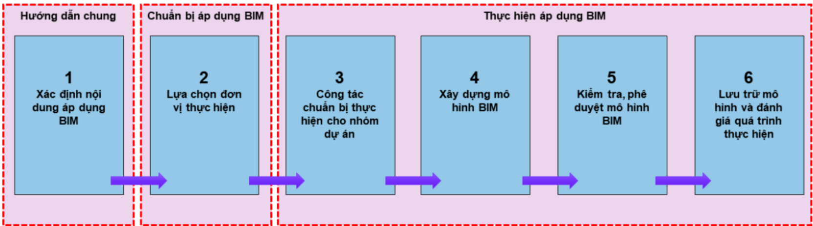

Hình trên thể hiện các bước triển khai điển hình của việc tạo lập mô hình BIM trong dự án đầu tư xây dựng theo Quyết định 348/QĐ-BXD.

## 4.2. Vai trò và tránh nhiệm tham gia vào quá trình áp dụng BIM trong dự án

Hình 2: Ví dụ sơ đồ tổ chức phối hợp, trao đổi thông tin dự án Chú thích:

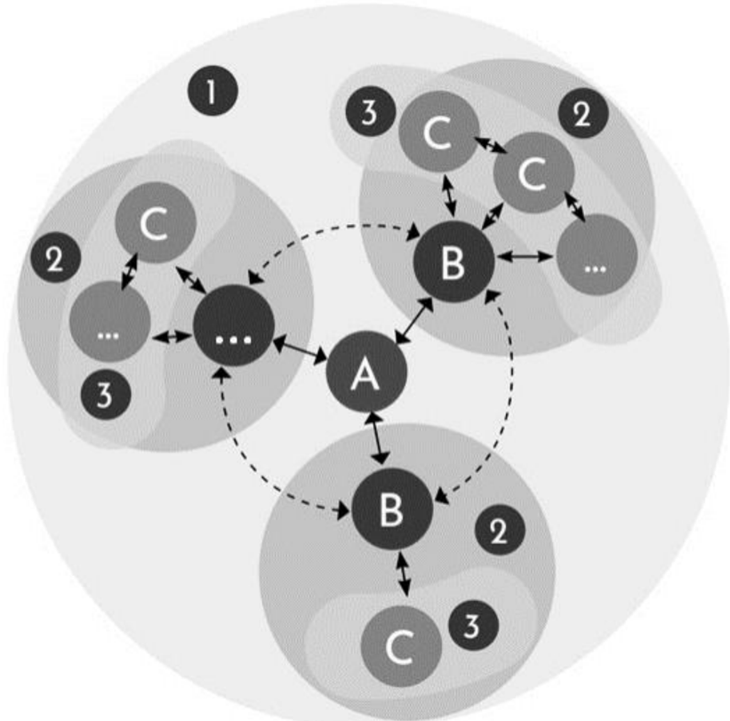

A: Chủ đầu tư hoặc đơn vị được chủ đầu tư ủy quyền quản lý (Ban quản lý dự án,…);

- B: Đơn vị thực hiện chính - là nhà thầu tư vấn chính hoặc nhà thầu thi công chính;
- C: Đơn vị/ bộ phận thực hiện - là nhà thầu phụ hoặc đơn vị thực hiện BIM;
- 1: Nhóm dự án: Nhóm dự án được hiểu là nhóm các tổ chức (bao gồm chủ đầu tư/ ban quản lý dự án, tư vấn, thi công, và các đơn vị khác có liên quan) sẽ phối hợp chính để thực hiện áp dụng BIM trong dự án;
- 2: Nhóm thực hiện chính: Bao gồm Đơn vị thực hiện chính và các Đơn vị thực hiện;
- 3: Nhóm thực hiện: Bao gồm các Đơn vị thực hiện;
- Các yêu cầu thông tin và trao đổi thông tin giữa các bên liên quan;
- Phối hợp, trao đổi thông tin giữa các bên liên quan.

Căn cứ vào quy mô dự án và vai trò của các bên liên quan, chủ đầu tư xây dựng sơ đồ tổ chức phối hợp và trao đổi thông tin trong dự án.

Các nhiệm vụ chính của Chủ đầu tư, Bên thực hiện chính, Bên thực hiện căn cứ theo Quyết định 348/QĐ-BXD để thực hiện đúng chức năng nhiệm vụ. Với đặc thù các dự án đầu tư xây dựng công trình giao thông, các đơn vị chính tham gia bao gồm:

+ Chủ Đầu tư: Chủ đầu tư thành lập bộ phận hoặc cử cán bộ phụ trách việc áp dụng và quản lý BIM cho dự án. Chủ đầu tư có thể giao nhiệm vụ này cho Ban quản lý dự án thực hiện. Trong trường hợp Chủ đầu tư hoặc Ban quản lý dự án chưa có năng lực thực hiện, có thể thuê đơn vị Tư vấn BIM độc lập thực hiện hỗ trợ công tác quản lý BIM trong quá trình thực hiện dự án.

+ Tư vấn thiết kế: Đơn vị thực hiện hồ sơ thiết kế cho dự án, đồng thời cũng có thể đóng vai trò là Tư vấn BIM cho dự án. Trong trường hợp tư vấn thiết kế chưa đáp ứng đầy đủ các yêu cầu áp dụng BIM của Chủ đầu tư cần phối hợp với đơn vị Tư vấn BIM độc lập để hỗ trợ triển khai BIM;
+ Tư vấn thẩm tra: Đơn vị thực hiện tư vấn thẩm tra trong quá trình thiết kế/ thi công dự án;
+ Tư vấn giám sát: Đơn vị thực hiện tư vấn giám sát trong quá trình thi công dự án;
+ Nhà thầu thi công: Các đơn vị thực hiện thi công các gói thầu của dự án, đơn vị nhà thầu thi công cần thành lập bộ phận BIM để phụ trách triển khai các nội dung áp dụng BIM liên quan; Trong trường hợp nhà thầu thi công chưa đáp ứng đầy đủ các yêu cầu áp dụng BIM của Chủ đầu tư cần phối hợp với đơn vị Tư vấn BIM độc lập để hỗ trợ triển khai BIM;
+ Cơ quan quản lý nhà nước;

Các đơn vị liên quan cần cung cấp nhân sự phụ trách về BIM để thực hiện các công việc theo trách nhiệm được phân công trong bảng ma trận RACI. Sử dụng ma trận RACI để phân phối vai trò và trách nhiệm như trình bày tham khảo trong các bảng dưới đây:

+ R (Responsible) = Chịu trách nhiệm thực hiện nhiệm vụ;
+ A (Accountable) = Chịu trách nhiệm Phê duyệt - Phân công nhiệm vụ và xác nhận kết quả;
+ C (Consulted) = Có nhiệm vụ tham mưu, cung cấp đầu vào để hoàn thành nhiệm vụ;
+ I (Informed) = Có nhiệm vụ báo cáo, chia sẻ thông tin về nhiệm vụ và/hoặc kết quả.

| TRÁCH NHIỆM                                                                                                                             | Cơ quan quản lý Nhà nước   | Chủ đầu tư/ Ban quản lý dự án   | Tư vấn BIM/ Quản lý BIM   | Bên tư vấn thiết kế   | Tư vấn thẩm tra và tư vấn giám sát   | Nhà thầu thi công   |
|-----------------------------------------------------------------------------------------------------------------------------------------|----------------------------|---------------------------------|---------------------------|-----------------------|--------------------------------------|---------------------|
| Môi trường dữ liệu chung                                                                                                                |                            |                                 |                           |                       |                                      |                     |
| Góp ý về các yêu cầu liên quan đến CDE                                                                                                  | C                          | A                               | C                         | C                     |                                      |                     |
| Cung cấp CDE                                                                                                                            | C                          | R                               | C                         | C                     | C                                    | C                   |
| Thiết lập CDE                                                                                                                           | C                          | A                               | R                         | C                     | C                                    | C                   |
| Bảo trì CDE                                                                                                                             |                            | I                               | R                         | I                     | I                                    | I                   |
| Tải về/Tải lên tất cả thông tin của dự án                                                                                               | R                          | R                               | R                         | R                     | R                                    | R                   |
| Nguồn lực                                                                                                                               |                            |                                 |                           |                       |                                      |                     |
| Đảm bảo phần cứng và phần mềm cần thiết đã được thiết lập trong các đơn vị để hỗ trợ hiệu quả cho quá trình cung cấp sản phẩm cho dự án | R                          | R                               | R                         | R                     | R                                    | R                   |
| Đánh giá tất cả các nhà thầu phụ (cả nhà thầu thiết kế lẫn thi công) theo các tiêu chí trong Phụ lục 'Đánh giá năng lực BIM'            |                            | A                               | C                         | R                     | R                                    | R                   |
| Cung cấp các hướng dẫn để giúp lựa chọn đúng các khóa đào tạo từ các đối tác đáng tin cậy                                               |                            | I                               | R                         | I                     | I                                    | I                   |

| TRÁCH NHIỆM                                                                                                | Cơ quan quản lý Nhà nước   | Chủ đầu tư/ Ban quản lý dự án   | Tư vấn BIM/ Quản lý BIM   | Bên tư vấn thiết kế   | Tư vấn thẩm tra và tư vấn giám sát   | Nhà thầu thi công   |
|------------------------------------------------------------------------------------------------------------|----------------------------|---------------------------------|---------------------------|-----------------------|--------------------------------------|---------------------|
| Phối hợp đào tạo giữa các bên                                                                              | R                          | R                               | R                         | R                     | R                                    | R                   |
| Áp dụng BIM                                                                                                |                            |                                 |                           |                       |                                      |                     |
| Thiết lập các yêu cầu của BIM cho dự án                                                                    |                            | R                               | C                         |                       |                                      |                     |
| Xây dựng, thực hiện và cập nhật Kế hoạch thực hiện BIM (BEP)                                               |                            | A                               | R                         | C                     | C                                    | C                   |
| Xây dựng và triển khai kế hoạch chuyển giao thông tin                                                      |                            | A                               | I                         | R                     | C                                    | R                   |
| Thu thập và cập nhật Kế hoạch chuyển giao thông tin tổng thể (MIDP)                                        |                            | I                               |                           | R                     |                                      | R                   |
| Hướng dẫn các vấn đề liên quan - BIM và theo dõi các bên tham gia dự án                                    |                            | C                               | R                         |                       |                                      |                     |
| Cung cấp các thông tin tham khảo (bao gồm dữ liệu khảo sát và các mô hình hiện trạng)                      |                            | R                               |                           |                       |                                      |                     |
| Hình học                                                                                                   |                            |                                 |                           |                       |                                      |                     |
| Tạo mô hình bao gồm hệ tọa độ gốc và hệ lưới trục để sử dụng phổ biến cho tất cả các đơn vị tham gia dự án |                            | I                               | A                         | R                     |                                      |                     |
| Cung cấp mô hình phù hợp với các yêu cầu trong Kế hoạch chuyển giao thông tin tổng thể (MIDP)              |                            | I                               | A                         | R                     |                                      |                     |
| Triển khai Kế hoạch thực hiện BIM (BEP) trong đơn vị                                                       |                            | I                               | A                         | R                     | R                                    | R                   |
| Cung cấp các mô hình phân tích kết cấu để đội ngũ dự án đánh giá (nếu có)                                  |                            |                                 |                           | R                     |                                      |                     |
| Tạo báo cáo phát hiện xung đột từ mô hình liên kết                                                         |                            |                                 | I                         | R                     |                                      |                     |

| TRÁCH NHIỆM                                                                                             | Cơ quan quản lý Nhà nước   | Chủ đầu tư/ Ban quản lý dự án   | Tư vấn BIM/ Quản lý BIM   | Bên tư vấn thiết kế   | Tư vấn thẩm tra và tư vấn giám sát   | Nhà thầu thi công   |
|---------------------------------------------------------------------------------------------------------|----------------------------|---------------------------------|---------------------------|-----------------------|--------------------------------------|---------------------|
| Xác định các dữ liệu cần thiết (bao gồm mục đích và thời gian chuyển giao)                              | C                          | R                               | C                         | C                     |                                      | C                   |
| Dữ liệu                                                                                                 |                            |                                 |                           |                       |                                      |                     |
| Khởi tạo, thu thập và lưu trữ các thông tin theo yêu cầu                                                |                            |                                 | R                         | R                     |                                      | R                   |
| Xem xét và chấp thuận dữ liệu được chuyển giao trước khi đệ trình                                       |                            |                                 | R                         | R                     |                                      | R                   |
| Quản lý thi công                                                                                        |                            |                                 |                           |                       |                                      |                     |
| Cung cấp tổ chức và biện pháp thi công chủ đạo (4D)                                                     |                            | A                               |                           |                       |                                      | R                   |
| Cung cấp trình tự thi công (4D)                                                                         |                            | A                               |                           |                       |                                      | R                   |
| Cập nhật các mô hình mô phỏng 4D để phản ảnh hiện trạng của dự án                                       |                            | A                               |                           |                       |                                      | R                   |
| Xác định các công cụ quản lý thi công phù hợp để sử dụng mô hình BIM trong quá trình thi công           |                            | A                               | C                         | C                     | C                                    | C                   |
| Báo cáo các rủi ro có thể dựa trên mô hình BIM và chia sẻ thông qua môi trường dữ liệu chung (CDE)      |                            | I                               | R                         | C                     | C                                    | C                   |
| Kiểm tra và đảm bảo chất lượng                                                                          |                            |                                 |                           |                       |                                      |                     |
| Tuân thủ thủ tục Kiểm tra và bảo đảm chất lượng (QA/QC) có trong Hồ sơ yêu cầu thông tin trao đổi (EIR) |                            | R                               | R                         | R                     | C                                    | R                   |
| Đảm bảo tất cả các thông tin đáp ứng yêu cầu (chất lượng và số lượng)                                   |                            |                                 | I                         | R                     | C                                    | R                   |
| Tinh lọc tất cả các đối tượng không được sử dụng trong mô hình                                          |                            |                                 | I                         | R                     |                                      | R                   |
| Kiểm tra và phối hợp mô hình, bao                                                                       |                            |                                 | I                         | R                     | C                                    | R                   |

Bảng 1: Bảng ma trận trách nhiệm các bên tham gia dự án

| TRÁCH NHIỆM                                                                                                                     | Cơ quan quản lý Nhà nước   | Chủ đầu tư/ Ban quản lý dự án   | Tư vấn BIM/ Quản lý BIM   | Bên tư vấn thiết kế   | Tư vấn thẩm tra và tư vấn giám sát   | Nhà thầu thi công   |
|---------------------------------------------------------------------------------------------------------------------------------|----------------------------|---------------------------------|---------------------------|-----------------------|--------------------------------------|---------------------|
| gồm công tác phát hiện xung đột đầy đủ và liên tục theo Kế hoạch thực hiện BIM                                                  |                            |                                 |                           |                       |                                      |                     |
| Báo cáo chung về chất lượng mô hình                                                                                             |                            |                                 | I                         | R                     | C                                    | R                   |
| Báo cáo về sự tuân thủ Kế hoạch thực hiện BIM (BEP) liên quan đến mức độ phát triển thông tin (LOD)                             |                            |                                 | I                         | R                     | C                                    | R                   |
| Báo cáo về nội dung sử dụng mô hình trong việc lập biện pháp và thể hiện trình tự thi công (4D)                                 |                            |                                 | I                         | R                     | C                                    | R                   |
| Báo cáo về nội dung sử dụng mô hình trong bóc tách khối lượng                                                                   |                            |                                 | I                         | R                     | C                                    | R                   |
| Xem xét dữ liệu nhận được và so sánh với yêu cầu trong hồ sơ Yêu cầu thông tin trao đổi (EIR)                                   |                            | R                               | R                         | R                     | C                                    |                     |
| Tổ chức họp và báo cáo                                                                                                          |                            |                                 |                           |                       |                                      |                     |
| Sử dụng mô hình trong cuộc họp giữa đơn vị tư vấn thiết kế, Chủ đầu tư, nhà thầu thi công và các bên liên quan khác trong dự án |                            |                                 |                           | R                     |                                      | R                   |
| Tổ chức các cuộc họp định kỳ về BIM                                                                                             |                            | I                               | R                         | R                     |                                      | R                   |
| Tổ chức các buổi học tập/ đào tạo hoặc rút kinh nghiệm qua các giai đoạn                                                        | C                          | R                               | R                         | R                     | R                                    | R                   |

## 4.3. Sơ đồ tổ chức và danh sách nhân sự

Các đơn vị có liên quan cần xây dựng sơ đồ tổ chức để thể hiện các mối liên hệ giữa các chủ thể tham gia nhằm thuận lợi trong việc phối hợp.

Các đơn vị có liên quan cần cử nhân sự phụ trách về BIM của đơn vị mình để thực hiện các nội dung công việc như quy định. Trách nhiệm thực hiện các công việc cụ thể tham khảo theo Bảng 1: Bảng ma trận trách nhiệm các bên tham gia dự án. Biểu mẫu thành viên tham gia dự án dưới đây:

| STT                    | Họ và tên              | Vai trò                 | Đơn vị                 | Điện thoại             | Email                  | Ghi chú                |
|------------------------|------------------------|-------------------------|------------------------|------------------------|------------------------|------------------------|
| Chủ đầu tư             | Chủ đầu tư             | Chủ đầu tư              | Chủ đầu tư             | Chủ đầu tư             | Chủ đầu tư             | Chủ đầu tư             |
| ..                     | ….                     | Quản lý BIM             | ….                     | ….                     | ….                     | ….                     |
| Đơn vị thực hiện chính | Đơn vị thực hiện chính | Đơn vị thực hiện chính  | Đơn vị thực hiện chính | Đơn vị thực hiện chính | Đơn vị thực hiện chính | Đơn vị thực hiện chính |
| ..                     | ….                     | Điều phối BIM           | ….                     | ….                     | ….                     | ….                     |
| Bộ phận thực hiện BIM  | Bộ phận thực hiện BIM  | Bộ phận thực hiện BIM   | Bộ phận thực hiện BIM  | Bộ phận thực hiện BIM  | Bộ phận thực hiện BIM  | Bộ phận thực hiện BIM  |
| …                      | …                      | Trưởng nhóm BIM cầu     | ….                     | ….                     | ….                     | ….                     |
| …                      | …                      | Trưởng nhóm BIM đường   | ….                     | ….                     | ….                     | ….                     |
| …                      | …                      | Chuyên viên tạo mô hình | ….                     | ….                     | ….                     | ….                     |

## 4.4. Xác định nội dung áp dụng BIM

Chủ đầu tư căn cứ vào chiến lược phát triển của ngành, địa phương hoặc của  tổ  chức;  Căn  cứ  trên  mục  đích  áp  dụng  BIM  trong  hoạt  động  xây  dựng công trình giao thông trên địa bàn  Thành phố Hà Nội; các mục tiêu cần đạt được của dự án và các yêu cầu nội dung áp dụng tối thiểu nhưng không giới hạn về các nội dung áp dụng trong hướng dẫn này để xác định các nội dung áp dụng BIM.

a. Mục tiêu chung áp dụng BIM cho dự án công trình giao thông trên địa bàn Thành phố Hà Nội gồm các nội dung sau:

+ Nâng cao chất lượng công trình thông qua nâng cao chất lượng công tác thiết kế thông qua việc đảm bảo lựa chọn phương án thiết kế tối ưu, hạ chế sai sót, xử lý xung đột trong hệ thống giao thông;
+  Nâng  cao  khả  năng  phối  hợp  giữa  các  bộ  môn  và  các  bên  liên  quan trong suốt quá trình thực hiện dự án, giúp tiết kiệm chi phí giúp tiết kiệm thời gian trao đổi và phê duyệt;
+ Mô phỏng giao thông phục vụ việc rút ngắn thời gian cấp phép thi công và tổ chức giao thông tối ưu nhằm hạn chế gây ảnh huởng dến giao thông hiện hữu.

+ Nâng cao chất lượng trong công tác quản lý dự án thông qua việc sử dụng thông tin tin cậy từ mô hình BIM (như hình ảnh trực quan, tiến độ, khối lượng,…)hỗ trợ cho việc ra quyết định chính xác.
+  Số  hóa  công  trình  giao  thông  để  làm  nền  tảng  cho  việc  xây  dựng  hệ thống giao thông thông minh của Thành phố Hà Nội.
- b. Mục tiêu cụ thể áp dụng BIM cho dự án được xác định từ mục tiêu chung với các lợi ích của việc sử dụng mô hình BIM. Những lợi ích cơ bản của việc áp dụng BIM đã được kiểm chứng cho công trình giao thông được gắn liền với các giai đoạn triển khai của dự án, bao gồm:
- -Giai đoạn chuẩn bị đầu tư:
+ Xây dựng mô hình hiện trạng để cung cấp thông tin trực quan, chính xác cho các giai đoạn sau (thông tin về hệ thống hạ tầng hiện hữu, thông tin về mặt bằng thi công...);
+ Mô hình hóa để thể hiện trực quan, giúp các thành viên tham gia dự án hiểu rõ khi thảo luận, phân công các nhiệm vụ hoặc lựa chọn các giải pháp thiết kế/thi công hiệu quả; các bên liên quan hiểu rõ hơn về giải pháp thiết kế để ra các quyết định cho phù hợp;
+ Mô hình BIM được tạo lập ngay từ giai đoạn đầu của dự án và được sử dụng làm cơ sở dữ liệu chung cho việc phát triển thiết kế, quá trình phối hợp và quản lý trong giai đoạn thi công;
+ Tạo lập và sử dụng môi trường dữ liệu chung để tăng hiệu quả công tác luu trữ và chia sẻ thông tin bằng định dạng kỹ thuật số, đảm bảo thuận lợi trong việc phối hợp các hoạt động, tiết kiệm thời gian chuẩn bị tài liệu, trao đổi thông tin dự án;
- -Giai đoạn thực hiện dự án
+ Phát hiện, kiểm soát các lỗi xung đột giữa các bộ môn thiết kế, giữa nội dung thiết  kế  dự  kiến  và  công  trình  hiện  hữu,…  sẽ  giảm  việc  thay  đổi hoặc điều chỉnh, bổ sung thiết kế trong quá trình thực hiện;
+ Cung cấp thông tin trực quan giúp các đơn vị thẩm tra, thẩm định có thể hình dung và kiểm tra dễ dàng các yếu tố của thiết kế, an toàn giao thông;
+ Thực hiện mô phỏng biện pháp và trình tự thi công để lường trước rủi ro có thể phát sinh trong quá trình thi công;
+ Kiểm soát tốt khối lượng và tiến độ thi công từ việc kết nối mô hình với tiến độ thi công thực tế; kiểm soát chi phí từ khối lượng bóc tách trên mô hình. Từ đó, cung cấp cái nhìn trực quan để các đơn vị có thể đánh giá, quyết định về chi phí và tiến độ thi công.

+ Các thông tin được tổ chức, trao đổi, cập nhật trên môi trường dữ liệu chung cùng với mô hình BIM hoàn công giúp thuận tiện trong công tác bàn giao dữ liệu cho giai đoạn quản lý vận hành và bảo trì công trình.

Căn cứ trên các mục tiêu áp dụng BIM, nội dung áp dụng BIM tối thiểu nhưng không giới hạn được đề cập trong bảng dưới đây, cùng với các nội dung áp dụng tiềm năng khác, các yêu cầu kinh nghiệm và năng lực cần thiết của các bên dự kiến tham gia trong dự án. Chủ đầu tư so sánh giữa giá trị mang lại và yêu cầu kinh nghiệm, năng lực để quyết định có thực hiện bổ sung thêm các nội dung áp dụng BIM khác không. Các nội dung áp dụng BIM được ghi 'Yêu cầu'  với  giai  đoạn  áp  dụng,  yêu  cầu  các  Chủ  đầu  tư  áp  dụng  vào  giai  đoạn tương ứng. Các nội dung áp dụng BIM được ghi 'Khuyến khích' với giai đoạn áp dụng, khuyến khích các Chủ đầu tư áp dụng vào giai đoạn tương ứng. Chủ đầu tư tham khảo phạm vi công trình sẽ thực hiện hiện nội dung áp dụng BIM tại cột Phạm vi công trình trong Bảng 2 dưới đây, Chủ đầu tư cần ghi rõ tên, lý trình,…đảm bảo xác định đầy đủ, chính xác phạm vi công trình áp dụng. Chi tiết mô tả nội dung áp dụng BIM xem Phụ lục 01.

|     |                                     | Giai đoạn áp dụng   | Giai đoạn áp dụng   | Giai đoạn áp dụng   | Giai đoạn áp dụng      |                                                                                   |
|-----|-------------------------------------|---------------------|---------------------|---------------------|------------------------|-----------------------------------------------------------------------------------|
| STT | Nội dung áp                         | Chuẩn bị            | Thực hiên dự án     | Thực hiên dự án     | Thực hiên dự án        | Phạm vi công trình                                                                |
|     | dụng BIM                            | án dụng             | Thiết kế            | Xây dựng            | Nghiệm thu và bàn giao |                                                                                   |
| 1   | Tạo lập mô hình hiện trạng          | Yêu cầu             |                     |                     |                        | Áp dụng trong toàn bộ phạm vi khảo sát hiện trạng của dự án                       |
| 2   | Tạo lập thiết kế với mô hình 3D BIM | Yêu cầu             | Yêu cầu             |                     |                        | Áp dụng cho toàn bộ phạm vi dự án                                                 |
| 3   | Diễn họa phương án thiết kế         |                     | Yêu cầu             |                     |                        | Áp dụng cho toàn bộ khu vực nút giao và toàn bộ phần công trình cầu và đường dẫn. |
| 4   | Phân tích mô phỏng chuyển động      |                     | Khuyến khích        |                     |                        | Áp dụng cho toàn bộ khu vực nút giao và toàn bộ phần công trình cầu và đường dẫn. |
| 5   | Phối hợp giữa các bộ môn            |                     | Yêu cầu             | Yêu cầu             |                        | Áp dụng cho toàn bộ khu vực nút giao và toàn bộ phần công trình cầu và đường dẫn. |

Bảng 2: Nội dung áp dụng BIM cho dự án

|     |                                                | Giai đoạn áp dụng   | Giai đoạn áp dụng   | Giai đoạn áp dụng   | Giai đoạn áp dụng      | Phạm vi công trình                                                                                                                     |
|-----|------------------------------------------------|---------------------|---------------------|---------------------|------------------------|----------------------------------------------------------------------------------------------------------------------------------------|
| STT | Nội dung áp                                    | bị                  | Thực hiên dự án     | Thực hiên dự án     | Thực hiên dự án        |                                                                                                                                        |
|     | dụng BIM                                       | Chuẩn án dụng       | Thiết kế            | Xây dựng            | Nghiệm thu và bàn giao |                                                                                                                                        |
| 6   | Kiểm tra thiết kế                              | Yêu cầu             | Yêu cầu             |                     |                        | Áp dụng cho toàn bộ phạm vi dự án                                                                                                      |
| 7   | Triển khai bản vẽ thiết kế từ mô hình          |                     | Yêu cầu             |                     |                        | Triển khai bản vẽ từ mô hình cho một số hạng mục chính theo danh sách bản vẽ được nhà thầu đề xuất trong Kế hoạch hoạch triển khai BIM |
| 8   | Xuất và kiểm soát khối lượng thông qua mô hình | Yêu cầu             | Yêu cầu             | Yêu cầu             |                        | Triển khai xuất khối lượng từ mô hình cho một số hạng mục chính, nhà thầu đề xuất danh sách bảng khối lượng xuất ra từ mô hình         |
| 9   | Phối hợp giữa các bên liên quan trong dự án    | Yêu cầu             | Yêu cầu             | Yêu cầu             | Yêu cầu                | Áp dụng trong toàn bộ phạm vi dự án                                                                                                    |
| 10  | Mô phỏng biện pháp và trình tự thi công 4D     |                     | Yêu cầu             | Khuyến khích        |                        | Áp dụng cho toàn bộ khu vực nút giao và toàn bộ phần công trình cầu và đường dẫn.                                                      |
| 11  | Lập mô hình hoàn công                          |                     |                     | Yêu cầu             |                        | Áp dụng trong toàn bộ phạm vi dự án                                                                                                    |
| 12  | Chuyển giao mô hình BIM hoàn công              |                     |                     |                     | Yêu cầu                | Áp dụng trong toàn bộ phạm vi dự án                                                                                                    |

Trong các nội dung áp dụng BIM trên, nội dung áp dụng BIM về 'Phối hợp giữa các bên liên quan trong dự án' và 'Chuyển giao mô hình hoàn công' được xem xét như là một nội dung áp dụng BIM nhằm mục tiêu nhấn mạnh tầm quan trọng của công tác phối hợp giữa các bên trên cùng một môi trường dữ liệu chung và việc chuyển giao mô hình BIM hoàn công là cơ sở quan trọng trong việc xây dựng cơ sở dữ liệu tài sản hạ tầng giao thông Thành phố Hà Nội.

## 4.5. Phạm vi công việc

Căn cứ vào các nội dung áp dụng BIM vào dự án, chủ đầu tư tham khảo phạm vi công việc triển khai bao gồm các công việc sau:

| STT                                               | Tên hạng mục công việc                                                                                  |
|---------------------------------------------------|---------------------------------------------------------------------------------------------------------|
| A. Giai đoạn chuẩn bị áp dụng BIM                 | A. Giai đoạn chuẩn bị áp dụng BIM                                                                       |
| I                                                 | Xây dựng Kế hoạch thực hiện BIM                                                                         |
| 1                                                 | Xây dựng thư viện, biểu mẫu, quy trình nội bộ, quản lý chất lượng                                       |
| 2                                                 | Xây dựng kế hoạch thực hiện BIM                                                                         |
| II                                                | Thiết lập môi trường dữ liệu chung (CDE)                                                                |
| 1                                                 | Thiết lập môi trường dữ liệu chung                                                                      |
| 2                                                 | Đào tạo hướng dẫn sử dụng                                                                               |
| B. Giai đoạn nghiên cứu khả thi                   | B. Giai đoạn nghiên cứu khả thi                                                                         |
| I                                                 | Mô hình hiện trạng                                                                                      |
| 1                                                 | Mô hình địa hình địa vật                                                                                |
| II                                                | Mô hình phần công trình giao thông                                                                      |
| 1                                                 | Mô hình kết cấu nền đường, xử lý nền                                                                    |
| 2                                                 | Mô hình kết cấu mặt đường, nút giao                                                                     |
| 3                                                 | Mô hình tổ chức giao thông                                                                              |
| III                                               | Mô hình cầu/ hầm                                                                                        |
| 1                                                 | Mô hình tổng thể phần cầu/ hầm                                                                          |
| C. Giai đoạn thiết kế kỹ thuật và bản vẽ thi công | C. Giai đoạn thiết kế kỹ thuật và bản vẽ thi công                                                       |
| I                                                 | Mô hình phần công trình đường giao thông                                                                |
| 1                                                 | Mô hình kết cấu nền đường, xử lý nền                                                                    |
| 2                                                 | Mô hình kết cấu mặt đường, nút giao                                                                     |
| 3                                                 | Mô hình tổ chức giao thông                                                                              |
| 4                                                 | Mô hình các chi tiết kết cấu giao thông (bó vỉa, dải phân cách, móng trụ, giá long môn, trụ cần vươn,…) |
| II                                                | Mô hình cầu/ hầm                                                                                        |
| 1                                                 | Mô hình tổng thể phần cầu/ hầm                                                                          |
| 2                                                 | Mô hình chi tiết cốt thép/ kết cấu thép kết cấu phần dưới                                               |

| STT                            | Tên hạng mục công việc                                                                         |
|--------------------------------|------------------------------------------------------------------------------------------------|
| 3                              | Mô hình chi tiết cốt thép/ kết cấu thép kết cấu phần trên                                      |
| 4                              | Mô hình chi tiết các kết cấu khác (tường chắn, lan can, gờ lan can, thoát nước, khe co giãn,…) |
| III                            | Xây dựng mô hình tổng hợp                                                                      |
| 1                              | Mô hình tổng hợp                                                                               |
| 2                              | Kiểm tra mô hình tổng hợp, xuất báo cáo xung đột và phương án xử lý                            |
| 3                              | Điều chỉnh các mô hình thành phần                                                              |
| IV                             | Mô phỏng thiết kế và chuyển động giao thông                                                    |
| 1                              | Xây dựng phim mô phỏng diễn họa phương án thiết kế                                             |
| C. Giai đoạn thi công xây dựng | C. Giai đoạn thi công xây dựng                                                                 |
| I                              | Mô hình kết cấu phụ trợ thi công                                                               |
| 1                              | Kết cấu phụ trợ thi công phần giao thông, hạ tầng kỹ thuật                                     |
| 2                              | Kết cấu phụ trợ thi công kết cấu phần dưới cầu                                                 |
| 3                              | Kết cấu phụ trợ thi công kết cấu phần trên cầu                                                 |
| II                             | Bố trí mặt bằng công trình thi công                                                            |
| 1                              | Dựng hình kho bãi, đường công vụ,…                                                             |
| 2                              | Xây dựng mô hình tổng thể bố trí công trường theo các giai đoạn thi công                       |
| III                            | Tiến độ thi công                                                                               |
| 1                              | Xây dựng mô hình quản lý tiến độ và sản lượng thi công                                         |
| 2                              | Xây dựng phim mô phỏng trình tự thi công                                                       |
| IV                             | Xây dựng mô hình hoàn công                                                                     |
| 1                              | Tổng hợp, thống kê dữ liệu điều chỉnh so với thiết kế                                          |
| 2                              | Xây dựng mô hình hoàn công                                                                     |
| 3                              | Tổng hợp, đính kèm các tài liệu liên quan                                                      |

## 4.6. Sản phẩm bàn giao

Căn cứ vào phạm vi công việc thực hiện và kế hoạch phân chia mô hình nhà  thầu  lập  Kế  hoạch  chuyển  giao  thông  tin  tổng  thể  (MIDP).  MIDP  được tổng hợp từ Kế hoạch chuyển giao thông tin nhiệm vụ (TIDP) của mỗi nhóm/ bộ môn thực hiện các công việc theo phạm vi công việc thực hiện. MIDP được rà soát, cập nhận sau khi ký kết hợp đồng.

Trong quá trình thực hiện dự án, dựa vào các yếu tố: tiến độ, năng lực đội ngũ, bảng MIDP có thể được sửa đổi. MIDP cung cấp chi tiết các sản phẩm cần chuyển giao, bên chịu trách nhiệm chuyển giao, định dạng chuyển giao, thời hạn chuyển giao căn cứ theo các mốc triển khai của dự án.

Sản phẩm chuyển giao có thể được đề cập trong MIDP bao gồm:

+ Mô hình;
+ Bản vẽ;
+ Thuyết minh/ Báo cáo;
+ Bảng thống kê;
+ Bảng dữ liệu về các cấu kiện, thành phần,…;
+ Biên bản nghiệm thu;
+ Các dữ liệu khác.

Biểm mẫu Kế hoạch chuyển giao thông tin tổng thể (MIDP) tham khảo tại Phụ lục 3.

## 4.7. Lựa chọn đơn vị thực hiện

Theo Quyết định 348/QĐ-BXD, việc lựa chọn nhà thầu bao gồm các nội dung chính như sau:

Hình 3: Tiến trình chuẩn bị áp dụng BIM

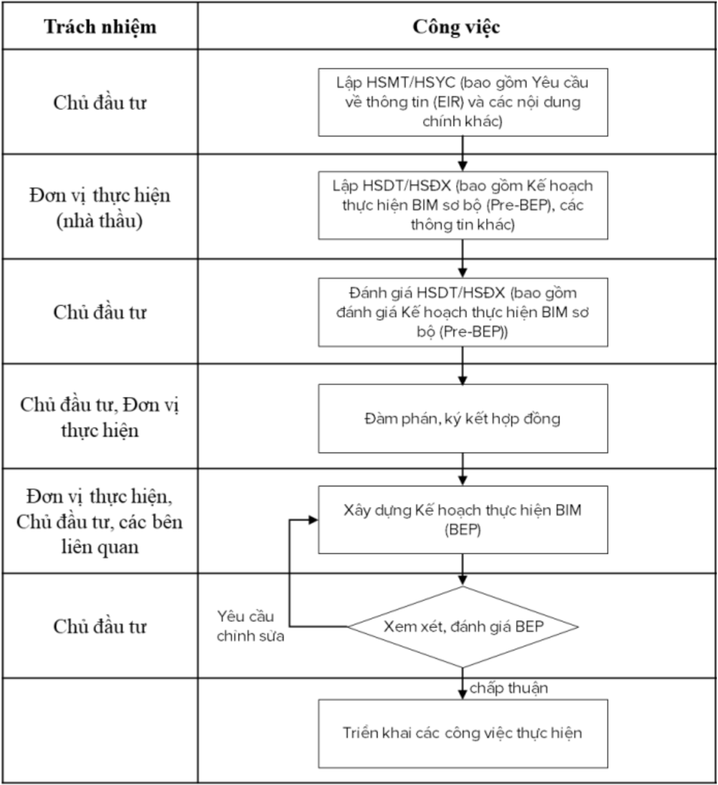

- -Chủ đầu tư chuẩn bị Yêu cầu về thông tin trao đổi (EIR) (lồng ghép trong hồ sơ mời thầu/ hồ sơ yêu cầu), trong đó xác định rõ các yêu cầu về sản phẩm, tiến độ bàn giao;
- -Đơn vị thực hiện (nhà thầu) có thể là nhà thầu tư vấn thiết kế, nhà thầu thi công hoặc đơn vị tư vấn cung cấp dịch vụ BIM căn cứ vào Yêu cầu về thông tin trao đổi để xây dựng Kế hoạch thực hiện BIM sơ bộ (preBEP) (lồng ghép trong Hồ sơ dự thầu/hồ sơ đề xuất) trình Chủ đầu tư xem xét:
+    Nhà thầu phải bố trí đủ số lượng nhân sự để thực hiện từng công việc của gói thầu đáp ứng tiến độ thực hiện của từng công việc và tiến độ thực hiện gói thầu;
+ Nhà thầu phải bố trí nhân sự thực hiện gói thầu, gồm các chuyên gia: Quản lý BIM của dự án, Chuyên gia tư áp dụng BIM cho dự án công trình giao thông, Điều phối BIM cho dự án, Kỹ thuật viên BIM. Chuyên gia bố trí thực hiện hợp đồng phải có đủ điều kiện năng lực, có chứng chỉ hành nghề theo quy định (theo từng vị trí yêu cầu), có trình độ chuyên môn và kinh nghiệm phù hợp với yêu cầu của từng công việc trong gói thầu;
+ Trường hợp cần thiết Chủ đầu tư có thể yêu cầu Nhà thầu gửi một số mô hình BIM mẫu của dự án có tính chất tương tự mà đơn vị đã thực hiện để Chủ đầu tư xem xét và đánh giá;

- -Trên cơ sở đánh giá các giải pháp đề xuất, năng lực của từng nhà thầu, chủ đầu tư sẽ lựa chọn đơn vị thực hiện BIM cho dự án, tiến hành thương thảo, ký kết hợp đồng;
- -Sau khi ký kết hợp đồng nhà thầu tiếp tục hoàn thiện Kế hoạch thực hiện BIM (BEP) dựa trên các nội dung thống nhất với chủ đầu tư và các bên liên quan khác, trình chủ đầu tư phê duyệt. Căn cứ vào Kế hoạch thực hiện BIM được phê duyệt nhà thầu triển khai công tác thực hiện. Trong quá trình thực hiện,  nếu  có  các  điều  chỉnh  hoặc  thay  đổi,  nhà  thầu  thực  hiện  cập  nhật  Kế hoạch thực hiện BIM và trình chủ đầu tư phê duyệt lại.
- -Các bước lựa chọn đơn vị thực hiện tuân thủ theo các quy định của pháp luật hiện hành.

## 4.8. Công tác chuẩn bị thực hiện cho nhóm dự án

Theo Quyết định 348/QĐ-BXD, sau khi đã thống nhất Kế hoạch thực hiện BIM (BEP), Chủ đầu tư, Đơn vị thực hiện BIM và các bên liên quan tổ chức thiết  lập  các  điều  kiện  cần  thiết  cho  việc  triển  khai  xây  dựng  và  quản  lý  mô hình BIM. Các công việc chính bao gồm:

Các nội dung liên quan đến xây dựng môi trường trao đổi dữ liệu chung cho dự án: thiết lập CDE; đào tạo các bên liên quan về CDE; chạy thử quy trình tải  tài  liệu  lên  CDE;  chạy  thử  quy  trình  trao  đổi  tài  liệu  trên  CDE;  kiểm  tra thông tin về siêu dữ liệu; kiểm tra các yêu cầu về quyền truy cập và các vấn đề liên quan đến bảo mật thông tin; kiểm tra quy trình xử lý và phê duyệt thông tin;

Kiểm tra sự sẵn sàng của hệ thống hạ tầng CNTT sử dụng cho dự án: sự đầy đủ, tương thích của các công cụ, phần mềm, phần cứng liên quan; hạ tầng mạng (internet, mạng nội bộ,…);

Tổ chức các cuộc họp để phổ biến, hướng dẫn một số nội dung hướng dẫn chung trong toàn dự án: mục tiêu áp dụng BIM; tiêu chuẩn áp dụng; cách thức tạo lập mô hình; nền tảng CDE sẽ được sử dụng; yêu cầu về bảo mật thông tin; mốc chuyển giao thông tin; mức độ phát triển thông tin; kế hoạch chuyển giao thông tin tổng thể; các nội dung liên quan đến kiểm tra, phê duyệt mô hình;

Tổng hợp các thông tin, tài liệu, số liệu sẽ được sử dụng chung cho dự án: tiêu chuẩn, phương pháp; chỉ dẫn kỹ thuật; mẫu (bản vẽ, khung tên, ghi chú…); thư viện (thư viện cấu kiện, vật liệu…).

## 4.9. Xây dựng / Phát triển và ứng dụng mô hình BIM

Đơn vị thực hiện được lựa chọn sử dụng các công cụ, hướng dẫn, tiêu chuẩn đã thống nhất trong BEP để xây dựng mô hình BIM đáp ứng yêu cầu của dự án.

Một số công cụ phần mềm phổ biến để tạo lập mô hình hoặc khai thác các ứng  dụng  từ  mô  hình  BIM  cho  công  trình  giao  thông  như:  Revit,  Civil  3D, Nova Pro, Tekla Structures, Infraworks, Navisworks,… hoặc các công cụ khác có các tính năng tương đương.

## 4.10. Kiểm tra, phê duyệt mô hình BIM

Đơn vị thực hiện chuyển giao mô hình BIM hoặc từng phần của Mô hình cho Chủ đầu tư để xem xét và chấp thuận đưa vào sử dụng theo các mốc thời gian đã quy định trong Kế hoạch thực hiện BIM (BEP).

## 4.11. Lưu trữ mô hình và đánh giá quá trình thực hiện

Khi hoàn thành xây dựng mô hình BIM đáp ứng các yêu cầu theo quy định trong BEP, Chủ đầu tư tổ chức lưu trữ mô hình để sử dụng cho mục đích cụ thể và hỗ trợ các công việc ở giai đoạn sau. Chủ đầu tư phối hợp với các đơn vị liên quan tổ chức đánh giá quá trình thực hiện áp dụng BIM để rút ra bài học khi triển khai các dự án tiếp theo.

## 5. Môi trường dữ liệu chung (CDE) cho dự án

Trong giai đoạn chuẩn bị thực hiện của nhóm dự án, chủ đầu tư dự án thực hiện lựa chọn và xây dựng CDE cho dự án. Chủ đầu tư cũng có thể chỉ định một đơn vị thứ ba để lưu trữ, quản lý hoặc hỗ trợ cho CDE của dự án. Trong trường hợp này, nên được thực hiện như một gói thầu riêng biệt trước khi các đơn vị tham gia đấu thầu. Hoặc sau đó Chủ đầu tư cũng có thể chỉ định một Nhà thầu tiếp quản việc lưu trữ, quản lý hoặc hỗ trợ cho CDE của dự án.

CDE là nơi thu thập, lưu trữ, quản lý và chia sẻ tất cả các thông tin, dữ liệu, tài liệu được tạo ra bởi các bên tham gia thực hiện dự án. CDE cho phép phối hợp thông tin, đưa ra các yêu cầu thông tin, các quy trình phê duyệt một cách nhang chóng và chính xác giữa tất cả các thành viên tham gia dự án và nên được sử dụng trong suốt vòng đời dự án.

## 5.1. Yêu cầu tối thiểu đối khi lựa chọn CDE sử dụng cho dự án công trình giao thông

- -Yêu cầu khả năng xem các loại định dạng tài liệu phổ biến (PDF,…), các loại  định  dạng  mở  của  BIM  (IFC,  LANDXML,…),  các  định  dạng  khác  như (DWG,…), khả năng  xem các  định  dạng  mô  hình  BIM  cho  công  trình  giao thông;
- -Yêu cầu khả năng quản lý thư mục, tài liệu, như thông tin tài liệu, phiên bản;
- -Yêu cầu khả năng trao đổi và chia sẻ thông tin giữa các bên liên quan trong dự án;
- -Yêu cầu khả năng tích hợp với các mô hình và hệ thống thông tin địa lý (GIS);

- -Yêu cầu khả năng tạo các  yêu cầu thông tin và các quy  trình phê  duyệt thông tin, tài liệu, bản vẽ;
- -Yêu cầu khả năng phân quyền dữ liệu và người dùng;
- -Yêu cầu khả năng bảo mật thông tin;
- -Yêu cầu khả năng truy cập trực tuyến;
- -Yêu cầu có khả năng phát triển mở rộng.
- -Môi trường dữ liệu chung nên có định hướng để có khả năng tổng hợp báo cáo tiến độ, sản lượng và tình trạng của nhiều dự án thành phần.

## 5.2. Nguyên tắc chung cho hoạt động của CDE

- -Mỗi vùng chứa thông tin chứa thông tin (thư mục, tài liệu,…) sẽ có một tên và nhiệm vụ duy nhất dựa trên quy ước đã được thống nhất.
- -Mỗi trường thông tin được gán một giá trị từ một tiêu chuẩn mã hóa đã được thống nhất và ghi lại;
- -Mỗi vùng chứa thông tin sẽ phải chứa các thuộc tính về phiên bản, tình trạng (tính phù hợp);
- -Khả năng thay đổi trạng thái của các vùng chứa thông tin;
- -Ghi lại tên người thay đổi và thời gian khi thay đổi trạng thái việc sửa đổi vùng chứa thông tin;
- -Kiểm soát truy cập ở cấp độ vùng chứa thông tin.

## 5.3. Cấu trúc các khu vực dữ liệu trong CDE

Hình 4: Cấu trúc các khu vực chứa thông tin trong CDE

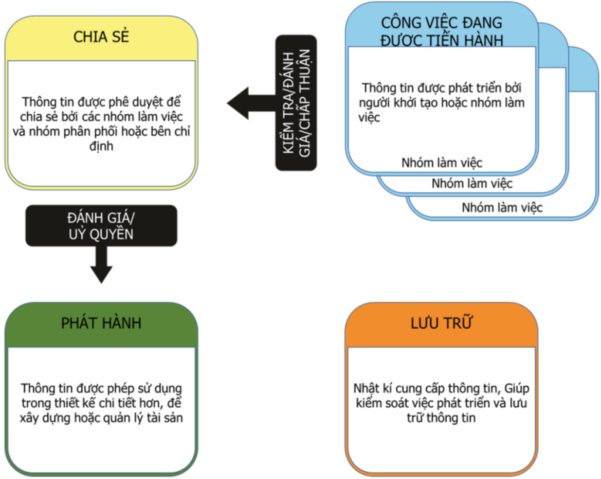

Khu vực ' CÔNG VIỆC ĐANG TIẾN HÀNH ' (WORK IN PROGRESS, viết tắt WIP) của CDE là nơi mỗi nhóm hay cá nhân thực hiện công việc của mình, WIP được dùng để lưu trữ các thông tin chưa được chấp thuận chia sẻ cho các nhóm/cá nhân khác có liên quan. Trong một dự án có thể có nhiều khu vực WIP, thường mỗi 1 bên tham gia thực hiện có một khu vực WIP của riêng mình.

Khu vực ' CHIA SẺ ' (SHARED) được dùng để lưu trữ thông tin đã được chấp thuận cho việc chia sẻ. Thông tin này được chia sẻ để các đơn vị khác sử dụng làm dữ liệu tham khảo cho việc phát triển nội dung có liên quan. Khi tất cả đã hoàn thành, thông tin (sản phẩm theo kế hoạch) phải được đặt ở trạng thái 'Chờ phát hành'.

Khu vực ' PHÁT HÀNH ' (PUBLISHED DOCUMENTATION) được sử dụng để lưu trữ các thông tin được phát hành, là những thông tin đã được chấp thuận bởi chủ đầu tư.

Khu vực ' LƯU TRỮ '  (ARCHIVE) ghi  lại  mọi  tiến  triển  tại  mỗi  mốc  thời điểm và phải lưu lại bản ghi của tất cả các trao đổi và thay đổi nhằm cung cấp các dấu vết lịch sử trao đổi để kiểm tra và đối chiếu trong trường hợp có tranh chấp…

## 5.4. Quy tắt đặt tên

## a. Mục đích

Xác định cách thức đặt tên thống nhất đảm bảo hiệu quả trong công tác quản lý tài liệu, phiên bản tài liệu, khai thác và sử dụng thông tin đối với dự án có áp dụng BIM.

## b. Phạm vi áp dụng

Quy tắc đặt tên tài liệu được áp dụng cho tất cả các tài liệu được tải lên Môi trường dữ liệu chung của dự án.

## c. Quy tắc chung

Các ký tự được phép dùng đặt tên thư mục là a-z, A-Z, dấu ngang (-), dấu chấm (.) và dấu gạch dưới (\_). Không nên sử dụng dấu cách (trừ phần mô tả), các chữ cái có dấu trong tiếng Việt (ă, â, đ, ê, ô, ơ, ư) và các ký tự đặc biệt vì có thể gây lỗi tìm kiếm, lỗi ký tự, lỗi khi mở bằng một số phần mềm nhất định.

Các thư mục và file phải được đặt tên ngắn nhất có thể vì giới hạn số ký tự trong các đường dẫn file bị khống chế bởi các hệ điều hành và phần mềm. Ví dụ, chiều dài dòng ký tự trong hệ điều hành không được vượt quá 256 ký tự.

## d. Quy tắc đặt tên tệp

Cấu trúc đặt tên tệp tin như sau:

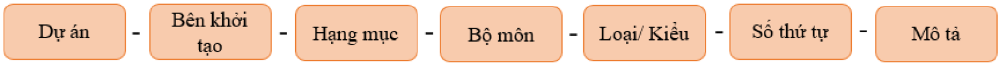

Các trường đặt tên tệp tin:

| Trường          | Từ tiếng Anh     | Yêu cầu   | Số ký tự   |
|-----------------|------------------|-----------|------------|
| Dự án           | Project          | Bắt buộc  | 2-7        |
| Đơn vị khởi tạo | Originator       | Bắt buộc  | 3-7        |
| Hạng mục        | Volume or System | Bắt buộc  | 2-7        |
| Bộ môn          | Discipline       | Bắt buộc  | 2-6        |
| Loại/ Kiểu      | Type             | Bắt buộc  | 2-5        |
| Số thứ tự       | Number           | Bắt buộc  | 4-6        |
| Mô tả           | Description      | Tùy chọn  |            |
| Mã trạng thái   | Suitability      | Tùy chọn  |            |
| Mã phiên bản    | Revision         | Tùy chọn  |            |

Số lượng ký tự trong các trường thông tin cần được thống nhất lựa chọn cố định và sử dụng trong suốt thời gian thực hiện dự án.

Dự án :  Thông thường Mã dự án được lấy từ các ký tự đầu của tên dự án, Ví dụ:

| Mã hiệu    | Dự án                                              |
|------------|----------------------------------------------------|
| VD4_2.1_01 | Dự án Vành đai 4, dự án thành phần 2.1 gói thầu 01 |
| CTHD       | Cầu Trần Hưng Đạo                                  |

Đơn vị khởi tạo : Thông thường Mã Đơn vị được lấy từ các Ký tự đầu của tên công ty hoặc tên viết tắt của công ty. Ví dụ:

| Mã hiệu   | Đơn vị khởi tạo                                 |
|-----------|-------------------------------------------------|
| TEDI      | Tổng Công ty Tư vấn Thiết kế Giao thông vận tải |
| …         | …                                               |
| HECO      | Công ty Cổ phần Tư vấn thiết kế Đường bộ        |

Hạng mục : Thông thường Mã viết tắt của hạng mục phân chia theo chức hoặc không gian. Ví dụ:

| Mã hiệu   | Hạng mục                     |
|-----------|------------------------------|
| NGQL2     | Nút giao quốc lộ 2           |
| CC        | Cầu chính                    |
| KM10_20   | Từ Kilômét 10 đến Kilômét 20 |
| …         | …                            |

| Mã hiệu   | Hạng mục                   |
|-----------|----------------------------|
| ZZ        | Tất cả các Hạng mục        |
| XX        | Không áp dụng cho Hạng mục |

Bộ môn : Thông thường Mã viết tắt của Bộ môn/ Hệ thống. Ví dụ:

| Mã hiệu   | Bộ môn/ Hệ thống            |
|-----------|-----------------------------|
| IF        | Hạ tầng san nền             |
| IR        | Hạ tầng đường               |
| ITE       | Hệ thống thông tin liên lạc |
| IE        | Hệ thống cấp điện           |
| ILI       | Hệ thống chiếu sáng         |
| IME       | Hệ cơ điện chung            |
| IST       | Hệ thống thoát nước mưa     |
| ISE       | Hệ thống thoát nước thải    |
| IP        | Hệ thống cấp nước           |
| ST        | Kết cấu                     |
| TE        | Địa hình                    |
| IST       | Cây xanh đường phố          |
| BGE       | Phần cầu chung              |
| BSB       | Kết cấu phần dưới cầu       |
| BSP       | Kết cấu phần trên cầu       |
| BR        | Đường đầu cầu               |
| BMS       | Các chi tiết khác của cầu   |
| BCM       | Biên pháp thi công cầu      |
| TGE       | Phần hầm chung              |
| TST       | Phần kết cấu hầm            |
| TAR       | Phần kiến trúc hầm          |
| TMEP      | Phần hệ thống MEP hầm       |
| TMS       | Các chi tiết khác của hầm   |

| Mã hiệu   | Bộ môn/ Hệ thống                        |
|-----------|-----------------------------------------|
| TMS       | Biện pháp thi công hầm                  |
| …         | …                                       |
| ZZ        | Áp dụng cho tất cả các Bộ môn/ Hệ thống |
| XX        | Không áp dụng cho Bộ môn/ Hệ thống      |

Loại/ Kiểu : Ví dụ về một số loại tập tin phổ biến:

| Mã hiệu   | Loại                                          |
|-----------|-----------------------------------------------|
| AF        | Hình ảnh                                      |
| BQ        | Bảng khối lượng                               |
| CE        | Thuyết Minh                                   |
| CA        | Tính toán                                     |
| CM        | Mô hình phối hợp (mô hình phối hợp đa bộ môn) |
| CP        | Kế hoạch chi phí                              |
| CR        | Biểu diễn xung đột                            |
| DB        | Cơ sở dữ liệu                                 |
| DR        | Bản vẽ                                        |
| FN        | Chú thích tập tin                             |
| HS        | An toàn lao động                              |
| IE        | Tập tin trao đổi thông tin                    |
| M2        | Bản vẽ 2D xuất ra từ mô hình 3D               |
| M3        | Mô hình 3D                                    |
| MI        | Biên bản/ghi chú                              |
| MR        | Mô hình phục vụ các nội dung áp dụng BIM khác |
| MS        | Biện pháp                                     |
| PP        | Thuyết trình                                  |
| RI        | Yêu cầu thông tin                             |
| RP        | Báo cáo                                       |
| SH        | Tiến độ                                       |
| SP        | Tiêu chuẩn                                    |
| SU        | Khảo sát                                      |

| VS   | Trực quan hoá   |
|------|-----------------|
| …    | …               |
| ZZ   | Chung           |

Số thứ tự : Trường số thứ tự cần được gán cho mỗi vùng chứa thông tin khi nó nằm trong một chuỗi, không phân biệt bởi bất kỳ một trường nào khác.

Các số 0 đứng đầu nên được sử dụng và chú ý không thể hiện các thông tin có trong các trường khác.

Ví dụ: Trường số thứ tự được quy định có 4 chữ số, các vùng chứa dữ liệu sẽ được đánh số: 0001, 0002, 0003…

- Mô tả : Mô tả tên nội dung tập tiên. Trường mô tả nên được sử dụng để làm rõ nội dung tài liệu, bản vẽ.

Mã trạng thái :  Nhận biết rõ vùng chứa thông tin nên được sử dụng và không nên sử dụng cho mục đích gì. Các quy ước về mã trạng thái theo Quyết định số 348/QĐ-BXD, trong trường hợp CDE đã có quản lý mã trạng thái thì không cần thể hiện mã trạng thái trong tên vùng chứa thông tin.

Mã Phiên bản : Khi các vùng chứa thông tin được cập nhật, cần phải theo dõi các thay đổi giữa các phiên bản (phiên bản trước và hiện tại). Các quy ước về mã trạng thái theo Quyết định số 348/QĐ-BXD, trong trường hợp CDE đã có quản lý phiên bản thì không cần thể hiện mã trạng thái trong tên vùng chứa thông tin.

- e. Quy tắc đặt tên và đánh số đối tượng trong mô hình BIM
-  Các đối tượng trong dự án cần được đặt theo một hệ thống nhất quán. Mỗi loại đối tượng cần có duy nhất một tên được sử dụng trong suốt vòng đời của dự án để các thông tin có thể tham chiếu được đến đối tượng đó. Đặt tên càng ngắn càng tốt nhưng cần truyền tải được nội dung của đối tượng.
- Cấu kiện nên được đánh số tăng dần theo chiều của lý trình hoặc chiều thoát.
- Tên đường/ tuyến hoặc nút giao, tên đường đặt tên theo quy hoạch đã được phê duyệt của dự án.
- Các trường phân tách nhau bằng dấu gạch ngang '-'.
- Các thành phần trong trường phân tách bằng dấu '\_'.
- Với tên thể hiện trên bản vẽ có thể xem xét rút ngắn trường thông tin thể hiện cho phù hợp nhưng cần chính xác thông tin của trường thông tin tương ứng với tên trong mô hình BIM.
- Tham khảo quy tắc đặt tên dưới đây:

| Trường thông tin   | Mô tả                                                                | Ví dụ   |
|--------------------|----------------------------------------------------------------------|---------|
| Tên đường/ tuyến   | Tên đường/ tuyến được đặt theo quy hoạch đã được phê duyệt của dự án | N11     |

| Tên hệ thống   | Tên hệ thống phục vụ chính của đối tượng                                         | ISE   |
|----------------|----------------------------------------------------------------------------------|-------|
| Vị trí         | Vị trí của đối tượng, ví dụ bên trái (T), bên phản P,….                          | T     |
| Loại đối tượng | Loại đối tượng                                                                   | HG    |
| Đanh số thứ tự | Lấy theo số trên bản vẽ hoặc đánh số từ 0001 đến 9999 nếu ko đánh số trên bản vẽ | 0001  |

Ví dụ tên hố ga của hệ thống thoát nước thải phía bên trái đường N11: N11-ISE-T-HG-0001

## 6. Tạo lập mô hình thông tin công trình (BIM)

## 6.1. Yêu cầu chung trong việc mô hình hóa đối tượng

- -Các đối tượng được mô hình hoá bằng công cụ phần mềm phù hợp và đảm bảo các thành phần của cấu kiện theo định nghĩa LOD (phù hợp với từng bước thiết kế) và hồ sơ bản vẽ thiết kế.
- -Điểm gốc của đối tượng phải được thiết lập cho đối tượng BIM phù hợp để thuận lợi khi thay thế giữa các loại đối tượng với nhau.
- -Điểm gốc, mốc cao độ trong dự án cần được xác định để bảo đảm các mô hình thông tin được khớp nối chính xác.
- -Các đối tượng được dựng hình với tỉ lệ 1:1;
- -Các đối tượng sử dụng theo hệ thống đo lường quốc tế (SI), đơn vị đo độ dài sử dụng hệ m;
- -Các đường đo kích thước phải được sử dụng bằng công cụ đo của phần mềm, các đường kích thước không được nằm chồng chéo lên nhau và đè lên đối tượng.
- -Các  đối  tượng  2D  có  thể  được  sử  dụng  thay  cho  các  đối  tượng  không thể/không cần thiết mô hình hoá hoặc để bổ sung thông tin cho các đối tượng 3D.
- -Thông tin  về  vật  liệu  cần  được  gán  cho  đối  tượng  phù  hợp  với  yêu  cầu thông tin của từng giai đoạn.
- -Quy ước gán màu phải theo sự thống nhất của dự án.
- -Các bên thống nhất định dạng của bản vẽ: khung tên, thuộc tính, kích cỡ giấy và tỷ lệ bản vẽ, hướng view, tên lớp (layer), kiểu chữ, kiểu đường nét, v.v. để đảm bảo tính đồng bộ khi trình bày.

- -Các bên thống nhất quy định về các chữ viết tắt, ký hiệu, định dạng văn bản,…

## 6.2. Hệ tọa độ và cao độ

Sử dụng chung hệ tọa độ quốc gia VN2000 và gốc cao độ quốc gia tại Hòn Dấu cho việc tạo lập mô hình, phối hợp mô hình và khai thác các thông tin từ mô hình BIM.

Nhà thầu bắt buộc phải xác định các điểm gốc tọa độ chung trong tất cả các tệp mô hình gốc trước khi tiến hành bất kỳ công việc tạo lập mô hình nào (ví dụ: các tọa độ Survey point, Project based point (đối với Revit), mốc đường truyền (đối với Civil 3D),…). Các vị trí tọa độ này không được thay đổi và phải duy trì trong suốt các giai đoạn dự án.

## 6.3. Phân chia mô hình

Chủ đầu tư đề xuất sơ bộ về kế hoạch hoặc nguyên tắc phân chia dữ liệu mô hình thành các khối, các khu vực. Đơn vị thực hiện sẽ đề xuất về khả năng thực hiện và giải pháp trong Kế hoạch thực hiện BIM (BEP). Việc phân chia mô hình có thể cân nhắc chia theo:

+  Theo  bộ  môn  (cầu,  đường,  thoát  nước  mưa,  thoát  nước  thải,  hào  kỹ thuật,....).
+ Theo gói thầu (cầu chính, cầu dẫn, hầm, đường theo đoạn tuyến với lý trình tăng dần, nút giao,…)
+ Theo mục đích sử dụng (Mô hình tổng quan dự án, mô hình phân tích kết cấu, mô hình tiến độ,...).

Việc phân chia mô hình cần phải đảm bảo kiểm soát dung lượng mô hình, đảm bảo cho phần mềm hoạt động tốt nhất trên các cấu hình yêu cầu tối thiểu, cũng như khả năng phát hành, chia sẻ mô hình sau này. Nếu dung lượng mô hình được đánh giá là vược quá giới hạn và ảnh hưởng đến hiệu suất triển khai, cần phân chia mô hình để giảm dung lượng tệp. Ví dụ để đảm bảo dung lượng các mô hình hoạt động tốt ngay cả trong quá trình thực hiện triển khai cũng như quá trình khai thác, tổng thể dữ liệu mô hình được dự kiến đề xuất chia thành các mô hình thành phần nhỏ như sau:

| STT                      | Mô hình chính                                                                                | Mô hình thành phần                                                       |
|--------------------------|----------------------------------------------------------------------------------------------|--------------------------------------------------------------------------|
| Giai đoạn thiết kế cơ sở | Giai đoạn thiết kế cơ sở                                                                     | Giai đoạn thiết kế cơ sở                                                 |
| 1                        | Mô hình hiện trạng địa hình trong phạm vi gói thầu                                           | Mô hình địa hình                                                         |
| 1                        | Mô hình hiện trạng địa hình trong phạm vi gói thầu                                           | Mô hình địa vật                                                          |
| 2                        | Mô hình hệ thống đường giao thông và hạ tầng kỹ thuật trong phạm vi gói thầu (tuyến chính và | Mô hình hệ thống nền, mặt đường, nút giao, tổ chức giao thông, cảnh quan |
| 2                        | Mô hình hệ thống đường giao thông và hạ tầng kỹ thuật trong phạm vi gói thầu (tuyến chính và | Mô hình hệ thống thoát nước                                              |

Bảng 3: Bảng phân chia thành phần mô hình

| STT                                   | Mô hình chính                                                                                                 | Mô hình thành phần                                                       |
|---------------------------------------|---------------------------------------------------------------------------------------------------------------|--------------------------------------------------------------------------|
|                                       | đường song hành)                                                                                              | Mô hình hệ thống hào kỹ thuật                                            |
|                                       | đường song hành)                                                                                              | Mô hình bản vẽ các kết cấu BTCT (hầm ga, cống, cửa xa, hố cáp,…)         |
| 3                                     | Mô hình cầu vượt (nút giao…)                                                                                  | Mô hình tổng thể                                                         |
| 4                                     | Mô hình hầm vượt (nút giao…)                                                                                  | Mô hình tổng thể                                                         |
| Giai đoạn thiết kế sau thiết kế cơ sở | Giai đoạn thiết kế sau thiết kế cơ sở                                                                         | Giai đoạn thiết kế sau thiết kế cơ sở                                    |
| 1                                     | Mô hình hệ thống đường giao thông và hạ tầng kỹ thuật trong phạm vi gói thầu (tuyến chính và đường song hành) | Mô hình hệ thống nền, mặt đường, nút giao, tổ chức giao thông, cảnh quan |
| 1                                     | Mô hình hệ thống đường giao thông và hạ tầng kỹ thuật trong phạm vi gói thầu (tuyến chính và đường song hành) | Mô hình hệ thống thoát nước                                              |
| 1                                     | Mô hình hệ thống đường giao thông và hạ tầng kỹ thuật trong phạm vi gói thầu (tuyến chính và đường song hành) | Mô hình hệ thống hào kỹ thuật                                            |
| 1                                     | Mô hình hệ thống đường giao thông và hạ tầng kỹ thuật trong phạm vi gói thầu (tuyến chính và đường song hành) | Mô hình bản vẽ các kết cấu BTCT (hầm ga, cống, cửa xa, hố cáp,…)         |
| 2                                     | Mô hình cầu vượt (nút giao…)                                                                                  | Mô hình tổng thể                                                         |
| 2                                     | Mô hình cầu vượt (nút giao…)                                                                                  | Các mô hình chi tiết kết cấu                                             |
| 3                                     | Mô hình hầm vượt (nút giao…)                                                                                  | Mô hình tổng thể                                                         |
| 3                                     | Mô hình hầm vượt (nút giao…)                                                                                  | Các mô hình chi tiết kết cấu                                             |
| Giai đoạn thi công                    | Giai đoạn thi công                                                                                            | Giai đoạn thi công                                                       |
| 1                                     | Mô hình quản lý tiến độ và khối lượng thi công thực tế                                                        | Mô hình tổng hợp các thành phần công trình                               |
| 1                                     | Mô hình quản lý tiến độ và khối lượng thi công thực tế                                                        | Mô hình các kết cấu phụ trợ thi công                                     |
| 2                                     | Mô hình tổng thể bố trí mặt bằng công trường                                                                  | Các mô hình thành phần các hạng mục                                      |
| 3                                     | Mô hình hoàn công                                                                                             | Mô hình hoàn công tổng thể gói thầu                                      |
| 3                                     | Mô hình hoàn công                                                                                             | Mô hình hoàn công các chi tiết của hệ thống đường giao thông             |
| 3                                     | Mô hình hoàn công                                                                                             | Mô hình hoàn công các chi tiết của cầu                                   |
| 3                                     | Mô hình hoàn công                                                                                             | Mô hình hoàn công các chi tiết của hầm                                   |

## 6.4. Mức độ phát triển thông tin (LOD)

Căn cứ theo Phụ lục 04 trong Quyết định số 348/QĐ-BXD, mức độ phát triển thông tin (Level of Development - LOD) được chia thành nhiều mức khác nhau, mỗi mức sẽ thể hiện mức độ chi tiết thông tin và mức độ tin cậy của các thông tin được đưa vào các thành phần mô hình. Trong một mô hình BIM ở mỗi giai đoạn thiết kế nhất định, các thành phần trong mô hình có thể có các mức độ phát triển khác nhau. Do đó, chỉ có mức độ phát triển thông tin cho các thành  phần  cấu  kiện  trong  mô  hình,  không  có  mức  độ  phát  triển  thông  tin chung cho tất cả mô hình.

Mức độ phát triển thông tin được chia thành mức độ phát triển thông tin hình học (Level of Geometry - LOD-G)), mức độ phát triển thông tin phi hình học (Level of Information - LOD-I), mức độ tài liệu (Level of Documentation - DOC).

Chủ đầu tư xác định các thông tin phi hình học cần thiết đưa vào môi hình BIM khi bàn giao. Các nhóm thông tin được yêu cầu xác định bao gồm:

+ Thông tin về định danh cho đối tượng: Số hiệu, mã tài sản, loại, phân loại,…
+ Thông tin về vị trí đối tượng: Cao độ, tọa độ, vị trí,…
+ Thông tin về hình học đối tượng: kích thước, đường kích, hình dạng,…
+ Thông tin về thiết kế và kỹ thuật của đối tượng: Vật liệu, các thông số thiết  kế,  hệ  thống,  cường  độ,  độ  lún,  độ  võng,  sức  chịu  tải,  phụ  kiện  đi kèm…
+  Thông  tin  về  pháp  lý  và  thương  mại  của  đối  tượng:  Ngày  lắp  đặt/ nghiệm thu, đơn vị sản xuất, đơn vị thi công, nhà cung cấp bê tông, tuổi thọ, thời gian bản hành…

Chủ đầu tư căn cứ vào đặc điểm dự án, các nội dung áp dụng BIM và bảng mô tả yêu cầu mức độ phát triển thông tin cho công trình giai thông trong Phụ lục 02 để tham khảo và bổ xung các yêu cầu mức độ phát triển thông tin hình học và mức độ phát triển thông tin phi hình học cho các đối tượng trong mô hình BIM tại mỗi mốc chuyển giao quan trọng của dự án.

Với mức độ tài liệu DOC chủ đầu tư lập danh sách chi tiết các tài liệu yêu cầu bàn giao, bên phụ trách tạo lập và bàn giao, ví dụ: danh sách chi tiết các bản vẽ bàn giao, thuyết minh tài liệu tính toán, biên bản thí nghiệm, biên bản nghiệm thu vật liệu, biên bản nghiệm thu, catalog thiết bị, hợp đồng,…. Các tài liệu này sẽ được đưa vào Kế hoạch chuyển giao thông tin tổng thể (MIDP) để thực hiện việc bàn giao theo yêu cầu của Chủ đầu tư.

## 6.5. Bảng gán màu hệ thống

Để phân biệt các hệ thống trong tổng thể dự án, cần thống nhất về mã màu cho từng hệ thống. Chủ đầu tư và nhà thầu tham khảo và bổ sung hệ mã màu dưới đây để thống nhất triển khai cho dự án:

| Hạng mục                        | Màu sắc                  | R                        | G                        | B                        |
|---------------------------------|--------------------------|--------------------------|--------------------------|--------------------------|
| 1. Phần đường giao thông        | 1. Phần đường giao thông | 1. Phần đường giao thông | 1. Phần đường giao thông | 1. Phần đường giao thông |
| + Bê tông nhựa                  |                          | 102                      | 102                      | 102                      |
| + Các cấu kiện BTXM             |                          | 230                      | 152                      | 0                        |
| + Cấp phối đá dăm               |                          | 55                       | 108                      | 189                      |
| + Đá dăm đệm                    |                          | 181                      | 53                       | 53                       |
| + Bề mặt vỉa hè trồng cỏ        |                          | 101                      | 168                      | 67                       |
| + Bề mặt vỉa hè BTXM            |                          | 204                      | 204                      | 204                      |
| + Các loại cấu kiện khác        |                          | 130                      | 130                      | 130                      |
| 2. Mạng lưới thoát nước mưa     |                          | 0                        | 112                      | 255                      |
| 3. Mạng lưới thoát nước thải    |                          | 255                      | 0                        | 0                        |
| 4. Mạng lưới chiếu sáng         |                          | 255                      | 150                      | 0                        |
| 5. Mạng lưới cấp điện           |                          | 255                      | 250                      | 0                        |
| 6. Mạng lưới thông tin liên lạc |                          | 0                        | 255                      | 0                        |

7. Công trình cầu: Phân loại màu theo nhóm cấu kiện có cùng chức năng tương đương, ví du: Cọc, mố, trụ, xà mũ, dầm, bản mặt cầu…. đảm bảo khả năng có thể lọc được các cấu kiện khi cần thiết. 1
8. Với màu sắc cốt thép trong kết cấu được phân loại màu sắc theo các lớp thép, ví dụ: lớp B1, B2, T1, T2,….đảm bảo khả năng có thể lọc đc các lớp thép khi cần thiết.

Bảng 4: Bảng gán màu hệ thống

## 6.6. Bản vẽ

Các bên đưa ra tiêu chuẩn hoặc thống nhất chung các bản vẽ mẫu, có thể có các thành phần: khung tên thuộc tính, kích cỡ và tỷ lệ bản vẽ, tên lớp (layer), kiểu chữ, đường nét,… để thông tin được trình bày đồng nhất.

Các bản vẽ mẫu được chia sẻ với các thành viên, đội ngũ liên quan thông qua Môi trường dữ liệu chung (CDE).

Các bên thống nhất một tiêu chuẩn hoặc quy định cho các ghi chú, ký hiệu, kích thước văn bản.

## 6.7. Quy định chung về trao đổi dữ liệu

Các bên cần tuân thủ các quy định sau:

- -Tất cả các dữ liệu cần được trao đổi qua Môi trường dữ liệu chung (CDE).
- -Quy định đặt tên cần tuân thủ theo quy tắc đặt tên.

- -Tất cả mô hình cần được tải lên bằng định dạng theo quy định.
- -Tất  cả  các  mô  hình  cần  đảm  bảo  tuân  thủ  quy  định  dung  lượng  file  hệ thống.
- -Tất cả các phiên bản cũ của mô hình BIM và các tài liệu, bản vẽ cần phải được lưu trên Môi trường dữ liệu chung.
- -Các bên cần hiểu rõ cách sử dụng, vai trò, trách nhiệm, định dạng và tần suất chia sẻ, trao đổi thông tin đã được thống nhất.
- -Các tài liệu,  bản  vẽ,  mô  hình  đã  được  tải  lên  CDE  trước  đó,  sau  đó  các phiên bản sau cập nhật sẽ không được phép đổi tên tệp. Trong trường hợp bất khả khách cần thay đổi phải được đệ trình và chấp thuận của đơn vị chịu tránh nhiệm quản lý CDE.

## 6.8. Phần mềm và phiên bản

Dựa trên các nội dung áp dụng BIM cho dự án và các yêu cầu về nền tảng công  nghệ  phần  mềm  cần  thiết  để  áp  dụng  BIM  cho  dự  án  công  trình  giao thông, chủ đầu tư đề xuất một số giải pháp phần mềm hoặc tương đương để đáp ứng yêu cầu. Nhà thầu có thể đề xuất bổ sung thêm các nền tảng công nghệ có chức năng tương đương với các nền tảng do Chủ đầu tư yêu cầu. Các bên sẽ thống  nhất  nền  tảng  công  nghệ  phần  mềm  và  phiên  bản  sử  dụng  trong  Kế hoạch triển khai BIM.

Những phần mềm được sử dụng để áp dụng BIM cho dự án yêu cầu là các phần mềm có bản quyền.

Các phần mềm yêu cầu phải có năng phối hợp trao đổi dữ liệu với nhau.

Các phần mềm sử dụng cho việc tạo lập, xây dựng mô hình cho các bộ môn cụ thể phải là các nền tảng phần mềm chuyên ngành hỗ trợ cho bộ môn tương ứng, một số phần mềm được gợi ý sử dụng dưới đây:

| Mục đích sử dụng                                                                                                    | Phần mềm                              |   Phiên bản |
|---------------------------------------------------------------------------------------------------------------------|---------------------------------------|-------------|
| Tạo mô hình BIM cho phần công trình đường (hiện trạng, đường giao thông, thoát nước, tổ chức giao thông,…)          | Infraworks Autodesk Civil 3D Nova TDN |        2024 |
| Tạo mô hình BIM cho phần cầu, hầm, hố ga, các kết cấu bê tông, kết cấu thép Tạo mô hình cho phần biện pháp thi công | Tekla Structures Revit                |        2024 |
| Diễn họa phối cảnh dự án                                                                                            | Infraworks                            |        2024 |

Bảng 5: Bảng gợi ý phần mềm và phiên bản sử dụng

| Mục đích sử dụng                                     | Phần mềm                            |   Phiên bản |
|------------------------------------------------------|-------------------------------------|-------------|
|                                                      | Unreal Engine 5                     |             |
| Kiểm tra mô hình và phối hợp mô hình giữa các bộ môn | Navisworks Manage Trimble Connect   |        2024 |
| Thể hiện trình tự thi công                           | Navisworks Manage Synchro 4D        |        2024 |
| Môi trường dữ liệu chung                             | Autodesk Construction Could NovaCDE |        2024 |

## 6.9. Định dạng trao đổi dữ liệu

Định dạng trao đổi dữ liệu trong quá trình tạo lập và chuyển giao mô hình BIM có thể ở cả định dạng gốc và định dạng mở. Trong quá trình chuẩn bị thực hiện dự án các bên liên quan phải thống nhất về định dạng tạo lập, trao đổi và chuyển giao mô hình. Trong đó, với các mô hình BIM các định dạng mở sẽ bắt buộc phải được chuyển giao, ưu tiên sử dụng các định dạng phổ biến dưới đây:

+ Đám mây điểm (LAS, E57, XYZ, PTS)
+ Dữ liệu GIS (LANDXML, GML)
+ Ảnh (TIFF, BMP, GEOTIFF)
+ Mô hình hiện trạng (IFC)
+ Mô hình địa hình (XYZ, IFC, LANDXML)
+ Mô hình đường bộ, đường sắt (LANDXML, IFC, DWG)
+ Mô hình cầu, hầm, nhà ga, đường sắt (IFC)
+ Bản vẽ và tài liệu (DWG, PDF,…)

## 6.10. Quản lý dung lượng tệp

Để hỗ trợ các bên truy cập và sử dụng thông tin hiệu quả, các quy định dưới đây về dung lượng tệp mô hình và quản lý tệp trước khi bàn giao cần được lưu ý thực hiện:

Các mô hình thành phần cho từng hạng mục công trình không vượt quá 250MB đối với các mô hình cho cầu hầm và không vượt quá 400MB đối với các mô hình cho đường giao thông, áp dụng cho việc truy cập sử dụng bình thường của các máy tính có cấu hình thông dụng.

Mô hình tổng  hợp  các  phần  hạng  mục  công  trình  hoặc  tổng  thể  không vượt quá 500MB, áp dụng cho việc truy cập sử dụng bình thường của các máy tính có cấu hình thông dụng.

Các tệp trước khi bàn giao trong dự án cần được làm sạch, loại bỏ các liên kết (Xref, chi tiết, link) không cần thiết, loại bỏ các file liên kết, các file 2D đính kèm không sử dụng.

## 7. Quy trình phối hợp

## 7.1. Quy trình phối hợp BIM giữa các bên liên quan

Trong quá trình lập kế hoạch triển khai,  căn  cứ  vào  nội  dung,  phạm  vi triển khai BIM và các giai đoạn triển khai, đơn vị nhà thầu tham khảo quy trình phối hợp được đề xuất dưới đây để lập quy trình phối hợp BIM giữa các bên liên quan.

Hình 5: Quy trình phối hợp BIM trong giai đoạn thiết kế

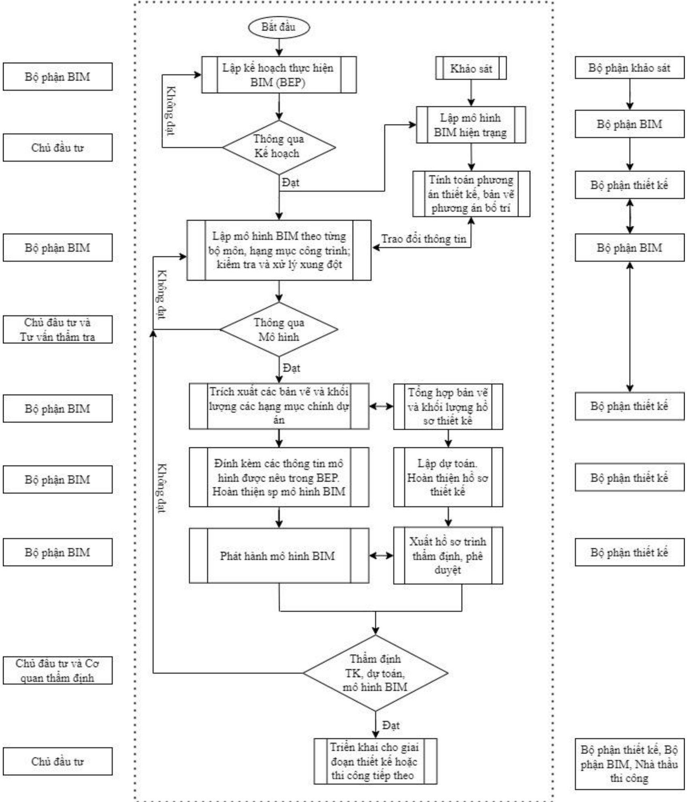

Hình 6: Quy trình phối hợp BIM trong giai đoạn thi công

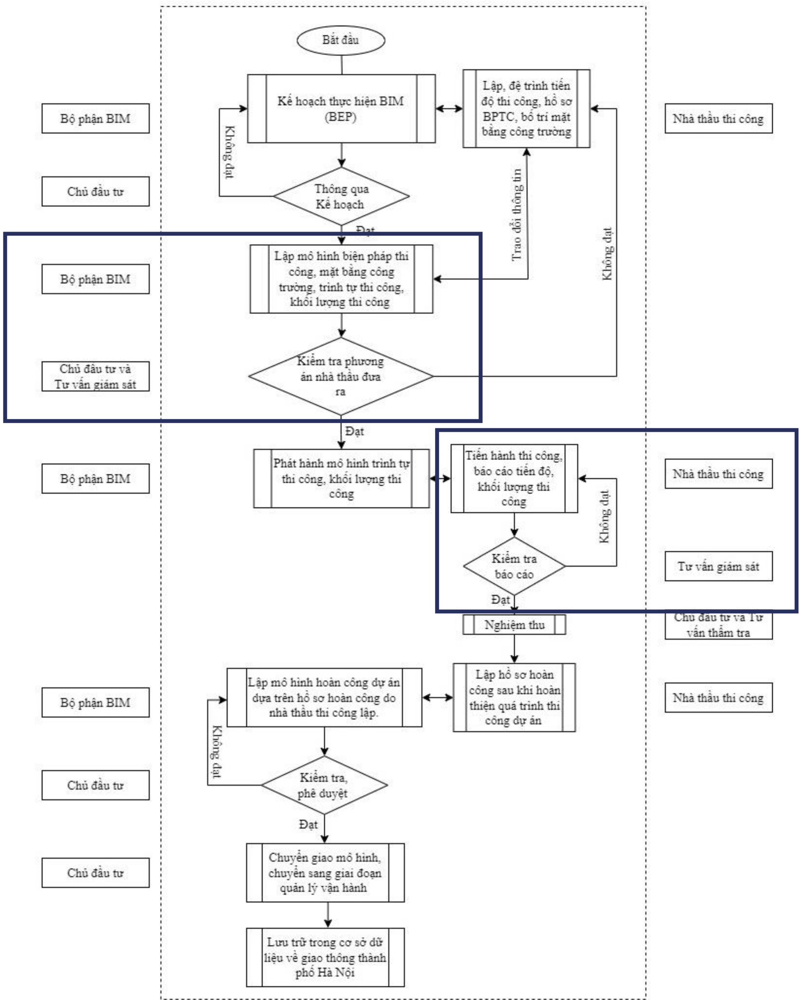

## 7.2. Quy trình kiểm soát xung đột

Với đặc thu các dự án giao thông thường được chia thành nhiều gói thầu và nhiều hạng mục phức tạp, việc áp dụng BIM sẽ giúp công tác phát hiện và xử lý các giao cắt hiệu quả hơn, bao gồm cả các vẫn đề xung đột giữa các cấu kiện trong phạm vi thiết kế mới, giữa phần thiết kế mới với hệ thống hạ tầng hiện hữu và giữa các gói thầu. Nguyên tắc, kết hợp giữa kiểm tra bằng mắt thường và kiểm tra tự động, bao gồm cả các xung đột cứng và xung đột mềm.

Trong giai đoạn thiết kế cơ sở, việc kiểm tra xung đột dựa trên mô hình của mỗi bộ môn, chưa cần xem xét chi tiết xung đột trên từng cấu kiện cụ thể trong mỗi bộ môn. Mô hình tổng hợp của các bộ môn sẽ tiếp tục được kiểm tra với mô hình hiện trạng theo số liệu khảo sát để phát hiện trước các xung đột có thể xảy ra với hệ thống hạ tầng hiện hữu và với các thông số yêu cầu trong quy hoạch. Trong giai đoạn này, việc phối hợp kiểm tra xung đột chủ yếu giữa mô hình cầu, nút giao và tuyến đường. Bộ phận thiết kế cấp thoát nước, điện, … tham gia phối hợp trao đổi thông tin và đưa ra các yêu cầu về không gian, kỹ thuật.

Trong giai đoạn thiết kế kỹ thuật và thiết kế bản vẽ thi công các mô hình BIM cho phần công trình cầu, nút giao và tuyến đường sẽ được liên kết vào với các mô hình cấp nước, thoát nước, hào kỹ thuật, điện, chiếu sáng, thông tin liên lạc,… nhà thầu cần xác định các khu vực quan trọng ưu tiên phối hợp và đưa ra các nguyên tắc để phân loại xung đột để loại bỏ việc xử lý các xung đột không cần thiết, do quá trình thi công có thể xử lý dễ dàng. Nhà thầu tham khảo một số nguyên tắc dưới đây:

+ Va chạm cứng là khi hai vật thể có các bộ phận giao nhau trực tiếp (ví dụ các đường ống đâm xuyên qua dầm…)

+ Va chạm mềm là khi một đối tượng nằm trong phạm vi ảnh hưởng của đối tượng khác và sẽ gây ảnh hưởng đến việc sử dụng, bảo trì của các đối tượng (ví dụ: tĩnh không dưới cầu vượt không đảm bảo khả năng thi công hệ thống đường sắt đô thị theo quy hoạch, …)

+ Va chạm tiến độ là va chạm liên quan đến quá trình thi công, khi các công việc không được lên kế hoạch hợp lý, các đối tượng được xây dựng trước sẽ gây khó khăn trong quá trình thực hiện đối tượng sau đó (ví dụ: bố trí không gian không hợp lý dẫn đến quá trình vận chuyển thiết bị vào vị trí lắp đặt không thực hiện được hoặc liên quan đến vấn đề an toàn khi thi công).

+ Các đường ống có đường kính &lt;50mm sẽ không được kiểm tra va chạm;
+ Cốt thép sẽ không được kiểm tra va chạm;
+ Hố ga không cần kiểm tra va chạm với mặt vỉa hè và mặt đường;
+ Cọc không cần kiểm tra va chạm với đài cọc;
+ Biển báo va chạm với hệ thống thoát nước;

+ …

Các bộ môn cần thực hiện kiểm tra và xử lý xung đột nội bộ trong bộ môn đó trước khi thực hiện đưa ra phối hợp với các bộ môn khác. Nhà thầu tham khảo quy trình kiểm tra xung đột tổng thể và chi tiết dưới đây để lập quy trình kiểm tra xung đột cho dự án. Trong đó:

+ TNM: Thoát nước mua;

+ CĐ: Cấp điện;

+ TNT: Thoát nước thải;

+ HKT: Hào kỹ thuật;

+ CS: Chiếu sáng;

+ TTLL: Thông tin liên lạc.

Hình 7: Quy trình kiểm tra xung đột tổng thể giữa các bộ môn

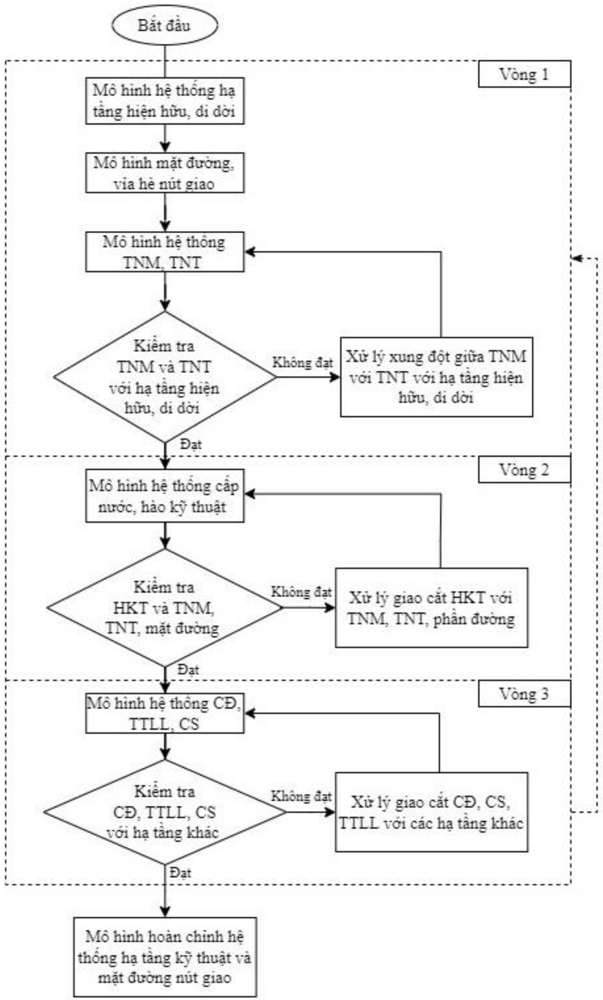

## 8. Kiểm tra và đảm bảo chất lượng mô hình

## 8.1. Đảm bảo chất lượng mô hình của bộ phân thực hiện BIM

Trong suốt quá trình thực hiện áp dụng BIM, việc đảm bảo chất lượng của Mô hình BIM là một phần của công tác triển khai cả trong giai đoạn tạo lập mô hình trong giai đoạn thiết kế và cập nhật mô hình trong giai đoạn thi công. Các mô hình cần được kiểm tra thường xuyên trong quá trình thiết kế và trước khi thực hiện việc chia sẻ, phối hợp với các bên liên quan khác. Bằng cách này có thể đảm bảo hồ sơ thiết kế có nội dung kỹ thuật chính xác. Đảm bảo chất lượng mô  hình  thay  cho  đảm  bảo  chất  lượng  thiết  kế  truyền  thống,  trong  đó  chất lượng của giải pháp thiết kế được đề cập và xem xét theo các khía cạnh như kỹ thuật, kích thước hình học có tuân thủ tiêu chuẩn, quy chuẩn và các hướng dẫn liên quan hay không. Với các bản vẽ thiết kế được xuất ra từ mô hình phải đảm bảo chính xác với mô hình BIM. Nói chung, thiết kế và mô hình cần phải tương thích và nhất quán.

Mô hình thông tin công trình được xem xét từ 4 góc độ khác nhau:

+  Về  tính  tương  thích  của  mô  hình:  Các  mô  hình  có  tương  thích  hay không? Có lỗi hay xung đột trong việc phối hợp các mô hình thành phần với nhau hay

không? Các xung đột trước đó đã được xử lý hết chưa?

+ Về tính đầy đủ thông tin của mô hình: các mô hình chứa đầy đủ thông tin, dữ liệu cần thiết trong từng giai đoạn (thiết kế, thi công, vận hành và bảo trì) hay

không?  Mô  hình  đã  được  làm  sạch  và  loại  bỏ  các  liên  kết  tham  chiếu không cần thiết chưa? Các tệp mô hình đã đầy đủ chưa và đã được phân chia theo quy tắc phân chia mô hình chưa?

+ Về yêu cầu kỹ thuật: mô hình được tạo lập có tuân thủ theo các hướng dẫn, tiêu chuẩn, quy định chung của dự án không?
+ Về quản lý thông tin: các hồ sơ thiết kế cần được cung cấp dựa theo các nguyên tắc quản lý thông tin trong Yêu cầu về thông tin trao đổi của chủ đầu tư bao gồm: các báo cáo mô hình trong các giai đoạn, danh mục tài liệu và các tài liệu tự kiểm tra. Ví dụ các định dạng tệp và quy tắc đặt tên có được tuân thủ trong quá trình triển khai không? Dung lượng mô hình có đảm bảo ko?

Bộ phận thưc hiện BIM kiểm tra chất lượng nội bộ đối với từng thành phần và cấu kiện trong các mô hình thuộc phạm vị công việc theo Kế hoạch chuyển giao thông tin nhiệm vụ (TIDP) trước khi chuyển cho Đơn vị thực hiện kiểm tra đánh giá.

## 8.2. Đảm bảo chất lượng mô hình của đơn vị thực hiện chính

Bộ phận thực hiện BIM tạo dựng các mô hình thành phần trước khi phối hợp đa bộ môn. Đơn vị thực hiện chính xem xét và kiểm tra mà không làm thay đổi mô hình. Quá trình này được lặp đi lặp lại trong cùng một mô hình cho đến khi Đơn vị thực hiện chính chấp thuận với Mô hình BIM đạt yêu cầu. Mô hình này sẽ được lưu dưới dạng tài liệu của hồ sơ kiểm soát chất lượng.

Kiểm tra chất lượng kỹ thuật mô hình BIM được thực hiện bởi người phụ trách công việc điều phối BIM hoặc ủy quyền cho một nhân sự khác. Với mỗi mục trong danh sách kiểm tra, cần được xác định chất lượng theo mức:

+ Đạt
+ Chưa đạt

Khi mô hình được kiểm tra theo tất cả các mục trong danh sách và được xác nhận bởi Đơn vị thực hiện chính, Bộ phận thực hiện BIM chỉnh sửa các mục được đánh dấu là 'Chưa đạt'. Khi chỉnh sửa xong, mô hình sẽ được kiểm tra lại theo quy trình trên. Khi tất cả các mục được đánh dấu là 'Đạt' thì mô

hình sẽ được chấp thuận để xem xét nghiệm thu.

Việc kiểm tra xung đột giữa các bộ môn được thực hiện theo quy trình và nguyên tắc về kiểm tra xung đột đã được nêu trong Hướng dẫn này.

Quản lý chất lượng bản vẽ xuất ra từ mô hình BIM: Các bản vẽ 2D được xuất ra từ mô hình được bàn giao cùng các bản vẽ khác của dự án trên môi trường dữ liệu chung và được kiểm tra tính nhất quán với các đối tượng trên mô hình như về vị trí, cao độ, kích thước, hình dạng, thông tin ghi chú trong bản vẽ và thông tin của đối tượng trong mô hình. Quá trình kiểm tra và chỉnh sửa diễn ra liên tục cho đến khi Đơn vị thực hiện đồng ý phê duyệt mô hình và

bản vẽ.

Một số nội dung kiểm tra chất lượng kỹ thuật mô hình dưới đây cần được thực hiện:

+ Kiểm tra và sửa chữa các lỗi/ cảnh báo trong phầm mềm chứa tệp mô hình gốc
+ Đảm bảo tất cả các mô hình sử dụng chung một ' Gốc tọa độ, Hệ lưới trục, cao độ'
+ Kiểm tra các liên kết CAD
+ Xóa các khung nhìn, bản vẽ… không sử dụng hoặc dư thừa.
+ Đảm bảo rằng tất cả các ghi chú, ký hiệu, đường ghi kích thước… nhất quán

trên các mô hình.

+ Tuân thủ quy tắc đặt tên.

## 8.3. Kiểm tra và nghiệm thu mô hình của Chủ đâu tư

Kiểm soát chất lượng mô hình phải đảm bảo: Nội dung kỹ thuật tuân thủ theo các hướng dẫn; Thông tin dữ liệu theo yêu cầu từng giai đoạn dự án, và việc sử dụng phải phù hợp với mục tiêu áp dụng BIM.

+ Về kỹ thuật: Mô hình được tạo lập tuân thủ theo quy trình, hướng dẫn và hệ

## thống phân loại;

+ Về thông tin: Mô hình phải chứa dữ liệu theo yêu cầu thông tin trong từng giai đoạn dự án (thiết kế, thi công và bảo trì...);
+ Đánh giá chất lượng: Các giải pháp xử lý xung đột giữa các đối tượng mô hình, độ chính xác và mức độ chi tiết theo yêu cầu.
+ Tham khảo biểu mẫu kiểm tra mô hình dưới đây:

| BẢNG NỘI DUNG KIỂM TRA MÔ HÌNH   | BẢNG NỘI DUNG KIỂM TRA MÔ HÌNH                            | BẢNG NỘI DUNG KIỂM TRA MÔ HÌNH   | BẢNG NỘI DUNG KIỂM TRA MÔ HÌNH                                       | BẢNG NỘI DUNG KIỂM TRA MÔ HÌNH   |
|----------------------------------|-----------------------------------------------------------|----------------------------------|----------------------------------------------------------------------|----------------------------------|
| STT                              | Nội dung kiểm soát                                        | Công cụ kiểm soát                | Mục đích kiểm soát                                                   | Báo cáo, kết quả kiểm tra        |
| A                                | Kiểm tra tổng thể                                         |                                  |                                                                      |                                  |
| 1                                | Kiểm tra số lượng file                                    | Trực quan                        | Kiểm tra các file bàn giao đã đủ số lượng theo yêu cầu chưa          |                                  |
| 2                                | Kiểm tra định dạng file                                   | Trực quan                        | Kiểm tra các file bàn giao đã đúng định dạng theo yêu cầu chưa       |                                  |
| 3                                | Kiểm tra phiên bản file                                   | Trực quan                        | Kiểm tra các file bàn giao đã đúng phiên bản theo yêu cầu chưa       |                                  |
| 4                                | Kiểm tra dung lượng file                                  | Trực quan                        | Kiểm tra các file bàn giao đã đảm bảo dung lượng theo yêu cầu chưa   |                                  |
| 5                                | Kiểm tra quy cách đặt tên file                            | Trực quan                        | Kiểm tra các file bàn giao đã đúng quy định chưa                     |                                  |
| 6                                | Kiểm tra nội dung file bàn giao                           | Trực quan                        | Kiểm tra nội dung file bàn giao đã đúng với mô tả theo tên file chưa |                                  |
| B                                | Kiểm tra thông tin định vị công trình                     |                                  |                                                                      |                                  |
| 7                                | Tọa độ các điểm định vị công trình và hạng mục công trình | Trực quan                        | Đảm bảo tọa độ các điểm định vị đã đúng theo bản vẽ phát hành        |                                  |

| BẢNG NỘI DUNG KIỂM TRA MÔ HÌNH   | BẢNG NỘI DUNG KIỂM TRA MÔ HÌNH                           | BẢNG NỘI DUNG KIỂM TRA MÔ HÌNH   | BẢNG NỘI DUNG KIỂM TRA MÔ HÌNH                                              | BẢNG NỘI DUNG KIỂM TRA MÔ HÌNH   |
|----------------------------------|----------------------------------------------------------|----------------------------------|-----------------------------------------------------------------------------|----------------------------------|
| STT                              | Nội dung kiểm soát                                       | Công cụ                          | Mục đích kiểm soát                                                          | Báo cáo, kết                     |
| 8                                | Kiểm tra hướng của công trình đã chính xác chưa          | kiểm soát Trực quan              | Đảm bảo hướng đúng theo bản vẽ phát hành                                    | quả kiểm tra                     |
| C                                | Kiểm tra tình trạng mô hình                              |                                  |                                                                             |                                  |
| 9                                | Kiểm tra đơn vị đo lường                                 | Trực quan                        | Đảm bảo đơn vị do lường đã đảm bảo theo yêu cầu của dự án chưa              |                                  |
| 10                               | Các đối tượng thuộc phạm vi mô hình                      | Trực quan                        | Đảm bảo bảo mô hình đã đủ các đối tượng theo quy định chưa                  |                                  |
| 11                               | Đối tượng không thuộc phạm vi mô hình                    | Trực quan                        | Đảm bảo mô hình không chứa các đối tượng không thuộc phạm vi mô hình        |                                  |
| 12                               | Kiểm tra đối tượng trùng lặp                             | Trực quan                        | Đảm bảo ko có các đối tượng bị trùng lặp trong mô hình                      |                                  |
| 13                               | Kiểm tra đối tượng Overlap                               | Trực quan                        | Đảm bảo ko có các đối tượng bị đè lên nhau                                  |                                  |
| 14                               | Các đối tượng không sử dụng                              | Trực quan                        | Đảm bảo các đối tượng không sử dụng phải được xóa khỏi mô hình              |                                  |
| 15                               | Làm sạch mô hình (Purge và delete unnecessary,...)       | Trực quan                        | Đảm bảo mô hình được làm sạch                                               |                                  |
| D                                | Kiểm tra tiêu chuẩn                                      |                                  |                                                                             |                                  |
| 16                               | Kiểm tra kích thước tổng thê của các hạnh mục công trình | Trực quan                        | Đảm bảo các kích thước tổng thể của các hạnh mục đúng theo bản vẽ phát hành |                                  |

| BẢNG NỘI DUNG KIỂM TRA MÔ HÌNH   | BẢNG NỘI DUNG KIỂM TRA MÔ HÌNH                            | BẢNG NỘI DUNG KIỂM TRA MÔ HÌNH   | BẢNG NỘI DUNG KIỂM TRA MÔ HÌNH                                                                                                      | BẢNG NỘI DUNG KIỂM TRA MÔ HÌNH   |
|----------------------------------|-----------------------------------------------------------|----------------------------------|-------------------------------------------------------------------------------------------------------------------------------------|----------------------------------|
| STT                              | Nội dung kiểm soát                                        | Công cụ                          | Mục đích kiểm soát                                                                                                                  | Báo cáo, kết                     |
| 17                               | Kiểm tra các lớp hoặc khối của các hạnh mục công trình    | kiểm soát Trực quan              | Đảm bảo các lớp hoặc khối của các hạnh mục công trình được phân chia đúng số lượng và chính xác về kích thước theo bản vẽ pháy hành | quả kiểm tra                     |
| 18                               | Kiểm tra cao độ                                           | Trực quan                        | Đảm bảo cao độ của của các hạnh mục, đối tượng đúng theo bản vẽ phát hành                                                           |                                  |
| 19                               | Kiểm tra kích thước chi tiết của các đối tượng công trình | Trực quan                        | Đảm bảo các đối tượng đúng kích thước theo bản vẽ phát hành                                                                         |                                  |
| 20                               | Kiểm tra cắt cốt thép                                     | Trực quan                        | Đảm bảo cốt thép của các đối tượng kết cấu đúng theo theo bản vẽ thiết kế                                                           |                                  |
| 21                               | Kiểm tra tên các đối tượng mô hình (Ví dụ: Tên type       | Trực quan                        | Đảm bảo các đối tượng được mô hình được đặt đúng tên hoặc mô tả đúng loại cấu kiện đang thể hiện theo bản vẽ phát hành              |                                  |
| 22                               | Kiểm tra vật liệu                                         | Trực quan                        | Đảm bảo các đối tượng được mô hình được đặt đúng vật liệu theo bản vẽ phát hành chưa                                                |                                  |
| 23                               | Kiểm tra mâu thuẫn thông tin                              | Trực quan                        | Đảm bảo thông tin trong một đối tượng không bị mâu thuẫn nhau.                                                                      |                                  |
| 24                               | Kiểm tra hệ thống bộ môn cơ điện                          | Trực quan                        | Đảm bảo các hệ thống cho bộ môn cơ điện là chính xác                                                                                |                                  |
| 25                               | Kiểm tra tên viết tắt bộ môn cơ điện                      | Trực quan                        | Đảm bảo tên viết tắt các hệ thống cho bộ môn cơ điện là chính xác                                                                   |                                  |
| 26                               | Kiểm tra màu sắc hệ thống                                 | Trực quan                        | Đảm bảo màu sắc các hệ thống cho bộ môn cơ điện là                                                                                  |                                  |

| BẢNG NỘI DUNG KIỂM TRA MÔ HÌNH   | BẢNG NỘI DUNG KIỂM TRA MÔ HÌNH         | BẢNG NỘI DUNG KIỂM TRA MÔ HÌNH   | BẢNG NỘI DUNG KIỂM TRA MÔ HÌNH                                                                   | BẢNG NỘI DUNG KIỂM TRA MÔ HÌNH   |
|----------------------------------|----------------------------------------|----------------------------------|--------------------------------------------------------------------------------------------------|----------------------------------|
| STT                              | Nội dung kiểm soát                     | Công cụ                          | Mục đích kiểm soát                                                                               | Báo cáo, kết                     |
|                                  |                                        | kiểm soát                        | chính xác                                                                                        | quả kiểm tra                     |
| 27                               | Kiểm tra thông tin kỹ thuật khác       | Trực quan                        | Đảm bảo các thông tin được thể hiện trên bản vẽ chính xác với các thông tin được đưa vào mô hình |                                  |
| E                                | Kiểm tra xung đột                      |                                  |                                                                                                  |                                  |
| 28                               | Kiểm tra các va chạm đã phát hiện được | Trực quan                        | Đảm bảo các va chạm đã phát hiện được là chính xác                                               |                                  |
| 29                               | Kiểm tra giải quyết va chạm            | Trực quan                        | Đảm bảo các va chạm chính xác đã được phát hiện đã được giải quyết                               |                                  |

## 9. Lịch họp dự án

Tần  suất  họp  phối  hợp  BIM  và  các  cuộc  họp  khác  liên  quan  đến  BIM được điều chỉnh tuỳ thuộc vào giai đoạn và tình hình triển khai thực hiện dự án. Biểu mẫu tầng suất họp liên quan đến BIM dưới đây:

| Loại cuộc họp                                  | Hình thức                                      | Tần xuất                                       | Thành phần                                     | Địa điểm                                       |
|------------------------------------------------|------------------------------------------------|------------------------------------------------|------------------------------------------------|------------------------------------------------|
| Giai đoạn chuẩn bị dự án                       | Giai đoạn chuẩn bị dự án                       | Giai đoạn chuẩn bị dự án                       | Giai đoạn chuẩn bị dự án                       | Giai đoạn chuẩn bị dự án                       |
| Họp khởi động dự án                            | Trực tiếp/ trực tuyến                          | 1 lần                                          | Tất cả                                         | Đề xuất                                        |
| Bảo vệ kế hoạch thực hiện BIM                  | Trực tiếp/ trực tuyến                          | 1 lần                                          | Tất cả                                         | Đề xuất                                        |
| Phối hợp thiết kế                              | Trực tiếp/ trực tuyến                          | 2 lần/ tháng                                   | TVTK                                           | Đề xuất                                        |
| …..                                            |                                                |                                                |                                                |                                                |
| Giai đoạn thiết kế kỹ thuật và bản vẽ thi công | Giai đoạn thiết kế kỹ thuật và bản vẽ thi công | Giai đoạn thiết kế kỹ thuật và bản vẽ thi công | Giai đoạn thiết kế kỹ thuật và bản vẽ thi công | Giai đoạn thiết kế kỹ thuật và bản vẽ thi công |
| …..                                            |                                                |                                                |                                                |                                                |

## PHỤ LỤC 01: NỘI DUNG ÁP DỤNG BIM

## 1. Tạo lập mô hình hiện trạng

Các dự án đầu tư xây dựng công trình giao thông  thường là các  dự có phạm vi rất rộng, với nhiều loại địa hình, địa chất, thủy văn khác nhau. Do đó, mô hình  hiện  trạng  thường  bao  gồm  các  thông  tin:  Hiện  trạng  điều  kiện  tự nhiên khu vực; hiện trạng địa hình, địa vật; khu vực địa chất đặc biệt và. Chủ đầu tư và nhà thầu thống nhất yêu cầu và mục đích của việc xây dựng mô hình hiện trạng để xác định phạm vi cần thực hiện tạo lập mô hình. Từ các dữ liệu khảo sát thu thập được, các mô hình hiện trạng tạo lập cần thể hiện được tối thiểu các lớp trên bề mặt địa hính, địa vật trong khu vực khảo sát.

Để thu thập dữ liệu khảo sát nhanh hơn và chính xác hơn, nhà thầu cần xem xét kết hợp các phương pháp khảo sát dưới đây:

-Duy  trì  các  kỹ  thuật  đo  đạc  truyền  thống  (GPS,  toàn  đạc,  thủy  chuẩn) nhưng giảm khối lượng và mật độ triển khai thực tiễn theo quy trình quy phạm cũ;

-Duy trì việc thu thập  số liệu từ các tài liệu  giấy  đối  với  các  công  trình ngầm (hạ tầng viễn thông điện lực, hạ tầng cấp thoát nước,…);

-Sử dụng giải pháp đo vẽ ảnh hàng không bằng máy bay không người lái UAV chụp ảnh mặt đất toàn tuyến độ phân giải cao (độ phân giải mặt đất ở mức 2cm đến 5cm);

-Sử dụng giải pháp quét laser ba chiều LiDAR theo các phương thức phổ biến hiện nay như cố định, di động trên phương tiện ô tô và di động trên thiết bị bay không người lái UAV;

-Đo sâu hồi âm các khu vực ngập nước sử dụng thiết bị bay không người lái UAV độ chính xác và độ chi tiết cao (độ chính xác tới cm ở độ sâu tới 50 mét);

-Tích  hợp  các  dạng  thức  số  liệu  cần  thiết  theo  quy  định  của  dự  án  giao thông (khảo sát hiện trạng địa hình, địa chất, thủy văn, số liệu kinh tế xã hội …) vào môi trường dữ liệu dùng chung.

Hình 8: Mô hình hiện trạng dựa dựa trên dữ liệu đám mấy điểm

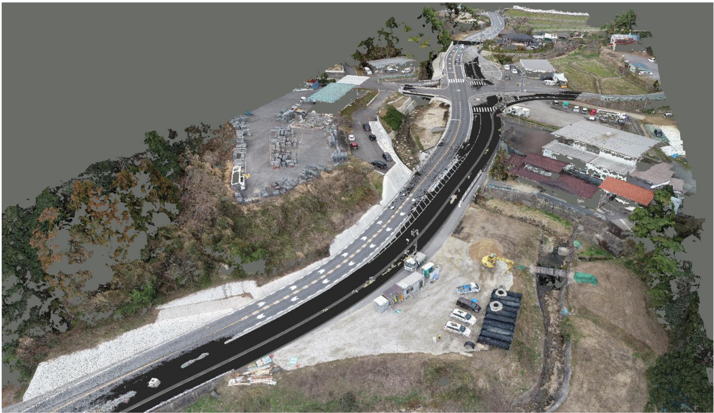

Việc lập mô hình chính xác hiện trạng đối với dự án đầu tư xây dựng công trình giao thông là cơ sở quan trọng có thể hỗ trợ công tác lập kế hoạch, hỗ trợ cung  cấp  thông  tin  cho  công  tác  giải  phóng  mặt  bằng,  thiết  kế  và  lựa  chọn phương án thiết kế khi được phối hợp với dữ liệu chính xác từ thực địa.

## 2. Tạo lập thiết kế với mô hình 3D BIM

Các mô hình BIM được tạo lập và phát triển thông tin qua các giai đoạn từ thiết kế cơ sở, thiết kế kỹ thuật và thiết kế bản vẽ thi công và các bước thiết kế khác (nếu có) theo thông lệ quốc tế do người quyết định đầu tư quyết định khi quyết định đầu tư dự án. Các mô hình BIM ở giai đoạn thiết kế sau được kế thừa và phát triển tiếp từ giai đoạn thiết kế trước.

Mỗi dự án chỉ có một mô hình BIM tổng thể duy nhất trong suốt quá trình triển  khai,  mô  hình  này  được tách thành các gói công việc riêng biệt để phù hợp với vai trò và trách nhiệm của mỗi nhóm thực hiện dự án. Mô hình tổng thể được chia thành các mô hình chính (theo các đoạn tuyến với lý trình tăng dần, phần cầu chính, phần cầu dẫn), các mô hình chính tiếp tục được chia thành các mô hình thành phần (theo các bộ môn thiết kế).

Hình 9: Mô hình BIM cầu Thủ Thiêm 2 được phân chia phần cầu chính và cầu dẫn

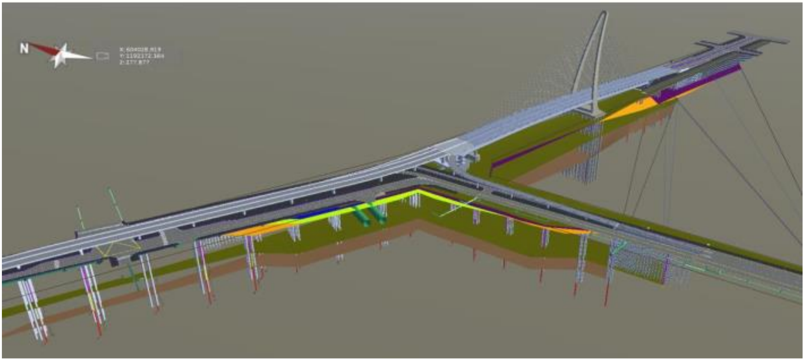

Hình 10: Mô hình BIM dự án cầu Hoàng Văn Thụ - Thành phố Hải Phòng

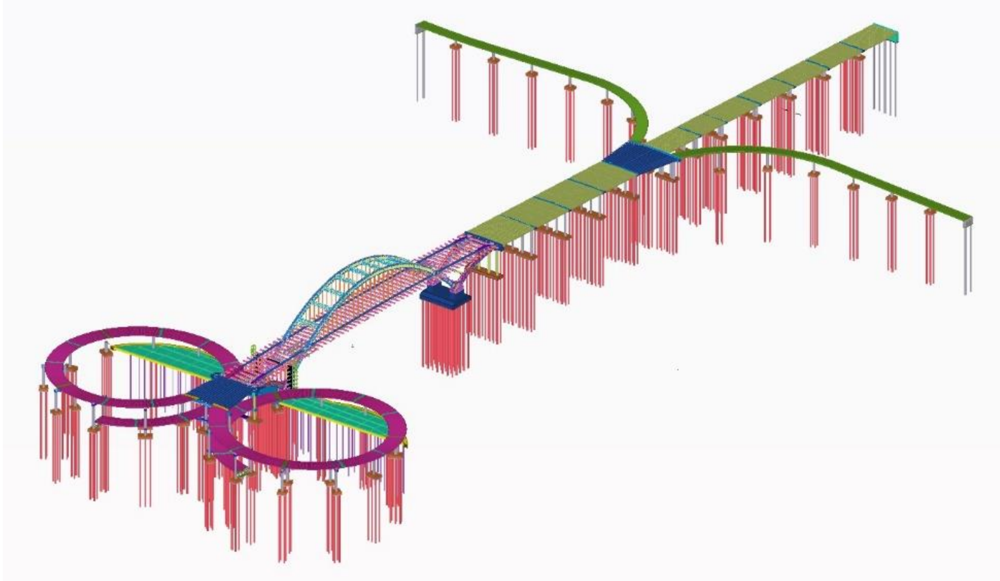

Mô hình BIM được pháp triển trong mỗi giai đoạn thiết kế bao gồm các thông tin hình học, thông tin phi hình học, các tài liệu trong quá trình thiết kế dự án, giải pháp thi công, mô hình này là nển tảng để pháp triển các ứng dụng dụng BIM khác trong dự án.

Hình 11: Mô hình BIM tại một nút trên dự án cao tốc Hà Nội - Hải Phòng

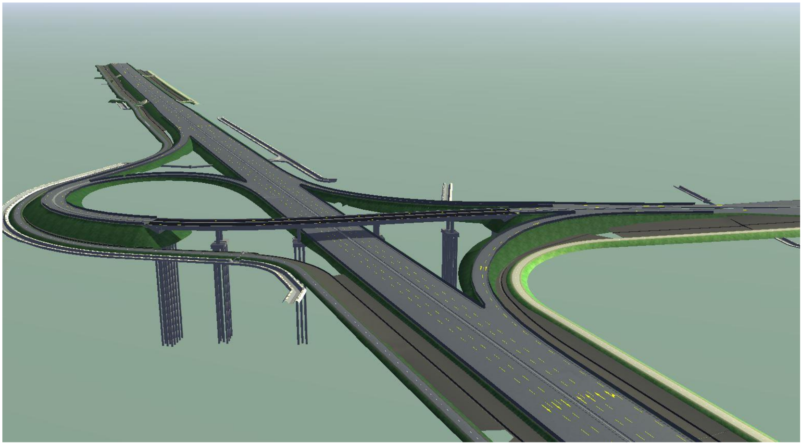

Việc tạo lập thiết kế với mô hình BIM giúp cho Chủ đầu tư và các bên liên quan có hiểu biết tốt hơn về phương án thiết kế nhằm đưa ra các quyết định hiệu quả hơn, đồng thời phát hiện và xử lý sớm hơn các vấn đề thiết kế trong tiến trình thiết kế.

## a. Tạo lập mô hình BIM trong bước thiết kế cơ sở

Mô hình BIM trong bước thiết kế cơ sở nhằm phục vụ phân tích và đánh giá sự cần thiết đầu tư dự án, phân tích so sánh các phương án và tính khả thi của các giải pháp thiết kế. Mô hình cần cung cấp các dữ liệu thông tin chung về khối lượng để ước tính chi phí, sự tác động tới môi trường và các thông tin liên quan khác ảnh hưởng đến dự án.

Mô hình BIM trong bước thiết kế cơ sở thể hiện các giải pháp thiết kế (vị trí, quy mô, cao trình, chức năng hệ thống...). Đồng thời xác định phạm vi sử dụng của công trình và phạm vi giải phóng mặt bằng nhằm đảm bảo công trình sẽ được xây dựng phù hợp với việc sử dụng đất và hệ thống giao thông ở các khu vực xung quanh.

Mô hình thiết kế cơ sở trong giai đoạn nghiên cứu khả thi có thể được tinh giản nhưng phải đảm bảo đầy đủ các yếu tố hình học chủ yếu, không gian bố trí công trình đủ chi tiết và phù hợp với môi trường và những yêu cầu liên quan, các đường biên khu vực có ảnh hưởng về pháp lý phải được thể hiện trên mô hình trong giai đoạn thiết kế, này giúp hỗ trợ cho những mục đích quan trọng như tính toán chi phí đầu tư, đánh giá lựa chọn phương án thiết kế.

Mô hình BIM trong bước thiết kế cơ sở đáp ứng được các yêu cầu về thiết kế cơ sở trong Luật Xây dựng, các nghị định, thông tư hiện hành và yêu cầu kỹ thuật của dự án.

## b. Tạo lập mô hình BIM trong các bước thiết kế sau thiết kế cơ sở

Trong trường hợp mô hình BIM của dự án đã được tạo lập từ bước thiết kế cơ sở, mô hình BIM của bước thiết kế cơ sở được chủ đầu tư bàn giao cho nhà thầu thực hiện các bước thiết kế sau thiết kế cơ sở để tiếp tục phát triển mô hình.  Trong  các  bước  thiết  kế  này  tất  cả  các  thành  phần  của  công  trình  đều được mô hình hóa, ngoại trừ một số thành phần hoặc hạng mục được chủ đầu tư và nhà thầu thống nhất không đưa vào mô hình do đặc thù của dự án hoặc hạng  mục  công  việc  (ví  dụ:  các  thành  phần  công  trình  tạm,  công  trình  phụ trợ,…).

Những chi tiết kỹ thuật được thiết kế cần mô hình đạt được mức độ chi tiết và chính xác phù hợp với bước thiết kế tương ứng. Các mô hình BIM được nhà thầu chia sẻ hoặc bàn giao luôn phải tương ứng chính xác với các hồ sơ bản vẽ được xác định là xuất ra từ mô hình.

Cuối bước mỗi bước thiết kế, nhà thầu nộp các mô hình BIM cuối cùng của mỗi bước thiết kế tương ứng cùng hồ sơ bản vẽ thiết kế để thẩm định và phê duyệt. Mô hình BIM trong bước thiết kế bản vẽ thi công được dùng làm cơ sở cho xây dựng hồ sơ lựa chọn nhà thầu cũng như hồ sơ phục vụ quá trình thi công.

Mô hình thiết kế phải chứa các thông tin hình học và thông tin phi hình học của các cấu kiện công trình (các lớp mặt đường và kết cấu nền đường, kết cấu cầu và công trình phụ trợ,...), các khu vực có thực hiện việc xuất bản vẽ từ mô hình hoặc xuất không lượng cần thực hiện mô hình đầy đủ các thành phần thể hiện trên  bản  vẽ  hoặc bảng khối lượng. Những thành phần khác có liên quan cần phải tạo lập mô hình được thống nhất giữa chủ đầu tư và nhà thầu.

Hình 12: Mô hình BIM chi tiết kết cấu trong giai đoạn thiết kế kỹ thuật - Dự án cầu Hoàng Văn Thụ

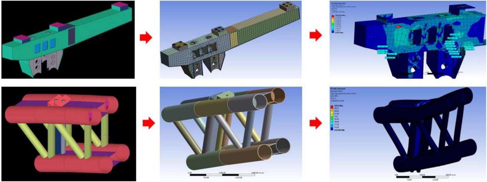

Hình 13: Mô hình BIM chi tiết kết cấu bước thiết kế bản vẽ thi công - Dự án cầu Châu Đốc

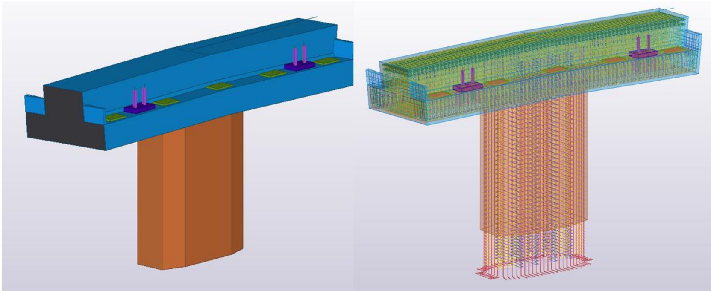

Tại  bước  thiết  kế  kỹ  thuật,  khối  lượng  thông  tin  trong  mô  hình  BIM  có  số lượng ít hơn giai đoạn thiết kế bản vẽ thi công. Tuy nhiên, trong các bước thiết kế này, các tham số chính phục vụ cho việc tính toán thiết kế cần được đưa vào mô hình dưới dạng các thông tin phi hình học, bao gồm: thông tin vật liệu cấu thành,  thông  tin  hoàn  thiện,  loại,  kích  thước,  cao  độ,  cường  độ,  độ  chặt,  các thông tin chỉ dẫn cho việc thi công, các thông tin khác được quy định trong bảng mức độ phát triển thông tin của các cấu kiện mô hình.

Mô hình BIM trong bước thiết kế kỹ thuật và thiết kế bản vẽ thi công cần đáp ứng được các yêu cầu về thiết kế tương ứng trong Luật Xây dựng, các nghị định, thông tư hiện hành và yêu cầu kỹ thuật của dự án.

## 3. Diễn họa phương án thiết kế

Dựa trên nền tảng các mô hình BIM của các bộ môn đã tạo lập trong giai đoạn thiết kế và các dữ liệu chính xác từ mô hình hiện trạng, dữ liệu quy hoạch, dữ liệu GIS được tổng hợp và diễn họa phương án thiết kế, giúp chủ đầu tư nhận thức về ý tưởng thiết kế với các phương án thiết kế khác nhau. Việc diễn họa phương án thiết kế cũng thể hiện chính xác khả năng kết nối và đồng bộ với các hệ thống hạ tầng hiện hữu khác, để có thể lựa chọn phương án thiết kế phù hợp.

Hình 14: Diễn họa phương án thiết kế nút giao trên cao tốc

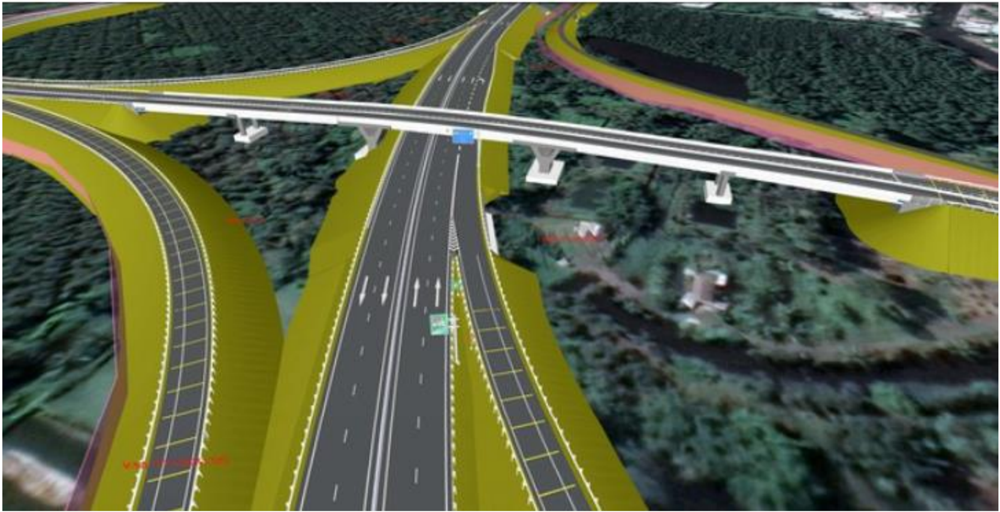

Hình 15: Diễn họa phương án thiết kế tại nút giao

## 4. Phân tích mô phỏng giao thông

Phân tích mô phỏng giao thông được thực hiện ở giai đoạn thiết kế các nút giao thông. Mô hình BIM làm nền tảng để đưa vào các tham số động trên nhiều phương án thiết kế, mô phỏng dòng giao thông cá nhân, mô phỏng hệ thống giao thông công cộng, sự di chuyển của khách bộ hành, trình tự và thời gian đèn giao thông, hành vi của người điều khiển phương tiện, từ đó nhằm xác định và giảm thiểu các điểm nghẽn có thể dẫn đẫn tình trạng ùn tắc, hoặc tai nạn giao thông và đưa ra phương án điều chỉnh thiết kế phù hợp.

Hình 16: Mô phỏng chuyển động giao thông

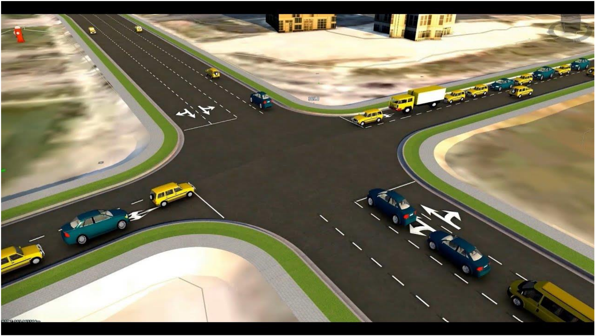

Hình 17: Quá trình mô phỏng và đánh giá lưu lượng giao thông

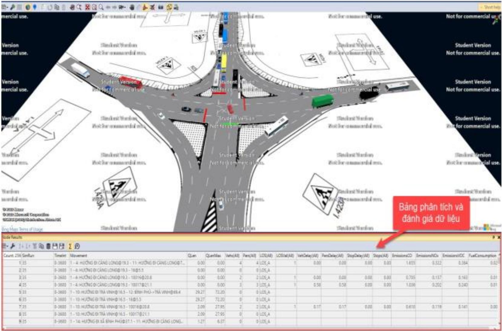

## 5. Phối hợp giữa các bộ môn

Việc phối hợp giữa các bộ môn được thực hiện trong suốt quá trình thiết kế và thi công để phát hiện ra những xung đột hệ thống, cậu kiện hoặc những điểm bất hợp lý giữa các bộ môn có thể ảnh hưởng đến công năng, hoặc các sai sót ảnh hưởng đến tiến độ dự án.

Qua trình phối hợp kiểm tra xung đột giữa các bộ môn cần đảm bảo lần lượt và đầy đủ tuân theo danh mục yêu cầu trong ma trận xung đột. Việc phát hiện và xử lý xung đột cần xác định rõ mức độ các xung đột lớn cần xử lý trên mô hình, và những loại xung đột có thể điều chỉnh tại công trường.

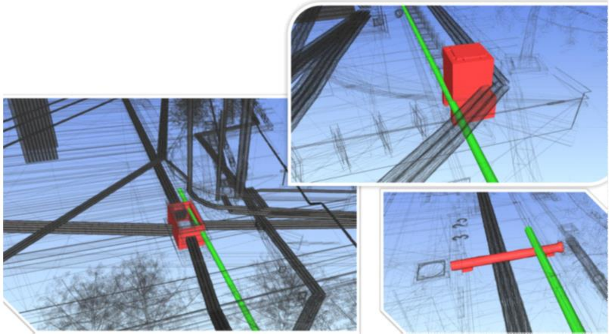

Hình 18: Xung đột giữa hạ tầng ngầm hiện trạng và hạ tâng ngầm thiết kế mới, dự án Metro 2

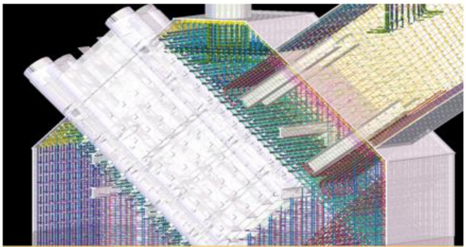

LIÊN KÉT TAI THÂN TRU CHÍNH

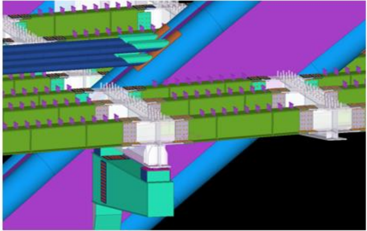

LIÊN KÉT GIÛA VÒM VI H MĂT CÀU

LIÊN KÉT TAI DÀM NGANG DINH TRU

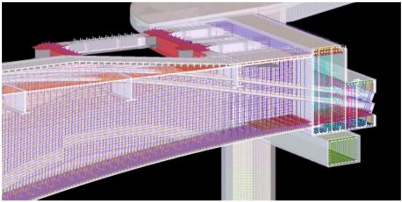

LIÊN KÉT GIUA TRU VÀ DÀM BÁN RÕNG

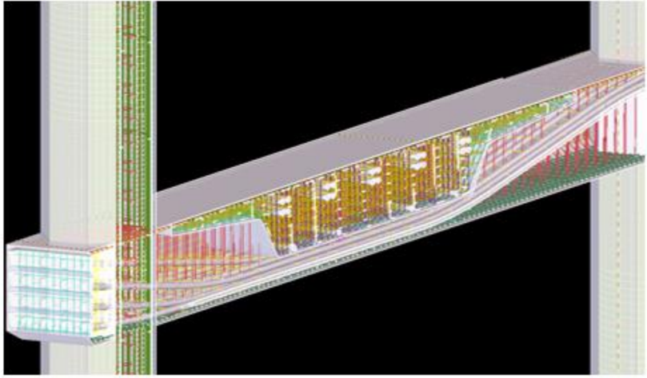

Hình 19: Kiểm tra xung đột tại các vị trí liên kết - Dự án cầu Hoàng Văn Thụ

## 6. Kiểm tra thiết kế

Việc kiểm tra và đánh giá thiết kế được thực hiện trên mô hình BIM đã được chia sẻ cho các bên liên quan tron dự án. Các mô hình cung cấp thông tin trực quan giúp các đơn vị thẩm tra, thẩm định có thể hình dung, kiểm tra và phản hồi để xác thực tất cả các khía cạnh của thiết kế. Các mô hình này sẽ được chia sẻ và phản hồi trực tiếp trên môi trường dữ liệu chung của dự án. Tất cả thông tin mô hình trong các bước thiết kế được tổ chức và phần quyền trên môi trường dữ liệu chung để các đơn vị thẩm tra, thẩm định sẽ dễ dàng kiểm tra và theo dõi và cập nhật kịp thời các thông tin và các yêu cầu thay đổi.

## 7. Triển khai bản vẽ thiết kế từ mô hình

Căn cứ theo nội dung và phạm vi triển khai BIM, tại các hạng mục chính của dự án như tại khu vực nút giao, phần công trình cầu và đường dẫn, hầm, nhà ga hoặc tại các khu vực phức tạp, nhà thầu lập danh sách đăng ký các bản vẽ được xuất ra từ mô hình. Nhà thầu cần cam kết các bản vẽ đã được đăng ký được trích xuất trực tiếp từ mô hình BIM và tương đồng với thông tin trong mô hình. Các bản vẽ này có thể được bổ sung đường nét, chi tiết, ký hiệu khi cần thiết với mục đích làm rõ thông tin trong bản vẽ. Chủ đầu tư và nhà thầu thống nhất đưa ra tiêu chuẩn chung trong việc thể hiện bản vẽ.

Hình 20: Thể hiện bản vẽ trắc dọc tuyến đường xuất ra từ mô hình BIM

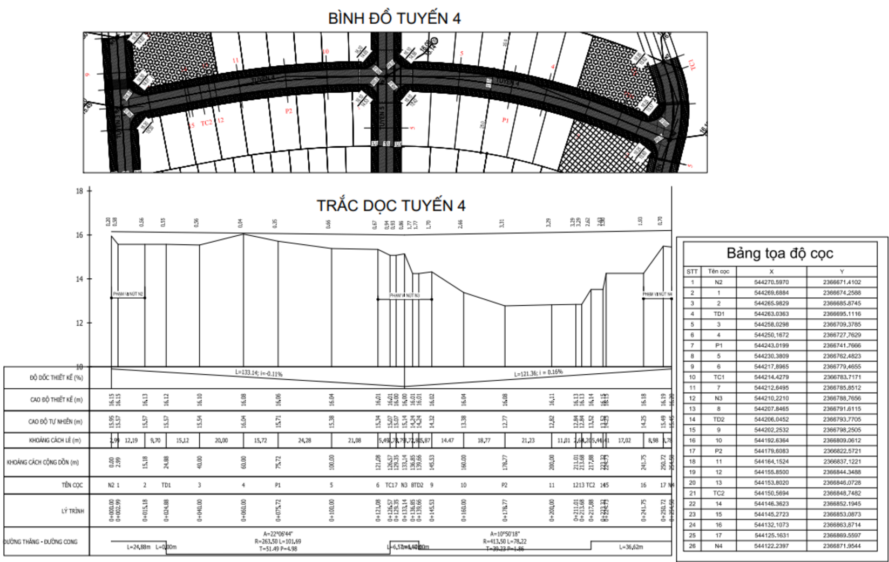

Hình 21: Thể hiện bản vẽ kết cấu mố cầu xuất ra từ mô hình BIM

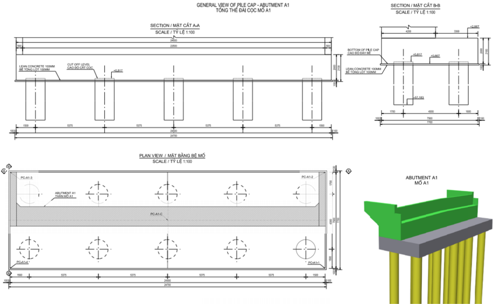

## 8. Xuất và kiểm soát khối lượng thông qua mô hình

Căn cứ theo nội dung và phạm vi triển khai BIM của dự án, nhà thầu thực hiện xuất các khối lượng chính từ mô hình phục vụ cho việc kiểm tra, kiểm soát khối lượng trong các bước thiết kế, bước thi công và hoàn công, giúp giảm thiểu các sai sót trong việc bóc tách khối lượng, đồng thời cung cấp thông tin về  khối  lượng  nhanh  chóng  giúp  hỗ  trợ  trong  việc  ra  quyết  định  lựa  chọn phương án.  Các  khối  lượng  chính  được  xác  định  là  các  thành  phần  có  khối lượng chiếm giá trị lớn trong tổng mức đầu tư và đã được tạo lập mô hình BIM, bao gồm: khối lượng đào đắp, khối lượng kết cấu đường, khối lượng kết cấu bê tông cốt thép và các thành phần khối lượng khác được chủ đầu tư và nhà thầu xem xét và lựa chọn áp dụng căn cứ theo tính chất của dự án.

Hình 22: Mô hình BIM cho đường và bảng khối lượng xuất ra từ mô hình

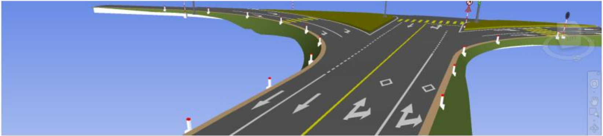

| BÅNG KHI LUONG CHI TIÉT  CHIÉU DÁI (m)  KHÓILUÓNG (m2)  DIÊN TICH (m2)  KHÓILU'QNG (m3)  TÉN  cQC  TRINH  LY  CVLY  lóp  3kg/m2  mhija 2  Láng  Vaidia  Ng5s  Cách  KT  Váidia  KT Gia  Culng  Láng nhla  2 lp C  3kg/m2  Väid KT  Ngin Cich  Vái dja KT  Gia Cafng  Vét hifu  ed  Dào nén  Dáp trá  est  Dáplé  loą I day loąi I dy  CPDD  45em  mit  20kcm lé  gin có  CPD  K&gt;=0.98  Cát san  láp dãy  50em.  K&gt;=0.95+  é gia c6  Cát san  dutli  Vét hifu ed  Dáo nén  Dáp trá cát  Báp lé  CPDD ląi I  dáy 45em  mșt  ląi I day  20cm lè  CD  gia có  Cát san láp  dáy 5em.  K&gt;=0.98  Cát san láp  K&gt;=0.95+  Wp ddi.  lé gin eó  C4  +45  8,00  16,00  9.60  4.31  9,55  13,87  18,04  3,15  0,20  3.50  2.45  15  120,00  240,00  144,00  65.63  91,80  157.50  277.13  47.25  3,00  52.50  133.80  C5  +60  8,00  16,00  9.60  4.44  2.09  7.13  18.91  3.15  0.20  3.50  15,39  56,00  112,00  67.20  31,64  61,67  87.50  86,10  22,05  1.40  24.50  85,82  C0  +07  8.00  16.00  9.00  4.00  14.93  17.87  5.09  3.15  0.20  3.50  9.13  13  104,00  208,00  124,80  56,42  179,34  224.97  75,08  40,95  2,60  45.50  116,29  C7  +80  8,00  16.00  9.60  4,08  12,66  16.74  5,86  3.15  0.20  3.50  8.76  16.39  131.12  262.24  157.34  07.30  241.10  294.04  102.36  51.03  3.28  57.37  113,00  ND1  +96.39  8,00  16,00  9,60  4,14  16,76  19,14  6,63  3,15  0.20  3,50  5,11  3.01  28,88  57.70  34,00  14.78  54,85  00.46  21.12  11.37  0.72  12.04  24.02  H  +100  8,00  16,00  9,60  4,05  13,63  17,68  5,07  3,15  0,20  3.50  8.53  20  160,00  320,00  192,00  79.50  277,00  356,50  138,20  63.00  4.00  70.00  143.90  C8  +120  8.00  16,00  9,00  3.90  14.07  17.97  8.75  3.15  0.20  3.50  5.86  20  160,00  320,00  192,00  S3,00  282,80  365,80  196.90  63,00  4,00  70,00  94.70  C9  +140  8.00  10.00  9.00  4.40  14.21  18,01  10.94  3.15  0.20  3.50  3.01  20  160,00  320,00  192,00  83,00  227,90  310,90  228,40  63,00  4,00  70,00  125.30  C10  +160  5,00  16,00  9.60  3,90  8.58  12,48  11,90  3,15  0.20  3.50  8,92  20  160.00  320,00  192.00  78.30  203.30  281.60  227.50  03.00  4.00  70.00  150.30  C11  +180  8,00  16,00  9.60  3,93  1'15  15,68  10,85  3,15  0.20  3.50  6.71  10.39  131.12  202.24  157.34  00,03  193.98  253.04  101.93  51.03  3.28  57.37  120.78  TD1  +196.39  8,00  16,00  9,60  4,20  11,92  15,27  8,91  3,15  0,20  3.50  8,76  3,01  28,88  57,76  34,06  15,05  44,26  56,48  31,75  11,37  0,72  12,64  30,38  ToN C(NG  8L.777,76  163.566,63  98.133,31  40.655.28  110.791.45  146.465,04  86.199,24  32.199.99  2.044,44  35.777,77  62.692.92   |
|------------------------------------------------------------------------------------------------------------------------------------------------------------------------------------------------------------------------------------------------------------------------------------------------------------------------------------------------------------------------------------------------------------------------------------------------------------------------------------------------------------------------------------------------------------------------------------------------------------------------------------------------------------------------------------------------------------------------------------------------------------------------------------------------------------------------------------------------------------------------------------------------------------------------------------------------------------------------------------------------------------------------------------------------------------------------------------------------------------------------------------------------------------------------------------------------------------------------------------------------------------------------------------------------------------------------------------------------------------------------------------------------------------------------------------------------------------------------------------------------------------------------------------------------------------------------------------------------------------------------------------------------------------------------------------------------------------------------------------------------------------------------------------------------------------------------------------------------------------------------------------------------------------------------------------------------------------------------------------------------------------------------------------------------------------------------------------------------------------------------------------------------------------------------------------------------------------------------------------------------------------------------------------------------------------------------------------------------------------------------------------------------------------------------------------------------------------------------------------------------------------------------------------------------------------------------------------------------------------------------------------------------------------------------------|

Hình 23: Bản vẽ và bảng khối lượng chi tiết cốt thép mố cầu được xuất ra từ mô hình BIM

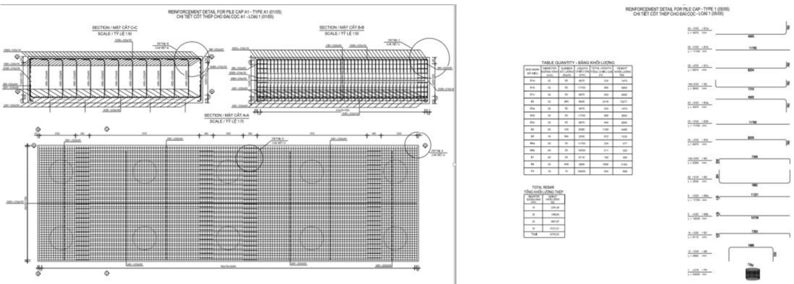

## 9. Phối hợp giữa các bên liên quan trong dự án

Việc bổ sung phối hợp giữa các bên liên quan trong dự án như là một nội dung ứng dụng BIM với mục đích yêu cầu các bên liên quan tăng cường khả năng phối hợp thông qua việc sử môi trường dữ liệu chung. Kết quả của việc phối hợp giữa bên trên môi trường dữ liệu chung là một yếu tố để đánh giá hiệu quả áp dụng BIM cho dự án.

Chủ đầu tư phối hợp với đơn vị nhà thầu thực hiện việc phân quyền và tổ chức quản lý dữ liệu, thiết lập các quy trình kiểm tra và phê duyệt hồ sơ, để đảm báo quá trình phối hợp được thông suốt.

## 10. Mô phỏng biện pháp và trình tự thi công 4D

Trong giai đoạn thi công nhà thầu sử dụng mô hình BIM đã tạo lập để thể hiện mô phỏng các biện pháp thi công chủ đạo tại các khu vực được lựa chọn như khu vực nút giao, cầu, hầm. Thực hiện mô phỏng trình tự tiến độ thi công cho toàn dự án theo tiến độ kế hoạch và thực hiện cập nhật tiến độ thi công thực tế lên mô hình để theo dõi sản lượng thi công.

Hình 24: Mô phòng biện pháp và trình tự thi công cầu

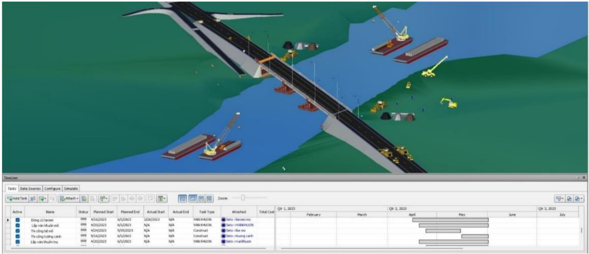

Việc  mô  phỏng  trình  tự  thi  công  cung  cấp  các  thông  tin  trực  quan  cho phép chủ đầu tư và các bên tham gia dự án hiểu rõ về thời gian và các bước thi công dự án, từ đó xác định trình tự thi công tối ưu và giải quyết các xung đột về không gian trước khi thi công, theo dõi và đối chiếu tiến độ thi công thực tế so với tiến độ kế hoạch để lường trước các rủi ro về tiến độ.

Nhà thầu thực hiện tạo phim mô phỏng trình tự thi công tổng thể của dự án với mục đích giới thiệu dự án.

## 11. Lập mô hình hoàn công

Trong giai đọan thi công mô hình BIM liên tục được nhà thầu cập nhật các thay đổi, bổ sung trong quá trình thi công dựa trên mô hình thiết kế cuối cùng tư đó tạo lập mô hình BIM hoàn công thể hiện đúng với thực tế thi công.

Mô hình BIM hoàn công do nhà thầu tạo lập là mô hình cuối cùng chứa đầy đủ các thông tin theo yêu cầu của chủ đầu tư với sự thống nhất của nhà thầu. Các thông tin phi hình học được đưa vào mô hình bao gồm đầy đủ các thông tin đã được bàn giao từ giai đoạn thiết kế và được bổ sung các thông tin xuất hiện trong giai đoạn thi công, bao gồm: Thông tin nhà thầu, thông tin nhà sản xuất, thông tin nhà cung cấp, thời gian bắt đầu thi công thực tế, thời gian hoàn thành thi công thực tế, thời hạn sử dụng, thời gian bắt đầu bảo hành, thời hạn bảo hành, đơn vị bảo hành, cường độ thực tế, tài liệu kỹ thuật, các thông tin khác được chủ đầu tư và nhà thầu thống nhất đưa vào mô hình BIM hoàn công để đảm bảo cung cấp đầy đủ thông tin bàn giao cho công tác quản lý vận hành và bảo trì công trình.

Hình 25: Mô hình BIM hoàn công cầu Bà Kẹo, Cà Mau

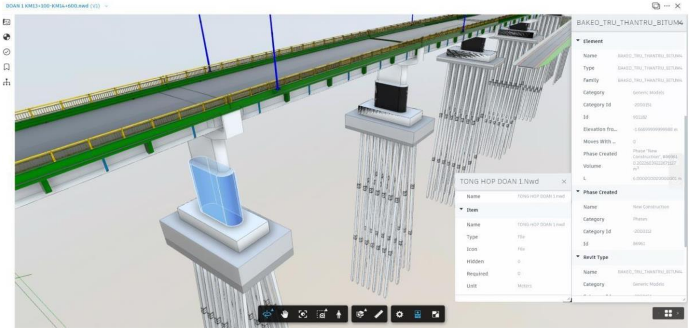

Trong quá trình lập mô hình hoàn công Chủ đầu tư và các đơn vị thực hiện cần nghiên cứu, xem xét bổ sung các trường thông tin phi hình học cho một số thành phần công trình yêu cầu sẽ yêu cầu thực hiện công tác bảo trì dự đoán (PDM) để thực hiện xây dựng hệ thống giao thông thông minh.

## 12. Chuyển giao mô hình BIM hoàn công

Các đơn vị/ bộ phận thực hiện việc chuyển giao mô hình BIM hoàn công và các thông tin chuyển giao theo Kế hoạch triển khai BIM cho Chủ đầu tư, đây là cơ sở dữ liệu số về hạ tầng giao thông phục vụ cho giai đoạn quản lý vận hành và bảo trì công trình. Nội dung này được xem xét như là một ứng dụng BIM với mục đích nâng cao hiệu quả trong công tác bàn giao công trình từ giai đoạn thực hiện dự án sang giai đoạn kế thúc xây dựng, đưa công trình vào vận hành.

Mô hình BIM hoàn công và các tài liệu hoàn công của công trình được chuyển giao trên môi trường dữ liệu chung cần bao gồm đầy đủ các thông tin hình học, thông tin phi hình học và các tài liệu theo Kế hoạch chuyển giao thông tin tổng thể (MIDP).

## PHỤ LỤC 02:

## YÊU CẦU MỨC ĐỘ PHÁT TRIỂN THÔNG TIN HÌNH HỌC (LOD-G) VÀ THÔNG TIN PHI HÌNH HỌC (LOD-I) CHO CÔNG TRÌNH GIAO THÔNG GẮN VỚI CÁC GIAI ĐOẠN TRIỂN KHAI DỰ ÁN

| THÀNH PHẦN MÔ HÌNH BIM   | GIAI ĐOẠN             | GIAI ĐOẠN                                                                                                                                                                                                | GIAI ĐOẠN                            | GIAI ĐOẠN             | GIAI ĐOẠN                                                                                                                                                                        | GIAI ĐOẠN                                              | GIAI ĐOẠN                | GIAI ĐOẠN                                                                                                                                                                                                                                                                                                                                           | GIAI ĐOẠN                                              | GIAI ĐOẠN             | GIAI ĐOẠN                                                                                                       | GIAI ĐOẠN                                              |
|--------------------------|-----------------------|----------------------------------------------------------------------------------------------------------------------------------------------------------------------------------------------------------|--------------------------------------|-----------------------|----------------------------------------------------------------------------------------------------------------------------------------------------------------------------------|--------------------------------------------------------|--------------------------|-----------------------------------------------------------------------------------------------------------------------------------------------------------------------------------------------------------------------------------------------------------------------------------------------------------------------------------------------------|--------------------------------------------------------|-----------------------|-----------------------------------------------------------------------------------------------------------------|--------------------------------------------------------|
| THÀNH PHẦN MÔ HÌNH BIM   | THIẾT KẾ CƠ SỞ        | THIẾT KẾ CƠ SỞ                                                                                                                                                                                           | THIẾT KẾ CƠ SỞ                       | THIẾT KẾ KỸ THUẬT     | THIẾT KẾ KỸ THUẬT                                                                                                                                                                | THIẾT KẾ KỸ THUẬT                                      | THIẾT KẾ BẢN VẼ THI CÔNG | THIẾT KẾ BẢN VẼ THI CÔNG                                                                                                                                                                                                                                                                                                                            | THIẾT KẾ BẢN VẼ THI CÔNG                               | THI CÔNG              | THI CÔNG                                                                                                        | THI CÔNG                                               |
| THÀNH PHẦN MÔ HÌNH BIM   | LOD                   | MÔ TẢ                                                                                                                                                                                                    | LOI                                  | LOD                   | MÔ TẢ                                                                                                                                                                            | LOI                                                    | LOD                      | MÔ TẢ                                                                                                                                                                                                                                                                                                                                               | LOI                                                    | LOD                   | MÔ TẢ                                                                                                           | LOI                                                    |
| PHẦN ĐƯỜNG GIAO THÔNG    | PHẦN ĐƯỜNG GIAO THÔNG | PHẦN ĐƯỜNG GIAO THÔNG                                                                                                                                                                                    | PHẦN ĐƯỜNG GIAO THÔNG                | PHẦN ĐƯỜNG GIAO THÔNG | PHẦN ĐƯỜNG GIAO THÔNG                                                                                                                                                            | PHẦN ĐƯỜNG GIAO THÔNG                                  | PHẦN ĐƯỜNG GIAO THÔNG    | PHẦN ĐƯỜNG GIAO THÔNG                                                                                                                                                                                                                                                                                                                               | PHẦN ĐƯỜNG GIAO THÔNG                                  | PHẦN ĐƯỜNG GIAO THÔNG | PHẦN ĐƯỜNG GIAO THÔNG                                                                                           | PHẦN ĐƯỜNG GIAO THÔNG                                  |
| Địa hình                 | 200                   | Dạng địa hình được thể hiện dưới dạng mặt phằng 3D được hình thành dựa trên một mạng lưới là tập hợp của các điểm. Mạng lưới các điểm này được đo bằng máy thuỷ bình, hoặc các thiết bị chuyên dùng khác | Loại Tên bề mặt Cao độ Tên lớp       | 300                   | Dạng địa hình được thể hiện dưới dạng mặt phằng 3D được hình thành dựa trên một mạng lưới là tập hợp của các điểm. Mạng lưới các điểm này được scan, bay chụp hoặc là dùng laser | Loại Tên bề mặt Cao độ Tên lớp Phân loại               | 350                      | Dạng địa hình được thể hiện dưới dạng mặt phằng 3D được hình thành dựa trên một mạng lưới là tập hợp của các điểm. Mạng lưới các điểm này được tạo lập bằng cách sử dụng các công nghệ như laser scan, bay chụp. Các lớp bề mặt bên dưới như đất sét, cát… được hiển thị dưới dạng mặt phẳng 3D được lấy dữ liệu từ các mẫu khoan khảo sát địa chất | Loại Tên bề mặt Cao độ Tên lớp Phân loại               | 350                   | Mức độ chi tiết hình học tương đương so với mô hình ở giai đoạn bản vẽ thi công, cập nhật theo thực tế thi công | Loại Tên mặt phằng Cao độ Tên lớp Phân loại            |
| Hố móng                  | 200                   | Hiển thị thô phần đào đất dưới dạng bề mặt cho một mặt phằng cố định với mức độ hiển thị liên kết với các dạng địa hình khác                                                                             | Loại Tên bề mặt Độ cao Tên lớp       | 300                   | Hiển thị mặt bằng đào đất cho móng dưới dạng bề mặt 3D với các mặt phẳng thằng đứng                                                                                              | Loại Tên bề mặt Độ cao Tên lớp Độ dốc Phân loại        | 350                      | Hiển thị mặt bằng đào đất cho móng dưới dạng bề mặt 3D với các độ dốc chi tiết (mái đào)                                                                                                                                                                                                                                                            | Loại Tên bề mặt Độ cao Tên lớp Độ dốc Phân loại        | 350                   | Mức độ chi tiết hình học tương đương so với mô hình ở giai đoạn bản vẽ thi công, cập nhật theo thực tế thi công | Loại Tên bề mặt Độ cao Tên lớp Độ dốc Phân loại        |
| Đào đất đạng tuyến       | 200                   | Hiển thị phần đào đất dưới dạng bề mặt 3D                                                                                                                                                                | Loại Độ cao Độ dốc Tên lớp Phân loại | 300                   | Hiển thị phần đào đất dưới dạng bề mặt 3D với độ dốc                                                                                                                             | Loại Độ cao Độ dốc Tên lớp Phân loại Tên bề mặt Độ dốc | 350                      | Hiển thị phần đào đất dưới dạng bề mặt 3D với độ dốc, bề mặt đào được liên kết với các bề mặt khác                                                                                                                                                                                                                                                  | Loại Độ cao Độ dốc Tên lớp Phân loại Tên bề mặt Độ dốc | 350                   | Mức độ chi tiết hình học tương đương so với mô hình ở giai đoạn bản vẽ thi công, cập nhật theo thực tế thi công | Loại Độ cao Độ dốc Tên lớp Phân loại Tên bề mặt Độ dốc |

| THÀNH PHẦN MÔ HÌNH              | GIAI ĐOẠN      | GIAI ĐOẠN                                                                          | GIAI ĐOẠN                                                                  | GIAI ĐOẠN         | GIAI ĐOẠN                                                                                      | GIAI ĐOẠN                                                                                               | GIAI ĐOẠN                | GIAI ĐOẠN                                                                                                                                              | GIAI ĐOẠN                                                                                                          | GIAI ĐOẠN   | GIAI ĐOẠN                                                                                                       | GIAI ĐOẠN                                                                                                                       |
|---------------------------------|----------------|------------------------------------------------------------------------------------|----------------------------------------------------------------------------|-------------------|------------------------------------------------------------------------------------------------|---------------------------------------------------------------------------------------------------------|--------------------------|--------------------------------------------------------------------------------------------------------------------------------------------------------|--------------------------------------------------------------------------------------------------------------------|-------------|-----------------------------------------------------------------------------------------------------------------|---------------------------------------------------------------------------------------------------------------------------------|
|                                 | THIẾT KẾ CƠ SỞ | THIẾT KẾ CƠ SỞ                                                                     | THIẾT KẾ CƠ SỞ                                                             | THIẾT KẾ KỸ THUẬT | THIẾT KẾ KỸ THUẬT                                                                              | THIẾT KẾ KỸ THUẬT                                                                                       | THIẾT KẾ BẢN VẼ THI CÔNG | THIẾT KẾ BẢN VẼ THI CÔNG                                                                                                                               | THIẾT KẾ BẢN VẼ THI CÔNG                                                                                           | THI CÔNG    | THI CÔNG                                                                                                        | THI CÔNG                                                                                                                        |
| BIM                             | LOD            | MÔ TẢ                                                                              | LOI                                                                        | LOD               | MÔ TẢ                                                                                          | LOI                                                                                                     | LOD                      | MÔ TẢ                                                                                                                                                  | LOI                                                                                                                | LOD         | MÔ TẢ                                                                                                           | LOI                                                                                                                             |
| Kết cấu nền đường bộ, đường sắt | 300            | Hiển thị bề mặt 3D liên kiết với các bề mặt khác                                   | Loại Kích thước Tên lớp Độ cao Phân loại Tên bề mặt Vật liệu Độ dốc        | 350               | Hiển thị bề mặt 3D với độ dốc địa hình, mái ta luy                                             | Loại Kích thước Tên lớp Độ cao Phân loại Tên bề mặt Vật liệu Độ dốc                                     | 400                      | Hiển thị lớp đất đắp, kết cấu đường, vỉa hè với độ dốc địa hình dưới dạng bề mặt 3D                                                                    | Loại Kích thước Tên lớp Độ cao Phân loại Tên bề mặt Độ dốc Vật liệu Độ chặt Bề dày                                 | 400         | Mức độ chi tiết hình học tương đương so với mô hình ở giai đoạn bản vẽ thi công, cập nhật theo thực tế thi công | Loại Kích thước Tên lớp Độ cao Phân loại Tên bề mặt Độ dốc Vật liệu Độ chặt Bề dày                                              |
| Ống cống                        | 200            | Mô hình cấu kiện được thể hiện bằng khối 3D ống cống với những hình dạng tương đối | Loại Kích thước Cao độ Vị trí Hệ thống Phân loại Độ dốc Chiều dài Vật liệu | 300               | Mô hình cấu kiện được thể hiện bằng khối 3D ống cống, móng cống với những hình dạng chính xác. | Loại Kích thước Cao độ đầu và cuối Vị trí Hệ thống Phân loại Độ dốc Chiều dài Vật liệu Cường độ bê tông | 350                      | Mô hình cấu kiện được thể hiện bằng khối 3D ống cống, móng cống và gối cống với những hình dạng chính xác, các chi tiết liên kết với các cấu kiện khác | Loại Kích thước Cao độ đầu và cuối Vị trí Hệ thống Phân loại Độ dốc Chiều dài Vật liệu Khối lượng Cường độ bê tông | 350         | Mức độ chi tiết hình học tương đương so với mô hình ở giai đoạn bản vẽ thi công, cập nhật theo thực tế thi công | Loại Kích thước Cao độ Vị trí Hệ thống Phân loại Độ dốc Chiều dài Vật liệu Khối lượng Cường độ bê tông Nhà cung cấp và sản xuất |

| THÀNH PHẦN MÔ HÌNH BIM              | GIAI ĐOẠN      | GIAI ĐOẠN                                                                                                                                               | GIAI ĐOẠN                                                                       | GIAI ĐOẠN         | GIAI ĐOẠN                                                                                                                                                                                                                                        | GIAI ĐOẠN                                                                                        | GIAI ĐOẠN                | GIAI ĐOẠN                                                                                                                                                                                                                                                                                                                                                       | GIAI ĐOẠN                                                                                        | GIAI ĐOẠN   | GIAI ĐOẠN                                                                                                       | GIAI ĐOẠN                                                                                                                          |
|-------------------------------------|----------------|---------------------------------------------------------------------------------------------------------------------------------------------------------|---------------------------------------------------------------------------------|-------------------|--------------------------------------------------------------------------------------------------------------------------------------------------------------------------------------------------------------------------------------------------|--------------------------------------------------------------------------------------------------|--------------------------|-----------------------------------------------------------------------------------------------------------------------------------------------------------------------------------------------------------------------------------------------------------------------------------------------------------------------------------------------------------------|--------------------------------------------------------------------------------------------------|-------------|-----------------------------------------------------------------------------------------------------------------|------------------------------------------------------------------------------------------------------------------------------------|
|                                     | THIẾT KẾ CƠ SỞ | THIẾT KẾ CƠ SỞ                                                                                                                                          | THIẾT KẾ CƠ SỞ                                                                  | THIẾT KẾ KỸ THUẬT | THIẾT KẾ KỸ THUẬT                                                                                                                                                                                                                                | THIẾT KẾ KỸ THUẬT                                                                                | THIẾT KẾ BẢN VẼ THI CÔNG | THIẾT KẾ BẢN VẼ THI CÔNG                                                                                                                                                                                                                                                                                                                                        | THIẾT KẾ BẢN VẼ THI CÔNG                                                                         | THI CÔNG    | THI CÔNG                                                                                                        | THI CÔNG                                                                                                                           |
|                                     | LOD            | MÔ TẢ                                                                                                                                                   | LOI                                                                             | LOD               | MÔ TẢ                                                                                                                                                                                                                                            | LOI                                                                                              | LOD                      | MÔ TẢ                                                                                                                                                                                                                                                                                                                                                           | LOI                                                                                              | LOD         | MÔ TẢ                                                                                                           | LOI                                                                                                                                |
| Hố ga                               | 200            | Mô hình cấu kiện được biểu thị trong mô hình dưới dạng hệ thống chung, cấu kiện lắp ráp với số lượng và kích thước, hình dạng, vị trí và hướng gần đúng | Cao độ đáy, đỉnh hầm ga Vị trí Kích thước cửa ra và cửa vào Kích thước Vật liệu | 350               | Mô hình cấu kiện được biểu thị trong mô hình dưới dạng một hệ thống, cấu kiện lắp ráp với số lượng, kích thước, hình dạng, vị trí và hướng chính xác. Phần tử trong mô hình nên bao gồm: - Sàn bê tông - Tường - Đầu ống nối - Khung và nắp cống | Cao độ đáy, đỉnh hầm ga Vị trí Kích thước cửa ra và cửa vào Kích thước Vật liệu Cường độ bê tông | 400                      | Mô hình cấu kiện được biểu thị trong mô hình dưới dạng một hệ thống, cấu kiện lắp ráp với số lượng, kích thước, hình dạng, vị trí và hướng chính xác và thông tin chi tiết về chế tạo, lắp ráp, lắp đặt. Phần tử trong mô hình nên bao gồm: - Sàn bê tông - Tường - Đầu ống nối - Chi tiết khung và nắp cống - Rãnh thoát nước - Cốt thép - Thang bậc bằng thép | Cao độ đáy, đỉnh hầm ga Vị trí Kích thước cửa ra và cửa vào Kích thước Vật liệu Cường độ bê tông | 400         | Mức độ chi tiết hình học tương đương so với mô hình ở giai đoạn bản vẽ thi công, cập nhật theo thực tế thi công | Cao độ đáy, đỉnh hầm ga Vị trí Kích thước cửa ra và cửa vào Kích thước Vật liệu Cường độ bê tông Ngày nghiệm thu Nhà thầu thi công |
| Cây xanh, chi tiết hố đào trồng cây | 100            | Mô hình cấu kiện có thể biểu thị trong mô hình dưới dạng ký hiệu hoặc biểu thị tương tự khác                                                            |                                                                                 | 200               | Trong mô hình dưới dạng 3D thể hiện chiều cao, kích thước                                                                                                                                                                                        | Vị trí Kích thước Vật liệu                                                                       | 300                      | Mô hình cấu kiện được biểu thị trong mô hình dưới dạng 3D thể hiện chiều cao, kích thước                                                                                                                                                                                                                                                                        | Vị trí Kích thước Vật liệu                                                                       | 300         | Mức độ chi tiết hình học tương đương so với mô hình ở giai đoạn bản vẽ thi công, cập nhật theo thực tế thi công | Vị trí Kích thước Vật liệu                                                                                                         |

| THÀNH PHẦN MÔ HÌNH BIM                                                                                          | GIAI ĐOẠN      | GIAI ĐOẠN                                                                                                                                               | GIAI ĐOẠN                      | GIAI ĐOẠN         | GIAI ĐOẠN                                                                                                                                  | GIAI ĐOẠN                      | GIAI ĐOẠN                | GIAI ĐOẠN                                                                                                                                                                                   | GIAI ĐOẠN                      | GIAI ĐOẠN   | GIAI ĐOẠN                                                                                                       | GIAI ĐOẠN                                               |
|-----------------------------------------------------------------------------------------------------------------|----------------|---------------------------------------------------------------------------------------------------------------------------------------------------------|--------------------------------|-------------------|--------------------------------------------------------------------------------------------------------------------------------------------|--------------------------------|--------------------------|---------------------------------------------------------------------------------------------------------------------------------------------------------------------------------------------|--------------------------------|-------------|-----------------------------------------------------------------------------------------------------------------|---------------------------------------------------------|
| THÀNH PHẦN MÔ HÌNH BIM                                                                                          | THIẾT KẾ CƠ SỞ | THIẾT KẾ CƠ SỞ                                                                                                                                          | THIẾT KẾ CƠ SỞ                 | THIẾT KẾ KỸ THUẬT | THIẾT KẾ KỸ THUẬT                                                                                                                          | THIẾT KẾ KỸ THUẬT              | THIẾT KẾ BẢN VẼ THI CÔNG | THIẾT KẾ BẢN VẼ THI CÔNG                                                                                                                                                                    | THIẾT KẾ BẢN VẼ THI CÔNG       | THI CÔNG    | THI CÔNG                                                                                                        | THI CÔNG                                                |
| THÀNH PHẦN MÔ HÌNH BIM                                                                                          | LOD            | MÔ TẢ                                                                                                                                                   | LOI                            | LOD               | MÔ TẢ                                                                                                                                      | LOI                            | LOD                      | MÔ TẢ                                                                                                                                                                                       | LOI                            | LOD         | MÔ TẢ                                                                                                           | LOI                                                     |
| Tổ chức giao thông: Vạch sơn, biển báo, hộ lan, lưới chống chói, hàng rào, cọc tiêu, giá long môn, cột cần vươn | 200            | Mô hình cấu kiện được biểu thị trong mô hình dưới dạng hệ thống chung, cấu kiện lắp ráp với số lượng và kích thước, hình dạng, vị trí và hướng gần đúng | Loại Vị trí Chiều cao Vật liệu | 300               | Mô hình cấu kiện được biểu thị trong mô hình dưới dạng một hệ thống, cấu kiện lắp ráp với số lượng, kích thước, hình dạng, vị trí và hướng | Loại Vị trí Chiều cao Vật liệu | 300                      | Mô hình cấu kiện được biểu thị trong mô hình dưới dạng một hệ thống, cấu kiện lắp ráp với số lượng, kích thước, hình dạng, vị trí, hướng và thông tin chi tiết về chế tạo, lắp ráp, lắp đặt | Loại Vị trí Chiều cao Vật liệu | 300         | Mức độ chi tiết hình học tương đương so với mô hình ở giai đoạn bản vẽ thi công, cập nhật theo thực tế thi công | Loại Vị trí Chiều cao Vật liệu Nhà sản xuất và thi công |
| Các cấu kiện kết cấu giao thông khác (Bó vỉa, bó lề, dải phân cách,…)                                           | 200            | Mô hình cấu kiện được biểu thị trong mô hình dưới dạng hệ thống chung, cấu kiện lắp ráp với số lượng và kích thước, hình dạng, vị trí và hướng gần đúng | Loại Vị trí Chiều cao Vật liệu | 300               | Mô hình cấu kiện được biểu thị trong mô hình dưới dạng một hệ thống, cấu kiện lắp ráp với số lượng, kích thước, hình dạng, vị trí và hướng | Loại Vị trí Chiều cao Vật liệu | 300                      | Mô hình cấu kiện được biểu thị trong mô hình dưới dạng một hệ thống, cấu kiện lắp ráp với số lượng, kích thước, hình dạng, vị trí và hướng                                                  | Loại Vị trí Chiều cao Vật liệu | 300         | Mức độ chi tiết hình học tương đương so với mô hình ở giai đoạn bản vẽ thi công, cập nhật theo thực tế thi công | Loại Vị trí Chiều cao Vật liệu Nhà sản xuất và thi công |
| Bê tông lót móng các loại                                                                                       | 200            | Mô hình cấu kiện được biểu thị trong mô hình dưới dạng hệ thống chung, cấu kiện lắp ráp với số lượng và kích thước, hình dạng, vị trí và hướng gần đúng | Vật liệu Kích thước            | 300               | Mô hình cấu kiện được biểu thị trong mô hình dưới dạng một hệ thống, cấu kiện lắp ráp với số lượng, kích thước, hình dạng, vị trí và hướng | Vật liệu Kích thước Cường độ   | 300                      | Mô hình cấu kiện được biểu thị trong mô hình dưới dạng một hệ thống, cấu kiện lắp ráp với số lượng, kích thước, hình dạng, vị trí, hướng và thông tin chi tiết về chế tạo, lắp ráp, lắp đặt | Vật liệu Kích thước Cường độ   | 300         | Mức độ chi tiết hình học tương đương so với mô hình ở giai đoạn bản vẽ thi công, cập nhật theo thực tế thi công | Vật liệu Kích thước Cường độ                            |

| THÀNH PHẦN MÔ HÌNH BIM        | GIAI ĐOẠN                  | GIAI ĐOẠN                                                                                                                                               | GIAI ĐOẠN                                        | GIAI ĐOẠN                  | GIAI ĐOẠN                                                                                                                                  | GIAI ĐOẠN                                                 | GIAI ĐOẠN                  | GIAI ĐOẠN                                                                                                                                                                                   | GIAI ĐOẠN                                                 | GIAI ĐOẠN                  | GIAI ĐOẠN                                                                                                       | GIAI ĐOẠN                                                                          |
|-------------------------------|----------------------------|---------------------------------------------------------------------------------------------------------------------------------------------------------|--------------------------------------------------|----------------------------|--------------------------------------------------------------------------------------------------------------------------------------------|-----------------------------------------------------------|----------------------------|---------------------------------------------------------------------------------------------------------------------------------------------------------------------------------------------|-----------------------------------------------------------|----------------------------|-----------------------------------------------------------------------------------------------------------------|------------------------------------------------------------------------------------|
| THÀNH PHẦN MÔ HÌNH BIM        | THIẾT KẾ CƠ SỞ             | THIẾT KẾ CƠ SỞ                                                                                                                                          | THIẾT KẾ CƠ SỞ                                   | THIẾT KẾ KỸ THUẬT          | THIẾT KẾ KỸ THUẬT                                                                                                                          | THIẾT KẾ KỸ THUẬT                                         | THIẾT KẾ BẢN VẼ THI CÔNG   | THIẾT KẾ BẢN VẼ THI CÔNG                                                                                                                                                                    | THIẾT KẾ BẢN VẼ THI CÔNG                                  | THI CÔNG                   | THI CÔNG                                                                                                        | THI CÔNG                                                                           |
| THÀNH PHẦN MÔ HÌNH BIM        | LOD                        | MÔ TẢ                                                                                                                                                   | LOI                                              | LOD                        | MÔ TẢ                                                                                                                                      | LOI                                                       | LOD                        | MÔ TẢ                                                                                                                                                                                       | LOI                                                       | LOD                        | MÔ TẢ                                                                                                           | LOI                                                                                |
| Hào kỹ thuật, bể cáp các loại | 200                        | Mô hình cấu kiện được biểu thị trong mô hình dưới dạng hệ thống chung, cấu kiện lắp ráp với số lượng và kích thước, hình dạng, vị trí và hướng gần đúng | Loại Vị trí Cao độ Kích thước Chiều dài Vật liệu | 300                        | Mô hình cấu kiện được biểu thị trong mô hình dưới dạng một hệ thống, cấu kiện lắp ráp với số lượng, kích thước, hình dạng, vị trí và hướng | Loại Vị trí Cao độ Kích thước Chiều dài Vật liệu Cường độ | 350                        | Mô hình cấu kiện được biểu thị trong mô hình dưới dạng một hệ thống, cấu kiện lắp ráp với số lượng, kích thước, hình dạng, vị trí, hướng và thông tin chi tiết về chế tạo, lắp ráp, lắp đặt | Loại Vị trí Cao độ Kích thước Chiều dài Vật liệu Cường độ | 350                        | Mức độ chi tiết hình học tương đương so với mô hình ở giai đoạn bản vẽ thi công, cập nhật theo thực tế thi công | Loại Vị trí Cao độ Kích thước Chiều dài Vật liệu Cường độ Nhà sản xuất và thi công |
| Các chi tiết kết cấu khác     | 200                        | Mô hình cấu kiện được thể hiện bằng khối 3D với hình dạng hình học tương đối                                                                            | Cao độ Vị trí Kích thước Vật liệu                | 300                        | Mô hình cấu kiện được thể hiện bằng khối 3D với hình dạng hình học chính xác                                                               | Cao độ Vị trí Kích thước Vật liệu                         | 300                        | Mô hình cấu kiện được thể hiện bằng khối 3D với hình dạng hình học chính xác                                                                                                                | Cao độ Vị trí Kích thước Vật liệu                         | 300                        | Mức độ chi tiết hình học tương đương so với mô hình ở giai đoạn bản vẽ thi công, cập nhật theo thực tế thi công | Cao độ Vị trí Kích thước Vật liệu Ngày nghiệm thu Đơn vị thi công                  |
| PHẦN CẦU VÀ HẦM GIAO THÔNG    | PHẦN CẦU VÀ HẦM GIAO THÔNG | PHẦN CẦU VÀ HẦM GIAO THÔNG                                                                                                                              | PHẦN CẦU VÀ HẦM GIAO THÔNG                       | PHẦN CẦU VÀ HẦM GIAO THÔNG | PHẦN CẦU VÀ HẦM GIAO THÔNG                                                                                                                 | PHẦN CẦU VÀ HẦM GIAO THÔNG                                | PHẦN CẦU VÀ HẦM GIAO THÔNG | PHẦN CẦU VÀ HẦM GIAO THÔNG                                                                                                                                                                  | PHẦN CẦU VÀ HẦM GIAO THÔNG                                | PHẦN CẦU VÀ HẦM GIAO THÔNG | PHẦN CẦU VÀ HẦM GIAO THÔNG                                                                                      | PHẦN CẦU VÀ HẦM GIAO THÔNG                                                         |

| THÀNH PHẦN MÔ HÌNH   | GIAI ĐOẠN      | GIAI ĐOẠN                                                                                        | GIAI ĐOẠN                                                                   | GIAI ĐOẠN         | GIAI ĐOẠN                                                                                                             | GIAI ĐOẠN                                                                                                                    | GIAI ĐOẠN                | GIAI ĐOẠN                                                                                                                      | GIAI ĐOẠN                                                                                                                            | GIAI ĐOẠN   | GIAI ĐOẠN                                                                                                       | GIAI ĐOẠN                                                                                                                                                                                        |
|----------------------|----------------|--------------------------------------------------------------------------------------------------|-----------------------------------------------------------------------------|-------------------|-----------------------------------------------------------------------------------------------------------------------|------------------------------------------------------------------------------------------------------------------------------|--------------------------|--------------------------------------------------------------------------------------------------------------------------------|--------------------------------------------------------------------------------------------------------------------------------------|-------------|-----------------------------------------------------------------------------------------------------------------|--------------------------------------------------------------------------------------------------------------------------------------------------------------------------------------------------|
|                      | THIẾT KẾ CƠ SỞ | THIẾT KẾ CƠ SỞ                                                                                   | THIẾT KẾ CƠ SỞ                                                              | THIẾT KẾ KỸ THUẬT | THIẾT KẾ KỸ THUẬT                                                                                                     | THIẾT KẾ KỸ THUẬT                                                                                                            | THIẾT KẾ BẢN VẼ THI CÔNG | THIẾT KẾ BẢN VẼ THI CÔNG                                                                                                       | THIẾT KẾ BẢN VẼ THI CÔNG                                                                                                             | THI CÔNG    | THI CÔNG                                                                                                        | THI CÔNG                                                                                                                                                                                         |
| BIM                  | LOD            | MÔ TẢ                                                                                            | LOI                                                                         | LOD               | MÔ TẢ                                                                                                                 | LOI                                                                                                                          | LOD                      | MÔ TẢ                                                                                                                          | LOI                                                                                                                                  | LOD         | MÔ TẢ                                                                                                           | LOI                                                                                                                                                                                              |
| Cọc BTCT             | 200            | Mô hình cấu kiện được thể hiện bằng khối 3D với hình dạng hình học tương đối, không chia đốt cọc | Cao độ đầu cọc Cao độ mũi cọc Vị trí Loại cọc Kích thước Chiều dài Vật liệu | 300               | Mô hình cấu kiện được thể hiện bằng khối 3D với hình dạng hình học chính xác, toạ độ cọc, chiều dài cọc, chia đốt cọc | Cao độ đầu cọc Cao độ mũi cọc Vị trí Loại cọc Kích thước Chiều dài Vật liệu Mác bê tông Cường độ nén Sức chịu tải Khối lượng | 300                      | Mô hình cấu kiện được thể hiện bằng khối 3D với hình dạng hình học chính xác, toạ độ cọc, chiều dài cọc, mối nối, chia đốt cọc | Cao độ đầu cọc Cao độ mũi cọc Vị trí Loại cọc Kích thước Chiều dài Vật liệu Mối nối Mác bê tông Cường độ nén Sức chịu tải Khối lượng | 300         | Mức độ chi tiết hình học tương đương so với mô hình ở giai đoạn bản vẽ thi công, cập nhật theo thực tế thi công | Cao độ đầu cọc Cao độ mũi cọc Vị trí Loại cọc Kích thước Chiều dài Vật liệu Mối nối Mác bê tông Cường độ nén Sức chịu tải Khối lượng Ngày sản xuất Đơn vị sản xuất Ngày thi công Đơn vị thi công |

| THÀNH PHẦN MÔ HÌNH   | GIAI ĐOẠN      | GIAI ĐOẠN                                                                    | GIAI ĐOẠN                                                                   | GIAI ĐOẠN         | GIAI ĐOẠN                                                                                               | GIAI ĐOẠN                                                                                                         | GIAI ĐOẠN                | GIAI ĐOẠN                                                                                               | GIAI ĐOẠN                                                                                                         | GIAI ĐOẠN   | GIAI ĐOẠN                                                                                                       | GIAI ĐOẠN                                                                                                                                    |
|----------------------|----------------|------------------------------------------------------------------------------|-----------------------------------------------------------------------------|-------------------|---------------------------------------------------------------------------------------------------------|-------------------------------------------------------------------------------------------------------------------|--------------------------|---------------------------------------------------------------------------------------------------------|-------------------------------------------------------------------------------------------------------------------|-------------|-----------------------------------------------------------------------------------------------------------------|----------------------------------------------------------------------------------------------------------------------------------------------|
|                      | THIẾT KẾ CƠ SỞ | THIẾT KẾ CƠ SỞ                                                               | THIẾT KẾ CƠ SỞ                                                              | THIẾT KẾ KỸ THUẬT | THIẾT KẾ KỸ THUẬT                                                                                       | THIẾT KẾ KỸ THUẬT                                                                                                 | THIẾT KẾ BẢN VẼ THI CÔNG | THIẾT KẾ BẢN VẼ THI CÔNG                                                                                | THIẾT KẾ BẢN VẼ THI CÔNG                                                                                          | THI CÔNG    | THI CÔNG                                                                                                        | THI CÔNG                                                                                                                                     |
| BIM                  | LOD            | MÔ TẢ                                                                        | LOI                                                                         | LOD               | MÔ TẢ                                                                                                   | LOI                                                                                                               | LOD                      | MÔ TẢ                                                                                                   | LOI                                                                                                               | LOD         | MÔ TẢ                                                                                                           | LOI                                                                                                                                          |
| Cọc khoan nhồi       | 200            | Mô hình cấu kiện được thể hiện bằng khối 3D với hình dạng hình học tương đối | Cao độ đầu cọc Cao độ mũi cọc Vị trí Loại cọc Kích thước Chiều dài Vật liệu | 350               | Mô hình cấu kiện được thể hiện bằng khối 3D với hình dạng hình học chính xác, toạ độ cọc, chiều dài cọc | Cao độ đầu cọc Cao độ mũi cọc Vị trí Loại cọc Kích thước Chiều dài Vật liệu Mác bê tông Cường độ nén Sức chịu tải | 300                      | Mô hình cấu kiện được thể hiện bằng khối 3D với hình dạng hình học chính xác, toạ độ cọc, chiều dài cọc | Cao độ đầu cọc Cao độ mũi cọc Vị trí Loại cọc Kích thước Chiều dài Vật liệu Mác bê tông Cường độ nén Sức chịu tải | 300         | Mức độ chi tiết hình học tương đương so với mô hình ở giai đoạn bản vẽ thi công, cập nhật theo thực tế thi công | Cao độ đầu cọc Cao độ mũi cọc Vị trí Loại cọc Kích thước Chiều dài Vật liệu Mác bê tông Cường độ nén Sức chịu tải Ngày nghiệm thu Đơn vị thi |
| Bệ cọc               | 200            | Mô hình cấu kiện được thể hiện bằng khối 3D với hình dạng hình học tương đối | Cao độ đỉnh Cao độ đáy Kích thước Vật liệu                                  | 350               | Mô hình cấu kiện được thể hiện bằng khối 3D với hình dạng hình học chính xác                            | Cao độ đỉnh Cao độ đáy Kích thước Vật liệu Cường độ bê tông                                                       | 400                      | Mô hình cấu kiện được thể hiện bằng bề mặt bên ngoài với hình dạng hình học và cốt thép chính xác       | Cao độ đỉnh Cao độ đáy Kích thước Vật liệu Cường độ bê tông Độ lún lớn nhất                                       | 400         | Mức độ chi tiết hình học tương đương so với mô hình ở giai đoạn bản vẽ thi công, cập nhật theo thực tế thi công | Cao độ đỉnh Cao độ đáy Kích thước Vật liệu Cường độ bê tông Độ lún lớn nhất Ngày nghiệm thu Đơn vị thi công                                  |

| THÀNH PHẦN MÔ HÌNH                         | GIAI ĐOẠN      | GIAI ĐOẠN                                                                    | GIAI ĐOẠN                                         | GIAI ĐOẠN         | GIAI ĐOẠN                                                                    | GIAI ĐOẠN                                                          | GIAI ĐOẠN                | GIAI ĐOẠN                                                                                                                            | GIAI ĐOẠN                                                                          | GIAI ĐOẠN   | GIAI ĐOẠN                                                                                                       | GIAI ĐOẠN                                                                                                          |
|--------------------------------------------|----------------|------------------------------------------------------------------------------|---------------------------------------------------|-------------------|------------------------------------------------------------------------------|--------------------------------------------------------------------|--------------------------|--------------------------------------------------------------------------------------------------------------------------------------|------------------------------------------------------------------------------------|-------------|-----------------------------------------------------------------------------------------------------------------|--------------------------------------------------------------------------------------------------------------------|
|                                            | THIẾT KẾ CƠ SỞ | THIẾT KẾ CƠ SỞ                                                               | THIẾT KẾ CƠ SỞ                                    | THIẾT KẾ KỸ THUẬT | THIẾT KẾ KỸ THUẬT                                                            | THIẾT KẾ KỸ THUẬT                                                  | THIẾT KẾ BẢN VẼ THI CÔNG | THIẾT KẾ BẢN VẼ THI CÔNG                                                                                                             | THIẾT KẾ BẢN VẼ THI CÔNG                                                           | THI CÔNG    | THI CÔNG                                                                                                        | THI CÔNG                                                                                                           |
| BIM                                        | LOD            | MÔ TẢ                                                                        | LOI                                               | LOD               | MÔ TẢ                                                                        | LOI                                                                | LOD                      | MÔ TẢ                                                                                                                                | LOI                                                                                | LOD         | MÔ TẢ                                                                                                           | LOI                                                                                                                |
| Tường đỉnh, tường thân, tường cánh mố BTCT | 200            | Mô hình cấu kiện được thể hiện bằng khối 3D với hình dạng hình học tương đối | Cao độ đỉnh Cao độ đáy Vị trí Kích thước Vật liệu | 350               | Mô hình cấu kiện được thể hiện bằng khối 3D với hình dạng hình học chính xác | Cao độ đỉnh Cao độ đáy Vị trí Kích thước Vật liệu Cường độ bê tông | 400                      | Mô hình cấu kiện được thể hiện bằng bề mặt bên ngoài với hình dạng hình học và cốt thép chính xác                                    | Cao độ đỉnh Cao độ đáy Vị trí Kích thước Vật liệu Cường độ bê tông Độ lún lớn nhất | 400         | Mức độ chi tiết hình học tương đương so với mô hình ở giai đoạn bản vẽ thi công, cập nhật theo thực tế thi công | Cao độ đỉnh Cao độ đáy Vị trí Kích thước Vật liệu Cường độ bê tông Độ lún lớn nhất Ngày nghiệm thu Đơn vị thi công |
| Thân trụ, trụ tháp BTCT                    | 200            | Mô hình cấu kiện được thể hiện bằng khối 3D với hình dạng hình học tương đối | Cao độ đỉnh Cao độ đáy Vị trí Kích thước Vật liệu | 350               | Mô hình cấu kiện được thể hiện bằng khối 3D với hình dạng hình học chính xác | Cao độ đỉnh Cao độ đáy Vị trí Kích thước Vật liệu Cường độ bê tông | 400                      | Mô hình cấu kiện được thể hiện bằng khối 3D với hình dạng hình học và cốt thép chính xác, các chi tiết liên kết với các kết cấu khác | Cao độ đỉnh Cao độ đáy Vị trí Kích thước Vật liệu Cường độ bê tông Độ lún lớn nhất | 400         | Mức độ chi tiết hình học tương đương so với mô hình ở giai đoạn bản vẽ thi công, cập nhật theo thực tế thi công | Cao độ đỉnh Cao độ đáy Vị trí Kích thước Vật liệu Cường độ bê tông Độ lún lớn nhất Ngày nghiệm thu Đơn vị thi công |

| THÀNH PHẦN MÔ HÌNH BIM   | GIAI ĐOẠN      | GIAI ĐOẠN                                                                    | GIAI ĐOẠN                                         | GIAI ĐOẠN         | GIAI ĐOẠN                                                                    | GIAI ĐOẠN                                                          | GIAI ĐOẠN                | GIAI ĐOẠN                                                                                                                                    | GIAI ĐOẠN                                                                                              | GIAI ĐOẠN   | GIAI ĐOẠN                                                                                                       | GIAI ĐOẠN                                                                                          |
|--------------------------|----------------|------------------------------------------------------------------------------|---------------------------------------------------|-------------------|------------------------------------------------------------------------------|--------------------------------------------------------------------|--------------------------|----------------------------------------------------------------------------------------------------------------------------------------------|--------------------------------------------------------------------------------------------------------|-------------|-----------------------------------------------------------------------------------------------------------------|----------------------------------------------------------------------------------------------------|
|                          | THIẾT KẾ CƠ SỞ | THIẾT KẾ CƠ SỞ                                                               | THIẾT KẾ CƠ SỞ                                    | THIẾT KẾ KỸ THUẬT | THIẾT KẾ KỸ THUẬT                                                            | THIẾT KẾ KỸ THUẬT                                                  | THIẾT KẾ BẢN VẼ THI CÔNG | THIẾT KẾ BẢN VẼ THI CÔNG                                                                                                                     | THIẾT KẾ BẢN VẼ THI CÔNG                                                                               | THI CÔNG    | THI CÔNG                                                                                                        | THI CÔNG                                                                                           |
|                          | LOD            | MÔ TẢ                                                                        | LOI                                               | LOD               | MÔ TẢ                                                                        | LOI                                                                | LOD                      | MÔ TẢ                                                                                                                                        | LOI                                                                                                    | LOD         | MÔ TẢ                                                                                                           | LOI                                                                                                |
| Xà mũ BTCT               | 200            | Mô hình cấu kiện được thể hiện bằng khối 3D với hình dạng hình học tương đối | Cao độ đỉnh Cao độ đáy Vị trí Kích thước Vật liệu | 350               | Mô hình cấu kiện được thể hiện bằng khối 3D với hình dạng hình học chính xác | Cao độ đỉnh Cao độ đáy Vị trí Kích thước Vật liệu Cường độ bê tông | 400                      | Mô hình cấu kiện được thể hiện bằng khối 3D với hình dạng hình học và cốt thép chính xác, các chi tiết liên kết với các kết cấu khác         | Cao độ đỉnh Cao độ đáy Vị trí Kích thước Vật liệu Cường độ bê tông                                     | 400         | Mức độ chi tiết hình học tương đương so với mô hình ở giai đoạn bản vẽ thi công, cập nhật theo thực tế thi công | Cao độ đỉnh Cao độ đáy Vị trí Kích thước Vật liệu Cường độ bê tông Ngày nghiệm thu Đơn vị thi công |
| Dầm BTCT dự ứng lực      | 200            | Mô hình cấu kiện được thể hiện bằng khối 3D với hình dạng hình học tương đối | Cao độ đỉnh Cao độ đáy Vị trí Kích thước Vật liệu | 350               | Mô hình cấu kiện được thể hiện bằng khối 3D với hình dạng hình học chính xác | Cao độ đỉnh Cao độ đáy Vị trí Kích thước Vật liệu Cường độ bê tông | 400                      | Mô hình cấu kiện được thể hiện bằng khối 3D với hình dạng hình học và cốt thép, cáp dự ứng lực và các chi tiết liên kết với các kết cấu khác | Cao độ đỉnh Cao độ đáy Vị trí Kích thước Vật liệu Trọng lượng Cường độ bê tông Lực căn cáp Độ vồng dầm | 400         | Mức độ chi tiết hình học tương đương so với mô hình ở giai đoạn bản vẽ thi công, cập nhật theo thực tế thi công | Cao độ đỉnh Cao độ đáy Vị trí Kích thước Vật liệu Cường độ bê tông Ngày nghiệm thu Đơn vị thi công |

| THÀNH PHẦN MÔ HÌNH BIM   | GIAI ĐOẠN      | GIAI ĐOẠN                                                                    | GIAI ĐOẠN                                         | GIAI ĐOẠN         | GIAI ĐOẠN                                                                    | GIAI ĐOẠN                                                          | GIAI ĐOẠN                | GIAI ĐOẠN                                                                                                                                        | GIAI ĐOẠN                                                          | GIAI ĐOẠN   | GIAI ĐOẠN                                                                                                       | GIAI ĐOẠN                                                                                          |
|--------------------------|----------------|------------------------------------------------------------------------------|---------------------------------------------------|-------------------|------------------------------------------------------------------------------|--------------------------------------------------------------------|--------------------------|--------------------------------------------------------------------------------------------------------------------------------------------------|--------------------------------------------------------------------|-------------|-----------------------------------------------------------------------------------------------------------------|----------------------------------------------------------------------------------------------------|
|                          | THIẾT KẾ CƠ SỞ | THIẾT KẾ CƠ SỞ                                                               | THIẾT KẾ CƠ SỞ                                    | THIẾT KẾ KỸ THUẬT | THIẾT KẾ KỸ THUẬT                                                            | THIẾT KẾ KỸ THUẬT                                                  | THIẾT KẾ BẢN VẼ THI CÔNG | THIẾT KẾ BẢN VẼ THI CÔNG                                                                                                                         | THIẾT KẾ BẢN VẼ THI CÔNG                                           | THI CÔNG    | THI CÔNG                                                                                                        | THI CÔNG                                                                                           |
|                          | LOD            | MÔ TẢ                                                                        | LOI                                               | LOD               | MÔ TẢ                                                                        | LOI                                                                | LOD                      | MÔ TẢ                                                                                                                                            | LOI                                                                | LOD         | MÔ TẢ                                                                                                           | LOI                                                                                                |
| Dầm thép                 | 200            | Mô hình cấu kiện được thể hiện bằng khối 3D với hình dạng hình học tương đối | Cao độ đỉnh Cao độ đáy Vị trí Kích thước Vật liệu | 350               | Mô hình cấu kiện được thể hiện bằng khối 3D với hình dạng hình học chính xác | Cao độ đỉnh Cao độ đáy Vị trí Kích thước Vật liệu Cường độ thép    | 400                      | Mô hình cấu kiện được thể hiện bằng khối 3D với những hình dạng chính xác, độ dốc, các lỗ rỗng, bố trí bu lông, mối nối, bản mã, đinh, đường hàn | Cao độ đỉnh Cao độ đáy Vị trí Kích thước Vật liệu Cường độ thép    | 500         | Mức độ chi tiết hình học tương đương so với mô hình ở giai đoạn bản vẽ thi công, cập nhật theo thực tế thi công | Cao độ đỉnh Cao độ đáy Vị trí Kích thước Vật liệu Cường độ thép Ngày nghiệm thu Đơn vị thi công    |
| Dầm đúc hẫng             | 200            | Mô hình cấu kiện được thể hiện bằng khối 3D với hình dạng hình học tương đối | Cao độ đỉnh Cao độ đáy Vị trí Kích thước Vật liệu | 350               | Mô hình cấu kiện được thể hiện bằng khối 3D với hình dạng hình học chính xác | Cao độ đỉnh Cao độ đáy Vị trí Kích thước Vật liệu Cường độ bê tông | 400                      | Mô hình cấu kiện được thể hiện bằng khối 3D với hình dạng hình học và cốt thép, cáp dự ứng lực và các chi tiết liên kết với các kết cấu khác     | Cao độ đỉnh Cao độ đáy Vị trí Kích thước Vật liệu Cường độ bê tông | 400         | Mức độ chi tiết hình học tương đương so với mô hình ở giai đoạn bản vẽ thi công, cập nhật theo thực tế thi công | Cao độ đỉnh Cao độ đáy Vị trí Kích thước Vật liệu Cường độ bê tông Ngày nghiệm thu Đơn vị thi công |

| THÀNH PHẦN MÔ HÌNH   | GIAI ĐOẠN      | GIAI ĐOẠN                                                                    | GIAI ĐOẠN                                         | GIAI ĐOẠN         | GIAI ĐOẠN                                                                    | GIAI ĐOẠN                                                          | GIAI ĐOẠN                | GIAI ĐOẠN                                                                                                                                    | GIAI ĐOẠN                                                                               | GIAI ĐOẠN   | GIAI ĐOẠN                                                                                                       | GIAI ĐOẠN                                                                                                          |
|----------------------|----------------|------------------------------------------------------------------------------|---------------------------------------------------|-------------------|------------------------------------------------------------------------------|--------------------------------------------------------------------|--------------------------|----------------------------------------------------------------------------------------------------------------------------------------------|-----------------------------------------------------------------------------------------|-------------|-----------------------------------------------------------------------------------------------------------------|--------------------------------------------------------------------------------------------------------------------|
|                      | THIẾT KẾ CƠ SỞ | THIẾT KẾ CƠ SỞ                                                               | THIẾT KẾ CƠ SỞ                                    | THIẾT KẾ KỸ THUẬT | THIẾT KẾ KỸ THUẬT                                                            | THIẾT KẾ KỸ THUẬT                                                  | THIẾT KẾ BẢN VẼ THI CÔNG | THIẾT KẾ BẢN VẼ THI CÔNG                                                                                                                     | THIẾT KẾ BẢN VẼ THI CÔNG                                                                | THI CÔNG    | THI CÔNG                                                                                                        | THI CÔNG                                                                                                           |
| BIM                  | LOD            | MÔ TẢ                                                                        | LOI                                               | LOD               | MÔ TẢ                                                                        | LOI                                                                | LOD                      | MÔ TẢ                                                                                                                                        | LOI                                                                                     | LOD         | MÔ TẢ                                                                                                           | LOI                                                                                                                |
| Dầm ngang            | 200            | Mô hình cấu kiện được thể hiện bằng khối 3D với hình dạng hình học tương đối | Cao độ đỉnh Cao độ đáy Vị trí Kích thước Vật liệu | 350               | Mô hình cấu kiện được thể hiện bằng khối 3D với hình dạng hình học chính xác | Cao độ đỉnh Cao độ đáy Vị trí Kích thước Vật liệu Cường độ bê tông | 400                      | Mô hình cấu kiện được thể hiện bằng khối 3D với hình dạng hình học và cốt thép, cáp dự ứng lực và các chi tiết liên kết với các kết cấu khác | Cao độ đỉnh Cao độ đáy Vị trí Kích thước Vật liệu Cường độ bê tông                      | 400         | Mức độ chi tiết hình học tương đương so với mô hình ở giai đoạn bản vẽ thi công, cập nhật theo thực tế thi công | Cao độ đỉnh Cao độ đáy Vị trí Kích thước Vật liệu Cường độ bê tông Ngày nghiệm thu Đơn vị thi công                 |
| Đốt hầm hở, hầm kín  | 200            | Mô hình cấu kiện được thể hiện bằng khối 3D với hình dạng hình học tương đối | Cao độ đỉnh Cao độ đáy Vị trí Kích thước Vật liệu | 350               | Mô hình cấu kiện được thể hiện bằng khối 3D với hình dạng hình học chính xác | Cao độ đỉnh Cao độ đáy Vị trí Kích thước Vật liệu Cường độ bê tông | 400                      | Mô hình cấu kiện được thể hiện bằng bề mặt bên ngoài với hình dạng hình học và cốt thép chính xác                                            | Cao độ đỉnh Cao độ đáy Vị trí Kích thước Vật liệu Diện tích chống thấm Cường độ bê tông | 400         | Mức độ chi tiết hình học tương đương so với mô hình ở giai đoạn bản vẽ thi công, cập nhật theo thực tế thi công | Cao độ đỉnh Cao độ đáy Vị trí Kích thước Vật liệu Diện tích chống Cường độ bê tông Ngày nghiệm thu Đơn vị thi công |

| THÀNH PHẦN MÔ HÌNH BIM          | GIAI ĐOẠN      | GIAI ĐOẠN                                                                    | GIAI ĐOẠN                                   | GIAI ĐOẠN         | GIAI ĐOẠN                                                                    | GIAI ĐOẠN                                                    | GIAI ĐOẠN                | GIAI ĐOẠN                                                                                         | GIAI ĐOẠN                                                              | GIAI ĐOẠN   | GIAI ĐOẠN                                                                                                       | GIAI ĐOẠN                                                                                              |
|---------------------------------|----------------|------------------------------------------------------------------------------|---------------------------------------------|-------------------|------------------------------------------------------------------------------|--------------------------------------------------------------|--------------------------|---------------------------------------------------------------------------------------------------|------------------------------------------------------------------------|-------------|-----------------------------------------------------------------------------------------------------------------|--------------------------------------------------------------------------------------------------------|
|                                 | THIẾT KẾ CƠ SỞ | THIẾT KẾ CƠ SỞ                                                               | THIẾT KẾ CƠ SỞ                              | THIẾT KẾ KỸ THUẬT | THIẾT KẾ KỸ THUẬT                                                            | THIẾT KẾ KỸ THUẬT                                            | THIẾT KẾ BẢN VẼ THI CÔNG | THIẾT KẾ BẢN VẼ THI CÔNG                                                                          | THIẾT KẾ BẢN VẼ THI CÔNG                                               | THI CÔNG    | THI CÔNG                                                                                                        | THI CÔNG                                                                                               |
|                                 | LOD            | MÔ TẢ                                                                        | LOI                                         | LOD               | MÔ TẢ                                                                        | LOI                                                          | LOD                      | MÔ TẢ                                                                                             | LOI                                                                    | LOD         | MÔ TẢ                                                                                                           | LOI                                                                                                    |
| Bản mặt cầu, bản liên tục nhiệt | 200            | Mô hình cấu kiện được thể hiện bằng khối 3D với hình dạng hình học tương đối | Cao độ Vị trí Kích thước Chiều dày Vật liệu | 350               | Mô hình cấu kiện được thể hiện bằng khối 3D với hình dạng hình học chính xác | Cao độ Vị trí Kích thước Chiều dày Vật liệu Cường độ bê tông | 400                      | Mô hình cấu kiện được thể hiện bằng bề mặt bên ngoài với hình dạng hình học và cốt thép chính xác | Cao độ Vị trí Kích thước Chiều dày Vật liệu Cường độ bê tông           | 400         | Mức độ chi tiết hình học tương đương so với mô hình ở giai đoạn bản vẽ thi công, cập nhật theo thực tế thi công | Cao độ Vị trí Kích thước Chiều dày Vật liệu Cường độ bê tông Ngày nghiệm thu Đơn vị thi công           |
| Ụ neo                           | 200            | Mô hình cấu kiện được thể hiện bằng khối 3D với hình dạng hình học tương đối | Cao độ Vị trí Kích thước Vật liệu           | 300               | Mô hình cấu kiện được thể hiện bằng khối 3D với hình dạng hình học chính xác | Cao độ Vị trí Kích thước Vật liệu Tải trọng thiết kế         | 400                      | Mô hình cấu kiện được thể hiện bằng bề mặt bên ngoài với hình dạng hình học và cốt thép chính xác | Cao độ Vị trí Kích thước Vật liệu Tải trọng thiết kế Trọng lượng ụ neo | 400         | Mức độ chi tiết hình học tương đương so với mô hình ở giai đoạn bản vẽ thi công, cập nhật theo thực tế thi công | Cao độ Vị trí Kích thước Vật liệu Tải trọng thiết kế Trọng lượng ụ neo Ngày nghiệm thu Đơn vị thi công |

| THÀNH PHẦN MÔ HÌNH    | GIAI ĐOẠN      | GIAI ĐOẠN                                                                    | GIAI ĐOẠN                         | GIAI ĐOẠN         | GIAI ĐOẠN                                                                    | GIAI ĐOẠN                                            | GIAI ĐOẠN                | GIAI ĐOẠN                                                                    | GIAI ĐOẠN                                                     | GIAI ĐOẠN   | GIAI ĐOẠN                                                                                                       | GIAI ĐOẠN                                                                                     |
|-----------------------|----------------|------------------------------------------------------------------------------|-----------------------------------|-------------------|------------------------------------------------------------------------------|------------------------------------------------------|--------------------------|------------------------------------------------------------------------------|---------------------------------------------------------------|-------------|-----------------------------------------------------------------------------------------------------------------|-----------------------------------------------------------------------------------------------|
|                       | THIẾT KẾ CƠ SỞ | THIẾT KẾ CƠ SỞ                                                               | THIẾT KẾ CƠ SỞ                    | THIẾT KẾ KỸ THUẬT | THIẾT KẾ KỸ THUẬT                                                            | THIẾT KẾ KỸ THUẬT                                    | THIẾT KẾ BẢN VẼ THI CÔNG | THIẾT KẾ BẢN VẼ THI CÔNG                                                     | THIẾT KẾ BẢN VẼ THI CÔNG                                      | THI CÔNG    | THI CÔNG                                                                                                        | THI CÔNG                                                                                      |
| BIM                   | LOD            | MÔ TẢ                                                                        | LOI                               | LOD               | MÔ TẢ                                                                        | LOI                                                  | LOD                      | MÔ TẢ                                                                        | LOI                                                           | LOD         | MÔ TẢ                                                                                                           | LOI                                                                                           |
| Dây văng              | 200            | Mô hình cấu kiện được thể hiện bằng khối 3D với hình dạng hình học tương đối | Vị trí Kích thước Chiều dài       | 300               | Mô hình cấu kiện được thể hiện bằng khối 3D với hình dạng hình học chính xác | Vị trí Kích thước Chiều dài Tải trong thiết kế       | 300                      | Mô hình cấu kiện được thể hiện bằng khối 3D với hình dạng hình học chính xác | Vị trí Kích thước Chiều dài Tải trong thiết kế Cấu tạo bó cáp | 300         | Mức độ chi tiết hình học tương đương so với mô hình ở giai đoạn bản vẽ thi công, cập nhật theo thực tế thi công | Vị trí Kích thước Chiều dài Tải trong thiết kế Cấu tạo bó cáp Ngày nghiệm thu Đơn vị thi công |
| Đá kê gối, ụ chống xô | 200            | Mô hình cấu kiện được thể hiện bằng khối 3D với hình dạng hình học tương đối | Cao độ Vị trí Kích thước Vật liệu | 300               | Mô hình cấu kiện được thể hiện bằng khối 3D với hình dạng hình học chính xác | Cao độ Vị trí Kích thước Vật liệu                    | 300                      | Mô hình cấu kiện được thể hiện bằng khối 3D với hình dạng hình học chính xác | Cao độ Vị trí Kích thước Vật liệu Cường độ                    | 300         | Mức độ chi tiết hình học tương đương so với mô hình ở giai đoạn bản vẽ thi công, cập nhật theo thực tế thi công | Cao độ Vị trí Kích thước Vật liệu Cường độ Ngày nghiệm thu Đơn vị thi công                    |
| Gối                   | 200            | Mô hình cấu kiện được thể hiện bằng khối 3D với hình dạng hình học tương đối | Cao độ Vị trí Kích thước Vật liệu | 300               | Mô hình cấu kiện được thể hiện bằng khối 3D với hình dạng hình học chính xác | Cao độ Vị trí Kích thước Vật liệu Tải trọng thiết kế | 300                      | Mô hình cấu kiện được thể hiện bằng khối 3D với hình dạng hình học chính xác | Cao độ Vị trí Kích thước Vật liệu Tải trọng thiết kế          | 300         | Mức độ chi tiết hình học tương đương so với mô hình ở giai đoạn bản vẽ thi công, cập nhật theo thực tế thi công | Cao độ Vị trí Kích thước Vật liệu Tải trọng thiết kế Ngày nghiệm thu Đơn vị thi công          |

| THÀNH PHẦN MÔ HÌNH                                                                    | GIAI ĐOẠN      | GIAI ĐOẠN                                                                    | GIAI ĐOẠN                         | GIAI ĐOẠN         | GIAI ĐOẠN                                                                    | GIAI ĐOẠN                         | GIAI ĐOẠN                | GIAI ĐOẠN                                                                    | GIAI ĐOẠN                         | GIAI ĐOẠN   | GIAI ĐOẠN                                                                                                       | GIAI ĐOẠN                                                         |
|---------------------------------------------------------------------------------------|----------------|------------------------------------------------------------------------------|-----------------------------------|-------------------|------------------------------------------------------------------------------|-----------------------------------|--------------------------|------------------------------------------------------------------------------|-----------------------------------|-------------|-----------------------------------------------------------------------------------------------------------------|-------------------------------------------------------------------|
|                                                                                       | THIẾT KẾ CƠ SỞ | THIẾT KẾ CƠ SỞ                                                               | THIẾT KẾ CƠ SỞ                    | THIẾT KẾ KỸ THUẬT | THIẾT KẾ KỸ THUẬT                                                            | THIẾT KẾ KỸ THUẬT                 | THIẾT KẾ BẢN VẼ THI CÔNG | THIẾT KẾ BẢN VẼ THI CÔNG                                                     | THIẾT KẾ BẢN VẼ THI CÔNG          | THI CÔNG    | THI CÔNG                                                                                                        | THI CÔNG                                                          |
| BIM                                                                                   | LOD            | MÔ TẢ                                                                        | LOI                               | LOD               | MÔ TẢ                                                                        | LOI                               | LOD                      | MÔ TẢ                                                                        | LOI                               | LOD         | MÔ TẢ                                                                                                           | LOI                                                               |
| Lan can                                                                               | 200            | Mô hình cấu kiện được thể hiện bằng khối 3D với hình dạng hình học tương đối | Cao độ Vị trí Kích thước Vật liệu | 300               | Mô hình cấu kiện được thể hiện bằng khối 3D với hình dạng hình học chính xác | Cao độ Vị trí Kích thước Vật liệu | 300                      | Mô hình cấu kiện được thể hiện bằng khối 3D với hình dạng hình học chính xác | Cao độ Vị trí Kích thước Vật liệu | 300         | Mức độ chi tiết hình học tương đương so với mô hình ở giai đoạn bản vẽ thi công, cập nhật theo thực tế thi công | Cao độ Vị trí Kích thước Vật liệu Ngày nghiệm thu Đơn vị thi công |
| Các chi tiết kết cấu khác (gờ lan can, gờ chắn, tấm đan bộ hành,…)                    | 200            | Mô hình cấu kiện được thể hiện bằng khối 3D với hình dạng hình học tương đối | Cao độ Vị trí Kích thước Vật liệu | 300               | Mô hình cấu kiện được thể hiện bằng khối 3D với hình dạng hình học chính xác | Cao độ Vị trí Kích thước Vật liệu | 300                      | Mô hình cấu kiện được thể hiện bằng khối 3D với hình dạng hình học chính xác | Cao độ Vị trí Kích thước Vật liệu | 300         | Mức độ chi tiết hình học tương đương so với mô hình ở giai đoạn bản vẽ thi công, cập nhật theo thực tế thi công | Cao độ Vị trí Kích thước Vật liệu Ngày nghiệm thu Đơn vị thi công |
| Các kết cấu phụ trợ thi công (máy móc, thiết bị, láng trại, bãi đúc phục vụ thi công) |                |                                                                              |                                   |                   |                                                                              |                                   | 200                      | Mô hình cấu kiện được thể hiện bằng khối 3D với hình dạng hình học tương đối | Loại kết cấu, thiết bị            |             |                                                                                                                 |                                                                   |

| THÀNH PHẦN MÔ HÌNH BIM                                                     | GIAI ĐOẠN      | GIAI ĐOẠN      | GIAI ĐOẠN      | GIAI ĐOẠN         | GIAI ĐOẠN         | GIAI ĐOẠN         | GIAI ĐOẠN                | GIAI ĐOẠN                                                                    | GIAI ĐOẠN                         | GIAI ĐOẠN   | GIAI ĐOẠN   | GIAI ĐOẠN   |
|----------------------------------------------------------------------------|----------------|----------------|----------------|-------------------|-------------------|-------------------|--------------------------|------------------------------------------------------------------------------|-----------------------------------|-------------|-------------|-------------|
| THÀNH PHẦN MÔ HÌNH BIM                                                     | THIẾT KẾ CƠ SỞ | THIẾT KẾ CƠ SỞ | THIẾT KẾ CƠ SỞ | THIẾT KẾ KỸ THUẬT | THIẾT KẾ KỸ THUẬT | THIẾT KẾ KỸ THUẬT | THIẾT KẾ BẢN VẼ THI CÔNG | THIẾT KẾ BẢN VẼ THI CÔNG                                                     | THIẾT KẾ BẢN VẼ THI CÔNG          | THI CÔNG    | THI CÔNG    | THI CÔNG    |
| THÀNH PHẦN MÔ HÌNH BIM                                                     | LOD            | MÔ TẢ          | LOI            | LOD               | MÔ TẢ             | LOI               | LOD                      | MÔ TẢ                                                                        | LOI                               | LOD         | MÔ TẢ       | LOI         |
| Các kết cấu phục vụ thi công cầu, hầm (mố, trụ, dầm, bản mặt cầu, đốt hầm) |                |                |                |                   |                   |                   | 300                      | Mô hình cấu kiện được thể hiện bằng khối 3D với hình dạng hình học chính xác | Cao độ Vị trí Kích thước Vật liệu |             |             |             |

## PHỤ LỤC 03:

## BIỂU MẪU KẾ HOẠCH CHUYỂN GIAO THÔNG TIN TỔNG THỂ (MIDP)

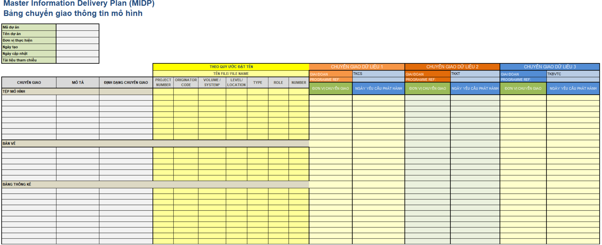