## B XÂY DNG BAN QUÅN LÝ DU' ÁN 7 ÔNG TY TRÁCH NHIÊM HÛU HAN BOT CAO TÓC SÀI GÒN – M THUÂN


## DU ÁN ĐÀU TU XÂY DUNG M RÔNG ĐUÒNG CAO TÓC THÀNH PHÓ HÒ CHÍ MINH - TRUNG LUONG - MÝ THUN THEO PHUONG THÚC DÓI TÁĆ CONG TUN U VN

XAYDUNGTHANHCONG


THÄM TRA

Theo văn bn s....0.12...../CT

BUÓC: THIÉT KÉ KYgTHUAng....nm 202....

HO SO THIÉT KE

AGum

TAP X: MÔ HNH THÔNG TIN CÔNG TYNg

TP X.1: KÉ HOCH THC HIN BIM (BEP)

HANG MUC: CÀU VÁN – KM26+055

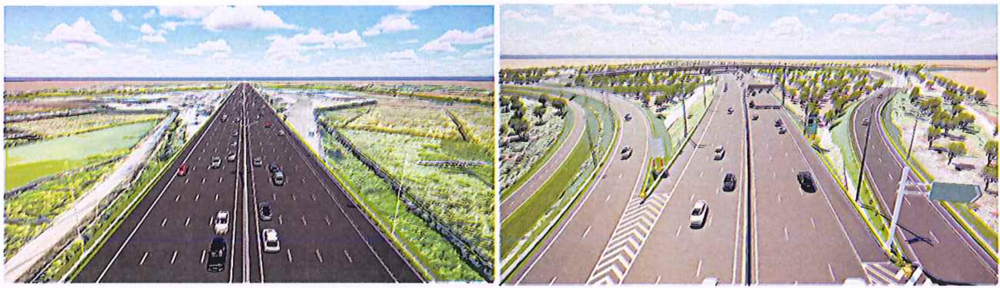

MHS: A2Z-2025-HTM-TKKT-T10.1

TP. H CHÍ MINH - THÁNG ..../2025 TU' VÁN THIÉT KÉ

CÔNG TY C PHÀN TU' VÁN XÂY DUNG A2Z

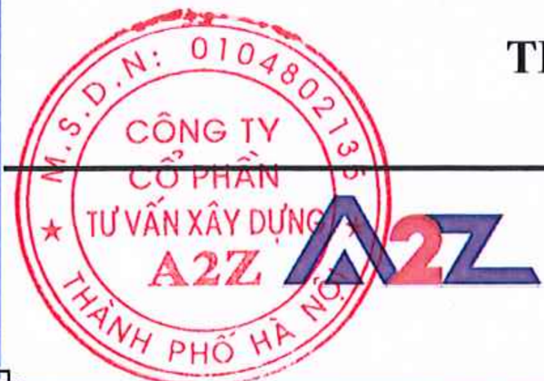

## BAN QUÅN LÝ DU ÁN 7 CÔNG TY TRÁCH NHIM HÛU HAN BOT CAO TÓC SÀI GÒN – MÝ THUÂN

------08------

## DU ÁN ĐÀU TU XÂY DUNG M RÔNG DUÒNG CAO TÓC THÀNH PHÓ HÒ CHÍ MINH - TRUNG LUONG - MÝ THUN THEO PHUONG THÚC DÓI TÁC CONG TUN TU VÃN

XAYLUNGTHANHCONG


Theo vn n só...1../T


Ngày..0...háng...1...hăm 20.2.6...

BUC: THIÉT KÉKTHUT

AGun

HÒ SO THIÉT KÉ

TÁP X: MÔ HINH THÔNG TIN CÔNG TRINH (BIM)

TÁP X.1: KÉ HOACH THUC HIN BIM (BEP)

HANG MUC: CÀU VÁN – KM26+055

DOANH NGHIP DU ÁN CÔNG TY TRÁCH NHIM HÛU HAN BOT CAO TÓC SÀI GÒN – MÝ THUÁN TÔNG GIÁM ĐÓC

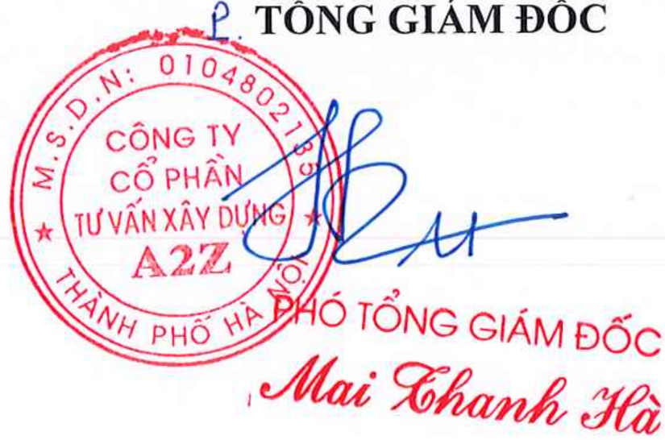

TU VÁN THIÉT KÉ CÔNG TY C PHÀN TU VÁN XÂY DUNG A2Z TÔNG GIÁM ĐÓC

CÔNG TY

COPHAN

TU VAN XÃY DUNG

★

A2Z

Mai Zhanh Hà

## DOANH NGHIÊP DU ÁN CÔNG TY TRÁCH NHIM HÛU HAN BOT CAO TÓC SÀI GÒN – MÝ THUÂN

-------8008-------

DU ÁN ĐÀU TU XÂY DUNG M RÔNG DUÒNG CAO TÓC THÀNH PHÓ Hò CHÍ MINH - TRUNG LUONG - MY THUANN THEO PHUONG THÚC DÓL TÁC CONG TUANH CÔNG

THÄM TRA Theo văn bn s..../0....../CT Ngà....háang..12...ăm 20.2.6...


BUÓC: THIÉT KÉ KYTHUAT

AGm

HÒ SO THIÉT KÉ

Nguyên Ngoc Duing

TÁP X: MÔ HINH THÔNG TIN CÔNG TRINH (BIM)

TAP X.5: KÉ HOACH THUC HIN BIM (BEP)

HANG MUC: CÀU VÁN – KM26+055

Qun lý BIM

: Hoàng Quc Tun

Điu phi BIM

: Đoàn Hunh Minh

: Nguyn Thanh Binh

Ch nhim thit k:

: Phm Vit Hùng

Qun lý cht lưng:

: Mai Thanh Hà


CÔNG TY C PHÀN TU' VÁN XÂY DUNG A2Z P.TNG GIÁM ĐÓC


## KẾ HOẠCH THỰC HIỆN BIM BIM EXECUTION PLAN (BEP)

D Ự ÁN ĐẦU TƯ XÂY DỰ NG M Ở R ỘNG ĐƯỜ NG CAO T Ố C THÀNH PH Ố H Ồ CHÍ MINH -TRUNG LƯƠNG M Ỹ THU Ậ N THEO PHƯƠNG THỨC ĐỐI TÁC CÔNG TƯ

ÁP DỤNG MÔ HÌNH THÔNG TIN CÔNG TRÌNH (BIM)

GIAI ĐOẠN: THIẾT KẾ KỸ THUẬT

HẠNG MỤC: CẦU VÁN - KM26+055


## M Ụ C L Ụ C

| CHƯƠNG 1. GI                                                                                                        | Ớ I THI Ệ U CHUNG                                                                                                      | ....................................................................... 6                              |
|---------------------------------------------------------------------------------------------------------------------|------------------------------------------------------------------------------------------------------------------------|--------------------------------------------------------------------------------------------------------|
| 1.1.                                                                                                                | T ổ ng quan .......................................................................................................... | 6                                                                                                      |
| 1.1.1.                                                                                                              | Các phiên b ả n tài li ệ u BEP c ủ a d ự án ................................................................           | 6                                                                                                      |
| 1.1.2.                                                                                                              | Danh m ụ c các t ừ ng ữ vi ế t t ắ t .............................................................................     | 7                                                                                                      |
| 1.1.3.                                                                                                              | M ộ t s ố thu ậ t ng ữ                                                                                                 | ................................................................................................ 8     |
| 1.2.                                                                                                                | Gi ớ i thi ệ u BEP                                                                                                     | ................................................................................................. 10   |
| CHƯƠNG 2. CÁC QUY ĐỊ NH ÁP D Ụ NG ...........................................................                       | CHƯƠNG 2. CÁC QUY ĐỊ NH ÁP D Ụ NG ...........................................................                          | 12                                                                                                     |
| 2.1.                                                                                                                | Căn cứ pháp lý ứ ng d ụ ng BIM.........................................................................                | 12                                                                                                     |
| 2.2.                                                                                                                | Các tiêu chu ẩ n áp d ụ ng BIM                                                                                         | ........................................................................... 12                         |
| CHƯƠNG 3. THÔNG                                                                                                     | TIN D Ự ÁN                                                                                                             | ....................................................................... 15                             |
| 3.1.                                                                                                                | Thông tin chung ...............................................................................................        | 15                                                                                                     |
| 3.2.                                                                                                                | Ti ến độ d ự án                                                                                                        | ................................................................................................... 18 |
| CHƯƠNG 4. M Ụ C                                                                                                     | TIÊU VÀ N Ộ I DUNG ÁP D Ụ NG BIM                                                                                       | ............................... 18                                                                     |
| 4.1.                                                                                                                | M ụ c tiêu áp d ụ ng BIM .....................................................................................         | 19                                                                                                     |
| 4.1.1.                                                                                                              | M ụ c tiêu chung                                                                                                       | ................................................................................................ 19    |
| 4.1.2.                                                                                                              | M ụ c tiêu c ụ th ể .................................................................................................  | 19                                                                                                     |
| 4.2.                                                                                                                | N ộ i dung áp d ụ ng BIM trong d ự án .................................................................                | 19                                                                                                     |
| CHƯƠNG 5. SƠ ĐỒ T Ổ CH Ứ C VÀ VAI TRÒ TRÁCH NHI Ệ M ....................                                            | CHƯƠNG 5. SƠ ĐỒ T Ổ CH Ứ C VÀ VAI TRÒ TRÁCH NHI Ệ M ....................                                               | 21                                                                                                     |
| 5.1.                                                                                                                | Sơ đồ t ổ ch ứ c ...................................................................................................   | 21                                                                                                     |
| 5.2.                                                                                                                | Vai trò trách nhi ệ m ..........................................................................................       | 24                                                                                                     |
| CHƯƠNG 6. PH Ạ M VI CÔNG VI Ệ C, S Ả N PH Ẩ M, K Ế HO Ạ CH CHUY                                                     | CHƯƠNG 6. PH Ạ M VI CÔNG VI Ệ C, S Ả N PH Ẩ M, K Ế HO Ạ CH CHUY                                                        | Ể N                                                                                                    |
| GIAO THÔNG TIN .................................................................................................... | GIAO THÔNG TIN ....................................................................................................    | 27                                                                                                     |
| 6.1.                                                                                                                | Ph ạ m vi công vi ệ c và s ả n ph ẩ m .......................................................................          | 27                                                                                                     |
| 6.1.1.                                                                                                              | Giai đoạ n chu ẩ n b ị ...........................................................................................     | 27                                                                                                     |
| 6.1.2.                                                                                                              | Giai đoạ n tri ể n khai áp d ụ ng BIM ...................................................................              | 27                                                                                                     |
| 6.2.                                                                                                                | Phân chia mô hình ............................................................................................         | 29                                                                                                     |
| 6.3.                                                                                                                | K ế ho ạ ch chuy ể n giao thông tin.......................................................................             | 29                                                                                                     |

N

| CHƯƠNG 7. M ỨC                                                                                                                 | ĐỘ PHÁT TRI Ể N THÔNG TIN (LOD)                                                                                                | ............................. 31   |
|--------------------------------------------------------------------------------------------------------------------------------|--------------------------------------------------------------------------------------------------------------------------------|------------------------------------|
| 7.1.                                                                                                                           | Các m ức độ phát tri ể n thông tin (LOD) ...........................................................                           | 31                                 |
| 7.2.                                                                                                                           | M ức độ phát tri ể n thông tin phi hình h ọ c (LOI) ..............................................                             | 32                                 |
| CHƯƠNG 8. QUY ĐỊ NH PH Ố I H Ợ P ...................................................................                           | CHƯƠNG 8. QUY ĐỊ NH PH Ố I H Ợ P ...................................................................                           | 33                                 |
| 8.1.                                                                                                                           | Quy trình ph ố i h ợ p ...........................................................................................             | 33                                 |
| 8.1.1.                                                                                                                         | Quy trình ph ố i h ợ p BIM gi ữ a các bên .............................................................                        | 33                                 |
| 8.2.                                                                                                                           | Môi trườ ng d ữ li ệ u chung (CDE).....................................................................                        | 34                                 |
| 8.3.                                                                                                                           | Ph ầ n m ề m và phiên b ả n s ử d ụ ng .....................................................................                   | 35                                 |
| 8.4.                                                                                                                           | Đơn vị đo lườ ng ...............................................................................................               | 37                                 |
| 8.5.                                                                                                                           | H ệ th ố ng t ọa độ và cao độ ................................................................................                 | 37                                 |
| 8.6.                                                                                                                           | Công tác kh ả o sát ph ụ c v ụ tri ể n khai mô hình BIM ........................................                               | 43                                 |
| 8.6.1.                                                                                                                         | Áp d ụ ng công ngh ệ k ỹ thu ậ t s ố vào công tác kh ả o sát, thi ế t k ế ......................                               | 43                                 |
| 8.6.2.                                                                                                                         | M ục đích công tác khả o sát, thi ế t k ế áp d ụ ng LiDAR .....................................                                | 43                                 |
| 8.6.3.                                                                                                                         | Kh ảo sát đị a hình ph ụ c v ụ mô hình thông tin công trình (BIM) b ằ ng công                                                  | ngh ệ                              |
| quét LiDAR ................................................................................................................... | quét LiDAR ................................................................................................................... | 44                                 |
| 8.6.4.                                                                                                                         | Quy trình th ự c hi ệ n kh ả o sát b ằ ng công ngh ệ LiDAR ....................................                                | 44                                 |
| 8.6.5.                                                                                                                         | S ả n ph ẩ m công ngh ệ Lidar ..............................................................................                   | 45                                 |
| 8.7.                                                                                                                           | B ả n gán màu h ệ th ố ng ......................................................................................               | 48                                 |
| 8.8.                                                                                                                           | B ả n v ẽ ..............................................................................................................       | 50                                 |
| 8.9.                                                                                                                           | Trao đổ i d ữ li ệ u ................................................................................................          | 50                                 |
| 8.9.1.                                                                                                                         | Đị nh d ạng trao đổ i d ữ li ệ u ...............................................................................               | 50                                 |
| 8.9.2.                                                                                                                         | Qu ản lý dung lượ ng file h ệ th ố ng ....................................................................                     | 51                                 |
| 8.10.                                                                                                                          | L ị ch h ọ p d ự án .................................................................................................          | 51                                 |
| 8.11.                                                                                                                          | Ki ể m tra và nghi ệ m thu mô hình .....................................................................                       | 52                                 |

## DANH M Ụ C B Ả NG BI Ể U

| Hình 5.1   | Sơ đồ t ổ ch ứ c                                             |   21 |
|------------|--------------------------------------------------------------|------|
| Hình 7.1   | Hình minh h ọ a các m ức độ phát tri ể n thông tin           |   32 |
| Hình 8.1   | Quy trình ph ố i h ợp BIM giai đoạ n thi ế t k ế k ỹ thu ậ t |   33 |
| Hình 8.2   | Hình ả nh minh h ọ a d ữ li ệ u 3DFace                       |   46 |

## DANH M Ụ C HÌNH

| B ả ng 1-1.   | Danh m ụ c các t ừ vi ế t t ắ t                                             |   7 |
|---------------|-----------------------------------------------------------------------------|-----|
| B ả ng 2-1.   | Các n ội dung quy đị nh áp d ụ ng                                           |  13 |
| B ả ng 4-1.   | M ụ c tiêu áp d ụ ng BIM cho d ự án giai đoạ n Thi ế t k ế k ỹ thu ậ t      |  19 |
| B ả ng 4-2.   | B ả ng phân tích các m ụ c tiêu và n ộ i dung áp d ụ ng BIM                 |  19 |
| B ả ng 5-1.   | B ả ng vai trò c ủa ngườ i tham gia                                         |  22 |
| B ả ng 5-2.   | Thành viên tham gia d ự án                                                  |  23 |
| B ả ng 5-3.   | B ả ng phân công trách nhi ệ m                                              |  25 |
| B ả ng 6-1.   | S ả n ph ẩ m trong công tác tri ể n khai mô hình thông tin công trình (BIM) |  28 |
| B ả ng 6-2.   | B ả ng phân chia mô hình                                                    |  29 |
| B ả ng 6-3.   | B ả ng k ế ho ạ ch chuy ể n giao thông tin t ổ ng th ể                      |  30 |
| B ả ng 8-1.   | Các n ề n t ả ng ph ầ n m ề m                                               |  36 |
| B ả ng 8-2.   | B ả ng k ế t qu ả kh ả o sát hi ệ n tr ạ ng áp d ụ ng công ngh ệ LiDAR      |  47 |
| B ả ng 8-3.   | B ả ng gán mã màu h ệ th ố ng                                               |  48 |
| B ả ng 8-4.   | Ki ể m tra mô hình                                                          |  53 |

## CÔNG TY C Ổ PH ẦN TƯ VẤ N XÂY D Ự NG A2Z


----------------o0o----------------

## D Ự ÁN ĐẦU TƯ XÂY DỰ NG M Ở R ỘNG ĐƯỜ NG CAO T Ố C THÀNH PH Ố H Ồ CHÍ MINH -TRUNG LƯƠNG M Ỹ THU Ậ N THEO PHƯƠNG THỨC ĐỐI TÁC CÔNG TƯ

ÁP D Ụ NG MÔ HÌNH THÔNG TIN CÔNG TRÌNH (BIM) BƯỚ C THI Ế T K Ế K Ỹ THU Ậ T

K Ế HO Ạ CH TH Ự C HI Ệ N BIM (BEP)

H Ạ NG M Ụ C: C

Ầ U VÁN - KM26+055

## CHƯƠNG 1. GI Ớ I THI Ệ U CHUNG

## 1.1. T ổ ng quan

Liên danh: Công ty C ổ ph ần Tư vấ n xây d ự ng A2Z Tư vấ n BIM ( sau đây gọ i t ắ t là 'Tư vấn BIM' ) căn cứ vào Yêu c ầ u v ề thông tin trao đổ i (EIR) do Công ty C ổ ph ầ n T ập đoàn Đèo Cả -đạ i di ệ n cho Ch ủ đầu tư ( sau đây gọ i t ắt là 'Chủ đầu tư' ) ban hành để xây d ự ng k ế ho ạ ch tri ể n khai BIM và các n ội dung liên quan đế n vi ệ c tri ể n khai BIM cho công trình c ủ a D ự án đầu tư xây dự ng m ở r ộng đườ ng cao t ố c Thành ph ố H ồ Chí Minh Trung Lương - M ỹ Thu ận theo phương thức đối tác công tư ( sau đây gọ i t ắ t là 'dự án' ). Vi ệ c áp d ụ ng BIM t ừ t ổ ng th ể đế n chi ti ế t c ần cân đố i gi ữ a ngu ồ n l ự c và ti ế n độ yêu c ầ u, k ế ho ạ ch và kh ả năng đáp ứ ng.

## 1.1.1. Các phiên b ả n tài li ệ u BEP c ủ a d ự án

|   STT | Ngày      | Phiên b ả n   | Đơn vị phát hành                         | Mô t ả          |
|-------|-----------|---------------|------------------------------------------|-----------------|
|     1 | …/…/202 5 | Rev. 0        | Công ty C ổ ph ần Tư vấ n xây d ự ng A2Z | Phát hành m ớ i |


## C Ộ NG HÒA XÃ H Ộ I CH Ủ NGHĨA VIỆ T NAM Độ c L ậ p -T ự Do -H ạ nh Phúc

----------------o0o----------------

Tp.H ồ Chí Minh, ngày ... tháng ... năm 202 5

BEP

|   2 |
|-----|
|   3 |

## 1.1.2. Danh m ụ c các t ừ ng ữ vi ế t t ắ t

Tư vấ n BIM ch ấ p thu ậ n và th ố ng nh ấ t s ử d ụ ng các thu ậ t ng ữ và t ừ vi ế t t ắt đã đượ c nêu ra trong EIR, bao g ồ m:

Bảng 1 -1. Danh m ụ c các t ừ vi ế t t ắ t

| Từ viết tắt   | Tên tiếng Anh                     | Tên tiếng Việt                                                                                                                               |
|---------------|-----------------------------------|----------------------------------------------------------------------------------------------------------------------------------------------|
| 2D            | Two-dimensional                   | Thông tin 2 chiều                                                                                                                            |
| 3D            | Three-dimensional                 | Thông tin 3 chiều                                                                                                                            |
| 4D            | 3D adding Time sequencing         | Thông tin 3 chiều yếu tố trình tự thời gian                                                                                                  |
| 5D            | 3D adding plus production cost    | Thông tin 3 chiều thêm chi phí sản xuất                                                                                                      |
| BC            | BIM Coordinator                   | Điều phối BIM                                                                                                                                |
| Pre-BEP       | Pre-Appointment BEP               | Kế hoạch thực hiện BIM sơ bộ                                                                                                                 |
| BEP           | BIM Execution Plan                | Kế hoạch thực hiện BIM là tài liệu giải thích cách các khía cạnh mô hình thông tin của dự án sẽ được thực hiện trong suốt vòng đời của dự án |
| BIM           | Building Information Modelling    | Mô hình hóa thông tin công trình                                                                                                             |
| CDE           | Common Data Environment           | Môi trường dữ liệu chung                                                                                                                     |
| EIR           | Exchange Information Requirements | Yêu cầu thông tin trao đổi                                                                                                                   |
| EM            | Employer                          | Chủ đầu tư                                                                                                                                   |
| GIS           | Geographic Information System     | Hệ thống thông tin địa lý                                                                                                                    |
| *.IFC         | Industry Foundation Class         | Định dạng mở trao đổi thông tin giữa các phần mềm                                                                                            |
| LOI           | Level of Information Need         | Mức độ thông tin chi tiết                                                                                                                    |


| Từ viết tắt   | Tên tiếng Anh                                      | Tên tiếng Việt                                 |
|---------------|----------------------------------------------------|------------------------------------------------|
| LOD           | Level of Development                               | Mức độ phát triển (về mặt hình học )           |
| TIDP          | Task Information Delivery Plan                     | Kế hoạch chuyển giao thông tin công tác        |
| MIDP          | Master Information Delivery Plan                   | Kế hoạch c huyển giao thông tin t ổng thể      |
| PIMS          | Project Information Management System              | Hệ thống quản lý thông tin dự án               |
| PIP           | Project Implementation Plan                        | K ế hoạch triển khai dự án                     |
| QA/QC         | Quality Assurance, Quality Control                 | Kiểm định/ kiểm soát chất lượng                |
| RFI           | Request for Information                            | Yêu cầu thông tin                              |
| AIR           | Asset Information Requirements                     | Yêu cầu thông tin tài sản                      |
| OIR           | Organizational Information Requirements            | Yêu cầu thông tin tổ chức                      |
| AIM           | Asset Information Model                            | Mô hình thông tin tài sản                      |
| PIM           | Project information model                          | Mô hình thông tin dự án                        |
| Omniclass     | The OmniClass ™ Construction Classification System | H ệ thống phân loại xây dựng của Mỹ            |
| Uniclass      | Hệ thống phân loại xây dựng của Vương quốc Anh     | Hệ thống phân loại xây dựng của Vương quốc Anh |

## 1.1.3. M ộ t s ố thu ậ t ng ữ

Tư vấ n BIM ch ấ p thu ậ n và th ố ng nh ấ t s ử d ụng cơ bả n các thu ậ t ng ữ và t ừ vi ế t t ắ t đã đượ c nêu ra trong EIR. C ụ th ể :


| Thuật ngữ   | Ý nghĩa                                                                                                                                                                                                                                                                                                                                                                                                                                                                                  |
|-------------|------------------------------------------------------------------------------------------------------------------------------------------------------------------------------------------------------------------------------------------------------------------------------------------------------------------------------------------------------------------------------------------------------------------------------------------------------------------------------------------|
| OIR         | Yêu c ầ u thông tin t ổ ch ứ c (OIR) là tài li ệu xác đị nh d ữ li ệ u và thông tin c ầ n thi ết để m ộ t t ổ ch ức đáp ứ ng các yêu c ầ u và m ụ c tiêu c ủ a t ổ ch ứ c ch ỉ đị nh. Vi ệc xác đị nh OIR s ẽ yêu c ầu đầ u vào t ừ các b ộ ph ậ n khác nhau trong t ổ ch ức. Đặ c bi ệ t c ầ n có thông tin đầ u vào t ừ nh ững ngườ i tham gia vào quá trình ra quy ết đị nh chi ến lược liên quan đế n danh m ụ c tài s ả n và h ệ th ố ng tài s ả n.                                 |
| AIR         | Yêu cầu thông tin liên quan đến tài sản (AIR) liên quan đến việc thiết lập và phân loại các yêu cầu thông tin để đáp ứng nhu cầu của hệ thống quản lý tài sản                                                                                                                                                                                                                                                                                                                            |
| PIM         | Mô hình thông tin dự án (PIM) được phát triển trong giai đoạn thiết kế và xây dựng của một dự án để đáp ứng các yêu cầu đặt ra trong Yêu cầu thông tin trao đổi (EIR). PIM thường sẽ bao gồm một mô hình thông tin cầu đường được liên kết với một loạt các tài liệu và dữ liệu phi đồ họa.                                                                                                                                                                                              |
| AIM         | Mô hình thông tin tài sản (AIM) là một thuật ngữ được sử dụng để mô tả tập hợp thông tin được thu thập từ tất cả các nguồn nhằm hỗ trợ việc quản lý tài sản. AIM đóng vai trò là nguồn thông tin duy nhất đã được xác thực và phê duyệt liên quan đến tài sản được xây dựng và được sử dụng trong giai đoạn vận hành của một dự án                                                                                                                                                       |
| BEP         | K ế ho ạ ch th ự c hi ện BIM (BEP) đượ c l ậ p b ở i Tư vấ n BIM để làm rõ vi ệc đáp ứ ng yêu c ầu thông tin trao đổ i c ủ a Ch ủ đầu tư (EIR). K ế ho ạ ch th ự c hi ệ n BIM làm rõ vai trò và trách nhi ệ m, tiêu chu ẩ n đượ c áp d ụ ng và các quy trình theo sau. K ế ho ạ ch th ự c hi ệ n BIM (BEP) s ẽ đượ c Tư vấ n BIM phát tri ển trong hai giai đoạ n, ti ề n h ợp đồ ng (Pre- BEP giai đoạn đấ u th ầu) và giai đoạ n sau h ợ p đồng (BEP giai đoạ n sau khi trúng th ầ u). |


| Thuật ngữ   | Ý nghĩa                                                                                                                                                                                                                                                                                                                                                                                                                                                                                         |
|-------------|-------------------------------------------------------------------------------------------------------------------------------------------------------------------------------------------------------------------------------------------------------------------------------------------------------------------------------------------------------------------------------------------------------------------------------------------------------------------------------------------------|
| TIDP        | K ế ho ạ ch chuy ể n giao thông tin nhi ệ m v ụ (TIDP) là danh sách các s ả n ph ẩ m c ầ n chuy ển giao đượ c phân tách thành các nhi ệ m v ụ riêng l ẻ . K ế ho ạ ch chuy ể n giao thông tin nhi ệ m v ụ (TIDP) đượ c các B ộ ph ậ n th ự c hi ệ n BIM l ậ p d ựa theo điề u ki ện và năng l ự c c ủ a b ộ ph ận đó. TIDP cung cấ p thông tin v ề trách nhi ệ m chuy ể n giao các s ả n ph ẩm để các thành viên th ự c hi ện, đồ ng th ờ i cung c ấ p thông tin v ề trình t ự để hoàn thi ệ n. |
| MIDP        | K ế ho ạ ch chuy ể n giao thông tin t ổ ng th ể (MIDP) là k ế ho ạ ch chính đượ c s ử d ụng để qu ả n lý vi ệ c chuy ể n giao thông tin trong su ố t quá trình th ự c hi ệ n.                                                                                                                                                                                                                                                                                                                   |
| EIR         | Yêu cầu thông tin trao đổi (EIR) được thiết lập như một góc nhìn tổng quan từ phía Chủ đầu tư. Các đơn vị thực hiện BIM liên quan sẽ sử dụng những yếu tố tổng quan ấy để thực hiện kế hoạch chi tiết đến hoàn thiện .                                                                                                                                                                                                                                                                          |

## 1.2. Gi ớ i thi ệ u BEP

K ế ho ạ ch th ự c hi ệ n BIM (BEP) cung c ấ p khung n ộ i dung cho ph é p Ch ủ đầu tư, Ki ế n tr úc sư, Kỹ sư và Nh à th ầ u thi công x ác đị nh ti ế n tr ì nh xây d ự ng Mô h ì nh thông tin công tr ì nh (BIM) v à viêc ứ ng d ụ ng tri ể n khai v à o d ự án nhanh hơn và hi ệ u qu ả hơn. K ế ho ạ ch n ày đề xu ấ t vai tr ò v à tr á ch nhi ệ m c ủ a c á c bên tham gia, chi ti ế t v à l ĩ nh v ự c thông tin đượ c chia s ẻ , c á c ti ế n tr ì nh v à c á c ph ầ n m ề m h ỗ tr ợ .

K ế ho ạ ch th ự c hi ệ n BIM (BEP) s ẽ được điề u ch ỉ nh trong t ừng giai đoạ n th ự c hi ệ n d ự án cho phù h ợ p th ự c t ế (n ế u có).

Tài li ệ u này mô t ả m ộ t cách v ắ n t ắ t, th ể hi ệ n cách th ứ c xây d ự ng, chuy ể n giao và ứ ng d ụ ng mô hình thông tin công trình (BIM) ở bướ c Thi ế t k ế k ỹ thu ậ t theo yêu c ầ u thông tin (EIR) c ủ a Ch ủ đầu tư :


- -Các công c ụ ph ầ n m ềm đượ c s ử d ụng để t ạ o l ập mô hình, …
- -Các ph ạ m vi chia tách mô hình thành ph ầ n;
- -Phương pháp tạ o l ậ p mô hình;
- -Cách th ứ c chuy ể n giao mô hình (m ố c chuy ể n giao, cá nhân, t ậ p th ể ch ị u trách nhi ệ m th ự c hi ệ n bàn giao và nh ậ n bàn giao mô hình)...

Văn bả n này th ố ng nh ấ t m ộ t s ố n ộ i dung nh ằ m h ỗ tr ợ quá trình ph ố i h ợ p và t ạ o l ậ p thông tin cũng như phả n h ồ i các yêu c ầ u b ổ sung thông tin đố i v ớ i Tư vấ n BIM đã nêu ra trong EIR mà Ch ủ đầu tư đã đưa ra.


## CHƯƠNG 2. CÁC QUY ĐỊ NH ÁP D Ụ NG

## 2.1. Căn cứ pháp lý ứ ng d ụ ng BIM

- -Quy ết  đị nh s ố 2500/QĐ -TTg ngày 22/12/2016 c ủ a Th ủ tướ ng Chính ph ủ Phê duy ệt Đề án áp d ụ ng mô hình thông tin công trình (BIM) trong ho ạt độ ng xây d ự ng và qu ả n lý v ậ n hành công trình;
- -Quy ết đị nh s ố 749/QĐ -TTg ngày 03 tháng 6 năm 2020 phê duyệt 'Chương trình chuy ển đổ i s ố qu ốc gia đến năm 2025, định hướng đến năm 2030;
- -Quy ết đị nh s ố 347/QĐ -BXD ngày 02 tháng 4 năm 2021 củ a B ộ Xây D ự ng v ề vi ệc 'Công bố Hướ ng d ẫ n chi ti ế t áp d ụ ng Mô hình thông tin công trình (BIM) đố i v ớ i công trình dân d ụ ng và công trình h ạ t ầ ng k ỹ thu ật đô thị';
- -Quy ết đị nh s ố 348/QĐ -BXD ngày 02 tháng 4 năm 2021 củ a B ộ Xây D ự ng v ề vi ệc 'Công bố Hướ ng d ẫ n chung áp d ụng Mô hình thông tin công trình (BIM)'.
- -Quy ết đị nh s ố 258/QĐ -TTg ngày 17 tháng 3 năm 2023 củ a Th ủ tướ ng Chính ph ủ v ề vi ệ c Phê duy ệ t l ộ trình áp d ụ ng Mô hình thông tin công trình (BIM) trong ho ạ t độ ng xây d ự ng.
- -Thông tư số 12/2021/TTBXD ngày 31 tháng 8 năm 2021 củ a B ộ Xây d ự ng ban hành đị nh m ứ c xây d ự ng;
- -Thông tư số 09/2024/TTBXD ngày 30 tháng 8 năm 2024 củ a B ộ Xây d ự ng ban hành s ửa  đổ i,  b ổ sung  m ộ t  s ố đị nh m ứ c  xây  d ự ng  ban  hành  t ại  Thông  tư  số 12/2021/TT-BXD;
- -Ngh ị đị nh s ố 175/2024/NĐ -CP ngày 30 tháng 12 năm 2024 củ a Chính ph ủ Quy đị nh chi ti ế t m ộ t s ố điề u và bi ệ n pháp thi hành Lu ậ t Xây d ự ng v ề qu ả n lý ho ạ t độ ng xây d ự ng;

## 2.2. Các tiêu chu ẩ n áp d ụ ng BIM

T ấ t c ả thông tin c ủ a d ự án s ẽ đượ c t ạ o l ậ p, chia s ẻ và qu ả n lý tham kh ả o các tiêu chu ẩn và hướ ng d ẫ n sau:


Bảng 2 -1. Các n ội  dung quy đị nh áp d ụ ng

| B = B ắ t bu ộ c              | B = B ắ t bu ộ c                                                                                                                                                                                                                                 | Áp d ụ ng    | Áp d ụ ng    | Áp d ụ ng          | Áp d ụ ng   | Áp d ụ ng   | Áp d ụ ng   | Áp d ụ ng   | Áp d ụ ng   |
|-------------------------------|--------------------------------------------------------------------------------------------------------------------------------------------------------------------------------------------------------------------------------------------------|--------------|--------------|--------------------|-------------|-------------|-------------|-------------|-------------|
| Các tiêu chu ẩn, hướ ng d ẫ n | Các tiêu chu ẩn, hướ ng d ẫ n                                                                                                                                                                                                                    | Hướ ng d ẫ n | Ph ố i h ợ p | Đặ t tên t ệ p tin | B ả n v ẽ   | LOD         | CDE         | Chi phí     | H ợp đồ ng  |
|                               | Quy ết đị nh s ố 347/QĐ -BXD ngày 02 tháng 4 năm 2021 củ a B ộ Xây d ự ng v ề vi ệ c Công b ố Hướ ng d ẫ n chi ti ế t áp d ụ ng Mô hình thông tin công trình (BIM) đố i v ớ i công trình dân d ụ ng và công trình h ạ t ầ ng k ỹ thu ật đô thị . | B            | T            | T                  | T           | B           | B           |             | T           |
|                               | Quy ết đị nh s ố 348/QĐ -BXD ngày 02 tháng 4 năm 2021 củ a B ộ Xây d ự ng v ề vi ệ c Công b ố Hướ ng d ẫ n chung áp d ụ ng Mô hình thông tin công trình (BIM).                                                                                   | B            | T            | T                  | T           | B           | B           |             | T           |
|                               | Quy ết đị nh s ố 258/QĐ -TTg ngày 17 tháng 3 năm 2023 củ a Th ủ tướ ng Chính ph ủ v ề vi ệ c Phê duy ệ t l ộ trình áp d ụ ng Mô hình thông tin công trình (BIM) trong ho ạt độ ng xây d ự ng                                                     | T            | T            |                    |             |             |             |             |             |
|                               | Thông tư số 09/2024/TT-BXD ngày 30 tháng 8 năm 2024 củ a B ộ Xây d ự ng ban hành s ửa đổ i, b ổ sung m ộ t s ố đị nh m ứ c xây d ự ng ban hành t ạ i Thông tư số 12/2021/TT-BXD                                                                  |              |              |                    |             |             |             | B           |             |
|                               | TCVN 14177-1:2024: T ổ ch ứ c và s ố hóa thông tin v ề công trình xây d ự ng,                                                                                                                                                                    | T            |              |                    |             |             |             |             |             |


| B = B ắ t bu ộ c                                                                                                                                                                                     | B = B ắ t bu ộ c   |              |                    |           |           |           |            |
|------------------------------------------------------------------------------------------------------------------------------------------------------------------------------------------------------|--------------------|--------------|--------------------|-----------|-----------|-----------|------------|
| T= Tham Kh ả o                                                                                                                                                                                       | T= Tham Kh ả o     | Áp d ụ ng    | Áp d ụ ng          | Áp d ụ ng | Áp d ụ ng | Áp d ụ ng | Áp d ụ ng  |
| Các tiêu chu ẩn, hướ ng d ẫ n                                                                                                                                                                        | Hướ ng d ẫ n       | Ph ố i h ợ p | Đặ t tên t ệ p tin | LOD       | CDE       | Chi phí   | H ợp đồ ng |
| bao g ồ m mô hình hóa thông tin công trình (BIM) - Qu ả n lý thông tin s ử d ụ ng mô hình hóa thông tin công trình Ph ầ n 1: Khái ni ệ m và nguyên t ắ c Ph ần 2: Giai đoạ n chuy ể n giao tài s ả n |                    |              |                    |           |           |           |            |


## CHƯƠNG 3. THÔNG TIN D Ự ÁN

## 3.1. Thông tin chung

Thông tin chung c ủ a d ự án đượ c trích d ẫ n t ừ n ộ i dung trong Yêu c ầ u v ề thông tin trao đổ i (EIR), th ể hi ệ n theo b ả ng sau:

| Tên dự án             | Dự án đầu tư xây dựng mở rộng đường cao tốc Thành phố Hồ Chí Minh - Trung Lương - Mỹ Thuận theo phương thức đối tác công tư                                                                                                                                                                                                                                                                                                                                                                                                                                                                             |
|-----------------------|---------------------------------------------------------------------------------------------------------------------------------------------------------------------------------------------------------------------------------------------------------------------------------------------------------------------------------------------------------------------------------------------------------------------------------------------------------------------------------------------------------------------------------------------------------------------------------------------------------|
| Cơ quan có thẩm quyền | Bộ Xây dựng Ban Quản lý dự án 7                                                                                                                                                                                                                                                                                                                                                                                                                                                                                                                                                                         |
| Nhà đầu tư            | Liên danh Công ty Cổ phần tập đoàn Đèo Cả, Công ty Cổ phần đầu tư hạ tầng kỹ thuật Thành phố Hồ Chí Minh, Công ty Cổ phần Tasco, Tổng công ty đầu tư xây dựng Hoàng Long - CTCP, Công ty TNHH MTV Dịch vụ và Đầu tư CII                                                                                                                                                                                                                                                                                                                                                                                 |
| Địa chỉ liên hệ       | Số 32 đường Thạch Thị Thanh, phường Tân Định, quận 1, TP. Hồ Chí Minh                                                                                                                                                                                                                                                                                                                                                                                                                                                                                                                                   |
| Nhóm dự án            | Dự án nhóm A                                                                                                                                                                                                                                                                                                                                                                                                                                                                                                                                                                                            |
| Loại, cấp công trình  | Công trình giao thông, cấp đặc biệt                                                                                                                                                                                                                                                                                                                                                                                                                                                                                                                                                                     |
| Tóm tắt dự án         | 1. Phạm vi, quy mô, địa điểm thực hiện dự án 1.1. Phạm vi đầu tư: đầu tư mở rộng tuyến cao tốc Thành phố Hồ Chí Minh - Trung Lương - Mỹ Thuận cụ thể như sau: - Điểm đầu: Km9+325 tại nút giao Chợ Đệm, thuộc địa phận xã Tân Nhựt, Thành phố Hồ Chí Minh . - Điểm cuối: Km105+454 tại đầu cầu phía Bắc cầu Mỹ Thuận 2, thuộc địa phận xã An Hữu, tỉnh Đồng Tháp . - Tổng chiều dài khoảng 96,13 km . 1.2. Địa điểm thực hiện dự án : Thành phố Hồ Chí Minh, tỉnh Tây Ninh và tỉnh Đồng Tháp. 1.3. Quy mô đầu tư: 1.3.1. Đường cao tốc a. Cấp đường: - Đoạn Thành phố Hồ Chí Minh - Trung Lương: quy mô |


| giai đoạn hoàn chỉnh theo quy hoạch 10 - 12 làn xe (đoạn từ Chợ Đệm - Vành đai 4 quy mô 12 làn xe, đoạn từ Vành đai 4 - Trung Lương quy mô 10 làn xe), vận tốc thiết kế Vₜₖ=120km/h. Phân kỳ đầu tư quy mô 08 làn xe, vận tốc thiết kế Vₜₖ=120km/h theo Quy chuẩn kỹ thuật quốc gia về đường bộ cao tốc QCVN 117:2024/BGTVT, Tiêu chuẩn đường cao tốc TCVN 5729:2012 và TCVN 5729:1997. - Đoạn Trung Lương - Mỹ Thuận và đoạn từ nút giao An Thái Trung đến đầu cầu phía Bắc cầu Mỹ Thuận 2: đầu tư hoàn chỉnh quy mô 6 làn xe theo quy hoạch được duyệt, vận tốc thiết kế Vₜₖ=100 km/h theo Quy chuẩn kỹ thuật quốc gia về đường bộ cao tốc QCVN 117:2024/BGTVT, Tiêu chuẩn đường cao tốc TCVN 5729:2012. b. Mặt cắt ngang : - Đoạn Thành phố Hồ Chí Minh - Trung Lương: + Đoạn Chợ Đệm - Vành đai 4: mặt cắt ngang giai đoạn hoàn chỉnh với bề rộng nền đường Bnền = 56m. Mặt cắt ngang phân kỳ đầu tư giai đoạn 1 với bề rộng nền đường Bnền = 41m. + Đoạn Vành đai 4 - Trung Lương: mặt cắt ngang giai đoạn hoàn chỉnh với bề rộng nền đường Bnền = 48,5m. Mặt cắt ngang phân kỳ đầu tư giai đoạn 1 với bề rộng nền đường Bnền = 41m. - Đoạn Trung Lương - Mỹ Thuận và đoạn từ nút giao An Thái Trung đến đầu cầu phía Bắc cầu Mỹ Thuận 2: mặt cắt ngang hoàn chỉnh với bề rộng nền đường Bnền = 32,25m. c) Mặt đường: cấp cao A1 d) Công trình cầu - Công trình cầu thiết kế bằng bê tông cốt thép và bê tông cốt thép dự ứng lực theo các tiêu chuẩn TCVN 11823 - 1:2017 đến TCVN 11823 - 14:2017 'Thiết kế cầu đường bộ'.   |
|------------------------------------------------------------------------------------------------------------------------------------------------------------------------------------------------------------------------------------------------------------------------------------------------------------------------------------------------------------------------------------------------------------------------------------------------------------------------------------------------------------------------------------------------------------------------------------------------------------------------------------------------------------------------------------------------------------------------------------------------------------------------------------------------------------------------------------------------------------------------------------------------------------------------------------------------------------------------------------------------------------------------------------------------------------------------------------------------------------------------------------------------------------------------------------------------------------------------------------------------------------------------------------------------------------------------------------------------------------------------------------------------------------------------------------------------------------------------------------------------------------------------------------|


ÁP D Ụ NG MÔ HÌNH THÔNG TIN CÔNG TRÌNH (BIM) -GIAI ĐOẠ N THI Ế T K Ế K Ỹ THU Ậ

| - Tải trọng thiết kế A2Z93. đ)Nút giao: xây dựng các nút giao liên thông và trực thông bảo đảm khai thác an toàn, kết nối thuận lợi. e) Tần suất thiết kế: đảm bảo tần suất P = 1%. 1.3.2. Đường gom, đường ngang, hoàn trả đường dân sinh - Cấp đường: phù hợp với đường hiện hữu, tối thiểu bảo đảm quy mô đường cấp V đồng bằng (đối với đoạn Thành phố Hồ Chí Minh - Trung Lương) và đường giao thông nông thôn cấp B (đối với đoạn Trung Lương - Mỹ Thuận và đoạn từ nút giao An Thái Trung đến đầu cầu phía Bắc cầu Mỹ Thuận 2). - Tần suất thiết kế: theo quy định của cấp đường; đối với đường hoàn trả, bảo đảm phù hợp với hiện trạng đường đang khai thác. - Mặt đường: bê tông nhựa, láng nhựa hoặc bê tông xi măng. 1.3.3. Công trình phục vụ khai thác - Hệ thống quản lý giao thông thông minh: xây dựng mới, tận dụng và nâng cấp hệ thống quản lý giao thông thông minh, hệ thống thu phí điện tử không dừng, công trình kiểm soát tải trọng xe bảo đảm kiểm soát và điều khiển giao thông phù hợp với quy mô đầu tư tuyến đường, đáp ứng yêu cầu vận hành, khai thác đường cao tốc, bảo đảm kết nối đồng bộ, thống nhất với các tuyến lân cận. - Trạm dừng nghỉ: tại Km28+200 (đoạn Thành phố Hồ Chí Minh - Trung Lương và tại Km78+220 (đoạn Trung Lương - Mỹ Thuận). 2. T hời gian thực hiện dự án : t ừ năm 2025, hoàn thành đưa vào khai thác năm 2028. 3. Diện tích mặt đất, mặt nước sử dụng; nhu cầu sử dụng tài nguyên khác: tổng diện tích chiếm dụng đất khoảng 1.070,21 ha; trong đó: 949,71 ha đã giải 10 phóng mặt bằng trong giai đoạn trước đây và 120,5 ha cần giải phóng mặt bằng bổ sung (Thành phố Hồ C hí Minh khoảng 6,37 ha; tỉnh Tây Ninh khoảng 60,84 ha và tỉnh Đồng Tháp khoảng 53,29 ha).   |
|------------------------------------------------------------------------------------------------------------------------------------------------------------------------------------------------------------------------------------------------------------------------------------------------------------------------------------------------------------------------------------------------------------------------------------------------------------------------------------------------------------------------------------------------------------------------------------------------------------------------------------------------------------------------------------------------------------------------------------------------------------------------------------------------------------------------------------------------------------------------------------------------------------------------------------------------------------------------------------------------------------------------------------------------------------------------------------------------------------------------------------------------------------------------------------------------------------------------------------------------------------------------------------------------------------------------------------------------------------------------------------------------------------------------------------------------------------------------------------------------------------------------------------------------------------------------------------------------------------------------------------------------------------------------------------------------------------------------------------------|


| 4. Loại hợp đồng dự án PPP: Hợp đồng Xây dựng - Kinh doanh - Chuyển giao (BOT). 5. Tổng mức đầu tư: 36.172,41 tỷ đồng.   |
|--------------------------------------------------------------------------------------------------------------------------|

## 3.2. Ti ến độ d ự án

Bảng 3 -1. B ả ng ti ến độ d ự ki ế n

| Giai đoạn                                              | Thời gian         |
|--------------------------------------------------------|-------------------|
| Thẩm định, phê duyệt chủ trương đầu tư                 | Tháng 6/2025      |
| T hẩm định báo cáo nghiên cứu khả thi, phê duyệt dự án | Tháng 10 &11/2025 |
| Chỉ định nhà đầu tư                                    | Tháng 11 &12/2025 |
| Khởi công dự án                                        | 19/12/2025        |
| Triển khai thực hiện dự án                             | Năm 2025 - 2028   |


## CHƯƠNG 4. M Ụ C TIÊU VÀ N Ộ I DUNG ÁP D Ụ NG BIM

## 4.1. M ụ c tiêu áp d ụ ng BIM

## 4.1.1. M ụ c tiêu chung

Đây là dự án có quy mô l ớ n, tính ch ấ t ph ứ c t ạ p nên vi ệ c áp d ụ ng BIM vào D ự án đầu tư xây dự ng m ở r ộng đườ ng cao t ố c Thành ph ố H ồ Chí Minh Trung Lương - M ỹ Thu ận theo phương thức đối tác công tư trong giai đoạ n Thi ế t k ế k ỹ thu ậ t nh ằ m m ụ c tiêu t ối ưu hóa thiế t k ế , h ạ n ch ế sai sót.

## 4.1.2. M ụ c tiêu c ụ th ể

Bảng 4 -1. M ụ c tiêu áp d ụ ng BIM cho d ự án giai đoạ n Thi ế t k ế k ỹ thu ậ t

|   STT | Mục tiêu                                                                                     |
|-------|----------------------------------------------------------------------------------------------|
|     1 | - Nâng cao chất lượng thiết kế công trình, bao gồm: cấu tạo, biện pháp thi công, khối lượng. |
|     2 | - Cung cấp thông tin về thiết kế để sử dụng cho các giai đoạn tiếp theo của Dự án            |
|     3 | - Cung cấp thông tin cho các bên liên quan của Dự án thông qua CDE do CĐT cung cấp.          |

## 4.2. N ộ i dung áp d ụ ng BIM trong d ự án

D ựa trên cơ sở n ộ i dung áp d ụng BIM đã được đề c ậ p trong tài li ệ u EIR mà Ch ủ đầu tư đã đưa ra, Tư vấ n BIM th ố ng nh ấ t các n ộ i dung s ẽ áp d ụ ng BIM trong d ự án, c ụ th ể các n ộ i dung áp d ụ ng chi ti ết như sau:

Bảng 4 -2. B ả ng phân tích các m ụ c tiêu và n ộ i dung áp d ụ ng BIM

|   STT | Nội dung áp dụng                              | Yêu cầu                                                                                                                                                 |
|-------|-----------------------------------------------|---------------------------------------------------------------------------------------------------------------------------------------------------------|
|     1 | Xây dựng mô hình địa hình từ dữ liệu khảo sát | Mô hình địa hình hiện trạng được xây dựng từ Point Clouds. Bề mặt tự nhiên trong phạm vi dự án được mô hình hóa dạng bề mặt 3D (3D surface) với LOD 300 |


|   STT | Nội dung áp dụng                         | Yêu cầu                                                                                                                                                                                       |
|-------|------------------------------------------|-----------------------------------------------------------------------------------------------------------------------------------------------------------------------------------------------|
|     2 | Xây dựng BIM cho hồ sơ thiết kế kỹ thuật | Toàn bộ các hạng mục công trình của dự án được xây dựng BIM 3D với LOD 300 là ít nhất và LOI tương ứng của từng hạng mục tối thiểu như sau: thông tin cơ bả n v ề m ặ t c ấ u t ạ o, v ị trí… |


## CHƯƠNG 5. SƠ ĐỒ T Ổ CH Ứ C VÀ VAI TRÒ TRÁCH NHI Ệ M

## 5.1. Sơ đồ t ổ ch ứ c

Để th ự c hi ệ n t ố t các h ạ ng m ụ c công vi ệc đề ra, h ệ th ố ng nhân s ự tham gia d ự án đượ c t ổ ch ứ c thành các t ổ , nhóm trong m ộ t t ổ ng th ể chung. M ỗ i t ổ , nhóm có m ộ t nhi ệ m v ụ riêng có quan h ệ v ớ i nhau theo m ột sơ đồ t ổ ch ứ c khoa h ọc để đả m b ả o s ự ho ạt độ ng hi ệ u qu ả nh ấ t.

Toàn b ộ ho ạt độ ng c ủ a d ự án tuân th ủ theo quy trình, quy đị nh c ủ a B ộ nh ằm đả m b ả o th ự c hi ện đúng nhiệ m v ụ tri ể n khai xây d ự ng mô hình BIM và tho ả mãn các yêu c ầu đã cam kế t v ớ i khách hàng.

Ch ị u trách nhi ệ m chính v ề gi ả i pháp k ỹ thu ậ t là chuyên gia qu ản lý BIM. Để d ự án ho ạt độ ng có hi ệ u qu ả , s ả n ph ẩ m d ị ch v ụ tư vấ n có ch ất lượ ng cao, các h ạ ng m ụ c k ỹ thu ật chính đề u do chuyên gia qu ả n lý BIM các h ạ ng m ụ c ph ụ trách.

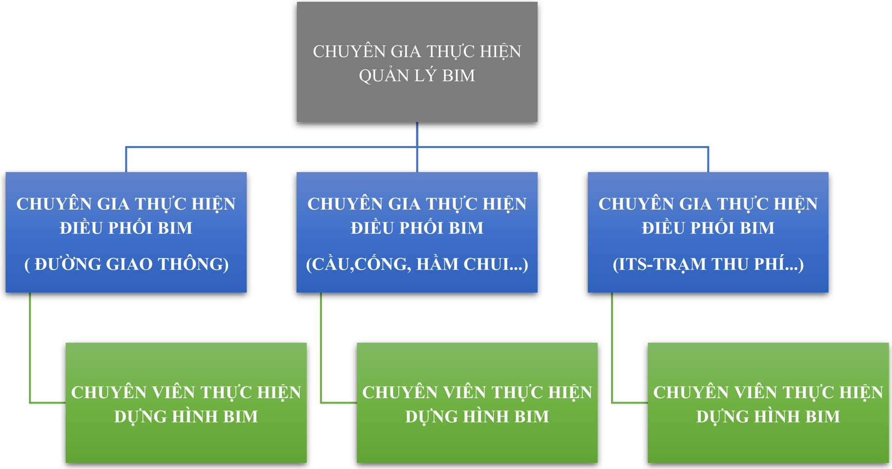

Hình 5.1 Sơ đồ t ổ ch ứ c


Bảng 5 -1. B ả ng vai trò c ủa ngườ i tham gia

| Ch ủ th ể                                | Thu ậ t ng ữ BIM   | Vai trò                                                                                                                                                                                                                                                                                                                                                                                                                                                                                                                                                                                                                                                                                    |
|------------------------------------------|--------------------|--------------------------------------------------------------------------------------------------------------------------------------------------------------------------------------------------------------------------------------------------------------------------------------------------------------------------------------------------------------------------------------------------------------------------------------------------------------------------------------------------------------------------------------------------------------------------------------------------------------------------------------------------------------------------------------------|
| Chuyên gia th ự c hi ệ n qu ả n lý BIM   | BIM Manager        | - Ch ỉ đạ o vi ệ c xây d ự ng k ế ho ạ ch; - Qu ả n lý nhóm tri ể n khai BIM; - Tìm hi ể u công ngh ệ m ớ i; - Xác nh ậ n tiêu chu ẩ n BIM d ự án cho đội ngũ thiế t k ế trong d ự án; - T ổ ch ứ c xây d ự ng K ế ho ạ ch th ự c hi ệ n BIM cho d ự án. - Xác nh ậ n nh ữ ng n ộ i dung thông tin chung cho nhóm thi ế t k ế ; - Ph ố i h ợ p v ới người đượ c giao qu ản lý CDE để đả m b ả o nh ữ ng yêu c ầu đượ c th ự c hi ện trong môi trườ ng BIM cho giai đoạ n qu ả n lý v ậ n hành; - Thi ế t l ậ p quy tr ình trao đổ i d ữ li ệ u cho toàn d ự án trong t ấ t c ả các giai đoạ n; - Đả m b ả o mô h ì nh liên k ết đa bộ môn đạ t yêu c ầ u.                                  |
| Chuyên gia th ự c hi ện điề u ph ố i BIM | BIM Coordinator    | - Tham gia xây d ự ng và tri ể n khai K ế ho ạ ch th ự c hi ệ n BIM cho d ự án; - C ậ p nh ậ t K ế ho ạ ch th ự c hi ệ n BIM cho d ự án trong quá tr ì nh tri ể n khai; - Ch ỉ đạ o l ậ p k ế ho ạ ch, thi ế t l ậ p và duy tr ì các file d ữ li ệ u; - Đả m b ả o các bên có liên quan th ố ng nh ấ t v ề K ế ho ạ ch th ự c hi ệ n BIM cho d ự án; - Xác đị nh và t ạo điề u ki ệ n cho vi ệ c tri ển khai đào tạ o nhân s ự phù h ợ p v ớ i chi ến lượ c th ự c hi ệ n d ự án; - Đả m b ả o ph ầ n c ứ ng và ph ầ n m ề m c ầ n thi ế t cho vi ệ c tri ể n khai; - Xây d ự ng Mô h ì nh BIM liên k ết đa bộ môn t ừ nh ữ ng mô h ì nh BIM t ừ ng b ộ môn, xu ất báo cáo xung độ t t ạ i |


| Ch ủ th ể                                | Thu ậ t ng ữ BIM   | Vai trò                                                                                                                                                                                                                                                                                        |
|------------------------------------------|--------------------|------------------------------------------------------------------------------------------------------------------------------------------------------------------------------------------------------------------------------------------------------------------------------------------------|
|                                          |                    | các m ố c quan tr ọng xác đị nh trong K ế ho ạ ch th ự c hi ệ n BIM cho d ự án; - Đả m b ảo các xung độ t trong mô h ì nh BIM t ừ ng b ộ môn đượ c gi ả i quy ết trướ c khi ph ố i h ợp đa bộ môn.                                                                                             |
| Chuyên gia th ự c hi ệ n d ự ng hình BIM | BIM Modeler        | - Ch ị u trách nhi ệ m s ả n xu ấ t các s ả n ph ầ m thi ế t k ế . - Trích xu ấ t thông tin, tri ể n khai b ả n v ẽ t ừ mô h ì nh. - Đả m b ả o s ự nh ấ t quán trong mô hình hóa. - Ph ố i h ợ p v ớ i b ộ ph ậ n công ngh ệ thông tin để gi ả i quy ế t các yêu c ầ u v ề m ặ t công ngh ệ . |

Các đơn v ị có liên quan c ầ n c ử nhân s ự ph ụ trách v ề BIM c ủ a đơn v ị mình để th ự c hi ệ n các n ộ i dung công vi ệ c như quy đị nh. Danh sách các nhân s ự c ủ a t ừ ng gói th ầu như sau:

Bảng 5 -2. Thành viên tham gia d ự án

|   STT | H ọ và Tên             | Vai trò BIM   | Ch ứ c v ụ                             | Liên h ệ   | T ổ ch ứ c         |
|-------|------------------------|---------------|----------------------------------------|------------|--------------------|
|     1 | Hoàng Qu ố c Tu ấ n    | Manager       | Qu ả n lý chung                        |            | Công ty C ổ ph ầ n |
|     2 | Đoàn Huỳ nh Minh       | Coordinator   | Điề u ph ố i BIM                       |            |                    |
|     3 | Nguy ễ n Thanh Bình    | Coordinator   | Điề u ph ố i BIM                       |            |                    |
|     4 | Nguy ễ n T ấ n Anh     | Coordinator   | Điề u ph ố i BIM - Mô hình tuy ế n     |            |                    |
|     5 | Nguy ễn Đình Nhậ t Huy | Coordinator   | Điề u ph ố i BIM - Mô hình c ầ u h ầ m |            | xây d ự ng A2Z     |
|     6 | Mai Qu ốc Hưng         | Modeler       | Mô hình tuy ế n                        |            |                    |
|     7 | Nguy ễ n H ồ ng Sen    | Modeler       | Mô hình tuy ế n                        |            |                    |
|     8 | Nguy ễn Văn Thông      | Modeler       | Mô hình tuy ế n                        |            |                    |


BEP

|   STT | H ọ và Tên                | Vai trò BIM   | Ch ứ c v ụ          | Liên h ệ   | T ổ ch ứ c   |
|-------|---------------------------|---------------|---------------------|------------|--------------|
|     9 | Lê Nguy ễ n T ấ n Tuy ề n | Modeler       | Mô hình tuy ế n     |            |              |
|    10 | Lê Trung H ậ u            | Modeler       | Mô hình tuy ế n     |            |              |
|    11 | Tr ầ n Minh Nh ậ t        | Modeler       | Mô hình tuy ế n     |            |              |
|    12 | Nguy ễ n Khang Nghi       | Modeler       | Mô hình k ế t c ấ u |            |              |
|    13 | Nguy ễ n Duy Hoàng Anh    | Modeler       | Mô hình k ế t c ấ u |            |              |
|    14 | Nguy ễn Văn Hoàng         | Modeler       | Mô hình k ế t c ấ u |            |              |
|    15 | Nguy ễ n Hoàng Duy        | Modeler       | Mô hình k ế t c ấ u |            |              |
|    16 | Trương Gia Huy            | Modeler       | Mô hình k ế t c ấ u |            |              |
|    17 | Tr ầ n Hoàng B ả o        | Modeler       | Mô hình k ế t c ấ u |            |              |

## 5.2. Vai trò trách nhi ệ m

D ựa trên cơ sở n ộ i dung EIR mà Ch ủ đầu tư đã đưa ra, Tư vấ n BIM th ố ng nh ấ t s ử d ụ ng ma tr ận RACI để phân ph ố i vai trò và trách nhi ệm các bên tham gia như trình bày trong các b ả ng bi ểu dưới đây:

- -R (Responsible) = Ch ị u trách nhi ệ m th ự c hi ệ n nhi ệ m v ụ
- -A (Accountable) = Ch ị u trách nhi ệ m Phê duy ệ t -Phân công nhi ệ m v ụ và xác nh ậ n k ế t qu ả
- -C (Consulted) = Có nhi ệ m v ụ tham mưu, cung cấp đầu vào để hoàn thành nhi ệ m v ụ Ma tr ậ n trách nhi ệ m c ủ a các bên
- -I (Informed) = Có nhi ệ m v ụ ki ểm tra, đánh giá, lậ p báo cáo, chia s ẻ thông tin v ề nhi ệ m v ụ và/ho ặ c k ế t qu ả như yêu cầ u


ÁP D Ụ NG MÔ HÌNH THÔNG TIN CÔNG TRÌNH (BIM) -GIAI ĐOẠ N THI Ế T K Ế K Ỹ THU Ậ T

Bảng 5 -3. B ả ng phân công trách nhi ệ m

| TRÁCH NHIỆM                                                         | TRÁCH NHIỆM                                                         | Chủ đầu tư   | Cơ quan thẩm định   | Tư vấn thẩm tra   | Tư vấn thực hiện BIM   |
|---------------------------------------------------------------------|---------------------------------------------------------------------|--------------|---------------------|-------------------|------------------------|
| I.                                                                  | MÔI TRƯỜNG DỮ LIỆU CHUNG (CDE)                                      |              |                     |                   |                        |
| Xây dựng và g óp ý yêu cầu kỹ thuật cho CDE                         | Xây dựng và g óp ý yêu cầu kỹ thuật cho CDE                         | R            |                     | C                 | C                      |
| Cung cấp nền tảng CDE                                               | Cung cấp nền tảng CDE                                               | R            |                     |                   | I                      |
| Thiết lập cấu trúc và quyền truy cập CDE                            | Thiết lập cấu trúc và quyền truy cập CDE                            | A            |                     | C                 | R                      |
| Duy trì và cập nhật CDE                                             | Duy trì và cập nhật CDE                                             | A            |                     | C                 | R                      |
| Tải về tải lên tất cả các thông tin qua CDE                         | Tải về tải lên tất cả các thông tin qua CDE                         | R            | R                   | R                 | R                      |
| II.                                                                 | QUẢN LÝ THÔNG TIN DỰ ÁN                                             |              |                     |                   |                        |
| Đảm bảo hạ tầng CNTT phục vụ BIM                                    | Đảm bảo hạ tầng CNTT phục vụ BIM                                    | R            |                     | R                 | R                      |
| Thiết lập EIR (Yêu cầu thông tin)                                   | Thiết lập EIR (Yêu cầu thông tin)                                   | R/A          |                     | C                 | C                      |
| Lập và cập nhật Kế hoạch thực hiện BIM sơ bộ (Pre -BEP)             | Lập và cập nhật Kế hoạch thực hiện BIM sơ bộ (Pre -BEP)             | A            |                     | C                 | R                      |
| Lập và cập nhật Kế hoạch thực hiện BIM (BEP)                        | Lập và cập nhật Kế hoạch thực hiện BIM (BEP)                        | A            |                     | C                 | R                      |
| Xây dựng kế hoạch chuyển giao thông tin (TIDP)                      | Xây dựng kế hoạch chuyển giao thông tin (TIDP)                      |              |                     | C                 | R                      |
| Tổng hợp và cập nhật kế hoạch chuyển giao thông tin tổng thể (MIDP) | Tổng hợp và cập nhật kế hoạch chuyển giao thông tin tổng thể (MIDP) |              |                     | C                 | R                      |
| III.                                                                | MÔ HÌNH HÓA VÀ PHỐI HỢP MÔ HÌNH                                     |              |                     |                   |                        |
| Hướng dẫn và giám sát thực hiện BIM                                 | Hướng dẫn và giám sát thực hiện BIM                                 | I            |                     |                   | R                      |
| Cung cấp dữ liệu đầu vào để mô hình hóa                             | Cung cấp dữ liệu đầu vào để mô hình hóa                             | I            |                     |                   | R                      |
| Tạo mô hình hệ trục và tọa độ chuẩn                                 | Tạo mô hình hệ trục và tọa độ chuẩn                                 | I            |                     |                   | R                      |
| Cung cấp mô hình theo yêu cầu MIDP                                  | Cung cấp mô hình theo yêu cầu MIDP                                  |              |                     | C                 | R                      |
| Chia sẻ mô hình thông tin BIM phục vụ phối hợp                      | Chia sẻ mô hình thông tin BIM phục vụ phối hợp                      | I            |                     | C                 | R                      |
| Triển khai Kế hoạch thực hiện BIM nội bộ                            | Triển khai Kế hoạch thực hiện BIM nội bộ                            |              |                     | C                 | R                      |
| Báo cáo xung đột mô hình                                            | Báo cáo xung đột mô hình                                            |              |                     | C                 | R                      |
| Phối hợp và kiểm tra mô hình định kỳ                                | Phối hợp và kiểm tra mô hình định kỳ                                |              |                     | C                 | R                      |
| Đánh giá chất lượng mô hình BIM                                     | Đánh giá chất lượng mô hình BIM                                     |              | C                   | R                 | R                      |
| Kiểm tra việc tuân thủ BEP                                          | Kiểm tra việc tuân thủ BEP                                          |              |                     | C                 | R                      |
| IV.                                                                 | KIỂM TRA, PHÊ DUYỆT VÀ CHUYỂN GIAO                                  |              |                     |                   |                        |
| Xác                                                                 | thông tin cần chuyển giao                                           | A            |                     | C                 | I                      |


BEP

ÁP D Ụ NG MÔ HÌNH THÔNG TIN CÔNG TRÌNH (BIM) -GIAI ĐOẠ N THI Ế T K Ế K Ỹ THU Ậ T

BEP

| Thu thập và lưu trữ thông tin BIM     |    |    | R   | R   |
|---------------------------------------|----|----|-----|-----|
| Phê duyệt dữ liệu trước khi đệ trình  | A  |    | C   | R   |
| Đảm bảo chất lượng thông tin bàn giao |    |    | R   | R   |
| Kiểm tra dữ liệu nhận theo EIR        | R  |    | I   | C   |
| Báo cáo rủi ro từ mô hình BIM         | C  |    | C   | C   |
| V. ĐÀO TẠO                            |    |    |     |     |
| Trình bày mô hình tại các cuộc họp    | R  |    |     | R   |
| Tổ chức họp nhóm BIM định kỳ          | R  |    |     | R   |
| Tổ chức họp BIM theo giai đoạn        | R  | I  |     | R   |
| Tổ chức đào tạo/học tập về BIM        | R  |    |     | R   |


## CHƯƠNG 6. PH Ạ M VI CÔNG VI Ệ C, S Ả N PH Ẩ M, K Ế HO Ạ CH CHUY Ể N GIAO THÔNG TIN

## 6.1. Ph ạ m vi công vi ệ c và s ả n ph ẩ m

## 6.1.1. Giai đoạ n chu ẩ n b ị

- N ộ i dung công vi ệ c:
- -L ậ p K ế ho ạ ch tri ể n khai BIM (BEP).
- -Xây d ự ng các bi ể u m ẫ u và quy trình ph ụ c v ụ ph ố i h ợp 3D đa bộ môn.
- -Thi ế t l ập Môi trườ ng d ữ li ệ u chung (CDE).
- S ả n ph ẩ m:
- -K ế ho ạ ch th ự c hi ệ n BIM (BEP) phù h ợ p v ới bướ c Thi ế t k ế k ỹ thu ậ t
- -B ộ bi ể u m ẫ u và quy trình ph ố i h ợ p.
- -Môi trườ ng d ữ li ệ u chung (CDE).

## 6.1.2. Giai đoạ n tri ể n khai áp d ụ ng BIM

## · N ộ i dung công vi ệ c:

- -Xây d ựng mô hình BIM giai đoạ n thi ế t k ế k ỹ thu ậ t c ủ a d ự án án phù h ợ p v ớ i h ồ sơ thi ế t k ế k ỹ thu ật, đả m b ả o các yêu c ầ u v ề thông tin hình h ọ c và thông tin phi hình h ọ c (chi ti ế t s ẽ quy đị nh trong K ế ho ạ ch tri ể n khai BIM (BEP)).
- -Ki ể m tra, báo cáo, ph ố i h ợp cùng tư vấ n thi ế t k ế x ử lý va ch ạ m chính trong thi ế t k ế .
- -C ậ p nh ậ t mô hình BIM theo n ộ i dung ph ố i h ợp cùng đơn vị tư vấ n thi ế t k ế .
- -Trích xu ấ t kh ối lượ ng chính t ừ mô hình BIM, ph ụ c v ụ công tác th ẩm đị nh d ự án.

## · S ả n ph ẩ m:

- -Mô hình BIM theo h ồ sơ giai đoạ n thi ế t k ế k ỹ thu ậ t c ủ a d ự án.
- -Báo cáo k ế t qu ả ki ể m tra, x ử lý va ch ạm giai đoạ n thi ế t k ế k ỹ thu ậ t.


Bảng 6 -1. S ả n ph ẩ m trong công tác tri ể n khai mô hình thông tin công trình (BIM)

| TT   | Ph ạ m vi công vi ệ c                                                                                                          | S ả n ph ẩ m                                               | Đị nh d ạ ng                                               | M ụ c tiêu                                                                                                                                                                                                                                                                                                                                                                                                                           | Ch ủ trì                                                   |
|------|--------------------------------------------------------------------------------------------------------------------------------|------------------------------------------------------------|------------------------------------------------------------|--------------------------------------------------------------------------------------------------------------------------------------------------------------------------------------------------------------------------------------------------------------------------------------------------------------------------------------------------------------------------------------------------------------------------------------|------------------------------------------------------------|
| I    | Giai đoạ n chu ẩ n b ị                                                                                                         | Giai đoạ n chu ẩ n b ị                                     | Giai đoạ n chu ẩ n b ị                                     | Giai đoạ n chu ẩ n b ị                                                                                                                                                                                                                                                                                                                                                                                                               | Giai đoạ n chu ẩ n b ị                                     |
| 1    | L ậ p k ế ho ạ ch tri ể n khai BIM (BEP)                                                                                       | Thuy ế t minh                                              | .pdf                                                       | Xây d ự ng K ế ho ạ ch th ự c hi ệ n BIM (BEP) phù h ợ p v ớ i d ự án theo t ừng giai đoạ n                                                                                                                                                                                                                                                                                                                                          | TV BIM                                                     |
| 2    | Xây d ự ng các tiêu chu ẩ n, bi ể u m ẫ u và quy trình ph ụ c v ụ ph ố i h ợ p đa bộ môn                                       | Bi ể u m ẫ u                                               | .pdf                                                       | B ộ bi ể u m ẫ u và quy trình ph ố i h ợ p.                                                                                                                                                                                                                                                                                                                                                                                          | TV BIM                                                     |
| 3    | Thi ế t l ập Môi trườ ng d ữ li ệ u chung cho d ự án (CDE)                                                                     |                                                            |                                                            | - Qu ản lý, lưu trữ h ồ sơ, tài liệ u, mô hình d ự án. - Ph ố i h ợp, trao đổ i gi ữ a các bên liên quan                                                                                                                                                                                                                                                                                                                             | Ch ủ đầu tư                                                |
| II   | Giai đoạ n tri ể n khai mô hình thông tin công trình (BIM)                                                                     | Giai đoạ n tri ể n khai mô hình thông tin công trình (BIM) | Giai đoạ n tri ể n khai mô hình thông tin công trình (BIM) | Giai đoạ n tri ể n khai mô hình thông tin công trình (BIM)                                                                                                                                                                                                                                                                                                                                                                           | Giai đoạ n tri ể n khai mô hình thông tin công trình (BIM) |
| 1    | Xây d ự ng mô hình BIM giai đoạ n thi ế t k ế k ỹ thu ậ t                                                                      | Mô hình 3D                                                 | .IFC                                                       | - Xây d ự ng mô hình BIM giai đoạ n thi ế t k ế k ỹ thu ậ t c ủ a d ự án án phù h ợ p v ớ i h ồ sơ thi ế t k ế k ỹ thu ậ t. - Mô hình BIM đả m b ả o các yêu c ầ u: m ứ c độ phát tri ể n thông tin hình h ọ c (LOD) c ủ a các c ấ u ki ệ n t ố i thi ể u LOD 300. - M ức độ phát tri ể n thông tin phi hình h ọ c (LOI) c ủ a các c ấ u ki ệ n trong mô hình BIM th ể hi ện đượ c thông tin cơ bả n v ề m ặ t c ấ u t ạ o, v ị trí… | TV BIM                                                     |
| 1.1  | Mô hình đị a hình kh ả o sát (nêu rõ là t ừ đoạ n nào đến đoạ n nào)                                                           | Mô hình 3D                                                 | .IFC                                                       | - Xây d ự ng mô hình BIM giai đoạ n thi ế t k ế k ỹ thu ậ t c ủ a d ự án án phù h ợ p v ớ i h ồ sơ thi ế t k ế k ỹ thu ậ t. - Mô hình BIM đả m b ả o các yêu c ầ u: m ứ c độ phát tri ể n thông tin hình h ọ c (LOD) c ủ a các c ấ u ki ệ n t ố i thi ể u LOD 300. - M ức độ phát tri ể n thông tin phi hình h ọ c (LOI) c ủ a các c ấ u ki ệ n trong mô hình BIM th ể hi ện đượ c thông tin cơ bả n v ề m ặ t c ấ u t ạ o, v ị trí… | TV BIM                                                     |
| 1.2  | Mô hình hóa n ề n m ặ t đườ ng                                                                                                 | Mô hình 3D                                                 | .IFC                                                       | - Xây d ự ng mô hình BIM giai đoạ n thi ế t k ế k ỹ thu ậ t c ủ a d ự án án phù h ợ p v ớ i h ồ sơ thi ế t k ế k ỹ thu ậ t. - Mô hình BIM đả m b ả o các yêu c ầ u: m ứ c độ phát tri ể n thông tin hình h ọ c (LOD) c ủ a các c ấ u ki ệ n t ố i thi ể u LOD 300. - M ức độ phát tri ể n thông tin phi hình h ọ c (LOI) c ủ a các c ấ u ki ệ n trong mô hình BIM th ể hi ện đượ c thông tin cơ bả n v ề m ặ t c ấ u t ạ o, v ị trí… | TV BIM                                                     |
| 1.3  | Mô hình hóa h ệ th ố ng ATGT (v ạch sơn, biể n báo, d ải phân cách…).                                                          | Mô hình 3D                                                 | .IFC                                                       | - Xây d ự ng mô hình BIM giai đoạ n thi ế t k ế k ỹ thu ậ t c ủ a d ự án án phù h ợ p v ớ i h ồ sơ thi ế t k ế k ỹ thu ậ t. - Mô hình BIM đả m b ả o các yêu c ầ u: m ứ c độ phát tri ể n thông tin hình h ọ c (LOD) c ủ a các c ấ u ki ệ n t ố i thi ể u LOD 300. - M ức độ phát tri ể n thông tin phi hình h ọ c (LOI) c ủ a các c ấ u ki ệ n trong mô hình BIM th ể hi ện đượ c thông tin cơ bả n v ề m ặ t c ấ u t ạ o, v ị trí… | TV BIM                                                     |
| 1.4  | Mô hình hóa h ệ th ố ng công trình: - H ầ m chui dân sinh - C ầ u - C ông trình thoát nướ c Tr ạ m thu phí, h ệ th ố ng ITS, … | Mô hình 3D                                                 | .IFC                                                       | - Xây d ự ng mô hình BIM giai đoạ n thi ế t k ế k ỹ thu ậ t c ủ a d ự án án phù h ợ p v ớ i h ồ sơ thi ế t k ế k ỹ thu ậ t. - Mô hình BIM đả m b ả o các yêu c ầ u: m ứ c độ phát tri ể n thông tin hình h ọ c (LOD) c ủ a các c ấ u ki ệ n t ố i thi ể u LOD 300. - M ức độ phát tri ể n thông tin phi hình h ọ c (LOI) c ủ a các c ấ u ki ệ n trong mô hình BIM th ể hi ện đượ c thông tin cơ bả n v ề m ặ t c ấ u t ạ o, v ị trí… | TV BIM                                                     |


|   TT | Ph ạ m vi công vi ệ c                                                                         | S ả n ph ẩ m          | Đị nh d ạ ng   | M ụ c tiêu                                                                                | Ch ủ trì   |
|------|-----------------------------------------------------------------------------------------------|-----------------------|----------------|-------------------------------------------------------------------------------------------|------------|
|    2 | Ki ể m tra, rà soát, ph ố i h ợp cùng tư vấ n thi ế t k ế : - Báo cáo BIM - Báo cáo xung độ t | Thuy ế t minh báo cáo | .pdf           | Báo cáo quá trình th ự c hi ệ n BIM, phát hi ệ n, x ử lý các xung độ t chính trong d ự án | TV BIM     |

## 6.2. Phân chia mô hình

Tư vấ n BIM ch ấ p thu ậ n các yêu c ầ u chung v ề phân chia mô hình như đã đề c ậ p trong EIR mà Ch ủ đầu tư nêu ra, c ụ th ể như bả ng sau:

Bảng 6 -2. B ả ng phân chia mô hình

| Mô hình chính                                               | Mô hình thành phần                                                    |
|-------------------------------------------------------------|-----------------------------------------------------------------------|
| Phần đường (có thể phân chia theo từng đoạn)                | Các hạng mục công trình như: nền, mặt, taluy, rãnh dọc, tường chắn, … |
| Phần cống (có thể phân chia theo từng công trình)           | Cống thoát nước, hầm chui                                             |
| Phần cầu (có thể phân chia theo từng công trình)            | Kết cấu phần dưới, phần trên                                          |
| An toàn giao thông (có thể phân chia theo từng đoạn)        | Dải phân cách, hộ lan, biển báo,…                                     |
| Công trình xây dựng (có thể phân chia theo từng công trình) | Nhà TMC, trạm dừng nghỉ                                               |
| Cơ, điện, ITS (có thể phân chia theo từng công trình)       | Giá long môn, thu phí, cần vươn, …                                    |

## 6.3. K ế ho ạ ch chuy ể n giao thông tin

K ế ho ạ ch chuy ể n giao thông tin t ổ ng th ể bao g ồ m các chi ti ế t v ề th ời điểm, đơn vị th ự c hi ệ n cho t ừ ng n ộ i dung công vi ệ c phù h ợ p v ớ i các m ố c th ờ i gian c ủ a d ự án, chi ti ế t tham kh ả o b ả ng sau:


Bảng 6 -3. B ả ng k ế ho ạ ch chuy ể n giao thông tin t ổ ng th ể

|     |                          |                                |                                                          | MÔ TẢ                                                    | LOẠI DỮ LIỆU                                             | ĐỊNH DẠNG TRAO ĐỔI DỮ LIỆU                               | GIAI ĐOẠN CHUYỂN GIAO THÔNG TIN LẦN 1   | GIAI ĐOẠN CHUYỂN GIAO THÔNG TIN LẦN 1   | GIAI ĐOẠN CHUYỂN GIAO THÔNG TIN LẦN 1   |
|-----|--------------------------|--------------------------------|----------------------------------------------------------|----------------------------------------------------------|----------------------------------------------------------|----------------------------------------------------------|-----------------------------------------|-----------------------------------------|-----------------------------------------|
| STT | NỘI DUNG CÔNG VIỆC       | BỘ MÔN                         | TÊN TẬP TIN                                              |                                                          |                                                          |                                                          | ĐƠN VỊ CHỦ TRÌ                          | NGÀY CHUYỂN GIAO                        | LOD                                     |
| 1   | BIM GIAI ĐOẠN CHUẨN BỊ   | KẾ HOẠCH TRIỂN KHAI BIM (BEP)  | HTM-A2Z-GEN- KM26+055_CAUVAN -PP-D-BEP- 0001             | Kế hoạch triển khai BIM (BEP) C ầ u Ván Km26+055         | Thuyết minh                                              | PDF                                                      | A2Z                                     | …/…/2025                                | -                                       |
| 2   | BIM CHO KHẢO SÁT         | MÔ HÌNH ĐỊA HÌNH KHU VỰC DỰ ÁN |                                                          |                                                          |                                                          |                                                          |                                         |                                         |                                         |
| 2   | BIM CHO THIẾT KẾ         | MÔ HÌNH THÀNH PHẦN             | Tham khảo Kế hoạch chuyển giao thông tin chi tiết (TIDP) | Tham khảo Kế hoạch chuyển giao thông tin chi tiết (TIDP) | Tham khảo Kế hoạch chuyển giao thông tin chi tiết (TIDP) | Tham khảo Kế hoạch chuyển giao thông tin chi tiết (TIDP) | A2Z                                     | …/…/2025                                | 350                                     |
| 2   | BIM CHO THIẾT KẾ         | MÔ HÌNH TỔNG                   | HTM-A2Z-BR-KM26+055_CAUVAN- M3-D-ZZ-0001                 | Mô hình tổng C ầ u Ván Km26+055                          | Mô hình 3D                                               | IFC                                                      | A2Z                                     | …/…/2025                                | 350                                     |
| 4   | BẢN VẼ BIM               | BẢN VẼ BIM                     | HTM-A2Z-GEN-KM26+055_CAUVAN- PP-D-VO-0001                | B ả n v ẽ BIM C ầ u Ván Km26+055                         | Bản vẽ                                                   | PDF                                                      | A2Z                                     | …/…/2025                                | -                                       |
| 5   | BẢNG TỔNG HỢP KHỐI LƯỢNG | BẢNG TỔNG HỢP KHỐI LƯỢNG BIM   | HTM-A2Z-GEN-KM26+055_CAUVAN- PP-D-VO-0001                | B ả ng THKL BIM C ầ u Ván Km26+055                       | Bảng THKL                                                | PDF                                                      | A2Z                                     | …/…/2025                                | -                                       |
| 6   | BÁO CÁO                  | BÁO CÁO BIM                    | HTM-A2Z-GEN-KM26+055_CAUVAN- PP-D-BIMR-0001              | Báo cáo tổng hợp áp dụng BIM C ầ u Ván Km26+055          | Báo cáo                                                  | PDF                                                      | A2Z                                     | …/…/2025                                | -                                       |


## CHƯƠNG 7. M ỨC ĐỘ PHÁT TRI Ể N THÔNG TIN (LOD)

## 7.1. Các m ức độ phát tri ể n thông tin (LOD)

Trong ứ ng d ụ ng BIM, quá trình d ựng hình cho công trình được quy đị nh v ề m ức độ phát tri ể n c ủ a mô hình hay m ức độ chi ti ế t c ủa mô hình để đả m b ả o d ữ li ệ u khai thác t ừ mô hình cho các giai đoạ n khác nhau c ủ a d ự án. Thang đánh giá mức độ này đượ c g ọ i là LOD (Level of Development).

H ệ th ố ng LODXXX v ề cơ bả n là các con s ố mô ph ỏ ng s ự khác nhau c ủ a m ức độ phát tri ển đối tượ ng mô hình qua các c ấp độ . Ch ỉ s ố LOD càng cao thì thu ộ c tính hình h ọ c và n ộ i dung thông tin càng c ụ th ể và đáng tin cậ y. Các c ấp độ chính như sau:

- -LOD 100: là c ấp độ th ấ p nh ất, thường đượ c th ể hi ệ n b ằ ng m ộ t hình kh ố i chung ho ặ c b ằ ng m ộ t ký hi ệu làm đạ i di ệ n hay mang tính bi ểu tượ ng (không ph ả i là hình d ạ ng, kích thướ c hay v ị trí chính xác c ủa đối tượng). LOD100 thường đượ c s ử d ụ ng trong giai đoạ n l ập ý tưở ng; thi ế t k ế sơ bộ, ướ c tính chi phí (khái toán). các thông tin v ề gi ả i pháp xây d ự ng, chi phí d ự tính trên mét vuông v.v…nên đượ c tích h ợ p trong mô hình c ủ a c ấp độ này. các thông tin t ừ c ấp độ này đề u là g ần đúng (chưa chính xác).
- -LOD 200: là c ấp độ trong đó đối tượng đượ c mô hình b ằng đồ h ọ a có hình d ạ ng hình h ọc nhưng gần đúng về s ố lượng, kích thướ c, v ị trí và phương/chiề u. C ấp độ này cũng có th ể tích h ợ p các thông tin phi hình h ọc vào đối tượng mô hình. LOD200 thườ ng được dùng trong giai đoạ n thi ế t k ế cơ sở c ủ a d ự án đầu tư xây dự ng; h ỗ tr ợ trong vi ệ c ướ c tính chi phí, th ố ng kê, s ắ p x ế p và phân lo ạ i h ệ th ố ng trong công trình. Các thông tin t ừ c ấp độ này đề u là g ần đúng (chưa chính xác).
- -LOD 300: là c ấp độ khi đối tượng đượ c mô hình b ằng đồ h ọ a chính xác v ề hình d ạ ng s ố lượng, kích thướ c, v ị trí và phương/chiề u. Các thông tin này có th ể được đo trự c ti ế p t ừ mô hình mà không c ầ n tham chi ế u các ghi chú hay ch ỉ d ẫ n. Các thông tin ở c ấ p độ LOD300 ph ả i phù h ợ p v ớ i các quy chu ẩ n, tiêu chu ẩ n xây d ựng và đủ thông tin để có th ể bóc tách kh ối lượng, để th ố ng kê, phân lo ại, phân chia các giai đoạ n thi công. C ấp độ này phù h ợ p v ới giai đoạ n thi ế t k ế k ỹ thu ậ t c ủ a d ự án đầu tư xây dự ng. Các thông tin phi hình h ọc cũng có thể đượ c tích h ợ p vào mô hình c ủa đối tượ ng ở c ấp độ này.
- -LOD 350: là c ấp độ trong đó đối tượng đượ c bi ể u di ễ n b ằng đồ h ọ a theo h ệ th ố ng chính xác v ề hình d ạ ng, s ố lượng, kích thướ c, v ị trí và phương/chiề u, và có s ự liên k ế t v ớ i các h ệ th ố ng khác c ủ a công trình. Các thông tin này có th ể được đo trự c ti ế p chính xác t ừ mô hình mà không c ầ n tham chi ế u t ừ các ghi chú hay ch ỉ d ẫ n. Các thông tin ở


c ấp độ LOD350 ph ả i phù h ợ p v ớ i các quy chu ẩ n, tiêu chu ẩ n xây d ựng và đủ thông tin và chính xác để có th ể bóc tách kh ối lượ ng chính xác và xu ất đầy đủ các tài li ệ u cho thi công xây d ựng và phân chia các giai đoạn để thi công. C ấp độ này phù h ợ p v ớ i giai đoạ n thi ế t k ế b ả n v ẽ thi công c ủ a d ự án đầu tư xây dự ng.

- -LOD 400: là c ấp độ trong đó đối tượng đượ c bi ể u di ễ n b ằng đồ h ọ a theo h ệ th ố ng chính xác v ề hình d ạ ng, s ố lượng, kích thướ c, v ị trí và phương/chiều, và có đủ thông tin v ề c ấ u t ạ o, chi ti ế t cho ch ế t ạ o và l ắ p d ự ng. Các thông tin v ề s ố lượng, kích thướ c, hình d ạ ng, v ị trí và hướ ng c ủ a các b ộ ph ận được đo trự c ti ế p chính xác t ừ mô hình mà không c ầ n tham chi ế u t ừ các ghi chú hay ch ỉ d ẫ n. C ấp độ LOD400 đượ c hi ể u là mô hình thi công do đó phả i phù h ợ p v ớ i các bi ệ n pháp thi công xây l ắ p. C ấp độ này th ể hi ệ n chi ti ết đế n bi ệ n pháp thi công, l ắ p d ự ng và có th ể có c ả các thông tin v ề phương ti ệ n máy móc thi công.

Hình 7.1 Hình minh h ọ a các m ức độ phát tri ể n thông tin

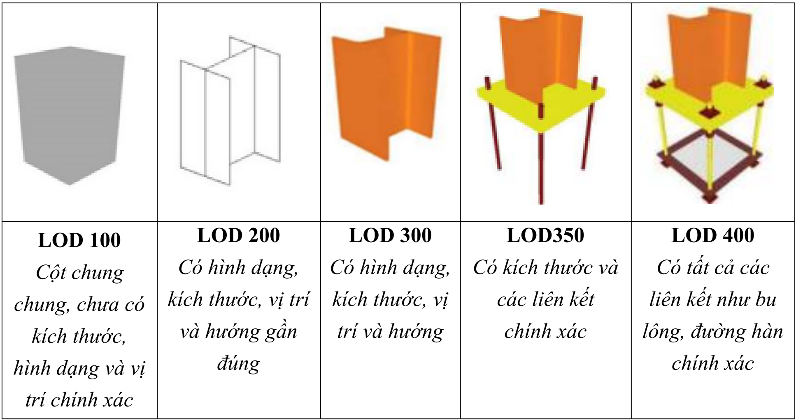

B ả ng M ức độ phát tri ể n thông tin phi (LOD) c ủ a các c ấ u ki ệ n trong d ự án Tham kh ả o ph ụ l ụ c A.1B ả ng m ức độ thông tin hình h ọ c (LOD)

## 7.2. M ức độ phát tri ể n thông tin phi hình h ọ c (LOI)

B ả ng M ức độ phát tri ể n thông tin phi hình h ọ c (LOI) c ủ a m ộ t s ố b ộ ph ậ n, c ấ u ki ệ n chính trong d ự án Tham kh ả o ph ụ l ụ c A.2B ả ng m ức độ thông tin phi hình h ọ c (LOI)


## CHƯƠNG 8. QUY ĐỊ NH PH Ố I H Ợ P

## 8.1. Quy trình ph ố i h ợ p

## 8.1.1. Quy trình ph ố i h ợ p BIM gi ữ a các bên

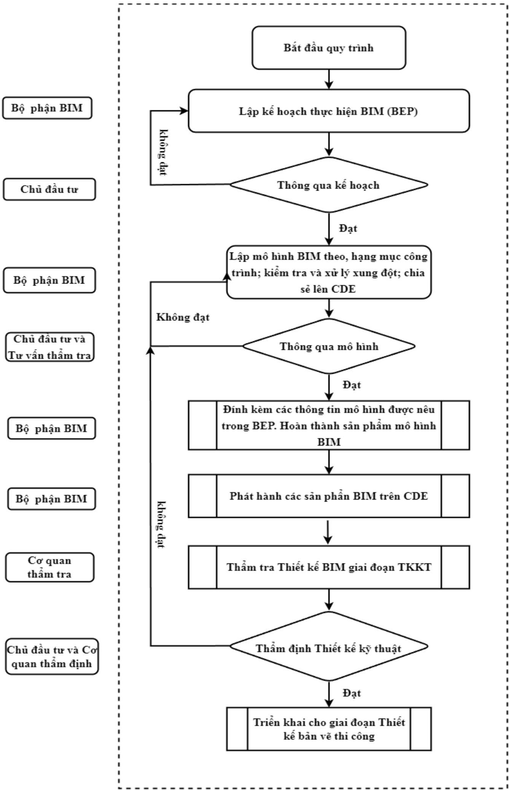

Hình 8.1 Quy trình ph ố i h ợp BIM giai đoạ n thi ế t k ế k ỹ thu ậ t


## 8.2. Môi trườ ng d ữ li ệ u chung (CDE)

Để h ỗ tr ợ quá trình th ự c hi ệ n áp d ụng BIM, công tác trao đổ i thông tin c ần đượ c th ự c hi ệ n và ki ể m soát. Các thành viên tham gia c ần trao đổi thông tin thườ ng xuyên. Các thông tin c ần được lưu trữ trên môi trườ ng d ữ li ệu chung (CDE) để các thành viên có liên quan có th ể truy c ập đượ c k ị p th ờ i. CDE là ngu ồ n d ữ li ệ u trung tâm c ủ a d ự án, cho phép các thành viên trao đổ i thông tin, h ạ n ch ế vi ệ c l ặ p l ạ i ho ặc thông tin không đượ c c ậ p nh ậ t.

CDE c ủ a d ự án ph ải đả m b ả o c ấ u trúc yêu c ầ u t ố i thi ể u theo tài li ệu Hướ ng d ẫ n chung áp d ụ ng Mô hình thông tin công trình (BIM) -Quy ết đị nh s ố 348/QĐ -BXD ngày 02 tháng 4 năm 2021 củ a B ộ Xây d ự ng.

H ệ th ố ng CDE c ủ a d ự án đượ c l ự a ch ọ n ph ải đả m b ả o ho ạt độ ng trong su ố t th ờ i gian th ự c hi ệ n gói th ầ u.

H ệ th ố ng phân quy ề n s ử d ụ ng t ạ i CDE ph ả i phù h ợ p v ớ i vai trò trách nhi ệ m c ủ a các bên tham gia d ự án. Các ch ức năng chia sẽ d ữ li ệ u ph ải đả m b ả o quy t ắ c v ề an toàn b ả o m ậ t d ữ li ệ u cho các bên.

T ấ t c ả các d ữ li ệ u ứ ng d ụ ng BIM s ẽ được tư vấ n BIM c ậ p nh ật lên CDE theo đúng như K ế ho ạ ch chuy ể n giao thông tin t ổ ng th ể (MIDP) để t ấ t c ả các đơn vị tham gia d ự án có th ể ki ểm tra, trao đổ i và truy xu ấ t các thông tin c ầ n thi ế t trong xu ấ t quá trình th ự c hi ệ n d ự án tr ự c ti ếp trên môi trườ ng CDE.

T ấ t c ả các d ữ li ệu liên quan đế n h ồ sơ thiế t k ế c ủ a d ự án bao g ồ m: Pháp lý d ự án, b ả n v ẽ , thuy ế t minh, d ự toán,.. cũng được đơn vị tư vấ n thi ế t k ế lưu trữ trên Môi trườ ng d ữ li ệ u chung (CDE) để lưu trữ và khai thác thông tin.

CDE ph ải đả m b ả o có các ch ức năng cộ ng tác, th ả o lu ậ n các v ấn đề liên quan đế n quá trình thi ế t k ế , quá trình t ạ o l ập mô hình BIM và lưu trữ các thông tin này để có th ể truy xu ấ t d ữ li ệ u khi c ầ n thi ế t.

C ấu trúc thư mụ c và vai trò c ủ a các ch ủ th ể trong qu ả n lý, s ử dung Môi trườ ng d ữ li ệ u chung (CDE) đượ c th ể hi ệ n qua b ả ng sau:


|                           | Các chủ thể tham gia   | Các chủ thể tham gia   | Các chủ thể tham gia   | Các chủ thể tham gia   |
|---------------------------|------------------------|------------------------|------------------------|------------------------|
| Khu vực/Thư mục trong CDE | Chủ đầu tư             | TVTK / Tư vấn BIM      | Tư vấn BIM thi công    | Quản lý BIM            |
| WIP (Đang triển khai)     | R                      | W                      | W                      | R                      |
| Shared (Chia sẻ)          | R                      | W                      | W                      | R                      |
| Published (Phát hành)     | R                      | W                      | R                      | R                      |
| Archived (Lưu trữ)        | R                      | W                      | N                      | R                      |

## Trong đó:

- -W (Write): Ghi d ữ li ệ u;
- -R (Read): Đọ c d ữ li ệ u;
- -N (No Access): Không đượ c phép truy c ậ p.

Ghi chú: Các thư mụ c, khu v ực lưu trữ trong CDE được định nghĩa theo quyết đị nh 348/QĐ -BXD, c ụ th ể như sau:

- -Khu v ực 'CÔNG VIỆC ĐANG TIẾN HÀNH' (WORK IN PROGRESS, viế t t ắ t WIP) c ủa CDE là nơi mỗ i nhóm hay cá nhân th ự c hi ệ n công vi ệ c c ủa mình, WIP đượ c dùng để lưu trữ các thông tin chưa đượ c ch ấ p thu ậ n chia s ẻ cho các nhóm/cá nhân khác có liên quan. Trong m ộ t d ự án có th ể có nhi ề u khu v ực WIP, thườ ng m ỗ i 1 bên tham gia th ự c hi ệ n có m ộ t khu v ự c WIP c ủ a riêng mình.
- -Khu v ực 'CHIA SẺ' (SHARED) được dùng để lưu trữ thông tin đã đượ c ch ấ p thu ậ n cho vi ệ c chia s ẻ. Thông tin này đượ c chia s ẻ để các đơn vị khác s ử d ụ ng làm d ữ li ệ u tham kh ả o cho vi ệ c phát tri ể n n ộ i dung có liên quan. Khi t ấ t c ả đã hoàn thành, thông tin (s ả n ph ẩ m theo k ế ho ạ ch) ph ải được đặ t ở tr ạng thái 'Chờ phát hành'.
- -Khu v ực 'PHÁT HÀNH' (PUBLISHED DOCUMENTATION) đượ c s ử d ụng để lưu tr ữ các thông tin đượ c phát hành, là nh ững thông tin đã đượ c ch ấ p thu ậ n b ở i ch ủ đầ u tư.
- -Khu v ực 'LƯU TRỮ' (ARCHIVE) ghi lạ i  m ọ i ti ế n tri ể n t ạ i m ỗ i  m ố c th ời điể m và ph ải lưu lạ i b ả n ghi c ủ a t ấ t c ả các trao đổi và thay đổ i nh ằ m cung c ấ p các d ấ u v ế t l ị ch s ử trao đổi để ki ểm tra và đố i chi ếu trong trườ ng h ợ p có tranh ch ấp…

## 8.3. Ph ầ n m ề m và phiên b ả n s ử d ụ ng

Các phiên b ả n ph ầ n m ề m c ần đượ c th ố ng nh ấ t trong nhóm d ự án. B ấ t k ỳ thay đổ i nào v ề ph ầ n m ề m c ần đượ c h ỏ i ý ki ến các bên tham gia trướ c khi th ự c hi ệ n.


Ch ỉ nh ữ ng công c ụ dướ i đây m ớ i đượ c s ử d ụ ng để t ạ o l ậ p, ph ố i h ợ p và phê duy ệ t mô hình BIM. M ụ c đích c ủ a vi ệ c th ố ng nh ấ t ph ầ n m ề m và phiên b ả n để đả m b ả o kh ả năng tích h ợ p gi ữ a các b ộ môn

D ựa trên cơ sở n ội dung quy đị nh các n ề n t ả ng công ngh ệ đượ c ch ấ p nh ận để áp d ụ ng BIM trong d ự án đã được đề c ậ p trong m ụ c 7.1 c ủ a EIR mà Ch ủ đầu tư đã đưa ra và căn cứ trên năng lự c có th ể đáp ứ ng c ủ a mình, Tư vấ n BIM đề xu ấ t b ổ sung thêm các n ề n t ả ng công ngh ệ có ch ức năng tương đương vớ i các n ề n t ả ng do Ch ủ đầu tư yêu cầ u. Các n ề n t ả ng công ngh ệ này s ẽ áp d ụ ng cho vi ệ c áp d ụ ng BIM trong d ự án.

- -Nh ữ ng ứ ng d ụ ng BIM s ử d ụng để tri ể n khai cho d ự án yêu c ầ u là ứ ng d ụ ng có b ả n quy ền, đả m b ả o vi ệc trao đổ i d ữ li ệu trong môi trườ ng d ữ li ệ u chung không x ả y ra các v ấn đề liên quan - ph ầ n m ề m.
- -Các ph ầ n m ề m nên chung 1 h ệ sinh thái để đả m b ả o kh ả năng phố i h ợ p cho các công đoạ n khác nhau c ủ a d ự án.
- -Các ph ầ n m ề m s ử d ụ ng cho vi ệ c t ạ o l ậ p, xây d ự ng mô hình cho các b ộ môn c ụ th ể ph ả i là các n ề n t ả ng ph ầ n m ề m chuyên ngành cho các ch ức năng nhiệ m v ụ, ưu tiên sử d ụ ng theo các g ợi ý dưới đây:

Bảng 8 -1. Các n ề n t ả ng ph ầ n m ề m

| N ộ i dung           | N ộ i dung                                                                                                                                                            | Nhà cung c ấ p   | Tên ph ầ n m ề m          | Phiên b ả n   |
|----------------------|-----------------------------------------------------------------------------------------------------------------------------------------------------------------------|------------------|---------------------------|---------------|
| T ạ o mô hình        | + B ề m ặ t hi ệ n tr ạ ng + Đườ ng giao thông + H ệ th ố ng thoát nướ c + An toàn giao thông + C ầ u + H ầ m chui + C ố ng + Hệ thống chiếu sáng, Trạm thu phí, ITS… | Autodesk         | Revit Infraworks Civil 3D | 2024          |
| Mô hình ph ố i h ợ p | Mô hình ph ố i h ợ p                                                                                                                                                  | Autodesk         | CDE                       | -             |


BEP

| N ộ i dung                                           | cung p Tên ph ầ n m ề m   | Phiên b ả n   |
|------------------------------------------------------|---------------------------|---------------|
| Qu ả n lý Mô hình, H ồ sơ tài liệ u b ả n v ẽ d ự án | CDE c ủ a Ch ủ đầu tư     | -             |

Yêu c ầ u v ề c ấ u hình máy ph ụ c v ụ khai thác mô hình BIM trên ph ầ n m ề m g ố c:

Để đáp ứ ng các n ộ i dung áp d ụ ng BIM, yêu c ầ u v ề c ấ u hình máy ph ụ c v ụ khai thác mô hình BIM trên ph ầ n m ề m g ốc như sau:

- -H ệ điề u hành: Microsoft Window 10 tr ở lên; 64-bit ho ặc tương đương;
- -CPU: Intel, AMD t ố i thi ể u 8 nhân, xung nh ị p 4.5GHz tr ở lên: Intel i5-Series tr ở lên ho ặ c Xeon-E, Xeon-W, AMD Ryzen 5, AMD Ryzen 7 ho ặc tương đườ ng;
- -Ram: T ố i thi ể u 32 GB;
- -Card đồ h ọ a: DirectX 11 v ớ i Shader Model 5 và b ộ nh ớ video t ố i thi ể u 6GB ho ặc tương đườ ng;
- -Độ phân gi ả i màn hình: t ố i thi ể u 1920x1080;
- -Dung lượ ng ổ c ứ ng t ố i thi ể u: 1000GB.
- -Yêu c ầ u c ấ u hình máy ph ụ c v ụ khai thác mô hình BIM trên CDE:
- -CPU: i5 10th tr ở lên ho ặ c Xeon;

- Ram: T

ố i thi ể u 16 GB;

- -

- Card màn hình: T

ố i thi ể u 4 GB

## 8.4. Đơn vị đo lườ ng

T ấ t c ả các mô hình và thông tin thi ế t k ế kèm theo đượ c t ạ o l ậ p và trao đổ i s ử d ụ ng:

- -S ử d ụ ng h ệ th ống đo lườ ng qu ố c t ế (SI).
- -V ẽ theo t ỷ l ệ 1:1. Đơn vị đo độ dài cho mô hình nên là mét (m) cho toàn b ộ và milimét (mm) cho riêng các b ả n v ẽ c ố t thép. Yêu c ầ u b ắ t bu ộ c áp d ụ ng trong toàn d ự án.

## 8.5. H ệ th ố ng t ọa độ và cao độ

Tư vấ n BIM th ố ng nh ấ t quy đị nh v ề t ọa độ và h ệ t ọa độ như trong mụ c 7.4 c ủ a EIR mà Ch ủ đầu tư đưa ra, bao gồ m:

- -H ệ t ọa độ (VN2000) dùng chung cho t ấ t c ả các d ữ li ệ u BIM. H ệ t ọa độ 3 chi ề u (xyz) s ẽ đượ c s ử d ụng để đặ t các mô hình cùng m ộ t h ệ t ọa độ , tránh ph ả i di chuy ể n và chuy ể n đổ i mô hình khi ph ố i h ợ p.


- -To ạ độ Project base point g ốc đượ c ch ọ n th ố ng nh ấ t gi ữ a các mô hình chính và các mô hình thành ph ầ n Revit (C ầ u/ C ố ng/ H ầ m/ Tr ạm thu phí, …) theo các mố c t ọa độ , cao độ , m ố c GPS, m ốc đườ ng chuy ề n. B ảng danh sách các điể m t ọa độ g ốc và các điể m đườ ng chuy ề n tham kh ả o Ph ụ l ụ c B- B ả ng th ố ng kê t ọa độ
- -T ấ t c ả các mô hình s ử d ụ ng m ộ t h ệ th ố ng t ọa độ đã đượ c th ố ng nh ấ t. T ấ t c ả các mô hình, b ề m ặ t thi ế t k ế s ẽ đượ c ch ồ ng lên nhau (Link) mà không c ầ n ph ả i áp d ụ ng b ấ t k ỳ ho ạt độ ng di chuy ể n hay chuy ển đổ i nào.
- -H ạ ng m ụ c: có tính ch ấ t quy mô công trình l ớn như cầu, tườ ng ch ắn đề xu ấ t m ỗ i c ầ u 1 m ố c t ọa độ như sau:

Bảng 8 -2. B ả ng t ọa độ Survey point s ử d ụ ng cho mô hình h ạ ng m ụ c tuy ế n, c ố ng, h ầ m chui, ATGT và ME-ITS-MEP-WIM

|   STT | Mô hình thành ph ầ n & Mô hình chính   |     N/S (m) |    E/W (m) | M Ố C GPS/DC   | GHI CHÚ   |
|-------|----------------------------------------|-------------|------------|----------------|-----------|
|     1 | T ừ Km9+325.44 đế n Km16+000           | 1181645.631 | 589196.329 | DC5-05         | A2Z       |
|     2 | T ừ Km16+000 đế n Km23+200             | 1177791.234 | 578820.581 | DC8-13         | A2Z       |
|     3 | T ừ Km23+200 đế n Km29+000             | 1174176.567 | 574562.172 | DC10-8         | A2Z       |
|     4 | T ừ Km29+000 đế n Km37+000             | 1168323.137 | 569108.593 | DC13-03        | A2Z       |
|     5 | T ừ Km37+000 đế n Km42+000             | 1163362.755 | 565595.454 | DC15-03        | A2Z       |
|     6 | T ừ Km42+000 đế n Km49+620             | 1159805.777 | 563756.249 | DC16-08        | A2Z       |
|     7 | T ừ Km49+620 đế n Km54+880             | 1154003.529 | 559219.644 | DC19-07        | A2Z       |
|     8 | T ừ Km54+880 đế n Km59+760             | 1154064.136 | 554077.517 | DC21-10        | A2Z       |
|     9 | T ừ Km59+760 đế n Km65+040             | 1152958.009 | 549334.376 | DC23-07        | A2Z       |
|    10 | T ừ Km65+040 đế n Km70+000             | 1152605.576 | 544033.364 | DC25-05        | A2Z       |
|    11 | T ừ Km70+000 đế n Km75+000             | 1152788.423 | 539097.946 | DC27-03        | A2Z       |
|    12 | T ừ Km75+000 đế n Km80+140             | 1152095.918 | 534078.138 | DC29-01        | A2Z       |
|    13 | T ừ Km80+140 đế n Km85+000             | 1151025.554 | 529301.405 | DC30-11        | A2Z       |
|    14 | T ừ Km85+000 đế n Km90+000             | 1148693.996 | 525114.914 | DC32-06        | A2Z       |
|    15 | T ừ Km90+000 đế n Km95+300             | 1146337.608 | 520698.398 | GPS34          | A2Z       |
|    16 | T ừ Km95+300 đế n Km100+080            | 1143363.699 |  516451.52 | DC35-10        | A2Z       |
|    17 | T ừ Km100+080 đế n Km105+454           | 1139250.056 | 515032.137 | DC37-09        | A2Z       |


BEP

Bảng 8 -3. B ả ng t ọa độ Survey point s ử d ụ ng cho mô hình h ạ ng m ụ c c ầ u

| STT   | Tên c ầ u                                   | Lý trình                 |     N/S (m) |    E/W (m) | M Ố C GPS/DC   | GHI CHÚ         |
|-------|---------------------------------------------|--------------------------|-------------|------------|----------------|-----------------|
| A     | ĐOẠ N HCM-TL                                |                          |             |            |                |                 |
|       | KM9+325-KM29+000                            |                          |             |            |                |                 |
| 1     | C ầu vượ t nút giao Ch ợ Đệ m               | Km12+700                 | 1181645.631 | 589196.329 | DC5-05         |                 |
| 2     | C ầ u Cao (c ầ u c ạ n)                     | Km10+600                 | 1181123.800 | 587578.896 | DC5-15         |                 |
| 3     | C ầ u B ế n L ứ c                           | Km20+740                 | 1177791.234 | 578820.581 | DC8-13         |                 |
| 4     | C ầ u Ván                                   | Km26+000                 | 1174176.567 | 574562.172 | DC10-8         |                 |
|       | KM29+000-KM49+620                           |                          |             |            |                |                 |
| I     | C ầ u trên tuy ế n chính cao t ố c          |                          |             |            |                |                 |
| 1     | C ầ u Cây Gáo                               | Km29+291.83              | 1171867.758 | 572319.335 | DC11-12        |                 |
| 2     | C ầ u c ạn đoạ n 2                          | Km34+289.94- Km35+624.90 | 1167133.196 | 568126.334 | DC13-10        |                 |
| 3     | C ầ u c ạn đoạ n 2.1                        | Km35+895.10 Km37+549.44  | 1167133.196 | 568126.334 | DC13-10        |                 |
| 4     | C ầ u Tân An                                | Km 36+600                | 1167133.196 | 568126.334 | DC13-10        |                 |
| 5     | C ầ u c ạn đoạ n 3                          | Km38+338.67- Km38+900.77 | 1163362.755 | 565595.454 | DC15-03        |                 |
| 6     | C ầ u R ạ ch G ố c                          | Km40+898.69              | 1162724.731 |   565182.1 | DC15-06        |                 |
| 7     | C ầu Tân Hương                              | Km42+282.91              |  1161706.89 | 564536.183 | DC15-11        |                 |
| 8     | C ầ u Qu ả n Th ọ                           | Km45+354.98              | 1158863.092 | 563459.242 | DC16-12        |                 |
| 9     | C ầ u Sáng Múc                              | Km46+362.33              | 1157686.287 | 563033.602 | DC17-03        |                 |
| II    | C ầu vượ t nút giao                         |                          |             |            |                |                 |
| 1     | Mô hình c ầ u nhánh 2 nút giao QL62         | Km35+950                 |  1166674.45 |  568071.43 | DC13-13        |                 |
| 2     | Mô hình c ầ u nhánh 4 nút giao QL62         | Km35+950                 |  1166674.45 |  568071.43 | DC13-13        |                 |
| III   | C ầu trên đườ ng ngang (vượ t tr ự c thông) |                          |             |            |                |                 |
| 1     | C ầu vượt ĐT.834                            | Km30+100.00              | 1171358.028 | 571846.584 | DC11-15        | GĐHT giữ nguyên |
| 2     | C ầu vượt ĐT.833                            | Km32+040.00              | 1169917.961 | 570526.396 | DC12-07        | GĐHT giữ nguyên |


ÁP D Ụ NG MÔ HÌNH THÔNG TIN CÔNG TRÌNH (BIM) -GIAI ĐOẠ N THI Ế T K Ế K Ỹ THU Ậ T

BEP

| STT   | Tên c ầ u                          | Lý trình    |     N/S (m) |    E/W (m) | M Ố C GPS/DC   | GHI CHÚ         |
|-------|------------------------------------|-------------|-------------|------------|----------------|-----------------|
| 3     | C ầu vượt ĐT.817                   | Km33+460.00 | 1168905.656 | 569582.581 | DC12-13        | GĐHT giữ nguyên |
| 4     | C ầ u vượ t cao t ố c              | KM37+960    | 1165291.835 | 566682.795 | DC14-07        | GĐHT giữ nguyên |
| 5     | C ầ u vượ t cao t ố c              | KM37+980    | 1165291.835 | 566682.795 | DC14-07        | GĐHT giữ nguyên |
| 6     | C ầ u vượ t cao t ố c              | KM39+560    | 1163907.107 | 565960.073 | GPS-15         | GĐHT giữ nguyên |
| 7     | C ầ u vượ t cao t ố c ĐT.866       | KM41+600    | 1159805.777 | 563756.249 | DC16-08        | GĐHT giữ nguyên |
| 8     | C ầ u vượ t cao t ố c ĐT.866B      | KM45+300    | 1158863.092 | 563459.242 | DC16-12        | GĐHT giữ nguyên |
| B     | ĐOẠ N TL-MT                        |             |             |            |                |                 |
| I     | C ầ u trên tuy ế n chính cao t ố c |             |             |            |                |                 |
| 1     | Kênh Năng                          | Km51+249    | 1154086.908 | 560167.585 | DC19-03        |                 |
| 2     | Sáu Ầ u                            | Km54+043    | 1153925.140 | 557374.060 | DC20-07        |                 |
| 3     | Tám Thướ c                         | Km54+413    | 1153991.630 | 556930.595 | DC20-09        |                 |
| 4     | Kênh M ộ t                         | Km55+272    | 1154171.474 | 556127.237 | DC21-01        |                 |
| 5     | Kênh 2A                            | Km56+693    | 1154211.098 | 554764.949 | DC21-07        |                 |
| 6     | Kênh Xáng                          | Km57+981    | 1153887.472 | 553419.874 | GPS22          |                 |
| 7     | Ấp Hưng                            | Km60+072    | 1153375.129 | 551491.895 | DC22-09        |                 |
| 8     | Kênh Gi ữ a                        | Km60+619    | 1153199.089 | 550980.384 | GPS23          |                 |
| 9     | C ầ u Sao                          | Km61+406    | 1153081.853 | 550267.112 | DC23-03        |                 |
| 10    | C ầ u H ỏ a                        | Km62+740    | 1152879.525 | 548852.822 | DC23-09        |                 |
| 11    | Tân Phú                            | Km64+393    | 1152703.763 | 546936.129 | DC24-05        |                 |
| 12    | M ỹ Quý                            | Km65+720    | 1152598.251 | 545988.693 | DC24-10        |                 |
| 13    | Nh ị M ỹ                           | Km67+350    | 1152595.893 | 544273.452 | DC25-04        |                 |
| 14    | H ội Đồ ng                         | Km69+355    | 1152689.748 | 542291.031 | DC26-01        |                 |
| 15    | Cà Mau                             | Km70+447    | 1152794.083 | 541223.985 | DC26-06        |                 |
| 16    | Cai L ậ y                          | Km71+897    | 1152857.892 | 539744.782 | GPS27          |                 |
| 17    | Bình Phú 1                         | Km73+958    | 1152687.158 | 537731.503 | DC27-09        |                 |
| 18    | Bình Phú 2                         | Km75+711    | 1152583.705 | 536007.029 | DC28-05        |                 |


ÁP D Ụ NG MÔ HÌNH THÔNG TIN CÔNG TRÌNH (BIM) -GIAI ĐOẠ N THI Ế T K Ế K Ỹ THU Ậ T

BEP

| STT   | Tên c ầ u                                                    | Lý trình   |     N/S (m) |    E/W (m) | M Ố C GPS/DC   | GHI CHÚ         |
|-------|--------------------------------------------------------------|------------|-------------|------------|----------------|-----------------|
| 19    | Phú Nhu ậ n                                                  | Km76+759   | 1152328.157 |  534944.95 | DC28-10        |                 |
| 20    | Đập Đìa Dứ a                                                 | Km78+984   | 1151817.106 |  532634.08 | DC29-07        |                 |
| 21    | Bà T ồ n 1                                                   | Km79+582   | 1151755.479 | 532195.048 | DC29-09        |                 |
| 22    | M ột Thướ c                                                  | Km80+268   | 1151663.495 | 531470.718 | GPS30          |                 |
| 23    | Bà R ằ ng                                                    | Km80+960   | 1151577.765 | 530734.975 | DC30-04        |                 |
| 24    | Nanh Cá                                                      | Km81+834   | 1151359.451 | 529926.132 | DC30-08        |                 |
| 25    | An Cư                                                        | Km82+513   | 1151025.554 | 529301.405 | DC30-11        |                 |
| 26    | C ầ u Kinh                                                   | Km83+559   | 1150494.034 | 528396.762 | DC31-03        |                 |
| 27    | Trà L ọ t                                                    | Km84+570   | 1150001.577 | 527560.262 | DC31-07        |                 |
| 28    | Thông Lưu                                                    | Km87+330   | 1148693.996 | 525114.914 | DC32-06        |                 |
| 29    | Đậ p L ớ n                                                   | Km88+530   | 1148132.771 | 524086.247 | DC32-11        |                 |
| 30    | M ỹ Thi ệ n                                                  | Km89+590   | 1147666.551 | 523253.892 | DC33-02        |                 |
| 31    | Ông V ẽ 2                                                    | Km91+230   | 1146894.965 | 521740.001 | DC33-09        |                 |
| 32    | B ả y Tiên                                                   | Km92+370   | 1146337.608 | 520698.398 | GPS34          |                 |
| 33    | Bà Năm                                                       | Km92+741   | 1146177.160 | 520407.722 | DC34-02        |                 |
| 34    | Ông Hưng                                                     | Km94+160   | 1145446.886 | 519105.869 | DC34-09        |                 |
| 35    | M ỹ Đứ c Tây                                                 | Km94+983   | 1144951.040 | 518450.454 | GPS35          |                 |
| 36    | R ạ ch Mi ễ u                                                | Km95+848   | 1144474.600 | 517828.247 | DC35-03        |                 |
| 37    | C ổ Cò                                                       | Km97+201   | 1143652.072 | 516807.462 | DC35-08        |                 |
| 38    | B ầ u Giai 1                                                 | Km98+516   | 1142838.698 | 515806.760 | DC36-01        |                 |
| 39    | R ạ ch Chanh                                                 | Km99+965   | 1141873.996 | 514662.640 | DC36-08        |                 |
|       | Đoạ n cao t ố c c ầ u M ỹ Thu ậ n 2 phía t ỉ nh Ti ề n Giang |            |             |            |                |                 |
| 1     | R ạch Sơn                                                    | Km101+677  | 1140261.665 | 514542.055 | DC37-04        |                 |
| 2     | An H ữ u                                                     | Km102+289  | 1139637.849 | 514856.188 | DC37-07        |                 |
| 3     | C ầ u c ạ n                                                  | Km103+920  | 1138415.499 | 515456.839 | DC38-03        |                 |
| 4     | M ỹ Hưng                                                     | Km104+611  | 1137792.572 | 516137.928 | DC38-07        |                 |
| II    | C ầu vượ t nút giao                                          |            |             |            |                |                 |
| 1     | Nút giao Thân C ửu Nghĩa                                     | Km50+420   | 1154161.578 | 560828.004 | GPS19          |                 |
| 2     | Nút giao Cai L ậ y                                           | Km66+480   | 1152595.242 |  545104.72 | DC25-01        | GĐHT giữ nguyên |


ÁP D Ụ NG MÔ HÌNH THÔNG TIN CÔNG TRÌNH (BIM) -GIAI ĐOẠ N THI Ế T K Ế K Ỹ THU Ậ T

BEP

| STT   | Tên c ầ u                                   | Lý trình   |     N/S (m) |    E/W (m) | M Ố C GPS/DC   | GHI CHÚ                              |
|-------|---------------------------------------------|------------|-------------|------------|----------------|--------------------------------------|
| 3     | Nút giao Cái Bè                             | Km81+320   | 1151543.144 | 530554.296 | DC30-05        | GĐHT giữ nguyên                      |
| 4     | Nút giao Cao Lãnh - An h ữ u                |            |  1142591.19 | 515480.233 | DC36-03        | D ự án cao t ố c Cao Lãnh - An H ữ u |
| 5     | Nút giao An Thái Trung                      | Km100+740  | 1141126.666 |  514359.06 | DC36-12        | GĐHT giữ nguyên                      |
| III   | C ầ u trên nhánh n ố i                      |            |             |            |                |                                      |
| IV    | C ầu trên đườ ng ngang (vượ t tr ự c thông) |            |             |            |                |                                      |
| 1     | Đườ ng huy ện 39 (ĐH.39)                    | Km52+620   | 1153970.427 | 558872.098 | GPS20          | GĐHT giữ nguyên                      |
| 2     | Đườ ng t ỉnh 874 (ĐT.874)                   | Km63+800   | 1152800.139 | 547817.319 | DC24-01        | GĐHT giữ nguyên                      |
| 3     | ĐT.686                                      | Km69+040   | 1152656.504 | 542667.055 | DC25-11        | GĐHT giữ nguyên                      |
| 4     | Đ. Võ Việ t Tân                             | Km70+180   |  1152771.51 | 541479.217 | DC26-05        | GĐHT giữ nguyên                      |
| 5     | A2Z.57C                                     | Km70+760   |  1152842.88 | 540866.436 | DC26-08        | GĐHT giữ nguyên                      |
| 6     | C ầu đi bộ                                  | Km73+280   | 1152702.505 | 538410.033 | DC27-06        | GĐHT giữ nguyên                      |
| 7     | Đườ ng huy ện 65 (ĐH.65)                    | Km75+440   | 1152631.085 |  536184.02 | DC28-04        | GĐHT giữ nguyên                      |
| 8     | C ầu Đạ i Th ắ ng                           | Km78+080   | 1151971.521 | 533626.494 | DC29-03        | GĐHT giữ nguyên                      |
| 9     | Đườ ng huy ện 76 (ĐH.76)                    | Km89+680   |  1147547.63 |   523019.4 | DC33-03        | GĐHT giữ nguyên                      |
| 10    | Đườ ng t ỉnh 861 (ĐT.861)                   | Km96+300   | 1144144.948 | 517425.823 | DC35-05        | GĐHT giữ nguyên                      |


## 8.6. Công tác kh ả o sát ph ụ c v ụ tri ể n khai mô hình BIM

## 8.6.1. Áp d ụ ng công ngh ệ k ỹ thu ậ t s ố vào công tác kh ả o sát, thi ế t k ế

- -Công ngh ệ k ỹ thu ậ t s ố : Là công c ụ , h ệ th ố ng, thi ế t b ị và tài nguyên k ỹ thu ậ t s ố để t ạ o, lưu trữ và x ử lý d ữ li ệ u b ằ ng các ứ ng d ụ ng công ngh ệ m ớ i.
- -LiDAR -(Light Detection And Ranging) -là công ngh ệ vi ễ n thám ch ủ độ ng s ử d ụ ng các lo ại tia laser để kh ảo sát đối tượ ng t ừ xa. D ữ li ệu thu đượ c c ủ a h ệ th ố ng là t ậ p h ợ p đám mây điể m ph ả n x ạ 3 chi ề u c ủ a tia laser t ừ đối tượng đượ c kh ả o sát ở dướ i m ặt đấ t.
- -Công ngh ệ LiDAR (Light Detection And Ranging) là công ngh ệ m ới đượ c áp d ụ ng t ạ i Vi ệt Nam, cho phép đo đạc độ cao chi ti ết đị a hình m ộ t cách nhanh chóng và chính xác. Xác đị nh cao trình và t ọa độ c ủ a m ặt đấ t t ự nhiên, ph ụ c v ụ công tác kh ảo sát bình đồ và thi ế t k ế tuy ế n, kh ả o sát tr ữ lượ ng bãi th ả i, m ỏ v ậ t li ệu…
- -Ứ ng d ụ ng công ngh ệ s ố trong công trình giao thông: Là quá trình thay đổ i t ừ mô hình truy ề n th ố ng sang mô hình doanh nghi ệ p s ố, để mô ph ỏ ng và mô hình hóa s ố li ệu đị a hình, qu ả n lý và theo dõi các h ạ ng m ụ c công trình m ộ t cách chính xác, th ự c t ế và khoa h ọ c.

## 8.6.2. M ục đích công tác khả o sát, thi ế t k ế áp d ụ ng LiDAR

- -Công ngh ệ Laser Scanner s ẽ giúp t ối ưu hóa công tác khả o sát và thi ế t k ế : Thông qua h ệ th ố ng d ữ li ệu đượ c kh ả o sát, k ế t n ối đồ ng b ộ , nhanh và chính xác giúp d ễ dàng hình dung m ộ t cách tr ự c quan v ề công trình thông qua công ngh ệ 3D, t ừ đó dễ dàng phát hi ệ n ra nh ữ ng v ấn đề t ồ n t ại như tầ m nhìn, y ế u t ố đườ ng cong, tr ắ c d ọc, …Từ đó giúp hiệ u ch ỉ nh tuy ế n m ộ t cách d ễ dàng, nhanh chóng, chính xác ngay t ừ giai đoạ n thi ế t k ế ban đầ u, mang l ạ i hi ệ u qu ả l ớ n cho d ự án.
- -T ạo ra năng suấ t và giá tr ị gia tăng: Công nghệ hi ện đạ i - g ọ n nh ẹ - giao di ệ n tr ự c quan -độ chính xác cao - gi ả m s ức lao độ ng trung gian.
- -Nâng cao năng lự c c ạ nh tranh: T ạ o l ợ i th ế c ạ nh tranh và mang l ạ i hi ệ u qu ả b ở i các tính năng tích hợ p Qu ả n lý d ự án theo mô hình BIM theo L ộ trình đã đượ c Th ủ tướ ng Chính ph ủ Vi ệ t Nam phê duy ệ t t ạ i Quy ết đị nh s ố 258/QĐ -TTg ngày 17/3/2023:


## 8.6.3. Kh ảo sát đị a hình ph ụ c v ụ mô hình thông tin công trình (BIM) b ằ ng công ngh ệ quét LiDAR

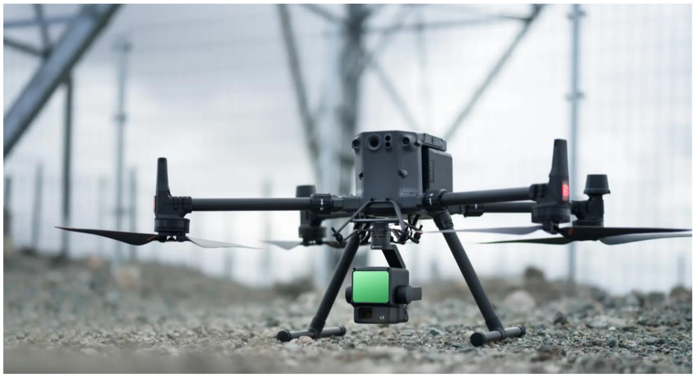

- -H ệ th ố ng LiDAR bao g ồ m b ộ đầ u quét (b ộ c ả m bi ế n), h ệ th ống đo quán tính (IMU), hệ th ố ng GPS, h ệ th ố ng qu ả n lý bay, h ệ th ố ng camera s ố và h ệ th ố ng các thi ế t b ị lưu trữ d ữ li ệ u.
- -M ộ t h ệ th ống LiDAR điển hình thường đượ c g ắ n c ố đị nh trên m ộ t lo ạ i máy bay phù h ợ p nào đó. Khi máy bay bay trên vùng cầ n kh ả o sát, c ả m bi ế n laser s ẽ phát ra các chùm tia laser v ề phía đối tượ ng, b ộ thu nh ậ n tín hi ệ u laser g ắ n kèm v ớ i c ả m bi ế n s ẽ thu nh ậ n tín hi ệ u ph ả n x ạ t ừ đối tượ ng. M ỗ i m ộ t giây h ệ th ố ng có th ể thu nh ận được vài trăm ngàn điểm đế n vài tri ệu đám mây điểm (tương đương vài triệu điểm mia, gương nếu đo bằ ng máy toàn đạ c, RTK trong th ời gian 1s). Các đám mây điểm LiDAR này sau đó sẽ đượ c x ử lý sơ  bộ d ự a  trên  các  ph ầ n  m ề m  chuyên  d ụ ng  (Lidar360,  Terra  Soild,  Trimble RealWork, Leica Cyclone 3DR, ….).

## 8.6.4. Quy trình th ự c hi ệ n kh ả o sát b ằ ng công ngh ệ LiDAR

Quy trình đượ c th ự c hi ện theo quy trình dưới đây và được quy đị nh chi ti ế t trong thông tư 07/2021/TT -BTNMT.

## · Công tác chu ẩ n b ị :

- -Chu ẩ n b ị nhân s ự , thi ế t b ị máy móc.
- -Kh ảo sát đị a hình tuy ến sơ bộ trên Google Earth.
- -Thu th ậ p d ữ li ệ u m ố c t ọa độ, độ cao khu v ực và quy đị nh t ỷ l ệ b ản đồ thành l ập theo đề cương thiế t k ế cơ sở .
- Công tác thi ế t k ế bay ch ụ p và tri ể n khai bay ngoài th ực đị a:
- -Thi ế t k ế ph ạ m v ị bay d ự vào ranh gi ớ i ph ạ m vi bay theo d ự án trên n ề n Google Earth.


- -Căn cứ vào t ỷ l ệ b ản đồ thành lâp l ự a ch ọn độ cao bay, độ ph ủ phù h ợp để đả m b ảo độ chính xác theo yêu c ầ u.
- -X ậ y d ự ng, phát tri ể n h ệ th ố ng m ố c kh ố ng ch ế trong trườ ng h ợ p khu v ực chưa có.
- -Đo các điể m ki ể m tra trong ph ạ m v ị khu v ự c bay quét.
- -Trướ c khi bay ph ải đả m b ả o, ki ể m tra ho ạt độ ng thi ế t b ị trước khi bay để đả m b ả o an toàn trong su ố t quá trình bay.

## · Công tác x ử lý d ữ li ệ u trong phòng:

- -X ử lý d ữ li ệu thô thu đượ c t ừ thi ế t b ị quét LiDAR t ạo đám mây điể m Point cloud.
- -X ử lý phân l ớ p th ự c ph ủ, đị a v ậ t, ... m ục đích lấy điể m pointcloud m ặt đấ t ph ụ c v ụ xây d ự ng b ề m ặ t t ự nhiên (đố i v ớ i các v ị trí ao h ồ , sông su ố i,r ừng nguyên sinh,… các vị trí không th ể quét đượ c d ữ li ệ u point cloud m ặt đấ t, s ẽ s ử d ụ ng d ữ li ệ u kh ả o sát b ằ ng thi ế t b ị RTK đo bổ sung)
- -X ử lý d ữ li ệ u ả nh tr ực giao thu đượ c t ừ ảnh đơn.
- Công tác biên t ậ p s ố hóa thành l ập bình đồ, đóng gói sả n ph ẩ m:
- -T ừ d ữ li ệ u ả nh tr ự c giao ti ế n hành s ố hóa địa hình, đị a v ậ t, ....
- -T ừ d ữ li ệu điể m m ặt đấ t (Ground Point) k ế t h ợ p v ớ i d ữ li ệ u kh ả o sát b ằ ng thi ế t b ị RTK, ti ế n hành xây d ự ng b ề m ặ t t ự nhiên ph ụ c v ụ công tác thi ế t k ế , ...
- -Ti ến hành đóng gói sả n ph ẩ m giao n ộ p.

## 8.6.5. S ả n ph ẩ m công ngh ệ LiDAR

- -Căn cứ vào Nhi ệ m v ụ kh ả o sát c ủ a d ự án bướ c Thi ế t k ế k ỹ thu ật trong đó sử d ụ ng k ế t h ợ p k ế t qu ả c ủa bướ c Báo cáo nghiên c ứ u kh ả thi v ớ i d ữ li ệ u sau bay ch ụp đượ c x ử lý thành d ữ li ệu bình đồ 3DFace, k ế t h ợ p v ớ i d ữ li ệ u ảnh Raster để xây d ự ng mô hình b ề m ặ t hi ệ n tr ạ ng và công tác bay ch ụ p b ổ sung (n ế u có) , đo vẽ bình đồ b ằ ng RTK t ạ i các v ị trí kh ả o sát ở bướ c Thi ế t k ế k ỹ thu ậ t.
- -K ế t qu ả kh ả o sát hi ệ n tr ạ ng áp d ụ ng công ngh ệ LiDAR ở bướ c Thi ế t k ế k ỹ thu ậ t ph ả i đả m b ả o yêu c ầ u v ề yêu c ầ u m ức độ thông tin LODG đố i v ớ i ph ần đị a hình S ả n ph ẩ m công ngh ệ LiDAR:
+ Mô hình s ố đị a hình DTM: là các mô hình s ố miêu t ả b ề m ặ t m ặt đất nhưng không bao g ồm các đối tượng đị a v ật trên đó. D ữ li ệ u thu nh ậ n t ừ quá trình bay quét LiDAR bao g ồ m t ậ p h ợp các điể m có giá tr ị m ặ t b ằ ng và giá tr ị độ cao t ạ o ra mô hình s ố đị a hình.
+ Mô hình s ố b ề m ặ t DEM: là m ộ t mô hình s ố độ cao miêu t ả b ề m ặ t m ặt đấ t và bao g ồ m c ả các đối tượ ng v ậ t th ể trên đó như nhà cử a, cây cây c ối, đường dây điện, đườ ng giao thông...


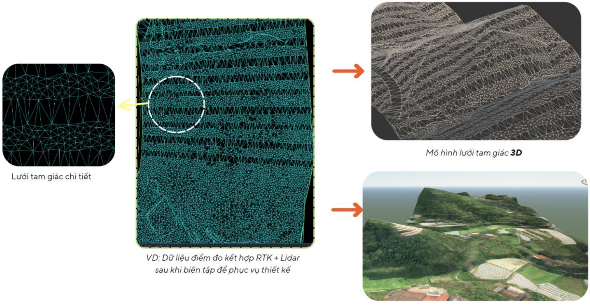

Mô hinh 3D + Ành nn hin trng

Hình 8.2 Hình ả nh minh h ọ a d ữ li ệ u 3DFace

S ả n ph ẩ m kh ả o sát hi ệ n tr ạ ng áp d ụ ng công ngh ệ LiDAR ph ụ c v ụ tri ể n khai mô hình thông tin công trình (BIM) bao g ồ m:


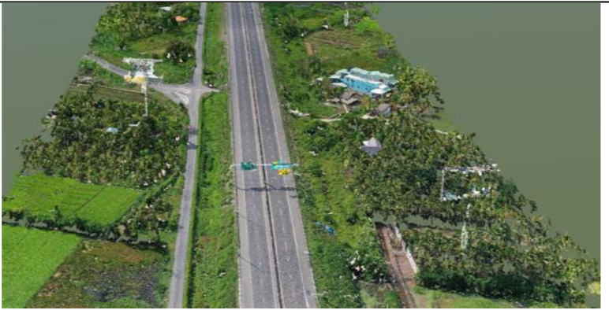

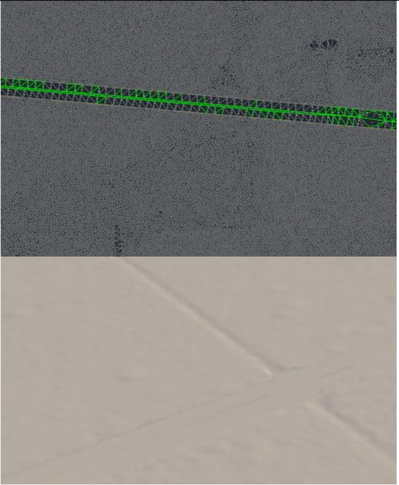

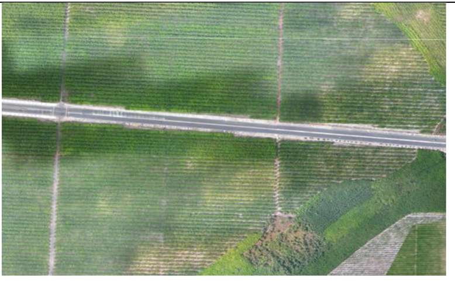

Bảng 8 -4. B ả ng k ế t qu ả kh ả o sát hi ệ n tr ạ ng áp d ụ ng công ngh ệ LiDAR

| TT   | Hạng mục                           | Định dạng                | Yêu cầu                                                                                                                                                                                                                                                                                                                                                                                                                                                                                                              | Hình ảnh minh họa   |
|------|------------------------------------|--------------------------|----------------------------------------------------------------------------------------------------------------------------------------------------------------------------------------------------------------------------------------------------------------------------------------------------------------------------------------------------------------------------------------------------------------------------------------------------------------------------------------------------------------------|---------------------|
| I    | Dữ liệu khảo sát LiDAR             |                          |                                                                                                                                                                                                                                                                                                                                                                                                                                                                                                                      |                     |
| 1    | Dữ liệu đám mây điểm (Point Cloud) | LAS                      |                                                                                                                                                                                                                                                                                                                                                                                                                                                                                                                      |                     |
| 2    | Dữ liệu bình đồ (3D Face)          | DWG                      | - Th ể hi ện rõ: điểm cao độ , đị a v ật, các đường đặ c trưng củ a hi ệ n tr ạ ng (mép đường cũ, ao hồ , kênh mương, sông, suố i ...), etc - M ật độ điể m: 3-5m/ điể m (Nh ằm đả m b ả o m ứ c độ thông tin LOI- G đố i v ớ i ph ần đị a hình là LOI- G 300 và đả m b ảo đồ ng nh ấ t d ữ li ệ u b ề m ặ t hi ệ n tr ạ ng gi ữ a thi ế t k ế và mô hình BIM ở bướ c thi ế t k ế cơ sở. Ngoài ra đị a hình khu v ực là đồ ng b ằ ng, 3DFace c ần đả m b ả o không quá n ặ ng và th ể hi ện rõ địa hình, đị a v ậ t) |                     |
| 3    | Dữ liệu ảnh (Raster)               | TIF, JPG2, J2W, JPG, JGW | Có màu s ắ c t ự nhiên hài hòa không quá sáng ho ặ c quá t ố i, không b ị lóa, không có mây che. Th ể hi ệ n rõ ảnh đị a hình.                                                                                                                                                                                                                                                                                                                                                                                       |                     |


| TT   | Hạng mục                    | Định dạng   | Yêu cầu                                     |
|------|-----------------------------|-------------|---------------------------------------------|
| II   | Dữ liệu mô hình bề mặt hiện | FBX         | 3D Face k ế t h ợ p ả nh Raster (LOI-G 300) |

## 8.7. B ả n gán màu h ệ th ố ng

Tư vấ n BIM th ố ng nh ấ t quy đị nh theo EIR mà Ch ủ đầu tư đưa ra và có b ổ sung thêm 1 s ố mã màu. Chi ti ế t xem b ả ng sau:

Bảng 8 -5. B ả ng gán mã màu h ệ th ố ng

| Hạng mục                        | Màu sắc   |   R |   G |   B |
|---------------------------------|-----------|-----|-----|-----|
| 1- Hệ thống đường giao thông    |           |     |     |     |
| + Bê tông nhựa rỗng thoát nước  |           | 102 | 102 | 102 |
| + Bê tông nhựa chặt 16          |           | 102 | 102 | 102 |
| + Bê tông nhựa chặt 19          |           |  80 |  80 |  80 |
| + Hỗn hợp BTNBR 25              |           |  60 |  60 |  60 |
| + Láng nhựa                     |           | 102 | 102 | 102 |
| + CPĐD loại 1 gia cố xi măng 4% |           |   0 | 143 | 213 |
| + CPĐD loại 1                   |           |  55 | 108 | 189 |
| + CPĐD loại 2                   |           |  61 | 120 | 210 |
| + Đất đầm chặt K98              |           | 242 | 108 |  19 |
| + Bề mặt vỉa hè trồng cỏ        |           | 101 | 168 |  67 |
| + Bề mặt vỉa hè                 |           | 204 | 204 | 204 |
| + Đắp nền                       |           |  70 | 110 |  50 |
| + Đào nền                       |           |  80 |  80 |  50 |
| + Đá dăm đệm                    |           | 181 |  53 |  53 |
| + Các cấu kiện BTXM             |           | 230 | 152 |   0 |


ÁP D Ụ NG MÔ HÌNH THÔNG TIN CÔNG TRÌNH (BIM) -GIAI ĐOẠ N THI Ế T K Ế K Ỹ THU Ậ T

BEP

| Hạng mục                                            | Màu sắc   |   R |   G |   B |
|-----------------------------------------------------|-----------|-----|-----|-----|
| + Các loại cấu kiện khác                            |           | 130 | 130 | 130 |
| 2- Mạng lưới thoát nước mưa                         |           |   0 |   0 | 255 |
| 3- Mạng lưới thoát nước thải                        |           | 100 |  50 | 150 |
| 4- Mạng lưới chiếu sáng                             |           | 255 | 150 |   0 |
| 5- Mạng lưới cấp điện                               |           | 255 | 250 |   0 |
| 6- Mạng lưới thông tin liên lạc                     |           |   0 | 255 |   0 |
| 7- Phần cống ngang,hầm chui, cầu                    |           |     |     |     |
| + Bê tông nhựa (BTNR 12.5, BTNC 12.5, BTNC 16 , … ) |           | 102 | 102 | 102 |
| + Bê tông cốt thép                                  |           | 192 | 192 | 192 |
| + Thép hình                                         |           | 224 | 223 | 219 |
| + Cốt thép                                          |           |     |     |     |
| Ø6                                                  |           | 255 | 128 |  64 |
| Ø8                                                  |           |   0 | 128 |   0 |
| Ø10                                                 |           |   0 |   0 | 255 |
| Ø12                                                 |           | 128 | 128 | 255 |
| Ø14                                                 |           | 255 |   0 |   0 |
| Ø16                                                 |           | 255 | 128 | 192 |
| Ø18                                                 |           | 139 | 224 | 118 |
| Ø20                                                 |           |   0 |  64 | 128 |
| Ø22                                                 |           | 128 | 128 |   0 |
| Ø25                                                 |           |  64 | 128 | 128 |
| Ø28                                                 |           | 168 |   0 |  84 |
| Ø32                                                 |           |  87 |  40 |  54 |
| Ø36                                                 |           | 255 | 255 | 255 |
| Ø40                                                 |           | 128 |   0 | 255 |


| Hạng mục                 | Màu sắc   |   R |   G |   B |
|--------------------------|-----------|-----|-----|-----|
| Ø50                      |           | 255 | 255 | 255 |
| Ø60                      |           | 254 | 231 |  21 |
| 8- Hệ thống ITS -ETC-WIM |           |     |     |     |
| + Hệ thống ITS           |           | 189 | 189 | 126 |
| …                        |           |     |     |     |

## 8.8. B ả n v ẽ

B ả n v ẽ đượ c trích xu ấ t tr ự c ti ế p t ừ các mô hình BIM. Vi ệ c b ổ sung đườ ng nét, chi ti ế t xây d ự ng và ký hi ệ u có th ể đượ c b ổ sung vào khi c ầ n thêm chi ti ế t.

## 8.9. Trao đổ i d ữ li ệ u

Các bên c ầ n tuân th ủ các quy đị nh sau:

- -T ấ t c ả các d ữ li ệ u c ần được trao đổi qua Môi trườ ng d ữ li ệ u chung CDE
- -Quy định đặ t tên c ầ n tuân th ủ theo quy t ắc đặ t tên. Quy t ắc đặ t tên tham kh ả o Ph ụ l ụ c C - Quy t ắc đặ t tên
- -T ấ t c ả mô hình c ần đượ c t ả i lên b ằng đị nh d ạng theo quy đị nh
- -T ấ t c ả các mô hình c ần đả m b ả o tuân th ủ quy định dung lượ ng file h ệ th ố ng
- -T ấ t c ả các phiên b ản cũ củ a mô hình c ầ n ph ải được lưu trên Môi trườ ng d ữ li ệ u chung CDE.

Các bên c ầ n hi ể u rõ cách s ử d ụ ng, trách nhi ệm, đị nh d ạ ng và t ầ n su ấ t chia s ẻ thông tin đã đượ c th ố ng nh ấ t.

## 8.9.1. Đị nh d ạng trao đổ i d ữ li ệ u

Tư vấ n BIM th ố ng nh ấ t các yêu c ầ u cho vi ệ c th ố ng nh ất các đị nh d ạng trao đổ i d ữ li ệ u như trong EIR củ a Ch ủ đầu tư nêu ra, bao gồ m:

- -Đị nh d ạng trao đổ i d ữ li ệ u trong quá trình t ạ o l ậ p và chuy ể n giao mô hình BIM có th ể ở đị nh d ạ ng g ốc và đị nh d ạ ng m ở .
- -Trong quá trình t ạ o l ậ p mô hình các bên liên quan ph ả i th ố ng nh ấ t v ề đị nh d ạ ng trao đổ i, chuy ển giao mô hình (đị nh d ạ ng g ố c ho ặc đị nh d ạ ng m ở), trong đó ưu tiên các đị nh d ạ ng ph ổ bi ế n là IFC và LandXML.


## 8.9.2. Qu ản lý dung lượ ng file h ệ th ố ng

Tư vấ n BIM th ố ng nh ấ t các yêu c ầ u qu ản lý dung lượng file lưu trữ trong EIR c ủ a Ch ủ đầu tư nêu ra, cụ th ể như sau:

Để h ỗ tr ợ các bên truy c ậ p và s ử d ụ ng thông tin hi ệ u qu ả, các quy định dưới đây về dung lượ ng file mô hình và qu ản lý file trướ c khi bàn giao c ần được lưu ý thự c hi ệ n:

- -Mô hình đơn lẻ làm vi ệ c cho t ừ ng h ạ ng m ụ c công trình c ố g ắng không vượ t quá 500 Mb (tùy thu ộ c vào ngu ồ n tài nguyên c ủa đơn vị tư vấn, dung lượ ng này có th ể thay đổ i)
- -Mô hình t ổ ng h ợ p các ph ầ n h ạ ng m ụ c công trình ho ặ c t ổ ng th ể c ố g ắng không vượ t quá 500Mb (tùy thu ộ c vào ngu ồ n tài nguyên c ủa đơn vị tư vấn, dung lượ ng này có th ể thay đổ i) áp d ụ ng cho vi ệ c truy c ậ p s ử d ụng bình thườ ng c ủ a các máy tính chuyên d ụ ng có c ấu hình cao đang đượ c s ử d ụ ng r ộ ng rãi.
- -Các file trướ c khi bàn giao ho ặ c cung c ấ p s ử d ụ ng cho toàn thành viên trong d ự án c ầ n đượ c làm s ạ ch, lo ạ i b ỏ các liên k ế t (Xref, chi ti ế t, link) không c ầ n thi ế t, lo ạ i b ỏ các file liên k ết, các file 2D đính kèm không sử d ụ ng.

## 8.10. L ị ch h ọ p d ự án

Trong giai đoạ n thi ế t k ế k ỹ thu ậ t, t ầ n su ấ t h ọ p ph ố i h ợ p BIM và các cu ộ c h ọ p khác liên quan đến BIM đượ c lên k ế ho ạ ch t ạ i b ảng dướ i. L ị ch này có th ể được điề u ch ỉ nh tu ỳ thu ộ c vào giai đoạ n và tình hình tri ể n khai th ự c hi ệ n d ự án.


BEP

| Loại cuộc họp                                 | Hình thức             | Tần xuất     | Thành phần   | Địa điểm   |
|-----------------------------------------------|-----------------------|--------------|--------------|------------|
| Họp khởi động dự án                           | Trực tiếp/ trực tuyến | 1 lần        | Tất cả       | Đề xuất    |
| Phối hợp thiết kế                             | Trực tiếp/ trực tuyến | 2 lần/ tháng | TVTK         | Đề xuất    |
| Các cuộc họp khác giữa nhiều bên tham gia     | Trực tiếp/ trực tuyến | 1 lần/ tháng | Đề xuất      | Đề xuất    |
| Các cuộc họp đột xuất giữa nhiều bên tham gia | Trực tiếp/ trực tuyến | Đề xuất      | Đề xuất      | Đề xuất    |

## 8.11. Ki ể m tra và nghi ệ m thu mô hình

Các bên liên quan ch ị u trách nhi ệ m t ạ o l ậ p mô hình BIM c ầ n tuân th ủ các yêu c ầ u sau:

- -Các mô hình được phân chia đúng như đã thố ng nh ấ t ở trên.
- -Trướ c khi chia s ẻ mô hình, c ầ n lo ạ i b ỏ t ấ t c ả các thành ph ầ n không c ầ n thi ế t ho ặ c các liên k ế t CAD không c ầ n thi ết. Các đối tượ ng không rõ ràng c ầ n ph ải đượ c s ử a ch ữ a ho ặ c lo ạ i b ỏ , t ấ t c ả các file ph ụ thu ộ c ho ặ c liên k ế t c ần đượ c ki ểm tra trướ c khi chia s ẻ
- -Tên file, b ả n v ẽ c ủ a d ự án đượ c ki ể m tra và phê duy ệt trướ c khi t ả i lên CDE
- -Trong trườ ng h ợp có thông tin trái ngược nhau, các bên căn cứ vào mô hình t ổ ng h ợ p BIM.
- -S ự đầy đủ c ủ a n ộ i dung thông tin

Chi ti ế t các n ộ i dung ki ể m tra căn cứ theo Hướ ng d ẫn chung, các hướ ng d ẫ n chi ti ế t và các quy đị nh c ủa cơ quan có thẩ m quy ề n v ề yêu c ầu đố i v ớ i s ả n ph ẩ m thi ế t k ế .

Các quy đị nh c ụ th ể xem b ả ng sau:


Bảng 8 -6. Ki ể m tra mô hình

| Kiểm tra            | Nội dung                                                                                               | Phần mềm sử dụng   | Bên nhận trách nhiệm   | Tần suất                                                                   |
|---------------------|--------------------------------------------------------------------------------------------------------|--------------------|------------------------|----------------------------------------------------------------------------|
| Kiểm tra trực quan  | Thông tin chứa trong mô hình BIM phải được xác minh để xác định tính chính xác.                        | Civil 3D, Revit…   | TV BIM                 | Kiểm tra liên tục trong quá trình tạo dựng và gán thông tin mô hình BIM    |
| Kiểm tra xung đột   | Phát hiện các vấn đề trong mô hình nơi các thành phần khác nhau của công trình có sự va chạm, xung đột | Navisworks / CDE   | TV BIM                 | Kiểm tra liên tục trong quá trình combine, phối hợp các mô hình thành phần |
| Kiểm tra tiêu chuẩn | Đảm bảo việc tuân thủ các tiêu chuẩn, phương pháp, hướng dẫn áp dụng                                   | -                  | TV BIM                 | Kiểm tra liên tục trong quá trình tạo dựng và gán thông tin mô hình BIM    |
| …                   | …                                                                                                      | …                  | …                      | …                                                                          |


## PHỤ LỤC -KẾ HOẠCH THỰC HIỆN BIM

DỰ ÁN ĐẦU TƯ XÂY DỰNG MỞ RỘNG ĐƯỜNG CAO TỐC``` THÀNH PHỐ HỒ CHÍ MINH - TRUNG LƯƠNG - MỸ THUẬN THEO PHƯƠNG THỨC ĐỐI TÁC CÔNG TƯ (PPP)

ÁP DỤNG MÔ HÌNH THÔNG TIN CÔNG TRÌNH (BIM)

GIAI ĐOẠN: THIẾT KẾ KỸ THUẬT

HẠNG MỤC: CẦU VÁN - KM26+055


## DANH M Ụ C PH Ụ L Ụ C

Ph ụ l ụ c A -B ả ng m ức độ

Ph ụ l ụ c B -B ả ng ki ể m tra ma tr ậ n va ch ạ

Ph ụ l ụ c C -Danh m ụ c b ả ng t ổ ng h ợ p kh ối lượ

Ph ụ l ụ c D -Danh m ụ c b ả n v ẽ

Ph ụ l ụ c E -B ả ng th ố ng kê t ọa độ

Ph ụ l ụ c F -Quy t ắc đặ

Ph ụ l ụ c G -K ế ho ạ ch chuy ể n giao thông tin nhi ệ m v ụ (TIDP)

Ph ụ l ụ c H -K ế ho ạ ch chuy ể n giao thông tin t ổ ng th ể

thông tin m ng BIM BIM t tên (MIDP)


## PH Ụ L Ụ C A B Ả NG M ỨC ĐỘ THÔNG TIN

Trang 1

## PHỤ LỤC A .1 : BẢNG MỨC ĐỘ THÔNG TIN HÌNH HỌC (LOD)

| PH Ụ L Ụ C A.1: B Ả NG M Ứ C ĐỘ THÔNG TIN C Ầ N THI Ế T (LOIN) - PH Ầ N LOD   | PH Ụ L Ụ C A.1: B Ả NG M Ứ C ĐỘ THÔNG TIN C Ầ N THI Ế T (LOIN) - PH Ầ N LOD                                                                                    | PH Ụ L Ụ C A.1: B Ả NG M Ứ C ĐỘ THÔNG TIN C Ầ N THI Ế T (LOIN) - PH Ầ N LOD   | PH Ụ L Ụ C A.1: B Ả NG M Ứ C ĐỘ THÔNG TIN C Ầ N THI Ế T (LOIN) - PH Ầ N LOD                                                                                                                                                                             | PH Ụ L Ụ C A.1: B Ả NG M Ứ C ĐỘ THÔNG TIN C Ầ N THI Ế T (LOIN) - PH Ầ N LOD   | PH Ụ L Ụ C A.1: B Ả NG M Ứ C ĐỘ THÔNG TIN C Ầ N THI Ế T (LOIN) - PH Ầ N LOD                                                                                                                                                                           | PH Ụ L Ụ C A.1: B Ả NG M Ứ C ĐỘ THÔNG TIN C Ầ N THI Ế T (LOIN) - PH Ầ N LOD   | PH Ụ L Ụ C A.1: B Ả NG M Ứ C ĐỘ THÔNG TIN C Ầ N THI Ế T (LOIN) - PH Ầ N LOD                                                                                                                                                                                                                                                                     |
|-------------------------------------------------------------------------------|----------------------------------------------------------------------------------------------------------------------------------------------------------------|-------------------------------------------------------------------------------|---------------------------------------------------------------------------------------------------------------------------------------------------------------------------------------------------------------------------------------------------------|-------------------------------------------------------------------------------|-------------------------------------------------------------------------------------------------------------------------------------------------------------------------------------------------------------------------------------------------------|-------------------------------------------------------------------------------|-------------------------------------------------------------------------------------------------------------------------------------------------------------------------------------------------------------------------------------------------------------------------------------------------------------------------------------------------|
| LOẠI ĐỐI TƯỢNG                                                                | GIAI ĐOẠN                                                                                                                                                      | GIAI ĐOẠN                                                                     | GIAI ĐOẠN                                                                                                                                                                                                                                               | GIAI ĐOẠN                                                                     | GIAI ĐOẠN                                                                                                                                                                                                                                             | GIAI ĐOẠN                                                                     | GIAI ĐOẠN                                                                                                                                                                                                                                                                                                                                       |
| LOẠI ĐỐI TƯỢNG                                                                | TKSB                                                                                                                                                           | TKSB                                                                          | TKCS                                                                                                                                                                                                                                                    | TKCS                                                                          | TKKT                                                                                                                                                                                                                                                  | TKKT                                                                          | TKBVTC                                                                                                                                                                                                                                                                                                                                          |
| LOẠI ĐỐI TƯỢNG                                                                | V.L                                                                                                                                                            | MÔ TẢ                                                                         | V.L                                                                                                                                                                                                                                                     | MÔ TẢ V.L                                                                     | MÔ TẢ                                                                                                                                                                                                                                                 | V.L                                                                           | MÔ TẢ                                                                                                                                                                                                                                                                                                                                           |
| a hình 100                                                                    | D ạng đị a hình đượ c th ể hi ệ n dướ i d ạ ng m ặ t ph ẳ ng 2D v ớ i các điể m tham chi ế u (cao độ ), th ể hi ệ n hình d ạ ng và di ệ n tích c ủ a b ề m ặ t | 300                                                                           | D ạng địa hình đượ c th ể hi ệ n dướ i d ạ ng m ặ t ph ẳ ng 3D đượ c hình thành d ự a trên m ộ t m ạng lướ i là t ậ p h ợ p c ủ a các điể m. M ạ ng lướ i các điể m này đượ c t ạ o l ậ p b ằ ng cách s ử d ụ ng công ngh ệ như laser scan, bay ch ụ p. | 300                                                                           | D ạng địa hình đượ c th ể hi ệ n dướ i d ạ ng m ặ t ph ẳng 3D đượ c hình thành d ự a trên m ộ t m ạng lướ i là t ậ p h ợ p c ủa các điể m. M ạ ng lướ i các điể m này đượ c t ạ o l ậ p b ằ ng cách s ử d ụ ng công ngh ệ như laser scan, bay ch ụ p. | 350                                                                           | Dạng địa hình được thể hiện dưới dạng mặt phẳng 3D được hình thành dựa trên một mạng lưới là tập hợp của các điểm. Mạng lưới các điểm này được tạo lập bằng cách sử dụng công nghệ như laser scan, bay chụp.. Các lớp bề mặt bên dưới như đất sét, cát… được hiển thị dưới dạng mặt phẳng 3D được lấy dữ liệu từ các mẫu khoan tham dò trước đó |
| H ố móng 100                                                                  | Hi ể n th ị thô ph ầ n đào đất đướ i d ạ ng b ề m ặ t cho m ộ t m ặ t ph ẳ ng c ố đị nh.                                                                       | 200                                                                           | Hi ể n th ị thô ph ần đào đấ t dướ i d ạ ng b ề m ặ t cho m ộ t m ặ t ph ẳ ng c ố đị nh v ớ i m ứ c độ hi ể n th ị liên k ế t v ớ i các d ạng đị a hình khác (th ể hi ệ n đượ c hình d ạ ng c ủ a đị a hình như dố c, tho ả i).                         | 300                                                                           | Hi ể n th ị m ặ t b ằ ng đào đấ t cho móng dướ i d ạ ng b ề m ặ t 3D v ớ i các m ặ t ph ẳ ng th ằ ng đứ ng                                                                                                                                            | 350                                                                           | Hi ể n th ị m ặ t b ằ ng đào đấ t cho móng dướ i d ạ ng b ề m ặ t 3D v ới các độ d ố c chi ti ế t (mái đào).                                                                                                                                                                                                                                    |
| Dầm BTCT 100                                                                  | Chi ti ế t c ủ a d ầ m đượ c th ể hi ệ n b ằ ng b ề m ặ t bên                                                                                                  | 200                                                                           | Mô hình hóa tương đối đố i tượ ng bao g ồ m s ố lượ ng, hình d ạng, kích thướ c, v ị trí,                                                                                                                                                               | 350                                                                           | Mô hình hóa chính xác đối tượ ng bao g ồ m chính xác hình d ạ ng, kích thước, đầy đủ chi ti ế t c ủ a                                                                                                                                                 | 400                                                                           | Mô hình hóa chính xác đố i tượ ng bao g ồ m chính xác hình d ạ ng, kích thước đầy đủ chi ti ế t c ủ a d ầ m như                                                                                                                                                                                                                                 |


| PH Ụ L Ụ C A.1: B Ả NG M Ứ C ĐỘ THÔNG TIN C Ầ N THI Ế T (LOIN) - PH Ầ N LOD   | PH Ụ L Ụ C A.1: B Ả NG M Ứ C ĐỘ THÔNG TIN C Ầ N THI Ế T (LOIN) - PH Ầ N LOD               | PH Ụ L Ụ C A.1: B Ả NG M Ứ C ĐỘ THÔNG TIN C Ầ N THI Ế T (LOIN) - PH Ầ N LOD                | PH Ụ L Ụ C A.1: B Ả NG M Ứ C ĐỘ THÔNG TIN C Ầ N THI Ế T (LOIN) - PH Ầ N LOD                                                                                                          | PH Ụ L Ụ C A.1: B Ả NG M Ứ C ĐỘ THÔNG TIN C Ầ N THI Ế T (LOIN) - PH Ầ N LOD             | PH Ụ L Ụ C A.1: B Ả NG M Ứ C ĐỘ THÔNG TIN C Ầ N THI Ế T (LOIN) - PH Ầ N LOD                                                                                                                                                                                                                     | PH Ụ L Ụ C A.1: B Ả NG M Ứ C ĐỘ THÔNG TIN C Ầ N THI Ế T (LOIN) - PH Ầ N LOD                                                           | PH Ụ L Ụ C A.1: B Ả NG M Ứ C ĐỘ THÔNG TIN C Ầ N THI Ế T (LOIN) - PH Ầ N LOD                                                                                                                                                                                                                     |
|-------------------------------------------------------------------------------|-------------------------------------------------------------------------------------------|--------------------------------------------------------------------------------------------|--------------------------------------------------------------------------------------------------------------------------------------------------------------------------------------|-----------------------------------------------------------------------------------------|-------------------------------------------------------------------------------------------------------------------------------------------------------------------------------------------------------------------------------------------------------------------------------------------------|---------------------------------------------------------------------------------------------------------------------------------------|-------------------------------------------------------------------------------------------------------------------------------------------------------------------------------------------------------------------------------------------------------------------------------------------------|
| LOẠI ĐỐI TƯỢNG                                                                | GIAI ĐOẠN                                                                                 | GIAI ĐOẠN                                                                                  | GIAI ĐOẠN                                                                                                                                                                            | GIAI ĐOẠN                                                                               | GIAI ĐOẠN                                                                                                                                                                                                                                                                                       | GIAI ĐOẠN                                                                                                                             | GIAI ĐOẠN                                                                                                                                                                                                                                                                                       |
| LOẠI ĐỐI TƯỢNG                                                                | TKSB                                                                                      | TKSB                                                                                       | TKCS                                                                                                                                                                                 | TKCS                                                                                    | TKKT                                                                                                                                                                                                                                                                                            | TKKT                                                                                                                                  | TKBVTC                                                                                                                                                                                                                                                                                          |
| LOẠI ĐỐI TƯỢNG                                                                | V.L                                                                                       | MÔ TẢ                                                                                      | V.L                                                                                                                                                                                  | MÔ TẢ V.L                                                                               | MÔ                                                                                                                                                                                                                                                                                              | TẢ V.L                                                                                                                                | MÔ TẢ                                                                                                                                                                                                                                                                                           |
| d ự ứ ng l ự c                                                                | h ọ đố i                                                                                  | ngoài c ủ a hình c v ớ i nh ữ ng hình d ạ ng tương                                         | hướ thi ế t                                                                                                                                                                          | ng c ủ a d ầ m. B ổ sung thông tin phi hình h ọ c c ầ n tương ứ ng v ới giai đoạ n TKCS | d ầ m thép ... B ổ c ầ n                                                                                                                                                                                                                                                                        | như cáp DUL, đầ u neo, c ố t thườ ng, coupler, chi ti ế t ph ụ , sung thông tin phi hình h ọ c thi ết tương ứ ng v ới giai đoạ n TKKT | cáp DUL, đầ u neo, c ố t thép thườ ng, coupler, chi ti ế t ph ụ ,... B ổ sung thông tin phi hình h ọ c c ầ n thi ế t tương ứ ng v ới giai đoạ n TKBVTC                                                                                                                                          |
| D ầ m thép                                                                    | 100 Chi ti ế ngoài h ọ c v hình d đố i                                                    | t c ủ a d ầ m đượ c th ể hi ệ n b ằ ng b ề m ặ t bên c ủ a hình ớ i nh ữ ng ạ ng tương 200 | Mô hình hóa tương đối đố tượ ng g ồ m s ố lượ ng, hình d ạng, kích thướ c, v ị trí, hướ ng c ủ a d ầ m. B ổ sung thông tin phi hình h ọ c c ầ thi ế t tương ứ ng v ớ i giai đoạ TKCS | i n n 350                                                                               | Mô hình hóa chính xác đối tượ ng bao g ồ m chính xác hình d ạ ng, kích thước, đầ y đủ chi ti ế t c ủ a d ầ m thép g ồ m b ả n táp, b ả n n ố i, bu lông, đườ ng hàn, sơn, lỗ r ỗ ng, các chi ti ế t ph ụ , ... B ổ sung thông tin phi hình h ọ c c ầ n thi ế t tương ứ ng v ớ i giai đoạ n TKKT | 400                                                                                                                                   | Mô hình hóa chính xác đố i tượ ng bao g ồ m chính xác hình d ạ ng, kích thước đầy đủ chi ti ế t c ủ a d ầ m thép g ồ m b ả n táp, b ả n n ố i, bu lông, đường hàn, sơn, lỗ r ỗ ng, các chi ti ế t ph ụ , ... B ổ sung thông tin phi hình h ọ c c ầ n thi ế t tương ứ ng v ớ i giai đoạ n TKBVTC |
| C ọ c BTCT DUL                                                                | 100 V ị trí đượ c th ể b ằ ng b ề m ặ t ngoài c ủ a h ọ c v ớ i nh hình d ạ ng tương đố i | c ủ a c ọ c hi ệ n bên hình ữ ng 200                                                       | Mô hình hóa tương đối đố i tượ ng bao g ồ m hình d ạ ng, kích thướ c, chi ti ế t c ủ a c ọ c. B ổ sung thông tin phi hình h ọ c c ầ n thi ết tương ứ ng v ớ i giai đoạ n TKCS        | 350                                                                                     | Mô hình hóa chính xác đối tượ ng bao g ồ m chính xác hình d ạ ng, kích thước, đầ y đủ chi ti ế t c ủ a c ọ c như đố t c ọ c th ử , c ố t thép, coupler, ố ng siêu âm, ố ng thí nghi ệ m, ... B ổ sung thông tin phi hình h ọ c c ầ n thi ết tương ứ ng v ới giai đoạ n TKKT                     | 400                                                                                                                                   | Mô hình hóa chính xác đố i tượ ng bao g ồ m chính xác hình d ạ ng, kích thước đầy đủ chi ti ế t c ủ a c ọ c như h ộ p n ố i, phân chia đố t c ọ c, ... B ổ sung thông tin phi hình h ọ c c ầ n thi ế t tương ứ ng v ới giai đoạ n TKBVTC                                                        |


| PH Ụ L Ụ C A.1: B Ả NG M Ứ C ĐỘ THÔNG TIN C Ầ N THI Ế T (LOIN) - PH Ầ N LOD   | PH Ụ L Ụ C A.1: B Ả NG M Ứ C ĐỘ THÔNG TIN C Ầ N THI Ế T (LOIN) - PH Ầ N LOD                                            | PH Ụ L Ụ C A.1: B Ả NG M Ứ C ĐỘ THÔNG TIN C Ầ N THI Ế T (LOIN) - PH Ầ N LOD   | PH Ụ L Ụ C A.1: B Ả NG M Ứ C ĐỘ THÔNG TIN C Ầ N THI Ế T (LOIN) - PH Ầ N LOD                                                                                                                          | PH Ụ L Ụ C A.1: B Ả NG M Ứ C ĐỘ THÔNG TIN C Ầ N THI Ế T (LOIN) - PH Ầ N LOD   | PH Ụ L Ụ C A.1: B Ả NG M Ứ C ĐỘ THÔNG TIN C Ầ N THI Ế T (LOIN) - PH Ầ N LOD                                                                                                                                                                                                | PH Ụ L Ụ C A.1: B Ả NG M Ứ C ĐỘ THÔNG TIN C Ầ N THI Ế T (LOIN) - PH Ầ N LOD   | PH Ụ L Ụ C A.1: B Ả NG M Ứ C ĐỘ THÔNG TIN C Ầ N THI Ế T (LOIN) - PH Ầ N LOD                                                                                                                                                                                                    |
|-------------------------------------------------------------------------------|------------------------------------------------------------------------------------------------------------------------|-------------------------------------------------------------------------------|------------------------------------------------------------------------------------------------------------------------------------------------------------------------------------------------------|-------------------------------------------------------------------------------|----------------------------------------------------------------------------------------------------------------------------------------------------------------------------------------------------------------------------------------------------------------------------|-------------------------------------------------------------------------------|--------------------------------------------------------------------------------------------------------------------------------------------------------------------------------------------------------------------------------------------------------------------------------|
| LOẠI ĐỐI TƯỢNG                                                                | GIAI ĐOẠN                                                                                                              | GIAI ĐOẠN                                                                     | GIAI ĐOẠN                                                                                                                                                                                            | GIAI ĐOẠN                                                                     | GIAI ĐOẠN                                                                                                                                                                                                                                                                  | GIAI ĐOẠN                                                                     | GIAI ĐOẠN                                                                                                                                                                                                                                                                      |
| LOẠI ĐỐI TƯỢNG                                                                | TKSB                                                                                                                   | TKSB                                                                          | TKCS                                                                                                                                                                                                 | TKCS                                                                          | TKKT                                                                                                                                                                                                                                                                       | TKKT                                                                          | TKBVTC                                                                                                                                                                                                                                                                         |
| LOẠI ĐỐI TƯỢNG                                                                | V.L                                                                                                                    | MÔ TẢ                                                                         | V.L                                                                                                                                                                                                  | MÔ TẢ V.L                                                                     | MÔ TẢ                                                                                                                                                                                                                                                                      | V.L                                                                           | MÔ TẢ                                                                                                                                                                                                                                                                          |
| 100                                                                           | V ị trí c ủ a c ọ c đượ c th ể hi ệ n b ằ ng b ề m ặ t bên ngoài c ủ a hình h ọ c v ớ i nh ữ ng hình d ạ ng tương đố i | 200                                                                           | Mô hình hóa tương đối đố i tượ ng bao g ồ m hình d ạ ng, kích thướ c, các chi ti ế t c ủ a c ọ c. B ổ sung thông tin phi hình h ọ c c ầ n thi ết tương ứ ng v ới giai đoạ n TKCS                     | 350                                                                           | Mô hình hóa chính xác đối tượ ng bao g ồ m chính xác hình d ạ ng, kích thước, đầ y đủ chi ti ế t c ủ a c ọ c như đố t c ọ c th ử , c ố t thép, coupler, ố ng siêu âm, ố ng thí nghi ệ m,... B ổ sung thông tin phi hình h ọ c c ầ n thi ết tương ứ ng v ới giai đoạ n TKKT | 400                                                                           | Mô hình hóa chính xác đố i tượ ng bao g ồ m chính xác hình d ạ ng, kích thướ c, đầ y đủ chi ti ế t c ủ a c ọc như đố t c ọ c th ử , c ố t thép, coupler, ố ng siêu âm, ố ng thí nghi ệ m,... B ổ sung thông tin phi hình h ọ c c ầ n thi ế t tương ứ ng v ới giai đoạ n TKBVTC |
| ng 100                                                                        | Hiển thị bề mặt của đường hoặc là đường sắt dưới dạng 2D                                                               | 300                                                                           | Hi ể n th ị b ề m ặ t 3D liên ki ế t v ớ i các chi ti ế t khác                                                                                                                                       | 350                                                                           | Hi ể n th ị b ề m ặ t v ớ i độ d ố c đị a hình, mái ta luy                                                                                                                                                                                                                 | 400                                                                           | Hi ể n th ị l ớ p đấ t, k ế t c ấ u đườ ng, c ố ng rãnh v ới độ d ốc đị a hình.                                                                                                                                                                                                |
| 100                                                                           | Mô hình c ấ u ki ệ n có th ể bi ể u th ị trong mô hình dướ i d ạ ng ký hi ệ u ho ặ c bi ể u th ị tương tự khác         | 200                                                                           | Các c ấ u ki ện đượ c th ể hi ệ n b ằ ng b ề m ặ t bên ngoài c ủ a hình h ọ c v ớ i nh ữ ng hình d ạ ng tương đố i. B ổ sung thông tin phi hình h ọ c c ầ n thi ế t tương ứ ng v ớ i giai đoạ n TKCS | 350                                                                           | Mô hình hóa chính xác đối tượ ng bao g ồ m chính xác hình d ạ ng, kích thước, đầ y đủ chi ti ế t c ủ a ố ng c ố ng, g ố i c ố ng,... B ổ sung thông tin phi hình h ọ c c ầ n thi ết tương ứ ng v ới giai đoạ n TKKT                                                        | 350                                                                           | Mô hình hóa chính xác đố i tượ ng bao g ồ m chính xác hình d ạ ng, kích thướ c, đầ y đủ chi ti ế t c ủ a ố ng c ố ng, g ố i c ố ng,... B ổ sung thông tin phi hình h ọ c c ầ n thi ết tương ứ ng v ớ i giai đoạ n TKBVTC                                                       |


| PH Ụ L Ụ C A.1: B Ả NG M Ứ C ĐỘ THÔNG TIN C Ầ N THI Ế T (LOIN) - PH Ầ N LOD   | PH Ụ L Ụ C A.1: B Ả NG M Ứ C ĐỘ THÔNG TIN C Ầ N THI Ế T (LOIN) - PH Ầ N LOD   | PH Ụ L Ụ C A.1: B Ả NG M Ứ C ĐỘ THÔNG TIN C Ầ N THI Ế T (LOIN) - PH Ầ N LOD                                    | PH Ụ L Ụ C A.1: B Ả NG M Ứ C ĐỘ THÔNG TIN C Ầ N THI Ế T (LOIN) - PH Ầ N LOD                                                                                          | PH Ụ L Ụ C A.1: B Ả NG M Ứ C ĐỘ THÔNG TIN C Ầ N THI Ế T (LOIN) - PH Ầ N LOD   | PH Ụ L Ụ C A.1: B Ả NG M Ứ C ĐỘ THÔNG TIN C Ầ N THI Ế T (LOIN) - PH Ầ N LOD                                                                                                                                                     | PH Ụ L Ụ C A.1: B Ả NG M Ứ C ĐỘ THÔNG TIN C Ầ N THI Ế T (LOIN) - PH Ầ N LOD   | PH Ụ L Ụ C A.1: B Ả NG M Ứ C ĐỘ THÔNG TIN C Ầ N THI Ế T (LOIN) - PH Ầ N LOD                                                                                                                                                         |
|-------------------------------------------------------------------------------|-------------------------------------------------------------------------------|----------------------------------------------------------------------------------------------------------------|----------------------------------------------------------------------------------------------------------------------------------------------------------------------|-------------------------------------------------------------------------------|---------------------------------------------------------------------------------------------------------------------------------------------------------------------------------------------------------------------------------|-------------------------------------------------------------------------------|-------------------------------------------------------------------------------------------------------------------------------------------------------------------------------------------------------------------------------------|
| LOẠI ĐỐI TƯỢNG                                                                | GIAI ĐOẠN                                                                     | GIAI ĐOẠN                                                                                                      | GIAI ĐOẠN                                                                                                                                                            | GIAI ĐOẠN                                                                     | GIAI ĐOẠN                                                                                                                                                                                                                       | GIAI ĐOẠN                                                                     | GIAI ĐOẠN                                                                                                                                                                                                                           |
| LOẠI ĐỐI TƯỢNG                                                                | TKSB                                                                          | TKSB                                                                                                           | TKCS                                                                                                                                                                 | TKCS                                                                          | TKKT                                                                                                                                                                                                                            | TKKT                                                                          | TKBVTC                                                                                                                                                                                                                              |
| LOẠI ĐỐI TƯỢNG                                                                | V.L                                                                           | MÔ TẢ                                                                                                          | V.L                                                                                                                                                                  | MÔ TẢ V.L                                                                     | MÔ TẢ                                                                                                                                                                                                                           | V.L                                                                           | MÔ TẢ                                                                                                                                                                                                                               |
| c ố ng, g ố i c ố ng                                                          |                                                                               |                                                                                                                |                                                                                                                                                                      |                                                                               |                                                                                                                                                                                                                                 |                                                                               |                                                                                                                                                                                                                                     |
| H ệ th ố ng thoát nướ c: H ố ga, bó v ỉ a, d ả i phân cách                    | 100                                                                           | Mô hình c ấ u ki ệ n có th ể bi ể u th ị trong mô hình dướ i d ạ ng ký hi ệ u ho ặ c bi ể u th ị tương tự khác | 200 Các c ấ u ki ện đượ b ằ ng b ề m ặ t bên hình h ọ c v ớ i nh d ạ ng tương đố i. thông tin phi hình thi ế t tương ứ ng v ớ TKCS                                   | c th ể hi ệ n ngoài c ủ a ữ ng hình B ổ sung h ọ c c ầ n i giai đoạ n 300     | Mô hình hóa chính xác đối tượ ng bao g ồ m chính xác hình d ạ ng, kích thước, đầ y đủ t ấ t c ả chi ti ế t c ủ a h ố ga, t ấ m đan, bó vỉ a, ... B ổ sung thông tin phi hình h ọ c c ầ n thi ết tương ứ ng v ới giai đoạ n TKKT | 350                                                                           | Mô hình hóa chính xác đố i tượ ng bao g ồ m chính xác hình d ạ ng, kích thướ c, đầ y đủ t ấ t c ả chi ti ế t c ủ a h ố ga, t ấm đan, bó vỉ a, ... B ổ sung thông tin phi hình h ọ c c ầ n thi ế t tương ứ ng v ới giai đoạ n TKBVTC |
| Cây xanh, chi ti ế t h ố đào tr ồ ng cây                                      | 100                                                                           | Mô hình c ấ u ki ệ n có th ể bi ể u th ị trong mô hình dướ i d ạ ng ký hi ệ u ho ặ c bi ể u th ị tương tự khác | 100 Mô hình c ấ u ki ệ n có th ị trong mô hình dướ ký hi ệ u ho ặ c bi ể u th t ự khác                                                                               | th ể bi ể u i d ạ ng ị tương 200                                              | Chi ti ế t h ố đào tr ồ ng cây mô hình hóa m ột cách tương đối đối tượ ng bao g ồ m hình d ạng, kích thướ c, v ậ t li ệ u có th ể b ổ sung thông tin phi hình h ọ c.                                                            | 200                                                                           | Chi ti ế t h ố đào tr ồ ng cây mô hình hóa m ột cách tương đối đối tượ ng bao g ồ m hình d ạng, kích thướ c, v ậ t li ệ u có th ể b ổ sung thông tin phi hình h ọ c.                                                                |
| H ệ th ố ng ITS- ETC- WIM                                                     | 100                                                                           | Hi ể n th ị các thông tin thi ế t k ế dướ i d ạ ng d ữ li ệ u 2D c ủ a các h ệ th ống, sơ đồ                   | 200 Mô hình ch ứ a s ố lượ ng kích thướ c, vi trí và các m ố i các m ố i quan h ệ h ệ th ố ng g ầ n đúng củ a h ầ u h ết các đố i tượ ng, thi ế t b ị cu ố i cùng và | 300                                                                           | Mô hình s ẽ ch ứ a s ố lượ ng, kích thướ c, v ị trí và m ố i quan h ệ h ệ th ố ng chính xác c ủ a t ấ t c ả các đố i tượ ng, thi ế t b ị cu ố i cùng s ẽ đượ c l ắp đặ t. D ữ li ệ u v ề t ấ t c ả các đố i                     | 400                                                                           | Mô hình v ề m ặ t hình h ọ c ph ải đạ t ở m ứ c chính xác cao nh ấ t v ớ i các kích thước chính xác đượ c cung c ấ p b ở i các nhà cung c ấ p. Các thông tin phi hình h ọ c ph ải được gán đầy đủ vào                               |


| PH Ụ L Ụ C A.1: B Ả NG M Ứ C ĐỘ THÔNG TIN C Ầ N THI Ế T (LOIN) - PH Ầ N LOD   | PH Ụ L Ụ C A.1: B Ả NG M Ứ C ĐỘ THÔNG TIN C Ầ N THI Ế T (LOIN) - PH Ầ N LOD   | PH Ụ L Ụ C A.1: B Ả NG M Ứ C ĐỘ THÔNG TIN C Ầ N THI Ế T (LOIN) - PH Ầ N LOD   | PH Ụ L Ụ C A.1: B Ả NG M Ứ C ĐỘ THÔNG TIN C Ầ N THI Ế T (LOIN) - PH Ầ N LOD   | PH Ụ L Ụ C A.1: B Ả NG M Ứ C ĐỘ THÔNG TIN C Ầ N THI Ế T (LOIN) - PH Ầ N LOD                                                  | PH Ụ L Ụ C A.1: B Ả NG M Ứ C ĐỘ THÔNG TIN C Ầ N THI Ế T (LOIN) - PH Ầ N LOD   | PH Ụ L Ụ C A.1: B Ả NG M Ứ C ĐỘ THÔNG TIN C Ầ N THI Ế T (LOIN) - PH Ầ N LOD                       | PH Ụ L Ụ C A.1: B Ả NG M Ứ C ĐỘ THÔNG TIN C Ầ N THI Ế T (LOIN) - PH Ầ N LOD                                    |
|-------------------------------------------------------------------------------|-------------------------------------------------------------------------------|-------------------------------------------------------------------------------|-------------------------------------------------------------------------------|------------------------------------------------------------------------------------------------------------------------------|-------------------------------------------------------------------------------|---------------------------------------------------------------------------------------------------|----------------------------------------------------------------------------------------------------------------|
| LOẠI ĐỐI TƯỢNG                                                                | GIAI ĐOẠN                                                                     | GIAI ĐOẠN                                                                     | GIAI ĐOẠN                                                                     | GIAI ĐOẠN                                                                                                                    | GIAI ĐOẠN                                                                     | GIAI ĐOẠN                                                                                         | GIAI ĐOẠN                                                                                                      |
| LOẠI ĐỐI TƯỢNG                                                                | TKSB                                                                          | TKSB                                                                          | TKCS                                                                          | TKCS                                                                                                                         | TKKT                                                                          | TKKT                                                                                              | TKBVTC                                                                                                         |
| LOẠI ĐỐI TƯỢNG                                                                | V.L                                                                           | MÔ TẢ                                                                         | V.L                                                                           | MÔ TẢ                                                                                                                        | V.L                                                                           | MÔ TẢ V.L                                                                                         | MÔ TẢ                                                                                                          |
|                                                                               |                                                                               | nguyên lý, sơ đồ k ế t n ố i, b ả ng tính toán, phân tích                     |                                                                               | tuy ế n chính s ẽ đượ c l ắp đặ t. D ữ li ệ u v ề t ấ t c ả các đố i tượ ng s ẽ được điền sơ bộ v ớ i các thông tin cơ bả n. |                                                                               | tượ ng s ẽ được điền đầy đủ thông tin cơ bả n và gi ả i quy ế t các xung độ t gi ữ a các b ộ môn. | các đối tượ ng, thi ế t b ị . thông s ố k ỹ thu ậ t chi ti l ắp đặ t ph ải đượ c bao đối tượ ng trong mô hình. |


| PH Ụ L Ụ C A.2: B Ả NG M ỨC ĐỘ THÔNG TIN HÌNH H Ọ C (LOD)   | PH Ụ L Ụ C A.2: B Ả NG M ỨC ĐỘ THÔNG TIN HÌNH H Ọ C (LOD)   | PH Ụ L Ụ C A.2: B Ả NG M ỨC ĐỘ THÔNG TIN HÌNH H Ọ C (LOD)   | PH Ụ L Ụ C A.2: B Ả NG M ỨC ĐỘ THÔNG TIN HÌNH H Ọ C (LOD)   | PH Ụ L Ụ C A.2: B Ả NG M ỨC ĐỘ THÔNG TIN HÌNH H Ọ C (LOD)   | PH Ụ L Ụ C A.2: B Ả NG M ỨC ĐỘ THÔNG TIN HÌNH H Ọ C (LOD)   | PH Ụ L Ụ C A.2: B Ả NG M ỨC ĐỘ THÔNG TIN HÌNH H Ọ C (LOD)   | PH Ụ L Ụ C A.2: B Ả NG M ỨC ĐỘ THÔNG TIN HÌNH H Ọ C (LOD)   | PH Ụ L Ụ C A.2: B Ả NG M ỨC ĐỘ THÔNG TIN HÌNH H Ọ C (LOD)                      | PH Ụ L Ụ C A.2: B Ả NG M ỨC ĐỘ THÔNG TIN HÌNH H Ọ C (LOD)   |
|-------------------------------------------------------------|-------------------------------------------------------------|-------------------------------------------------------------|-------------------------------------------------------------|-------------------------------------------------------------|-------------------------------------------------------------|-------------------------------------------------------------|-------------------------------------------------------------|--------------------------------------------------------------------------------|-------------------------------------------------------------|
| Mã phân loại OmniClass/ Unicalss                            | Mã phân loại OmniClass/ Unicalss                            | Mã phân loại OmniClass/ Unicalss                            | Mã phân loại OmniClass/ Unicalss                            | Mã phân loại OmniClass/ Unicalss                            | Description                                                 | Phạm vi dựng mô hình BIM (có/không)                         | TKKT                                                        | Thể hiện trong giai đoạn TKKT (Hình ảnh minh họa)                              |                                                             |
| Bảng                                                        | Code 1                                                      | Code 2                                                      | Code 3                                                      | Code 4                                                      | Code                                                        | Phạm vi dựng mô hình BIM (có/không)                         | LOD                                                         | Thể hiện trong giai đoạn TKKT (Hình ảnh minh họa)                              |                                                             |
| 14                                                          | 34                                                          | 11                                                          | 01                                                          |                                                             | TOPOGRAPHY                                                  | BỀ MẶT TỰ NHIÊN ✓                                           | 300                                                         | Thể hiện dưới dạng 3Dface kết hợp ảnh Raster                                   |                                                             |
| 21                                                          | 07                                                          | 20                                                          | 10                                                          |                                                             | ROADWAY                                                     | ĐƯỜNG GIAO THÔNG                                            |                                                             |                                                                                |                                                             |
|                                                             |                                                             |                                                             |                                                             |                                                             | Roadway Surfaces                                            | Bề mặt ✓                                                    | 350                                                         | Các bề mặt được hiển thị bằng các đối tượng 3Dface 350 350 350 350 350 350 350 |                                                             |
|                                                             |                                                             |                                                             |                                                             |                                                             |                                                             | Bề mặt hiện trạng ✓                                         |                                                             | Các bề mặt được hiển thị bằng các đối tượng 3Dface 350 350 350 350 350 350 350 |                                                             |
|                                                             |                                                             |                                                             |                                                             |                                                             |                                                             | Bề mặt đường xe chạy ✓                                      |                                                             | Các bề mặt được hiển thị bằng các đối tượng 3Dface 350 350 350 350 350 350 350 |                                                             |
|                                                             |                                                             |                                                             |                                                             |                                                             |                                                             | Bề mặt lề gia cố ✓                                          |                                                             | Các bề mặt được hiển thị bằng các đối tượng 3Dface 350 350 350 350 350 350 350 |                                                             |
|                                                             |                                                             |                                                             |                                                             |                                                             |                                                             | Bề mặt lề đất ✓                                             |                                                             | Các bề mặt được hiển thị bằng các đối tượng 3Dface 350 350 350 350 350 350 350 |                                                             |
|                                                             |                                                             |                                                             |                                                             |                                                             |                                                             | Bề mặt dải phân cách                                        |                                                             | Các bề mặt được hiển thị bằng các đối tượng 3Dface 350 350 350 350 350 350 350 |                                                             |
|                                                             |                                                             |                                                             |                                                             |                                                             |                                                             | Bề mặt rãnh đan ✓                                           |                                                             | Các bề mặt được hiển thị bằng các đối tượng 3Dface 350 350 350 350 350 350 350 |                                                             |
|                                                             |                                                             |                                                             |                                                             |                                                             |                                                             | Bề mặt vỉa hè ✓                                             |                                                             | Các bề mặt được hiển thị bằng các đối tượng 3Dface 350 350 350 350 350 350 350 |                                                             |
|                                                             |                                                             |                                                             |                                                             |                                                             |                                                             | Bề mặt rãnh dọc ✓                                           | 350                                                         | Các bề mặt được hiển thị bằng các đối tượng 3Dface 350 350 350 350 350 350 350 |                                                             |
|                                                             |                                                             |                                                             |                                                             |                                                             |                                                             | Bề mặt taluy ✓                                              | 350                                                         | Các bề mặt được hiển thị bằng các đối tượng 3Dface 350 350 350 350 350 350 350 |                                                             |
|                                                             |                                                             |                                                             |                                                             |                                                             | Roadway Base Courses                                        | Kết cấu nền ✓                                               | 350                                                         | Các bề mặt được hiển thị bằng các đối tượng 3Dface 350 350 350 350 350 350 350 |                                                             |
|                                                             |                                                             |                                                             |                                                             |                                                             |                                                             | Lớp kết cấu khuôn nền đường xe chạy ✓                       | 350                                                         | Các bề mặt được hiển thị bằng các đối tượng 3Dface 350 350 350 350 350 350 350 |                                                             |
|                                                             |                                                             |                                                             |                                                             |                                                             |                                                             | Lớp kết cấu khuôn nền lề gia cố ✓                           | 350                                                         | Các bề mặt được hiển thị bằng các đối tượng 3Dface 350 350 350 350 350 350 350 |                                                             |
|                                                             |                                                             |                                                             |                                                             |                                                             |                                                             | Lớp kết cấu rãnh đan                                        | 350                                                         | Các bề mặt được hiển thị bằng các đối tượng 3Dface 350 350 350 350 350 350 350 |                                                             |
|                                                             |                                                             |                                                             |                                                             |                                                             |                                                             | Lớp kết cấu nền vỉa hè                                      | 350                                                         | Các bề mặt được hiển thị bằng các đối tượng 3Dface 350 350 350 350 350 350 350 |                                                             |
|                                                             |                                                             |                                                             |                                                             |                                                             |                                                             | Lớp kết cấu bó vỉa dải phân cách ✓                          | 350                                                         | Các bề mặt được hiển thị bằng các đối tượng 3Dface 350 350 350 350 350 350 350 |                                                             |
|                                                             |                                                             |                                                             |                                                             |                                                             |                                                             | Lớp kết cấu bó vỉa vỉa hè                                   | 350                                                         | Các bề mặt được hiển thị bằng các đối tượng 3Dface 350 350 350 350 350 350 350 |                                                             |


| PH Ụ L Ụ C A.2: B Ả NG M ỨC ĐỘ THÔNG TIN HÌNH H Ọ C (LOD)   | PH Ụ L Ụ C A.2: B Ả NG M ỨC ĐỘ THÔNG TIN HÌNH H Ọ C (LOD)   | PH Ụ L Ụ C A.2: B Ả NG M ỨC ĐỘ THÔNG TIN HÌNH H Ọ C (LOD)   | PH Ụ L Ụ C A.2: B Ả NG M ỨC ĐỘ THÔNG TIN HÌNH H Ọ C (LOD)   | PH Ụ L Ụ C A.2: B Ả NG M ỨC ĐỘ THÔNG TIN HÌNH H Ọ C (LOD)   | PH Ụ L Ụ C A.2: B Ả NG M ỨC ĐỘ THÔNG TIN HÌNH H Ọ C (LOD)   | PH Ụ L Ụ C A.2: B Ả NG M ỨC ĐỘ THÔNG TIN HÌNH H Ọ C (LOD)          | PH Ụ L Ụ C A.2: B Ả NG M ỨC ĐỘ THÔNG TIN HÌNH H Ọ C (LOD)          | PH Ụ L Ụ C A.2: B Ả NG M ỨC ĐỘ THÔNG TIN HÌNH H Ọ C (LOD)   | PH Ụ L Ụ C A.2: B Ả NG M ỨC ĐỘ THÔNG TIN HÌNH H Ọ C (LOD)   | PH Ụ L Ụ C A.2: B Ả NG M ỨC ĐỘ THÔNG TIN HÌNH H Ọ C (LOD)                                               |
|-------------------------------------------------------------|-------------------------------------------------------------|-------------------------------------------------------------|-------------------------------------------------------------|-------------------------------------------------------------|-------------------------------------------------------------|--------------------------------------------------------------------|--------------------------------------------------------------------|-------------------------------------------------------------|-------------------------------------------------------------|---------------------------------------------------------------------------------------------------------|
| Mã phân loại OmniClass/ Unicalss                            | Mã phân loại OmniClass/ Unicalss                            | Mã phân loại OmniClass/ Unicalss                            | Mã phân loại OmniClass/ Unicalss                            | Mã phân loại OmniClass/ Unicalss                            | Mã phân loại OmniClass/ Unicalss                            | Description                                                        |                                                                    | Phạm vi dựng mô hình BIM (có/không)                         | TKKT                                                        | Thể hiện trong giai đoạn TKKT (Hình ảnh minh họa)                                                       |
| Bảng                                                        | Code 1                                                      | Code 2                                                      | Code 3                                                      | Code 4                                                      | Code 5                                                      | Description                                                        |                                                                    | Phạm vi dựng mô hình BIM (có/không)                         | LOD                                                         | Thể hiện trong giai đoạn TKKT (Hình ảnh minh họa)                                                       |
|                                                             |                                                             |                                                             |                                                             |                                                             |                                                             |                                                                    | Lớp kết cấu khóa vai đường                                         |                                                             | 350                                                         |                                                                                                         |
|                                                             |                                                             |                                                             |                                                             |                                                             |                                                             | Roadway Subbase Courses                                            | Nền đường                                                          | ✓                                                           | 300                                                         | Các khối đào, đắp thể hiện bằng các khối 3D bề mặt bên ngoài của hình học với những hình dạng chính xác |
|                                                             |                                                             |                                                             |                                                             |                                                             |                                                             |                                                                    | Nền đường đắp                                                      | ✓                                                           | 300                                                         | Các khối đào, đắp thể hiện bằng các khối 3D bề mặt bên ngoài của hình học với những hình dạng chính xác |
|                                                             |                                                             |                                                             |                                                             |                                                             |                                                             |                                                                    | Nền đường đào                                                      | ✓                                                           | 300                                                         | Các khối đào, đắp thể hiện bằng các khối 3D bề mặt bên ngoài của hình học với những hình dạng chính xác |
|                                                             |                                                             |                                                             |                                                             |                                                             |                                                             |                                                                    | Thoát nước                                                         | ✓                                                           | 300                                                         |                                                                                                         |
|                                                             |                                                             |                                                             |                                                             |                                                             |                                                             |                                                                    | Hố ga thoát nước                                                   | ✓                                                           | 300                                                         | Thể hiện bằng các khối 3D bề mặt bên ngoài của hình học với những hình dạng chính xác.                  |
|                                                             |                                                             |                                                             |                                                             |                                                             |                                                             |                                                                    | Đường ống thoát nước                                               | ✓                                                           | 300                                                         | Thể hiện bằng các khối 3D bề mặt bên ngoài của hình học với những hình dạng chính xác.                  |
|                                                             |                                                             |                                                             |                                                             |                                                             |                                                             |                                                                    | Cống ngang đường                                                   | ✓                                                           | 350                                                         | Thể hiện bằng các khối 3D bề mặt bên ngoài của hình học với những hình dạng chính xác.                  |
|                                                             |                                                             |                                                             |                                                             |                                                             |                                                             |                                                                    | Hạ tầng kỹ thuật đô thị                                            |                                                             | 300                                                         |                                                                                                         |
|                                                             |                                                             |                                                             |                                                             |                                                             |                                                             |                                                                    | Hào kỹ thuật                                                       |                                                             | 300                                                         | Thể hiện bằng các khối 3D bề mặt bên ngoài của hình học với những hình dạng chính xác                   |
|                                                             |                                                             |                                                             |                                                             |                                                             |                                                             |                                                                    | Đường ống                                                          |                                                             | 300                                                         |                                                                                                         |
| 23                                                          | 39                                                          | 11                                                          | 11                                                          |                                                             |                                                             | Traffic Safety Barriers and Protections Tổ chức an toàn giao thông | Traffic Safety Barriers and Protections Tổ chức an toàn giao thông | ✓                                                           | 300                                                         | Thể hiện bằng các khối 3D                                                                               |
|                                                             |                                                             |                                                             |                                                             |                                                             |                                                             |                                                                    | Vạch sơn kẻ đường                                                  | ✓                                                           | 300                                                         |                                                                                                         |


| PH Ụ L Ụ C A.2: B Ả NG M ỨC ĐỘ THÔNG TIN HÌNH H Ọ C (LOD)   | PH Ụ L Ụ C A.2: B Ả NG M ỨC ĐỘ THÔNG TIN HÌNH H Ọ C (LOD)   | PH Ụ L Ụ C A.2: B Ả NG M ỨC ĐỘ THÔNG TIN HÌNH H Ọ C (LOD)   | PH Ụ L Ụ C A.2: B Ả NG M ỨC ĐỘ THÔNG TIN HÌNH H Ọ C (LOD)   | PH Ụ L Ụ C A.2: B Ả NG M ỨC ĐỘ THÔNG TIN HÌNH H Ọ C (LOD)   | PH Ụ L Ụ C A.2: B Ả NG M ỨC ĐỘ THÔNG TIN HÌNH H Ọ C (LOD)   | PH Ụ L Ụ C A.2: B Ả NG M ỨC ĐỘ THÔNG TIN HÌNH H Ọ C (LOD)   | PH Ụ L Ụ C A.2: B Ả NG M ỨC ĐỘ THÔNG TIN HÌNH H Ọ C (LOD)   | PH Ụ L Ụ C A.2: B Ả NG M ỨC ĐỘ THÔNG TIN HÌNH H Ọ C (LOD)   | PH Ụ L Ụ C A.2: B Ả NG M ỨC ĐỘ THÔNG TIN HÌNH H Ọ C (LOD)   |
|-------------------------------------------------------------|-------------------------------------------------------------|-------------------------------------------------------------|-------------------------------------------------------------|-------------------------------------------------------------|-------------------------------------------------------------|-------------------------------------------------------------|-------------------------------------------------------------|-------------------------------------------------------------|-------------------------------------------------------------|
| Mã phân loại OmniClass/ Unicalss                            | Mã phân loại OmniClass/ Unicalss                            | Mã phân loại OmniClass/ Unicalss                            | Mã phân loại OmniClass/ Unicalss                            | Mã phân loại OmniClass/ Unicalss                            | Diễn giải                                                   | Phạm vi dựng mô hình BIM (có/không)                         | TKKT                                                        | Thể hiện trong giai đoạn TKKT (Hình ảnh minh họa)           |                                                             |
| Bảng                                                        | Code 1                                                      | Code 2                                                      | Code 3                                                      | Code 4 Code 5                                               | Diễn giải                                                   | Phạm vi dựng mô hình BIM (có/không)                         | LOD                                                         | Thể hiện trong giai đoạn TKKT (Hình ảnh minh họa)           |                                                             |
|                                                             |                                                             |                                                             |                                                             |                                                             | Roadway Signage                                             | Biển báo giao thông                                         | 300                                                         |                                                             |                                                             |
|                                                             |                                                             |                                                             |                                                             |                                                             | Median Barriers                                             | Dải phân cách giữa                                          | 300                                                         |                                                             |                                                             |
|                                                             |                                                             |                                                             |                                                             |                                                             | Guardrails                                                  | Hộ lan                                                      | 300                                                         |                                                             |                                                             |
|                                                             |                                                             |                                                             |                                                             |                                                             | Noise Barrier                                               | Tường chống ồn                                              | 300                                                         |                                                             |                                                             |
|                                                             |                                                             |                                                             |                                                             |                                                             | glare                                                       | Lưới chống chói                                             | 300                                                         | Anti                                                        |                                                             |
|                                                             |                                                             |                                                             |                                                             |                                                             |                                                             | Hàng rào                                                    | 300                                                         |                                                             |                                                             |
|                                                             |                                                             |                                                             |                                                             |                                                             |                                                             | Cọc tiêu                                                    | 300                                                         | Pickets                                                     |                                                             |
|                                                             |                                                             |                                                             |                                                             |                                                             |                                                             | Giá long môn                                                | 300                                                         |                                                             |                                                             |
|                                                             |                                                             |                                                             |                                                             |                                                             |                                                             | Cột cần vươn                                                | 300                                                         |                                                             |                                                             |
|                                                             |                                                             |                                                             |                                                             |                                                             | Miscellaneous                                               | Các kết cấu khác                                            |                                                             |                                                             |                                                             |
|                                                             |                                                             |                                                             |                                                             |                                                             | Structural Concrete                                         | Kết cấu bê tông                                             | 300                                                         |                                                             |                                                             |


| PH Ụ L Ụ C A.2: B Ả NG M ỨC ĐỘ THÔNG TIN HÌNH H Ọ C (LOD)   | PH Ụ L Ụ C A.2: B Ả NG M ỨC ĐỘ THÔNG TIN HÌNH H Ọ C (LOD)   | PH Ụ L Ụ C A.2: B Ả NG M ỨC ĐỘ THÔNG TIN HÌNH H Ọ C (LOD)   | PH Ụ L Ụ C A.2: B Ả NG M ỨC ĐỘ THÔNG TIN HÌNH H Ọ C (LOD)   | PH Ụ L Ụ C A.2: B Ả NG M ỨC ĐỘ THÔNG TIN HÌNH H Ọ C (LOD)   | PH Ụ L Ụ C A.2: B Ả NG M ỨC ĐỘ THÔNG TIN HÌNH H Ọ C (LOD)   | PH Ụ L Ụ C A.2: B Ả NG M ỨC ĐỘ THÔNG TIN HÌNH H Ọ C (LOD)   | PH Ụ L Ụ C A.2: B Ả NG M ỨC ĐỘ THÔNG TIN HÌNH H Ọ C (LOD)   | PH Ụ L Ụ C A.2: B Ả NG M ỨC ĐỘ THÔNG TIN HÌNH H Ọ C (LOD)                                | PH Ụ L Ụ C A.2: B Ả NG M ỨC ĐỘ THÔNG TIN HÌNH H Ọ C (LOD)   |
|-------------------------------------------------------------|-------------------------------------------------------------|-------------------------------------------------------------|-------------------------------------------------------------|-------------------------------------------------------------|-------------------------------------------------------------|-------------------------------------------------------------|-------------------------------------------------------------|------------------------------------------------------------------------------------------|-------------------------------------------------------------|
| Mã phân loại OmniClass/ Unicalss                            | Mã phân loại OmniClass/ Unicalss                            | Mã phân loại OmniClass/ Unicalss                            | Mã phân loại OmniClass/ Unicalss                            | Mã phân loại OmniClass/ Unicalss                            | Description                                                 |                                                             | TKKT                                                        | Thể hiện trong giai đoạn TKKT (Hình ảnh minh họa)                                        |                                                             |
| Bảng                                                        | Code 1                                                      | Code 2                                                      | Code 3                                                      | Code 4 Code 5                                               | Description                                                 |                                                             | LOD                                                         | Thể hiện trong giai đoạn TKKT (Hình ảnh minh họa)                                        |                                                             |
|                                                             |                                                             |                                                             |                                                             |                                                             | Lean Concrete                                               | Bê tông lót                                                 | 300                                                         |                                                                                          |                                                             |
|                                                             |                                                             |                                                             |                                                             |                                                             |                                                             | Kết cấu thép                                                | 300                                                         |                                                                                          |                                                             |
| 23                                                          | 39                                                          | 13                                                          | 13                                                          |                                                             | BRIDGE                                                      | CẦU                                                         |                                                             | Mô hình hóa chính xác đối tượng bao gồm chính xác hình dạng, kích thước, đầy đủ chi tiết |                                                             |
|                                                             |                                                             |                                                             |                                                             |                                                             | Substructure                                                | Kết cấu phần dưới                                           |                                                             | Mô hình hóa chính xác đối tượng bao gồm chính xác hình dạng, kích thước, đầy đủ chi tiết |                                                             |
|                                                             |                                                             |                                                             |                                                             |                                                             |                                                             | Cọc BTCT                                                    | 350                                                         | Mô hình hóa chính xác đối tượng bao gồm chính xác hình dạng, kích thước, đầy đủ chi tiết |                                                             |
|                                                             |                                                             |                                                             |                                                             |                                                             |                                                             | Cọc khoan nhồi                                              | 350                                                         | Mô hình hóa chính xác đối tượng bao gồm chính xác hình dạng, kích thước, đầy đủ chi tiết |                                                             |
|                                                             |                                                             |                                                             |                                                             |                                                             |                                                             | Bệ cọc BTCT                                                 | 350                                                         | Mô hình hóa chính xác đối tượng bao gồm chính xác hình dạng, kích thước, đầy đủ chi tiết |                                                             |
|                                                             |                                                             |                                                             |                                                             |                                                             |                                                             | Thân trụ BTCT                                               | 350                                                         | Mô hình hóa chính xác đối tượng bao gồm chính xác hình dạng, kích thước, đầy đủ chi tiết |                                                             |
|                                                             |                                                             |                                                             |                                                             |                                                             |                                                             | Xà mũ BTCT                                                  | 350                                                         | Mô hình hóa chính xác đối tượng bao gồm chính xác hình dạng, kích thước, đầy đủ chi tiết |                                                             |
|                                                             |                                                             |                                                             |                                                             |                                                             |                                                             | Các cấu kiện bê tông                                        | 350                                                         | Mô hình hóa chính xác đối tượng bao gồm chính xác hình dạng, kích thước, đầy đủ chi tiết |                                                             |
|                                                             |                                                             |                                                             |                                                             |                                                             |                                                             | Các cấu kiện BTCT                                           | 350                                                         | Mô hình hóa chính xác đối tượng bao gồm chính xác hình dạng, kích thước, đầy đủ chi tiết |                                                             |
|                                                             |                                                             |                                                             |                                                             |                                                             | Superstructure                                              | Kết cấu phần trên                                           |                                                             | Mô hình hóa chính xác đối tượng bao gồm chính xác hình dạng, kích thước, đầy đủ chi tiết |                                                             |
|                                                             |                                                             |                                                             |                                                             |                                                             |                                                             | Dầm đúc hẫng                                                | 350                                                         | Mô hình hóa chính xác đối tượng bao gồm chính xác hình dạng, kích thước, đầy đủ chi tiết |                                                             |
|                                                             |                                                             |                                                             |                                                             |                                                             |                                                             | Dầm Super T bằng BTCT DƯL                                   | 350                                                         | Mô hình hóa chính xác đối tượng bao gồm chính xác hình dạng, kích thước, đầy đủ chi tiết |                                                             |
|                                                             |                                                             |                                                             |                                                             |                                                             |                                                             | Dầm I bằng BTCT DƯL                                         | 350                                                         | Mô hình hóa chính xác đối tượng bao gồm chính xác hình dạng, kích thước, đầy đủ chi tiết |                                                             |
|                                                             |                                                             |                                                             |                                                             |                                                             |                                                             | Dầm ngang                                                   | 350                                                         | Mô hình hóa chính xác đối tượng bao gồm chính xác hình dạng, kích thước, đầy đủ chi tiết |                                                             |
|                                                             |                                                             |                                                             |                                                             |                                                             |                                                             | Bản mặt cầu                                                 | 350                                                         | Mô hình hóa chính xác đối tượng bao gồm chính xác hình dạng, kích thước, đầy đủ chi tiết |                                                             |
|                                                             |                                                             |                                                             |                                                             |                                                             |                                                             | Gờ lan can BTCT                                             | 350                                                         | Mô hình hóa chính xác đối tượng bao gồm chính xác hình dạng, kích thước, đầy đủ chi tiết |                                                             |
| 23                                                          | 39                                                          | 13                                                          | 11                                                          |                                                             | TUNNELS                                                     | HẦM CHUI                                                    | 350                                                         | Mô hình hóa chính xác đối tượng bao gồm chính xác hình dạng, kích thước, đầy đủ chi tiết |                                                             |
|                                                             |                                                             |                                                             |                                                             |                                                             | LIGHTING SYSTEMS                                            | HỆ THỐNG CHIẾU SÁNG                                         | 300                                                         | Thể hiện bằng các khối 3D bề mặt bên ngoài của hình học với những hình dạng chính xác    |                                                             |
|                                                             |                                                             |                                                             |                                                             |                                                             | ME-ITS-ETC-WIM                                              | CƠ ĐIỆN - HỆ THỐNG ITS - TRẠM THU PHÍ - TRẠM CÂN            | 300                                                         |                                                                                          |                                                             |


## PH Ụ L Ụ C A.2: B Ả NG M ỨC ĐỘ THÔNG TIN PHI HÌNH H Ọ C (LOI)

| PHỤ LỤC A. 2 : BẢNG MỨC ĐỘ THÔNG TIN PHI HÌNH HỌC (LOI)                                                                                                                                                                                                          | PHỤ LỤC A. 2 : BẢNG MỨC ĐỘ THÔNG TIN PHI HÌNH HỌC (LOI)                                                                                                                                                                                                          | PHỤ LỤC A. 2 : BẢNG MỨC ĐỘ THÔNG TIN PHI HÌNH HỌC (LOI)                                                                                                                                                                                                          | PHỤ LỤC A. 2 : BẢNG MỨC ĐỘ THÔNG TIN PHI HÌNH HỌC (LOI)                                                                                                                                                                                                          | PHỤ LỤC A. 2 : BẢNG MỨC ĐỘ THÔNG TIN PHI HÌNH HỌC (LOI)                                                                                                                                                                                                          | PHỤ LỤC A. 2 : BẢNG MỨC ĐỘ THÔNG TIN PHI HÌNH HỌC (LOI)                                                                                                                                                                                                          |
|------------------------------------------------------------------------------------------------------------------------------------------------------------------------------------------------------------------------------------------------------------------|------------------------------------------------------------------------------------------------------------------------------------------------------------------------------------------------------------------------------------------------------------------|------------------------------------------------------------------------------------------------------------------------------------------------------------------------------------------------------------------------------------------------------------------|------------------------------------------------------------------------------------------------------------------------------------------------------------------------------------------------------------------------------------------------------------------|------------------------------------------------------------------------------------------------------------------------------------------------------------------------------------------------------------------------------------------------------------------|------------------------------------------------------------------------------------------------------------------------------------------------------------------------------------------------------------------------------------------------------------------|
| CẤU KIỆN KẾT CẤU                                                                                                                                                                                                                                                 | CẤU KIỆN KẾT CẤU                                                                                                                                                                                                                                                 | CẤU KIỆN KẾT CẤU                                                                                                                                                                                                                                                 | GIAI ĐOẠN                                                                                                                                                                                                                                                        | GIAI ĐOẠN                                                                                                                                                                                                                                                        | GIAI ĐOẠN                                                                                                                                                                                                                                                        |
| Loại                                                                                                                                                                                                                                                             | Tên                                                                                                                                                                                                                                                              | Nội dung                                                                                                                                                                                                                                                         | BCNCKT                                                                                                                                                                                                                                                           | TKKT                                                                                                                                                                                                                                                             | BVTC                                                                                                                                                                                                                                                             |
| CẤU KIỆN ĐÚC SẴN HOẶC MUA TỪ NHÀ MÁY: PHẦN CẦU (DẦM BTCT DUL, DẦM THÉP, HỆ LIÊN KẾT DẦM THÉP, CỌC BTCT DUL, KHE CO GIÃN, GỐI CẦU, LAN CAN THÉP MẠ KẼ, ỐNG PVC, …); PHẦN ĐƯỜNG GIAO THÔNG (TÔN LƯỢNG SÓNG, BIỂN BÁO ATGT, ỐNG CỐNG, GỐI CỐNG, NẮP ĐAN ĐÀ HẦM,...) | CẤU KIỆN ĐÚC SẴN HOẶC MUA TỪ NHÀ MÁY: PHẦN CẦU (DẦM BTCT DUL, DẦM THÉP, HỆ LIÊN KẾT DẦM THÉP, CỌC BTCT DUL, KHE CO GIÃN, GỐI CẦU, LAN CAN THÉP MẠ KẼ, ỐNG PVC, …); PHẦN ĐƯỜNG GIAO THÔNG (TÔN LƯỢNG SÓNG, BIỂN BÁO ATGT, ỐNG CỐNG, GỐI CỐNG, NẮP ĐAN ĐÀ HẦM,...) | CẤU KIỆN ĐÚC SẴN HOẶC MUA TỪ NHÀ MÁY: PHẦN CẦU (DẦM BTCT DUL, DẦM THÉP, HỆ LIÊN KẾT DẦM THÉP, CỌC BTCT DUL, KHE CO GIÃN, GỐI CẦU, LAN CAN THÉP MẠ KẼ, ỐNG PVC, …); PHẦN ĐƯỜNG GIAO THÔNG (TÔN LƯỢNG SÓNG, BIỂN BÁO ATGT, ỐNG CỐNG, GỐI CỐNG, NẮP ĐAN ĐÀ HẦM,...) | CẤU KIỆN ĐÚC SẴN HOẶC MUA TỪ NHÀ MÁY: PHẦN CẦU (DẦM BTCT DUL, DẦM THÉP, HỆ LIÊN KẾT DẦM THÉP, CỌC BTCT DUL, KHE CO GIÃN, GỐI CẦU, LAN CAN THÉP MẠ KẼ, ỐNG PVC, …); PHẦN ĐƯỜNG GIAO THÔNG (TÔN LƯỢNG SÓNG, BIỂN BÁO ATGT, ỐNG CỐNG, GỐI CỐNG, NẮP ĐAN ĐÀ HẦM,...) | CẤU KIỆN ĐÚC SẴN HOẶC MUA TỪ NHÀ MÁY: PHẦN CẦU (DẦM BTCT DUL, DẦM THÉP, HỆ LIÊN KẾT DẦM THÉP, CỌC BTCT DUL, KHE CO GIÃN, GỐI CẦU, LAN CAN THÉP MẠ KẼ, ỐNG PVC, …); PHẦN ĐƯỜNG GIAO THÔNG (TÔN LƯỢNG SÓNG, BIỂN BÁO ATGT, ỐNG CỐNG, GỐI CỐNG, NẮP ĐAN ĐÀ HẦM,...) | CẤU KIỆN ĐÚC SẴN HOẶC MUA TỪ NHÀ MÁY: PHẦN CẦU (DẦM BTCT DUL, DẦM THÉP, HỆ LIÊN KẾT DẦM THÉP, CỌC BTCT DUL, KHE CO GIÃN, GỐI CẦU, LAN CAN THÉP MẠ KẼ, ỐNG PVC, …); PHẦN ĐƯỜNG GIAO THÔNG (TÔN LƯỢNG SÓNG, BIỂN BÁO ATGT, ỐNG CỐNG, GỐI CỐNG, NẮP ĐAN ĐÀ HẦM,...) |
| Tham số định danh                                                                                                                                                                                                                                                | Keynote                                                                                                                                                                                                                                                          | 101- Mã cấu kiện                                                                                                                                                                                                                                                 |                                                                                                                                                                                                                                                                  | V                                                                                                                                                                                                                                                                |                                                                                                                                                                                                                                                                  |
| Tham số định danh                                                                                                                                                                                                                                                | Category                                                                                                                                                                                                                                                         | 102- Phân loại cấu kiện                                                                                                                                                                                                                                          |                                                                                                                                                                                                                                                                  | V                                                                                                                                                                                                                                                                |                                                                                                                                                                                                                                                                  |
| Tham số định danh                                                                                                                                                                                                                                                | OmniClass Number                                                                                                                                                                                                                                                 | 103- Mã định danh theo nhóm Omni                                                                                                                                                                                                                                 |                                                                                                                                                                                                                                                                  | X                                                                                                                                                                                                                                                                |                                                                                                                                                                                                                                                                  |
| Tham số định danh                                                                                                                                                                                                                                                | OmniClass Title                                                                                                                                                                                                                                                  | 104- Tên định danh theo nhóm Omni                                                                                                                                                                                                                                |                                                                                                                                                                                                                                                                  | X                                                                                                                                                                                                                                                                |                                                                                                                                                                                                                                                                  |
| Tham số định danh                                                                                                                                                                                                                                                | Description                                                                                                                                                                                                                                                      | 105- Mô tả cấu kiện                                                                                                                                                                                                                                              |                                                                                                                                                                                                                                                                  | V                                                                                                                                                                                                                                                                |                                                                                                                                                                                                                                                                  |
| Tham số định vị                                                                                                                                                                                                                                                  | Zone                                                                                                                                                                                                                                                             | 201- Vị trí theo khu vực                                                                                                                                                                                                                                         |                                                                                                                                                                                                                                                                  | V                                                                                                                                                                                                                                                                |                                                                                                                                                                                                                                                                  |
| Tham số định vị                                                                                                                                                                                                                                                  | Room / Space                                                                                                                                                                                                                                                     | 202- Vị trí theo dự án                                                                                                                                                                                                                                           |                                                                                                                                                                                                                                                                  | V                                                                                                                                                                                                                                                                |                                                                                                                                                                                                                                                                  |
| Tham số định vị                                                                                                                                                                                                                                                  | X Coordinate                                                                                                                                                                                                                                                     | 203- Tọa độ X thiết kế                                                                                                                                                                                                                                           |                                                                                                                                                                                                                                                                  | X                                                                                                                                                                                                                                                                |                                                                                                                                                                                                                                                                  |
| Tham số định vị                                                                                                                                                                                                                                                  | Y Coordinate                                                                                                                                                                                                                                                     | 204- Tọa độ Y thiết kế                                                                                                                                                                                                                                           |                                                                                                                                                                                                                                                                  | X                                                                                                                                                                                                                                                                |                                                                                                                                                                                                                                                                  |
| Tham số định vị                                                                                                                                                                                                                                                  | Level                                                                                                                                                                                                                                                            | 205- Cao độ thiết kế                                                                                                                                                                                                                                             |                                                                                                                                                                                                                                                                  | X                                                                                                                                                                                                                                                                |                                                                                                                                                                                                                                                                  |
| Tham số hình học                                                                                                                                                                                                                                                 | With                                                                                                                                                                                                                                                             | 301- Chiều rộng thiết kế                                                                                                                                                                                                                                         |                                                                                                                                                                                                                                                                  | X                                                                                                                                                                                                                                                                |                                                                                                                                                                                                                                                                  |
| Tham số hình học                                                                                                                                                                                                                                                 | Length                                                                                                                                                                                                                                                           | 302- Chiều dài thiết kế                                                                                                                                                                                                                                          |                                                                                                                                                                                                                                                                  | X                                                                                                                                                                                                                                                                |                                                                                                                                                                                                                                                                  |
| Tham số hình học                                                                                                                                                                                                                                                 | Height                                                                                                                                                                                                                                                           | 303- Chiều cao thiết kế                                                                                                                                                                                                                                          |                                                                                                                                                                                                                                                                  | X                                                                                                                                                                                                                                                                |                                                                                                                                                                                                                                                                  |
| Tham số hình học                                                                                                                                                                                                                                                 | Shape                                                                                                                                                                                                                                                            | 304- Hình dạng thiết kế                                                                                                                                                                                                                                          |                                                                                                                                                                                                                                                                  | X                                                                                                                                                                                                                                                                |                                                                                                                                                                                                                                                                  |
| Tham số hình học                                                                                                                                                                                                                                                 | Area                                                                                                                                                                                                                                                             | 305- Diện tích thiết kế                                                                                                                                                                                                                                          |                                                                                                                                                                                                                                                                  | X                                                                                                                                                                                                                                                                |                                                                                                                                                                                                                                                                  |
| Tham số hình học                                                                                                                                                                                                                                                 | Volume                                                                                                                                                                                                                                                           | 306- Thể tích thiết kế                                                                                                                                                                                                                                           |                                                                                                                                                                                                                                                                  | X                                                                                                                                                                                                                                                                |                                                                                                                                                                                                                                                                  |
| Tham số hình học                                                                                                                                                                                                                                                 | Cut Volume                                                                                                                                                                                                                                                       | 307- Thể tích đào đất thiết kế                                                                                                                                                                                                                                   |                                                                                                                                                                                                                                                                  | X                                                                                                                                                                                                                                                                |                                                                                                                                                                                                                                                                  |
| Tham số hình học                                                                                                                                                                                                                                                 | Fill Volume                                                                                                                                                                                                                                                      | 308- Thể tích đắp đất thiết kế                                                                                                                                                                                                                                   |                                                                                                                                                                                                                                                                  | X                                                                                                                                                                                                                                                                |                                                                                                                                                                                                                                                                  |
| Tham số hình học                                                                                                                                                                                                                                                 | Cover thickness                                                                                                                                                                                                                                                  | 309- Lớp bê tông bảo vệ                                                                                                                                                                                                                                          |                                                                                                                                                                                                                                                                  | X                                                                                                                                                                                                                                                                |                                                                                                                                                                                                                                                                  |
| Tham số vật liệu/Nội lực                                                                                                                                                                                                                                         | Material                                                                                                                                                                                                                                                         | 401- Vật liệu thiết kế                                                                                                                                                                                                                                           |                                                                                                                                                                                                                                                                  | V                                                                                                                                                                                                                                                                |                                                                                                                                                                                                                                                                  |
| Tham số vật liệu/Nội lực                                                                                                                                                                                                                                         | Concrete grade                                                                                                                                                                                                                                                   | 402- Cường độ thiết kế                                                                                                                                                                                                                                           |                                                                                                                                                                                                                                                                  | X                                                                                                                                                                                                                                                                |                                                                                                                                                                                                                                                                  |
| Tham số vật liệu/Nội lực                                                                                                                                                                                                                                         | Young's modulus                                                                                                                                                                                                                                                  | 403- Mô đun đàn hồi vật liệu                                                                                                                                                                                                                                     |                                                                                                                                                                                                                                                                  | X                                                                                                                                                                                                                                                                |                                                                                                                                                                                                                                                                  |
| Tham số vật liệu/Nội lực                                                                                                                                                                                                                                         | Compactness                                                                                                                                                                                                                                                      | 404- Độ chặt vật liệu                                                                                                                                                                                                                                            |                                                                                                                                                                                                                                                                  | X                                                                                                                                                                                                                                                                |                                                                                                                                                                                                                                                                  |
| Tham số vật liệu/Nội lực                                                                                                                                                                                                                                         | Steel content                                                                                                                                                                                                                                                    | 405- Hàm lượng thép                                                                                                                                                                                                                                              |                                                                                                                                                                                                                                                                  | X                                                                                                                                                                                                                                                                |                                                                                                                                                                                                                                                                  |
| Tham số vật liệu/Nội lực                                                                                                                                                                                                                                         | Color                                                                                                                                                                                                                                                            | 406-Màu sắc                                                                                                                                                                                                                                                      |                                                                                                                                                                                                                                                                  | X                                                                                                                                                                                                                                                                |                                                                                                                                                                                                                                                                  |


ÁP D Ụ NG MÔ HÌNH THÔNG TIN CÔNG TRÌNH (BIM) -GIAI ĐOẠ N THI Ế T K Ế K Ỹ THU Ậ T

PH Ụ L Ụ C BEP

| CẤU KIỆN KẾT CẤU                                                                                                                                                                          | CẤU KIỆN KẾT CẤU                                                                                                                                                                          | CẤU KIỆN KẾT CẤU                                                                                                                                                                          |                                                                                                                                                                                           |                                                                                                                                                                                           |                                                                                                                                                                                           |
|-------------------------------------------------------------------------------------------------------------------------------------------------------------------------------------------|-------------------------------------------------------------------------------------------------------------------------------------------------------------------------------------------|-------------------------------------------------------------------------------------------------------------------------------------------------------------------------------------------|-------------------------------------------------------------------------------------------------------------------------------------------------------------------------------------------|-------------------------------------------------------------------------------------------------------------------------------------------------------------------------------------------|-------------------------------------------------------------------------------------------------------------------------------------------------------------------------------------------|
| Tham số Parameter                                                                                                                                                                         | Tham số Parameter                                                                                                                                                                         | Tham số Parameter                                                                                                                                                                         | BCNCKT TKKT                                                                                                                                                                               |                                                                                                                                                                                           |                                                                                                                                                                                           |
|                                                                                                                                                                                           | Tên                                                                                                                                                                                       | Nội dung                                                                                                                                                                                  | BCNCKT TKKT                                                                                                                                                                               |                                                                                                                                                                                           |                                                                                                                                                                                           |
| CẤU KIỆN BÊ TÔNG CỐT THÉP ĐỔ TẠI CHỖ : PHẦN CẦU (MỐ, TRỤ CẦU, BẢN QUÁ ĐỘ, GỜ LAN CAN, …); PHẦN ĐƯỜNG GIAO THÔNG (BÓ VỈA, HỐ GA ĐỔ TẠI CHỖ, ĐƯỜNG BTXM, …); PHẦN THOÁT NƯỚC (KÊNH BTCT, …) | CẤU KIỆN BÊ TÔNG CỐT THÉP ĐỔ TẠI CHỖ : PHẦN CẦU (MỐ, TRỤ CẦU, BẢN QUÁ ĐỘ, GỜ LAN CAN, …); PHẦN ĐƯỜNG GIAO THÔNG (BÓ VỈA, HỐ GA ĐỔ TẠI CHỖ, ĐƯỜNG BTXM, …); PHẦN THOÁT NƯỚC (KÊNH BTCT, …) | CẤU KIỆN BÊ TÔNG CỐT THÉP ĐỔ TẠI CHỖ : PHẦN CẦU (MỐ, TRỤ CẦU, BẢN QUÁ ĐỘ, GỜ LAN CAN, …); PHẦN ĐƯỜNG GIAO THÔNG (BÓ VỈA, HỐ GA ĐỔ TẠI CHỖ, ĐƯỜNG BTXM, …); PHẦN THOÁT NƯỚC (KÊNH BTCT, …) | CẤU KIỆN BÊ TÔNG CỐT THÉP ĐỔ TẠI CHỖ : PHẦN CẦU (MỐ, TRỤ CẦU, BẢN QUÁ ĐỘ, GỜ LAN CAN, …); PHẦN ĐƯỜNG GIAO THÔNG (BÓ VỈA, HỐ GA ĐỔ TẠI CHỖ, ĐƯỜNG BTXM, …); PHẦN THOÁT NƯỚC (KÊNH BTCT, …) | CẤU KIỆN BÊ TÔNG CỐT THÉP ĐỔ TẠI CHỖ : PHẦN CẦU (MỐ, TRỤ CẦU, BẢN QUÁ ĐỘ, GỜ LAN CAN, …); PHẦN ĐƯỜNG GIAO THÔNG (BÓ VỈA, HỐ GA ĐỔ TẠI CHỖ, ĐƯỜNG BTXM, …); PHẦN THOÁT NƯỚC (KÊNH BTCT, …) | CẤU KIỆN BÊ TÔNG CỐT THÉP ĐỔ TẠI CHỖ : PHẦN CẦU (MỐ, TRỤ CẦU, BẢN QUÁ ĐỘ, GỜ LAN CAN, …); PHẦN ĐƯỜNG GIAO THÔNG (BÓ VỈA, HỐ GA ĐỔ TẠI CHỖ, ĐƯỜNG BTXM, …); PHẦN THOÁT NƯỚC (KÊNH BTCT, …) |
| Tham s ố đị nh danh                                                                                                                                                                       | Keynote                                                                                                                                                                                   | 101- Mã cấu kiện                                                                                                                                                                          | V                                                                                                                                                                                         |                                                                                                                                                                                           |                                                                                                                                                                                           |
| Tham s ố đị nh danh                                                                                                                                                                       | Category                                                                                                                                                                                  | 102- Phân loại cấu kiện                                                                                                                                                                   | V                                                                                                                                                                                         |                                                                                                                                                                                           |                                                                                                                                                                                           |
| Tham s ố đị nh danh                                                                                                                                                                       | OmniClass Number                                                                                                                                                                          | 103- Mã định danh theo nhóm Omni                                                                                                                                                          | X                                                                                                                                                                                         |                                                                                                                                                                                           |                                                                                                                                                                                           |
| Tham s ố đị nh danh                                                                                                                                                                       | OmniClass Title                                                                                                                                                                           | 104- Tên định danh theo nhóm Omni                                                                                                                                                         | X                                                                                                                                                                                         |                                                                                                                                                                                           |                                                                                                                                                                                           |
| Tham s ố đị nh danh                                                                                                                                                                       | Description                                                                                                                                                                               | 105- Mô tả cấu kiện                                                                                                                                                                       | V                                                                                                                                                                                         |                                                                                                                                                                                           |                                                                                                                                                                                           |
| Tham s ố đị nh v ị                                                                                                                                                                        | Zone                                                                                                                                                                                      | 201- Vị trí theo khu vực                                                                                                                                                                  | V                                                                                                                                                                                         |                                                                                                                                                                                           |                                                                                                                                                                                           |
| Tham s ố đị nh v ị                                                                                                                                                                        | Room / Space                                                                                                                                                                              | 202- Vị trí theo dự án                                                                                                                                                                    | V                                                                                                                                                                                         |                                                                                                                                                                                           |                                                                                                                                                                                           |
| Tham s ố đị nh v ị                                                                                                                                                                        | X Coordinate                                                                                                                                                                              | 203- Tọa độ X thiết kế                                                                                                                                                                    | X                                                                                                                                                                                         |                                                                                                                                                                                           |                                                                                                                                                                                           |
| Tham s ố đị nh v ị                                                                                                                                                                        | Y Coordinate                                                                                                                                                                              | 204- Tọa độ Y thiết kế                                                                                                                                                                    | X                                                                                                                                                                                         |                                                                                                                                                                                           |                                                                                                                                                                                           |
| Tham s ố đị nh v ị                                                                                                                                                                        | Level                                                                                                                                                                                     | 205- Cao độ thiết kế                                                                                                                                                                      | X                                                                                                                                                                                         |                                                                                                                                                                                           |                                                                                                                                                                                           |
|                                                                                                                                                                                           | With                                                                                                                                                                                      | 301- Chiều rộng thiết kế                                                                                                                                                                  | X                                                                                                                                                                                         |                                                                                                                                                                                           |                                                                                                                                                                                           |
|                                                                                                                                                                                           | Length                                                                                                                                                                                    | 302- Chiều dài thiết kế                                                                                                                                                                   | X                                                                                                                                                                                         |                                                                                                                                                                                           |                                                                                                                                                                                           |
|                                                                                                                                                                                           | Height                                                                                                                                                                                    | 303- Chiều cao thiết kế                                                                                                                                                                   | X                                                                                                                                                                                         |                                                                                                                                                                                           |                                                                                                                                                                                           |
|                                                                                                                                                                                           | Shape                                                                                                                                                                                     | 304- Hình dạng thiết kế                                                                                                                                                                   | X                                                                                                                                                                                         |                                                                                                                                                                                           |                                                                                                                                                                                           |
|                                                                                                                                                                                           | Area                                                                                                                                                                                      | 305- Diện tích thiết kế                                                                                                                                                                   | X                                                                                                                                                                                         |                                                                                                                                                                                           |                                                                                                                                                                                           |
|                                                                                                                                                                                           | Volume                                                                                                                                                                                    | 306- Thể tích thiết kế                                                                                                                                                                    | X                                                                                                                                                                                         |                                                                                                                                                                                           |                                                                                                                                                                                           |
|                                                                                                                                                                                           | Cut Volume                                                                                                                                                                                | 307- Thể tích đào đất thiết kế                                                                                                                                                            | X                                                                                                                                                                                         |                                                                                                                                                                                           |                                                                                                                                                                                           |
|                                                                                                                                                                                           | Fill Volume                                                                                                                                                                               | 308- Thể tích đắp đất thiết kế                                                                                                                                                            | X                                                                                                                                                                                         |                                                                                                                                                                                           |                                                                                                                                                                                           |
|                                                                                                                                                                                           | Cover thickness                                                                                                                                                                           | 309- Lớp bê tông bảo vệ                                                                                                                                                                   | X                                                                                                                                                                                         |                                                                                                                                                                                           |                                                                                                                                                                                           |
| Tham s ố v ậ t li ệ u/N ộ i l ự c                                                                                                                                                         | Material                                                                                                                                                                                  | 401- Vật liệu thiết kế                                                                                                                                                                    | V                                                                                                                                                                                         |                                                                                                                                                                                           |                                                                                                                                                                                           |
| Tham s ố v ậ t li ệ u/N ộ i l ự c                                                                                                                                                         | Concrete grade                                                                                                                                                                            | 402- Cường độ thiết kế                                                                                                                                                                    | X                                                                                                                                                                                         |                                                                                                                                                                                           |                                                                                                                                                                                           |
| Tham s ố v ậ t li ệ u/N ộ i l ự c                                                                                                                                                         | Young's modulus                                                                                                                                                                           | 403- Mô đun đàn hồi vật liệu                                                                                                                                                              | X                                                                                                                                                                                         |                                                                                                                                                                                           |                                                                                                                                                                                           |
| Tham s ố v ậ t li ệ u/N ộ i l ự c                                                                                                                                                         | Compactness                                                                                                                                                                               | 404- Độ chặt vật liệu                                                                                                                                                                     | X                                                                                                                                                                                         |                                                                                                                                                                                           |                                                                                                                                                                                           |
| Tham s ố v ậ t li ệ u/N ộ i l ự c                                                                                                                                                         | Steel content                                                                                                                                                                             | 405- Hàm lượng thép                                                                                                                                                                       | X                                                                                                                                                                                         |                                                                                                                                                                                           |                                                                                                                                                                                           |
| Tham s ố v ậ t li ệ u/N ộ i l ự c                                                                                                                                                         | Color                                                                                                                                                                                     | 406-Màu sắc                                                                                                                                                                               | X                                                                                                                                                                                         |                                                                                                                                                                                           |                                                                                                                                                                                           |

CÁC BỘ PHẬN KHÁC THUỘC PHẦN ĐƯỜNG GIAO THÔNG (KẾT CẤU ÁO ĐƯỜNG, NHỰA THẤM BÁM, DÍNH BÁM, BÊ TÔNG NHỰA NÓNG, …)


ÁP D Ụ NG MÔ HÌNH THÔNG TIN CÔNG TRÌNH (BIM) -GIAI ĐOẠ N THI Ế T K Ế K Ỹ THU Ậ T

PH Ụ L Ụ C BEP

| PHỤ LỤC A. 2 : BẢNG MỨC ĐỘ THÔNG TIN PHI HÌNH HỌC (LOI)   | PHỤ LỤC A. 2 : BẢNG MỨC ĐỘ THÔNG TIN PHI HÌNH HỌC (LOI)   | PHỤ LỤC A. 2 : BẢNG MỨC ĐỘ THÔNG TIN PHI HÌNH HỌC (LOI)   | PHỤ LỤC A. 2 : BẢNG MỨC ĐỘ THÔNG TIN PHI HÌNH HỌC (LOI)   | PHỤ LỤC A. 2 : BẢNG MỨC ĐỘ THÔNG TIN PHI HÌNH HỌC (LOI)   | PHỤ LỤC A. 2 : BẢNG MỨC ĐỘ THÔNG TIN PHI HÌNH HỌC (LOI)   |
|-----------------------------------------------------------|-----------------------------------------------------------|-----------------------------------------------------------|-----------------------------------------------------------|-----------------------------------------------------------|-----------------------------------------------------------|
| CẤU KIỆN KẾT CẤU                                          | CẤU KIỆN KẾT CẤU                                          | CẤU KIỆN KẾT CẤU                                          | GIAI ĐOẠN                                                 | GIAI ĐOẠN                                                 | GIAI ĐOẠN                                                 |
| Tham số Parameter                                         | Tham số Parameter                                         | Tham số Parameter                                         |                                                           | TKKT                                                      | BVTC                                                      |
| Loại                                                      | Tên                                                       | Nội dung                                                  |                                                           | BCNCKT                                                    |                                                           |
| Tham s ố đị nh danh                                       | Keynote                                                   | 101- Mã cấu kiện                                          |                                                           | V                                                         |                                                           |
| Tham s ố đị nh danh                                       | Category                                                  | 102- Phân loại cấu kiện                                   |                                                           | V                                                         |                                                           |
| Tham s ố đị nh danh                                       | OmniClass Number                                          | 103- Mã định danh theo nhóm Omni                          |                                                           | X                                                         |                                                           |
| Tham s ố đị nh danh                                       | OmniClass Title                                           | 104- Tên định danh theo nhóm Omni                         |                                                           | X                                                         |                                                           |
| Tham s ố đị nh danh                                       | Description                                               | 105- Mô tả cấu kiện                                       |                                                           | V                                                         |                                                           |
| Tham s ố đị nh v ị                                        | Zone                                                      | 201- Vị trí theo khu vực                                  |                                                           | V                                                         |                                                           |
| Tham s ố đị nh v ị                                        | Room / Space                                              | 202- Vị trí theo dự án                                    |                                                           | V                                                         |                                                           |
| Tham s ố đị nh v ị                                        | X Coordinate                                              | 203- Tọa độ X thiết kế                                    |                                                           | X                                                         |                                                           |
| Tham s ố đị nh v ị                                        | Y Coordinate                                              | 204- Tọa độ Y thiết kế                                    |                                                           | X                                                         |                                                           |
| Tham s ố đị nh v ị                                        | Level                                                     | 205- Cao độ thiết kế                                      |                                                           | X                                                         |                                                           |
| Tham số hình học                                          | With                                                      | 301- Chiều rộng thiết kế                                  |                                                           | X                                                         |                                                           |
| Tham số hình học                                          | Length                                                    | 302- Chiều dài thiết kế                                   |                                                           | X                                                         |                                                           |
| Tham số hình học                                          | Height                                                    | 303- Chiều cao thiết kế                                   |                                                           | X                                                         |                                                           |
| Tham số hình học                                          | Shape                                                     | 304- Hình dạng thiết kế                                   |                                                           | X                                                         |                                                           |
| Tham số hình học                                          | Area                                                      | 305- Diện tích thiết kế                                   |                                                           | X                                                         |                                                           |
| Tham số hình học                                          | Volume                                                    | 306- Thể tích thiết kế                                    |                                                           | X                                                         |                                                           |
| Tham số hình học                                          | Cut Volume                                                | 307- Thể tích đào đất thiết kế                            |                                                           | X                                                         |                                                           |
| Tham số hình học                                          | Fill Volume                                               | 308- Thể tích đắp đất thiết kế                            |                                                           | X                                                         |                                                           |
| Tham số hình học                                          | Cover thickness                                           | 309- Lớp bê tông bảo vệ                                   |                                                           | X                                                         |                                                           |
| Tham số vật liệu/ Nội lực                                 | Material                                                  | 401- Vật liệu thiết kế                                    |                                                           | V                                                         |                                                           |
| Tham số vật liệu/ Nội lực                                 | Concrete grade                                            | 402- Cường độ thiết kế                                    |                                                           | X                                                         |                                                           |
| Tham số vật liệu/ Nội lực                                 | Young's modulus                                           | 403- Mô đun đàn hồi vật liệu                              |                                                           | X                                                         |                                                           |
| Tham số vật liệu/ Nội lực                                 | Compactness                                               | 404- Độ chặt vật liệu                                     |                                                           | X                                                         |                                                           |
| Tham số vật liệu/ Nội lực                                 | Steel content                                             | 405- Hàm lượng thép                                       |                                                           | X                                                         |                                                           |
| Tham số vật liệu/ Nội lực                                 | Color                                                     | 406-Màu sắc                                               |                                                           | X                                                         |                                                           |
| HỆ THỐNG ME-ITS- ETC-WIN                                  | HỆ THỐNG ME-ITS- ETC-WIN                                  | HỆ THỐNG ME-ITS- ETC-WIN                                  | HỆ THỐNG ME-ITS- ETC-WIN                                  | HỆ THỐNG ME-ITS- ETC-WIN                                  | HỆ THỐNG ME-ITS- ETC-WIN                                  |
| Tham s ố đị nh danh                                       | Keynote                                                   | 101- Tên thiết bị - vật tư                                |                                                           | V                                                         |                                                           |
| Tham s ố đị nh danh                                       | Category                                                  | 102- Phân loại thiết bị - vật tư                          |                                                           | V                                                         |                                                           |
| Tham s ố đị nh danh                                       | OmniClass Number                                          | 103-Mã định danh theo nhóm Omni                           |                                                           | X                                                         |                                                           |
| Tham s ố đị nh danh                                       | OmniClass Title                                           | 104-Tên định danh theo nhóm Omni                          |                                                           | X                                                         |                                                           |
| Tham s ố đị nh danh                                       | Description                                               | 105- Mô tả thiết bị - vật tư                              |                                                           | V                                                         |                                                           |


| PHỤ LỤC A. 2 : BẢNG MỨC ĐỘ THÔNG TIN PHI HÌNH HỌC (LOI)   | PHỤ LỤC A. 2 : BẢNG MỨC ĐỘ THÔNG TIN PHI HÌNH HỌC (LOI)   | PHỤ LỤC A. 2 : BẢNG MỨC ĐỘ THÔNG TIN PHI HÌNH HỌC (LOI)   | PHỤ LỤC A. 2 : BẢNG MỨC ĐỘ THÔNG TIN PHI HÌNH HỌC (LOI)   | PHỤ LỤC A. 2 : BẢNG MỨC ĐỘ THÔNG TIN PHI HÌNH HỌC (LOI)   | PHỤ LỤC A. 2 : BẢNG MỨC ĐỘ THÔNG TIN PHI HÌNH HỌC (LOI)   |
|-----------------------------------------------------------|-----------------------------------------------------------|-----------------------------------------------------------|-----------------------------------------------------------|-----------------------------------------------------------|-----------------------------------------------------------|
| CẤU KIỆN KẾT CẤU                                          | CẤU KIỆN KẾT CẤU                                          | CẤU KIỆN KẾT CẤU                                          | GIAI ĐOẠN                                                 | GIAI ĐOẠN                                                 | GIAI ĐOẠN                                                 |
| Tham số Parameter                                         | Tham số Parameter                                         | Tham số Parameter                                         | BCNCKT                                                    | TKKT                                                      | BVTC                                                      |
| Loại                                                      | Tên                                                       | Nội dung                                                  | BCNCKT                                                    | TKKT                                                      | BVTC                                                      |
| Tham s ố đị nh v ị                                        | Zone                                                      | 201- Vị trí theo khu vực                                  |                                                           | V                                                         |                                                           |
| Tham s ố đị nh v ị                                        | Room / Space                                              | 202- Vị trí theo dự án                                    |                                                           | V                                                         |                                                           |
| Tham s ố đị nh v ị                                        | X Coordinate                                              | 203- Tọa độ X thiết kế                                    |                                                           | X                                                         |                                                           |
| Tham s ố đị nh v ị                                        | Y Coordinate                                              | 204- Tọa độ Y thiết kế                                    |                                                           | X                                                         |                                                           |
| Tham s ố đị nh v ị                                        | Level                                                     | 205- Cao độ thiết kế                                      |                                                           | X                                                         |                                                           |
| Tham S ố hình h ọ c                                       | Width                                                     | 301- Chiều rộng thiết kế                                  |                                                           | X                                                         |                                                           |
| Tham S ố hình h ọ c                                       | Length                                                    | 302- Chiều dài thiết kế                                   |                                                           | X                                                         |                                                           |
| Tham S ố hình h ọ c                                       | Height                                                    | 303- Chiều cao thiết kế                                   |                                                           | X                                                         |                                                           |
| Tham s ố v ậ t li ệ u                                     | Material                                                  | 401- Vật liệu                                             |                                                           | V                                                         |                                                           |
| Tham s ố v ậ t li ệ u                                     | Power source                                              | 402- Nguồn điện                                           |                                                           | X                                                         |                                                           |
| Tham s ố v ậ t li ệ u                                     | Protection level                                          | 403- Cấp độ bảo vệ                                        |                                                           | X                                                         |                                                           |
| Tham s ố v ậ t li ệ u                                     | Operating conditions                                      | 404- Điều kiện hoạt động                                  |                                                           | X                                                         |                                                           |

## Chú thích:

- -V - Kh ở i t ạo trường thông tin và điề n giá tr ị .
- -X - Kh ở i t ạo trường thông tin và không điề n giá tr ị


## PH Ụ L Ụ C B B Ả NG MA TR Ậ N KI Ể M TRA VA CH Ạ M (CLASH MAXTRIX)


Trang 15

## 1. Ki ể m tra va ch ạ m

- -Quá trình ki ể m tra va ch ạ m gi ữ a các b ộ môn, các mô hình c ần đả m b ả o l ần lượ t và đầy đủ tuân th ủ theo danh m ụ c yêu c ầ u trong ma tr ậ n ki ể m tra va ch ạm dướ i đây:

## Chú thích:

Y: B ắ t bu ộ c ki ể m tra va ch ạ m


| Mô    | M ặt đườ ng        | Y                  |                    |                    |                    |                |                |                 |                |                                      |                                      |                                      |                                      |                                      |                                      |                                      |                                      |                                      |                                      |                                      |                                      |                                      |                                      |                                      |
|-------|--------------------|--------------------|--------------------|--------------------|--------------------|----------------|----------------|-----------------|----------------|--------------------------------------|--------------------------------------|--------------------------------------|--------------------------------------|--------------------------------------|--------------------------------------|--------------------------------------|--------------------------------------|--------------------------------------|--------------------------------------|--------------------------------------|--------------------------------------|--------------------------------------|--------------------------------------|--------------------------------------|
| Mô    | N ền đườ ng        | Y                  | Y                  |                    |                    |                |                |                 |                |                                      |                                      |                                      |                                      |                                      |                                      |                                      |                                      |                                      |                                      |                                      |                                      |                                      |                                      |                                      |
| Mô    | Taluy              | Y                  | Y                  | Y                  |                    |                |                |                 |                |                                      |                                      |                                      |                                      |                                      |                                      |                                      |                                      |                                      |                                      |                                      |                                      |                                      |                                      |                                      |
| Mô    | ...                | Y                  | Y                  | Y                  | Y                  |                |                |                 |                |                                      |                                      |                                      |                                      |                                      |                                      |                                      |                                      |                                      |                                      |                                      |                                      |                                      |                                      |                                      |
|       | Đầ u c ố ng TL     | Y                  | Y                  | Y                  | Y                  | Y              |                |                 |                |                                      |                                      |                                      |                                      |                                      |                                      |                                      |                                      |                                      |                                      |                                      |                                      |                                      |                                      |                                      |
|       | Thân c ố ng        | Y                  | Y                  | Y                  | Y                  | Y              | Y              |                 |                |                                      |                                      |                                      |                                      |                                      |                                      |                                      |                                      |                                      |                                      |                                      |                                      |                                      |                                      |                                      |
|       | Đầ u c ố ng A2Z    | Y                  | Y                  | Y                  | Y                  | Y              | Y              | Y               |                |                                      |                                      |                                      |                                      |                                      |                                      |                                      |                                      |                                      |                                      |                                      |                                      |                                      |                                      |                                      |
|       | ...                | Y                  | Y                  | Y                  | Y                  | Y              | Y              | Y               | Y              |                                      |                                      |                                      |                                      |                                      |                                      |                                      |                                      |                                      |                                      |                                      |                                      |                                      |                                      |                                      |
|       | M ố                | Y                  | Y                  | Y                  | Y                  | Y              | Y              | Y               | Y              | Y                                    |                                      |                                      |                                      |                                      |                                      |                                      |                                      |                                      |                                      |                                      |                                      |                                      |                                      |                                      |
|       | K ế t c ấ u nh ị p | Y                  | Y                  | Y                  | Y                  | Y              | Y              | Y               | Y              | Y                                    | Y                                    |                                      |                                      |                                      |                                      |                                      |                                      |                                      |                                      |                                      |                                      |                                      |                                      |                                      |
|       | Tr ụ               | Y                  | Y                  | Y                  | Y                  | Y              | Y              | Y               | Y              | Y                                    | Y                                    | Y                                    |                                      |                                      |                                      |                                      |                                      |                                      |                                      |                                      |                                      |                                      |                                      |                                      |
| Mô    | C ột đèn           | Y                  | Y                  | Y                  | Y                  | Y              | Y              | Y               | Y              | Y                                    | Y                                    | Y                                    | Y                                    | Y                                    |                                      |                                      |                                      |                                      |                                      |                                      |                                      |                                      |                                      |                                      |
| Mô    | C ộ t t ủ điệ n    | Y                  | Y                  | Y                  | Y                  | Y              | Y              | Y               | Y              | Y                                    | Y                                    | Y                                    | Y                                    | Y                                    | Y                                    |                                      |                                      |                                      |                                      |                                      |                                      |                                      |                                      |                                      |
| Mô    | Cáp c ấp điệ n     | Y                  | Y                  | Y                  | Y                  | Y              | Y              | Y               | Y              | Y                                    | Y                                    | Y                                    | Y                                    | Y                                    | Y                                    | Y                                    |                                      |                                      |                                      |                                      |                                      |                                      |                                      |                                      |
| Mô    | ...                | Y                  | Y                  | Y                  | Y                  | Y              | Y              | Y               | Y              | Y                                    | Y                                    | Y                                    | Y                                    | Y                                    | Y                                    | Y                                    | Y                                    |                                      |                                      |                                      |                                      |                                      |                                      |                                      |
| …     | …                  | Y                  | Y                  | Y                  | Y                  | Y              | Y              | Y               | Y              | Y                                    | Y                                    | Y                                    | Y                                    | Y                                    | Y                                    | Y                                    | Y                                    | Y                                    |                                      |                                      |                                      |                                      |                                      |                                      |
| Ma tr | tra va ch ạ m      | M ặt đườ ng        | N ền đườ ng        | Taluy              | ...                | Đầ u c ố ng TL | Thân c ố ng    | Đầ u c ố ng A2Z | ...            | M ố                                  | K ế t c ấ u nh ị p                   | Tr ụ                                 | ...                                  | C ột đèn                             | C ộ t t ủ điệ n                      | Cáp c ấp điệ n                       | …                                    |                                      |                                      |                                      |                                      |                                      |                                      |                                      |
|       |                    | hình tuy ến đườ ng | hình tuy ến đườ ng | hình tuy ến đườ ng | hình tuy ến đườ ng | Mô hình c ố ng | Mô hình c ố ng | Mô hình c ố ng  | Mô hình c ố ng | Mô hình c ầ u Mô hình chi ế u sáng … | Mô hình c ầ u Mô hình chi ế u sáng … | Mô hình c ầ u Mô hình chi ế u sáng … | Mô hình c ầ u Mô hình chi ế u sáng … | Mô hình c ầ u Mô hình chi ế u sáng … | Mô hình c ầ u Mô hình chi ế u sáng … | Mô hình c ầ u Mô hình chi ế u sáng … | Mô hình c ầ u Mô hình chi ế u sáng … | Mô hình c ầ u Mô hình chi ế u sáng … | Mô hình c ầ u Mô hình chi ế u sáng … | Mô hình c ầ u Mô hình chi ế u sáng … | Mô hình c ầ u Mô hình chi ế u sáng … | Mô hình c ầ u Mô hình chi ế u sáng … | Mô hình c ầ u Mô hình chi ế u sáng … | Mô hình c ầ u Mô hình chi ế u sáng … |


## PH Ụ L Ụ C C

## DANH M Ụ C B Ả NG T Ổ NG H Ợ P KH ỐI LƯỢ NG BIM


| STT   | DANH MỤC KHỐI LƯỢNG                               | ĐƠN VỊ   | BỘ PHẬN BIM   | BỘ PHẬN THIẾT KẾ   | GHI CHÚ   |
|-------|---------------------------------------------------|----------|---------------|--------------------|-----------|
| A     | PHẦN TUYẾN                                        |          |               |                    |           |
|       | Chiều dài tuyến chính                             | m        |               |                    |           |
|       | Chiều dài đường gom, đường ngang hoàn trả         | m        |               |                    |           |
|       | Chiều dài phần đường (đã trừ Lcầu)                | m        |               |                    |           |
| I     | Công tác chuẩn bị                                 |          |               |                    |           |
| 1     | Dọn dẹp mặt bằng                                  | m2       |               | √                  |           |
| 2     | Phá dỡ kết cấu gạch, đá xây                       | m3       |               | √                  |           |
| 3     | Phá dỡ kết cấu bê tông                            | m3       |               | √                  |           |
| 4     | Phá dỡ kết cấu gạch móng nhà                      | m3       |               | √                  |           |
| 5     | Đào ao                                            | m3       |               | √                  |           |
| 6     | Diện tích chiếm dụng                              | m2       |               | √                  |           |
| II    | Công tác nền đường                                |          |               |                    |           |
| II.1  | Nền đường cao tốc                                 |          |               |                    |           |
| 1     | Đào đất không thích hợp                           | m3       | √             | √                  |           |
| 2     | Đào cấp (đất cấp 1)                               | m3       |               | √                  |           |
| 3     | Đào đất nền đường (đất cấp 1)                     | m3       |               | √                  |           |
| 4     | Đào đất đắp bao đường hiện hữu (đất cấp 2)        | m3       | √             | √                  |           |
| 5     | Đào khuôn (đất cấp 1)                             | m3       |               | √                  |           |
| 6     | Đắp cát nền đường, độ chặt K95 (đầm nén cải tiến) | m3       | √             | √                  |           |
| 7     | Đắp bao mái taluy K95 (đầm nén cải tiến)          | m3       | √             | √                  |           |
| 8     | Vải ĐKT không dệt (cường độ 12KN/m)               | m2       |               | √                  |           |
| 9     | Trồng cỏ mái taluy                                | m2       |               | √                  |           |
| II.2  | Nền đường ngang cầu vượt, đường nhánh nút giao    |          |               |                    |           |


| STT   | DANH MỤC KHỐI LƯỢNG                                 | ĐƠN VỊ   | BỘ PHẬN BIM   | BỘ PHẬN THIẾT KẾ   | GHI CHÚ   |
|-------|-----------------------------------------------------|----------|---------------|--------------------|-----------|
| 1     | Đào đất không thích hợp                             | m3       | √             | √                  |           |
| 2     | Đào cấp (đất cấp 1)                                 | m3       |               | √                  |           |
| 3     | Đào đất nền đường (đất cấp 1)                       | m3       |               | √                  |           |
| 4     | Đào đất đắp bao đường hiện hữu (đất cấp 2)          | m3       | √             | √                  |           |
| 5     | Đào khuôn (đất cấp 1)                               | m3       |               | √                  |           |
| 6     | Đắp cát nền đường, độ chặt K95 (đầm nén tiêu chuẩn) | m3       | √             | √                  |           |
| 7     | Đắp bao mái taluy K95 (đầm nén tiêu chuẩn)          | m3       | √             | √                  |           |
| 8     | Vải ĐKT không dệt (cường độ 12KN/m)                 | m2       |               | √                  |           |
| 9     | Trồng cỏ mái taluy                                  | m2       |               | √                  |           |
| II.3  | Nền đường gom, đường ngang dân sinh hoàn trả        | m        |               | √                  |           |
| 1     | Đào đất không thích hợp                             | m3       | √             | √                  |           |
| 2     | Đào cấp (đất cấp 1)                                 | m3       |               | √                  |           |
| 3     | Đào đất nền đường (đất cấp 1)                       | m3       |               | √                  |           |
| 4     | Đào đất đắp bao đường hiện hữu (đất cấp 2)          | m3       | √             | √                  |           |
| 5     | Đào khuôn (đất cấp 1)                               | m3       |               | √                  |           |
| 6     | Đắp cát nền đường, độ chặt K90 (đầm nén tiêu chuẩn) | m3       | √             |                    |           |
| 7     | Đắp bao mái taluy K90 (đầm nén tiêu chuẩn)          | m3       | √             | √                  |           |
| 8     | Đắp phủ mái taluy K90 (đầm nén tiêu chuẩn)          | m3       | √             | √                  |           |
| 8     | Vải ĐKT không dệt (cường độ 12KN/m)                 | m2       |               | √                  |           |
| 9     | Trồng cỏ mái taluy                                  | m2       |               | √                  |           |
| III   | Công tác xử lý nền đất yếu                          |          |               |                    |           |
| III.1 | Rải vải địa kỹ thuật                                |          |               |                    |           |
| 1     | Vải địa kỹ thuật gia cường (R>=400KN/m)             | m2       |               | √                  |           |
| 2.    | Lưới địa kỹ thuật gia cường (R=200KN/m)             | m2       |               | √                  |           |


| STT   | DANH MỤC KHỐI LƯỢNG                                                                                                     | ĐƠN VỊ   | BỘ PHẬN BIM   | BỘ PHẬN THIẾT KẾ   | GHI CHÚ   |
|-------|-------------------------------------------------------------------------------------------------------------------------|----------|---------------|--------------------|-----------|
| III.2 | Đào thay đất                                                                                                            |          |               |                    |           |
| 1     | Đào thay đất                                                                                                            | m3       | √             | √                  |           |
| 2     | Vải ĐKT không dệt (cường độ 12KN/m)                                                                                     | m2       |               | √                  |           |
| 3     | Đắp trả bằng cát, độ chặt K95 (đầm nén cải tiến)                                                                        | m3       | √             | √                  |           |
| 4     | Cọc ván thép                                                                                                            |          |               |                    |           |
| 4.1   | - Cung cấp cọc ván thép (tính cho 1 phân đoạn thi công là 500m),Cung cấp 3 bộ, số lần luân chuyển 3 lần,2 tháng sử dụng | md       |               | √                  |           |
|       | - Số bộ cung cấp                                                                                                        | bộ       |               | √                  |           |
|       | - Khối lượng cung cấp cọc ván thép (1 bộ cho chiều dài phân đoạn thi công 500m)                                         | md       |               | √                  |           |
|       | - Số lần sử dụng                                                                                                        | lần      |               | √                  |           |
| 4.2   | Ép cọc ván thép Larsen IV                                                                                               |          |               |                    |           |
|       | - Phần ngập trong đất                                                                                                   | md       |               | √                  |           |
|       | - Phần không ngập trong đất                                                                                             | md       |               | √                  |           |
| 4.3   | Nhổ cọc ván thép                                                                                                        |          |               |                    |           |
| 3     | Bê tông nhựa chặt Polyme 16, dày 5cm                                                                                    | m2       | √             | √                  |           |
| 4     | Lớp dính bám nhũ tương (tiêu chẩn 0.5kg/m2)                                                                             | m2       | √             | √                  |           |
| 5     | Bê tông nhựa chặt 19, dày 7cm                                                                                           | m2       | √             | √                  |           |
| 6     | Tưới nhựa thấm bám (tiêu chẩn 1.0kg/m2)                                                                                 | m2       | √             | √                  |           |
| 7     | Bù vênh bê tông nhựa chặt Polyme 16                                                                                     | m3       | √             | √                  |           |
| 8     | Bù vênh bê tông nhựa chặt 19                                                                                            | m3       | √             | √                  |           |
| 9     | Bù vênh cấp phối đá dăm loại I                                                                                          | m3       | √             | √                  |           |
| 10    | Cào bóc bê tông nhựa                                                                                                    | m2       |               | √                  |           |
| 11    | Cày sọc mặt đường cũ                                                                                                    | m2       |               | √                  |           |
| 12    | Cấp phối đá chặt GCN 25, dày 10cm                                                                                       | m3       | √             | √                  |           |


| STT    | DANH MỤC KHỐI LƯỢNG                                          | ĐƠN VỊ   | BỘ PHẬN BIM   | BỘ PHẬN THIẾT KẾ   | GHI CHÚ   |
|--------|--------------------------------------------------------------|----------|---------------|--------------------|-----------|
| 13     | Bù vênh cấp phối đá chặt GCN 25                              | m3       | √             | √                  |           |
| 14     | Bù vênh cấp phối đá dăm gia cố xi măng 4%                    | m3       | √             | √                  |           |
| IV.1.3 | Sửa chữa hư hỏng mặt đường cũ                                | m2       |               | √                  |           |
| 1      | Cào bóc mặt đường bê tông nhựa hiện hữu, dày 5cm             | m2       |               | √                  |           |
| 2      | Lớp dính bám nhũ tương (tiêu chẩn 0.5kg/m2)                  | m2       |               | √                  |           |
| 3      | Bê tông nhựa chặt 16, dày 5cm                                | m2       |               | √                  |           |
| IV.2   | Mặt đường ngang cầu vượt, đường nhánh nút giao               |          |               |                    |           |
| IV.2.1 | Làm mới                                                      |          |               |                    |           |
| 1      | Bê tông nhựa chặt 16, dày 5cm                                | m2       | √             | √                  |           |
| 2      | Tưới nhựa dính bám (tiêu chẩn 0.5kg/m2)                      | m2       | √             | √                  |           |
| 3      | Bê tông nhựa chặt 19, dày 7cm                                | m2       | √             | √                  |           |
| 4      | Tưới nhựa thấm (tiêu chuẩn 1.0kg/m2)                         | m2       | √             | √                  |           |
| 5      | Cấp phối đá dăm loại I, dày 15cm                             | m3       | √             | √                  |           |
| 6      | Cấp phối đá dăm loại I, dày 25cm                             | m3       | √             | √                  |           |
| 7      | Đắp cát nền đường dày 50cm, độ chặt K98 (đầm nén tiêu chuẩn) | m3       | √             | √                  |           |
| 8      | Vải ĐKT không dệt (cường độ 25KN/m)                          | m2       |               | √                  |           |
| IV.2.2 | Tăng cường                                                   |          |               |                    |           |
| 1      | Bê tông nhựa chặt 16, dày 5cm                                | m2       | √             | √                  |           |
| 2      | Tưới nhựa dính bám (tiêu chẩn 0.5kg/m2)                      | m2       | √             | √                  |           |
| 3      | Bê tông nhựa chặt 19, dày 7cm                                | m2       | √             | √                  |           |
| 4      | Tưới nhựa thấm (tiêu chuẩn 1.0kg/m2)                         | m2       | √             | √                  |           |
| 5      | Bù vênh bê tông nhựa chặt 16                                 | m3       | √             | √                  |           |
| 6      | Bù vênh bê tông nhựa chặt 19                                 | m3       | √             | √                  |           |


| STT   | DANH MỤC KHỐI LƯỢNG                                          | ĐƠN VỊ   | BỘ PHẬN BIM   | BỘ PHẬN THIẾT KẾ   | GHI CHÚ   |
|-------|--------------------------------------------------------------|----------|---------------|--------------------|-----------|
| 7     | Bù vênh cấp phối đá dăm loại I                               | m3       | √             | √                  |           |
| 8     | Cào bóc bê tông nhựa                                         | m2       |               | √                  |           |
| 9     | Cày sọc mặt đường cũ                                         | m2       |               | √                  |           |
| IV.3  | Mặt đường gom, đường ngang dân sinh hoàn trả                 | m        |               |                    |           |
| 1     | Láng nhựa tiêu chuẩn 3.0kg/m2                                | m2       | √             | √                  |           |
| 2     | Tưới nhựa thấm (tiêu chuẩn 1.5kg/m2)                         | m2       | √             | √                  |           |
| 3     | Cấp phối đá dăm loại I dày 30cm                              | m3       | √             | √                  |           |
| 4     | Đắp cát nền đường dày 30cm, độ chặt K95 (đầm nén tiêu chuẩn) | m3       | √             | √                  |           |
| 5     | Vải ĐKT không dệt (cường độ 25KN/m)                          | m2       |               | √                  |           |
| IV.4  | Mặt đường trạm thu phí                                       | m2       |               | √                  |           |
|       | Tấm BTXM, BxH=4,0x4, 0m                                      | tấm      |               | √                  |           |
| 1     | Bê tông xi măng 30Mpa dày 30cm                               | m3       | √             | √                  |           |
| 2     | Cấp phối đá dăm loại I dày 15cm                              | m3       | √             | √                  |           |
| 3     | Ván khuôn BTXM                                               | m2       |               | √                  |           |
|       | Khe giãn                                                     | khe      |               | √                  |           |
| 1     | Cốt thép D20mm                                               | tấn      |               | √                  |           |
| 2     | Ống uPVC D25                                                 | m        |               | √                  |           |
| 3     | Chèn bitum                                                   | m3       |               | √                  |           |
| 4     | Đệm gỗ dày 2cm                                               | m2       |               | √                  |           |
| 5     | Sợi đay tẩm nhựa                                             | m3       |               | √                  |           |
| 6     | Quét bitum thép                                              | m2       |               | √                  |           |
|       | Khe co                                                       | khe      |               | √                  |           |
| 1     | Cắt khe rộng 2cm, sâu 8cm                                    | m        |               | √                  |           |
| 2     | Chèn bitum                                                   | m3       |               | √                  |           |


| STT   | DANH MỤC KHỐI LƯỢNG                                          | ĐƠN VỊ   | BỘ PHẬN BIM   | BỘ PHẬN THIẾT KẾ   | GHI CHÚ   |
|-------|--------------------------------------------------------------|----------|---------------|--------------------|-----------|
| IV.5  | Bó vỉa dải phân cách giữa                                    | m        |               | √                  |           |
| 1     | Bê tông đá 1x2 25Mpa                                         | m3       |               | √                  |           |
| 2     | Bê tông đá 1x2 12Mpa                                         | m3       |               | √                  |           |
| 3     | Ván khuôn bó vỉa                                             | m2       |               | √                  |           |
| 4     | Ván khuôn bê tông lót                                        | m2       |               | √                  |           |
| IV.6  | Đảo trồng cỏ                                                 | m2       |               | √                  |           |
| 1     | Đất màu trồng cỏ                                             | m3       |               | √                  |           |
| 2     | Cỏ lá gừng                                                   | m2       |               | √                  |           |
| 3     | Đất sét ngăn nước                                            | m3       |               | √                  |           |
| V     | Hệ thống thoát nước                                          |          |               |                    |           |
| V.1   | Thoát nước dọc                                               |          |               |                    |           |
| V.1.1 | Thu nước mặt đường                                           |          |               |                    |           |
| 1     | Gờ chắn nước                                                 | m        |               | √                  |           |
|       | + Bê tông C16 gờ chắn nước đổ tại chỗ                        | m3       |               | √                  |           |
|       | + Ván khuôn gờ chắn nước                                     | m2       |               | √                  |           |
| 2     | Rãnh dẫn nước trên mái taluy, gờ tiêu năng, chân chống trượt | m        |               | √                  |           |
|       | + Rãnh dẫn nước trên mái taluy lắp ghép                      | đốt      |               | √                  |           |
|       | + Bê tông rãnh dẫn nước & chân chống trượt lắp ghép C16      | m3       |               | √                  |           |
|       | + Ván khuôn rãnh lắp ghép & chân chống trượt                 | m2       |               | √                  |           |
|       | + Bê tông C16 gờ tiêu năng đổ tại chỗ                        | m3       |               | √                  |           |
|       | + Ván khuôn gờ tiêu năng                                     | m2       |               | √                  |           |
|       | + Bê tông C16 rãnh thu, rãnh xả đổ tại chỗ                   | m3       |               | √                  |           |
|       | + Ván khuôn rãnh thu, rãnh xả                                | m2       |               | √                  |           |
|       | + Đào đất rãnh & chân chống trượt (đất cấp 2)                | m3       |               | √                  |           |


| STT   | DANH MỤC KHỐI LƯỢNG                                   | ĐƠN VỊ   | BỘ PHẬN BIM   | BỘ PHẬN THIẾT KẾ   | GHI CHÚ   |
|-------|-------------------------------------------------------|----------|---------------|--------------------|-----------|
|       | + Vữa BTXM C8 dày 2cm tại khe phòng lún               | m3       |               | √                  |           |
| V.1.2 | Rãnh thoát nước dọc                                   | m        | √             | √                  |           |
|       | + Số cấu kiện rãnh BTXM đúc sẵn dài 0.4m, dày 8cm     | cấu kiện |               | √                  |           |
|       | + Bê tông C16 đúc sẵn, dày 8cm                        | m3       |               | √                  |           |
|       | + Bê tông C16 đổ tại chỗ, dày 8cm                     | m3       |               | √                  |           |
|       | + Vữa đệm C8, dày 2cm                                 | m3       |               | √                  |           |
|       | + Ván khuôn BT đúc sẵn                                | m2       |               | √                  |           |
|       | + Đào đất (đất cấp 1)                                 | m3       |               | √                  |           |
|       | + Đắp đất tận dụng K90                                | m3       |               | √                  |           |
| V.1.2 | Rãnh chữ U thoát nước siêu cao, L=1,0m/ đốt (đúc sẵn) | đốt      | √             | √                  |           |
| 1     | + Bê tông C20                                         | m3       |               | √                  |           |
| 2     | + Bê tông C10                                         | m3       |               | √                  |           |
| 3     | + Cốt thép D12                                        | tấn      |               | √                  |           |
| 4     | + Thép hình                                           | tấn      |               | √                  |           |
| 5     | + Ván khuôn                                           | m2       |               | √                  |           |
| 6     | + Vữa chít mối nối C10                                | m3       |               | √                  |           |
| 7     | + Nắp rãnh UHPC, kích thước 1x0,4x0,08m               | cái      |               | √                  |           |
| 8     | + Đào đất cấp 2                                       | m3       |               | √                  |           |
| 9     | + Đắp cát K95                                         | m3       |               | √                  |           |
| V.3   | Cống thoát nước ngang đường                           |          |               |                    |           |
| V.3.1 | Cống tròn (có bảng tính khối lượng cống riêng)        |          |               |                    |           |
| 1     | Thân Cống:                                            | m        | √             | √                  |           |
|       | Đốt cống tròn D1.5m (H30), L=1m                       | cái      | √             | √                  |           |
|       | Đốt cống tròn D1.5m (H30), L=2m                       | cái      | √             | √                  |           |


|   STT | DANH MỤC KHỐI LƯỢNG               | ĐƠN VỊ   | BỘ PHẬN BIM   | BỘ PHẬN THIẾT KẾ   | GHI CHÚ   |
|-------|-----------------------------------|----------|---------------|--------------------|-----------|
|       | Đốt cống tròn D1.5m (H30), L=3m   | cái      | √             | √                  |           |
|       | Đốt cống tròn D1.5m (H30), L=4m   | cái      | √             | √                  |           |
|     2 | Móng Cống:                        |          |               |                    |           |
|       | Gối cống D1.5 đúc sẵn loại L=93cm | ck       | √             | √                  |           |
|       | Bê tông lót C10                   | m3       | √             | √                  |           |
|     3 | Mối nối cống:                     |          |               |                    |           |
|       | Joint cao su cống D1.5m           | cái      |               | √                  |           |
|       | Bê tông C20                       | m3       |               | √                  |           |
|       | Vữa XM C10                        | m3       |               | √                  |           |
|     4 | Tường đầu                         |          |               |                    |           |
|       | Bê tông C20                       | m3       | √             | √                  |           |
|       | Ván khuôn                         | m2       | √             | √                  |           |
|     5 | Tường cánh                        |          |               |                    |           |
|       | Bê tông C20                       | m3       | √             | √                  |           |
|       | Ván khuôn                         | m2       | √             | √                  |           |
|     6 | Sân và gia cố cống                |          |               |                    |           |
|       | Bê tông C20                       | m3       | √             | √                  |           |
|       | Ván khuôn                         | m3       | √             | √                  |           |
|       | Bê tông lót C10                   | m3       | √             | √                  |           |
|       | Cát phủ đầu cừ                    | m3       |               | √                  |           |
|       | Cừ tràm đk ngọn >3.8cm, L=4m/cây  | m        |               | √                  |           |
|     7 | Đào, đắp                          |          |               |                    |           |
|       | Đào đất (đất cấp 1)               | m3       |               | √                  |           |
|       | Đắp vật liệu dạng hạt K95         | m3       |               | √                  |           |


| STT   | DANH MỤC KHỐI LƯỢNG                           | ĐƠN VỊ   | BỘ PHẬN BIM   | BỘ PHẬN THIẾT KẾ   | GHI CHÚ   |
|-------|-----------------------------------------------|----------|---------------|--------------------|-----------|
| 8     | Khối lượng phá dỡ                             |          |               |                    |           |
|       | Tường đầu                                     | m3       |               | √                  |           |
|       | Tường cánh                                    | m3       |               | √                  |           |
|       | Sân và gia cố cống                            | m3       |               | √                  |           |
|       | Gia cố Taluy,mương, rãnh dọc                  | m3       |               | √                  |           |
| 9     | Gia cố taluy, mương, rãnh dọc                 |          |               |                    |           |
|       | Bê tông C15 gia cố taluy đổ tại chỗ           | m3       |               | √                  |           |
|       | Ván khuôn BT gia cố taluy                     | m2       |               | √                  |           |
|       | Bê tông C15 gia cố mương đổ tại chỗ           | m3       |               | √                  |           |
|       | Ván khuôn BT gia cố mương                     | m2       |               | √                  |           |
|       | Bê tông C15 gia cố rãnh đổ tại chỗ            | m3       |               |                    |           |
|       | Ván khuôn BT gia cố rãnh                      | m2       |               | √                  |           |
|       | Đệm bạt xác rắn                               | m2       |               | √                  |           |
|       | Bitum chèn khe xẻ rãnh chống nứt              | m3       |               | √                  |           |
|       | Bê tông C15 chân khay                         | m3       |               | √                  |           |
|       | Đệm cấp phối đá dăm chân khay D=<6 cm         | m3       |               | √                  |           |
|       | Ván khuôn chân khay                           | m2       |               | √                  |           |
| V.3.2 | Cống hộp (có bảng tính khối lượng cống riêng) |          |               |                    |           |
| 1     | Thân Cống                                     | m        | √             | √                  |           |
|       | Bê tông C30                                   | m3       | √             | √                  |           |
|       | Cốt thép các loại                             | tấn      | √             | √                  |           |
|       | + D<=10                                       | tấn      | √             | √                  |           |
|       | + 10 < D ≤ 18mm                               | tấn      | √             | √                  |           |
|       | + D > 18mm                                    | tấn      | √             | √                  |           |


|   STT | DANH MỤC KHỐI LƯỢNG         | ĐƠN VỊ   | BỘ PHẬN BIM   | BỘ PHẬN THIẾT KẾ   | GHI CHÚ   |
|-------|-----------------------------|----------|---------------|--------------------|-----------|
|       | Ván khuôn                   | m2       | √             | √                  |           |
|       | Quét nhựa đường 2 lớp       | m2       |               | √                  |           |
|     2 | Móng Cống                   |          |               |                    |           |
|       | Bê tông đệm C10             | m3       | √             | √                  |           |
|       | Ván khuôn                   | m2       | √             | √                  |           |
|       | Đá dăm đệm                  | m3       |               | √                  |           |
|       | Vải địa kỹ thuật            | m2       |               | √                  |           |
|       | Cọc cừ tràm                 | m        |               | √                  |           |
|     3 | Mối nối cống                |          |               |                    |           |
|       | Tấm ngăn nước               | m        |               | √                  |           |
|       | Xốp chèn khe                | m3       |               | √                  |           |
|       | Đay tẩm nhựa                | m2       |               | √                  |           |
|       | Khoan cấy thép              | lỗ       |               | √                  |           |
|       | Thép mạ kẽm D25             | tấn      | √             | √                  |           |
|       | Ống thép D50, L=550mm       | tấn      |               | √                  |           |
|       | Chèn bitum (trong ống thép) | m3       |               | √                  |           |
|       | Sikadur 731                 | m2       |               | √                  |           |
|     4 | Tường cánh                  |          |               |                    |           |
|       | Bê tông C30                 | m3       | √             | √                  |           |
|       | Cốt thép các loại           | tấn      | √             | √                  |           |
|       | + D<=10                     | tấn      | √             | √                  |           |
|       | + 10 < D ≤ 18mm             | tấn      | √             | √                  |           |
|       | + D > 18mm                  | tấn      | √             | √                  |           |
|       | Ván khuôn                   | m2       | √             | √                  |           |


| STT   | DANH MỤC KHỐI LƯỢNG                           | ĐƠN VỊ   | BỘ PHẬN BIM   | BỘ PHẬN THIẾT KẾ   | GHI CHÚ   |
|-------|-----------------------------------------------|----------|---------------|--------------------|-----------|
|       | Quét nhựa đường 2 lớp                         | m2       |               | √                  |           |
| 5     | Cửa, sân và gia cố cống                       |          |               |                    |           |
|       | Bê tông C15                                   | m3       | √             | √                  |           |
|       | Bê tông đệm C10                               | m3       | √             | √                  |           |
|       | Cốt thép các loại                             | tấn      | √             | √                  |           |
|       | + D<=10                                       | tấn      | √             | √                  |           |
|       | + 10 < D ≤ 18mm                               | tấn      | √             | √                  |           |
|       | + D > 18mm                                    | tấn      | √             | √                  |           |
|       | Đá dăm đệm                                    | m3       |               | √                  |           |
| 6     | Bản quá độ                                    |          |               |                    |           |
|       | Bê tông C25                                   | m3       | √             | √                  |           |
|       | Bê tông đệm C10                               | m3       | √             | √                  |           |
|       | Cốt thép các loại                             | tấn      | √             | √                  |           |
|       | + D<=10                                       | tấn      | √             | √                  |           |
|       | + 10 < D ≤ 18mm                               | tấn      | √             | √                  |           |
|       | + D > 18mm                                    | tấn      | √             | √                  |           |
| 7     | Đào, đắp                                      |          |               |                    |           |
|       | Đào đất (đất cấp 1)                           | m3       |               | √                  |           |
|       | Đắp vật liệu dạng hạt K95                     | m3       |               | √                  |           |
|       | Đắp vật liệu dạng hạt K98                     | m3       |               | √                  |           |
| 8     | Đập bỏ                                        |          |               |                    |           |
|       | Phần đập bỏ                                   | m3       |               | √                  |           |
| V.4   | Thoát nước nền đường trong quá trình thi công |          |               |                    |           |
| V.4.1 | Tầng lọc ngược                                | cấu kiện |               | √                  |           |


| STT   | DANH MỤC KHỐI LƯỢNG                                        | ĐƠN VỊ   | BỘ PHẬN BIM   | BỘ PHẬN THIẾT KẾ   | GHI CHÚ   |
|-------|------------------------------------------------------------|----------|---------------|--------------------|-----------|
| 1     | Đá 4x6 lẫn 1x2, kích thước 223x100x30cm                    | m3       |               | √                  |           |
| 2     | Ống nhựa PVC D110, L=80cm                                  | m        |               | √                  |           |
| 3     | Vải địa kỹ thuật R>=12KN/m                                 | m2       |               | √                  |           |
| D     | AN TOÀN GIAO THÔNG                                         |          |               |                    |           |
| I     | Sơn đường                                                  | m2       | √             | √                  |           |
| II    | Biển báo                                                   | biển     | √             | √                  |           |
| III   | Dải phân cách                                              |          |               |                    |           |
| 1     | Dải phân cách loại 1 (Đốt 20m đổ tại chỗ):                 | cấu kiện | √             | √                  |           |
| 2     | Dải phân cách loại 2 (Đốt 3m, đúc sẵn):                    | cấu kiện | √             | √                  |           |
| V     | Hộ lan tôn sóng                                            | m        |               | √                  |           |
| VI    | Hàng rào bảo vệ                                            |          |               | √                  |           |
| VII   | Cột H                                                      |          |               | √                  |           |
| VIII  | Cọc tiêu                                                   | Cái      |               | √                  |           |
| E     | PHẦN CẦU                                                   |          |               |                    |           |
| I     | K Ế T C Ấ U PH ẦN DƯỚ I:                                   |          |               |                    |           |
| I.1   | C ọ c khoan nh ồ i D1000:                                  | c ọ c    |               |                    |           |
|       | Chi ề u dài c ọ c thi ế t k ế                              | m        | √             | √                  |           |
|       | Bê tông c ọ c khoan nh ồ i C30, D>1000mm (trong ố ng vách) | m3       | √             | √                  |           |
|       | Bê tông c ọ c khoan nh ồ i C30, D>1000mm (ngoài ố ng vách) | m3       | √             | √                  |           |
|       | C ố t thép (D<=10)                                         | t ấ n    | √             | √                  |           |
|       | C ố t thép (10<D<=18)                                      | t ấ n    | √             | √                  |           |
|       | C ố t thép (D>18)                                          | t ấ n    | √             | √                  |           |
|       | Thép hình                                                  | t ấ n    | √             | √                  |           |
|       | Bơm vữ a bentonite                                         | m3       | √             | √                  |           |


| STT   | DANH MỤC KHỐI LƯỢNG                                        | ĐƠN VỊ   | BỘ PHẬN BIM   | BỘ PHẬN THIẾT KẾ   | GHI CHÚ   |
|-------|------------------------------------------------------------|----------|---------------|--------------------|-----------|
|       | Bơm vữ a không co ngót ố ng siêu âm 30Mpa                  | m3       | √             | √                  |           |
|       | Ố ng siêu âm c ọ c D58.7/65.1, T=3.2                       | m        | √             | √                  |           |
|       | Ố ng siêu âm c ọ c D107.3/114.3, T=3.5                     | m        | √             | √                  |           |
|       | N ắ p ố ng sonic M1                                        | cái      | √             | √                  |           |
|       | N ắ p ố ng sonic M2                                        | cái      | √             | √                  |           |
|       | Đoạ n n ố i ố ng sonic M1                                  | m        | √             | √                  |           |
|       | Đoạ n n ố i ố ng sonic M2                                  | m        | √             | √                  |           |
|       | Cóc n ố i lo ạ i 1                                         | b ộ      | √             | √                  |           |
|       | Cóc n ố i lo ạ i 2                                         | b ộ      | √             | √                  |           |
|       | Cóc n ố i lo ạ i 3                                         | b ộ      | √             | √                  |           |
|       | Đập đầ u c ọ c khoan nh ồ i                                | m3       | √             | √                  |           |
|       | Thanh th ả i mùn khoan                                     | m3       |               | √                  |           |
| I.1   | C ọ c khoan nh ồ i D1200:                                  | c ọ c    |               |                    |           |
|       | Chi ề u dài c ọ c thi ế t k ế                              | m        | √             | √                  |           |
|       | Bê tông c ọ c khoan nh ồ i C30, D>1200mm (trong ố ng vách) | m3       | √             | √                  |           |
|       | Bê tông c ọ c khoan nh ồ i C30, D>1200mm (ngoài ố ng vách) | m3       | √             | √                  |           |
|       | C ố t thép (D<=10)                                         | t ấ n    | √             | √                  |           |
|       | C ố t thép (10<D<=18)                                      | t ấ n    | √             | √                  |           |
|       | C ố t thép (D>18)                                          | t ấ n    | √             | √                  |           |
|       | Thép hình                                                  | t ấ n    | √             | √                  |           |
|       | Bơm vữ a bentonite                                         | m3       | √             | √                  |           |
|       | Bơm vữ a không co ngót ố ng siêu âm 30Mpa                  | m3       | √             | √                  |           |
|       | Ố ng siêu âm c ọ c D58.7/65.1, T=3.2                       | m        | √             | √                  |           |
|       | Ố ng siêu âm c ọ c D107.3/114.3, T=3.5                     | m        | √             | √                  |           |


| STT   | DANH MỤC KHỐI LƯỢNG                                                                                                        | ĐƠN VỊ   | BỘ PHẬN BIM   | BỘ PHẬN THIẾT KẾ   | GHI CHÚ   |
|-------|----------------------------------------------------------------------------------------------------------------------------|----------|---------------|--------------------|-----------|
|       | N ắ p ố ng sonic M1                                                                                                        | cái      | √             | √                  |           |
|       | N ắ p ố ng sonic M2                                                                                                        | cái      | √             | √                  |           |
|       | Đoạ n n ố i ố ng sonic M1                                                                                                  | m        | √             | √                  |           |
|       | Đoạ n n ố i ố ng sonic M2                                                                                                  | m        | √             | √                  |           |
|       | Cóc n ố i lo ạ i 1                                                                                                         | b ộ      | √             | √                  |           |
|       | Cóc n ố i lo ạ i 2                                                                                                         | b ộ      | √             | √                  |           |
|       | Cóc n ố i lo ạ i 3                                                                                                         | b ộ      | √             | √                  |           |
|       | Đập đầ u c ọ c khoan nh ồ i                                                                                                | m3       | √             | √                  |           |
|       | Thanh th ả i mùn khoan                                                                                                     | m3       |               | √                  |           |
|       | Khoan thi công CKN D1200 vào đấ t, chi ề u dài c ọ c khoan =<30m                                                           | m        |               | √                  |           |
|       | Khoan thi công CKN D1200 vào sét ít d ẻ o, sét r ấ t d ẻ o, b ụ i ít d ẻo,... (đấ t c ấ p 3) chi ề u dài c ọ c khoan =<30m | m        |               | √                  |           |
|       | Khoan thi công CKN D1200 vào đất đá (cát, bộ t k ết, ryolit) phong hóa,... (đấ t c ấ p 4) chi ề u dài c ọ c khoan =<30m    | m        |               | √                  |           |
|       | Khoan thi công CKN D1200 vào cát, b ộ t k ế t phong hóa m ạnh (đấ t c ấ p 4-IV) chi ề u dài c ọ c khoan =<30m              | m        |               | √                  |           |
|       | Khoan thi công CKN D1200 vào đá vôi phong hóa (đấ t c ấ p 4) chi ề u dài c ọ c khoan =<30m                                 | m        |               | √                  |           |
|       | Khoan thi công CKN D1200 vào đấ t, chi ề u dài c ọ c khoan > 30m                                                           | m        |               | √                  |           |
|       | Khoan thi công CKN D1200 vào sét ít d ẻ o, sét r ấ t d ẻ o, b ụ i ít d ẻo,... (đấ t c ấ p 3) chi ề u dài c ọ c khoan > 30m | m        |               | √                  |           |
|       | Khoan thi công CKN D1200 vào đất đá (cát, bộ t k ết, ryolit) phong hóa,... (đấ t c ấ p 4) chi ề u dài c ọ c khoan > 30m    | m        |               | √                  |           |
|       | Khoan thi công CKN D1200 vào cát, b ộ t k ế t phong hóa m ạnh (đấ t c ấ p 4-IV) chi ề u dài c ọ c khoan > 30m              | m        |               | √                  |           |
|       | Khoan thi công CKN D1200 vào đá vôi phong hóa (đấ t c ấ p 4) chi ề u dài c ọ c khoan > 30m                                 | m        |               | √                  |           |


| STT   | DANH MỤC KHỐI LƯỢNG                            | ĐƠN VỊ      | BỘ PHẬN BIM   | BỘ PHẬN THIẾT KẾ   | GHI CHÚ   |
|-------|------------------------------------------------|-------------|---------------|--------------------|-----------|
| I.2   | Đầ u c ọ c thí nghi ệ m:                       |             |               |                    |           |
|       | C ố t thép D<=10                               | t ấ n       | √             | √                  |           |
|       | C ố t thép 10<D<=18                            | t ấ n       | √             | √                  |           |
|       | C ố t thép D>18mm                              | t ấ n       | √             | √                  |           |
|       | Cóc n ố i                                      | b ộ         | √             | √                  |           |
|       | V ữ a không co ngót 40Mpa                      | m3          |               | √                  |           |
|       | Đập đầ u c ọ c khoan nh ồ i                    | m3          | √             | √                  |           |
|       | Bê tông 30Mpa                                  | m3          | √             | √                  |           |
|       | Thép b ả n                                     | t ấ n       | √             | √                  |           |
|       | Ố ng Casing dày 6mm                            | t ấ n       | √             | √                  |           |
|       | Ố ng siêu âm c ọ c D58.7/65.1, T=3.2           | m           | √             | √                  |           |
|       | Ố ng siêu âm c ọ c D107.3/114.3, T=3.5         | m           | √             | √                  |           |
| I.3   | C ọ c ống DƯL trên cạ n                        |             |               |                    |           |
|       | C ọ c ống BTCT DƯL loạ i PC D400C/250C, 60Mpa  | m           | √             | √                  |           |
|       | - Ép c ọ c th ử th ẳ ng trên b ờ , P = 135T    | m           |               | √                  |           |
|       | - Ép c ọc đạ i trà th ẳ ng trên b ờ , P = 135T | m           |               | √                  |           |
|       | - Ép c ọc đạ i trà xiên trên b ờ , P = 135T    | m           |               | √                  |           |
|       | - Đóng cọ c th ử th ẳ ng trên b ờ              | m           |               | √                  |           |
|       | - Đóng cọc đạ i trà th ẳ ng trên b ờ           | m           |               | √                  |           |
|       | - Đóng cọc đạ i trà xiên trên b ờ              | m           |               | √                  |           |
|       | M ố i n ố i b ằ ng thép (39.65 Kg/m ố i n ố i) | m ố i n ố i |               | √                  |           |
|       | Quét bi tum m ố i n ố i (1kg/m2)               | m2          |               | √                  |           |
|       | Bê tông 30Mpa không co ngót đầ u c ọ c         | m3          |               | √                  |           |
|       | C ốt thép gia cường đầ u c ọ c:                | t ấ n       |               | √                  |           |


| STT   | DANH MỤC KHỐI LƯỢNG                                 | ĐƠN VỊ      | BỘ PHẬN BIM   | BỘ PHẬN THIẾT KẾ   | GHI CHÚ   |
|-------|-----------------------------------------------------|-------------|---------------|--------------------|-----------|
|       | D<=10                                               | t ấ n       |               | √                  |           |
|       | 10<D<=18                                            | t ấ n       |               | √                  |           |
|       | D>18                                                | t ấ n       |               | √                  |           |
|       | Thép b ản neo đầ u c ọ c                            | t ấ n       |               | √                  |           |
|       | Quét keo epoxy trong lòng c ọ c                     | m2          |               | √                  |           |
|       | C ắt bê tông đầ u c ọ c                             | m           |               | √                  |           |
| I.4   | C ọ c ống DƯL dưới nướ c                            |             |               |                    |           |
|       | C ọ c ống BTCT DƯL loạ i PHC D600/350C, 80Mpa       | m           | √             | √                  |           |
|       | Đóng cọ c th ử th ẳng dưới nướ c                    | m           |               | √                  |           |
|       | Đóng cọc đạ i trà th ẳng dưới nướ c                 | m           |               | √                  |           |
|       | Đóng cọc đại trà xiên dưới nướ c                    | m           |               | √                  |           |
|       | M ố i n ố i b ằ ng thép (39.65 Kg/m ố i n ố i)      | m ố i n ố i |               | √                  |           |
|       | Quét bitum m ố i n ố i (1kg/m2)                     | m2          |               | √                  |           |
|       | Bê tông 35Mpa có ph ụ gia ch ống co ngót đầ u c ọ c | m3          |               | √                  |           |
|       | C ốt thép gia cường đầ u c ọ c                      | t ấ n       |               | √                  |           |
|       | D<=10                                               | t ấ n       |               | √                  |           |
|       | 10<D<=18                                            | t ấ n       |               | √                  |           |
|       | D>18                                                | t ấ n       |               | √                  |           |
|       | Thép b ản neo đầ u c ọ c                            | t ấ n       |               | √                  |           |
|       | Quét keo epoxy trong lòng c ọ c                     | m2          |               | √                  |           |
|       | C ắt bê tông đầ u c ọ c                             | m           |               | √                  |           |
| I.5   | M ố c ầ u trên c ạ n:                               |             |               |                    |           |
|       | Bê tông b ệ m ố 30Mpa                               | m3          | √             | √                  |           |
|       | Bê tông thân, đỉ nh, cánh m ố 30Mpa                 | m3          | √             | √                  |           |


| STT   | DANH MỤC KHỐI LƯỢNG                | ĐƠN VỊ   | BỘ PHẬN BIM   | BỘ PHẬN THIẾT KẾ   | GHI CHÚ   |
|-------|------------------------------------|----------|---------------|--------------------|-----------|
|       | Ván khuôn                          | m2       | √             | √                  |           |
|       | C ố t thép (D<=10)                 | t ấ n    | √             | √                  |           |
|       | C ố t thép (10<D<=18)              | t ấ n    | √             | √                  |           |
|       | C ố t thép (D>18)                  | t ấ n    | √             | √                  |           |
|       | Bê tông đệ m C10                   | m3       | √             | √                  |           |
|       | Quét nh ự a ch ố ng th ấ m 2 l ớ p | m2       |               | √                  |           |
| I.6   | Tr ụ c ầ u trên c ạ n:             |          |               |                    |           |
|       | Bê tông b ệ tr ụ 30Mpa             | m3       | √             | √                  |           |
|       | Bê tông thân, xà mũ trụ 30Mpa      | m3       | √             | √                  |           |
|       | Bê tông thân, xà mũ trụ 40Mpa      | m3       | √             | √                  |           |
|       | Ván khuôn                          | m2       | √             | √                  |           |
|       | C ố t thép (10<D<=18)              | t ấ n    | √             | √                  |           |
|       | C ố t thép (D>18)                  | t ấ n    | √             | √                  |           |
|       | Bê tông đệ m 10Mpa                 | m3       | √             | √                  |           |
| I.7   | Tr ụ c ầu dưới nướ c:              |          |               |                    |           |
|       | Bê tông b ệ tr ụ 30Mpa             | m3       | √             | √                  |           |
|       | Bê tông thân, xà mũ trụ 30Mpa      | m3       | √             | √                  |           |
|       | Ván khuôn                          | m2       | √             | √                  |           |
|       | C ố t thép (10<D<=18)              | t ấ n    | √             | √                  |           |
|       | C ố t thép (D>18)                  | t ấ n    | √             | √                  |           |
|       | Bê tông đệ m 10Mpa                 | m3       | √             | √                  |           |
|       | Quét nh ự a ch ố ng th ấ m 2 l ớ p | m2       |               | √                  |           |
| I.8   | Ụ ch ống xô, đệ m g ố i:           |          |               | √                  |           |
|       | Bê tông ụ ch ố ng xô 30Mpa         | m3       |               | √                  |           |


| STT   | DANH MỤC KHỐI LƯỢNG                 | ĐƠN VỊ   | BỘ PHẬN BIM   | BỘ PHẬN THIẾT KẾ   | GHI CHÚ   |
|-------|-------------------------------------|----------|---------------|--------------------|-----------|
|       | Bê tông ụ ch ố ng xô 40Mpa          | m3       |               | √                  |           |
|       | Ván khuôn                           | m2       |               | √                  |           |
|       | C ố t thép (D<=10)                  | t ấ n    |               | √                  |           |
|       | C ố t thép (10<D<=18)               | t ấ n    |               | √                  |           |
|       | C ố t thép (D>18)                   | t ấ n    |               | √                  |           |
|       | V ữa không co ngót đệ m g ố i 40Mpa | m3       |               | √                  |           |
|       | Ch ố t thép m ạ k ẽ m R32, L=700mm  | t ấ n    |               | √                  |           |
|       | Ố ng thép dày 3.2mm                 | t ấ n    |               | √                  |           |
|       | T ấm đệm cao su đàn hồ i 20mm       | m2       |               | √                  |           |
|       | Bitum                               | m3       |               | √                  |           |
| I.9   | B ản quá độ :                       |          |               |                    |           |
|       | Bê tông b ản quá độ 25Mpa           | m3       | √             | √                  |           |
|       | Ván khuôn b ản quá độ               | m2       | √             | √                  |           |
|       | C ố t thép (D<=10)                  | t ấ n    | √             | √                  |           |
|       | C ố t thép (10<D<=18)               | t ấ n    | √             | √                  |           |
|       | C ố t thép (D>18)                   | t ấ n    | √             | √                  |           |
|       | Bê tông đệ m 10Mpa                  | m3       | √             | √                  |           |
|       | Ván khuôn bê tông đệ m b ản quá độ  | m2       | √             | √                  |           |
|       | Cao su đàn hồ i                     | m2       |               | √                  |           |
|       | Bitum                               | m3       |               | √                  |           |
|       | Ố ng PVC D43/39                     | m        |               | √                  |           |
| I.10  | Sàn gi ả m t ả i:                   |          |               |                    |           |
|       | Bê tông sàn gi ả m t ả i 25Mpa      | m3       | √             | √                  |           |
|       | Ván khuôn sàn gi ả m t ả i          | m2       | √             | √                  |           |


| STT   | DANH MỤC KHỐI LƯỢNG                                           | ĐƠN VỊ   | BỘ PHẬN BIM   | BỘ PHẬN THIẾT KẾ   | GHI CHÚ   |
|-------|---------------------------------------------------------------|----------|---------------|--------------------|-----------|
|       | C ố t thép (D<=10)                                            | t ấ n    | √             | √                  |           |
|       | C ố t thép (10<D<=18)                                         | t ấ n    | √             | √                  |           |
|       | C ố t thép (D>18)                                             | t ấ n    | √             | √                  |           |
|       | Bê tông đệ m 10Mpa                                            | m3       | √             | √                  |           |
|       | Ván khuôn bê tông đệ m                                        | m2       | √             | √                  |           |
| I.11  | B ản quá độ sàn gi ả m t ả i:                                 |          |               |                    |           |
|       | Bê tông b ản quá độ 25Mpa                                     | m3       | √             | √                  |           |
|       | Ván khuôn                                                     | m2       | √             | √                  |           |
|       | C ố t thép (D<=10)                                            | t ấ n    | √             | √                  |           |
|       | C ố t thép (10<D<=18)                                         | t ấ n    | √             | √                  |           |
|       | C ố t thép (D>18)                                             | t ấ n    | √             | √                  |           |
|       | Bê tông đệ m 10Mpa                                            | m3       | √             | √                  |           |
|       | Ván khuôn bê tông đệ m                                        | m2       | √             | √                  |           |
|       | Cao su đàn hồ i                                               | m2       |               | √                  |           |
|       | Bitum                                                         | m3       |               | √                  |           |
|       | Ố ng PVC D43/39                                               | m        | √             | √                  |           |
| I.12  | Cáp d ự ứ ng l ự c d ọ c:                                     |          |               | √                  |           |
|       | Cáp d ự ứ ng l ực kéo sau xà mũ trụ lo ạ i 15.2mm             | t ấ n    |               | √                  |           |
|       | Ố ng thép lu ồ n cáp d ự ứ ng l ực, đườ ng kính ố ng D100/107 | m        |               | √                  |           |
|       | Bơm vữ a không co ngót 40Mpa l ấ p lòng ố ng lu ồ n cáp       | m3       |               | √                  |           |
|       | Neo cáp d ự ứ ng l ự c:                                       |          |               | √                  |           |
|       | - Neo lo ạ i 19T15.2mm (Ch ủ độ ng)                           | b ộ      |               | √                  |           |
|       | - Neo lo ạ i 19T15.2mm (B ị độ ng)                            | b ộ      |               | √                  |           |
|       | Lưới thép đầ u neo D12                                        | t ấ n    |               | √                  |           |


| STT   | DANH MỤC KHỐI LƯỢNG                                          | ĐƠN VỊ   | BỘ PHẬN BIM   | BỘ PHẬN THIẾT KẾ   | GHI CHÚ   |
|-------|--------------------------------------------------------------|----------|---------------|--------------------|-----------|
|       | Bê tông b ịt đầ u neo 40Mpa                                  | m3       |               | √                  |           |
| II    | K Ế T C Ấ U PH Ầ N TRÊN:                                     |          |               |                    |           |
| II.1  | D ầ m I12.5:                                                 |          |               |                    |           |
|       | Cung c ấ p d ầm I12.5m căng trướ c                           | d ầ m    | √             | √                  |           |
|       | L ắ p d ự ng d ầm I12.5m căng trướ c                         | d ầ m    | √             | √                  |           |
|       | D ầ m I18.6:                                                 |          |               | √                  |           |
|       | Cung c ấ p d ầm I18.6m căng trướ c                           | d ầ m    | √             | √                  |           |
|       | L ắ p d ự ng d ầm I18.6m căng trướ c                         | d ầ m    | √             | √                  |           |
|       | D ầ m I24.54:                                                |          |               | √                  |           |
|       | Cung c ấ p d ầm I24.54m căng trướ c                          | d ầ m    | √             | √                  |           |
|       | L ắ p d ự ng d ầm I24.54m căng trướ c                        | d ầ m    | √             | √                  |           |
|       | D ầ m I33:                                                   |          |               | √                  |           |
|       | Cung c ấ p d ầm I33m căng trướ c                             | d ầ m    | √             | √                  |           |
|       | L ắ p d ự ng d ầm I33m căng trướ c                           | d ầ m    | √             | √                  |           |
|       | D ầ m T:                                                     |          |               | √                  |           |
|       | Cung c ấ p d ầm T20m căng trướ c                             | d ầ m    | √             | √                  |           |
|       | L ắ p d ự ng d ầm I20m căng trướ c                           | d ầ m    | √             | √                  |           |
|       | Cung c ấ p d ầm T21m căng trướ c                             | d ầ m    | √             | √                  |           |
|       | L ắ p d ự ng d ầm I21m căng trướ c                           | d ầ m    | √             | √                  |           |
| II.1  | D ầ m Super T, chi ề u dài L=38,2m:                          | d ầ m    |               | √                  |           |
|       | S ả n xu ấ t + L ắ p d ự ng c ố t thép d ầm super T, D≤18mm  | t ấ n    | √             | √                  |           |
|       | S ả n xu ấ t + L ắ p d ự ng c ố t thép d ầ m super T, D>18mm | t ấ n    | √             | √                  |           |
|       | Cáp thép d ự ứ ng l ự c d ầ m c ầu kéo trướ c (15,2mm)       | t ấ n    | √             | √                  |           |
|       | Bê tông d ầ m SuperT- 38,2m đúc sẵ n 50Mpa                   | m3       | √             | √                  |           |


| STT   | DANH MỤC KHỐI LƯỢNG                          | ĐƠN VỊ   | BỘ PHẬN BIM   | BỘ PHẬN THIẾT KẾ   | GHI CHÚ   |
|-------|----------------------------------------------|----------|---------------|--------------------|-----------|
|       | Bu lông M32, L=1,9m                          | b ộ      |               | √                  |           |
|       | Gia công thép t ấ m m ạ k ẽ m                | t ấ n    |               | √                  |           |
|       | L ắp đặ t thép t ấ m m ạ k ẽ m               | t ấ n    |               | √                  |           |
|       | L ắp đặ t ố ng nh ự a D18/21                 | m        |               | √                  |           |
|       | L ắp đặ t ố ng PVC D50                       | m        |               | √                  |           |
|       | Quét sika Amatek epoxy (2 l ớ p)             | m2       |               | √                  |           |
|       | B ộ n ố i thép d ầ m ngang                   | b ộ      |               | √                  |           |
|       | Móc c ẩ u ( cáp DUL 4T15.2)                  | t ấ n    |               | √                  |           |
|       | T ạo ren 2 đầ u thanh D32                    | thanh    |               | √                  |           |
|       | T ạ o ren thanh D20                          | thanh    |               | √                  |           |
| II.2  | T ấm đúc sẵ n (T ấ m ván khuôn):             |          |               | √                  |           |
|       | Bê tông t ấm đúc sẵ n 25Mpa                  | m3       | √             | √                  |           |
|       | C ố t thép t ấm đúc sẵ n (D<=10)             | t ấ n    | √             | √                  |           |
|       | Ván khuôn t ấm đúc sẵ n                      | m2       | √             | √                  |           |
|       | L ắp đặ t t ấm đúc sẵ n                      | t ấ m    | √             | √                  |           |
| II.3  | D ầ m ngang:                                 |          |               | √                  |           |
|       | Bê tông d ầ m ngang 30Mpa                    | m3       | √             | √                  |           |
|       | Bê tông d ầ m ngang 35Mpa                    | m3       | √             | √                  |           |
|       | Ván khuôn d ầ m ngang                        | m2       | √             | √                  |           |
|       | C ố t thép (D<=10)                           | t ấ n    | √             | √                  |           |
|       | C ố t thép (10<D<=18)                        | t ấ n    | √             | √                  |           |
|       | C ố t thép (D>18)                            | t ấ n    | √             | √                  |           |
| II.4  | B ả n m ặ t c ầ u, b ả n liên t ụ c nhi ệ t: |          |               | √                  |           |
|       | Bê tông b ả n m ặ t c ầ u 30Mpa              | m3       | √             | √                  |           |


| STT   | DANH MỤC KHỐI LƯỢNG                                               | ĐƠN VỊ   | BỘ PHẬN BIM   | BỘ PHẬN THIẾT KẾ   | GHI CHÚ   |
|-------|-------------------------------------------------------------------|----------|---------------|--------------------|-----------|
|       | Bê tông b ả n m ặ t c ầ u 35Mpa                                   | m3       | √             | √                  |           |
|       | Ván khuôn b ả n m ặ t c ầ u                                       | m2       | √             | √                  |           |
|       | C ố t thép (D<=10)                                                | t ấ n    | √             | √                  |           |
|       | C ố t thép (10<D<=18)                                             | t ấ n    | √             | √                  |           |
|       | C ố t thép (D>18)                                                 | t ấ n    | √             | √                  |           |
|       | L ớp đệ m cao su dày 20mm                                         | m2       |               | √                  |           |
|       | T ấ m x ố p chèn khe 100x100mm                                    | m        |               | √                  |           |
|       | Bê tông nh ự a ch ặ t BTNCP16 dày 5cm                             | m2       | √             | √                  |           |
|       | Tướ i nh ự a dính bám tiêu chu ẩ n 0,5kg/m2                       | m2       | √             | √                  |           |
|       | L ớ p t ạ o nhám dày 2,5cm                                        | m2       | √             | √                  |           |
|       | L ớp phòng nướ c d ạ ng phun                                      | m2       | √             | √                  |           |
|       | Đậ p b ỏ g ờ lan can, m ộ t ph ầ n b ả n m ặ t c ầ u hi ệ n h ữ u | m3       |               | √                  |           |
| III   | K Ế T C Ấ U KHÁC:                                                 |          |               |                    |           |
| III.1 | G ờ bê tông lan can:                                              |          |               |                    |           |
|       | Bê tông g ờ lan can 25Mpa                                         | m3       |               | √                  |           |
|       | Ván khuôn g ờ lan can                                             | m2       |               | √                  |           |
|       | C ố t thép g ờ lan can (D<=18)                                    | t ấ n    |               | √                  |           |
|       | Ố ng PVC D90                                                      | m        |               | √                  |           |
|       | Ố ng PVC D110                                                     | m        |               | √                  |           |
| III.2 | Lan can thép:                                                     |          |               |                    |           |
|       | Thép b ả n m ạ k ẽ m                                              | t ấ n    |               | √                  |           |
|       | S ả n xu ấ t ố ng lan can thép                                    | t ấ n    |               | √                  |           |
|       | L ắp đặ t ố ng lan can thép                                       | t ấ n    |               | √                  |           |
|       | Bu lông M22x320                                                   | cái      |               | √                  |           |


| STT   | DANH MỤC KHỐI LƯỢNG                                       | ĐƠN VỊ   | BỘ PHẬN BIM   | BỘ PHẬN THIẾT KẾ   | GHI CHÚ   |
|-------|-----------------------------------------------------------|----------|---------------|--------------------|-----------|
|       | Bu lông M22x250                                           | cái      |               | √                  |           |
| III.3 | Ụ chân c ột đèn đổ t ạ i ch ỗ :                           |          |               |                    |           |
|       | Đổ bê tông ụ chân c ột đèn 25Mpa                          | m3       |               | √                  |           |
|       | Ván khuôn ụ chân c ột đèn                                 | m2       |               | √                  |           |
|       | C ố t thép D<=18mm                                        | t ấ n    |               | √                  |           |
|       | Thép b ả n m ạ k ẽm đặ t s ẵ n                            | t ấ n    |               | √                  |           |
|       | Bu lông neo chân c ột điệ n, lo ạ i M24                   | b ộ      |               | √                  |           |
|       | L ắp đặ t ố ng nh ự a gân xo ắ n HDPE D65/50              | m        |               | √                  |           |
|       | S ả n xu ấ t h ộp điệ n chi ế u sáng                      | t ấ n    |               | √                  |           |
|       | L ắp đặ t h ộp điệ n chi ế u sáng                         | t ấ n    |               | √                  |           |
| III.4 | Khe co giãn:                                              |          |               |                    |           |
|       | Khe co giãn răng lượ c 100                                | m        |               | √                  |           |
|       | Khe co giãn răng lượ c 50                                 | m        |               | √                  |           |
|       | C ố t thép khe co giãn (D<=10)                            | t ấ n    |               | √                  |           |
|       | C ố t thép khe co giãn (D<=18)                            | t ấ n    |               | √                  |           |
|       | Bê tông không co ngót c ố t li ệ u nh ỏ 40Mpa             | m3       |               | √                  |           |
|       | T ấ m ch ụ p khe co giãn m ạ k ẽ m                        | t ấ n    |               | √                  |           |
|       | Bu lông lo ạ i M12, L=60mm                                | cái      |               | √                  |           |
|       | Ván khuôn                                                 | m2       |               | √                  |           |
|       | Máng khu nướ c b ằ ng tôn k ẽ m dày 1mm                   | m        |               | √                  |           |
|       | T ấ m b ịt máng thu nướ c                                 | cái      |               | √                  |           |
|       | Ống thoát nướ c xo ắ n ố c D20mm                          | m        |               | √                  |           |
| III.5 | G ố i c ầ u:                                              |          |               |                    |           |
|       | L ắp đặ t g ố i ch ậu đơn hướ ng 125T, lo ạ i B1 (TTSHSD) | cái      |               | √                  |           |


| STT   | DANH MỤC KHỐI LƯỢNG                                        | ĐƠN VỊ   | BỘ PHẬN BIM   | BỘ PHẬN THIẾT KẾ   | GHI CHÚ   |
|-------|------------------------------------------------------------|----------|---------------|--------------------|-----------|
|       | L ắp đặ t g ố i ch ậu song hướ ng 125T, lo ạ i B2 (TTSHSD) | cái      |               | √                  |           |
|       | L ắp đặ t g ố i ch ậu song hướ ng 125T, lo ạ i B3 (TTSHSD) | cái      |               | √                  |           |
|       | G ố i cao su I12.5m (250x200x37), c ố đị nh                | cái      |               | √                  |           |
|       | G ối cao su I12.5m (250x200x37), di độ ng                  | cái      |               | √                  |           |
|       | G ố i cao su I18.6m (300x200x52), c ố đị nh                | cái      |               | √                  |           |
|       | G ối cao su I18.6m (300x200x52), di độ ng                  | cái      |               | √                  |           |
|       | G ố i cao su I24.54m (500x200x63), c ố đị nh               | cái      |               | √                  |           |
|       | G ối cao su I24.54m (500x200x63), di độ ng                 | cái      |               | √                  |           |
|       | G ố i cao su I33m (450x350x78), c ố đị nh                  | cái      |               | √                  |           |
|       | G ối cao su I33m (450x350x78), di độ ng                    | cái      |               | √                  |           |
|       | G ố i cao su T20 (250x150x35), c ố đị nh                   | cái      |               | √                  |           |
|       | G ối cao su T20 (250x150x35), di độ ng                     | cái      |               | √                  |           |
|       | Thép t ấm đệ m g ố i m ạ k ẽ m                             | t ấ n    |               | √                  |           |
|       | Keo epoxy                                                  | m2       |               | √                  |           |
| III.6 | Thoát nướ c trên c ầ u:                                    |          |               |                    |           |
|       | Ống thép đúc                                               | cái      |               | √                  |           |
|       | Ố ng uPVC D=160mm                                          | m        |               | √                  |           |
|       | Ố ng uPVC D=150mm                                          | m        |               | √                  |           |
|       | Thép đị nh v ị l ỗ thoát nướ c                             | t ấ n    |               | √                  |           |
|       | N ắ p ch ắ n rác                                           | cái      |               | √                  |           |
|       | Lướ i thép m ạ k ẽ m                                       | cái      |               | √                  |           |
|       | Thanh đị nh v ị lo ạ i 1                                   | b ộ      |               | √                  |           |
|       | Thanh đị nh v ị lo ạ i 2                                   | b ộ      |               | √                  |           |
|       | Thanh đị nh v ị lo ạ i 3                                   | b ộ      |               | √                  |           |


| STT   | DANH MỤC KHỐI LƯỢNG                               | ĐƠN VỊ   | BỘ PHẬN BIM   | BỘ PHẬN THIẾT KẾ   | GHI CHÚ   |
|-------|---------------------------------------------------|----------|---------------|--------------------|-----------|
|       | Thanh đị nh v ị lo ạ i 4                          | b ộ      |               | √                  |           |
|       | Cút n ố i lo ạ i 1                                | cái      |               | √                  |           |
|       | Cút n ố i lo ạ i 2                                | cái      |               | √                  |           |
|       | Cút n ố i lo ạ i 3                                | cái      |               | √                  |           |
|       | Ố ng n ố i m ề m                                  | cái      |               | √                  |           |
|       | Ống thoát nướ c xo ắ n ố c                        | m        |               | √                  |           |
| III.7 | T ứ nón chân khay:                                |          |               |                    |           |
|       | Đắp đấ t n ền đườ ng                              | m3       |               | √                  |           |
|       | Đá hộ c xây v ữa xi măng bậ c lên xu ố ng         | m3       |               | √                  |           |
|       | Bê tông chân khay 20Mpa                           | m3       |               | √                  |           |
|       | Bê tông khoá mái d ố c 20Mpa                      | m3       |               | √                  |           |
|       | Đá dăm đệ m                                       | m3       |               | √                  |           |
|       | Đắp đấ t t ứ nón K95                              | m3       |               | √                  |           |
|       | Đào đấ t chân khay                                | m3       |               | √                  |           |
|       | Đắ p tr ả K90 chân khay                           | m3       |               | √                  |           |
|       | Ố ng nh ự a PVC D60                               | m        |               | √                  |           |
|       | V ải địa kĩ thuậ t                                | m2       |               | √                  |           |
|       | V ậ t li ệu thoát nướ c h ạ t thô                 | m3       |               | √                  |           |
|       | Đắ p v ậ t li ệ u d ạ ng h ạ t K98 (ph ầ n c ầ u) | m3       |               | √                  |           |
|       | BTXM 20Mpa đổ t ạ i ch ỗ                          | m3       |               | √                  |           |
|       | T ấm bê tông đúc sẵ n 40x40cm                     | viên     |               | √                  |           |
|       | V ữa xi măng 10Mpa                                | m3       |               | √                  |           |
|       | L ớp đáy móng cấ p ph ối đá dăm loạ i 1 dày 30cm  | m3       |               | √                  |           |
|       | C ấ p ph ối đá dăm loạ i 1 dày 75cm               | m3       |               | √                  |           |


| STT   | DANH MỤC KHỐI LƯỢNG                                  | ĐƠN VỊ   | BỘ PHẬN BIM   | BỘ PHẬN THIẾT KẾ   | GHI CHÚ   |
|-------|------------------------------------------------------|----------|---------------|--------------------|-----------|
|       | C ấ p ph ối đá dăm GCXM 4% dày 18cm                  | m3       |               | √                  |           |
|       | C ấ p ph ối đá chặ t GCN 25 dày 10cm                 | m3       |               | √                  |           |
|       | Bê tông nh ự a ch ặ t 19 dày 7,0cm                   | m2       |               | √                  |           |
|       | Bê tông nh ự a ch ặ t polyme 16 dày 5,0cm            | m2       |               | √                  |           |
|       | Bê tông nh ự a t ạ o nhám dày 2,5cm                  | m2       |               | √                  |           |
|       | L ớ p th ấ m bám nh ựa đườ ng, tiêu chu ẩ n 1.0kg/m2 | m2       |               | √                  |           |
|       | L ớp dính bám nhũ tương, tiêu chuẩ n 0.5kg/m2        | m2       |               | √                  |           |
|       | L ớp dính bám nhũ tương, tiêu chuẩ n 0.25kg/m2       | m2       |               | √                  |           |
| IV    | Ph ụ tr ợ thi công:                                  |          |               | √                  |           |
| V     | T Ổ CH Ứ C THI CÔNG:                                 |          |               | √                  |           |
| VI    | Ki ể m tra ch ất lượ ng c ọ c                        |          |               | √                  |           |
| F     | PHẦN CHIẾU SÁNG - ITS - TOL - WIM                    |          |               |                    |           |
| I     | HỆ THỐNG CHIẾU SÁNG                                  |          |               |                    |           |
| 1     | Tủ điều khiển chiếu sáng trọn bộ                     | Tủ       | √             | √                  |           |
| 2     | Cột thép liền cần cao 7m                             | Cột      | √             | √                  |           |
| 3     | Cột thép rời cần cao 9m                              | Cột      | √             | √                  |           |
| 4     | Cột thép rời cần cao 10m                             | Cột      | √             | √                  |           |
| 5     | Cột thép rời cần cao 11m                             | Cột      | √             | √                  |           |
| 6     | Cột đèn cánh buồm 12,5m                              | Cột      | √             | √                  |           |
| 7     | Đèn chiếu sáng đường phố LED 90W                     | Bộ       | √             | √                  |           |
| 8     | Đèn chiếu sáng đường phố LED 150W                    | Bộ       | √             | √                  |           |
| 9     | Đèn chiếu sáng đường phố LED 120W                    | Bộ       | √             | √                  |           |
| 10    | Đèn chiếu sáng đường phố LED 140W                    | Bộ       | √             | √                  |           |


|   STT | DANH MỤC KHỐI LƯỢNG                              | ĐƠN VỊ   | BỘ PHẬN BIM   | BỘ PHẬN THIẾT KẾ   | GHI CHÚ   |
|-------|--------------------------------------------------|----------|---------------|--------------------|-----------|
|    11 | Đèn chiếu sáng đường phố LED 160W                | Bộ       | √             | √                  |           |
|    12 | Đèn chiếu sáng đường phố LED 200W                | Bộ       | √             | √                  |           |
|    13 | Đèn chiếu sáng đường phố LED 220W                | Bộ       | √             | √                  |           |
|    14 | Đèn chiếu sáng đường phố LED 250W                | Bộ       | √             | √                  |           |
|    15 | Đèn chiếu sáng đường phố LED 290W                | Bộ       | √             | √                  |           |
|    16 | Đèn pha LED chiếu sáng gầm cầu 100W              | Bộ       | √             | √                  |           |
|    17 | Cần đèn cánh buồm cao 1.5m                       | Cần      | √             | √                  |           |
|    18 | Cần đèn cánh buồm cao 2m                         | Bộ       | √             | √                  |           |
|    19 | Cần đèn đơn 2m vươn 1,5m                         | Bộ       | √             | √                  |           |
|    20 | Móng cột đèn 7m bao gồm khung móng               | Móng     | √             | √                  |           |
|    21 | Móng cột đèn 7m bao gồm khung móng cầu           | Móng     | √             | √                  |           |
|    22 | Móng cột đèn 11m bao gồm khung móng              | Móng     | √             | √                  |           |
|    23 | Móng cột đèn 12m bao gồm khung móng              | Móng     | √             | √                  |           |
|    24 | Móng cột đèn 12m bao gồm khung móng cầu          | Móng     | √             | √                  |           |
|    25 | Móng cột đèn 14,5m bao gồm khung móng            | Móng     | √             | √                  |           |
|    26 | Móng tủ điều khiển chiếu sáng bao gôm khung móng | Bộ       | √             | √                  |           |
|    27 | MTC-3N                                           | Bộ       | √             | √                  |           |
|    28 | Bảng điện cửa cột                                | Bảng     | √             | √                  |           |
|    29 | Bộ đấu nối dây rẽ nhánh                          | Bộ       | √             | √                  |           |
|    30 | Bộ đấu nối dây lên đèn                           | Bộ       | √             | √                  |           |
|    31 | Tiếp địa an toàn cột đèn                         | Bộ       | √             | √                  |           |
|    32 | Tiếp địa an toàn tủ điện                         | Bộ       | √             | √                  |           |
|    33 | Tiếp địa lặp lại                                 | Bộ       | √             | √                  |           |


| STT   | DANH MỤC KHỐI LƯỢNG                                            | ĐƠN VỊ   | BỘ PHẬN BIM   | BỘ PHẬN THIẾT KẾ   | GHI CHÚ   |
|-------|----------------------------------------------------------------|----------|---------------|--------------------|-----------|
| 34    | Cáp ngầm Cu/XLPE/PVC/DSTA/PVC -4x2.5mm2                        | m        |               | √                  |           |
| 35    | Cáp ngầm Cu/XLPE/PVC/DSTA/PVC -4x4mm2                          | m        |               | √                  |           |
| 36    | Cáp ngầm Cu/XLPE/PVC/DSTA/PVC -4x6mm2                          | m        |               | √                  |           |
| 37    | Cáp ngầm Cu/XLPE/PVC/DSTA/PVC -4x10mm2                         | m        |               | √                  |           |
| 38    | Cáp ngầm Cu/XLPE/PVC/DSTA/PVC -4x16mm2                         | m        |               | √                  |           |
| ...   | ...                                                            |          |               |                    |           |
| II    | HỆ THỐNG GIAO THÔNG THÔNG MINH (ITS)                           |          |               |                    |           |
| 1     | Hệ thống camera giám sát giao thông (CCTV)                     |          |               |                    |           |
| 1.1   | Camera PTZ                                                     | Bộ       | √             | √                  |           |
| 1.2   | Camera cố định FIX                                             | Bộ       | √             | √                  |           |
| 1.3   | Cần điều khiển cho camera PTZ                                  | Bộ       | √             | √                  |           |
| 1.4   | Máy chủ ghi hình video                                         | Bộ       |               | √                  |           |
| 2     | Hệ thống dò xe (VDS)                                           |          |               |                    |           |
| 2.1   | Camera Thăm dò phương tiện VDS                                 | Bộ       | √             | √                  |           |
| 2.2   | Thiết bị phân tích hình ảnh tự động phát hiện sự cố giao thông | Bộ       |               | √                  |           |
| 3     | Hệ thống biển báo giao thông điện tử (VMS)                     |          |               |                    |           |
| 3.1   | Biển chỉ dẫn thông tin (VMS)                                   | Bộ       | √             | √                  |           |
| 3.2   | Biển báo hiệu điều khiển giao thông (LCS)                      | Bộ       | √             | √                  |           |
| 4     | Hệ thống trung tâm quản lý điều hành giao thông (TMS)          |          |               |                    |           |
| 4.1   | Nhà điều hành trung tâm quản lý điều thành giao thông          | -        |               | √                  |           |
| 4.2   | Hệ thống máy chủ                                               | -        |               | √                  |           |
| 4.3   | Tường màn hình                                                 | -        |               | √                  |           |
| 4.4   | Thiết bị mạng                                                  | -        |               | √                  |           |


|   STT | DANH MỤC KHỐI LƯỢNG                                            | ĐƠN VỊ   | BỘ PHẬN BIM   | BỘ PHẬN THIẾT KẾ   | GHI CHÚ   |
|-------|----------------------------------------------------------------|----------|---------------|--------------------|-----------|
|   4.5 | Thiết bị văn phòng                                             | -        |               | √                  |           |
|   4.6 | Thiết bị phân tích hình ảnh tự động phát hiện sự cố giao thông | Bộ       |               | √                  |           |
|   4.7 | Thiết bị hệ thống quan trắc thời tiết                          | Bộ       |               | √                  |           |
|   4.8 | Thiết bị hệ thống cân động                                     | Bộ       |               | √                  |           |
|     5 | Hệ thống truyền dẫn (DTS)                                      |          |               |                    |           |
|   5.1 | Thiết bị chuyển mạch Lớp 2                                     | Bộ       |               | √                  |           |
|   5.2 | Thiết bị chuyển mạch Lớp 3                                     | Bộ       |               | √                  |           |
|   5.3 | Mô- đun SFP quang loại 1G (10km)                               | Bộ       |               | √                  |           |
|   5.4 | Mô- đun SFP quang loại 10G (10km)                              | Bộ       |               | √                  |           |
|   5.5 | Mô- đun SFP quang loại 10G (40km)                              | Bộ       |               | √                  |           |
|   5.6 | Mô- đun SFP quang loại 10G (60km)                              | Bộ       |               | √                  |           |
|   5.7 | Mô- đun SFP quang loại 10G (80km)                              | Bộ       |               | √                  |           |
|     6 | Hệ thống thông tin liên lạc (IPX)                              |          |               |                    |           |
|   6.1 | Tổng đài điện thoại IP                                         | Bộ       |               | √                  |           |
|   6.2 | Điện thoại cho nhân viên tại các trạm và văn phòng             | Bộ       |               | √                  |           |
|   6.3 | Điện thoại cho nhân viên trực tổng đài đường dây nóng          | Bộ       |               | √                  |           |
|   6.4 | Điện thoại cho lãnh đạo                                        | Bộ       |               | √                  |           |
|   6.5 | Thiết bị chuyển mạch 24 cổng (Switch 24 Port)                  | Bộ       |               | √                  |           |
|     7 | Hệ thống quan trắc thời tiết (WOS)                             |          |               |                    |           |
|   7.1 | Máy đo gió                                                     | Bộ       |               | √                  |           |
|   7.2 | Vũ lượng kế                                                    | Bộ       |               | √                  |           |
|   7.3 | Nhiệt kế                                                       | Bộ       |               | √                  |           |
|   7.4 | Tấm chắn bức xạ nhiệt mặt trời                                 | Bộ       |               | √                  |           |
|   7.5 | Bộ ghi đo tự động dữ liệu quan trắc                            | Bộ       |               | √                  |           |


|   STT | DANH MỤC KHỐI LƯỢNG                                       | ĐƠN VỊ   | BỘ PHẬN BIM   | BỘ PHẬN THIẾT KẾ   | GHI CHÚ   |
|-------|-----------------------------------------------------------|----------|---------------|--------------------|-----------|
|   7.6 | Tủ trạm WOS                                               | Bộ       |               | √                  |           |
|   7.7 | Cột thép lắp đặt thiết bị quan trắc                       | Bộ       |               | √                  |           |
|   7.8 | Phụ kiện                                                  | Trọn gói |               | √                  |           |
|     8 | Hệ thống cấp nguồn (PSS)                                  |          |               |                    |           |
|   8.1 | Nguồn điện tại trung tâm                                  | Bộ       |               | √                  |           |
|   8.2 | Nguồn điện tại trạm biến áp                               | Bộ       |               | √                  |           |
|   8.3 | Nguồn điện bên đường loại 1 (cho CCTV)                    | Bộ       | √             | √                  |           |
|   8.4 | Nguồn điện bên đường loại 2 (cho VMS -CCTV-VDS)           | Bộ       | √             | √                  |           |
|   8.5 | Nguồn điện Năng lượng mặt trời & Gió loại 1 (cho CCTV)    | Bộ       | √             | √                  |           |
|   8.6 | Hệ thống chống sét trực tiếp cổ điển (CCTV)               | Bộ       | √             | √                  |           |
|   8.7 | Hệ thống chống sét trực tiếp tia tiên đạo (VMS -CCTV-VDS) | Bộ       | √             | √                  |           |
|     9 | Cấp điện ITS dọc tuyến                                    |          |               |                    |           |
|   9.1 | Ống luồn cáp HDPE vặn xoắn D110/85                        | m        |               | √                  |           |
|   9.2 | Ống luồn cáp HDPE vặn xoắn D85/65                         | m        |               | √                  |           |
|   9.3 | Ống thép mạ kẽm D42                                       | m        |               | √                  |           |
|   9.4 | Đầu nối ống D42                                           | Cái      |               | √                  |           |
|   9.5 | Măng xông zen D42                                         | Cái      |               | √                  |           |
|   9.6 | Ống xoắn thép bọc PVC D42                                 | m        |               | √                  |           |
|   9.7 | Cáp điện Cu/XLPE/PVC 4x35                                 | m        |               | √                  |           |
|   9.8 | Cáp điện Cu/XLPE/PVC 2x25                                 | m        |               | √                  |           |
|   9.9 | Hệ thống nối đất tủ cấp điện ITS (R=4 Ώ)                  | HT       |               | √                  |           |
|  9.10 | Hệ thống nối đất thiết bị tại TTĐHGT (R=1 Ώ)              | HT       |               | √                  |           |
|  9.11 | Thiết bị cắt sét 3 pha                                    | Tủ       |               | √                  |           |
|  9.12 | Thiết bị cắt lọc sét 1 pha 275A                           | Tủ       |               | √                  |           |


| STT   | DANH MỤC KHỐI LƯỢNG                                     | ĐƠN VỊ   | BỘ PHẬN BIM   | BỘ PHẬN THIẾT KẾ   | GHI CHÚ   |
|-------|---------------------------------------------------------|----------|---------------|--------------------|-----------|
| 9.13  | Thiết bị cắt lọc sét 1 pha 125A                         | Tủ       |               | √                  |           |
| 9.14  | Thiết bị cắt lọc sét 1 pha 63A                          | Tủ       |               | √                  |           |
| 9.15  | Tủ nối đất KT 300x400x200                               | Tủ       |               | √                  |           |
| 9.16  | Cáp tiếp địa                                            | m        |               | √                  |           |
| 9.17  | Ống ruột gà lắp cáp D32 (lắp ngầm)                      | m        |               | √                  |           |
| 9.18  | Ống PVC D32 (lắp nổi)                                   | m        |               | √                  |           |
| 10    | Vật tư thiết bị đồng bộ                                 |          |               |                    |           |
| 10.1  | Cột CCTV                                                | Cái      | √             | √                  |           |
| 10.2  | Cột CCTV + VDS                                          | Cái      | √             | √                  |           |
| 10.3  | Giá long môn lắp đặt thiết bị ITS                       | Cái      | √             | √                  |           |
| 11    | Hệ thống cống bể, rãnh cáp quang, điện                  |          |               |                    |           |
| 11.1  | Bể cáp                                                  | Bể       | √             | √                  |           |
| 11.2  | Ống luồn cáp                                            | m        |               | √                  |           |
| 11.3  | Ống luồn cáp qua cống, hầm chui                         | m        |               | √                  |           |
| III   | HỆ THỐNG THU PHÍ ETC                                    |          |               |                    |           |
| 1     | Thiết bị trên giá long môn                              |          |               | √                  |           |
| 1.1   | Camera quan s á t l à n xe                              | Bộ       | √             | √                  |           |
| 1.2   | Camera quan sát biển số xe                              | Bộ       | √             | √                  |           |
| 1.3   | Camera quan sát toàn cảnh                               | Bộ       | √             | √                  |           |
| 1.4   | Camera đo tốc độ và đọc biển số xe                      | Bộ       | √             | √                  |           |
| 1.5   | Thiết bị đọc thẻ RFID                                   | Bộ       | √             | √                  |           |
| 1.6   | Thiết bị chuyển mạch cho Thiết bị đọc thẻ RFID dự phòng | Bộ       | √             | √                  |           |
| 1.7   | Ăng -ten RFID                                           | Bộ       | √             | √                  |           |


|   STT | DANH MỤC KHỐI LƯỢNG                      | ĐƠN VỊ   | BỘ PHẬN BIM   | BỘ PHẬN THIẾT KẾ   | GHI CHÚ   |
|-------|------------------------------------------|----------|---------------|--------------------|-----------|
|   1.8 | Tủ điều khiển ETC                        | Bộ       | √             | √                  |           |
|   1.9 | Tủ điều khiển RSC                        | Bộ       | √             | √                  |           |
|  1.10 | Tủ chứa thiết bị đọc thẻ RFID            | Bộ       | √             | √                  |           |
|  1.11 | Cảm biến Laser phát hiện xe              | Bộ       | √             | √                  |           |
|  1.12 | Bảng LED chỉ dẫn làn                     | Bộ       | √             | √                  |           |
|  1.13 | Giá long môn lắp đặt thiết bị thu phí    | Cái      | √             | √                  |           |
|     2 | Thiết bị trên đảo phân làn               |          |               | √                  |           |
|   2.1 | Barrier tự động                          | Bộ       | √             | √                  |           |
|   2.2 | Vòng từ                                  | Bộ       | √             | √                  |           |
|   2.3 | Đèn tín hiệu giao thông                  | Bộ       | √             | √                  |           |
|   2.4 | Bảng báo điện tử                         | Bộ       | √             | √                  |           |
|   2.5 | Camera quan s á t l à n xe               | Bộ       | √             | √                  |           |
|   2.6 | Camera quan sát biển số xe               | Bộ       | √             | √                  |           |
|   2.7 | Trụ gắn bảng báo điện tử và camera       | Bộ       | √             | √                  |           |
|   2.8 | Còi báo động                             | Bộ       | √             | √                  |           |
|   2.9 | Barrier thủ công                         | Bộ       | √             | √                  |           |
|  2.10 | Đèn cảnh báo đầu đảo                     | Bộ       | √             | √                  |           |
|  2.11 | Cabin thu phí                            | Bộ       | √             | √                  |           |
|  2.12 | Điều hòa nhiệt độ 9000 BTU               | Bộ       | √             | √                  |           |
|  2.13 | Khung chống va cabin và chống va đầu đảo | Bộ       | √             | √                  |           |
|     3 | Thiết bị trong cabin thu phí             | m        | √             | √                  |           |
|     4 | Thiết bị tại nhà điều hành               | Bộ       | √             | √                  |           |
|     5 | Cáp điện, cáp mạng, cáp tín hiệu         |          | √             | √                  |           |


| STT   | DANH MỤC KHỐI LƯỢNG                     | ĐƠN VỊ   | BỘ PHẬN BIM   | BỘ PHẬN THIẾT KẾ   | GHI CHÚ   |
|-------|-----------------------------------------|----------|---------------|--------------------|-----------|
| 6     | Hệ thống chống sét lan truyền           |          | √             | √                  |           |
| 7     | Hệ thống chống sét trực tiếp            | Bộ       | √             | √                  |           |
| 8     | Hệ thống tủ điện                        | Tủ       | √             | √                  |           |
| III   | HỆ THỐNG CÂN KIỂM TRA TẢI TRỌNG (WIM)   |          |               |                    |           |
| 1     | Giá long môn lắp đặt thiết bị trạm cân  | Cái      | √             | √                  |           |
| 2     | Camera quan s á t l à n xe              | Bộ       | √             | √                  |           |
| 3     | Camera quan sát biển số xe              | Bộ       | √             | √                  |           |
| 4     | Camera quan sát toàn cảnh               | Bộ       | √             | √                  |           |
| 5     | Còi báo động                            | Bộ       | √             | √                  |           |
| 6     | Đèn báo động đỏ                         | Bộ       | √             | √                  |           |
| 7     | Đèn chớp vàng                           | Bộ       | √             | √                  |           |
| 8     | Tủ điều khiến giám sát bao gồm phụ kiện | Bộ       | √             | √                  |           |
| 9     | Tủ kỹ thuật camera                      | Bộ       | √             | √                  |           |
| 10    | Bố thiết bị cân                         | Bộ       | √             | √                  |           |
| 11    | Tủ điều khiển trạm cân                  | Cái      | √             | √                  |           |
| 12    | Bảng hiển thị thông tin LED             | Cái      | √             | √                  |           |

## Ghi chú :

- -Danh mục khối lượng bộ phận thiết kế : Chi tiết lấy theo hồ sơ thiết kế .
- -S ử d ụ ng d ấ u ch ấm '.' phân cách ch ữ s ố th ậ p phân.
- -Kh ối lượng đượ c l ấ y 3 s ố l ẻ sau d ấ u th ậ p phân.


## PH Ụ L Ụ C D DANH M Ụ C B Ả N V Ẽ BIM

Trang 52

| STT   | DANH MỤC BẢN VẼ                                | SỐ HIỆU BẢN VẼ   | BỘ PHẬN BIM   | GHI CHÚ                    |
|-------|------------------------------------------------|------------------|---------------|----------------------------|
| A     | PHẦN TUYẾN VÀ CÔNG TRÌNH TRÊN TUYẾN            |                  |               |                            |
| I     | TỔNG QUAN                                      |                  |               |                            |
| II    | CÁC BẢN VẼ ĐIỂN HÌNH                           |                  |               |                            |
| 1     | Mặt cắt ngang điển hình                        |                  | √             | Bản vẽ mô hình phối hợp 3D |
| III   | PHẦN TUYẾN                                     |                  |               |                            |
| 1     | Bình đồ tuyến                                  |                  | √             | Bản vẽ mô hình phối hợp 3D |
| IV    | CỐNG                                           |                  |               |                            |
| 1     | Bố trí chung cống                              |                  | √             | Bản vẽ 3D                  |
| 2     | Bố trí cốt thép cống                           |                  | √             | Bản vẽ 3D                  |
| V     | HỐ GA                                          |                  |               |                            |
| 1     | Bố trí chung hố ga                             |                  | √             | Bản vẽ 3D                  |
| 2     | Bố trí cốt thép hố ga                          |                  | √             | Bản vẽ 3D                  |
| VI    | HẦM CHUI                                       |                  |               |                            |
| 1     | Bố trí chung hầm chui                          |                  | √             | Bản vẽ 3D                  |
| 2     | Bố trí cốt thép hầm chui                       |                  | √             | Bản vẽ 3D                  |
| VII   | TƯỜNG CHẮN                                     |                  |               |                            |
| 1     | Bố trí chung tường chắn                        |                  | √             | Bản vẽ 3D                  |
| 2     | Bố trí cốt thép tường chắn                     |                  | √             | Bản vẽ 3D                  |
| VIII  | RÃNH CHỮ U THOÁT NƯỚC SIÊU CAO                 |                  |               |                            |
| 1     | Bố trí chung rãnh chữ U thoát nước siêu cao    |                  | √             | Bản vẽ 3D                  |
| 2     | Bố trí cốt thép rãnh chữ U thoát nước siêu cao |                  | √             | Bản vẽ 3D                  |
| B     | PHẦN CẦU TRÊN TUYẾN                            |                  |               |                            |


| STT   | DANH MỤC BẢN VẼ                         | SỐ HIỆU BẢN VẼ   | BỘ PHẬN BIM   | GHI CHÚ   |
|-------|-----------------------------------------|------------------|---------------|-----------|
| I     | TỔNG QUAN                               |                  |               |           |
| II    | BẢN VẼ CẦU TRÊN TUYẾN                   |                  |               |           |
| II.1  | KẾT CẤU PHẦN DƯỚI                       |                  |               |           |
| 1     | Bố trí chung cầu                        |                  | √             | Bản vẽ 3D |
| II.2  | KẾT CẤU PHẦN DƯỚI                       |                  |               |           |
| 1     | Cấu tạo cọc khoan nhồi                  |                  | √             | Bản vẽ 3D |
| 2     | Bố trí cốt thép cọc khoan nhồi          |                  | √             | Bản vẽ 3D |
| 3     | Bố trí chung mố                         |                  | √             | Bản vẽ 3D |
| 4     | Bố trí cốt thép mố                      |                  | √             | Bản vẽ 3D |
| 5     | Bố trí chung trụ                        |                  | √             | Bản vẽ 3D |
| 6     | Bố trí cáp dự ứng lực xà mũ trụ         |                  | √             | Bản vẽ 3D |
| 7     | Bố trí cốt thép trụ                     |                  | √             | Bản vẽ 3D |
| 8     | Bố trí chung bản quá độ sau mố          |                  | √             | Bản vẽ 3D |
| 9     | Bố trí cốt thép bản quá độ sau mố       |                  | √             | Bản vẽ 3D |
| 10    | Bố trí chung sàn giảm tải               |                  | √             | Bản vẽ 3D |
| 11    | Bố trí cốt thép sàn giảm tải            |                  | √             | Bản vẽ 3D |
| 12    | Bố trí chung bản quá độ sàn giảm tải    |                  | √             | Bản vẽ 3D |
| 13    | Bố trí cốt thép bản quá độ sàn giảm tải |                  | √             | Bản vẽ 3D |
| II.3  | KẾT CẤU PHẦN TRÊN                       |                  |               |           |
| 1     | Bố trí chung dầm                        |                  | √             | Bản vẽ 3D |
| 2     | Bố trí cốt thép dầm                     |                  | √             | Bản vẽ 3D |
| 3     | Cấu tạo bản mặt cầu                     |                  | √             | Bản vẽ 3D |


| STT   | DANH MỤC BẢN VẼ                | SỐ HIỆU BẢN VẼ   | BỘ PHẬN BIM   | GHI CHÚ                                         |
|-------|--------------------------------|------------------|---------------|-------------------------------------------------|
| 4     | Bố trí cốt thép bản mặt cầu    |                  | √             | Bản vẽ 3D                                       |
| 5     | Cấu tạo bản liên tục nhiệt     |                  | √             | Bản vẽ 3D                                       |
| 6     | Bố trí cốt thép liên tục nhiệt |                  | √             | Bản vẽ 3D                                       |
| 7     | Cấu tạo dầm ngang              |                  | √             | Bản vẽ 3D                                       |
| 8     | Bố trí cốt thép dầm ngang      |                  | √             | Bản vẽ 3D                                       |
| 9     | Cấu tạo tấm ván khuôn          |                  | √             | Bản vẽ 3D                                       |
| 10    | Bố trí cốt thép tấm ván kuôn   |                  | √             | Bản vẽ 3D                                       |
| II.4  | KẾT CẤU KHÁC                   |                  |               |                                                 |
| C     | HỆ THỐNG AN TOÀN GIAO THÔNG    |                  |               | Mô hình phối hợp 3D đã bao gồm trong phần tuyến |
| D     | HỆ THỐNG ME -ITS-ETC-WIM       |                  |               | Theo gói thầu ITS                               |

## Ghi chú:

Danh m ụ c b ả n v ẽ b ộ ph ậ n thi ế t k ế : Chi ti ế t l ấ y theo h ồ sơ thiế t k ế .


## PH Ụ L Ụ C D

## B Ả NG TH Ố NG KÊ T ỌA ĐỘ

Trang 56

## B ả ng th ố ng kê t ọa độ và cao độ m ố c

Phân đoạ

n: Km9+325 - Km29+000

| STT   | Tên Điể m   | T ọa độ     | T ọa độ    | Cao độ (m)   | Ghi chú   |
|-------|-------------|-------------|------------|--------------|-----------|
| STT   | Tên Điể m   | X(m)        | Y(m)       | Cao độ (m)   | Ghi chú   |
| 1     | GPS05       | 1181705.628 | 590214.688 | 1.647        |           |
| 2     | GPS06       | 1181135.200 | 586718.786 | 2.041        |           |
| 3     | GPS07       | 1179417.351 | 584044.293 | 2.456        |           |
| 4     | GPS08       | 1178473.931 | 580681.642 | 2.061        |           |
| 5     | GPS09       | 1177346.431 | 578321.977 | 2.196        |           |
| 6     | GPS10       | 1176093.182 | 576185.635 | 2.145        |           |
| 7     | GPS11       | 1173691.069 | 574366.373 | 1.825        |           |
| 8     | DC5-01      | 1181831.176 | 590105.198 | 1.548        |           |
| 9     | DC5-02      | 1181799.232 | 589921.680 | 1.559        |           |
| 10    | DC5-03      | 1181765.024 | 589756.900 | 1.296        |           |
| 11    | DC5-04      | 1181753.614 | 589425.767 | 2.155        |           |
| 12    | DC5-05      | 1181645.631 | 589196.329 | 2.041        |           |
| 13    | DC5-06      | 1181410.436 | 589106.133 | 2.137        |           |
| 14    | DC5-07      | 1181663.927 | 589022.062 | 2.013        |           |
| 15    | DC5-08      | 1181621.069 | 588897.310 | 2.320        |           |
| 16    | DC5-09      | 1181607.750 | 588728.498 | 2.078        |           |
| 17    | DC5-10      | 1181528.897 | 588546.144 | 1.894        |           |
| 18    | DC5-11      | 1181467.287 | 588325.391 | 2.278        |           |
| 19    | DC5-12      | 1181483.611 | 588139.410 | 2.371        |           |
| 20    | DC5-13      | 1181365.154 | 587969.572 | 2.017        |           |
| 21    | DC5-14      | 1181302.312 | 587789.347 | 2.172        |           |


PH Ụ L Ụ C BEP

PH Ụ L Ụ C BEP

| Phân đoạ n: Km9+325 - Km29+000   | Phân đoạ n: Km9+325 - Km29+000   | Phân đoạ n: Km9+325 - Km29+000   | Phân đoạ n: Km9+325 - Km29+000   | Phân đoạ n: Km9+325 - Km29+000   | Phân đoạ n: Km9+325 - Km29+000   |
|----------------------------------|----------------------------------|----------------------------------|----------------------------------|----------------------------------|----------------------------------|
| STT                              | Tên Điể m                        | T ọa độ                          | T ọa độ                          | Cao độ (m)                       | Ghi chú                          |
| STT                              | Tên Điể m                        | X(m)                             | Y(m)                             | Cao độ (m)                       | Ghi chú                          |
| 22                               | DC5-15                           | 1181123.800                      | 587578.896                       | 2.115                            |                                  |
| 23                               | DC5-16                           | 1181102.630                      | 587414.659                       | 1.680                            |                                  |
| 24                               | DC5-17                           | 1181016.710                      | 587224.216                       | 1.681                            |                                  |
| 25                               | DC5-18                           | 1180926.562                      | 587036.047                       | 1.835                            |                                  |
| 26                               | DC6-01                           | 1180843.756                      | 586859.222                       | 1.577                            |                                  |
| 27                               | DC6-01A                          | 1180654.825                      | 586758.359                       | 1.837                            |                                  |
| 28                               | DC6-02                           | 1180637.448                      | 586451.912                       | 1.388                            |                                  |
| 29                               | DC6-03                           | 1180560.280                      | 586287.985                       | 1.911                            |                                  |
| 30                               | DC6-03A                          | 1180336.652                      | 586180.230                       | 2.321                            |                                  |
| 31                               | DC6-04                           | 1180375.397                      | 585903.666                       | 2.329                            |                                  |
| 32                               | DC6-05                           | 1180292.103                      | 585721.554                       | 1.776                            |                                  |
| 33                               | DC6-06                           | 1180213.710                      | 585557.504                       | 1.983                            |                                  |
| 34                               | DC6-07                           | 1180141.086                      | 585374.437                       | 1.846                            |                                  |
| 35                               | DC6-08                           | 1180039.659                      | 585160.029                       | 1.883                            |                                  |
| 36                               | DC6-09                           | 1179958.021                      | 584986.655                       | 2.074                            |                                  |
| 37                               | DC6-10                           | 1180160.622                      | 584780.613                       | 2.224                            |                                  |
| 38                               | DC6-11                           | 1179864.249                      | 584781.773                       | 2.227                            |                                  |
| 39                               | DC6-12                           | 1179785.400                      | 584590.124                       | 2.427                            |                                  |
| 40                               | DC6-13                           | 1179679.515                      | 584415.674                       | 1.963                            |                                  |
| 41                               | Dok lC6-14                       | 1179635.130                      | 584146.233                       | 2.049                            |                                  |
| 42                               | DC7-01                           | 1179563.471                      | 583871.111                       | 2.140                            |                                  |
| 43                               | DC7-02                           | 1179489.692                      | 583548.911                       | 2.219                            |                                  |


PH Ụ L Ụ C BEP

| Phân đoạ n: Km9+325 - Km29+000   | Phân đoạ n: Km9+325 - Km29+000   | Phân đoạ n: Km9+325 - Km29+000   | Phân đoạ n: Km9+325 - Km29+000   | Phân đoạ n: Km9+325 - Km29+000   | Phân đoạ n: Km9+325 - Km29+000   |
|----------------------------------|----------------------------------|----------------------------------|----------------------------------|----------------------------------|----------------------------------|
| STT                              | Tên Điể m                        | T ọa độ                          | T ọa độ                          | Cao độ (m)                       | Ghi chú                          |
| STT                              | Tên Điể m                        | X(m)                             | Y(m)                             | Cao độ (m)                       | Ghi chú                          |
| 44                               | DC7-03                           | 1179322.883                      | 583248.684                       | 2.051                            |                                  |
| 45                               | DC7-04                           | 1179352.876                      | 582940.779                       | 2.096                            |                                  |
| 46                               | DC7-05                           | 1179084.417                      | 582761.161                       | 2.120                            |                                  |
| 47                               | DC7-06                           | 1179285.113                      | 582638.475                       | 1.969                            |                                  |
| 48                               | DC7-07                           | 1179219.669                      | 582385.383                       | 1.322                            |                                  |
| 49                               | DC7-08                           | 1179094.860                      | 582044.559                       | 0.984                            |                                  |
| 50                               | DC7-09                           | 1179053.854                      | 581732.239                       | 1.253                            |                                  |
| 51                               | DC7-10                           | 1179115.966                      | 581528.271                       | 0.678                            |                                  |
| 52                               | DC7-11                           | 1178822.915                      | 581457.051                       | 1.320                            |                                  |
| 53                               | DC7-12                           | 1178882.398                      | 581203.754                       | 1.351                            |                                  |
| 54                               | DC7-13                           | 1178774.994                      | 580930.754                       | 1.122                            |                                  |
| 55                               | DC7-14                           | 1178836.159                      | 580787.456                       | 2.128                            |                                  |
| 56                               | DC8-01                           | 1178653.984                      | 580529.889                       | 1.899                            |                                  |
| 57                               | DC8-02                           | 1178686.481                      | 580378.075                       | 1.262                            |                                  |
| 58                               | DC8-03                           | 1178606.213                      | 580223.030                       | 1.320                            |                                  |
| 59                               | DC8-04                           | 1178427.794                      | 580062.429                       | 2.055                            |                                  |
| 60                               | DC8-05                           | 1178428.429                      | 579905.811                       | 1.715                            |                                  |
| 61                               | DC8-06                           | 1178361.328                      | 579777.422                       | 1.194                            |                                  |
| 62                               | DC8-07                           | 1178293.758                      | 579600.584                       | 1.459                            |                                  |
| 63                               | DC8-08                           | 1178363.650                      | 579473.154                       | 1.741                            |                                  |
| 64                               | DC8-09                           | 1178167.167                      | 579428.469                       | 2.280                            |                                  |
| 65                               | DC8-10                           | 1178230.586                      | 579296.052                       | 1.372                            |                                  |


PH Ụ L Ụ C BEP

| Phân đoạ n: Km9+325 - Km29+000   | Phân đoạ n: Km9+325 - Km29+000   | Phân đoạ n: Km9+325 - Km29+000   | Phân đoạ n: Km9+325 - Km29+000   | Phân đoạ n: Km9+325 - Km29+000   | Phân đoạ n: Km9+325 - Km29+000   |
|----------------------------------|----------------------------------|----------------------------------|----------------------------------|----------------------------------|----------------------------------|
| STT                              | Tên Điể m                        | T ọa độ                          | T ọa độ                          | Cao độ (m)                       | Ghi chú                          |
| STT                              | Tên Điể m                        | X(m)                             | Y(m)                             | Cao độ (m)                       | Ghi chú                          |
| 66                               | DC8-11                           | 1178150.568                      | 579102.989                       | 1.441                            |                                  |
| 67                               | DC8-12                           | 1177936.591                      | 578901.308                       | 3.102                            |                                  |
| 68                               | DC8-13                           | 1177791.234                      | 578820.581                       | 1.994                            |                                  |
| 69                               | DC8-14                           | 1177531.813                      | 578478.635                       | 1.801                            |                                  |
| 70                               | DC9-01                           | 1177227.023                      | 578157.116                       | 2.206                            |                                  |
| 71                               | DC9-02                           | 1177136.187                      | 577955.934                       | 2.166                            |                                  |
| 72                               | DC9-03                           | 1176940.047                      | 577746.581                       | 2.598                            |                                  |
| 73                               | DC9-04                           | 1176833.148                      | 577551.953                       | 2.524                            |                                  |
| 74                               | DC9-05                           | 1176680.275                      | 577361.075                       | 2.542                            |                                  |
| 75                               | DC9-06                           | 1176586.785                      | 577225.086                       | 1.802                            |                                  |
| 76                               | DC9-07                           | 1176453.897                      | 577056.749                       | 2.385                            |                                  |
| 77                               | DC9-08                           | 1176315.388                      | 576784.905                       | 2.033                            |                                  |
| 78                               | DC9-09                           | 1176184.080                      | 576613.578                       | 2.316                            |                                  |
| 79                               | DC9-10                           | 1176049.473                      | 576425.790                       | 2.027                            |                                  |
| 80                               | DC9-11                           | 1175923.824                      | 576270.181                       | 2.135                            |                                  |
| 81                               | DC10-1                           | 1175764.549                      | 576085.361                       | 2.046                            |                                  |
| 82                               | DC10-2                           | 1175581.529                      | 575880.452                       | 2.131                            |                                  |
| 83                               | DC10-3                           | 1175420.281                      | 575711.141                       | 2.101                            |                                  |
| 84                               | DC10-4                           | 1175124.123                      | 575559.890                       | 1.845                            |                                  |
| 85                               | DC10-5                           | 1174900.026                      | 575287.144                       | 1.919                            |                                  |
| 86                               | DC10-05A                         | 1174734.386                      | 575114.290                       | 2.154                            |                                  |
| 87                               | DC10-6                           | 1174574.577                      | 574954.785                       | 2.013                            |                                  |


| Phân đoạ n: Km9+325 - Km29+000   | Phân đoạ n: Km9+325 - Km29+000   | Phân đoạ n: Km9+325 - Km29+000   | Phân đoạ n: Km9+325 - Km29+000   | Phân đoạ n: Km9+325 - Km29+000   | Phân đoạ n: Km9+325 - Km29+000   |
|----------------------------------|----------------------------------|----------------------------------|----------------------------------|----------------------------------|----------------------------------|
| STT                              | Tên Điể m                        | T ọa độ                          | T ọa độ                          | Cao độ (m)                       | Ghi chú                          |
| STT                              | Tên Điể m                        | X(m)                             | Y(m)                             | Cao độ (m)                       | Ghi chú                          |
| 88                               | DC10-7                           | 1174384.464                      | 574767.123                       | 1.691                            |                                  |
| 89                               | DC10-8                           | 1174176.567                      | 574562.172                       | 2.250                            |                                  |
| 90                               | DC10-9                           | 1174034.312                      | 574421.542                       | 2.003                            |                                  |
| 91                               | DC10-10                          | 1173912.355                      | 574293.988                       | 1.781                            |                                  |
| 92                               | DC11-1                           | 1173652.119                      | 574064.244                       | 1.502                            |                                  |
| 93                               | DC11-2                           | 1173486.611                      | 573890.576                       | 2.082                            |                                  |
| 94                               | DC11-3                           | 1173246.395                      | 573758.113                       | 1.871                            |                                  |
| 95                               | DC11-4                           | 1173127.591                      | 573556.091                       | 2.079                            |                                  |
| 96                               | DC11-5                           | 1172858.196                      | 573352.843                       | 1.534                            |                                  |
| 97                               | DC11-6                           | 1172673.977                      | 573244.910                       | 2.100                            |                                  |
| 98                               | DC11-7                           | 1172556.198                      | 573032.217                       | 1.721                            |                                  |
| 99                               | DC11-8                           | 1172336.551                      | 572791.265                       | 1.089                            |                                  |
| 100                              | DC11-9                           | 1172239.401                      | 572676.088                       | 1.696                            |                                  |


## B ả ng th ố ng kê t ọa độ và cao độ m ố c

Phân đoạ

n: Km29+000 - Km49+620

| STT   | Tên Điể m   | T ọa độ     | T ọa độ    | Cao độ (m)   | Ghi chú   |
|-------|-------------|-------------|------------|--------------|-----------|
| STT   | Tên Điể m   | X(m)        | Y(m)       | Cao độ (m)   | Ghi chú   |
| 1     | GPS-12      | 1171159.736 | 571727.063 | 1.811        |           |
| 2     | GPS-13      | 1168804.593 | 569579.056 | 2.097        |           |
| 3     | GPS-14      | 1166432.208 | 567862.856 | 1.744        |           |
| 4     | GPS-15      | 1163907.107 | 565960.073 | 1.732        |           |
| 5     | GPS-16      | 1161506.291 | 564419.573 | 2.165        |           |
| 6     | GPS-17      | 1158415.269 | 563312.882 | 1.899        |           |
| 7     | GPS-18      | 1155726.222 | 562028.221 | 1.851        |           |
| 8     | GPS-19      | 1154161.578 | 560828.004 | 1.304        |           |
| 9     | DC11-10     | 1172138.100 | 572576.305 | 1.923        |           |
| 10    | DC11-11     | 1171984.096 | 572426.266 | 2.067        |           |
| 11    | DC11-12     | 1171867.758 | 572319.335 | 2.291        |           |
| 12    | DC11-13     | 1171725.140 | 572167.898 | 1.874        |           |
| 13    | DC11-14     | 1171549.311 | 571994.504 | 1.854        |           |
| 14    | DC11-15     | 1171358.028 | 571846.584 | 1.804        |           |
| 15    | DC11-16     | 1171234.364 | 571734.854 | 2.148        |           |
| 16    | DC12-01     | 1171028.868 | 571565.971 | 1.860        |           |
| 17    | DC12-02     | 1170790.350 | 571372.898 | 1.781        |           |
| 18    | DC12-03     | 1170539.365 | 571173.194 | 1.448        |           |
| 19    | DC12-04     | 1170394.608 | 571026.119 | 1.746        |           |
| 20    | DC12-05     | 1170248.102 | 570893.412 | 1.381        |           |
| 21    | DC12-06     | 1170081.599 | 570693.692 | 1.716        |           |


PH Ụ L Ụ C BEP

PH Ụ L Ụ C BEP

| Phân đoạ n: Km29+000 - Km49+620   | Phân đoạ n: Km29+000 - Km49+620   | Phân đoạ n: Km29+000 - Km49+620   | Phân đoạ n: Km29+000 - Km49+620   | Phân đoạ n: Km29+000 - Km49+620   | Phân đoạ n: Km29+000 - Km49+620   |
|-----------------------------------|-----------------------------------|-----------------------------------|-----------------------------------|-----------------------------------|-----------------------------------|
| STT                               | Tên Điể m                         | T ọa độ                           | T ọa độ                           | Cao độ (m)                        | Ghi chú                           |
| STT                               | Tên Điể m                         | X(m)                              | Y(m)                              | Cao độ (m)                        | Ghi chú                           |
| 22                                | DC12-07                           | 1169917.961                       | 570526.396                        | 2.083                             |                                   |
| 23                                | DC12-08                           | 1169748.417                       | 570359.610                        | 1.581                             |                                   |
| 24                                | DC12-09                           | 1169597.015                       | 570201.117                        | 2.020                             |                                   |
| 25                                | DC12-10                           | 1169411.464                       | 570039.803                        | 2.240                             |                                   |
| 26                                | DC12-11                           | 1169242.609                       | 569875.961                        | 1.752                             |                                   |
| 27                                | DC12-12                           | 1169061.194                       | 569711.596                        | 2.662                             |                                   |
| 28                                | DC12-13                           | 1168905.656                       | 569582.581                        | 2.234                             |                                   |
| 29                                | DC13-01                           | 1168669.775                       | 569407.963                        | 1.483                             |                                   |
| 30                                | DC13-02                           | 1168482.591                       | 569236.837                        | 2.059                             |                                   |
| 31                                | DC13-03                           | 1168323.137                       | 569108.593                        | 1.631                             |                                   |
| 32                                | DC13-04                           | 1168164.199                       | 568983.849                        | 2.166                             |                                   |
| 33                                | DC13-05                           | 1168031.471                       | 568854.480                        | 2.021                             |                                   |
| 34                                | DC13-06                           | 1167835.960                       | 568701.034                        | 2.145                             |                                   |
| 35                                | DC13-07                           | 1167674.445                       | 568564.575                        | 1.590                             |                                   |
| 36                                | DC13-07A                          | 1167590.255                       | 568486.606                        | 1.991                             |                                   |
| 37                                | DC13-08                           | 1167439.328                       | 568377.875                        | 1.633                             |                                   |
| 38                                | DC13-09                           | 1167269.832                       | 568249.406                        | 1.724                             |                                   |
| 39                                | DC13-10                           | 1167133.196                       | 568126.334                        | 1.829                             |                                   |
| 40                                | DC13-10A                          | 1167072.408                       | 568205.515                        | 1.737                             |                                   |
| 41                                | DC13-11                           | 1166793.992                       | 568122.185                        | 1.963                             |                                   |
| 42                                | DC13-12                           | 1166757.262                       | 567775.655                        | 1.572                             |                                   |
| 43                                | DC13-12A                          | 1166576.294                       | 567629.128                        | 1.608                             |                                   |


PH Ụ L Ụ C BEP

| Phân đoạ n: Km29+000 - Km49+620   | Phân đoạ n: Km29+000 - Km49+620   | Phân đoạ n: Km29+000 - Km49+620   | Phân đoạ n: Km29+000 - Km49+620   | Phân đoạ n: Km29+000 - Km49+620   | Phân đoạ n: Km29+000 - Km49+620   |
|-----------------------------------|-----------------------------------|-----------------------------------|-----------------------------------|-----------------------------------|-----------------------------------|
| STT                               | Tên Điể m                         | T ọa độ                           | T ọa độ                           | Cao độ (m)                        | Ghi chú                           |
| STT                               | Tên Điể m                         | X(m)                              | Y(m)                              | Cao độ (m)                        | Ghi chú                           |
| 44                                | DC13-13                           | 1166674.448                       | 568071.432                        | 1.943                             |                                   |
| 45                                | DC14-01                           | 1166249.952                       | 567716.368                        | 1.526                             |                                   |
| 46                                | DC14-02                           | 1166327.822                       | 567498.796                        | 2.126                             |                                   |
| 47                                | DC14-03                           | 1166078.563                       | 567282.566                        | 1.362                             |                                   |
| 48                                | DC14-04                           | 1165894.039                       | 567106.142                        | 2.028                             |                                   |
| 49                                | DC14-05                           | 1165696.140                       | 566946.450                        | 3.123                             |                                   |
| 50                                | DC14-06                           | 1165472.962                       | 566786.282                        | 2.204                             |                                   |
| 51                                | DC14-07                           | 1165291.835                       | 566682.795                        | 2.155                             |                                   |
| 52                                | DC14-08                           | 1165147.724                       | 566589.298                        | 1.891                             |                                   |
| 53                                | DC14-09                           | 1164880.602                       | 566479.180                        | 1.262                             |                                   |
| 54                                | DC14-10                           | 1164704.234                       | 566356.083                        | 1.476                             |                                   |
| 55                                | DC14-11                           | 1164511.891                       | 566256.637                        | 1.621                             |                                   |
| 56                                | DC14-12                           | 1164273.677                       | 566133.335                        | 1.645                             |                                   |
| 57                                | DC14-13                           | 1164078.292                       | 566048.887                        | 1.547                             |                                   |
| 58                                | DC15-01                           | 1163736.086                       | 565839.175                        | 1.600                             |                                   |
| 59                                | DC15-02                           | 1163540.526                       | 565712.727                        | 1.860                             |                                   |
| 60                                | DC15-03                           | 1163362.755                       | 565595.454                        | 1.808                             |                                   |
| 61                                | DC15-04                           | 1163116.696                       | 565435.095                        | 1.697                             |                                   |
| 62                                | DC15-05                           | 1162940.519                       | 565321.523                        | 1.426                             |                                   |
| 63                                | DC15-06                           | 1162724.731                       | 565182.100                        | 2.662                             |                                   |
| 64                                | DC15-07                           | 1162484.966                       | 565019.079                        | 2.047                             |                                   |
| 65                                | DC15-08                           | 1162307.576                       | 564904.801                        | 1.965                             |                                   |


PH Ụ L Ụ C BEP

| Phân đoạ n: Km29+000 - Km49+620   | Phân đoạ n: Km29+000 - Km49+620   | Phân đoạ n: Km29+000 - Km49+620   | Phân đoạ n: Km29+000 - Km49+620   | Phân đoạ n: Km29+000 - Km49+620   | Phân đoạ n: Km29+000 - Km49+620   |
|-----------------------------------|-----------------------------------|-----------------------------------|-----------------------------------|-----------------------------------|-----------------------------------|
| STT                               | Tên Điể m                         | T ọa độ                           | T ọa độ                           | Cao độ (m)                        | Ghi chú                           |
| STT                               | Tên Điể m                         | X(m)                              | Y(m)                              | Cao độ (m)                        | Ghi chú                           |
| 66                                | DC15-09                           | 1162107.999                       | 564779.215                        | 2.437                             |                                   |
| 67                                | DC15-10                           | 1161891.685                       | 564659.368                        | 1.738                             |                                   |
| 68                                | DC15-11                           | 1161706.890                       | 564536.183                        | 2.856                             |                                   |
| 69                                | DC16-01                           | 1161291.794                       | 564280.470                        | 2.365                             |                                   |
| 70                                | DC16-02                           | 1161081.358                       | 564188.993                        | 1.422                             |                                   |
| 71                                | DC16-03                           | 1160903.457                       | 564119.884                        | 1.792                             |                                   |
| 72                                | DC16-04                           | 1160674.595                       | 564049.985                        | 1.958                             |                                   |
| 73                                | DC16-05                           | 1160466.747                       | 563972.784                        | 1.977                             |                                   |
| 74                                | DC16-06                           | 1160207.402                       | 563888.089                        | 2.031                             |                                   |
| 75                                | DC16-07                           | 1160036.477                       | 563838.299                        | 1.388                             |                                   |
| 76                                | DC16-08                           | 1159805.777                       | 563756.249                        | 1.828                             |                                   |
| 77                                | DC16-09                           | 1159549.579                       | 563671.217                        | 1.868                             |                                   |
| 78                                | DC16-10                           | 1159326.646                       | 563609.923                        | 1.553                             |                                   |
| 79                                | DC16-11                           | 1159104.792                       | 563530.571                        | 1.888                             |                                   |
| 80                                | DC16-12                           | 1158863.092                       | 563459.242                        | 1.933                             |                                   |
| 81                                | DC16-13                           | 1158599.473                       | 563368.375                        | 1.895                             |                                   |
| 82                                | DC17-01                           | 1158170.199                       | 563214.568                        | 1.614                             |                                   |
| 83                                | DC17-02                           | 1157990.627                       | 563148.315                        | 1.507                             |                                   |
| 84                                | DC17-03                           | 1157686.287                       | 563033.602                        | 2.255                             |                                   |
| 85                                | DC17-04                           | 1157518.518                       | 562939.171                        | 1.898                             |                                   |
| 86                                | DC17-05                           | 1157338.344                       | 562862.191                        | 1.919                             |                                   |
| 87                                | DC17-06                           | 1157089.475                       | 562769.458                        | 1.585                             |                                   |


| Phân đoạ n: Km29+000 - Km49+620   | Phân đoạ n: Km29+000 - Km49+620   | Phân đoạ n: Km29+000 - Km49+620   | Phân đoạ n: Km29+000 - Km49+620   | Phân đoạ n: Km29+000 - Km49+620   | Phân đoạ n: Km29+000 - Km49+620   |
|-----------------------------------|-----------------------------------|-----------------------------------|-----------------------------------|-----------------------------------|-----------------------------------|
| STT                               | Tên Điể m                         | T ọa độ                           | T ọa độ                           | Cao độ (m)                        | Ghi chú                           |
| STT                               | Tên Điể m                         | X(m)                              | Y(m)                              | Cao độ (m)                        | Ghi chú                           |
| 88                                | DC17-07                           | 1156887.138                       | 562671.555                        | 1.780                             |                                   |
| 89                                | DC17-08                           | 1156656.144                       | 562567.041                        | 1.675                             |                                   |
| 90                                | DC17-09                           | 1156458.018                       | 562480.473                        | 1.906                             |                                   |
| 91                                | DC17-10                           | 1156307.738                       | 562415.004                        | 1.913                             |                                   |
| 92                                | DC17-11                           | 1156086.894                       | 562320.553                        | 1.781                             |                                   |
| 93                                | DC17-12                           | 1155870.714                       | 562207.955                        | 2.928                             |                                   |
| 94                                | DC18-01                           | 1155544.804                       | 561994.840                        | 1.313                             |                                   |
| 95                                | DC18-02                           | 1155312.550                       | 561819.823                        | 1.733                             |                                   |
| 96                                | DC18-03                           | 1155144.588                       | 561698.637                        | 1.870                             |                                   |
| 97                                | DC18-04                           | 1154920.216                       | 561534.891                        | 1.082                             |                                   |
| 98                                | DC18-05                           | 1154749.542                       | 561397.853                        | 1.372                             |                                   |
| 99                                | DC18-06                           | 1154478.969                       | 561182.559                        | 1.588                             |                                   |


## B ả ng th ố ng kê t ọa độ và cao độ m ố c

| Phân đoạ n: Km49+620 - Km105+454   | Phân đoạ n: Km49+620 - Km105+454   | Phân đoạ n: Km49+620 - Km105+454   | Phân đoạ n: Km49+620 - Km105+454   | Phân đoạ n: Km49+620 - Km105+454   | Phân đoạ n: Km49+620 - Km105+454   |
|------------------------------------|------------------------------------|------------------------------------|------------------------------------|------------------------------------|------------------------------------|
| STT                                | Tên Điể m                          | T ọa độ                            | T ọa độ                            | Cao độ (m)                         | Ghi chú                            |
| STT                                | Tên Điể m                          | X(m)                               | Y(m)                               | Cao độ (m)                         | Ghi chú                            |
| 1                                  | GPS19                              | 1154161.578                        | 560828.004                         | 1.302                              |                                    |
| 2                                  | GPS20                              | 1153970.427                        | 558872.098                         | 2.061                              |                                    |
| 3                                  | GPS21                              | 1154111.674                        | 556293.017                         | 1.612                              |                                    |
| 4                                  | GPS22                              | 1153887.472                        | 553419.874                         | 1.534                              |                                    |
| 5                                  | GPS23                              | 1153199.089                        | 550980.384                         | 2.162                              |                                    |
| 6                                  | GPS24                              | 1152822.897                        | 548013.562                         | 1.135                              |                                    |
| 7                                  | GPS25                              | 1152571.394                        | 545384.834                         | 2.275                              |                                    |
| 8                                  | GPS26                              | 1152582.702                        | 542295.24                          | 1.305                              |                                    |
| 9                                  | GPS27                              | 1152857.892                        | 539744.782                         | 2.312                              |                                    |
| 10                                 | GPS28                              | 1152683.051                        | 537009.526                         | 1.336                              |                                    |
| 11                                 | GPS29                              | 1152156.264                        | 534320.192                         | 2.066                              |                                    |
| 12                                 | GPS30                              | 1151663.495                        | 531470.718                         | 2.683                              |                                    |
| 13                                 | GPS31                              | 1150863.492                        | 529042.199                         | 1.987                              |                                    |
| 14                                 | GPS32                              | 1149330.715                        | 526369.573                         | 2.56                               |                                    |
| 15                                 | GPS33                              | 1147912.751                        | 523694.655                         | 1.963                              |                                    |
| 16                                 | GPS34                              | 1146337.608                        | 520698.398                         | 2.438                              |                                    |
| 17                                 | GPS35                              | 1144951.04                         | 518450.454                         | 2.023                              |                                    |
| 18                                 | GPS36                              | 1142988.167                        | 515985.225                         | 1.902                              |                                    |
| 19                                 | GPS37                              | 1140892.966                        | 514357.362                         | 2.261                              |                                    |
| 20                                 | GPS38                              | 1139078.225                        | 515124.736                         | 2.027                              |                                    |
| 21                                 | GPS39                              | 1137164.071                        | 516741.567                         | 2.424                              |                                    |


PH Ụ L Ụ C BEP

PH Ụ L Ụ C BEP

| Phân đoạ n: Km49+620 - Km105+454   | Phân đoạ n: Km49+620 - Km105+454   | Phân đoạ n: Km49+620 - Km105+454   | Phân đoạ n: Km49+620 - Km105+454   | Phân đoạ n: Km49+620 - Km105+454   | Phân đoạ n: Km49+620 - Km105+454   |
|------------------------------------|------------------------------------|------------------------------------|------------------------------------|------------------------------------|------------------------------------|
| STT                                | Tên Điể m                          | T ọa độ                            | T ọa độ                            | Cao độ (m)                         | Ghi chú                            |
| STT                                | Tên Điể m                          | X(m)                               | Y(m)                               | Cao độ (m)                         | Ghi chú                            |
| 22                                 | DC19-01                            | 1154190.279                        | 560639.203                         | 1.916                              |                                    |
| 23                                 | DC19-02                            | 1154128.764                        | 560421.088                         | 1.521                              |                                    |
| 24                                 | DC19-03                            | 1154086.908                        | 560167.585                         | 1.658                              |                                    |
| 25                                 | DC19-04                            | 1154053.224                        | 559922.63                          | 2.048                              |                                    |
| 26                                 | DC19-05                            | 1154038.028                        | 559700.4                           | 2.307                              |                                    |
| 27                                 | DC19-06                            | 1154025.303                        | 559441.962                         | 1.964                              |                                    |
| 28                                 | DC19-07                            | 1154003.529                        | 559219.644                         | 2.188                              |                                    |
| 29                                 | DC19-08                            | 1153993.738                        | 559021.403                         | 2.088                              |                                    |
| 30                                 | Dc20-01                            | 1153959.681                        | 558642.259                         | 1.74                               |                                    |
| 31                                 | Dc20-02                            | 1153948.04                         | 558406.193                         | 1.561                              |                                    |
| 32                                 | Dc20-03                            | 1153928.951                        | 558214.557                         | 1.64                               |                                    |
| 33                                 | Dc20-04                            | 1153915.478                        | 558004.552                         | 1.66                               |                                    |
| 34                                 | Dc20-05                            | 1153908.592                        | 557785.614                         | 1.826                              |                                    |
| 35                                 | Dc20-06                            | 1153918.364                        | 557580.357                         | 1.594                              |                                    |
| 36                                 | Dc20-07                            | 1153925.14                         | 557374.06                          | 2.764                              |                                    |
| 37                                 | Dc20-08                            | 1153961.024                        | 557145.729                         | 2.118                              |                                    |
| 38                                 | Dc20-09                            | 1153991.63                         | 556930.595                         | 1.89                               |                                    |
| 39                                 | Dc20-10                            | 1154049.458                        | 556700.986                         | 2.035                              |                                    |
| 40                                 | Dc20-11                            | 1154096.049                        | 556464.529                         | 1.914                              |                                    |
| 41                                 | Dc21-01                            | 1154171.474                        | 556127.237                         | 2.214                              |                                    |
| 42                                 | Dc21-02                            | 1154219.425                        | 555861.433                         | 2.069                              |                                    |
| 43                                 | Dc21-03                            | 1154242.675                        | 555642.117                         | 2.052                              |                                    |


PH Ụ L Ụ C BEP

| Phân đoạ n: Km49+620 - Km105+454   | Phân đoạ n: Km49+620 - Km105+454   | Phân đoạ n: Km49+620 - Km105+454   | Phân đoạ n: Km49+620 - Km105+454   | Phân đoạ n: Km49+620 - Km105+454   | Phân đoạ n: Km49+620 - Km105+454   |
|------------------------------------|------------------------------------|------------------------------------|------------------------------------|------------------------------------|------------------------------------|
| STT                                | Tên Điể m                          | T ọa độ                            | T ọa độ                            | Cao độ (m)                         | Ghi chú                            |
| STT                                | Tên Điể m                          | X(m)                               | Y(m)                               | Cao độ (m)                         | Ghi chú                            |
| 44                                 | Dc21-04                            | 1154258.06                         | 555409.331                         | 2.068                              |                                    |
| 45                                 | DC21-05                            | 1154256.403                        | 555173.152                         | 1.948                              |                                    |
| 46                                 | DC21-06                            | 1154240.787                        | 554970.986                         | 2.154                              |                                    |
| 47                                 | DC21-07                            | 1154211.098                        | 554764.949                         | 1.838                              |                                    |
| 48                                 | DC21-08                            | 1154172.943                        | 554520.326                         | 2.091                              |                                    |
| 49                                 | DC21-09                            | 1154122.099                        | 554304.979                         | 2.188                              |                                    |
| 50                                 | DC21-10                            | 1154064.136                        | 554077.517                         | 2.128                              |                                    |
| 51                                 | DC21-11                            | 1154004.21                         | 553873.084                         | 2.162                              |                                    |
| 52                                 | DC21-12                            | 1153957.672                        | 553685.241                         | 1.366                              |                                    |
| 53                                 | DC22-01                            | 1153842.576                        | 553295.35                          | 1.972                              |                                    |
| 54                                 | DC22-02                            | 1153786.383                        | 553050.256                         | 2.1                                |                                    |
| 55                                 | DC22-03                            | 1153723.189                        | 552785.32                          | 1.235                              |                                    |
| 56                                 | DC22-04                            | 1153656.39                         | 552602.848                         | 1.261                              |                                    |
| 57                                 | DC22-05                            | 1153598.586                        | 552343.863                         | 1.481                              |                                    |
| 58                                 | DC22-06                            | 1153544.445                        | 552111.266                         | 1.205                              |                                    |
| 59                                 | DC22-07                            | 1153480.413                        | 551885.99                          | 1.265                              |                                    |
| 60                                 | DC22-08                            | 1153418.393                        | 551653.79                          | 1.691                              |                                    |
| 61                                 | DC22-09                            | 1153375.129                        | 551491.895                         | 1.805                              |                                    |
| 62                                 | DC22-10                            | 1153330.668                        | 551306.063                         | 1.41                               |                                    |
| 63                                 | DC22-11                            | 1153292.349                        | 551157.187                         | 1.297                              |                                    |
| 64                                 | DC23-01                            | 1153185.733                        | 550746.583                         | 1.295                              |                                    |
| 65                                 | DC23-02                            | 1153141.803                        | 550536.916                         | 1.092                              |                                    |


PH Ụ L Ụ C BEP

| Phân đoạ n: Km49+620 - Km105+454   | Phân đoạ n: Km49+620 - Km105+454   | Phân đoạ n: Km49+620 - Km105+454   | Phân đoạ n: Km49+620 - Km105+454   | Phân đoạ n: Km49+620 - Km105+454   | Phân đoạ n: Km49+620 - Km105+454   |
|------------------------------------|------------------------------------|------------------------------------|------------------------------------|------------------------------------|------------------------------------|
| STT                                | Tên Điể m                          | T ọa độ                            | T ọa độ                            | Cao độ (m)                         | Ghi chú                            |
| STT                                | Tên Điể m                          | X(m)                               | Y(m)                               | Cao độ (m)                         | Ghi chú                            |
| 66                                 | DC23-03                            | 1153081.853                        | 550267.112                         | 1.074                              |                                    |
| 67                                 | DC23-04                            | 1153040.803                        | 550015.17                          | 1.123                              |                                    |
| 68                                 | DC23-05                            | 1153011.925                        | 549794.935                         | 1.227                              |                                    |
| 69                                 | DC23-06                            | 1152983.847                        | 549567.852                         | 1.064                              |                                    |
| 70                                 | DC23-07                            | 1152958.009                        | 549334.376                         | 1.348                              |                                    |
| 71                                 | DC23-08                            | 1152931.428                        | 549067.722                         | 1.786                              |                                    |
| 72                                 | DC23-09                            | 1152879.525                        | 548852.822                         | 1.547                              |                                    |
| 73                                 | DC23-10                            | 1152890.342                        | 548609.648                         | 1.929                              |                                    |
| 74                                 | DC23-11                            | 1152861.908                        | 548381.301                         | 1.542                              |                                    |
| 75                                 | DC23-12                            | 1152839.349                        | 548164.697                         | 1.039                              |                                    |
| 76                                 | DC24-01                            | 1152800.139                        | 547817.319                         | 1.561                              |                                    |
| 77                                 | DC24-02                            | 1152776.469                        | 547580.856                         | 1.217                              |                                    |
| 78                                 | DC24-03                            | 1152753.164                        | 547340.691                         | 0.942                              |                                    |
| 79                                 | DC24-04                            | 1152729.59                         | 547141.362                         | 1.291                              |                                    |
| 80                                 | DC24-05                            | 1152703.763                        | 546936.129                         | 1.617                              |                                    |
| 81                                 | DC24-06                            | 1152685.287                        | 546734.047                         | 1.082                              |                                    |
| 82                                 | DC24-07                            | 1152664.515                        | 546522.658                         | 1.388                              |                                    |
| 83                                 | DC24-08                            | 1152645.362                        | 546356.526                         | 1.063                              |                                    |
| 84                                 | DC24-09                            | 1152622.339                        | 546175.335                         | 2.334                              |                                    |
| 85                                 | DC24-10                            | 1152598.251                        | 545988.693                         | 2.114                              |                                    |
| 86                                 | DC24-11                            | 1152584.527                        | 545788.329                         | 2.216                              |                                    |
| 87                                 | DC24-12                            | 1152577.269                        | 545597.617                         | 1.967                              |                                    |


PH Ụ L Ụ C BEP

| Phân đoạ n: Km49+620 - Km105+454   | Phân đoạ n: Km49+620 - Km105+454   | Phân đoạ n: Km49+620 - Km105+454   | Phân đoạ n: Km49+620 - Km105+454   | Phân đoạ n: Km49+620 - Km105+454   | Phân đoạ n: Km49+620 - Km105+454   |
|------------------------------------|------------------------------------|------------------------------------|------------------------------------|------------------------------------|------------------------------------|
| STT                                | Tên Điể m                          | T ọa độ                            | T ọa độ                            | Cao độ (m)                         | Ghi chú                            |
| STT                                | Tên Điể m                          | X(m)                               | Y(m)                               | Cao độ (m)                         | Ghi chú                            |
| 88                                 | DC25-01                            | 1152595.242                        | 545104.72                          | 3.17                               |                                    |
| 89                                 | DC25-02                            | 1152569.37                         | 544801.837                         | 1.511                              |                                    |
| 90                                 | DC25-03                            | 1152585.063                        | 544543.785                         | 1.282                              |                                    |
| 91                                 | DC25-04                            | 1152595.893                        | 544273.452                         | 2.251                              |                                    |
| 92                                 | DC25-05                            | 1152605.576                        | 544033.364                         | 1.311                              |                                    |
| 93                                 | DC25-06                            | 1152617.704                        | 543782.107                         | 1.284                              |                                    |
| 94                                 | DC25-07                            | 1152627.762                        | 543531.528                         | 1.006                              |                                    |
| 95                                 | DC25-08                            | 1152636.197                        | 543312.57                          | 0.949                              |                                    |
| 96                                 | DC25-9                             | 1152637.654                        | 543074.657                         | 2.104                              |                                    |
| 97                                 | DC25-10                            | 1152646.457                        | 542871.858                         | 2.09                               |                                    |
| 98                                 | DC25-11                            | 1152656.504                        | 542667.055                         | 2.852                              |                                    |
| 99                                 | DC25-12                            | 1152672.247                        | 542434.382                         | 2.099                              |                                    |
| 100                                | DC26-01                            | 1152689.748                        | 542291.031                         | 2.536                              |                                    |
| 101                                | DC26-02                            | 1152678.318                        | 542141.659                         | 1.618                              |                                    |
| 102                                | DC26-03                            | 1152709.588                        | 541910.075                         | 1.307                              |                                    |
| 103                                | DC26-04                            | 1152752.765                        | 541700.569                         | 1.496                              |                                    |
| 104                                | DC26-05                            | 1152771.51                         | 541479.217                         | 2.088                              |                                    |
| 105                                | DC26-06                            | 1152794.083                        | 541223.985                         | 2.296                              |                                    |
| 106                                | DC26-07                            | 1152810.461                        | 541054.475                         | 2.234                              |                                    |
| 107                                | DC26-08                            | 1152842.88                         | 540866.436                         | 2.322                              |                                    |
| 108                                | DC26-09                            | 1152863.648                        | 540629.413                         | 1.557                              |                                    |
| 109                                | DC26-10                            | 1152878.955                        | 540367.882                         | 1.848                              |                                    |


PH Ụ L Ụ C BEP

| Phân đoạ n: Km49+620 - Km105+454   | Phân đoạ n: Km49+620 - Km105+454   | Phân đoạ n: Km49+620 - Km105+454   | Phân đoạ n: Km49+620 - Km105+454   | Phân đoạ n: Km49+620 - Km105+454   | Phân đoạ n: Km49+620 - Km105+454   |
|------------------------------------|------------------------------------|------------------------------------|------------------------------------|------------------------------------|------------------------------------|
| STT                                | Tên Điể m                          | T ọa độ                            | T ọa độ                            | Cao độ (m)                         | Ghi chú                            |
| STT                                | Tên Điể m                          | X(m)                               | Y(m)                               | Cao độ (m)                         | Ghi chú                            |
| 110                                | DC26-11                            | 1152882.541                        | 540206.544                         | 1.116                              |                                    |
| 111                                | DC26-12                            | 1152862.264                        | 539956.25                          | 2.481                              |                                    |
| 112                                | DC27-01                            | 1152831.818                        | 539563.598                         | 2.231                              |                                    |
| 113                                | DC27-02                            | 1152804.882                        | 539331.661                         | 1.774                              |                                    |
| 114                                | DC27-03                            | 1152788.423                        | 539097.946                         | 2.001                              |                                    |
| 115                                | DC27-04                            | 1152759.528                        | 538861.051                         | 1.364                              |                                    |
| 116                                | DC27-05                            | 1152735.796                        | 538632.275                         | 2.251                              |                                    |
| 117                                | DC27-06                            | 1152702.505                        | 538410.033                         | 2.297                              |                                    |
| 118                                | DC27-07                            | 1152690.54                         | 538171.6                           | 2.704                              |                                    |
| 119                                | DC27-08                            | 1152680.829                        | 537932.242                         | 2.202                              |                                    |
| 120                                | DC27-09                            | 1152687.158                        | 537731.503                         | 2.342                              |                                    |
| 121                                | DC27-10                            | 1152677.94                         | 537499.97                          | 2.246                              |                                    |
| 122                                | DC27-11                            | 1152684.215                        | 537344.433                         | 1.738                              |                                    |
| 123                                | DC27-12                            | 1152691.356                        | 537166.707                         | 2.042                              |                                    |
| 124                                | DC28-01                            | 1152694.745                        | 536794.818                         | 2.128                              |                                    |
| 125                                | DC28-02                            | 1152686.771                        | 536566.662                         | 2.319                              |                                    |
| 126                                | DC28-03                            | 1152656.758                        | 536358.553                         | 2.156                              |                                    |
| 127                                | DC28-04                            | 1152631.085                        | 536184.02                          | 2.439                              |                                    |
| 128                                | DC28-05                            | 1152583.705                        | 536007.029                         | 2.712                              |                                    |
| 129                                | DC28-06                            | 1152546.143                        | 535817.199                         | 2.172                              |                                    |
| 130                                | DC28-07                            | 1152482.234                        | 535593.756                         | 2.189                              |                                    |
| 131                                | DC28-08                            | 1152428.087                        | 535369.344                         | 2.658                              |                                    |


PH Ụ L Ụ C BEP

| Phân đoạ n: Km49+620 - Km105+454   | Phân đoạ n: Km49+620 - Km105+454   | Phân đoạ n: Km49+620 - Km105+454   | Phân đoạ n: Km49+620 - Km105+454   | Phân đoạ n: Km49+620 - Km105+454   | Phân đoạ n: Km49+620 - Km105+454   |
|------------------------------------|------------------------------------|------------------------------------|------------------------------------|------------------------------------|------------------------------------|
| STT                                | Tên Điể m                          | T ọa độ                            | T ọa độ                            | Cao độ (m)                         | Ghi chú                            |
| STT                                | Tên Điể m                          | X(m)                               | Y(m)                               | Cao độ (m)                         | Ghi chú                            |
| 132                                | DC28-09                            | 1152371.053                        | 535152.438                         | 2.249                              |                                    |
| 133                                | DC28-10                            | 1152328.157                        | 534944.95                          | 2.715                              |                                    |
| 134                                | DC28-11                            | 1152259.604                        | 534739.116                         | 2.116                              |                                    |
| 135                                | DC28-12                            | 1152209.234                        | 534524.771                         | 2.158                              |                                    |
| 136                                | DC29-01                            | 1152095.918                        | 534078.138                         | 1.837                              |                                    |
| 137                                | DC29-02                            | 1152040.764                        | 533857.043                         | 1.495                              |                                    |
| 138                                | DC29-03                            | 1151971.521                        | 533626.494                         | 2.026                              |                                    |
| 139                                | DC29-04                            | 1151919.757                        | 533376.303                         | 2.014                              |                                    |
| 140                                | DC29-05                            | 1151876.886                        | 533106.619                         | 1.769                              |                                    |
| 141                                | DC29-06                            | 1151829.17                         | 532894.729                         | 1.829                              |                                    |
| 142                                | DC29-07                            | 1151817.106                        | 532634.08                          | 1.531                              |                                    |
| 143                                | DC29-08                            | 1151782.643                        | 532385.32                          | 2.533                              |                                    |
| 144                                | DC29-09                            | 1151755.479                        | 532195.048                         | 2.426                              |                                    |
| 145                                | DC29-10                            | 1151730.697                        | 532007.727                         | 2.628                              |                                    |
| 146                                | DC29-11                            | 1151717.214                        | 531817.894                         | 2.638                              |                                    |
| 147                                | DC29-12                            | 1151689.139                        | 531653.311                         | 2.507                              |                                    |
| 148                                | DC30-01                            | 1151650.543                        | 531298.075                         | 2.49                               |                                    |
| 149                                | DC30-02                            | 1151624.11                         | 531110.829                         | 2.457                              |                                    |
| 150                                | DC30-03                            | 1151604.735                        | 530919.688                         | 2.479                              |                                    |
| 151                                | DC30-04                            | 1151577.765                        | 530734.975                         | 2.428                              |                                    |
| 152                                | DC30-05                            | 1151543.144                        | 530554.296                         | 2.292                              |                                    |
| 153                                | DC30-07                            | 1151440.524                        | 530131.551                         | 2.213                              |                                    |


PH Ụ L Ụ C BEP

| Phân đoạ n: Km49+620 - Km105+454   | Phân đoạ n: Km49+620 - Km105+454   | Phân đoạ n: Km49+620 - Km105+454   | Phân đoạ n: Km49+620 - Km105+454   | Phân đoạ n: Km49+620 - Km105+454   | Phân đoạ n: Km49+620 - Km105+454   |
|------------------------------------|------------------------------------|------------------------------------|------------------------------------|------------------------------------|------------------------------------|
| STT                                | Tên Điể m                          | T ọa độ                            | T ọa độ                            | Cao độ (m)                         | Ghi chú                            |
| STT                                | Tên Điể m                          | X(m)                               | Y(m)                               | Cao độ (m)                         | Ghi chú                            |
| 154                                | DC30-06                            | 1151496.457                        | 530343.019                         | 2.176                              |                                    |
| 155                                | DC30-08                            | 1151359.451                        | 529926.132                         | 2.569                              |                                    |
| 156                                | DC30-09                            | 1151260.541                        | 529713.064                         | 2.41                               |                                    |
| 157                                | DC30-10                            | 1151149.669                        | 529522.971                         | 2.636                              |                                    |
| 158                                | DC30-11                            | 1151025.554                        | 529301.405                         | 2.595                              |                                    |
| 159                                | DC30-12                            | 1150941.39                         | 529162.921                         | 2.74                               |                                    |
| 160                                | DC31-01                            | 1150738.509                        | 528812.842                         | 2.491                              |                                    |
| 161                                | DC31-02                            | 1150612.508                        | 528607.971                         | 2.479                              |                                    |
| 162                                | DC31-03                            | 1150494.034                        | 528396.762                         | 2.656                              |                                    |
| 163                                | DC31-04                            | 1150368.667                        | 528195.843                         | 2.416                              |                                    |
| 164                                | DC31-05                            | 1150259.034                        | 528003.358                         | 2.604                              |                                    |
| 165                                | DC31-06                            | 1150125.404                        | 527790.218                         | 2.41                               |                                    |
| 166                                | DC31-07                            | 1150001.577                        | 527560.262                         | 2.402                              |                                    |
| 167                                | DC31-08                            | 1149870.434                        | 527345.954                         | 2.41                               |                                    |
| 168                                | DC31-09                            | 1149747.962                        | 527132.416                         | 2.439                              |                                    |
| 169                                | DC31-10                            | 1149623.046                        | 526919.098                         | 2.342                              |                                    |
| 170                                | DC31-11                            | 1149530.479                        | 526741.959                         | 2.593                              |                                    |
| 171                                | DC31-12                            | 1149437.809                        | 526583.547                         | 2.534                              |                                    |
| 172                                | DC32-01                            | 1149225.857                        | 526177.745                         | 2.215                              |                                    |
| 173                                | DC32-02                            | 1149124.57                         | 525966.172                         | 2.387                              |                                    |
| 174                                | DC32-03                            | 1149012.027                        | 525747.775                         | 2.338                              |                                    |
| 175                                | DC32-04                            | 1148913.772                        | 525553.284                         | 2.663                              |                                    |


PH Ụ L Ụ C BEP

| Phân đoạ n: Km49+620 - Km105+454   | Phân đoạ n: Km49+620 - Km105+454   | Phân đoạ n: Km49+620 - Km105+454   | Phân đoạ n: Km49+620 - Km105+454   | Phân đoạ n: Km49+620 - Km105+454   | Phân đoạ n: Km49+620 - Km105+454   |
|------------------------------------|------------------------------------|------------------------------------|------------------------------------|------------------------------------|------------------------------------|
| STT                                | Tên Điể m                          | T ọa độ                            | T ọa độ                            | Cao độ (m)                         | Ghi chú                            |
| STT                                | Tên Điể m                          | X(m)                               | Y(m)                               | Cao độ (m)                         | Ghi chú                            |
| 176                                | DC32-05                            | 1148788.033                        | 525328.341                         | 2.573                              |                                    |
| 177                                | DC32-06                            | 1148693.996                        | 525114.914                         | 2.648                              |                                    |
| 178                                | DC32-07                            | 1148577.334                        | 524907.072                         | 2.251                              |                                    |
| 179                                | DC32-08                            | 1148483.991                        | 524716.97                          | 2.31                               |                                    |
| 180                                | DC32-09                            | 1148377.266                        | 524524.067                         | 2.516                              |                                    |
| 181                                | DC32-10                            | 1148258.601                        | 524301.484                         | 2.381                              |                                    |
| 182                                | DC32-11                            | 1148132.771                        | 524086.247                         | 2.372                              |                                    |
| 183                                | DC32-12                            | 1148033.354                        | 523891.748                         | 2.255                              |                                    |
| 184                                | DC33-01                            | 1147796.938                        | 523473.839                         | 2.218                              |                                    |
| 185                                | DC33-02                            | 1147666.551                        | 523253.892                         | 2.508                              |                                    |
| 186                                | DC33-03                            | 1147547.63                         | 523019.4                           | 2.219                              |                                    |
| 187                                | DC33-04                            | 1147425.495                        | 522790.614                         | 2.455                              |                                    |
| 188                                | DC33-05                            | 1147307.85                         | 522570.527                         | 2.157                              |                                    |
| 189                                | DC33-06                            | 1147194.776                        | 522357.826                         | 2.209                              |                                    |
| 190                                | DC33-07                            | 1147086.125                        | 522146.099                         | 2.103                              |                                    |
| 191                                | DC33-08                            | 1146971.409                        | 521918.083                         | 2.447                              |                                    |
| 192                                | DC33-09                            | 1146894.965                        | 521740.001                         | 2.167                              |                                    |
| 193                                | DC33-10                            | 1146765.681                        | 521511.977                         | 2.216                              |                                    |
| 194                                | DC33-11                            | 1146654.563                        | 521289.239                         | 2.337                              |                                    |
| 195                                | DC33-12                            | 1146531.591                        | 521056.133                         | 2.208                              |                                    |
| 196                                | DC33-13                            | 1146422.817                        | 520844.939                         | 2.312                              |                                    |
| 197                                | DC34-01                            | 1146245.808                        | 520539.988                         | 2.298                              |                                    |


PH Ụ L Ụ C BEP

| Phân đoạ n: Km49+620 - Km105+454   | Phân đoạ n: Km49+620 - Km105+454   | Phân đoạ n: Km49+620 - Km105+454   | Phân đoạ n: Km49+620 - Km105+454   | Phân đoạ n: Km49+620 - Km105+454   | Phân đoạ n: Km49+620 - Km105+454   |
|------------------------------------|------------------------------------|------------------------------------|------------------------------------|------------------------------------|------------------------------------|
| STT                                | Tên Điể m                          | T ọa độ                            | T ọa độ                            | Cao độ (m)                         | Ghi chú                            |
| STT                                | Tên Điể m                          | X(m)                               | Y(m)                               | Cao độ (m)                         | Ghi chú                            |
| 198                                | DC34-02                            | 1146177.16                         | 520407.722                         | 2.458                              |                                    |
| 199                                | DC34-03                            | 1146071.2                          | 520220.77                          | 2.116                              |                                    |
| 200                                | DC34-04                            | 1145943.07                         | 519982.384                         | 2.153                              |                                    |
| 201                                | DC34-05                            | 1145839.791                        | 519794.505                         | 2.034                              |                                    |
| 202                                | DC34-06                            | 1145742.177                        | 519616.672                         | 2.814                              |                                    |
| 203                                | DC34-07                            | 1145639.534                        | 519419.734                         | 2.263                              |                                    |
| 204                                | DC34-08                            | 1145559.351                        | 519293.912                         | 2.157                              |                                    |
| 205                                | DC34-09                            | 1145446.886                        | 519105.869                         | 2.209                              |                                    |
| 206                                | DC34-10                            | 1145331.982                        | 518930.022                         | 2.123                              |                                    |
| 207                                | DC34-11                            | 1145214.395                        | 518773.825                         | 2.065                              |                                    |
| 208                                | DC34-12                            | 1145109.682                        | 518632.328                         | 2.023                              |                                    |
| 209                                | DC35-01                            | 1144805.994                        | 518247.414                         | 2.087                              |                                    |
| 210                                | DC35-02                            | 1144623.018                        | 518030.431                         | 2.281                              |                                    |
| 211                                | DC35-03                            | 1144474.6                          | 517828.247                         | 2.231                              |                                    |
| 212                                | DC35-04                            | 1144298.469                        | 517624.828                         | 1.947                              |                                    |
| 213                                | DC35-05                            | 1144144.948                        | 517425.823                         | 2.27                               |                                    |
| 214                                | DC35-06                            | 1143977.587                        | 517229.74                          | 3.286                              |                                    |
| 215                                | DC35-07                            | 1143818.221                        | 517024.27                          | 2.078                              |                                    |
| 216                                | DC35-08                            | 1143652.072                        | 516807.462                         | 2.378                              |                                    |
| 217                                | DC35-09                            | 1143489.781                        | 516611.238                         | 1.946                              |                                    |
| 218                                | DC35-10                            | 1143363.699                        | 516451.52                          | 1.973                              |                                    |
| 219                                | DC35-11                            | 1143238.135                        | 516296.794                         | 1.936                              |                                    |


PH Ụ L Ụ C BEP

| Phân đoạ n: Km49+620 - Km105+454   | Phân đoạ n: Km49+620 - Km105+454   | Phân đoạ n: Km49+620 - Km105+454   | Phân đoạ n: Km49+620 - Km105+454   | Phân đoạ n: Km49+620 - Km105+454   | Phân đoạ n: Km49+620 - Km105+454   |
|------------------------------------|------------------------------------|------------------------------------|------------------------------------|------------------------------------|------------------------------------|
| STT                                | Tên Điể m                          | T ọa độ                            | T ọa độ                            | Cao độ (m)                         | Ghi chú                            |
| STT                                | Tên Điể m                          | X(m)                               | Y(m)                               | Cao độ (m)                         | Ghi chú                            |
| 220                                | DC35-12                            | 1143118.304                        | 516139.565                         | 1.798                              |                                    |
| 221                                | DC36-01                            | 1142838.698                        | 515806.76                          | 1.859                              |                                    |
| 222                                | DC36-02                            | 1142728.042                        | 515662.034                         | 2.224                              |                                    |
| 223                                | DC36-03                            | 1142591.19                         | 515480.233                         | 2.245                              |                                    |
| 224                                | DC36-04                            | 1142436.455                        | 515292.448                         | 2.033                              |                                    |
| 225                                | DC36-05                            | 1142277.573                        | 515096.881                         | 2.242                              |                                    |
| 226                                | DC36-06                            | 1142160.39                         | 514952.396                         | 2.048                              |                                    |
| 227                                | DC36-07                            | 1142049.778                        | 514821.699                         | 2.352                              |                                    |
| 228                                | DC36-08                            | 1141873.996                        | 514662.64                          | 2.89                               |                                    |
| 229                                | DC36-09                            | 1141697.3                          | 514550.47                          | 1.984                              |                                    |
| 230                                | DC36-10                            | 1141545.691                        | 514471.579                         | 1.847                              |                                    |
| 231                                | DC36-11                            | 1141348.035                        | 514404.235                         | 1.965                              |                                    |
| 232                                | DC36-12                            | 1141126.666                        | 514359.06                          | 2.722                              |                                    |
| 233                                | DC37-01                            | 1140758.669                        | 514416.551                         | 2.177                              |                                    |
| 234                                | DC37-02                            | 1140596.761                        | 514426.078                         | 2                                  |                                    |
| 235                                | DC37-03                            | 1140416.171                        | 514472.987                         | 2.076                              |                                    |
| 236                                | DC37-04                            | 1140261.665                        | 514542.055                         | 2.162                              |                                    |
| 237                                | DC37-05                            | 1140029.858                        | 514649.03                          | 2.096                              |                                    |
| 238                                | DC37-06                            | 1139816.634                        | 514764.429                         | 2.019                              |                                    |
| 239                                | DC37-07                            | 1139637.849                        | 514856.188                         | 2.059                              |                                    |
| 240                                | DC37-08                            | 1139440.916                        | 514940.201                         | 2.079                              |                                    |
| 241                                | DC37-09                            | 1139250.056                        | 515032.137                         | 2.104                              |                                    |


| Phân đoạ n: Km49+620 - Km105+454   | Phân đoạ n: Km49+620 - Km105+454   | Phân đoạ n: Km49+620 - Km105+454   | Phân đoạ n: Km49+620 - Km105+454   | Phân đoạ n: Km49+620 - Km105+454   | Phân đoạ n: Km49+620 - Km105+454   |
|------------------------------------|------------------------------------|------------------------------------|------------------------------------|------------------------------------|------------------------------------|
| STT                                | Tên Điể m                          | T ọa độ                            | T ọa độ                            | Cao độ (m)                         | Ghi chú                            |
| STT                                | Tên Điể m                          | X(m)                               | Y(m)                               | Cao độ (m)                         | Ghi chú                            |
| 242                                | DC38-01                            | 1138848.275                        | 515234.254                         | 2.077                              |                                    |
| 243                                | DC38-02                            | 1138625.459                        | 515339.278                         | 1.861                              |                                    |
| 244                                | DC38-03                            | 1138415.499                        | 515456.839                         | 2.1                                |                                    |
| 245                                | DC38-04                            | 1138197.929                        | 515646.757                         | 2.283                              |                                    |
| 246                                | DC38-05                            | 1138053.779                        | 515805.73                          | 1.981                              |                                    |
| 247                                | DC38-06                            | 1137915.139                        | 515982.584                         | 2.096                              |                                    |
| 248                                | DC38-07                            | 1137792.572                        | 516137.928                         | 2.133                              |                                    |
| 249                                | DC38-08                            | 1137657.759                        | 516316.838                         | 1.96                               |                                    |
| 250                                | DC38-09                            | 1137509.359                        | 516485.628                         | 1.923                              |                                    |
| 251                                | DC38-10                            | 1137305.842                        | 516653.599                         | 1.971                              |                                    |


PH Ụ L Ụ C F QUY T ẮC ĐẶ T TÊN

Trang 79

## M Ụ C L Ụ C

| 1.1.   | M ỤC ĐÍCH ......................................................................................................... 83   |
|--------|--------------------------------------------------------------------------------------------------------------------------|
| 1.2.   | PH Ạ M VI ÁP D Ụ NG.......................................................................................... 83         |
| 1.3.   | QUY T Ắ C CHUNG ............................................................................................ 83          |
| 1.4.   | QUY T ẮC ĐẶ T TÊN T Ậ P TIN ......................................................................... 83                 |
| 1.5.   | TÊN C Ấ U KI Ệ N ................................................................................................. 97    |


## DANH M Ụ C B Ả NG BI Ể U

| B ả ng 1-1.   | B ả ng theo dõi s ửa đổ i tài li ệ u                                |   82 |
|---------------|---------------------------------------------------------------------|------|
| B ả ng 1-2.   | Trườ ng mã d ự án trong quy t ắc đặ t tên                           |   84 |
| B ả ng 1-3.   | Trường đơn vị kh ở i t ạ o trong quy t ắc đặ t tên                  |   85 |
| B ả ng 1-4.   | Trườ ng h ệ th ố ng trong quy t ắc đặ t tên                         |   85 |
| B ả ng 1-5.   | Trườ ng V ị trí trong quy t ắc đặ t tên                             |   86 |
| B ả ng 1-6.   | Trườ ng Lo ạ i/ Ki ể u trong quy t ắc đặ t tên                      |   87 |
| B ả ng 1-7.   | Trườ ng Vai trò trong quy t ắc đặ t tên                             |   88 |
| B ả ng 1-8.   | Trườ ng h ạ ng m ụ c trong quy t ắc đặ t tên                        |   89 |
| B ả ng 1-9.   | Trườ ng tr ạ ng thái hi ệ u ch ỉ nh trong quy t ắc đặ t tên         |   91 |
| B ả ng 1-10.  | Ví d ụ quy t ắc đặ t tên c ấ u ki ệ n                               |   97 |
| B ả ng 1-11.  | B ảng đặ t tên c ấ u ki ệ n h ạ ng m ụ c c ầ u                      |   98 |
| Bảng 1 -12.   | M ẫ u b ả ng k ế ho ạ ch chuy ể n giao thông tin nhi ệ m v ụ (TIDP) |  104 |
| Bảng 1 -13.   | B ả ng k ế ho ạ ch chuy ể n giao thông tin nhi ệ m v ụ (TIDP)       |  105 |
| B ả ng 1-14.  | B ả ng k ế ho ạ ch chuy ể n giao thông tin t ổ ng th ể (MIDP)       |  110 |
| B ả ng 1-15.  | B ả ng k ế ho ạ ch chuy ể n giao thông tin t ổ ng th ể (MIDP)       |  111 |


Bảng 1 -1.

## B ả ng theo dõi s ửa đổ i tài li ệ u

| Ngày thay đổi   | Mục, bảng, sơ đồ thay đổi   | Lý do   | Phiên bản cũ   | T/S/X   | Mô tả thay đổi   | Phiên bản mới   |
|-----------------|-----------------------------|---------|----------------|---------|------------------|-----------------|

T- Thêm m ớ i S -S ửa đổ i

X - Xóa


## 1.1. M ỤC ĐÍCH

- -Xác đị nh cách th ức đặ t  tên  th ố ng nh ất đả m b ả o tính chuyên nghi ệ p, hi ệ u qu ả trong công tác qu ả n lý, khai thác và s ử d ụng thông tin đố i v ớ i d ự án có áp d ụ ng BIM.

## 1.2. PH Ạ M VI ÁP D Ụ NG

- -T ấ t c ả các tài li ệu đượ c chuy ển lên Môi trườ ng d ữ li ệ u chung (CDE) c ủ a gói th ầ u.

## 1.3. QUY T Ắ C CHUNG

- -Vi ệc đặt tên thư mụ c hay t ậ p tin ph ải được quy đị nh th ố ng nh ấ t trong d ự án, nh ằ m đả m b ả o các m ụ c tiêu sau:
+ ISO 19650-2:2018 Ph ầ n 2 M ục 5.1.7(a) quy đị nh r ằ ng m ỗi trườ ng thông tin nên có m ộ t ID duy nh ấ t, d ựa trên quy ước đượ c th ỏ a thu ậ n và ghi chú bao g ồ m các trường đượ c phân cách b ằ ng m ộ t d ấu phân cách, trong Môi trườ ng D ữ li ệ u Chung (CDE) c ủ a d ự án.
+ Các bên tham gia vào d ự án có th ể hi ểu đượ c vai trò/ v ị trí h ạ ng m ụ c khi xem tên thư mụ c/ t ập tin trướ c khi xem n ộ i dung bên trong;
- -Độ dài tên t ệ p c ủa đối tượ ng BIM không nên quá dài và quá 256 ký t ự , bao g ồ m các ký t ự phân cách nhưng không tính đuôi tệ p. D ự ki ế n tên t ệp đối tượ ng BIM s ẽ ng ắ n g ọ n nh ấ t có th ể . Ch ỉ các ký t ự ch ữ và s ố , d ấ u g ạ ch ngang (-) và g ạch dướ i (\_) đượ c phép. D ấ u g ạch ngang nên đượ c s ử d ụ ng làm ký t ự phân tách gi ữ a m ỗ i trườ ng tên.
- -Không s ử d ụ ng kho ả ng tr ắ ng, ký hi ệu đặ c bi ệ t và các ký t ự không h ợ p l ệ (bao g ồ m ~ " # % &amp; * : &lt; &gt; ? / \ { | }.) trong tên đối tượ ng BIM. Không s ử d ụ ng các ch ữ cái có d ấ u trong ti ế ng Vi ệt (ă, â, đ, ê, ô, ơ, ư).

## 1.4. QUY T ẮC ĐẶ T TÊN T Ậ P TIN

- -M ỗ i vùng ch ứa thông tin (thư mụ c, file) s ẽ có m ộ t tên duy nh ấ t, d ự a trên m ộ t quy ước đã đượ c th ố ng nh ấ t t ừ trướ c bao g ồm các trường đượ c tách r ờ i nhau b ằ ng d ấu ' -', mỗi trường đượ c gán m ộ t giá tr ị t ừ m ộ t chu ẩn mã hoá đượ c th ố ng nh ấ t và d ẫ n ch ứ ng b ằ ng tài li ệ u.
- -C ấu trúc đặ t tên t ậ p tin tham kh ả o theo Tiêu chu ẩ n qu ố c t ế ISO 19650-2:2018 và Quy ết đị nh s ố 348/QĐ -BXD, c ụ th ể như sau:


PH Ụ L Ụ C BEP

ÁP D Ụ NG MÔ HÌNH THÔNG TIN CÔNG TRÌNH (BIM) -GIAI ĐOẠ N THI Ế T K Ế K Ỹ THU Ậ T

PH Ụ L Ụ C BEP

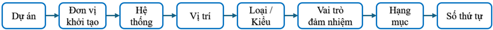

- -Các b ảng mã quy đị nh d ữ li ệu các trườ ng cho quy t ắc đặ t tên do Ch ủ đầu tư cung c ấp các mã cơ bả n. B ả ng mã hi ệ u s ẽ được đượ c c ậ p nh ậ t b ổ sung trong quá trình tri ể n khai d ự án:
- -Các trường đặ t tên t ệ p tin:
- -S ố lượ ng ký t ự trong các trườ ng thông tin c ần đượ c th ố ng nh ấ t l ự a ch ọ n c ố đị nh và s ử d ụ ng trong su ố t th ờ i gian th ự c hi ệ n d ự án.
- Dự án: Thông thường Mã dự án được lấy từ các Ký tự đầu của tên dự án, ví dụ:
- Đơn vị khởi tạo: Mã Đơn vị được lấy từ các Ký tự đầu của tên công ty hoặc tên viết tắt của công ty, ví dụ:

| Trường          | Từ tiếng Anh     | Yêu cầu   | Số ký tự   |
|-----------------|------------------|-----------|------------|
| Dự án           | Project          | Bắt buộc  | 2-5        |
| Đơn vị khởi tạo | Originator       | Bắt buộc  | 2-5        |
| Hệ thống        | Volume or system | Bắt buộc  | 2-6        |
| Vị trí          | Location         | Bắt buộc  |            |
| Loại/ Kiểu      | Type             | Bắt buộc  | 2-5        |
| Vai trò         | Role             | Bắt buộc  | 1-2        |
| Hạng mục        | Category         | Tùy chọn  |            |
| Số thứ tự       | Type             | Tùy chọn  |            |
| Trạng thái      | Suitability      | Tùy chọn  |            |
| Hiệu chỉnh      | Revision         | Tùy chọn  |            |

Bảng 1 -2. Trườ ng mã d ự án trong quy t ắc đặ t tên

| Mã hiệu   | Dự án                                                                                                                       |
|-----------|-----------------------------------------------------------------------------------------------------------------------------|
| HTM       | Dự án đầu tư xây dựng mở rộng đường cao tốc Thành phố Hồ Chí Minh - Trung Lương - Mỹ Thuận theo phương thức đối tác công tư |


PH Ụ L Ụ C BEP

Bảng 1 -3. Trường đơn vị kh ở i t ạ o trong quy t ắc đặ t tên

| Mã hiệu   | Đơn vị khởi tạo                     |
|-----------|-------------------------------------|
| A2Z       | Công ty Cổ phần Tư vấn Xây dựng A2Z |

- Hệ thống:

Các mã tiêu chuẩn sau nên được áp dụng:

Bảng 1 -4. Trườ ng h ệ th ố ng trong quy t ắc đặ t tên

|   STT | Mã hiệu   | Khối tích/ Hệ thống              | Từ tiếng Anh                    |
|-------|-----------|----------------------------------|---------------------------------|
|     1 | AR        | Ki ế n trúc                      | Architectural                   |
|     2 | BR        | C ầ u                            | Bridge                          |
|     3 | STC       | Công trình h ầ m                 | Subsurface Tunnel construction  |
|     4 | DRS       | H ệ th ống thoát nướ c           | Drainage system                 |
|     5 | RW        | Tườ ng ch ắ n                    | Retaining Wall                  |
|     6 | CS        | H ệ th ố ng thông tin liên l ạ c | Communication systems           |
|     7 | ES        | H ệ th ố ng c ấp điệ n           | Electricity distribution system |
|     8 | LIS       | H ệ th ố ng chi ế u sáng         | Lighting systems                |
|     9 | ME        | H ệ cơ điệ n                     | Mechanical and Electrical       |
|    10 | RS        | Đườ ng ho ặc đườ ng ph ố         | Road or street                  |
|    11 | RWS       | H ệ th ống thoát nước mưa        | Rain water system               |
|    12 | ST        | K ế t c ấ u                      | Structural                      |
|    13 | TE        | Đị a hình                        | Terrain                         |
|    14 | WSS       | H ệ th ố ng c ấp nướ c           | Water supply system             |
|    15 | WWS       | H ệ th ống thoát nướ c th ả i    | Waste water system              |
|    16 | LC        | C ả nh quan                      | Lanscape                        |
|    17 | TS        | An toàn giao thông               | Traffic safety                  |


PH Ụ L Ụ C BEP

|   STT | Mã hiệu   | Khối tích/ Hệ thống                        | Từ tiếng Anh                      |
|-------|-----------|--------------------------------------------|-----------------------------------|
|    18 | RST       | Tr ạ m d ừ ng ngh ỉ                        | Rest Stop                         |
|    19 | WIM       | Tr ạ m ki ể m tra t ả i tr ọ ng xe (KTTTX) | Weight-in-Motion                  |
|    20 | TOL       | Tr ạ m thu phí                             | Toll Plaza                        |
|    21 | ITS       | H ệ th ố ng ITS                            | Intelligent Transportation System |
|    22 | MVS       | H ệ th ố ng trung th ế và tr ạ m bi ế n áp | Medium-Voltage Substations System |
|    23 | TMS       | Trung tâm qu ản lý điề u hành giao thông   | Traffic Management Center         |
|    24 | GEN       | Ph ầ n chung                               | General                           |

- Vị trí: Ghi tên đoạn lý trình đối với đường giao thông/ hệ thống thoát nước mưa/ hệ thống thoát nước thải. Với cầu/ cống ngang/ hầm chui đặt theo tên gọi địa phương, nếu không có tên gọi theo địa phương thì ghi tên theo lý trình.. Ngoài ra có thể sử dụng các mã sau nếu gắn với đối tượng không xác định:

Bảng 1 -5. Trườ ng V ị trí trong quy t ắc đặ t tên

|   STT | Mã hiệu   | Hệ thống                                | Từ tiếng Anh                    |
|-------|-----------|-----------------------------------------|---------------------------------|
|     1 | ZZ        | Nhiều vị trí/cao trình                  | Multiple levels / locations     |
|     2 | XX        | Không áp dụng cho vị trí/ cao trình nào | No levels / location applecable |

- Loại/ Kiểu: Trường này mô tả về loại kiểu của tệp tin:


Bảng 1 -6. Trườ ng Lo ạ i/ Ki ể u trong quy t ắc đặ t tên

|   STT | Mã hiệu   | Loại / Kiểu                                   | Từ tiếng Anh                         |
|-------|-----------|-----------------------------------------------|--------------------------------------|
|     1 | M3        | Mô hình 3D                                    | 3D Model                             |
|     2 | M2        | Mô hình 2D                                    | 2D Model                             |
|     3 | DR        | Bản vẽ 2D                                     | 2D Drawing                           |
|     4 | CA        | Tính toán                                     | Calculations                         |
|     5 | DB        | Cơ sở dữ liệu                                 | Database                             |
|     6 | MR        | Mô hình phục vụ các nội dung áp dụng BIM khác | Model rendition for other renditions |
|     7 | MS        | Biện pháp                                     | Method statement                     |
|     8 | PP        | Thuyết minh                                   | Presentation                         |
|     9 | RI        | Yêu cầu thông tin                             | Request for information              |
|    10 | RP        | Báo cáo                                       | Report                               |
|    11 | SH        | Bảng tiến độ                                  | Schedule                             |
|    12 | SP        | Chỉ dẫn kỹ thuật                              | Specification                        |
|    13 | SU        | Khảo sát địa hình, địa chất                   | Survey                               |
|    14 | MI        | Biên bản/ ghi chú                             | Minutes / Action notes               |
|    15 | IE        | Tập tin trao đổi thông tin                    | Information exchange file            |
|    16 | HS        | An toàn lao động                              | Health and safety                    |
|    17 | FN        | Chú thích tập tin                             | File note                            |
|    18 | CP        | Kế hoạch chi phí                              | Cost plan                            |
|    19 | AF        | Hình ảnh động                                 | Animation file (of a model)          |
|    20 | VS        | Trực quan hóa                                 | Visualization                        |

Lưu ý: Các mã mô tả có thể được mở rộng theo dự án.

- Vai trò: Các mã tiêu chuẩn sau nên được áp dụng:


PH Ụ L Ụ C BEP

Bảng 1 -7. Trườ ng Vai trò trong quy t ắc đặ t tên

|   STT | Mã hiệu   | Vai trò                               | Từ tiếng Anh                   |
|-------|-----------|---------------------------------------|--------------------------------|
|     1 | A         | Kiến trúc sư                          | Architect                      |
|     2 | B         | Giám sát công trình                   | Building Surveyor              |
|     3 | C         | Kỹ sư xây dựng                        | Civil Engineer                 |
|     4 | D         | Kỹ sư thoát nước, Kỹ sư đường cao tốc | Drainage, Highways Engineer    |
|     5 | E         | Kỹ sư điện                            | Electrical Engineer            |
|     6 | F         | Quản lý cơ sở vật chất                | Facilities Manager             |
|     7 | G         | Khảo sát địa chất và địa hình         | Geographical and Land Surveyor |
|     8 | K         | Chủ đầu tư                            | Client/Owner                   |
|     9 | L         | Kiến trúc sư cảnh quan                | Landscape Architect            |
|    10 | M         | Kỹ sư cơ điện                         | Mechanical-Electrical Engineer |
|    11 | P         | Kỹ sư an toàn lao động                | Pubic Health Engineer          |
|    12 | Q         | Kỹ sư dự toán                         | Quantity Surveyor              |
|    13 | S         | Kỹ sư kết cấu                         | Structural Engineer            |
|    14 | T         | Kỹ sư quy hoạch                       | Town and Country Planner       |
|    15 | W         | Nhà thầu                              | Contractor                     |
|    16 | X         | Nhà thầu phụ                          | Subcontractor                  |
|    17 | Y         | Chuyên gia thiết kế                   | Specialist Designer            |


PH Ụ L Ụ C BEP

ÁP D Ụ NG MÔ HÌNH THÔNG TIN CÔNG TRÌNH (BIM) -GIAI ĐOẠ N THI Ế T K Ế K Ỹ THU Ậ T

PH Ụ L Ụ C BEP

|   STT | Mã hiệu   | Vai trò                  | Từ tiếng Anh                 |
|-------|-----------|--------------------------|------------------------------|
|    18 | Z         | Chung (không gán bộ môn) | General (non - disciplinary) |

Lưu ý: Các mã Vai trò có thể được mở rộng theo dự án.

- Hạng mục: Các hạng mục dưới nên được áp

dụng:

Bảng 1 -8. Trườ ng h ạ ng m ụ c trong quy t ắc đặ t tên

|   STT | Mã hiệu   | Hạng mục                                 | Từ Tiếng Anh               |
|-------|-----------|------------------------------------------|----------------------------|
|     1 | Cor       | Mô hình n ề n m ặt đườ ng                | Corridor                   |
|     2 | SurE      | B ề m ặ t t ự nhiên                      | Surface - Exitsting Ground |
|     3 | SurG      | B ề m ặt đị a ch ấ t                     | Surface-Geological         |
|     4 | SurD      | B ề m ặ t thi ế t k ế                    | Surface-Degisn             |
|     5 | PRO       | Tr ắ c d ọc đườ ng                       | Profile                    |
|     6 | HPRO      | Tr ắc ngang đườ ng                       | Horizontal profile         |
|     7 | DS        | Thoát nước mưa                           | Drainage System            |
|     8 | DC        | Kênh thoát nướ c                         | Drainage Canal             |
|     9 | SS        | Thoát nướ c th ả i                       | Sewwage System             |
|    10 | DB        | H ồ điề u hòa                            | Detension Basin            |
|    11 | SUB       | K ế t c ấ u ph ần dướ i công trình c ầ u | Substructure               |
|    12 | SUP       | K ế t c ấ u ph ầ n trên công trình c ầ u | Superstructure             |
|    13 | MIS       | K ế t c ấ u khác công trình c ầ u        | Miscellanoues Structure    |
|    14 | BHR       | Đường đầ u c ầ u                         | Bridge-Head Road           |
|    15 | CM        | Bi ệ n pháp thi công                     | Construction Method        |
|    16 | TU        | H ầ m                                    | Tunel                      |


ÁP D Ụ NG MÔ HÌNH THÔNG TIN CÔNG TRÌNH (BIM) -GIAI ĐOẠ N THI Ế T K Ế K Ỹ THU Ậ T

PH Ụ L Ụ C BEP

|   STT | Mã hiệu   | Hạng mục                           | Từ Tiếng Anh            |
|-------|-----------|------------------------------------|-------------------------|
|    17 | UN        | H ầ m chui                         | Underpass               |
|    18 | CU        | C ố ng                             | Culvert                 |
|    19 | PCU       | C ố ng tròn                        | Pipe Culvert            |
|    20 | BCU       | C ố ng h ộ p                       | Box Culvert             |
|    21 | MH        | H ố ga                             | Manhole                 |
|    22 | PL        | V ạch sơn                          | Paint Line              |
|    23 | TRS       | Bi ể n báo                         | Traffic Sign            |
|    24 | MS        | D ả i phân cách                    | Median Strip            |
|    25 | AGN       | Lướ i ch ố ng chói                 | Anti-Glare Net          |
|    26 | GUA       | H ộ lan                            | Guardrail               |
|    27 | PK        | C ọ c tiêu                         | Picket                  |
|    28 | FE        | Hàng rào                           | Fence                   |
|    29 | NW        | Tườ ng ch ố ng ồ n                 | Noise Wall              |
|    30 | RST       | Tr ạ m d ừ ng ngh ỉ                | Rest Stop               |
|    31 | TR        | Cây xanh                           | Tree                    |
|    32 | PS        | Tr ạ m bi ế n áp                   | Power Station           |
|    33 | PreBEP    | K ế ho ạ ch th ự c hi ện BIM sơ bộ | Pre- BIM Execution Plan |
|    34 | BEP       | K ế ho ạ ch th ự c hi ệ n BIM      | BIM Execution Plan      |
|    35 | COM       | Mô hình ph ố i h ợ p               | Coordinate Model        |
|    36 | BIMR      | Báo cáo BIM                        | Bim Report              |
|    37 | CR        | Báo cáo xung độ t                  | Clashcheck Report       |


PH Ụ L Ụ C BEP

|   STT | Mã hiệu   | Hạng mục         | Từ Tiếng Anh     |
|-------|-----------|------------------|------------------|
|    38 | VO        | Bảng khối lượng  | Volume           |
|    39 | SV        | Film di ễ n ho ạ | Simulation Video |
|    40 | ZZ        | Ph ầ n chung     | General          |

Lưu ý: Các mã Hạng mục có thể được mở rộng theo dự án.

## · Số thứ tự:

- -Trường số thứ tự cần được gán cho mỗi vùng chứa thông tin khi nó nằm trong một chuỗi, không phân biệt bởi bất kỳ một trường nào khác.
- -Việc đánh số để mã hoá cần được quy định trong tiêu chuẩn thông tin của dự án và nó nên có độ dài từ 4 -6 chữ số nguyên.
- -Các số 0 đứng đầu nên được sử dụng và chú ý không thể hiện các thông tin có trong các trường khác.

## · [Trạng thái] [Hiệu chỉnh]

- -Các nguyên t ắc sau đây không áp dụng đố i v ớ i các t ệ p tin/ File thi ế t k ế ch ứ a d ữ li ệu được dùng để chia s ẻ thành d ữ li ệu đầ u vào cho các n ộ i dung công vi ệ c khác để tránh trườ ng h ợp khi thay đổ i tên file thì liên k ế t d ữ li ệ u b ị m ấ t.

Bảng 1 -9. Trườ ng tr ạ ng thái hi ệ u ch ỉ nh trong quy t ắc đặ t tên

| Trạng thái                         | Mô tả                                                                                                                                                    | Hiệu chỉnh                          | Dữ liệu đồ họa   |
|------------------------------------|----------------------------------------------------------------------------------------------------------------------------------------------------------|-------------------------------------|------------------|
| Công việc Đang Tiến hành           | Công việc Đang Tiến hành                                                                                                                                 |                                     |                  |
| S0                                 | Vùng chia sẻ nội bộ trong bộ phận thực hiện BIM Thông tin, dữ liệu đang được phát triển và chưa phù hợp để chia sẻ ra bên ngoài nhóm thực hiện nhiệm vụ. | <A2>P0.0 v.v. đến P0n.0n v.v. </A2> | ✓                |
| Chia sẻ (Không có giá trị pháp lý) | Chia sẻ (Không có giá trị pháp lý)                                                                                                                       |                                     |                  |


ÁP D Ụ NG MÔ HÌNH THÔNG TIN CÔNG TRÌNH (BIM) -GIAI ĐOẠ N THI Ế T K Ế K Ỹ THU Ậ T

PH Ụ L Ụ C BEP

| Trạng thái                                                                                                                | Mô tả                                                                                                                         | Hiệu chỉnh                                                                                                                | Dữ liệu đồ họa                                                                                                            |
|---------------------------------------------------------------------------------------------------------------------------|-------------------------------------------------------------------------------------------------------------------------------|---------------------------------------------------------------------------------------------------------------------------|---------------------------------------------------------------------------------------------------------------------------|
| S1                                                                                                                        | Phù hợp cho phối hợp. File sẵn sàng 'cho chia sẻ' và được sử dụng bởi các bộ môn khác như là thông tin nền.                   | <A2> P01 đến P0n </A2>                                                                                                    | ✓                                                                                                                         |
| S2                                                                                                                        | Phù hợp để thông báo thông tin                                                                                                | <A2> P01 đến P0n </A2>                                                                                                    | ✗                                                                                                                         |
| S3                                                                                                                        | Phù hợp cho rà soát lại và cho ý kiến                                                                                         | <A2> P01 đến P0n </A2>                                                                                                    | Như yêu cầu                                                                                                               |
| S4                                                                                                                        | Phù hợp cho phê duyệt giai đoạn. Các bên tham gia phải chịu trách nhiệm pháp lý về nội dung trong phạm vi thông tin của mình. | <A2> P01 đến P0n </A2>                                                                                                    | ✗                                                                                                                         |
| S6                                                                                                                        | Phù hợp để thông qua mô hình thông tin dự án (PIM - Project information model)                                                | P01 đến Pnn                                                                                                               | ✗                                                                                                                         |
| S7                                                                                                                        | Phù hợp để thông qua mô hình thông tin tài sản (AIM - Asset information model)                                                | P01 đến Pnn                                                                                                               | ✗                                                                                                                         |
| Từ khu vực Công việc Đang Tiến hành sang Phát hành Chưa được chấp thuận và (không có giá trị pháp ly) rủi ro khi sử dụng. | Từ khu vực Công việc Đang Tiến hành sang Phát hành Chưa được chấp thuận và (không có giá trị pháp ly) rủi ro khi sử dụng.     | Từ khu vực Công việc Đang Tiến hành sang Phát hành Chưa được chấp thuận và (không có giá trị pháp ly) rủi ro khi sử dụng. | Từ khu vực Công việc Đang Tiến hành sang Phát hành Chưa được chấp thuận và (không có giá trị pháp ly) rủi ro khi sử dụng. |
| D1                                                                                                                        | Phù hợp cho Dự toán                                                                                                           | <A2>P01.01 v.v. đến P0n.0n </A2>                                                                                          | ✓                                                                                                                         |
| D2                                                                                                                        | Phù hợp cho Đấu thầu                                                                                                          | <A2>P01.01 v.v. đến P0n.0n </A2>                                                                                          | ✗                                                                                                                         |
| D3                                                                                                                        | Phù hợp cho thiết kế thi công                                                                                                 | <A2>P01.01 v.v. đến P0n.0n </A2>                                                                                          | ✓                                                                                                                         |
| D4                                                                                                                        | Phù hợp cho Sản xuất/Mua sắm                                                                                                  | <A2>P01.01 v.v. đến P0n.0n </A2>                                                                                          | ✗                                                                                                                         |
| PHÁT HÀNH TÀI LIỆU (có giá trị pháp lý)                                                                                   | PHÁT HÀNH TÀI LIỆU (có giá trị pháp lý)                                                                                       |                                                                                                                           |                                                                                                                           |


ÁP D Ụ NG MÔ HÌNH THÔNG TIN CÔNG TRÌNH (BIM) -GIAI ĐOẠ N THI Ế T K Ế K Ỹ THU Ậ T

PH Ụ L Ụ C BEP

| Trạng thái                                    | Mô tả                                                                                                                                                                                                                               | Hiệu chỉnh             | Dữ liệu đồ họa   |
|-----------------------------------------------|-------------------------------------------------------------------------------------------------------------------------------------------------------------------------------------------------------------------------------------|------------------------|------------------|
| A1, A2, A3                                    | Chấp thuận và thừa nhận hoàn thành giai đoạn: A1 là bước lập BCNCTKT A2 là bước Lập BCNCKT A3 là bước TKKT …                                                                                                                        | C01 đến C0n            | ✓                |
| B1, B2, B3, Bn etc                            | Ký duyệt từng phần: với một vài nhận xét nhỏ từ Khách hàng. Tất cả các nhận xét nhỏ phải được đánh dấu bằng đám mây và chú giải 'tạm hoãn' cho đến khi các nhận xét này được giải quyết và đệ trình lại để được chấp thuận toàn bộ. | P01.01 v.v. đến P0n.0n | ✓                |
| Phát hành cho Mô hình Thông tin Tài sản (AIM) | Phát hành cho Mô hình Thông tin Tài sản (AIM)                                                                                                                                                                                       |                        |                  |

##  Ví dụ:

## · Ở trạng thái công việc đang tiến hành:

- -[S0][P0.0] :File trong công việc đang tiến hành, chưa hiệu chỉnh và sửa đổi.
- -[S0][P1.2]:File trong công việc đang tiến hành, hiệu chỉnh lần 1 và sửa đổi lần 2.
- -[S0][P3.1]:File trong công việc đang tiến hành, hiệu chỉnh lần 3 và sửa đổi lần 1.

## · Ở trạng thái chia sẻ:

## S1: Ph ố i h ợ p

- -[S1][P01] : File phối hợp trong khu vực chia sẻ, chưa hiệu chỉnh.
- -[S1][P02] : File phối hợp trong khu vực chia sẻ , đã hiệu chỉnh lần 2 .
- -[S1][P03] : File phối hợp trong khu vực chia sẻ , đã hiệu chỉnh lần 3 .

## S2: Thông báo thông tin

- -[S2][P01] : File thông báo thông tin trong khu vực chia sẻ, chưa hiệu chỉnh.
- -[S2][P02] : File thông báo thông tin trong khu vực chia sẻ , đã hiệu chỉnh lần 2 .
- -[S2][P03] : File thông báo thông tin trong khu vực chia sẻ , đã hiệu chỉnh lần 3 .


## S3: Rà soát và cho ý ki ế n

- -[S3][P01] : File rà soát và cho ý kiến trong khu vực chia sẻ, chưa hiệu chỉnh.
- -[S3][P02] : File rà soát và cho ý kiến trong khu vực chia sẻ, đã hiệu chỉnh lần 2.
- -[S3][P03] : File rà soát và cho ý kiến trong khu vực chia sẻ, đã hiệu chỉnh lần 3.

## S4: Phê duy ệt giai đoạ n

- -[S4][P01] : File phê duyệt giai đoạn trong khu vực chia sẻ, chưa hiệu chỉnh.
- -[S4][P02] : File phê duyệt giai đoạn trong khu vực chia sẻ, đã hiệu chỉnh lần 2.
- -[S4][P03] : File phê duyệt giai đoạn trong khu vực chia sẻ, đã hiệu chỉnh lần 3.

## S6: Qu ả n lý thông tin d ự án:

- -Là mô hình thông tin được phát triển trong suốt giai đoạn thiết kế và thi công của 1 dự án

## S7: Thông tin tài s ả n

- -Là mô hình thông tin được duy trì cho việc quản lý, bảo trì và hận hành tài sản
- Ở trạng thái phát hành: Chưa được chấp thuận và không có giá trị pháp lý rủi ro khi sử dụng

## D1: Cho d ự toán

- -[D1][P01] : File cho dự toán trong khu vực phát hành, chưa hiệu chỉnh.
- -[D1][P02] : File cho dự toán trong khu vực phát hành, đã hiệu chỉnh lần 2.
- -[D1][P03] : File cho dự toán trong khu vực phát hành, đã hiệu chỉnh lần 3.

## D2: Cho đấ u th ầ u

- -[D2][P01] : File cho đấu thầu trong khu vực phát hành, chưa hiệu chỉnh.
- -[D2][P02] : File cho đấu thầu trong khu vực phát hành, đã hiệu chỉnh lần 2.
- -[D2][P03] : File cho đấu thầu trong khu vực phát hành, đã hiệu chỉnh lần 3.

## D3: Cho thi ế t k ế thi công


- -[D3][P01] : File cho thiết kế thi công khu vực phát hành, chưa hiệu chỉnh.
- -[D3]]P02] : File cho thiết kế thi công khu vực phát hành, đã hiệu chỉnh lần 2.
- -[D3][P03] : File cho thiết kế thi công khu vực phát hành, đã hiệu chỉnh lần 3.

## D4: Cho s ả n xu ấ t và mua hàng

- -[D4][P01] : File cho sản xuất và mua hàng trong phát hành, chưa hiệu chỉnh.
- -[D4][P02] : File cho sản xuất và mua hàng phát hành, đã hiệu chỉnh lần 2.
-  Ví dụ về đặt tệp tin/ mô hình :

## HTM-A-BR-KM28+950-M3-D-ZZ-0001

- -Dự án: HTM Dự án đầu tư xây dựng mở rộng đường cao tốc Thành phố Hồ Chí Minh Trung Lương -Mỹ Thuận theo phương thức đối tác công tư ;
- -Đơn vị khởi tạo: A -Công ty tư vấn xây dựng A;
- -Hệ thống: BR Công trình Cầu;
- -Vị trí: Km28+950 -Cầu vượt tại vị trí Km28+950;
- -Loại/ Kiểu: M3 mô hình 3D;
- -Vai trò: Vai trò: D -Kỹ sư đường cao tốc;
- -Hạng mục: ZZ Bố trí chung cầu;
- -Số thứ tự: 0001 ;
- -Trạng thái, hiệu chỉnh : theo bảng 1.9.

## HTM-A-RS-KM1+000-KM10+000-M3-D-COR-0001

- -Dự án: HTM Dự án đầu tư xây dựng mở rộng đường cao tốc Thành phố Hồ Chí Minh Trung Lương -Mỹ Thuận theo phương thức đối tác công tư ;
- -Đơn vị khởi tạo: A -Công ty tư vấn xây dựng A;
- -Hệ thống: RS -Công trình hạng mục đường;
- -Vị trí: Km1+000 -Km10+000 -Đoạn tuyến n từ Km1+000 đến Km10+000;
- -Loại/ Kiểu: M3 mô hình 3D;


- -Vai trò: D -Kỹ sư đường cao tốc ;
- -Hạng mục: COR Mô hình nền mặt đường;
- -Số thứ tự: 0001 ;
- -Trạng thái, hiệu chỉnh : theo bảng 1.9.

## HTM-A-TS-KM1+000-KM10+000-M3-D-PL-0001

- -Dự án: HTM Dự án đầu tư xây dựng mở rộng đường cao tốc Thành phố Hồ Chí Minh Trung Lương -Mỹ Thuận theo phương thức đối tác công tư ;
- -Đơn vị khởi tạo: A -Công ty tư vấn xây dựng A;
- -Hệ thống: TS - An toàn giao thông;
- -Vị trí: Km1+000÷Km10+000 Đoạn tuyến n từ Km1+000 đến Km10+000;
- -Loại/ Kiểu: M3 mô hình 3D;
- -Vai trò: D -Kỹ sư đường cao tốc ;
- -Hạng mục: PL Bố trí vạch sơn;
- -Số thứ tự: 0001 ;
- -Trạng thái, hiệu chỉnh : theo bảng 1.9.

## HTM-A-DRA-KM33+690\_2x2-M3-D-BCU-0001

- -Dự án: HTM Dự án đầu tư xây dựng mở rộng đường cao tốc Thành phố Hồ Chí Minh Trung Lương -Mỹ Thuận theo phương thức đối tác công tư ;
- -Đơn vị khởi tạo: A -Công ty tư vấn xây dựng A;
- -Hệ thống: DRA Hệ thống thoát nước;
- -Vị trí: Km33+690 \_2x2  -Cống nằm tại vị trí Km33+690, cống hộp 2x2
- -Vai trò: Vai trò: D -Kỹ sư đường cao tốc;
- -Loại/ Kiểu: M3 Mô hình 3D;
- -Hạng mục: BCUCống hộp;
- -Số thứ tự: 0001 ;


- -Trạng thái, hiệu chỉnh : theo bảng 1.9.

## 1.5. TÊN C Ấ U KI Ệ N

- -C ấu trúc đặ t tên c ấ u ki ệ n th ố ng nh ất như sau:
- Mô tả: Trường mô tả là trường không bắt buộc, thể hiện tên chi tiết của cấu kiện (cầu, cống, hầm...). Trường mô tả được viết in hoa, liền không dấu.

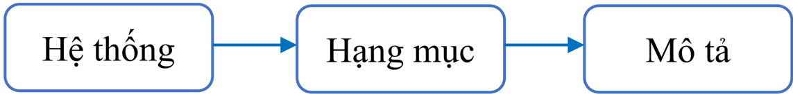

- Hệ thống : Tương tự như Quy tắc đặt tên tệp tin

- Hạng mục: Tương tự như Quy tắc đặt tên tệp tin

Bảng 1 -10. Ví d ụ quy t ắ c đặ t tên c ấ u ki ệ n

| Hệ thống   | Hạng mục                                                                                                | Mô tả                                                                                                   |
|------------|---------------------------------------------------------------------------------------------------------|---------------------------------------------------------------------------------------------------------|
| x          | x                                                                                                       | X                                                                                                       |
| Ví dụ      | BR-SUB-BE_MO - B ệ m ố DRS-BCU-THAN_CONG - Thân c ố ng 1x2.0x2.0 STC-UN-TUONG_CANH_HAM - Tường cánh hầm | BR-SUB-BE_MO - B ệ m ố DRS-BCU-THAN_CONG - Thân c ố ng 1x2.0x2.0 STC-UN-TUONG_CANH_HAM - Tường cánh hầm |


PH Ụ L Ụ C BEP

Bảng 1 -11. B ảng đặ t tên c ấ u ki ệ n h ạ ng m ụ c c ầ u

| STT   | HẠNG MỤC                  | TÊN CẤU KIỆN/FAMILY         | ĐỐI TƯỢNG / MÔ TẢ             |
|-------|---------------------------|-----------------------------|-------------------------------|
| I     | HẠNG MỤC ĐƯỜNG GIAO THÔNG | HẠNG MỤC ĐƯỜNG GIAO THÔNG   | HẠNG MỤC ĐƯỜNG GIAO THÔNG     |
| 1     | ĐƯỜNG GIAO THÔNG          | RS-SurE- TC_LTĐẦ U_LTCU Ố I | B ề m ặ t t ự nhiên           |
| 2     | ĐƯỜNG GIAO THÔNG          | RS-COR- TC_LTĐẦ U_LTCU Ố I  | Mô hình tuy ế n chính         |
| 3     | ĐƯỜNG GIAO THÔNG          | RS-COR- DGP_LTĐẦ U_LTCU Ố I | Mô hình đườ ng gom ph ả i     |
| 4     | ĐƯỜNG GIAO THÔNG          | RS-COR- DGT_LTĐẦ U_LTCU Ố I | Mô hình đườ ng gom trái       |
| 5     | ĐƯỜNG GIAO THÔNG          | RS-PRO- TC_LTĐẦ U_LTCU Ố I  | Tr ắ c d ọ c tuy ế n chính    |
| 6     | ĐƯỜNG GIAO THÔNG          | RS-PRO- DGP_LTĐẦ U_LTCU Ố I | Tr ắ c d ọc đườ ng gom ph ả i |
| 7     | ĐƯỜNG GIAO THÔNG          | RS-PRO- DGT_LTĐẦ U_LTCU Ố I | Tr ắ c d ọc đườ ng gom trái   |
| 8     | ĐƯỜNG GIAO THÔNG          | …                           | …                             |
| II    | HẠNG MỤC CẦU              | HẠNG MỤC CẦU                | HẠNG MỤC CẦU                  |
| 1     | MỐ                        | BR-SUB-BE_TONG_DEM          | Bê tông đệ m m ố              |
| 1     | MỐ                        | BR-SUB-BE_MO                | B ệ m ố                       |
| 1     | MỐ                        | BR-SUB-THAN_MO              | Thân m ố                      |
| 1     | MỐ                        | BR-SUB-TUONG_CANH           | Tườ ng cánh                   |
| 2     | BẢN QUÁ ĐỘ                | BR-SUB-BAN_QUA_DO           | B ản quá độ                   |
| 3     | CỌC                       | BR-SUB-COC_DUL              | C ọc DƯL                      |
| 3     | CỌC                       | BR-SUB-COC_KHOAN_NHOI       | C ọ c khoan nh ồ i            |
| 4     | TRỤ                       | BR-SUB-BE_TONG_DEM          | Bê tông đệ m tr ụ             |
| 4     | TRỤ                       | BR-SUB-BE_TRU               | B ệ tr ụ                      |
| 4     | TRỤ                       | BR-SUB-THAN_TRU             | Thân tr ụ                     |
| 4     | TRỤ                       | BR-SUB-XA_MU                | Xà mũ trụ                     |
| 5     | DẦM CHỦ                   | BR-SUP-DAM_SPT              | D ầ m SuperT                  |
| 5     | DẦM CHỦ                   | BR-SUP-DAM_I33              | D ầ m I33                     |
| 5     | DẦM CHỦ                   | BR-SUP-DAM_I24.54           | D ầ m I24.54                  |
| 5     | DẦM CHỦ                   | BR-SUP-DAM_I18.6            | D ầ m I18.6                   |
| 5     | DẦM CHỦ                   | BR-SUP-DAM_I12.5            | D ầ m I12.5                   |
| 5     | DẦM CHỦ                   | BR-SUP-DAM_T20              | D ầ m T20                     |
| 5     | DẦM CHỦ                   | BR-SUP-DAM_T21              | D ầ m T21                     |


| STT   | HẠNG MỤC                    | TÊN CẤU KIỆN/FAMILY           | ĐỐI TƯỢNG / MÔ TẢ         |
|-------|-----------------------------|-------------------------------|---------------------------|
| 6     | BẢN MẶT CẦU                 | BR-SUP-BAN_MAT_CAU            | B ả n m ặ t c ầ u         |
| 7     | LỚP PHỦ MẶT CẦU             | BR-SUP-LOP_PHU                | L ớ p ph ủ m ặ t c ầ u    |
| 8     | BỆ ĐỠ CỘT ĐÈN               | BR-MIS-BE_DEN                 | B ệ đỡ c ột đèn           |
| 9     | LAN CAN                     | BR-MIS-GO_LAN_CAN             | G ờ lan can c ầ u         |
| 9     | LAN CAN                     | BR-MIS-LAN_CAN                | Lan can c ầ u             |
| 10    | DPC                         | BR-MIS-DAI_PHAN_CACH          | D ả i phân cách           |
| 11    | SÀN GIẢM TẢI                | BR-MIS-SAN_GIAM_TAI           | Sàn gi ả m t ả i          |
| 12    | TỨ NÓN                      | BR-MIS-TU_NON                 | T ứ nón                   |
| III   | HẠNG MỤC CỐNG NGANG ĐƯỜNG   |                               |                           |
| 1     | CỐNG NGANG ĐƯỜNG            | DRS-BCU/PCU_BE_TONG_DEM       | Bê tông đệ m              |
| 1     | CỐNG NGANG ĐƯỜNG            | DRS-BCU/PCU_-DA_DAM_DEM       | Đá dăm đệ m               |
| 1     | CỐNG NGANG ĐƯỜNG            | DRS-BCU/PCU_CHAN_KHAY         | Chân khay                 |
| 1     | CỐNG NGANG ĐƯỜNG            | DRS-BCU/PCU_THAN_CONG         | Thân c ố ng               |
| 1     | CỐNG NGANG ĐƯỜNG            | DRS-BCU/PCU_TUONG_DAU         | Tường đầ u                |
| 1     | CỐNG NGANG ĐƯỜNG            | DRS-BCU/PCU_TUONG_CANH        | Tườ ng cánh               |
| 1     | CỐNG NGANG ĐƯỜNG            | DRS-BCU/PCU_SAN_CONG          | Sân c ố ng                |
| 1     | CỐNG NGANG ĐƯỜNG            | DRS-BCU/PCU_KHAUDO-GIA_CO_MAI | Gia c ố mái               |
| 1     | CỐNG NGANG ĐƯỜNG            | DRS-BCU/PCU_BAN_QUA_DO        | B ản quá độ               |
| IV    | HẠNG MỤC HẦM CHUI           |                               |                           |
| 1     | HẦM CHUI                    | STC-UN_COC_BTCT               | C ọ c BTCT                |
| 2     | HẦM CHUI                    | STC-UN_BE_TONG_DEM            | Bê tông đệ m              |
| 2     | HẦM CHUI                    | STC-UN_DOT_HAM                | Đố t h ầm H…              |
| 4     | HẦM CHUI                    | STC-UN_BAN_QUA_DO             | B ản quá độ               |
| 5     | HẦM CHUI                    | STC-UN_TUONG_CANH_HAM         | Tườ ng cánh h ầ m         |
| 6     | HẦM CHUI                    | STC-UN_MUI_LUYEN              | Bê tông l ớ p mui luy ệ n |
| 7     | HẦM CHUI                    | STC-UN_GO_LAN_CAN             | G ờ lan can               |
| 8     | HẦM CHUI                    | STC-UN_TU_NON                 | T ứ nón                   |
| V     | HẠNG MỤC AN TOÀN GIAO THÔNG |                               |                           |
| 1     | AN TOÀN GIAO THÔNG          | TS-ZZ-PL                      | V ạch sơn                 |


| STT   | HẠNG MỤC                                  | TÊN CẤU KIỆN/FAMILY                            | ĐỐI TƯỢNG / MÔ TẢ                                                |
|-------|-------------------------------------------|------------------------------------------------|------------------------------------------------------------------|
|       | …                                         | TS-ZZ-TS                                       | Bi ể n báo                                                       |
|       | …                                         | TS-ZZ-GUA                                      | H ộ lan                                                          |
|       | …                                         | TS-ZZ-AGN                                      | Lướ i ch ố ng chói                                               |
|       | …                                         | TS-ZZ-MS                                       | D ả i phân cách                                                  |
|       | …                                         | TS-ZZ-PK                                       | C ọ c tiêu                                                       |
|       | …                                         |                                                | …                                                                |
| VI    | HẠNG MỤC HỆ THỐNG CHIẾU SÁNG -ITS-ETC-WIM | HẠNG MỤC HỆ THỐNG CHIẾU SÁNG -ITS-ETC-WIM      | HẠNG MỤC HỆ THỐNG CHIẾU SÁNG -ITS-ETC-WIM                        |
| 1     | THỐNG CHIẾU SÁNG                          | LIS-ZZ-LF_COT_DEN_CHIEU_SANG_10M_MC10_LED-130W | Cột đèn chiếu sáng 10m trên móng cột MC10, lắp 1 đèn LED -130w   |
| 1     | THỐNG CHIẾU SÁNG                          | LIS-ZZ-LF_COT_DEN_CHIEU_SANG_10M_MCC_LED-130W  | Cột đèn chiếu sáng 10m cần đơn đặt trên cầu, lắp 1 đèn LED -130w |
| 1     | THỐNG CHIẾU SÁNG                          | LIS-ZZ-LF_COT_DEN_CHIEU_SANG_12M_MC12_LED-120W | Cột đèn chiếu sáng 12m trên móng cột MC12, lắp 1 đèn LED -120w   |
| 1     | THỐNG CHIẾU SÁNG                          | LIS-ZZ-LF_COT_DEN_CHIEU_SANG_12M_MC12_LED-130W | Cột đèn chiếu sáng 12m trên móng cột MC12, lắp 1 đèn LED -130w   |
| 1     | THỐNG CHIẾU SÁNG                          | LIS-ZZ-LF_COT_DEN_CHIEU_SANG_12M_MC12_LED-200W | Cột đèn chiếu sáng 12m trên móng cột MC12, lắp 1 đèn LED -200w   |
| 1     | THỐNG CHIẾU SÁNG                          | ...                                            | ...                                                              |
| 2     | HỆ THỐNG ITS                              | ITS-ZZ-SD_CAMERA_PTZ_TUYEN                     | Camera toàn c ả nh (PTZ)                                         |
| 2     | HỆ THỐNG ITS                              | ITS-ZZ-SD_CAMERA_FIX_TUYEN                     | Camera c ố đị nh (FIX)                                           |
| 2     | HỆ THỐNG ITS                              | ITS-ZZ-SD_CAMERA_VDS_TUYEN                     | Camera phát hi ệ n xe (VDS)                                      |
| 2     | HỆ THỐNG ITS                              | ITS-ZZ-SG_BANG_VMS_TUYEN                       | B ả ng VMS                                                       |
| 2     | HỆ THỐNG ITS                              | ITS-ZZ-SG_BANG_LCS                             | B ả ng LCS                                                       |
| 2     | HỆ THỐNG ITS                              | ITS-ZZ-AF_COT_ITS                              | C ộ t l ắp đặ t thi ế t b ị its                                  |
| 2     | HỆ THỐNG ITS                              | ITS-ZZ-AF_GLM_ITS                              | Giá long môn l ắp đặ t thi ế t b ị its                           |
| 2     | HỆ THỐNG ITS                              | ITS-ZZ-EF_KIM_THU_SET_CO_DIEN                  | Kim thu sét c ổ điể n (CCTV)                                     |
| 2     | HỆ THỐNG ITS                              | ITS-ZZ-EF_KIM_THU_SET_TIEN_DAO                 | Kim thu sét tiên đạ o (CCTV+VDS+VMS)                             |
| 2     | HỆ THỐNG ITS                              | ITS-ZZ-EE_TU_DIEN_BEN_DUONG                    | T ủ điện bên đườ ng (CCTV+VDS)                                   |


|   STT | TÊN CẤU KIỆN/FAMILY                       | ĐỐI TƯỢNG / MÔ TẢ                                           |
|-------|-------------------------------------------|-------------------------------------------------------------|
|       | ITS-ZZ-EE_TU_DIEN_BEN_DUONG_SOLAR_WIND    | T ủ điện bên đườ ng solar wind (CCTV+VDS+VMS)               |
|       | ITS-ZZ-EE_TAM_PIN_NANG_LUONG_MAT_TROI     | T ấm pin năng lượ ng m ặ t tr ờ i                           |
|       | ITS-ZZ-EF_MAY_PHAT_DIEN_GIO               | Máy phát điệ n gió                                          |
|       | ...                                       | ...                                                         |
|     3 | TOL-ZZ-AF_GLM_THU_PHI_TUYEN_CHINH         | Giá long môn l ắp đặ t thi ế t b ị thu phí tuy ế n chính    |
|     3 | TOL-ZZ-AF_GLM_THU_PHI_TUYEN_NHANH         | Giá long môn l ắp đặ t thi ế t b ị thu phí tuy ế n nhánh    |
|     3 | TOL-ZZ-SD_CAMERA_QUAN_SAT_LAN_XE          | Camera quan sát làn xe                                      |
|     3 | TOL-ZZ-SD_CAMERA_QUAN_SAT_BIEN_SO_XE      | Camera quan sát bi ể n s ố xe                               |
|     3 | TOL-ZZ-SG_DEN_TINH_TRANG_LAN              | Đèn tình trạ ng làn                                         |
|     3 | TOL-ZZ-DD_ANG_TEN_RFID                    | Ăng ten RFID + giá treo                                     |
|     3 | TOL-ZZ-EE_TU_CHUA_THIET_BI_DOC_THE_RFID   | T ủ ch ứ a thi ế t b ị đọ c th ẻ RFID                       |
|     3 | TOL-ZZ-EF_THIET_BI_CHUYEN_MACH_DU_PHONG   | Thi ế t b ị chuy ể n m ạ ch d ự phòng                       |
|     3 | TOL-ZZ-EE_TU_DIEU_KHIEN_ETC               | T ủ điề u khi ể n ETC                                       |
|     3 | TOL-ZZ-SD_CAM_BIEN_LASER_PHAT_HIEN_XE     | C ả m bi ế n laser phát hi ệ n xe + giá treo                |
|     3 | TOL-ZZ-SD_CAMERA_QUAN_SAT_TOAN_CANH       | Camera quan sát toàn c ả nh                                 |
|     3 | TOL-ZZ-SD_CAMERA_DO_TOC_DO_VA_DOC_BIEN_SO | Camera đo tốc độ và đọ c bi ể n s ố                         |
|     3 | TOL-ZZ-SD_BO_THIET_BI_CAN_TOC_DO_CAO      | H ệ th ố ng c ả m bi ế n cân                                |
|     3 | TOL-ZZ-SG_BIEN_BAO_DIEN_TU_VMS            | Bi ến báo điể n t ử VMS                                     |
|     3 | TOL-ZZ-EE_TU_DIEU_KHIEN_CAN               | T ủ điề u khi ế n cân                                       |
|     3 | TOL-ZZ-EE_TU_THIET_BI_KY_THUAT_CCTV       | T ủ thi ế t b ị k ỹ thu ậ t CCTV                            |
|     3 | ...                                       | ...                                                         |
|     4 | WIM-ZZ-SD_CAMERA_QUAN_SAT_LAN_XE          | Camera quan sát làn xe                                      |
|     4 | WIM-ZZ-SD_CAMERA_QUAN_SAT_BIEN_SO_XE      | Camera quan sát bi ể n s ố xe                               |
|     4 | WIM-ZZ-SD_CAMERA_QUAN_SAT_TOAN_CANH       | Camera quan sát toàn c ả nh                                 |
|     4 | WIM-ZZ-SD_THIET_BI_PHAN_TACH_XE           | Thi ế t b ị phân tách xe                                    |
|     4 | WIM-ZZ-AF_GLM_TRAM_CAN_TUYEN_CHINH        | Giá long môn l ắp đặ t thi ế t b ị tr ạ m cân tuy ế n chính |
|     4 | WIM-ZZ-AF_GLM_TRAM_CAN_TUYEN_NHANH        | Giá long môn l ắp đặ t thi ế t b ị tr ạ m cân tuy ế n nhánh |


|   STT | HẠNG MỤC                                        | TÊN CẤU KIỆN/FAMILY                       | ĐỐI TƯỢNG / MÔ TẢ                    |
|-------|-------------------------------------------------|-------------------------------------------|--------------------------------------|
|       |                                                 | WIM-ZZ-AF_COT_THEP_LAP_DAT_BANG_VMS       | C ộ t thép l ắp đặ t b ả ng VMS      |
|       |                                                 | ...                                       | ...                                  |
|     5 | HỆ THỐNG TRUNG THỂ VÀ TRẠM BIẾN ÁP (MVS)        | MVS-ZZ-AF_COT_BTLT_14M                    | Cột BTLT 14m -11 kN                  |
|     5 | HỆ THỐNG TRUNG THỂ VÀ TRẠM BIẾN ÁP (MVS)        | MVS-ZZ-AF_COT_BTLT_16M                    | Cột BTLT 16m -14 kN                  |
|     5 | HỆ THỐNG TRUNG THỂ VÀ TRẠM BIẾN ÁP (MVS)        | MVS-ZZ-AF_DA_COMPOSITE                    | Đà composite -75x75x8mm - 2,4m       |
|     5 | HỆ THỐNG TRUNG THỂ VÀ TRẠM BIẾN ÁP (MVS)        | MVS-ZZ-AF_XA_DO_THANG                     | Đà đỡ thẳng 2,4m (4 ốp) - ĐT -22     |
|     5 | HỆ THỐNG TRUNG THỂ VÀ TRẠM BIẾN ÁP (MVS)        | MVS-ZZ-AF_XA_NEO_GOC                      | Đà néo cân 2,4m (4 ốp) -NG-22        |
|     5 | HỆ THỐNG TRUNG THỂ VÀ TRẠM BIẾN ÁP (MVS)        | MVS-ZZ-AF_XA_RE_NHANH                     | Xà rẽ nhánh -XRN                     |
|     5 | HỆ THỐNG TRUNG THỂ VÀ TRẠM BIẾN ÁP (MVS)        | MVS-ZZ-EF_CAU_CHI_TU_ROI                  | Cầu chì tự rơi -LBFCO-27kV           |
|     5 | HỆ THỐNG TRUNG THỂ VÀ TRẠM BIẾN ÁP (MVS)        | MVS-ZZ-EF_CHUOI_NEO                       | Chuỗi néo polymer+ Giáp níu -CN-24kV |
|     5 | HỆ THỐNG TRUNG THỂ VÀ TRẠM BIẾN ÁP (MVS)        | MVS-ZZ-EF_MAY BIEN AP 3 PHA               | Máy biến áp 3 pha                    |
|     5 | HỆ THỐNG TRUNG THỂ VÀ TRẠM BIẾN ÁP (MVS)        | MVS-ZZ-EF_SU_DUNG                         | Cách điện đứng - SĐ -24kV            |
|     5 | HỆ THỐNG TRUNG THỂ VÀ TRẠM BIẾN ÁP (MVS)        | MVS-ZZ-EF_SU_ONG_HA_THE_VA_U_CLEVIS       | Sứ ống hạ thế và u clevis            |
|     5 | HỆ THỐNG TRUNG THỂ VÀ TRẠM BIẾN ÁP (MVS)        | MVS-ZZ-EF_TRU_DIEN_TRUNG_THE_DO_THANG_14M | Trụ điện trung thế đỡ thẳng 14m      |
|     5 | HỆ THỐNG TRUNG THỂ VÀ TRẠM BIẾN ÁP (MVS)        | MVS-ZZ-EF_TRU_DIEN_TRUNG_THE_NEO_GOC_14M  | Trụ điện trung thế néo góc 14m       |
|     5 | HỆ THỐNG TRUNG THỂ VÀ TRẠM BIẾN ÁP (MVS)        | MVS-ZZ-EF_TRU_DIEN_TRUNG_THE_NEO_GOC_16M  | Trụ điện trung thế néo góc 16m       |
|     5 | HỆ THỐNG TRUNG THỂ VÀ TRẠM BIẾN ÁP (MVS)        | MVS-ZZ-EF_TRU_DIEN_TRUNG_THE_RE_NHANH_14M | Trụ điện trung thế rẽ nhánh 14m      |
|     5 | HỆ THỐNG TRUNG THỂ VÀ TRẠM BIẾN ÁP (MVS)        | MVS-ZZ-EF_TRU_TREO_TRAM_BIEN_AP           | Trụ treo trạm biến áp                |
|     5 | HỆ THỐNG TRUNG THỂ VÀ TRẠM BIẾN ÁP (MVS)        | MVS-ZZ-TS_MONG_COT_DOI_14M                | Móng cột đôi 14m - Móng cột đôi 14m  |
|     5 | HỆ THỐNG TRUNG THỂ VÀ TRẠM BIẾN ÁP (MVS)        | MVS-ZZ-TS_MONG_COT_DOI_16M                | Móng cột đôi 16m                     |
|     5 | HỆ THỐNG TRUNG THỂ VÀ TRẠM BIẾN ÁP (MVS)        | ...                                       | ...                                  |
|     6 | HỆ THỐNG TRUNG TÂM QUẢN LÝ ĐIỀU HÀNH GIAO THÔNG | TMS-ZZ- …                                 | ...                                  |


## PH Ụ L Ụ C G K Ế HO Ạ CH KI Ể M TRA THÔNG TIN NHI Ệ M V Ụ (TIDP)


Trang 103

Bảng 1 -12. M ẫ u b ả ng k ế ho ạ ch chuy ể n giao thông tin nhi ệ m v ụ (TIDP)

|   PHIÊN BẢN | NGÀY CHUYỂN GIAO DỰ KIẾN   | NGƯỜI THỰC HIỆN   | NGƯỜI KIỂM TRA   | NGƯỜI PHÊ DUYỆT   | MÔ TẢ                                           |
|-------------|----------------------------|-------------------|------------------|-------------------|-------------------------------------------------|
|         1.0 | …/…/202 5                  |                   |                  |                   | Chuyển giao mô hình giai đoạn Thiết kế kỹ thuật |
|         2.0 |                            |                   |                  |                   |                                                 |
|         3.0 |                            |                   |                  |                   |                                                 |


## Bảng 1 -13. B ả ng k ế ho ạ ch chuy ể n giao thông tin nhi ệ m v ụ (TIDP)

| STT   | TÊN TỆP TIN                   | MÔ TẢ   | LOẠI DỮ LIỆU   | ĐỊNH DẠNG TRAO ĐỔI DỮ LIỆU   | ĐỊNH DẠNG GỐC   | GIAI ĐOẠN CHUYỂN GIAO: THIẾT KẾ KỸ THUẬT   | GIAI ĐOẠN CHUYỂN GIAO: THIẾT KẾ KỸ THUẬT   | GIAI ĐOẠN CHUYỂN GIAO: THIẾT KẾ KỸ THUẬT   | GIAI ĐOẠN CHUYỂN GIAO: THIẾT KẾ KỸ THUẬT   |
|-------|-------------------------------|---------|----------------|------------------------------|-----------------|--------------------------------------------|--------------------------------------------|--------------------------------------------|--------------------------------------------|
|       |                               |         |                |                              |                 | BÊN CHỦ TRÌ                                | NGÀY CHUYỂN GIAO (DỰ KIẾN)                 | ĐỢT CHUYỂN GIAO                            | LOD                                        |
| I     | BỀ MẶT TỰ NHIÊN               |         |                |                              |                 |                                            |                                            |                                            |                                            |
| II    | PHẦN TUYẾN (ĐƯỜNG GIAO THÔNG) |         |                |                              |                 |                                            |                                            |                                            |                                            |


|     |                                          |                              | LOẠI DỮ LIỆU   | ĐỊNH DẠNG        | ĐỊNH DẠNG   | GIAI ĐOẠN CHUYỂN GIAO: THIẾT KẾ KỸ THUẬT   | GIAI ĐOẠN CHUYỂN GIAO: THIẾT KẾ KỸ THUẬT   | GIAI ĐOẠN CHUYỂN GIAO: THIẾT KẾ KỸ THUẬT   | GIAI ĐOẠN CHUYỂN GIAO: THIẾT KẾ KỸ THUẬT   |
|-----|------------------------------------------|------------------------------|----------------|------------------|-------------|--------------------------------------------|--------------------------------------------|--------------------------------------------|--------------------------------------------|
| STT | TÊN TỆP TIN                              | MÔ TẢ                        |                | TRAO ĐỔI DỮ LIỆU | GỐC         | BÊN CHỦ TRÌ                                | NGÀY CHUYỂN GIAO (DỰ KIẾN)                 | ĐỢT CHUYỂN GIAO                            | LOD                                        |
| III | HẠNG MỤC CẦU                             |                              |                |                  |             |                                            |                                            |                                            |                                            |
| A   | ĐOẠN HCM - TRUNG LƯƠNG                   |                              |                |                  |             |                                            |                                            |                                            |                                            |
| 1   | HTM-A2Z-BR-KM26+055_CAUVAN-M3-D-ZZ- 0001 | Mô hình c ầ u Ván (Km26+055) | Mô hình 3D     | IFC              | RVT         | A2Z                                        | .../.../2025                               | 1                                          | 350                                        |
| B   | ĐOẠN TRUNG LƯƠNG - MỸ THUẬN              |                              |                |                  |             |                                            |                                            |                                            |                                            |


Phân tách mô hình c ầ u: Vi ệ c phân tách mô hình c ầ u (mô hình t ổ ng và mô hình ph ố i h ợ p) nh ằm đả m b ảo dung lượ ng theo Ngh ị đị nh 175 /2024/NĐ -CP. Và giúp t ối ưu công tác mô hình vớ i d ự án có tính ch ấ t ph ứ c t ạ p, nhi ều công trình như dự án ĐTXD mở r ộng đườ ng cao t ố c TP H ồ Chí Minh -Trung Lương M ỹ Thu ận theo phương thức đố i tác công t ư .

Bảng 1 -14. V í dụ phân tách mô hình cầu

|   STT | HẠNG MỤC           | TÊN TỆP TIN                                            | MÔ TẢ             |
|-------|--------------------|--------------------------------------------------------|-------------------|
|     1 | MÔ HÌNH TỔNG       | HTM-A2Z-BR-KM26+055_CAUVAN-M3-D-ZZ-0001                | Không có cốt thép |
|     2 | MÔ HÌNH THÀNH PHẦN |                                                        | Bố trí cốt thép   |
|   2.1 | KẾT CẤU PHẦN DƯỚI  | HTM-A2Z-BR-KM26+055_CAUVAN_MOM1-M3-D-SUB-0001          | Mố M1             |
|   2.1 | KẾT CẤU PHẦN DƯỚI  | HTM-A2Z-BR-KM26+055_CAUVAN_TRUT1-M3-D-SUB-0001         | Trụ T1            |
|   2.1 | KẾT CẤU PHẦN DƯỚI  | HTM-A2Z-BR-KM26+055_CAUVAN_COCKHOANNHOI-M3-D-SUB-0001  | Cọc khoan nhồi    |
|   2.1 | KẾT CẤU PHẦN DƯỚI  | HTM-A2Z-BR-KM26+055_CAUVAN_BANQUADO-M3-D-SUB-0001      | Bản quá độ        |
|   2.1 | KẾT CẤU PHẦN DƯỚI  | …                                                      | …                 |
|   2.2 | KẾT CẤU PHẦN TRÊN  | HTM-A2Z-BR-KM26+055_CAUVAN_DAMNGANG-M3-D-SUP-0001      | Dầm ngang         |
|   2.2 | KẾT CẤU PHẦN TRÊN  | HTM-A2Z -BR-KM26+055_CAUVAN_DAMSPT-M3-D-SUP-0001       | Dầm SPT           |
|   2.2 | KẾT CẤU PHẦN TRÊN  | HTM-A2Z -BR-KM26+055_CAUVAN _BANMATCAU-M3-D-SUP-0001   | Bản mặt cầu       |
|   2.2 | KẾT CẤU PHẦN TRÊN  | HTM-A2Z -BR-KM26+055_CAUVAN_LIENTUCNHIET-M3-D-SUP-0001 | Liên tục nhiệt    |
|   2.2 | KẾT CẤU PHẦN TRÊN  | HTM-A2Z-BR-KM26+055_CAUVAN_TAMVANKHUON-M3-D-SUP-0001   | Tấm ván khuôn     |
|   2.2 | KẾT CẤU PHẦN TRÊN  | …                                                      | …                 |


|      |                                          |       | LOẠI DỮ LIỆU   | ĐỊNH DẠNG TRAO ĐỔI DỮ   | ĐỊNH DẠNG GỐC   | GIAI ĐOẠN CHUYỂN GIAO: THIẾT KẾ KỸ THUẬT   | GIAI ĐOẠN CHUYỂN GIAO: THIẾT KẾ KỸ THUẬT   | GIAI ĐOẠN CHUYỂN GIAO: THIẾT KẾ KỸ THUẬT   | GIAI ĐOẠN CHUYỂN GIAO: THIẾT KẾ KỸ THUẬT   |
|------|------------------------------------------|-------|----------------|-------------------------|-----------------|--------------------------------------------|--------------------------------------------|--------------------------------------------|--------------------------------------------|
| STT  | TÊN TỆP TIN                              | MÔ TẢ |                | LIỆU                    |                 | BÊN CHỦ TRÌ                                | NGÀY CHUYỂN GIAO (DỰ KIẾN)                 | ĐỢT CHUYỂN GIAO                            | LOD                                        |
| III  | HẠNG MỤC CỐNG NGANG ĐƯỜNG                |       |                |                         |                 |                                            |                                            |                                            |                                            |
| IV   | HẠNG MỤC HẦM CHUI                        |       |                |                         |                 |                                            |                                            |                                            |                                            |
| V    | HẠNG MỤC AN TOÀN GIAO THÔNG              |       |                |                         |                 |                                            |                                            |                                            |                                            |
| VI   | HẠNG MỤC HỆ THỐNG CHIẾU SÁNG             |       |                |                         |                 |                                            |                                            |                                            |                                            |
| VII  | HỆ THỐNG TRẠM THU PHÍ                    |       |                |                         |                 |                                            |                                            |                                            |                                            |
| VIII | HỆ THỐNG GIAO THÔNG THÔNG MINH           |       |                |                         |                 |                                            |                                            |                                            |                                            |
| IX   | HỆ THỐNG KIỂM TRA TẢI TRONG XE           |       |                |                         |                 |                                            |                                            |                                            |                                            |
| X    | HỆ THỐNG ĐIỆN TRUNG THẾ VÀ TRẠM BIẾN ÁP  |       |                |                         |                 |                                            |                                            |                                            |                                            |
| XI   | TRUNG TÂM QU ẢN LÝ ĐIỀ U HÀNH GIAO THÔNG |       |                |                         |                 |                                            |                                            |                                            |                                            |
| XII  | TR Ạ M D Ừ NG NGH Ỉ                      |       |                |                         |                 |                                            |                                            |                                            |                                            |


## PH Ụ L Ụ C H K Ế HO Ạ CH CHUY Ể N GIAO THÔNG TIN T Ổ NG TH Ể (MIDP)


Trang 109

Bảng 1 -15. B ả ng k ế ho ạ ch chuy ể n giao thông tin t ổ ng th ể (MIDP)

|   PHIÊN BẢN | NGÀY CHUYỂN GIAO DỰ KIẾN   | NGƯỜI THỰC HIỆN   | NGƯỜI KIỂM TRA   | NGƯỜI PHÊ DUYỆT   | MÔ TẢ                                           |
|-------------|----------------------------|-------------------|------------------|-------------------|-------------------------------------------------|
|         1.0 | …/…/202 5                  |                   |                  |                   | Chuyển giao mô hình giai đoạn Thiết kế kỹ thuật |
|         2.0 |                            |                   |                  |                   |                                                 |
|         3.0 |                            |                   |                  |                   |                                                 |


## Bảng 1 -16. B ả ng k ế ho ạ ch chuy ể n giao thông tin t ổ ng th ể (MIDP)

|     |                          |                                |                                                          | MÔ TẢ                                                    | LOẠI DỮ LIỆU                                             | ĐỊNH DẠNG TRAO ĐỔI DỮ LIỆU                               | GIAI ĐOẠN CHUYỂN GIAO THÔNG TIN LẦN 1   | GIAI ĐOẠN CHUYỂN GIAO THÔNG TIN LẦN 1   | GIAI ĐOẠN CHUYỂN GIAO THÔNG TIN LẦN 1   |
|-----|--------------------------|--------------------------------|----------------------------------------------------------|----------------------------------------------------------|----------------------------------------------------------|----------------------------------------------------------|-----------------------------------------|-----------------------------------------|-----------------------------------------|
| STT | NỘI DUNG CÔNG VIỆC       | BỘ MÔN                         | TÊN TẬP TIN                                              |                                                          |                                                          |                                                          | ĐƠN VỊ CHỦ TRÌ                          | NGÀY CHUYỂN GIAO                        | LOD                                     |
| 1   | BIM GIAI ĐOẠN CHUẨN BỊ   | KẾ HOẠCH TRIỂN KHAI BIM (BEP)  | HTM-A2Z-GEN- KM26+055_CAUVAN -PP-D-BEP- 0001             | Kế hoạch triển khai BIM (BEP) C ầ u Ván Km26+055         | Thuyết minh                                              | PDF                                                      | A2Z                                     | …/…/2025                                | -                                       |
| 2   | BIM CHO KHẢO SÁT         | MÔ HÌNH ĐỊA HÌNH KHU VỰC DỰ ÁN |                                                          |                                                          |                                                          |                                                          |                                         |                                         |                                         |
| 2   | BIM CHO THIẾT KẾ         | MÔ HÌNH THÀNH PHẦN             | Tham khảo Kế hoạch chuyển giao thông tin chi tiết (TIDP) | Tham khảo Kế hoạch chuyển giao thông tin chi tiết (TIDP) | Tham khảo Kế hoạch chuyển giao thông tin chi tiết (TIDP) | Tham khảo Kế hoạch chuyển giao thông tin chi tiết (TIDP) | A2Z                                     | …/…/2025                                | 350                                     |
| 2   | BIM CHO THIẾT KẾ         | MÔ HÌNH TỔNG                   | HTM-A2Z-BR-KM26+055_CAUVAN- M3-D-ZZ-0001                 | Mô hình tổng C ầ u Ván Km26+055                          | Mô hình 3D                                               | IFC                                                      | A2Z                                     | …/…/2025                                | 350                                     |
| 4   | BẢN VẼ BIM               | BẢN VẼ BIM                     | HTM-A2Z-GEN-KM26+055_CAUVAN- PP-D-VO-0001                | B ả n v ẽ BIM C ầ u Ván Km26+055                         | Bản vẽ                                                   | PDF                                                      | A2Z                                     | …/…/2025                                | -                                       |
| 5   | BẢNG TỔNG HỢP KHỐI LƯỢNG | BẢNG TỔNG HỢP KHỐI LƯỢNG BIM   | HTM-A2Z-GEN-KM26+055_CAUVAN- PP-D-VO-0001                | B ả ng THKL BIM C ầ u Ván Km26+055                       | Bảng THKL                                                | PDF                                                      | A2Z                                     | …/…/2025                                | -                                       |
| 6   | BÁO CÁO                  | BÁO CÁO BIM                    | HTM-A2Z-GEN-KM26+055_CAUVAN- PP-D-BIMR-0001              | Báo cáo tổng hợp áp dụng BIM C ầ u Ván Km26+055          | Báo cáo                                                  | PDF                                                      | A2Z                                     | …/…/2025                                | -                                       |

