## BỘ XÂY DỰNG DOANH NGHIỆP DỰ ÁN CÔNG TY TRÁCH NHIỆM HỮU HẠN BOT CAO TỐC SÀI GÒN MỸ THUẬN

------- -------

DỰ ÁN ĐẦU TƯ XÂY DỰNG MỞ RỘNG ĐƯỜNG CAO TỐC THÀNH PHỐ HỒ CHÍ MINH -TRUNG LƯƠNG -MỸ THUẬN THEO PHƯƠNG THỨC ĐỐI TÁC CÔNG TƯ

## B ƯỚC: THIẾT KẾ KỸ THUẬT HỒ SƠ THIẾT KẾ

TẬP

IX: MÔ HÌNH THÔNG TIN CÔNG TRÌNH (BIM)

QUYỂN IX.1:

KẾ HOẠCH THỰC HIỆN BIM (BEP)


MHS: A2Z-2026-HTM-TKKT- ….

TP. HỒ CHÍ MINH -THÁNG …./2026

LIÊN DANH TƯ VẤN THIẾT KẾ

CÔNG TY CỔ PHẦN TƯ VẤN XÂY DỰNG A2Z


CÔNG TY CỔ PHẦN TƯ VẤN THIẾT KẾ GTVT PHÍA NAM

## DOANH NGHIỆP DỰ ÁN CÔNG TY TRÁCH NHIỆM HỮU HẠN BOT CAO TỐC SÀI GÒN MỸ THUẬN

-------  -------

DỰ ÁN ĐẦU TƯ XÂY DỰNG MỞ RỘNG ĐƯỜNG CAO TỐC THÀNH PHỐ HỒ CHÍ MINH -TRUNG LƯƠNG -MỸ THUẬN THEO PHƯƠNG THỨC ĐỐI TÁC CÔNG TƯ

B ƯỚC: THIẾT KẾ KỸ THUẬT HỒ SƠ THIẾT KẾ

TẬP

IX: MÔ HÌNH THÔNG TIN CÔNG TRÌNH (BIM)

QUYỂN IX.1

: KẾ HOẠCH THỰC HIỆN BIM (BEP)

DOANH NGHIỆP DỰ ÁN

DOANH NGHIỆP DỰ ÁN CÔNG TY TRÁCH NHIỆM HỮU HẠN BOT CAO TỐC SÀI GÒN MỸ THUẬN PHÓ TỔNG GIÁM ĐỐC

ĐẠI DIỆN LIÊN DANH TƯ VẤN CÔNG TY C Ổ PHẦN TƯ VẤN XÂY DỰNG A2Z PHÓ TỔNG GIÁM ĐỐC

## DOANH NGHIỆP DỰ ÁN CÔNG TY TRÁCH NHIỆM HỮU HẠN BOT CAO TỐC SÀI GÒN MỸ THUẬN

-------



-------

## DỰ ÁN ĐẦU TƯ XÂY DỰNG MỞ RỘNG ĐƯỜNG CAO TỐC THÀNH PHỐ HỒ CHÍ MINH -TRUNG LƯƠNG -MỸ THUẬN THEO PHƯƠNG THỨC ĐỐI TÁC CÔNG TƯ

## B ƯỚC: THIẾT KẾ KỸ THUẬT HỒ SƠ THIẾT KẾ

TẬP

## IX: MÔ HÌNH THÔNG TIN CÔNG TRÌNH (BIM)

QUYỂN IX.1

: KẾ HOẠCH THỰC HIỆN BIM (BEP)

Điều phối BIM :

Đoàn Huỳnh Minh

:

Nguyễn Thanh Bình

Quản lý BIM :

Hoàng Quốc Tuấn

Chủ nhiệm thiết kế :

Phạm Việt Hùng

Quản lý chất lượng :

Mai Thanh Hà

CÔNG TY CỔ PHẦN TƯ VẤN XÂY DỰNG A2Z PHÓ TỔNG GIÁM ĐỐC

Mai Thanh Hà

## M Ụ C L Ụ C

| 1.             | GI Ớ I THI Ệ U ................................................................................................................... 2                                                                                                    |
|----------------|-----------------------------------------------------------------------------------------------------------------------------------------------------------------------------------------------------------------------------------------|
| 1.1. Gi ớ i    | thi ệ u ..................................................................................................................... 2                                                                                                         |
| 1.2. Căn       | cứ pháp lý ứ ng d ụ ng BIM .................................................................................... 2                                                                                                                       |
| 1.3. Các       | tiêu chu ẩ n áp d ụ ng BIM ....................................................................................... 3                                                                                                                    |
| 2. THÔNG       | TIN D Ự ÁN ..................................................................................................... 5                                                                                                                      |
| 2.1 Thông      | tin chung 5                                                                                                                                                                                                                             |
| 2.2 Ti ến      | ........................................................................................................... độ d ự án ............................................................................................................... 8 |
| 2.3 Giai       | đoạ n tri ể n khai áp d ụ ng BIM ............................................................................... 8                                                                                                                      |
| 2.4 N ộ i dung | và Danh m ụ c ứ ng d ụ ng BIM ....................................................................... 9                                                                                                                                 |
| 2.5 Thu ậ      | t ng ữ và định nghĩa ............................................................................................ 11                                                                                                                    |
| 2.6 M ụ c      | tiêu và m ục đích 13                                                                                                                                                                                                                    |
| 3. THÔNG       | ................................................................................................ TIN YÊU C Ầ U T Ừ CH Ủ ĐẦU TƯ .............................................................. 16                                        |
| 3.1 L ậ p      | k ế ho ạ ch công vi ệ c và phân tách d ữ li ệ u ............................................................ 16                                                                                                                         |
| 3.2 Ph ố i     | h ợ p và phát hi ện xung độ t ................................................................................. 16                                                                                                                      |
| 3.3 Quy        | trình h ợ p tác ....................................................................................................... 16                                                                                                              |
| 3.4 K ế ho     | ạ ch tuân th ủ ...................................................................................................... 16                                                                                                                |
| 3.5 S ả n ph   | ẩ m bàn giao BIM ............................................................................................ 16                                                                                                                        |
| 4. QU ẢN       | LÝ VÀ THƯƠNG MẠ I ................................................................................... 17                                                                                                                                |
| 4.1 Vai trò    | và trách nhi ệ m ............................................................................................... 17                                                                                                                     |
| 4.2 Trách      | nhi ệ m d ự án ..................................................................................................... 19                                                                                                                 |
| 4.3 Mô hình    | thông tin d ự án (PIM) ................................................................................. 21                                                                                                                             |
| 4.4 S ử d      | ụ ng d ữ li ệ u g ố c ................................................................................................... 21                                                                                                            |
| 4.5 Phê duy    | ệ t thông tin .................................................................................................... 22                                                                                                                   |
| 4.6 Quy        | trình phê duy ệ t PIM ........................................................................................... 22                                                                                                                    |
| 5. L Ậ P K     | Ế HO Ạ CH VÀ TÀI LI Ệ U ................................................................................. 25                                                                                                                            |
| 5.1 Môi        | trườ ng d ữ li ệ u chung (CDE) .............................................................................. 25                                                                                                                        |
| 5.2            | Quy trình CDE ........................................................................................................... 25                                                                                                            |
| 5.2.1 Quy      | ề n truy c ập thư mụ c CDE ................................................................................ 26                                                                                                                          |
| 5.2.2          | Các bướ c phê duy ệ t c ụ th ể c ủ a CDE ..................................................................... 26                                                                                                                       |
| 5.3 Ph ầ n     | m ề m / n ề n t ả ng Web và ph ầ n c ứ ng .................................................................. 28                                                                                                                         |
| 5.3.1          | Các n ề n t ả ng ph ầ n m ề m ......................................................................................... 28                                                                                                              |
|                | n t ả ng ph ầ n m ề m ......................................................................................... 36                                                                                                                      |
| 5.3.2 H ệ      | th ố ng ph ầ n m ề m BIM và quy trình ứ ng d ụ ng .................................................. 30 Các n ề                                                                                                                         |
| 5.3.3 5.4 Trao | đổ i mô hình ....................................................................................................... 36                                                                                                                 |
| 5.6            | Ph ố i h ợ p và phát hi ện xung độ t                                                                                                                                                                                                    |
|                | ................................................................................. 40                                                                                                                                                    |

| 5.7   | N ộ i dung s ổ đăng ký rủ i ro ........................................................................................        | 42                                                                   |
|-------|--------------------------------------------------------------------------------------------------------------------------------|----------------------------------------------------------------------|
| 6.    | K Ỹ THU Ậ T: QU Ả N LÝ MÔ HÌNH ............................................................................                    | 46                                                                   |
| 6.1   | Chi ến lượ c v ề dung lượ ng .........................................................................................         | 46                                                                   |
| 6.2   | Phân chia mô hình .....................................................................................................        | 46                                                                   |
| 6.3   | K ế ho ạ ch chuy ể n giao thông tin ................................................................................           | 47                                                                   |
| 6.4   | Đả m b ả o và ki ể m soát ch ất lượ ng .............................................................................           | 60                                                                   |
| 6.5   | Phân chia trách nhi ệ m th ự c hi ệ n ................................................................................         | 60                                                                   |
| 6.6   | M ức độ phát tri ể n thông tin (LOD) ...........................................................................               | 62                                                                   |
| 6.6.1 | Các m ức độ phát tri ể n thông tin (LOD)                                                                                       | ................................................................. 62 |
| 6.6.2 | M ức độ phát tri ể n thông tin phi hình h ọ c (LOI) ....................................................                       | 64                                                                   |
| 6.7   | Yêu c ầ u xây d ự ng và v ậ n hành b ả o trì (O&M) .........................................................                   | 64                                                                   |
| 7.    | PHƯƠNG PHÁP VÀ QUY TRÌNH TIÊU CHUẨ N ....................................................                                      | 65                                                                   |
| 7.1   | H ệ th ố ng t ọa độ và cao độ .........................................................................................        | 65                                                                   |
| 7.2   | Quy ước đặ t tên t ệ p ....................................................................................................    | 69                                                                   |
| 7.3   | B ả ng gán màu h ệ th ố ng .............................................................................................       | 69                                                                   |
| 7.4   | B ả o m ậ t thông tin ......................................................................................................   | 71                                                                   |
| 7.4.1 | B ả o m ậ t .................................................................................................................. | 71                                                                   |
| 7.4.2 | Quy ề n s ở h ữ u trí tu ệ mô hình ................................................................................            | 71                                                                   |
| 8.    | PH Ụ L Ụ C - K Ế HO Ạ CH TH Ự C HI Ệ N BIM (BEP) ....................................................                          | 73                                                                   |

## DANH M Ụ C B Ả NG BI Ể U

| B ả ng 1.1 Các tiêu chu ẩ n áp d ụ ng ...................................................................................       | 3        |
|---------------------------------------------------------------------------------------------------------------------------------|----------|
| B ả ng 2.1 Thông tin d ự án ...............................................................................................     | 5        |
| B ả ng 2.2 Ti ến độ th ự c hi ệ n d ự án ...................................................................................    | 8        |
| B ả ng 2.3 S ả n ph ẩ m trong công tác tri ể n khai mô hình thông tin công trình (BIM)                                          | ...... 9 |
| B ả ng 2.4 N ộ i dung áp d ụ ng BIM ..................................................................................          | 10       |
| B ả ng 2.5 Danh m ụ c các t ừ vi ế t t ắ t ................................................................................     | 11       |
| B ả ng 2.6 Thu ậ t ng ữ và định nghĩa ................................................................................          | 11       |
| B ả ng 2.7 M ụ c tiêu c ụ th ể cho t ừng giai đoạ n ...............................................................             | 15       |
| B ả ng 4.1 Thành viên tham gia d ự án ............................................................................              | 18       |
| B ả ng 5.1 Quy ề n truy c ập thư mụ c CDE .......................................................................               | 26       |
| B ả ng 5.2 Các n ề n t ả ng ph ầ n m ề m ................................................................................       | 28       |
| B ả ng 5.3 Các cu ộ c h ọp cho giai đoạ n thi ế t k ế .............................................................             | 40       |
| B ả ng 5.4 Các lo ạ i v ấn đề ..............................................................................................    | 42       |
| B ả ng 5.5 R ủ i ro bàn giao d ự án ....................................................................................        | 43       |
| B ả ng 5.6 Các r ủ i ro v ề k ỹ thu ậ t ....................................................................................    | 43       |
| B ả ng 5.7 R ủ i ro t ổ ch ứ c ................................................................................................ | 45       |
| B ả ng 6.1 B ả ng phân chia mô hình ................................................................................            | 46       |
| B ả ng 6.2 K ế ho ạ ch chuy ể n giao thông tin t ổ ng th ể ......................................................               | 48       |
| B ả ng 6.3 Ki ể m tra ch ất lượ ng .......................................................................................      | 60       |
| B ả ng 6.4 Phân công trách nhi ệ m các ch ủ th ể ..............................................................                 | 61       |
| B ả ng 6.5 Minh h ọ a các m ức độ phát tri ể n thông tin ....................................................                   | 63       |
| B ả ng 6.6 Ví d ụ các tham s ố cho giai đoạ n xây d ự ng, v ậ n hành và b ả o trì (O&M)                                         | ..... 64 |
| B ả ng 7.1 B ả ng t ọa độ Survey point s ử d ụ ng cho mô hình h ạ ng m ụ c tuy ế n, c ố ng,                                     | h ầ m    |
| chui, ATGT và ME-ITS-MEP-WIM ..............................................................................                     | 65       |
| B ả ng 7.2 B ả ng t ọa độ điể m kh ả o sát s ử d ụ ng cho mô hình h ạ ng m ụ c C ầ u .................                          | 66       |
| B ả ng 7.3 B ả ng gán mã màu h ệ th ố ng ...........................................................................            | 69       |

m

## DANH M Ụ C HÌNH Ả NH

| Hình 4.1 vai trò và trách nhi ệ m các ch ủ th ể .................................................................       |   17 |
|-------------------------------------------------------------------------------------------------------------------------|------|
| Hình 4.2 Sơ đồ t ổ ch ứ c BIM ......................................................................................... |   20 |
| Hình 4.3 Quy trình phê duy ệ t PIM ...............................................................................      |   23 |
| Hình 5.1 Quy trình phê duy ệ t trên CDE .......................................................................         |   27 |
| Hình 5.2 Quy trình thi ế t k ế BIM đườ ng b ộ ...................................................................       |   32 |
| Hình 5.3 Quy trình trao đổ i mô hình ............................................................................       |   37 |
| Hình 5.4 Sơ đồ quy trình phát hi ện xung độ t ................................................................          |   41 |

## K Ế HO Ạ CH TH Ự C HI Ệ N BIM (BEP)

## HTM-A2Z-GEN-KM9+325\_KM105+454-PP-D-BEP-0001-[A3][C01]

| KI Ể M SOÁT PHIÊN B Ả N   | KI Ể M SOÁT PHIÊN B Ả N   | KI Ể M SOÁT PHIÊN B Ả N                                                 |
|---------------------------|---------------------------|-------------------------------------------------------------------------|
| PHIÊN B Ả N               | NGÀY                      | PHÁT HÀNH CHO                                                           |
| V01                       |                           | Phát hành để Tri ể n khai - (Xem xét chung / s ửa đổ i theo ch ỉ d ẫ n) |
| V00                       |                           | Phiên b ản đã phê duyệ t - Phát hành để Tri ể n khai                    |
| VA0                       |                           | Phát hành để nh ậ n xét n ộ i b ộ - Phiên b ản sơ bộ để nh ậ n xét      |
| KI ỂM SOÁT THAY ĐỔ I      | KI ỂM SOÁT THAY ĐỔ I      | KI ỂM SOÁT THAY ĐỔ I                                                    |
| PHIÊN B Ả N               | NGÀY                      | MÔ T Ả THAY ĐỔ I                                                        |
| V01                       |                           |                                                                         |
| V00                       |                           |                                                                         |
| VA0                       |                           | Phiên b ản ban đầ u c ủ a tài li ệ u                                    |

| PHÊ DUY Ệ T         | PHÊ DUY Ệ T   | PHÊ DUY Ệ T   | PHÊ DUY Ệ T   |
|---------------------|---------------|---------------|---------------|
|                     | CH Ữ KÝ       | TÊN           | CH Ứ C V Ụ    |
| ĐƯỢ C XEM XÉT B Ở I |               |               |               |
| ĐƯỢ C XEM XÉT B Ở I |               |               |               |
| ĐƯỢ C XEM XÉT B Ở I |               |               |               |
| ĐƯỢ C XEM XÉT B Ở I |               |               |               |

| ĐÃ PHÊ DUYỆ T           | ĐÃ PHÊ DUYỆ T   | ĐÃ PHÊ DUYỆ T   | ĐÃ PHÊ DUYỆ T           |
|-------------------------|-----------------|-----------------|-------------------------|
|                         | CH Ữ KÝ         | TÊN             | CH Ứ C V Ụ              |
| ĐƯỢ C L Ậ P B Ở I       |                 |                 | Qu ả n lý Thông tin BIM |
| ĐƯỢ C XEM XÉT B Ở I     |                 |                 | Qu ả n lý BIM           |
| ĐƯỢ C PHÊ DUY Ệ T B Ở I |                 |                 | Qu ả n lý D ự án        |

## 1. GI Ớ I THI Ệ U

## 1.1. Gi ớ i thi ệ u

Để tri ể n khai thành công Mô hình thông tin công trình (BIM) trong D ự án đầu tư xây dự ng m ở r ộ ng đườ ng cao t ố c Thành ph ố H ồ Chí Minh Trung Lương - M ỹ Thu ận theo phương thức đố i tác công tư (PPP), Nhà đầu tư và các bên liên quan sẽ xem xét và đồ ng thu ậ n v ớ i K ế ho ạ ch Th ự c hi ệ n BIM (BEP) này. BEP xác đị nh và thi ế t l ậ p các m ụ c tiêu, quy trình và chi ến lược đã đượ c th ố ng nh ấ t v ề trách nhi ệ m, vi ệ c giao nh ậ n k ị p th ời, trao đổ i và bàn giao cu ố i cùng các thông tin (mô hình, d ữ li ệ u) theo yêu c ầu thông tin trao đổ i (EIR) c ủ a d ự án. D ự án yêu c ầ u t ấ t c ả các bên liên quan làm vi ệ c d ự a trên các tiêu chu ẩn được quy đị nh trong ISO 19650.

K ế ho ạ ch th ự c hi ệ n BIM (BEP) này có ph ạ m vi và bao ph ủ toàn b ộ vòng đờ i d ự án. BEP này s ẽ xem xét vi ệ c chuy ể n giao thông tin t ừ Mô hình thông tin d ự án (PIM) sang Mô hình thông tin tài s ả n (AIM) bao g ồ m hình h ọ c và d ữ li ệu, đơn vị tư vấ n BIM thi ế t l ậ p và t ạo mô hình BIM trong giai đoạ n thi ế t k ế để h ỗ tr ợ các yêu c ầu BIM cho đội ngũ thi công và Vậ n hành & B ả o trì (O&M) v ớ i thông tin do h ọ cung c ấp trong giai đoạ n thi ế t k ế theo M ức độ phát tri ể n (LOD) c ủ a các ph ầ n t ử .

Cu ối giai đoạ n thi ế t k ế , các mô hình cu ố i cùng và BEP s ẽ đượ c bàn giao cho Ch ủ đầu tư (CĐT) để ti ế p nh ậ n và d ẫ n d ắt giai đoạ n sau h ợp đồ ng, th ời điể m này tài li ệ u s ẽ đượ c xem xét và ch ỉ nh s ử a phù h ợ p.

Tài li ệ u này là BEP chính th ứ c c ủ a d ự án ở bướ c thi ế t k ế k ỹ thu ậ t và s ẽ đượ c c ậ p nh ậ t trong các giai đoạ n khác nhau c ủ a d ự án khi c ầ n thi ế t.

## 1.2. Căn cứ pháp lý ứ ng d ụ ng BIM

- -Quy ết đị nh s ố 2500/QĐ -TTg ngày 22/12/2016 c ủ a Th ủ tướ ng Chính ph ủ phê duy ệt Đề án áp d ụ ng mô hình thông tin công trình (BIM) trong ho ạt độ ng xây d ự ng và qu ả n lý v ậ n hành công trình;
- -Quy ết đị nh s ố 749/QĐ -TTg ngày 03 tháng 6 năm 2020 phê duyệt 'Chương trình chuyển đổ i s ố qu ốc gia đến năm 2025, định hướng đến năm 2030;
- -Quy ết đị nh s ố 347/QĐ -BXD ngày 02 tháng 4 năm 2021 củ a B ộ Xây D ự ng v ề vi ệc 'Công bố Hướ ng d ẫ n chi ti ế t áp d ụng Mô hình thông tin công trình (BIM) đố i v ớ i công trình dân d ụ ng và công trình h ạ t ầ ng k ỹ thu ật đô thị';
- -Quy ết đị nh s ố 348/QĐ -BXD ngày 02 tháng 4 năm 2021 củ a B ộ Xây D ự ng v ề vi ệc 'Công bố Hướ ng d ẫ n chung áp d ụng Mô hình thông tin công trình (BIM)'.
- -Quy ết đị nh s ố 258/QĐ -TTg ngày 17 tháng 3 năm 2023 củ a Th ủ tướ ng Chính ph ủ v ề vi ệ c Phê duy ệ t l ộ trình áp d ụ ng Mô hình thông tin công trình (BIM) trong ho ạt độ ng xây d ự ng.
- -Thông tư số 12/2021/TTBXD ngày 31 tháng 8 năm 2021 củ a B ộ Xây d ựng ban hành đị nh m ứ c xây d ự ng;
- -Thông tư số 09/2024/TTBXD ngày 30 tháng 8 năm 2024 củ a B ộ Xây d ự ng ban hành s ửa đổ i, b ổ sung m ộ t s ố đị nh m ứ c xây d ự ng ban hành t ại Thông tư số 12/2021/TT-BXD;
- -Ngh ị đị nh s ố 175/2024/NĐ -CP ngày 30 tháng 12 năm 2024 củ a Chính ph ủ Quy đị nh chi ti ế t m ộ t s ố điề u và bi ệ n pháp thi hành Lu ậ t Xây d ự ng v ề qu ả n lý ho ạt độ ng xây d ự ng;

- -Quy ết định 2166/QĐ -BXD ngày 26 tháng 11 năm 2025 củ a B ộ Xây d ự ng v ề vi ệ c phê duy ệ t D ự án đầu tư xây dự ng m ở r ộng đườ ng cao t ố c Thành ph ố H ồ Chí Minh -Trung Lương M ỹ Thu ận theo phương thức đối tác công tư.

## 1.3. Các tiêu chu ẩ n áp d ụ ng BIM

T ấ t c ả thông tin c ủ a d ự án s ẽ đượ c t ạ o l ậ p, chia s ẻ và qu ả n lý tham kh ả o các tiêu chu ẩn và hướ ng d ẫ n sau:

B ả ng 1.1 Các tiêu chu ẩ n áp d ụ ng

| T= Tham Kh ả o Các tiêu chu ẩn, hướ ng d ẫ n                                                                                                                                                                                                                                                      | Hướ ng d ẫ n   | Ph ố i h ợ p   | Đặ t tên t ệ p tin   | Áp B ả n v ẽ   | ụ ng LOD   | CDE   | Chi phí   | H ợp đồ ng   |
|---------------------------------------------------------------------------------------------------------------------------------------------------------------------------------------------------------------------------------------------------------------------------------------------------|----------------|----------------|----------------------|----------------|------------|-------|-----------|--------------|
| Quy ết đị nh s ố 347/QĐ -BXD ngày 02 tháng 4 năm 2021 củ a B ộ Xây d ự ng v ề vi ệ c Công b ố Hướ ng d ẫ n chi ti ế t áp d ụ ng Mô hình thông tin công trình (BIM) đố i v ớ i công trình dân d ụ ng và công trình h ạ t ầ ng k ỹ thu ật đô thị .                                                  | B              | T              | T                    | T              | B          | B     |           | T            |
| Quy ết đị nh s ố 348/QĐ -BXD ngày 02 tháng 4 năm 2021 củ a B ộ Xây d ự ng v ề vi ệ c Công b ố Hướ ng d ẫ n chung áp d ụ ng Mô hình thông tin công trình (BIM).                                                                                                                                    | B              | T              | T                    | T              | B          | B     |           | T            |
| Quy ết đị nh s ố 258/QĐ -TTg ngày 17 tháng 3 năm 2023 củ a Th ủ tướ ng Chính ph ủ v ề vi ệ c Phê duy ệ t l ộ trình áp d ụ ng Mô hình thông tin công trình (BIM) trong ho ạt độ ng xây d ự ng                                                                                                      | T              | T              |                      |                |            |       |           |              |
| Thông tư số 12/2021/TT-BXD ngày 31 tháng 8 năm 2021 củ a B ộ Xây d ự ng v ề vi ệc Ban hành đị nh m ứ c Xây d ự ng. Thông tư số 09/2024/TT-BXD ngày 30 tháng 8 năm 2024 củ a B ộ Xây d ự ng ban hành s ửa đổ i, b ổ sung m ộ t s ố đị nh m ứ c xây d ự ng ban hành t ại Thông tư số 12/2021/TT-BXD |                |                |                      |                |            |       | B         |              |

| B = B ắ t bu ộ c                                                                                                                                                                                                                                                                   |              |              |                    |           |     |     |         |            |
|------------------------------------------------------------------------------------------------------------------------------------------------------------------------------------------------------------------------------------------------------------------------------------|--------------|--------------|--------------------|-----------|-----|-----|---------|------------|
| Các tiêu chu ẩn, hướ ng d ẫ n                                                                                                                                                                                                                                                      | Hướ ng d ẫ n | Ph ố i h ợ p | Đặ t tên t ệ p tin | B ả n v ẽ | LOD | CDE | Chi phí | H ợp đồ ng |
| Ngh ị đị nh s ố 175/2024/NĐ -CP ngày 30/12/2024 c ủ a Th ủ tướ ng chính ph ủ v ề quy đị nh chi ti ế t m ộ t s ố điề u và bi ệ n pháp thi hành Lu ậ t Xây d ự ng v ề qu ả n lý ho ạ t độ ng xây d ự ng                                                                              | B            |              |                    |           |     |     |         |            |
| TCVN 14177-1:2024: T ổ ch ứ c và s ố hóa thông tin v ề công trình xây d ự ng, bao g ồ m mô hình hóa thông tin công trình (BIM) - Qu ả n lý thông tin s ử d ụ ng mô hình hóa thông tin công trình Ph ầ n 1: Khái ni ệ m và nguyên t ắ c Ph ần 2: Giai đoạ n chuy ể n giao tài s ả n | T            |              | T                  |           |     | T   |         |            |

## 2. THÔNG TIN D Ự ÁN

## 2.1 Thông tin chung

Công ty C ổ ph ần Tư vấ n xây d ự ng A2Z Tư vấn BIM (sau đây gọ i t ắt là 'Tư vấn BIM') căn cứ vào Yêu c ầ u v ề thông tin trao đổ i (EIR) do Liên danh Công ty C ổ ph ầ n t ập đoàn Đèo Cả , Công ty C ổ ph ần đầu tư hạ t ầ ng k ỹ thu ậ t Thành ph ố H ồ Chí Minh, Công ty C ổ ph ầ n Tasco, T ổng công ty đầu tư xây d ự ng Hoàng Long - CTCP, Công ty TNHH MTV D ị ch v ụ và Đầu tư CII - Ch ủ đầu tư (sau đây g ọ i t ắt là 'Chủ đầu tư') ban hành để xây d ự ng k ế ho ạ ch tri ể n khai BIM và các n ội dung liên quan đế n vi ệ c tri ể n khai BIM cho công trình c ủ a D ự án đầu tư xây dự ng m ở r ộng đườ ng cao t ố c Thành ph ố H ồ Chí Minh Trung Lương - M ỹ Thu ận theo phương thức đối tác công tư (sau đây gọ i t ắt là 'dự án'). Vi ệ c áp d ụ ng BIM t ừ t ổ ng th ể đế n chi ti ế t c ần cân đố i gi ữ a ngu ồ n l ự c và ti ến độ yêu c ầ u, k ế ho ạ ch và kh ả năng đáp ứ ng.

B ả ng 2.1 Thông tin d ự án

| Overview                 | Overview                                                                                                                                                                                                                                                                                                                                                                                                                                                                                                                                                            |
|--------------------------|---------------------------------------------------------------------------------------------------------------------------------------------------------------------------------------------------------------------------------------------------------------------------------------------------------------------------------------------------------------------------------------------------------------------------------------------------------------------------------------------------------------------------------------------------------------------|
| Tên d ự án               | D ự án đầu tư xây dự ng m ở r ộng đườ ng cao t ố c Thành ph ố H ồ Chí Minh - Trung Lương - M ỹ Thu ận theo phương thức đối tác công tư (PPP)                                                                                                                                                                                                                                                                                                                                                                                                                        |
| Cơ quan có thẩ m quy ề n | B ộ Xây d ự ng Ban Qu ả n lý d ự án 7                                                                                                                                                                                                                                                                                                                                                                                                                                                                                                                               |
| Nhà đầ u tư              | Liên danh Công ty C ổ ph ầ n t ập đoàn Đèo Cả , Công ty C ổ ph ần đầ u tư hạ t ầ ng k ỹ thu ậ t Thành ph ố H ồ Chí Minh, Công ty C ổ ph ầ n Tasco, T ổng công ty đầu tư xây dự ng Hoàng Long - CTCP, Công ty TNHH MTV D ị ch v ụ và Đầu tư CII                                                                                                                                                                                                                                                                                                                      |
| Đị a ch ỉ liên h ệ       | S ố 32 đườ ng Th ạ ch Th ị Thanh, phường Tân Đị nh, qu ậ n 1, TP. H ồ Chí Minh                                                                                                                                                                                                                                                                                                                                                                                                                                                                                      |
| Nhóm d ự án              | D ự án nhóm A                                                                                                                                                                                                                                                                                                                                                                                                                                                                                                                                                       |
| Lo ạ i, c ấ p công trình | Công trình giao thông, c ấp đặ c bi ệ t                                                                                                                                                                                                                                                                                                                                                                                                                                                                                                                             |
| Tóm t ắ t d ự án         | 1. Ph ạm vi, quy mô, địa điể m th ự c hi ệ n d ự án 1.1. Ph ạm vi đầu tư: đầu tư mở r ộ ng tuy ế n cao t ố c Thành ph ố H ồ Chí Minh - Trung Lương - M ỹ Thu ậ n c ụ th ể như sau: - Điểm đầ u: Km9+325 t ạ i nút giao Ch ợ Đệ m, thu ộc đị a ph ậ n xã Tân Nh ự t, Thành ph ố H ồ Chí Minh. - Điể m cu ố i: Km105+454 t ại đầ u c ầ u phía B ắ c c ầ u M ỹ Thu ậ n 2, thu ộc đị a ph ậ n xã An H ữ u, t ỉnh Đồ ng Tháp. - T ổ ng chi ề u dài kho ả ng 96,13 km. 1.2. Địa điể m th ự c hi ệ n d ự án: Thành ph ố H ồ Chí Minh, t ỉ nh Tây Ninh và t ỉnh Đồ ng Tháp. |

| 1.3. Quy mô đầu tư: 1.3.1. Đườ ng cao t ố c a. C ấp đườ ng: - Đoạ n Thành ph ố H ồ Chí Minh - Trung Lương: quy mô giai đoạ n hoàn ch ỉ nh theo quy ho ạ ch 10 - 12 làn xe (đoạ n t ừ Ch ợ Đệ m - Vành đai 4 quy mô 12 làn xe, đoạ n t ừ Vành đai 4 - Trung Lương quy mô 10 làn xe), v ậ n t ố c thi ế t k ế Vₜₖ=120km/h. Phân kỳ đầu tư quy mô 08 làn xe, v ậ n t ố c thi ế t k ế Vₜₖ=120km/h theo Quy chuẩ n k ỹ thu ậ t qu ố c gia v ề đườ ng b ộ cao t ố c QCVN 117:2024/BGTVT, Tiêu chu ẩn đườ ng cao t ố c TCVN 5729:2012 và TCVN 5729:1997. - Đoạn Trung Lương - M ỹ Thu ận và đoạ n t ừ nút giao An Thái Trung đến đầ u c ầ u phía B ắ c c ầ u M ỹ Thu ận 2: đầu tư hoàn chỉ nh quy mô 6 làn xe theo quy ho ạch đượ c duy ệ t, v ậ n t ố c thi ế t k ế Vₜₖ=100 km/h theo Quy chuẩ n k ỹ thu ậ t qu ố c gia v ề đườ ng b ộ cao t ố c QCVN 117:2024/BGTVT, Tiêu chu ẩn đườ ng cao t ố c TCVN 5729:2012. b. M ặ t c ắ t ngang: - Đoạ n Thành ph ố H ồ Chí Minh - Trung Lương: + Đoạ n Ch ợ Đệ m - Vành đai 4: mặ t c ắt ngang giai đoạ n hoàn ch ỉ nh v ớ i b ề r ộ ng n ền đườ ng Bn ề n = 56m. M ặ t c ắ t ngang phân k ỳ đầu tư giai đoạ n 1 v ớ i b ề r ộ ng n ền đườ ng Bn ề n = 41m. + Đoạn Vành đai 4 - Trung Lương: mặ t c ắt ngang giai đoạ n hoàn ch ỉ nh v ớ i b ề r ộ ng n ền đườ ng Bn ề n = 48,5m. M ặ t c ắ t ngang phân k ỳ đầu tư giai đoạ n 1 v ớ i b ề r ộ ng n ền đườ ng Bn ề n = 41m. - Đoạn Trung Lương - M ỹ Thu ận và đoạ n t ừ nút giao An Thái Trung đến đầ u c ầ u phía B ắ c c ầ u M ỹ Thu ậ n 2: m ặ t c ắ t ngang hoàn ch ỉ nh v ớ i b ề r ộ ng n ền đườ ng Bn ề n = 32,25m. c) M ặt đườ ng: c ấ p cao A1 d) Công trình c ầ u - Công trình c ầ u thi ế t k ế b ằ ng bê tông c ố t thép và bê tông c ố t thép d ự ứ ng l ự c theo các tiêu chu ẩ n TCVN 11823 - 1:2017 đế n TCVN 11823 - 14:2017 'Thiế t k ế c ầu đườ ng b ộ'. - T ả i tr ọ ng thi ế t k ế HL93. đ)Nút giao: xây d ự ng các nút giao liên thông và tr ự c thông b ảo đả m khai thác an toàn, k ế t n ố i thu ậ n l ợ i. e) T ầ n su ấ t thi ế t k ế : đả m b ả o t ầ n su ấ t P = 1%.   |
|------------------------------------------------------------------------------------------------------------------------------------------------------------------------------------------------------------------------------------------------------------------------------------------------------------------------------------------------------------------------------------------------------------------------------------------------------------------------------------------------------------------------------------------------------------------------------------------------------------------------------------------------------------------------------------------------------------------------------------------------------------------------------------------------------------------------------------------------------------------------------------------------------------------------------------------------------------------------------------------------------------------------------------------------------------------------------------------------------------------------------------------------------------------------------------------------------------------------------------------------------------------------------------------------------------------------------------------------------------------------------------------------------------------------------------------------------------------------------------------------------------------------------------------------------------------------------------------------------------------------------------------------------------------------------------------------------------------------------------------------------------------------------------------------------------------------------------------------------------------------------------------------------------------------------------------------------------------------------------------------------------------------------------------------------------------------------------------|

## 1.3.2. Đường gom, đườ ng ngang, hoàn tr ả đườ ng dân sinh

- -C ấp đườ ng: phù h ợ p v ới đườ ng hi ệ n h ữ u, t ố i thi ể u b ảo đả mô đườ ng c ấp V đồ ng b ằng (đố i v ới đoạ n Thành ph ố H ồ
- -Trung Lương) và đườ ng giao thông nông thôn c ấp B (đố i  v ớ đoạn Trung Lương - M ỹ Thu ận và đoạ n t ừ đến đầ u c ầ u phía B ắ c c ầ u M ỹ Thu ậ n 2).
- m quy Chí Minh i nút giao An Thái Trung
- -T ầ n su ấ t  thi ế t  k ế: theo quy đị nh c ủ a c ấp đường; đố i  v ới đườ ng hoàn tr ả , b ảo đả m phù h ợ p v ớ i hi ệ n tr ạng đường đang khai thác.
- -M ặt đườ ng: bê tông nh ự a, láng nh ự a ho ặc bê tông xi măng.

## 1.3.3. Công trình ph ụ c v ụ khai thác

- -H ệ th ố ng qu ả n lý giao thông thông minh: xây d ự ng m ớ i, t ậ n d ụ ng và nâng c ấ p h ệ th ố ng qu ả n lý giao thông thông minh, h ệ th ố ng thu phí điệ n t ử không d ừ ng, công trình ki ể m soát t ả i tr ọ ng xe b ảo đả m ki ểm soát và điề u khi ể n giao thông phù h ợ p v ới quy mô đầu tư tuy ến đường, đáp ứ ng yêu c ầ u v ận hành, khai thác đườ ng cao t ố c, b ảo đả m k ế t n ối đồ ng b ộ , th ố ng nh ấ t v ớ i các tuy ế n lân c ậ n.
- -Tr ạ m d ừ ng ngh ỉ : t ại Km28+200 (đoạ n Thành ph ố H ồ Chí Minh -Trung Lương và tại Km78+220 (đoạn Trung Lương - M ỹ Thu ậ n).
2. Th ờ i gian th ự c hi ệ n d ự án : t ừ năm 2025, hoàn thành đưa vào khai thác năm 2028.
3. Di ệ n tích m ặt đấ t, m ặt nướ c s ử d ụ ng; nhu c ầ u s ử d ụ ng tài nguyên khác: t ổ ng di ệ n tích  chi ế m d ụng đấ t  kho ảng 1.070,21 ha; trong đó: 949,71 ha đã giả i 10 phóng m ặ t b ằng trong giai đoạn trước đây và 120,5 ha c ầ n gi ả i phóng m ặ t b ằ ng b ổ sung (Thành ph ố H ồ Chí Minh kho ả ng 6,37 ha; t ỉ nh Tây Ninh kho ả ng 60,84 ha và t ỉnh Đồ ng Tháp kho ả ng 53,29 ha).
4. Lo ạ i h ợp đồ ng d ự án PPP: H ợp đồ ng Xây d ự ng - Kinh doanh Chuy ể n giao (BOT).
5. T ổ ng m ức đầu tư: 36.172,41 t ỷ đồ ng.

## 2.2 Ti ến độ d ự án

B ả ng 2.2 Ti ến độ th ự c hi ệ n d ự án

| Giai đoạ n                                                           | Th ờ i gian      |
|----------------------------------------------------------------------|------------------|
| Th ẩm đị nh, phê duy ệ t ch ủ trương đầu tư                          | Tháng 2/2025     |
| L ậ p, th ẩm đị nh báo cáo nghiên c ứ u kh ả thi, phê duy ệ t d ự án | Tháng 10&11/2025 |
| Ch ỉ định nhà đầu tư                                                 | Tháng 11&12/2025 |
| Kh ở i công d ự án                                                   | Tháng 19/12/2025 |
| Tri ể n khai th ự c hi ệ n d ự án                                    | Năm 2025 - 2028  |

## 2.3 Giai đoạ n tri ể n khai áp d ụ ng BIM

## · N ộ i dung công vi ệ c:

- -Xây d ựng mô hình BIM giai đoạ n thi ế t k ế k ỹ thu ậ t c ủ a d ự án phù h ợ p v ớ i h ồ sơ Lậ p thi ế t k ế k ỹ thu ật, đả m b ả o các yêu c ầ u v ề thông tin hình h ọ c và thông tin phi hình h ọ c (chi ti ế t s ẽ quy đị nh trong K ế ho ạ ch tri ể n khai BIM (BEP))
- -Ki ể m tra, báo cáo, ph ố i h ợp cùng tư vấ n thi ế t k ế x ử lý va ch ạ m chính trong thi ế t k ế .
- -C ậ p nh ậ t mô hình BIM theo n ộ i dung ph ố i h ợp cùng đơn vị tư vấ n thi ế t k ế
- -Trích xu ấ t kh ối lượ ng chính t ừ mô hình BIM, ph ụ c v ụ công tác th ẩm đị nh d ự án

## · S ả n ph ẩ m:

- -Mô hình BIM theo h ồ sơ giai đoạ n thi ế t k ế k ỹ thu ậ t c ủ a d ự án.
- -Báo cáo k ế t qu ả ki ể m tra, x ử lý va ch ạm giai đoạ n thi ế t k ế k ỹ thu ậ t.

B ả ng 2.3 S ả n ph ẩ m trong công tác tri ể n khai mô hình thông tin công trình (BIM)

| TT   | Ph ạ m vi công vi ệ c                                                                                                         | S ả n ph ẩ m                                               | Đị nh d ạ ng                                               | M ụ c tiêu                                                                                                                                                                                                                                                                                                                                                                                    | Ch ủ trì                                                   |
|------|-------------------------------------------------------------------------------------------------------------------------------|------------------------------------------------------------|------------------------------------------------------------|-----------------------------------------------------------------------------------------------------------------------------------------------------------------------------------------------------------------------------------------------------------------------------------------------------------------------------------------------------------------------------------------------|------------------------------------------------------------|
| I    | Giai đoạ n chu ẩ n b ị                                                                                                        | Giai đoạ n chu ẩ n b ị                                     | Giai đoạ n chu ẩ n b ị                                     | Giai đoạ n chu ẩ n b ị                                                                                                                                                                                                                                                                                                                                                                        | Giai đoạ n chu ẩ n b ị                                     |
| 1    | L ậ p k ế ho ạ ch tri ể n khai BIM (BEP)                                                                                      | Thuy ế t minh                                              | .pdf                                                       | Xây d ự ng K ế ho ạ ch th ự c hi ệ n BIM (BEP) phù h ợ p v ớ i d ự án theo t ừ ng giai đoạ n                                                                                                                                                                                                                                                                                                  | TV BIM                                                     |
| 2    | Thi ế t l ập Môi trườ ng d ữ li ệ u chung cho d ự án (CDE)                                                                    |                                                            |                                                            | - Qu ản lý, lưu trữ h ồ sơ, tài li ệ u, mô hình d ự án. - Ph ố i h ợp, trao đổ i gi ữ a các bên liên quan                                                                                                                                                                                                                                                                                     | Ch ủ đầ u tư                                               |
| II   | Giai đoạ n tri ể n khai mô hình thông tin công trình (BIM)                                                                    | Giai đoạ n tri ể n khai mô hình thông tin công trình (BIM) | Giai đoạ n tri ể n khai mô hình thông tin công trình (BIM) | Giai đoạ n tri ể n khai mô hình thông tin công trình (BIM)                                                                                                                                                                                                                                                                                                                                    | Giai đoạ n tri ể n khai mô hình thông tin công trình (BIM) |
| 1    | Xây d ự ng mô hình BIM giai đoạ n thi ế t k ế k ỹ thu ậ t                                                                     | Mô hình 3D                                                 | .IFC                                                       | giai đoạ n thi ế t k ế k ỹ thu ậ t c ủ a d ự án phù h ợ p v ớ i h ồ sơ thiế t k ế k ỹ thu ậ t. - Mô hình BIM đả m b ả o các yêu c ầ u: m ức độ phát tri ể n thông tin hình h ọ c (LOD) c ủ a các c ấ u ki ệ n ở bướ c TKKT. - M ức độ phát tri ể n thông tin phi hình h ọ c (LOI) c ủ a các c ấ u ki ệ n trong mô hình BIM th ể hi ệ n được thông tin cơ bả n v ề m ặ t c ấ u t ạ o, v ị trí… | TV BIM                                                     |
| 1.1  | Mô hình địa hình và đị a ch ấ t kh ả o sát                                                                                    | Mô hình 3D                                                 | .IFC                                                       | giai đoạ n thi ế t k ế k ỹ thu ậ t c ủ a d ự án phù h ợ p v ớ i h ồ sơ thiế t k ế k ỹ thu ậ t. - Mô hình BIM đả m b ả o các yêu c ầ u: m ức độ phát tri ể n thông tin hình h ọ c (LOD) c ủ a các c ấ u ki ệ n ở bướ c TKKT. - M ức độ phát tri ể n thông tin phi hình h ọ c (LOI) c ủ a các c ấ u ki ệ n trong mô hình BIM th ể hi ệ n được thông tin cơ bả n v ề m ặ t c ấ u t ạ o, v ị trí… | TV BIM                                                     |
| 1.2  | Mô hình hóa n ề n m ặ t đườ ng                                                                                                | Mô hình 3D                                                 | .IFC                                                       | giai đoạ n thi ế t k ế k ỹ thu ậ t c ủ a d ự án phù h ợ p v ớ i h ồ sơ thiế t k ế k ỹ thu ậ t. - Mô hình BIM đả m b ả o các yêu c ầ u: m ức độ phát tri ể n thông tin hình h ọ c (LOD) c ủ a các c ấ u ki ệ n ở bướ c TKKT. - M ức độ phát tri ể n thông tin phi hình h ọ c (LOI) c ủ a các c ấ u ki ệ n trong mô hình BIM th ể hi ệ n được thông tin cơ bả n v ề m ặ t c ấ u t ạ o, v ị trí… | TV BIM                                                     |
| 1.3  | Mô hình hóa h ệ th ố ng ATGT (v ạch sơn, biể n báo, d ải phân cách…)                                                          | Mô hình 3D                                                 | .IFC                                                       | giai đoạ n thi ế t k ế k ỹ thu ậ t c ủ a d ự án phù h ợ p v ớ i h ồ sơ thiế t k ế k ỹ thu ậ t. - Mô hình BIM đả m b ả o các yêu c ầ u: m ức độ phát tri ể n thông tin hình h ọ c (LOD) c ủ a các c ấ u ki ệ n ở bướ c TKKT. - M ức độ phát tri ể n thông tin phi hình h ọ c (LOI) c ủ a các c ấ u ki ệ n trong mô hình BIM th ể hi ệ n được thông tin cơ bả n v ề m ặ t c ấ u t ạ o, v ị trí… | TV BIM                                                     |
| 1.4  | Mô hình hóa h ệ th ố ng công trình: - H ầ m chui dân sinh - C ầ u - Công trình thoát nướ c Tr ạ m thu phí, h ệ th ố ng ITS, … | Mô hình 3D                                                 | .IFC                                                       | giai đoạ n thi ế t k ế k ỹ thu ậ t c ủ a d ự án phù h ợ p v ớ i h ồ sơ thiế t k ế k ỹ thu ậ t. - Mô hình BIM đả m b ả o các yêu c ầ u: m ức độ phát tri ể n thông tin hình h ọ c (LOD) c ủ a các c ấ u ki ệ n ở bướ c TKKT. - M ức độ phát tri ể n thông tin phi hình h ọ c (LOI) c ủ a các c ấ u ki ệ n trong mô hình BIM th ể hi ệ n được thông tin cơ bả n v ề m ặ t c ấ u t ạ o, v ị trí… | TV BIM                                                     |
| 2    | Ki ể m tra, rà soát, ph ố i h ợ p cùng tư vấ n thi ế t k ế : - Báo cáo BIM                                                    | Thuy ế t minh báo cáo                                      | .pdf                                                       | Báo cáo quá trình th ự c hi ệ n BIM, phát hi ệ n, x ử lý các xung độ t chính trong d ự án                                                                                                                                                                                                                                                                                                     | TV BIM                                                     |

## 2.4 N ộ i dung và Danh m ụ c ứ ng d ụ ng BIM

B ảng dưới đây xác đị nh các n ộ i dung BIM s ẽ đượ c tri ển khai trong bướ c Thi ế t k ế k ỹ thu ậ t, phù h ợ p v ớ i yêu c ầu EIR và đặ c thù d ự án:

B ả ng 2.4 N ộ i dung áp d ụ ng BIM

|   STT | N ộ i dung ứ ng d ụ ng BIM            | Áp d ụ ng   | Ghi chú / Yêu c ầ u c ụ th ể theo EIR                                                                                                                                                                                                                                                                                 |
|-------|---------------------------------------|-------------|-----------------------------------------------------------------------------------------------------------------------------------------------------------------------------------------------------------------------------------------------------------------------------------------------------------------------|
|     1 | Mô hình hóa hi ệ n tr ạ ng            | ●           | Theo EIR M ụ c 4.2 (1): - Xây d ựng mô hình đị a hình t ừ d ữ li ệ u kh ả o sát (Point Cloud/RTK). - Xây d ựng mô hình đị a ch ấ t 3D (SurG) d ự a trên d ữ li ệ u khoan kh ả o sát. - Mô hình hóa các c ầu vượ t ngang và công trình hi ệ n h ữ u. - LOD: 300.                                                       |
|     2 | T ạ o l ậ p mô hình thi ế t k ế       | ●           | Theo EIR M ụ c 4.2 (2): - Th ự c hi ệ n cho toàn b ộ các h ạ ng m ục: Đườ ng, C ầ u, C ố ng, H ầ m chui, ATGT, ITS, Tr ạ m thu phí, v.v. - LOD: đả m b ả o m ức độ phát tri ể n thông tin hình h ọ c (LOD) c ủ a các c ấ u ki ệ n ở bướ c TKKT. - Đả m b ả o thông tin phi hình h ọ c (LOI) v ề c ấ u t ạ o, v ị trí. |
|     3 | Xu ấ t b ả n h ồ sơ b ả n v ẽ         | ●           | Theo EIR M ụ c 8.2: - B ả n v ẽ m ộ t s ố c ấ u ki ện chính đượ c trích xu ấ t t ừ mô hình BIM để tr ự c quan. - Đả m b ả o tính th ố ng nh ấ t gi ữ a mô hình 3D và b ả n v ẽ 2D.                                                                                                                                    |
|     4 | Ph ố i h ợ p 3D/Ki ể m soát xung độ t | ●           | Theo EIR M ụ c 7.5: - Phát hi ệ n và x ử lý xung độ t gi ữ a các b ộ môn (C ầ u, Đường, Thoát nước, Điệ n, ITS...). - Cung c ấp Báo cáo xung độ t (Clash Report - CR).                                                                                                                                                |
|     5 | D ự toán chi phí, kh ối lượ ng        | ●           | Theo EIR M ụ c 4.1 & 7.4.2: - Trích xu ấ t b ả ng kh ối lượ ng (Volume - VO) t ừ mô hình.                                                                                                                                                                                                                             |

|   STT | N ộ i dung ứ ng d ụ ng BIM       | Áp d ụ ng   | Ghi chú / Yêu c ầ u c ụ th ể theo EIR                                                                                                                             |
|-------|----------------------------------|-------------|-------------------------------------------------------------------------------------------------------------------------------------------------------------------|
|       |                                  |             | - Ph ụ c v ụ ki ể m soát chi phí và t ổ ng m ức đầu tư.                                                                                                           |
|     6 | Ki ể m tra thi ế t k ế           | ●           | - S ử d ụ ng mô hình ph ố i h ợp để rà soát ch ất lượ ng thi ế t k ế , quy chu ẩ n và tiêu chu ẩ n.                                                               |
|     7 | Di ễ n h ọ a                     | ●           | Theo EIR B ả ng 7-7: - S ả n xu ấ t Film di ễ n h ọ a (Simulation Video - SV). - Hình ả nh tr ự c quan hóa (Visualization - VS) ph ụ c v ụ báo cáo/trình chi ế u. |
|     8 | Phân tích k ỹ thu ậ t chuyên sâu | ○           | (Tùy ch ọ n - N ế u có) : S ử d ụng mô hình để h ỗ tr ợ tính toán k ế t c ấ u ho ặ c th ủ y l ự c (k ế t h ợ p v ớ i mã CA - Calculations).                       |

Trong đó:

- B ắ t bu ộ c
- Không b ắ t bu ộ c

## 2.5 Thu ậ t ng ữ và định nghĩa

Vi ệ c tri ể n khai h ệ th ố ng làm vi ệ c h ợp tác này đòi hỏ i s ử d ụ ng các quy trình và công ngh ệ m ớ i, kèm theo đó là các thuậ t ng ữ m ới. Dưới đây là mộ t s ố thu ậ t ng ữ và định nghĩa của chúng đượ c xem xét.

B ả ng 2.5 Danh m ụ c các t ừ vi ế t t ắ t

| T/A     | Định nghĩa                    |
|---------|-------------------------------|
| 2D      | Hai chi ề u                   |
| 3D      | Ba chi ề u                    |
| Pre BEP | BEP trướ c b ổ nhi ệ m        |
| BEP     | K ế ho ạ ch th ự c hi ệ n BIM |
| BIM     | Mô hình thông tin công trình  |
| CDE     | Môi trườ ng d ữ li ệ u chung  |
| EIR     | Yêu c ầu trao đổ i thông tin  |

B ả ng 2.6 Thu ậ t ng ữ và định nghĩa

| T/A                                                                        | Định nghĩa                    |
|----------------------------------------------------------------------------|-------------------------------|
| u vào t ừ các b ộ ph ậ n khác nhau trong t ổ ch ức.                        | OIR đị nh OIR s ẽ yêu c ầu đầ |
| Yêu c ầu thông tin liên quan đế n tài s ản (AIR) liên quan đế n vi ệ c thi | AIR                           |

| T/A                                 | Định nghĩa                                                                                                                                                                                                                                                                                                                                                                                                                                                                                                       |
|-------------------------------------|------------------------------------------------------------------------------------------------------------------------------------------------------------------------------------------------------------------------------------------------------------------------------------------------------------------------------------------------------------------------------------------------------------------------------------------------------------------------------------------------------------------|
|                                     | lo ạ i các yêu c ầu thông tin để đáp ứ ng nhu c ầ u c ủ a h ệ th ố ng qu ả n lý tài s ả n                                                                                                                                                                                                                                                                                                                                                                                                                        |
| AIM                                 | quan đế n, ho ặ c c ầ n thi ế t cho vi ệ c v ậ n hành m ộ t tài s ả n. M ộ t AIM có th ể cung c ấ p d ữ li ệ u và thông tin d ạng đồ h ọa và phi đồ h ọa cũng như các tài li ệ u và siêu d ữ li ệ u. Nó có th ể liên quan đế n m ộ t tài s ản đơn lẻ ho ặ c m ộ t danh m ụ c tài s ả n. AIM có th ể đượ c t ạ o ra t ừ các h ệ th ố ng thông tin tài s ả n hi ệ n có, t ừ thông tin m ớ i, ho ặ c t ừ thông tin trong Mô hình Thông tin D ự án (PIM) đượ c t ạ o ra cho vi ệ c xây d ự ng m ộ t tài s ả n m ớ i. |
| Assemblies                          | M ộ t assembly là m ột đối tượ ng b ả n v ẽ AutoCAD Civil 3D qu ả n lý m ộ t t ậ p h ợ p các đối tượ ng subassembly. Cùng nhau, assemblies và subassemblies ho ạt động như các kh ố i xây d ựng cơ bả n c ủ a m ột con đườ ng ho ặ c thi ế t k ế d ựa trên đườ ng th ẳ ng khác.                                                                                                                                                                                                                                  |
| BEP                                 | K ế ho ạ ch Th ự c hi ệ n BIM - Đượ c chu ẩ n b ị b ở i các nhà cung c ấ p ti ềm năng, trình bày phương pháp tiế p c ận, năng lự c, k ỹ năng và khả năng đáp ứ ng H ợp đồ ng Nhượ ng quy ề n c ủ a d ự án. Nó nên bao g ồ m các m ụ c tiêu h ợ p tác và mô hình hóa thông tin, các m ố c d ự án phù h ợ p v ới chương trình dự án và chi ến lượ c giao hàng.                                                                                                                                                     |
| BIM                                 | Mô hình Thông tin Xây d ự ng là quá trình thi ế t k ế , xây d ự ng và v ậ n hành m ộ t tòa nhà ho ặ c tài s ả n h ạ t ầ ng s ử d ụng thông tin điệ n t ử theo hướng đối tượ ng.                                                                                                                                                                                                                                                                                                                                  |
| CAFM                                | CAFM, hay qu ản lý cơ sở v ậ t ch ấ t h ỗ tr ợ b ằng máy tính, đề c ập đế n b ấ t k ỳ ph ầ n m ề m nào giúp các nhà qu ản lý cơ sở t ổ ch ứ c và hoàn thành các công vi ệ c hàng ngày c ủ a h ọ , t ừ b ảo trì đế n qu ả n lý tài s ả n.                                                                                                                                                                                                                                                                         |
| CDE                                 | Môi trườ ng D ữ li ệ u Chung là ngu ồ n thông tin duy nh ấ t cho b ấ t k ỳ d ự án nào, đượ c s ử d ụng để thu th ậ p, qu ả n lý và ph ổ bi ế n t ấ t c ả các tài li ệ u d ự án đã đượ c phê duy ệ t liên quan cho các nhóm đa ngành trong một quy trình đượ c qu ả n lý.                                                                                                                                                                                                                                         |
| COBie                               | COBie hay Trao đổ i Thông tin Xây d ự ng và V ậ n hành là m ộ t tiêu chu ẩ n qu ố c t ế m ở để chuy ể n giao thông tin t ừ m ộ t tài s ả n (thông tin v ề c ả không gian và đội ngũ c ủ a nó) gi ữa các giai đoạ n so ạ n th ảo và thi công, và giai đoạ n v ậ n hành và b ả o trì.                                                                                                                                                                                                                              |
| Cơ sở d ữ li ệ u                    | Cơ sở d ữ li ệu (DB), theo nghĩa chung nhấ t, là m ộ t t ậ p h ợ p d ữ li ệu đượ c t ổ ch ứ c. C ụ th ể hơn, cơ sở d ữ li ệ u là m ộ t h ệ th ống điệ n t ử cho phép d ữ li ệu đượ c truy c ậ p, thao tác và c ậ p nh ậ t d ễ dàng. Nói cách khác, cơ sở d ữ li ệu đượ c t ổ ch ứ c s ử d ụ ng như một phương pháp lưu trữ , qu ả n lý và truy xu ấ t thông tin.                                                                                                                                                 |
| Yêu c ầ u trao đổ i thông tin (EIR) | Yêu c ầu Trao đổi Thông tin xác đị nh các thông tin mà nhà cung c ấ p ph ả i cung c ấ p như mộ t ph ầ n c ủ a quy trình giao hàng cho ch ủ đầu tư. Thông tin này sẽ bao g ồ m các tiêu chu ẩ n và giao th ức đượ c s ử d ụ ng trong d ự án, l ị ch trình, ph ầ n m ề m và các đị nh d ạ ng s ẽ đượ c s ử d ụ ng.                                                                                                                                                                                                 |
| FAMILY                              | Family trong Revit là các th ự c th ể mà chương trình làm việ c cùng. M ộ t Family là m ộ t nhóm các ph ầ n t ử trong m ộ t danh m ụ c có các tham s ố và hình h ọ c chung.                                                                                                                                                                                                                                                                                                                                      |
| FM                                  | Qu ản lý cơ sở v ậ t ch ấ t (FM) là m ộ t ngh ề bao g ồ m nhi ều ngành để đả m b ả o ch ứ c năng, sự tho ả i mái, an toàn và hi ệ u qu ả c ủa môi trườ ng xây d ự ng b ằ ng cách tích h ợp con người, địa điể m, quy trình và công ngh ệ .                                                                                                                                                                                                                                                                       |
| ISO 19650                           | ISO 19650 là tiêu chu ẩ n qu ả n lý thông tin qu ố c t ế trong su ốt vòng đờ i c ủ a m ộ t tài s ản đượ c xây d ự ng s ử d ụ ng Mô hình Thông tin Xây d ự ng (BIM).                                                                                                                                                                                                                                                                                                                                              |
| LOD                                 | C ấp độ Định nghĩa đượ c s ử d ụng để xác đị nh h ệ th ố ng mô hình ho ặ c s ự trưở ng thành thi ế t k ế ti ế n tri ể n c ủ a các ph ầ n t ử v ề m ặ t bi ể u di ễn đồ h ọ a (LOG) và thông                                                                                                                                                                                                                                                                                                                      |

| T/A Định nghĩa                                                                                                                                                                                                                                                                                                                                                                                                                                                                                                                                                                                                                    |
|-----------------------------------------------------------------------------------------------------------------------------------------------------------------------------------------------------------------------------------------------------------------------------------------------------------------------------------------------------------------------------------------------------------------------------------------------------------------------------------------------------------------------------------------------------------------------------------------------------------------------------------|
| tin liên quan (LOI).                                                                                                                                                                                                                                                                                                                                                                                                                                                                                                                                                                                                              |
| TIDP K ế ho ạ ch chuy ể n giao thông tin chi ti ế t                                                                                                                                                                                                                                                                                                                                                                                                                                                                                                                                                                               |
| MIDP K ế ho ạ ch Giao thông Tin Chính - K ế ho ạch chính để chu ẩ n b ị thông tin d ự án theo yêu c ầ u c ủ a EIR, li ệ t kê các s ả n ph ẩ m thông tin c ầ n giao, trách nhi ệ m, ngày giao, giao th ứ c và quy trình s ẽ đượ c s ử d ụ ng cho t ừng giai đoạ n d ự án. Trong tài li ệ u này s ẽ t ổ ng h ợ p t ấ t c ả các TIDP c ủ a d ự án.                                                                                                                                                                                                                                                                                   |
| CĐT Ch ủ đầu tư                                                                                                                                                                                                                                                                                                                                                                                                                                                                                                                                                                                                                   |
| MPDT B ả ng S ả n xu ấ t và Giao hàng Mô hình (MPDT) là m ộ t công c ụ thi ế t y ếu để qu ả n lý d ự án BIM. MPDT xác đị nh ai s ả n xu ấ t gì, khi nào và ở m ức độ chi ti ế t nào.                                                                                                                                                                                                                                                                                                                                                                                                                                              |
| NUCI Thông báo v ề các giao di ện xung đột chưa đượ c gi ả i quy ế t                                                                                                                                                                                                                                                                                                                                                                                                                                                                                                                                                              |
| Open BIM thi ệ n kh ả năng truy cậ p, tính s ử d ụ ng, qu ả n lý và tính b ề n v ữ ng c ủ a d ữ li ệ u k ỹ thu ậ t s ố trong ngành tài s ả n xây d ự ng. V ề c ố t lõi, Open BIM là m ộ t quy trình h ợ p tác trung l ậ p v ớ i nhà cung c ấ p. Các quy trình Open BIM có th ể được định nghĩa là thông tin d ự án có th ể chia s ẻ h ỗ tr ợ s ự h ợ p tác li ề n m ạ ch cho t ấ t c ả các thành viên d ự án. Open BIM t ạo điề u ki ệ n cho kh ả năng tương tác nhằ m mang l ạ i l ợ i ích cho các d ự án và tài s ả n trong su ố t vòng đờ i c ủ a chúng.                                                                       |
| O&M V ậ n hành và B ả o trì                                                                                                                                                                                                                                                                                                                                                                                                                                                                                                                                                                                                       |
| PIM Trong quy trình BIM, các nhóm d ự án t ạ o ra các mô hình thông tin trong môi trườ ng d ữ li ệ u chung c ủ a h ọ b ằ ng c ả d ữ li ệu đồ h ọa và phi đồ h ọa, đượ c c ấ u trúc rõ ràng và liên k ế t chính xác. D ữ li ệu đó ngày càng phong phú theo tiế n trình các giai đoạ n d ự án cho đế n khi bàn giao, khi toàn b ộ b ộ d ữ li ệu đượ c chuy ể n giao cho ch ủ s ở h ữ u tài s ả n ho ặc ngườ i s ử d ụ ng cu ối cùng. Mô hình thông tin này đượ c g ọ i là 'Mô hình Thông tin Dự án' hay PIM trong giai đoạ n tri ể n khai. K ế ho ạ ch Thông tin D ự án - m ộ t tuyên b ố xác nh ận năng lự c CNTT và ngu ồ n l ự c |
| PIP c ủ a nhà cung c ấp để cung c ấp EIR. Nó đượ c n ộp như mộ t ph ầ n c ủa BEP trướ c h ợ p đồng và sau đó sau hợp đồng như mộ t b ả n s ửa đổ i ho ặ c xác nh ận năng lự c và trình độ .                                                                                                                                                                                                                                                                                                                                                                                                                                       |
| IFC Đị nh d ạ ng m ở trao đổ i thông tin gi ữ a các ph ầ n m ề m                                                                                                                                                                                                                                                                                                                                                                                                                                                                                                                                                                  |
| PLQ EIR có th ể đượ c phát tri ể n d ự a trên m ộ t lo ạt các 'câu hỏ i ngôn ng ữ đơn giản' (PLQ), mà ch ủ đầu tư muố n tr ả l ờ i ở các giai đoạ n c ụ th ể để đánh giá xem dự án có đang phát tri ể n theo yêu c ầ u hay không, và li ệ u có nên ti ến hành sang giai đoạ n ti ế p theo hay không.                                                                                                                                                                                                                                                                                                                              |
| RFI Yêu c ầ u Thông tin (RFI) là công c ụ giao ti ế p nh ằ m h ỗ tr ợ gi ả i quy ế t ho ặ c làm rõ các v ấn đề xây d ự ng. Truy ề n th ố ng, các nhóm xây d ự ng t ạo ra RFI, nhưng vớ i BIM, chúng đượ c d ự ki ế n s ẽ đượ c t ạo ra trướ c khi xây d ự ng b ở i các nhà thi ế t k ế .                                                                                                                                                                                                                                                                                                                                          |
| TBD Chưa xác đị nh                                                                                                                                                                                                                                                                                                                                                                                                                                                                                                                                                                                                                |
| TIDP K ế ho ạ ch Giao nh ậ n Thông tin Nhi ệ m v ụ - Đượ c chu ẩ n b ị b ở i các qu ả n lý nhi ệ m v ụ cá nhân để xác đị nh trách nhi ệ m cho t ừ ng s ả n ph ẩm thông tin. Các TIDP đượ c t ổ ng h ợp để phát tri ể n MIDP.                                                                                                                                                                                                                                                                                                                                                                                                      |
| Omniclass H ệ th ố ng phân lo ạ i xây d ự ng c ủ a M ỹ                                                                                                                                                                                                                                                                                                                                                                                                                                                                                                                                                                            |
| Uniclass Hệ thống phân loại xây dựng của Vương quốc Anh                                                                                                                                                                                                                                                                                                                                                                                                                                                                                                                                                                           |

Phương pháp BIM (Mô hình thông tin công trình) phải đượ c s ử d ụng như mộ t ph ầ n c ủ a quá trình Thi ế t k ế , Xây d ự ng và V ậ n hành B ả o trì toàn b ộ cơ sở h ạ t ầ ng, nh ằ m thi ế t l ậ p m ộ t n ề n t ả ng làm vi ệ c cơ sở cho s ự phát tri ể n D ự án s ử d ụng phương pháp và công nghệ BIM, trong đó tấ t c ả các bên tham gia, xuyên su ốt các Giai đoạ n khác nhau c ủ a D ự án, có th ể liên t ụ c t ạ o ra và nh ậ n thông tin, cho phép trao đổ i thông tin hi ệ u qu ả gi ữa các mô hình đượ c phát tri ể n b ở i các chuyên ngành khác nhau mà không c ầ n ph ả i l ặ p l ạ i và/ho ặ c sao chép công s ứ c.

Công ty C ổ ph ần Tư vấ n xây d ự ng A2Z s ẽ phát tri ển các mô hình BIM trong giai đoạ n thi ế t k ế c ủ a t ấ t  c ả các  chuyên ngành khác nhau t ạ o nên d ự án TPHCM-TL-MT và có th ể đượ c tích h ợ p theo phương pháp và công nghệ này, s ử d ụ ng các tiêu chu ẩ n qu ố c t ế. Tương tự , các mô hình liên k ế t khác nhau s ẽ đượ c phát tri ển để tích h ợp đúng đắ n t ấ t c ả các chuyên ngành, luôn đả m b ả o vi ệc trao đổ i thông tin mô hình BIM gi ữa các bên đượ c th ự c hi ện theo 'BIM mở' bằng các đị nh d ạ ng m ở .

Nhà đầu tư sẽ luôn qu ả n lý các mô hình trong m ỗi giai đoạn vòng đờ i c ủ a d ự án, đả m b ả o chúng đượ c c ậ p nh ậ t theo yêu c ầu để đáp ứ ng vi ệ c s ử d ụng BIM liên quan đến các giai đoạn vòng đờ i.

M ụ c tiêu và nhi ệ m v ụ ph ả i tuân th ủ theo M ức độ Trưở ng thành BIM c ấ p 2 và phát tri ể n lên c ấ p 3 trong quá trình th ự c hi ệ n d ự án (Theo ISO 19650-1 Hình 1 Quan điể m v ề các giai đoạn trưở ng thành c ủ a qu ản lý thông tin tương tự và k ỹ thu ậ t s ố). Để xem xét đế n v ậ n hành và b ả o trì, m ộ t h ệ th ố ng thu th ậ p và qu ả n lý d ữ li ệ u toàn di ệ n, có h ệ th ố ng và hi ệ u qu ả s ẽ đượ c thi ế t l ậ p ngay t ừ giai đoạ n thi ế t k ế ban đầ u b ở i các nhóm thi ế t k ế . Hoàn thành vi ệ c bàn giao mô hình d ữ li ệ u t ừ thượ ng ngu ồn đế n h ạ ngu ồ n (ví d ụ t ừ gia i đoạ n thi ế t k ế đến giai đoạn thi công), và đả m b ả o mô hình có th ể ch ỉ nh s ửa đượ c trong m ỗi giai đoạ n. C ụ th ể hơn, các nội dung sau đây sẽ đượ c l ấ y làm tham kh ả o:

- T ập trung vào phương pháp tiế p c ậ n l ấy vòng đờ i làm trung tâm cho vi ệ c cung c ấ p và s ử d ụ ng thông tin.
- Thi ế t k ế trướ c khi xây d ựng thông qua các mô hình BIM, đạt đượ c b ằ ng cách t ạ o ra các tài s ả n ảo trướ c khi xây d ự ng và chuy ển đổ i các tài s ả n ảo đó thành tài sả n v ậ t lý. Quy trình làm vi ệ c này lo ạ i b ỏ các v ấn đề ti ề m ẩn trướ c khi xây d ự ng và thu th ậ p thông tin trong su ố t quá trình, trong đó thiế t k ế , xây d ự ng, v ậ n hành có th ể đượ c qu ả n lý, tr ự c quan hóa và mô ph ỏ ng.
- Gi ả m thi ể u m ấ t mát thông tin trong su ốt vòng đờ i c ủ a các tài s ả n, t ừ giai đoạ n này sang giai đoạ n khác, b ằ ng cách thu th ậ p thông tin liên quan m ộ t l ần nhưng sử d ụ ng nhi ề u l ầ n trong su ố t quá trình, gi ả m trùng l ặ p công s ứ c và t ối đa hóa việ c s ử d ụ ng thông tin trong phân tích, mua s ắ m và v ậ n hành cu ố i cùng.
- M ở r ộ ng vi ệ c s ử d ụng BIM vượ t ra ngoài các mô hình hình h ọ c, bao g ồ m thông tin tham s ố , yêu c ầ u ch ức năng và tài sả n.
- Phát tri ể n c ấ u trúc thông tin lo ại đối tượ ng cho t ấ t c ả các tài s ả n, c ấu trúc này nên đượ c chu ẩ n hóa và tích h ợ p xuyên su ốt các giai đoạ n khác nhau c ủ a d ự án. Thu th ậ p thông tin v ậ n hành và qu ả n lý tài s ả n do Qu ả n lý H ạ t ầ ng c ấ u hình trong quá trình thi ế t k ế và xây d ự ng, s ẵn sàng cho ngườ i dùng khi hoàn thành, gi ả m th ờ i gian chuy ển đổ i d ữ li ệu trong giai đoạ n Bàn giao.
- Nâng cao giá tr ị c ủ a thông tin qua các d ự án, cho phép truy ề n t ả i thông tin liên d ự án,

b ằ ng cách chia s ẻ d ữ li ệ u, ngu ồ n l ự c và t ạo điề u ki ệ n ph ố i h ợ p li ề n m ạ ch.

- Khuy ế n khích và h ỗ tr ợ Chu ỗ i Cung ứ ng thi ế t k ế và xây d ự ng s ử d ụ ng các công c ụ và công ngh ệ BIM trong thi ế t k ế và xây d ự ng d ự án. V ớ i m ụ c tiêu c ụ th ể là c ả i thi ệ n ph ố i h ợ p liên d ự án, lo ạ i b ỏ l ỗ i s ớ m trong quá trình thi ế t k ế , gi ả m các Yêu c ầ u làm rõ thông tin (RFI) gi ữ a các bên ký h ợp đồ ng, nâng cao ch ất lượng và độ tin c ậ y c ủ a s ả n ph ẩ m bàn giao.
- Khuy ến khích các đơn vị tham gia t ự do s ử d ụ ng công ngh ệ t ố t nh ất để đáp ứ ng các yêu c ầu thông tin, do đó không giớ i h ạ n h ọ vào các công c ụ thi ế t k ế c ụ th ể, đôi khi đi kèm các chi ến lược độ c quy ề n.
- Tri ể n khai các công ngh ệ, phương pháp luậ n h ỗ tr ợ các m ụ c tiêu này, nh ậ n th ức đượ c tính ch ấ t phát tri ể n c ủ a BIM và công ngh ệ liên quan.
- Thư việ n Family c ủ a d ự án đượ c thi ế t l ậ p th ố ng nh ất; các tư vấ n thi ế t k ế ph ả i cung c ấ p và đóng góp đầy đủ các n ộ i dung theo yêu c ầ u c ủ a Ch ủ đầu tư .

B ả ng 2.7 M ụ c tiêu c ụ th ể cho t ừng giai đoạ n

| Giai đoạ n d ự án                                                                                                                                                                                                                                                                                                                                                    | M ụ c tiêu và m ục đích BIM                                                        |
|----------------------------------------------------------------------------------------------------------------------------------------------------------------------------------------------------------------------------------------------------------------------------------------------------------------------------------------------------------------------|------------------------------------------------------------------------------------|
| Giai đoạ n l ậ p k ế ho ạ ch (Công vi ệ c ban đầ u) ệ n hi ệ n có đoạ n chương trình đặ c bi ệ t (phân vùng)                                                                                                                                                                                                                                                         | Để thu th ập điề u ki L ậ p k ế ho ạch giai Phân tích hoàn thành Phân tích v ị trí |
| ế t k ế k ỹ thu ậ t (CD, PD, DD, IFC) Tuân th ủ các th ờ i h ạn đã đượ c thi ế t l ậ p cho thi ế t k ế c ủ a D ự án. Gi ả m thi ểu lượ ng can thi ệp trướ c khi th ự c hi ệ n công vi ệ c. Đạt đượ c vi ệc định lượ ng nhanh chóng và chính xác c ủ a D ự án. Ki ể m soát ti ến độ công vi ệ c. Phát tri ể n h ệ th ố ng phân lo ạ i tài s ản hướng đế n v ậ n hành. | Thi                                                                                |
| Xây d ự ng (CO) Như trong giai đoạn trướ c, vi ệ c phát tri ể n các mô hình, yêu c ầ u thông li ệu để chu ẩ n b ị cho vi ệ c phát tri ể n cu ố i cùng Mô hình Thông tin                                                                                                                                                                                              |                                                                                    |
| n hành & B ả o (O&M - OP) Tri ể n khai h ệ th ố ng phân lo ạ i tài s ả n theo c ấ p b ậc đượ c nhúng BIM. Phương pháp hỗ tr ợ thi ế t k ế , phát tri ể n và tri ể n khai AIM (Qu ả Tài s ả n).                                                                                                                                                                       | V ậ trì                                                                            |

## 3. THÔNG TIN YÊU C Ầ U T Ừ CH Ủ ĐẦU TƯ

ISO 19650 xác đị nh n ộ i dung t ố i thi ể u c ầ n có trong m ộ t EIR. Các m ụ c ph ụ sau đây củ a BEP này tóm t ắ t vi ệ c cung c ấp BIM đáp ứng các hướ ng d ẫn đó.

## 3.1 L ậ p k ế ho ạ ch công vi ệ c và phân tách d ữ li ệ u

Vi ệ c l ậ p k ế ho ạ ch công vi ệ c và các khía c ạ nh phân tách d ữ li ệ u c ủ a d ự án đượ c mô t ả trong:

- Ph ầ n 4 Qu ản lý và Thương mạ i
- Ph ầ n 5 L ậ p k ế ho ạ ch và Tài li ệ u
- Ph ầ n 6 K ỹ thu ậ t: Qu ả n lý Mô hình

## 3.2 Ph ố i h ợ p và phát hi ện xung độ t

Phương pháp tiế p c ận đố i v ớ i các quy trình Ph ố i h ợ p Thi ế t k ế và Phát hi ện Xung đột đượ c trình bày trong M ụ c 5 c ủ a tài li ệ u này.

## 3.3 Quy trình h ợ p tác

Điều này đượ c trình bày trong M ụ c 5.

## 3.4 K ế ho ạ ch tuân th ủ

Xem m ụ c 5 và 6 trong tài li ệ u này. Các m ụ c này c ủ a BEP ch ứa các đề xu ấ t qu ả n lý quy trình ph ố i h ợp và đả m b ả o vi ệ c bàn giao các mô hình/thông tin ch ất lượng. Ngườ i Qu ả n lý Thông tin s ẽ h ỗ tr ợ và giúp đỡ nhóm d ự án trong vi ệc bàn giao để đả m b ả o tuân th ủ BEP.

## 3.5 S ả n ph ẩ m bàn giao BIM

Theo yêu c ầ u c ủ a EIR, A2Z cùng v ớ i các nhà th ầ u thi ế t k ế ph ụ khác trong giai đoạ n thi ế t k ế ph ả i bàn giao như sau:

- K ế ho ạ ch th ự c hi ệ n BIM (BEP)
- Mô hình BIM
- Tài li ệu liên quan đế n BIM

## 4. QU ẢN LÝ VÀ THƯƠNG MẠ I

## 4.1 Vai trò và trách nhi ệ m

Các vai trò BIM trong d ự án không nên b ị nh ầ m l ẫ n v ớ i ch ứ c danh công vi ệ c c ủ a t ừ ng cá nhân, vì ch ứ c danh này có th ể khác nhau gi ữ a các t ổ ch ứ c. Các y ế u t ố quan tr ọ ng là quy ề n s ở h ữ u, trách nhi ệ m và th ẩ m quy ề n.

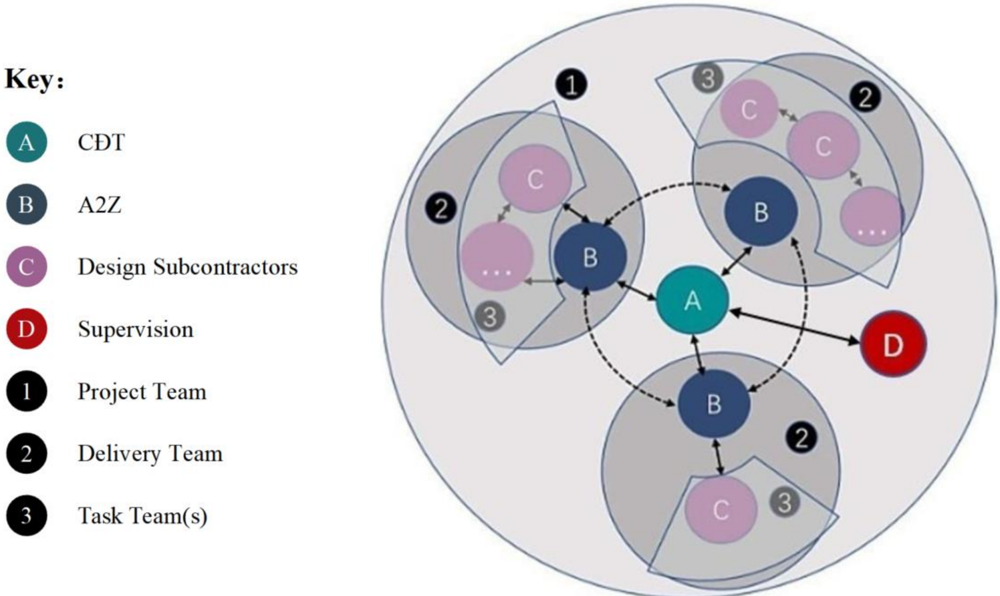

Hình 4.1 vai trò và trách nhi ệ m các ch ủ th ể

| Design Subcontractors   | Nhà th ầ u thi ế t k ế ph ụ   |
|-------------------------|-------------------------------|
| Supervision             | Giám sát                      |
| Project Team            | Nhóm d ự án                   |
| Delivery Team           | Nhóm giao hàng                |
| Task Team(s)            | Nhóm nhi ệ m v ụ              |

## Trách nhi ệ m theo vai trò

## A. Bên ch ỉ đị nh (Ch ủ đầu tư)

- L ậ p k ế ho ạ ch ứ ng d ụ ng BIM và m ụ c tiêu
- S ắ p x ế p các yêu c ầ u thông tin d ự án
- Thi ế t l ập các nút trao đổi thông tin và đặ t các m ố c giao hàng
- Xem xét và giám sát
- Xây d ự ng h ệ th ố ng tiêu chu ẩ n thông tin
- Thi ế t l ập môi trườ ng làm vi ệ c h ợ p tác

## B. Bên đượ c ch ỉ đị nh d ẫ n d ắ t (A2Z)

- T ổ ch ứ c s ả n xu ấ t d ữ li ệ u BIM và ứ ng d ụ ng d ữ li ệ u
- Chu ẩ n b ị K ế ho ạ ch Th ự c hi ệ n BIM (BEP)
- Ph ố i h ợ p các nhóm công vi ệc để l ậ p k ế ho ạ ch nhi ệ m v ụ và k ế ho ạ ch giao hàng

- Đánh giá năng suấ t c ủ a nhóm công tác và ti ến hành huy độ ng s ả n xu ấ t
- Xác đị nh các r ủ i ro ti ề m ẩ n
- Đả m b ả o vi ệ c bàn giao k ế t qu ả BIM theo các yêu c ầ u bàn giao

## C. Nhóm công tác

- T ổ ch ứ c giao di ệ n công vi ệ c theo ph ạ m vi nhi ệ m v ụ
- Chu ẩ n b ị các tài li ệ u TIDP/MPDT và n ộ p chính th ức cho CĐT trướ c khi bàn giao thi ế t k ế chính th ứ c
- Th ự c hi ệ n s ả n xu ấ t d ữ li ệ u BIM d ự a trên các tiêu chu ẩ n k ỹ thu ậ t và k ế ho ạ ch (BEP)
- Đả m b ả o vi ệ c bàn giao k ế t qu ả BIM theo các yêu c ầ u bàn giao

## D. Giám sát

Giám sát là đơn vị ch ị u trách nhi ệ m giám sát vi ệ c tuân th ủ t ấ t c ả các ho ạt độ ng và yêu c ầ u c ủ a d ự án được quy đị nh trong H ợp đồng Nhượ ng quy ề n và các Ph ụ l ụ c K ỹ thu ậ t c ủ a nó.

Bên c ạnh đó, Giám sát sẽ ch ị u trách nhi ệ m v ề h ợp đồ ng v ới Đánh giá viên An toàn Độ c l ậ p (ISA), nh ằ m hoàn thành các yêu c ầ u an toàn liên quan theo ph ạ m vi d ự án và các yêu c ầu khác như:

- Đánh giá độ c l ậ p v ề An toàn c ủ a các H ệ th ố ng con và H ệ th ố ng T ổ ng th ể c ủ a d ự án TPHCM-TL-MT.
- Nó s ẽ giám sát vi ệc đánh giá các Nhà thầ u ph ụ được Bên Nhượ ng quy ề n thuê, nh ữ ng ngườ i s ẽ tham gia vào An ninh c ủ a H ệ th ố ng Toàn di ệ n trong phiên b ả n và c ấu hình đượ c s ử d ụ ng trong D ự án này.
- Các n ội dung khác được xác định trong các đặc điể m k ỹ thu ậ t k ỹ thu ậ t áp d ụ ng cho D ự án.

B ả ng 4.1 Thành viên tham gia d ự án

|   STT | Họ và Tên            | Vai trò BIM   | Chức vụ                                 | Liên hệ   | Tổ chức    |
|-------|----------------------|---------------|-----------------------------------------|-----------|------------|
|     1 | Hoàng Quốc Tuấn      | Manager       | Quản lý chung                           |           |            |
|     2 | Đoàn Huỳnh Minh      | Coordinator   | Điề u ph ố i BIM t ổ ng th ể            |           |            |
|     3 | Nguyễn Thanh Bình    | Coordinator   | Điều phối BIM - Mô hình tuyến           |           |            |
|     4 | Nguyễn Đình Nhật Huy | Coordinator   | Điều phối BIM - Mô hình cầu, công trình |           | Công ty Cổ |
|     5 | Trịnh Đức Huy        | Modeler       | Mô hình kết cấu                         |           | phần       |
|     6 | Trương Gia Huy       | Modeler       | Mô hình kết cấu                         |           | Tư vấn xây |
|     7 | Trần Hoàng Bảo       | Modeler       | Mô hình kết cấu                         |           | dựng       |
|     8 | Vũ Minh Hiếu         | Modeler       | Mô hình kết cấu                         |           | A2Z        |
|     9 | Vũ Mạnh Cường        | Modeler       | Mô hình kết cấu                         |           |            |
|    10 | Cao Minh Cường       | Modeler       | Mô hình kết cấu                         |           |            |
|    11 | Nguyễn Văn Hoàng     | Modeler       | Mô hình kết cấu                         |           |            |
|    12 | Nguyễn Hoàng Duy     | Modeler       | Mô hình kết cấu                         |           |            |

|   STT | Họ và Tên              | Vai trò BIM   | Chức vụ                                 | Liên hệ   | Tổ chức            |
|-------|------------------------|---------------|-----------------------------------------|-----------|--------------------|
|    13 | Nguyễn Văn Minh        | Modeler       | Mô hình kết cấu                         |           |                    |
|    14 | Hoàng Anh Tú           | Modeler       | Mô hình kết cấu                         |           |                    |
|    15 | Nguyễn Hồng Sen        | Modeler       | Mô hình tuyến                           |           |                    |
|    16 | Nguyễn Lưu Bảo         | Modeler       | Mô hình tuyến                           |           |                    |
|    17 | Phan Bá Đạt            | Modeler       | Mô hình tuyến                           |           |                    |
|    18 | Lê Nguyễn Tấn Tuyền    | Modeler       | Mô hình tuyến                           |           |                    |
|    19 | Trần Minh Nhật         | Modeler       | Mô hình tuyến                           |           |                    |
|    20 | Lê Anh Khôi            | Modeler       | Mô hình tuyến                           |           |                    |
|     1 | Lei Tao                | Manager       | Quản lý chung                           |           |                    |
|     2 | Yunxuan Wang           | Coordinator   | Điều phối BIM                           |           |                    |
|     3 | Zhenkun Dai            | Coordinator   | Điề u ph ố i BIM -Mô hình tuy ế n       |           | Công ty Cổ         |
|     4 | Yujia Chen             | Coordinator   | Điề u ph ố i BIM - CDE                  |           | phần Tập           |
|     5 | Xingyi Liao            | Modeler       | Mô hình k ế t c ấ u                     |           | đoàn Thiết         |
|     6 | Jun Tang               | Modeler       | Mô hình k ế t c ấ u                     |           | kế                 |
|     7 | Qing Wang              | Modeler       | Mô hình tuy ế n                         |           | Hoa                |
|     8 | Shichao Wang           | Modeler       | Mô hình tuy ế n                         |           | Thiết              |
|     9 | Qiangjun Zhang         | Modeler       | Mô hình k ế t c ấ u                     |           | (CDG)              |
|    10 | Yun Huai               | Modeler       | Mô hình k ế t c ấ u                     |           |                    |
|     1 | Nguy ễ n H ữ u La      | Coordinator   | Điều phối BIM - Mô hình ITS-ME-TOL- WIM |           | Công ty C ổ ph ầ n |
|     2 | Nguy ễn Công Đị nh     | Modeler       | Mô hình ITS                             |           | T ậ p              |
|     3 | Tr ầ n Khánh Huy       | Modeler       | Mô hình ME                              |           | đoàn               |
|     4 | Cao Nguy ễ n B ả o Chi | Modeler       | Mô hình TOL-WIM                         |           | Đèo Cả             |

## 4.2 Trách nhi ệ m d ự án

Để th ự c hi ệ n t ố t các h ạ ng m ụ c công vi ệc đề ra, h ệ th ố ng nhân s ự tham gia d ự án đượ c t ổ ch ứ c thành các t ổ , nhóm trong m ộ t t ổ ng th ể chung. M ỗ i t ổ , nhóm có m ộ t nhi ệ m v ụ riêng có quan h ệ v ớ i nhau theo m ột sơ đồ t ổ ch ứ c khoa h ọc để đả m b ả o s ự ho ạt độ ng hi ệ u qu ả nh ấ t.

Toàn b ộ ho ạt độ ng c ủ a d ự án tuân th ủ theo quy trình, quy đị nh c ủ a B ộ nh ằm đả m b ả o th ự c hi ệ n đúng nhiệ m v ụ tri ể n khai xây d ự ng mô hình BIM và tho ả mãn các yêu c ầu đã cam kế t v ớ i khách hàng.

Ch ị u trách nhi ệ m chính v ề gi ả i pháp k ỹ thu ậ t là chuyên gia qu ản lý BIM. Để d ự án ho ạt độ ng có hi ệ u qu ả , s ả n ph ẩ m d ị ch v ụ tư vấ n có ch ất lượ ng cao, các h ạ ng m ụ c k ỹ thu ật chính đề u do chuyên gia qu ả n lý BIM các h ạ ng m ụ c ph ụ trách.

Hình 4.2 Sơ đồ t ổ ch ứ c BIM

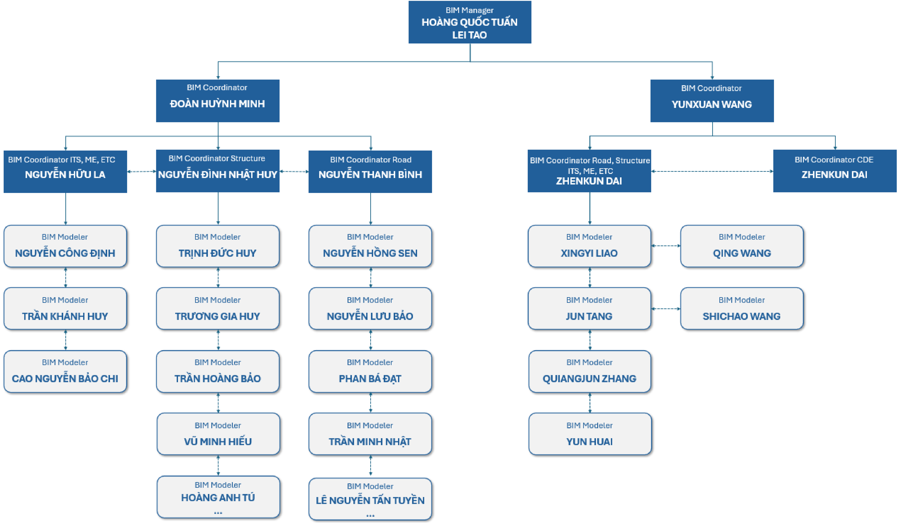

| Ch ủ th ể                                 | Thu ậ t ng ữ BIM      | Vai trò                                                                                                                                                                                                                                                                                                                                                                                                                                                                                                                                                                                                                                                                                                                                                                                                                                                    |
|-------------------------------------------|-----------------------|------------------------------------------------------------------------------------------------------------------------------------------------------------------------------------------------------------------------------------------------------------------------------------------------------------------------------------------------------------------------------------------------------------------------------------------------------------------------------------------------------------------------------------------------------------------------------------------------------------------------------------------------------------------------------------------------------------------------------------------------------------------------------------------------------------------------------------------------------------|
| Chuyên gia th ự c hi ệ n qu ả n lý BIM    | BIM Qu ả n lý         | - Ch ỉ đạ o vi ệ c xây d ự ng k ế ho ạ ch; - Qu ả n lý nhóm tri ể n khai BIM; - Tìm hi ể u công ngh ệ m ớ i; - Xác nh ậ n tiêu chu ẩ n BIM d ự án cho đội ngũ thiế t k ế trong d ự án; - T ổ ch ứ c xây d ự ng K ế ho ạ ch th ự c hi ệ n BIM cho d ự án. - Xác nh ậ n nh ữ ng n ộ i dung thông tin chung cho nhóm thi ế t k ế ; - Ph ố i h ợ p v ới người đượ c giao qu ản lý CDE để đả m b ả o nh ữ ng yêu c ầu đượ c th ự c hi ện trong môi trườ ng BIM cho giai đoạ n qu ả n lý v ậ n hành; - Thi ế t l ập quy trình trao đổ i d ữ li ệ u cho toàn d ự án trong t ấ t c ả các giai đoạ n; - Đả m b ả o mô hình liên k ết đa bộ môn đạ t yêu c ầ u.                                                                                                                                                                                                      |
| Chuyên gia th ự c hi ệ n điề u ph ố i BIM | BIM Điề u ph ố i viên | - Tham gia xây d ự ng và tri ể n khai K ế ho ạ ch th ự c hi ệ n BIM cho d ự án; - C ậ p nh ậ t K ế ho ạ ch th ự c hi ệ n BIM cho d ự án trong quá trình tri ể n khai; - Ch ỉ đạ o l ậ p k ế ho ạ ch, thi ế t l ậ p và duy trì các file d ữ li ệ u; - Đả m b ả o các bên có liên quan th ố ng nh ấ t v ề K ế ho ạ ch th ự c hi ệ n BIM cho d ự án; - Xác đị nh và t ạo điề u ki ệ n cho vi ệ c tri ển khai đào tạ o nhân s ự phù h ợ p v ớ i chi ến lượ c th ự c hi ệ n d ự án; - Đả m b ả o ph ầ n c ứ ng và ph ầ n m ề m c ầ n thi ế t cho vi ệ c tri ể n khai; - Xây d ự ng Mô hình BIM liên k ết đa bộ môn t ừ nh ữ ng mô hình BIM t ừ ng b ộ môn, xu ất báo cáo xung độ t t ạ i các mốc quan trọng xác định trong Kế hoạch thực hiện BIM cho dự án; - Đảm bảo các xung đột trong mô hình BIM từng bộ môn được giải quyết trước khi phối hợp đa bộ môn. |
| Chuyên gia thực hiện dựng hình BIM        | BIM Người mô hình hóa | - Chịu trách nhiệm sản xuất các sản phẩm thiết kế. - Trích xuất thông tin, triển khai bản vẽ từ mô hình (nếu có). - Đảm bảo sự nhất quán trong mô hình hóa. - Phối hợp với bộ phận công nghệ thông tin để giải quyết các yêu cầu về mặt công nghệ.                                                                                                                                                                                                                                                                                                                                                                                                                                                                                                                                                                                                         |

## 4.3 Mô hình thông tin d ự án (PIM)

Chi ến lượ c giao n ộ p PIM bao g ồ m K ế ho ạ ch Giao n ộ p Thông tin Nhi ệ m v ụ TIDP qu ả n lý vi ệ c giao n ộ p thông tin và d ữ li ệ u c ụ th ể theo yêu c ầ u c ủ a khách hàng ở m ỗi giai đoạ n c ủ a d ự án. Mô hình thông tin d ự án (PIM) đượ c phát tri ể n d ự a trên vi ệ c s ử d ụng BIM đã đượ c thi ế t l ập, điều này đả m b ả o các bên tham gia hi ểu đượ c vi ệ c s ử d ụng thông tin trong tương lai và hành độ ng phù h ợ p.

## 4.4 S ử d ụ ng d ữ li ệ u g ố c

D ữ li ệ u g ố c s ẽ ch ỉ đượ c s ử d ụ ng làm tham chi ế u, t ấ t c ả các mô hình thi ế t k ế và ph ố i h ợ p s ẽ đượ c liên k ế t v ớ i c ấu trúc đượ c thi ế t k ế trong WBS c ủ a d ự án.

## 4.5 Phê duy ệ t thông tin

T ấ t c ả thông tin ph ải đượ c xác minh, phê duy ệ t và chia s ẻ qua h ệ th ố ng CDE c ủ a d ự án. Đố i v ớ i m ỗ i bên ch ị u trách nhi ệ m, quy trình phê duy ệ t bao g ồ m:

- Đánh giá nộ i dung k ỹ thu ậ t b ởi trưở ng nhóm thi ế t k ế .
- Ki ể m tra tính phù h ợ p c ủ a mô hình b ở i nhóm BIM.
- Gi ả i pháp giao di ệ n chính xác và ki ểm soát thay đổ i b ởi nhóm giám đố c k ỹ thu ậ t.
- Ki ể m tra n ộ i dung k ỹ thu ậ t b ởi giám đố c k ỹ thu ật và trưở ng các gói công vi ệ c.
- Đả m b ả o tính nh ấ t quán gi ữ a tài li ệ u trích xu ấ t và thông tin ch ứ a trong mô hình và báo cáo b ởi giám đố c k ỹ thu ậ t.
- Phê duy ệ t ki ể m soát ch ất lượ ng cu ố i cùng b ởi giám đố c giao nh ậ n.
- Ch ủ đầu tư phê duyệ t thông tin t ạ i các m ố c c ụ th ể .
- Phê duyệ t giám sát.

## Ghi chú:

1. Ch ủ đầu tư có thể bình lu ậ n thông tin trong các phiên b ản xem trướ c.
2. Tham kh ảo chương 5 để bi ế t quy trình phê duy ệ t c ụ th ể .
3. Ti ến độ c ủ a các mô hình s ẽ được đo bằ ng t ỷ l ệ ph ần trăm tiến độ mô hình hóa BIM; b ả ng này có th ể đượ c tìm th ấy trong TIDP tương ứ ng c ủ a t ừ ng gói.

## 4.6 Quy trình phê duy ệ t PIM

PIM s ẽ đượ c phát tri ể n d ầ n d ần theo MPDT và đượ c bàn giao cho ch ủ đầu tư thông qua mộ t lo ạ t các trao đổ i thông tin, trùng v ớ i các m ố c d ự án c ụ th ể được định nghĩa tạ i m ụ c 2.2 trong tài li ệ u này. Các trao đổ i thông tin PIM s ẽ được phát hành qua CDE 'Thư mục công khai' để đượ c ch ủ đầu tư ho ặc đạ i di ệ n c ủ a ch ủ đầu tư phê duyệt. Trướ c khi chia s ẻ v ớ i khách hàng t ấ t c ả thông tin đồ h ọ a và phi đồ h ọ a.

Vi ệ c bàn giao các mô hình liên k ế t c ủ a t ừ ng chuyên ngành s ẽ di ễn ra đồ ng th ờ i v ớ i vi ệ c bàn giao các mô hình c ủ a t ừ ng chuyên ngành. A2Z s ẽ bàn giao các mô hình liên k ế t d ự a trên v ị trí. M ộ t mô hình liên k ế t t ổ ng th ể cùng v ớ i 6 mô hình liên k ết khác tương ứ ng v ớ i 6 m ặ t b ằ ng làm vi ệ c s ẽ đượ c bàn giao. Lưu ý: Tại điể m 2.1 c ủ a b ảng dưới đây 'Thu thập thông tin', nhà thiế t k ế chính s ẽ s ử d ụ ng t ấ t c ả thông tin nh ận đượ c t ừ các tài li ệ u tham kh ả o bên th ứ ba, thông tin này có th ể ở đị nh d ạ ng dwg, xls, shp ho ặ c xml, v.v. Nhà thi ế t k ế s ẽ chuy ển đổi để s ử d ụ ng trong các ph ầ n m ề m khác nhau ho ặ c th ậ m chí trong các ứ ng d ụ ng và công c ụ phát tri ể n riêng, nh ằ m cho phép s ử d ụ ng t ấ t c ả thông tin có s ẵ n mà không b ắ t bu ộ c ph ả i dùng ph ầ n m ề m c ụ th ể .

Để phê duy ệ t PIM và các tài li ệ u liên quan, quy trình làm vi ệc như sau:

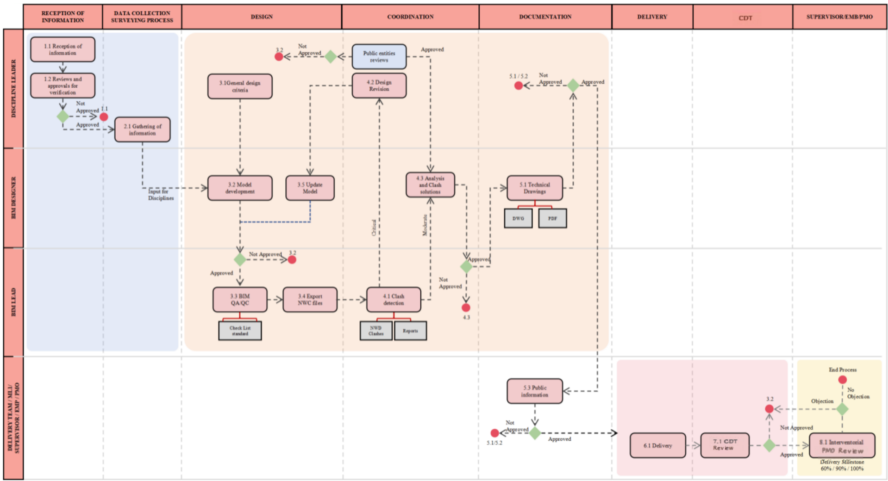

Hình 4.3 Quy trình phê duy ệ t PIM

| RECEPTION OF INFORMATION                   | NH Ậ N THÔNG TIN                           |
|--------------------------------------------|--------------------------------------------|
| 1.1 Reception of information               | 1.1 Nh ậ n thông tin                       |
| 1.2 Reviews and approvals for verification | 1.2 Xem xét và phê duy ệt để xác minh      |
| Not Approved                               | Không đượ c phê duy ệ t (quay l ạ i 1.1)   |
| Approved                                   | Đã phê duyệ t                              |
| DATA COLLECTION SURVEYING PROCESS          | QUY TRÌNH KH Ả O SÁT THU TH Ậ P D Ữ LI Ệ U |
| 2.1 Gathering of information               | 2.1 Thu th ậ p thông tin                   |
| Input for Disciplines                      | Đầ u vào cho các ngành                     |
| DESIGN                                     | THI Ế T K Ế                                |
| 3.1 General design criteria                | 3.1 Tiêu chí thi ế t k ế chung             |
| 3.2 Model development                      | 3.2 Phát tri ể n mô hình                   |
| Not Approved                               | Không đượ c phê duy ệ t (quay l ạ i 3.2)   |
| Approved                                   | Đã phê duyệ t                              |
| 3.3 BIM QA/QC                              | 3.3 Ki ể m tra ch ất lượ ng                |
| 3.4 Export NWC files                       | 3.4 Xu ấ t t ệ p NWC                       |
| 3.5 Update Model                           | 3.5 C ậ p nh ậ t Mô hình                   |
| COORDINATION                               | PH Ố I H Ợ P                               |
| 4.1 Clash detection                        | 4.1 Phát hi ệ n Va ch ạ m                  |
| NWD Clashes                                | Va ch ạ m NWD                              |
| Reports                                    | Báo cáo                                    |
| Critical                                   | Phê bình                                   |
| 4.2 Design Revision                        | 4.2 S ửa đổ i Thi ế t k ế                  |
| Moderate                                   | M ức độ trung bình                         |
| 4.3 Analysis and Clash solutions           | 4.3 gi ải pháp phân tích và xung độ t      |

| Public entities reviews             | Đánh giá của các cơ quan                 |
|-------------------------------------|------------------------------------------|
| Not Approved                        | Không đượ c phê duy ệ t (quay l ạ i 3.2) |
| Approved                            | Đã phê duyệ t                            |
| DOCUMENTATION                       | TÀI LI Ệ U                               |
| 5.1 Technical Drawings              | 5.1 B ả n v ẽ K ỹ thu ậ t                |
| Not Approved                        | Không đượ c phê duy ệ t                  |
| Approved                            | Đã phê duyệ t                            |
| 5.3 Public information              | 5.3 Thông tin công khai                  |
| Not Approved                        | Không đượ c phê duy ệ t                  |
| Approved                            | Đã phê duyệ t                            |
| DELIVERY                            | GIAO N Ộ P                               |
| 6.1 Delivery                        | 6.1 Giao hàng                            |
| MLI                                 | GIÁM SÁT                                 |
| 7.1 ML1 Review                      | 7.1 Đánh giá của CĐT                     |
| Not Approved                        | Không đượ c phê duy ệ t (quay l ạ i 3.2) |
| Approved                            | Đã phê duyệ t                            |
| 8.1 Interventorial PMO/EMB Review   | 8.1 Giám sát/PMO Đánh giá                |
| Delivery Milestone 60% / 90% / 100% | C ộ t m ố c giao hàng 60%, 90%, 100%     |
| Objection                           | Ý ki ế n ph ản đố i (quay l ạ i 3.2)     |
| No Objection                        | Không có ý ki ế n ph ản đố i             |
| END PROCESS                         | K Ế T THÚC QUY TRÌNH                     |

## 5. L Ậ P K Ế HO Ạ CH VÀ TÀI LI Ệ U

## 5.1 Môi trườ ng d ữ li ệ u chung (CDE)

M ụ c tiêu chính c ủ a CDE là t ạ o ra m ộ t n ề n t ảng để cho phép chia s ẻ mô hình và t ậ p tin hi ệ u qu ả . T ấ t c ả các mô hình được lưu trữ trong Môi trườ ng D ữ li ệ u Chung (CDE) s ẽ đượ c qu ả n lý ch ặ t ch ẽ nh ằ m t ạ o ra d ấ u v ế t ki ể m toán và gi ả m thi ể u r ủ i ro làm vi ệ c v ớ i thông tin l ỗ i th ờ i ho ặ c không chính xác, phù h ợ p v ớ i Quy trình D ự án CDE như quy trình làm việc đượ c qu ả n lý và ki ể m soát phiên b ả n.

## 5.2 Quy trình CDE

Quy trình làm vi ệ c c ủ a CDE A2Z trong d ự án s ẽ đượ c th ự c hi ện trên các thư mụ c c ụ th ể này và thông tin s ẽ di chuy ể n t ừ thư mục này sang thư mụ c khác khi d ự án ti ế n tri ể n và t ấ t c ả các bướ c s ử a đổi đượ c phê duy ệ t:

- Thư mụ c 2\_WIP ho ặc thư mụ c thi ế t k ế đượ c s ử d ụng để lưu trữ thông tin mà nhóm công vi ệc đang phát triể n. Thông tin ch ứ a trong tr ạ ng thái này không nên hi ể n th ị ho ặ c truy c ậ p đượ c b ở i khách hàng, ngo ạ i tr ừ thông tin trong thư mục Consume, nơi các chuyên ngành trao đổi độ ng thông tin không chính th ứ c ho ặ c h ỗ tr ợ v ớ i các chuyên ngành khác. Vào cu ố i quá trình WIP, t ấ t c ả các chuyên ngành ph ải sao chép thông tin vào thư mục 3\_SHD để đạ t đượ c s ự phê duy ệ t thi ế t k ế .
- Thư mụ c 3\_SHD ho ặc thư mụ c tiêu th ụ & chia s ẻ là nơi các chuyên ngành trao đổi độ ng thông tin v ới các chuyên ngành khác (thông qua thư mục con Change control) để có th ể đượ c s ử d ụng làm đầu vào (trong thư mụ c con Baseline) sau quá trình xem xét t ự độ ng. Vào cu ố i quá trình SHD, các thi ế t k ế và thông tin được sao chép vào thư mụ c ti ế p theo 1\_PUB.
- Thư mục 1\_PUB (thư mục công khai) đượ c s ử d ụng để lưu trữ thông tin có th ể đượ c cung c ấp cho CĐT để xem xét và phê duy ệ t. Khi thông tin ch ứ a trong c ả hai CDE đượ c phê duy ệ t, nó có th ể đượ c chuy ể n sang CDE c ủa CĐT cho các quy trình nộ i b ộ c ủ a h ọ . N ế u c ầ n ch ỉ nh s ử a b ấ t k ỳ tài li ệ u, b ả n v ẽ ho ặ c mô hình nào, nó ph ải đượ c tr ả l ại thư mục WIP để tác gi ả ch ỉ nh s ử a và g ử i l ạ i.
- Thư mục Archived là nơi gử i các s ả n ph ẩm đã trở nên l ỗ i th ờ i do vi ệ c phát hành các phiên b ả n m ớ i t ạ i cùng m ố c ho ặc giai đoạ n ti ến độ. Để đả m b ả o kh ả năng truy xuấ t thông tin, b ấ t k ỳ yêu c ầ u g ử i t ập tin vào thư mụ c Archived ph ải đượ c th ự c hi ệ n b ởi trưở ng nhóm BIM c ủ a chuyên ngành s ở h ữ u thông tin, ph ải đượ c g ử i qua email cho qu ả n tr ị viên CDE, ngườ i duy nh ấ t ch ị u trách nhi ệ m công vi ệc này. Thư mụ c Archived có c ấ u trúc gi ống như các thư mụ c chính. Các nhà thi ế t k ế ho ặc ngườ i mô hình không có quy ề n truy c ậ p vào thư m ục này để tránh s ử d ụ ng sai thông tin, qu ả n tr ị viên CDE ch ị u trách nhi ệ m qu ả n lý thông tin lưu trữ t ại đây và nế u c ần sao lưu, phải đượ c yêu c ầ u qua email.

## 5.2.1 Quy ề n truy c ậ p thư mụ c CDE

B ả ng 5.1 Quy ề n truy c ập thư mụ c CDE

|                                      | THƯ MỤ C   | THƯ MỤ C        | THƯ MỤ C                       | THƯ MỤ C   | THƯ MỤ C   |
|--------------------------------------|------------|-----------------|--------------------------------|------------|------------|
| VAI TRÒ                              | WIP*       | SHARED (Cơ sở ) | SHARED (Ki ể m soát thay đổ i) | PUBLISHED  | ARCHIVE    |
| CH Ủ ĐẦU TƯ                          |            |                 |                                |            |            |
| B an giám đố c                       | 0          | 2               | 0                              | 2          | 2          |
| Ban điề u hành d ự án                | 0          | 2               | 0                              | 2          | 2          |
| Các phòng Ban liên quan              | 0          | 2               | 0                              | 2          | 2          |
| B Ộ PH Ậ N BIM                       |            |                 |                                |            |            |
| Qu ả n lý BIM                        | 6          | 6               | 6                              | 6          | 6          |
| Đ i ề u ph ố i BIM                   | 6          | 2               | 5                              | 5          | 2          |
| Qu ả n tr ị viên CDE                 | 6          | 6               | 6                              | 6          | 6          |
| B Ộ PH Ậ N THI Ế T K Ế               |            |                 |                                |            |            |
| Ch ủ nhi ệ m thi ế t k ế             | 5          | 2               | 5                              | 2          | 2          |
| Ch ủ trì thi ế t k ế                 | 5          | 2               | 5                              | 2          | 2          |
| TƯ VẤ N TH Ẩ M TRA                   |            |                 |                                |            |            |
| Ch ủ nhi ệ m th ẩ m tra              | 0          | 2               | 0                              | 2          | 2          |
| Ch ủ trì th ẩ m tra các h ạ ng m ụ c | 0          | 2               | 0                              | 2          | 2          |
| CƠ QUAN BAN NGÀNH                    |            |                 |                                |            |            |
| Th ẩm đị nh                          | 0          | 2               | 0                              | 2          | 2          |

## Trong đó:

- 0 Không có quy ề n
- 1 Ch ỉ xem
- 2 Xem + t ả i xu ố ng
- 3 Ch ỉ t ả i lên (Không áp d ụ ng)
- 4 Xem + t ả i xu ố ng + t ả i lên
- 5 Xem + t ả i xu ố ng + t ả i lên + ch ỉ nh s ử a
- 6 Qu ản lý thư mụ c

* WIP: Quy ề n này ch ỉ áp d ụng cho thư mụ c riêng c ủa nó, đố i v ới các thư mụ c c ủ a các chuyên ngành khác áp d ụ ng quy ề n c ấp độ 2

## 5.2.2 Các bướ c phê duy ệ t c ụ th ể c ủ a CDE

C ấu trúc thư mụ c trong các CDE c ủ a A2Z và Ch ủ đầu tư sẽ gi ống nhau để đả m b ả o kh ả năng truy xu ấ t  thông  tin,  b ốn  thư  mụ c  chính  s ẽ đượ c  s ử d ụng  để t ổ ch ứ c  thông  tin  (WIP,  SHARED  ,

## PUBLISHED, ARCHIVE)

Quá trình chuy ể n thông tin t ừ thư mục 2\_WIP sang thư mụ c 1\_PUB ph ả i luôn b ắt đầ u b ằ ng vi ệ c sao chép thông tin trong thư mục 3\_SHD và tuân theo các giai đoạ n phê duy ệt và xem xét sau đây trướ c khi giao hàng:

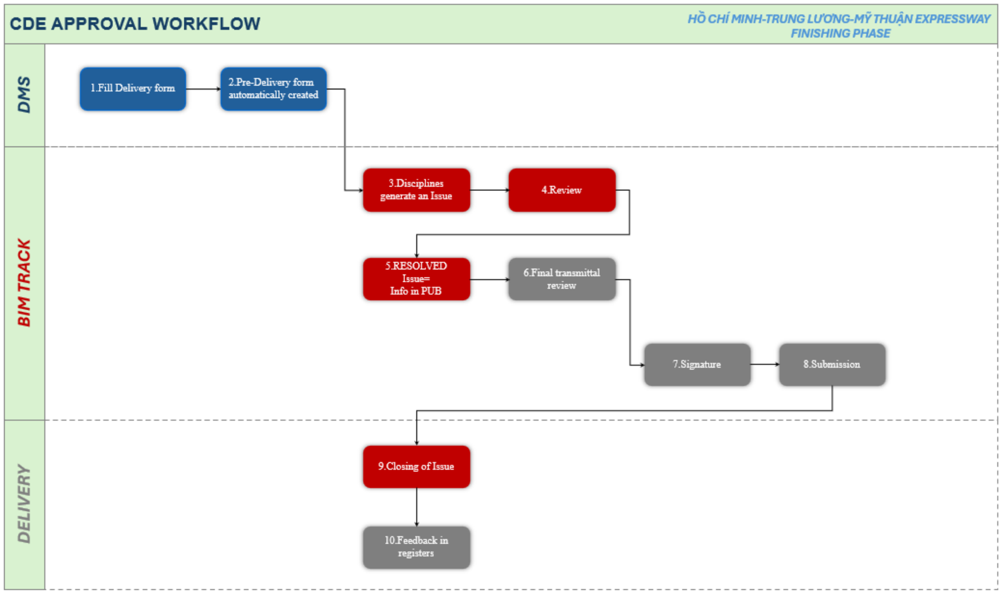

Hình 5.1 Quy trình phê duy ệ t trên CDE

| DMS       | 1.Fill Delivery form                      | 1. Điề n m ẫ u Giao hàng                                          |
|-----------|-------------------------------------------|-------------------------------------------------------------------|
| DMS       | 2.Pre-Delivery form automatically created | 2. M ẫ u Ti ền giao hàng đượ c t ạ o t ự độ ng                    |
| DMS       | 3.Disciplines generate an Issue           | 3. Các b ộ môn t ạ o m ộ t V ấn đề trên n ề n t ả ng ph ố i h ợ p |
| DMS       | 4.Review                                  | 4. Xem xét                                                        |
| BIM TRACK | 5.RESOLVED Issue= Info in PUB             | 5. V ấn đề ĐÃ GIẢ I QUY Ế T = Thông tin trong PUB                 |
| BIM TRACK | 6.Final transmittal review                | 6. Xem xét truy ền đạ t cu ố i cùng                               |
| BIM TRACK | 7.Signature                               | 7. Ch ữ ký                                                        |
| BIM TRACK | 8.Submission                              | 8. N ộ p h ồ sơ                                                   |
| DELIVERY  | 9.Closing of Issue                        | 9. Đóng vấn đề                                                    |
| DELIVERY  | 10.Feedback in registers                  | 10. Ph ả n h ồ i trong s ổ đăng ký                                |

Quy trình xem xét và phê duy ệ t thông tin t ừng bướ c này nh ằ m m ục đích:

- Gi ữ cho thông tin đượ c ki ểm soát và đăng ký khi chuyển giao cho CĐT
- Đả m b ả o ch ất lượ ng các s ả n ph ẩ m bàn giao
- Đả m b ảo tính đầy đủ c ủ a các bàn giao

- Làm cho quy trình hi ệ u qu ả hơn (đơn giả n hóa, tinh g ọ n, t ạo điề u ki ệ n, t ự độ ng hóa) Quy trình ph ả n h ồ i các ý ki ế n t ừ các cơ quan công và Giám sát sẽ như sau:
- A2Z s ẽ t ậ p trung và qu ả n lý thông tin cùng các ý ki ến. Trong khi đó, tấ t c ả các ý ki ế n t ừ CĐT sẽ đượ c truy ền đạ t l ạ i qua RoR.
- Để có th ể truy xu ấ t n ộ i b ộ các nh ận xét này, ngườ i ph ụ trách BIM c ủ a t ừ ng chuyên ngành s ẽ là người đưa các nhậ n xét này vào, nh ữ ng nh ậ n xét này s ẽ đượ c ghi nh ận như các sự c ố được giao cho ngườ i ch ị u trách nhi ệm tương ứ ng.
- Khi t ấ t c ả các ý ki ến này đã đượ c gi ả i quy ế t ho ặ c tr ả l ời, trưở ng nhóm BIM s ẽ kh ởi độ ng quy trình phê duy ệt thông tin này theo cùng sơ đồ đã nêu ở trên

## 5.3 Ph ầ n m ề m / n ề n t ả ng Web và ph ầ n c ứ ng

## 5.3.1 Các n ề n t ả ng ph ầ n m ề m

B ả ng 5.2 Các n ề n t ả ng ph ầ n m ề m

| N ộ i dung                                 | N ộ i dung                                                                                        | Nhà cung c ấ p                                                 | Tên ph ầ n m ề m                                               | Phiên b ả n   |
|--------------------------------------------|---------------------------------------------------------------------------------------------------|----------------------------------------------------------------|----------------------------------------------------------------|---------------|
| T ạ o mô hình                              | + Hi ệ n tr ạ ng (Địa hình, đị a ch ấ t)                                                          | Autodesk                                                       | InfraWorks Civil 3D                                            | 2024          |
| T ạ o mô hình                              | + Đườ ng giao thông                                                                               | Công ty C ổ ph ầ n T ập đoàn Thi ế t k ế Hoa Thi ế t (CDG)     | EICAD AIRoad                                                   | 2025          |
| T ạ o mô hình                              | + H ệ th ống thoát nướ c + An toàn giao thông + C ầ u + H ầ m chui + C ố ng + Tr ạm thu phí, ITS… | Autodesk                                                       | Revit Civil 3D                                                 | 2024          |
| Mô hình ph ố i h ợ p                       | Mô hình ph ố i h ợ p                                                                              | Autodesk                                                       | Naviswork Manage CDE                                           | -             |
| Qu ả n lý Mô hình, H ồ sơ tài liệ u d ự án | Qu ả n lý Mô hình, H ồ sơ tài liệ u d ự án                                                        | Autodesk Construction Cloud (ACC) / Vietnam Design Cloud (VDC) | Autodesk Construction Cloud (ACC) / Vietnam Design Cloud (VDC) | -             |
| Ph ố i c ả nh d ự án                       | Ph ố i c ả nh d ự án                                                                              | Công ty C ổ ph ầ n T ập đoàn Thi ế t k ế                       | Twinmotion, Report3D...                                        | -             |

| N ộ i dung   | Nhà cung c ấ p               | Tên ph ầ n m ề m   | Phiên b ả n   |
|--------------|------------------------------|--------------------|---------------|
|              | Hoa Thi ế t (CDG) Epic Games |                    |               |

## 1) Revit -H ệ th ố ng mô hình hóa tham s ố và qu ả n lý thông tin c ấ u ki ệ n

Revit là h ệ th ố ng mô hình hóa thông tin ba chi ề u d ự a trên công ngh ệ tham s ố , cho phép xây d ự ng mô hình có c ấu trúc, định nghĩa thuộ c tính và bi ểu đạ t thông tin cho các lo ạ i c ấ u ki ệ n k ỹ thu ậ t. Thông qua thư việ n Family và các quy t ắ c tham s ố , Revit h ỗ tr ợ định nghĩa cấ u ki ệ n nhanh chóng, qu ả n lý tiêu chu ẩ n hóa và tái s ử d ụ ng mô hình, giúp nâng cao hi ệ u qu ả mô hình hóa và tính th ố ng nh ấ t c ủ a mô hình. H ệ th ố ng có kh ả năng liên kết đồ ng b ộ gi ữ a mô hình và b ả n v ẽ, đả m b ả o t ấ t c ả các view, b ả n v ẽ , b ả ng th ố ng kê và thông tin c ấ u ki ện đượ c t ự độ ng c ậ p nh ậ t. Revit h ỗ tr ợ qu ả n lý thu ộ c tính c ấ u ki ệ n, th ố ng kê kh ối lượ ng, th ể hi ệ n chi ti ế t c ấ u t ạ o và t ạ o l ậ p b ả n v ẽ , phù h ợ p cho vi ệ c xây d ự ng mô hình k ỹ thu ậ t ba chi ều có độ chi ti ế t cao, kh ả năng bả o trì t ố t và c ấ u trúc d ữ li ệ u rõ ràng, ph ụ c v ụ hi ệ u qu ả cho thi ế t k ế và bàn giao mô hình thông tin.

## 2) Civil 3D -H ệ th ố ng thi ế t k ế tuy ế n và mô hình 3D k ỹ thu ậ t

Civil 3D là h ệ th ố ng chuyên d ụ ng cho thi ế t k ế tuy ế n và xây d ự ng mô hình k ỹ thu ậ t, cung c ấ p các năng lự c thi ế t k ế tham s ố như bình đồ , tr ắ c d ọ c, tr ắc ngang, địa hình, đào đắp, thoát nướ c và b ố trí c ấ u ki ệ n. H ệ th ố ng có th ể d ự a trên d ữ li ệu đo đạc để t ạ o mô hình b ề m ặt 3D chính xác, đồ ng th ờ i t ự độ ng t ạ o tr ắ c ngang, tính toán kh ối lượ ng và biên t ậ p b ả n v ẽ. Cơ chế liên k ế t d ữ li ệu độ ng c ủ a Civil 3D duy trì s ự đồ ng b ộ theo th ờ i gian th ự c gi ữ a mô hình, b ả n v ẽ và kh ối lượng, nâng cao độ chính xác thi ế t k ế và hi ệ u qu ả ch ỉ nh s ửa. Các đối tượ ng k ỹ thu ậ t trong h ệ th ố ng có c ấ u trúc d ữ li ệu đầy đủ, đáp ứ ng t ố t nhu c ầu đo đạ c, thi ế t k ế tuy ế n, mô hình hóa hi ện trườ ng và phân tích k ỹ thu ậ t, cung c ấ p d ữ li ệ u tin c ậ y cho thi ế t k ế 3D và bàn giao mô hình s ố .

## 3) Navisworks -H ệ th ố ng ki ể m tra t ổ ng h ợ p và rà soát mô hình

Navisworks là công c ụ tích h ợp mô hình đa nguồ n và ki ể m tra k ỹ thu ậ t, h ỗ tr ợ t ả i và h ợ p nh ấ t nhi ề u đị nh d ạ ng mô hình 3D trong m ộ t không gian trình bày th ố ng nh ấ t. H ệ th ố ng cung c ấ p ch ức năng kiể m tra xung độ t m ạ nh m ẽ , t ự độ ng phát hi ệ n va ch ạ m gi ữ a các c ấ u ki ệ n và t ạ o h ồ sơ vấn đề theo c ấ u trúc để thu ậ n ti ệ n theo dõi và x ử lý. Navisworks h ỗ tr ợ c ắ t l ớ p, tham quan mô hình, xem thu ộ c tính, t ạ o ho ạ t c ả nh và mô ph ỏ ng k ỹ thu ậ t nh ằ m ki ể m tra tính h ợ p lý thi ế t k ế và th ể hi ện ý đồ thi ế t k ế . Các công c ụ truy v ấ n d ữ li ệ u và ghi chú giúp nâng cao hi ệ u qu ả rà soát mô hình, làm cho Navisworks tr ở thành ph ầ n m ề m ph ổ bi ế n trong ki ể m tra thi ế t k ế , qu ả n lý ch ất lượ ng và bàn giao mô hình k ỹ thu ậ t.

## 4) Twinmotion -H ệ th ố ng d ự ng c ả nh th ờ i gian th ự c và tr ực quan hóa tương tác

Twinmotion d ự a trên công ngh ệ k ế t xu ấ t th ờ i gian th ự c, cho phép xây d ự ng nhanh c ả nh quan 3D và t ạ o hi ệ u ứ ng tr ực quan hóa tương tác. Hệ th ố ng h ỗ tr ợ thay đổ i v ậ t li ệu, điề u ch ỉnh môi trườ ng, mô ph ỏng giao thông và con ngườ i, hi ệ u ứ ng th ờ i ti ế t và ánh sáng, giúp mô hình th ể hi ện sinh độ ng và tr ực quan. Đặc điể m k ế t xu ấ t th ờ i gian th ự c c ủa Twinmotion cho phép điề u ch ỉ nh và xem k ế t qu ả ngay l ậ p t ứ c, phù h ợ p v ớ i quy trình l ặp nhanh và trình bày đa phiên bả n. Ph ầ n m ề m h ỗ tr ợ xu ấ t video, hình ả nh toàn c ả nh và n ộ i dung th ự c t ế ả o, r ấ t thích h ợ p s ử d ụ ng trong các bu ổ i báo cáo tr ự c quan hóa.

## 5) EICAD -H ệ th ố ng thi ế t k ế đườ ng b ộ và nút giao liên thông mang tính tương tác và tích hợ p

EICAD tích h ợp năng lự c thi ế t k ế toàn quy trình c ủ a các h ạ ng m ục đườ ng b ộ và nút giao liên thông, k ế t h ợ p lý thuy ế t thi ế t k ế tiên ti ế n v ớ i công ngh ệ tương tác độ ng. H ệ th ố ng cung c ấp môi trườ ng thi ế t k ế thông minh và hi ệ u qu ả cho đườ ng cao t ốc, đường đô thị và các nút giao. EICAD bao ph ủ toàn b ộ chu k ỳ công vi ệ c t ừ nghiên c ứ u kh ả thi, thi ế t k ế k ỹ thu ật đế n thi ế t k ế b ả n v ẽ thi công, v ới đầy đủ các mô đun chuyên ngành như tuyến đườ ng, c ầ u, h ầm, thoát nướ c và tính toán kh ối lượ ng. H ệ th ố ng h ỗ tr ợ liên k ế t mô hình -b ả n v ẽ và xu ấ t b ả n v ẽ t ự độ ng. V ớ i kh ả năng bố trí tuy ến trong các điề u ki ệ n ph ứ c t ạp, sinh phương án thông minh và hệ th ố ng d ị ch v ụ SaaS hoàn ch ỉ nh, EICAD giúp nâng cao hi ệ u qu ả thi ế t k ế và ch ất lượ ng s ả n ph ẩ m, phù h ợ p cho thi ế t k ế s ố hóa và bàn giao các d ự án h ạ t ầ ng giao thông.

## 6) AIRoad -H ệ th ố ng thi ế t k ế phương án nhanh cho công trình hạ t ầ ng

AIRoad tích h ợ p công ngh ệ n ề n t ảng BIM và mô hình đị a hình s ố để th ự c hi ệ n thi ế t k ế phương án m ộ t cách tham s ố hóa, thông minh và hi ệ u qu ả . D ự a trên d ữ li ệ u GIS, ả nh vi ễ n thám và nhi ề u ngu ồ n đị a hình khác, h ệ th ố ng h ỗ tr ợ t ạ o mô hình nhanh cho các h ạ ng m ục đườ ng, c ầ u và h ầm, đồ ng th ờ i cho phép b ố trí tuy ến tương tác độ ng. Quá trình t ự độ ng xây d ựng mô hình phương án giúp nâng cao hi ệ u su ấ t thi ế t k ế và t ối ưu chi phí. AIRoad hình thành mộ t h ệ sinh thái thi ế t k ế khép kín trong vi ệ c t ạo ý tưởng phương án, thể hi ệ n tr ự c quan và h ỗ tr ợ l ậ p b ả n v ẽ . H ệ th ố ng h ỗ tr ợ ph ố i h ợp đa chuyên ngành, sinh mô hình ch ỉ v ớ i m ộ t thao tác và xu ất đầy đủ h ồ sơ phụ c v ụ quy ết định phương án.

## 7) Report3D -H ệ th ống trình bày phương án số hóa ba chi ề u

Report3D là h ệ th ố ng trình bày và tr ự c quan hóa ba chi ề u dành cho nhi ề u lo ạ i d ự án k ỹ thu ậ t, s ử d ụ ng công ngh ệ render c ủ a game hi ệu năng cao. Hệ th ố ng cho phép kéo th ả, tương tác và xem trướ c theo th ờ i gian th ực trong môi trườ ng mô ph ỏ ng ba chi ề u. Report3D h ỗ tr ợ t ả i mô hình s ố hóa song sinh, điề u ch ỉ nh tham s ố , t ạ o ho ạ t c ả nh và trình chi ế u d ạ ng phim ng ắ n, giúp xây d ự ng n ộ i dung ba chi ề u m ộ t cách nhanh chóng và d ễ dàng. H ệ th ống đặ c bi ệ t phù h ợp cho báo cáo phương án và trình bày k ế t qu ả c ủ a các công trình đườ ng b ộ , c ầ u và h ầ m, k ế t h ợ p mô ph ỏ ng dòng xe và hi ệ u ứng độ ng để mang l ạ i tr ả i nghi ệ m tr ự c quan, chuyên nghi ệ p và mang l ạ i tr ả i nghi ệ m chân th ự c.

## 8) Vietnam Design Cloud -Common Data Environment

Vietnam Design Cloud (VDC) là n ề n t ả ng c ộ ng tác và qu ả n lý m ộ t c ử a dành cho các s ả n ph ẩ m s ố hóa trong giai đoạ n thi ế t k ế . H ệ th ố ng cung c ấ p kh ả năng lưu trữ t ậ p trung mô hình, b ả n v ẽ , tài li ệ u và các d ữ li ệu liên quan, đồ ng th ờ i h ỗ tr ợ ki ể m tra, chia s ẻ và bàn giao tr ự c quan. N ề n t ả ng h ỗ tr ợ qu ả n lý ph ố i h ợ p toàn chu trình v ớ i nhi ề u chuyên ngành và nhi ề u phiên b ả n, bao g ồ m xem mô hình tr ự c tuy ế n, tra c ứ u c ấ u ki ện, so sánh thay đổ i thi ế t k ế , ki ể m tra ch ất lượ ng và ki ể m soát tiêu chu ẩ n bàn giao, đả m b ả o d ữ li ệ u thi ế t k ế được lưu chuyể n minh b ạ ch và hi ệ u qu ả gi ữ a các nhóm d ự án. VDC tích h ợ p kh ả năng hiể n th ị ba chi ề u hi ệu năng cao, không cần cài đặ t ph ầ n m ề m chuyên d ụ ng trên máy tính. H ệ th ố ng phù h ợ p cho qu ả n lý thi ế t k ế s ố hóa c ủ a các d ự án đườ ng b ộ, đô thị và đườ ng s ắt đô thị .

## 5.3.2 H ệ th ố ng ph ầ n m ề m BIM và quy trình ứ ng d ụ ng

## 1) Nguyên t ắ c l ự a ch ọ n ph ầ n m ề m

H ệ th ố ng ph ầ n m ề m cho d ự án này đượ c l ự a ch ọ n d ự a trên các nguyên t ắ c c ố t lõi v ề k ế t n ố i d ữ

li ệ u, tính phù h ợ p ch ức năng và sự h ợ p tác hi ệ u qu ả . Nó hoàn toàn phù h ợ p v ớ i các yêu c ầ u thi ế t k ế k ỹ thu ật đườ ng cao t ố c, ph ố i h ợ p xây d ựng giai đoạn đầ u và h ỗ tr ợ ra quy ết định, đả m b ả o vi ệ c tri ể n khai ứ ng d ụ ng BIM trong toàn b ộ quá trình t ừ thi ế t k ế ý tưởng đế n s ả n ph ẩ m cu ố i cùng.

T ấ t c ả ph ầ n m ềm đượ c ch ọn đề u tuân th ủ các tiêu chu ẩn trao đổ i d ữ li ệ u d ự án và yêu c ầ u b ả n v ẽ địa phương củ a Vi ệ t Nam. S ự ổn định và tương thích củ a các phiên b ả n ph ầ n m ềm cũng đượ c xem xét, ưu tiên các phiên bản trưở ng thành có h ỗ tr ợ nâng c ấ p liên t ụ c nh ằ m gi ả m thi ể u r ủ i ro thích ứ ng k ỹ thu ật. Đồ ng th ời, trình độ k ỹ năng hiệ n có và chi phí h ọ c t ậ p c ủa đội ngũ dự án cũng đượ c cân nh ắc để đả m b ả o vi ệ c ti ế p nh ậ n nhanh chóng, t ối đa hóa giá trị h ợ p tác c ủ a công ngh ệ BIM.

## 2) H ệ th ố ng ph ầ n m ề m thi ế t k ế BIM đườ ng b ộ và quy trình làm vi ệ c

Các ứ ng d ụ ng ph ầ n m ề m BIM s ử d ụng trong giai đoạ n thi ế t k ế theo quy trình tuy ế n tính g ồ m thi ế t k ế ý tưở ng, thi ế t k ế chi ti ế t, mô hình BIM và s ả n ph ẩ m cu ố i cùng. Vi ệ c tích h ợ p li ề n m ạ ch gi ữ a các giai đoạn đượ c th ự c hi ệ n thông qua chia s ẻ d ữ li ệ u EI.

Hình 5.2 Quy trình thi ế t k ế BIM đườ ng b ộ

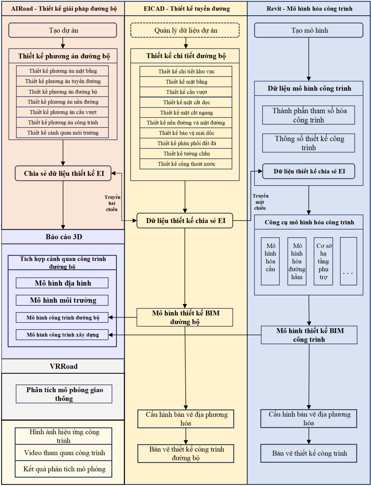

## ⚫ Gi ớ i thi ệ u chi ti ế t ph ầ n m ề m c ố t lõi ：

AIRoad là h ệ th ố ng thi ế t k ế ý tưở ng k ỹ thu ật đườ ng b ộ nhanh đượ c h ỗ tr ợ b ởi động cơ BIM và công ngh ệ AIGC, phát tri ển đặ c bi ệt cho giai đoạ n thi ế t k ế ý tưở ng c ủ a các d ự án k ỹ thu ật đườ ng cao t ố c. Ph ầ n m ề m tích h ợ p sâu GIS, kh ả o sát trên không và d ữ li ệ u không gian vi ễ n thám, cho phép t ạ o nhanh mô hình đị a hình s ố . Thông qua các công c ụ căn chỉnh tương tác và độ ng, nó h ỗ tr ợ b ố trí t ự độ ng các tuy ến đườ ng, khu v ự c và nút giao, bao g ồ m t ạ o t ự động năm loạ i m ặ t c ắ t k ế t n ố i và t ạ o nhanh mô hình c ầ u, gi ảm đáng kể độ ph ứ c t ạ p trong thi ế t k ế các tuy ến đường khó. Ưu điể m c ố t lõi là c ả i thi ện đáng kể hi ệ u qu ả thi ế t k ế . V ớ i x ử lý d ự a trên AI, nó t ự độ ng hóa toàn b ộ quy trình t ừ đầ u vào thi ế t k ế và b ố trí phương án đế n t ạ o k ế t qu ả . Trong d ự án này, AIRoad s ẽ đượ c s ử d ụ ng cho thi ế t k ế phương án tuyến đườ ng, t ối ưu hóa phương án khu vự c và thi ế t k ế nút giao. Nó h ỗ tr ợ c ấ u hình tham s ố địa phương phù hợ p v ớ i yêu c ầ u thi ế t k ế đườ ng b ộ Vi ệ t Nam và xu ấ t d ữ li ệ u chia s ẻ đị nh d ạ ng EI ch ứ a hình h ọ c, ranh gi ớ i khu v ự c, b ố trí nút giao và các thông tin quan tr ọ ng khác, cung c ấ p d ữ li ệ u chính xác cho thi ế t k ế chi ti ế t.

EICAD , ph ầ n m ềm CAD tương tác tích hợ p chu ẩ n m ự c cho thi ế t k ế đườ ng b ộ và nút giao, đượ c phát tri ể n trên n ề n t ả ng AutoCAD và ZWCAD s ử d ụ ng công ngh ệ ObjectARX để truy c ập nhanh cơ s ở d ữ li ệu đồ h ọa. Điể m m ạ nh k ỹ thu ậ t c ố t lõi n ằ m ở 'Phương pháp Dẫn Đườ ng M ới' và 'Phương pháp Ch ế Độ Đườ ng Cong H ợp Thành,' cho phép xử lý hi ệ u qu ả cao các căn chỉ nh ngang ph ứ c t ạ p như đườ ng cong hình tr ứng đơn/đôi, đườ ng cong h ợp thành, giao điể m gi ả và căn chỉ nh cong toàn ph ần. Nó cũng cung cấ p các l ệ nh chuyên bi ệt cho các đườ ng co ng đặ c bi ệt như đườ ng cong g ấ p khúc trên đườ ng cao t ốc đồi núi, tăng cường đáng kể tính linh ho ạ t trong thi ế t k ế căn chỉnh trên đị a hình ph ứ c t ạ p. Ph ầ n m ề m bao ph ủ toàn b ộ quy trình thi ế t  k ế căn chỉ nh ngang, m ặ t  c ắ t  d ọ c và m ặ t  c ắ t ngang, h ỗ tr ợ định nghĩa mẫ u d ố c tr ực quan, điề u ch ỉ nh kh ối lượng đất độ ng và qu ả n lý kho ả ng cách hi ệ u qu ả. Nó cũng thự c hi ệ n ki ể m tra thông minh các ch ỉ s ố thi ế t k ế chính bao g ồ m bán kính cong t ố i thi ể u và t ầ m nhìn. Trong d ự án này, EICAD s ẽ x ử lý d ữ li ệ u EI t ừ AIRoad cho thi ế t k ế chi ti ế t, t ậ p trung vào thi ế t  k ế n ền đườ ng và m ặt đườ ng, b ả o v ệ mái d ốc, tườ ng ch ắ n, c ố ng và các công trình khác.Nó xu ấ t b ả n v ẽ tuân th ủ tiêu chu ẩ n Vi ệ t Nam s ử d ụ ng m ẫu địa phương và cung cấp đầy đủ các tham s ố k ỹ thu ậ t và ch ỉ s ố thi ế t k ế cho giai đoạ n mô hình hóa.

Report3D chuyên v ề tr ự c quan hóa bàn cát k ỹ thu ậ t s ố và cung c ấ p kh ả năng tối ưu hóa mạ nh m ẽ cho các mô hình c ả nh quan quy mô l ớ n. S ử d ụ ng các thu ậ t toán t ối ưu hóa lướ i tiên ti ế n, nó hi ệ u qu ả lo ạ i b ỏ độ tr ễ khi di chuy ể n trong mô hình l ớ n và c ả i thi ện đáng kể hi ệ u su ấ t khung hình. Nó h ỗ tr ợ tương thích và tích hợ p hi ệ u qu ả các mô hình xu ấ t t ừ AIRoad, EICAD, Revit, Bentley và các ph ầ n m ềm mô hình đường khác. Các tính năng cố t lõi bao g ồ m xây d ự ng c ả nh 3D, di chuy ển tương tác và h ợ p nh ấ t d ữ li ệu đa nguồ n. Nó ph ủ lên mô hình BIM v ới đị a hình xung quanh, ả nh v ệ tinh và d ữ li ệ u GIS để t ạo môi trường bàn cát 3D tương tác sống độ ng v ớ i ánh sáng toàn c ầu và đường đi di chuyể n tùy ch ỉ nh. Ph ầ n m ề m h ỗ tr ợ so sánh k ị ch b ả n, chú thích thông tin chính và k ế t xu ấ t ch ất lượ ng cao mà không c ầ n thao tác ph ứ c t ạ p, r ấ t phù h ợp cho báo cáo phương án và các tình huố ng xem xét quy ế t đị nh.Trong d ự án này, Report3D s ẽ tích h ợ p các mô hình BIM t ừ EICAD (đườ ng b ộ ), Revit (k ế t c ấ u) và các mô hình môi trường để hi ể n th ị tr ự c quan b ố trí d ự án, đị nh tuy ế n và ph ố i h ợp môi trườ ng, giúp các bên liên quan có tr ả i nghi ệ m hình ả nh s ống độ ng và h ỗ tr ợ vi ệ c ra quy ết đị nh cho d ự án.

BIMEditor (Dnn CLMEditor) là ph ầ n m ềm chuyên dùng để t ổ ch ứ c, chu ẩ n hóa và qu ả n lý d ữ li ệ u bàn giao BIM cho các d ự án h ạ t ầng giao thông, đặ c bi ệt là công trình đườ ng b ộ . Ch ức năng cố t lõi c ủ a ph ầ n m ề m là tích h ợ p và qu ản lý mô hình đa đị nh d ạng, đáp ứ ng yêu c ầ u chu ẩ n hóa d ữ li ệ u trong quá trình bàn giao s ả n ph ẩ m BIM. Ph ầ n m ề m h ỗ tr ợ nh ậ p, chuy ển đổ i và qu ả n lý th ố ng nh ấ t các đị nh d ạ ng mô hình ph ổ bi ến như IFC, DDM và FBX. BIMEditor cho phép tích h ợ p d ữ li ệ u mô hình đượ c t ạ o t ừ nhi ề u b ộ môn, n ề n t ả ng ph ầ n m ềm và giai đoạ n khác nhau c ủ a d ự án vào m ộ t môi trườ ng làm vi ệ c th ố ng nh ất, đả m b ả o kh ả năng tương thích đị nh d ạ ng và liên thông thông tin mà không c ầ n th ự c hi ệ n nhi ều bướ c chuy ển đổ i d ữ li ệ u trung gian. Bên c ạnh đó, phầ n m ề m cung c ấ p các ch ức năng tái cấ u trúc phân c ấ p d ự án, gán thu ộ c tính hàng lo ạ t (Batch Property Mapping) và c ấ u hình d ữ li ệ u theo các tiêu chu ẩ n bàn giao. H ệ th ống đượ c tích h ợ p s ẵ n các m ẫ u tiêu chu ẩ n bàn giao dành cho công trình đườ ng b ộ , h ỗ tr ợ t ổ ch ứ c d ữ li ệu đầ u ra thành b ộ h ồ sơ bàn giao có cấ u trúc th ố ng nh ất, đầy đủ thông tin và đáp ứ ng yêu c ầ u c ủ a ch ủ đầu tư.

Gói D ữ li ệu Chung Đị nh d ạng EI đóng vai trò là phương tiệ n chu ẩ n hóa c ố t lõi cho vi ệc trao đổ i d ữ li ệu đa nề n t ả ng trong d ự án này. Nó đả m b ả o c ấ u trúc th ố ng nh ấ t và truy ề n t ả i thông tin thi ế t k ế không m ấ t mát t ừ thi ế t k ế ý tưởng đế n mô hình hóa. Gói d ữ li ệ u EI bao g ồ m nhi ều đị nh d ạ ng chuyên bi ệt liên quan đế n tuy ến đườ ng, k ế t c ấ u và thông tin thu ộ c tính, ch ủ y ế u bao g ồ m:

【 T ệp Đườ ng Giao C ắ t (*.JD) 】： T ự độ ng t ạ o. Ghi l ạ i d ữ li ệu căn chỉnh chính như góc giao cắ t, kho ảng cách, bán kính đườ ng cong tròn và chi ều dài đườ ng cong chuy ể n ti ế p.

【 T ệp Đơn Vị Căn Chỉnh Phương Pháp Khố i (*.ICD) 】： Thường dùng để lưu các tham số căn chỉ nh đườ ng d ố c nút giao; s ử d ụ ng n ộ i b ộ để trao đổ i d ữ li ệ u nh ằ m khôi ph ục thông tin căn chỉ nh.

【 T ệp Đườ ng Cong D ọ c (*.SQX) 】： Dùng để lưu trữ d ữ li ệ u thi ế t k ế căn chỉ nh d ọ c bao g ồm đườ ng cong d ọc, độ do và chi ều dài đườ ng cong. T ệ p SQX có th ể đượ c t ạ o t ừ l ệnh lưu đườ ng thi ế t k ế ho ặ c sinh ra sau khi san n ề n th ủ công.

【 T ệ p T ọa Độ Theo Tr ạ m (*.INF) 】： Cung c ấ p d ữ li ệ u t ọa độ theo t ừ ng tr ạ m c ủa căn chỉ nh và cung c ấ p d ữ li ệ u thi ế t y ế u cho thi ế t k ế m ặ t c ắ t ngang và t ạo mô hình đị a hình s ố .

## ⚫ Mô T ả Quy Trình Làm Vi ệ c Chi Ti ế t ：

Trong giai đoạ n thi ế t k ế sơ bộ , phiên b ả n ti ế ng Anh c ủa AIRoad đượ c áp d ụ ng. Phiên b ả n này h ỗ tr ợ mô hình hóa nhanh các phương án căn chỉ nh ph ứ c t ạ p, t ối ưu hóa bố trí m ặ t b ằ ng và thi ế t k ế nút giao. Nó có th ể hoàn thành hi ệ u qu ả thi ế t k ế n ền móng sơ bộ và t ạ o ra k ế t qu ả căn chỉ nh ngang ban đầ u, m ặ t c ắ t d ọ c và m ặ t c ắ t ngang. D ữ li ệ u chia s ẻ đị nh d ạ ng EI do AIRoad t ạ o ra ch ứ a các tham s ố hình h ọ c toàn di ệ n, ranh gi ớ i khu v ự c và thông tin b ố trí nút giao, h ỗ tr ợ tr ự c ti ế p cho thi ế t k ế chi ti ế t mà không c ầ n x ử lý l ại và hoàn toàn đáp ứ ng yêu c ầ u tham s ố địa phương hóa củ a thi ế t k ế đườ ng b ộ Vi ệ t Nam.

Trong giai đoạ n thi ế t k ế chi ti ế t, phiên b ả n ti ế ng Anh c ủa EICAD đượ c s ử d ụ ng. Nó có th ể đọ c tr ự c ti ế p d ữ li ệ u EI t ừ AIRoad mà không c ầ n chuy ển đổ i thêm. EICAD cho phép thi ế t k ế chi ti ế t hi ệ u qu ả n ề n móng và m ặt đườ ng, b ả o v ệ mái d ố c, phân b ổ kh ối lượng đấ t và các k ế t c ấu như tườ ng ch ắ n và c ống. Nó cũng hỗ tr ợ các m ẫ u b ả n v ẽ địa phương hóa tuân thủ tiêu chu ẩ n thi ế t k ế đườ ng b ộ Vi ệ t Nam. Sau khi hoàn thành thi ế t k ế chi ti ế t, EICAD xu ấ t d ữ li ệ u chia s ẻ EI ch ứ a t ấ t c ả các tham s ố k ỹ thu ậ t, thông s ố k ế t c ấ u và kh ối lượng đấ t ph ụ c v ụ cho giai đoạn mô hình hóa, đả m b ả o truy ề n t ả i thông tin chính xác và không m ấ t mát.

Trong giai đoạn mô hình hóa BIM, Revit 2024 đượ c s ử d ụ ng nh ờ kh ả năng mô hình tham số m ạ nh m ẽ và tính tương thích cao. Dự a trên d ữ li ệ u EI xu ấ t t ừ EICAD, các k ỹ sư BIM sử d ụ ng các script Dynamo để xây d ự ng chính xác mô hình ba chi ề u c ủ a c ầ u, h ầ m và các công trình ph ụ tr ợ . Mô hình địa hình và mô hình môi trường xung quanh sau đó đượ c tích h ợp để hoàn thi ệ n mô hình BIM toàn di ệ n c ủ a d ự án đườ ng b ộ . Mô hình ch ứa các kích thướ c hình h ọ c, tính ch ấ t v ậ t li ệ u, tham s ố l ắp đặ t và các thông tin thành ph ầ n thi ế t y ế u khác, h ỗ tr ợ li ề n m ạ ch cho các ứ ng d ụ ng ti ế p theo.

Gói d ữ li ệ u chia s ẻ EI ho ạt động như trung tâm chính cho việc trao đổ i d ữ li ệ u trong toàn d ự án. Phiên b ả n c ấ p doanh nghi ệp đượ c l ự a ch ọn để cho phép truy ề n d ữ li ệ u m ộ t chi ề u và hai chi ề u gi ữ a AIRoad, EICAD và Revit. T ấ t c ả d ữ li ệ u chia s ẻ tuân theo tiêu chu ẩ n mã hóa d ự án và quy cách đị nh d ạ ng th ố ng nh ấ t nh ằm đả m b ả o gi ả i thích d ữ li ệ u nh ấ t quán và c ậ p nh ật đồ ng b ộ trên t ấ t c ả các n ề n t ả ng ph ầ n m ề m.

Trong giai đoạn đầ u ra, các s ả n ph ẩm đượ c t ạ o ra thông qua s ự ph ố i h ợp đa phầ n m ề m. EICAD, đượ c trang b ị các m ẫ u b ả n v ẽ địa phương hóa, xuấ t ra các b ả n v ẽ thi ế t k ế đườ ng tiêu chu ẩ n Vi ệ t Nam và b ả n v ẽ chi ti ế t k ế t c ấu. Mô hình BIM đượ c xây d ựng trong Revit đượ c tích h ợ p v ớ i các công c ụ tr ực quan hóa để t ạ o ra các hình ả nh render ch ất lượ ng cao và video tham quan k ỹ thu ậ t. Các s ả n ph ẩ m cu ố i cùng bao g ồm mô hình BIM đầy đủ bao ph ủ đườ ng b ộ , k ế t c ấ u và các công trình ph ụ tr ợ , b ả n v ẽ thi ế t k ế và tài li ệ u trình bày tr ự c quan.

## 1) K ị ch b ả n ứ ng d ụ ng BIM c ố t lõi và ph ầ n m ềm tương ứ ng

D ự án này t ậ n d ụ ng khung ph ầ n m ềm đã chọn để h ỗ tr ợ b ố n ứ ng d ụ ng BIM chính nh ằ m nâng cao vi ệ c ra quy ết đị nh d ự án và t ối ưu hóa thiế t k ế .

Tr ực quan hóa bàn cát tương tác ba chiều đượ c phát tri ể n b ằ ng Report3D. Ứ ng d ụ ng này h ỗ tr ợ tích h ợ p hi ệ u qu ả và di chuy ển mượ t mà các mô hình quy mô l ớn. Nó tương thích vớ i các mô hình xu ấ t t ừ Revit 2020 đế n 2024 và tích h ợ p các mô hình thi ế t k ế BIM v ới đị a hình xung quanh, k ế t c ấ u và môi trườ ng b ố i c ả nh. Report3D t ạ o ra m ột môi trường bàn cát tương tác hoàn chỉ nh giúp truy ề n đạ t tr ự c quan b ố c ụ c d ự án, đị nh tuy ế n và m ố i quan h ệ không gian trong các bu ổi trình bày phương án và phiên h ọ p ra quy ết đị nh. Nhân s ự k ỹ thu ậ t v ậ n hành Report3D ph ả i thành th ạ o t ối ưu hóa cả nh và thi ế t k ế đường đi để truy ề n t ả i rõ ràng các khái ni ệ m thi ế t k ế c ố t lõi và l ợ i th ế cho các bên liên quan.

Ki ể m tra b ả n v ẽ và phát hi ệ n va ch ạm đượ c th ự c hi ệ n b ằ ng Revit 2024 k ế t h ợ p v ớ i Navisworks Manage. Sau khi xu ất mô hình Revit, Navisworks đượ c s ử d ụng để th ự c hi ệ n phát hi ệ n va ch ạ m gi ữ a các ngành và trong cùng ngành cũng như kiể m tra tính nh ấ t quán b ả n v ẽ . Ph ầ n m ề m t ự động xác đị nh các va ch ạ m, s ự can thi ệ p gi ữ a các thành ph ầ n và s ự không nh ấ t quán v ề kích thước, đồ ng th ờ i t ạ o ra các báo cáo chi ti ế t v ề v ấn đề . Chuyên gia phát hi ệ n va ch ạ m ph ả i hi ể u các thi ế t l ậ p tham s ố , phân lo ạ i v ấn đề , t ạ o báo cáo và có ki ế n th ức cơ bả n v ề thi ế t k ế k ỹ thu ật đườ ng b ộ để h ỗ tr ợ gi ả i quy ế t v ấ n đề chính xác và t ối ưu hóa thiế t k ế .

So sánh phương án đượ c th ự c hi ệ n thông qua s ự ph ố i h ợp đa phầ n m ề m. D ựa trên các phương án thi ế t k ế khái ni ệm đa dạng đượ c t ạ o ra trong AIRoad, k ỹ sư BIM xây dự ng các mô hình ba chi ề u tương ứ ng trong Revit. Các mô hình này minh h ọ a rõ ràng c ấu hình đị nh tuy ế n, kh ối lượ ng k ỹ thu ậ t, tác động môi trườ ng và các ch ỉ s ố kinh t ế k ỹ thu ậ t. Nhóm thi ế t k ế đánh giá các kế t qu ả tr ự c quan và định lượng để th ự c hi ện so sánh đa chiề u và l ự a ch ọ n, h ỗ tr ợ quy ết đị nh thi ế t k ế có cơ sở .

## 2) Cơ chế ph ố i h ợ p c ủ a h ệ th ố ng ph ầ n m ề m

Để đả m b ả o v ậ n hành hi ệ u qu ả h ệ th ố ng ph ầ n m ề m, d ự án tuân th ủ quy trình làm vi ệ c thi ế t k ế phương án sử d ụ ng AIRoad, thi ế t k ế chi ti ế t s ử d ụ ng EICAD, xây d ự ng mô hình s ử d ụ ng Revit, ph ố i h ợ p ứ ng d ụ ng s ử d ụ ng Report3D và Navisworks, và t ạ o s ả n ph ẩ m cu ố i cùng. Các m ố c quan tr ọ ng và yêu c ầ u n ộ p d ữ li ệu rõ ràng đượ c thi ế t l ậ p cho t ừng giai đoạ n, cùng v ới cơ chế giao ti ếp đa vai trò nh ằ m duy trì vi ệ c chuy ể n giao d ữ li ệu trơn tru và hiệ u qu ả .

Tính nh ấ t quán d ữ li ệu đượ c duy trì b ằ ng cách s ử d ụ ng d ữ li ệ u chia s ẻ EI làm tham chi ế u c ố t lõi cho t ấ t c ả ph ầ n m ề m. M ột cơ chế đồ ng b ộ d ữ li ệu đị nh k ỳ đượ c thi ế t l ập để đả m b ả o m ọ i s ửa đổ i thi ế t k ế đượ c c ậ p nh ậ t qua n ề n t ảng EI và đồ ng b ộ trên t ấ t c ả ph ầ n m ề m và mô hình liên quan. M ộ t qu ả n tr ị viên d ữ li ệu chuyên trách đượ c phân công ki ểm tra đị nh d ạ ng d ữ li ệ u, lo ạ i b ỏ thông tin dư thừ a và xác minh tính nh ấ t quán nh ằm ngăn ngừ a tình tr ạ ng d ữ li ệ u b ị cô l ậ p ho ặ c l ệ ch l ạ c.

K ế ho ạch năng lự c nhân s ự theo c ấu trúc đội ngũ chuyên nghiệ p. K ỹ sư thiế t k ế phương án phả i thành th ạ o AIRoad, bao g ồ m thi ế t k ế đị nh tuy ế n, t ối ưu hóa phương án và xuấ t d ữ li ệu EI, đồ ng th ờ i quen thu ộ c v ớ i tiêu chu ẩ n thi ế t k ế đườ ng b ộ Vi ệ t Nam. K ỹ sư mô hình BIM phả i thành th ạ o k ỹ thu ậ t mô hình tham s ố Revit và hi ể u nguyên lý k ế t c ấ u c ủ a c ầ u, h ầ m và công trình ph ụ tr ợ . H ọ cũng phả i có kh ả năng giả i thích d ữ li ệ u EI c ủ a EICAD và chuy ển đổi thành mô hình BIM chính xác đồ ng th ờ i đả m b ảo tương thích dữ li ệu đa n ề n t ả ng. Chuyên gia phát hi ệ n va ch ạ m và ki ể m tra b ả n v ẽ ph ả i thành th ạ o v ậ n hành Navisworks, có kh ả năng nhậ n di ệ n và phân lo ạ i v ấn đề , t ạ o báo cáo và cung c ấ p l ờ i khuyên t ối ưu hóa cơ bả n.

Tiêu chu ẩ n v ậ n hành yêu c ầ u nhóm d ự án nghiêm túc tuân th ủ các hướ ng d ẫ n v ậ n hành ph ầ n m ề m, tiêu chu ẩ n th ự c hi ệ n BIM và các quy chu ẩ n thi ế t k ế đườ ng b ộ c ủ a Vi ệt Nam. Các khóa đào tạ o ph ầ n m ềm đị nh k ỳ và các bu ổ i h ọ p k ỹ thu ật đượ c t ổ ch ức thường xuyên, đồ ng th ờ i thi ế t l ậ p h ệ th ố ng ki ể m tra ch ất lượng mô hình để ki ểm tra độ chính xác mô hình, tính đầy đủ c ủ a d ữ li ệ u và s ự tuân th ủ đị nh d ạng. Điều này đả m b ả o ch ất lượng mô hình và độ chính xác d ữ li ệu đáp ứ ng yêu c ầ u c ủ a d ự án.

## 5.3.3 Các n ề n t ả ng ph ầ n m ề m

Để đáp ứ ng các n ộ i dung áp d ụ ng BIM, yêu c ầ u v ề c ấ u hình máy ph ụ c v ụ khai thác mô hình BIM trên ph ầ n m ề m g ố c t ố i thi ể u như sau:

- -H ệ điề u hành: Microsoft Windows 10 tr ở lên; 64-bit ho ặc tương đương;
- -CPU: Intel, AMD t ố i thi ể u 8 nhân, xung nh ị p 4.5GHz tr ở lên; Intel i5-Series tr ở lên ho ặ c XeonE, Xeon-W, AMD Ryzen 5, AMD Ryzen 7 ho ặc tương đương;
- -Ram: T ố i thi ể u 32 GB;
- -Card đồ h ọ a: DirectX 11 v ớ i SA2Zer Model 5 và b ộ nh ớ video t ố i thi ể u 6GB ho ặc tương đương;
- -Độ phân gi ả i màn hình: t ố i thi ể u 1920x1080;
- -Dung lượ ng ổ c ứ ng t ố i thi ể u: 1000GB.
- -Yêu c ầ u c ấ u hình máy ph ụ c v ụ khai thác mô hình BIM trên CDE:
- -CPU: i5 th ế h ệ 10 tr ở lên ho ặ c Xeon;
- -Ram: T ố i thi ể u 16 GB;
- -Card màn hình: T ố i thi ể u 4 GB

## 5.4 Trao đổ i mô hình

Vi ệc trao đổ i thông tin gi ữ a các bên s ẽ đượ c th ự c hi ện qua thư mụ c SHD, v ớ i t ầ n su ấ t linh ho ạ t, tùy thu ộ c vào nhu c ầ u và m ức độ quan tr ọ ng c ủa các điề u ch ỉnh đượ c th ự c hi ệ n trong m ỗ i l ầ n trao đổ i.

Các t ệ p ph ải đượ c t ả i lên ở đị nh d ạ ng g ốc và đị nh d ạng trao đổ i IFC 4x3 (Mô hình t ổ ng c ậ p nh ậ t Type Class đố i v ớ i các h ạ ng m ụ c c ầ u, c ố ng, h ầ m chui , đườ ng, ATGT... Mô hình thành ph ầ n s ẽ đượ c c ậ p nh ậ t Type Class ở bướ c sau c ủ a d ự án).

Quy trình c ần tuân theo đượ c mô t ả dưới đây:

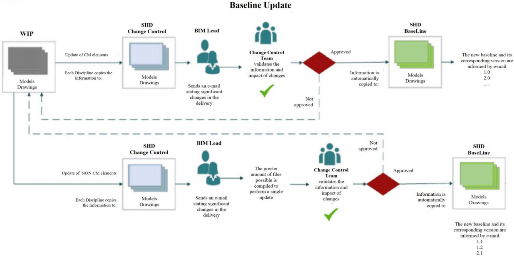

Hình 5.3 Quy trình trao đổ i mô hình

| Models Drawings                                                       | Mô hình B ả n v ẽ                                                              |
|-----------------------------------------------------------------------|--------------------------------------------------------------------------------|
| Update of CM elements                                                 | C ậ p nh ậ t các ph ầ n t ử CM                                                 |
| Each Discipline copies the information to:                            | M ỗ i chuyên ngành sao chép thông tin đế n:                                    |
| Change Control                                                        | Ki ểm soát thay đổ i                                                           |
| Models Drawings                                                       | Mô hình B ả n v ẽ                                                              |
| BIM Lead                                                              | Trưở ng nhóm BIM                                                               |
| Sends an e-mail stating significant changes in the delivery           | G ửi email thông báo các thay đổ i quan tr ọ ng trong vi ệ c bàn giao          |
| Baseline Update                                                       | C ậ p nh ật cơ sở                                                              |
| Change Control Team validates the information and impact of changes   | Nhóm ki ểm soát thay đổ i xác nh ậ n thông tin và tác độ ng c ủa các thay đổ i |
| Not approved                                                          | Không đượ c phê duy ệ t                                                        |
| Approved                                                              | Đã phê duyệ t                                                                  |
| Information is automatically copied to:                               | Thông tin đượ c t ự động sao chép đế n:                                        |
| BaseLine                                                              | Cơ sở                                                                          |
| Models Drawings                                                       | Mô hình B ả n v ẽ                                                              |
| The new baseline and its corresponding version are informed by e-mail | Cơ sở m ớ i và phiên b ản tương ứng đượ c thông báo qua email.                 |

| The greater amount of files possible is compiled to perform a single update   | S ố lượ ng t ệ p tin nhi ề u nh ấ t có th ể đượ c t ổ ng h ợp để th ự c hi ệ n m ộ t l ầ n c ậ p nh ậ t duy nh ấ t.   |
|-------------------------------------------------------------------------------|-----------------------------------------------------------------------------------------------------------------------|
| The new baseline and its corresponding version are informed by e-mail         | Cơ sở m ớ i và phiên b ản trung gian tương ứng đượ c thông báo qua email.                                             |

## Các lưu ý quan trọ ng:

- Các b ộ môn ph ả i chia s ẻ và s ử d ụ ng thông tin trên các liên k ế t c ủa cơ sở, và đây tương ứ ng v ớ i vi ệ c c ậ p nh ậ t CHÍNH TH Ứ C các mô hình. A2Z s ẽ ch ỉ đị nh các mô hình c ần đượ c s ử d ụ ng chính th ứ c cho t ừ ng nhóm thi ế t k ế qua email. Vi ệ c s ử d ụ ng các mô hình khác không tương ứ ng s ẽ gây ra r ủ i ro cao v ề vi ệ c x ử lý l ạ i do làm vi ệ c v ới thông tin CHƯA CHÍNH TH ỨC. Do đó, trách nhiệ m c ủ a m ỗ i b ộ môn là s ử d ụng đúng thông tin để tránh lãng phí tài nguyên và công vi ệ c b ị trùng l ặ p.
- T ấ t c ả các mô hình g ố c .RVT và .DWG ph ả i có kèm t ệp NWC tương ứ ng
- Thông tin ph ải đượ c chia s ẻ theo t ỷ l ệ tương ứ ng, ví d ụ , n ế u k ỹ thu ật cơ bản (60%) chưa đượ c hoàn t ấ t, các mô hình ph ải đượ c t ải lên thư mụ c ki ểm soát thay đổi tương ứ ng v ớ i giai đoạ n này và ti ế p t ục như vậ y.
- Các mô hình đượ c t ải lên thư mụ c ki ểm soát thay đổ i ph ải đi kèm vớ i các liên k ết chưa đượ c t ả i.
- Email mà các trưở ng nhóm BIM ph ả i g ửi kèm theo các thay đổ i và/ho ặc điề u ch ỉnh đã th ự c hi ệ n ph ải đượ c vi ế t theo hình ả nh sau, sao cho quá trình c ậ p nh ậ t có th ể đượ c qu ả n lý hi ệ u qu ả hơn.
- Nên s ử d ụ ng tích c ự c các không gian b ảng điề u ph ối và các Điề u ph ố i viên BIM nên đượ c tham gia vào t ừng quy trình. Như vậy, khi các quy trình xem xét đượ c kh ởi độ ng, chúng s ẽ di ễn ra nhanh hơn.
- Các điề u ph ố i viên BIM ch ỉ t ậ p trung vào vi ệ c xem xét các t ệ p g ố c d ự a trên các m ụ c c ấ u hình.
- T ấ t c ả các nhóm thi ế t k ế s ẽ c ậ p nh ậ t mô hình c ủ a h ọ trong CDE t ại thư mục 3\_SHD để điề u ph ố i và tích h ợ p, các nhóm này s ẽ có quy trình 'WIP' riêng trong các CDE tương ứ ng c ủ a h ọ, nhưng vớ i t ầ n su ất động đã đề c ậ p ở trên, h ọ ph ả i bao g ồ m mô hình c ủ a mình trong CDE A2Z trong thư mục tương ứ ng v ớ i thi ế t k ế c ủ a h ọ, để điề u ph ố i và tích h ợ p thông tin v ớ i các nhà thi ế t k ế A2Z còn l ạ i.
- T ầ n su ấ t bàn giao chính th ứ c các mô hình t ừ A2Z đến CĐT s ẽ là m ỗ i c ộ t m ố c h ợp đồ ng 30%60%-90%100%. Trong khi đó, tầ n su ất trao đổ i thông tin mô hình t ừ A2Z đến CĐT sẽ là độ ng. C ụ th ể hơn, khi thông tin mô hình trong thư mục Baseline đượ c c ậ p nh ậ t, chúng ph ả i có s ẵn cho CĐT và tấ t c ả các nhóm thi ế t k ế khác theo th ờ i gian th ự c. Trong WIP c ủ a m ỗ i c ộ t m ố c s ẽ có s ự trao đổ i mô hình và thông tin v ớ i t ầ n su ất độ ng tùy thu ộ c vào lo ạ i thi ế t k ế ho ặc giai đoạ n c ủ a nó.

## 5.5 Các cu ộ c h ọ p h ợ p tác

Dưới đây chúng tôi sẽ chi ti ế t các cu ộ c h ọ p khác nhau t ạ o thành quy trình h ợp tác theo phương pháp BIM:

- Cu ộ c h ọ p kh ởi độ ng BIM s ẽ đượ c t ổ ch ứ c gi ữa CĐT và A2Z, nhằm xác đị nh c ấ u trúc

c ủ a K ế ho ạ ch Th ự c hi ệ n BIM (BEP), các s ả n ph ẩ m BIM c ầ n bàn giao, các tiêu chu ẩ n s ẽ đượ c s ử d ụ ng trong d ự án, quy trình bàn giao phù h ợ p v ớ i Yêu c ầu thông tin trao đổ i (EIR). Sau khi xác đị nh các n ộ i dung này, cu ộ c h ọ p kh ởi độ ng s ẽ đượ c t ổ ch ứ c v ớ i t ấ t c ả các ngành thi ế t k ế và các tư vấ n ph ụ để thông báo cho h ọ v ề cách th ứ c phát tri ển phương pháp BIM trong d ự án.

- Các cu ộ c h ọ p theo dõi chi ến lượ c BIM s ẽ đượ c t ổ ch ứ c gi ữ a CĐT , nhóm BIM A2Z, các độ i thi ế t k ế n ộ i b ộ và các tư vấ n ph ụ , nh ằ m cùng nhau xem xét và hoàn thi ệ n k ế ho ạ ch th ự c hi ệ n BIM. Trong cu ộ c h ọ p này, A2Z s ẽ giám sát vi ệ c các bên th ự c hi ệ n các yêu c ầ u BIM, A2Z s ẽ hướ ng d ẫ n nhóm công tác cách hoàn thành các tài li ệu BIM như TIDP, MPDT, Báo cáo phát hành và va ch ạm, đồ ng th ờ i phát tri ể n t ấ t c ả các quy trình n ộ i b ộ c ủ a t ừ ng chuyên ngành cho giai đoạ n thi ế t k ế .
- Các cu ộ c h ọ p ph ố i h ợ p BIM s ẽ qu ả n lý các cu ộ c th ả o lu ậ n v ề gi ả i pháp thi ế t k ế và s ự can thi ệ p, s ẽ có s ự tham gia c ủa các trưở ng nhóm BIM, nhà thi ế t k ế, trưở ng khu v ự c và qu ả n lý d ự án. Các cu ộ c h ọ p ph ố i h ợ p s ẽ do Qu ả n lý Giao nh ậ n D ự án, Điề u ph ố i viên BIM và Qu ả n lý BIM đồ ng ch ủ trì.

Bên c ạ nh các cu ộ c h ọ p BIM, c ần lưu ý các cuộ c h ọp đượ c lên l ị ch trong các k ế ho ạ ch qu ả n lý khác, có liên quan tr ự c ti ếp đế n thi ế t k ế phương pháp BIM cho dự án và s ẽ đượ c t ổ ch ứ c hàng tu ần dướ i s ự d ẫ n d ắ t c ủ a qu ả n lý giao di ệ n:

- Tình tr ạ ng gi ả i pháp giao di ệ n, ph ầ n tình tr ạ ng gi ả i pháp giao di ệ n s ẽ cho phép qu ả n lý d ự án đánh giá tiến độ x ử lý và đóng các giao diệ n cho t ừng gói, đã được xác đị nh trong Ma tr ậ n Ki ể m soát Giao di ệ n. Theo cách này, m ộ t quy trình c ả nh báo s ớm đượ c thi ế t l ậ p, t ậ p trung đặ c bi ệ t vào các gói c ần đượ c chú ý ngay l ậ p t ứ c.
- Báo cáo c ả nh báo s ớ m, ph ầ n này nh ằ m tóm t ắ t các c ả nh báo s ớm đã đượ c nhóm Qu ả n lý Giao di ện xác đị nh. Báo cáo C ả nh báo S ớ m h ỗ tr ợ phân tích các ưu tiên về gi ả i pháp giao di ệ n cho t ừ ng gói.
- Báo cáo RFI, ph ầ n này bao g ồm danh sách các RFI đã gử i và nh ậ n trong hai tu ần trướ c, cũng như những RFI đã đượ c ghi trong S ổ đăng ký RFI trước đó. Tình trạng, ngườ i ch ị u trách nhi ệm và các hành độ ng theo dõi s ẽ đượ c ghi l ạ i. M ụ c tiêu là thi ế t l ập 'khả năng truy xu ấ t t ối ưu tấ t c ả các RFI, để b ấ t k ỳ RFI nào b ị ch ậ m ph ả n h ồ i có th ể đượ c phân tích k ị p th ời, cũng như lậ p k ế ho ạ ch qu ả n lý các RFI g ần đế n h ạ n chót.
- Báo cáo Thông báo Giao di ện Xung đột Chưa giả i quy ế t (NUCI), n ế u có, danh sách các giao di ện xung đột chưa đượ c gi ả i quy ế t s ẽ được trình bày khi chúng được xác đị nh. Danh sách trình bày s ẽ nêu rõ tình tr ạng các NUCI đã đượ c phát tri ển và báo cáo trước đó, cũng như các NUCI mớ i phát sinh. Trong ph ầ n này, nhóm Qu ản lý Thay đổ i s ẽ có m ặ t.

T ấ t c ả các cu ộ c h ọp đượ c mô t ả s ẽ đượ c t ổ ch ứ c xuyên su ố t d ự án t ạ i m ỗ i m ố c h ợp đồ ng, và b ắ t bu ộ c ph ả i s ử d ụ ng biên b ả n cu ộ c h ọ p ho ặ c ghi hình video, ghi l ạ i các v ấn đề đã thả o lu ậ n, các cam k ết đã đưa ra và các vấn đề c ần đượ c nâng cao ho ặ c xem xét. M ặ c dù các cu ộ c h ọ p này t ậ p trung vào giai đoạ n thi ế t k ế, khi thông tin đượ c phát tri ển và đã sẵn sàng để chia s ẻ và th ả o lu ậ n v ớ i nhà th ầ u và nhà v ậ n hành d ự án, các vai trò này s ẽ được đưa vào các cuộ c h ọ p.

B ả ng 5.3 Các cu ộ c h ọp cho giai đoạ n thi ế t k ế

| Lo ạ i cu ộ c h ọ p                     | T ầ n su ấ t*          | Ngườ i tham gia                                                                                                              | Tài nguyên c ầ n thi ế t***                                                                                                                                    |
|-----------------------------------------|------------------------|------------------------------------------------------------------------------------------------------------------------------|----------------------------------------------------------------------------------------------------------------------------------------------------------------|
| Cu ộ c h ọ p kh ở i độ ng BIM           | M ộ t l ầ n            | Độ i BIM c ủ a A2Z và CĐT                                                                                                    | Máy tính cá nhân v ớ i ứ ng d ụ ng Microsoft Office và truy c ậ p internet                                                                                     |
| Cu ộ c h ọ p kh ở i độ ng n ộ i b ộ BIM | M ộ t l ầ n            | Nhóm thi ế t k ế bao g ồm các tư v ấ n ph ụ và Độ i BIM A2Z                                                                  | Máy tính cá nhân v ớ i ứ ng d ụ ng Microsoft Office và truy c ậ p internet                                                                                     |
| Hàng tu ầ n ho ặ hai tu ầ n m ộ t       | c l ầ n                | 1. Độ i BIM c ủ a A2Z, CĐT và các độ i thi ế t k ế khác 2. Độ i BIM c ủ a A2Z, CĐT và Giám sát 3. Độ i BIM c ủ a A2Z, CĐT và | Cu ộ c h ọ p BIM hàng tu ầ n Máy tính cá nhân v ớ i ph ầ n m ề m thi ế t k ế g ố c, Navisworks Manage, các ứ ng d ụ ng Microsoft Office và truy c ậ p internet |
| Các cu ộ c h ọ p theo dõi n ộ i b ộ BIM | Hai tu ầ n m ộ t l ầ n | Nhóm thi ế t k ế bao g ồm các tư v ấ n ph ụ và Độ i BIM A2Z                                                                  | Máy tính cá nhân v ớ i ph ầ n m ề m thi ế t k ế g ố c, Navisworks Manage, các ứ ng d ụ ng Microsoft Office và truy c ậ p internet                              |
| Ph ố i h ợ p BIM                        | Hàng tu ầ n            | Độ i thi ế t k ế bao g ồm các tư vấ n ph ụ, độ i giao di ện, độ i ki ể m soát thay đổ i và Độ i BIM A2Z                      | Máy tính cá nhân v ớ i ph ầ n m ề m thi ế t k ế g ố c, Navisworks Manage, các ứ ng d ụ ng Microsoft Office và truy c ậ p internet                              |
| Các cu ộ c h ọp độ i giao di ệ n        | Hàng tu ầ n            | Độ i thi ế t k ế bao g ồm các tư vấ n ph ụ, độ i giao di ện, độ i ki ể m soát thay đổ i và Độ i BIM A2Z                      | Máy tính cá nhân v ớ i ph ầ n m ề m thi ế t k ế g ố c, Navisworks Manage, các ứ ng d ụ ng Microsoft Office và truy c ậ p internet                              |

## 5.6 Ph ố i h ợ p và phát hi ện xung độ t

Các bên liên quan trong d ự án ch ị u trách nhi ệm đả m b ả o các y ế u t ố và giao di ệ n trong mô hình thi ế t k ế c ủ a h ọ đượ c ph ố i h ợ p c ẩ n th ậ n v ới các ngành khác trong các giai đoạ n phát tri ể n thi ế t k ế. Để đả m b ả o quá trình ph ố i h ợ p thành công, t ấ t c ả các mô hình thi ế t k ế ph ải tuân theo sơ đồ quy trình phát hi ện xung đột sau đây:

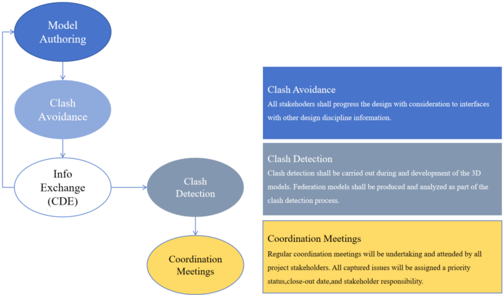

Hình 5.4 Sơ đồ quy trình phát hi ện xung độ t

| Model Authoring                                                                                                                                                                                   | T ạ o mô hình                                                                                                                                                                                                                                                               |
|---------------------------------------------------------------------------------------------------------------------------------------------------------------------------------------------------|-----------------------------------------------------------------------------------------------------------------------------------------------------------------------------------------------------------------------------------------------------------------------------|
| Clash Avoidance                                                                                                                                                                                   | Tránh xung độ t                                                                                                                                                                                                                                                             |
| Info Exchange (CDE)                                                                                                                                                                               | Trao đổ i thông tin (CDE)                                                                                                                                                                                                                                                   |
| Clash Detection                                                                                                                                                                                   | Phát hi ện xung độ t                                                                                                                                                                                                                                                        |
| Coordination Meetings                                                                                                                                                                             | Cu ộ c h ọ p ph ố i h ợ p                                                                                                                                                                                                                                                   |
| Clash Avoidance                                                                                                                                                                                   | Tránh xung độ t                                                                                                                                                                                                                                                             |
| All stakehoders shall progress the design with consideration to interfaces with other design discipline information.                                                                              | T ấ t c ả các bên liên quan s ẽ ti ế n hành thi ế t k ế v ớ i s ự xem xét các giao di ệ n v ớ i thông tin c ủ a các ngành thi ế t k ế khác.                                                                                                                                 |
| Clash Detection                                                                                                                                                                                   | Phát hi ện xung độ t                                                                                                                                                                                                                                                        |
| Clash detection shall be carried out during and development of the 3D models. Federation models shall be produced and analyzed as part of the clash detection process.                            | Phát hi ệ n va ch ạ m s ẽ đượ c th ự c hi ệ n trong quá trình phát tri ể n các mô hình 3D. Các mô hình liên k ế t (Federation models) s ẽ đượ c t ạ o ra và phân tích như mộ t ph ầ n c ủ a quy trình phát hi ệ n va ch ạ m.                                                |
| Coordination Meetings                                                                                                                                                                             | Cu ộ c h ọ p ph ố i h ợ p                                                                                                                                                                                                                                                   |
| Regular coordination meetings will be undertaking and attended by all project stakeholders. All captured issues will be assigned a priority status,close-out date,and stakeholder responsibility. | Các cu ộ c h ọ p ph ố i h ợp đị nh k ỳ s ẽ đượ c t ổ ch ứ c và có s ự tham gia c ủ a t ấ t c ả các bên liên quan trong d ự án. T ấ t c ả các v ấn đề đượ c ghi nh ậ n s ẽ đượ c phân lo ạ i theo m ức độ ưu tiên, ngày k ế t thúc và trách nhi ệ m c ủ a các bên liên quan. |

- Vi ệ c ph ố i h ợ p trong d ự án TPHCM-TLMT đượ c phát tri ể n trên ba tr ục cơ bả n mà t ấ t c ả các bên quan tâm trong d ự án đề u tham gia: Các nhà thi ế t k ế , nhóm BIM và các nhà th ầ u ph ụ .
- Các h ộ i th ả o ph ố i h ợ p (v ớ i l ịch trình đượ c thi ế t l ậ p cho t ừ ng WF và theo các ngày giao hàng theo h ợp đồ ng)
- Đánh giá kỹ thu ậ t các thi ế t k ế
- Tương tác liên ngành thông qua các vấn đề
- *Trong quá trình phát tri ể n ba tr ụ c ph ố i h ợ p này, m ộ t nh ật ký đượ c l ậ p và các b ả n ghi

đượ c t ạo ra để cho phép truy xu ấ t ngu ồ n g ố c các v ấn đề và cam k ế t giao hàng.

Các lưu ý quan trọ

ng:

- M ỗ i thành viên d ự án ch ị u trách nhi ệ m duy trì tính toàn v ẹ n c ủ a thông tin thu ộc lĩnh vự c c ủa mình trướ c khi chia s ẻ vào thư mục 'SHD' trong CDE củ a d ự án.
- Trong trườ ng h ợ p có s ự không nh ấ t quán gi ữ a b ả n v ẽ 2D và mô hình 3D BIM, trưở ng nhóm BIM ph ải đả m b ả o s ự nh ấ t quán gi ữ a hai s ả n ph ẩ m giao hàng này.
- N ế u phát hi ện xung độ t không th ể gi ả i quy ế t b ởi đội ngũ nộ i b ộ , nhà thi ế t k ế chính s ẽ đưa yêu cầ u lên các cu ộ c h ọ p ph ố i h ợp để đạt đượ c s ự đồ ng thu ậ n và th ự c hi ện các thay đổ i c ầ n thi ế t cho các mô hình.
- Các mô hình liên k ế t s ẽ đượ c chia s ẻ để đánh giá thiế t k ế và phân tích phát hi ệ n xung đột, đồ ng th ờ i s ẽ đượ c cung c ấ p cho toàn b ộ nhóm để xem xét và ph ố i h ợ p d ự a trên mô hình trong su ốt vòng đờ i d ự án.
- Người lãnh đạ o BIM c ủ a t ừ ng chuyên ngành ch ị u trách nhi ệ m giám sát và qu ả n lý quá trình phân công các s ự c ố gi ữ a các chuyên ngành khác nhau.
- T ấ t c ả các cu ộ c h ọ p ph ố i h ợ p BIM s ẽ có s ự tham gia c ủ a t ấ t c ả các thành viên liên quan trong nhóm thi ế t k ế . Các cu ộ c h ọ p này s ẽ t ậ p trung vào các v ấn đề ưu tiên, bao gồ m vi ệ c ph ố i h ợ p gói công vi ệ c phù h ợ p v ớ i ti ến độ d ự án (đường găng). Tấ t c ả các v ấn đề và s ự can thi ệp đượ c báo cáo s ẽ đượ c xem xét và th ố ng nh ấ t theo m ộ t trong các lo ạ i sau:

B ả ng 5.4 Các lo ạ i v ấn đề

| Lo ạ i              | Ưu tiên      | Ngườ i ch ị u trách nhi ệ m                                                                                                                                | Gi ả i thích                                                                           |
|---------------------|--------------|------------------------------------------------------------------------------------------------------------------------------------------------------------|----------------------------------------------------------------------------------------|
| V ấn đề thi ế t k ế | QUAN TR Ọ NG | Trưở ng nhóm thi ế t k ế                                                                                                                                   | V ấn đề thi ế t k ế, chưa có giả i pháp kh ắ c ph ụ c, c ầ n xem xét l ạ i thi ế t k ế |
| V ấn đề thi ế t k ế | Cao          | Trưở ng nhóm thi ế t k ế                                                                                                                                   | V ấn đề thi ế t k ế và ph ố i h ợ p, c ầ n xem xét l ạ i                               |
| V ấn đề thi ế t k ế | Trung bình   | Trưở ng nhóm thi ế t k ế                                                                                                                                   | V ấn đề ph ố i h ợ p không gian, c ầ n th ố ng nh ấ t các giao di ệ n                  |
| Th ấ p              | Trưở ng      | nhóm BIM ấn đề nh ỏ - l ỗ i mô hình, không ảnh n thi ế t k ế . ữ ng va ch ạ m này s ẽ đượ c qu ả n lý                                                      | V ấn đề mô hình V hưở ng đế Nh tr ự c ti ế p                                           |
| Th ấ p              | Trưở ng BIM  | nhóm Không có v ấn đề , b ỏ qua. Chúng tôi s ẽ s ử d ụ ng tr ạ ng thái phê trong Navisworks/CDE cho lo ạ i v ấn có th ể truy xu ấ t ngu ồ n g ố c c ủ a lo | Đã phê duyệ t/ V ấn đề gi ả duy ệ t đề này và ạ i v ấn đề                              |

## 5.7 N ộ i dung s ổ đăng ký rủ i ro

M ộ t r ủi ro được định nghĩa là mộ t m ối đe dọ a ti ề m ẩn đố i v ớ i các m ụ c tiêu c ủ a d ự án, có th ể là s ự ki ệ n bên trong ho ặ c bên ngoài d ự án. Ngườ i ta có th ể chia các r ủ i ro này thành r ủ i ro c ủa Đội ngũ giao hàng và r ủ i ro c ủ a D ự án BIM.

B ả ng 5.5 R ủ i ro bàn giao d ự án

| R ủ i ro giao hàng d ự án                                                                                       | Cao   | Th ấ p   | Gi ả m thi ể u                                                                                                                                                                                                                                                                                                                                                     |
|-----------------------------------------------------------------------------------------------------------------|-------|----------|--------------------------------------------------------------------------------------------------------------------------------------------------------------------------------------------------------------------------------------------------------------------------------------------------------------------------------------------------------------------|
| Gi ả định mà đội ngũ giao hàng đã đưa ra liên quan đế n yêu c ầ u trao đổ i thông tin c ủ a bên ch ỉ đị nh.     |       | x        | Cu ộ c h ọp đị nh k ỳ và có c ấ u trúc, email và cu ộ c g ọ i gi ữ a bên giao hàng và bên ch ỉ đị nh để tránh hi ể u l ầ m. H ỗ tr ợ c ủa Tư vấ n BIM t ừ CĐT vớ i s ự có m ặ t.                                                                                                                                                                                   |
| Đáp ứ ng các m ố c th ờ i gian giao thông tin d ự án do bên giao nhi ệ m v ụ đặ t ra.                           | x     |          | T ổ ch ứ c các cu ộ c h ọp thườ ng xuyên v ớ i ngườ i ch ị u trách nhi ệ m c ủ a t ừ ng nhóm thi ế t k ế (bao g ồ m c ả Trưở ng nhóm BIM). Lên l ịch các điể m ki ể m soát n ộ i b ộ cho t ừ ng s ả n ph ẩ m giao n ộ p.                                                                                                                                           |
| N ộ i dung c ủ a giao th ứ c thông tin d ự án.                                                                  |       | x        | Vi ệ c phê duy ệ t BEP và các Ph ụ l ụ c c ủ a nó giúp gi ả m thi ể u r ủ i ro này.                                                                                                                                                                                                                                                                                |
| Đạt đượ c chi ến lượ c giao thông tin đã đề xu ấ t.                                                             | x     |          | V ớ i tài li ệ u này, các m ụ c tiêu cho vi ệ c s ả n xu ấ t thông tin h ợp tác đượ c mô t ả, đồ ng th ờ i có cái nhìn t ổ ng quan rõ ràng v ề thành ph ầ n nhóm giao hàng được xác đị nh trong các tài li ệ u Qu ả n lý d ự án.                                                                                                                                   |
| Vi ệ c bao g ồ m (ho ặ c không bao g ồ m) các s ửa đổi đề xu ất đố i v ớ i tiêu chu ẩ n thông tin c ủ a d ự án. |       | x        | Ph ố i h ợ p v ớ i qu ả n lý d ự án A2Z và các cu ộ c th ả o lu ậ n ti ế p theo v ới CĐT.                                                                                                                                                                                                                                                                          |
| Tri ển khai đội ngũ BIM để đạt đượ c năng lự c và công su ấ t yêu c ầ u.                                        |       | x        | Ki ể m tra ph ầ n m ề m mô hình hóa BIM, CDE, quy trình phê duy ệ t và các v ấn đề tương tự . Ki ểm tra trao đổ i thông tin gi ữ a các nhóm công vi ệ c trên các CDE khác nhau. H ợ p tác gi ữ a ban qu ản lý, giám đố c d ự án và các Trưở ng nhóm BIM. Tuy ể n thêm thành viên và/ho ặ c t ổ ch ức đào t ạ o b ổ sung s ẽ đượ c phê duy ệ t n ế u c ầ n thi ế t. |

## B ả ng 5.6 Các r ủ i ro v ề k ỹ thu ậ t

| R ủ i ro k ỹ thu ậ t                                | Cao   | Th ấ p   | Gi ả m thi ể u                                                                                                                                                                                                              |
|-----------------------------------------------------|-------|----------|-----------------------------------------------------------------------------------------------------------------------------------------------------------------------------------------------------------------------------|
| Kh ả o sát mu ộn, không đầy đủ ho ặ c sai sót       | x     |          | Nhi ệ m v ụ này đượ c giao cho nhà th ầ u ph ụ . Để gi ả m thi ể u r ủ i ro, A2Z s ẽ th ự c hi ệ n m ộ t lo ạ t các ki ể m tra ch ất lượ ng b ằ ng ứ ng d ụ ng web do A2Z phát tri ển và đánh giá từ nhóm đo đạc đị a hình. |
| Không mu ố n s ử d ụ ng BIM                         | x     |          | M ột Trưởng nhóm BIM đượ c ch ỉ đị nh cho m ỗ i chuyên ngành và s ẽ tham gia cùng nhóm bàn giao, tham d ự các cu ộ c h ọ p thườ ng xuyên và cung c ấ p thông tin t ạ i các điể m ki ể m soát.                               |
| Không nh ấ t quán gi ữ a b ả n v ẽ 2D và mô hình 3D | x     |          | T ấ t c ả thông tin ph ải đượ c trích xu ấ t t ừ các mô hình; trong trườ ng h ợ p không th ể và có thông tin 2D không đượ c trích xu ấ t t ừ các                                                                            |

| R ủ i ro k ỹ thu ậ t                                                                                                                       | Cao   | Th ấ p   | Gi ả m thi ể u                                                                                                                                                                                                                                                                                                                         |
|--------------------------------------------------------------------------------------------------------------------------------------------|-------|----------|----------------------------------------------------------------------------------------------------------------------------------------------------------------------------------------------------------------------------------------------------------------------------------------------------------------------------------------|
|                                                                                                                                            |       |          | mô hình 3D, người đứng đầ u BIM ph ải đả m b ảo điề u này s ự nh ất quán và đồ ng b ộ .                                                                                                                                                                                                                                                |
| Vi ệ c k ỹ sư chưa quen với phương pháp và quy trình làm vi ệ c BIM                                                                        |       | x        | Như đã nêu trong mụ c 5.2.2, t ấ t c ả các quy trình phê duy ệt đề u có s ự tham gia c ủ a thành viên nhóm BIM ho ặc trưở ng nhóm BIM c ủ a chuyên ngành.                                                                                                                                                                              |
| M ộ t s ố thành viên trong nhóm c ủ a Công ty A xóa mô hình c ủa tư vấ n ph ụ khác t ừ công ty B, ho ặ c thay đổi tên mô hình đó trong CDE | x     |          | V ớ i quy ề n truy c ập thư mụ c, chúng tôi s ẽ gi ả m thi ể u r ủ i ro này                                                                                                                                                                                                                                                            |
| S ử d ụ ng các phiên b ả n ph ầ n m ề m khác v ớ i phiên b ản đã đượ c th ố ng nh ấ t trong BEP này                                        |       | x        | Vi ệc cài đặ t ph ầ n m ềm trong công ty đượ c ki ể m soát và vi ệc cài đặ t b ấ t k ỳ phiên b ả n không đượ c phép nào s ẽ không đượ c ch ấ p thu ậ n                                                                                                                                                                                 |
| B ả o m ậ t thông tin mô hình TPHCM-TL-MT và quy ề n s ở h ữ u trí tu ệ (IPR).                                                             | x     |          | V ớ i quy ề n truy c ập thư mụ c, chúng tôi s ẽ gi ả m thi ể u r ủ i ro v ề b ả o m ậ t; ngoài ra, các th ỏ a thu ậ n b ả o m ậ t s ẽ đượ c ký b ở i t ừ ng thành viên trong nhóm d ự án và c ầ n có th ỏ a thu ậ n v ề vi ệ c s ử d ụ ng quy ề n s ở h ữ u trí tu ệ gi ữ a các bên liên quan khác nhau vào cu ố i tài li ệ u BEP này. |
| M ấ t mát thông tin trong trung tâm d ữ li ệ u                                                                                             |       |          | Thông tin s ẽ được sao lưu hai tuầ n m ộ t l ầ n;                                                                                                                                                                                                                                                                                      |
| Thêm công vi ệ c/chi phí không c ầ n thi ế t trong quy trình BIM                                                                           |       | x        | S ự tham gia c ủa phòng Đổ i m ớ i trong d ự án.                                                                                                                                                                                                                                                                                       |
| M ấ t d ữ li ệ u khi xu ấ t các t ệ p g ố c BIM sang mô hình IFC                                                                           | x     |          | B ả ng công vi ệc theo các chuyên ngành, để đả m b ảo đầy đủ thông tin đầu vào và đầ u ra                                                                                                                                                                                                                                              |
| Tích h ợp không đầy đủ gi ữ a Thi ế t k ế - Điề u ph ố i - B ả n v ẽ                                                                       | x     |          | Giao ti ế p v ới các Trưở ng nhóm BIM nên đượ c th ự c hi ệ n v ớ i t ầ n su ấ t cao.                                                                                                                                                                                                                                                  |
| Ki ể m tra mã                                                                                                                              | x     |          | Nhà thi ế t k ế ph ả i tuân th ủ các tiêu chu ẩ n b ắ t bu ộc địa phương.                                                                                                                                                                                                                                                              |
| Vượ t chi phí                                                                                                                              | x     |          | Mô hình chi ti ế t theo LOG và LOI s ẽ đượ c ki ể m tra t ạ i m ỗi điể m ki ể m soát. Kh ối lượ ng l ấy ra sau đó nên giả m thi ể u r ủ i ro này.                                                                                                                                                                                      |
| Thi ế u kh ả năng truy xuấ t và trách nhi ệm trong các đánh giá nộ i b ộ                                                                   |       | x        | Qu ả n lý v ấn đề và ki ểm soát thay đổ i là c ầ n thi ế t cho công vi ệ c c ủ a t ấ t c ả các chuyên ngành. Công vi ệ c ngo ạ i tuy ến đượ c gi ả m thi ể u t ố i đa thông qua đào tạ o và các cu ộ c h ọ p kh ở i độ ng v ớ i t ấ t c ả các b ộ môn.                                                                                 |

B ả ng 5.7 R ủ i ro t ổ ch ứ c

| R ủ i ro t ổ ch ứ c                                                                                                                          | Cao   | Th ấ p   | Gi ả m thi ể u                                                                                                                                                                                                                                                                                                              |
|----------------------------------------------------------------------------------------------------------------------------------------------|-------|----------|-----------------------------------------------------------------------------------------------------------------------------------------------------------------------------------------------------------------------------------------------------------------------------------------------------------------------------|
| Th ờ i gian l ậ p k ế ho ạch không đủ                                                                                                        | x     |          | Tuân theo l ị ch trình qu ả n lý.                                                                                                                                                                                                                                                                                           |
| M ấ t nhân s ự quan tr ọ ng vào nh ữ ng th ời điể m then ch ố t c ủ a d ự án                                                                 |       | x        | T ấ t c ả các nhóm tham gia ph ải có hơn mộ t ngườ i ch ị u trách nhi ệ m v ề s ả n ph ẩ m bàn giao c ủ a h ọ .                                                                                                                                                                                                             |
| Quá t ả i công vi ệc không lườ ng trước được đố i v ớ i t ừ ng chuyên ngành                                                                  | x     |          | Quy trình làm vi ệc đã đượ c thi ế t l ậ p và ph ả i đượ c tuân th ủ, xác đị nh rõ vai trò cho t ừ ng nhi ệ m v ụ .                                                                                                                                                                                                         |
| Nhân s ự thi ế u kinh nghi ệm đượ c phân công                                                                                                |       | x        | Rà soát chi ti ế t h ồ sơ năng lực (CV) để đáp ứ ng yêu c ầ u h ợp đồ ng.                                                                                                                                                                                                                                                   |
| Nhân s ự thi ế u kinh nghi ệ m v ớ i các ph ầ n m ề m BIM khác nhau, các ti ệ n ích b ổ sung ho ặ c v ớ i CDE (Môi trườ ng d ữ li ệ u chung) | x     |          | Phát tri ển các chương trình đào tạ o. Xây d ựng hướ ng d ẫ n th ể ch ế .                                                                                                                                                                                                                                                   |
| Thi ế u giao ti ế p ho ặ c g ặp khó khăn chung.                                                                                              | x     | x        | Trong trườ ng h ợ p hi ể u l ầ m, mâu thu ẫ n ý ki ế n và ph ản đố i t ừ các bên khác nhau, nên trao đổi email để đả m b ả o kh ả năng truy vế t và trách nhi ệ m. Ph ả i có ghi chép b ằng văn bả n và/ho ặ c b ằ ng ch ứ ng âm thanh - hình ả nh (n ếu đượ c phép) c ủ a t ấ t c ả các cu ộ c h ọ p S ự tham gia t ừ CĐT. |

## 6. K Ỹ THU Ậ T: QU Ả N LÝ MÔ HÌNH

## 6.1 Chi ế n lượ c v ề dung lượ ng

D ự án s ẽ đượ c phân chia theo WBS và quy trình làm vi ệ c c ủ a t ừ ng chuyên ngành. Ph ạ m vi n ộ i dung c ủ a m ỗ i mô hình s ẽ không b ị thay đổ i n ế u không có s ự th ả o lu ận và đồ ng thu ậ n v ớ i qu ả n lý BIM d ự án và nhóm bàn giao.

Điề u này giúp các nhà thi ế t k ế và điề u ph ố i viên d ễ dàng xem xét, ch ỉ nh s ửa và điều hướ ng mô hình; các mô hình n ặng thườ ng ch ạ y ch ậm và đòi hỏ i ph ầ n c ứ ng m ạnh để tránh b ị treo ho ặ c h ỏ ng file. Kích thướ c m ỗ i mô hình s ẽ đượ c ki ể m soát ở m ứ c 500 MB vào cu ối giai đoạn IFC, độ i thi công s ẽ làm vi ệ c v ới các file dướ i 500 MB.

## 6.2 Phân chia mô hình

Tư vấ n BIM ch ấ p thu ậ n các yêu c ầ u chung v ề phân chia mô hình như đã đề c ậ p trong EIR mà Ch ủ đầu tư nêu ra, cụ th ể như bả ng sau:

B ả ng 6.1 B ả ng phân chia mô hình

| Mô hình chính                 | Mô hình chính           | Mô hình thành phần                 |
|-------------------------------|-------------------------|------------------------------------|
|                               |                         | Bề mặt hiện trạng các phân đoạn    |
| MÔ HÌNH HIỆN TRẠNG (phân chia | theo từng               | Mô hình cầu, cống thoát nước ngang |
| phân đoạn)                    | phân đoạn)              | Mô hình hiện trạng địa chất        |
| MÔ HÌNH (Phân chia phân đoạn) | Đường giao thông        | Mô hình kết cấu nền mặt đường      |
| MÔ HÌNH (Phân chia phân đoạn) | Các cầu trên tuyến      | Mô hình kết cấu phần dưới          |
| MÔ HÌNH (Phân chia phân đoạn) | Các cầu trên tuyến      | Mô hình kết cấu phần trên          |
| MÔ HÌNH (Phân chia phân đoạn) | Thoát nước ngang tuyến  | Mô hình cống tròn                  |
| MÔ HÌNH (Phân chia phân đoạn) | Thoát nước ngang tuyến  | Mô hình cống hộp                   |
| MÔ HÌNH (Phân chia phân đoạn) | Hầm chui dân sinh       | Mô hình thân hầm chui              |
| MÔ HÌNH (Phân chia phân đoạn) | Hầm chui dân sinh       | Mô hình móng hầm chui              |
| MÔ HÌNH (Phân chia phân đoạn) | An toàn giao thông      | Mô hình dải phân cách              |
| MÔ HÌNH (Phân chia phân đoạn) | An toàn giao thông      | Mô hình tôn hộ lan                 |
| MÔ HÌNH (Phân chia phân đoạn) | An toàn giao thông      | Mô hình cọc tiêu                   |
| MÔ HÌNH (Phân chia phân đoạn) | An toàn giao thông      | Mô hình lưới chống chói            |
| MÔ HÌNH (Phân chia phân đoạn) |                         | Mô hình vạch sơn                   |
| MÔ HÌNH (Phân chia phân đoạn) |                         | Mô hình biển báo                   |
| MÔ HÌNH (Phân chia phân đoạn) | Mô hình ITS-ME-TOL- WIM | Mô hình Chiếu sáng                 |
| MÔ HÌNH (Phân chia phân đoạn) | Mô hình ITS-ME-TOL- WIM | Mô hình giao thông thông minh      |
| MÔ HÌNH (Phân chia phân đoạn) | Mô hình ITS-ME-TOL- WIM | Mô hình trạm thu phí               |
| MÔ HÌNH (Phân chia phân đoạn) | Mô hình ITS-ME-TOL- WIM | Mô hình trạm cân                   |

| Mô hình chính   | Mô hình thành phần                  |
|-----------------|-------------------------------------|
| Mô              | hình điện trung thế và trạm biến áp |

## 6.3 K ế ho ạ ch chuy ể n giao thông tin

K ế ho ạ ch chuy ể n giao thông tin t ổ ng th ể bao g ồ m các chi ti ế t v ề th ời điểm, đơn vị th ự c hi ệ n cho t ừ ng n ộ i dung công vi ệ c phù h ợ p v ớ i các m ố c th ờ i gian c ủ a d ự án, chi ti ế t tham kh ả o b ả ng sau:

B ả ng 6.2 K ế ho ạ ch chuy ể n giao thông tin t ổ ng th ể

| STT   | NỘI DUNG               |                                |                                                        | MÔ TẢ                                   | LOẠI DỮ LIỆU   | ĐỊNH DẠNG TRAO ĐỔI DỮ   | GIAI ĐOẠN CHUYỂN GIAO: THIẾT KẾ KỸ THUẬT   | GIAI ĐOẠN CHUYỂN GIAO: THIẾT KẾ KỸ THUẬT   | GIAI ĐOẠN CHUYỂN GIAO: THIẾT KẾ KỸ THUẬT   | GIAI ĐOẠN CHUYỂN GIAO: THIẾT KẾ KỸ THUẬT   |
|-------|------------------------|--------------------------------|--------------------------------------------------------|-----------------------------------------|----------------|-------------------------|--------------------------------------------|--------------------------------------------|--------------------------------------------|--------------------------------------------|
| STT   | CÔNG VIỆC              | BỘ MÔN                         | TÊN TẬP TIN                                            |                                         |                | LIỆU                    | ĐƠN VỊ CHỦ TRÌ                             | NGÀY CHUYỂN GIAO                           | ĐỢT CHUYỂN GIAO                            | LOD                                        |
| 1     | BIM GIAI ĐOẠN CHUẨN BỊ | KẾ HOẠCH TRIỂN KHAI BIM (BEP)  | HTM-A2Z-GEN-KM9+325_KM105+454- PP-D-BEP-0001-[A3][C01] | Kế hoạch triển khai BIM (BEP)           | Thuyết minh    | PDF                     | A2Z                                        | …/…/2025                                   | 1                                          | -                                          |
| 2     | BIM CHO KHẢO SÁT       | MÔ HÌNH ĐỊA HÌNH KHU VỰC DỰ ÁN | HTM-CDG-RS-KM9+325_KM15+980- M3-D-SURE-0001-[A3][C01]  | Mô hình địa hình Đoạn KM9+325-KM15+980  | Mô hình 3D     | IFC, FBX                | CDG                                        | …/…/2026                                   | 1                                          | 300                                        |
| 2     | BIM CHO KHẢO SÁT       | MÔ HÌNH ĐỊA HÌNH KHU VỰC DỰ ÁN | HTM-CDG-RS-KM15+980_KM17+325- M3-D-SURE-0001-[A3][C01] | Mô hình địa hình Đoạn KM15+980-KM17+325 | Mô hình 3D     | IFC, FBX                | CDG                                        | …/…/2026                                   | 1                                          | 300                                        |
| 2     | BIM CHO KHẢO SÁT       | MÔ HÌNH ĐỊA HÌNH KHU VỰC DỰ ÁN | HTM-A2Z-RS-KM17+325_KM23+313- M3-D-SURE-0001-[A3][C01] | Mô hình địa hình Đoạn KM17+325-KM23+313 | Mô hình 3D     | IFC, FBX                | A2Z                                        | …/…/2026                                   | 1                                          | 300                                        |
| 2     | BIM CHO KHẢO SÁT       | MÔ HÌNH ĐỊA HÌNH KHU VỰC DỰ ÁN | HTM-A2Z-RS-KM23+313_KM29+000- M3-D-SURE-0001-[A3][C01] | Mô hình địa hình Đoạn KM23+313-KM29+000 | Mô hình 3D     | IFC, FBX                | A2Z                                        | …/…/2026                                   | 1                                          | 300                                        |
| 2     | BIM CHO KHẢO SÁT       | MÔ HÌNH ĐỊA HÌNH KHU VỰC DỰ ÁN | HTM-A2Z-RS-KM29+000_KM34+000- M3-D-SURE-0001-[A3][C01] | Mô hình địa hình Đoạn KM29+000-KM34+000 | Mô hình 3D     | IFC, FBX                | A2Z                                        | …/…/2026                                   | 1                                          | 300                                        |
| 2     | BIM CHO KHẢO SÁT       | MÔ HÌNH ĐỊA HÌNH KHU VỰC DỰ ÁN | HTM-A2Z-RS-KM34+000_KM39+000- M3-D-SURE-0001-[A3][C01] | Mô hình địa hình Đoạn KM34+000-KM39+000 | Mô hình 3D     | IFC, FBX                | A2Z                                        | …/…/2026                                   | 1                                          | 300                                        |
| 2     | BIM CHO KHẢO SÁT       | MÔ HÌNH ĐỊA HÌNH KHU VỰC DỰ ÁN | HTM-A2Z-RS-KM39+000_KM46+000- M3-D-SURE-0001-[A3][C01] | Mô hình địa hình Đoạn KM39+000-KM46+000 | Mô hình 3D     | IFC, FBX                | A2Z                                        | …/…/2026                                   | 1                                          | 300                                        |
| 2     | BIM CHO KHẢO SÁT       | MÔ HÌNH ĐỊA HÌNH KHU VỰC DỰ ÁN | HTM-A2Z-RS-KM46+000_KM49+620- M3-D-SURE-0001-[A3][C01] | Mô hình địa hình Đoạn KM46+000-KM49+620 | Mô hình 3D     | IFC, FBX                | A2Z                                        | …/…/2026                                   | 1                                          | 300                                        |
| 2     | BIM CHO KHẢO SÁT       | MÔ HÌNH ĐỊA HÌNH KHU VỰC DỰ ÁN | HTM-A2Z-RS-KM49+620_KM56+000- M3-D-SURE-0001-[A3][C01] | Mô hình địa hình Đoạn KM49+620-KM56+000 | Mô hình 3D     | IFC, FBX                | A2Z                                        | …/…/2026                                   | 1                                          | 300                                        |
| 2     | BIM CHO KHẢO SÁT       | MÔ HÌNH ĐỊA HÌNH KHU VỰC DỰ ÁN | HTM-A2Z-RS-KM56+000_KM61+000- M3-D-SURE-0001-[A3][C01] | Mô hình địa hình Đoạn KM56+000-KM61+000 | Mô hình 3D     | IFC, FBX                | A2Z                                        | …/…/2026                                   | 1                                          | 300                                        |

| STT   | NỘI DUNG   |                                |                                                           | MÔ TẢ                                     | LOẠI DỮ LIỆU   | ĐỊNH DẠNG TRAO ĐỔI DỮ   | GIAI ĐOẠN CHUYỂN GIAO: THIẾT KẾ KỸ THUẬT   | GIAI ĐOẠN CHUYỂN GIAO: THIẾT KẾ KỸ THUẬT   | GIAI ĐOẠN CHUYỂN GIAO: THIẾT KẾ KỸ THUẬT   | GIAI ĐOẠN CHUYỂN GIAO: THIẾT KẾ KỸ THUẬT   |
|-------|------------|--------------------------------|-----------------------------------------------------------|-------------------------------------------|----------------|-------------------------|--------------------------------------------|--------------------------------------------|--------------------------------------------|--------------------------------------------|
|       | CÔNG VIỆC  | BỘ MÔN                         | TÊN TẬP TIN                                               |                                           |                | LIỆU                    | ĐƠN VỊ CHỦ TRÌ                             | NGÀY CHUYỂN GIAO                           | ĐỢT CHUYỂN GIAO                            | LOD                                        |
|       |            |                                | HTM-A2Z-RS-KM61+000_KM67+000- M3-D-SURE-0001-[A3][C01]    | Mô hình địa hình Đoạn KM61+000-KM67+000   | Mô hình 3D     | IFC, FBX                | A2Z                                        | …/…/2026                                   | 1                                          | 300                                        |
|       |            |                                | HTM-A2Z-RS-KM67+000_KM71+000- M3-D-SURE-0001-[A3][C01]    | Mô hình địa hình Đoạn KM67+000-KM71+000   | Mô hình 3D     | IFC, FBX                | A2Z                                        | …/…/2026                                   | 1                                          | 300                                        |
|       |            |                                | HTM-A2Z-RS-KM71+000_KM75+000- M3-D-SURE-0001-[A3][C01]    | Mô hình địa hình Đoạn KM71+000-KM75+000   | Mô hình 3D     | IFC, FBX                | A2Z                                        | …/…/2026                                   | 1                                          | 300                                        |
|       |            |                                | HTM-CDG-RS-KM75+000_KM78+000- M3-D-SURE-0001-[A3][C01]    | Mô hình địa hình Đoạn KM75+000-KM78+000   | Mô hình 3D     | IFC, FBX                | CDG                                        | …/…/2026                                   | 1                                          | 300                                        |
|       |            |                                | HTM-CDG-RS-KM78+000_KM82+000- M3-D-SURE-0001-[A3][C01]    | Mô hình địa hình Đoạn KM78+000-KM82+000   | Mô hình 3D     | IFC, FBX                | CDG                                        | …/…/2026                                   | 1                                          | 300                                        |
|       |            |                                | HTM-CDG-RS-KM82+000_KM85+160- M3-D-SURE-0001-[A3][C01]    | Mô hình địa hình Đoạn KM82+000-KM85+160   | Mô hình 3D     | IFC, FBX                | CDG                                        | …/…/2026                                   | 1                                          | 300                                        |
|       |            |                                | HTM-CDG-RS-KM85+160_KM91+000- M3-D-SURE-0001-[A3][C01]    | Mô hình địa hình Đoạn KM85+160-KM91+000   | Mô hình 3D     | IFC, FBX                | CDG                                        | …/…/2026                                   | 1                                          | 300                                        |
|       |            |                                | HTM-CDG-RS-KM91+000_KM97+891- M3-D-SURE-0001-[A3][C01]    | Mô hình địa hình Đoạn KM91+000-KM97+891   | Mô hình 3D     | IFC, FBX                | CDG                                        | …/…/2026                                   | 1                                          | 300                                        |
|       |            |                                | HTM-CDG-RS-KM97+891_KM100+500- M3-D-SURE-0001-[A3][C01]   | Mô hình địa hình Đoạn KM97+891-KM100+500  | Mô hình 3D     | IFC, FBX                | CDG                                        | …/…/2026                                   | 1                                          | 300                                        |
|       |            |                                | HTM-CDG-RS- KM100+500_KM105+454-M3-D-SURE- 0001-[A3][C01] | Mô hình địa hình Đoạn KM100+500-KM105+454 | Mô hình 3D     | IFC, FBX                | CDG                                        | …/…/2026                                   | 1                                          | 300                                        |
|       |            | MÔ HÌNH ĐỊA CHẤT KHU VỰC DỰ ÁN | HTM-CDG-RS-KM9+325_KM15+980- M3-D-SURG-0001-[A3][C01]     | Mô hình địa chất Đoạn KM9+325-KM15+980    | Mô hình 3D     | IFC                     | CDG                                        | …/…/2026                                   | 1                                          | 300                                        |
|       |            | MÔ HÌNH ĐỊA CHẤT KHU VỰC DỰ ÁN | HTM-CDG-RS-KM15+980_KM17+325- M3-D-SURG-0001-[A3][C01]    | Mô hình địa chất Đoạn KM15+980-KM17+325   | Mô hình 3D     | IFC                     | CDG                                        | …/…/2026                                   | 1                                          | 300                                        |

| STT   | NỘI DUNG   |        | TIN                                                    | MÔ TẢ                                   | LOẠI DỮ LIỆU   | ĐỊNH DẠNG TRAO ĐỔI DỮ   | GIAI ĐOẠN CHUYỂN GIAO: THIẾT KẾ KỸ THUẬT   | GIAI ĐOẠN CHUYỂN GIAO: THIẾT KẾ KỸ THUẬT   | GIAI ĐOẠN CHUYỂN GIAO: THIẾT KẾ KỸ THUẬT   | GIAI ĐOẠN CHUYỂN GIAO: THIẾT KẾ KỸ THUẬT   |
|-------|------------|--------|--------------------------------------------------------|-----------------------------------------|----------------|-------------------------|--------------------------------------------|--------------------------------------------|--------------------------------------------|--------------------------------------------|
|       | CÔNG VIỆC  | BỘ MÔN | TÊN TẬP                                                |                                         |                | LIỆU                    | ĐƠN VỊ CHỦ TRÌ                             | NGÀY CHUYỂN GIAO                           | ĐỢT CHUYỂN GIAO                            | LOD                                        |
|       |            |        | HTM-A2Z-RS-KM17+325_KM23+313- M3-D-SURG-0001-[A3][C01] | Mô hình địa chất Đoạn KM17+325-KM23+313 | Mô hình 3D     | IFC                     | A2Z                                        | …/…/2026                                   | 1                                          | 300                                        |
|       |            |        | HTM-A2Z-RS-KM23+313_KM29+000- M3-D-SURG-0001-[A3][C01] | Mô hình địa chất Đoạn KM23+313-KM29+000 | Mô hình 3D     | IFC                     | A2Z                                        | …/…/2026                                   | 1                                          | 300                                        |
|       |            |        | HTM-A2Z-RS-KM29+000_KM34+000- M3-D-SURG-0001-[A3][C01] | Mô hình địa chất Đoạn KM29+000-KM34+000 | Mô hình 3D     | IFC                     | A2Z                                        | …/…/2026                                   | 1                                          | 300                                        |
|       |            |        | HTM-A2Z-RS-KM34+000_KM39+000- M3-D-SURG-0001-[A3][C01] | Mô hình địa chất Đoạn KM34+000-KM39+000 | Mô hình 3D     | IFC                     | A2Z                                        | …/…/2026                                   | 1                                          | 300                                        |
|       |            |        | HTM-A2Z-RS-KM39+000_KM46+000- M3-D-SURG-0001-[A3][C01] | Mô hình địa chất Đoạn KM39+000-KM46+000 | Mô hình 3D     | IFC                     | A2Z                                        | …/…/2026                                   | 1                                          | 300                                        |
|       |            |        | HTM-A2Z-RS-KM46+000_KM49+620- M3-D-SURG-0001-[A3][C01] | Mô hình địa chất Đoạn KM46+000-KM49+620 | Mô hình 3D     | IFC                     | A2Z                                        | …/…/2026                                   | 1                                          | 300                                        |
|       |            |        | HTM-A2Z-RS-KM49+620_KM56+000- M3-D-SURG-0001-[A3][C01] | Mô hình địa chất Đoạn KM49+620-KM56+000 | Mô hình 3D     | IFC                     | A2Z                                        | …/…/2026                                   | 1                                          | 300                                        |
|       |            |        | HTM-A2Z-RS-KM56+000_KM61+000- M3-D-SURG-0001-[A3][C01] | Mô hình địa chất Đoạn KM56+000-KM61+000 | Mô hình 3D     | IFC                     | A2Z                                        | …/…/2026                                   | 1                                          | 300                                        |
|       |            |        | HTM-A2Z-RS-KM61+000_KM67+000- M3-D-SURG-0001-[A3][C01] | Mô hình địa chất Đoạn KM61+000-KM67+000 | Mô hình 3D     | IFC                     | A2Z                                        | …/…/2026                                   | 1                                          | 300                                        |
|       |            |        | HTM-A2Z-RS-KM67+000_KM71+000- M3-D-SURG-0001-[A3][C01] | Mô hình địa chất Đoạn KM67+000-KM71+000 | Mô hình 3D     | IFC                     | A2Z                                        | …/…/2026                                   | 1                                          | 300                                        |
|       |            |        | HTM-A2Z-RS-KM71+000_KM75+000- M3-D-SURG-0001-[A3][C01] | Mô hình địa chất Đoạn KM71+000-KM75+000 | Mô hình 3D     | IFC                     | A2Z                                        | …/…/2026                                   | 1                                          | 300                                        |
|       |            |        | HTM-CDG-RS-KM75+000_KM78+000- M3-D-SURG-0001-[A3][C01] | Mô hình địa chất Đoạn KM75+000-KM78+000 | Mô hình 3D     | IFC                     | CDG                                        | …/…/2026                                   | 1                                          | 300                                        |

|   STT | NỘI DUNG         |                    |                                                           | MÔ TẢ                                               | LOẠI DỮ LIỆU                                        | ĐỊNH DẠNG TRAO ĐỔI DỮ                               | GIAI ĐOẠN CHUYỂN GIAO: THIẾT KẾ KỸ THUẬT            | GIAI ĐOẠN CHUYỂN GIAO: THIẾT KẾ KỸ THUẬT            | GIAI ĐOẠN CHUYỂN GIAO: THIẾT KẾ KỸ THUẬT            | GIAI ĐOẠN CHUYỂN GIAO: THIẾT KẾ KỸ THUẬT            |
|-------|------------------|--------------------|-----------------------------------------------------------|-----------------------------------------------------|-----------------------------------------------------|-----------------------------------------------------|-----------------------------------------------------|-----------------------------------------------------|-----------------------------------------------------|-----------------------------------------------------|
|       | CÔNG VIỆC        | BỘ MÔN             | TÊN TẬP TIN                                               |                                                     |                                                     | LIỆU                                                | ĐƠN VỊ CHỦ TRÌ                                      | NGÀY CHUYỂN GIAO                                    | ĐỢT CHUYỂN GIAO                                     | LOD                                                 |
|       |                  |                    | HTM-CDG-RS-KM78+000_KM82+000- M3-D-SURG-0001-[A3][C01]    | Mô hình địa chất Đoạn KM78+000-KM82+000             | Mô hình 3D                                          | IFC                                                 | CDG                                                 | …/…/2026                                            | 1                                                   | 300                                                 |
|       |                  |                    | HTM-CDG-RS-KM82+000_KM85+160- M3-D-SURG-0001-[A3][C01]    | Mô hình địa chất Đoạn KM82+000-KM85+160             | Mô hình 3D                                          | IFC                                                 | CDG                                                 | …/…/2026                                            | 1                                                   | 300                                                 |
|       |                  |                    | HTM-CDG-RS-KM85+160_KM91+000- M3-D-SURG-0001-[A3][C01]    | Mô hình địa chất Đoạn KM85+160-KM91+000             | Mô hình 3D                                          | IFC                                                 | CDG                                                 | …/…/2026                                            | 1                                                   | 300                                                 |
|       |                  |                    | HTM-CDG-RS-KM91+000_KM97+891- M3-D-SURG-0001-[A3][C01]    | Mô hình địa chất Đoạn KM91+000-KM97+891             | Mô hình 3D                                          | IFC                                                 | CDG                                                 | …/…/2026                                            | 1                                                   | 300                                                 |
|       |                  |                    | HTM-CDG-RS-KM97+891_KM100+500- M3-D-SURG-0001-[A3][C01]   | Mô hình địa chất Đoạn KM97+891-KM100+500            | Mô hình 3D                                          | IFC                                                 | CDG                                                 | …/…/2026                                            | 1                                                   | 300                                                 |
|       |                  |                    | HTM-CDG-RS- KM100+500_KM105+454-M3-D-SURG- 0001-[A3][C01] | Mô hình địa chất Đoạn KM100+500-KM105+454           | Mô hình 3D                                          | IFC                                                 | CDG                                                 | …/…/2026                                            | 1                                                   | 300                                                 |
|     3 | BIM CHO THIẾT KẾ | MÔ HÌNH THÀNH PHẦN | Theo Kế hoạch chuyển giao thông tin chi tiết (TIDP)       | Theo Kế hoạch chuyển giao thông tin chi tiết (TIDP) | Theo Kế hoạch chuyển giao thông tin chi tiết (TIDP) | Theo Kế hoạch chuyển giao thông tin chi tiết (TIDP) | Theo Kế hoạch chuyển giao thông tin chi tiết (TIDP) | Theo Kế hoạch chuyển giao thông tin chi tiết (TIDP) | Theo Kế hoạch chuyển giao thông tin chi tiết (TIDP) | Theo Kế hoạch chuyển giao thông tin chi tiết (TIDP) |
|     3 | BIM CHO THIẾT KẾ | MÔ HÌNH PHỐI HỢP   | HTM-CDG-GEN-KM9+325_KM15+980- M3-D-COM-0001-[A3][C01]     | Mô hình phối hợp Đoạn KM9+325-KM15+980              | Mô hình 3D                                          | CDE                                                 | CDG                                                 | …/…/2026                                            | 1                                                   | 300                                                 |
|     3 | BIM CHO THIẾT KẾ | MÔ HÌNH PHỐI HỢP   | HTM-CDG-GEN- KM15+980_KM17+325-M3-D-COM- 0001-[A3][C01]   | Mô hình phối hợp Đoạn KM15+980-KM17+325             | Mô hình 3D                                          | CDE                                                 | CDG                                                 | …/…/2026                                            | 1                                                   | 300                                                 |
|     3 | BIM CHO THIẾT KẾ | MÔ HÌNH PHỐI HỢP   | HTM-A2Z-GEN-KM17+325_KM23+313- M3-D-COM-0001-[A3][C01]    | Mô hình phối hợp Đoạn KM17+325-KM23+313             | Mô hình 3D                                          | CDE                                                 | A2Z                                                 | …/…/2026                                            | 1                                                   | 300                                                 |
|     3 | BIM CHO THIẾT KẾ | MÔ HÌNH PHỐI HỢP   | HTM-A2Z-GEN-KM23+313_KM29+000- M3-D-COM-0001-[A3][C01]    | Mô hình phối hợp Đoạn KM23+313-KM29+000             | Mô hình 3D                                          | CDE                                                 | A2Z                                                 | …/…/2026                                            | 1                                                   | 300                                                 |
|     3 | BIM CHO THIẾT KẾ | MÔ HÌNH PHỐI HỢP   | HTM-A2Z-GEN-KM29+000_KM34+000- M3-D-COM-0001-[A3][C01]    | Mô hình phối hợp Đoạn KM29+000-KM34+000             | Mô hình 3D                                          | CDE                                                 | A2Z                                                 | …/…/2026                                            | 1                                                   | 300                                                 |

| STT   | NỘI DUNG   | BỘ MÔN   |                                                         | MÔ TẢ                                   | LOẠI DỮ LIỆU   | ĐỊNH DẠNG TRAO ĐỔI   | GIAI ĐOẠN CHUYỂN GIAO: THIẾT KẾ KỸ THUẬT   | GIAI ĐOẠN CHUYỂN GIAO: THIẾT KẾ KỸ THUẬT   | GIAI ĐOẠN CHUYỂN GIAO: THIẾT KẾ KỸ THUẬT   | GIAI ĐOẠN CHUYỂN GIAO: THIẾT KẾ KỸ THUẬT   |
|-------|------------|----------|---------------------------------------------------------|-----------------------------------------|----------------|----------------------|--------------------------------------------|--------------------------------------------|--------------------------------------------|--------------------------------------------|
|       | CÔNG VIỆC  |          | TÊN TẬP TIN                                             |                                         |                | DỮ LIỆU              | ĐƠN VỊ CHỦ TRÌ                             | NGÀY CHUYỂN GIAO                           | ĐỢT CHUYỂN GIAO                            | LOD                                        |
|       |            |          | HTM-A2Z-GEN-KM34+000_KM39+000- M3-D-COM-0001-[A3][C01]  | Mô hình phối hợp Đoạn KM34+000-KM39+000 | Mô hình 3D     | CDE                  | A2Z                                        | …/…/2026                                   | 1                                          | 300                                        |
|       |            |          | HTM-A2Z-GEN-KM39+000_KM46+000- M3-D-COM-0001-[A3][C01]  | Mô hình phối hợp Đoạn KM39+000-KM46+000 | Mô hình 3D     | CDE                  | A2Z                                        | …/…/2026                                   | 1                                          | 300                                        |
|       |            |          | HTM-A2Z-GEN-KM46+000_KM49+620- M3-D-COM-0001-[A3][C01]  | Mô hình phối hợp Đoạn KM46+000-KM49+620 | Mô hình 3D     | CDE                  | A2Z                                        | …/…/2026                                   | 1                                          | 300                                        |
|       |            |          | HTM-A2Z-GEN-KM49+620_KM56+000- M3-D-COM-0001-[A3][C01]  | Mô hình phối hợp Đoạn KM49+620-KM56+000 | Mô hình 3D     | CDE                  | A2Z                                        | …/…/2026                                   | 1                                          | 300                                        |
|       |            |          | HTM-A2Z-GEN-KM56+000_KM61+000- M3-D-COM-0001-[A3][C01]  | Mô hình phối hợp Đoạn KM56+000-KM61+000 | Mô hình 3D     | CDE                  | A2Z                                        | …/…/2026                                   | 1                                          | 300                                        |
|       |            |          | HTM-A2Z-GEN-KM61+000_KM67+000- M3-D-COM-0001-[A3][C01]  | Mô hình phối hợp Đoạn KM61+000-KM67+000 | Mô hình 3D     | CDE                  | A2Z                                        | …/…/2026                                   | 1                                          | 300                                        |
|       |            |          | HTM-A2Z-GEN-KM67+000_KM71+000- M3-D-COM-0001-[A3][C01]  | Mô hình phối hợp Đoạn KM67+000-KM71+000 | Mô hình 3D     | CDE                  | A2Z                                        | …/…/2026                                   | 1                                          | 300                                        |
|       |            |          | HTM-A2Z-GEN-KM71+000_KM75+000- M3-D-COM-0001-[A3][C01]  | Mô hình phối hợp Đoạn KM71+000-KM75+000 | Mô hình 3D     | CDE                  | A2Z                                        | …/…/2026                                   | 1                                          | 300                                        |
|       |            |          | HTM-CDG-GEN- KM75+000_KM78+000-M3-D-COM- 0001-[A3][C01] | Mô hình phối hợp Đoạn KM75+000-KM78+000 | Mô hình 3D     | CDE                  | CDG                                        | …/…/2026                                   | 1                                          | 300                                        |
|       |            |          | HTM-CDG-GEN- KM78+000_KM82+000-M3-D-COM- 0001-[A3][C01] | Mô hình phối hợp Đoạn KM78+000-KM82+000 | Mô hình 3D     | CDE                  | CDG                                        | …/…/2026                                   | 1                                          | 300                                        |
|       |            |          | HTM-CDG-GEN- KM82+000_KM85+160-M3-D-COM- 0001-[A3][C01] | Mô hình phối hợp Đoạn KM82+000-KM85+160 | Mô hình 3D     | CDE                  | CDG                                        | …/…/2026                                   | 1                                          | 300                                        |
|       |            |          | HTM-CDG-GEN- KM85+160_KM91+000-M3-D-COM- 0001-[A3][C01] | Mô hình phối hợp Đoạn KM85+160-KM91+000 | Mô hình 3D     | CDE                  | CDG                                        | …/…/2026                                   | 1                                          | 300                                        |

|   STT | NỘI DUNG CÔNG            | BỘ MÔN                       |                                                           | MÔ TẢ                                     | LOẠI DỮ LIỆU   | ĐỊNH DẠNG TRAO ĐỔI DỮ   | GIAI ĐOẠN CHUYỂN GIAO: THIẾT KẾ KỸ THUẬT   | GIAI ĐOẠN CHUYỂN GIAO: THIẾT KẾ KỸ THUẬT   | GIAI ĐOẠN CHUYỂN GIAO: THIẾT KẾ KỸ THUẬT   | GIAI ĐOẠN CHUYỂN GIAO: THIẾT KẾ KỸ THUẬT   |
|-------|--------------------------|------------------------------|-----------------------------------------------------------|-------------------------------------------|----------------|-------------------------|--------------------------------------------|--------------------------------------------|--------------------------------------------|--------------------------------------------|
|       | VIỆC                     |                              | TÊN TẬP TIN                                               |                                           |                | LIỆU                    | ĐƠN VỊ CHỦ TRÌ                             | NGÀY CHUYỂN GIAO                           | ĐỢT CHUYỂN GIAO                            | LOD                                        |
|     4 | BẢNG TỔNG HỢP KHỐI LƯỢNG | BẢNG TỔNG HỢP KHỐI LƯỢNG BIM | HTM-CDG-GEN- KM91+000_KM97+891-M3-D-COM- 0001-[A3][C01]   | Mô hình phối hợp Đoạn KM91+000-KM97+891   | Mô hình 3D     | CDE                     | CDG                                        | …/…/2026                                   | 1                                          | 300                                        |
|     4 | BẢNG TỔNG HỢP KHỐI LƯỢNG | BẢNG TỔNG HỢP KHỐI LƯỢNG BIM | HTM-CDG-GEN- KM97+891_KM100+500-M3-D-COM- 0001-[A3][C01]  | Mô hình phối hợp Đoạn KM97+891-KM100+500  | Mô hình 3D     | CDE                     | CDG                                        | …/…/2026                                   | 1                                          | 300                                        |
|     4 | BẢNG TỔNG HỢP KHỐI LƯỢNG | BẢNG TỔNG HỢP KHỐI LƯỢNG BIM | HTM-CDG-GEN- KM100+500_KM105+454-M3-D-COM- 0001-[A3][C01] | Mô hình phối hợp Đoạn KM100+500-KM105+454 | Mô hình 3D     | CDE                     | CDG                                        | …/…/2026                                   | 1                                          | 300                                        |
|       |                          |                              | HTM-CDG-GEN-KM9+325_KM15+980- PP-D-VO-0001-[A3][C01]      | Bảng THKL BIM đoạn Km9+325 đến Km15+980   | Bảng THKL      | PDF                     | CDG                                        | …/…/2026                                   | 2                                          | -                                          |
|       |                          |                              | HTM-CDG-GEN- KM15+980_KM17+325-PP-D-VO-0001- [A3][C01]    | Bảng THKL BIM đoạn Km15+980 đến Km17+325  | Bảng THKL      | PDF                     | CDG                                        | …/…/2026                                   | 2                                          | -                                          |
|       |                          |                              | HTM-A2Z-GEN-KM17+325_KM23+313- PP-D-VO-0001-[A3][C01]     | Bảng THKL BIM đoạn Km17+325 đến Km23+313  | Bảng THKL      | PDF                     | A2Z                                        | …/…/2026                                   | 2                                          | -                                          |
|       |                          |                              | HTM-A2Z-GEN-KM23+313_KM29+000- PP-D-VO-0001-[A3][C01]     | Bảng THKL BIM đoạn Km23+313 đến Km29+000  | Bảng THKL      | PDF                     | A2Z                                        | …/…/2026                                   | 2                                          | -                                          |
|       |                          |                              | HTM-A2Z-GEN-KM29+000_KM34+000- PP-D-VO-0001-[A3][C01]     | Bảng THKL BIM đoạn Km29+000 đến Km34+000  | Bảng THKL      | PDF                     | A2Z                                        | …/…/2026                                   | 2                                          | -                                          |
|       |                          |                              | HTM-A2Z-GEN-KM34+000_KM39+000- PP-D-VO-0001-[A3][C01]     | Bảng THKL BIM đoạn Km34+000 đến Km39+000  | Bảng THKL      | PDF                     | A2Z                                        | …/…/2026                                   | 2                                          | -                                          |
|       |                          |                              | HTM-A2Z-GEN-KM39+000_KM46+000- PP-D-VO-0001-[A3][C01]     | Bảng THKL BIM đoạn Km39+000 đến Km46+000  | Bảng THKL      | PDF                     | A2Z                                        | …/…/2026                                   | 2                                          | -                                          |
|       |                          |                              | HTM-A2Z-GEN-KM46+000_KM49+620- PP-D-VO-0001-[A3][C01]     | Bảng THKL BIM đoạn Km46+000 đến Km49+620  | Bảng THKL      | PDF                     | A2Z                                        | …/…/2026                                   | 2                                          | -                                          |

| STT   | NỘI DUNG   |                                                        | MÔ                                       | LOẠI DỮ LIỆU   | ĐỊNH DẠNG TRAO ĐỔI DỮ   | GIAI ĐOẠN CHUYỂN GIAO: THIẾT KẾ KỸ THUẬT   | GIAI ĐOẠN CHUYỂN GIAO: THIẾT KẾ KỸ THUẬT   | GIAI ĐOẠN CHUYỂN GIAO: THIẾT KẾ KỸ THUẬT   | GIAI ĐOẠN CHUYỂN GIAO: THIẾT KẾ KỸ THUẬT   |
|-------|------------|--------------------------------------------------------|------------------------------------------|----------------|-------------------------|--------------------------------------------|--------------------------------------------|--------------------------------------------|--------------------------------------------|
|       | CÔNG VIỆC  | TÊN TẬP TIN                                            | TẢ                                       |                | LIỆU                    | ĐƠN VỊ CHỦ TRÌ                             | NGÀY CHUYỂN GIAO                           | ĐỢT CHUYỂN GIAO                            | LOD                                        |
|       |            | HTM-A2Z-GEN-KM49+620_KM56+000- PP-D-VO-0001-[A3][C01]  | Bảng THKL BIM đoạn Km49+620 đến Km56+000 | Bảng THKL      | PDF                     | A2Z                                        | …/…/2026                                   | 2                                          | -                                          |
|       |            | HTM-A2Z-GEN-KM56+000_KM61+000- PP-D-VO-0001-[A3][C01]  | Bảng THKL BIM đoạn Km56+000 đến Km61+000 | Bảng THKL      | PDF                     | A2Z                                        | …/…/2026                                   | 2                                          | -                                          |
|       |            | HTM-A2Z-GEN-KM61+000_KM67+000- PP-D-VO-0001-[A3][C01]  | Bảng THKL BIM đoạn Km61+000 đến Km67+000 | Bảng THKL      | PDF                     | A2Z                                        | …/…/2026                                   | 2                                          | -                                          |
|       |            | HTM-A2Z-GEN-KM67+000_KM71+000- PP-D-VO-0001-[A3][C01]  | Bảng THKL BIM đoạn Km67+000 đến Km71+000 | Bảng THKL      | PDF                     | A2Z                                        | …/…/2026                                   | 2                                          | -                                          |
|       |            | HTM-A2Z-GEN-KM71+000_KM75+000- PP-D-VO-0001-[A3][C01]  | Bảng THKL BIM đoạn Km71+000 đến Km75+000 | Bảng THKL      | PDF                     | A2Z                                        | …/…/2026                                   | 2                                          | -                                          |
|       |            | HTM-CDG-GEN- KM75+000_KM78+000-PP-D-VO-0001- [A3][C01] | Bảng THKL BIM đoạn Km75+000 đến Km78+000 | Bảng THKL      | PDF                     | CDG                                        | …/…/2026                                   | 2                                          | -                                          |
|       |            | HTM-CDG-GEN- KM78+000_KM82+000-PP-D-VO-0001- [A3][C01] | Bảng THKL BIM đoạn Km78+000 đến Km82+000 | Bảng THKL      | PDF                     | CDG                                        | …/…/2026                                   | 2                                          | -                                          |
|       |            | HTM-CDG-GEN- KM82+000_KM85+160-PP-D-VO-0001- [A3][C01] | Bảng THKL BIM đoạn Km82+000 đến Km85+160 | Bảng THKL      | PDF                     | CDG                                        | …/…/2026                                   | 2                                          | -                                          |
|       |            | HTM-CDG-GEN- KM85+160_KM91+000-PP-D-VO-0001- [A3][C01] | Bảng THKL BIM đoạn Km85+160 đến Km91+000 | Bảng THKL      | PDF                     | CDG                                        | …/…/2026                                   | 2                                          | -                                          |
|       |            | HTM-CDG-GEN- KM91+000_KM97+891-PP-D-VO-0001- [A3][C01] | Bảng THKL BIM đoạn Km91+000 đến Km97+891 | Bảng THKL      | PDF                     | CDG                                        | …/…/2026                                   | 2                                          | -                                          |

|   STT | NỘI DUNG   | BỘ MÔN      |                                                          | MÔ TẢ                                      | LOẠI DỮ LIỆU   | ĐỊNH DẠNG TRAO ĐỔI DỮ   | GIAI ĐOẠN CHUYỂN GIAO: THIẾT KẾ KỸ THUẬT   | GIAI ĐOẠN CHUYỂN GIAO: THIẾT KẾ KỸ THUẬT   | GIAI ĐOẠN CHUYỂN GIAO: THIẾT KẾ KỸ THUẬT   | GIAI ĐOẠN CHUYỂN GIAO: THIẾT KẾ KỸ THUẬT   |
|-------|------------|-------------|----------------------------------------------------------|--------------------------------------------|----------------|-------------------------|--------------------------------------------|--------------------------------------------|--------------------------------------------|--------------------------------------------|
|       | CÔNG VIỆC  |             | TÊN TẬP TIN                                              |                                            |                | LIỆU                    | ĐƠN VỊ CHỦ TRÌ                             | NGÀY CHUYỂN GIAO                           | ĐỢT CHUYỂN GIAO                            | LOD                                        |
|     5 | BÁO CÁO    | BÁO CÁO BIM | HTM-CDG-GEN- KM97+891_KM100+500-PP-D-VO-0001- [A3][C01]  | Bảng THKL BIM đoạn Km97+891 đến Km100+500  | Bảng THKL      | PDF                     | CDG                                        | …/…/2026                                   | 2                                          | -                                          |
|     5 | BÁO CÁO    | BÁO CÁO BIM | HTM-CDG-GEN- KM100+500_KM105+454-PP-D-VO- 0001-[A3][C01] | Bảng THKL BIM đoạn Km100+500 đến Km105+454 | Bảng THKL      | PDF                     | CDG                                        | …/…/2026                                   | 2                                          | -                                          |
|     5 |            |             | HTM-CDG-GEN-KM9+325_KM15+980- PP-D-BIMR-0001-[A3][C01]   | Báo cáo BIM đoạn Km9+325 đến Km15+980      | Báo cáo        | PDF                     | CDG                                        | …/…/2026                                   | 2                                          | -                                          |
|     5 |            |             | HTM-CDG-GEN- KM15+980_KM17+325-PP-D-BIMR- 0001-[A3][C01] | Báo cáo BIM đoạn Km15+890 đến Km17+325     | Báo cáo        | PDF                     | CDG                                        | …/…/2026                                   | 2                                          | -                                          |
|     5 |            |             | HTM-A2Z-GEN-KM17+325_KM23+313- PP-D-BIMR-0001-[A3][C01]  | Báo cáo BIM đoạn Km17+325 đến Km23+313     | Báo cáo        | PDF                     | A2Z                                        | …/…/2026                                   | 2                                          | -                                          |
|     5 |            |             | HTM-A2Z-GEN-KM23+313_KM29+000- PP-D-BIMR-0001-[A3][C01]  | Báo cáo BIM đoạn Km23+313 đến Km29+000     | Báo cáo        | PDF                     | A2Z                                        | …/…/2026                                   | 2                                          | -                                          |
|     5 |            |             | HTM-A2Z-GEN-KM29+000_KM34+000- PP-D-BIMR-0001-[A3][C01]  | Báo cáo BIM đoạn Km29+000 đến Km34+000     | Báo cáo        | PDF                     | A2Z                                        | …/…/2026                                   | 2                                          | -                                          |
|     5 |            |             | HTM-A2Z-GEN-KM34+000_KM39+000- PP-D-BIMR-0001-[A3][C01]  | Báo cáo BIM đoạn Km34+000 đến Km39+000     | Báo cáo        | PDF                     | A2Z                                        | …/…/2026                                   | 2                                          | -                                          |
|     5 |            |             | HTM-A2Z-GEN-KM39+000_KM46+000- PP-D-BIMR-0001-[A3][C01]  | Báo cáo BIM đoạn Km39+000 đến Km46+000     | Báo cáo        | PDF                     | A2Z                                        | …/…/2026                                   | 2                                          | -                                          |
|     5 |            |             | HTM-A2Z-GEN-KM46+000_KM49+620- PP-D-BIMR-0001-[A3][C01]  | Báo cáo BIM đoạn Km46+000 đến Km49+620     | Báo cáo        | PDF                     | A2Z                                        | …/…/2026                                   | 2                                          | -                                          |

| STT   | NỘI DUNG   |        | TIN                                                      | MÔ TẢ                                  | LOẠI DỮ LIỆU   | ĐỊNH DẠNG TRAO ĐỔI DỮ   | GIAI ĐOẠN CHUYỂN GIAO: THIẾT KẾ KỸ THUẬT   | GIAI ĐOẠN CHUYỂN GIAO: THIẾT KẾ KỸ THUẬT   | GIAI ĐOẠN CHUYỂN GIAO: THIẾT KẾ KỸ THUẬT   | GIAI ĐOẠN CHUYỂN GIAO: THIẾT KẾ KỸ THUẬT   |
|-------|------------|--------|----------------------------------------------------------|----------------------------------------|----------------|-------------------------|--------------------------------------------|--------------------------------------------|--------------------------------------------|--------------------------------------------|
|       | CÔNG VIỆC  | BỘ MÔN | TÊN TẬP                                                  |                                        |                | LIỆU                    | ĐƠN VỊ CHỦ TRÌ                             | NGÀY CHUYỂN GIAO                           | ĐỢT CHUYỂN GIAO                            | LOD                                        |
|       |            |        | HTM-A2Z-GEN-KM49+620_KM56+000- PP-D-BIMR-0001-[A3][C01]  | Báo cáo BIM đoạn Km49+620 đến Km56+000 | Báo cáo        | PDF                     | A2Z                                        | …/…/2026                                   | 2                                          | -                                          |
|       |            |        | HTM-A2Z-GEN-KM56+000_KM61+000- PP-D-BIMR-0001-[A3][C01]  | Báo cáo BIM đoạn Km56+000 đến Km61+000 | Báo cáo        | PDF                     | A2Z                                        | …/…/2026                                   | 2                                          | -                                          |
|       |            |        | HTM-A2Z-GEN-KM61+000_KM67+000- PP-D-BIMR-0001-[A3][C01]  | Báo cáo BIM đoạn Km61+000 đến Km67+000 | Báo cáo        | PDF                     | A2Z                                        | …/…/2026                                   | 2                                          | -                                          |
|       |            |        | HTM-A2Z-GEN-KM67+000_KM71+000- PP-D-BIMR-0001-[A3][C01]  | Báo cáo BIM đoạn Km67+000 đến Km71+000 | Báo cáo        | PDF                     | A2Z                                        | …/…/2026                                   | 2                                          | -                                          |
|       |            |        | HTM-A2Z-GEN-KM71+000_KM75+000- PP-D-BIMR-0001-[A3][C01]  | Báo cáo BIM đoạn Km71+000 đến Km75+000 | Báo cáo        | PDF                     | A2Z                                        | …/…/2026                                   | 2                                          | -                                          |
|       |            |        | HTM-CDG-GEN- KM75+000_KM78+000-PP-D-BIMR- 0001-[A3][C01] | Báo cáo BIM đoạn Km75+000 đến Km78+000 | Báo cáo        | PDF                     | CDG                                        | …/…/2026                                   | 2                                          | -                                          |
|       |            |        | HTM-CDG-GEN- KM78+000_KM82+000-PP-D-BIMR- 0001-[A3][C01] | Báo cáo BIM đoạn Km78+000 đến Km82+000 | Báo cáo        | PDF                     | CDG                                        | …/…/2026                                   | 2                                          | -                                          |
|       |            |        | HTM-CDG-GEN- KM82+000_KM85+160-PP-D-BIMR- 0001-[A3][C01] | Báo cáo BIM đoạn Km82+000 đến Km85+160 | Báo cáo        | PDF                     | CDG                                        | …/…/2026                                   | 2                                          | -                                          |
|       |            |        | HTM-CDG-GEN- KM85+160_KM91+000-PP-D-BIMR- 0001-[A3][C01] | Báo cáo BIM đoạn Km85+160 đến Km91+000 | Báo cáo        | PDF                     | CDG                                        | …/…/2026                                   | 2                                          | -                                          |
|       |            |        | HTM-CDG-GEN- KM91+000_KM97+891-PP-D-BIMR- 0001-[A3][C01] | Báo cáo BIM đoạn Km91+000 đến Km97+891 | Báo cáo        | PDF                     | CDG                                        | …/…/2026                                   | 2                                          | -                                          |

|   STT | NỘI DUNG        |            |                                                            | MÔ TẢ                                                             | LOẠI DỮ    | ĐỊNH DẠNG TRAO ĐỔI DỮ   | GIAI ĐOẠN CHUYỂN GIAO: THIẾT KẾ KỸ THUẬT   | GIAI ĐOẠN CHUYỂN GIAO: THIẾT KẾ KỸ THUẬT   | GIAI ĐOẠN CHUYỂN GIAO: THIẾT KẾ KỸ THUẬT   | GIAI ĐOẠN CHUYỂN GIAO: THIẾT KẾ KỸ THUẬT   |
|-------|-----------------|------------|------------------------------------------------------------|-------------------------------------------------------------------|------------|-------------------------|--------------------------------------------|--------------------------------------------|--------------------------------------------|--------------------------------------------|
|       | CÔNG VIỆC       | BỘ MÔN     | TÊN TẬP TIN                                                |                                                                   | LIỆU       | LIỆU                    | ĐƠN VỊ CHỦ TRÌ                             | NGÀY CHUYỂN GIAO                           | ĐỢT CHUYỂN GIAO                            | LOD                                        |
|     6 | XUẤT BẢN VẼ BIM | BẢN VẼ BIM | HTM-CDG-GEN- KM97+891_KM100+500-PP-D-BIMR- 0001-[A3][C01]  | Báo cáo BIM đoạn Km97+891 đến Km100+500                           | Báo cáo    | PDF                     | CDG                                        | …/…/2026                                   | 2                                          | -                                          |
|     6 | XUẤT BẢN VẼ BIM | BẢN VẼ BIM | HTM-CDG-GEN- KM100+500_KM105+454-PP-D-BIMR- 0001-[A3][C01] | Báo cáo BIM đoạn Km100+500 đến Km105+454                          | Báo cáo    | PDF                     | CDG                                        | …/…/2026                                   | 2                                          | -                                          |
|     6 |                 |            | HTM-CDG-GEN-KM9+325_KM17+325- DR-D-ZZ-0001- [A3][C01]      | Hồ sơ bản vẽ BIM trích xuất từ mô hình đoạn Km9+325 đến Km17+325  | Bản vẽ BIM | PDF                     | CDG                                        | …/…/2026                                   | 2                                          | -                                          |
|     6 |                 |            | HTM-CDG-GEN- KM15+980_KM17+325-DR-D-ZZ-0001- [A3][C01]     | Hồ sơ bản vẽ BIM trích xuất từ mô hình đoạn Km15+980 đến Km17+325 | Bản vẽ BIM | PDF                     | CDG                                        | …/…/2026                                   | 2                                          | -                                          |
|     6 |                 |            | HTM-A2Z-GEN-KM17+325_KM23+313- DR-D-ZZ-0001-[A3][C01]      | Hồ sơ bản vẽ BIM trích xuất từ mô hình đoạn Km17+325 đến Km23+313 | Bản vẽ BIM | PDF                     | A2Z                                        | …/…/2026                                   | 2                                          | -                                          |
|     6 |                 |            | HTM-A2Z-GEN-KM23+313_KM29+000- DR-D-ZZ-0001-[A3][C01]      | Hồ sơ bản vẽ BIM trích xuất từ mô hình đoạn Km23+313 đến Km29+000 | Bản vẽ BIM | PDF                     | A2Z                                        | …/…/2026                                   | 2                                          | -                                          |
|     6 |                 |            | HTM-A2Z-GEN-KM29+000_KM34+000- DR-D-ZZ-0001-[A3][C01]      | Hồ sơ bản vẽ BIM trích xuất từ mô hình đoạn Km29+000 đến Km34+000 | Bản vẽ BIM | PDF                     | A2Z                                        | …/…/2026                                   | 2                                          | -                                          |
|     6 |                 |            | HTM-A2Z-GEN-KM34+000_KM39+000- DR-D-ZZ-0001-[A3][C01]      | Hồ sơ bản vẽ BIM trích xuất từ mô hình đoạn Km34+000 đến Km39+000 | Bản vẽ BIM | PDF                     | A2Z                                        | …/…/2026                                   | 2                                          | -                                          |
|     6 |                 |            | HTM-A2Z-GEN-KM39+000_KM46+000- DR-D-ZZ-0001-[A3][C01]      | Hồ sơ bản vẽ BIM trích xuất từ mô hình đoạn Km39+000 đến          | Bản vẽ BIM | PDF                     | A2Z                                        | …/…/2026                                   | 2                                          | -                                          |

| STT   | NỘI DUNG   | TÊN TẬP TIN                                            |                                                                   | MÔ TẢ      | LOẠI DỮ LIỆU ĐỊNH DẠNG   | ĐƠN              | GIAI ĐOẠN CHUYỂN GIAO: THIẾT KẾ KỸ THUẬT   | GIAI ĐOẠN CHUYỂN GIAO: THIẾT KẾ KỸ THUẬT   | GIAI ĐOẠN CHUYỂN GIAO: THIẾT KẾ KỸ THUẬT   | GIAI ĐOẠN CHUYỂN GIAO: THIẾT KẾ KỸ THUẬT   |
|-------|------------|--------------------------------------------------------|-------------------------------------------------------------------|------------|--------------------------|------------------|--------------------------------------------|--------------------------------------------|--------------------------------------------|--------------------------------------------|
|       | CÔNG VIỆC  | BỘ MÔN                                                 |                                                                   |            |                          | TRAO ĐỔI DỮ LIỆU | VỊ CHỦ TRÌ                                 | NGÀY CHUYỂN GIAO                           | ĐỢT CHUYỂN GIAO                            | LOD                                        |
|       |            |                                                        | Km46+000                                                          |            |                          |                  |                                            |                                            |                                            |                                            |
|       |            | HTM-A2Z-GEN-KM46+000_KM49+620- DR-D-ZZ-0001-[A3][C01]  | Hồ sơ bản vẽ BIM trích xuất từ mô hình đoạn Km46+000 đến Km49+620 |            | Bản vẽ BIM               | PDF A2Z          |                                            | …/…/2026                                   | 2                                          | -                                          |
|       |            | HTM-A2Z-GEN-KM49+620_KM56+000- DR-D-ZZ-0001-[A3][C01]  | Hồ sơ bản vẽ BIM trích xuất từ mô hình đoạn Km49+620 đến Km56+000 | Bản vẽ BIM | PDF                      | A2Z              | …/…/2026                                   |                                            | 2                                          | -                                          |
|       |            | HTM-A2Z-GEN-KM56+000_KM61+000- DR-D-ZZ-0001-[A3][C01]  | Hồ sơ bản vẽ BIM trích xuất từ mô hình đoạn Km56+000 đến Km61+000 | Bản vẽ BIM | PDF                      | A2Z              | …/…/2026                                   | 2                                          |                                            | -                                          |
|       |            | HTM-A2Z-GEN-KM61+000_KM67+000- DR-D-ZZ-0001-[A3][C01]  | Hồ sơ bản vẽ BIM trích xuất từ mô hình đoạn Km61+000 đến Km67+000 | Bản vẽ BIM | PDF                      | A2Z              | …/…/2026                                   |                                            | 2                                          | -                                          |
|       |            | HTM-A2Z-GEN-KM67+000_KM71+000- DR-D-ZZ-0001-[A3][C01]  | Hồ sơ bản vẽ BIM trích xuất từ mô hình đoạn Km67+000 đến Km71+000 | Bản vẽ BIM | PDF                      | A2Z              | …/…/2026                                   |                                            | 2                                          | -                                          |
|       |            | HTM-A2Z-GEN-KM71+000_KM75+000- DR-D-ZZ-0001-[A3][C01]  | Hồ sơ bản vẽ BIM trích xuất từ mô hình đoạn Km71+000 đến Km75+000 | Bản vẽ BIM | PDF                      | A2Z              | …/…/2026                                   |                                            | 2                                          | -                                          |
|       |            | HTM-CDG-GEN- KM75+000_KM78+000-DR-D-ZZ-0001- [A3][C01] | Hồ sơ bản vẽ BIM trích xuất từ mô hình đoạn Km75+000 đến Km78+000 | Bản vẽ BIM | PDF                      | CDG              | …/…/2026                                   |                                            | 2                                          | -                                          |
|       |            | HTM-CDG-GEN- KM78+000_KM82+000-DR-D-ZZ-0001- [A3][C01] | Hồ sơ bản vẽ BIM trích xuất từ mô hình đoạn Km78+000 đến          | Bản vẽ BIM | PDF                      | CDG              | …/…/2026                                   |                                            | 2                                          | -                                          |

|   STT | NỘI DUNG       |                      | TẬP TIN                                                  | MÔ TẢ                                                               | LOẠI DỮ LIỆU   | ĐỊNH DẠNG TRAO ĐỔI DỮ   | GIAI ĐOẠN CHUYỂN GIAO: THIẾT KẾ KỸ THUẬT   | GIAI ĐOẠN CHUYỂN GIAO: THIẾT KẾ KỸ THUẬT   | GIAI ĐOẠN CHUYỂN GIAO: THIẾT KẾ KỸ THUẬT   | GIAI ĐOẠN CHUYỂN GIAO: THIẾT KẾ KỸ THUẬT   |
|-------|----------------|----------------------|----------------------------------------------------------|---------------------------------------------------------------------|----------------|-------------------------|--------------------------------------------|--------------------------------------------|--------------------------------------------|--------------------------------------------|
|       | CÔNG VIỆC      | BỘ MÔN               | TÊN                                                      |                                                                     |                | LIỆU                    | ĐƠN VỊ CHỦ TRÌ                             | NGÀY CHUYỂN GIAO                           | ĐỢT CHUYỂN GIAO                            | LOD                                        |
|       |                |                      |                                                          | Km82+000                                                            |                |                         |                                            |                                            |                                            |                                            |
|       |                |                      | HTM-CDG-GEN- KM82+000_KM85+160-DR-D-ZZ-0001- [A3][C01]   | Hồ sơ bản vẽ BIM trích xuất từ mô hình đoạn Km82+000 đến Km85+160   | Bản vẽ BIM     | PDF                     | CDG                                        | …/…/2026                                   | 2                                          | -                                          |
|       |                |                      | HTM-CDG-GEN- KM85+160_KM91+000-DR-D-ZZ-0001- [A3][C01]   | Hồ sơ bản vẽ BIM trích xuất từ mô hình đoạn Km85+160 đến Km91+000   | Bản vẽ BIM     | PDF                     | CDG                                        | …/…/2026                                   | 2                                          | -                                          |
|       |                |                      | HTM-CDG-GEN- KM91+000_KM97+891-DR-D-ZZ-0001- [A3][C01]   | Hồ sơ bản vẽ BIM trích xuất từ mô hình đoạn Km91+000 đến Km97+891   | Bản vẽ BIM     | PDF                     | CDG                                        | …/…/2026                                   | 2                                          | -                                          |
|       |                |                      | HTM-CDG-GEN- KM97+891_KM100+500-DR-D-ZZ- 0001-[A3][C01]  | Hồ sơ bản vẽ BIM trích xuất từ mô hình đoạn Km97+891 đến Km100+500  | Bản vẽ BIM     | PDF                     | CDG                                        | …/…/2026                                   | 2                                          | -                                          |
|       |                |                      | HTM-CDG-GEN- KM100+500_KM105+454-DR-D-ZZ- 0001-[A3][C01] | Hồ sơ bản vẽ BIM trích xuất từ mô hình đoạn Km100+500 đến Km105+454 | Bản vẽ BIM     | PDF                     | CDG                                        | …/…/2026                                   | 2                                          | -                                          |
|     7 | VIDEO          | VIDEO DIỄN HỌA       | HTM-A2Z-GEN-KM9+325_KM105+454- PP-D-SV-0001-[A3][C01]    | Diễn hoạ phương án thiết kế                                         | Video          | .MP4                    | A2Z CDG                                    | …/…/2026                                   | 2                                          | -                                          |
|     8 | SA BÀN ĐIỆN TỬ | TRÌNH DIỄN TƯƠNG TÁC | HTM-CDG-GEN- KM9+325_KM105+454-VS-D-ZZ-0001- [A3][C01]   | Ứng dụng sa bàn điện tử tương tác toàn tuyến                        | Ứng dụng       | .EXE                    | CDG                                        | …/…/2026                                   | 2                                          | -                                          |

## 6.4 Đả m b ả o và ki ể m soát ch ất lượ ng

M ụ c tiêu c ủ a các quy trình qu ả n lý ch ất lượng là đả m b ả o không có v ấn đề chưa đượ c gi ả i quy ế t trước giai đoạ n xây d ự ng ho ặ c m ấ t mát d ữ li ệu đáng kể trong quá trình chuy ể n t ừ mô hình PIM sang mô hình AIM.

B ốn nhóm đánh giá chất lượ ng s ẽ đượ c th ự c hi ệ n trong d ự án TPHCM-TLMT đượ c mô t ả dướ i đây.

B ả ng 6.3 Ki ể m tra ch ất lượ ng

| Lo ại đánh giá ch ất lượ ng                                                                                                          | Định nghĩa                                        | Bên ch ị u trách nhi ệ m                                                | Công c ụ ph ầ n m ề m               | T ầ n su ấ t                  |
|--------------------------------------------------------------------------------------------------------------------------------------|---------------------------------------------------|-------------------------------------------------------------------------|-------------------------------------|-------------------------------|
| Đả m b ả o không có các thành ph ầ n mô hình không mong mu ố n và ý đị nh thi ế t k ế đã đượ c tuân th ủ .                           | Bên / nhóm nhi ệ m v ụ đượ c ch ỉ đị nh d ẫn đầ u | Công c ụ t ạ o thi ế t k ế (Revit và Civil3D, v.v.) Navisworks.         | Độ ng                               | Hình ả nh                     |
| Phát hi ệ n các v ấn đề trong mô hình, nơi hai ho ặ c nhi ề u y ế u t ố xung độ t - bao g ồ m c ả xung đột đơn giả n và ph ứ c t ạ p | Bên / nhóm nhi ệ m v ụ đượ c ch ỉ đị nh d ẫn đầ u | Công c ụ so ạ n th ả o thi ế t k ế (Revit và Civil3D, v.v.) Navisworks. | Độ ng                               | Phát hi ệ n va ch ạ m         |
| Tuân th ủ các Tiêu chu ẩ n                                                                                                           | Nhóm công vi ệ c                                  | Công c ụ so ạ n th ả o thi ế t k ế                                      | Trướ c khi d ữ li ệu đượ c công b ố | Tiêu chu ẩ n                  |
| Đả m b ả o mô hình phù h ợ p cho vi ệ c tích h ợ p ph ố i h ợ p                                                                      | Nhóm công vi ệ c                                  | Ph ầ n m ề m so ạ n th ả o và quy trình QA ph ố i h ợ p                 | Độ ng                               | Tính toàn v ẹ n c ủ a mô hình |

## 6.5 Phân chia trách nhi ệ m th ự c hi ệ n

S ử d ụ ng ma tr ận RACI để phân ph ố i vai trò và trách nhi ệm như trình bày trong bả ng bi ểu dướ i đây:

- -R (Responsible) = Chịu trách nhiệm thực hiện nhiệm vụ
- -A (Accountable) = Chịu trách nhiệm Phê duyệt Phân công nhiệm vụ và xác nhận kết quả
- -C (Consulted) = Có nhiệm vụ tham mưu, cung cấp đầu vào để hoàn thành nhiệm vụ
- -I (Informed) = Có nhiệm vụ kiểm tra, đánh giá, lập báo cáo, chia sẻ thông tin về nhiệm vụ và/hoặc kết quả như yêu cầu

B ả ng 6.4 Phân công trách nhi ệ m các ch ủ th ể

| TRÁCH NHIỆM                                                                         | Chủ đầu tư   | Cơ quan thẩm định   | Tư vấn thẩm tra   | Tư vấn thực hiện BIM   |
|-------------------------------------------------------------------------------------|--------------|---------------------|-------------------|------------------------|
| I. MÔI TRƯỜNG DỮ LIỆU CHUNG (CDE)                                                   |              |                     |                   |                        |
| Xây dựng và g óp ý yêu cầu kỹ thuật cho CDE                                         | R            |                     | C                 | C                      |
| Cung cấp nền tảng CDE                                                               | R            |                     |                   | I                      |
| Thiết lập cấu trúc và quyền truy cập CDE                                            | A            |                     | C                 | R                      |
| Duy trì và cập nhật CDE                                                             | A            |                     | C                 | R                      |
| T ả i v ề t ả i lên t ấ t c ả các thông tin qua CDE                                 | R            | R                   | R                 | R                      |
| II. QUẢN LÝ THÔNG TIN DỰ ÁN                                                         |              |                     |                   |                        |
| Đả m b ả o h ạ t ầ ng CNTT ph ụ c v ụ BIM                                           | R            | R                   | R                 | R                      |
| Thi ế t l ậ p EIR (Yêu c ầ u thông tin)                                             | R/A          |                     | C                 | C                      |
| L ậ p và c ậ p nh ậ t K ế ho ạ ch th ự c hi ện BIM sơ bộ (Pre-BEP)                  | A            |                     | C                 | R                      |
| L ậ p và c ậ p nh ậ t K ế ho ạ ch th ự c hi ệ n BIM (BEP)                           | A            |                     | C                 | R                      |
| Xây d ự ng k ế ho ạ ch chuy ể n giao thông tin (TIDP)                               |              |                     | C                 | R                      |
| T ổ ng h ợ p và c ậ p nh ậ t k ế ho ạ ch chuy ể n giao thông tin t ổ ng th ể (MIDP) |              |                     | C                 | R                      |
| III. MÔ HÌNH HÓA VÀ PHỐI HỢP MÔ HÌNH                                                |              |                     |                   |                        |
| Hướ ng d ẫ n và giám sát th ự c hi ệ n BIM                                          | I            |                     |                   | R                      |
| Cung c ấ p d ữ li ệu đầu vào để mô hình hóa                                         | I            |                     |                   | R                      |
| T ạ o mô hình h ệ tr ụ c và t ọa độ chu ẩ n                                         | I            |                     |                   | R                      |
| Cung c ấ p mô hình theo yêu c ầ u MIDP                                              |              |                     | C                 | R                      |
| Chia s ẻ mô hình thông tin BIM ph ụ c v ụ ph ố i h ợ p                              | I            |                     | C                 | R                      |
| Tri ể n khai K ế ho ạ ch th ự c hi ệ n BIM n ộ i b ộ                                |              |                     | C                 | R                      |
| Báo cáo xung độ t mô hình                                                           |              |                     | C                 | R                      |
| Ph ố i h ợ p và ki ểm tra mô hình đị nh k ỳ                                         |              |                     | C                 | R                      |
| Đánh giá chất lượ ng mô hình BIM                                                    |              | C                   | R                 | R                      |
| Ki ể m tra vi ệ c tuân th ủ BEP                                                     |              |                     | C                 | R                      |

| TRÁCH NHIỆM                                | Chủ đầu tư   | Cơ quan thẩm định   | Tư vấn thẩm tra   | Tư vấn thực hiện BIM   |
|--------------------------------------------|--------------|---------------------|-------------------|------------------------|
| IV. KIỂM TRA, PHÊ DUYỆT VÀ CHUYỂN GIAO     |              |                     |                   |                        |
| Xác đị nh thông tin c ầ n chuy ể n giao    | A            |                     | C                 | I                      |
| Thu th ập và lưu trữ thông tin BIM         |              |                     | R                 | R                      |
| Phê duy ệ t d ữ li ệu trước khi đệ trình   | A            |                     | C                 | R                      |
| Đả m b ả o ch ất lượ ng thông tin bàn giao |              |                     | R                 | R                      |
| Ki ể m tra d ữ li ệ u nh ậ n theo EIR      | R            |                     | I                 | C                      |
| Báo cáo r ủ i ro t ừ mô hình BIM           | C            |                     | C                 | C                      |
| V. ĐÀO TẠO                                 |              |                     |                   |                        |
| Trình bày mô hình t ạ i các cu ộ c h ọ p   | R            |                     |                   | R                      |
| T ổ ch ứ c h ọp nhóm BIM đị nh k ỳ         | R            |                     |                   | R                      |
| T ổ ch ứ c h ọp BIM theo giai đoạ n        | R            | I                   |                   | R                      |
| T ổ ch ức đào tạ o/h ọ c t ậ p v ề BIM     | R            |                     |                   | R                      |

## 6.6 M ứ c độ phát tri ể n thông tin (LOD)

## 6.6.1 Các m ức độ phát tri ể n thông tin (LOD)

Trong ứ ng d ụ ng BIM, quá trình d ựng hình cho công trình được quy đị nh v ề m ức độ phát tri ể n c ủ a mô hình hay m ức độ chi ti ế t c ủa mô hình để đả m b ả o d ữ li ệ u khai thác t ừ mô hình cho các giai đoạ n khác nhau c ủ a d ự án. Thang đánh giá mức độ này đượ c g ọ i là LOD (Level of Development).

H ệ th ố ng LODXXX v ề cơ bả n là các con s ố mô ph ỏ ng s ự khác nhau c ủ a m ức độ phát tri ển đố i tượ ng mô hình qua các c ấp độ . Ch ỉ s ố LOD càng cao thì thu ộ c tính hình h ọ c và n ộ i dung thông tin càng c ụ th ể và đáng tin cậ y. Các c ấp độ chính như sau:

- -LOD 100: là c ấp độ th ấ p nh ất, thường đượ c th ể hi ệ n b ằ ng m ộ t hình kh ố i chung ho ặ c b ằ ng m ộ t ký hi ệu làm đạ i di ệ n hay mang tính bi ểu tượ ng (không ph ả i là hình d ạng, kích thướ c hay v ị trí chính xác c ủa đối tượng). LOD100 thường đượ c s ử d ụng trong giai đoạ n l ậ p ý tưở ng; thi ế t k ế sơ bộ, ướ c tính chi phí (khái toán). các thông tin v ề gi ả i pháp xây d ự ng, chi phí d ự tính trên mét vuông v.v…nên đượ c tích h ợ p trong mô hình c ủ a c ấp độ này. các thông tin t ừ c ấp độ này đề u là g ần đúng (chưa chính xác).
- -LOD 200: là c ấp độ trong đó đối tượng đượ c mô hình b ằng đồ h ọ a có hình d ạ ng hình h ọ c

nhưng gần đúng về s ố lượng, kích thướ c, v ị trí và phương/chiề u. C ấp độ này cũng có thể tích h ợ p các thông tin phi hình h ọc vào đối tượng mô hình. LOD 200 thường đượ c dùng trong giai đoạ n thi ế t k ế cơ sở c ủ a d ự án đầu tư xây dự ng; h ỗ tr ợ trong vi ệc ướ c tính chi phí, th ố ng kê, s ắ p x ế p và phân lo ạ i h ệ th ố ng trong công trình. Các thông tin t ừ c ấp độ này đề u là g ần đúng (chưa chính xác).

- -LOD 300: là c ấp độ khi đối tượng đượ c mô hình b ằng đồ h ọ a chính xác v ề hình d ạ ng, s ố lượng, kích thướ c, v ị trí và phương/chiề u. Các thông tin này có th ể được đo trự c ti ế p t ừ mô hình mà không c ầ n tham chi ế u các ghi chú hay ch ỉ d ẫ n. Các thông tin ở c ấp độ LOD300 ph ả i phù h ợ p v ớ i các quy chu ẩ n, tiêu chu ẩ n xây d ựng và đủ thông tin để có th ể bóc tách kh ối lượng, để th ố ng kê, phân lo ại, phân chia các giai đoạ n thi công. C ấp độ này phù h ợ p v ới giai đoạ n L ậ p báo cáo nghiên c ứ u kh ả thi c ủ a d ự án đầu tư xây dự ng. Các thông tin phi hình h ọc cũng có thể đượ c tích h ợ p vào mô hình c ủa đối tượ ng ở c ấp độ này.
- -LOD 350: là c ấp độ trong đó đối tượng đượ c bi ể u di ễ n b ằng đồ h ọ a theo h ệ th ố ng chính xác v ề hình d ạ ng, s ố lượng, kích thướ c, v ị trí và phương/chiề u, và có s ự liên k ế t v ớ i các h ệ th ố ng khác c ủ a công trình. Các thông tin này có th ể được đo trự c ti ế p chính xác t ừ mô hình mà không c ầ n tham chi ế u t ừ các ghi chú hay ch ỉ d ẫ n. Các thông tin ở c ấp độ LOD350 ph ả i phù h ợ p v ớ i các quy chu ẩ n, tiêu chu ẩ n xây d ựng và đủ thông tin và chính xác để có th ể bóc tách kh ối lượ ng chính xác và xu ất đầy đủ các tài li ệ u cho thi công xây d ự ng và phân chia các giai đoạn để thi công. C ấp độ này phù h ợ p v ới giai đoạ n thi ế t k ế b ả n v ẽ thi công c ủ a d ự án đầu tư xây dự ng.
- -LOD 400: là c ấp độ trong đó đối tượng đượ c bi ể u di ễ n b ằng đồ h ọ a theo h ệ th ố ng chính xác v ề hình d ạ ng, s ố lượng, kích thướ c, v ị trí và phương/chiều, và có đủ thông tin v ề c ấ u t ạ o, chi ti ế t cho ch ế t ạ o và l ắ p d ự ng. Các thông tin v ề s ố lượng, kích thướ c, hình d ạ ng, v ị trí và hướ ng c ủ a các b ộ ph ận được đo trự c ti ế p chính xác t ừ mô hình mà không c ầ n tham chi ế u t ừ các ghi chú hay ch ỉ d ẫ n. C ấp độ LOD400 đượ c hi ểu là mô hình thi công do đó phả i phù h ợ p v ớ i các bi ệ n pháp thi công xây l ắ p. C ấp độ này th ể hi ệ n chi ti ết đế n bi ệ n pháp thi công, l ắ p d ự ng và có th ể có c ả các thông tin v ề phương tiệ n máy móc thi công.

B ả ng 6.5 Minh h ọ a các m ức độ phát tri ể n thông tin

LOD 200 ng +

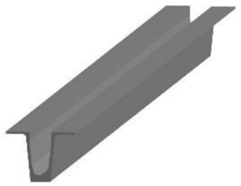

Có hình d ạ kích thước ướ c lượ ng; b ố trí tương đố i (v ị trí/hướ ng g ắ n).

LOD 300 kích thước đúng;

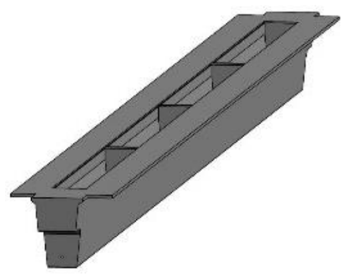

Hình d ạ ng và v ị trí và hướ ng l ắp chính xác để ph ố i h ợ p.

LOD350 t m tra

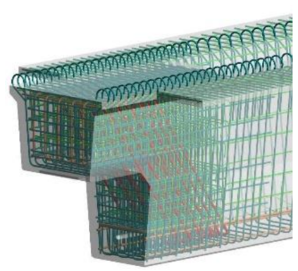

B ổ sung các chi ti ế liên k ế t/ti ế p giáp (g ố i, c ố t thép thườ ng ) để ki ể va ch ạ m.

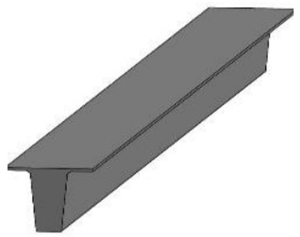

## LOD 100

Mô hình ch ỉ th ể hi ệ n hình dáng chung, chưa c ần đúng kích thướ c/v ị trí.

LOD 400

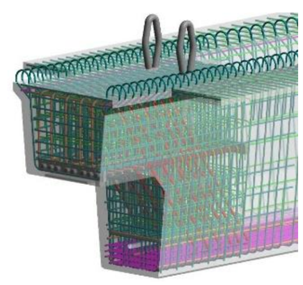

Mô hình th ể hi ệ n chi ti ế t c ấ u t ạ o & liên k ế t đầy đủ (ví d ụ bu lông,hàn,thép neo, thép d ự ứ ng l ự c) ph ụ c v ụ thi công.

## 6.6.2 M ức độ phát tri ể n thông tin phi hình h ọ c (LOI)

B ả ng M ức độ phát tri ể n thông tin phi hình h ọ c (LOI) c ủ a m ộ t s ố b ộ ph ậ n, c ấ u ki ệ n chính trong d ự án Tham kh ả o ph ụ l ụ c AB ả ng m ức độ thông tin phi hình h ọ c (LOI)

## 6.7 Yêu c ầ u xây d ự ng và v ậ n hành b ả o trì (O&M)

Các tham s ố liên quan đến giai đoạ n v ậ n hành b ả o trì (O&M) và xây d ự ng ph ải đượ c t ạ o ra ph ố i h ợ p v ớ i các nhà th ầ u thi ế t k ế , nhà th ầ u xây d ự ng và công ty Qu ản lý Cơ sở (FM). Đề xu ấ t thu th ậ p thông tin này ở giai đoạn 60%, trong các giai đoạn đầ u t ấ t c ả các tư vấ n thi ế t k ế c ầ n xem xét các yêu c ầu chung được đề c ậ p chi ti ế t. Các tham s ố liên quan đế n các m ụ c tiêu này s ẽ đượ c thêm vào t ấ t c ả các h ọ ho ặ c thành ph ầ n trong quá trình thi ế t k ế chi ti ế t.

Đố i v ới giai đoạ n xây d ự ng, thông tin này s ẽ giúp nhóm hi ể u m ộ t cách tr ự c quan kh ả năng thi công c ủ a d ự án và xác đị nh các giao di ệ n quan tr ọng cũng như ưu tiên của chúng, tăng năng suấ t xây d ự ng và thúc đẩ y an toàn b ằng cách đánh giá chính xác bố trí công trườ ng.

Đố i v ới giai đoạ n V ậ n hành & B ả o trì (O&M), c ần xác đị nh n ề n t ả ng qu ả n lý v ận hành trướ c khi đưa thông tin vào các tham số trong mô hình, không ph ả i t ấ t c ả ph ầ n m ề m qu ản lý cơ sở v ậ t ch ấ t (FM) đề u c ầ n cùng m ộ t lo ại thông tin và cũng không nhậ n thông tin theo cùng m ộ t cách. Trong quá trình phát tri ể n d ự án, ph ầ n m ề m s ẽ được xác đị nh và t ấ t c ả nh ữ ng gì c ầ n thi ế t cho vi ệ c s ử d ụ ng mô hình trong giai đoạ n O&M s ẽ đượ c chu ẩ n b ị .

A2Z ch ị u trách nhi ệ m phát tri ển mô hình trong giai đoạ n thi ế t k ế. Đố i v ới các giai đoạ n xây d ự ng và b ảo trì, CĐT sẽ ch ỉ định ngườ i ch ị u trách nhi ệ m v ề các mô hình trong các giai đoạ n này.

B ảng sau đây trình bày các tham số ban đầu cho giai đoạ n xây d ự ng và v ậ n hành & b ả o trì (O&M). B ả ng này s ẽ đượ c c ậ p nh ậ t khi thi ế t k ế ti ế n tri ể n và các bên liên quan khác nhau (Nhà th ầ u xây d ự ng và nhà v ận hành) đượ c tích h ợ p và cung c ấ p thêm thông tin cho chúng tôi.

B ả ng 6.6 Ví d ụ các tham s ố cho giai đoạ n xây d ự ng, v ậ n hành và b ả o trì (O&M)

| Danh m ụ c Thông tin                                          | Tham s ố Đề xu ấ t                   | S ử d ụng BIM Đề xu ấ t             |
|---------------------------------------------------------------|--------------------------------------|-------------------------------------|
| Trình t ự Th ờ i gian & L ị ch trình các Giai đoạ n Yêu c ầ u | Th ờ i gian Gia công                 | Ki ể m soát và l ậ p k ế ho ạ ch 3D |
| Trình t ự Th ờ i gian & L ị ch trình các Giai đoạ n Yêu c ầ u | Phương pháp và cách thứ c xây d ự ng | Thi ế t k ế h ệ th ố ng xây d ự ng  |
| Trình t ự Th ờ i gian & L ị ch trình các Giai đoạ n Yêu c ầ u | TBD                                  |                                     |
| H ậ u c ầ n và trình t ự xây d ự ng                           | S ố công vi ệ c                      | Ki ể m soát và l ậ p k ế ho ạ ch 3D |
| H ậ u c ầ n và trình t ự xây d ự ng                           | Tên công vi ệ c                      | Ki ể m soát và l ậ p k ế ho ạ ch 3D |
| H ậ u c ầ n và trình t ự xây d ự ng                           | TBD                                  |                                     |
| H ậ u c ầ n và trình t ự xây d ự ng                           | ID không gian                        | Qu ả n lý tài s ả n                 |
| Qu ản lý cơ sở /tài s ả n (T ổ ch ứ c Tiêu chu ẩ n c ụ th ể ) | Danh sách ID không gian              | Qu ả n lý tài s ả n                 |
| Qu ản lý cơ sở /tài s ả n (T ổ ch ứ c Tiêu chu ẩ n c ụ th ể ) | ID Tham chi ế u                      | Ki ể m soát và l ậ p k ế ho ạ ch 3D |
| Qu ản lý cơ sở /tài s ả n (T ổ ch ứ c Tiêu chu ẩ n c ụ th ể ) | TBD                                  |                                     |

## 7. PHƯƠNG PHÁP VÀ QUY TRÌNH TIÊU CHUẨ N

## 7.1 H ệ th ố ng t ọa độ và cao độ

Tư vấ n BIM th ố ng nh ất quy đị nh v ề t ọa độ và h ệ t ọa độ như trong mụ c 7.4 c ủ a EIR mà Ch ủ đầ u tư đưa ra, bao gồ m:

- -H ệ t ọa độ (VN2000) dùng chung cho t ấ t c ả các d ữ li ệ u BIM. H ệ t ọa độ 3 chi ề u (xyz) s ẽ đượ c s ử d ụng để đặ t các mô hình cùng m ộ t h ệ t ọa độ , tránh ph ả i di chuy ể n và chuy ển đổ i mô hình khi ph ố i h ợ p.
- -T ọa độ Survey point đượ c ch ọ n th ố ng nh ấ t gi ữ a các mô hình chính và các mô hình thành ph ầ n Revit (C ầ u/ C ố ng/ H ầ m/ Tr ạm thu phí, …) theo các mố c t ọa độ, cao độ , m ố c GPS, m ốc đườ ng chuy ề n. B ảng danh sách các điể m t ọa độ g ốc và các điểm đườ ng chuy ề n tham kh ả o Ph ụ l ụ c E- B ả ng th ố ng kê t ọa độ
- -T ấ t c ả các mô hình s ử d ụ ng m ộ t h ệ th ố ng t ọa độ đã đượ c th ố ng nh ấ t. T ấ t c ả các mô hình, b ề m ặ t thi ế t k ế s ẽ đượ c ch ồ ng lên nhau (Link) mà không c ầ n ph ả i áp d ụ ng b ấ t k ỳ ho ạt độ ng di chuy ể n hay chuy ển đổ i nào.

B ả ng 7.1 B ả ng t ọa độ Survey point s ử d ụ ng cho mô hình h ạ ng m ụ c tuy ế n, c ố ng, h ầ m chui, ATGT và ME-ITS-MEP-WIM

|   Phân đoạ n | Mô hình thành ph ầ n & Mô hình chính   |     N/S (m) |    E/W (m) | M Ố C GPS/DC   | GHI CHÚ   |
|--------------|----------------------------------------|-------------|------------|----------------|-----------|
|            1 | Km9+325-Km15+980                       | 1180654.825 | 586758.359 | DC6-01A        | CDG       |
|          2.1 | Km15+980-Km17+325                      | 1179084.417 | 582761.161 | DC7-05         | CDG       |
|          2.2 | Km17+325-Km23+313                      | 1177936.591 | 578901.308 | DC8-12         | A2Z       |
|            3 | Km23+313-Km29+000                      | 1174176.567 | 574562.172 | DC10-8         | A2Z       |
|            4 | Km29+000-Km34+000                      | 1170394.608 | 571026.119 | DC12-04        | A2Z       |
|            5 | Km34+000-Km39+000                      | 1166432.208 | 567862.856 | GPS-14         | A2Z       |
|            6 | Km39+000-Km46+000                      | 1161506.291 | 564419.573 | GPS-16         | A2Z       |
|            7 | Km46+000-Km49+620                      | 1156656.144 | 562567.041 | DC17-08        | A2Z       |
|            8 | Km49+620-Km56+000                      | 1153948.040 | 558406.193 | DC20-02        | A2Z       |
|            9 | Km56+000-Km61+000                      | 1153842.576 | 553295.350 | DC22-01        | A2Z       |
|           10 | Km61+000-Km67+000                      | 1152776.469 | 547580.856 | DC24-02        | A2Z       |
|           11 | Km67+000-Km71+000                      | 1152678.318 | 542141.659 | DC26-02        | A2Z       |
|         12.1 | Km71+000-Km75+000                      | 1152680.829 | 537932.242 | DC27-08        | A2Z       |
|         12.2 | Km75+000-Km78+000                      | 1152546.143 | 535817.199 | DC28-06        | CDG       |
|           13 | Km78+000 - Km82+000                    | 1151755.479 | 532195.048 | DC29-09        | CDG       |
|           14 | Km82+000-Km85+160                      | 1150494.034 | 528396.762 | DC31-03        | CDG       |
|           15 | Km85+160-Km91+000                      | 1148377.266 | 524524.067 | DC32-09        | CDG       |
|           16 | Km91+000-Km97+891                      | 1145109.682 | 518632.328 | DC34-12        | CDG       |
|           17 | Km97+891-Km100+500                     | 1142436.455 | 515292.448 | DC36-04        | CDG       |
|           18 | Km100+500-Km105+454                    | 1139250.056 | 515032.137 | DC37-09        | CDG       |

B ả ng 7.2 B ả ng t ọa độ điể m kh ả o sát s ử d ụ ng cho mô hình h ạ ng m ụ c C ầ u

| STT   | Tên c ầ u                                  | Lý trình                                   | N/S (m)                                    | E/W (m)                                    | M Ố C GPS/DC                               | GHI CHÚ                                    |
|-------|--------------------------------------------|--------------------------------------------|--------------------------------------------|--------------------------------------------|--------------------------------------------|--------------------------------------------|
| A     | ĐOẠ N HCM-TL                               | ĐOẠ N HCM-TL                               | ĐOẠ N HCM-TL                               | ĐOẠ N HCM-TL                               | ĐOẠ N HCM-TL                               | ĐOẠ N HCM-TL                               |
| I     | KM9+325-KM29+000                           | KM9+325-KM29+000                           | KM9+325-KM29+000                           | KM9+325-KM29+000                           | KM9+325-KM29+000                           | KM9+325-KM29+000                           |
| 1     | C ầu vượ t nút giao Ch ợ Đệ m              | Km12+700                                   | 1181645.631                                | 589196.329                                 | DC5-05                                     |                                            |
| 2     | C ầ u Cao (c ầ u c ạ n)                    | Km10+600                                   | 1181123.800                                | 587578.896                                 | DC5-15                                     |                                            |
| 3     | C ầ u B ế n L ứ c                          | Km20+740                                   | 1177791.234                                | 578820.581                                 | DC8-13                                     |                                            |
| 4     | C ầ u Ván                                  | Km26+000                                   | 1174176.567                                | 574562.172                                 | DC10-8                                     |                                            |
| II    | KM29+000-KM49+620                          | KM29+000-KM49+620                          | KM29+000-KM49+620                          | KM29+000-KM49+620                          | KM29+000-KM49+620                          | KM29+000-KM49+620                          |
| II.1  | C ầ u trên tuy ế n chính cao t ố c         | C ầ u trên tuy ế n chính cao t ố c         | C ầ u trên tuy ế n chính cao t ố c         | C ầ u trên tuy ế n chính cao t ố c         | C ầ u trên tuy ế n chính cao t ố c         | C ầ u trên tuy ế n chính cao t ố c         |
| 1     | C ầ u Cây Gáo                              | Km29+291.83                                | 1171867.758                                | 572319.335                                 | DC11-12                                    |                                            |
| 2     | C ầ u c ạn đoạ n 2                         | Km34+289.94- Km35+624.90                   | 1167133.196                                | 568126.334                                 | DC13-10                                    |                                            |
| 3     | C ầ u c ạn đoạ n 2.1                       | Km35+895.10 Km37+549.44                    | 1167133.196                                | 568126.334                                 | DC13-10                                    |                                            |
| 4     | C ầ u Tân An                               | Km 36+600                                  | 1167133.196                                | 568126.334                                 | DC13-10                                    |                                            |
| 5     | C ầ u c ạn đoạ n 3                         | Km38+338.67- Km38+900.77                   | 1163362.755                                | 565595.454                                 | DC15-03                                    |                                            |
| 6     | C ầ u R ạ ch G ố c                         | Km40+898.69                                | 1162724.731                                | 565182.1                                   | DC15-06                                    |                                            |
| 7     | C ầu Tân Hương                             | Km42+282.91                                | 1161706.89                                 | 564536.183                                 | DC15-11                                    |                                            |
| 8     | C ầ u Qu ả n Th ọ                          | Km45+354.98                                | 1158863.092                                | 563459.242                                 | DC16-12                                    |                                            |
| 9     | C ầ u Sáng Múc                             | Km46+362.33                                | 1157686.287                                | 563033.602                                 | DC17-03                                    |                                            |
| II.2  | C ầu vượ t nút giao                        | C ầu vượ t nút giao                        | C ầu vượ t nút giao                        | C ầu vượ t nút giao                        | C ầu vượ t nút giao                        | C ầu vượ t nút giao                        |
| 1     | Mô hình c ầ u nhánh 2 nút giao QL62        | Km35+950                                   | 1166674.45                                 | 568071.43                                  | DC13-13                                    |                                            |
| 2     | Mô hình c ầ u nhánh 4 nút giao QL62        | Km35+950                                   | 1166674.45                                 | 568071.43                                  | DC13-13                                    |                                            |
| II.3  | C ầu trên đường ngang (vượ t tr ự c thông) | C ầu trên đường ngang (vượ t tr ự c thông) | C ầu trên đường ngang (vượ t tr ự c thông) | C ầu trên đường ngang (vượ t tr ự c thông) | C ầu trên đường ngang (vượ t tr ự c thông) | C ầu trên đường ngang (vượ t tr ự c thông) |
| 1     | C ầu vượt ĐT.834                           | Km30+100.00                                | 1171358.028                                | 571846.584                                 | DC11-15                                    | GĐHT giữ nguyên                            |
| 2     | C ầu vượt ĐT.833                           | Km32+040.00                                | 1169917.961                                | 570526.396                                 | DC12-07                                    | GĐHT giữ nguyên                            |
| 3     | C ầu vượt ĐT.817                           | Km33+460.00                                | 1168905.656                                | 569582.581                                 | DC12-13                                    | GĐHT giữ nguyên                            |
| 4     | C ầu vượ t cao t ố c                       | KM37+960                                   | 1165291.835                                | 566682.795                                 | DC14-07                                    | GĐHT giữ nguyên                            |
| 5     | C ầu vượ t cao t ố c                       | KM37+980                                   | 1165291.835                                | 566682.795                                 | DC14-07                                    | GĐHT giữ nguyên                            |
| 6     | C ầu vượ t cao t ố c                       | KM39+560                                   | 1163907.107                                | 565960.073                                 | GPS-15                                     | GĐHT giữ                                   |

| STT   | Tên c ầ u                          | Lý trình                           | N/S (m)                            | E/W (m)                            | M Ố C GPS/DC                       | GHI CHÚ                            |
|-------|------------------------------------|------------------------------------|------------------------------------|------------------------------------|------------------------------------|------------------------------------|
|       |                                    |                                    |                                    |                                    |                                    | nguyên                             |
| 7     | C ầu vượ t cao t ốc ĐT.866         | KM41+600                           | 1159805.777                        | 563756.249                         | DC16-08                            | GĐHT giữ nguyên                    |
| 8     | C ầu vượ t cao t ố c ĐT.866B       | KM45+300                           | 1158863.092                        | 563459.242                         | DC16-12                            | GĐHT giữ nguyên                    |
| B     | ĐOẠ N TL-MT                        | ĐOẠ N TL-MT                        | ĐOẠ N TL-MT                        | ĐOẠ N TL-MT                        | ĐOẠ N TL-MT                        | ĐOẠ N TL-MT                        |
| I.1   | C ầ u trên tuy ế n chính cao t ố c | C ầ u trên tuy ế n chính cao t ố c | C ầ u trên tuy ế n chính cao t ố c | C ầ u trên tuy ế n chính cao t ố c | C ầ u trên tuy ế n chính cao t ố c | C ầ u trên tuy ế n chính cao t ố c |
| 1     | Kênh Năng                          | Km51+249                           | 1154086.908                        | 560167.585                         | DC19-03                            |                                    |
| 2     | Sáu Ầ u                            | Km54+043                           | 1153925.140                        | 557374.060                         | DC20-07                            |                                    |
| 3     | Tám Thướ c                         | Km54+413                           | 1153991.630                        | 556930.595                         | DC20-09                            |                                    |
| 4     | Kênh M ộ t                         | Km55+272                           | 1154171.474                        | 556127.237                         | DC21-01                            |                                    |
| 5     | Kênh 2A                            | Km56+693                           | 1154211.098                        | 554764.949                         | DC21-07                            |                                    |
| 6     | Kênh Xáng                          | Km57+981                           | 1153887.472                        | 553419.874                         | GPS22                              |                                    |
| 7     | Ấp Hưng                            | Km60+072                           | 1153375.129                        | 551491.895                         | DC22-09                            |                                    |
| 8     | Kênh Gi ữ a                        | Km60+619                           | 1153199.089                        | 550980.384                         | GPS23                              |                                    |
| 9     | C ầ u Sao                          | Km61+406                           | 1153081.853                        | 550267.112                         | DC23-03                            |                                    |
| 10    | C ầ u H ỏ a                        | Km62+740                           | 1152879.525                        | 548852.822                         | DC23-09                            |                                    |
| 11    | Tân Phú                            | Km64+393                           | 1152703.763                        | 546936.129                         | DC24-05                            |                                    |
| 12    | M ỹ Quý                            | Km65+720                           | 1152598.251                        | 545988.693                         | DC24-10                            |                                    |
| 13    | Nh ị M ỹ                           | Km67+350                           | 1152595.893                        | 544273.452                         | DC25-04                            |                                    |
| 14    | H ội Đồ ng                         | Km69+355                           | 1152689.748                        | 542291.031                         | DC26-01                            |                                    |
| 15    | Cà Mau                             | Km70+447                           | 1152794.083                        | 541223.985                         | DC26-06                            |                                    |
| 16    | Cai L ậ y                          | Km71+897                           | 1152857.892                        | 539744.782                         | GPS27                              |                                    |
| 17    | Bình Phú 1                         | Km73+958                           | 1152687.158                        | 537731.503                         | DC27-09                            |                                    |
| 18    | Bình Phú 2                         | Km75+711                           | 1152583.705                        | 536007.029                         | DC28-05                            |                                    |
| 19    | Phú Nhu ậ n                        | Km76+759                           | 1152328.157                        | 534944.95                          | DC28-10                            |                                    |
| 20    | Đập Đìa Dứ a                       | Km78+984                           | 1151817.106                        | 532634.08                          | DC29-07                            |                                    |
| 21    | Bà T ồ n 1                         | Km79+582                           | 1151755.479                        | 532195.048                         | DC29-09                            |                                    |
| 22    | M ột Thướ c                        | Km80+268                           | 1151663.495                        | 531470.718                         | GPS30                              |                                    |
| 23    | Bà R ằ ng                          | Km80+960                           | 1151577.765                        | 530734.975                         | DC30-04                            |                                    |
| 24    | Nanh Cá                            | Km81+834                           | 1151359.451                        | 529926.132                         | DC30-08                            |                                    |
| 25    | An Cư                              | Km82+513                           | 1151025.554                        | 529301.405                         | DC30-11                            |                                    |
| 26    | C ầ u Kinh                         | Km83+559                           | 1150494.034                        | 528396.762                         | DC31-03                            |                                    |
| 27    | Trà L ọ t                          | Km84+570                           | 1150001.577                        | 527560.262                         | DC31-07                            |                                    |
| 28    | Thông Lưu                          | Km87+330                           | 1148693.996                        | 525114.914                         | DC32-06                            |                                    |
| 29    | Đậ p L ớ n                         | Km88+530                           | 1148132.771                        | 524086.247                         | DC32-11                            |                                    |
| 30    | M ỹ Thi ệ n                        | Km89+590                           | 1147666.551                        | 523253.892                         | DC33-02                            |                                    |
| 31    | Ông V ẽ 2                          | Km91+230                           | 1146894.965                        | 521740.001                         | DC33-09                            |                                    |

BEP

| STT   | Tên c ầ u                                                    | Lý trình                                                     | N/S (m)                                                      | E/W (m)                                                      | M Ố C GPS/DC                                                 | GHI CHÚ                                                      |
|-------|--------------------------------------------------------------|--------------------------------------------------------------|--------------------------------------------------------------|--------------------------------------------------------------|--------------------------------------------------------------|--------------------------------------------------------------|
| 32    | B ả y Tiên                                                   | Km92+370                                                     | 1146337.608                                                  | 520698.398                                                   | GPS34                                                        |                                                              |
| 33    | Bà Năm                                                       | Km92+741                                                     | 1146177.160                                                  | 520407.722                                                   | DC34-02                                                      |                                                              |
| 34    | Ông Hưng                                                     | Km94+160                                                     | 1145446.886                                                  | 519105.869                                                   | DC34-09                                                      |                                                              |
| 35    | M ỹ Đứ c Tây                                                 | Km94+983                                                     | 1144951.040                                                  | 518450.454                                                   | GPS35                                                        |                                                              |
| 36    | R ạ ch Mi ễ u                                                | Km95+848                                                     | 1144474.600                                                  | 517828.247                                                   | DC35-03                                                      |                                                              |
| 37    | C ổ Cò                                                       | Km97+201                                                     | 1143652.072                                                  | 516807.462                                                   | DC35-08                                                      |                                                              |
| 38    | B ầ u Giai 1                                                 | Km98+516                                                     | 1142838.698                                                  | 515806.760                                                   | DC36-01                                                      |                                                              |
| 39    | R ạ ch Chanh                                                 | Km99+965                                                     | 1141873.996                                                  | 514662.640                                                   | DC36-08                                                      |                                                              |
| I.2   | Đoạ n cao t ố c c ầ u M ỹ Thu ậ n 2 phía t ỉ nh Ti ề n Giang | Đoạ n cao t ố c c ầ u M ỹ Thu ậ n 2 phía t ỉ nh Ti ề n Giang | Đoạ n cao t ố c c ầ u M ỹ Thu ậ n 2 phía t ỉ nh Ti ề n Giang | Đoạ n cao t ố c c ầ u M ỹ Thu ậ n 2 phía t ỉ nh Ti ề n Giang | Đoạ n cao t ố c c ầ u M ỹ Thu ậ n 2 phía t ỉ nh Ti ề n Giang | Đoạ n cao t ố c c ầ u M ỹ Thu ậ n 2 phía t ỉ nh Ti ề n Giang |
| 1     | R ạch Sơn                                                    | Km101+677                                                    | 1140261.665                                                  | 514542.055                                                   | DC37-04                                                      |                                                              |
| 2     | An H ữ u                                                     | Km102+289                                                    | 1139637.849                                                  | 514856.188                                                   | DC37-07                                                      |                                                              |
| 3     | C ầ u c ạ n                                                  | Km103+920                                                    | 1138415.499                                                  | 515456.839                                                   | DC38-03                                                      |                                                              |
| 4     | M ỹ Hưng                                                     | Km104+611                                                    | 1137792.572                                                  | 516137.928                                                   | DC38-07                                                      |                                                              |
| II    | C ầu vượ t nút giao                                          |                                                              |                                                              |                                                              |                                                              |                                                              |
| 1     | Giao l ộ Thân C ửu Nghĩa                                     | Km50+420                                                     | 1154161.578                                                  | 560828.004                                                   | GPS19                                                        |                                                              |
| 2     | Giao l ộ Cai L ậ y                                           | Km66+480                                                     | 1152595.242                                                  | 545104.72                                                    | DC25-01                                                      | GĐHT giữ nguyên                                              |
| 3     | Giao l ộ Cái Bè                                              | Km81+320                                                     | 1151543.144                                                  | 530554.296                                                   | DC30-05                                                      | GĐHT giữ nguyên                                              |
| 4     | Giao l ộ Cao Lãnh - An H ữ u                                 |                                                              | 1142591.19                                                   | 515480.233                                                   | DC36-03                                                      | D ự án cao t ố c Cao Lãnh - An H ữ u                         |
| 5     | Nút giao An Thái Trung                                       | Km100+740                                                    | 1141126.666                                                  | 514359.06                                                    | DC36-12                                                      | GĐHT giữ nguyên                                              |
| III   | C ầu trên đường ngang (vượ t tr ự c thông)                   | C ầu trên đường ngang (vượ t tr ự c thông)                   | C ầu trên đường ngang (vượ t tr ự c thông)                   | C ầu trên đường ngang (vượ t tr ự c thông)                   | C ầu trên đường ngang (vượ t tr ự c thông)                   | C ầu trên đường ngang (vượ t tr ự c thông)                   |
| 1     | Đườ ng huy ện 39 (ĐH.39)                                     | Km52+620                                                     | 1153970.427                                                  | 558872.098                                                   | GPS20                                                        | GĐHT giữ nguyên                                              |
| 2     | Đườ ng t ỉnh 874 (ĐT.874)                                    | Km63+800                                                     | 1152800.139                                                  | 547817.319                                                   | DC24-01                                                      | GĐHT giữ nguyên                                              |
| 3     | ĐT.686                                                       | Km69+040                                                     | 1152656.504                                                  | 542667.055                                                   | DC25-11                                                      | GĐHT giữ nguyên                                              |
| 4     | Đ. Võ Việ t Tân                                              | Km70+180                                                     | 1152771.51                                                   | 541479.217                                                   | DC26-05                                                      | GĐHT giữ nguyên                                              |
| 5     | HL.57C                                                       | Km70+760                                                     | 1152842.88                                                   | 540866.436                                                   | DC26-08                                                      | GĐHT giữ nguyên                                              |
| 6     | C ầu đi bộ                                                   | Km73+280                                                     | 1152702.505                                                  | 538410.033                                                   | DC27-06                                                      | GĐHT giữ nguyên                                              |

|   STT | Tên c ầ u                 | Lý trình   |     N/S (m) |    E/W (m) | M Ố C GPS/DC   | GHI CHÚ         |
|-------|---------------------------|------------|-------------|------------|----------------|-----------------|
|     7 | Đườ ng huy ện 65 (ĐH.65)  | Km75+440   | 1152631.085 |  536184.02 | DC28-04        | GĐHT giữ nguyên |
|     8 | C ầu Đạ i Th ắ ng         | Km78+080   | 1151971.521 | 533626.494 | DC29-03        | GĐHT giữ nguyên |
|     9 | Đườ ng huy ện 76 (ĐH.76)  | Km89+680   |  1147547.63 |   523019.4 | DC33-03        | GĐHT giữ nguyên |
|    10 | Đườ ng t ỉnh 861 (ĐT.861) | Km96+300   | 1144144.948 | 517425.823 | DC35-05        | GĐHT giữ nguyên |

## 7.2 Quy ước đặ t tên t ệ p

Vui lòng tham kh ả o Ph ụ l ục F để bi ế t chi ti ế t.

## 7.3 B ả ng gán màu h ệ th ố ng

Tư vấ n BIM th ố ng nh ất quy đị nh v ề t ọa độ và h ệ t ọa độ như trong mụ c 7.3.2 c ủ a EIR mà Ch ủ đầ u tư đưa ra và có bổ sung thêm m ộ t s ố mã màu. Chi ti ế t xem b ả ng sau:

B ả ng 7.3 B ả ng gán mã màu h ệ th ố ng

| H ạ ng m ụ c                       | Màu s ắ c   |   R |   G |   B |
|------------------------------------|-------------|-----|-----|-----|
| 1-H ệ th ố ng đườ ng giao thông    |             |     |     |     |
| + Bê tông nh ự a r ỗng thoát nướ c |             | 102 | 102 | 102 |
| + Bê tông nh ự a ch ặ t 16         |             | 102 | 102 | 102 |
| + Bê tông nh ự a ch ặ t 19         |             |  80 |  80 |  80 |
| + H ỗ n h ợ p BTNBR 25             |             |  60 |  60 |  60 |
| + Láng nh ự a                      |             | 102 | 102 | 102 |
| + CPĐD loạ i 1 gia c ố xi măng 4%  |             |   0 | 143 | 213 |
| + CPĐD loạ i 1                     |             |  55 | 108 | 189 |
| + CPĐD loạ i 2                     |             |  61 | 120 | 210 |
| + Đất đầ m ch ặ t K98              |             | 242 | 108 |  19 |
| + B ề m ặ t v ỉ a hè tr ồ ng c ỏ   |             | 101 | 168 |  67 |
| + B ề m ặ t v ỉ a hè               |             | 204 | 204 | 204 |
| + Đắ p n ề n                       |             |  70 | 110 |  50 |
| + Đào nề n                         |             |  80 |  80 |  50 |

| H ạ ng m ụ c                                        | Màu s ắ c   |   R |   G |   B |
|-----------------------------------------------------|-------------|-----|-----|-----|
| + Đá dăm đệ m                                       |             | 181 |  53 |  53 |
| + Các c ấ u ki ệ n BTXM                             |             | 230 | 152 |   0 |
| + Các lo ạ i c ấ u ki ệ n khác                      |             | 130 | 130 | 130 |
| 2-M ạ ng lướ i thoát nướ c mưa                      |             |   0 |   0 | 255 |
| 3-M ạ ng lướ i thoát nướ c th ả i                   |             | 100 |  50 | 150 |
| 4-M ạ ng lướ i chi ế u sáng                         |             | 255 | 150 |   0 |
| 5-M ạ ng lướ i c ấ p điệ n                          |             | 255 | 250 |   0 |
| 6-M ạ ng lướ i thông tin liên l ạ c                 |             |   0 | 255 |   0 |
| 7-Ph ầ n c ố ng ngang,h ầ m chui, c ầ u             |             |     |     |     |
| + Bê tông nh ự a (BTNR 12.5, BTNC 12.5, BTNC 16, …) |             | 102 | 102 | 102 |
| + Bê tông c ố t thép                                |             | 192 | 192 | 192 |
| + Thép hình                                         |             | 224 | 223 | 219 |
| + Ván khuôn                                         |             | 180 | 130 |   0 |
| + C ố t thép                                        |             | 180 | 130 |   0 |
| D6                                                  |             | 255 | 128 |  64 |
| D8                                                  |             |   0 | 128 |   0 |
| D10                                                 |             |   0 |   0 | 255 |
| D12                                                 |             | 128 | 128 | 255 |
| D14                                                 |             | 255 |   0 |   0 |
| D16                                                 |             | 255 | 128 | 192 |
| D18                                                 |             | 139 | 224 | 118 |
| D20                                                 |             |   0 |  64 | 128 |
| D22                                                 |             | 128 | 128 |   0 |
| D25                                                 |             |  64 | 128 | 128 |
| D28                                                 |             | 168 |   0 |  84 |
| D32                                                 |             |  87 |  40 |  54 |

| H ạ ng m ụ c              | Màu s ắ c   |   R |   G |   B |
|---------------------------|-------------|-----|-----|-----|
| D36                       |             | 255 | 255 | 255 |
| D40                       |             | 128 |   0 | 255 |
| D50                       |             | 255 | 255 | 255 |
| D60                       |             | 254 | 231 |  21 |
| 8-H ệ th ố ng ITS-ETC-WIM |             |     |     |     |
| + H ệ th ố ng ITS         |             | 189 | 189 | 126 |
| …                         |             |     |     |     |

## 7.4 B ả o m ậ t thông tin

## 7.4.1 B ả o m ậ t

Theo tiêu chu ẩn ISO 27001:2013, A2Z đã thiế t l ậ p c ấ u trúc CDE tuân th ủ các tiêu chu ẩ n c ủ a công ty và tăng cườ ng tính h ợ p tác toàn c ầu và địa phương củ a d ự án. Ba nguyên t ắ c c ủ a b ả o m ậ t thông tin là:

- B ả o m ật: Ngăn chặ n truy c ậ p c ủ a nhân s ự không đượ c phép.
- S ẵn sàng: Đả m b ả o các t ậ p tin có s ẵ n khi c ầ n và qu ả n lý quy ề n truy c ập vào thông tin đó.
- Tính toàn v ẹn: Tránh các thay đổi thông tin không đượ c phép.

D ự a trên các nguyên t ắ c này, vi ệc đặt tên các thư mụ c trong CDE có m ục đích rõ ràng. Để tránh các v ấn đề làm t ổ n h ại đế n uy tín c ủ a công ty và d ự án, có ba c ấp độ đượ c qu ả n lý:

- '1' Thông tin công khai
- '2' Nộ i b ộ (A2Z và nhóm thi ế t k ế )
- '3' Bả o m ậ t (ch ỉ A2Z)

Vào đầu tên thư mụ c, các s ố này được ghi để phân lo ạ i thông tin ch ứ a trong các t ệ p.

## 7.4.2 Quy ề n s ở h ữ u trí tu ệ mô hình

Khi s ử d ụ ng BIM, m ỗi mô hình đượ c t ạ o b ởi các tư vấ n viên khác nhau v ớ i d ữ li ệ u nhúng riêng c ủ a h ọ . T ấ t c ả các mô hình sau đó đượ c tham chi ế u và ph ố i h ợp để t ạ o thành b ứ c tranh t ổ ng th ể b ở i Qu ả n lý BIM ho ặc Nhóm BIM. Điều này có nghĩa là quyề n s ở h ữ u các mô hình khác nhau (liên k ế t và không liên k ế t) có th ể thu ộ c v ề nhi ều bên khác nhau. Trong phương pháp xây dự ng truy ề n th ố ng s ử d ụ ng b ả n v ẽ gi ấ y 2D, v ị trí thông thườ ng, tr ừ khi có th ỏ a thu ậ n khác, là nhà thi ế t k ế gi ữ quy ề n s ở h ữ u trí tu ệ đố i v ớ i thi ế t k ế c ủ a mình, và ch ủ đầu tư có giấ y phép s ử d ụ ng thi ế t k ế đó cho xây dự ng và các m ục đích liên quan khác. Với BIM, khi thông tin thay đổ i trong su ốt các giai đoạ n d ự án, quy ề n s ở h ữ u trí tu ệ đượ c liên k ế t v ới ngườ i ch ị u trách nhi ệ m ở t ừng giai đoạ n c ụ th ể. Điều này có nghĩa là các nhóm có các quy ề n s ở h ữ u trí tu ệ khác nhau trên các mô hình có th ể được thay đổ i trong su ố t các giai đoạ n d ự án, tr ừ khi chi ến lượ c giao hàng theo h ợp đồng quy đị nh khác. Tuy nhiên, gi ấ y phép đượ c c ấ p cho ch ủ đầu tư để s ử d ụ ng thông tin trong các giai đoạ n thi ế t k ế , xây d ự ng và v ậ n hành &

b ả o trì v ẫn đượ c gi ữ nguyên.Nhóm Công nghi ệ p BIM khuyên các ch ủ đầu tư nên nhậ n th ứ c v ề v ấ n đề này và có đượ c gi ấ y phép ho ặ c chuy ể n giao quy ề n thích h ợ p khi c ầ n thi ế t.

## BIM Điề u kho ả n:

- M ỗ i bên ph ải đả m b ả o v ớ i t ấ t c ả các bên khác trong Th ỏ a thu ậ n r ằ ng h ọ ho ặ c s ở h ữ u t ấ t c ả các quy ền đố i v ới các Đóng góp mà họ th ự c hi ệ n cho mô hình ho ặc đượ c c ấ p phép ho ặ c ủ y quy ề n b ở i ch ủ s ở h ữ u quy ề n c ủa Đóng góp đó, để th ự c hi ện các đóng góp cho mô hình theo các điề u kho ả n c ủa điề u kho ản này, cũng như Kế ho ạ ch Th ự c hi ệ n BIM.
- Nhà th ầ u s ở h ữ u d ự án s ẽ s ở h ữu các đóng góp củ a các nhà th ầ u.
- Theo điể m 1, m ỗ i bên c ấ p cho các bên khác trong H ợp đồ ng quy ề n h ạ n ch ế, không độ c quy ền để s ử d ụng các đóng góp củ a mình, ch ỉ nh ằ m m ục đích dự án mà H ợp đồng đề c ậ p đế n.
- N ế u m ộ t Bên trong H ợp đồ ng là ch ủ s ở h ữ u b ả n quy ề n c ủa Đóng góp củ a m ộ t Thành viên D ự án khác ho ặc là ngườ i th ụ hưở ng gi ấy phép độ c quy ền đố i v ới Đóng góp đó, thì chủ s ở h ữ u ho ặc người đượ c c ấ p phép này s ẽ c ấ p cho các Bên khác ho ặ c các Bên quy ề n c ấ p cho các Thành viên D ự án khác mà Bên ho ặ c các Bên này có Th ỏ a thu ậ n Liên k ết trong đó Điề u kho ản này được đưa vào, mộ t gi ấ y phép h ạ n ch ế như quy đị nh t ạ i M ụ c 2 c ủa Điề u kho ả n BIM này.
- Quy ề n c ủ a Nhà th ầ u s ử d ụng Mô hình Đã công bố sau khi hoàn thành D ự án ch ỉ có th ể được điề u ch ỉ nh b ở i Bên H ợp đồ ng và Nhà th ầ u.
- Tr ừ khi b ị gi ớ i h ạ n t ại đây hoặ c rõ ràng b ởi các điề u kho ả n gi ớ i h ạ n gi ấ y phép trong Th ỏ a thu ậ n, gi ấy phép không độ c quy ền đượ c c ấp trong Điề u kho ả n BIM này s ẽ v ẫ n có hi ệ u l ự c trong ph ạ m vi pháp lu ậ t cho phép. Ngoài ra, sau khi hoàn thành D ự án, gi ấy phép không độ c quy ề n s ẽ b ị gi ớ i h ạ n ch ỉ để lưu mộ t b ả n sao t ệ p c ủa các Đóng góp Liên quan đế n D ự án.
- Không điề u kho ả n nào ở đây cấ p cho m ộ t Bên quy ề n s ử d ụ ng b ấ t k ỳ ph ầ n nào ho ặ c toàn b ộ Đóng góp củ a Bên khác cho b ấ t k ỳ m ục đích nào ngoài các chức năng củ a Thành viên D ự án trong D ự án này tr ừ khi được quy đị nh rõ ràng trong H ợp đồ ng ho ặc Điề u kho ả n này.
- N ế u Nhà th ầ u không th ự c hi ện nghĩa vụ thanh toán v ới Người đóng góp, và việ c không tuân th ủ đượ c tuyên b ố đố i  v ớ i  Nhà th ầ u b ở i  quy ết đị nh c ủ a tòa án ho ặ c tr ọ ng tài (Phán quy ế t), b ấ t k ỳ gi ấy phép nào liên quan đế n D ự án dành cho Nhà th ầ u b ởi Người đóng góp s ẽ b ị ch ấ m d ứ t t ạ i th ời điể m Phán quy ết đó.

## 8. PH Ụ L Ụ C - K Ế HO Ạ CH TH Ự C HI Ệ N BIM (BEP)

```
Ph ụ l ụ c A -B ả ng m ức độ thông tin Ph ụ l ụ c B -B ả ng ma tr ậ n ki ể m tra va ch ạ m (Clash matrix) Ph ụ l ụ c C -B ả ng t ổ ng h ợ p kh ối lượ ng BIM Ph ụ l ụ c D -Danh m ụ c b ả n v ẽ BIM Ph ụ l ụ c E -B ả ng th ố ng kê t ọa độ Ph ụ l ụ c F -Quy t ắc đặ t tên Ph ụ l ụ c G -K ế ho ạ ch chuy ể n giao thông tin nhi ệ m v ụ (TIDP) Ph ụ l ụ c H -K ế ho ạ ch chuy ể n giao thông tin t ổ ng th ể (MIDP)
```

## PH Ụ L Ụ C A

## B Ả NG M ỨC ĐỘ THÔNG TIN

## PHỤ LỤC A .1 : BẢNG MỨC ĐỘ THÔNG TIN HÌNH HỌC (LOD)

| B Ả NG M ỨC ĐỘ THÔNG TIN HÌNH H Ọ C (LOD)   | B Ả NG M ỨC ĐỘ THÔNG TIN HÌNH H Ọ C (LOD)   | B Ả NG M ỨC ĐỘ THÔNG TIN HÌNH H Ọ C (LOD)   | B Ả NG M ỨC ĐỘ THÔNG TIN HÌNH H Ọ C (LOD)   | B Ả NG M ỨC ĐỘ THÔNG TIN HÌNH H Ọ C (LOD)   | B Ả NG M ỨC ĐỘ THÔNG TIN HÌNH H Ọ C (LOD)   | B Ả NG M ỨC ĐỘ THÔNG TIN HÌNH H Ọ C (LOD)   | B Ả NG M ỨC ĐỘ THÔNG TIN HÌNH H Ọ C (LOD)   | B Ả NG M ỨC ĐỘ THÔNG TIN HÌNH H Ọ C (LOD)   | B Ả NG M ỨC ĐỘ THÔNG TIN HÌNH H Ọ C (LOD)                   | B Ả NG M ỨC ĐỘ THÔNG TIN HÌNH H Ọ C (LOD)   |
|---------------------------------------------|---------------------------------------------|---------------------------------------------|---------------------------------------------|---------------------------------------------|---------------------------------------------|---------------------------------------------|---------------------------------------------|---------------------------------------------|-------------------------------------------------------------|---------------------------------------------|
| Mã phân loại OmniClass/ Unicalss            | Mã phân loại OmniClass/ Unicalss            | Mã phân loại OmniClass/ Unicalss            | Mã phân loại OmniClass/ Unicalss            | Mã phân loại OmniClass/ Unicalss            | Description                                 | Phạm vi dựng mô hình BIM (có/không)         |                                             | TKKT LOD                                    | Thể hiện trong giai đoạn TKKT (Hình ảnh minh họa)           |                                             |
| Bảng                                        | Code 1                                      | Code 2                                      | Code 3 Code 4                               | Code 5                                      | Description                                 | Phạm vi dựng mô hình BIM (có/không)         |                                             | TKKT LOD                                    | Thể hiện trong giai đoạn TKKT (Hình ảnh minh họa)           |                                             |
| 14                                          | 34                                          | 11                                          | 01                                          |                                             |                                             | BỀ MẶT TỰ NHIÊN                             | ✓                                           | 300                                         | Thể hiện dưới dạng 3Dface kết hợp ảnh Raster                |                                             |
| 14                                          | 34                                          | 11                                          | 01                                          |                                             | TOPOGRAPHICAL                               | HỐ KHOAN ĐỊA CHÂT                           | ✓                                           | 300                                         | Thể hiện dưới dạng 3D hố khoan địa chất                     |                                             |
| 21                                          | 07                                          | 20                                          | 10                                          |                                             | ROADWAY                                     | ĐƯỜNG GIAO THÔNG                            |                                             |                                             |                                                             |                                             |
|                                             |                                             |                                             |                                             |                                             | Roadway Surfaces                            | Bề mặt ✓                                    |                                             | 350                                         | Các bề mặt được hiển thị bằng các đối tượng 3Dface liên kết |                                             |
|                                             |                                             |                                             |                                             |                                             |                                             | Bề mặt hiện trạng                           | ✓                                           | 350                                         |                                                             |                                             |
|                                             |                                             |                                             |                                             |                                             |                                             | Bề mặt đường xe chạy                        | ✓                                           | 350                                         |                                                             |                                             |
|                                             |                                             |                                             |                                             |                                             |                                             | Bề mặt lề gia cố                            | ✓                                           | 350                                         |                                                             |                                             |

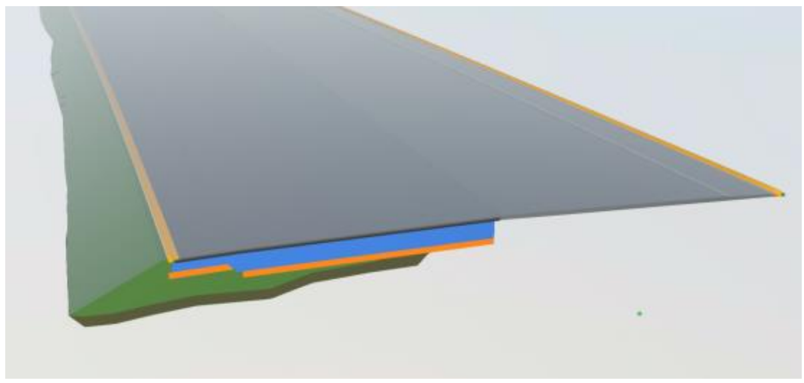

| B Ả NG M ỨC ĐỘ THÔNG TIN HÌNH H Ọ C (LOD)   |        |          |               |        |                         |                                     |                       |                                                                                                         |       |
|---------------------------------------------|--------|----------|---------------|--------|-------------------------|-------------------------------------|-----------------------|---------------------------------------------------------------------------------------------------------|-------|
|                                             |        | Unicalss |               |        | Description             | Diễn giải                           | dựng mô hình BIM TKKT | Thể hiện trong giai đoạn TKKT (Hình ảnh minh họa)                                                       |       |
| Bảng                                        | Code 1 | Code 2   | Code 3 Code 4 | Code 5 |                         |                                     | (có/không) LOD        |                                                                                                         |       |
|                                             |        |          |               |        |                         | Bề mặt lề đất                       | ✓ 350                 |                                                                                                         |       |
|                                             |        |          |               |        |                         | Bề mặt rãnh đan                     | ✓ 350                 |                                                                                                         |       |
|                                             |        |          |               |        |                         | Bề mặt rãnh dọc                     | ✓ 350                 |                                                                                                         |       |
|                                             |        |          |               |        |                         | Bề mặt taluy                        | ✓ 350                 |                                                                                                         |       |
| Kết                                         |        |          |               |        | Roadway Base Courses    | cấu nền                             | ✓ 350                 |                                                                                                         |       |
|                                             |        |          |               |        |                         | Lớp kết cấu khuôn nền đường xe chạy | ✓ 350                 |                                                                                                         |       |
|                                             |        |          |               |        |                         | Lớp kết cấu khuôn nền lề gia cố     | ✓ 350                 |                                                                                                         |       |
|                                             |        |          |               |        | Roadway Subbase Courses | Nền đường                           | ✓ 300                 | Các khối đào, đắp thể hiện bằng các khối 3D bề mặt bên ngoài của hình học với những hình dạng chính xác |       |
|                                             |        |          |               |        |                         | Nền đường đắp                       | ✓ 300                 |                                                                                                         |       |
|                                             |        |          |               |        |                         | Nền đường đào                       | ✓ 300                 |                                                                                                         |       |
|                                             |        |          |               |        |                         | Xử lý nền đất yếu                   | ✓ 200                 | Thể hiện dưới dạng khối                                                                                 | solid |
|                                             |        |          |               |        |                         | Thoát nước                          |                       |                                                                                                         |       |
|                                             |        |          |               |        |                         | Cống ngang đường                    | ✓ 350                 | Thể hiện bằng các khối 3D bề mặt bên ngoài của hình học với những hình dạng chính xác.                  |       |

| B Ả NG M ỨC ĐỘ THÔNG TIN HÌNH H Ọ C (LOD)   | B Ả NG M ỨC ĐỘ THÔNG TIN HÌNH H Ọ C (LOD)   | B Ả NG M ỨC ĐỘ THÔNG TIN HÌNH H Ọ C (LOD)   | B Ả NG M ỨC ĐỘ THÔNG TIN HÌNH H Ọ C (LOD)   | B Ả NG M ỨC ĐỘ THÔNG TIN HÌNH H Ọ C (LOD)   | B Ả NG M ỨC ĐỘ THÔNG TIN HÌNH H Ọ C (LOD)   | B Ả NG M ỨC ĐỘ THÔNG TIN HÌNH H Ọ C (LOD)   | B Ả NG M ỨC ĐỘ THÔNG TIN HÌNH H Ọ C (LOD)   | B Ả NG M ỨC ĐỘ THÔNG TIN HÌNH H Ọ C (LOD)   | B Ả NG M ỨC ĐỘ THÔNG TIN HÌNH H Ọ C (LOD)         | B Ả NG M ỨC ĐỘ THÔNG TIN HÌNH H Ọ C (LOD)   | B Ả NG M ỨC ĐỘ THÔNG TIN HÌNH H Ọ C (LOD)   |
|---------------------------------------------|---------------------------------------------|---------------------------------------------|---------------------------------------------|---------------------------------------------|---------------------------------------------|---------------------------------------------|---------------------------------------------|---------------------------------------------|---------------------------------------------------|---------------------------------------------|---------------------------------------------|
| Mã phân loại OmniClass/                     | Mã phân loại OmniClass/                     | Mã phân loại OmniClass/                     | Mã phân loại OmniClass/                     | Mã phân loại OmniClass/                     | Description                                 |                                             | Phạm vi dựng mô hình BIM (có/không)         | TKKT                                        | Thể hiện trong giai đoạn TKKT (Hình ảnh minh họa) | Unicalss Code                               | Unicalss Code                               |
| Bảng                                        | Code 1                                      | 2                                           | Code 3 Code 4                               | Code 5                                      | Description                                 |                                             | Phạm vi dựng mô hình BIM (có/không)         | TKKT                                        | LOD                                               | Unicalss Code                               | Unicalss Code                               |
| 23                                          | 39                                          | 11                                          | 11                                          |                                             | Traffic Safety Barriers and Protections     | Tổ chức an toàn giao thông                  | ✓                                           | 300                                         | Thể hiện bằng các khối 3D                         | Thể hiện bằng các khối 3D                   | Thể hiện bằng các khối 3D                   |
|                                             |                                             |                                             |                                             |                                             |                                             | Vạch sơn kẻ đường                           |                                             | ✓                                           | 300                                               |                                             |                                             |
|                                             |                                             |                                             |                                             |                                             |                                             | Roadway Signage                             | Biển báo giao thông                         | ✓ 300                                       |                                                   |                                             |                                             |
|                                             |                                             |                                             |                                             |                                             |                                             | Median Barriers                             | Dải phân cách giữa                          | ✓                                           | 300                                               |                                             |                                             |

| B Ả NG M ỨC ĐỘ THÔNG TIN HÌNH H Ọ C (LOD)   | B Ả NG M ỨC ĐỘ THÔNG TIN HÌNH H Ọ C (LOD)   | B Ả NG M ỨC ĐỘ THÔNG TIN HÌNH H Ọ C (LOD)   | B Ả NG M ỨC ĐỘ THÔNG TIN HÌNH H Ọ C (LOD)   | B Ả NG M ỨC ĐỘ THÔNG TIN HÌNH H Ọ C (LOD)   | B Ả NG M ỨC ĐỘ THÔNG TIN HÌNH H Ọ C (LOD)   | B Ả NG M ỨC ĐỘ THÔNG TIN HÌNH H Ọ C (LOD)   | B Ả NG M ỨC ĐỘ THÔNG TIN HÌNH H Ọ C (LOD)   | B Ả NG M ỨC ĐỘ THÔNG TIN HÌNH H Ọ C (LOD)                                                                  | B Ả NG M ỨC ĐỘ THÔNG TIN HÌNH H Ọ C (LOD)   |
|---------------------------------------------|---------------------------------------------|---------------------------------------------|---------------------------------------------|---------------------------------------------|---------------------------------------------|---------------------------------------------|---------------------------------------------|------------------------------------------------------------------------------------------------------------|---------------------------------------------|
| Mã phân loại OmniClass/ Unicalss            | Mã phân loại OmniClass/ Unicalss            | Mã phân loại OmniClass/ Unicalss            | Mã phân loại OmniClass/ Unicalss            | Mã phân loại OmniClass/ Unicalss            | Description                                 | Phạm vi dựng mô hình BIM (có/không)         | TKKT                                        | Thể hiện trong giai đoạn TKKT (Hình ảnh minh họa)                                                          |                                             |
| Bảng                                        | Code                                        | Code 2                                      | Code 3 Code 4                               | Code 5                                      | Description                                 | Phạm vi dựng mô hình BIM (có/không)         | LOD                                         | Thể hiện trong giai đoạn TKKT (Hình ảnh minh họa)                                                          |                                             |
|                                             | 1                                           |                                             |                                             |                                             | Guardrails                                  | Hộ lan ✓                                    | 300                                         |                                                                                                            |                                             |
|                                             |                                             |                                             |                                             |                                             | Noise Barrier                               | Tường chống ồn (nếu có) ✓                   | 300                                         |                                                                                                            |                                             |
|                                             |                                             |                                             |                                             |                                             | Anti glare                                  | Lưới chống chói (nếu có) ✓                  | 300                                         |                                                                                                            |                                             |
|                                             |                                             |                                             |                                             |                                             |                                             | Hàng rào (nếu có) ✓                         | 300                                         |                                                                                                            |                                             |
|                                             |                                             |                                             |                                             |                                             | Pickets                                     | Cọc tiêu (nếu có) ✓                         | 300                                         |                                                                                                            |                                             |
|                                             |                                             |                                             |                                             |                                             |                                             | Giá long môn ✓                              | 300                                         |                                                                                                            |                                             |
|                                             |                                             |                                             |                                             |                                             |                                             | Cột cần vươn ✓                              | 300                                         |                                                                                                            |                                             |
|                                             |                                             |                                             |                                             |                                             | Miscellaneous                               | Các kết cấu khác                            |                                             |                                                                                                            |                                             |
| 23                                          | 39                                          | 13                                          | 13                                          |                                             | BRIDGE                                      | CẦU                                         |                                             | Th ể hi ệ n b ằ ng các kh ố i 3D b ề m ặ t bên ngoài c ủ a hình h ọ c v ớ i nh ữ ng hình d ạ ng chính xác. |                                             |
|                                             |                                             |                                             |                                             |                                             | Substructure                                | Kết cấu phần dưới                           |                                             |                                                                                                            |                                             |
|                                             |                                             |                                             |                                             |                                             |                                             | Cọc ống DƯL (Mua nhà máy) ✓                 | 300                                         |                                                                                                            |                                             |
|                                             |                                             |                                             |                                             |                                             |                                             | Cọc khoan nhồi ✓                            | 350                                         |                                                                                                            |                                             |
|                                             |                                             |                                             |                                             |                                             |                                             | Mố ✓                                        | 350                                         |                                                                                                            |                                             |
|                                             |                                             |                                             |                                             |                                             |                                             | Trụ ✓                                       | 350                                         |                                                                                                            |                                             |
|                                             |                                             |                                             |                                             |                                             |                                             | Bản quá độ ✓                                | 350                                         |                                                                                                            |                                             |
|                                             |                                             |                                             |                                             |                                             | Superstructure                              | Kết cấu phần trên                           |                                             |                                                                                                            |                                             |
|                                             |                                             |                                             |                                             |                                             |                                             | Dầm đúc hẫng ✓                              | 350                                         |                                                                                                            |                                             |
|                                             |                                             |                                             |                                             |                                             |                                             | Dầm S PT ✓                                  | 350                                         |                                                                                                            |                                             |
|                                             |                                             |                                             |                                             |                                             |                                             | Dầm I (Mua nhà máy) ✓                       | 300                                         |                                                                                                            |                                             |
|                                             |                                             |                                             |                                             |                                             |                                             | Dầm T (Mua nhà máy) ✓                       | 300                                         |                                                                                                            |                                             |
|                                             |                                             |                                             |                                             |                                             |                                             | Dầm ngang ✓                                 | 350                                         |                                                                                                            |                                             |
|                                             |                                             |                                             |                                             |                                             |                                             | Bản mặt cầu ✓                               | 350                                         |                                                                                                            |                                             |
|                                             |                                             |                                             |                                             |                                             |                                             | Liên tục nhiệt ✓                            | 350                                         |                                                                                                            |                                             |
|                                             |                                             |                                             |                                             |                                             |                                             | Tấm ván khuôn ✓                             | 350                                         |                                                                                                            |                                             |

| B Ả NG M ỨC ĐỘ THÔNG TIN HÌNH H Ọ C (LOD)   | B Ả NG M ỨC ĐỘ THÔNG TIN HÌNH H Ọ C (LOD)   | B Ả NG M ỨC ĐỘ THÔNG TIN HÌNH H Ọ C (LOD)   | B Ả NG M ỨC ĐỘ THÔNG TIN HÌNH H Ọ C (LOD)   | B Ả NG M ỨC ĐỘ THÔNG TIN HÌNH H Ọ C (LOD)   | B Ả NG M ỨC ĐỘ THÔNG TIN HÌNH H Ọ C (LOD)   | B Ả NG M ỨC ĐỘ THÔNG TIN HÌNH H Ọ C (LOD)   | B Ả NG M ỨC ĐỘ THÔNG TIN HÌNH H Ọ C (LOD)   | B Ả NG M ỨC ĐỘ THÔNG TIN HÌNH H Ọ C (LOD)   | B Ả NG M ỨC ĐỘ THÔNG TIN HÌNH H Ọ C (LOD)                                                       |
|---------------------------------------------|---------------------------------------------|---------------------------------------------|---------------------------------------------|---------------------------------------------|---------------------------------------------|---------------------------------------------|---------------------------------------------|---------------------------------------------|-------------------------------------------------------------------------------------------------|
| Mã phân loại OmniClass/ Unicalss            | Mã phân loại OmniClass/ Unicalss            | Mã phân loại OmniClass/ Unicalss            | Mã phân loại OmniClass/ Unicalss            | Mã phân loại OmniClass/ Unicalss            | Description                                 | Diễn                                        | Phạm vi dựng mô hình BIM (có/không)         | TKKT                                        | Thể hiện trong giai đoạn TKKT (Hình ảnh minh họa)                                               |
| Bảng                                        | Code 1                                      | Code 2                                      | Code 3 Code                                 | Code 5                                      | Description                                 | Diễn                                        | Phạm vi dựng mô hình BIM (có/không)         | LOD                                         | Thể hiện trong giai đoạn TKKT (Hình ảnh minh họa)                                               |
|                                             |                                             |                                             | 4                                           |                                             |                                             | Kết cấu khác                                | ✓                                           | 300                                         | Thể hiện trong giai đoạn TKKT (Hình ảnh minh họa)                                               |
| 23                                          | 39                                          | 13                                          | 11                                          |                                             | TUNNELS                                     | HẦM CHUI                                    | ✓                                           | 350                                         | Thể hiện bằng các khối 3D bề mặt bên ngoài của hình học với những hình dạng chính xác           |
|                                             |                                             |                                             |                                             |                                             | LIGHTING SYSTEMS                            | HỆ THỐNG CHIẾU SÁNG                         | ✓                                           | 300                                         | Thể hiện bằng các khối 3D bề mặt bên ngoài của hình học với những hình dạng tương đối chính xác |
|                                             |                                             |                                             |                                             |                                             | ME-ITS-ETC-WIM                              | HỆ THỐNG ITS                                | ✓                                           | 300                                         | Thể hiện bằng các khối 3D bề mặt bên ngoài của hình học với những hình dạng tương đối chính xác |

- Lưu ý: Sử dụng mã Omniclass và Uniclass.

## Bảng A-1. Bảng mức độ thông tin (LOI) - Hạng mục nền đường và mặt đường

| LOI (Bước TKKT)   |
|-------------------|

## Bảng A-2. Bảng mức độ thông tin (LOI) - Hạng mục công trình trên tuyến

| LOI (Bước TKKT)   |
|-------------------|

Bảng A-3. Bảng mức độ thông tin (LOI) - Hạng mục công trình cầu

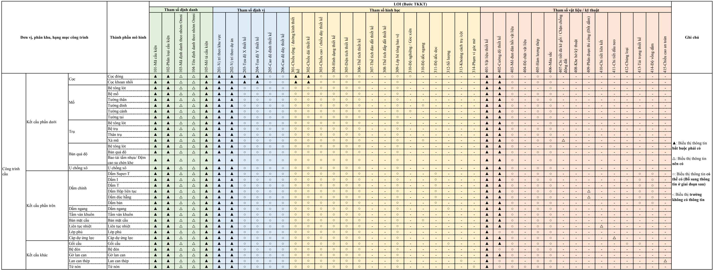

## Bảng A-4. Bảng mức độ thông tin (LOI) - Hạng mục An toàn giao thông

| Đơn vị, phân khu, hạng   | LOI (Bước TKKT)   |
|--------------------------|-------------------|

Bảng A-5. Bảng mức độ thông tin (LOI) - Hạng mục Chiếu sáng, ITS, ETC, WIM

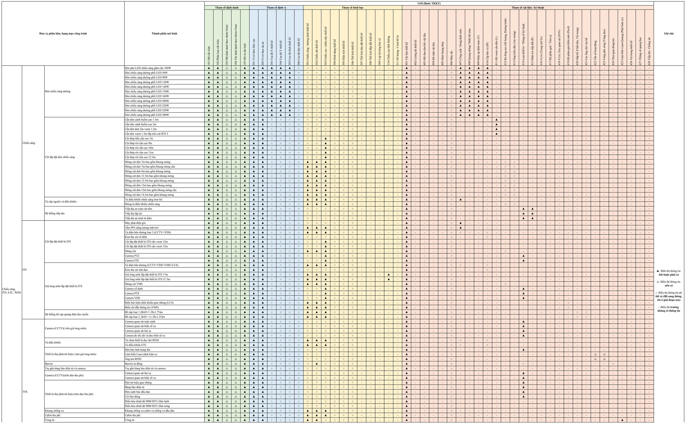

Bảng A-5. Bảng mức độ thông tin (LOI) - Hạng mục Chiếu sáng, ITS, ETC, WIM

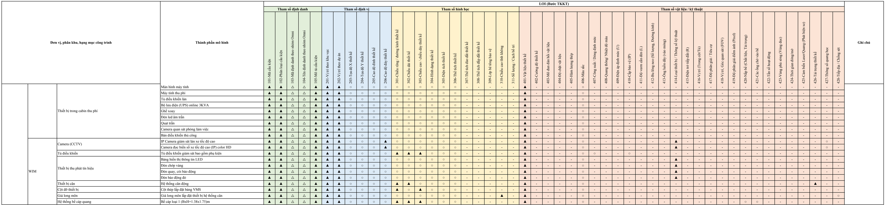

## PH Ụ L Ụ

B Ả NG MA TR Ậ N KI Ể M TRA VA CH Ạ

## C B M (CLASH MAXTRIX)

## 1. Ki ể m tra va ch ạ m

- -Quá trình ki ể m tra va ch ạ m gi ữ a các b ộ môn, các mô hình c ần đả m b ả o l ần lượt và đầ y đủ tuân th ủ theo danh m ụ c yêu c ầ u trong ma tr ậ n ki ể m tra va ch ạm dưới đây:

## Chú thích:

Y: B ắ t bu ộ c ki ể m tra va ch ạ m

| Mô                 | M ặt đườ ng        | Y                    |                    |                    |                    |                |                |                |                |            |                    |            |            |            |                      |                      |                      |                      |                      |                      |                      |                      |                      |                      |                      |
|--------------------|--------------------|----------------------|--------------------|--------------------|--------------------|----------------|----------------|----------------|----------------|------------|--------------------|------------|------------|------------|----------------------|----------------------|----------------------|----------------------|----------------------|----------------------|----------------------|----------------------|----------------------|----------------------|----------------------|
| Mô                 | N ền đườ ng        | Y                    | Y                  |                    |                    |                |                |                |                |            |                    |            |            |            |                      |                      |                      |                      |                      |                      |                      |                      |                      |                      |                      |
| hình tuy ến đườ ng | Taluy              | Y                    | Y                  | Y                  |                    |                |                |                |                |            |                    |            |            |            |                      |                      |                      |                      |                      |                      |                      |                      |                      |                      |                      |
|                    | ...                | Y                    | Y                  | Y                  | Y                  |                |                |                |                |            |                    |            |            |            |                      |                      |                      |                      |                      |                      |                      |                      |                      |                      |                      |
|                    | Đầ u c ố ng TL     | Y                    | Y                  | Y                  | Y                  | Y              |                |                |                |            |                    |            |            |            |                      |                      |                      |                      |                      |                      |                      |                      |                      |                      |                      |
|                    | Thân c ố ng        | Y Y                  |                    | Y                  | Y                  | Y              | Y              |                |                |            |                    |            |            |            |                      |                      |                      |                      |                      |                      |                      |                      |                      |                      |                      |
| Mô hình c ố ng     | Đầ u c ố ng HL     | Y                    | Y                  | Y                  | Y                  | Y              | Y              | Y              |                |            |                    |            |            |            |                      |                      |                      |                      |                      |                      |                      |                      |                      |                      |                      |
|                    | ...                | Y                    | Y                  | Y                  | Y                  | Y              | Y              | Y              | Y              |            |                    |            |            |            |                      |                      |                      |                      |                      |                      |                      |                      |                      |                      |                      |
|                    | M ố                | Y                    | Y                  | Y                  | Y                  | Y              | Y              | Y              | Y              | Y          |                    |            |            |            |                      |                      |                      |                      |                      |                      |                      |                      |                      |                      |                      |
|                    | K ế t c ấ u nh ị p | Y                    | Y                  | Y                  | Y                  | Y              | Y              | Y              | Y              | Y          | Y                  |            |            |            |                      |                      |                      |                      |                      |                      |                      |                      |                      |                      |                      |
| Mô hình c ầ u      | Tr ụ               | Y                    | Y                  | Y                  | Y                  | Y              | Y              | Y              | Y              | Y          |                    | Y Y        |            |            |                      |                      |                      |                      |                      |                      |                      |                      |                      |                      |                      |
| Mô                 | C ột đèn           | Y                    | Y                  | Y                  | Y                  | Y              | Y              | Y              | Y              | Y          | Y                  |            | Y          | Y          | Y                    |                      |                      |                      |                      |                      |                      |                      |                      |                      |                      |
| Mô                 | C ộ t t ủ điệ n    | Y                    | Y                  | Y                  | Y                  | Y              | Y              | Y              | Y              | Y          | Y                  | Y          |            | Y          | Y                    | Y                    |                      |                      |                      |                      |                      |                      |                      |                      |                      |
| hình chi ế u sáng  | Cáp c ấp điệ n     | Y                    | Y                  | Y                  | Y                  | Y              | Y              | Y              | Y              | Y          | Y                  | Y          | Y          |            | Y                    | Y                    | Y                    |                      |                      |                      |                      |                      |                      |                      |                      |
|                    | ...                | Y                    | Y                  | Y                  | Y                  | Y              | Y              | Y              | Y              | Y          | Y                  |            | Y          | Y          | Y Y                  | Y                    |                      | Y                    |                      |                      |                      |                      |                      |                      |                      |
| … Ma tr ậ n ki ể m | tra va ch ạ m      | Y ng ng              | Y                  | Y                  | Y                  | Y c ố ng TL    | Y c ố ng       | Y              | Y              | Y          | K ế t c ấ u nh ị p | Y ụ        | Y          | Y          | Y Y                  |                      | Y n                  | Y                    | Y                    | Y                    | Y                    | Y                    | Y                    | Y                    |                      |
|                    |                    | M ặt đườ N ền đườ Mô |                    | Taluy              | ...                | Đầ u           | Thân           | Đầ u c ố ng HL | ...            | M ố        | Mô                 |            | Tr         | ...        | C ột đèn             | C ộ t t ủ điệ n      | Cáp c ấp điệ         | …                    | …                    | …                    | …                    | …                    | …                    | …                    |                      |
|                    |                    | hình tuy ến đườ ng   | hình tuy ến đườ ng | hình tuy ến đườ ng | hình tuy ến đườ ng | Mô hình c ố ng | Mô hình c ố ng | Mô hình c ố ng | Mô hình c ố ng | hình c ầ u | hình c ầ u         | hình c ầ u | hình c ầ u | hình c ầ u | Mô hình chi ế u sáng | Mô hình chi ế u sáng | Mô hình chi ế u sáng | Mô hình chi ế u sáng | Mô hình chi ế u sáng | Mô hình chi ế u sáng | Mô hình chi ế u sáng | Mô hình chi ế u sáng | Mô hình chi ế u sáng | Mô hình chi ế u sáng | Mô hình chi ế u sáng |

- -Trong giai đoạ n L ậ p TKKT ph ố i h ợ p mô h ì nh d ự a trên các mô h ì nh b ộ môn, không c ầ n ph ố i h ợ p d ựa trên các đối tượ ng c ụ th ể .
- -Ph ầ n m ề m s ử d ụ ng cho vi ệ c ki ể m tra có th ể l ự a ch ọ n Naviswork.
- -M ộ t s ố va ch ạ m có th ể phát hi ệ n trong quá tr ì nh ki ể m tra, tuy nhiên vi ệ c gi ả i quy ế t các va ch ạm đó có thể không c ầ n thi ế t x ử lý tr ự c ti ế p trên mô h ì nh v ì trong quá tr ì nh thi công có th ể d ễ dàng x ử lý:
- -Các đườ ng ống có đườ ng kính <50mm s ẽ không đượ c ki ể m tra va ch ạ m;
- -H ố ga không c ầ n ki ể m tra va ch ạ m v ớ i m ặ t v ỉ a hè và m ặt đườ ng;
- -C ọ c không c ầ n ki ể m tra va ch ạ m v ới đài cọ c
- -Bi ể n báo va ch ạ m v ớ i h ệ th ống thoát nướ c

## 2. X ử lý va ch ạ m

- -Th ự c hi ệ n trong quá tr ì nh ph ố i  h ợp đa bộ môn liên quan đế n nhi ệ m v ụ c ủ a m ộ t  s ố thành viên trong nhóm th ự c hi ệ n bao g ồm: Điề u ph ố i BIM (BIM Coordinator) và các K ỹ thu ậ t viên BIM (BIM Modeller). Vai trò và trách nhi ệ m c ủ a Qu ản lý BIM, Điề u ph ố i BIM, K ỹ thu ật viên BIM được hướ ng d ẫ n t ạ i t ại Hướ ng d ẫ n chung áp d ụ ng Mô h ì nh thông tin công trình (BIM).
- -Trách nhi ệ m c ụ th ể c ủ a t ừ ng thành viên trong vi ệ c ph ố i h ợ p x ử lý va ch ạ m có th ể đượ c quy đị nh khác nhau:
- Trách nhi ệm điề u ph ố i BIM
- -Ch ủ tr ì cu ộ c h ọ p ph ố i h ợ p;
- -T ạ o l ậ p mô h ì nh ph ố i h ợ p, ki ể m tra các l ỗ i va ch ạm trướ c bu ổ i h ọ p ph ố i h ợ p;
- -Th ự c hi ệ n phát hi ệ n va ch ạ m và xu ấ t báo cáo;
- -G ử i báo cáo l ỗ i va ch ạm đế n các nhóm th ự c hi ệ n;
- -Điề u ph ố i BIM ch ị u trách nhi ệ m duy tr ì vi ệ c t ạ o l ập và đả m b ả o ch ất lượ ng Mô hình thông tin các b ộ môn.
- Trách nhi ệ m c ủ a k ỹ thu ậ t viên BIM
- -C ậ p nh ậ t các mô h ì nh thành ph ầ n t ừ k ế t qu ả bu ổ i h ọ p ph ố i h ợ p.
- X ử lý va ch ạ m

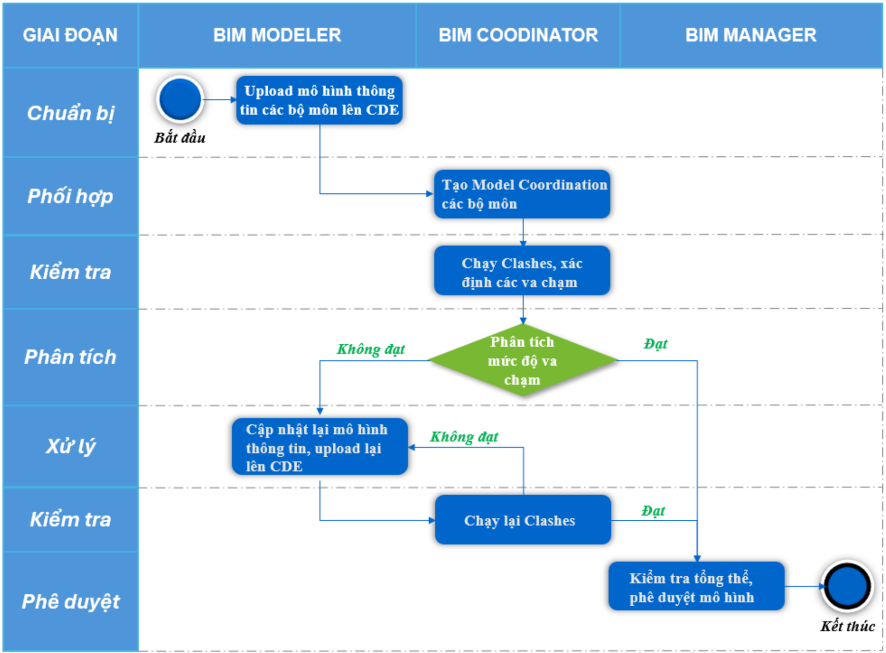

## · Ki ể m tra

Trướ c khi th ự c hi ệ n ki ể m tra va ch ạm, các cá nhân/ đơn vị ph ải đả m b ả o mô h ì nh c ủ a m ình đạ t các yêu c ầu/ quy đị nh c ủ a d ự án và ở phiên b ả n phù h ợ p cho vi ệ c ph ố i h ợp đa bộ môn. Sau khi mô h ình đượ c g ửi đế n Qu ả n lý BIM, Qu ả n lý BIM c ầ n ki ể m tra l ạ i thông tin như sau:

- -Ki ểm tra sơ bộ mô h ì nh (to ạ độ g ố c, các l ỗ i trong mô h ì nh, tiêu chu ẩ n c ủ a d ự án…);
- -Ki ể m tra các l ỗ i/ va ch ạ m trong l ầ n ki ểm tra trước đã đượ c s ửa chưa?;
- -So sánh mô h ì nh v ớ i các b ả n v ẽ, đả m b ả o tính th ố ng nh ấ t c ủ a b ả n v ẽ xu ất ra tương ứ ng v ớ i mô hình;

## · Báo cáo

Sau khi đã kiểm tra thông tin được đưa vào, Quả n lý BIM c ầ n ghi l ạ i báo cáo các ki ể m tra này. Báo cáo va ch ạ m c ầ n th ể hi ệ n các n ộ i dung sau: v ị trí, mô t ả , lo ạ i va ch ạ m. Trong trườ ng h ợ p c ầ n thi ế t, Qu ả n lý BIM có th ể g ử i l ại các báo cáo này cho các cá nhân/ đơn vị ph ụ trách để c ậ p nh ậ t l ạ i mô h ình trước khi đưa vào phố i h ợ p.

## · Phân nhóm các lo ạ i va ch ạ m:

+ Va ch ạ m c ứ ng là khi hai v ậ t th ể có các b ộ ph ậ n giao nhau tr ự c ti ế p.

+ Va ch ạ m m ề m là khi m ột đối tượ ng n ằ m trong ph ạ m vi ảnh hưở ng c ủa đối tượ ng khác và s ẽ gây ảnh hưởng đế n vi ệ c s ử d ụ ng, b ả o tr ì c ủa các đối tượ ng.
- -N ộ i dung ki ể m tra:
+ Ki ể m tra s ự h ợ p lý c ủ a h ồ sơ thiế t k ế thông qua mô hình.
+ Va ch ạ m gi ữ a các b ộ ph ậ n trong công trình.
+ Va ch ạ m gi ữ a hi ệ n tr ạ ng h ạ t ầ ng k ỹ thu ậ t và công trình.

## · Quy t ắc đặ t tên

Vi ệc đặ t tên góc nh ì n, tên va ch ạm, báo cáo, ghi chú, … tuân thủ yêu c ầ u v ề quy t ắc đặ t tên c ủ a ch ủ đầu tư (Chủ đầu tư cung cấ p b ổ sung n ếu chưa có trong EIR và sẽ được đưa vào BEP

Hình 1.1 Quy trình ki ể m tra va ch ạ m

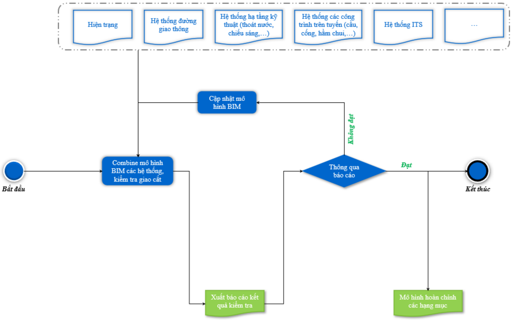

## PH Ụ L Ụ C C B Ả NG T Ổ NG H Ợ P KH ỐI LƯỢ NG BIM

| STT   | DANH MỤC KHỐI LƯỢNG                                 | ĐƠN VỊ   | BỘ PHẬN BIM   | BỘ PHẬN THIẾT KẾ   | GHI CHÚ   |
|-------|-----------------------------------------------------|----------|---------------|--------------------|-----------|
| A     | PHẦN TUYẾN                                          |          |               |                    |           |
|       | Chiều dài tuyến chính                               | m        |               |                    |           |
|       | Chiều dài đường gom, đường ngang hoàn trả           | m        |               |                    |           |
|       | Chiều dài phần đường (đã trừ Lcầu)                  | m        |               |                    |           |
| I     | Công tác chuẩn bị                                   |          |               |                    |           |
| II    | Công tác nền đường                                  |          |               |                    |           |
| II.1  | Nền đường cao tốc                                   |          |               |                    |           |
| 1     | Đào đất không thích hợp                             | m3       | √             | √                  |           |
| 2     | Đào cấp (đất cấp 1)                                 | m3       |               | √                  |           |
| 3     | Đào đất nền đường (đất cấp 1)                       | m3       |               | √                  |           |
| 4     | Đào đất đắp bao đường hiện hữu (đất cấp 2)          | m3       | √             | √                  |           |
| 5     | Đào khuôn (đất cấp 1)                               | m3       |               | √                  |           |
| 6     | Đắp cát nền đường, độ chặt K95 (đầm nén cải tiến)   | m3       | √             | √                  |           |
| 7     | Đắp bao mái taluy K95 (đầm nén cải tiến)            | m3       | √             | √                  |           |
| II.2  | Nền đường ngang cầu vượt, đường nhánh nút giao      |          |               |                    |           |
| 1     | Đào đất không thích hợp                             | m3       | √             | √                  |           |
| 2     | Đào cấp (đất cấp 1)                                 | m3       |               | √                  |           |
| 3     | Đào đất nền đường (đất cấp 1)                       | m3       |               | √                  |           |
| 4     | Đào đất đắp bao đường hiện hữu (đất cấp 2)          | m3       | √             | √                  |           |
| 5     | Đào khuôn (đất cấp 1)                               | m3       |               | √                  |           |
| 6     | Đắp cát nền đường, độ chặt K95 (đầm nén tiêu chuẩn) | m3       | √             | √                  |           |
| 7     | Đắp bao mái taluy K95 (đầm nén tiêu chuẩn)          | m3       | √             | √                  |           |
| II.3  | Nền đường gom, đường ngang dân sinh hoàn trả        | m        |               | √                  |           |
| 1     | Đào đất không thích hợp                             | m3       | √             | √                  |           |

| STT    | DANH MỤC KHỐI LƯỢNG                                          | ĐƠN VỊ   | BỘ PHẬN BIM   | BỘ PHẬN THIẾT KẾ   | GHI CHÚ   |
|--------|--------------------------------------------------------------|----------|---------------|--------------------|-----------|
| 2      | Đào cấp (đất cấp 1)                                          | m3       |               | √                  |           |
| 3      | Đào đất nền đường (đất cấp 1)                                | m3       | √             | √                  |           |
| 4      | Đào đất đắp bao đường hiện hữu (đất cấp 2)                   | m3       | √             | √                  |           |
| 5      | Đào khuôn (đất cấp 1)                                        | m3       | √             | √                  |           |
| 6      | Đắp cát nền đường, độ chặt K90 (đầm nén tiêu chuẩn)          | m3       | √             |                    |           |
| 7      | Đắp bao mái taluy K90 (đầm nén tiêu chuẩn)                   | m3       | √             | √                  |           |
| 8      | Đắp phủ mái taluy K90 (đầm nén tiêu chuẩn)                   | m3       | √             | √                  |           |
| III    | Công tác xử lý nền đất yếu                                   |          |               |                    |           |
| III.1  | Rải vải địa kỹ thuật                                         |          |               |                    |           |
| III.2  | Đào thay đất                                                 |          |               |                    |           |
| IV.1.3 | Sửa chữa hư hỏng mặt đường cũ                                | m2       |               | √                  |           |
| IV.2   | Mặt đường ngang cầu vượt, đường nhánh nút giao               |          |               |                    |           |
| IV.2.1 | Làm mới                                                      |          |               |                    |           |
| 1      | Bê tông nhựa chặt 16, dày 5cm                                | m2       | √             | √                  |           |
| 2      | Tưới nhựa dính bám (tiêu chẩn 0.5kg/m2)                      | m2       | √             | √                  |           |
| 3      | Bê tông nhựa chặt 19, dày 7cm                                | m2       | √             | √                  |           |
| 4      | Tưới nhựa thấm (tiêu chuẩn 1.0kg/m2)                         | m2       | √             | √                  |           |
| 5      | Cấp phối đá dăm loại I, dày 15cm                             | m3       | √             | √                  |           |
| 6      | Cấp phối đá dăm loại I, dày 25cm                             | m3       | √             | √                  |           |
| 7      | Đắp cát nền đường dày 50cm, độ chặt K98 (đầm nén tiêu chuẩn) | m3       | √             | √                  |           |
| IV.2.2 | Tăng cường                                                   |          |               |                    |           |
| 1      | Bê tông nhựa chặt 16, dày 5cm                                | m2       | √             | √                  |           |
| 2      | Tưới nhựa dính bám (tiêu chẩn 0.5kg/m2)                      | m2       | √             | √                  |           |
| 3      | Bê tông nhựa chặt 19, dày 7cm                                | m2       | √             | √                  |           |

| STT   | DANH MỤC KHỐI LƯỢNG                                          | ĐƠN VỊ   | BỘ PHẬN BIM   | BỘ PHẬN THIẾT KẾ   | GHI CHÚ   |
|-------|--------------------------------------------------------------|----------|---------------|--------------------|-----------|
| 4     | Tưới nhựa thấm (tiêu chuẩn 1.0kg/m2)                         | m2       | √             | √                  |           |
| 5     | Bù vênh bê tông nhựa chặt 1 6                                | m3       | √             | √                  |           |
| 6     | Bù vênh bê tông nhựa chặt GCN25                              | m3       | √             | √                  |           |
| IV.3  | Mặt đường gom, đường ngang dân sinh hoàn trả                 | m        |               |                    |           |
| 1     | Láng nhựa tiêu chuẩn 3.0kg/m2                                | m2       | √             | √                  |           |
| 2     | Tưới nhựa thấm (tiêu chuẩn 1.5kg/m2)                         | m2       | √             | √                  |           |
| 3     | Cấp phối đá dăm loại I dày 30cm                              | m3       | √             | √                  |           |
| 4     | Đắp cát nền đường dày 30cm, độ chặt K95 (đầm nén tiêu chuẩn) | m3       | √             | √                  |           |
| IV.4  | Mặt đường trạm thu phí                                       | m2       |               | √                  |           |
| IV.5  | Bó vỉa dải phân cách giữa                                    | m        |               | √                  |           |
| IV.6  | Đảo trồng cỏ                                                 | m2       |               | √                  |           |
| V     | Hệ thống thoát nước                                          |          |               |                    |           |
| V.1   | Thoát nước dọc                                               |          |               |                    |           |
| V.1.1 | Thu nước mặt đường                                           |          |               |                    |           |
| 1     | Gờ chắn nước                                                 | m        |               | √                  |           |
| 2     | Rãnh dẫn nước trên mái taluy, gờ tiêu năng, chân chống trượt | m        |               | √                  |           |
| V.1.2 | Rãnh thoát nước dọc                                          | m        |               | √                  |           |
| V.1.2 | Rãnh chữ U thoát nước siêu cao, L=1,0m/ đốt (đúc sẵn)        | đốt      |               | √                  |           |
| V.3   | Cống thoát nước ngang đường                                  |          |               |                    |           |
| V.3.1 | Cống tròn (có bảng tính khối lượng cống riêng)               |          |               |                    |           |
| V.3.2 | Cống hộp (có bảng tính khối lượng cống riêng)                |          |               |                    |           |
| 1     | Thân Cống                                                    | m        | √             | √                  |           |
|       | Bê tông C30                                                  | m3       | √             | √                  |           |
|       | Cốt thép các loại                                            | tấn      | √             | √                  |           |

|   STT | DANH MỤC KHỐI LƯỢNG     | ĐƠN VỊ   | BỘ PHẬN BIM   | BỘ PHẬN THIẾT KẾ   | GHI CHÚ   |
|-------|-------------------------|----------|---------------|--------------------|-----------|
|       | + D<=10                 | tấn      | √             | √                  |           |
|       | + 10 < D ≤ 18mm         | tấn      | √             | √                  |           |
|       | + D > 18mm              | tấn      | √             | √                  |           |
|       | Ván khuôn               | m2       | √             | √                  |           |
|     2 | Móng Cống               |          |               |                    |           |
|       | Bê tông đệm C10         | m3       | √             | √                  |           |
|       | Ván khuôn               | m2       | √             | √                  |           |
|     3 | Mối nối cống            |          |               |                    |           |
|     4 | Tường cánh              |          |               |                    |           |
|       | Bê tông C30             | m3       | √             | √                  |           |
|       | Cốt thép các loại       | tấn      | √             | √                  |           |
|       | + D<=10                 | tấn      | √             | √                  |           |
|       | + 10 < D ≤ 18mm         | tấn      | √             | √                  |           |
|       | + D > 18mm              | tấn      | √             | √                  |           |
|       | Ván khuôn               | m2       | √             | √                  |           |
|     5 | Cửa, sân và gia cố cống |          |               |                    |           |
|       | Bê tông C15             | m3       | √             | √                  |           |
|       | Bê tông đệm C10         | m3       | √             | √                  |           |
|       | Cốt thép các loại       | tấn      | √             | √                  |           |
|       | + D<=10                 | tấn      | √             | √                  |           |
|       | + 10 < D ≤ 18mm         | tấn      | √             | √                  |           |
|       | + D > 18mm              | tấn      | √             | √                  |           |
|     6 | Bản quá độ              |          |               |                    |           |
|       | Bê tông C25             | m3       | √             | √                  |           |

| STT   | DANH MỤC KHỐI LƯỢNG                                        | ĐƠN VỊ   | BỘ PHẬN BIM   | BỘ PHẬN THIẾT KẾ   | GHI CHÚ   |
|-------|------------------------------------------------------------|----------|---------------|--------------------|-----------|
|       | Bê tông đệm C10                                            | m3       | √             | √                  |           |
|       | Cốt thép các loại                                          | tấn      | √             | √                  |           |
|       | + D<=10                                                    | tấn      | √             | √                  |           |
|       | + 10 < D ≤ 18mm                                            | tấn      | √             | √                  |           |
|       | + D > 18mm                                                 | tấn      | √             | √                  |           |
| V.4   | Thoát nước nền đường trong quá trình thi công              |          |               |                    |           |
| B     | AN TOÀN GIAO THÔNG                                         |          |               |                    |           |
| I     | Sơn đường                                                  | m2       |               | √                  |           |
| II    | Biển báo                                                   | biển     |               | √                  |           |
| III   | Dải phân cách                                              |          |               |                    |           |
| V     | Hộ lan tôn sóng                                            | m        |               | √                  |           |
| VI    | Hàng rào bảo vệ                                            |          |               | √                  |           |
| VII   | Cột H                                                      |          |               | √                  |           |
| VIII  | Cọc tiêu                                                   | Cái      |               | √                  |           |
| C     | PHẦN CẦU                                                   |          |               |                    |           |
| I     | K Ế T C Ấ U PH ẦN DƯỚ I:                                   |          |               |                    |           |
| I.1   | C ọ c khoan nh ồ i D1000:                                  | c ọ c    |               |                    |           |
|       | Chi ề u dài c ọ c thi ế t k ế                              | m        | √             | √                  |           |
|       | Bê tông c ọ c khoan nh ồ i C30, D>1000mm (trong ố ng vách) | m3       | √             | √                  |           |
|       | Bê tông c ọ c khoan nh ồ i C30, D>1000mm (ngoài ố ng vách) | m3       | √             | √                  |           |
|       | C ố t thép (D<=10)                                         | t ấ n    | √             | √                  |           |
|       | C ố t thép (10<D<=18)                                      | t ấ n    | √             | √                  |           |
|       | C ố t thép (D>18)                                          | t ấ n    | √             | √                  |           |
|       | Đập đầ u c ọ c khoan nh ồ i                                | m3       | √             | √                  |           |

| STT   | DANH MỤC KHỐI LƯỢNG                                        | ĐƠN VỊ   | BỘ PHẬN BIM   | BỘ PHẬN THIẾT KẾ   | GHI CHÚ   |
|-------|------------------------------------------------------------|----------|---------------|--------------------|-----------|
| I.1   | C ọ c khoan nh ồ i D1200:                                  | c ọ c    |               |                    |           |
|       | Chi ề u dài c ọ c thi ế t k ế                              | m        | √             | √                  |           |
|       | Bê tông c ọ c khoan nh ồ i C30, D>1200mm (trong ố ng vách) | m3       | √             | √                  |           |
|       | Bê tông c ọ c khoan nh ồ i C30, D>1200mm (ngoài ố ng vách) | m3       | √             | √                  |           |
|       | C ố t thép (D<=10)                                         | t ấ n    | √             | √                  |           |
|       | C ố t thép (10<D<=18)                                      | t ấ n    | √             | √                  |           |
|       | C ố t thép (D>18)                                          | t ấ n    | √             | √                  |           |
|       | Đập đầ u c ọ c khoan nh ồ i                                | m3       | √             | √                  |           |
| I.2   | Đầ u c ọ c thí nghi ệ m:                                   |          |               |                    |           |
|       | C ố t thép D<=10                                           | t ấ n    | √             | √                  |           |
|       | C ố t thép 10<D<=18                                        | t ấ n    | √             | √                  |           |
|       | C ố t thép D>18mm                                          | t ấ n    | √             | √                  |           |
|       | Đập đầ u c ọ c khoan nh ồ i                                | m3       | √             | √                  |           |
|       | Bê tông 30Mpa                                              | m3       | √             | √                  |           |
| I.3   | C ọ c ống DƯL trên cạ n                                    |          |               |                    |           |
| I.4   | C ọ c ống DƯL dưới nướ c                                   |          |               |                    |           |
| I.5   | M ố c ầ u trên c ạ n:                                      |          |               |                    |           |
|       | Bê tông b ệ m ố 30Mpa                                      | m3       | √             | √                  |           |
|       | Bê tông thân, đỉ nh, cánh m ố 30Mpa                        | m3       | √             | √                  |           |
|       | Ván khuôn                                                  | m2       | √             | √                  |           |
|       | C ố t thép (D<=10)                                         | t ấ n    | √             | √                  |           |
|       | C ố t thép (10<D<=18)                                      | t ấ n    | √             | √                  |           |
|       | C ố t thép (D>18)                                          | t ấ n    | √             | √                  |           |
|       | Bê tông đệ m C10                                           | m3       | √             | √                  |           |

| STT   | DANH MỤC KHỐI LƯỢNG                | ĐƠN VỊ   | BỘ PHẬN BIM   | BỘ PHẬN THIẾT KẾ   | GHI CHÚ   |
|-------|------------------------------------|----------|---------------|--------------------|-----------|
| I.6   | Tr ụ c ầ u trên c ạ n:             |          |               |                    |           |
|       | Bê tông b ệ tr ụ 30Mpa             | m3       | √             | √                  |           |
|       | Bê tông thân, xà mũ trụ 30Mpa      | m3       | √             | √                  |           |
|       | Bê tông thân, xà mũ trụ 40Mpa      | m3       | √             | √                  |           |
|       | Ván khuôn                          | m2       | √             | √                  |           |
|       | C ố t thép (10<D<=18)              | t ấ n    | √             | √                  |           |
|       | C ố t thép (D>18)                  | t ấ n    | √             | √                  |           |
|       | Bê tông đệ m 10Mpa                 | m3       | √             | √                  |           |
| I.7   | Tr ụ c ầu dưới nướ c:              |          |               |                    |           |
|       | Bê tông b ệ tr ụ 30Mpa             | m3       | √             | √                  |           |
|       | Bê tông thân, xà mũ trụ 30Mpa      | m3       | √             | √                  |           |
|       | Ván khuôn                          | m2       | √             | √                  |           |
|       | C ố t thép (10<D<=18)              | t ấ n    | √             | √                  |           |
|       | C ố t thép (D>18)                  | t ấ n    | √             | √                  |           |
|       | Bê tông đệ m 10Mpa                 | m3       | √             | √                  |           |
| I.8   | Ụ ch ống xô, đệ m g ố i:           |          |               | √                  |           |
| I.9   | B ản quá độ :                      |          |               |                    |           |
|       | Bê tông b ản quá độ 25Mpa          | m3       | √             | √                  |           |
|       | Ván khuôn b ản quá độ              | m2       | √             | √                  |           |
|       | C ố t thép (D<=10)                 | t ấ n    | √             | √                  |           |
|       | C ố t thép (10<D<=18)              | t ấ n    | √             | √                  |           |
|       | C ố t thép (D>18)                  | t ấ n    | √             | √                  |           |
|       | Bê tông đệ m 10Mpa                 | m3       | √             | √                  |           |
|       | Ván khuôn bê tông đệ m b ản quá độ | m2       | √             | √                  |           |

| STT   | DANH MỤC KHỐI LƯỢNG                                          | ĐƠN VỊ   | BỘ PHẬN BIM   | BỘ PHẬN THIẾT KẾ   | GHI CHÚ   |
|-------|--------------------------------------------------------------|----------|---------------|--------------------|-----------|
| II    | K Ế T C Ấ U PH Ầ N TRÊN:                                     |          |               |                    |           |
| II.1  | D ầ m I12.5:                                                 |          |               |                    |           |
|       | Cung c ấ p d ầm I12.5m căng trướ c                           | d ầ m    | √             | √                  |           |
|       | L ắ p d ự ng d ầm I12.5m căng trướ c                         | d ầ m    | √             | √                  |           |
|       | D ầ m I18.6:                                                 |          |               | √                  |           |
|       | Cung c ấ p d ầm I18.6m căng trướ c                           | d ầ m    | √             | √                  |           |
|       | L ắ p d ự ng d ầm I18.6m căng trướ c                         | d ầ m    | √             | √                  |           |
|       | D ầ m I24.54:                                                |          |               | √                  |           |
|       | Cung c ấ p d ầm I24.54m căng trướ c                          | d ầ m    | √             | √                  |           |
|       | L ắ p d ự ng d ầm I24.54m căng trướ c                        | d ầ m    | √             | √                  |           |
|       | D ầ m I33:                                                   |          |               | √                  |           |
|       | Cung c ấ p d ầm I33m căng trướ c                             | d ầ m    | √             | √                  |           |
|       | L ắ p d ự ng d ầm I33m căng trướ c                           | d ầ m    | √             | √                  |           |
|       | D ầ m T:                                                     |          |               | √                  |           |
|       | Cung c ấ p d ầm T20m căng trướ c                             | d ầ m    | √             | √                  |           |
|       | L ắ p d ự ng d ầm I20m căng trướ c                           | d ầ m    | √             | √                  |           |
|       | Cung c ấ p d ầm T21m căng trướ c                             | d ầ m    | √             | √                  |           |
|       | L ắ p d ự ng d ầm I21m căng trướ c                           | d ầ m    | √             | √                  |           |
| II.1  | D ầ m Super T, chi ề u dài L=38,2m:                          | d ầ m    |               | √                  |           |
|       | S ả n xu ấ t + L ắ p d ự ng c ố t thép d ầm super T, D≤18mm  | t ấ n    | √             | √                  |           |
|       | S ả n xu ấ t + L ắ p d ự ng c ố t thép d ầ m super T, D>18mm | t ấ n    | √             | √                  |           |
|       | Bê tông d ầ m SuperT- 38,2m đúc sẵ n 50Mpa                   | m3       | √             | √                  |           |
| II.2  | T ấm đúc sẵ n (T ấ m ván khuôn):                             |          |               | √                  |           |
|       | Bê tông t ấm đúc sẵ n 25Mpa                                  | m3       | √             | √                  |           |

| STT   | DANH MỤC KHỐI LƯỢNG                          | ĐƠN VỊ   | BỘ PHẬN BIM   | BỘ PHẬN THIẾT KẾ   | GHI CHÚ   |
|-------|----------------------------------------------|----------|---------------|--------------------|-----------|
|       | C ố t thép t ấm đúc sẵ n (D<=10)             | t ấ n    | √             | √                  |           |
|       | Ván khuôn t ấm đúc sẵ n                      | m2       | √             | √                  |           |
| II.3  | D ầ m ngang:                                 |          |               | √                  |           |
|       | Bê tông d ầ m ngang 30Mpa                    | m3       | √             | √                  |           |
|       | Bê tông d ầ m ngang 35Mpa                    | m3       | √             | √                  |           |
|       | Ván khuôn d ầ m ngang                        | m2       | √             | √                  |           |
|       | C ố t thép (D<=10)                           | t ấ n    | √             | √                  |           |
|       | C ố t thép (10<D<=18)                        | t ấ n    | √             | √                  |           |
|       | C ố t thép (D>18)                            | t ấ n    | √             | √                  |           |
| II.4  | B ả n m ặ t c ầ u, b ả n liên t ụ c nhi ệ t: |          |               | √                  |           |
|       | Bê tông b ả n m ặ t c ầ u 30Mpa              | m3       | √             | √                  |           |
|       | Bê tông b ả n m ặ t c ầ u 35Mpa              | m3       | √             | √                  |           |
|       | Ván khuôn b ả n m ặ t c ầ u                  | m2       | √             | √                  |           |
|       | C ố t thép (D<=10)                           | t ấ n    | √             | √                  |           |
|       | C ố t thép (10<D<=18)                        | t ấ n    | √             | √                  |           |
|       | C ố t thép (D>18)                            | t ấ n    | √             | √                  |           |
| III   | K Ế T C Ấ U KHÁC:                            |          |               |                    |           |
| III.1 | G ờ bê tông lan can:                         |          |               |                    |           |
| III.2 | Lan can thép:                                |          |               |                    |           |
| III.3 | Ụ chân c ột đèn đổ t ạ i ch ỗ :              |          |               |                    |           |
| III.4 | Khe co giãn:                                 |          |               |                    |           |
| III.5 | G ố i c ầ u:                                 |          |               |                    |           |
| III.6 | Thoát nướ c trên c ầ u:                      |          |               |                    |           |
| III.7 | T ứ nón chân khay:                           |          |               |                    |           |

| STT   | DANH MỤC KHỐI LƯỢNG                 | ĐƠN VỊ                            | BỘ PHẬN BIM                       | BỘ PHẬN THIẾT KẾ                  | GHI CHÚ                           |
|-------|-------------------------------------|-----------------------------------|-----------------------------------|-----------------------------------|-----------------------------------|
| IV    | Ph ụ tr ợ thi công:                 |                                   |                                   | √                                 |                                   |
| V     | T Ổ CH Ứ C THI CÔNG:                |                                   |                                   | √                                 |                                   |
| VI    | Ki ể m tra ch ất lượ ng c ọ c       |                                   |                                   | √                                 |                                   |
| D     | PHẦN CHIẾU SÁNG - ITS - TOL - WIM   | PHẦN CHIẾU SÁNG - ITS - TOL - WIM | PHẦN CHIẾU SÁNG - ITS - TOL - WIM | PHẦN CHIẾU SÁNG - ITS - TOL - WIM | PHẦN CHIẾU SÁNG - ITS - TOL - WIM |
| I     | HỆ THỐNG CHIẾU SÁNG                 |                                   |                                   |                                   |                                   |
| 1     | Tủ điều khiển chiếu sáng trọn bộ    | Tủ                                | √                                 | √                                 |                                   |
| 2     | Cột thép liền cần cao 7m            | Cột                               | √                                 | √                                 |                                   |
| 3     | Cột thép rời cần cao 9m             | Cột                               | √                                 | √                                 |                                   |
| 4     | Cột thép rời cần cao 10m            | Cột                               | √                                 | √                                 |                                   |
| 5     | Cột thép rời cần cao 11m            | Cột                               | √                                 | √                                 |                                   |
| 6     | Cột đèn cánh buồm 12,5m             | Cột                               | √                                 | √                                 |                                   |
| 7     | Đèn chiếu sáng đường phố LED 90W    | Bộ                                | √                                 | √                                 |                                   |
| 8     | Đèn chiếu sáng đường phố LED 150W   | Bộ                                | √                                 | √                                 |                                   |
| 9     | Đèn chiếu sáng đường phố LED 120W   | Bộ                                | √                                 | √                                 |                                   |
| 10    | Đèn chiếu sáng đường phố LED 140W   | Bộ                                | √                                 | √                                 |                                   |
| 11    | Đèn chiếu sáng đường phố LED 160W   | Bộ                                | √                                 | √                                 |                                   |
| 12    | Đèn chiếu sáng đường phố LED 200W   | Bộ                                | √                                 | √                                 |                                   |
| 13    | Đèn chiếu sáng đường phố LED 220W   | Bộ                                | √                                 | √                                 |                                   |
| 14    | Đèn chiếu sáng đường phố LED 250W   | Bộ                                | √                                 | √                                 |                                   |
| 15    | Đèn chiếu sáng đường phố LED 290W   | Bộ                                | √                                 | √                                 |                                   |
| 16    | Đèn pha Led chiếu sáng gầm cầu 100W | Bộ                                | √                                 | √                                 |                                   |
| 17    | Cần đèn cánh buồm cao 1.5m          | Cần                               | √                                 | √                                 |                                   |
| 18    | Cần đèn cánh buồm cao 2m vươn 2.5m  | Bộ                                | √                                 | √                                 |                                   |

| STT   | DANH MỤC KHỐI LƯỢNG                                   | ĐƠN VỊ   | BỘ PHẬN BIM   | BỘ PHẬN THIẾT KẾ   | GHI CHÚ   |
|-------|-------------------------------------------------------|----------|---------------|--------------------|-----------|
| 19    | Cần đèn đơn cao 2m vươn 1,5m                          | Bộ       | √             | √                  |           |
| 20    | Móng cột đèn 7m bao gồm khung móng                    | Móng     | √             | √                  |           |
| 21    | Móng cột đèn 7m bao gồm khung móng cầu                | Móng     | √             | √                  |           |
| 22    | Móng cột đèn 9m bao gồm khung móng                    | Móng     | √             | √                  |           |
| 23    | Móng cột đèn 11m bao gồm khung móng                   | Móng     | √             | √                  |           |
| 24    | Móng cột đèn 12m bao gồm khung móng                   | Móng     | √             | √                  |           |
| 25    | Móng cột đèn 12m bao gồm khung móng cầu               | Móng     | √             | √                  |           |
| 26    | Móng cột đèn 14,5m bao gồm khung móng                 | Bộ       | √             | √                  |           |
| 27    | Khung móng tủ điều khiển chiếu sáng                   | Bộ       | √             | √                  |           |
| 28    | MTC-3N                                                | Bảng     |               | √                  |           |
| 29    | Bảng điện cửa cột                                     | Bộ       |               | √                  |           |
| 30    | Bộ đấu nối dây rẽ nhánh                               | Bộ       |               | √                  |           |
| 31    | Bộ đấu nối dây lên đèn                                | Bộ       |               | √                  |           |
| 32    | Tiếp địa an toàn cho cột điện                         | Bộ       | √             | √                  |           |
| 33    | Tiếp địa an toàn cho tủ điện                          | Bộ       | √             | √                  |           |
| 34    | Tiếp địa lặp lại                                      | m        | √             | √                  |           |
| II    | HỆ THỐNG TRUNG TÂM QUẢN LÝ ĐIỀU HÀNH GIAO THÔNG (TMS) |          |               |                    |           |
| III   | HỆ THỐNG GIAO THÔNG THÔNG MINH (ITS)                  |          |               |                    |           |
| III.1 | Hệ thống camera giám sát giao thông (CCTV)            |          |               |                    |           |
| 1.1   | Camera PTZ                                            | Bộ       | √             | √                  |           |
| 1.2   | Camera cố định FIX                                    | Bộ       | √             | √                  |           |
| 1.3   | Đèn hồng ngoại (cho camera cố định)                   | Bộ       |               | √                  |           |
| 1.4   | Cần điều khiển cho camera PTZ                         | Bộ       | √             | √                  |           |

| STT   | DANH MỤC KHỐI LƯỢNG                                    | ĐƠN VỊ   | BỘ PHẬN BIM   | BỘ PHẬN THIẾT KẾ   | GHI CHÚ   |
|-------|--------------------------------------------------------|----------|---------------|--------------------|-----------|
| 1.5   | Máy chủ ghi hình video                                 | Bộ       |               | √                  |           |
| III.2 | Hệ thống dò xe (VDS)                                   |          |               |                    |           |
| 2.1   | Camera Thăm dò phương tiện VDS                         | Bộ       | √             | √                  |           |
| 2.2   | Đèn hồng ngoại (cho VDS)                               | Bộ       |               | √                  |           |
| III.3 | Hệ thống biển báo giao thông điện tử (VMS)             |          |               |                    |           |
| 3.1   | Biển chỉ dẫn thông tin (VMS)                           | Bộ       | √             | √                  |           |
| 3.2   | Biển báo hiệu điều khiển giao thông (LCS)              | Bộ       | √             | √                  |           |
| III.4 | Hệ thống truyền dẫn (DTS)                              |          |               |                    |           |
| III.5 | Hệ thống thông tin liên lạc (IPX)                      |          |               |                    |           |
| III.6 | Hệ thống quan trắc thời tiết (WOS)                     |          |               |                    |           |
| III.7 | Hệ thống cấp nguồn (PSS)                               |          |               |                    |           |
| 7.1   | Nguồn điện tại trung tâm                               | Bộ       |               | √                  |           |
| 7.2   | Nguồn điện tại trạm biến áp                            |          |               | √                  |           |
| 7.3   | Nguồn điện bên đường loại 1 (cho CCTV)                 |          |               | √                  |           |
| 7.4   | Nguồn điện bên đường loại 2 (cho VMS -CCTV-VDS)        |          |               | √                  |           |
| 1     | Tủ điện bên đường loại 2                               | Bộ       | √             | √                  |           |
| 2     | Thiết bị cắt lọc sét 3 pha 63A                         | Bộ       |               | √                  |           |
| 3     | Hệ tiếp đất ≤ 4 Ohm                                    | Bộ       |               | √                  |           |
| 7.5   | Nguồn điện Năng lượng mặt trời & Gió loại 3 (cho CCTV) |          |               | √                  |           |
| 1     | Tủ điện bên đường loại 3                               | Bộ       | √             | √                  |           |
| 2     | Thiết bị sạc năng lượng mặt trời/gió                   | Bộ       |               | √                  |           |
| 3     | Thiết bị chuyển đổi điện áp DC -AC                     | Bộ       |               | √                  |           |
| 4     | Pin năng lượng mặt trời                                | Bộ       | √             | √                  |           |
| 5     | Máy phát điện gió                                      | Bộ       | √             | √                  |           |

| STT   | DANH MỤC KHỐI LƯỢNG                                       | ĐƠN VỊ   | BỘ PHẬN BIM   | BỘ PHẬN THIẾT KẾ   | GHI CHÚ   |
|-------|-----------------------------------------------------------|----------|---------------|--------------------|-----------|
| 6     | Ắc quy 12VDC -150Ahr                                      | Bộ       |               | √                  |           |
| 7     | Hệ tiếp đất ≤ 4 Ohm                                       | Bộ       |               | √                  |           |
| 7.6   | Hệ thống chống sét trực tiếp cổ điển (CCTV)               |          |               | √                  |           |
| 1     | Kim thu sét cổ điển                                       | Bộ       | √             | √                  |           |
| 7.7   | Hệ thống chống sét trực tiếp tia tiên đạo (VMS -CCTV-VDS) |          |               | √                  |           |
| 1     | Kim thu sét phóng điện sớm                                | Bộ       | √             | √                  |           |
| 8     | Cấp điện ITS dọc tuyến                                    |          |               |                    |           |
| 9     | Vật tư thiết bị đồng bộ                                   |          |               |                    |           |
| 9.1   | Cột CCTV +VDS                                             |          |               |                    |           |
| 1     | Hệ thống cột                                              | Hệ thống | √             | √                  |           |
| 2     | Móng cột                                                  | Cái      | √             | √                  |           |
| 9.2   | Giá long môn VMS                                          |          |               |                    |           |
| 1     | Hệ thống cột                                              | Hệ thống | √             | √                  |           |
| 2     | Móng cột                                                  | Cái      | √             | √                  |           |
| 10    | Hệ thống cống bể, rãnh cáp quang, điện                    |          |               |                    |           |
| 10.1  | Bể cáp loại 1 (BxH=1.38x1.75)m                            | Bể       | √             | √                  |           |
| 10.2  | Bể cáp loại 2, BxH = (1.38x1.25)m                         | Bể       | √             | √                  |           |
| 10.3  | Ống luồn cáp                                              | m        |               | √                  |           |
| 10.4  | Ống luồn cáp qua cống, hầm chui                           | m        |               | √                  |           |
| IV    | HỆ THỐNG THU PHÍ (TOL)                                    |          |               |                    |           |
| IV.1  | Thiết bị trên giá long môn                                |          |               | √                  |           |
| 1.1   | Ăng -ten RFID                                             | Bộ       | √             | √                  |           |
| 1.2   | Cáp kết nối Ăng ten dài 15m                               | Bộ       |               | √                  |           |

| STT   | DANH MỤC KHỐI LƯỢNG                                             | ĐƠN VỊ   | BỘ PHẬN BIM   | BỘ PHẬN THIẾT KẾ   | GHI CHÚ   |
|-------|-----------------------------------------------------------------|----------|---------------|--------------------|-----------|
| 1.3   | Cáp kết nối tín hiệu cho đầu đọc                                | Bộ       |               | √                  |           |
| 1.4   | Cáp kết nối tín hiệu thiết bị chuyển mạch dự phòng              | Bộ       |               | √                  |           |
| 1.5   | Co chống thấm                                                   | Bộ       |               | √                  |           |
| 1.6   | Thiết bị đọc thẻ RFID                                           | Bộ       | √             | √                  |           |
| 1.7   | Thiết bị chuyển mạch cho Thiết bị đọc thẻ RFID dự phòng         | Bộ       | √             | √                  |           |
| 1.8   | Cảm biến Laser phát hiện xe                                     | Bộ       | √             | √                  |           |
| 1.9   | Camera quan sát toàn cảnh                                       | Bộ       | √             | √                  |           |
| 1.10  | Camera quan sát biển số xe                                      | Bộ       | √             | √                  |           |
| 1.11  | Camera quan s á t l à n xe                                      | Bộ       | √             | √                  |           |
| 1.12  | Camera đo tốc độ và đọc biển số xe                              | Bộ       | √             | √                  |           |
| 1.13  | Đèn báo tình trạng làn                                          | Bộ       | √             | √                  |           |
| 1.14  | Tủ điều khiển ETC                                               | Bộ       | √             | √                  |           |
| 1.15  | Thiết bị chuyển mạch Ethernet Managed công nghiệp có cổng quang | Bộ       |               | √                  |           |
| 1.16  | Mô- đun SFP quang Single -mode Gbps                             | Bộ       |               | √                  |           |
| 1.17  | Thiết bị chuyển đổi tín hiệu I/O sang Ethernet                  | Bộ       |               | √                  |           |
| 1.18  | Giá treo ăng ten RFID                                           | Bộ       |               | √                  |           |
| 1.19  | Tủ chứa thiết bị đọc thẻ RFID                                   | Bộ       | √             | √                  |           |
| 1.20  | Giá treo cảm biến laser                                         | Bộ       |               | √                  |           |
| 1.21  | Bộ lưu điện (UPS) online 3KVA                                   | Bộ       |               | √                  |           |
| 1.22  | ODF 8FO                                                         | Bộ       |               | √                  |           |
| IV.2  | Thiết bị trên đảo phân làn                                      |          |               | √                  |           |
| 2.1   | Barrier tự động                                                 | Bộ       | √             | √                  |           |
| 2.2   | Vòng từ                                                         | Bộ       | √             | √                  |           |

| STT   | DANH MỤC KHỐI LƯỢNG                             | ĐƠN VỊ   | BỘ PHẬN BIM   | BỘ PHẬN THIẾT KẾ   | GHI CHÚ   |
|-------|-------------------------------------------------|----------|---------------|--------------------|-----------|
| 2.3   | Đèn tín hiệu giao thông                         | Bộ       | √             | √                  |           |
| 2.4   | Bảng báo điện tử                                | Bộ       | √             | √                  |           |
| 2.5   | Camera quan s á t l à n xe                      | Bộ       | √             | √                  |           |
| 2.6   | Camera quan sát biển số xe                      | Bộ       | √             | √                  |           |
| 2.7   | Trụ gắn bảng báo điện tử và camera              | Bộ       | √             | √                  |           |
| 2.8   | Còi báo động                                    | Bộ       | √             | √                  |           |
| 2.9   | Barrier thủ công                                | Bộ       |               | √                  |           |
| 2.10  | Đèn cảnh báo đầu đảo                            | Bộ       | √             | √                  |           |
| 2.11  | Cabin thu phí                                   | Bộ       | √             | √                  |           |
| 2.12  | Điều hòa nhiệt độ 9000 BTU                      | Bộ       | √             | √                  |           |
| 2.13  | Khung chống va cabin và chống va đầu đảo        | Bộ       | √             | √                  |           |
| IV.3  | Thiết bị trong cabin thu phí                    |          |               |                    |           |
| 3.1   | Máy tính thu phí                                | Bộ       | √             | √                  |           |
| 3.2   | Màn hình máy tính                               | Bộ       | √             | √                  |           |
| 3.3   | Bàn điều khiển thủ công                         | Bộ       | √             | √                  |           |
| 3.4   | Tủ điều khiển làn                               | Bộ       | √             | √                  |           |
| 3.5   | Thiết bị dò vòng từ                             | Bộ       |               | √                  |           |
| 3.6   | Bộ chuyển mạch Ethernet công nghiệp 8 cổng Gbps | Bộ       |               | √                  |           |
| 3.7   | Camera quan sát cabin                           | Bộ       | √             | √                  |           |
| 3.8   | Bộ lưu điện (UPS) online 3KVA                   | Bộ       | √             | √                  |           |
| 3.9   | Bộ lưu điện (UPS) online 5KVA                   | Bộ       |               | √                  |           |
| 3.10  | Đèn Led âm trần                                 | Cái      | √             | √                  |           |
| 3.11  | Quạt trần                                       | Cái      | √             | √                  |           |

| STT   | DANH MỤC KHỐI LƯỢNG                                                                                         | ĐƠN VỊ   | BỘ PHẬN BIM   | BỘ PHẬN THIẾT KẾ   | GHI CHÚ   |
|-------|-------------------------------------------------------------------------------------------------------------|----------|---------------|--------------------|-----------|
| 3.12  | Ghế Xoay                                                                                                    | Cái      | √             | √                  |           |
| IV.4  | Thiết bị tại nhà điều hành                                                                                  |          |               | √                  |           |
| IV.5  | Cáp điện, cáp mạng, cáp tín hiệu                                                                            |          |               | √                  |           |
| 6     | Hệ thống chống sét lan truyền                                                                               |          |               | √                  |           |
| 7     | Hệ thống chống sét trực tiếp                                                                                |          |               | √                  |           |
| 8     | Hệ thống tủ điện                                                                                            |          |               | √                  |           |
| V     | HỆ THỐNG CÂN KIỂM TRA TẢI TRỌNG (WIM)                                                                       |          |               |                    |           |
| V.1   | Thiết bị lắp đặt tại làn                                                                                    |          |               |                    |           |
| 1.1   | Hệ thống cân động (thiết bị cảm biến cân, vòng từ, thiết bị dò vòng từ, bộ thu thập xử lý dữ liệu cân động) | Bộ       | √             | √                  |           |
| 1.1.1 | Thiết bị cảm biến cân                                                                                       | Bộ       |               | √                  |           |
| 1.1.2 | Bộ điều khiển cân (bộ thu thập xử lý dữ liệu)                                                               | Bộ       |               | √                  |           |
| 1.1.3 | Vòng từ                                                                                                     | Bộ       |               | √                  |           |
| 1.1.4 | Thiết bị dò vòng từ                                                                                         | Bộ       |               | √                  |           |
| 1.2   | Máy tính điều khiển làn cân (lắp trong tủ điều khiển cân)                                                   | Cái      |               | √                  |           |
| 1.3   | Camera nhận dạng biển số                                                                                    | Bộ       | √             | √                  |           |
| 1.4   | Camera giám sát làn (bao gồm nguồn PoE hoặc tương đương)                                                    | Bộ       | √             | √                  |           |
| 1.5   | Camera toàn cảnh                                                                                            | Bộ       |               | √                  |           |
| 1.6   | Camera giám sát phương tiện vi phạm (bao gồm nguồn PoE hoặc tương đương)                                    | Bộ       |               | √                  |           |
| 1.7   | Biển báo điện tử VMS                                                                                        | Bộ       |               | √                  |           |
| 1.8   | Tủ kỹ thuật Camera                                                                                          | Bộ       |               | √                  |           |
| 1.9   | Tủ kỹ thuật cân                                                                                             | Bộ       | √             | √                  |           |

| STT   | DANH MỤC KHỐI LƯỢNG                                                                                     | ĐƠN VỊ   | BỘ PHẬN BIM   | BỘ PHẬN THIẾT KẾ   | GHI CHÚ   |
|-------|---------------------------------------------------------------------------------------------------------|----------|---------------|--------------------|-----------|
| 1.10  | Thiết bị chuyển mạch Ethenet làn cân ( Switch 16 port)                                                  | Bộ       |               | √                  |           |
| 1.11  | Bộ chuyển đổi quang điện                                                                                | Bộ       |               | √                  |           |
| 1.12  | Giá phối quang ODF 8 cổng                                                                               | Bộ       |               | √                  |           |
| 1.13  | Thiết bị cắt lọc sét 1 pha 20A                                                                          | Bộ       |               | √                  |           |
| 1.14  | Đèn chớp vàng                                                                                           | Bộ       | √             | √                  |           |
| 1.15  | Đèn tín hiệu (chỉ hướng giao thông)                                                                     | Bộ       | √             | √                  |           |
| 1.16  | Đèn quay, còi báo hiệu                                                                                  | Bộ       | √             | √                  |           |
| 1.17  | UPS 2KVA                                                                                                | Bộ       |               | √                  |           |
| V.2   | Các dịch vụ đi kèm                                                                                      |          |               |                    |           |
| V.3   | Phần mềm tại trạm KSTTX                                                                                 |          |               |                    |           |
| V.4   | Xây dựng hạ tầng                                                                                        |          |               |                    |           |
| 4.1   | Khung móng cột biển VMS (gồm cả khung, móng, vật tư phụ lắp đặt đèn tín hiệu và đèn quay, còi báo động) | Bộ       |               | √                  |           |
| 4.2   | Bộ giá đỡ Tủ ĐK cân                                                                                     | Bộ       |               | √                  |           |
| 4.3   | Bộ giá đỡ tủ kỹ thuật Camera                                                                            | Bộ       |               | √                  |           |
| 4.4   | Cột treo biển VMS (gồm cả khung, móng, vật tư phụ lắp đặt đèn tín hiệu và đèn quay, còi báo động)       | Cột      | √             | √                  |           |
| 4.5   | Hệ thống chống sét trực tiếp cổ điển                                                                    | Hệ thống |               | √                  |           |
| 4.6   | Hệ thống tiếp địa ≤ 10 Ohm                                                                              | Hệ thống |               | √                  |           |
| 5     | Vật tư cáp và ống bảo vệ các loại                                                                       |          |               |                    |           |

## Ghi chú :

- -Danh mục khối lượng bộ phận thiết kế: Chi tiết lấy theo hồ sơ thiết kế.
- -S ử d ụ ng d ấ u ch ấm '.' phân cách chữ s ố th ậ p phân.
- -Kh ối lượng đượ c l ấ y 3 s ố l ẻ sau d ấ u th ậ p phân.

PH Ụ L Ụ C D DANH M Ụ C B Ả N V Ẽ BIM

| STT   | DANH MỤC BẢN VẼ                     | SỐ HIỆU BẢN VẼ                      | BỘ PHẬN BIM                         | GHI CHÚ                                         |
|-------|-------------------------------------|-------------------------------------|-------------------------------------|-------------------------------------------------|
| A     | PHẦN TUYẾN VÀ CÔNG TRÌNH TRÊN TUYẾN | PHẦN TUYẾN VÀ CÔNG TRÌNH TRÊN TUYẾN | PHẦN TUYẾN VÀ CÔNG TRÌNH TRÊN TUYẾN | PHẦN TUYẾN VÀ CÔNG TRÌNH TRÊN TUYẾN             |
| I     | TỔNG QUAN                           |                                     |                                     |                                                 |
| II    | CÁC BẢN VẼ ĐIỂN HÌNH                |                                     |                                     |                                                 |
| 1     | Mặt cắt ngang điển hình             |                                     | √                                   | Bản vẽ mô hình phối hợp 3D                      |
| III   | PHẦN TUYẾN                          |                                     |                                     |                                                 |
| 1     | Bình đồ tuyến                       |                                     | √                                   | Bản vẽ mô hình phối hợp 3D                      |
| B     | PHẦN CẦU                            | PHẦN CẦU                            | PHẦN CẦU                            | PHẦN CẦU                                        |
| I     | TỔNG QUAN                           |                                     |                                     |                                                 |
| 1     | Bố trí chung cầu                    |                                     | √                                   | Bản vẽ 3D                                       |
| C     | HỆ THỐNG AN TOÀN GIAO THÔNG         | HỆ THỐNG AN TOÀN GIAO THÔNG         | HỆ THỐNG AN TOÀN GIAO THÔNG         | Mô hình phối hợp 3D đã bao gồm trong phần tuyến |
| D     | HỆ THỐNG ME -ITS-ETC-WIM            | HỆ THỐNG ME -ITS-ETC-WIM            | HỆ THỐNG ME -ITS-ETC-WIM            | Mô hình phối hợp 3D đã bao gồm trong phần tuyến |

## Ghi chú:

Danh m ụ c b ả n v ẽ b ộ ph ậ n thi ế t k ế

: Chi ti ế t l ấ y theo h ồ sơ thiế t k ế .

PH Ụ L Ụ C E B Ả NG TH Ố NG KÊ T ỌA ĐỘ

## B ả ng th ố ng kê t ọa độ và cao độ m ốc đườ ng chuy ề n c ấ p 2

| Phân đoạ n: Km9+325 - Km29+000   | Phân đoạ n: Km9+325 - Km29+000   | Phân đoạ n: Km9+325 - Km29+000   | Phân đoạ n: Km9+325 - Km29+000   | Phân đoạ n: Km9+325 - Km29+000   | Phân đoạ n: Km9+325 - Km29+000   |
|----------------------------------|----------------------------------|----------------------------------|----------------------------------|----------------------------------|----------------------------------|
| STT                              | Tên Điể m                        | T ọa độ                          | T ọa độ                          | Cao độ (m)                       |                                  |
| STT                              | Tên Điể m                        | X(m)                             | Y(m)                             | Cao độ (m)                       |                                  |
| 1                                | GPS05                            | 1181705.628                      | 590214.688                       | 1.647                            |                                  |
| 2                                | GPS06                            | 1181135.200                      | 586718.786                       | 2.041                            |                                  |
| 3                                | GPS07                            | 1179417.351                      | 584044.293                       | 2.456                            |                                  |
| 4                                | GPS08                            | 1178473.931                      | 580681.642                       | 2.061                            |                                  |
| 5                                | GPS09                            | 1177346.431                      | 578321.977                       | 2.196                            |                                  |
| 6                                | GPS10                            | 1176093.182                      | 576185.635                       | 2.145                            |                                  |
| 7                                | GPS11                            | 1173691.069                      | 574366.373                       | 1.825                            |                                  |
| 8                                | DC5-01                           | 1181831.176                      | 590105.198                       | 1.548                            |                                  |
| 9                                | DC5-02                           | 1181799.232                      | 589921.680                       | 1.559                            |                                  |
| 10                               | DC5-03                           | 1181765.024                      | 589756.900                       | 1.296                            |                                  |
| 11                               | DC5-04                           | 1181753.614                      | 589425.767                       | 2.155                            |                                  |
| 12                               | DC5-05                           | 1181645.631                      | 589196.329                       | 2.041                            |                                  |
| 13                               | DC5-06                           | 1181410.436                      | 589106.133                       | 2.137                            |                                  |
| 14                               | DC5-07                           | 1181663.927                      | 589022.062                       | 2.013                            |                                  |
| 15                               | DC5-08                           | 1181621.069                      | 588897.310                       | 2.320                            |                                  |
| 16                               | DC5-09                           | 1181607.750                      | 588728.498                       | 2.078                            |                                  |
| 17                               | DC5-10                           | 1181528.897                      | 588546.144                       | 1.894                            |                                  |
| 18                               | DC5-11                           | 1181467.287                      | 588325.391                       | 2.278                            |                                  |
| 19                               | DC5-12                           | 1181483.611                      | 588139.410                       | 2.371                            |                                  |
| 20                               | DC5-13                           | 1181365.154                      | 587969.572                       | 2.017                            |                                  |
| 21                               | DC5-14                           | 1181302.312                      | 587789.347                       | 2.172                            |                                  |
| 22                               | DC5-15                           | 1181123.800                      | 587578.896                       | 2.115                            |                                  |

| Phân đoạ n: Km9+325 - Km29+000   | Phân đoạ n: Km9+325 - Km29+000   | Phân đoạ n: Km9+325 - Km29+000   | Phân đoạ n: Km9+325 - Km29+000   | Phân đoạ n: Km9+325 - Km29+000   | Phân đoạ n: Km9+325 - Km29+000   |
|----------------------------------|----------------------------------|----------------------------------|----------------------------------|----------------------------------|----------------------------------|
| STT                              | Tên Điể m                        | T ọa độ                          | T ọa độ                          | Cao độ (m)                       |                                  |
| STT                              | Tên Điể m                        | X(m)                             | Y(m)                             | Cao độ (m)                       |                                  |
| 23                               | DC5-16                           | 1181102.630                      | 587414.659                       | 1.680                            |                                  |
| 24                               | DC5-17                           | 1181016.710                      | 587224.216                       | 1.681                            |                                  |
| 25                               | DC5-18                           | 1180926.562                      | 587036.047                       | 1.835                            |                                  |
| 26                               | DC6-01                           | 1180843.756                      | 586859.222                       | 1.577                            |                                  |
| 27                               | DC6-01A                          | 1180654.825                      | 586758.359                       | 1.837                            |                                  |
| 28                               | DC6-02                           | 1180637.448                      | 586451.912                       | 1.388                            |                                  |
| 29                               | DC6-03                           | 1180560.280                      | 586287.985                       | 1.911                            |                                  |
| 30                               | DC6-03A                          | 1180336.652                      | 586180.230                       | 2.321                            |                                  |
| 31                               | DC6-04                           | 1180375.397                      | 585903.666                       | 2.329                            |                                  |
| 32                               | DC6-05                           | 1180292.103                      | 585721.554                       | 1.776                            |                                  |
| 33                               | DC6-06                           | 1180213.710                      | 585557.504                       | 1.983                            |                                  |
| 34                               | DC6-07                           | 1180141.086                      | 585374.437                       | 1.846                            |                                  |
| 35                               | DC6-08                           | 1180039.659                      | 585160.029                       | 1.883                            |                                  |
| 36                               | DC6-09                           | 1179958.021                      | 584986.655                       | 2.074                            |                                  |
| 37                               | DC6-10                           | 1180160.622                      | 584780.613                       | 2.224                            |                                  |
| 38                               | DC6-11                           | 1179864.249                      | 584781.773                       | 2.227                            |                                  |
| 39                               | DC6-12                           | 1179785.400                      | 584590.124                       | 2.427                            |                                  |
| 40                               | DC6-13                           | 1179679.515                      | 584415.674                       | 1.963                            |                                  |
| 41                               | DC6-14                           | 1179635.130                      | 584146.233                       | 2.049                            |                                  |
| 42                               | DC7-01                           | 1179563.471                      | 583871.111                       | 2.140                            |                                  |
| 43                               | DC7-02                           | 1179489.692                      | 583548.911                       | 2.219                            |                                  |
| 44                               | DC7-03                           | 1179322.883                      | 583248.684                       | 2.051                            |                                  |
| 45                               | DC7-04                           | 1179352.876                      | 582940.779                       | 2.096                            |                                  |

| Phân đoạ n: Km9+325 - Km29+000   | Phân đoạ n: Km9+325 - Km29+000   | Phân đoạ n: Km9+325 - Km29+000   | Phân đoạ n: Km9+325 - Km29+000   | Phân đoạ n: Km9+325 - Km29+000   | Phân đoạ n: Km9+325 - Km29+000   |
|----------------------------------|----------------------------------|----------------------------------|----------------------------------|----------------------------------|----------------------------------|
| STT                              | Tên Điể m                        | T ọa độ                          | T ọa độ                          | Cao độ (m)                       |                                  |
| STT                              | Tên Điể m                        | X(m)                             | Y(m)                             | Cao độ (m)                       |                                  |
| 46                               | DC7-05                           | 1179084.417                      | 582761.161                       | 2.120                            |                                  |
| 47                               | DC7-06                           | 1179285.113                      | 582638.475                       | 1.969                            |                                  |
| 48                               | DC7-07                           | 1179219.669                      | 582385.383                       | 1.322                            |                                  |
| 49                               | DC7-08                           | 1179094.860                      | 582044.559                       | 0.984                            |                                  |
| 50                               | DC7-09                           | 1179053.854                      | 581732.239                       | 1.253                            |                                  |
| 51                               | DC7-10                           | 1179115.966                      | 581528.271                       | 0.678                            |                                  |
| 52                               | DC7-11                           | 1178822.915                      | 581457.051                       | 1.320                            |                                  |
| 53                               | DC7-12                           | 1178882.398                      | 581203.754                       | 1.351                            |                                  |
| 54                               | DC7-13                           | 1178774.994                      | 580930.754                       | 1.122                            |                                  |
| 55                               | DC7-14                           | 1178836.159                      | 580787.456                       | 2.128                            |                                  |
| 56                               | DC8-01                           | 1178653.984                      | 580529.889                       | 1.899                            |                                  |
| 57                               | DC8-02                           | 1178686.481                      | 580378.075                       | 1.262                            |                                  |
| 58                               | DC8-03                           | 1178606.213                      | 580223.030                       | 1.320                            |                                  |
| 59                               | DC8-04                           | 1178427.794                      | 580062.429                       | 2.055                            |                                  |
| 60                               | DC8-05                           | 1178428.429                      | 579905.811                       | 1.715                            |                                  |
| 61                               | DC8-06                           | 1178361.328                      | 579777.422                       | 1.194                            |                                  |
| 62                               | DC8-07                           | 1178293.758                      | 579600.584                       | 1.459                            |                                  |
| 63                               | DC8-08                           | 1178363.650                      | 579473.154                       | 1.741                            |                                  |
| 64                               | DC8-09                           | 1178167.167                      | 579428.469                       | 2.280                            |                                  |
| 65                               | DC8-10                           | 1178230.586                      | 579296.052                       | 1.372                            |                                  |
| 66                               | DC8-11                           | 1178150.568                      | 579102.989                       | 1.441                            |                                  |
| 67                               | DC8-12                           | 1177936.591                      | 578901.308                       | 3.102                            |                                  |
| 68                               | DC8-13                           | 1177791.234                      | 578820.581                       | 1.994                            |                                  |

| Phân đoạ n: Km9+325 - Km29+000   | Phân đoạ n: Km9+325 - Km29+000   | Phân đoạ n: Km9+325 - Km29+000   | Phân đoạ n: Km9+325 - Km29+000   | Phân đoạ n: Km9+325 - Km29+000   | Phân đoạ n: Km9+325 - Km29+000   |
|----------------------------------|----------------------------------|----------------------------------|----------------------------------|----------------------------------|----------------------------------|
| STT                              | Tên Điể m                        | T ọa độ                          | T ọa độ                          | Cao độ (m)                       |                                  |
| STT                              | Tên Điể m                        | X(m)                             | Y(m)                             | Cao độ (m)                       |                                  |
| 69                               | DC8-14                           | 1177531.813                      | 578478.635                       | 1.801                            |                                  |
| 70                               | DC9-01                           | 1177227.023                      | 578157.116                       | 2.206                            |                                  |
| 71                               | DC9-02                           | 1177136.187                      | 577955.934                       | 2.166                            |                                  |
| 72                               | DC9-03                           | 1176940.047                      | 577746.581                       | 2.598                            |                                  |
| 73                               | DC9-04                           | 1176833.148                      | 577551.953                       | 2.524                            |                                  |
| 74                               | DC9-05                           | 1176680.275                      | 577361.075                       | 2.542                            |                                  |
| 75                               | DC9-06                           | 1176586.785                      | 577225.086                       | 1.802                            |                                  |
| 76                               | DC9-07                           | 1176453.897                      | 577056.749                       | 2.385                            |                                  |
| 77                               | DC9-08                           | 1176315.388                      | 576784.905                       | 2.033                            |                                  |
| 78                               | DC9-09                           | 1176184.080                      | 576613.578                       | 2.316                            |                                  |
| 79                               | DC9-10                           | 1176049.473                      | 576425.790                       | 2.027                            |                                  |
| 80                               | DC9-11                           | 1175923.824                      | 576270.181                       | 2.135                            |                                  |
| 81                               | DC10-1                           | 1175764.549                      | 576085.361                       | 2.046                            |                                  |
| 82                               | DC10-2                           | 1175581.529                      | 575880.452                       | 2.131                            |                                  |
| 83                               | DC10-3                           | 1175420.281                      | 575711.141                       | 2.101                            |                                  |
| 84                               | DC10-4                           | 1175124.123                      | 575559.890                       | 1.845                            |                                  |
| 85                               | DC10-5                           | 1174900.026                      | 575287.144                       | 1.919                            |                                  |
| 86                               | DC10-05A                         | 1174734.386                      | 575114.290                       | 2.154                            |                                  |
| 87                               | DC10-6                           | 1174574.577                      | 574954.785                       | 2.013                            |                                  |
| 88                               | DC10-7                           | 1174384.464                      | 574767.123                       | 1.691                            |                                  |
| 89                               | DC10-8                           | 1174176.567                      | 574562.172                       | 2.250                            |                                  |
| 90                               | DC10-9                           | 1174034.312                      | 574421.542                       | 2.003                            |                                  |
| 91                               | DC10-10                          | 1173912.355                      | 574293.988                       | 1.781                            |                                  |

| Phân đoạ n: Km9+325 - Km29+000   | Phân đoạ n: Km9+325 - Km29+000   | Phân đoạ n: Km9+325 - Km29+000   | Phân đoạ n: Km9+325 - Km29+000   | Phân đoạ n: Km9+325 - Km29+000   | Phân đoạ n: Km9+325 - Km29+000   |
|----------------------------------|----------------------------------|----------------------------------|----------------------------------|----------------------------------|----------------------------------|
| STT                              | Tên Điể m                        | T ọa độ                          | T ọa độ                          | Cao độ (m)                       | Ghi chú                          |
| STT                              | Tên Điể m                        | X(m)                             | Y(m)                             | Cao độ (m)                       | Ghi chú                          |
| 92                               | DC11-1                           | 1173652.119                      | 574064.244                       | 1.502                            |                                  |
| 93                               | DC11-2                           | 1173486.611                      | 573890.576                       | 2.082                            |                                  |
| 94                               | DC11-3                           | 1173246.395                      | 573758.113                       | 1.871                            |                                  |
| 95                               | DC11-4                           | 1173127.591                      | 573556.091                       | 2.079                            |                                  |
| 96                               | DC11-5                           | 1172858.196                      | 573352.843                       | 1.534                            |                                  |
| 97                               | DC11-6                           | 1172673.977                      | 573244.910                       | 2.100                            |                                  |
| 98                               | DC11-7                           | 1172556.198                      | 573032.217                       | 1.721                            |                                  |
| 99                               | DC11-8                           | 1172336.551                      | 572791.265                       | 1.089                            |                                  |
| 100                              | DC11-9                           | 1172239.401                      | 572676.088                       | 1.696                            |                                  |

## B ả ng th ố ng kê t ọa độ và cao độ m ốc đườ ng chuy ề n c ấ p 2

| Phân đoạ n: Km29+000 - Km49+620   | Phân đoạ n: Km29+000 - Km49+620   | Phân đoạ n: Km29+000 - Km49+620   | Phân đoạ n: Km29+000 - Km49+620   | Phân đoạ n: Km29+000 - Km49+620   | Phân đoạ n: Km29+000 - Km49+620   |
|-----------------------------------|-----------------------------------|-----------------------------------|-----------------------------------|-----------------------------------|-----------------------------------|
| STT                               | Tên Điể m                         | T ọa độ                           | T ọa độ                           | Cao độ (m)                        | Ghi chú                           |
| STT                               | Tên Điể m                         | X(m)                              | Y(m)                              | Cao độ (m)                        | Ghi chú                           |
| 1                                 | GPS-12                            | 1171159.736                       | 571727.063                        | 1.811                             |                                   |
| 2                                 | GPS-13                            | 1168804.593                       | 569579.056                        | 2.097                             |                                   |
| 3                                 | GPS-14                            | 1166432.208                       | 567862.856                        | 1.744                             |                                   |
| 4                                 | GPS-15                            | 1163907.107                       | 565960.073                        | 1.732                             |                                   |
| 5                                 | GPS-16                            | 1161506.291                       | 564419.573                        | 2.165                             |                                   |
| 6                                 | GPS-17                            | 1158415.269                       | 563312.882                        | 1.899                             |                                   |
| 7                                 | GPS-18                            | 1155726.222                       | 562028.221                        | 1.851                             |                                   |
| 8                                 | GPS-19                            | 1154161.578                       | 560828.004                        | 1.304                             |                                   |
| 9                                 | DC11-10                           | 1172138.100                       | 572576.305                        | 1.923                             |                                   |
| 10                                | DC11-11                           | 1171984.096                       | 572426.266                        | 2.067                             |                                   |
| 11                                | DC11-12                           | 1171867.758                       | 572319.335                        | 2.291                             |                                   |
| 12                                | DC11-13                           | 1171725.140                       | 572167.898                        | 1.874                             |                                   |
| 13                                | DC11-14                           | 1171549.311                       | 571994.504                        | 1.854                             |                                   |
| 14                                | DC11-15                           | 1171358.028                       | 571846.584                        | 1.804                             |                                   |
| 15                                | DC11-16                           | 1171234.364                       | 571734.854                        | 2.148                             |                                   |
| 16                                | DC12-01                           | 1171028.868                       | 571565.971                        | 1.860                             |                                   |
| 17                                | DC12-02                           | 1170790.350                       | 571372.898                        | 1.781                             |                                   |
| 18                                | DC12-03                           | 1170539.365                       | 571173.194                        | 1.448                             |                                   |
| 19                                | DC12-04                           | 1170394.608                       | 571026.119                        | 1.746                             |                                   |
| 20                                | DC12-05                           | 1170248.102                       | 570893.412                        | 1.381                             |                                   |
| 21                                | DC12-06                           | 1170081.599                       | 570693.692                        | 1.716                             |                                   |
| 22                                | DC12-07                           | 1169917.961                       | 570526.396                        | 2.083                             |                                   |

| Phân đoạ n: Km29+000 - Km49+620   | Phân đoạ n: Km29+000 - Km49+620   | Phân đoạ n: Km29+000 - Km49+620   | Phân đoạ n: Km29+000 - Km49+620   | Phân đoạ n: Km29+000 - Km49+620   | Phân đoạ n: Km29+000 - Km49+620   |
|-----------------------------------|-----------------------------------|-----------------------------------|-----------------------------------|-----------------------------------|-----------------------------------|
| STT                               | Tên Điể m                         | T ọa độ                           | T ọa độ                           | Cao độ (m)                        |                                   |
| STT                               | Tên Điể m                         | X(m)                              | Y(m)                              | Cao độ (m)                        |                                   |
| 23                                | DC12-08                           | 1169748.417                       | 570359.610                        | 1.581                             |                                   |
| 24                                | DC12-09                           | 1169597.015                       | 570201.117                        | 2.020                             |                                   |
| 25                                | DC12-10                           | 1169411.464                       | 570039.803                        | 2.240                             |                                   |
| 26                                | DC12-11                           | 1169242.609                       | 569875.961                        | 1.752                             |                                   |
| 27                                | DC12-12                           | 1169061.194                       | 569711.596                        | 2.662                             |                                   |
| 28                                | DC12-13                           | 1168905.656                       | 569582.581                        | 2.234                             |                                   |
| 29                                | DC13-01                           | 1168669.775                       | 569407.963                        | 1.483                             |                                   |
| 30                                | DC13-02                           | 1168482.591                       | 569236.837                        | 2.059                             |                                   |
| 31                                | DC13-03                           | 1168323.137                       | 569108.593                        | 1.631                             |                                   |
| 32                                | DC13-04                           | 1168164.199                       | 568983.849                        | 2.166                             |                                   |
| 33                                | DC13-05                           | 1168031.471                       | 568854.480                        | 2.021                             |                                   |
| 34                                | DC13-06                           | 1167835.960                       | 568701.034                        | 2.145                             |                                   |
| 35                                | DC13-07                           | 1167674.445                       | 568564.575                        | 1.590                             |                                   |
| 36                                | DC13-07A                          | 1167590.255                       | 568486.606                        | 1.991                             |                                   |
| 37                                | DC13-08                           | 1167439.328                       | 568377.875                        | 1.633                             |                                   |
| 38                                | DC13-09                           | 1167269.832                       | 568249.406                        | 1.724                             |                                   |
| 39                                | DC13-10                           | 1167133.196                       | 568126.334                        | 1.829                             |                                   |
| 40                                | DC13-10A                          | 1167072.408                       | 568205.515                        | 1.737                             |                                   |
| 41                                | DC13-11                           | 1166793.992                       | 568122.185                        | 1.963                             |                                   |
| 42                                | DC13-12                           | 1166757.262                       | 567775.655                        | 1.572                             |                                   |
| 43                                | DC13-12A                          | 1166576.294                       | 567629.128                        | 1.608                             |                                   |
| 44                                | DC13-13                           | 1166674.448                       | 568071.432                        | 1.943                             |                                   |
| 45                                | DC14-01                           | 1166249.952                       | 567716.368                        | 1.526                             |                                   |

| Phân đoạ n: Km29+000 - Km49+620   | Phân đoạ n: Km29+000 - Km49+620   | Phân đoạ n: Km29+000 - Km49+620   | Phân đoạ n: Km29+000 - Km49+620   | Phân đoạ n: Km29+000 - Km49+620   | Phân đoạ n: Km29+000 - Km49+620   |
|-----------------------------------|-----------------------------------|-----------------------------------|-----------------------------------|-----------------------------------|-----------------------------------|
| STT                               | Tên Điể m                         | T ọa độ                           | T ọa độ                           | Cao độ (m)                        |                                   |
| STT                               | Tên Điể m                         | X(m)                              | Y(m)                              | Cao độ (m)                        |                                   |
| 46                                | DC14-02                           | 1166327.822                       | 567498.796                        | 2.126                             |                                   |
| 47                                | DC14-03                           | 1166078.563                       | 567282.566                        | 1.362                             |                                   |
| 48                                | DC14-04                           | 1165894.039                       | 567106.142                        | 2.028                             |                                   |
| 49                                | DC14-05                           | 1165696.140                       | 566946.450                        | 3.123                             |                                   |
| 50                                | DC14-06                           | 1165472.962                       | 566786.282                        | 2.204                             |                                   |
| 51                                | DC14-07                           | 1165291.835                       | 566682.795                        | 2.155                             |                                   |
| 52                                | DC14-08                           | 1165147.724                       | 566589.298                        | 1.891                             |                                   |
| 53                                | DC14-09                           | 1164880.602                       | 566479.180                        | 1.262                             |                                   |
| 54                                | DC14-10                           | 1164704.234                       | 566356.083                        | 1.476                             |                                   |
| 55                                | DC14-11                           | 1164511.891                       | 566256.637                        | 1.621                             |                                   |
| 56                                | DC14-12                           | 1164273.677                       | 566133.335                        | 1.645                             |                                   |
| 57                                | DC14-13                           | 1164078.292                       | 566048.887                        | 1.547                             |                                   |
| 58                                | DC15-01                           | 1163736.086                       | 565839.175                        | 1.600                             |                                   |
| 59                                | DC15-02                           | 1163540.526                       | 565712.727                        | 1.860                             |                                   |
| 60                                | DC15-03                           | 1163362.755                       | 565595.454                        | 1.808                             |                                   |
| 61                                | DC15-04                           | 1163116.696                       | 565435.095                        | 1.697                             |                                   |
| 62                                | DC15-05                           | 1162940.519                       | 565321.523                        | 1.426                             |                                   |
| 63                                | DC15-06                           | 1162724.731                       | 565182.100                        | 2.662                             |                                   |
| 64                                | DC15-07                           | 1162484.966                       | 565019.079                        | 2.047                             |                                   |
| 65                                | DC15-08                           | 1162307.576                       | 564904.801                        | 1.965                             |                                   |
| 66                                | DC15-09                           | 1162107.999                       | 564779.215                        | 2.437                             |                                   |
| 67                                | DC15-10                           | 1161891.685                       | 564659.368                        | 1.738                             |                                   |
| 68                                | DC15-11                           | 1161706.890                       | 564536.183                        | 2.856                             |                                   |

| Phân đoạ n: Km29+000 - Km49+620   | Phân đoạ n: Km29+000 - Km49+620   | Phân đoạ n: Km29+000 - Km49+620   | Phân đoạ n: Km29+000 - Km49+620   | Phân đoạ n: Km29+000 - Km49+620   | Phân đoạ n: Km29+000 - Km49+620   |
|-----------------------------------|-----------------------------------|-----------------------------------|-----------------------------------|-----------------------------------|-----------------------------------|
| STT                               | Tên Điể m                         | T ọa độ                           | T ọa độ                           | Cao độ (m)                        |                                   |
| STT                               | Tên Điể m                         | X(m)                              | Y(m)                              | Cao độ (m)                        |                                   |
| 69                                | DC16-01                           | 1161291.794                       | 564280.470                        | 2.365                             |                                   |
| 70                                | DC16-02                           | 1161081.358                       | 564188.993                        | 1.422                             |                                   |
| 71                                | DC16-03                           | 1160903.457                       | 564119.884                        | 1.792                             |                                   |
| 72                                | DC16-04                           | 1160674.595                       | 564049.985                        | 1.958                             |                                   |
| 73                                | DC16-05                           | 1160466.747                       | 563972.784                        | 1.977                             |                                   |
| 74                                | DC16-06                           | 1160207.402                       | 563888.089                        | 2.031                             |                                   |
| 75                                | DC16-07                           | 1160036.477                       | 563838.299                        | 1.388                             |                                   |
| 76                                | DC16-08                           | 1159805.777                       | 563756.249                        | 1.828                             |                                   |
| 77                                | DC16-09                           | 1159549.579                       | 563671.217                        | 1.868                             |                                   |
| 78                                | DC16-10                           | 1159326.646                       | 563609.923                        | 1.553                             |                                   |
| 79                                | DC16-11                           | 1159104.792                       | 563530.571                        | 1.888                             |                                   |
| 80                                | DC16-12                           | 1158863.092                       | 563459.242                        | 1.933                             |                                   |
| 81                                | DC16-13                           | 1158599.473                       | 563368.375                        | 1.895                             |                                   |
| 82                                | DC17-01                           | 1158170.199                       | 563214.568                        | 1.614                             |                                   |
| 83                                | DC17-02                           | 1157990.627                       | 563148.315                        | 1.507                             |                                   |
| 84                                | DC17-03                           | 1157686.287                       | 563033.602                        | 2.255                             |                                   |
| 85                                | DC17-04                           | 1157518.518                       | 562939.171                        | 1.898                             |                                   |
| 86                                | DC17-05                           | 1157338.344                       | 562862.191                        | 1.919                             |                                   |
| 87                                | DC17-06                           | 1157089.475                       | 562769.458                        | 1.585                             |                                   |
| 88                                | DC17-07                           | 1156887.138                       | 562671.555                        | 1.780                             |                                   |
| 89                                | DC17-08                           | 1156656.144                       | 562567.041                        | 1.675                             |                                   |
| 90                                | DC17-09                           | 1156458.018                       | 562480.473                        | 1.906                             |                                   |
| 91                                | DC17-10                           | 1156307.738                       | 562415.004                        | 1.913                             |                                   |

| Phân đoạ n: Km29+000 - Km49+620   | Phân đoạ n: Km29+000 - Km49+620   | Phân đoạ n: Km29+000 - Km49+620   | Phân đoạ n: Km29+000 - Km49+620   | Phân đoạ n: Km29+000 - Km49+620   | Phân đoạ n: Km29+000 - Km49+620   |
|-----------------------------------|-----------------------------------|-----------------------------------|-----------------------------------|-----------------------------------|-----------------------------------|
| STT                               | Tên Điể m                         | T ọa độ                           | T ọa độ                           | Cao độ (m)                        | Ghi chú                           |
| STT                               | Tên Điể m                         | X(m)                              | Y(m)                              | Cao độ (m)                        | Ghi chú                           |
| 92                                | DC17-11                           | 1156086.894                       | 562320.553                        | 1.781                             |                                   |
| 93                                | DC17-12                           | 1155870.714                       | 562207.955                        | 2.928                             |                                   |
| 94                                | DC18-01                           | 1155544.804                       | 561994.840                        | 1.313                             |                                   |
| 95                                | DC18-02                           | 1155312.550                       | 561819.823                        | 1.733                             |                                   |
| 96                                | DC18-03                           | 1155144.588                       | 561698.637                        | 1.870                             |                                   |
| 97                                | DC18-04                           | 1154920.216                       | 561534.891                        | 1.082                             |                                   |
| 98                                | DC18-05                           | 1154749.542                       | 561397.853                        | 1.372                             |                                   |
| 99                                | DC18-06                           | 1154478.969                       | 561182.559                        | 1.588                             |                                   |

## B ả ng th ố ng kê t ọa độ và cao độ m ốc đườ ng chuy ề n c ấ p 2

| Phân đoạ n: Km49+620 - Km105+454   | Phân đoạ n: Km49+620 - Km105+454   | Phân đoạ n: Km49+620 - Km105+454   | Phân đoạ n: Km49+620 - Km105+454   | Phân đoạ n: Km49+620 - Km105+454   | Phân đoạ n: Km49+620 - Km105+454   |
|------------------------------------|------------------------------------|------------------------------------|------------------------------------|------------------------------------|------------------------------------|
| STT                                | Tên Điể m                          | T ọa độ                            | T ọa độ                            | Cao độ (m)                         |                                    |
| STT                                | Tên Điể m                          | X(m)                               | Y(m)                               | Cao độ (m)                         |                                    |
| 1                                  | GPS19                              | 1154161.578                        | 560828.004                         | 1.302                              |                                    |
| 2                                  | GPS20                              | 1153970.427                        | 558872.098                         | 2.061                              |                                    |
| 3                                  | GPS21                              | 1154111.674                        | 556293.017                         | 1.612                              |                                    |
| 4                                  | GPS22                              | 1153887.472                        | 553419.874                         | 1.534                              |                                    |
| 5                                  | GPS23                              | 1153199.089                        | 550980.384                         | 2.162                              |                                    |
| 6                                  | GPS24                              | 1152822.897                        | 548013.562                         | 1.135                              |                                    |
| 7                                  | GPS25                              | 1152571.394                        | 545384.834                         | 2.275                              |                                    |
| 8                                  | GPS26                              | 1152582.702                        | 542295.24                          | 1.305                              |                                    |
| 9                                  | GPS27                              | 1152857.892                        | 539744.782                         | 2.312                              |                                    |
| 10                                 | GPS28                              | 1152683.051                        | 537009.526                         | 1.336                              |                                    |
| 11                                 | GPS29                              | 1152156.264                        | 534320.192                         | 2.066                              |                                    |
| 12                                 | GPS30                              | 1151663.495                        | 531470.718                         | 2.683                              |                                    |
| 13                                 | GPS31                              | 1150863.492                        | 529042.199                         | 1.987                              |                                    |
| 14                                 | GPS32                              | 1149330.715                        | 526369.573                         | 2.56                               |                                    |
| 15                                 | GPS33                              | 1147912.751                        | 523694.655                         | 1.963                              |                                    |
| 16                                 | GPS34                              | 1146337.608                        | 520698.398                         | 2.438                              |                                    |
| 17                                 | GPS35                              | 1144951.04                         | 518450.454                         | 2.023                              |                                    |
| 18                                 | GPS36                              | 1142988.167                        | 515985.225                         | 1.902                              |                                    |
| 19                                 | GPS37                              | 1140892.966                        | 514357.362                         | 2.261                              |                                    |
| 20                                 | GPS38                              | 1139078.225                        | 515124.736                         | 2.027                              |                                    |
| 21                                 | GPS39                              | 1137164.071                        | 516741.567                         | 2.424                              |                                    |
| 22                                 | DC19-01                            | 1154190.279                        | 560639.203                         | 1.916                              |                                    |

| Phân đoạ n: Km49+620 - Km105+454   | Phân đoạ n: Km49+620 - Km105+454   | Phân đoạ n: Km49+620 - Km105+454   | Phân đoạ n: Km49+620 - Km105+454   | Phân đoạ n: Km49+620 - Km105+454   | Phân đoạ n: Km49+620 - Km105+454   |
|------------------------------------|------------------------------------|------------------------------------|------------------------------------|------------------------------------|------------------------------------|
| STT                                | Tên Điể m                          | T ọa độ                            | T ọa độ                            | Cao độ (m)                         |                                    |
| STT                                | Tên Điể m                          | X(m)                               | Y(m)                               | Cao độ (m)                         |                                    |
| 23                                 | DC19-02                            | 1154128.764                        | 560421.088                         | 1.521                              |                                    |
| 24                                 | DC19-03                            | 1154086.908                        | 560167.585                         | 1.658                              |                                    |
| 25                                 | DC19-04                            | 1154053.224                        | 559922.63                          | 2.048                              |                                    |
| 26                                 | DC19-05                            | 1154038.028                        | 559700.4                           | 2.307                              |                                    |
| 27                                 | DC19-06                            | 1154025.303                        | 559441.962                         | 1.964                              |                                    |
| 28                                 | DC19-07                            | 1154003.529                        | 559219.644                         | 2.188                              |                                    |
| 29                                 | DC19-08                            | 1153993.738                        | 559021.403                         | 2.088                              |                                    |
| 30                                 | Dc20-01                            | 1153959.681                        | 558642.259                         | 1.74                               |                                    |
| 31                                 | Dc20-02                            | 1153948.04                         | 558406.193                         | 1.561                              |                                    |
| 32                                 | Dc20-03                            | 1153928.951                        | 558214.557                         | 1.64                               |                                    |
| 33                                 | Dc20-04                            | 1153915.478                        | 558004.552                         | 1.66                               |                                    |
| 34                                 | Dc20-05                            | 1153908.592                        | 557785.614                         | 1.826                              |                                    |
| 35                                 | Dc20-06                            | 1153918.364                        | 557580.357                         | 1.594                              |                                    |
| 36                                 | Dc20-07                            | 1153925.14                         | 557374.06                          | 2.764                              |                                    |
| 37                                 | Dc20-08                            | 1153961.024                        | 557145.729                         | 2.118                              |                                    |
| 38                                 | Dc20-09                            | 1153991.63                         | 556930.595                         | 1.89                               |                                    |
| 39                                 | Dc20-10                            | 1154049.458                        | 556700.986                         | 2.035                              |                                    |
| 40                                 | Dc20-11                            | 1154096.049                        | 556464.529                         | 1.914                              |                                    |
| 41                                 | Dc21-01                            | 1154171.474                        | 556127.237                         | 2.214                              |                                    |
| 42                                 | Dc21-02                            | 1154219.425                        | 555861.433                         | 2.069                              |                                    |
| 43                                 | Dc21-03                            | 1154242.675                        | 555642.117                         | 2.052                              |                                    |
| 44                                 | Dc21-04                            | 1154258.06                         | 555409.331                         | 2.068                              |                                    |
| 45                                 | DC21-05                            | 1154256.403                        | 555173.152                         | 1.948                              |                                    |

| Phân đoạ n: Km49+620 - Km105+454   | Phân đoạ n: Km49+620 - Km105+454   | Phân đoạ n: Km49+620 - Km105+454   | Phân đoạ n: Km49+620 - Km105+454   | Phân đoạ n: Km49+620 - Km105+454   | Phân đoạ n: Km49+620 - Km105+454   |
|------------------------------------|------------------------------------|------------------------------------|------------------------------------|------------------------------------|------------------------------------|
| STT                                | Tên Điể m                          | T ọa độ                            | T ọa độ                            | Cao độ (m)                         |                                    |
| STT                                | Tên Điể m                          | X(m)                               | Y(m)                               | Cao độ (m)                         |                                    |
| 46                                 | DC21-06                            | 1154240.787                        | 554970.986                         | 2.154                              |                                    |
| 47                                 | DC21-07                            | 1154211.098                        | 554764.949                         | 1.838                              |                                    |
| 48                                 | DC21-08                            | 1154172.943                        | 554520.326                         | 2.091                              |                                    |
| 49                                 | DC21-09                            | 1154122.099                        | 554304.979                         | 2.188                              |                                    |
| 50                                 | DC21-10                            | 1154064.136                        | 554077.517                         | 2.128                              |                                    |
| 51                                 | DC21-11                            | 1154004.21                         | 553873.084                         | 2.162                              |                                    |
| 52                                 | DC21-12                            | 1153957.672                        | 553685.241                         | 1.366                              |                                    |
| 53                                 | DC22-01                            | 1153842.576                        | 553295.35                          | 1.972                              |                                    |
| 54                                 | DC22-02                            | 1153786.383                        | 553050.256                         | 2.1                                |                                    |
| 55                                 | DC22-03                            | 1153723.189                        | 552785.32                          | 1.235                              |                                    |
| 56                                 | DC22-04                            | 1153656.39                         | 552602.848                         | 1.261                              |                                    |
| 57                                 | DC22-05                            | 1153598.586                        | 552343.863                         | 1.481                              |                                    |
| 58                                 | DC22-06                            | 1153544.445                        | 552111.266                         | 1.205                              |                                    |
| 59                                 | DC22-07                            | 1153480.413                        | 551885.99                          | 1.265                              |                                    |
| 60                                 | DC22-08                            | 1153418.393                        | 551653.79                          | 1.691                              |                                    |
| 61                                 | DC22-09                            | 1153375.129                        | 551491.895                         | 1.805                              |                                    |
| 62                                 | DC22-10                            | 1153330.668                        | 551306.063                         | 1.41                               |                                    |
| 63                                 | DC22-11                            | 1153292.349                        | 551157.187                         | 1.297                              |                                    |
| 64                                 | DC23-01                            | 1153185.733                        | 550746.583                         | 1.295                              |                                    |
| 65                                 | DC23-02                            | 1153141.803                        | 550536.916                         | 1.092                              |                                    |
| 66                                 | DC23-03                            | 1153081.853                        | 550267.112                         | 1.074                              |                                    |
| 67                                 | DC23-04                            | 1153040.803                        | 550015.17                          | 1.123                              |                                    |
| 68                                 | DC23-05                            | 1153011.925                        | 549794.935                         | 1.227                              |                                    |

| Phân đoạ n: Km49+620 - Km105+454   | Phân đoạ n: Km49+620 - Km105+454   | Phân đoạ n: Km49+620 - Km105+454   | Phân đoạ n: Km49+620 - Km105+454   | Phân đoạ n: Km49+620 - Km105+454   | Phân đoạ n: Km49+620 - Km105+454   |
|------------------------------------|------------------------------------|------------------------------------|------------------------------------|------------------------------------|------------------------------------|
| STT                                | Tên Điể m                          | T ọa độ                            | T ọa độ                            | Cao độ (m)                         |                                    |
| STT                                | Tên Điể m                          | X(m)                               | Y(m)                               | Cao độ (m)                         |                                    |
| 69                                 | DC23-06                            | 1152983.847                        | 549567.852                         | 1.064                              |                                    |
| 70                                 | DC23-07                            | 1152958.009                        | 549334.376                         | 1.348                              |                                    |
| 71                                 | DC23-08                            | 1152931.428                        | 549067.722                         | 1.786                              |                                    |
| 72                                 | DC23-09                            | 1152879.525                        | 548852.822                         | 1.547                              |                                    |
| 73                                 | DC23-10                            | 1152890.342                        | 548609.648                         | 1.929                              |                                    |
| 74                                 | DC23-11                            | 1152861.908                        | 548381.301                         | 1.542                              |                                    |
| 75                                 | DC23-12                            | 1152839.349                        | 548164.697                         | 1.039                              |                                    |
| 76                                 | DC24-01                            | 1152800.139                        | 547817.319                         | 1.561                              |                                    |
| 77                                 | DC24-02                            | 1152776.469                        | 547580.856                         | 1.217                              |                                    |
| 78                                 | DC24-03                            | 1152753.164                        | 547340.691                         | 0.942                              |                                    |
| 79                                 | DC24-04                            | 1152729.59                         | 547141.362                         | 1.291                              |                                    |
| 80                                 | DC24-05                            | 1152703.763                        | 546936.129                         | 1.617                              |                                    |
| 81                                 | DC24-06                            | 1152685.287                        | 546734.047                         | 1.082                              |                                    |
| 82                                 | DC24-07                            | 1152664.515                        | 546522.658                         | 1.388                              |                                    |
| 83                                 | DC24-08                            | 1152645.362                        | 546356.526                         | 1.063                              |                                    |
| 84                                 | DC24-09                            | 1152622.339                        | 546175.335                         | 2.334                              |                                    |
| 85                                 | DC24-10                            | 1152598.251                        | 545988.693                         | 2.114                              |                                    |
| 86                                 | DC24-11                            | 1152584.527                        | 545788.329                         | 2.216                              |                                    |
| 87                                 | DC24-12                            | 1152577.269                        | 545597.617                         | 1.967                              |                                    |
| 88                                 | DC25-01                            | 1152595.242                        | 545104.72                          | 3.17                               |                                    |
| 89                                 | DC25-02                            | 1152569.37                         | 544801.837                         | 1.511                              |                                    |
| 90                                 | DC25-03                            | 1152585.063                        | 544543.785                         | 1.282                              |                                    |
| 91                                 | DC25-04                            | 1152595.893                        | 544273.452                         | 2.251                              |                                    |

| Phân đoạ n: Km49+620 - Km105+454   | Phân đoạ n: Km49+620 - Km105+454   | Phân đoạ n: Km49+620 - Km105+454   | Phân đoạ n: Km49+620 - Km105+454   | Phân đoạ n: Km49+620 - Km105+454   | Phân đoạ n: Km49+620 - Km105+454   |
|------------------------------------|------------------------------------|------------------------------------|------------------------------------|------------------------------------|------------------------------------|
| STT                                | Tên Điể m                          | T ọa độ                            | T ọa độ                            | Cao độ (m)                         |                                    |
| STT                                | Tên Điể m                          | X(m)                               | Y(m)                               | Cao độ (m)                         |                                    |
| 92                                 | DC25-05                            | 1152605.576                        | 544033.364                         | 1.311                              |                                    |
| 93                                 | DC25-06                            | 1152617.704                        | 543782.107                         | 1.284                              |                                    |
| 94                                 | DC25-07                            | 1152627.762                        | 543531.528                         | 1.006                              |                                    |
| 95                                 | DC25-08                            | 1152636.197                        | 543312.57                          | 0.949                              |                                    |
| 96                                 | DC25-9                             | 1152637.654                        | 543074.657                         | 2.104                              |                                    |
| 97                                 | DC25-10                            | 1152646.457                        | 542871.858                         | 2.09                               |                                    |
| 98                                 | DC25-11                            | 1152656.504                        | 542667.055                         | 2.852                              |                                    |
| 99                                 | DC25-12                            | 1152672.247                        | 542434.382                         | 2.099                              |                                    |
| 100                                | DC26-01                            | 1152689.748                        | 542291.031                         | 2.536                              |                                    |
| 101                                | DC26-02                            | 1152678.318                        | 542141.659                         | 1.618                              |                                    |
| 102                                | DC26-03                            | 1152709.588                        | 541910.075                         | 1.307                              |                                    |
| 103                                | DC26-04                            | 1152752.765                        | 541700.569                         | 1.496                              |                                    |
| 104                                | DC26-05                            | 1152771.51                         | 541479.217                         | 2.088                              |                                    |
| 105                                | DC26-06                            | 1152794.083                        | 541223.985                         | 2.296                              |                                    |
| 106                                | DC26-07                            | 1152810.461                        | 541054.475                         | 2.234                              |                                    |
| 107                                | DC26-08                            | 1152842.88                         | 540866.436                         | 2.322                              |                                    |
| 108                                | DC26-09                            | 1152863.648                        | 540629.413                         | 1.557                              |                                    |
| 109                                | DC26-10                            | 1152878.955                        | 540367.882                         | 1.848                              |                                    |
| 110                                | DC26-11                            | 1152882.541                        | 540206.544                         | 1.116                              |                                    |
| 111                                | DC26-12                            | 1152862.264                        | 539956.25                          | 2.481                              |                                    |
| 112                                | DC27-01                            | 1152831.818                        | 539563.598                         | 2.231                              |                                    |
| 113                                | DC27-02                            | 1152804.882                        | 539331.661                         | 1.774                              |                                    |
| 114                                | DC27-03                            | 1152788.423                        | 539097.946                         | 2.001                              |                                    |

| Phân đoạ n: Km49+620 - Km105+454   | Phân đoạ n: Km49+620 - Km105+454   | Phân đoạ n: Km49+620 - Km105+454   | Phân đoạ n: Km49+620 - Km105+454   | Phân đoạ n: Km49+620 - Km105+454   | Phân đoạ n: Km49+620 - Km105+454   |
|------------------------------------|------------------------------------|------------------------------------|------------------------------------|------------------------------------|------------------------------------|
| STT                                | Tên Điể m                          | T ọa độ                            | T ọa độ                            | Cao độ (m)                         |                                    |
| STT                                | Tên Điể m                          | X(m)                               | Y(m)                               | Cao độ (m)                         |                                    |
| 115                                | DC27-04                            | 1152759.528                        | 538861.051                         | 1.364                              |                                    |
| 116                                | DC27-05                            | 1152735.796                        | 538632.275                         | 2.251                              |                                    |
| 117                                | DC27-06                            | 1152702.505                        | 538410.033                         | 2.297                              |                                    |
| 118                                | DC27-07                            | 1152690.54                         | 538171.6                           | 2.704                              |                                    |
| 119                                | DC27-08                            | 1152680.829                        | 537932.242                         | 2.202                              |                                    |
| 120                                | DC27-09                            | 1152687.158                        | 537731.503                         | 2.342                              |                                    |
| 121                                | DC27-10                            | 1152677.94                         | 537499.97                          | 2.246                              |                                    |
| 122                                | DC27-11                            | 1152684.215                        | 537344.433                         | 1.738                              |                                    |
| 123                                | DC27-12                            | 1152691.356                        | 537166.707                         | 2.042                              |                                    |
| 124                                | DC28-01                            | 1152694.745                        | 536794.818                         | 2.128                              |                                    |
| 125                                | DC28-02                            | 1152686.771                        | 536566.662                         | 2.319                              |                                    |
| 126                                | DC28-03                            | 1152656.758                        | 536358.553                         | 2.156                              |                                    |
| 127                                | DC28-04                            | 1152631.085                        | 536184.02                          | 2.439                              |                                    |
| 128                                | DC28-05                            | 1152583.705                        | 536007.029                         | 2.712                              |                                    |
| 129                                | DC28-06                            | 1152546.143                        | 535817.199                         | 2.172                              |                                    |
| 130                                | DC28-07                            | 1152482.234                        | 535593.756                         | 2.189                              |                                    |
| 131                                | DC28-08                            | 1152428.087                        | 535369.344                         | 2.658                              |                                    |
| 132                                | DC28-09                            | 1152371.053                        | 535152.438                         | 2.249                              |                                    |
| 133                                | DC28-10                            | 1152328.157                        | 534944.95                          | 2.715                              |                                    |
| 134                                | DC28-11                            | 1152259.604                        | 534739.116                         | 2.116                              |                                    |
| 135                                | DC28-12                            | 1152209.234                        | 534524.771                         | 2.158                              |                                    |
| 136                                | DC29-01                            | 1152095.918                        | 534078.138                         | 1.837                              |                                    |
| 137                                | DC29-02                            | 1152040.764                        | 533857.043                         | 1.495                              |                                    |

| Phân đoạ n: Km49+620 - Km105+454   | Phân đoạ n: Km49+620 - Km105+454   | Phân đoạ n: Km49+620 - Km105+454   | Phân đoạ n: Km49+620 - Km105+454   | Phân đoạ n: Km49+620 - Km105+454   | Phân đoạ n: Km49+620 - Km105+454   |
|------------------------------------|------------------------------------|------------------------------------|------------------------------------|------------------------------------|------------------------------------|
| STT                                | Tên Điể m                          | T ọa độ                            | T ọa độ                            | Cao độ (m)                         |                                    |
| STT                                | Tên Điể m                          | X(m)                               | Y(m)                               | Cao độ (m)                         |                                    |
| 138                                | DC29-03                            | 1151971.521                        | 533626.494                         | 2.026                              |                                    |
| 139                                | DC29-04                            | 1151919.757                        | 533376.303                         | 2.014                              |                                    |
| 140                                | DC29-05                            | 1151876.886                        | 533106.619                         | 1.769                              |                                    |
| 141                                | DC29-06                            | 1151829.17                         | 532894.729                         | 1.829                              |                                    |
| 142                                | DC29-07                            | 1151817.106                        | 532634.08                          | 1.531                              |                                    |
| 143                                | DC29-08                            | 1151782.643                        | 532385.32                          | 2.533                              |                                    |
| 144                                | DC29-09                            | 1151755.479                        | 532195.048                         | 2.426                              |                                    |
| 145                                | DC29-10                            | 1151730.697                        | 532007.727                         | 2.628                              |                                    |
| 146                                | DC29-11                            | 1151717.214                        | 531817.894                         | 2.638                              |                                    |
| 147                                | DC29-12                            | 1151689.139                        | 531653.311                         | 2.507                              |                                    |
| 148                                | DC30-01                            | 1151650.543                        | 531298.075                         | 2.49                               |                                    |
| 149                                | DC30-02                            | 1151624.11                         | 531110.829                         | 2.457                              |                                    |
| 150                                | DC30-03                            | 1151604.735                        | 530919.688                         | 2.479                              |                                    |
| 151                                | DC30-04                            | 1151577.765                        | 530734.975                         | 2.428                              |                                    |
| 152                                | DC30-05                            | 1151543.144                        | 530554.296                         | 2.292                              |                                    |
| 153                                | DC30-07                            | 1151440.524                        | 530131.551                         | 2.213                              |                                    |
| 154                                | DC30-06                            | 1151496.457                        | 530343.019                         | 2.176                              |                                    |
| 155                                | DC30-08                            | 1151359.451                        | 529926.132                         | 2.569                              |                                    |
| 156                                | DC30-09                            | 1151260.541                        | 529713.064                         | 2.41                               |                                    |
| 157                                | DC30-10                            | 1151149.669                        | 529522.971                         | 2.636                              |                                    |
| 158                                | DC30-11                            | 1151025.554                        | 529301.405                         | 2.595                              |                                    |
| 159                                | DC30-12                            | 1150941.39                         | 529162.921                         | 2.74                               |                                    |
| 160                                | DC31-01                            | 1150738.509                        | 528812.842                         | 2.491                              |                                    |

| Phân đoạ n: Km49+620 - Km105+454   | Phân đoạ n: Km49+620 - Km105+454   | Phân đoạ n: Km49+620 - Km105+454   | Phân đoạ n: Km49+620 - Km105+454   | Phân đoạ n: Km49+620 - Km105+454   | Phân đoạ n: Km49+620 - Km105+454   |
|------------------------------------|------------------------------------|------------------------------------|------------------------------------|------------------------------------|------------------------------------|
| STT                                | Tên Điể m                          | T ọa độ                            | T ọa độ                            | Cao độ (m)                         |                                    |
| STT                                | Tên Điể m                          | X(m)                               | Y(m)                               | Cao độ (m)                         |                                    |
| 161                                | DC31-02                            | 1150612.508                        | 528607.971                         | 2.479                              |                                    |
| 162                                | DC31-03                            | 1150494.034                        | 528396.762                         | 2.656                              |                                    |
| 163                                | DC31-04                            | 1150368.667                        | 528195.843                         | 2.416                              |                                    |
| 164                                | DC31-05                            | 1150259.034                        | 528003.358                         | 2.604                              |                                    |
| 165                                | DC31-06                            | 1150125.404                        | 527790.218                         | 2.41                               |                                    |
| 166                                | DC31-07                            | 1150001.577                        | 527560.262                         | 2.402                              |                                    |
| 167                                | DC31-08                            | 1149870.434                        | 527345.954                         | 2.41                               |                                    |
| 168                                | DC31-09                            | 1149747.962                        | 527132.416                         | 2.439                              |                                    |
| 169                                | DC31-10                            | 1149623.046                        | 526919.098                         | 2.342                              |                                    |
| 170                                | DC31-11                            | 1149530.479                        | 526741.959                         | 2.593                              |                                    |
| 171                                | DC31-12                            | 1149437.809                        | 526583.547                         | 2.534                              |                                    |
| 172                                | DC32-01                            | 1149225.857                        | 526177.745                         | 2.215                              |                                    |
| 173                                | DC32-02                            | 1149124.57                         | 525966.172                         | 2.387                              |                                    |
| 174                                | DC32-03                            | 1149012.027                        | 525747.775                         | 2.338                              |                                    |
| 175                                | DC32-04                            | 1148913.772                        | 525553.284                         | 2.663                              |                                    |
| 176                                | DC32-05                            | 1148788.033                        | 525328.341                         | 2.573                              |                                    |
| 177                                | DC32-06                            | 1148693.996                        | 525114.914                         | 2.648                              |                                    |
| 178                                | DC32-07                            | 1148577.334                        | 524907.072                         | 2.251                              |                                    |
| 179                                | DC32-08                            | 1148483.991                        | 524716.97                          | 2.31                               |                                    |
| 180                                | DC32-09                            | 1148377.266                        | 524524.067                         | 2.516                              |                                    |
| 181                                | DC32-10                            | 1148258.601                        | 524301.484                         | 2.381                              |                                    |
| 182                                | DC32-11                            | 1148132.771                        | 524086.247                         | 2.372                              |                                    |
| 183                                | DC32-12                            | 1148033.354                        | 523891.748                         | 2.255                              |                                    |

| Phân đoạ n: Km49+620 - Km105+454   | Phân đoạ n: Km49+620 - Km105+454   | Phân đoạ n: Km49+620 - Km105+454   | Phân đoạ n: Km49+620 - Km105+454   | Phân đoạ n: Km49+620 - Km105+454   | Phân đoạ n: Km49+620 - Km105+454   |
|------------------------------------|------------------------------------|------------------------------------|------------------------------------|------------------------------------|------------------------------------|
| STT                                | Tên Điể m                          | T ọa độ                            | T ọa độ                            | Cao độ (m)                         |                                    |
| STT                                | Tên Điể m                          | X(m)                               | Y(m)                               | Cao độ (m)                         |                                    |
| 184                                | DC33-01                            | 1147796.938                        | 523473.839                         | 2.218                              |                                    |
| 185                                | DC33-02                            | 1147666.551                        | 523253.892                         | 2.508                              |                                    |
| 186                                | DC33-03                            | 1147547.63                         | 523019.4                           | 2.219                              |                                    |
| 187                                | DC33-04                            | 1147425.495                        | 522790.614                         | 2.455                              |                                    |
| 188                                | DC33-05                            | 1147307.85                         | 522570.527                         | 2.157                              |                                    |
| 189                                | DC33-06                            | 1147194.776                        | 522357.826                         | 2.209                              |                                    |
| 190                                | DC33-07                            | 1147086.125                        | 522146.099                         | 2.103                              |                                    |
| 191                                | DC33-08                            | 1146971.409                        | 521918.083                         | 2.447                              |                                    |
| 192                                | DC33-09                            | 1146894.965                        | 521740.001                         | 2.167                              |                                    |
| 193                                | DC33-10                            | 1146765.681                        | 521511.977                         | 2.216                              |                                    |
| 194                                | DC33-11                            | 1146654.563                        | 521289.239                         | 2.337                              |                                    |
| 195                                | DC33-12                            | 1146531.591                        | 521056.133                         | 2.208                              |                                    |
| 196                                | DC33-13                            | 1146422.817                        | 520844.939                         | 2.312                              |                                    |
| 197                                | DC34-01                            | 1146245.808                        | 520539.988                         | 2.298                              |                                    |
| 198                                | DC34-02                            | 1146177.16                         | 520407.722                         | 2.458                              |                                    |
| 199                                | DC34-03                            | 1146071.2                          | 520220.77                          | 2.116                              |                                    |
| 200                                | DC34-04                            | 1145943.07                         | 519982.384                         | 2.153                              |                                    |
| 201                                | DC34-05                            | 1145839.791                        | 519794.505                         | 2.034                              |                                    |
| 202                                | DC34-06                            | 1145742.177                        | 519616.672                         | 2.814                              |                                    |
| 203                                | DC34-07                            | 1145639.534                        | 519419.734                         | 2.263                              |                                    |
| 204                                | DC34-08                            | 1145559.351                        | 519293.912                         | 2.157                              |                                    |
| 205                                | DC34-09                            | 1145446.886                        | 519105.869                         | 2.209                              |                                    |
| 206                                | DC34-10                            | 1145331.982                        | 518930.022                         | 2.123                              |                                    |

| Phân đoạ n: Km49+620 - Km105+454   | Phân đoạ n: Km49+620 - Km105+454   | Phân đoạ n: Km49+620 - Km105+454   | Phân đoạ n: Km49+620 - Km105+454   | Phân đoạ n: Km49+620 - Km105+454   | Phân đoạ n: Km49+620 - Km105+454   |
|------------------------------------|------------------------------------|------------------------------------|------------------------------------|------------------------------------|------------------------------------|
| STT                                | Tên Điể m                          | T ọa độ                            | T ọa độ                            | Cao độ (m)                         |                                    |
| STT                                | Tên Điể m                          | X(m)                               | Y(m)                               | Cao độ (m)                         |                                    |
| 207                                | DC34-11                            | 1145214.395                        | 518773.825                         | 2.065                              |                                    |
| 208                                | DC34-12                            | 1145109.682                        | 518632.328                         | 2.023                              |                                    |
| 209                                | DC35-01                            | 1144805.994                        | 518247.414                         | 2.087                              |                                    |
| 210                                | DC35-02                            | 1144623.018                        | 518030.431                         | 2.281                              |                                    |
| 211                                | DC35-03                            | 1144474.6                          | 517828.247                         | 2.231                              |                                    |
| 212                                | DC35-04                            | 1144298.469                        | 517624.828                         | 1.947                              |                                    |
| 213                                | DC35-05                            | 1144144.948                        | 517425.823                         | 2.27                               |                                    |
| 214                                | DC35-06                            | 1143977.587                        | 517229.74                          | 3.286                              |                                    |
| 215                                | DC35-07                            | 1143818.221                        | 517024.27                          | 2.078                              |                                    |
| 216                                | DC35-08                            | 1143652.072                        | 516807.462                         | 2.378                              |                                    |
| 217                                | DC35-09                            | 1143489.781                        | 516611.238                         | 1.946                              |                                    |
| 218                                | DC35-10                            | 1143363.699                        | 516451.52                          | 1.973                              |                                    |
| 219                                | DC35-11                            | 1143238.135                        | 516296.794                         | 1.936                              |                                    |
| 220                                | DC35-12                            | 1143118.304                        | 516139.565                         | 1.798                              |                                    |
| 221                                | DC36-01                            | 1142838.698                        | 515806.76                          | 1.859                              |                                    |
| 222                                | DC36-02                            | 1142728.042                        | 515662.034                         | 2.224                              |                                    |
| 223                                | DC36-03                            | 1142591.19                         | 515480.233                         | 2.245                              |                                    |
| 224                                | DC36-04                            | 1142436.455                        | 515292.448                         | 2.033                              |                                    |
| 225                                | DC36-05                            | 1142277.573                        | 515096.881                         | 2.242                              |                                    |
| 226                                | DC36-06                            | 1142160.39                         | 514952.396                         | 2.048                              |                                    |
| 227                                | DC36-07                            | 1142049.778                        | 514821.699                         | 2.352                              |                                    |
| 228                                | DC36-08                            | 1141873.996                        | 514662.64                          | 2.89                               |                                    |
| 229                                | DC36-09                            | 1141697.3                          | 514550.47                          | 1.984                              |                                    |

| Phân đoạ n: Km49+620 - Km105+454   | Phân đoạ n: Km49+620 - Km105+454   | Phân đoạ n: Km49+620 - Km105+454   | Phân đoạ n: Km49+620 - Km105+454   | Phân đoạ n: Km49+620 - Km105+454   | Phân đoạ n: Km49+620 - Km105+454   |
|------------------------------------|------------------------------------|------------------------------------|------------------------------------|------------------------------------|------------------------------------|
| STT                                | Tên Điể m                          | T ọa độ                            | T ọa độ                            | Cao độ (m)                         | Ghi chú                            |
| STT                                | Tên Điể m                          | X(m)                               | Y(m)                               | Cao độ (m)                         | Ghi chú                            |
| 230                                | DC36-10                            | 1141545.691                        | 514471.579                         | 1.847                              |                                    |
| 231                                | DC36-11                            | 1141348.035                        | 514404.235                         | 1.965                              |                                    |
| 232                                | DC36-12                            | 1141126.666                        | 514359.06                          | 2.722                              |                                    |
| 233                                | DC37-01                            | 1140758.669                        | 514416.551                         | 2.177                              |                                    |
| 234                                | DC37-02                            | 1140596.761                        | 514426.078                         | 2                                  |                                    |
| 235                                | DC37-03                            | 1140416.171                        | 514472.987                         | 2.076                              |                                    |
| 236                                | DC37-04                            | 1140261.665                        | 514542.055                         | 2.162                              |                                    |
| 237                                | DC37-05                            | 1140029.858                        | 514649.03                          | 2.096                              |                                    |
| 238                                | DC37-06                            | 1139816.634                        | 514764.429                         | 2.019                              |                                    |
| 239                                | DC37-07                            | 1139637.849                        | 514856.188                         | 2.059                              |                                    |
| 240                                | DC37-08                            | 1139440.916                        | 514940.201                         | 2.079                              |                                    |
| 241                                | DC37-09                            | 1139250.056                        | 515032.137                         | 2.104                              |                                    |
| 242                                | DC38-01                            | 1138848.275                        | 515234.254                         | 2.077                              |                                    |
| 243                                | DC38-02                            | 1138625.459                        | 515339.278                         | 1.861                              |                                    |
| 244                                | DC38-03                            | 1138415.499                        | 515456.839                         | 2.1                                |                                    |
| 245                                | DC38-04                            | 1138197.929                        | 515646.757                         | 2.283                              |                                    |
| 246                                | DC38-05                            | 1138053.779                        | 515805.73                          | 1.981                              |                                    |
| 247                                | DC38-06                            | 1137915.139                        | 515982.584                         | 2.096                              |                                    |
| 248                                | DC38-07                            | 1137792.572                        | 516137.928                         | 2.133                              |                                    |
| 249                                | DC38-08                            | 1137657.759                        | 516316.838                         | 1.96                               |                                    |
| 250                                | DC38-09                            | 1137509.359                        | 516485.628                         | 1.923                              |                                    |
| 251                                | DC38-10                            | 1137305.842                        | 516653.599                         | 1.971                              |                                    |

PH Ụ L Ụ C F QUY T ẮC ĐẶ T TÊN

## M Ụ C L Ụ C

| 1.1.   | M ỤC ĐÍCH .................................................................................................................. 52   |
|--------|-----------------------------------------------------------------------------------------------------------------------------------|
| 1.2.   | PH Ạ M VI ÁP D Ụ NG .................................................................................................. 52         |
| 1.3.   | QUY T Ắ C CHUNG ..................................................................................................... 52          |
| 1.4.   | QUY T ẮC ĐẶ T TÊN T Ậ P TIN .................................................................................. 52                 |
| 1.5.   | TÊN C Ấ U KI Ệ N .......................................................................................................... 65    |

## DANH M Ụ C B Ả NG BI Ể U

| B ả ng 1-2.   | Trườ ng mã d ự án trong quy t ắc đặ t tên                            |   53 |
|---------------|----------------------------------------------------------------------|------|
| B ả ng 1-3.   | Trường đơn vị kh ở i t ạ o trong quy t ắc đặ t tên                   |   53 |
| B ả ng 1-4.   | Trườ ng h ệ th ố ng trong quy t ắc đặ t tên                          |   54 |
| B ả ng 1-5.   | Trườ ng V ị trí trong quy t ắc đặ t tên                              |   56 |
| B ả ng 1-6.   | Trườ ng Lo ạ i/ Ki ể u trong quy t ắc đặ t tên                       |   56 |
| B ả ng 1-7.   | Trườ ng Vai trò trong quy t ắc đặ t tên                              |   57 |
| B ả ng 1-8.   | Trườ ng h ạ ng m ụ c trong quy t ắc đặ t tên                         |   58 |
| B ả ng 1-9.   | Trườ ng tr ạ ng thái hi ệ u ch ỉ nh trong quy t ắc đặ t tên          |   60 |
| B ả ng 1-10.  | B ảng đặ t tên c ấ u ki ệ n / Family h ạ ng m ục đườ ng giao thông   |   66 |
| B ả ng 1-11.  | B ảng đặ t tên c ấ u ki ệ n / Family h ạ ng m ụ c c ầ u              |   66 |
| B ả ng 1-12.  | B ảng đặ t tên c ấ u ki ệ n / Family h ạ ng m ụ c c ống ngang đườ ng |   68 |
| B ả ng 1-13.  | B ảng đặ t tên c ấ u ki ệ n / Family h ạ ng m ụ c h ầ m chui         |   69 |
| B ả ng 1-14.  | B ảng đặ t tên c ấ u ki ệ n / Family h ạ ng m ụ c an toàn giao thông |   70 |
| B ả ng 1-15.  | B ảng đặ t tên c ấ u ki ệ n / Family h ạ ng m ụ c chi ế u sáng       |   71 |
| B ả ng 1-16.  | B ảng đặ t tên c ấ u ki ệ n / Family h ạ ng m ụ c ME-ITS-ETC-WIM     |   72 |
| B ả ng 1-17.  | M ẫ u b ả ng k ế ho ạ ch chuy ể n giao thông tin nhi ệ m v ụ (TIDP)  |   77 |
| B ả ng 1-18.  | B ả ng k ế ho ạ ch chuy ể n giao thông tin nhi ệ m v ụ (TIDP)        |   78 |
| B ả ng 1-19.  | Ví d ụ phân tách mô hình c ầ u                                       |   90 |
| B ả ng 1-20.  | B ả ng k ế ho ạ ch chuy ể n giao thông tin t ổ ng th ể (MIDP)        |  116 |
| B ả ng 1-21.  | B ả ng k ế ho ạ ch chuy ể n giao thông tin t ổ ng th ể (MIDP)        |  117 |

## 1.1. M ỤC ĐÍCH

- -Thi ế t l ậ p h ệ th ống đặ t tên t ậ p tin th ố ng nh ấ t, rõ ràng và có c ấ u trúc nh ằ m:
- Đả m b ả o truy xu ấ t, phân lo ạ i, chia s ẻ d ữ li ệ u hi ệ u qu ả trong môi trườ ng d ữ li ệ u chung (CDE).
- Gi ả m r ủ i ro nh ầ m l ẫ n, sai sót trong quá trình ph ố i h ợ p và ki ể m tra mô hình.
- H ỗ tr ợ t ự độ ng hóa quy trình, liên k ế t d ữ li ệ u trong các ph ầ n m ề m BIM.

## 1.2. PH Ạ M VI ÁP D Ụ NG

- -Áp d ụ ng cho toàn b ộ t ậ p tin s ố liên quan đế n d ự án BIM được trao đổi và lưu trữ trên môi trườ ng d ữ li ệ u chung, bao g ồ m:
- T ấ t c ả các mô hình (3D, 4D, 5D), b ả n v ẽ 2D, báo cáo, hình ảnh, video,…
- Các giai đoạ n c ủ a d ự án: t ừ kh ả o sát, thi ế t k ế, thi công đế n v ậ n hành.

## 1.3. QUY T Ắ C CHUNG

- -Quy ước đặt tên đượ c th ố ng nh ấ t và s ử d ụ ng trong su ố t quá trình th ự c hi ệ n d ự án.
- -Các ký t ự được phép dùng đặt tên thư mụ c là a-z, A-Z, d ấ u ngang (-) và d ấ u g ạch dướ i
- (\_). Không nên s ử d ụ ng d ấ u cách, các ch ữ cái có d ấ u trong ti ế ng Vi ệt (ă, â, đ, ê, ô, ơ, ư) và các ký t ự đặ c bi ệt (~ ' # % * : &lt; &gt; ? / \ { | }) vì có th ể gây l ỗ i tìm ki ế m, l ỗ i kí t ự , l ỗ i khi m ở b ằ ng m ộ t s ố ph ầ n m ề m nh ất đị nh.
- -Các thư mụ c và file ph ải được đặ t tên ng ắ n nh ấ t có th ể vì các gi ớ i h ạ n s ố ký t ự trong các đườ ng d ẫ n file b ị kh ố ng ch ế b ở i các h ệ điề u hành và ph ầ n m ề m. Ví d ụ , chi ề u dài dòng ký t ự trong h ệ th ống điều hành WINDOWS không được vượ t quá 256 ký t ự .

## 1.4. QUY T ẮC ĐẶ T TÊN T Ậ P TIN

- -Mỗi vùng chứa thông tin (thư mục, file) sẽ có một tên duy nhất, dựa trên một quy ước đã được thống nhất từ trước bao gồm các trường được tách rời nhau bằng dấu '-', mỗi trường được gán một giá trị từ một chuẩn mã hoá được thống nhất và dẫn chứng bằng tài liệu.
- -C ấu trúc đặ t tên t ệ p tin tham kh ả o theo Tiêu chu ẩ n qu ố c t ế ISO 19650-2:2018 và Quy ế t đị nh s ố 348/QĐ -BXD, c ụ th ể như sau:
- -Các trường đặ t tên t ệ p tin:


| Trườ ng   | T ừ ti ế ng anh   | Yêu c ầ u    | S ố ký t ự   |
|-----------|-------------------|--------------|--------------|
| D ự án    | Project           | B ắ t bu ộ c | 2-5          |

| Trườ ng                        | T ừ ti ế ng anh   | Yêu c ầ u    | S ố ký t ự   |
|--------------------------------|-------------------|--------------|--------------|
| Đơn vị kh ở i t ạ o            | Originator        | B ắ t bu ộ c | 2-5          |
| Kh ố i tích ho ặ c h ệ th ố ng | Volume or system  | B ắ t bu ộ c | 2-6          |
| V ị trí                        | Location          | B ắ t bu ộ c |              |
| Lo ạ i/ ki ể u                 | Type              | B ắ t bu ộ c | 2-5          |
| Vai trò                        | Role              | B ắ t bu ộ c | 1-2          |
| H ạ ng m ụ c                   | Category          | B ắ t bu ộ c |              |
| S ố th ứ t ự                   | Number            | Tùy ch ọ n   |              |
| Tr ạ ng thái                   | Suitability       | Tùy ch ọ n   |              |
| Hi ệ u ch ỉ nh                 | Revision          | Tùy ch ọ n   |              |

- -Số lượng ký tự trong các trường thông tin cần được thống nhất lựa chọn cố định và sử dụng trong suốt thời gian thực hiện dự án.
- ❖ D ự án: Thông thườ ng mã d ự án đượ c l ấ y t ừ các Ký t ự đầ u c ủ a tên d ự án, ví d ụ :

Bảng 1 -2. Trườ ng mã d ự án trong quy t ắc đặ t tên

| Mã hiệu   | Dự án                                                                                                                             |
|-----------|-----------------------------------------------------------------------------------------------------------------------------------|
| HTM       | Dự án đầu tư xây dựng mở rộng đường cao tốc Thành phố Hồ Chí Minh - Trung Lương - Mỹ Thuận theo phương thức đối tác công tư (PPP) |

Bảng 1 -3. Trườ ng đơn vị kh ở i t ạ o trong quy t ắc đặ t tên

| Mã hiệu   | Đơn vị khởi tạo                             |
|-----------|---------------------------------------------|
| CĐT       | Chủ đầu tư                                  |
| A2Z       | Công ty Cổ phần Tư vấn xây dựng A2Z         |
| CDG       | Công ty Cổ phần Tập đoàn Thiết kế Hoa Thiết |

Bảng 1 -4. Trườ ng h ệ th ố ng trong quy t ắc đặ t tên

|   STT | Mã hi ệ u   | Kh ố i tích/h ệ th ố ng                  | T ừ Ti ế ng Anh                  |
|-------|-------------|------------------------------------------|----------------------------------|
|     1 | AR          | Ki ế n trúc                              | Archtechtural                    |
|     2 | BR          | C ầ u                                    | Bridge                           |
|     3 | STC         | Công trình h ầ m                         | Subsurface Tunnel Construction   |
|     4 | DRS         | H ệ th ống thoát nướ c                   | Drainage System                  |
|     5 | BHR         | H ệ th ống đường đầ u C ầ u              | Retaining Wall                   |
|     6 | CS          | H ệ th ố ng thông tin liên l ạ c         | Communication System             |
|     7 | ES          | H ệ th ố ng c ấp điệ n                   | Electricity Distribution System  |
|     8 | LIS         | H ệ th ố ng chi ế u sáng                 | Lighting System                  |
|     9 | ME          | H ệ cơ điệ n                             | Mechanical and Electrical        |
|    10 | RS          | Đườ ng ho ặc đườ ng ph ố                 | Road or Street                   |
|    11 | SWD         | H ệ th ống thoát nước mưa                | Stormwater Drainage System       |
|    12 | WWS         | H ệ th ống thoát nướ c th ả i            | Wastewater Drainage System       |
|    13 | WS          | H ệ th ố ng c ấp nướ c                   | Water Supply System              |
|    14 | TT          | H ệ th ố ng hào k ỹ thu ậ t              | Technical Trench System          |
|    15 | ST          | K ế t c ấ u                              | Structural                       |
|    16 | TE          | Đị a hình                                | Terrain                          |
|    17 | GEO         | Đị a ch ấ t                              | Geology                          |
|    18 | LC          | C ả nh quan                              | Landscape                        |
|    19 | TS          | An toàn giao thông                       | Traffic Safety                   |
|    20 | TMC         | Trung tâm qu ản lý điề u hành giao thông | Transportation Management Center |

|   STT | Mã hi ệ u   | Kh ố i tích/h ệ th ố ng                                              | T ừ Ti ế ng Anh                         |
|-------|-------------|----------------------------------------------------------------------|-----------------------------------------|
|    21 | RST         | Tr ạ m d ừng nghĩ                                                    | Rest Stop                               |
|    22 | WIM         | Tr ạ m cân                                                           | Weight-in-Motion                        |
|    23 | TOL         | Tr ạ m thu phí                                                       | Toll Plaza                              |
|    24 | ITS         | H ệ th ố ng ITS                                                      | Intelligent Transportation System       |
|    25 | TMS         | H ệ th ố ng b ố trí thi ế t b ị t ạ i Trung tâm qu ả n lý giao thông | Transportation Management Center System |
|    26 | GEN         | Ph ầ n chung                                                         | General                                 |

- ❖ V ị trí: Ghi tên đoạn lý trình đố i v ời đườ ng giao thông/ h ệ th ống thoát nước mưa/ h ệ th ống thoát nướ c th ả i. V ớ i c ầ u/ c ố ng ngang/ h ầm chui đặ t theo tên g ọi đị a phương, nế u không có tên g ọi theo địa phương thì ghi tên theo lý trình.

|   STT | Mã hi ệ u           | H ạ ng m ụ c                                       | Ghi chú                                   |
|-------|---------------------|----------------------------------------------------|-------------------------------------------|
|     1 | LYTRINHBD_LYTRINHKT | Đườ ng giao thông (B ề m ặ t t ự u nhiên, tuy ế n) |                                           |
|     2 | LYTRINHCAU_TENCAU   | C ầ u                                              |                                           |
|     3 | LYTRINHCONG         | C ố ng                                             |                                           |
|     4 | LYTRINHHAMCHUI      | H ầ m chui                                         |                                           |
|     5 | LYTRINHBD_LYTRINHKT | An toàn giao thông                                 |                                           |
|     6 | LYTRINHBD_LYTRINHKT | H ệ th ố ng chi ế u sáng                           |                                           |
|     7 | LYTRINHTTP          | ME-ITS-ETC-WIM                                     | Tr ạ m thu phí                            |
|     7 | LYTRINHBD_LYTRINHKT | ME-ITS-ETC-WIM                                     | ITS                                       |
|     7 | LYTRINHTC           | ME-ITS-ETC-WIM                                     | Tr ạ m cân                                |
|     7 | LYTRINHTCM          | ME-ITS-ETC-WIM                                     | Trung tâm qu ả n lý điề u hành giao thông |

Ngoài ra có thể sử dụng các mã sau nếu gắn với đối tượng không xác định:

Bảng 1 -5. Trườ ng V ị trí trong quy t ắc đặ t tên

|   STT | Mã hiệu   | Hệ thống                                | Từ tiếng Anh                    |
|-------|-----------|-----------------------------------------|---------------------------------|
|     1 | ZZ        | Nhiều vị trí/cao trình                  | Multiple levels / locations     |
|     2 | XX        | Không áp dụng cho vị trí/ cao trình nào | No levels / location applecable |

- ❖ Lo ạ i/ Ki ể u: Trườ ng này mô t ả v ề lo ạ i ki ể u c ủ a t ệ p tin:

Bảng 1 -6. Trườ ng Lo ạ i/ Ki ể u trong quy t ắc đặ t tên

|   STT | Mã hi ệ u   | Lo ạ i / Ki ể u                                      | T ừ Ti ế ng Anh                      |
|-------|-------------|------------------------------------------------------|--------------------------------------|
|     1 | M3          | Mô hình 3D                                           | 3D Model                             |
|     2 | M2          | Mô hình 2D                                           | 2D Model                             |
|     3 | DR          | B ả n v ẽ 2D                                         | 2D Drawing                           |
|     4 | BQ          | B ả ng kh ối lượ ng                                  | Bill of quantities                   |
|     5 | CA          | Tính toán                                            | Calculations                         |
|     6 | CR          | Bi ể u di ễn xung độ t                               | Clash Rendition                      |
|     7 | DB          | Cơ sở d ữ li ệ u                                     | Database                             |
|     8 | MR          | Mô hình ph ụ c v ụ các n ộ i dung áp d ụ ng BIM khác | Model Rendition for Other Renditions |
|     9 | MS          | Bi ệ n pháp                                          | Method Statement                     |
|    10 | PP          | Thuy ế t minh                                        | Presentation                         |
|    11 | IR          | Yêu c ầ u thông tin                                  | Information Requirement              |
|    12 | RP          | Báo cáo                                              | Report                               |
|    13 | PS          | B ả ng ti ến độ                                      | Project Schedule                     |
|    14 | SP          | Ch ỉ d ẫ n k ỹ thu ậ t                               | Specification                        |
|    15 | SU          | Kh ảo sát địa hình, đị a ch ấ t                      | Survey                               |
|    16 | MI          | Biên b ả n/ ghi chú                                  | Minutes/ Action Notes                |

|   STT | Mã hi ệ u   | Lo ạ i / Ki ể u              | T ừ Ti ế ng Anh           |
|-------|-------------|------------------------------|---------------------------|
|    17 | IE          | T ệp tin trao đổ i thông tin | Information Exchange      |
|    18 | HS          | An toàn lao độ ng            | Health and Safety         |
|    19 | FN          | Chú thích t ệ p tin          | File Note                 |
|    20 | CP          | K ế ho ạ ch chi phí          | Cost Plan                 |
|    21 | AF          | Hình ảnh độ ng               | Animation File (of model) |
|    22 | VS          | Tr ự c quan hóa              | Visualization             |

Lưu ý: Các mã mô tả có thể được mở rộng theo dự án.

- ❖ Vai trò : Các mã tiêu chu ẩn sau nên đượ c áp d ụ ng:

Bảng 1 -7. Trườ ng Vai trò trong quy t ắc đặ t tên

|   STT | Mã hi ệ u   | Vai trò                                     | T ừ Ti ế ng Anh                |
|-------|-------------|---------------------------------------------|--------------------------------|
|     1 | A           | Ki ến trúc sư                               | Architect                      |
|     2 | B           | Giám sát công trình                         | Building Surveyor              |
|     3 | C           | K ỹ sư xây dự ng                            | Civil Engineer                 |
|     4 | D           | K ỹ sư thoát nướ c, K ỹ sư đườ ng cao t ố c | Drainage, Highways Engineer    |
|     5 | E           | K ỹ sư điệ n                                | Electrical Engineer            |
|     6 | F           | Qu ản lý cơ sở v ậ t ch ấ t                 | Facilities Manager             |
|     7 | G           | Kh ảo sát đị a ch ất và đị a hình           | Geographical and Land Surveyor |
|     8 | K           | Ch ủ đầu tư                                 | Employer                       |
|     9 | L           | Ki ến trúc sư cả nh quan                    | Landscape Architect            |
|    10 | M           | K ỹ sư cơ điệ n                             | Mechanical Engineer            |
|    11 | P           | K ỹ sư an toàn lao độ ng                    | Public Healthy Engineer        |

|   STT | Mã hi ệ u   | Vai trò                   | T ừ Ti ế ng Anh              |
|-------|-------------|---------------------------|------------------------------|
|    12 | Q           | K ỹ sư dự toán            | Quantity Surveyor            |
|    13 | S           | K ỹ sư kế t c ấ u         | Structural Engineer          |
|    14 | T           | K ỹ sư quy hoạ ch         | Town and Country Planner     |
|    15 | W           | Nhà th ầ u                | Contractor                   |
|    16 | X           | Nhà th ầ u ph ụ           | Subcontractor                |
|    17 | Y           | Chuyên gia thi ế t k ế    | Specialist Designer          |
|    18 | Z           | Chung (không gán b ộ môn) | General (non - disciplinary) |

Lưu ý: Các mã Vai trò có thể được mở rộng theo dự án.

- ❖ H ạ ng m ụ c: Các h ạ ng m ục dưới nên đượ c áp d ụ ng:

Bảng 1 -8. Trườ ng h ạ ng m ụ c trong quy t ắc đặ t tên

|   STT | Mã hi ệ u   | H ạ ng m ụ c                             | T ừ Ti ế ng Anh           |
|-------|-------------|------------------------------------------|---------------------------|
|     1 | Cor         | Mô hình n ề n m ặt đườ ng                | Corridor                  |
|     2 | SURE        | B ề m ặ t t ự nhiên                      | Surface - Existing Ground |
|     3 | SURG        | B ề m ặt đị a ch ấ t                     | Surface - Geological      |
|     4 | SURD        | B ề m ặ t thi ế t k ế                    | Surface - Design          |
|     5 | PRO         | Tr ắ c d ọc đườ ng                       | Profile                   |
|     6 | HPRO        | Tr ắc ngang đườ ng                       | Horizontal Profile        |
|     7 | DS          | Thoát nước mưa                           | Drainage System           |
|     8 | DC          | Kênh thoát nướ c                         | Drainage Channel          |
|     9 | SS          | Thoát nướ c th ả i                       | Sewage System             |
|    10 | DB          | H ồ điề u hòa                            | Detension Basin           |
|    11 | SUB         | K ế t c ấ u ph ần dướ i công trình c ầ u | Substructure              |

|   STT | Mã hi ệ u   | H ạ ng m ụ c                             | T ừ Ti ế ng Anh         |
|-------|-------------|------------------------------------------|-------------------------|
|    12 | SUP         | K ế t c ấ u ph ầ n trên công trình c ầ u | Superstructure          |
|    13 | MIS         | K ế t c ấ u khác công trình c ầ u        | Miscellanoues Structure |
|    14 | RW          | Tườ ng ch ắ n                            | Bridge-Head Road        |
|    15 | CM          | Bi ệ n pháp thi công                     | Construction Method     |
|    16 | TU          | H ầ m                                    | Tunel                   |
|    17 | UN          | H ầ m chui                               | Underpass               |
|    18 | MH          | H ố ga                                   | Manhole                 |
|    19 | PCU         | C ố ng tròn                              | Pipe Culvert            |
|    20 | BCU         | C ố ng h ộ p                             | Box Culvert             |
|    21 | PL          | V ạch sơn                                | Paint Line              |
|    22 | TRS         | Bi ể n báo                               | Traffic Sign            |
|    23 | MS          | D ả i phân cách                          | Median Strip            |
|    24 | AGN         | Lướ i ch ố ng chói                       | Anti-Glare Net          |
|    25 | GUA         | H ộ lan                                  | Guardrail               |
|    26 | PK          | C ọ c tiêu                               | Picket                  |
|    27 | FE          | Hang rào                                 | Fence                   |
|    28 | CRB         | G ờ ch ắ n bánh                          | Curb Stone              |
|    29 | NW          | Tườ ng ch ố ng ồ n                       | Noise Wall              |
|    30 | RST         | Tr ạ m d ừ ng ngh ỉ                      | Rest Stop               |
|    31 | TR          | Cây xanh                                 | Tree                    |
|    32 | TL          | Đèn tín hiệ u                            | Traffic Light           |
|    33 | PS          | Tr ạ m bi ế n áp                         | Power Station           |
|    34 | VEN         | H ệ th ố ng thông gió                    | Ventilation System      |
|    35 | FPS         | H ệ th ố ng PCCC                         | Fire Protection System  |

|   STT | Mã hi ệ u   | H ạ ng m ụ c                       | T ừ Ti ế ng Anh        |
|-------|-------------|------------------------------------|------------------------|
|    36 | CTS         | H ệ th ố ng máng cáp               | Cable Tray System      |
|    37 | MHS         | H ệ th ố ng h ố ga                 | Manhole System         |
|    38 | PreBEP      | K ế ho ạ ch th ự c hi ện BIM sơ bộ | Pre-Bim Execution Plan |
|    39 | BEP         | K ế ho ạ ch th ự c hi ệ n BIM      | Bim Execution Plan     |
|    40 | COM         | Mô hình ph ố i h ợ p               | Coordinate Model       |
|    41 | BIMR        | Báo cáo BIM                        | Bim Report             |
|    42 | CR          | Báo cáo xung độ t                  | Clashcheck Report      |
|    43 | SV          | Film di ễ n h ọ a                  | Simulation Video       |
|    44 | ZZ          | Ph ầ n chung                       | General                |
|    45 | VO          | Kh ối lượ ng                       | Volume                 |

Lưu ý: Các mã Hạng mục có thể được mở rộng theo dự án.

## ❖ S ố th ứ t ự :

- -Trường số thứ tự cần được gán cho mỗi vùng chứa thông tin khi nó nằm trong một chuỗi, không phân biệt bởi bất kỳ một trường nào khác.
- -Việc đánh số để mã hóa cần được quy định trong tiêu chuẩn thông tin của dự án và nó nên có độ dài từ 4-6 chữ số nguyên.
- -Các số 0 đứng đầu nên được sử dụng và chú ý không thể hiện các thông tin có trong các trường khác.
- -Ví dụ: Trường số thứ tự được quy định có 4 chữ số, các vùng chứa dữ liệu sẽ được đánh số: 0001, 0002, 0003…
- ❖ [Tr ạ ng thái] [Hi ệ u ch ỉ nh]: Xác đị nh tính phù h ợ p c ủ a thông tin trong m ộ t mô hình, b ả n v ẽ ho ặ c tài li ệ u. Nó cho phép m ỗ i b ộ môn ki ể m soát thông tin mà mình đang sử d ụ ng, nh ậ n bi ết thông tin đấ y phù h ợ p cho m ục đích gì, tránh sai sót hoặ c mơ hồ .

Bảng 1 -9. Trườ ng tr ạ ng thái hi ệ u ch ỉ nh trong quy t ắc đặ t tên

| Tr ạ ng thái                     | Mô t ả                           | Hi ệ u ch ỉ nh                   | D ữ li ệu đồ h ọ a               |
|----------------------------------|----------------------------------|----------------------------------|----------------------------------|
| CÔNG VI ỆC ĐANG TIẾ N HÀNH (WIP) | CÔNG VI ỆC ĐANG TIẾ N HÀNH (WIP) | CÔNG VI ỆC ĐANG TIẾ N HÀNH (WIP) | CÔNG VI ỆC ĐANG TIẾ N HÀNH (WIP) |

| Tr ạ ng thái                                                                                                                    | Mô t ả                                                                                                                                                                             | Hi ệ u ch ỉ nh                                                                                                                  | D ữ li ệu đồ h ọ a                                                                                                              |
|---------------------------------------------------------------------------------------------------------------------------------|------------------------------------------------------------------------------------------------------------------------------------------------------------------------------------|---------------------------------------------------------------------------------------------------------------------------------|---------------------------------------------------------------------------------------------------------------------------------|
| S0                                                                                                                              | Vùng chia s ẻ n ộ i b ộ trong b ộ ph ậ n th ự c hi ệ n BIM. Thông tin, d ữ li ệu đang đượ c phát tri ển và chưa phù h ợp để chia s ẻ ra bên ngoài nhóm th ự c hi ệ n nhi ệ m v ụ . | P0.0 v.v. đế n P0n.0n                                                                                                           | ✓                                                                                                                               |
| CHIA S Ẻ (không có giá tr ị pháp lý)                                                                                            | CHIA S Ẻ (không có giá tr ị pháp lý)                                                                                                                                               | CHIA S Ẻ (không có giá tr ị pháp lý)                                                                                            | CHIA S Ẻ (không có giá tr ị pháp lý)                                                                                            |
| S1                                                                                                                              | Phù h ợ p cho ph ố i h ợ p. File s ẵn sàng 'cho chia sẻ' và đượ c s ử d ụ ng b ở i các b ộ môn khác như là thông tin n ề n.                                                        | P01 đế n P0n                                                                                                                    | ✓                                                                                                                               |
| S2                                                                                                                              | Phù h ợp để thông báo thông tin                                                                                                                                                    | P01 đế n P0n                                                                                                                    | ☓                                                                                                                               |
| S3                                                                                                                              | Phù h ợ p cho rà soát l ạ i và cho ý ki ế n                                                                                                                                        | P01 đế n P0n                                                                                                                    | Như yêu cầ u                                                                                                                    |
| S4                                                                                                                              | Phù h ợ p cho phê duy ệ t giai đoạ n. Các bên tham gia ph ả i ch ị u trách nhi ệ m pháp lý v ề n ộ i dung trong ph ạ m vi thông tin c ủ a mình                                     | P01 đế n P0n                                                                                                                    | ☓                                                                                                                               |
| S6                                                                                                                              | Phù h ợp để thông qua mô hình thông tin d ự án (PIM - Project information model)                                                                                                   | P01 đế n Pnn                                                                                                                    | ☓                                                                                                                               |
| S7                                                                                                                              | Phù h ợp để thông qua mô hình thông tin tài s ả n (AIM - Asset information model)                                                                                                  | P01 đế n Pnn                                                                                                                    | ☓                                                                                                                               |
| T Ừ CÔNG VI ỆC ĐANG TIẾ N HÀNH SANG PHÁT HÀNH CHƯA ĐƯỢ C CH Ấ P THU Ậ N VÀ (KHÔNG CÓ GIÁ TR Ị PHÁP LÝ) R Ủ I RO KHI S Ử D Ụ NG. | T Ừ CÔNG VI ỆC ĐANG TIẾ N HÀNH SANG PHÁT HÀNH CHƯA ĐƯỢ C CH Ấ P THU Ậ N VÀ (KHÔNG CÓ GIÁ TR Ị PHÁP LÝ) R Ủ I RO KHI S Ử D Ụ NG.                                                    | T Ừ CÔNG VI ỆC ĐANG TIẾ N HÀNH SANG PHÁT HÀNH CHƯA ĐƯỢ C CH Ấ P THU Ậ N VÀ (KHÔNG CÓ GIÁ TR Ị PHÁP LÝ) R Ủ I RO KHI S Ử D Ụ NG. | T Ừ CÔNG VI ỆC ĐANG TIẾ N HÀNH SANG PHÁT HÀNH CHƯA ĐƯỢ C CH Ấ P THU Ậ N VÀ (KHÔNG CÓ GIÁ TR Ị PHÁP LÝ) R Ủ I RO KHI S Ử D Ụ NG. |
| D1                                                                                                                              | Phù h ợ p cho D ự toán                                                                                                                                                             | P01.01 v.v đế n P0n.0n                                                                                                          | ✓                                                                                                                               |

| Tr ạ ng thái                                    | Mô t ả                                                                                                                                                                                                                                                                  | Hi ệ u ch ỉ nh                                  | D ữ li ệu đồ h ọ a                              |
|-------------------------------------------------|-------------------------------------------------------------------------------------------------------------------------------------------------------------------------------------------------------------------------------------------------------------------------|-------------------------------------------------|-------------------------------------------------|
| D2                                              | Phù h ợp cho Đấ u th ầ u                                                                                                                                                                                                                                                | P01.01 v.v đế n P0n.0n                          | ☓                                               |
| D3                                              | Phù h ợ p cho thi ế t k ế thi công                                                                                                                                                                                                                                      | P01.01 v.v đế n P0n.0n                          | ✓                                               |
| D4                                              | Phù h ợ p cho s ả n xu ấ t/Mua s ắ m                                                                                                                                                                                                                                    | P01.01 v.v đế n P0n.0n                          | ☓                                               |
| PHÁT HÀNH TÀI LI Ệ U (có giá tr ị pháp lý)      | PHÁT HÀNH TÀI LI Ệ U (có giá tr ị pháp lý)                                                                                                                                                                                                                              | PHÁT HÀNH TÀI LI Ệ U (có giá tr ị pháp lý)      | PHÁT HÀNH TÀI LI Ệ U (có giá tr ị pháp lý)      |
| A1, A2, A3, A4                                  | Ch ấ p thu ậ n và th ừ a nh ậ n hoàn thành giai đoạ n: A1 là bướ c thi ế t k ế sơ bộ A2 là bướ c thi ế t k ế cơ sở A3 là bướ c thi ế t k ế k ỹ thu ậ t A4 là bướ c thi ế t k ế b ả n v ẽ thi công.                                                                      | C01 đế n C0n                                    | ✓                                               |
| B1, B2, B3, Bn etc                              | Ký duy ệ t t ừ ng ph ầ n: v ớ i m ộ t vài nh ậ n xét nh ỏ t ừ Khách hàng. T ấ t c ả các nh ậ n xét nh ỏ ph ải được đánh dấ u b ằng đám mây và chú giả i 'tạm hoãn' cho đế n khi các nh ận xét này đượ c gi ả i quy ết và đệ trình l ại để đượ c ch ấ p thu ậ n toàn b ộ | P01.01 v.v đế n P0n.0n                          | ✓                                               |
| PHÁT HÀNH CHO MÔ HÌNH THÔNG TIN TÀI S Ả N (AIM) | PHÁT HÀNH CHO MÔ HÌNH THÔNG TIN TÀI S Ả N (AIM)                                                                                                                                                                                                                         | PHÁT HÀNH CHO MÔ HÌNH THÔNG TIN TÀI S Ả N (AIM) | PHÁT HÀNH CHO MÔ HÌNH THÔNG TIN TÀI S Ả N (AIM) |
| AB                                              | H ồ sơ hoàn công công trình, PDF, Mô hình, v.v                                                                                                                                                                                                                          | C01 đế n C0n                                    | ✓                                               |

##  Ví dụ:

## · Ở trạng thái công việc đang tiến hành:

- -[S0][P0.0] :File trong công việc đang tiến hành, chưa hiệu chỉnh và sửa đổi.
- -[S0][P1.2]:File trong công việc đang tiến hành, hiệu chỉnh lần 1 và sửa đổi lần 2.
- -[S0][P3.1]:File trong công việc đang tiến hành, hiệu chỉnh lần 3 và sửa đổi lần 1.

## · Ở trạng thái chia sẻ:

## S1: Ph ố i h ợ p

- -[S1][P01] : File phối hợp trong khu vực chia sẻ, chưa hiệu chỉnh.
- -[S1][P02] : File phối hợp trong khu vực chia sẻ, đã hiệu chỉnh lần 2.
- -[S1][P03] : File phối hợp trong khu vực chia sẻ, đã hiệu chỉnh lần 3.

## S2: Thông báo thông tin

- -[S2][P01] : File thông báo thông tin trong khu vực chia sẻ, chưa hiệu chỉnh.
- -[S2][P02] : File thông báo thông tin trong khu vực chia sẻ, đã hiệu chỉnh lần 2.
- -[S2][P03] : File thông báo thông tin trong khu vực chia sẻ, đã hiệu chỉnh lần 3.

## S3: Rà soát và cho ý ki ế n

- -[S3][P01] : File rà soát và cho ý kiến trong khu vực chia sẻ, chưa hiệu chỉnh.
- -[S3][P02] : File rà soát và cho ý kiến trong khu vực chia sẻ, đã hiệu chỉnh lần 2.
- -[S3][P03] : File rà soát và cho ý kiến trong khu vực chia sẻ, đã hiệu chỉnh lần 3.

## S4: Phê duy ệt giai đoạ n

- -[S4][P01] : File phê duyệt giai đoạn trong khu vực chia sẻ, chưa hiệu chỉnh.
- -[S4][P02] : File phê duyệt giai đoạn trong khu vực chia sẻ, đã hiệu chỉnh lần 2.
- -[S4][P03] : File phê duyệt giai đoạn trong khu vực chia sẻ, đã hiệu chỉnh lần 3.

## S6: Qu ả n lý thông tin d ự án:

- -Là mô hình thông tin được phát triển trong suốt giai đoạn thiết kế và thi công của 1 dự án

## S7: Thông tin tài s ả n

- -Là mô hình thông tin được duy trì cho việc quản lý, bảo trì và hận hành tài sản
- Ở trạng thái phát hành: Chưa được chấp thuận và không có giá trị pháp lý rủi ro khi sử dụng

## D1: Cho d ự toán

- -[D1][P01] : File cho dự toán trong khu vực phát hành, chưa hiệu chỉnh.
- -[D1][P02] : File cho dự toán trong khu vực phát hành, đã hiệu chỉnh lần 2.
- -[D1][P03] : File cho dự toán trong khu vực phát hành, đã hiệu chỉnh lần 3.

## D2: Cho đấ u th ầ u

- -[D2][P01] : File cho đấu thầu trong khu vực phát hành, chưa hiệu chỉnh.
- -[D2][P02] : File cho đấu thầu trong khu vực phát hành, đã hiệu chỉnh lần 2.
- -[D2][P03] : File cho đấu thầu trong khu vực phát hành, đã hiệu chỉnh lần 3.

## D3: Cho thi ế t k ế thi công

- -[D3][P01] : File cho thiết kế thi công khu vực phát hành, chưa hiệu chỉnh.
- -[D3]]P02] : File cho thiết kế thi công khu vực phát hành, đã hiệu chỉnh lần 2.
- -[D3][P03] : File cho thiết kế thi công khu vực phát hành, đã hiệu chỉnh lần 3.

## D4: Cho s ả n xu ấ t và mua hàng

- -[D4][P01] : File cho sản xuất và mua hàng trong phát hành, chưa hiệu chỉnh.
- -[D4][P02] : File cho sản xuất và mua hàng phát hành, đã hiệu chỉnh lần 2.
- ❖ Ví d ụ cách đặ t tên t ệ p tin:

## Ví d ụ 1: HTM-A2Z-BR-KM51+286\_CAUKENHNANG-M3-D-ZZ-0001-[S1][P01]

- HTM -Mã d ự án: H ồ Chí Minh -Trung Lương M ỹ Thu ậ n.
- A2Z -Mã đơn vị kh ở i t ạo: Công ty CP Tư vấ n Xây d ự ng A2Z.
- BR -Kh ố i tích/h ệ th ố ng: C ầ u.
- KM51+286\_CAUKENHNANG -V ị trí: Lý trình 51+286, c ầu Kênh Năng.
- M3 -Lo ạ i/Ki ể u: Mô hình 3D.
- D -Vai trò: K ỹ sư đườ ng cao t ố c.
- ZZ -H ạ ng m ụ c: Ph ầ n chung.
- 0001 -S ố th ứ t ự .
- [S1] -Tr ạ ng thái: File ph ố i h ợ p ở tr ạ ng thái chia s ẻ .
- [P01] -Hi ệ u ch ỉnh: Chưa hiệ u ch ỉ nh.

## Ví d ụ 2: HTC-A2Z-RS-KM8+220\_KM12+000-M3-D-SURD-0001-[S3][P02]

- HTC -Mã d ự án: H ồ Chí Minh -Th ủ D ầ u M ộ t -Chơn Thành.

- A2Z -Mã đơn vị kh ở i t ạo: Công ty CP Tư vấ n Xây d ự ng A2Z.
- RS -Kh ố i tích/h ệ th ố ng: H ệ th ống Đườ ng.
- KM8+220\_KM12+000 -V ị trí: T ừ lý trình KM8+220 đế n KM12+000.
- M3 -Lo ạ i/Ki ể u: Mô hình 3D.
- D -Vai trò: K ỹ sư đườ ng cao t ố c.
- SURD -H ạ ng m ụ c: B ề m ặ t thi ế t k ế .
- 0001 -S ố th ứ t ự .
- [S3] -Tr ạ ng thái: File rà soát và cho ý ki ế n ở tr ạ ng thái chia s ẻ .
- [P12] -Hi ệ u ch ỉ nh: Hi ệ u ch ỉ nh l ầ n 1 và s ửa đổ i l ầ n 2.

## Ví d ụ 3: HTC-A2Z-DRS-KM9+220\_2.0X2.0-M3-D-PCU-0001-[S3][P02]

- HTC -Mã d ự án: H ồ Chí Minh -Th ủ D ầ u M ộ t -Chơn Thành.
- A2Z -Mã đơn vị kh ở i t ạo: Công ty CP Tư vấ n Xây d ự ng A2Z.
- DRS -Kh ố i tích/h ệ th ố ng: H ệ th ố ng thoát nướ c.
- KM9+220\_2.0x2.0 -V ị trí: lý trình KM9+220 kh ẩu độ 2.0x2.0m.
- M3 -Lo ạ i/Ki ể u: Mô hình 3D.
- D -Vai trò: K ỹ sư đườ ng cao t ố c.
- PCU -H ạ ng m ụ c: C ố ng tròn.
- 0001 -S ố th ứ t ự .
- [S3] -Tr ạ ng thái: File rà soát và cho ý ki ế n ở tr ạ ng thái chia s ẻ .
- [P12] -Hi ệ u ch ỉ nh: Hi ệ u ch ỉ nh l ầ n 1 và s ửa đổ i l ầ n 2.

## 1.5. TÊN C Ấ U KI Ệ N

- -C ấu trúc đặ t tên c ấ u ki ệ n th ố ng nh ấ t như sau:
- ❖ H ệ th ố ng: Tương tự như Quy tắc đặ t tên t ệ p tin.
- ❖ V ị trí: Trườ ng v ị trí là trườ ng không b ắ t bu ộ c ngo ạ i tr ừ h ạ ng m ụ c k ế t c ấ u n ề n m ặt đườ ng
- ❖ H ạ ng m ụ c: Tương tự như Quy tắc đặ t tên t ệ p tin
- ❖ Mô t ả : Trườ ng mô t ả là trườ ng không b ắ t bu ộ c, th ể hi ệ n tên chi ti ế t c ủ a c ấ u ki ệ n (c ầ u, c ố ng, h ầm…). Trườ ng mô t ả đượ c vi ế t in hoa, li ề n không d ấ u.


Bảng 1 -10. B ảng đặ t tên c ấ u ki ệ n / Family h ạ ng m ục đườ ng giao thông

|   STT | H Ạ NG M Ụ C      | TÊN C Ấ U KI Ệ N/FAMILY     | C Ấ U KI ỆN/ĐỐI TƯỢ NG        | QUY ĐỊNH ĐẶ T TÊN C Ấ U KI Ệ N/FAMILY   | QUY ĐỊNH ĐẶ T TÊN C Ấ U KI Ệ N/FAMILY   | QUY ĐỊNH ĐẶ T TÊN C Ấ U KI Ệ N/FAMILY   |
|-------|-------------------|-----------------------------|-------------------------------|-----------------------------------------|-----------------------------------------|-----------------------------------------|
|       |                   |                             |                               | H Ệ TH Ố NG                             | H Ạ NG M Ụ C                            | LÝ TRÌNH                                |
|     1 | ĐƯỜ NG GIAO THÔNG | RS-SURE-TC_KM2+000_KM8+000  | B ề m ặ t t ự nhiên RS        | SURE                                    | TC_KM2+000_KM8+000                      |                                         |
|     2 | ĐƯỜ NG GIAO THÔNG | RS-COR-TC_ KM2+000_KM8+000  | Mô hình tuy ế n chính         | RS                                      | COR                                     | TC_KM2+000_KM8+000                      |
|     3 | ĐƯỜ NG GIAO THÔNG | RS-COR-DGP_ KM2+000_KM8+000 | Mô hình đườ ng gom ph ả i     | RS                                      | COR                                     | DGP_KM2+000_KM8+000                     |
|     4 | ĐƯỜ NG GIAO THÔNG | RS-COR-DGT_ KM2+000_KM8+000 | Mô hình đườ ng gom trái       | RS                                      | COR                                     | DGT_KM2+000_KM8+000                     |
|     5 | ĐƯỜ NG GIAO THÔNG | RS-PRO-TC_ KM2+000_KM8+000  | Tr ắ c d ọ c tuy ế n chính    | RS                                      | PRO                                     | TC_KM2+000_KM8+000                      |
|     6 | ĐƯỜ NG GIAO THÔNG | RS-PRO-DGP_ KM2+000_KM8+000 | Tr ắ c d ọc đườ ng gom ph ả i | RS                                      | PRO                                     | DGP_KM2+000_KM8+000                     |
|     7 | ĐƯỜ NG GIAO THÔNG | RS-PRO-DGT_ KM2+000_KM8+000 | Tr ắ c d ọc đườ ng gom trái   | RS                                      | PRO                                     | DGT_KM2+000_KM8+000                     |

Bảng 1 -11. B ảng đặ t tên c ấ u ki ệ n / Family h ạ ng m ụ c c ầ u

|   STT | H Ạ NG M Ụ C   |                         | C Ấ U KI ỆN/ĐỐI TƯỢ NG   | QUY ĐỊNH ĐẶ T TÊN C Ấ U KI Ệ N/FAMILY   | QUY ĐỊNH ĐẶ T TÊN C Ấ U KI Ệ N/FAMILY   | QUY ĐỊNH ĐẶ T TÊN C Ấ U KI Ệ N/FAMILY   |
|-------|----------------|-------------------------|--------------------------|-----------------------------------------|-----------------------------------------|-----------------------------------------|
|       |                | TÊN C Ấ U KI Ệ N/FAMILY |                          | H Ệ TH Ố NG                             | H Ạ NG M Ụ C                            | MÔ T Ả                                  |
|     1 | M Ố            | BR-SUB-BE_TONG_DEM      | Bê tông đệ m m ố         | BR                                      | SUB                                     | BE_TONG_DEM                             |
|     2 | M Ố            | BR-SUB-BE_MO            | B ệ m ố                  | BR                                      | SUB                                     | BE_MO                                   |
|     3 | M Ố            | BR-SUB-THAN_MO          | Thân m ố                 | BR                                      | SUB                                     | THAN_MO                                 |

|   STT | H Ạ NG M Ụ C      | TÊN C Ấ U KI Ệ N/FAMILY   | C Ấ U KI ỆN/ĐỐI TƯỢ NG   | QUY ĐỊNH ĐẶ T TÊN C Ấ U KI Ệ N/FAMILY   | QUY ĐỊNH ĐẶ T TÊN C Ấ U KI Ệ N/FAMILY   | QUY ĐỊNH ĐẶ T TÊN C Ấ U KI Ệ N/FAMILY   |
|-------|-------------------|---------------------------|--------------------------|-----------------------------------------|-----------------------------------------|-----------------------------------------|
|       |                   |                           |                          | H Ệ TH Ố NG                             | H Ạ NG M Ụ C                            | MÔ T Ả                                  |
|     4 |                   | BR-SUB-TUONG_CANH         | Tườ ng cánh              | BR                                      | SUB                                     | TUONG_CANH                              |
|     5 | B ẢN QUÁ ĐỘ       | BR-SUB-BAN_QUA_DO         | B ản quá độ              | BR                                      | SUB                                     | BAN_QUA_DO                              |
|     6 | C Ọ C             | BR-SUB-COC_DUL            | C ọc DƯL                 | BR                                      | SUB                                     | COC_DUL                                 |
|     7 | C Ọ C             | BR-SUB-COC_KHOAN_NHOI     | C ọ c khoan nh ồ i       | BR                                      | SUB                                     | COC_KHOAN_NHOI                          |
|     8 | TR Ụ              | BR-SUB-BE_TONG_DEM        | Bê tông đệ m tr ụ        | BR                                      | SUB                                     | BE_TONG_DEM                             |
|     9 | TR Ụ              | BR-SUB-BE_TRU             | B ệ tr ụ                 | BR                                      | SUB                                     | BE_TRU                                  |
|    10 | TR Ụ              | BR-SUB-THAN_TRU           | Thân tr ụ                | BR                                      | SUB                                     | THAN_TRU                                |
|    11 | TR Ụ              | BR-SUB-XA_MU              | Xà mũ trụ                | BR                                      | SUB                                     | XA_MU                                   |
|    12 | D Ầ M CH Ủ        | BR-SUP-DAM_SPT            | D ầ m SuperT             | BR                                      | SUP                                     | DAM_SPT                                 |
|    13 | D Ầ M CH Ủ        | BR-SUP-DAM_I33            | D ầ m I33                | BR                                      | SUP                                     | DAM_I33                                 |
|    14 | D Ầ M CH Ủ        | BR-SUP-DAM_I24.54         | D ầ m I24.54             | BR                                      | SUP                                     | DAM_I24.54                              |
|    15 | D Ầ M CH Ủ        | BR-SUP-DAM_I18.6          | D ầ m I18.6              | BR                                      | SUP                                     | DAM_I18.6                               |
|    16 | D Ầ M NGANG       | BR-SUP-DAM_NGANG          | D ầ m ngang gi ữ a/biên  | BR                                      | SUP                                     | DAM_NGANG                               |
|    17 | B Ả N M Ặ T C Ầ U | BR-SUP-BAN_MAT_CAU        | B ả n m ặ t c ầ u        | BR                                      | SUP                                     | BAN_MAT_CAU                             |

| STT   | H Ạ NG M Ụ C           | TÊN C Ấ U KI Ệ N/FAMILY   | C Ấ U KI ỆN/ĐỐI TƯỢ NG   | QUY ĐỊNH ĐẶ T TÊN C Ấ U KI Ệ N/FAMILY   | QUY ĐỊNH ĐẶ T TÊN C Ấ U KI Ệ N/FAMILY   | QUY ĐỊNH ĐẶ T TÊN C Ấ U KI Ệ N/FAMILY   |
|-------|------------------------|---------------------------|--------------------------|-----------------------------------------|-----------------------------------------|-----------------------------------------|
| STT   | H Ạ NG M Ụ C           | TÊN C Ấ U KI Ệ N/FAMILY   | C Ấ U KI ỆN/ĐỐI TƯỢ NG   | H Ệ TH Ố NG                             | H Ạ NG M Ụ C                            | MÔ T Ả                                  |
| 18    | L Ớ P PH Ủ M Ặ T C Ầ U | BR-SUP-LOP_PHU            | L ớ p ph ủ m ặ t c ầ u   | BR                                      | SUP                                     | LOP_PHU                                 |
| 19    | G Ố I C Ầ U            | BR-MIS-GOI_CAU            | G ố i c ầ u              | BR                                      | MIS                                     | GOI_CAU                                 |
| 20    | B Ệ ĐỠ C Ộ T ĐÈN       | BR-MIS-BE_DEN             | B ệ đỡ c ột đèn          | BR                                      | MIS                                     | BE_DEN                                  |
| 21    | LAN CAN                | BR-MIS-GO_LAN_CAN         | G ờ lan can c ầ u        | BR                                      | MIS                                     | GO_LAN_CAN                              |
| 22    | LAN CAN                | BR-MIS-LAN_CAN            | Lan can c ầ u            | BR                                      | MIS                                     | LAN_CAN                                 |
| 23    | D Ả I PHÂN CÁCH        | BR-MIS-DAI_PHAN_CACH      | D ả i phân cách          | BR                                      | MIS                                     | DAI_PHAN_CACH                           |
| 24    | T Ứ NÓN                | BR-MIS-TU_NON             | T ứ nón                  | BR                                      | MIS                                     | TU_NON                                  |

Bảng 1 -12. B ảng đặ t tên c ấ u ki ệ n / Family h ạ ng m ụ c c ống ngang đườ ng

|   STT | H Ạ NG M Ụ C        |                         | C Ấ U KI ỆN/ĐỐI TƯỢ NG   | QUY ĐỊNH ĐẶ T TÊN C Ấ U KI Ệ N/FAMILY   | QUY ĐỊNH ĐẶ T TÊN C Ấ U KI Ệ N/FAMILY   | QUY ĐỊNH ĐẶ T TÊN C Ấ U KI Ệ N/FAMILY   |
|-------|---------------------|-------------------------|--------------------------|-----------------------------------------|-----------------------------------------|-----------------------------------------|
|       |                     | TÊN C Ấ U KI Ệ N/FAMILY |                          | H Ệ TH Ố NG                             | H Ạ NG M Ụ C                            | MÔ T Ả                                  |
|     1 | C Ố NG NGANG ĐƯỜ NG | DRS-BCU/PCU-BE_TONG_DEM | Bê tông đệ m             | DRS                                     | BCU/PCU                                 | BE_TONG_DEM                             |
|     2 | C Ố NG NGANG ĐƯỜ NG | DRS-BCU/PCU-DA_DAM_DEM  | Đá dăm đệ m              | DRS                                     | BCU/PCU                                 | DA_DAM_DEM                              |
|     3 | C Ố NG NGANG ĐƯỜ NG | DRS-BCU/PCU-CHAN_KHAY   | Chân khay                | DRS                                     | BCU/PCU                                 | CHAN_KHAY                               |

|   STT | H Ạ NG M Ụ C   | TÊN C Ấ U KI Ệ N/FAMILY   | C Ấ U KI ỆN/ĐỐI TƯỢ NG   | QUY ĐỊNH ĐẶ T TÊN C Ấ U KI Ệ N/FAMILY   | QUY ĐỊNH ĐẶ T TÊN C Ấ U KI Ệ N/FAMILY   | QUY ĐỊNH ĐẶ T TÊN C Ấ U KI Ệ N/FAMILY   |
|-------|----------------|---------------------------|--------------------------|-----------------------------------------|-----------------------------------------|-----------------------------------------|
|       |                |                           |                          | H Ệ TH Ố NG                             | H Ạ NG M Ụ C                            | MÔ T Ả                                  |
|     4 |                | DRS-BCU/PCU-THAN_CONG     | Thân c ố ng              | DRS                                     | BCU/PCU                                 | THAN_CONG                               |
|     5 |                | DRS-BCU/PCU-TUONG_DAU     | Tường đầ u               | DRS                                     | BCU/PCU                                 | TUONG_DAU                               |
|     6 |                | DRS-BCU/PCU-TUONG_CANH    | Tườ ng cánh              | DRS                                     | BCU/PCU                                 | TUONG_CANH                              |
|     7 |                | DRS-BCU/PCU-SAN_CONG      | Sân c ố ng               | DRS                                     | BCU/PCU                                 | SAN_CONG                                |
|     8 |                | DRS-BCU/PCU-GIA_CO_MAI    | Gia c ố mái              | DRS                                     | BCU/PCU                                 | GIA_CO_MAI                              |
|     9 |                | DRS-BCU/PCU-BAN_QUA_DO    | B ản quá độ              | DRS                                     | BCU/PCU                                 | BAN_QUA_DO                              |

Bảng 1 -13. B ảng đặ t tên c ấ u ki ệ n / Family h ạ ng m ụ c h ầ m chui

|   STT | H Ạ NG M Ụ C   | TÊN C Ấ U KI Ệ N/FAMILY   | C Ấ U KI ỆN/ĐỐI TƯỢ NG       | QUY ĐỊNH ĐẶ T TÊN C Ấ U KI Ệ N/FAMILY   | QUY ĐỊNH ĐẶ T TÊN C Ấ U KI Ệ N/FAMILY   | QUY ĐỊNH ĐẶ T TÊN C Ấ U KI Ệ N/FAMILY   |
|-------|----------------|---------------------------|------------------------------|-----------------------------------------|-----------------------------------------|-----------------------------------------|
|       |                |                           |                              | H Ệ TH Ố NG                             | H Ạ NG M Ụ C                            | MÔ T Ả                                  |
|     1 | H Ầ M CHUI     | STC-UN-COC_KHOAN_NHOI     | C ọ c khoan nh ồ i           | STC                                     | UN                                      | COC_KHOAN_NHOI                          |
|     2 | H Ầ M CHUI     | STC-UN-COC_BTCT           | C ọ c BTCT                   | STC                                     | UN                                      | COC_BTCT                                |
|     3 | H Ầ M CHUI     | STC-UN-DOC_DUL            | C ọ c bê tông d ự ứ ng l ự c | STC                                     | UN                                      | COC_DUL                                 |
|     4 | H Ầ M CHUI     | STC-UN-BE_TONG_DEM        | Bê tông đệ m                 | STC                                     | UN                                      | BE_TONG_DEM                             |
|     5 | H Ầ M CHUI     | STC-UN-DOT_HAM            | Đố t h ầm H…                 | STC                                     | UN                                      | DOT_HAM                                 |

|   STT | H Ạ NG M Ụ C   | TÊN C Ấ U KI Ệ N/FAMILY   | C Ấ U KI ỆN/ĐỐI TƯỢ NG    | QUY ĐỊNH ĐẶ T TÊN C Ấ U KI Ệ N/FAMILY   | QUY ĐỊNH ĐẶ T TÊN C Ấ U KI Ệ N/FAMILY   | QUY ĐỊNH ĐẶ T TÊN C Ấ U KI Ệ N/FAMILY   |
|-------|----------------|---------------------------|---------------------------|-----------------------------------------|-----------------------------------------|-----------------------------------------|
|       |                |                           |                           | H Ệ TH Ố NG                             | H Ạ NG M Ụ C                            | MÔ T Ả                                  |
|     6 |                | STC-UN-BAN_QUA_DO         | B ản quá độ               | STC                                     | UN                                      | BAN_QUA_DO                              |
|     7 |                | STC-UN-TUONG_CANH_HAM     | Tườ ng cánh h ầ m         | STC                                     | UN                                      | TUONG_CANH_HAM                          |
|     8 |                | STC-UN-MUI_LUYEN          | Bê tông l ớ p mui luy ệ n | STC                                     | UN                                      | MUI_LUYEN                               |
|     9 |                | STC-UN-GO_LAN_CAN         | G ờ lan can               | STC                                     | UN                                      | GO_LAN_CAN                              |
|    10 |                | STC-UN-TU_NON             | T ứ nón                   | STC                                     | UN                                      | TU_NON                                  |
|    11 |                | STC-UN-HO_THU             | H ố thu                   | STC                                     | UN                                      | HO_THU                                  |
|    12 |                | STC-UN-BAN_DAY            | B ản đáy                  | STC                                     | UN                                      | BAN_DAY                                 |
|    13 |                | STC-UN-BAN_TUONG          | B ản tườ ng               | STC                                     | UN                                      | BAN_TUONG                               |
|    14 |                | STC-UN- BAN_NAP           | B ả n n ắ p               | STC                                     | UN                                      | BAN_NAP                                 |
|    15 |                | STC-UN-LAN_CAN            | Lan can                   | STC                                     | UN                                      | LAN_CAN                                 |

Bảng 1 -14. B ảng đặ t tên c ấ u ki ệ n / Family h ạ ng m ụ c an toàn giao thông

|     |              |                         |                        | QUY ĐỊNH ĐẶ T TÊN C Ấ U KI Ệ N/FAMILY   | QUY ĐỊNH ĐẶ T TÊN C Ấ U KI Ệ N/FAMILY   | QUY ĐỊNH ĐẶ T TÊN C Ấ U KI Ệ N/FAMILY   |
|-----|--------------|-------------------------|------------------------|-----------------------------------------|-----------------------------------------|-----------------------------------------|
| STT | H Ạ NG M Ụ C | TÊN C Ấ U KI Ệ N/FAMILY | C Ấ U KI ỆN/ĐỐI TƯỢ NG | H Ệ TH Ố NG                             | H Ạ NG M Ụ C                            | MÔ T Ả                                  |
| 1   |              | TS-PL-KM2+000_KM8+000   | V ạch sơn              | TS                                      | PL                                      | KM2+000_KM8+000                         |

|   STT | H Ạ NG M Ụ C       | TÊN C Ấ U KI Ệ N/FAMILY   | C Ấ U KI ỆN/ĐỐI TƯỢ NG   | QUY ĐỊNH ĐẶ T TÊN C Ấ U KI Ệ N/FAMILY   | QUY ĐỊNH ĐẶ T TÊN C Ấ U KI Ệ N/FAMILY   | QUY ĐỊNH ĐẶ T TÊN C Ấ U KI Ệ N/FAMILY   |
|-------|--------------------|---------------------------|--------------------------|-----------------------------------------|-----------------------------------------|-----------------------------------------|
|       |                    |                           |                          | H Ệ TH Ố NG                             | H Ạ NG M Ụ C                            | MÔ T Ả                                  |
|     2 | AN TOÀN GIAO THÔNG | TS-TRS-IE_460B            | Bi ể n báo               | TS                                      | TRS                                     | IE_460B                                 |
|     3 | AN TOÀN GIAO THÔNG | TS-GUA-LOAI_1             | H ộ lan                  | TS                                      | GUA                                     | LOAI_1                                  |
|     4 | AN TOÀN GIAO THÔNG | TS-AGN-LOAI_1             | Lướ i ch ố ng chói       | TS                                      | AGN                                     | LOAI_1                                  |
|     5 | AN TOÀN GIAO THÔNG | TS-MS-LOAI_1              | D ả i phân cách          | TS                                      | MS                                      | LOAI_1                                  |
|     6 | AN TOÀN GIAO THÔNG | TS-PK-COC_TIEU            | C ọ c tiêu               | TS                                      | PK                                      | COC_TIEU                                |
|     7 | AN TOÀN GIAO THÔNG | TS-FE-LOAI_1              | Hàng rào                 | TS                                      | FE                                      | LOAI_1                                  |
|     8 | AN TOÀN GIAO THÔNG | TS-CRB-LOAI_1             | G ờ ch ắ n bánh          | TS                                      | CRB                                     | LOAI_1                                  |
|     9 | AN TOÀN GIAO THÔNG | ...                       | ...                      | ...                                     | ...                                     | ...                                     |

Bảng 1 -15. B ảng đặ t tên c ấ u ki ệ n / Family h ạ ng m ụ c chi ế u sáng

|   STT |                          |                         | C Ấ U KI ỆN/ĐỐI TƯỢ NG   | QUY ĐỊNH ĐẶ T TÊN C Ấ U KI Ệ N/FAMILY   | QUY ĐỊNH ĐẶ T TÊN C Ấ U KI Ệ N/FAMILY   | QUY ĐỊNH ĐẶ T TÊN C Ấ U KI Ệ N/FAMILY   |
|-------|--------------------------|-------------------------|--------------------------|-----------------------------------------|-----------------------------------------|-----------------------------------------|
|       | H Ạ NG M Ụ C             | TÊN C Ấ U KI Ệ N/FAMILY |                          | H Ệ TH Ố NG                             | H Ạ NG M Ụ C                            | MÔ T Ả                                  |
|     1 | H Ệ TH Ố NG CHI Ế U SÁNG | LIS-ZZ-TRU_CHIEU_SANG   | Tr ụ chi ế u sáng        | LIS                                     | ZZ                                      | LF_TRU_CHIEU_SANG                       |
|     1 | H Ệ TH Ố NG CHI Ế U SÁNG | LIS-ZZ-BE_DEN           | B ệ đèn                  | LIS                                     | ZZ                                      | LF_ BE_DEN                              |

Bảng 1 -16. B ảng đặ t tên c ấ u ki ệ n / Family h ạ ng m ụ c ME-ITS-ETC-WIM

|   STT | H Ạ NG M Ụ C    |                                         | C Ấ U KI ỆN/ĐỐ I TƯỢ NG                       | QUY ĐỊNH ĐẶ T   | QUY ĐỊNH ĐẶ T   | QUY ĐỊNH ĐẶ T                   |
|-------|-----------------|-----------------------------------------|-----------------------------------------------|-----------------|-----------------|---------------------------------|
|       |                 | TÊN C Ấ U KI Ệ N/FAMILY                 |                                               | H Ệ TH Ố NG     | H Ạ NG M Ụ C    | MÔ T Ả                          |
|     1 | H Ệ TH Ố NG ITS | ITS-ZZ-SD_CAMERA_PTZ                    | Camera toàn c ả nh (PTZ)                      | ITS             | ZZ              | SD_CAMERA_PTZ                   |
|     1 | H Ệ TH Ố NG ITS | ITS-ZZ-SD_CAMERA_FIX                    | Camera c ố đị nh (FIX)                        | ITS             | ZZ              | SD_CAMERA_FIX                   |
|     1 | H Ệ TH Ố NG ITS | ITS-ZZ-SD_CAMERA_VDS                    | Camera phát hi ệ n xe (VDS)                   | ITS             | ZZ              | SD_CAMERA_VDS                   |
|     1 | H Ệ TH Ố NG ITS | ITS-ZZ-SG_BANG_VMS                      | B ả ng VMS                                    | ITS             | ZZ              | SG_BANG_VMS                     |
|     1 | H Ệ TH Ố NG ITS | ITS-ZZ-SG_BANG_LCS                      | B ả ng LCS                                    | ITS             | ZZ              | SG_BANG_LCS                     |
|     1 | H Ệ TH Ố NG ITS | ITS-ZZ-AF_COT_ITS                       | C ộ t l ắp đặ t thi ế t b ị its               | ITS             | ZZ              | AF_COT_ITS                      |
|     1 | H Ệ TH Ố NG ITS | ITS-ZZ-AF_GLM_ITS                       | Giá long môn l ắp đặ t thi ế t b ị its        | ITS             | ZZ              | AF_GLM_ITS                      |
|     1 | H Ệ TH Ố NG ITS | ITS-ZZ-EF_KIM_THU_SET_CO_DIEN           | Kim thu sét c ổ điể n (CCTV)                  | ITS             | ZZ              | EF_KIM_THU_SET_CO_DIEN          |
|     1 | H Ệ TH Ố NG ITS | ITS-ZZ-EF_KIM_THU_SET_TIEN_DAO          | Kim thu sét tiên đạ o (CCTV+VDS+VMS)          | ITS             | ZZ              | EF_KIM_THU_SET_TIEN_DAO         |
|     1 | H Ệ TH Ố NG ITS | ITS-ZZ-EE_TU_DIEN_BEN_DUONG             | T ủ điện bên đườ ng (CCTV+VDS)                | ITS             | ZZ              | EE_TU_DIEN_BEN_DUONG            |
|     1 | H Ệ TH Ố NG ITS | ITS-ZZ- EE_TU_DIEN_BEN_DUONG_SOLAR_WIND | T ủ điện bên đườ ng solar wind (CCTV+VDS+VMS) | ITS             | ZZ              | EE_TU_DIEN_BEN_DUONG_SOLAR_WIND |

|   STT | H Ạ NG         |                                          | C Ấ U KI ỆN/ĐỐ I TƯỢ NG                                  | QUY ĐỊNH ĐẶ T TÊN C Ấ U KI Ệ N/FAMILY   | QUY ĐỊNH ĐẶ T TÊN C Ấ U KI Ệ N/FAMILY   | QUY ĐỊNH ĐẶ T TÊN C Ấ U KI Ệ N/FAMILY   |
|-------|----------------|------------------------------------------|----------------------------------------------------------|-----------------------------------------|-----------------------------------------|-----------------------------------------|
|       | M Ụ C          | TÊN C Ấ U KI Ệ N/FAMILY                  |                                                          | H Ệ TH Ố NG                             | H Ạ NG M Ụ C                            | MÔ T Ả                                  |
|       |                | ITS-ZZ- EE_TAM_PIN_NANG_LUONG_MAT_TROI   | T ấm pin năng lượ ng m ặ t tr ờ i                        | ITS                                     | ZZ                                      | EE_TAM_PIN_NANG_LUONG_MAT_TROI          |
|       |                | ITS-ZZ-EF_MAY_PHAT_DIEN_GIO              | Máy phát điệ n gió                                       | ITS                                     | ZZ                                      | EF_MAY_PHAT_DIEN_GIO                    |
|     2 |                | TOL-ZZ-AF_GLM_THU_PHI_TUYEN_CHINH        | Giá long môn l ắp đặ t thi ế t b ị thu phí tuy ế n chính | TOL                                     | ZZ                                      | AF_GLM_THU_PHI_TUYEN_CHINH              |
|     2 |                | TOL-ZZ-AF_GLM_THU_PHI_TUYEN_NHANH        | Giá long môn l ắp đặ t thi ế t b ị thu phí tuy ế n nhánh | TOL                                     | ZZ                                      | AF_GLM_THU_PHI_TUYEN_NHANH              |
|     2 |                | TOL-ZZ-SD_CAMERA_QUAN_SAT_LAN_XE         | Camera quan sát làn xe                                   | TOL                                     | ZZ                                      | SD_CAMERA_QUAN_SAT_LAN_XE               |
|     2 | TR Ạ M THU PHÍ | TOL-ZZ- SD_CAMERA_QUAN_SAT_BIEN_SO_XE    | Camera quan sát bi ể n s ố xe                            | TOL                                     | ZZ                                      | SD_CAMERA_QUAN_SAT_BIEN_SO_XE           |
|     2 |                | TOL-ZZ-SG_DEN_TINH_TRANG_LAN             | Đèn tình trạ ng làn                                      | TOL                                     | ZZ                                      | SG_DEN_TINH_TRANG_LAN                   |
|     2 |                | TOL-ZZ-DD_ANG_TEN_RFID                   | Ăng ten RFID + giá treo                                  | TOL                                     | ZZ                                      | DD_ANG_TEN_RFID                         |
|     2 |                | TOL-ZZ- EE_TU_CHUA_THIET_BI_DOC_THE_RFID | T ủ ch ứ a thi ế t b ị đọ c th ẻ RFID                    | TOL                                     | ZZ                                      | EE_TU_CHUA_THIET_BI_DOC_THE_RFID        |
|     2 |                | TOL-ZZ- EF_THIET_BI_CHUYEN_MACH_DU_PHONG | Thi ế t b ị chuy ể n m ạ ch d ự phòng                    | TOL                                     | ZZ                                      | EF_THIET_BI_CHUYEN_MACH_DU_PHONG        |

|   STT | H Ạ NG M Ụ C   |                                            | C Ấ U KI ỆN/ĐỐ I TƯỢ NG                      | QUY ĐỊNH ĐẶ T   | QUY ĐỊNH ĐẶ T   | QUY ĐỊNH ĐẶ T                      |
|-------|----------------|--------------------------------------------|----------------------------------------------|-----------------|-----------------|------------------------------------|
|       |                | TÊN C Ấ U KI Ệ N/FAMILY                    |                                              | H Ệ TH Ố NG     | H Ạ NG M Ụ C    | MÔ T Ả                             |
|       |                | TOL-ZZ-EE_TU_DIEU_KHIEN_ETC                | T ủ điề u khi ể n ETC                        | TOL             | ZZ              | EE_TU_DIEU_KHIEN_ETC               |
|       |                | TOL-ZZ- SD_CAM_BIEN_LASER_PHAT_HIEN_XE     | C ả m bi ế n laser phát hi ệ n xe + giá treo | TOL             | ZZ              | SD_CAM_BIEN_LASER_PHAT_HIEN_XE     |
|       |                | TOL-ZZ- SD_CAMERA_QUAN_SAT_TOAN_CANH       | Camera quan sát toàn c ả nh                  | TOL             | ZZ              | SD_CAMERA_QUAN_SAT_TOAN_CANH       |
|       |                | TOL-ZZ- SD_CAMERA_DO_TOC_DO_VA_DOC_BIEN_SO | Camera đo tốc độ và đọ c bi ể n s ố          | TOL             | ZZ              | SD_CAMERA_DO_TOC_DO_VA_DOC_BIEN_SO |
|       |                | TOL-ZZ-SD_BO_THIET_BI_CAN_TOC_DO_CAO       | H ệ th ố ng c ả m bi ế n cân                 | TOL             | ZZ              | SD_BO_THIET_BI_CAN_TOC_DO_CAO      |
|       |                | TOL-ZZ-SG_BIEN_BAO_DIEN_TU_VMS             | Bi ến báo điể n t ử VMS                      | TOL             | ZZ              | SG_BIEN_BAO_DIEN_TU_VMS            |
|       |                | TOL-ZZ-EE_TU_DIEU_KHIEN_CAN                | T ủ điề u khi ế n cân                        | TOL             | ZZ              | EE_TU_DIEU_KHIEN_CAN               |
|       |                | TOL-ZZ-EE_TU_THIET_BI_KY_THUAT_CCTV        | T ủ thi ế t b ị k ỹ thu ậ t CCTV             | TOL             | ZZ              | EE_TU_THIET_BI_KY_THUAT_CCTV       |
|     3 |                | WIM-ZZ-SD_CAMERA_QUAN_SAT_LAN_XE           | Camera quan sát làn xe                       | WIM             | ZZ              | SD_CAMERA_QUAN_SAT_LAN_XE          |
|     3 | TR Ạ M CÂN     | WIM-ZZ- SD_CAMERA_QUAN_SAT_BIEN_SO_XE      | Camera quan sát bi ể n s ố xe                | WIM             | ZZ              | SD_CAMERA_QUAN_SAT_BIEN_SO_XE      |
|     3 |                | WIM-ZZ- SD_CAMERA_QUAN_SAT_TOAN_CANH       | Camera quan sát toàn c ả nh                  | WIM             | ZZ              | SD_CAMERA_QUAN_SAT_TOAN_CANH       |

|   STT | H Ạ NG                          |                                      | C Ấ U KI ỆN/ĐỐ I TƯỢ NG                                     | QUY ĐỊNH ĐẶ T TÊN C Ấ U KI Ệ N/FAMILY   | QUY ĐỊNH ĐẶ T TÊN C Ấ U KI Ệ N/FAMILY   | QUY ĐỊNH ĐẶ T TÊN C Ấ U KI Ệ N/FAMILY   |
|-------|---------------------------------|--------------------------------------|-------------------------------------------------------------|-----------------------------------------|-----------------------------------------|-----------------------------------------|
|       | M Ụ C                           | TÊN C Ấ U KI Ệ N/FAMILY              |                                                             | H Ệ TH Ố NG                             | H Ạ NG M Ụ C                            | MÔ T Ả                                  |
|       |                                 | WIM-ZZ-SD_THIET_BI_PHAN_TACH_XE      | Thi ế t b ị phân tách xe                                    | WIM                                     | ZZ                                      | SD_THIET_BI_PHAN_TACH_XE                |
|       |                                 | WIM-ZZ-AF_GLM_TRAM_CAN_TUYEN_CHINH   | Giá long môn l ắp đặ t thi ế t b ị tr ạ m cân tuy ế n chính | WIM                                     | ZZ                                      | AF_GLM_TRAM_CAN_TUYEN_CHINH             |
|       |                                 | WIM-ZZ- AF_GLM_TRAM_CAN_TUYEN_NHANH  | Giá long môn l ắp đặ t thi ế t b ị tr ạ m cân tuy ế n nhánh | WIM                                     | ZZ                                      | AF_GLM_TRAM_CAN_TUYEN_NHANH             |
|       |                                 | WIM-ZZ- AF_COT_THEP_LAP_DAT_BANG_VMS | C ộ t thép l ắp đặ t b ả ng VMS                             | WIM                                     | ZZ                                      | AF_COT_THEP_LAP_DAT_BANG_VMS            |
|       |                                 | WIM-ZZ-SG_DEN_BAO_CHOP_VANG          | Đèn báo chớ p vàng                                          | WIM                                     | ZZ                                      | SG_DEN_BAO_CHOP_VANG                    |
|     4 | H Ệ TH Ố NG                     | TMS-ZZ-CD-TU_RACK                    | T ủ rack                                                    | TMS                                     | ZZ                                      | CD-TU_RACK                              |
|     4 | B Ố TRÍ THI Ế T                 | TMS-ZZ-CD-TUONG_MAN_HINH             | Tườ ng màng hình                                            | TMS                                     | ZZ                                      | CD-TUONG_MAN_HINH                       |
|     4 | B Ị T Ạ I                       | TMS-ZZ-EE-MAY_LANH_CHINH_XAC         | Máy l ạ nh chính xác                                        | TMS                                     | ZZ                                      | EE-MAY_LANH_CHINH_XAC                   |
|     4 | TRUNG TÂM                       | TMS-ZZ-EE-TU_AC_QUY                  | T ủ ắ c quy                                                 | TMS                                     | ZZ                                      | EE-TU_AC_QUY                            |
|     4 | QU Ả N LÝ ĐIỀ U HÀNH GIAO THÔNG | ..                                   | ..                                                          | ..                                      | ..                                      | ..                                      |

## PH Ụ L Ụ C G K Ế HO Ạ CH KI Ể M TRA THÔNG TIN NHI Ệ M V Ụ (TIDP)

Bảng 1 -17. M ẫ u b ả ng k ế ho ạ ch chuy ể n giao thông tin nhi ệ m v ụ (TIDP)

|   PHIÊN BẢN | NGÀY CHUYỂN GIAO DỰ KIẾN   | NGƯỜI THỰC HIỆN   | NGƯỜI KIỂM TRA   | NGƯỜI PHÊ DUYỆT   | MÔ TẢ                                  |
|-------------|----------------------------|-------------------|------------------|-------------------|----------------------------------------|
|         1.0 | …/…/202 6                  |                   |                  |                   | Chuyển giao mô hình giai đoạn Lập TKKT |
|         2.0 |                            |                   |                  |                   |                                        |
|         3.0 |                            |                   |                  |                   |                                        |

Bảng 1 -18. B ả ng k ế ho ạ ch chuy ể n giao thông tin nhi ệ m v ụ (TIDP)

|     |                                                        |                                                       | LOẠI DỮ LIỆU       | ĐỊNH DẠNG          | ĐỊNH DẠNG          | GIAI ĐOẠN CHUYỂN GIAO: THIẾT KẾ KỸ THUẬT   | GIAI ĐOẠN CHUYỂN GIAO: THIẾT KẾ KỸ THUẬT   | GIAI ĐOẠN CHUYỂN GIAO: THIẾT KẾ KỸ THUẬT   | GIAI ĐOẠN CHUYỂN GIAO: THIẾT KẾ KỸ THUẬT   |
|-----|--------------------------------------------------------|-------------------------------------------------------|--------------------|--------------------|--------------------|--------------------------------------------|--------------------------------------------|--------------------------------------------|--------------------------------------------|
| STT | TÊN TỆP TIN                                            | MÔ TẢ                                                 |                    | TRAO ĐỔI DỮ LIỆU   | GỐC                | BÊN CHỦ TRÌ                                | NGÀY CHUYỂN GIAO (DỰ KIẾN)                 | ĐỢT CHUYỂN GIAO                            | LOD                                        |
| A   | MÔ HÌNH HIỆN TRẠNG                                     | MÔ HÌNH HIỆN TRẠNG                                    | MÔ HÌNH HIỆN TRẠNG | MÔ HÌNH HIỆN TRẠNG | MÔ HÌNH HIỆN TRẠNG | MÔ HÌNH HIỆN TRẠNG                         | MÔ HÌNH HIỆN TRẠNG                         | MÔ HÌNH HIỆN TRẠNG                         | MÔ HÌNH HIỆN TRẠNG                         |
| I   | BỀ MẶT TỰ NHIÊN                                        | BỀ MẶT TỰ NHIÊN                                       | BỀ MẶT TỰ NHIÊN    | BỀ MẶT TỰ NHIÊN    | BỀ MẶT TỰ NHIÊN    | BỀ MẶT TỰ NHIÊN                            | BỀ MẶT TỰ NHIÊN                            | BỀ MẶT TỰ NHIÊN                            | BỀ MẶT TỰ NHIÊN                            |
| 1   | HTM-CDG-RS-KM9+325_KM15+980- M3-D-SURE-0001-[A3][C01]  | Mô hình b ề m ặ t t ự nhiên đoạ n (Km9+325-Km15+980)  | Mô hình 3D         | IFC                | DWG, FBX           | CDG                                        | .../.../2026                               | 1                                          | 300                                        |
| 2.1 | HTM-CDG-RS-KM15+980_KM17+325- M3-D-SURE-0001-[A3][C01] | Mô hình b ề m ặ t t ự nhiên đoạ n (Km15+980-Km17+325) | Mô hình 3D         | IFC                | DWG, FBX           | CDG                                        | .../.../2026                               | 1                                          | 300                                        |
| 2.2 | HTM-A2Z-RS-KM17+325_KM23+313- M3-D-SURE-0001-[A3][C01] | Mô hình b ề m ặ t t ự nhiên đoạ n (Km17+325-Km23+313) | Mô hình 3D         | IFC                | DWG, FBX           | A2Z                                        | .../.../2026                               | 1                                          | 300                                        |
| 3   | HTM-A2Z-RS-KM23+313_KM29+000- M3-D-SURE-0001-[A3][C01] | Mô hình b ề m ặ t t ự nhiên đoạ n (Km23+313-Km29+000) | Mô hình 3D         | IFC                | DWG, FBX           | A2Z                                        | .../.../2026                               | 1                                          | 300                                        |
| 4   | HTM-A2Z-RS-KM29+000_KM34+00-M3- D-SURE-0001-[A3][C01]  | Mô hình b ề m ặ t t ự nhiên đoạ n (Km29+000-Km34+00)  | Mô hình 3D         | IFC                | DWG, FBX           | A2Z                                        | .../.../2026                               | 1                                          | 300                                        |
| 5   | HTM-A2Z-RS-KM34+000_KM39+000- M3-D-SURE-0001-[A3][C01] | Mô hình b ề m ặ t t ự nhiên đoạ n (Km34+000-Km39+000) | Mô hình 3D         | IFC                | DWG, FBX           | A2Z                                        | .../.../2026                               | 1                                          | 300                                        |
| 6   | HTM-A2Z-RS-KM39+000_KM46+000- M3-D-SURE-0001-[A3][C01] | Mô hình b ề m ặ t t ự nhiên đoạ n (Km39+000-Km46+000) | Mô hình 3D         | IFC                | DWG, FBX           | A2Z                                        | .../.../2026                               | 1                                          | 300                                        |
| 7   | HTM-A2Z-RS-KM46+000_KM49+620- M3-D-SURE-0001-[A3][C01] | Mô hình b ề m ặ t t ự nhiên đoạ n (Km46+000-Km49+620) | Mô hình 3D         | IFC                | DWG, FBX           | A2Z                                        | .../.../2026                               | 1                                          | 300                                        |
| 8   | HTM-A2Z-RS-KM49+620_KM56+000- M3-D-SURE-0001-[A3][C01] | Mô hình b ề m ặ t t ự nhiên đoạ n (Km49+620-Km56+000) | Mô hình 3D         | IFC                | DWG, FBX           | A2Z                                        | .../.../2026                               | 1                                          | 300                                        |
| 9   | HTM-A2Z-RS-KM56+000_KM61+000- M3-D-SURE-0001-[A3][C01] | Mô hình b ề m ặ t t ự nhiên đoạ n (Km56+000-Km61+000) | Mô hình 3D         | IFC                | DWG, FBX           | A2Z                                        | .../.../2026                               | 1                                          | 300                                        |

|      |                                                          |                                                         | LOẠI DỮ LIỆU    | ĐỊNH DẠNG        | ĐỊNH DẠNG       | GIAI ĐOẠN CHUYỂN GIAO: THIẾT KẾ KỸ THUẬT   | GIAI ĐOẠN CHUYỂN GIAO: THIẾT KẾ KỸ THUẬT   | GIAI ĐOẠN CHUYỂN GIAO: THIẾT KẾ KỸ THUẬT   | GIAI ĐOẠN CHUYỂN GIAO: THIẾT KẾ KỸ THUẬT   |
|------|----------------------------------------------------------|---------------------------------------------------------|-----------------|------------------|-----------------|--------------------------------------------|--------------------------------------------|--------------------------------------------|--------------------------------------------|
| STT  | TÊN TỆP TIN                                              | MÔ TẢ                                                   |                 | TRAO ĐỔI DỮ LIỆU | GỐC             | BÊN CHỦ TRÌ                                | NGÀY CHUYỂN GIAO (DỰ KIẾN)                 | ĐỢT CHUYỂN GIAO                            | LOD                                        |
| 10   | HTM-A2Z-RS-KM61+000_KM67+000- M3-D-SURE-0001-[A3][C01]   | Mô hình b ề m ặ t t ự nhiên đoạ n (Km61+000-Km67+000)   | Mô hình 3D      | IFC              | DWG, FBX        | A2Z                                        | .../.../2026                               | 1                                          | 300                                        |
| 11   | HTM-A2Z-RS-KM67+000_KM71+000- M3-D-SURE-0001-[A3][C01]   | Mô hình b ề m ặ t t ự nhiên đoạ n (Km67+000-Km71+000)   | Mô hình 3D      | IFC              | DWG, FBX        | A2Z                                        | .../.../2026                               | 1                                          | 300                                        |
| 12.1 | HTM-A2Z-RS-KM71+000_KM75+000- M3-D-SURE-0001-[A3][C01]   | Mô hình b ề m ặ t t ự nhiên đoạ n (Km71+000-Km75+000)   | Mô hình 3D      | IFC              | DWG, FBX        | A2Z                                        | .../.../2026                               | 1                                          | 300                                        |
| 12.2 | HTM-CDG-RS-KM75+000_KM78+000- M3-D-SURE-0001-[A3][C01]   | Mô hình b ề m ặ t t ự nhiên đoạ n (Km75+000-Km78+000)   | Mô hình 3D      | IFC              | DWG, FBX        | CDG                                        | .../.../2026                               | 1                                          | 300                                        |
| 13   | HTM-CDG-RS-KM78+000_KM82+000- M3-D-SURE-0001-[A3][C01]   | Mô hình b ề m ặ t t ự nhiên đoạ n (Km78+000 - Km82+000) | Mô hình 3D      | IFC              | DWG, FBX        | CDG                                        | .../.../2026                               | 1                                          | 300                                        |
| 14   | HTM-CDG-RS-KM82+000_KM85+160- M3-D-SURE-0001-[A3][C01]   | Mô hình b ề m ặ t t ự nhiên đoạ n (Km82+000-Km85+160)   | Mô hình 3D      | IFC              | DWG, FBX        | CDG                                        | .../.../2026                               | 1                                          | 300                                        |
| 15   | HTM-CDG-RS-KM85+160_KM91+000- M3-D-SURE-0001-[A3][C01]   | Mô hình b ề m ặ t t ự nhiên đoạ n (Km85+160-Km91+000)   | Mô hình 3D      | IFC              | DWG, FBX        | CDG                                        | .../.../2026                               | 1                                          | 300                                        |
| 16   | HTM-CDG-RS-KM91+000_KM97+891- M3-D-SURE-0001-[A3][C01]   | Mô hình b ề m ặ t t ự nhiên đoạ n (Km91+000-Km97+891)   | Mô hình 3D      | IFC              | DWG, FBX        | CDG                                        | .../.../2026                               | 1                                          | 300                                        |
| 17   | HTM-CDG-RS-KM97+891_KM100+500- M3-D-SURE-0001-[A3][C01]  | Mô hình b ề m ặ t t ự nhiên đoạ n (Km97+891-Km100+500)  | Mô hình 3D      | IFC              | DWG, FBX        | CDG                                        | .../.../2026                               | 1                                          | 300                                        |
| 18   | HTM-CDG-RS-KM100+500_KM105+454- M3-D-SURE-0001-[A3][C01] | Mô hình b ề m ặ t t ự nhiên đoạ n (Km100+500-Km105+454) | Mô hình 3D      | IFC              | DWG, FBX        | CDG                                        | .../.../2026                               | 1                                          | 300                                        |
| II   | BỀ MẶT ĐỊA CHẤT                                          | BỀ MẶT ĐỊA CHẤT                                         | BỀ MẶT ĐỊA CHẤT | BỀ MẶT ĐỊA CHẤT  | BỀ MẶT ĐỊA CHẤT | BỀ MẶT ĐỊA CHẤT                            | BỀ MẶT ĐỊA CHẤT                            | BỀ MẶT ĐỊA CHẤT                            | BỀ MẶT ĐỊA CHẤT                            |
| 1    | HTM-CDG-RS-KM9+325_KM15+980- M3-D-SURG-0001-[A3][C01]    | Mô hình đị a ch ấ t đoạ n (Km9+325-Km15+980)            | Mô hình 3D      | IFC              | DWG             | CDG                                        | …/…/2026                                   | 1                                          | 300                                        |

|      |                                                        |                                               | LOẠI       | ĐỊNH DẠNG        | ĐỊNH     | GIAI ĐOẠN CHUYỂN GIAO: THIẾT KẾ KỸ THUẬT   | GIAI ĐOẠN CHUYỂN GIAO: THIẾT KẾ KỸ THUẬT   | GIAI ĐOẠN CHUYỂN GIAO: THIẾT KẾ KỸ THUẬT   | GIAI ĐOẠN CHUYỂN GIAO: THIẾT KẾ KỸ THUẬT   |
|------|--------------------------------------------------------|-----------------------------------------------|------------|------------------|----------|--------------------------------------------|--------------------------------------------|--------------------------------------------|--------------------------------------------|
| STT  | TÊN TỆP TIN                                            | MÔ TẢ                                         | DỮ LIỆU    | TRAO ĐỔI DỮ LIỆU | DẠNG GỐC | BÊN CHỦ TRÌ                                | NGÀY CHUYỂN GIAO (DỰ KIẾN)                 | ĐỢT CHUYỂN GIAO                            | LOD                                        |
| 2.1  | HTM-CDG-RS-KM15+980_KM17+325- M3-D-SURG-0001-[A3][C01] | Mô hình đị a ch ấ t đoạ n (Km15+980-Km17+325) | Mô hình 3D | IFC              | DWG      | CDG                                        | …/…/2026                                   | 1                                          | 300                                        |
| 2.2  | HTM-A2Z-RS-KM17+325_KM23+313- M3-D-SURG-0001-[A3][C01] | Mô hình đị a ch ấ t đoạ n (Km17+325-Km23+313) | Mô hình 3D | IFC              | DWG      | A2Z                                        | …/…/2026                                   | 1                                          | 300                                        |
| 3    | HTM-A2Z-RS-KM23+313_KM29+000- M3-D-SURG-0001-[A3][C01] | Mô hình đị a ch ấ t đoạ n (Km23+313-Km29+000) | Mô hình 3D | IFC              | DWG      | A2Z                                        | …/…/2026                                   | 1                                          | 300                                        |
| 4    | HTM-A2Z-RS-KM29+000_KM34+00-M3- D-SURG-0001-[A3][C01]  | Mô hình đị a ch ấ t đoạ n (Km29+000-Km34+00)  | Mô hình 3D | IFC              | DWG      | A2Z                                        | …/…/2026                                   | 1                                          | 300                                        |
| 5    | HTM-A2Z-RS-KM34+000_KM39+000- M3-D-SURG-0001-[A3][C01] | Mô hình đị a ch ấ t đoạ n (Km34+000-Km39+000) | Mô hình 3D | IFC              | DWG      | A2Z                                        | …/…/2026                                   | 1                                          | 300                                        |
| 6    | HTM-A2Z-RS-KM39+000_KM46+000- M3-D-SURG-0001-[A3][C01] | Mô hình đị a ch ấ t đoạ n (Km39+000-Km46+000) | Mô hình 3D | IFC              | DWG      | A2Z                                        | …/…/2026                                   | 1                                          | 300                                        |
| 7    | HTM-A2Z-RS-KM46+000_KM49+620- M3-D-SURG-0001-[A3][C01] | Mô hình đị a ch ấ t đoạ n (Km46+000-Km49+620) | Mô hình 3D | IFC              | DWG      | A2Z                                        | …/…/2026                                   | 1                                          | 300                                        |
| 8    | HTM-A2Z-RS-KM49+620_KM56+000- M3-D-SURG-0001-[A3][C01] | Mô hình đị a ch ấ t đoạ n (Km49+620-Km56+000) | Mô hình 3D | IFC              | DWG      | A2Z                                        | …/…/2026                                   | 1                                          | 300                                        |
| 9    | HTM-A2Z-RS-KM56+000_KM61+000- M3-D-SURG-0001-[A3][C01] | Mô hình đị a ch ấ t đoạ n (Km56+000-Km61+000) | Mô hình 3D | IFC              | DWG      | A2Z                                        | …/…/2026                                   | 1                                          | 300                                        |
| 10   | HTM-A2Z-RS-KM61+000_KM67+000- M3-D-SURG-0001-[A3][C01] | Mô hình đị a ch ấ t đoạ n (Km61+000-Km67+000) | Mô hình 3D | IFC              | DWG      | A2Z                                        | …/…/2026                                   | 1                                          | 300                                        |
| 11   | HTM-A2Z-RS-KM67+000_KM71+000- M3-D-SURG-0001-[A3][C01] | Mô hình đị a ch ấ t đoạ n (Km67+000-Km71+000) | Mô hình 3D | IFC              | DWG      | A2Z                                        | …/…/2026                                   | 1                                          | 300                                        |
| 12.1 | HTM-A2Z-RS-KM71+000_KM75+000- M3-D-SURG-0001-[A3][C01] | Mô hình đị a ch ấ t đoạ n (Km71+000-Km75+000) | Mô hình 3D | IFC              | DWG      | A2Z                                        | …/…/2026                                   | 1                                          | 300                                        |

|      |                                                          |                                                 | LOẠI DỮ                       | ĐỊNH DẠNG                     | ĐỊNH DẠNG                     | GIAI ĐOẠN CHUYỂN GIAO: THIẾT KẾ KỸ THUẬT   | GIAI ĐOẠN CHUYỂN GIAO: THIẾT KẾ KỸ THUẬT   | GIAI ĐOẠN CHUYỂN GIAO: THIẾT KẾ KỸ THUẬT   | GIAI ĐOẠN CHUYỂN GIAO: THIẾT KẾ KỸ THUẬT   |
|------|----------------------------------------------------------|-------------------------------------------------|-------------------------------|-------------------------------|-------------------------------|--------------------------------------------|--------------------------------------------|--------------------------------------------|--------------------------------------------|
| STT  | TÊN TỆP TIN                                              | MÔ TẢ                                           | LIỆU                          | TRAO ĐỔI DỮ LIỆU              | GỐC                           | BÊN CHỦ TRÌ                                | NGÀY CHUYỂN GIAO (DỰ KIẾN)                 | ĐỢT CHUYỂN GIAO                            | LOD                                        |
| 12.2 | HTM-CDG-RS-KM75+000_KM78+000- M3-D-SURG-0001-[A3][C01]   | Mô hình đị a ch ấ t đoạ n (Km75+000-Km78+000)   | Mô hình 3D                    | IFC                           | DWG                           | CDG                                        | …/…/2026                                   | 1                                          | 300                                        |
| 13   | HTM-CDG-RS-KM78+000_KM82+000- M3-D-SURG-0001-[A3][C01]   | Mô hình đị a ch ấ t đoạ n (Km78+000 - Km82+000) | Mô hình 3D                    | IFC                           | DWG                           | CDG                                        | …/…/2026                                   | 1                                          | 300                                        |
| 14   | HTM-CDG-RS-KM82+000_KM85+160- M3-D-SURG-0001-[A3][C01]   | Mô hình đị a ch ấ t đoạ n (Km82+000-Km85+160)   | Mô hình 3D                    | IFC                           | DWG                           | CDG                                        | …/…/2026                                   | 1                                          | 300                                        |
| 15   | HTM-CDG-RS-KM85+160_KM91+000- M3-D-SURG-0001-[A3][C01]   | Mô hình đị a ch ấ t đoạ n (Km85+160-Km91+000)   | Mô hình 3D                    | IFC                           | DWG                           | CDG                                        | …/…/2026                                   | 1                                          | 300                                        |
| 16   | HTM-CDG-RS-KM91+000_KM97+891- M3-D-SURG-0001-[A3][C01]   | Mô hình đị a ch ấ t đoạ n (Km91+000-Km97+891)   | Mô hình 3D                    | IFC                           | DWG                           | CDG                                        | …/…/2026                                   | 1                                          | 300                                        |
| 17   | HTM-CDG-RS-KM97+891_KM100+500- M3-D-SURG-0001-[A3][C01]  | Mô hình đị a ch ấ t đoạ n (Km97+891-Km100+500)  | Mô hình 3D                    | IFC                           | DWG                           | CDG                                        | …/…/2026                                   | 1                                          | 300                                        |
| 18   | HTM-CDG-RS-KM100+500_KM105+454- M3-D-SURG-0001-[A3][C01] | Mô hình đị a ch ấ t đoạ n (Km100+500-Km105+454) | Mô hình 3D                    | IFC                           | DWG                           | CDG                                        | …/…/2026                                   | 1                                          | 300                                        |
| B    | MÔ HÌNH THIẾT KẾ                                         | MÔ HÌNH THIẾT KẾ                                | MÔ HÌNH THIẾT KẾ              | MÔ HÌNH THIẾT KẾ              | MÔ HÌNH THIẾT KẾ              | MÔ HÌNH THIẾT KẾ                           | MÔ HÌNH THIẾT KẾ                           | MÔ HÌNH THIẾT KẾ                           | MÔ HÌNH THIẾT KẾ                           |
| I    | PHẦN TUYẾN (ĐƯỜNG GIAO THÔNG)                            | PHẦN TUYẾN (ĐƯỜNG GIAO THÔNG)                   | PHẦN TUYẾN (ĐƯỜNG GIAO THÔNG) | PHẦN TUYẾN (ĐƯỜNG GIAO THÔNG) | PHẦN TUYẾN (ĐƯỜNG GIAO THÔNG) | PHẦN TUYẾN (ĐƯỜNG GIAO THÔNG)              | PHẦN TUYẾN (ĐƯỜNG GIAO THÔNG)              | PHẦN TUYẾN (ĐƯỜNG GIAO THÔNG)              | PHẦN TUYẾN (ĐƯỜNG GIAO THÔNG)              |
| 1    | HTM-CDG-RS-KM9+325_KM15+980- M3-D-SURD-0001-[A3][C01]    | Mô hình tuy ế n đoạ n (Km9+325-Km15+980)        | Mô hình 3D                    | IFC                           | DWG                           | CDG                                        | .../.../2026                               | 1                                          | 350                                        |
| 2.1  | HTM-CDG-RS-KM15+980_KM17+325- M3-D-SURD-0001-[A3][C01]   | Mô hình tuy ế n đoạ n (Km15+980-Km17+325)       | Mô hình 3D                    | IFC                           | DWG                           | CDG                                        | .../.../2026                               | 1                                          | 350                                        |
| 2.2  | HTM-A2Z-RS-KM17+325_KM23+313- M3-D-SURD-0001-[A3][C01]   | Mô hình tuy ế n đoạ n (Km17+325-Km23+313)       | Mô hình 3D                    | IFC                           | DWG                           | A2Z                                        | .../.../2026                               | 1                                          | 350                                        |
| 3    | HTM-A2Z-RS-KM23+313_KM29+000- M3-D-SURD-0001-[A3][C01]   | Mô hình tuy ế n đoạ n (Km23+313-Km29+000)       | Mô hình 3D                    | IFC                           | DWG                           | A2Z                                        | .../.../2026                               | 1                                          | 350                                        |

|      |                                                        |                                             | LOẠI DỮ    | ĐỊNH DẠNG        | ĐỊNH DẠNG   | GIAI ĐOẠN CHUYỂN GIAO: THIẾT KẾ KỸ THUẬT   | GIAI ĐOẠN CHUYỂN GIAO: THIẾT KẾ KỸ THUẬT   | GIAI ĐOẠN CHUYỂN GIAO: THIẾT KẾ KỸ THUẬT   | GIAI ĐOẠN CHUYỂN GIAO: THIẾT KẾ KỸ THUẬT   |
|------|--------------------------------------------------------|---------------------------------------------|------------|------------------|-------------|--------------------------------------------|--------------------------------------------|--------------------------------------------|--------------------------------------------|
| STT  | TÊN TỆP TIN                                            | MÔ TẢ                                       | LIỆU       | TRAO ĐỔI DỮ LIỆU | GỐC         | BÊN CHỦ TRÌ                                | NGÀY CHUYỂN GIAO (DỰ KIẾN)                 | ĐỢT CHUYỂN GIAO                            | LOD                                        |
| 4    | HTM-A2Z-RS-KM29+000_KM34+00-M3- D-SURD-0001-[A3][C01]  | Mô hình tuy ế n đoạ n (Km29+000-Km34+00)    | Mô hình 3D | IFC              | DWG         | A2Z                                        | .../.../2026                               | 1                                          | 350                                        |
| 5    | HTM-A2Z-RS-KM34+000_KM39+000- M3-D-SURD-0001-[A3][C01] | Mô hình tuy ế n đoạ n (Km34+000-Km39+000)   | Mô hình 3D | IFC              | DWG         | A2Z                                        | .../.../2026                               | 1                                          | 350                                        |
| 6    | HTM-A2Z-RS-KM39+000_KM46+000- M3-D-SURD-0001-[A3][C01] | Mô hình tuy ế n đoạ n (Km39+000-Km46+000)   | Mô hình 3D | IFC              | DWG         | A2Z                                        | .../.../2026                               | 1                                          | 350                                        |
| 7    | HTM-A2Z-RS-KM46+000_KM49+620- M3-D-SURD-0001-[A3][C01] | Mô hình tuy ế n đoạ n (Km46+000-Km49+620)   | Mô hình 3D | IFC              | DWG         | A2Z                                        | .../.../2026                               | 1                                          | 350                                        |
| 8    | HTM-A2Z-RS-KM49+620_KM56+000- M3-D-SURD-0001-[A3][C01] | Mô hình tuy ế n đoạ n (Km49+620-Km56+000)   | Mô hình 3D | IFC              | DWG         | A2Z                                        | .../.../2026                               | 1                                          | 350                                        |
| 9    | HTM-A2Z-RS-KM56+000_KM61+000- M3-D-SURD-0001-[A3][C01] | Mô hình tuy ế n đoạ n (Km56+000-Km61+000)   | Mô hình 3D | IFC              | DWG         | A2Z                                        | .../.../2026                               | 1                                          | 350                                        |
| 10   | HTM-A2Z-RS-KM61+000_KM67+000- M3-D-SURD-0001-[A3][C01] | Mô hình tuy ế n đoạ n (Km61+000-Km67+000)   | Mô hình 3D | IFC              | DWG         | A2Z                                        | .../.../2026                               | 1                                          | 350                                        |
| 11   | HTM-A2Z-RS-KM67+000_KM72+000- M3-D-SURD-0001-[A3][C01] | Mô hình tuy ế n đoạ n (Km67+000-Km71+000)   | Mô hình 3D | IFC              | DWG         | A2Z                                        | .../.../2026                               | 1                                          | 350                                        |
| 12.1 | HTM-A2Z-RS-KM71+000_KM75+000- M3-D-SURD-0001-[A3][C01] | Mô hình tuy ế n đoạ n (Km71+000-Km75+000)   | Mô hình 3D | IFC              | DWG         | A2Z                                        | .../.../2026                               | 1                                          | 350                                        |
| 12.2 | HTM-CDG-RS-KM75+000_KM78+000- M3-D-SURD-0001-[A3][C01] | Mô hình tuy ế n đoạ n (Km75+000-Km78+000)   | Mô hình 3D | IFC              | DWG         | CDG                                        | .../.../2026                               | 1                                          | 350                                        |
| 13   | HTM-CDG-RS-KM78+000_KM82+000- M3-D-SURD-0001-[A3][C01] | Mô hình tuy ế n đoạ n (Km78+000 - Km82+000) | Mô hình 3D | IFC              | DWG         | CDG                                        | .../.../2026                               | 1                                          | 350                                        |
| 14   | HTM-CDG-RS-KM82+000_KM85+160- M4-D-SURD-0001-[A3][C01] | Mô hình tuy ế n đoạ n (Km82+000-Km85+160)   | Mô hình 3D | IFC              | DWG         | CDG                                        | .../.../2026                               | 1                                          | 350                                        |
| 15   | HTM-CDG-RS-KM85+160_KM91+000- M5-D-SURD-0001-[A3][C01] | Mô hình tuy ế n đoạ n (Km85+160-Km91+000)   | Mô hình 3D | IFC              | DWG         | CDG                                        | .../.../2026                               | 1                                          | 350                                        |
| 16   | HTM-CDG-RS-KM91+000_KM97+891- M5-D-SURD-0001-[A3][C01] | Mô hình tuy ế n đoạ n (Km91+000-Km97+891)   | Mô hình 3D | IFC              | DWG         | CDG                                        | .../.../2026                               | 1                                          | 350                                        |

|                              |                                                              |                                                 | LOẠI DỮ LIỆU                 | ĐỊNH DẠNG                    | ĐỊNH DẠNG                    | GIAI ĐOẠN CHUYỂN GIAO: THIẾT KẾ KỸ THUẬT   | GIAI ĐOẠN CHUYỂN GIAO: THIẾT KẾ KỸ THUẬT   | GIAI ĐOẠN CHUYỂN GIAO: THIẾT KẾ KỸ THUẬT   | GIAI ĐOẠN CHUYỂN GIAO: THIẾT KẾ KỸ THUẬT   |
|------------------------------|--------------------------------------------------------------|-------------------------------------------------|------------------------------|------------------------------|------------------------------|--------------------------------------------|--------------------------------------------|--------------------------------------------|--------------------------------------------|
| STT                          | TÊN TỆP TIN                                                  | MÔ TẢ                                           |                              | TRAO ĐỔI DỮ LIỆU             | GỐC                          | BÊN CHỦ TRÌ                                | NGÀY CHUYỂN GIAO (DỰ KIẾN)                 | ĐỢT CHUYỂN GIAO                            | LOD                                        |
| 17                           | HTM-CDG-RS-KM97+891_KM100+500- M5-D-SURD-0001-[A3][C01]      | Mô hình tuy ế n đoạ n (Km97+891-Km100+500)      | Mô hình 3D                   | IFC                          | DWG                          | CDG                                        | .../.../2026                               | 1                                          | 350                                        |
| 18                           | HTM-CDG-RS-KM100+500_KM105+454- M5-D-SURD-0001-[A3][C01]     | Mô hình tuy ế n đoạ n (Km100+500-Km105+454)     | Mô hình 3D                   | IFC                          | DWG                          | CDG                                        | .../.../2026                               | 1                                          | 350                                        |
| II                           | HẠNG MỤC CẦU                                                 | HẠNG MỤC CẦU                                    | HẠNG MỤC CẦU                 | HẠNG MỤC CẦU                 | HẠNG MỤC CẦU                 | HẠNG MỤC CẦU                               | HẠNG MỤC CẦU                               | HẠNG MỤC CẦU                               | HẠNG MỤC CẦU                               |
| II.1                         | ĐOẠN HCM - TRUNG LƯƠNG                                       | ĐOẠN HCM - TRUNG LƯƠNG                          | ĐOẠN HCM - TRUNG LƯƠNG       | ĐOẠN HCM - TRUNG LƯƠNG       | ĐOẠN HCM - TRUNG LƯƠNG       | ĐOẠN HCM - TRUNG LƯƠNG                     | ĐOẠN HCM - TRUNG LƯƠNG                     | ĐOẠN HCM - TRUNG LƯƠNG                     | ĐOẠN HCM - TRUNG LƯƠNG                     |
| ĐOẠN KM9+325 - KM29+000      | ĐOẠN KM9+325 - KM29+000                                      | ĐOẠN KM9+325 - KM29+000                         | ĐOẠN KM9+325 - KM29+000      | ĐOẠN KM9+325 - KM29+000      | ĐOẠN KM9+325 - KM29+000      | ĐOẠN KM9+325 - KM29+000                    | ĐOẠN KM9+325 - KM29+000                    | ĐOẠN KM9+325 - KM29+000                    | ĐOẠN KM9+325 - KM29+000                    |
| 1                            | HTM-CDG-BR- KM9+067_CAUONGGIAO-M3-D-ZZ- 0001-[A3][C01]       | Mô hình c ầ u Ông Giáo (Km9+067)                | Mô hình 3D                   | IFC                          | RVT                          | CDG                                        | .../.../2026                               | 1                                          | 350                                        |
| 2                            | HTM-CDG-BR- KM9+325_CAUNGCHODEM-M3-D-ZZ- 0001-[A3][C01]      | Mô hình c ầu vượ t nút giao Ch ợ Đệ m (Km9+325) | Mô hình 3D                   | IFC                          | RVT                          | CDG                                        | .../.../2026                               | 1                                          | 350                                        |
| 3                            | HTM-CDG-BR-KM10+600- KM23+200_CAUCAN-M3-D-ZZ-0001- [A3][C01] | Mô hình c ầ u c ạ n (Km10+600 - Km23+200)       | Mô hình 3D                   | IFC                          | RVT                          | CDG                                        | .../.../2026                               | 1                                          | 350                                        |
| 4                            | HTM-A2Z-BR- KM20+740_CAUBENLUC-M3-D-ZZ- 0001-[A3][C01]       | Mô hình c ầ u B ế n L ứ c (Km20+740)            | Mô hình 3D                   | IFC                          | RVT                          | A2Z                                        | .../.../2026                               | 1                                          | 350                                        |
| 5                            | HTM-A2Z-BR-KM26+055_CAUVAN- M3-D-ZZ-0001-[A3][C01]           | Mô hình c ầ u Ván (Km26+055)                    | Mô hình 3D                   | IFC                          | RVT                          | A2Z                                        | .../.../2026                               | 1                                          | 350                                        |
| ĐOẠN KM29+000 - KM49+620     | ĐOẠN KM29+000 - KM49+620                                     | ĐOẠN KM29+000 - KM49+620                        | ĐOẠN KM29+000 - KM49+620     | ĐOẠN KM29+000 - KM49+620     | ĐOẠN KM29+000 - KM49+620     | ĐOẠN KM29+000 - KM49+620                   | ĐOẠN KM29+000 - KM49+620                   | ĐOẠN KM29+000 - KM49+620                   | ĐOẠN KM29+000 - KM49+620                   |
| Cầu trên tuyến chính cao tốc | Cầu trên tuyến chính cao tốc                                 | Cầu trên tuyến chính cao tốc                    | Cầu trên tuyến chính cao tốc | Cầu trên tuyến chính cao tốc | Cầu trên tuyến chính cao tốc | Cầu trên tuyến chính cao tốc               | Cầu trên tuyến chính cao tốc               | Cầu trên tuyến chính cao tốc               | Cầu trên tuyến chính cao tốc               |

|     |                                                                          |                                                        | LOẠI DỮ LIỆU   | ĐỊNH DẠNG TRAO   | ĐỊNH DẠNG GỐC   | GIAI ĐOẠN CHUYỂN GIAO: THIẾT KẾ KỸ THUẬT   | GIAI ĐOẠN CHUYỂN GIAO: THIẾT KẾ KỸ THUẬT   | GIAI ĐOẠN CHUYỂN GIAO: THIẾT KẾ KỸ THUẬT   | GIAI ĐOẠN CHUYỂN GIAO: THIẾT KẾ KỸ THUẬT   |
|-----|--------------------------------------------------------------------------|--------------------------------------------------------|----------------|------------------|-----------------|--------------------------------------------|--------------------------------------------|--------------------------------------------|--------------------------------------------|
| STT | TÊN TỆP TIN                                                              | MÔ TẢ                                                  |                | ĐỔI DỮ LIỆU      |                 | BÊN CHỦ TRÌ                                | NGÀY CHUYỂN GIAO (DỰ KIẾN)                 | ĐỢT CHUYỂN GIAO                            | LOD                                        |
| 1   | HTM-A2Z-BR- KM29+291.83_CAUCAYGAO-M3-D-ZZ- 0001-[A3][C01]                | Mô hình c ầ u Cây Gáo (Km29+291.83)                    | Mô hình 3D     | IFC              | RVT             | A2Z                                        | .../.../2026                               | 1                                          | 350                                        |
| 2   | HTM-A2Z-BR-KM34+289.94- KM35+624.90_CAUCANDOAN2-M3-D- ZZ-0001-[A3][C01]  | Mô hình c ầ u c ạn đoạ n 2 (Km34+289.94-Km35+624.90)   | Mô hình 3D     | IFC              | RVT             | A2Z                                        | .../.../2026                               | 1                                          | 350                                        |
| 3   | HTM-A2Z-BR-KM35+895.10 - KM37+549.44_CAUCANDOAN2-M3-D- ZZ-0001-[A3][C01] | Mô hình c ầ u c ạn đoạ n 2.1 (Km35+895.10 Km37+549.44) | Mô hình 3D     | IFC              | RVT             | A2Z                                        | .../.../2026                               | 1                                          | 350                                        |
| 4   | HTM-A2Z-BR-KM34+700_CAUTANAN- M3-D-ZZ-0001-[A3][C01]                     | Mô hình c ầ u Tân An (Km 36+600)                       | Mô hình 3D     | IFC              | RVT             | A2Z                                        | .../.../2026                               | 1                                          | 350                                        |
| 5   | HTM-A2Z-BR-KM38+338.67- KM38+900.77_CAUDOAN3-M3-D-ZZ- 0001-[A3][C01]     | Mô hình c ầ u c ạn đoạ n 3 (Km38+338.67-Km38+900.77)   | Mô hình 3D     | IFC              | RVT             | A2Z                                        | .../.../2026                               | 1                                          | 350                                        |
| 6   | HTM-A2Z-BR- KM40+898.69_CAURACHGOC-M3-D- ZZ-0001-[A3][C01]               | Mô hình c ầ u R ạ ch G ố c (Km40+898.69)               | Mô hình 3D     | IFC              | RVT             | A2Z                                        | .../.../2026                               | 1                                          | 350                                        |
| 7   | HTM-A2Z-BR- KM42+282.91_CAUTANHUONG-M3-D- ZZ-0001-[A3][C01]              | Mô hình c ầu Tân Hương (Km42+282.91)                   | Mô hình 3D     | IFC              | RVT             | A2Z                                        | .../.../2026                               | 1                                          | 350                                        |
| 8   | HTM-A2Z-BR- KM45+354.98_CAUQUANTHO-M3-D- ZZ-0001-[A3][C01]               | Mô hình c ầ u Qu ả n Th ọ (Km45+354.98)                | Mô hình 3D     | IFC              | RVT             | A2Z                                        | .../.../2026                               | 1                                          | 350                                        |
| 9   | HTM-A2Z-BR- KM46+362.33_CAUSANGMUC-M3-D- ZZ-0001-[A3][C01]               | Mô hình c ầ u Sáng Múc (Km46+362.33)                   | Mô hình 3D     | IFC              | RVT             | A2Z                                        | .../.../2026                               | 1                                          | 350                                        |

|                                    |                                                               |                                                | LOẠI DỮ                            | ĐỊNH DẠNG                          | ĐỊNH                               | GIAI ĐOẠN CHUYỂN GIAO: THIẾT KẾ KỸ THUẬT   | GIAI ĐOẠN CHUYỂN GIAO: THIẾT KẾ KỸ THUẬT   | GIAI ĐOẠN CHUYỂN GIAO: THIẾT KẾ KỸ THUẬT   | GIAI ĐOẠN CHUYỂN GIAO: THIẾT KẾ KỸ THUẬT   |
|------------------------------------|---------------------------------------------------------------|------------------------------------------------|------------------------------------|------------------------------------|------------------------------------|--------------------------------------------|--------------------------------------------|--------------------------------------------|--------------------------------------------|
| STT                                | TÊN TỆP TIN                                                   | MÔ TẢ                                          | LIỆU                               | TRAO ĐỔI DỮ LIỆU                   | DẠNG GỐC                           | BÊN CHỦ TRÌ                                | NGÀY CHUYỂN GIAO (DỰ KIẾN)                 | ĐỢT CHUYỂN GIAO                            | LOD                                        |
| 1                                  | HTM-A2Z-BR- Km35+950_NHANH2_CAUNGQL62-M3- D-ZZ-0001-[A3][C01] | Mô hình c ầ u nhánh 2 nút giao QL62 (Km35+950) | Mô hình 3D                         | IFC                                | RVT                                | A2Z                                        | .../.../2026                               | 1                                          | 350                                        |
| 2                                  | HTM-A2Z-BR- Km35+950_NHANH4_CAUNGQL62-M3- D-ZZ-0001-[A3][C01] | Mô hình c ầ u nhánh 4 nút giao QL62 (Km35+950) | Mô hình 3D                         | IFC                                | RVT                                | A2Z                                        | .../.../2026                               | 1                                          | 350                                        |
|                                    | Cầu trên đường ngang                                          | GĐHT giữ nguyên                                |                                    |                                    |                                    |                                            |                                            |                                            |                                            |
| II.2                               | ĐOẠN TRUNG LƯƠNG - MỸ THUẬN                                   | ĐOẠN TRUNG LƯƠNG - MỸ THUẬN                    | ĐOẠN TRUNG LƯƠNG - MỸ THUẬN        | ĐOẠN TRUNG LƯƠNG - MỸ THUẬN        | ĐOẠN TRUNG LƯƠNG - MỸ THUẬN        | ĐOẠN TRUNG LƯƠNG - MỸ THUẬN                | ĐOẠN TRUNG LƯƠNG - MỸ THUẬN                | ĐOẠN TRUNG LƯƠNG - MỸ THUẬN                | ĐOẠN TRUNG LƯƠNG - MỸ THUẬN                |
| C ầ u trên tuy ế n chính cao t ố c | C ầ u trên tuy ế n chính cao t ố c                            | C ầ u trên tuy ế n chính cao t ố c             | C ầ u trên tuy ế n chính cao t ố c | C ầ u trên tuy ế n chính cao t ố c | C ầ u trên tuy ế n chính cao t ố c | C ầ u trên tuy ế n chính cao t ố c         | C ầ u trên tuy ế n chính cao t ố c         | C ầ u trên tuy ế n chính cao t ố c         | C ầ u trên tuy ế n chính cao t ố c         |
| 1                                  | HTM-A2Z-BR- KM51+289_CAUKENHNANG-M3-D-ZZ- 0001-[A3][C01]      | Mô hình c ầu Kênh Năng (Km51+289)              | Mô hình 3D                         | IFC                                | RVT                                | A2Z                                        | .../.../2026                               | 1                                          | 350                                        |
| 2                                  | HTM-A2Z-BR-KM54+043_ CAUSAUAU-M3-D-ZZ-0001-[A3][C01]          | Mô hình c ầ u Sáu Âu (Km54+043)                | Mô hình 3D                         | IFC                                | RVT                                | A2Z                                        | .../.../2026                               | 1                                          | 350                                        |
| 3                                  | HTM-A2Z-BR- KM54+413_CAUTAMTHUOC-M3-D-ZZ- 0001-[A3][C01]      | Mô hình c ầu Tám Thướ c (Km54+413)             | Mô hình 3D                         | IFC                                | RVT                                | A2Z                                        | .../.../2026                               | 1                                          | 350                                        |
| 4                                  | HTM-A2Z-BR- KM55+272_CAUKENHMOT-M3-D-ZZ- 0001-[A3][C01]       | Mô hình c ầ u Kênh M ộ t (Km55+272)            | Mô hình 3D                         | IFC                                | RVT                                | A2Z                                        | .../.../2026                               | 1                                          | 350                                        |
| 5                                  | HTM-A2Z-BR-KM56+693_ CAUKENH2A-M3-D-ZZ-0001-[A3][C01]         | Mô hình c ầ u Kênh 2A (Km56+693)               | Mô hình 3D                         | IFC                                | RVT                                | A2Z                                        | .../.../2026                               | 1                                          | 350                                        |
| 6                                  | HTM-A2Z-BR- KM57+981_CAUKENHXANG-M3-D-ZZ- 0001-[A3][C01]      | Mô hình c ầ u Kênh Xáng (Km57+981)             | Mô hình 3D                         | IFC                                | RVT                                | A2Z                                        | .../.../2026                               | 1                                          | 350                                        |

|     |                                                          |                                      | LOẠI DỮ LIỆU   | ĐỊNH DẠNG        | ĐỊNH DẠNG GỐC   | GIAI ĐOẠN CHUYỂN GIAO: THIẾT KẾ KỸ THUẬT   | GIAI ĐOẠN CHUYỂN GIAO: THIẾT KẾ KỸ THUẬT   | GIAI ĐOẠN CHUYỂN GIAO: THIẾT KẾ KỸ THUẬT   | GIAI ĐOẠN CHUYỂN GIAO: THIẾT KẾ KỸ THUẬT   |
|-----|----------------------------------------------------------|--------------------------------------|----------------|------------------|-----------------|--------------------------------------------|--------------------------------------------|--------------------------------------------|--------------------------------------------|
| STT | TÊN TỆP TIN                                              | MÔ TẢ                                |                | TRAO ĐỔI DỮ LIỆU |                 | BÊN CHỦ TRÌ                                | NGÀY CHUYỂN GIAO (DỰ KIẾN)                 | ĐỢT CHUYỂN GIAO                            | LOD                                        |
| 7   | HTM-A2Z-BR-KM60+072_ CAUAPHUNG-M3-D-ZZ-0001-[A3][C01]    | Mô hình c ầ u Ấp Hưng (Km60+072)     | Mô hình 3D     | IFC              | RVT             | A2Z                                        | .../.../2026                               | 1                                          | 350                                        |
| 8   | HTM-A2Z-BR- KM60+619_CAUKENHGIUA-M3-D-ZZ- 0001-[A3][C01] | Mô hình c ầ u Kênh Gi ữ a (Km60+619) | Mô hình 3D     | IFC              | RVT             | A2Z                                        | .../.../2026                               | 1                                          | 350                                        |
| 9   | HTM-A2Z-BR-KM61+406_CAUSAO- M3-D-ZZ-0001-[A3][C01]       | Mô hình c ầ u Sao (Km61+406)         | Mô hình 3D     | IFC              | RVT             | A2Z                                        | .../.../2026                               | 1                                          | 350                                        |
| 10  | HTM-A2Z-BR-KM62+740_CAUHOA- M3-D-ZZ-0001-[A3][C01]       | Mô hình c ầ u H ỏ a (Km62+740)       | Mô hình 3D     | IFC              | RVT             | A2Z                                        | .../.../2026                               | 1                                          | 350                                        |
| 11  | HTM-A2Z-BR-KM64+393_ CAUTANPHU-M3-D-ZZ-0001-[A3][C01]    | Mô hình c ầ u Tân Phú (Km64+393)     | Mô hình 3D     | IFC              | RVT             | A2Z                                        | .../.../2026                               | 1                                          | 350                                        |
| 12  | HTM-A2Z-BR-KM65+720_ CAUMYQUY-M3-D-ZZ-0001-[A3][C01]     | Mô hình c ầ u M ỹ Quý (Km65+720)     | Mô hình 3D     | IFC              | RVT             | A2Z                                        | .../.../2026                               | 1                                          | 350                                        |
| 13  | HTM-A2Z-BR-KM67+350_ CAUNHIMY-M3-D-ZZ-0001-[A3][C01]     | Mô hình c ầ u Nh ị M ỹ (Km67+350)    | Mô hình 3D     | IFC              | RVT             | A2Z                                        | .../.../2026                               | 1                                          | 350                                        |
| 14  | HTM-A2Z-BR- KM69+355_CAUHOIDONG-M3-D-ZZ- 0001-[A3][C01]  | Mô hình c ầ u H ội Đồ ng (Km69+355)  | Mô hình 3D     | IFC              | RVT             | A2Z                                        | .../.../2026                               | 1                                          | 350                                        |
| 15  | HTM-A2Z-BR-KM70+447_ CAUCAMAU-M3-D-ZZ-0001-[A3][C01]     | Mô hình c ầ u Cà Mau (Km70+447)      | Mô hình 3D     | IFC              | RVT             | A2Z                                        | .../.../2026                               | 1                                          | 350                                        |
| 16  | HTM-A2Z-BR-KM71+897_ CAUCAILAY-M3-D-ZZ-0001-[A3][C01]    | Mô hình c ầ u Cai L ậ y (Km71+897)   | Mô hình 3D     | IFC              | RVT             | A2Z                                        | .../.../2026                               | 1                                          | 350                                        |
| 17  | HTM-A2Z-BR- KM73+958_CAUBINHPHU1-M3-D-ZZ- 0001-[A3][C01] | Mô hình c ầ u Bình Phú 1 (Km73+958)  | Mô hình 3D     | IFC              | RVT             | A2Z                                        | .../.../2026                               | 1                                          | 350                                        |
| 18  | HTM-CDG-BR- KM75+711_CAUBINHPHU2-M3-D-ZZ- 0001-[A3][C01] | Mô hình c ầ u Bình Phú 2 (Km75+711)  | Mô hình 3D     | IFC              | RVT             | CDG                                        | .../.../2026                               | 1                                          | 350                                        |

|     |                                                           |                                      | LOẠI DỮ LIỆU   | ĐỊNH DẠNG        | ĐỊNH DẠNG GỐC   | GIAI ĐOẠN CHUYỂN GIAO: THIẾT KẾ KỸ THUẬT   | GIAI ĐOẠN CHUYỂN GIAO: THIẾT KẾ KỸ THUẬT   | GIAI ĐOẠN CHUYỂN GIAO: THIẾT KẾ KỸ THUẬT   | GIAI ĐOẠN CHUYỂN GIAO: THIẾT KẾ KỸ THUẬT   |
|-----|-----------------------------------------------------------|--------------------------------------|----------------|------------------|-----------------|--------------------------------------------|--------------------------------------------|--------------------------------------------|--------------------------------------------|
| STT | TÊN TỆP TIN                                               | MÔ TẢ                                |                | TRAO ĐỔI DỮ LIỆU |                 | BÊN CHỦ TRÌ                                | NGÀY CHUYỂN GIAO (DỰ KIẾN)                 | ĐỢT CHUYỂN GIAO                            | LOD                                        |
| 19  | HTM-CDG-BR- KM76+759_CAUPHUNHUAN-M3-D-ZZ- 0001-[A3][C01]  | Mô hình c ầ u Phú Nhu ậ n (Km76+759) | Mô hình 3D     | IFC              | RVT             | CDG                                        | .../.../2026                               | 1                                          | 350                                        |
| 20  | HTM-CDG-BR- KM78+984_CAUDAPDIADUA-M3-D- ZZ-0001-[A3][C01] | Mô hình c ầu Đập Đìa Dứ a (Km78+984) | Mô hình 3D     | IFC              | RVT             | CDG                                        | .../.../2026                               | 1                                          | 350                                        |
| 21  | HTM-CDG-BR-KM79+582_ CAUBATON1-M3-D-ZZ-0001-[A3][C01]     | Mô hình c ầ u Bà T ồ n 1 (Km79+582)  | Mô hình 3D     | IFC              | RVT             | CDG                                        | .../.../2026                               | 1                                          | 350                                        |
| 22  | HTM-CDG-BR- KM80+268_CAUMOTTHUOC-M3-D-ZZ- 0001-[A3][C01]  | Mô hình c ầ u M ột Thướ c (Km80+268) | Mô hình 3D     | IFC              | RVT             | CDG                                        | .../.../2026                               | 1                                          | 350                                        |
| 23  | HTM-CDG-BR-KM80+960_ CAUBARANG-M3-D-ZZ-0001-[A3][C01]     | Mô hình c ầ u Bà R ằ ng (Km80+960)   | Mô hình 3D     | IFC              | RVT             | CDG                                        | .../.../2026                               | 1                                          | 350                                        |
| 24  | HTM-CDG-BR-KM81+834_ CAUNANHCA-M3-D-ZZ-0001-[A3][C01]     | Mô hình c ầ u Nanh Cá (Km81+834)     | Mô hình 3D     | IFC              | RVT             | CDG                                        | .../.../2026                               | 1                                          | 350                                        |
| 25  | HTM-CDG-BR-KM82+513_ CAUNANCU-M3-D-ZZ-0001-[A3][C01]      | Mô hình c ầu An Cư (Km82+513)        | Mô hình 3D     | IFC              | RVT             | CDG                                        | .../.../2026                               | 1                                          | 350                                        |
| 26  | HTM-CDG-BR-KM83+559_CAUKINH- M3-D-ZZ-0001-[A3][C01]       | Mô hình c ầ u Kinh (Km83+559)        | Mô hình 3D     | IFC              | RVT             | CDG                                        | .../.../2026                               | 1                                          | 350                                        |
| 27  | HTM-CDG-BR-KM84+570_ CAUTRALOT-M3-D-ZZ-0001-[A3][C01]     | Mô hình c ầ u Trà L ọ t (Km84+570)   | Mô hình 3D     | IFC              | RVT             | CDG                                        | .../.../2026                               | 1                                          | 350                                        |
| 28  | HTM-CDG-BR- KM87+330_CAUTHONGLUU-M3-D-ZZ- 0001-[A3][C01]  | Mô hình c ầu Thông Lưu (Km87+330)    | Mô hình 3D     | IFC              | RVT             | CDG                                        | .../.../2026                               | 1                                          | 350                                        |
| 29  | HTM-CDG-BR-KM88+530_ CAUDAPLON-M3-D-ZZ-0001-[A3][C01]     | Mô hình c ầu Đậ p L ớ n (Km88+530)   | Mô hình 3D     | IFC              | RVT             | CDG                                        | .../.../2026                               | 1                                          | 350                                        |
| 30  | HTM-CDG-BR-                                               | Mô hình c ầ u M ỹ Thi ệ n (Km89+590) | Mô hình 3D     | IFC              | RVT             | CDG                                        | .../.../2026                               | 1                                          | 350                                        |

|                                                              |                                                              |                                                              | LOẠI DỮ LIỆU                                                 | ĐỊNH DẠNG                                                    | ĐỊNH DẠNG                                                    | GIAI ĐOẠN CHUYỂN GIAO: THIẾT KẾ KỸ THUẬT                     | GIAI ĐOẠN CHUYỂN GIAO: THIẾT KẾ KỸ THUẬT                     | GIAI ĐOẠN CHUYỂN GIAO: THIẾT KẾ KỸ THUẬT                     | GIAI ĐOẠN CHUYỂN GIAO: THIẾT KẾ KỸ THUẬT                     |
|--------------------------------------------------------------|--------------------------------------------------------------|--------------------------------------------------------------|--------------------------------------------------------------|--------------------------------------------------------------|--------------------------------------------------------------|--------------------------------------------------------------|--------------------------------------------------------------|--------------------------------------------------------------|--------------------------------------------------------------|
| STT                                                          | TÊN TỆP TIN                                                  | MÔ TẢ                                                        |                                                              | TRAO ĐỔI DỮ LIỆU                                             | GỐC                                                          | BÊN CHỦ TRÌ                                                  | NGÀY CHUYỂN GIAO (DỰ KIẾN)                                   | ĐỢT CHUYỂN GIAO                                              | LOD                                                          |
|                                                              | KM89+590_CAUMYTHIEN-M3-D-ZZ- 0001-[A3][C01]                  |                                                              |                                                              |                                                              |                                                              |                                                              |                                                              |                                                              |                                                              |
| 31                                                           | HTM-CDG-BR-KM91+230_ CAUONGVE2-M3-D-ZZ-0001-[A3][C01]        | Mô hình c ầ u Ông V ẽ 2 (Km91+230)                           | Mô hình 3D                                                   | IFC                                                          | RVT                                                          | CDG                                                          | .../.../2026                                                 | 1                                                            | 350                                                          |
| 32                                                           | HTM-CDG-BR- KM92+370_CAUBAYTIEN-M3-D-ZZ- 0001-[A3][C01]      | Mô hình c ầ u B ả y Tiên (Km92+370)                          | Mô hình 3D                                                   | IFC                                                          | RVT                                                          | CDG                                                          | .../.../2026                                                 | 1                                                            | 350                                                          |
| 33                                                           | HTM-CDG-BR-KM92+741_ CAUBANAM-M3-D-ZZ-0001-[A3][C01]         | Mô hình c ầu Bà Năm (Km92+741)                               | Mô hình 3D                                                   | IFC                                                          | RVT                                                          | CDG                                                          | .../.../2026                                                 | 1                                                            | 350                                                          |
| 34                                                           | HTM-CDG-BR- KM94+160_CAUONGHUNG-M3-D-ZZ- 0001-[A3][C01]      | Mô hình c ầu Ông Hưng (Km94+160)                             | Mô hình 3D                                                   | IFC                                                          | RVT                                                          | CDG                                                          | .../.../2026                                                 | 1                                                            | 350                                                          |
| 35                                                           | HTM-CDG-BR- KM94+983_CAUMYDUCTAY-M3-D-ZZ- 0001-[A3][C01]     | Mô hình c ầ u M ỹ Đứ c Tây (Km94+983)                        | Mô hình 3D                                                   | IFC                                                          | RVT                                                          | CDG                                                          | .../.../2026                                                 | 1                                                            | 350                                                          |
| 36                                                           | HTM-CDG-BR- KM95+848_CAURACHMIEU-M3-D-ZZ- 0001-[A3][C01]     | Mô hình c ầ u R ạ ch Mi ễ u (Km95+848)                       | Mô hình 3D                                                   | IFC                                                          | RVT                                                          | CDG                                                          | .../.../2026                                                 | 1                                                            | 350                                                          |
| 37                                                           | HTM-CDG-BR-KM97+201_ CAUCOCO-M3-D-ZZ-0001-[A3][C01]          | Mô hình c ầ u C ổ Cò (Km97+201)                              | Mô hình 3D                                                   | IFC                                                          | RVT                                                          | CDG                                                          | .../.../2026                                                 | 1                                                            | 350                                                          |
| 38                                                           | HTM-CDG-BR- KM98+516_CAUBAUGIAI1-M3-D-ZZ- 0001-[A3][C01]     | Mô hình c ầ u Bàu Giai 1 (Km98+516)                          | Mô hình 3D                                                   | IFC                                                          | RVT                                                          | CDG                                                          | .../.../2026                                                 | 1                                                            | 350                                                          |
| 39                                                           | HTM-CDG-BR- KM99+965_CAURACHCHANH-M3-D- ZZ-0001-[A3][C01]    | Mô hình c ầ u R ạ ch Chanh (Km99+965)                        | Mô hình 3D                                                   | IFC                                                          | RVT                                                          | CDG                                                          | .../.../2026                                                 | 1                                                            | 350                                                          |
| Đoạ n cao t ố c c ầ u M ỹ Thu ậ n 2 phía t ỉ nh Ti ề n Giang | Đoạ n cao t ố c c ầ u M ỹ Thu ậ n 2 phía t ỉ nh Ti ề n Giang | Đoạ n cao t ố c c ầ u M ỹ Thu ậ n 2 phía t ỉ nh Ti ề n Giang | Đoạ n cao t ố c c ầ u M ỹ Thu ậ n 2 phía t ỉ nh Ti ề n Giang | Đoạ n cao t ố c c ầ u M ỹ Thu ậ n 2 phía t ỉ nh Ti ề n Giang | Đoạ n cao t ố c c ầ u M ỹ Thu ậ n 2 phía t ỉ nh Ti ề n Giang | Đoạ n cao t ố c c ầ u M ỹ Thu ậ n 2 phía t ỉ nh Ti ề n Giang | Đoạ n cao t ố c c ầ u M ỹ Thu ậ n 2 phía t ỉ nh Ti ề n Giang | Đoạ n cao t ố c c ầ u M ỹ Thu ậ n 2 phía t ỉ nh Ti ề n Giang | Đoạ n cao t ố c c ầ u M ỹ Thu ậ n 2 phía t ỉ nh Ti ề n Giang |

|                                                             |                                                                |                                                             | LOẠI DỮ LIỆU                                                | ĐỊNH DẠNG TRAO                                              | ĐỊNH DẠNG GỐC                                               | GIAI ĐOẠN CHUYỂN GIAO: THIẾT KẾ KỸ THUẬT                    | GIAI ĐOẠN CHUYỂN GIAO: THIẾT KẾ KỸ THUẬT                    | GIAI ĐOẠN CHUYỂN GIAO: THIẾT KẾ KỸ THUẬT                    | GIAI ĐOẠN CHUYỂN GIAO: THIẾT KẾ KỸ THUẬT                    |
|-------------------------------------------------------------|----------------------------------------------------------------|-------------------------------------------------------------|-------------------------------------------------------------|-------------------------------------------------------------|-------------------------------------------------------------|-------------------------------------------------------------|-------------------------------------------------------------|-------------------------------------------------------------|-------------------------------------------------------------|
| STT                                                         | TÊN TỆP TIN                                                    | MÔ TẢ                                                       |                                                             | ĐỔI DỮ LIỆU                                                 |                                                             | BÊN CHỦ TRÌ                                                 | NGÀY CHUYỂN GIAO (DỰ KIẾN)                                  | ĐỢT CHUYỂN GIAO                                             | LOD                                                         |
| 1                                                           | HTM-CDG-BR- KM101+677_CAURACHSON-M3-D-ZZ- 0001-[A3][C01]       | Mô hình c ầ u R ạch Sơn (Km101+677)                         | Mô hình 3D                                                  | IFC                                                         | RVT                                                         | CDG                                                         | .../.../2026                                                | 1                                                           | 350                                                         |
| 2                                                           | HTM-CDG-BR-KM102+289_ CAUANHUU-M3-D-ZZ-0001-[A3][C01]          | Mô hình c ầ u An H ữ u (Km102+289)                          | Mô hình 3D                                                  | IFC                                                         | RVT                                                         | CDG                                                         | .../.../2026                                                | 1                                                           | 350                                                         |
| 3                                                           | HTM-CDG-BR-KM103+920_ CAUCAN-M3-D-ZZ-0001-[A3][C01]            | Mô hình c ầ u C ạ n (Km103+920)                             | Mô hình 3D                                                  | IFC                                                         | RVT                                                         | CDG                                                         | .../.../2026                                                | 1                                                           | 350                                                         |
| 4                                                           | HTM-CDG-BR- KM104+611_CAUMYHUNG-M3-D-ZZ- 0001-[A3][C01]        | Mô hình c ầ u M ỹ Hưng (Km104+611)                          | Mô hình 3D                                                  | IFC                                                         | RVT                                                         | CDG                                                         | .../.../2026                                                | 1                                                           | 350                                                         |
| C ầu vượ t nút giao- Giai đoạ n 1 (m ở r ộ ng)              | C ầu vượ t nút giao- Giai đoạ n 1 (m ở r ộ ng)                 | C ầu vượ t nút giao- Giai đoạ n 1 (m ở r ộ ng)              | C ầu vượ t nút giao- Giai đoạ n 1 (m ở r ộ ng)              | C ầu vượ t nút giao- Giai đoạ n 1 (m ở r ộ ng)              | C ầu vượ t nút giao- Giai đoạ n 1 (m ở r ộ ng)              | C ầu vượ t nút giao- Giai đoạ n 1 (m ở r ộ ng)              | C ầu vượ t nút giao- Giai đoạ n 1 (m ở r ộ ng)              | C ầu vượ t nút giao- Giai đoạ n 1 (m ở r ộ ng)              | C ầu vượ t nút giao- Giai đoạ n 1 (m ở r ộ ng)              |
| 1                                                           | HTM-A2Z-BR- KM50+420_CAUNGTHANCUUNGHIA- M3-D-ZZ-0001-[A3][C01] | Mô hình c ầ u NG Thân C ửu Nghĩa (Km50+420)                 | Mô hình 3D                                                  | IFC                                                         | RVT                                                         | A2Z                                                         | .../.../2026                                                | 1                                                           | 350                                                         |
| C ầu trên đường ngang (vượ t tr ự c thông)- GĐHT giữ nguyên | C ầu trên đường ngang (vượ t tr ự c thông)- GĐHT giữ nguyên    | C ầu trên đường ngang (vượ t tr ự c thông)- GĐHT giữ nguyên | C ầu trên đường ngang (vượ t tr ự c thông)- GĐHT giữ nguyên | C ầu trên đường ngang (vượ t tr ự c thông)- GĐHT giữ nguyên | C ầu trên đường ngang (vượ t tr ự c thông)- GĐHT giữ nguyên | C ầu trên đường ngang (vượ t tr ự c thông)- GĐHT giữ nguyên | C ầu trên đường ngang (vượ t tr ự c thông)- GĐHT giữ nguyên | C ầu trên đường ngang (vượ t tr ự c thông)- GĐHT giữ nguyên | C ầu trên đường ngang (vượ t tr ự c thông)- GĐHT giữ nguyên |

Phân tách mô hình c ầ u: Vi ệ c phân tách mô hình c ầ u (mô hình t ổ ng và mô hình ph ố i h ợ p) nh ằm đả m b ảo dung lượ ng theo Ngh ị đị nh 175/2024/NĐ -CP. Và giúp t ối ưu công tác mô hình vớ i d ự án có tính ch ấ t ph ứ c t ạ p, nhi ều công trình như dự án ĐTXD mở r ộng đườ ng cao t ố c TP H ồ Chí Minh -Trung Lương M ỹ Thu ận theo phương thức đối tác công tư.

Bảng 1 -19. Ví d ụ phân tách mô hình c ầ u

|   STT | HẠNG MỤC           | TÊN TỆP TIN                                            | MÔ TẢ             |
|-------|--------------------|--------------------------------------------------------|-------------------|
|     1 | MÔ HÌNH TỔNG       | HTM-A2Z-BR-KM26+055_CAUVAN-M3-D-ZZ-0001                | Không có cốt thép |
|     2 | MÔ HÌNH THÀNH PHẦN |                                                        | Bố trí cốt thép   |
|   2.1 | KẾT CẤU PHẦN DƯỚI  | HTM-A2Z-BR-KM26+055_CAUVAN_MOM1-M3-D-SUB-0001          | Mố M1             |
|   2.1 | KẾT CẤU PHẦN DƯỚI  | HTM-A2Z-BR-KM26+055_CAUVAN_TRUT1-M3-D-SUB-0001         | Trụ T1            |
|   2.1 | KẾT CẤU PHẦN DƯỚI  | HTM-A2Z-BR-KM26+055_CAUVAN_COCKHOANNHOI-M3-D-SUB-0001  | Cọc khoan nhồi    |
|   2.1 | KẾT CẤU PHẦN DƯỚI  | HTM-A2Z-BR-KM26+055_CAUVAN_BANQUADO-M3-D-SUB-0001      | Bản quá độ        |
|   2.1 | KẾT CẤU PHẦN DƯỚI  | …                                                      | …                 |
|   2.2 | KẾT CẤU PHẦN TRÊN  | HTM-A2Z-BR-KM26+055_CAUVAN_DAMNGANG-M3-D-SUP-0001      | Dầm ngang         |
|   2.2 | KẾT CẤU PHẦN TRÊN  | HTM-A2Z -BR-KM26+055_CAUVAN_DAMSPT-M3-D-SUP-0001       | Dầm SPT           |
|   2.2 | KẾT CẤU PHẦN TRÊN  | HTM-A2Z -BR-KM26+055_CAUVAN _BANMATCAU-M3-D-SUP-0001   | Bản mặt cầu       |
|   2.2 | KẾT CẤU PHẦN TRÊN  | HTM-A2Z -BR-KM26+055_CAUVAN_LIENTUCNHIET-M3-D-SUP-0001 | Liên tục nhiệt    |
|   2.2 | KẾT CẤU PHẦN TRÊN  | HTM-A2Z-BR-KM26+055_CAUVAN_TAMVANKHUON-M3-D-SUP-0001   | Tấm ván khuôn     |
|   2.2 | KẾT CẤU PHẦN TRÊN  | …                                                      | …                 |

|     |                                                       |                                                                     |                                                       | ĐỊNH DẠNG                                             |                                                       | GIAI ĐOẠN CHUYỂN GIAO: THIẾT KẾ KỸ THUẬT              | GIAI ĐOẠN CHUYỂN GIAO: THIẾT KẾ KỸ THUẬT              | GIAI ĐOẠN CHUYỂN GIAO: THIẾT KẾ KỸ THUẬT              | GIAI ĐOẠN CHUYỂN GIAO: THIẾT KẾ KỸ THUẬT              |
|-----|-------------------------------------------------------|---------------------------------------------------------------------|-------------------------------------------------------|-------------------------------------------------------|-------------------------------------------------------|-------------------------------------------------------|-------------------------------------------------------|-------------------------------------------------------|-------------------------------------------------------|
| STT | TÊN TỆP TIN                                           | MÔ TẢ                                                               | LOẠI DỮ LIỆU                                          | TRAO ĐỔI DỮ LIỆU                                      | ĐỊNH DẠNG GỐC                                         | BÊN CHỦ TRÌ                                           | NGÀY CHUYỂN GIAO (DỰ KIẾN)                            | ĐỢT CHUYỂN GIAO                                       | LOD                                                   |
| III | HẠNG MỤC CỐNG NGANG ĐƯỜNG - Giai đoạ n 1 (m ở r ộ ng) | HẠNG MỤC CỐNG NGANG ĐƯỜNG - Giai đoạ n 1 (m ở r ộ ng)               | HẠNG MỤC CỐNG NGANG ĐƯỜNG - Giai đoạ n 1 (m ở r ộ ng) | HẠNG MỤC CỐNG NGANG ĐƯỜNG - Giai đoạ n 1 (m ở r ộ ng) | HẠNG MỤC CỐNG NGANG ĐƯỜNG - Giai đoạ n 1 (m ở r ộ ng) | HẠNG MỤC CỐNG NGANG ĐƯỜNG - Giai đoạ n 1 (m ở r ộ ng) | HẠNG MỤC CỐNG NGANG ĐƯỜNG - Giai đoạ n 1 (m ở r ộ ng) | HẠNG MỤC CỐNG NGANG ĐƯỜNG - Giai đoạ n 1 (m ở r ộ ng) | HẠNG MỤC CỐNG NGANG ĐƯỜNG - Giai đoạ n 1 (m ở r ộ ng) |
|     | ĐOẠ N HCM-TL (KM9+325 - KM29+000)                     |                                                                     |                                                       |                                                       |                                                       |                                                       |                                                       |                                                       |                                                       |
| 1   | HTM-CDG-DRS-KM9+835_1x2X2-M3-D- BCU-0001-[A3][C01]    | Mô hình c ố ng h ộ p 1x2x2 - Nút giao Ch ợ Đệ m (Km9+835)           | Mô hình 3D                                            | IFC                                                   | RVT                                                   | CDG                                                   | .../.../2026                                          | 1                                                     | 350                                                   |
| 2   | HTM-CDG-DRS-KM10+160_2D1.5-M3- D-PCU-0001-[A3][C01]   | Mô hình c ố ng tròn 2D1.5 - Nút giao Ch ợ Đệ m (Km10+160)           | Mô hình 3D                                            | IFC                                                   | RVT                                                   | CDG                                                   | .../.../2026                                          | 1                                                     | 350                                                   |
| 3   | HTM-CDG-DRS-KM10+563_2D1.5-M3- D-PCU-0001-[A3][C01]   | Mô hình c ố ng tròn 2D1.5 - Nút giao Ch ợ Đệ m (Km10+563)           | Mô hình 3D                                            | IFC                                                   | RVT                                                   | CDG                                                   | .../.../2026                                          | 1                                                     | 350                                                   |
| 4   | HTM-CDG-DRS-KM0+528_1D1.0-M3-D- PCU-0001-[A3][C01]    | Mô hình c ố ng tròn 1D1.0 Nhánh 1 - Nút giao Ch ợ Đệ m (Km0+528)    | Mô hình 3D                                            | IFC                                                   | RVT                                                   | CDG                                                   | .../.../2026                                          | 1                                                     | 350                                                   |
| 5   | HTM-CDG-DRS-KM0+120_1D1.0-M3-D- PCU-0001-[A3][C01]    | Mô hình c ố ng tròn 1D1.0 Nhánh 2 - Nút giao Ch ợ Đệ m (Km0+120)    | Mô hình 3D                                            | IFC                                                   | RVT                                                   | CDG                                                   | .../.../2026                                          | 1                                                     | 350                                                   |
| 6   | HTM-CDG-DRS-KM0+630_U2.0-M3-D- BCU-0001-[A3][C01]     | Mô hình c ố ng mương U, B=2M Nhánh 3 - Nút giao Ch ợ Đệ m (Km0+630) | Mô hình 3D                                            | IFC                                                   | RVT                                                   | CDG                                                   | .../.../2026                                          | 1                                                     | 350                                                   |
| 7   | HTM-CDG-DRS-KM0+495_1D1.0-M3-D- PCU-0001-[A3][C01]    | Mô hình c ố ng tròn 1D1.0 Nhánh 5 - Nút giao Ch ợ Đệ m (Km0+495)    | Mô hình 3D                                            | IFC                                                   | RVT                                                   | CDG                                                   | .../.../2026                                          | 1                                                     | 350                                                   |
| 8   | HTM-CDG-DRS-KM0+272_1D1.0-M3-D- PCU-0001-[A3][C01]    | Mô hình c ố ng tròn 1D1.0 - Đườ ng gom trái (Km0+272)               | Mô hình 3D                                            | IFC                                                   | RVT                                                   | CDG                                                   | .../.../2026                                          | 1                                                     | 350                                                   |

|     |                                                      |                                                       |              | ĐỊNH DẠNG        | ĐỊNH     | GIAI ĐOẠN CHUYỂN GIAO: THIẾT KẾ KỸ THUẬT   | GIAI ĐOẠN CHUYỂN GIAO: THIẾT KẾ KỸ THUẬT   | GIAI ĐOẠN CHUYỂN GIAO: THIẾT KẾ KỸ THUẬT   | GIAI ĐOẠN CHUYỂN GIAO: THIẾT KẾ KỸ THUẬT   |
|-----|------------------------------------------------------|-------------------------------------------------------|--------------|------------------|----------|--------------------------------------------|--------------------------------------------|--------------------------------------------|--------------------------------------------|
| STT | TÊN TỆP TIN                                          | MÔ TẢ                                                 | LOẠI DỮ LIỆU | TRAO ĐỔI DỮ LIỆU | DẠNG GỐC | BÊN CHỦ TRÌ                                | NGÀY CHUYỂN GIAO (DỰ KIẾN)                 | ĐỢT CHUYỂN GIAO                            | LOD                                        |
| 9   | HTM-CDG-DRS-KM0+915_1D1.0-M3-D- PCU-0001-[A3][C01]   | Mô hình c ố ng tròn 1D1.0 - Đườ ng gom trái (Km0+915) | Mô hình 3D   | IFC              | RVT      | CDG                                        | .../.../2026                               | 1                                          | 350                                        |
| 10  | HTM-CDG-DRS-KM1+408_1D1.0-M3-D- PCU-0001-[A3][C01]   | Mô hình c ố ng tròn 1D1.0 - Đườ ng gom trái (Km1+408) | Mô hình 3D   | IFC              | RVT      | CDG                                        | .../.../2026                               | 1                                          | 350                                        |
| 11  | HTM-CDG-DRS-KM1+880_1D1.0-M3-D- PCU-0001-[A3][C01]   | Mô hình c ố ng tròn 1D1.0 - Đườ ng gom trái (Km1+880) | Mô hình 3D   | IFC              | RVT      | CDG                                        | .../.../2026                               | 1                                          | 350                                        |
| 12  | HTM-CDG-DRS-KM2+727_1D1.0-M3-D- PCU-0001-[A3][C01]   | Mô hình c ố ng tròn 1D1.0 - Đườ ng gom trái (Km2+727) | Mô hình 3D   | IFC              | RVT      | CDG                                        | .../.../2026                               | 1                                          | 350                                        |
| 13  | HTM-A2Z-DRS-KM25+0.39_1D1.5-M3- D-PCU-0001-[A3][C01] | Mô hình c ố ng tròn 1D1.5 (Km25+0.39)                 | Mô hình 3D   | IFC              | RVT      | A2Z                                        | .../.../2026                               | 1                                          | 350                                        |
| 14  | HTM-A2Z-DRS-KM25+474_1D1.5-M3-D- PCU-0001-[A3][C01]  | Mô hình c ố ng tròn 1D1.5 (Km25+474)                  | Mô hình 3D   | IFC              | RVT      | A2Z                                        | .../.../2026                               | 1                                          | 350                                        |
| 15  | HTM-A2Z-DRS-KM1+044_1D1.5-M3-D- PCU-0001-[A3][C01]   | Mô hình c ố ng tròn 1D1.5 (Km1+044)                   | Mô hình 3D   | IFC              | RVT      | A2Z                                        | .../.../2026                               | 1                                          | 350                                        |
| 16  | HTM-A2Z-DRS-KM1+076_1D2.0-M3-D- PCU-0001-[A3][C01]   | Mô hình c ố ng tròn 1D2.0 (Km1+076)                   | Mô hình 3D   | IFC              | RVT      | A2Z                                        | .../.../2026                               | 1                                          | 350                                        |
| 17  | HTM-A2Z-DRS-KM1+521_1D2.0-M3-D- PCU-0001-[A3][C01]   | Mô hình c ố ng tròn 1D2.0 (Km1+521)                   | Mô hình 3D   | IFC              | RVT      | A2Z                                        | .../.../2026                               | 1                                          | 350                                        |
| 18  | HTM-A2Z-DRS-KM24+483_1D1.5-M3-D- PCU-0001-[A3][C01]  | Mô hình c ố ng tròn 1D1.5 (Km24+483)                  | Mô hình 3D   | IFC              | RVT      | A2Z                                        | .../.../2026                               | 1                                          | 350                                        |
| 19  | HTM-A2Z-DRS-KM25+831_1D1.5-M3-D- PCU-0001-[A3][C01]  | Mô hình c ố ng tròn 1D1.5 (Km25+831)                  | Mô hình 3D   | IFC              | RVT      | A2Z                                        | .../.../2026                               | 1                                          | 350                                        |
| 20  | HTM-A2Z-DRS-KM26+885_1D1.5-M3-D- PCU-0001-[A3][C01]  | Mô hình c ố ng tròn 1D1.5 (Km26+382)                  | Mô hình 3D   | IFC              | RVT      | A2Z                                        | .../.../2026                               | 1                                          | 350                                        |
| 21  | HTM-A2Z-DRS-KM26+915_1D1.5-M3-D- PCU-0001-[A3][C01]  | Mô hình c ố ng tròn 1D1.5 (Km26+915)                  | Mô hình 3D   | IFC              | RVT      | A2Z                                        | .../.../2026                               | 1                                          | 350                                        |

|                                    |                                                                   |                                               |                                    | ĐỊNH DẠNG                          |                                    | GIAI ĐOẠN CHUYỂN GIAO: THIẾT KẾ KỸ THUẬT   | GIAI ĐOẠN CHUYỂN GIAO: THIẾT KẾ KỸ THUẬT   | GIAI ĐOẠN CHUYỂN GIAO: THIẾT KẾ KỸ THUẬT   | GIAI ĐOẠN CHUYỂN GIAO: THIẾT KẾ KỸ THUẬT   |
|------------------------------------|-------------------------------------------------------------------|-----------------------------------------------|------------------------------------|------------------------------------|------------------------------------|--------------------------------------------|--------------------------------------------|--------------------------------------------|--------------------------------------------|
| STT                                | TÊN TỆP TIN                                                       | MÔ TẢ                                         | LOẠI DỮ LIỆU                       | TRAO ĐỔI DỮ LIỆU                   | ĐỊNH DẠNG GỐC                      | BÊN CHỦ TRÌ                                | NGÀY CHUYỂN GIAO (DỰ KIẾN)                 | ĐỢT CHUYỂN GIAO                            | LOD                                        |
| 22                                 | HTM-A2Z-DRS-KM27+701_1D1.5-M3-D- PCU-0001-[A3][C01]               | Mô hình c ố ng tròn 1D1.5 (Km27+701)          | Mô hình 3D                         | IFC                                | RVT                                | A2Z                                        | .../.../2026                               | 1                                          | 350                                        |
| 23                                 | HTM-A2Z-DRS-KM27+832_1D1.5-M3-D- PCU-0001-[A3][C01]               | Mô hình c ố ng tròn 1D1.5 (Km27+832)          | Mô hình 3D                         | IFC                                | RVT                                | A2Z                                        | .../.../2026                               | 1                                          | 350                                        |
| ĐOẠ N HCM-TL (KM29+000 - KM49+620) | ĐOẠ N HCM-TL (KM29+000 - KM49+620)                                | ĐOẠ N HCM-TL (KM29+000 - KM49+620)            | ĐOẠ N HCM-TL (KM29+000 - KM49+620) | ĐOẠ N HCM-TL (KM29+000 - KM49+620) | ĐOẠ N HCM-TL (KM29+000 - KM49+620) | ĐOẠ N HCM-TL (KM29+000 - KM49+620)         | ĐOẠ N HCM-TL (KM29+000 - KM49+620)         | ĐOẠ N HCM-TL (KM29+000 - KM49+620)         | ĐOẠ N HCM-TL (KM29+000 - KM49+620)         |
| 1                                  | HTM-A2Z-DRS- KM29+655_3D1.5_3.0x3.0_3D1.5-M3-D- CU-0001-[A3][C01] | Mô hình c ố ng 3D1.5_3.0x3.0_3D1.5 (Km29+655) | Mô hình 3D                         | IFC                                | RVT                                | A2Z                                        | .../.../2026                               | 1                                          | 350                                        |
| 2                                  | HTM-A2Z-DRS- KM30+015_1D1.5_1D1.5-M3-D-CU-0001- [A3][C01]         | Mô hình c ố ng 1D1.5_1D1.5 (Km30+015)         | Mô hình 3D                         | IFC                                | RVT                                | A2Z                                        | .../.../2026                               | 1                                          | 350                                        |
| 3                                  | HTM-A2Z-DRS- KM30+375_1D1.25_1D1.5-M3-D-CU- 0001-[A3][C01]        | Mô hình c ố ng 1D1.25_1D1.5 (Km30+375)        | Mô hình 3D                         | IFC                                | RVT                                | A2Z                                        | .../.../2026                               | 1                                          | 350                                        |
| 4                                  | HTM-A2Z-DRS- KM30+875_1D1.5_1D1.5-M3-D-CU-0001- [A3][C01]         | Mô hình c ố ng 1D1.5_1D1.5 (Km30+875)         | Mô hình 3D                         | IFC                                | RVT                                | A2Z                                        | .../.../2026                               | 1                                          | 350                                        |
| 5                                  | HTM-A2Z-DRS- KM31+271_1D1.5_1D1.5_1D2.0-M3-D- CU-0001-[A3][C01]   | Mô hình c ố ng 1D1.5_1D1.5_1D2.0 (Km31+271)   | Mô hình 3D                         | IFC                                | RVT                                | A2Z                                        | .../.../2026                               | 1                                          | 350                                        |
| 6                                  | HTM-A2Z-DRS- KM31+600_1D1.5_1D1.5-M3-D-CU-0001- [A3][C01]         | Mô hình c ố ng 1D1.5_1D1.5 (Km31+600)         | Mô hình 3D                         | IFC                                | RVT                                | A2Z                                        | .../.../2026                               | 1                                          | 350                                        |
| 7                                  | HTM-A2Z-DRS- KM31+896_1D1.5_1D1.5-M3-D-CU-0001- [A3][C01]         | Mô hình c ố ng 1D1.5_1D1.5 (Km31+896)         | Mô hình 3D                         | IFC                                | RVT                                | A2Z                                        | .../.../2026                               | 1                                          | 350                                        |
| 8                                  | HTM-A2Z-DRS- KM32+160_2D1.5_3.0x3.0-M3-D-CU- 0001-[A3][C01]       | Mô hình c ố ng 2D1.5_3.0x3.0 (Km32+160)       | Mô hình 3D                         | IFC                                | RVT                                | A2Z                                        | .../.../2026                               | 1                                          | 350                                        |

|     |                                                                 |                                             |              | ĐỊNH DẠNG        | ĐỊNH     | GIAI ĐOẠN CHUYỂN GIAO: THIẾT KẾ KỸ THUẬT   | GIAI ĐOẠN CHUYỂN GIAO: THIẾT KẾ KỸ THUẬT   | GIAI ĐOẠN CHUYỂN GIAO: THIẾT KẾ KỸ THUẬT   | GIAI ĐOẠN CHUYỂN GIAO: THIẾT KẾ KỸ THUẬT   |
|-----|-----------------------------------------------------------------|---------------------------------------------|--------------|------------------|----------|--------------------------------------------|--------------------------------------------|--------------------------------------------|--------------------------------------------|
| STT | TÊN TỆP TIN                                                     | MÔ TẢ                                       | LOẠI DỮ LIỆU | TRAO ĐỔI DỮ LIỆU | DẠNG GỐC | BÊN CHỦ TRÌ                                | NGÀY CHUYỂN GIAO (DỰ KIẾN)                 | ĐỢT CHUYỂN GIAO                            | LOD                                        |
| 9   | HTM-A2Z-DRS- KM32+690_1D1.0_1D1.5-M3-D-CU-0001- [A3][C01]       | Mô hình c ố ng 1D1.0_1D1.5 (Km32+690)       | Mô hình 3D   | IFC              | RVT      | A2Z                                        | .../.../2026                               | 1                                          | 350                                        |
| 10  | HTM-A2Z-DRS-KM32+780_1D1.0-M3-D- CU-0001-[A3][C01]              | Mô hình c ố ng 1D1.0 (Km33+278)             | Mô hình 3D   | IFC              | RVT      | A2Z                                        | .../.../2026                               | 1                                          | 350                                        |
| 11  | HTM-A2Z-DRS- KM33+150_1D1.5_1D1.5-M3-D-CU-0001- [A3][C01]       | Mô hình c ố ng 1D1.5_1D1.5 (Km33+150)       | Mô hình 3D   | IFC              | RVT      | A2Z                                        | .../.../2026                               | 1                                          | 350                                        |
| 12  | HTM-A2Z-DRS-KM33+278_2D1.5-M3-D- CU-0001-[A3][C01]              | Mô hình c ố ng 2D1.5 (Km33+278)             | Mô hình 3D   | IFC              | RVT      | A2Z                                        | .../.../2026                               | 1                                          | 350                                        |
| 13  | HTM-A2Z-DRS-KM33+290_2D1.5-M3-D- CU-0001-[A3][C01]              | Mô hình c ố ng 2D1.5 (Km33+290)             | Mô hình 3D   | IFC              | RVT      | A2Z                                        | .../.../2026                               | 1                                          | 350                                        |
| 14  | HTM-A2Z-DRS- KM33+940_2D1.5_3.0x3.0-M3-D-CU- 0001-[A3][C01]     | Mô hình c ố ng 2D1.5_3.0x3.0 (Km33+940)     | Mô hình 3D   | IFC              | RVT      | A2Z                                        | .../.../2026                               | 1                                          | 350                                        |
| 15  | HTM-A2Z-DRS-KM34+600_1D0.7-M3-D- CU-0001-[A3][C01]              | Mô hình c ố ng 1D0.7 (Km34+600)             | Mô hình 3D   | IFC              | RVT      | A2Z                                        | .../.../2026                               | 1                                          | 350                                        |
| 16  | HTM-A2Z-DRS-KM34+730_1D0.7-M3-D- CU-0001-[A3][C01]              | Mô hình c ố ng 1D0.7 (Km34+730)             | Mô hình 3D   | IFC              | RVT      | A2Z                                        | .../.../2026                               | 1                                          | 350                                        |
| 17  | HTM-A2Z-DRS- KM36+360_1D0.8_1D0.8-M3-D-CU-0001- [A3][C01]       | Mô hình c ố ng 1D0.8_1D0.8 (Km36+360)       | Mô hình 3D   | IFC              | RVT      | A2Z                                        | .../.../2026                               | 1                                          | 350                                        |
| 18  | HTM-A2Z-DRS- KM38+000_2D1.5_1D2.0_1D0.7-M3-D- CU-0001-[A3][C01] | Mô hình c ố ng 2D1.5_1D2.0_1D0.7 (Km38+000) | Mô hình 3D   | IFC              | RVT      | A2Z                                        | .../.../2026                               | 1                                          | 350                                        |
| 19  | HTM-A2Z-DRS-KM38+660_1D0.7-M3-D- CU-0001-[A3][C01]              | Mô hình c ố ng 1D0.7 (Km38+660)             | Mô hình 3D   | IFC              | RVT      | A2Z                                        | .../.../2026                               | 1                                          | 350                                        |
| 20  | HTM-A2Z-DRS-KM38+798_1D1.5-M3-D- CU-0001-[A3][C01]              | Mô hình c ố ng 1D1.5 (Km38+798)             | Mô hình 3D   | IFC              | RVT      | A2Z                                        | .../.../2026                               | 1                                          | 350                                        |

|     |                                                                     |                                                 |              | ĐỊNH DẠNG        | ĐỊNH     | GIAI ĐOẠN CHUYỂN GIAO: THIẾT KẾ KỸ THUẬT   | GIAI ĐOẠN CHUYỂN GIAO: THIẾT KẾ KỸ THUẬT   | GIAI ĐOẠN CHUYỂN GIAO: THIẾT KẾ KỸ THUẬT   | GIAI ĐOẠN CHUYỂN GIAO: THIẾT KẾ KỸ THUẬT   |
|-----|---------------------------------------------------------------------|-------------------------------------------------|--------------|------------------|----------|--------------------------------------------|--------------------------------------------|--------------------------------------------|--------------------------------------------|
| STT | TÊN TỆP TIN                                                         | MÔ TẢ                                           | LOẠI DỮ LIỆU | TRAO ĐỔI DỮ LIỆU | DẠNG GỐC | BÊN CHỦ TRÌ                                | NGÀY CHUYỂN GIAO (DỰ KIẾN)                 | ĐỢT CHUYỂN GIAO                            | LOD                                        |
| 21  | HTM-A2Z-DRS- KM39+180_1D1.0_1D1.5-M3-D-CU-0001- [A3][C01]           | Mô hình c ố ng 1D1.0_1D1.5 (Km39+180)           | Mô hình 3D   | IFC              | RVT      | A2Z                                        | .../.../2026                               | 1                                          | 350                                        |
| 22  | HTM-A2Z-DRS- KM40+200_3.0x3.0_2D1.5-M3-D-CU- 0001-[A3][C01]         | Mô hình c ố ng 3.0x3.0_2D1.5 (Km40+200)         | Mô hình 3D   | IFC              | RVT      | A2Z                                        | .../.../2026                               | 1                                          | 350                                        |
| 23  | HTM-A2Z-DRS-KM41+520_1D2.0-M3-D- CU-0001-[A3][C01]                  | Mô hình c ố ng 1D2.0 (Km41+520)                 | Mô hình 3D   | IFC              | RVT      | A2Z                                        | .../.../2026                               | 1                                          | 350                                        |
| 24  | HTM-A2Z-DRS- KM42+820_1D1.5_2D1.5-M3-D-CU-0001- [A3][C01]           | Mô hình c ố ng 1D1.5_2D1.5 (Km42+820)           | Mô hình 3D   | IFC              | RVT      | A2Z                                        | .../.../2026                               | 1                                          | 350                                        |
| 25  | HTM-A2Z-DRS- KM43+330_1D2.0_2D1.5-M3-D-CU-0001- [A3][C01]           | Mô hình c ố ng 1D2.0_2D1.5 (Km43+330)           | Mô hình 3D   | IFC              | RVT      | A2Z                                        | .../.../2026                               | 1                                          | 350                                        |
| 26  | HTM-A2Z-DRS-KM43+340_1D1.5-M3-D- CU-0001-[A3][C01]                  | Mô hình c ố ng 1D1.5 (Km43+340)                 | Mô hình 3D   | IFC              | RVT      | A2Z                                        | .../.../2026                               | 1                                          | 350                                        |
| 27  | HTM-A2Z-DRS-KM43+350_1D1.0-M3-D- CU-0001-[A3][C01]                  | Mô hình c ố ng 1D1.0 (Km43+350)                 | Mô hình 3D   | IFC              | RVT      | A2Z                                        | .../.../2026                               | 1                                          | 350                                        |
| 28  | HTM-A2Z-DRS- KM43+960_1D1.5_2D1.5-M3-D-CU-0001- [A3][C01]           | Mô hình c ố ng 1D1.5_2D1.5 (Km43+960)           | Mô hình 3D   | IFC              | RVT      | A2Z                                        | .../.../2026                               | 1                                          | 350                                        |
| 29  | HTM-A2Z-DRS- KM44+530_2D1.0_3.0x3.0_3.0x3.0-M3-D- CU-0001-[A3][C01] | Mô hình c ố ng 2D1.0_3.0x3.0_3.0x3.0 (Km44+530) | Mô hình 3D   | IFC              | RVT      | A2Z                                        | .../.../2026                               | 1                                          | 350                                        |
| 30  | HTM-A2Z-DRS- KM44+840_1D1.5_1D1.5_2D1.5-M3-D- CU-0001-[A3][C01]     | Mô hình c ố ng 1D1.5_1D1.5_2D1.5 (Km44+840)     | Mô hình 3D   | IFC              | RVT      | A2Z                                        | .../.../2026                               | 1                                          | 350                                        |
| 31  | HTM-A2Z-DRS- KM45+170_1D1.0_1D2.0_2D1.5-M3-D- CU-0001-[A3][C01]     | Mô hình c ố ng 1D1.0_1D2.0_2D1.5 (Km45+170)     | Mô hình 3D   | IFC              | RVT      | A2Z                                        | .../.../2026                               | 1                                          | 350                                        |

|                                  |                                                                       |                                                   |                                  | ĐỊNH DẠNG                        | ĐỊNH                             | GIAI ĐOẠN CHUYỂN GIAO: THIẾT KẾ KỸ THUẬT   | GIAI ĐOẠN CHUYỂN GIAO: THIẾT KẾ KỸ THUẬT   | GIAI ĐOẠN CHUYỂN GIAO: THIẾT KẾ KỸ THUẬT   | GIAI ĐOẠN CHUYỂN GIAO: THIẾT KẾ KỸ THUẬT   |
|----------------------------------|-----------------------------------------------------------------------|---------------------------------------------------|----------------------------------|----------------------------------|----------------------------------|--------------------------------------------|--------------------------------------------|--------------------------------------------|--------------------------------------------|
| STT                              | TÊN TỆP TIN                                                           | MÔ TẢ                                             | LOẠI DỮ LIỆU                     | TRAO ĐỔI DỮ LIỆU                 | DẠNG GỐC                         | BÊN CHỦ TRÌ                                | NGÀY CHUYỂN GIAO (DỰ KIẾN)                 | ĐỢT CHUYỂN GIAO                            | LOD                                        |
| 32                               | HTM-A2Z-DRS- KM45+740_1D1.5_1D1.5-M3-D-CU-0001- [A3][C01]             | Mô hình c ố ng 1D1.5_1D1.5 (Km45+740)             | Mô hình 3D                       | IFC                              | RVT                              | A2Z                                        | .../.../2026                               | 1                                          | 350                                        |
| 33                               | HTM-A2Z-DRS- KM47+500_2D1.5_2D2.0-M3-D-CU-0001- [A3][C01]             | Mô hình c ố ng 1D1.5_1D1.5 (Km47+500)             | Mô hình 3D                       | IFC                              | RVT                              | A2Z                                        | .../.../2026                               | 1                                          | 350                                        |
| 34                               | HTM-A2Z-DRS- KM48+660_4.0x3.0_4.0x3.0_4.0x3.0-M3- D-CU-0001-[A3][C01] | Mô hình c ố ng 4.0x3.0_4.0x3.0_4.0x3.0 (Km48+660) | Mô hình 3D                       | IFC                              | RVT                              | A2Z                                        | .../.../2026                               | 1                                          | 350                                        |
| 35                               | HTM-A2Z-DRS- KM47+950_1D1.5_1D2.0_1D1.5-M3-D- CU-0001-[A3][C01]       | Mô hình c ố ng 1D1.5_1D2.0_1D1.5 (Km47+950)       | Mô hình 3D                       | IFC                              | RVT                              | A2Z                                        | .../.../2026                               | 1                                          | 350                                        |
| 36                               | HTM-A2Z-DRS- KM48+900_1D1.0_1D1.5-M3-D-CU-0001- [A3][C01]             | Mô hình c ố ng 1D1.0_1D1.5 (Km48+900)             | Mô hình 3D                       | IFC                              | RVT                              | A2Z                                        | .../.../2026                               | 1                                          | 350                                        |
| 37                               | HTM-A2Z-DRS- KM49+460_2x(4.0x4.0)_6.0x4.0-M3-D- CU-0001-[A3][C01]     | Mô hình c ố ng h ộ p 1x4x3 (Km49+460)             | Mô hình 3D                       | IFC                              | RVT                              | A2Z                                        | .../.../2026                               | 1                                          | 350                                        |
| ĐOẠ N TL-MT (KM49+620-KM105+454) | ĐOẠ N TL-MT (KM49+620-KM105+454)                                      | ĐOẠ N TL-MT (KM49+620-KM105+454)                  | ĐOẠ N TL-MT (KM49+620-KM105+454) | ĐOẠ N TL-MT (KM49+620-KM105+454) | ĐOẠ N TL-MT (KM49+620-KM105+454) | ĐOẠ N TL-MT (KM49+620-KM105+454)           | ĐOẠ N TL-MT (KM49+620-KM105+454)           | ĐOẠ N TL-MT (KM49+620-KM105+454)           | ĐOẠ N TL-MT (KM49+620-KM105+454)           |
| 1                                | HTM-A2Z-DRS-KM49+834_1D1.5-M3-D- PCU-0001-[A3][C01]                   | Mô hình c ố ng tròn 1D1.5 (Km49+834)              | Mô hình 3D                       | IFC                              | RVT                              | A2Z                                        | .../.../2026                               | 1                                          | 350                                        |
| 2                                | HTM-A2Z-DRS-KM50+204_2D1.5-M3-D- PCU-0001-[A3][C01]                   | Mô hình c ố ng tròn 2D1.5 (Km50+204)              | Mô hình 3D                       | IFC                              | RVT                              | A2Z                                        | .../.../2026                               | 1                                          | 350                                        |
| 3                                | HTM-A2Z-DRS-KM50+716_1D1.5-M3-D- PCU-0001-[A3][C01]                   | Mô hình c ố ng tròn 1D1.5 (Km50+716)              | Mô hình 3D                       | IFC                              | RVT                              | A2Z                                        | .../.../2026                               | 1                                          | 350                                        |
| 4                                | HTM-A2Z-DRS-KM50+925_1x3.0x3.0- M3-D-BCU-0001-[A3][C01]               | Mô hình c ố ng h ộ p 1x3x3 (Km50+925)             | Mô hình 3D                       | IFC                              | RVT                              | A2Z                                        | .../.../2026                               | 1                                          | 350                                        |

|     |                                                          |                                                                    |              | ĐỊNH DẠNG        | ĐỊNH     | GIAI ĐOẠN CHUYỂN GIAO: THIẾT KẾ KỸ THUẬT   | GIAI ĐOẠN CHUYỂN GIAO: THIẾT KẾ KỸ THUẬT   | GIAI ĐOẠN CHUYỂN GIAO: THIẾT KẾ KỸ THUẬT   | GIAI ĐOẠN CHUYỂN GIAO: THIẾT KẾ KỸ THUẬT   |
|-----|----------------------------------------------------------|--------------------------------------------------------------------|--------------|------------------|----------|--------------------------------------------|--------------------------------------------|--------------------------------------------|--------------------------------------------|
| STT | TÊN TỆP TIN                                              | MÔ TẢ                                                              | LOẠI DỮ LIỆU | TRAO ĐỔI DỮ LIỆU | DẠNG GỐC | BÊN CHỦ TRÌ                                | NGÀY CHUYỂN GIAO (DỰ KIẾN)                 | ĐỢT CHUYỂN GIAO                            | LOD                                        |
| 5   | HTM-A2Z-DRS-TCN_N7_N8_1x3.0x3.0- M3-D-BCU-0001-[A3][C01] | Mô hình c ố ng h ộ p 1x3x3 Nhánh 8, nhánh 7 (Nút Thân C ử u Nghĩa) | Mô hình 3D   | IFC              | RVT      | A2Z                                        | .../.../2026                               | 1                                          | 350                                        |
| 6   | HTM-A2Z-DRS-TCN_N6_1D1.0-M3-D- PCU-0001-[A3][C01]        | Mô hình c ố ng tròn 1D1.0 Nhánh 6 (Nút Thân C ửu Nghĩa)            | Mô hình 3D   | IFC              | RVT      | A2Z                                        | .../.../2026                               | 1                                          | 350                                        |
| 7   | HTM-A2Z-DRS-TCN_N4_1D1.0-M3-D- PCU-0001-[A3][C01]        | Mô hình c ố ng tròn 1D1.0 Nhánh 4 (Nút Thân C ửu Nghĩa)            | Mô hình 3D   | IFC              | RVT      | A2Z                                        | .../.../2026                               | 1                                          | 350                                        |
| 8   | HTM-A2Z-DRS-KM51+707_1x3.0x3.0- M3-D-BCU-0001-[A3][C01]  | Mô hình c ố ng h ộ p 1x3x3 (Km51+707)                              | Mô hình 3D   | IFC              | RVT      | A2Z                                        | .../.../2026                               | 1                                          | 350                                        |
| 9   | HTM-A2Z-DRS-KM52+174_1x3.0x3.0- M3-D-BCU-0001-[A3][C01]  | Mô hình c ố ng h ộ p 1x3x3 (Km52+174)                              | Mô hình 3D   | IFC              | RVT      | A2Z                                        | .../.../2026                               | 1                                          | 350                                        |
| 10  | HTM-A2Z-DRS-KM52+646_2x3.0x3.0- M3-D-BCU-0001-[A3][C01]  | Mô hình c ố ng h ộ p 2x3x3 (Km52+646)                              | Mô hình 3D   | IFC              | RVT      | A2Z                                        | .../.../2026                               | 1                                          | 350                                        |
| 11  | HTM-A2Z-DRS-KM52+872_1D1.5-M3-D- PCU-0001-[A3][C01]      | Mô hình c ố ng tròn 1D1.5 (Km52+872)                               | Mô hình 3D   | IFC              | RVT      | A2Z                                        | .../.../2026                               | 1                                          | 350                                        |
| 12  | HTM-A2Z-DRS-KM53+284_1D1.5-M3-D- PCU-0001-[A3][C01]      | Mô hình c ố ng tròn 1D1.5 (Km53+284)                               | Mô hình 3D   | IFC              | RVT      | A2Z                                        | .../.../2026                               | 1                                          | 350                                        |
| 13  | HTM-A2Z-DRS-KM53+668_1D1.5-M3-D- PCU-0001-[A3][C01]      | Mô hình c ố ng tròn 1D1.5 (Km53+668)                               | Mô hình 3D   | IFC              | RVT      | A2Z                                        | .../.../2026                               | 1                                          | 350                                        |
| 14  | HTM-A2Z-DRS-KM54+136_1D1.5-M3-D- PCU-0001-[A3][C01]      | Mô hình c ố ng tròn 1D1.5 (Km54+136)                               | Mô hình 3D   | IFC              | RVT      | A2Z                                        | .../.../2026                               | 1                                          | 350                                        |
| 15  | HTM-A2Z-DRS-KM54+510_1D1.5-M3-D- PCU-0001-[A3][C01]      | Mô hình c ố ng tròn 1D1.5 (Km54+510)                               | Mô hình 3D   | IFC              | RVT      | A2Z                                        | .../.../2026                               | 1                                          | 350                                        |

|     |                                                         |                                           |              | ĐỊNH DẠNG        | ĐỊNH     | GIAI ĐOẠN CHUYỂN GIAO: THIẾT KẾ KỸ THUẬT   | GIAI ĐOẠN CHUYỂN GIAO: THIẾT KẾ KỸ THUẬT   | GIAI ĐOẠN CHUYỂN GIAO: THIẾT KẾ KỸ THUẬT   | GIAI ĐOẠN CHUYỂN GIAO: THIẾT KẾ KỸ THUẬT   |
|-----|---------------------------------------------------------|-------------------------------------------|--------------|------------------|----------|--------------------------------------------|--------------------------------------------|--------------------------------------------|--------------------------------------------|
| STT | TÊN TỆP TIN                                             | MÔ TẢ                                     | LOẠI DỮ LIỆU | TRAO ĐỔI DỮ LIỆU | DẠNG GỐC | BÊN CHỦ TRÌ                                | NGÀY CHUYỂN GIAO (DỰ KIẾN)                 | ĐỢT CHUYỂN GIAO                            | LOD                                        |
| 16  | HTM-A2Z-DRS-KM55+687_1D1.5-M3-D- PCU-0001-[A3][C01]     | Mô hình c ố ng tròn 1D1.5 (Km55+687)      | Mô hình 3D   | IFC              | RVT      | A2Z                                        | .../.../2026                               | 1                                          | 350                                        |
| 17  | HTM-A2Z-DRS-KM55+845_1x3.0x3.0- M3-D-BCU-0001-[A3][C01] | Mô hình c ố ng h ộ p 1x3x3 (Km55+845)     | Mô hình 3D   | IFC              | RVT      | A2Z                                        | .../.../2026                               | 1                                          | 350                                        |
| 18  | HTM-A2Z-DRS-KM56+158_1x4.0x3.0- M3-D-BCU-0001-[A3][C01] | Mô hình c ố ng h ộ p 1x4x3 (Km56+158)     | Mô hình 3D   | IFC              | RVT      | A2Z                                        | .../.../2026                               | 1                                          | 350                                        |
| 19  | HTM-A2Z-DRS-KM56+462_1x4.0x3.5- M3-D-BCU-0001-[A3][C01] | Mô hình c ố ng h ộ p 1x4x3.5 (Km56+462)   | Mô hình 3D   | IFC              | RVT      | A2Z                                        | .../.../2026                               | 1                                          | 350                                        |
| 20  | HTM-A2Z-DRS-KM56+829_1D1.5-M3-D- PCU-0001-[A3][C01]     | Mô hình c ố ng tròn 1D1.5 (Km56+829)      | Mô hình 3D   | IFC              | RVT      | A2Z                                        | .../.../2026                               | 1                                          | 350                                        |
| 21  | HTM-A2Z-DRS-KM57+155_1x4.0x3.0- M3-D-BCU-0001-[A3][C01] | Mô hình c ố ng h ộ p 1x4x3 (Km57+155)     | Mô hình 3D   | IFC              | RVT      | A2Z                                        | .../.../2026                               | 1                                          | 350                                        |
| 22  | HTM-A2Z-DRS-KM57+382_1x4.0x3.0- M3-D-BCU-0001-[A3][C01] | Mô hình c ố ng h ộ p 1x4x3 (Km57+382)     | Mô hình 3D   | IFC              | RVT      | A2Z                                        | .../.../2026                               | 1                                          | 350                                        |
| 23  | HTM-A2Z-DRS-KM57+615_1x4.0x3.0- M3-D-BCU-0001-[A3][C01] | Mô hình c ố ng h ộ p 1x4x3 (Km57+615)     | Mô hình 3D   | IFC              | RVT      | A2Z                                        | .../.../2026                               | 1                                          | 350                                        |
| 24  | HTM-A2Z-DRS-KM58+535_2x3.0x3.0- M3-D-BCU-0001-[A3][C01] | Mô hình c ố ng h ộ p 2x3.0x3.0 (Km58+535) | Mô hình 3D   | IFC              | RVT      | A2Z                                        | .../.../2026                               | 1                                          | 350                                        |
| 25  | HTM-A2Z-DRS-KM58+862_1D1.5-M3-D- PCU-0001-[A3][C01]     | Mô hình c ố ng tròn 1D1.5 (Km58+862)      | Mô hình 3D   | IFC              | RVT      | A2Z                                        | .../.../2026                               | 1                                          | 350                                        |
| 26  | HTM-A2Z-DRS-KM59+663_1D1.5-M3-D- PCU-0001-[A3][C01]     | Mô hình c ố ng tròn 1D1.5 (Km59+6630)     | Mô hình 3D   | IFC              | RVT      | A2Z                                        | .../.../2026                               | 1                                          | 350                                        |

|     |                                                         |                                           |              | ĐỊNH DẠNG        | ĐỊNH     | GIAI ĐOẠN CHUYỂN GIAO: THIẾT KẾ KỸ THUẬT   | GIAI ĐOẠN CHUYỂN GIAO: THIẾT KẾ KỸ THUẬT   | GIAI ĐOẠN CHUYỂN GIAO: THIẾT KẾ KỸ THUẬT   | GIAI ĐOẠN CHUYỂN GIAO: THIẾT KẾ KỸ THUẬT   |
|-----|---------------------------------------------------------|-------------------------------------------|--------------|------------------|----------|--------------------------------------------|--------------------------------------------|--------------------------------------------|--------------------------------------------|
| STT | TÊN TỆP TIN                                             | MÔ TẢ                                     | LOẠI DỮ LIỆU | TRAO ĐỔI DỮ LIỆU | DẠNG GỐC | BÊN CHỦ TRÌ                                | NGÀY CHUYỂN GIAO (DỰ KIẾN)                 | ĐỢT CHUYỂN GIAO                            | LOD                                        |
| 27  | HTM-A2Z-DRS-KM59+201_1x4.0x3.5- M3-D-BCU-0001-[A3][C01] | Mô hình c ố ng h ộ p 1x4.0x3.5 (Km59+201) | Mô hình 3D   | IFC              | RVT      | A2Z                                        | .../.../2026                               | 1                                          | 350                                        |
| 28  | HTM-A2Z-DRS-KM59+831_1x3.0x3.0- M3-D-BCU-0001-[A3][C01] | Mô hình c ố ng h ộ p 1x3.0x3.0 (Km59+831) | Mô hình 3D   | IFC              | RVT      | A2Z                                        | .../.../2026                               | 1                                          | 350                                        |
| 29  | HTM-A2Z-DRS-KM60+298_1x3.0x3.0- M3-D-BCU-0001-[A3][C01] | Mô hình c ố ng h ộ p 1x3.0x3.0 (Km60+298) | Mô hình 3D   | IFC              | RVT      | A2Z                                        | .../.../2026                               | 1                                          | 350                                        |
| 30  | HTM-A2Z-DRS-KM60+830_2x4.0x3.5- M3-D-BCU-0001-[A3][C01] | Mô hình c ố ng h ộ p 2x4.0x3.5 (Km60+830) | Mô hình 3D   | IFC              | RVT      | A2Z                                        | .../.../2026                               | 1                                          | 350                                        |
| 31  | HTM-A2Z-DRS-KM61+465_1x3.0x3.0- M3-D-BCU-0001-[A3][C01] | Mô hình c ố ng h ộ p 1x3.0x3.0 (Km61+465) | Mô hình 3D   | IFC              | RVT      | A2Z                                        | .../.../2026                               | 1                                          | 350                                        |
| 32  | HTM-A2Z-DRS-KM61+728_1x3.0x3.0- M3-D-BCU-0001-[A3][C01] | Mô hình c ố ng h ộ p 1x3.0x3.0 (Km61+728) | Mô hình 3D   | IFC              | RVT      | A2Z                                        | .../.../2026                               | 1                                          | 350                                        |
| 33  | HTM-A2Z-DRS-KM62+007_1x3.0x3.0- M3-D-BCU-0001-[A3][C01] | Mô hình c ố ng h ộ p 1x3.0x3.0 (Km62+007) | Mô hình 3D   | IFC              | RVT      | A2Z                                        | .../.../2026                               | 1                                          | 350                                        |
| 34  | HTM-A2Z-DRS-KM62+182_1x3.0x3.0- M3-D-BCU-0001-[A3][C01] | Mô hình c ố ng h ộ p 1x3.0x3.0 (Km62+182) | Mô hình 3D   | IFC              | RVT      | A2Z                                        | .../.../2026                               | 1                                          | 350                                        |
| 35  | HTM-A2Z-DRS-KM62+562_1x4.0x3.5- M3-D-BCU-0001-[A3][C01] | Mô hình c ố ng h ộ p 1x4.0x3.5 (Km62+562) | Mô hình 3D   | IFC              | RVT      | A2Z                                        | .../.../2026                               | 1                                          | 350                                        |
| 36  | HTM-A2Z-DRS-KM63+233_4.0x3.0-M3- D-BCU-0001-[A3][C01]   | Mô hình c ố ng h ộ p 1x4.0x3.0 (Km63+233) | Mô hình 3D   | IFC              | RVT      | A2Z                                        | .../.../2026                               | 1                                          | 350                                        |
| 37  | HTM-A2Z-DRS-KM63+815_2x3.0x3.0- M3-D-BCU-0001-[A3][C01] | Mô hình c ố ng h ộ p 2x3.0x3.0 (Km63+815) | Mô hình 3D   | IFC              | RVT      | A2Z                                        | .../.../2026                               | 1                                          | 350                                        |

|     |                                                         |                                           |              | ĐỊNH DẠNG        | ĐỊNH     | GIAI ĐOẠN CHUYỂN GIAO: THIẾT KẾ KỸ THUẬT   | GIAI ĐOẠN CHUYỂN GIAO: THIẾT KẾ KỸ THUẬT   | GIAI ĐOẠN CHUYỂN GIAO: THIẾT KẾ KỸ THUẬT   | GIAI ĐOẠN CHUYỂN GIAO: THIẾT KẾ KỸ THUẬT   |
|-----|---------------------------------------------------------|-------------------------------------------|--------------|------------------|----------|--------------------------------------------|--------------------------------------------|--------------------------------------------|--------------------------------------------|
| STT | TÊN TỆP TIN                                             | MÔ TẢ                                     | LOẠI DỮ LIỆU | TRAO ĐỔI DỮ LIỆU | DẠNG GỐC | BÊN CHỦ TRÌ                                | NGÀY CHUYỂN GIAO (DỰ KIẾN)                 | ĐỢT CHUYỂN GIAO                            | LOD                                        |
| 38  | HTM-A2Z-DRS-KM64+277_1D1.5-M3-D- PCU-0001-[A3][C01]     | Mô hình c ố ng tròn 1D1.5 (Km64+277)      | Mô hình 3D   | IFC              | RVT      | A2Z                                        | .../.../2026                               | 1                                          | 350                                        |
| 39  | HTM-A2Z-DRS-KM65+333_1x4.0x3.0- M3-D-BCU-0001-[A3][C01] | Mô hình c ố ng h ộ p 1x4.0x3.0 (Km65+333) | Mô hình 3D   | IFC              | RVT      | A2Z                                        | .../.../2026                               | 1                                          | 350                                        |
| 40  | HTM-A2Z-DRS-KM66+241_1x4.0x3.0- M3-D-BCU-0001-[A3][C01] | Mô hình c ố ng h ộ p 1x4.0x3.0 (Km66+241) | Mô hình 3D   | IFC              | RVT      | A2Z                                        | .../.../2026                               | 1                                          | 350                                        |
| 41  | HTM-A2Z-DRS-KM66+883_1D1.5-M3-D- PCU-0001-[A3][C01]     | Mô hình c ố ng tròn 1D1.5 (Km66+883)      | Mô hình 3D   | IFC              | RVT      | A2Z                                        | .../.../2026                               | 1                                          | 350                                        |
| 42  | HTM-A2Z-DRS-KM67+810_1x4.0x3.0- M3-D-BCU-0001-[A3][C01] | Mô hình c ố ng h ộ p 1x4.0x3.0 (Km67+810) | Mô hình 3D   | IFC              | RVT      | A2Z                                        | .../.../2026                               | 1                                          | 350                                        |
| 43  | HTM-A2Z-DRS-KM68+374_1xD1.5-M3- D-PCU-0001-[A3][C01]    | Mô hình c ố ng tròn 1xD1.5 (Km68+374)     | Mô hình 3D   | IFC              | RVT      | A2Z                                        | .../.../2026                               | 1                                          | 350                                        |
| 44  | HTM-A2Z-DRS-KM68+546_2x4.0x3.0- M3-D-BCU-0001-[A3][C01] | Mô hình c ố ng h ộ p 2x4.0x3.0 (Km68+546) | Mô hình 3D   | IFC              | RVT      | A2Z                                        | .../.../2026                               | 1                                          | 350                                        |
| 45  | HTM-A2Z-DRS-KM68+961_1x4.0x3.0- M3-D-BCU-0001-[A3][C01] | Mô hình c ố ng h ộ p 1x4.0x3.0 (Km68+961) | Mô hình 3D   | IFC              | RVT      | A2Z                                        | .../.../2026                               | 1                                          | 350                                        |
| 46  | HTM-A2Z-DRS-KM69+786_1D1.5-M3-D- PCU-0001-[A3][C01]     | Mô hình c ố ng tròn 1D1.5 (Km69+786)      | Mô hình 3D   | IFC              | RVT      | A2Z                                        | .../.../2026                               | 1                                          | 350                                        |
| 47  | HTM-A2Z-DRS-KM70+075_3x4.0x3.0- M3-D-BCU-0001-[A3][C01] | Mô hình c ố ng h ộ p 3x4.0x3.0 (Km70+075) | Mô hình 3D   | IFC              | RVT      | A2Z                                        | .../.../2026                               | 1                                          | 350                                        |
| 48  | HTM-A2Z-DRS-KM70+181_1x4.0x2.0- M3-D-BCU-0001-[A3][C01] | Mô hình c ố ng h ộ p 1x4.0x2.0 (Km70+181) | Mô hình 3D   | IFC              | RVT      | A2Z                                        | .../.../2026                               | 1                                          | 350                                        |

|     |                                                         |                                           |              | ĐỊNH DẠNG        | ĐỊNH     | GIAI ĐOẠN CHUYỂN GIAO: THIẾT KẾ KỸ THUẬT   | GIAI ĐOẠN CHUYỂN GIAO: THIẾT KẾ KỸ THUẬT   | GIAI ĐOẠN CHUYỂN GIAO: THIẾT KẾ KỸ THUẬT   | GIAI ĐOẠN CHUYỂN GIAO: THIẾT KẾ KỸ THUẬT   |
|-----|---------------------------------------------------------|-------------------------------------------|--------------|------------------|----------|--------------------------------------------|--------------------------------------------|--------------------------------------------|--------------------------------------------|
| STT | TÊN TỆP TIN                                             | MÔ TẢ                                     | LOẠI DỮ LIỆU | TRAO ĐỔI DỮ LIỆU | DẠNG GỐC | BÊN CHỦ TRÌ                                | NGÀY CHUYỂN GIAO (DỰ KIẾN)                 | ĐỢT CHUYỂN GIAO                            | LOD                                        |
| 49  | HTM-A2Z-DRS-KM70+768_2x4.0x3.0- M3-D-BCU-0001-[A3][C01] | Mô hình c ố ng h ộ p 2x4.0x3.0 (Km70+768) | Mô hình 3D   | IFC              | RVT      | A2Z                                        | .../.../2026                               | 1                                          | 350                                        |
| 50  | HTM-A2Z-DRS-KM71+271_1x4.0x3.0- M3-D-BCU-0001-[A3][C01] | Mô hình c ố ng h ộ p 2x4.0x3.0 (Km71+271) | Mô hình 3D   | IFC              | RVT      | A2Z                                        | .../.../2026                               | 1                                          | 350                                        |
| 51  | HTM-A2Z-DRS-KM71+648_1D1.5-M3-D- PCU-0001-[A3][C01]     | Mô hình c ố ng tròn 1D1.5 (Km71+648)      | Mô hình 3D   | IFC              | RVT      | A2Z                                        | .../.../2026                               | 1                                          | 350                                        |
| 52  | HTM-A2Z-DRS-KM72+342_1x4.0x3.0- M3-D-BCU-0001-[A3][C01] | Mô hình c ố ng h ộ p 1x4.0x3.0 (Km72+342) | Mô hình 3D   | IFC              | RVT      | A2Z                                        | .../.../2026                               | 1                                          | 350                                        |
| 53  | HTM-A2Z-DRS-KM72+720_1D1.5-M3-D- PCU-0001-[A3][C01]     | Mô hình c ố ng tròn 1D1.5 (Km72+720)      | Mô hình 3D   | IFC              | RVT      | A2Z                                        | .../.../2026                               | 1                                          | 350                                        |
| 54  | HTM-A2Z-DRS-KM72+916_1x3.0x3.0- M3-D-BCU-0001-[A3][C01] | Mô hình c ố ng h ộ p 1x3.0x3.0 (Km72+916) | Mô hình 3D   | IFC              | RVT      | A2Z                                        | .../.../2026                               | 1                                          | 350                                        |
| 55  | HTM-A2Z-DRS-KM73+231_1x3.0x2.0- M3-D-BCU-0001-[A3][C01] | Mô hình c ố ng h ộ p 1x3.0x2.0 (Km73+231) | Mô hình 3D   | IFC              | RVT      | A2Z                                        | .../.../2026                               | 1                                          | 350                                        |
| 56  | HTM-A2Z-DRS-KM73+590_1D1.5-M3-D- PCU-0001-[A3][C01]     | Mô hình c ố ng tròn 1D1.5 (Km73+590)      | Mô hình 3D   | IFC              | RVT      | A2Z                                        | .../.../2026                               | 1                                          | 350                                        |
| 57  | HTM-A2Z-DRS-KM74+273_2x4.0x3.0- M3-D-BCU-0001-[A3][C01] | Mô hình c ố ng h ộ p 2x4.0x3.0 (Km74+273) | Mô hình 3D   | IFC              | RVT      | A2Z                                        | .../.../2026                               | 1                                          | 350                                        |
| 58  | HTM-A2Z-DRS-KM74+600_1D1.5-M3-D- PCU-0001-[A3][C01]     | Mô hình c ố ng tròn 1D1.5 (Km74+600)      | Mô hình 3D   | IFC              | RVT      | A2Z                                        | .../.../2026                               | 1                                          | 350                                        |
| 59  | HTM-A2Z-DRS-KM74+950_1D1.5-M3-D- PCU-0001-[A3][C01]     | Mô hình c ố ng tròn 1D1.5 (Km74+950)      | Mô hình 3D   | IFC              | RVT      | A2Z                                        | .../.../2026                               | 1                                          | 350                                        |

|     |                                                         |                                           |              | ĐỊNH DẠNG        | ĐỊNH     | GIAI ĐOẠN CHUYỂN GIAO: THIẾT KẾ KỸ THUẬT   | GIAI ĐOẠN CHUYỂN GIAO: THIẾT KẾ KỸ THUẬT   | GIAI ĐOẠN CHUYỂN GIAO: THIẾT KẾ KỸ THUẬT   | GIAI ĐOẠN CHUYỂN GIAO: THIẾT KẾ KỸ THUẬT   |
|-----|---------------------------------------------------------|-------------------------------------------|--------------|------------------|----------|--------------------------------------------|--------------------------------------------|--------------------------------------------|--------------------------------------------|
| STT | TÊN TỆP TIN                                             | MÔ TẢ                                     | LOẠI DỮ LIỆU | TRAO ĐỔI DỮ LIỆU | DẠNG GỐC | BÊN CHỦ TRÌ                                | NGÀY CHUYỂN GIAO (DỰ KIẾN)                 | ĐỢT CHUYỂN GIAO                            | LOD                                        |
| 60  | HTM-CDG-DRS-KM75+260_1D1.5-M3- D-PCU-0001-[A3][C01]     | Mô hình c ố ng tròn 1D1.5 (Km75+260)      | Mô hình 3D   | IFC              | RVT      | CDG                                        | .../.../2026                               | 1                                          | 350                                        |
| 61  | HTM-CDG-DRS-KM75+392_2x3.0x3.0- M3-D-BCU-0001-[A3][C01] | Mô hình c ố ng h ộ p 2x3.0x3.0 (Km75+392) | Mô hình 3D   | IFC              | RVT      | CDG                                        | .../.../2026                               | 1                                          | 350                                        |
| 62  | HTM-CDG-DRS-KM75+937_1D1.5-M3- D-PCU-0001-[A3][C01]     | Mô hình c ố ng tròn 1D1.5 (Km75+937)      | Mô hình 3D   | IFC              | RVT      | CDG                                        | .../.../2026                               | 1                                          | 350                                        |
| 63  | HTM-CDG-DRS-KM76+335_1x3.0x2.0- M3-D-BCU-0001-[A3][C01] | Mô hình c ố ng h ộ p 1x3.0x2.0 (Km76+335) | Mô hình 3D   | IFC              | RVT      | CDG                                        | .../.../2026                               | 1                                          | 350                                        |
| 64  | HTM-CDG-DRS-KM77+395_1x4.0x3.0- M3-D-BCU-0001-[A3][C01] | Mô hình c ố ng h ộ p 1x4.0x3.0 (Km77+395) | Mô hình 3D   | IFC              | RVT      | CDG                                        | .../.../2026                               | 1                                          | 350                                        |
| 65  | HTM-CDG-DRS-KM77+710_1D1.5-M3- D-PCU-0001-[A3][C01]     | Mô hình c ố ng tròn 1D1.5 (Km77+710)      | Mô hình 3D   | IFC              | RVT      | CDG                                        | .../.../2026                               | 1                                          | 350                                        |
| 66  | HTM-CDG-DRS-KM78+054_2x4.0x4.0- M3-D-BCU-0001-[A3][C01] | Mô hình c ố ng h ộ p 2x4.0x4.0 (Km78+054) | Mô hình 3D   | IFC              | RVT      | CDG                                        | .../.../2026                               | 1                                          | 350                                        |
| 67  | HTM-CDG-DRS-KM78+380_1D1.5-M3- D-PCU-0001-[A3][C01]     | Mô hình c ố ng tròn 1D1.5 (Km78+380)      | Mô hình 3D   | IFC              | RVT      | CDG                                        | .../.../2026                               | 1                                          | 350                                        |
| 68  | HTM-CDG-DRS-KM81+484_1x4.0x3.0- M3-D-BCU-0001-[A3][C01] | Mô hình c ố ng h ộ p 1x4.0x3.0 (Km81+484) | Mô hình 3D   | IFC              | RVT      | CDG                                        | .../.../2026                               | 1                                          | 350                                        |
| 69  | HTM-CDG-DRS-KM79+310_1D1.5-M3- D-PCU-0001-[A3][C01]     | Mô hình c ố ng tròn 1D1.5 (Km79+310)      | Mô hình 3D   | IFC              | RVT      | CDG                                        | .../.../2026                               | 1                                          | 350                                        |
| 70  | HTM-CDG-DRS-KM79+911_1x4.0x3.0- M3-D-BCU-0001-[A3][C01] | Mô hình c ố ng h ộ p 1x4.0x3.0 (Km79+911) | Mô hình 3D   | IFC              | RVT      | CDG                                        | .../.../2026                               | 1                                          | 350                                        |

|     |                                                         |                                           |              | ĐỊNH DẠNG        | ĐỊNH     | GIAI ĐOẠN CHUYỂN GIAO: THIẾT KẾ KỸ THUẬT   | GIAI ĐOẠN CHUYỂN GIAO: THIẾT KẾ KỸ THUẬT   | GIAI ĐOẠN CHUYỂN GIAO: THIẾT KẾ KỸ THUẬT   | GIAI ĐOẠN CHUYỂN GIAO: THIẾT KẾ KỸ THUẬT   |
|-----|---------------------------------------------------------|-------------------------------------------|--------------|------------------|----------|--------------------------------------------|--------------------------------------------|--------------------------------------------|--------------------------------------------|
| STT | TÊN TỆP TIN                                             | MÔ TẢ                                     | LOẠI DỮ LIỆU | TRAO ĐỔI DỮ LIỆU | DẠNG GỐC | BÊN CHỦ TRÌ                                | NGÀY CHUYỂN GIAO (DỰ KIẾN)                 | ĐỢT CHUYỂN GIAO                            | LOD                                        |
| 71  | HTM-CDG-DRS-KM80+618_1D1.5-M3- D-PCU-0001-[A3][C01]     | Mô hình c ố ng tròn 1D1.5 (Km80+618)      | Mô hình 3D   | IFC              | RVT      | CDG                                        | .../.../2026                               | 1                                          | 350                                        |
| 72  | HTM-CDG-DRS-KM82+780_1D1.5-M3- D-PCU-0001-[A3][C01]     | Mô hình c ố ng tròn 1D1.5 (Km82+780)      | Mô hình 3D   | IFC              | RVT      | CDG                                        | .../.../2026                               | 1                                          | 350                                        |
| 73  | HTM-CDG-DRS-KM83+282_1x3.5x3.5- M3-D-BCU-0001-[A3][C01] | Mô hình c ố ng h ộ p 1x3.5x3.5 (Km83+282) | Mô hình 3D   | IFC              | RVT      | CDG                                        | .../.../2026                               | 1                                          | 350                                        |
| 74  | HTM-CDG-DRS-KM83+758_1D1.5-M3- D-PCU-0001-[A3][C01]     | Mô hình c ố ng tròn 1D1.5 (Km83+758)      | Mô hình 3D   | IFC              | RVT      | CDG                                        | .../.../2026                               | 1                                          | 350                                        |
| 75  | HTM-CDG-DRS-KM84+115_2x3.5x3.5- M3-D-BCU-0001-[A3][C01] | Mô hình c ố ng h ộ p 2x3.5x3.5 (Km84+115) | Mô hình 3D   | IFC              | RVT      | CDG                                        | .../.../2026                               | 1                                          | 350                                        |
| 76  | HTM-CDG-DRS-KM85+064_1D1.5-M3- D-PCU-0001-[A3][C01]     | Mô hình c ố ng tròn 1D1.5 (Km85+064)      | Mô hình 3D   | IFC              | RVT      | CDG                                        | .../.../2026                               | 1                                          | 350                                        |
| 77  | HTM-CDG-DRS-KM85+448_2x3.5x3.5- M3-D-BCU-0001-[A3][C01] | Mô hình c ố ng h ộ p 2x3.5x3.5 (Km85+448) | Mô hình 3D   | IFC              | RVT      | CDG                                        | .../.../2026                               | 1                                          | 350                                        |
| 78  | HTM-CDG-DRS-KM85+972_1D1.5-M3- D-PCU-0001-[A3][C01]     | Mô hình c ố ng tròn 1D1.5 (Km85+972)      | Mô hình 3D   | IFC              | RVT      | CDG                                        | .../.../2026                               | 1                                          | 350                                        |
| 79  | HTM-CDG-DRS-KM86+600_2x3.5x3.5- M3-D-BCU-0001-[A3][C01] | Mô hình c ố ng h ộ p 2x3.5x3.5 (Km86+600) | Mô hình 3D   | IFC              | RVT      | CDG                                        | .../.../2026                               | 1                                          | 350                                        |
| 80  | HTM-CDG-DRS-KM86+866_2x3.5x3.5- M3-D-BCU-0001-[A3][C01] | Mô hình c ố ng h ộ p 2x3.5x3.5 (Km86+866) | Mô hình 3D   | IFC              | RVT      | CDG                                        | .../.../2026                               | 1                                          | 350                                        |
| 81  | HTM-CDG-DRS-KM88+214_1x4.0x3.0- M3-D-BCU-0001-[A3][C01] | Mô hình c ố ng h ộ p 1x4.0x3.0 (Km88+214) | Mô hình 3D   | IFC              | RVT      | CDG                                        | .../.../2026                               | 1                                          | 350                                        |

|     |                                                         |                                           |              | ĐỊNH DẠNG        | ĐỊNH     | GIAI ĐOẠN CHUYỂN GIAO: THIẾT KẾ KỸ THUẬT   | GIAI ĐOẠN CHUYỂN GIAO: THIẾT KẾ KỸ THUẬT   | GIAI ĐOẠN CHUYỂN GIAO: THIẾT KẾ KỸ THUẬT   | GIAI ĐOẠN CHUYỂN GIAO: THIẾT KẾ KỸ THUẬT   |
|-----|---------------------------------------------------------|-------------------------------------------|--------------|------------------|----------|--------------------------------------------|--------------------------------------------|--------------------------------------------|--------------------------------------------|
| STT | TÊN TỆP TIN                                             | MÔ TẢ                                     | LOẠI DỮ LIỆU | TRAO ĐỔI DỮ LIỆU | DẠNG GỐC | BÊN CHỦ TRÌ                                | NGÀY CHUYỂN GIAO (DỰ KIẾN)                 | ĐỢT CHUYỂN GIAO                            | LOD                                        |
| 82  | HTM-CDG-DRS-KM89+020_1D1.5-M3- D-PCU-0001-[A3][C01]     | Mô hình c ố ng tròn 1D1.5 (Km89+020)      | Mô hình 3D   | IFC              | RVT      | CDG                                        | .../.../2026                               | 1                                          | 350                                        |
| 83  | HTM-CDG-DRS-KM90+033_1D1.5-M3- D-PCU-0001-[A3][C01]     | Mô hình c ố ng tròn 1D1.5 (Km90+033)      | Mô hình 3D   | IFC              | RVT      | CDG                                        | .../.../2026                               | 1                                          | 350                                        |
| 84  | HTM-CDG-DRS-KM90+700_1D1.5-M3- D-PCU-0001-[A3][C01]     | Mô hình c ố ng tròn 1D1.5 (Km90+700)      | Mô hình 3D   | IFC              | RVT      | CDG                                        | .../.../2026                               | 1                                          | 350                                        |
| 85  | HTM-CDG-DRS-KM91+044_2x3.5x3.5- M3-D-BCU-0001-[A3][C01] | Mô hình c ố ng h ộ p 2x3.5x3.5 (Km91+044) | Mô hình 3D   | IFC              | RVT      | CDG                                        | .../.../2026                               | 1                                          | 350                                        |
| 86  | HTM-CDG-DRS-KM91+511_3x3.5x3.5- M3-D-BCU-0001-[A3][C01] | Mô hình c ố ng h ộ p 3x3.5x3.5 (Km91+511) | Mô hình 3D   | IFC              | RVT      | CDG                                        | .../.../2026                               | 1                                          | 350                                        |
| 87  | HTM-CDG-DRS-KM91+758_1D1.5-M3- D-PCU-0001-[A3][C01]     | Mô hình c ố ng tròn 1D1.5 (Km91+758)      | Mô hình 3D   | IFC              | RVT      | CDG                                        | .../.../2026                               | 1                                          | 350                                        |
| 88  | HTM-CDG-DRS-KM92+054_3x3.5x3.5- M3-D-BCU-0001-[A3][C01] | Mô hình c ố ng h ộ p 3x3.5x3.5 (Km92+054) | Mô hình 3D   | IFC              | RVT      | CDG                                        | .../.../2026                               | 1                                          | 350                                        |
| 89  | HTM-CDG-DRS-KM93+090_1x3.0x3.0- M3-D-BCU-0001-[A3][C01] | Mô hình c ố ng h ộ p 1x3.0x3.0 (Km93+090) | Mô hình 3D   | IFC              | RVT      | CDG                                        | .../.../2026                               | 1                                          | 350                                        |
| 90  | HTM-CDG-DRS-KM93+637_1x3.0x3.0- M3-D-BCU-0001-[A3][C01] | Mô hình c ố ng h ộ p 1x3.0x3.0 (Km93+637) | Mô hình 3D   | IFC              | RVT      | CDG                                        | .../.../2026                               | 1                                          | 350                                        |
| 91  | HTM-CDG-DRS-KM93+873_1D1.5-M3- D-PCU-0001-[A3][C01]     | Mô hình c ố ng tròn 1D1.5 (Km93+873)      | Mô hình 3D   | IFC              | RVT      | CDG                                        | .../.../2026                               | 1                                          | 350                                        |
| 92  | HTM-CDG-DRS-KM94+408_1D1.5-M3- D-PCU-0001-[A3][C01]     | Mô hình c ố ng tròn 1D1.5 (Km94+408)      | Mô hình 3D   | IFC              | RVT      | CDG                                        | .../.../2026                               | 1                                          | 350                                        |

|     |                                                         |                                           |              | ĐỊNH DẠNG        | ĐỊNH     | GIAI ĐOẠN CHUYỂN GIAO: THIẾT KẾ KỸ THUẬT   | GIAI ĐOẠN CHUYỂN GIAO: THIẾT KẾ KỸ THUẬT   | GIAI ĐOẠN CHUYỂN GIAO: THIẾT KẾ KỸ THUẬT   | GIAI ĐOẠN CHUYỂN GIAO: THIẾT KẾ KỸ THUẬT   |
|-----|---------------------------------------------------------|-------------------------------------------|--------------|------------------|----------|--------------------------------------------|--------------------------------------------|--------------------------------------------|--------------------------------------------|
| STT | TÊN TỆP TIN                                             | MÔ TẢ                                     | LOẠI DỮ LIỆU | TRAO ĐỔI DỮ LIỆU | DẠNG GỐC | BÊN CHỦ TRÌ                                | NGÀY CHUYỂN GIAO (DỰ KIẾN)                 | ĐỢT CHUYỂN GIAO                            | LOD                                        |
| 93  | HTM-CDG-DRS-KM95+591_1D1.5-M3- D-PCU-0001-[A3][C01]     | Mô hình c ố ng tròn 1D1.5 (Km95+591)      | Mô hình 3D   | IFC              | RVT      | CDG                                        | .../.../2026                               | 1                                          | 350                                        |
| 94  | HTM-CDG-DRS-KM96+315_1D1.5-M3- D-PCU-0001-[A3][C01]     | Mô hình c ố ng tròn 1D1.5 (Km96+315)      | Mô hình 3D   | IFC              | RVT      | CDG                                        | .../.../2026                               | 1                                          | 350                                        |
| 95  | HTM-CDG-DRS-KM96+649_2x3.5x3.5- M3-D-BCU-0001-[A3][C01] | Mô hình c ố ng h ộ p 2x3.5x3.5 (Km96+649) | Mô hình 3D   | IFC              | RVT      | CDG                                        | .../.../2026                               | 1                                          | 350                                        |
| 96  | HTM-CDG-DRS-KM97+840_1D1.5-M3- D-PCU-0001-[A3][C01]     | Mô hình c ố ng tròn 1D1.5 (Km97+840)      | Mô hình 3D   | IFC              | RVT      | CDG                                        | .../.../2026                               | 1                                          | 350                                        |
| 97  | HTM-CDG-DRS-KM98+340_1D1.5-M3- D-PCU-0001-[A3][C01]     | Mô hình c ố ng tròn 1D1.5 (Km98+340)      | Mô hình 3D   | IFC              | RVT      | CDG                                        | .../.../2026                               | 1                                          | 350                                        |
| 98  | HTM-CDG-DRS-KM98+792_2x3.5x3.5- M3-D-BCU-0001-[A3][C01] | Mô hình c ố ng h ộ p 2x3.5x3.5 (Km98+792) | Mô hình 3D   | IFC              | RVT      | CDG                                        | .../.../2026                               | 1                                          | 350                                        |
| 99  | HTM-CDG-DRS-KM98+960_1D0.5-M3- D-PCU-0001-[A3][C01]     | Mô hình c ố ng tròn 1D1.5 (Km98+960)      | Mô hình 3D   | IFC              | RVT      | CDG                                        | .../.../2026                               | 1                                          | 350                                        |
| 100 | HTM-CDG-DRS-KM99+394_2x3.0x3.0- M3-D-BCU-0001-[A3][C01] | Mô hình c ố ng h ộ p 2x3.0x3.0 (Km99+394) | Mô hình 3D   | IFC              | RVT      | CDG                                        | .../.../2026                               | 1                                          | 350                                        |
| 101 | HTM-CDG-DRS-KM99+858_1D1.5-M3- D-PCU-0001-[A3][C01]     | Mô hình c ố ng tròn 1D1.5 (Km99+858)      | Mô hình 3D   | IFC              | RVT      | CDG                                        | .../.../2026                               | 1                                          | 350                                        |
| 102 | HTM-CDG-DRS-KM100+232_1D1.5-M3- D-PCU-0001-[A3][C01]    | Mô hình c ố ng tròn 1D1.5 (Km100+232)     | Mô hình 3D   | IFC              | RVT      | CDG                                        | .../.../2026                               | 1                                          | 350                                        |
| 103 | HTM-CDG-DRS-KM100+335_1D1.5-M3- D-PCU-0001-[A3][C01]    | Mô hình c ố ng tròn 1D1.5 (Km100+335)     | Mô hình 3D   | IFC              | RVT      | CDG                                        | .../.../2026                               | 1                                          | 350                                        |

|                         |                                                          |                                            |                         | ĐỊNH DẠNG               | ĐỊNH                    | GIAI ĐOẠN CHUYỂN GIAO: THIẾT KẾ KỸ THUẬT   | GIAI ĐOẠN CHUYỂN GIAO: THIẾT KẾ KỸ THUẬT   | GIAI ĐOẠN CHUYỂN GIAO: THIẾT KẾ KỸ THUẬT   | GIAI ĐOẠN CHUYỂN GIAO: THIẾT KẾ KỸ THUẬT   |
|-------------------------|----------------------------------------------------------|--------------------------------------------|-------------------------|-------------------------|-------------------------|--------------------------------------------|--------------------------------------------|--------------------------------------------|--------------------------------------------|
| STT                     | TÊN TỆP TIN                                              | MÔ TẢ                                      | LOẠI DỮ LIỆU            | TRAO ĐỔI DỮ LIỆU        | DẠNG GỐC                | BÊN CHỦ TRÌ                                | NGÀY CHUYỂN GIAO (DỰ KIẾN)                 | ĐỢT CHUYỂN GIAO                            | LOD                                        |
| 104                     | HTM-CDG-DRS-KM101+000_1D1.5-M3- D-PCU-0001-[A3][C01]     | Mô hình c ố ng tròn 1D1.5 (Km101+000)      | Mô hình 3D              | IFC                     | RVT                     | CDG                                        | .../.../2026                               | 1                                          | 350                                        |
| 105                     | HTM-CDG-DRS-KM101+261_1D1.5-M3- D-PCU-0001-[A3][C01]     | Mô hình c ố ng tròn 1D1.5 (Km101+261)      | Mô hình 3D              | IFC                     | RVT                     | CDG                                        | .../.../2026                               | 1                                          | 350                                        |
| 106                     | HTM-CDG-DRS-KM102+507_1D1.5-M3- D-PCU-0001-[A3][C01]     | Mô hình c ố ng tròn 1D1.5 (Km102+507)      | Mô hình 3D              | IFC                     | RVT                     | CDG                                        | .../.../2026                               | 1                                          | 350                                        |
| 107                     | HTM-CDG-DRS-KM102+961_1D1.5-M3- D-PCU-0001-[A3][C01]     | Mô hình c ố ng tròn 1D1.5 (Km102+961)      | Mô hình 3D              | IFC                     | RVT                     | CDG                                        | .../.../2026                               | 1                                          | 350                                        |
| 108                     | HTM-CDG-DRS-KM103+146_1D1.5-M3- D-PCU-0001-[A3][C01]     | Mô hình c ố ng tròn 1D1.5 (Km103+146)      | Mô hình 3D              | IFC                     | RVT                     | CDG                                        | .../.../2026                               | 1                                          | 350                                        |
| 109                     | HTM-CDG-DRS-KM104+337_1x2.0x2.0- M3-D-BCU-0001-[A3][C01] | Mô hình c ố ng h ộ p 1x2.0x2.0 (Km104+337) | Mô hình 3D              | IFC                     | RVT                     | CDG                                        | .../.../2026                               | 1                                          | 350                                        |
| 110                     | HTM-CDG-DRS-KM104+868_1x3.0x3.0- M3-D-BCU-0001-[A3][C01] | Mô hình c ố ng h ộ p 1x3.0x3.0 (Km104+868) | Mô hình 3D              | IFC                     | RVT                     | CDG                                        | .../.../2026                               | 1                                          | 350                                        |
| 111                     | HTM-CDG-DRS-KM105+232_1D1.5-M3- D-PCU-0001-[A3][C01]     | Mô hình c ố ng tròn 1D1.5 (Km105+232)      | Mô hình 3D              | IFC                     | RVT                     | CDG                                        | .../.../2026                               | 1                                          | 350                                        |
| IV                      | HẠNG MỤC HẦM CHUI                                        | HẠNG MỤC HẦM CHUI                          | HẠNG MỤC HẦM CHUI       | HẠNG MỤC HẦM CHUI       | HẠNG MỤC HẦM CHUI       | HẠNG MỤC HẦM CHUI                          | HẠNG MỤC HẦM CHUI                          | HẠNG MỤC HẦM CHUI                          | HẠNG MỤC HẦM CHUI                          |
| ĐOẠ N KM9+325-KM29+000  | ĐOẠ N KM9+325-KM29+000                                   | ĐOẠ N KM9+325-KM29+000                     | ĐOẠ N KM9+325-KM29+000  | ĐOẠ N KM9+325-KM29+000  | ĐOẠ N KM9+325-KM29+000  | ĐOẠ N KM9+325-KM29+000                     | ĐOẠ N KM9+325-KM29+000                     | ĐOẠ N KM9+325-KM29+000                     | ĐOẠ N KM9+325-KM29+000                     |
| 1                       | HTM-A2Z-STC-KM24+710_6.0x3.0-M3- D-UN-0001-[A3][C01]     | Mô hình h ầ m chui BxH=6.0x3.0 (Km24+710)  | Mô hình 3D              | IFC                     | RVT                     | A2Z                                        | .../.../2026                               | 1                                          | 350                                        |
| ĐOẠ N KM29+000-KM49+620 | ĐOẠ N KM29+000-KM49+620                                  | ĐOẠ N KM29+000-KM49+620                    | ĐOẠ N KM29+000-KM49+620 | ĐOẠ N KM29+000-KM49+620 | ĐOẠ N KM29+000-KM49+620 | ĐOẠ N KM29+000-KM49+620                    | ĐOẠ N KM29+000-KM49+620                    | ĐOẠ N KM29+000-KM49+620                    | ĐOẠ N KM29+000-KM49+620                    |
| 1                       | HTM-A2Z-STC-KM31+060_5.5x4.0-M3- D-UN-0001-[A3][C01]     | Mô hình h ầ m chui BxH=5.5x4.0 (Km31+060)  | Mô hình 3D              | IFC                     | RVT                     | A2Z                                        | .../.../2026                               | 1                                          | 350                                        |

|                          |                                                         |                                                        |                             | ĐỊNH DẠNG                   | ĐỊNH DẠNG GỐC               | GIAI ĐOẠN CHUYỂN GIAO: THIẾT KẾ KỸ THUẬT   | GIAI ĐOẠN CHUYỂN GIAO: THIẾT KẾ KỸ THUẬT   | GIAI ĐOẠN CHUYỂN GIAO: THIẾT KẾ KỸ THUẬT   | GIAI ĐOẠN CHUYỂN GIAO: THIẾT KẾ KỸ THUẬT   |
|--------------------------|---------------------------------------------------------|--------------------------------------------------------|-----------------------------|-----------------------------|-----------------------------|--------------------------------------------|--------------------------------------------|--------------------------------------------|--------------------------------------------|
| STT                      | TÊN TỆP TIN                                             | MÔ TẢ                                                  | LOẠI DỮ LIỆU                | TRAO ĐỔI DỮ LIỆU            |                             | BÊN CHỦ TRÌ                                | NGÀY CHUYỂN GIAO (DỰ KIẾN)                 | ĐỢT CHUYỂN GIAO                            | LOD                                        |
| 2                        | HTM-A2Z-STC-KM32+800_7.8x4.2-M3- D-UN-0001-[A3][C01]    | Mô hình h ầ m chui BxH=7.8x4.2 (Km32+800)              | Mô hình 3D                  | IFC                         | RVT                         | A2Z                                        | .../.../2026                               | 1                                          | 350                                        |
| 3                        | HTM-A2Z-STC-KM43+350_5.2x4.2-M3- D-UN-0001-[A3][C01]    | Mô hình h ầ m chui BxH=5.2x4.2 (Km43+350)              | Mô hình 3D                  | IFC                         | RVT                         | A2Z                                        | .../.../2026                               | 1                                          | 350                                        |
| 4                        | HTM-A2Z-STC-KM48+700_8.5x4.2-M3- D-UN-0001-[A3][C01]    | Mô hình h ầ m chui BxH=8.5x4.2 (Km48+700)              | Mô hình 3D                  | IFC                         | RVT                         | A2Z                                        | .../.../2026                               | 1                                          | 350                                        |
| 5                        | HTM-A2Z-STC-KM47+160_5.2x4.0-M3- D-UN-0001-[A3][C01]    | Mô hình h ầ m chui BxH=5.2x4.0 (Km47+160)              | Mô hình 3D                  | IFC                         | RVT                         | A2Z                                        | .../.../2026                               | 1                                          | 350                                        |
| 6                        | HTM-A2Z-STC-KM49+480_8.5x3.8-M3- D-UN-0001-[A3][C01]    | Mô hình h ầ m chui BxH=8.5x3.8 (Km49+480)              | Mô hình 3D                  | IFC                         | RVT                         | A2Z                                        | .../.../2026                               | 1                                          | 350                                        |
| ĐOẠ N KM49+620-KM105+454 | ĐOẠ N KM49+620-KM105+454                                | ĐOẠ N KM49+620-KM105+454                               | ĐOẠ N KM49+620-KM105+454    | ĐOẠ N KM49+620-KM105+454    | ĐOẠ N KM49+620-KM105+454    | ĐOẠ N KM49+620-KM105+454                   | ĐOẠ N KM49+620-KM105+454                   | ĐOẠ N KM49+620-KM105+454                   | ĐOẠ N KM49+620-KM105+454                   |
| 1                        | HTM-CDG-STC-KM89+491_4.0x3.2-M3- D-UN-0001-[A3][C01]    | Mô hình h ầ m chui BxH=4.0x3.2 (Km89+491)              | Mô hình 3D                  | IFC                         | RVT                         | CDG                                        | .../.../2026                               | 1                                          | 350                                        |
| V                        | HẠNG MỤC AN TOÀN GIAO THÔNG                             | HẠNG MỤC AN TOÀN GIAO THÔNG                            | HẠNG MỤC AN TOÀN GIAO THÔNG | HẠNG MỤC AN TOÀN GIAO THÔNG | HẠNG MỤC AN TOÀN GIAO THÔNG | HẠNG MỤC AN TOÀN GIAO THÔNG                | HẠNG MỤC AN TOÀN GIAO THÔNG                | HẠNG MỤC AN TOÀN GIAO THÔNG                | HẠNG MỤC AN TOÀN GIAO THÔNG                |
| 1                        | HTM-A2Z-TS- KM...+… - KM...+… -M3-D- PL-0001-[A3][C01]  | Mô hình v ạch sơn đoạ n Km...+... đến Km...+…          | Mô hình 3D                  | IFC                         | DWG                         | A2Z                                        | .../.../2026                               | 1                                          | 300                                        |
| 1                        | HTM-A2Z-TRS- KM...+… - KM...+… -M3- D-TS-0001-[A3][C01] | Mô hình bi ể n báo đoạn Km...+... đến Km...+…          | Mô hình 3D                  | IFC                         | RVT                         | A2Z                                        | .../.../2026                               | 1                                          | 300                                        |
| 1                        | HTM-A2Z-TS- KM...+… - KM...+… -M3-D- GUA-0001-[A3][C01] | Mô hình h ộ lan đoạ n Km...+... đến Km...+…            | Mô hình 3D                  | IFC                         | RVT                         | A2Z                                        | .../.../2026                               | 1                                          | 300                                        |
| 1                        | HTM-A2Z-TS- KM...+… - KM...+… -M3-D- AGN-0001-[A3][C01] | Mô hình lướ i ch ố ng chói đoạ n Km...+... đến Km...+… | Mô hình 3D                  | IFC                         | RVT                         | A2Z                                        | .../.../2026                               | 1                                          | 300                                        |
| 1                        | HTM-A2Z-TS- KM...+… - KM...+… -M3-D- MS-0001-[A3][C01]  | Mô hình d ả i phân cách đoạn Km...+... đến Km...+…     | Mô hình 3D                  | IFC                         | RVT                         | A2Z                                        | .../.../2026                               | 1                                          | 300                                        |
| 1                        | HTM-A2Z-TS- KM...+… - KM...+… -M3-D- FE-0001-[A3][C01]  | Mô hình hàng rào đoạn Km...+... đến Km...+…            | Mô hình 3D                  | IFC                         | RVT                         | A2Z                                        | .../.../2026                               | 1                                          | 300                                        |
| 1                        | HTM-A2Z-TS- KM...+… - KM...+… -M3-D- NW-0001-[A3][C01]  | Mô hình tườ ng ch ố ng ồ n đoạn Km...+... đến Km...+…  | Mô hình 3D                  | IFC                         | RVT                         | A2Z                                        | .../.../2026                               | 1                                          | 300                                        |

|     |                                                         |                                                            |                              | ĐỊNH DẠNG                    | ĐỊNH                         | GIAI ĐOẠN CHUYỂN GIAO: THIẾT KẾ KỸ THUẬT   | GIAI ĐOẠN CHUYỂN GIAO: THIẾT KẾ KỸ THUẬT   | GIAI ĐOẠN CHUYỂN GIAO: THIẾT KẾ KỸ THUẬT   | GIAI ĐOẠN CHUYỂN GIAO: THIẾT KẾ KỸ THUẬT   |
|-----|---------------------------------------------------------|------------------------------------------------------------|------------------------------|------------------------------|------------------------------|--------------------------------------------|--------------------------------------------|--------------------------------------------|--------------------------------------------|
| STT | TÊN TỆP TIN                                             | MÔ TẢ                                                      | LOẠI DỮ LIỆU                 | TRAO ĐỔI DỮ LIỆU             | DẠNG GỐC                     | BÊN CHỦ TRÌ                                | NGÀY CHUYỂN GIAO (DỰ KIẾN)                 | ĐỢT CHUYỂN GIAO                            | LOD                                        |
| 2   | HTM-CDG-TS- KM...+… - KM...+… -M3-D- PL-0001-[A3][C01]  | Mô hình v ạch sơn đoạ n Km...+... đến Km...+…              | Mô hình 3D                   | IFC                          | DWG                          | CDG                                        | .../.../2026                               | 1                                          | 300                                        |
| 2   | HTM-CDG-TS- KM...+… - KM...+… -M3-D- TRS-0001-[A3][C01] | Mô hình bi ể n báo đoạn Km...+... đến Km...+…              | Mô hình 3D                   | IFC                          | RVT                          | CDG                                        | .../.../2026                               | 1                                          | 300                                        |
| 2   | HTM-CDG-TS- KM...+… - KM...+… -M3-D- GUA-0001-[A3][C01] | Mô hình h ộ lan đoạ n Km...+... đến Km...+…                | Mô hình 3D                   | IFC                          | RVT                          | CDG                                        | .../.../2026                               | 1                                          | 300                                        |
| 2   | HTM-CDG-TS- KM...+… - KM...+… -M3-D- AGN-0001-[A3][C01] | Mô hình lướ i ch ố ng chói đoạn Km...+... đến Km...+…      | Mô hình 3D                   | IFC                          | RVT                          | CDG                                        | .../.../2026                               | 1                                          | 300                                        |
| 2   | HTM-CDG-TS- KM...+… - KM...+… -M3-D- MS-0001-[A3][C01]  | Mô hình d ả i phân cách đoạn Km...+... đến Km...+…         | Mô hình 3D                   | IFC                          | RVT                          | CDG                                        | .../.../2026                               | 1                                          | 300                                        |
| 2   | HTM-CDG-TS- KM...+… - KM...+… -M3-D- FE-0001-[A3][C01]  | Mô hình hàng rào đoạn Km...+... đến Km...+…                | Mô hình 3D                   | IFC                          | RVT                          | CDG                                        | .../.../2026                               | 1                                          | 300                                        |
| 2   | HTM-CDG-TS- KM...+… - KM...+… -M3-D- NW-0001-[A3][C01]  | Mô hình tườ ng ch ố ng ồ n đoạn Km...+... đến Km...+…      | Mô hình 3D                   | IFC                          | RVT                          | CDG                                        | .../.../2026                               | 1                                          | 300                                        |
| VI  | HẠNG MỤC HỆ THỐNG CHIẾU SÁNG                            | HẠNG MỤC HỆ THỐNG CHIẾU SÁNG                               | HẠNG MỤC HỆ THỐNG CHIẾU SÁNG | HẠNG MỤC HỆ THỐNG CHIẾU SÁNG | HẠNG MỤC HỆ THỐNG CHIẾU SÁNG | HẠNG MỤC HỆ THỐNG CHIẾU SÁNG               | HẠNG MỤC HỆ THỐNG CHIẾU SÁNG               | HẠNG MỤC HỆ THỐNG CHIẾU SÁNG               | HẠNG MỤC HỆ THỐNG CHIẾU SÁNG               |
| 1   | HTM-CDG-LIS-KM9+325_KM15+500- M3-E-ZZ-0001-[A3][C01]    | Mô hình h ệ th ố ng chi ế u sáng đoạ n (Km9+325-Km15+500)  | Mô hình 3D                   | IFC                          | RVT                          | CDG                                        | .../.../2026                               | 1                                          | 300                                        |
| 2.2 | HTM-A2Z-LIS-KM17+325_KM23+313- M3-E-ZZ-0001-[A3][C01]   | Mô hình h ệ th ố ng chi ế u sáng đoạ n (Km17+325-Km23+313) | Mô hình 3D                   | IFC                          | RVT                          | A2Z                                        | .../.../2026                               | 1                                          | 300                                        |
| 3   | HTM-A2Z-LIS-KM23+313_KM29+000- M3-E-ZZ-0001-[A3][C01]   | Mô hình h ệ th ố ng chi ế u sáng đoạ n (Km23+313-Km29+000) | Mô hình 3D                   | IFC                          | RVT                          | A2Z                                        | .../.../2026                               | 1                                          | 300                                        |
| 5   | HTM-A2Z-LIS-KM34+000_KM39+000- M3-E-ZZ-0001-[A3][C01]   | Mô hình h ệ th ố ng chi ế u sáng đoạ n (Km34+000-Km39+000) | Mô hình 3D                   | IFC                          | RVT                          | A2Z                                        | .../.../2026                               | 1                                          | 300                                        |
| 8   | HTM-A2Z-LIS-KM49+620_KM56+000- M3-E-ZZ-0001-[A3][C01]   | Mô hình h ệ th ố ng chi ế u sáng đoạ n (Km49+620-Km56+000) | Mô hình 3D                   | IFC                          | RVT                          | A2Z                                        | .../.../2026                               | 1                                          | 300                                        |

|     |                                                          |                                                              |                            | ĐỊNH DẠNG                  | ĐỊNH                       | GIAI ĐOẠN CHUYỂN GIAO: THIẾT KẾ KỸ THUẬT   | GIAI ĐOẠN CHUYỂN GIAO: THIẾT KẾ KỸ THUẬT   | GIAI ĐOẠN CHUYỂN GIAO: THIẾT KẾ KỸ THUẬT   | GIAI ĐOẠN CHUYỂN GIAO: THIẾT KẾ KỸ THUẬT   |
|-----|----------------------------------------------------------|--------------------------------------------------------------|----------------------------|----------------------------|----------------------------|--------------------------------------------|--------------------------------------------|--------------------------------------------|--------------------------------------------|
| STT | TÊN TỆP TIN                                              | MÔ TẢ                                                        | LOẠI DỮ LIỆU               | TRAO ĐỔI DỮ LIỆU           | DẠNG GỐC                   | BÊN CHỦ TRÌ                                | NGÀY CHUYỂN GIAO (DỰ KIẾN)                 | ĐỢT CHUYỂN GIAO                            | LOD                                        |
| 10  | HTM-A2Z-LIS-KM61+000_KM67+000- M3-E-ZZ-0001-[A3][C01]    | Mô hình h ệ th ố ng chi ế u sáng đoạ n (Km61+000-Km67+000)   | Mô hình 3D                 | IFC                        | RVT                        | A2Z                                        | .../.../2026                               | 1                                          | 300                                        |
| 13  | HTM-CDG-LIS-KM78+000_KM82+000- M3-E-ZZ-0001-[A3][C01]    | Mô hình h ệ th ố ng chi ế u sáng đoạ n (Km77+000 - Km82+000) | Mô hình 3D                 | IFC                        | RVT                        | CDG                                        | .../.../2026                               | 1                                          | 300                                        |
| 18  | HTM-CDG-LIS- KM100+500_KM105+454-M3-E-ZZ-0001- [A3][C01] | Mô hình h ệ th ố ng chi ế u sáng đoạ n (Km100+500-Km105+454) | Mô hình 3D                 | IFC                        | RVT                        | CDG                                        | .../.../2026                               | 1                                          | 300                                        |
| VII | H Ệ TH Ố NG TR Ạ M THU PHÍ                               | H Ệ TH Ố NG TR Ạ M THU PHÍ                                   | H Ệ TH Ố NG TR Ạ M THU PHÍ | H Ệ TH Ố NG TR Ạ M THU PHÍ | H Ệ TH Ố NG TR Ạ M THU PHÍ | H Ệ TH Ố NG TR Ạ M THU PHÍ                 | H Ệ TH Ố NG TR Ạ M THU PHÍ                 | H Ệ TH Ố NG TR Ạ M THU PHÍ                 | H Ệ TH Ố NG TR Ạ M THU PHÍ                 |
| 1   | HTM-CDG-TOL-KM9+325_KM15+500- M3-E-ZZ-0001-[A3][C01]     | Mô hình tr ạ m thu phí đoạ n (Km9+325-Km15+500)              | Mô hình 3D                 | IFC                        | RVT                        | CDG                                        | .../.../2026                               | 1                                          | 300                                        |
| 2.2 | HTM-A2Z- TOL-KM17+325_KM23+313- M3-E-ZZ-0001-[A3][C01]   | Mô hình tr ạ m thu phí đoạ n (Km17+325-Km23+313)             | Mô hình 3D                 | IFC                        | RVT                        | A2Z                                        | .../.../2026                               | 1                                          | 300                                        |
| 3   | HTM-A2Z-TOL-KM23+313_KM29+000- M3-E-ZZ-0001-[A3][C01]    | Mô hình tr ạ m thu phí đoạ n (Km23+313-Km29+000)             | Mô hình 3D                 | IFC                        | RVT                        | A2Z                                        | .../.../2026                               | 1                                          | 300                                        |
| 5   | HTM-A2Z-TOL-KM34+000_KM39+000- M3-E-ZZ-0001-[A3][C01]    | Mô hình tr ạ m thu phí đoạ n (Km34+000-Km39+000)             | Mô hình 3D                 | IFC                        | RVT                        | A2Z                                        | .../.../2026                               | 1                                          | 300                                        |
| 8   | HTM-A2Z-TOL-KM49+620_KM56+000- M3-E-ZZ-0001-[A3][C01]    | Mô hình tr ạm thu phí đoạ n (Km49+620-Km56+000)              | Mô hình 3D                 | IFC                        | RVT                        | A2Z                                        | .../.../2026                               | 1                                          | 300                                        |
| 10  | HTM-A2Z-TOL-KM61+000_KM67+000- M3-E-ZZ-0001-[A3][C01]    | Mô hình tr ạ m thu phí đoạ n (Km61+000-Km67+000)             | Mô hình 3D                 | IFC                        | RVT                        | A2Z                                        | .../.../2026                               | 1                                          | 300                                        |
| 13  | HTM-CDG-TOL-KM78+000_KM82+000- M3-E-ZZ-0001-[A3][C01]    | Mô hình tr ạ m thu phí đoạ n (Km78+000 - Km82+000)           | Mô hình 3D                 | IFC                        | RVT                        | CDG                                        | .../.../2026                               | 1                                          | 300                                        |

|      |                                                          |                                                                      |                                   | ĐỊNH DẠNG                         |                                   | GIAI ĐOẠN CHUYỂN GIAO: THIẾT KẾ KỸ THUẬT   | GIAI ĐOẠN CHUYỂN GIAO: THIẾT KẾ KỸ THUẬT   | GIAI ĐOẠN CHUYỂN GIAO: THIẾT KẾ KỸ THUẬT   | GIAI ĐOẠN CHUYỂN GIAO: THIẾT KẾ KỸ THUẬT   |
|------|----------------------------------------------------------|----------------------------------------------------------------------|-----------------------------------|-----------------------------------|-----------------------------------|--------------------------------------------|--------------------------------------------|--------------------------------------------|--------------------------------------------|
| STT  | TÊN TỆP TIN                                              | MÔ TẢ                                                                | LOẠI DỮ LIỆU                      | TRAO ĐỔI DỮ LIỆU                  | ĐỊNH DẠNG GỐC                     | BÊN CHỦ TRÌ                                | NGÀY CHUYỂN GIAO (DỰ KIẾN)                 | ĐỢT CHUYỂN GIAO                            | LOD                                        |
| 18   | HTM-CDG-TOL- KM100+500_KM105+454-M3-E-ZZ-0001- [A3][C01] | Mô hình tr ạ m thu phí đoạ n (Km100+500-Km105+454)                   | Mô hình 3D                        | IFC                               | RVT                               | CDG                                        | .../.../2026                               | 1                                          | 300                                        |
| VIII | H Ệ TH Ố NG GIAO THÔNG THÔNG MINH                        | H Ệ TH Ố NG GIAO THÔNG THÔNG MINH                                    | H Ệ TH Ố NG GIAO THÔNG THÔNG MINH | H Ệ TH Ố NG GIAO THÔNG THÔNG MINH | H Ệ TH Ố NG GIAO THÔNG THÔNG MINH | H Ệ TH Ố NG GIAO THÔNG THÔNG MINH          | H Ệ TH Ố NG GIAO THÔNG THÔNG MINH          | H Ệ TH Ố NG GIAO THÔNG THÔNG MINH          | H Ệ TH Ố NG GIAO THÔNG THÔNG MINH          |
| 1    | HTM-CDG-ITS-KM9+325_KM15+980- M3-E-ZZ-0001-[A3][C01]     | Mô hình h ệ th ố ng giao thông thông minh đoạ n (Km9+325-Km15+500)   | Mô hình 3D                        | IFC                               | RVT                               | CDG                                        | .../.../2026                               | 1                                          | 300                                        |
| 2.1  | HTM-CDG-ITS-KM15+980_KM17+325- M3-E-ZZ-0001-[A3][C01]    | Mô hình h ệ th ố ng giao thông thông minh đoạ n (Km15+500- Km17+325) | Mô hình 3D                        | IFC                               | RVT                               | CDG                                        | .../.../2026                               | 1                                          | 300                                        |
| 2.2  | HTM-A2Z-ITS-KM17+325_KM23+313- M3-E-ZZ-0001-[A3][C01]    | Mô hình h ệ th ố ng giao thông thông minh đoạ n (Km17+325- Km23+313) | Mô hình 3D                        | IFC                               | RVT                               | A2Z                                        | .../.../2026                               | 1                                          | 300                                        |
| 3    | HTM-A2Z-ITS-KM23+313_KM29+000- M3-E-ZZ-0001-[A3][C01]    | Mô hình h ệ th ố ng giao thông thông minh đoạ n (Km23+313- Km29+000) | Mô hình 3D                        | IFC                               | RVT                               | A2Z                                        | .../.../2026                               | 1                                          | 300                                        |
| 4    | HTM-A2Z-ITS-KM29+000_KM34+00- M3-E-ZZ-0001-[A3][C01]     | Mô hình h ệ th ố ng giao thông thông minh đoạ n (Km29+000-Km34+00)   | Mô hình 3D                        | IFC                               | RVT                               | A2Z                                        | .../.../2026                               | 1                                          | 300                                        |
| 5    | HTM-A2Z-ITS-KM34+000_KM39+000- M3-E-ZZ-0001-[A3][C01]    | Mô hình h ệ th ố ng giao thông thông minh đoạ n (Km34+000- Km39+000) | Mô hình 3D                        | IFC                               | RVT                               | A2Z                                        | .../.../2026                               | 1                                          | 300                                        |
| 6    | HTM-A2Z-ITS-KM39+000_KM46+000- M3-E-ZZ-0001-[A3][C01]    | Mô hình h ệ th ố ng giao thông thông minh đoạ n (Km39+000- Km46+000) | Mô hình 3D                        | IFC                               | RVT                               | A2Z                                        | .../.../2026                               | 1                                          | 300                                        |

|      |                                                       |                                                                       |              | ĐỊNH DẠNG        |               | GIAI ĐOẠN CHUYỂN GIAO: THIẾT KẾ KỸ THUẬT   | GIAI ĐOẠN CHUYỂN GIAO: THIẾT KẾ KỸ THUẬT   | GIAI ĐOẠN CHUYỂN GIAO: THIẾT KẾ KỸ THUẬT   | GIAI ĐOẠN CHUYỂN GIAO: THIẾT KẾ KỸ THUẬT   |
|------|-------------------------------------------------------|-----------------------------------------------------------------------|--------------|------------------|---------------|--------------------------------------------|--------------------------------------------|--------------------------------------------|--------------------------------------------|
| STT  | TÊN TỆP TIN                                           | MÔ TẢ                                                                 | LOẠI DỮ LIỆU | TRAO ĐỔI DỮ LIỆU | ĐỊNH DẠNG GỐC | BÊN CHỦ TRÌ                                | NGÀY CHUYỂN GIAO (DỰ KIẾN)                 | ĐỢT CHUYỂN GIAO                            | LOD                                        |
| 7    | HTM-A2Z-ITS-KM46+000_KM49+620- M3-E-ZZ-0001-[A3][C01] | Mô hình h ệ th ố ng giao thông thông minh đoạ n (Km46+000- Km49+620)  | Mô hình 3D   | IFC              | RVT           | A2Z                                        | .../.../2026                               | 1                                          | 300                                        |
| 8    | HTM-A2Z-ITS-KM49+620_KM56+000- M3-E-ZZ-0001-[A3][C01] | Mô hình h ệ th ố ng giao thông thông minh đoạ n (Km49+620- Km56+000)  | Mô hình 3D   | IFC              | RVT           | A2Z                                        | .../.../2026                               | 1                                          | 300                                        |
| 9    | HTM-A2Z-ITS-KM56+000_KM61+000- M3-E-ZZ-0001-[A3][C01] | Mô hình h ệ th ố ng giao thông thông minh đoạ n (Km56+000- Km61+000)  | Mô hình 3D   | IFC              | RVT           | A2Z                                        | .../.../2026                               | 1                                          | 300                                        |
| 10   | HTM-A2Z-ITS-KM61+000_KM67+000- M3-E-ZZ-0001-[A3][C01] | Mô hình h ệ th ố ng giao thông thông minh đoạ n (Km61+000- Km67+000)  | Mô hình 3D   | IFC              | RVT           | A2Z                                        | .../.../2026                               | 1                                          | 300                                        |
| 11   | HTM-A2Z-ITS-KM67+000_KM71+000- M3-E-ZZ-0001-[A3][C01] | Mô hình h ệ th ố ng giao thông thông minh đoạ n (Km67+000- Km71+000)  | Mô hình 3D   | IFC              | RVT           | A2Z                                        | .../.../2026                               | 1                                          | 300                                        |
| 12.1 | HTM-A2Z-ITS-KM71+000_KM75+000- M3-E-ZZ-0001-[A3][C01] | Mô hình h ệ th ố ng giao thông thông minh đoạ n (Km71+000- Km75+000)  | Mô hình 3D   | IFC              | RVT           | A2Z                                        | .../.../2026                               | 1                                          | 300                                        |
| 12.2 | HTM-CDG-ITS-KM75+000_KM78+000- M3-E-ZZ-0001-[A3][C01] | Mô hình h ệ th ố ng giao thông thông minh đoạ n (Km75+000- Km78+000)  | Mô hình 3D   | IFC              | RVT           | CDG                                        | .../.../2026                               | 1                                          | 300                                        |
| 13   | HTM-CDG-ITS-KM78+000_KM82+000- M3-E-ZZ-0001-[A3][C01] | Mô hình h ệ th ố ng giao thông thông minh đoạ n (Km78+000 - Km82+000) | Mô hình 3D   | IFC              | RVT           | CDG                                        | .../.../2026                               | 1                                          | 300                                        |

|     |                                                          |                                                                        |                                       | ĐỊNH DẠNG                             | ĐỊNH                                  | GIAI ĐOẠN CHUYỂN GIAO: THIẾT KẾ KỸ THUẬT   | GIAI ĐOẠN CHUYỂN GIAO: THIẾT KẾ KỸ THUẬT   | GIAI ĐOẠN CHUYỂN GIAO: THIẾT KẾ KỸ THUẬT   | GIAI ĐOẠN CHUYỂN GIAO: THIẾT KẾ KỸ THUẬT   |
|-----|----------------------------------------------------------|------------------------------------------------------------------------|---------------------------------------|---------------------------------------|---------------------------------------|--------------------------------------------|--------------------------------------------|--------------------------------------------|--------------------------------------------|
| STT | TÊN TỆP TIN                                              | MÔ TẢ                                                                  | LOẠI DỮ LIỆU                          | TRAO ĐỔI DỮ LIỆU                      | DẠNG GỐC                              | BÊN CHỦ TRÌ                                | NGÀY CHUYỂN GIAO (DỰ KIẾN)                 | ĐỢT CHUYỂN GIAO                            | LOD                                        |
| 14  | HTM-CDG-ITS-KM82+000_KM85+160- M3-E-ZZ-0001-[A3][C01]    | Mô hình h ệ th ố ng giao thông thông minh đoạ n (Km82+000- Km85+160)   | Mô hình 3D                            | IFC                                   | RVT                                   | CDG                                        | .../.../2026                               | 1                                          | 300                                        |
| 15  | HTM-CDG-ITS-KM85+160_KM91+000- M3-E-ZZ-0001-[A3][C01]    | Mô hình h ệ th ố ng giao thông thông minh đoạ n (Km85+160- Km91+000)   | Mô hình 3D                            | IFC                                   | RVT                                   | CDG                                        | .../.../2026                               | 1                                          | 300                                        |
| 16  | HTM-CDG-ITS-KM91+000_KM97+891- M3-E-ZZ-0001-[A3][C01]    | Mô hình h ệ th ố ng giao thông thông minh đoạ n (Km91+000- Km97+891)   | Mô hình 3D                            | IFC                                   | RVT                                   | CDG                                        | .../.../2026                               | 1                                          | 300                                        |
| 17  | HTM-CDG-ITS-KM97+891_KM100+500- M3-E-ZZ-0001-[A3][C01]   | Mô hình h ệ th ố ng giao thông thông minh đoạ n (Km97+891- Km100+500)  | Mô hình 3D                            | IFC                                   | RVT                                   | CDG                                        | .../.../2026                               | 1                                          | 300                                        |
| 18  | HTM-CDG-ITS- KM100+500_KM105+454-M3-E-ZZ-0001- [A3][C01] | Mô hình h ệ th ố ng giao thông thông minh đoạ n (Km100+500- Km105+454) | Mô hình 3D                            | IFC                                   | RVT                                   | CDG                                        | .../.../2026                               | 1                                          | 300                                        |
| IX  | H Ệ TH Ố NG KI Ể M TRA T Ả I TRONG XE                    | H Ệ TH Ố NG KI Ể M TRA T Ả I TRONG XE                                  | H Ệ TH Ố NG KI Ể M TRA T Ả I TRONG XE | H Ệ TH Ố NG KI Ể M TRA T Ả I TRONG XE | H Ệ TH Ố NG KI Ể M TRA T Ả I TRONG XE | H Ệ TH Ố NG KI Ể M TRA T Ả I TRONG XE      | H Ệ TH Ố NG KI Ể M TRA T Ả I TRONG XE      | H Ệ TH Ố NG KI Ể M TRA T Ả I TRONG XE      | H Ệ TH Ố NG KI Ể M TRA T Ả I TRONG XE      |
| 1   | HTM-CDG-WIM-KM9+325_KM15+500- M3-E-ZZ-0001-[A3][C01]     | Mô hình tr ạ m thu phí đoạ n (Km9+325-Km15+500)                        | Mô hình 3D                            | IFC                                   | RVT                                   | CDG                                        | .../.../2026                               | 1                                          | 300                                        |
| 2.2 | HTM-A2Z-WIM -KM17+325_KM23+313- M3-E-ZZ-0001-[A3][C01]   | Mô hình tr ạ m thu phí đoạ n (Km17+325-Km23+313)                       | Mô hình 3D                            | IFC                                   | RVT                                   | A2Z                                        | .../.../2026                               | 1                                          | 300                                        |
| 3   | HTM-A2Z-WIM-KM23+313_KM29+000- M3-E-ZZ-0001-[A3][C01]    | Mô hình tr ạ m thu phí đoạ n (Km23+313-Km29+000)                       | Mô hình 3D                            | IFC                                   | RVT                                   | A2Z                                        | .../.../2026                               | 1                                          | 300                                        |
| 5   | HTM-A2Z-WIM-KM34+000_KM39+000- M3-E-ZZ-0001-[A3][C01]    | Mô hình tr ạ m thu phí đoạ n (Km34+000-Km39+000)                       | Mô hình 3D                            | IFC                                   | RVT                                   | A2Z                                        | .../.../2026                               | 1                                          | 300                                        |

|     |                                                          |                                                                                    |                                                 | ĐỊNH DẠNG                                       |                                                 | GIAI ĐOẠN CHUYỂN GIAO: THIẾT KẾ KỸ THUẬT        | GIAI ĐOẠN CHUYỂN GIAO: THIẾT KẾ KỸ THUẬT        | GIAI ĐOẠN CHUYỂN GIAO: THIẾT KẾ KỸ THUẬT        | GIAI ĐOẠN CHUYỂN GIAO: THIẾT KẾ KỸ THUẬT        |
|-----|----------------------------------------------------------|------------------------------------------------------------------------------------|-------------------------------------------------|-------------------------------------------------|-------------------------------------------------|-------------------------------------------------|-------------------------------------------------|-------------------------------------------------|-------------------------------------------------|
| STT | TÊN TỆP TIN                                              | MÔ TẢ                                                                              | LOẠI DỮ LIỆU                                    | TRAO ĐỔI DỮ LIỆU                                | ĐỊNH DẠNG GỐC                                   | BÊN CHỦ TRÌ                                     | NGÀY CHUYỂN GIAO (DỰ KIẾN)                      | ĐỢT CHUYỂN GIAO                                 | LOD                                             |
| 8   | HTM-A2Z-WIM-KM49+620_KM56+000- M3-E-ZZ-0001-[A3][C01]    | Mô hình tr ạm thu phí đoạ n (Km49+620-Km56+000)                                    | Mô hình 3D                                      | IFC                                             | RVT                                             | A2Z                                             | .../.../2026                                    | 1                                               | 300                                             |
| 10  | HTM-A2Z-WIM-KM61+000_KM67+000- M3-E-ZZ-0001-[A3][C01]    | Mô hình tr ạ m thu phí đoạ n (Km61+000-Km67+000)                                   | Mô hình 3D                                      | IFC                                             | RVT                                             | A2Z                                             | .../.../2026                                    | 1                                               | 300                                             |
| 13  | HTM-CDG-WIM-KM78+000_KM82+000- M3-E-ZZ-0001-[A3][C01]    | Mô hình tr ạ m thu phí đoạ n (Km78+000 - Km82+000)                                 | Mô hình 3D                                      | IFC                                             | RVT                                             | CDG                                             | .../.../2026                                    | 1                                               | 300                                             |
| 18  | HTM-CDG-WIM- KM100+500_KM105+454-M3-E-ZZ-0001- [A3][C01] | Mô hình tr ạ m thu phí đoạ n (Km100+500-Km105+454)                                 | Mô hình 3D                                      | IFC                                             | RVT                                             | CDG                                             | .../.../2026                                    | 1                                               | 300                                             |
| X   | H Ệ TH ỐNG ĐIỆ N TRUNG TH Ế VÀ TR Ạ M BI Ế N ÁP          | H Ệ TH ỐNG ĐIỆ N TRUNG TH Ế VÀ TR Ạ M BI Ế N ÁP                                    | H Ệ TH ỐNG ĐIỆ N TRUNG TH Ế VÀ TR Ạ M BI Ế N ÁP | H Ệ TH ỐNG ĐIỆ N TRUNG TH Ế VÀ TR Ạ M BI Ế N ÁP | H Ệ TH ỐNG ĐIỆ N TRUNG TH Ế VÀ TR Ạ M BI Ế N ÁP | H Ệ TH ỐNG ĐIỆ N TRUNG TH Ế VÀ TR Ạ M BI Ế N ÁP | H Ệ TH ỐNG ĐIỆ N TRUNG TH Ế VÀ TR Ạ M BI Ế N ÁP | H Ệ TH ỐNG ĐIỆ N TRUNG TH Ế VÀ TR Ạ M BI Ế N ÁP | H Ệ TH ỐNG ĐIỆ N TRUNG TH Ế VÀ TR Ạ M BI Ế N ÁP |
| 2.2 | HTM-A2Z-MVS -KM17+325_KM23+313- M3-E-ZZ-0001-[A3][C01]   | Mô hình h ệ th ống điệ n trung th ế và tr ạ m bi ến áp đoạ n (Km17+325- Km23+313)  | Mô hình 3D                                      | IFC                                             | RVT                                             | A2Z                                             | .../.../2026                                    | 1                                               | 300                                             |
| 8   | HTM-A2Z-MVS-KM49+620_KM56+000- M3-E-ZZ-0001-[A3][C01]    | Mô hình h ệ th ống điệ n trung th ế và tr ạ m bi ến áp đoạ n (Km49+620- Km56+000)  | Mô hình 3D                                      | IFC                                             | RVT                                             | A2Z                                             | .../.../2026                                    | 1                                               | 300                                             |
| 9   | HTM-A2Z-MVS-KM56+000_KM61+000- M3-E-ZZ-0001-[A3][C01]    | Mô hình h ệ th ống điệ n trung th ế và tr ạ m bi ế n áp đoạ n (Km56+000- Km61+000) | Mô hình 3D                                      | IFC                                             | RVT                                             | A2Z                                             | .../.../2026                                    | 1                                               | 300                                             |
| 10  | HTM-A2Z-MVS-KM61+000_KM67+000- M3-E-ZZ-0001-[A3][C01]    | Mô hình h ệ th ống điệ n trung th ế và tr ạ m bi ế n áp đoạ n (Km61+000- Km67+000) | Mô hình 3D                                      | IFC                                             | RVT                                             | A2Z                                             | .../.../2026                                    | 1                                               | 300                                             |

|      |                                                                      |                                                                                                      |                                                                      | ĐỊNH                                                                 | ĐỊNH DẠNG GỐC                                                        | GIAI ĐOẠN CHUYỂN GIAO: THIẾT KẾ KỸ THUẬT                             | GIAI ĐOẠN CHUYỂN GIAO: THIẾT KẾ KỸ THUẬT                             | GIAI ĐOẠN CHUYỂN GIAO: THIẾT KẾ KỸ THUẬT                             | GIAI ĐOẠN CHUYỂN GIAO: THIẾT KẾ KỸ THUẬT                             |
|------|----------------------------------------------------------------------|------------------------------------------------------------------------------------------------------|----------------------------------------------------------------------|----------------------------------------------------------------------|----------------------------------------------------------------------|----------------------------------------------------------------------|----------------------------------------------------------------------|----------------------------------------------------------------------|----------------------------------------------------------------------|
| STT  | TÊN TỆP TIN                                                          | MÔ TẢ                                                                                                | LOẠI DỮ LIỆU                                                         | DẠNG TRAO ĐỔI DỮ LIỆU                                                |                                                                      | BÊN CHỦ TRÌ                                                          | NGÀY CHUYỂN GIAO (DỰ KIẾN)                                           | ĐỢT CHUYỂN GIAO                                                      | LOD                                                                  |
| 11   | HTM-A2Z-MVS-KM67+000_KM71+000- M3-E-ZZ-0001-[A3][C01]                | Mô hình h ệ th ống điệ n trung th ế và tr ạ m bi ế n áp đoạ n (Km67+000- Km71+000)                   | Mô hình 3D                                                           | IFC                                                                  | RVT                                                                  | A2Z                                                                  | .../.../2026                                                         | 1                                                                    | 300                                                                  |
| 12.1 | HTM-A2Z-MVS-KM71+000_KM75+000- M3-E-ZZ-0001-[A3][C01]                | Mô hình h ệ th ống điệ n trung th ế và tr ạ m bi ế n áp đoạ n (Km71+000- Km75+000)                   | Mô hình 3D                                                           | IFC                                                                  | RVT                                                                  | A2Z                                                                  | .../.../2026                                                         | 1                                                                    | 300                                                                  |
| 17   | HTM-CDG-MVS- KM97+891_KM100+500-M3-E-ZZ-0001- [A3][C01]              | Mô hình h ệ th ống điệ n trung th ế và tr ạ m bi ến áp đoạ n (Km97+891- Km100+500)                   | Mô hình 3D                                                           | IFC                                                                  | RVT                                                                  | CDG                                                                  | .../.../2026                                                         | 1                                                                    | 300                                                                  |
| XI   | TRUNG TÂM QU ẢN LÝ ĐIỀ U HÀNH GIAO THÔNG                             | TRUNG TÂM QU ẢN LÝ ĐIỀ U HÀNH GIAO THÔNG                                                             | TRUNG TÂM QU ẢN LÝ ĐIỀ U HÀNH GIAO THÔNG                             | TRUNG TÂM QU ẢN LÝ ĐIỀ U HÀNH GIAO THÔNG                             | TRUNG TÂM QU ẢN LÝ ĐIỀ U HÀNH GIAO THÔNG                             | TRUNG TÂM QU ẢN LÝ ĐIỀ U HÀNH GIAO THÔNG                             | TRUNG TÂM QU ẢN LÝ ĐIỀ U HÀNH GIAO THÔNG                             | TRUNG TÂM QU ẢN LÝ ĐIỀ U HÀNH GIAO THÔNG                             | TRUNG TÂM QU ẢN LÝ ĐIỀ U HÀNH GIAO THÔNG                             |
| 1    | HTM-CDG-TMC-KM9+325_KM15+500- M3-E-ZZ-0001-[A3][C01]                 | Mô hình trung tâm qu ản lý điề u hành giao thông đoạ n (Km9+325-Km15+500)                            | Mô hình 3D                                                           | IFC                                                                  | RVT                                                                  | CDG                                                                  | .../.../2026                                                         | 1                                                                    | 300                                                                  |
| XII  | H Ệ TH Ố NG B Ố TRÍ THI Ế T B Ị T Ạ I TRUNG TÂM QU Ả N LÝ GIAO THÔNG | H Ệ TH Ố NG B Ố TRÍ THI Ế T B Ị T Ạ I TRUNG TÂM QU Ả N LÝ GIAO THÔNG                                 | H Ệ TH Ố NG B Ố TRÍ THI Ế T B Ị T Ạ I TRUNG TÂM QU Ả N LÝ GIAO THÔNG | H Ệ TH Ố NG B Ố TRÍ THI Ế T B Ị T Ạ I TRUNG TÂM QU Ả N LÝ GIAO THÔNG | H Ệ TH Ố NG B Ố TRÍ THI Ế T B Ị T Ạ I TRUNG TÂM QU Ả N LÝ GIAO THÔNG | H Ệ TH Ố NG B Ố TRÍ THI Ế T B Ị T Ạ I TRUNG TÂM QU Ả N LÝ GIAO THÔNG | H Ệ TH Ố NG B Ố TRÍ THI Ế T B Ị T Ạ I TRUNG TÂM QU Ả N LÝ GIAO THÔNG | H Ệ TH Ố NG B Ố TRÍ THI Ế T B Ị T Ạ I TRUNG TÂM QU Ả N LÝ GIAO THÔNG | H Ệ TH Ố NG B Ố TRÍ THI Ế T B Ị T Ạ I TRUNG TÂM QU Ả N LÝ GIAO THÔNG |
| 1    | HTM-CDG-TMS-KM9+325_KM15+980- M3-E-ZZ-0001-[A3][C01]                 | Mô hình H ệ th ố ng b ố trí thi ế t b ị t ạ i Trung tâm qu ản lý giao thông đoạ n (Km9+325-Km15+500) | Mô hình 3D                                                           | IFC                                                                  | RVT                                                                  | CDG                                                                  | .../.../2026                                                         | 1                                                                    | 300                                                                  |

## PH Ụ L Ụ

## C H

K Ế HO Ạ CH CHUY Ể N GIAO THÔNG TIN T Ổ NG TH Ể (MIDP)

Bảng 1 -20. B ả ng k ế ho ạ ch chuy ể n giao thông tin t ổ ng th ể (MIDP)

|   PHIÊN BẢN | NGÀY CHUYỂN GIAO DỰ KIẾN   | NGƯỜI THỰC HIỆN   | NGƯỜI KIỂM TRA   | NGƯỜI PHÊ DUYỆT   | MÔ TẢ                                  |
|-------------|----------------------------|-------------------|------------------|-------------------|----------------------------------------|
|         1.0 | …/…/202 6                  |                   |                  |                   | Chuyển giao mô hình giai đoạn Lập TKKT |
|         2.0 |                            |                   |                  |                   |                                        |
|         3.0 |                            |                   |                  |                   |                                        |

Bảng 1 -21. B ả ng k ế ho ạ ch chuy ể n giao thông tin t ổ ng th ể (MIDP)

|     | NỘI DUNG               |                                |                                                        |                                         | LOẠI DỮ     | ĐỊNH DẠNG TRAO ĐỔI DỮ   | GIAI ĐOẠN CHUYỂN GIAO: THIẾT KẾ KỸ THUẬT   | GIAI ĐOẠN CHUYỂN GIAO: THIẾT KẾ KỸ THUẬT   | GIAI ĐOẠN CHUYỂN GIAO: THIẾT KẾ KỸ THUẬT   | GIAI ĐOẠN CHUYỂN GIAO: THIẾT KẾ KỸ THUẬT   |
|-----|------------------------|--------------------------------|--------------------------------------------------------|-----------------------------------------|-------------|-------------------------|--------------------------------------------|--------------------------------------------|--------------------------------------------|--------------------------------------------|
| STT | CÔNG VIỆC              | BỘ MÔN                         | TÊN TẬP TIN                                            | MÔ TẢ                                   | LIỆU        | LIỆU                    | ĐƠN VỊ CHỦ TRÌ                             | NGÀY CHUYỂN GIAO                           | ĐỢT CHUYỂN GIAO                            | LOD                                        |
| 1   | BIM GIAI ĐOẠN CHUẨN BỊ | KẾ HOẠCH TRIỂN KHAI BIM (BEP)  | HTM-A2Z-GEN-KM9+325_KM105+454- PP-D-BEP-0001-[A3][C01] | Kế hoạch triển khai BIM (BEP)           | Thuyết minh | PDF                     | A2Z                                        | …/…/2025                                   | 1                                          | -                                          |
| 2   | BIM CHO KHẢO SÁT       | MÔ HÌNH ĐỊA HÌNH KHU VỰC DỰ ÁN | HTM-CDG-RS-KM9+325_KM15+980- M3-D-SURE-0001-[A3][C01]  | Mô hình địa hình Đoạn KM9+325-KM15+980  | Mô hình 3D  | IFC, FBX                | CDG                                        | …/…/2026                                   | 1                                          | 300                                        |
| 2   | BIM CHO KHẢO SÁT       | MÔ HÌNH ĐỊA HÌNH KHU VỰC DỰ ÁN | HTM-CDG-RS-KM15+980_KM17+325- M3-D-SURE-0001-[A3][C01] | Mô hình địa hình Đoạn KM15+980-KM17+325 | Mô hình 3D  | IFC, FBX                | CDG                                        | …/…/2026                                   | 1                                          | 300                                        |
| 2   | BIM CHO KHẢO SÁT       | MÔ HÌNH ĐỊA HÌNH KHU VỰC DỰ ÁN | HTM-A2Z-RS-KM17+325_KM23+313- M3-D-SURE-0001-[A3][C01] | Mô hình địa hình Đoạn KM17+325-KM23+313 | Mô hình 3D  | IFC, FBX                | A2Z                                        | …/…/2026                                   | 1                                          | 300                                        |
| 2   | BIM CHO KHẢO SÁT       | MÔ HÌNH ĐỊA HÌNH KHU VỰC DỰ ÁN | HTM-A2Z-RS-KM23+313_KM29+000- M3-D-SURE-0001-[A3][C01] | Mô hình địa hình Đoạn KM23+313-KM29+000 | Mô hình 3D  | IFC, FBX                | A2Z                                        | …/…/2026                                   | 1                                          | 300                                        |
| 2   | BIM CHO KHẢO SÁT       | MÔ HÌNH ĐỊA HÌNH KHU VỰC DỰ ÁN | HTM-A2Z-RS-KM29+000_KM34+000- M3-D-SURE-0001-[A3][C01] | Mô hình địa hình Đoạn KM29+000-KM34+000 | Mô hình 3D  | IFC, FBX                | A2Z                                        | …/…/2026                                   | 1                                          | 300                                        |
| 2   | BIM CHO KHẢO SÁT       | MÔ HÌNH ĐỊA HÌNH KHU VỰC DỰ ÁN | HTM-A2Z-RS-KM34+000_KM39+000- M3-D-SURE-0001-[A3][C01] | Mô hình địa hình Đoạn KM34+000-KM39+000 | Mô hình 3D  | IFC, FBX                | A2Z                                        | …/…/2026                                   | 1                                          | 300                                        |
| 2   | BIM CHO KHẢO SÁT       | MÔ HÌNH ĐỊA HÌNH KHU VỰC DỰ ÁN | HTM-A2Z-RS-KM39+000_KM46+000- M3-D-SURE-0001-[A3][C01] | Mô hình địa hình Đoạn KM39+000-KM46+000 | Mô hình 3D  | IFC, FBX                | A2Z                                        | …/…/2026                                   | 1                                          | 300                                        |
| 2   | BIM CHO KHẢO SÁT       | MÔ HÌNH ĐỊA HÌNH KHU VỰC DỰ ÁN | HTM-A2Z-RS-KM46+000_KM49+620- M3-D-SURE-0001-[A3][C01] | Mô hình địa hình Đoạn KM46+000-KM49+620 | Mô hình 3D  | IFC, FBX                | A2Z                                        | …/…/2026                                   | 1                                          | 300                                        |

|     | NỘI DUNG   |        |                                                        |                                         | LOẠI DỮ    | ĐỊNH DẠNG TRAO ĐỔI DỮ   | GIAI ĐOẠN CHUYỂN GIAO: THIẾT KẾ KỸ THUẬT   | GIAI ĐOẠN CHUYỂN GIAO: THIẾT KẾ KỸ THUẬT   | GIAI ĐOẠN CHUYỂN GIAO: THIẾT KẾ KỸ THUẬT   | GIAI ĐOẠN CHUYỂN GIAO: THIẾT KẾ KỸ THUẬT   |
|-----|------------|--------|--------------------------------------------------------|-----------------------------------------|------------|-------------------------|--------------------------------------------|--------------------------------------------|--------------------------------------------|--------------------------------------------|
| STT | CÔNG VIỆC  | BỘ MÔN | TÊN TẬP TIN                                            | MÔ TẢ                                   | LIỆU       | LIỆU                    | ĐƠN VỊ CHỦ TRÌ                             | NGÀY CHUYỂN GIAO                           | ĐỢT CHUYỂN GIAO                            | LOD                                        |
|     |            |        | HTM-A2Z-RS-KM49+620_KM56+000- M3-D-SURE-0001-[A3][C01] | Mô hình địa hình Đoạn KM49+620-KM56+000 | Mô hình 3D | IFC, FBX                | A2Z                                        | …/…/2026                                   | 1                                          | 300                                        |
|     |            |        | HTM-A2Z-RS-KM56+000_KM61+000- M3-D-SURE-0001-[A3][C01] | Mô hình địa hình Đoạn KM56+000-KM61+000 | Mô hình 3D | IFC, FBX                | A2Z                                        | …/…/2026                                   | 1                                          | 300                                        |
|     |            |        | HTM-A2Z-RS-KM61+000_KM67+000- M3-D-SURE-0001-[A3][C01] | Mô hình địa hình Đoạn KM61+000-KM67+000 | Mô hình 3D | IFC, FBX                | A2Z                                        | …/…/2026                                   | 1                                          | 300                                        |
|     |            |        | HTM-A2Z-RS-KM67+000_KM71+000- M3-D-SURE-0001-[A3][C01] | Mô hình địa hình Đoạn KM67+000-KM71+000 | Mô hình 3D | IFC, FBX                | A2Z                                        | …/…/2026                                   | 1                                          | 300                                        |
|     |            |        | HTM-A2Z-RS-KM71+000_KM75+000- M3-D-SURE-0001-[A3][C01] | Mô hình địa hình Đoạn KM71+000-KM75+000 | Mô hình 3D | IFC, FBX                | A2Z                                        | …/…/2026                                   | 1                                          | 300                                        |
|     |            |        | HTM-CDG-RS-KM75+000_KM78+000- M3-D-SURE-0001-[A3][C01] | Mô hình địa hình Đoạn KM75+000-KM78+000 | Mô hình 3D | IFC, FBX                | CDG                                        | …/…/2026                                   | 1                                          | 300                                        |
|     |            |        | HTM-CDG-RS-KM78+000_KM82+000- M3-D-SURE-0001-[A3][C01] | Mô hình địa hình Đoạn KM78+000-KM82+000 | Mô hình 3D | IFC, FBX                | CDG                                        | …/…/2026                                   | 1                                          | 300                                        |
|     |            |        | HTM-CDG-RS-KM82+000_KM85+160- M3-D-SURE-0001-[A3][C01] | Mô hình địa hình Đoạn KM82+000-KM85+160 | Mô hình 3D | IFC, FBX                | CDG                                        | …/…/2026                                   | 1                                          | 300                                        |
|     |            |        | HTM-CDG-RS-KM85+160_KM91+000- M3-D-SURE-0001-[A3][C01] | Mô hình địa hình Đoạn KM85+160-KM91+000 | Mô hình 3D | IFC, FBX                | CDG                                        | …/…/2026                                   | 1                                          | 300                                        |
|     |            |        | HTM-CDG-RS-KM91+000_KM97+891- M3-D-SURE-0001-[A3][C01] | Mô hình địa hình Đoạn KM91+000-KM97+891 | Mô hình 3D | IFC, FBX                | CDG                                        | …/…/2026                                   | 1                                          | 300                                        |

|     | NỘI DUNG   |                                |                                                           |                                           | LOẠI DỮ    | ĐỊNH DẠNG TRAO ĐỔI DỮ   | GIAI ĐOẠN CHUYỂN GIAO: THIẾT KẾ KỸ THUẬT   | GIAI ĐOẠN CHUYỂN GIAO: THIẾT KẾ KỸ THUẬT   | GIAI ĐOẠN CHUYỂN GIAO: THIẾT KẾ KỸ THUẬT   | GIAI ĐOẠN CHUYỂN GIAO: THIẾT KẾ KỸ THUẬT   |
|-----|------------|--------------------------------|-----------------------------------------------------------|-------------------------------------------|------------|-------------------------|--------------------------------------------|--------------------------------------------|--------------------------------------------|--------------------------------------------|
| STT | CÔNG VIỆC  | BỘ MÔN                         | TÊN TẬP TIN                                               | MÔ TẢ                                     | LIỆU       | LIỆU                    | ĐƠN VỊ CHỦ TRÌ                             | NGÀY CHUYỂN GIAO                           | ĐỢT CHUYỂN GIAO                            | LOD                                        |
|     |            | MÔ HÌNH ĐỊA CHẤT KHU VỰC DỰ ÁN | HTM-CDG-RS-KM97+891_KM100+500- M3-D-SURE-0001-[A3][C01]   | Mô hình địa hình Đoạn KM97+891-KM100+500  | Mô hình 3D | IFC, FBX                | CDG                                        | …/…/2026                                   | 1                                          | 300                                        |
|     |            | MÔ HÌNH ĐỊA CHẤT KHU VỰC DỰ ÁN | HTM-CDG-RS- KM100+500_KM105+454-M3-D-SURE- 0001-[A3][C01] | Mô hình địa hình Đoạn KM100+500-KM105+454 | Mô hình 3D | IFC, FBX                | CDG                                        | …/…/2026                                   | 1                                          | 300                                        |
|     |            |                                | HTM-CDG-RS-KM9+325_KM15+980- M3-D-SURG-0001-[A3][C01]     | Mô hình địa chất Đoạn KM9+325-KM15+980    | Mô hình 3D | IFC                     | CDG                                        | …/…/2026                                   | 1                                          | 300                                        |
|     |            |                                | HTM-CDG-RS-KM15+980_KM17+325- M3-D-SURG-0001-[A3][C01]    | Mô hình địa chất Đoạn KM15+980-KM17+325   | Mô hình 3D | IFC                     | CDG                                        | …/…/2026                                   | 1                                          | 300                                        |
|     |            |                                | HTM-A2Z-RS-KM17+325_KM23+313- M3-D-SURG-0001-[A3][C01]    | Mô hình địa chất Đoạn KM17+325-KM23+313   | Mô hình 3D | IFC                     | A2Z                                        | …/…/2026                                   | 1                                          | 300                                        |
|     |            |                                | HTM-A2Z-RS-KM23+313_KM29+000- M3-D-SURG-0001-[A3][C01]    | Mô hình địa chất Đoạn KM23+313-KM29+000   | Mô hình 3D | IFC                     | A2Z                                        | …/…/2026                                   | 1                                          | 300                                        |
|     |            |                                | HTM-A2Z-RS-KM29+000_KM34+000- M3-D-SURG-0001-[A3][C01]    | Mô hình địa chất Đoạn KM29+000-KM34+000   | Mô hình 3D | IFC                     | A2Z                                        | …/…/2026                                   | 1                                          | 300                                        |
|     |            |                                | HTM-A2Z-RS-KM34+000_KM39+000- M3-D-SURG-0001-[A3][C01]    | Mô hình địa chất Đoạn KM34+000-KM39+000   | Mô hình 3D | IFC                     | A2Z                                        | …/…/2026                                   | 1                                          | 300                                        |
|     |            |                                | HTM-A2Z-RS-KM39+000_KM46+000- M3-D-SURG-0001-[A3][C01]    | Mô hình địa chất Đoạn KM39+000-KM46+000   | Mô hình 3D | IFC                     | A2Z                                        | …/…/2026                                   | 1                                          | 300                                        |
|     |            |                                | HTM-A2Z-RS-KM46+000_KM49+620- M3-D-SURG-0001-[A3][C01]    | Mô hình địa chất Đoạn KM46+000-KM49+620   | Mô hình 3D | IFC                     | A2Z                                        | …/…/2026                                   | 1                                          | 300                                        |

|     | NỘI DUNG   |        |                                                        |                                         | LOẠI DỮ    | ĐỊNH DẠNG TRAO ĐỔI DỮ   | GIAI ĐOẠN CHUYỂN GIAO: THIẾT KẾ KỸ THUẬT   | GIAI ĐOẠN CHUYỂN GIAO: THIẾT KẾ KỸ THUẬT   | GIAI ĐOẠN CHUYỂN GIAO: THIẾT KẾ KỸ THUẬT   | GIAI ĐOẠN CHUYỂN GIAO: THIẾT KẾ KỸ THUẬT   |
|-----|------------|--------|--------------------------------------------------------|-----------------------------------------|------------|-------------------------|--------------------------------------------|--------------------------------------------|--------------------------------------------|--------------------------------------------|
| STT | CÔNG VIỆC  | BỘ MÔN | TÊN TẬP TIN                                            | MÔ TẢ                                   | LIỆU       | LIỆU                    | ĐƠN VỊ CHỦ TRÌ                             | NGÀY CHUYỂN GIAO                           | ĐỢT CHUYỂN GIAO                            | LOD                                        |
|     |            |        | HTM-A2Z-RS-KM49+620_KM56+000- M3-D-SURG-0001-[A3][C01] | Mô hình địa chất Đoạn KM49+620-KM56+000 | Mô hình 3D | IFC                     | A2Z                                        | …/…/2026                                   | 1                                          | 300                                        |
|     |            |        | HTM-A2Z-RS-KM56+000_KM61+000- M3-D-SURG-0001-[A3][C01] | Mô hình địa chất Đoạn KM56+000-KM61+000 | Mô hình 3D | IFC                     | A2Z                                        | …/…/2026                                   | 1                                          | 300                                        |
|     |            |        | HTM-A2Z-RS-KM61+000_KM67+000- M3-D-SURG-0001-[A3][C01] | Mô hình địa chất Đoạn KM61+000-KM67+000 | Mô hình 3D | IFC                     | A2Z                                        | …/…/2026                                   | 1                                          | 300                                        |
|     |            |        | HTM-A2Z-RS-KM67+000_KM71+000- M3-D-SURG-0001-[A3][C01] | Mô hình địa chất Đoạn KM67+000-KM71+000 | Mô hình 3D | IFC                     | A2Z                                        | …/…/2026                                   | 1                                          | 300                                        |
|     |            |        | HTM-A2Z-RS-KM71+000_KM75+000- M3-D-SURG-0001-[A3][C01] | Mô hình địa chất Đoạn KM71+000-KM75+000 | Mô hình 3D | IFC                     | A2Z                                        | …/…/2026                                   | 1                                          | 300                                        |
|     |            |        | HTM-CDG-RS-KM75+000_KM78+000- M3-D-SURG-0001-[A3][C01] | Mô hình địa chất Đoạn KM75+000-KM78+000 | Mô hình 3D | IFC                     | CDG                                        | …/…/2026                                   | 1                                          | 300                                        |
|     |            |        | HTM-CDG-RS-KM78+000_KM82+000- M3-D-SURG-0001-[A3][C01] | Mô hình địa chất Đoạn KM78+000-KM82+000 | Mô hình 3D | IFC                     | CDG                                        | …/…/2026                                   | 1                                          | 300                                        |
|     |            |        | HTM-CDG-RS-KM82+000_KM85+160- M3-D-SURG-0001-[A3][C01] | Mô hình địa chất Đoạn KM82+000-KM85+160 | Mô hình 3D | IFC                     | CDG                                        | …/…/2026                                   | 1                                          | 300                                        |
|     |            |        | HTM-CDG-RS-KM85+160_KM91+000- M3-D-SURG-0001-[A3][C01] | Mô hình địa chất Đoạn KM85+160-KM91+000 | Mô hình 3D | IFC                     | CDG                                        | …/…/2026                                   | 1                                          | 300                                        |
|     |            |        | HTM-CDG-RS-KM91+000_KM97+891- M3-D-SURG-0001-[A3][C01] | Mô hình địa chất Đoạn KM91+000-KM97+891 | Mô hình 3D | IFC                     | CDG                                        | …/…/2026                                   | 1                                          | 300                                        |

|     |                    |                    |                                                           |                                                     | LOẠI DỮ                                             | ĐỊNH DẠNG TRAO                                      | GIAI ĐOẠN CHUYỂN GIAO: THIẾT KẾ KỸ THUẬT            | GIAI ĐOẠN CHUYỂN GIAO: THIẾT KẾ KỸ THUẬT            | GIAI ĐOẠN CHUYỂN GIAO: THIẾT KẾ KỸ THUẬT            | GIAI ĐOẠN CHUYỂN GIAO: THIẾT KẾ KỸ THUẬT            |
|-----|--------------------|--------------------|-----------------------------------------------------------|-----------------------------------------------------|-----------------------------------------------------|-----------------------------------------------------|-----------------------------------------------------|-----------------------------------------------------|-----------------------------------------------------|-----------------------------------------------------|
| STT | NỘI DUNG CÔNG VIỆC | BỘ MÔN             | TÊN TẬP TIN                                               | MÔ TẢ                                               | LIỆU                                                | ĐỔI DỮ LIỆU                                         | ĐƠN VỊ CHỦ TRÌ                                      | NGÀY CHUYỂN GIAO                                    | ĐỢT CHUYỂN GIAO                                     | LOD                                                 |
| 3   |                    | MÔ HÌNH THÀNH PHẦN | HTM-CDG-RS-KM97+891_KM100+500- M3-D-SURG-0001-[A3][C01]   | Mô hình địa chất Đoạn KM97+891-KM100+500            | Mô hình 3D                                          | IFC                                                 | CDG                                                 | …/…/2026                                            | 1                                                   | 300                                                 |
| 3   |                    | MÔ HÌNH THÀNH PHẦN | HTM-CDG-RS- KM100+500_KM105+454-M3-D-SURG- 0001-[A3][C01] | Mô hình địa chất Đoạn KM100+500-KM105+454           | Mô hình 3D                                          | IFC                                                 | CDG                                                 | …/…/2026                                            | 1                                                   | 300                                                 |
| 3   | BIM CHO THIẾT KẾ   |                    | Theo Kế hoạch chuyển giao thông tin chi tiết (TIDP)       | Theo Kế hoạch chuyển giao thông tin chi tiết (TIDP) | Theo Kế hoạch chuyển giao thông tin chi tiết (TIDP) | Theo Kế hoạch chuyển giao thông tin chi tiết (TIDP) | Theo Kế hoạch chuyển giao thông tin chi tiết (TIDP) | Theo Kế hoạch chuyển giao thông tin chi tiết (TIDP) | Theo Kế hoạch chuyển giao thông tin chi tiết (TIDP) | Theo Kế hoạch chuyển giao thông tin chi tiết (TIDP) |
| 3   | BIM CHO THIẾT KẾ   | MÔ HÌNH PHỐI HỢP   | HTM-CDG-GEN-KM9+325_KM15+980- M3-D-COM-0001-[A3][C01]     | Mô hình phối hợp Đoạn KM9+325-KM15+980              | Mô hình 3D                                          | CDE                                                 | CDG                                                 | …/…/2026                                            | 1                                                   | 300                                                 |
| 3   | BIM CHO THIẾT KẾ   | MÔ HÌNH PHỐI HỢP   | HTM-CDG-GEN- KM15+980_KM17+325-M3-D-COM- 0001-[A3][C01]   | Mô hình phối hợp Đoạn KM15+980-KM17+325             | Mô hình 3D                                          | CDE                                                 | CDG                                                 | …/…/2026                                            | 1                                                   | 300                                                 |
| 3   | BIM CHO THIẾT KẾ   | MÔ HÌNH PHỐI HỢP   | HTM-A2Z-GEN-KM17+325_KM23+313- M3-D-COM-0001-[A3][C01]    | Mô hình phối hợp Đoạn KM17+325-KM23+313             | Mô hình 3D                                          | CDE                                                 | A2Z                                                 | …/…/2026                                            | 1                                                   | 300                                                 |
| 3   | BIM CHO THIẾT KẾ   | MÔ HÌNH PHỐI HỢP   | HTM-A2Z-GEN-KM23+313_KM29+000- M3-D-COM-0001-[A3][C01]    | Mô hình phối hợp Đoạn KM23+313-KM29+000             | Mô hình 3D                                          | CDE                                                 | A2Z                                                 | …/…/2026                                            | 1                                                   | 300                                                 |
| 3   | BIM CHO THIẾT KẾ   | MÔ HÌNH PHỐI HỢP   | HTM-A2Z-GEN-KM29+000_KM34+000- M3-D-COM-0001-[A3][C01]    | Mô hình phối hợp Đoạn KM29+000-KM34+000             | Mô hình 3D                                          | CDE                                                 | A2Z                                                 | …/…/2026                                            | 1                                                   | 300                                                 |

|     | NỘI DUNG   |        |                                                         |                                         | LOẠI DỮ    | ĐỊNH DẠNG TRAO ĐỔI DỮ   | GIAI ĐOẠN CHUYỂN GIAO: THIẾT KẾ KỸ THUẬT   | GIAI ĐOẠN CHUYỂN GIAO: THIẾT KẾ KỸ THUẬT   | GIAI ĐOẠN CHUYỂN GIAO: THIẾT KẾ KỸ THUẬT   | GIAI ĐOẠN CHUYỂN GIAO: THIẾT KẾ KỸ THUẬT   |
|-----|------------|--------|---------------------------------------------------------|-----------------------------------------|------------|-------------------------|--------------------------------------------|--------------------------------------------|--------------------------------------------|--------------------------------------------|
| STT | CÔNG VIỆC  | BỘ MÔN | TÊN TẬP TIN                                             | MÔ TẢ                                   | LIỆU       | LIỆU                    | ĐƠN VỊ CHỦ TRÌ                             | NGÀY CHUYỂN GIAO                           | ĐỢT CHUYỂN GIAO                            | LOD                                        |
|     |            |        | HTM-A2Z-GEN-KM34+000_KM39+000- M3-D-COM-0001-[A3][C01]  | Mô hình phối hợp Đoạn KM34+000-KM39+000 | Mô hình 3D | CDE                     | A2Z                                        | …/…/2026                                   | 1                                          | 300                                        |
|     |            |        | HTM-A2Z-GEN-KM39+000_KM46+000- M3-D-COM-0001-[A3][C01]  | Mô hình phối hợp Đoạn KM39+000-KM46+000 | Mô hình 3D | CDE                     | A2Z                                        | …/…/2026                                   | 1                                          | 300                                        |
|     |            |        | HTM-A2Z-GEN-KM46+000_KM49+620- M3-D-COM-0001-[A3][C01]  | Mô hình phối hợp Đoạn KM46+000-KM49+620 | Mô hình 3D | CDE                     | A2Z                                        | …/…/2026                                   | 1                                          | 300                                        |
|     |            |        | HTM-A2Z-GEN-KM49+620_KM56+000- M3-D-COM-0001-[A3][C01]  | Mô hình phối hợp Đoạn KM49+620-KM56+000 | Mô hình 3D | CDE                     | A2Z                                        | …/…/2026                                   | 1                                          | 300                                        |
|     |            |        | HTM-A2Z-GEN-KM56+000_KM61+000- M3-D-COM-0001-[A3][C01]  | Mô hình phối hợp Đoạn KM56+000-KM61+000 | Mô hình 3D | CDE                     | A2Z                                        | …/…/2026                                   | 1                                          | 300                                        |
|     |            |        | HTM-A2Z-GEN-KM61+000_KM67+000- M3-D-COM-0001-[A3][C01]  | Mô hình phối hợp Đoạn KM61+000-KM67+000 | Mô hình 3D | CDE                     | A2Z                                        | …/…/2026                                   | 1                                          | 300                                        |
|     |            |        | HTM-A2Z-GEN-KM67+000_KM71+000- M3-D-COM-0001-[A3][C01]  | Mô hình phối hợp Đoạn KM67+000-KM71+000 | Mô hình 3D | CDE                     | A2Z                                        | …/…/2026                                   | 1                                          | 300                                        |
|     |            |        | HTM-A2Z-GEN-KM71+000_KM75+000- M3-D-COM-0001-[A3][C01]  | Mô hình phối hợp Đoạn KM71+000-KM75+000 | Mô hình 3D | CDE                     | A2Z                                        | …/…/2026                                   | 1                                          | 300                                        |
|     |            |        | HTM-CDG-GEN- KM75+000_KM78+000-M3-D-COM- 0001-[A3][C01] | Mô hình phối hợp Đoạn KM75+000-KM78+000 | Mô hình 3D | CDE                     | CDG                                        | …/…/2026                                   | 1                                          | 300                                        |

|     |                    |                              |                                                           |                                           | LOẠI DỮ    | ĐỊNH DẠNG TRAO   | GIAI ĐOẠN CHUYỂN GIAO: THIẾT KẾ KỸ THUẬT   | GIAI ĐOẠN CHUYỂN GIAO: THIẾT KẾ KỸ THUẬT   | GIAI ĐOẠN CHUYỂN GIAO: THIẾT KẾ KỸ THUẬT   | GIAI ĐOẠN CHUYỂN GIAO: THIẾT KẾ KỸ THUẬT   |
|-----|--------------------|------------------------------|-----------------------------------------------------------|-------------------------------------------|------------|------------------|--------------------------------------------|--------------------------------------------|--------------------------------------------|--------------------------------------------|
| STT | NỘI DUNG CÔNG VIỆC | BỘ MÔN                       | TÊN TẬP TIN                                               | MÔ TẢ                                     | LIỆU       | ĐỔI DỮ LIỆU      | ĐƠN VỊ CHỦ TRÌ                             | NGÀY CHUYỂN GIAO                           | ĐỢT CHUYỂN GIAO                            | LOD                                        |
|     |                    |                              | HTM-CDG-GEN- KM78+000_KM82+000-M3-D-COM- 0001-[A3][C01]   | Mô hình phối hợp Đoạn KM78+000-KM82+000   | Mô hình 3D | CDE              | CDG                                        | …/…/2026                                   | 1                                          | 300                                        |
|     |                    |                              | HTM-CDG-GEN- KM82+000_KM85+160-M3-D-COM- 0001-[A3][C01]   | Mô hình phối hợp Đoạn KM82+000-KM85+160   | Mô hình 3D | CDE              | CDG                                        | …/…/2026                                   | 1                                          | 300                                        |
|     |                    |                              | HTM-CDG-GEN- KM85+160_KM91+000-M3-D-COM- 0001-[A3][C01]   | Mô hình phối hợp Đoạn KM85+160-KM91+000   | Mô hình 3D | CDE              | CDG                                        | …/…/2026                                   | 1                                          | 300                                        |
|     |                    |                              | HTM-CDG-GEN- KM91+000_KM97+891-M3-D-COM- 0001-[A3][C01]   | Mô hình phối hợp Đoạn KM91+000-KM97+891   | Mô hình 3D | CDE              | CDG                                        | …/…/2026                                   | 1                                          | 300                                        |
|     |                    |                              | HTM-CDG-GEN- KM97+891_KM100+500-M3-D-COM- 0001-[A3][C01]  | Mô hình phối hợp Đoạn KM97+891-KM100+500  | Mô hình 3D | CDE              | CDG                                        | …/…/2026                                   | 1                                          | 300                                        |
|     |                    |                              | HTM-CDG-GEN- KM100+500_KM105+454-M3-D-COM- 0001-[A3][C01] | Mô hình phối hợp Đoạn KM100+500-KM105+454 | Mô hình 3D | CDE              | CDG                                        | …/…/2026                                   | 1                                          | 300                                        |
| 4   |                    | BẢNG TỔNG HỢP KHỐI LƯỢNG BIM | HTM-CDG-GEN-KM9+325_KM15+980- PP-D-VO-0001-[A3][C01]      | Bảng THKL BIM đoạn Km9+325 đến Km15+980   | Bảng THKL  | PDF              | CDG                                        | …/…/2026                                   | 2                                          | -                                          |

| NỘI DUNG                 |                                                        |                                          |              | ĐỊNH DẠNG        | GIAI ĐOẠN CHUYỂN GIAO: THIẾT KẾ KỸ THUẬT   | GIAI ĐOẠN CHUYỂN GIAO: THIẾT KẾ KỸ THUẬT   | GIAI ĐOẠN CHUYỂN GIAO: THIẾT KẾ KỸ THUẬT   | GIAI ĐOẠN CHUYỂN GIAO: THIẾT KẾ KỸ THUẬT   |
|--------------------------|--------------------------------------------------------|------------------------------------------|--------------|------------------|--------------------------------------------|--------------------------------------------|--------------------------------------------|--------------------------------------------|
| CÔNG VIỆC                | TÊN TẬP TIN                                            | MÔ TẢ                                    | LOẠI DỮ LIỆU | TRAO ĐỔI DỮ LIỆU | ĐƠN VỊ CHỦ TRÌ                             | NGÀY CHUYỂN GIAO                           | ĐỢT CHUYỂN GIAO                            | LOD                                        |
| BẢNG TỔNG HỢP KHỐI LƯỢNG | HTM-CDG-GEN- KM15+980_KM17+325-PP-D-VO-0001- [A3][C01] | Bảng THKL BIM đoạn Km15+980 đến Km17+325 | Bảng THKL    | PDF              | CDG                                        | …/…/2026                                   | 2                                          | -                                          |
| BẢNG TỔNG HỢP KHỐI LƯỢNG | HTM-A2Z-GEN-KM17+325_KM23+313- PP-D-VO-0001-[A3][C01]  | Bảng THKL BIM đoạn Km17+325 đến Km23+313 | Bảng THKL    | PDF              | A2Z                                        | …/…/2026                                   | 2                                          | -                                          |
| BẢNG TỔNG HỢP KHỐI LƯỢNG | HTM-A2Z-GEN-KM23+313_KM29+000- PP-D-VO-0001-[A3][C01]  | Bảng THKL BIM đoạn Km23+313 đến Km29+000 | Bảng THKL    | PDF              | A2Z                                        | …/…/2026                                   | 2                                          | -                                          |
| BẢNG TỔNG HỢP KHỐI LƯỢNG | HTM-A2Z-GEN-KM29+000_KM34+000- PP-D-VO-0001-[A3][C01]  | Bảng THKL BIM đoạn Km29+000 đến Km34+000 | Bảng THKL    | PDF              | A2Z                                        | …/…/2026                                   | 2                                          | -                                          |
| BẢNG TỔNG HỢP KHỐI LƯỢNG | HTM-A2Z-GEN-KM34+000_KM39+000- PP-D-VO-0001-[A3][C01]  | Bảng THKL BIM đoạn Km34+000 đến Km39+000 | Bảng THKL    | PDF              | A2Z                                        | …/…/2026                                   | 2                                          | -                                          |
| BẢNG TỔNG HỢP KHỐI LƯỢNG | HTM-A2Z-GEN-KM39+000_KM46+000- PP-D-VO-0001-[A3][C01]  | Bảng THKL BIM đoạn Km39+000 đến Km46+000 | Bảng THKL    | PDF              | A2Z                                        | …/…/2026                                   | 2                                          | -                                          |
| BẢNG TỔNG HỢP KHỐI LƯỢNG | HTM-A2Z-GEN-KM46+000_KM49+620- PP-D-VO-0001-[A3][C01]  | Bảng THKL BIM đoạn Km46+000 đến Km49+620 | Bảng THKL    | PDF              | A2Z                                        | …/…/2026                                   | 2                                          | -                                          |
| BẢNG TỔNG HỢP KHỐI LƯỢNG | HTM-A2Z-GEN-KM49+620_KM56+000- PP-D-VO-0001-[A3][C01]  | Bảng THKL BIM đoạn Km49+620 đến Km56+000 | Bảng THKL    | PDF              | A2Z                                        | …/…/2026                                   | 2                                          | -                                          |
| BẢNG TỔNG HỢP KHỐI LƯỢNG | HTM-A2Z-GEN-KM56+000_KM61+000- PP-D-VO-0001-[A3][C01]  | Bảng THKL BIM                            | Bảng THKL    | PDF              | A2Z                                        | …/…/2026                                   | 2                                          | -                                          |

|     | NỘI DUNG   |                                                        |                                      |              |               | ĐỊNH DẠNG   |                  | GIAI ĐOẠN CHUYỂN GIAO: THIẾT KẾ KỸ THUẬT   | GIAI ĐOẠN CHUYỂN GIAO: THIẾT KẾ KỸ THUẬT   | GIAI ĐOẠN CHUYỂN GIAO: THIẾT KẾ KỸ THUẬT   | GIAI ĐOẠN CHUYỂN GIAO: THIẾT KẾ KỸ THUẬT   |
|-----|------------|--------------------------------------------------------|--------------------------------------|--------------|---------------|-------------|------------------|--------------------------------------------|--------------------------------------------|--------------------------------------------|--------------------------------------------|
| STT | CÔNG VIỆC  | BỘ MÔN                                                 | TÊN TẬP TIN                          | MÔ TẢ        | LOẠI          | DỮ LIỆU     | TRAO ĐỔI DỮ LIỆU | ĐƠN VỊ CHỦ TRÌ                             | NGÀY CHUYỂN GIAO                           | ĐỢT CHUYỂN GIAO                            | LOD                                        |
|     |            |                                                        | đoạn Km56+000 đến Km61+000           |              |               |             |                  |                                            |                                            |                                            |                                            |
|     |            | HTM-A2Z-GEN-KM61+000_KM67+000- PP-D-VO-0001-[A3][C01]  | Bảng THKL đoạn Km67+000              | BIM Km61+000 | đến Bảng THKL | PDF         | A2Z              |                                            | …/…/2026                                   | 2                                          | -                                          |
|     |            | HTM-A2Z-GEN-KM67+000_KM71+000- PP-D-VO-0001-[A3][C01]  | Bảng THKL BIM đoạn Km67+000 Km71+000 | đến          | Bảng THKL     | PDF         | A2Z              | …/…/2026                                   |                                            | 2                                          | -                                          |
|     |            | HTM-A2Z-GEN-KM71+000_KM75+000- PP-D-VO-0001-[A3][C01]  | Bảng THKL BIM đoạn Km71+000 Km75+000 | đến          | Bảng THKL     | PDF         | A2Z              | …/…/2026                                   |                                            | 2                                          | -                                          |
|     |            | HTM-CDG-GEN- KM75+000_KM78+000-PP-D-VO-0001- [A3][C01] | Bảng THKL BIM đoạn Km75+000 Km78+000 | đến          | Bảng THKL     | PDF         | CDG              |                                            | …/…/2026                                   | 2                                          | -                                          |
|     |            | HTM-CDG-GEN- KM78+000_KM82+000-PP-D-VO-0001- [A3][C01] | Bảng THKL BIM đoạn Km78+000 Km82+000 | đến          | Bảng THKL     | PDF         | CDG              | …/…/2026                                   |                                            | 2                                          | -                                          |
|     |            | HTM-CDG-GEN- KM82+000_KM85+160-PP-D-VO-0001- [A3][C01] | Bảng THKL BIM đoạn Km82+000 Km85+160 | đến          | Bảng THKL     | PDF         | CDG              | …/…/2026                                   |                                            | 2                                          | -                                          |
|     |            | HTM-CDG-GEN- KM85+160_KM91+000-PP-D-VO-0001- [A3][C01] | Bảng THKL BIM đoạn Km85+160 Km91+000 | đến          | Bảng THKL     | PDF         | CDG              | …/…/2026                                   |                                            | 2                                          | -                                          |

|     |                    |                                               |                                                                      |                                            |              | ĐỊNH DẠNG        | GIAI ĐOẠN CHUYỂN GIAO:   | GIAI ĐOẠN CHUYỂN GIAO:   | GIAI ĐOẠN CHUYỂN GIAO:   | GIAI ĐOẠN CHUYỂN GIAO:   |
|-----|--------------------|-----------------------------------------------|----------------------------------------------------------------------|--------------------------------------------|--------------|------------------|--------------------------|--------------------------|--------------------------|--------------------------|
| STT | NỘI DUNG CÔNG VIỆC | BỘ MÔN                                        | TÊN TẬP TIN                                                          | MÔ TẢ                                      | LOẠI DỮ LIỆU | TRAO ĐỔI DỮ LIỆU | ĐƠN VỊ CHỦ TRÌ           | NGÀY CHUYỂN GIAO         | ĐỢT CHUYỂN GIAO          | LOD                      |
| 5   | BÁO CÁO            | [A3][C01] HTM-CDG-GEN- [A3][C01] HTM-CDG-GEN- | HTM-CDG-GEN- KM91+000_KM97+891-PP-D-VO-0001- Bảng THKL đoạn Km97+891 | BIM Km91+000 đến                           | Bảng THKL    | PDF              | CDG                      | …/…/2026                 | 2                        | -                        |
| 5   | BÁO CÁO            | [A3][C01] HTM-CDG-GEN- [A3][C01] HTM-CDG-GEN- | KM97+891_KM100+500-PP-D-VO-0001-                                     | Bảng THKL BIM đoạn Km97+891 đến Km100+500  | Bảng THKL    | PDF              | CDG                      | …/…/2026                 | 2                        | -                        |
| 5   | BÁO CÁO            | [A3][C01] HTM-CDG-GEN- [A3][C01] HTM-CDG-GEN- | KM100+500_KM105+454-PP-D-VO- 0001-[A3][C01]                          | Bảng THKL BIM đoạn Km100+500 đến Km105+454 | Bảng THKL    | PDF              | CDG                      | …/…/2026                 | 2                        | -                        |
|     |                    | BÁO CÁO BIM                                   | HTM-CDG-GEN-KM9+325_KM15+980- PP-D-BIMR-0001-[A3][C01]               | Báo cáo BIM đoạn Km9+325 đến Km15+980      | Báo cáo      | PDF              | CDG                      | …/…/2026                 | 2                        | -                        |
|     |                    | BÁO CÁO BIM                                   | HTM-CDG-GEN- KM15+980_KM17+325-PP-D-BIMR- 0001-[A3][C01]             | Báo cáo BIM đoạn Km15+890 đến Km17+325     | Báo cáo      | PDF              | CDG                      | …/…/2026                 | 2                        | -                        |
|     |                    | BÁO CÁO BIM                                   | HTM-A2Z-GEN-KM17+325_KM23+313- PP-D-BIMR-0001-[A3][C01]              | Báo cáo BIM đoạn Km17+325 đến Km23+313     | Báo cáo      | PDF              | A2Z                      | …/…/2026                 | 2                        | -                        |
|     |                    | BÁO CÁO BIM                                   | HTM-A2Z-GEN-KM23+313_KM29+000- PP-D-BIMR-0001-[A3][C01]              | Báo cáo BIM đoạn Km23+313 đến Km29+000     | Báo cáo      | PDF              | A2Z                      | …/…/2026                 | 2                        | -                        |
|     |                    | BÁO CÁO BIM                                   | HTM-A2Z-GEN-KM29+000_KM34+000- PP-D-BIMR-0001-[A3][C01]              | Báo cáo BIM đoạn Km29+000 đến Km34+000     | Báo cáo      | PDF              | A2Z                      | …/…/2026                 | 2                        | -                        |

|     | NỘI            |                                                          |                                        | LOẠI DỮ   | ĐỊNH DẠNG        | GIAI ĐOẠN CHUYỂN   | GIAI ĐOẠN CHUYỂN   | GIAI ĐOẠN CHUYỂN   | GIAI ĐOẠN CHUYỂN   |
|-----|----------------|----------------------------------------------------------|----------------------------------------|-----------|------------------|--------------------|--------------------|--------------------|--------------------|
| STT | DUNG CÔNG VIỆC | TÊN TẬP TIN                                              | MÔ TẢ                                  | LIỆU      | TRAO ĐỔI DỮ LIỆU | ĐƠN VỊ CHỦ TRÌ     | NGÀY CHUYỂN GIAO   | ĐỢT CHUYỂN GIAO    | LOD                |
|     |                | HTM-A2Z-GEN-KM34+000_KM39+000- PP-D-BIMR-0001-[A3][C01]  | Báo cáo BIM đoạn Km34+000 đến Km39+000 | Báo cáo   | PDF              | A2Z                | …/…/2026           | 2                  | -                  |
|     |                | HTM-A2Z-GEN-KM39+000_KM46+000- PP-D-BIMR-0001-[A3][C01]  | Báo cáo BIM đoạn Km39+000 đến Km46+000 | Báo cáo   | PDF              | A2Z                | …/…/2026           | 2                  | -                  |
|     |                | HTM-A2Z-GEN-KM46+000_KM49+620- PP-D-BIMR-0001-[A3][C01]  | Báo cáo BIM đoạn Km46+000 đến Km49+620 | Báo cáo   | PDF              | A2Z                | …/…/2026           | 2                  | -                  |
|     |                | HTM-A2Z-GEN-KM49+620_KM56+000- PP-D-BIMR-0001-[A3][C01]  | Báo cáo BIM đoạn Km49+620 đến Km56+000 | Báo cáo   | PDF              | A2Z                | …/…/2026           | 2                  | -                  |
|     |                | HTM-A2Z-GEN-KM56+000_KM61+000- PP-D-BIMR-0001-[A3][C01]  | Báo cáo BIM đoạn Km56+000 đến Km61+000 | Báo cáo   | PDF              | A2Z                | …/…/2026           | 2                  | -                  |
|     |                | HTM-A2Z-GEN-KM61+000_KM67+000- PP-D-BIMR-0001-[A3][C01]  | Báo cáo BIM đoạn Km61+000 đến Km67+000 | Báo cáo   | PDF              | A2Z                | …/…/2026           | 2                  | -                  |
|     |                | HTM-A2Z-GEN-KM67+000_KM71+000- PP-D-BIMR-0001-[A3][C01]  | Báo cáo BIM đoạn Km67+000 đến Km71+000 | Báo cáo   | PDF              | A2Z                | …/…/2026           | 2                  | -                  |
|     |                | HTM-A2Z-GEN-KM71+000_KM75+000- PP-D-BIMR-0001-[A3][C01]  | Báo cáo BIM đoạn Km71+000 đến Km75+000 | Báo cáo   | PDF              | A2Z                | …/…/2026           | 2                  | -                  |
|     |                | HTM-CDG-GEN- KM75+000_KM78+000-PP-D-BIMR- 0001-[A3][C01] | Báo cáo BIM                            | Báo cáo   | PDF              | CDG                | …/…/2026           | 2                  | -                  |

|     | NỘI DUNG        |            |                                                            |                                                                  | LOẠI DỮ    | ĐỊNH DẠNG TRAO   | GIAI ĐOẠN CHUYỂN GIAO: THIẾT KẾ KỸ THUẬT   | GIAI ĐOẠN CHUYỂN GIAO: THIẾT KẾ KỸ THUẬT   | GIAI ĐOẠN CHUYỂN GIAO: THIẾT KẾ KỸ THUẬT   | GIAI ĐOẠN CHUYỂN GIAO: THIẾT KẾ KỸ THUẬT   |
|-----|-----------------|------------|------------------------------------------------------------|------------------------------------------------------------------|------------|------------------|--------------------------------------------|--------------------------------------------|--------------------------------------------|--------------------------------------------|
| STT | CÔNG VIỆC       | BỘ MÔN     | TÊN TẬP TIN                                                | MÔ TẢ                                                            | LIỆU       | ĐỔI DỮ LIỆU      | ĐƠN VỊ CHỦ TRÌ                             | NGÀY CHUYỂN GIAO                           | ĐỢT CHUYỂN GIAO                            | LOD                                        |
|     |                 |            |                                                            | đoạn Km75+000 đến Km78+000                                       |            |                  |                                            |                                            |                                            |                                            |
|     |                 |            | HTM-CDG-GEN- KM78+000_KM82+000-PP-D-BIMR- 0001-[A3][C01]   | Báo cáo BIM đoạn Km78+000 đến Km82+000                           | Báo cáo    | PDF              | CDG                                        | …/…/2026                                   | 2                                          | -                                          |
|     |                 |            | HTM-CDG-GEN- KM82+000_KM85+160-PP-D-BIMR- 0001-[A3][C01]   | Báo cáo BIM đoạn Km82+000 đến Km85+160                           | Báo cáo    | PDF              | CDG                                        | …/…/2026                                   | 2                                          | -                                          |
|     |                 |            | HTM-CDG-GEN- KM85+160_KM91+000-PP-D-BIMR- 0001-[A3][C01]   | Báo cáo BIM đoạn Km85+160 đến Km91+000                           | Báo cáo    | PDF              | CDG                                        | …/…/2026                                   | 2                                          | -                                          |
|     |                 |            | HTM-CDG-GEN- KM91+000_KM97+891-PP-D-BIMR- 0001-[A3][C01]   | Báo cáo BIM đoạn Km91+000 đến Km97+891                           | Báo cáo    | PDF              | CDG                                        | …/…/2026                                   | 2                                          | -                                          |
|     |                 |            | HTM-CDG-GEN- KM97+891_KM100+500-PP-D-BIMR- 0001-[A3][C01]  | Báo cáo BIM đoạn Km97+891 đến Km100+500                          | Báo cáo    | PDF              | CDG                                        | …/…/2026                                   | 2                                          | -                                          |
|     |                 |            | HTM-CDG-GEN- KM100+500_KM105+454-PP-D-BIMR- 0001-[A3][C01] | Báo cáo BIM đoạn Km100+500 đến Km105+454                         | Báo cáo    | PDF              | CDG                                        | …/…/2026                                   | 2                                          | -                                          |
| 6   | XUẤT BẢN VẼ BIM | BẢN VẼ BIM | HTM-CDG-GEN-KM9+325_KM17+325- DR-D-ZZ-0001- [A3][C01]      | Hồ sơ bản vẽ BIM trích xuất từ mô hình đoạn Km9+325 đến Km17+325 | Bản vẽ BIM | PDF              | CDG                                        | …/…/2026                                   | 2                                          | -                                          |

|     |                    |        |                                                        |                                                                   |              | ĐỊNH DẠNG TRAO   | GIAI ĐOẠN CHUYỂN GIAO: THIẾT KẾ KỸ THUẬT   | GIAI ĐOẠN CHUYỂN GIAO: THIẾT KẾ KỸ THUẬT   | GIAI ĐOẠN CHUYỂN GIAO: THIẾT KẾ KỸ THUẬT   | GIAI ĐOẠN CHUYỂN GIAO: THIẾT KẾ KỸ THUẬT   |
|-----|--------------------|--------|--------------------------------------------------------|-------------------------------------------------------------------|--------------|------------------|--------------------------------------------|--------------------------------------------|--------------------------------------------|--------------------------------------------|
| STT | NỘI DUNG CÔNG VIỆC | BỘ MÔN | TÊN TẬP TIN                                            | MÔ TẢ                                                             | LOẠI DỮ LIỆU | ĐỔI DỮ LIỆU      | ĐƠN VỊ CHỦ TRÌ                             | NGÀY CHUYỂN GIAO                           | ĐỢT CHUYỂN GIAO                            | LOD                                        |
|     |                    |        | HTM-CDG-GEN- KM15+980_KM17+325-DR-D-ZZ-0001- [A3][C01] | Hồ sơ bản vẽ BIM trích xuất từ mô hình đoạn Km15+980 đến Km17+325 | Bản vẽ BIM   | PDF              | CDG                                        | …/…/2026                                   | 2                                          | -                                          |
|     |                    |        | HTM-A2Z-GEN-KM17+325_KM23+313- DR-D-ZZ-0001-[A3][C01]  | Hồ sơ bản vẽ BIM trích xuất từ mô hình đoạn Km17+325 đến Km23+313 | Bản vẽ BIM   | PDF              | A2Z                                        | …/…/2026                                   | 2                                          | -                                          |
|     |                    |        | HTM-A2Z-GEN-KM23+313_KM29+000- DR-D-ZZ-0001-[A3][C01]  | Hồ sơ bản vẽ BIM trích xuất từ mô hình đoạn Km23+313 đến Km29+000 | Bản vẽ BIM   | PDF              | A2Z                                        | …/…/2026                                   | 2                                          | -                                          |
|     |                    |        | HTM-A2Z-GEN-KM29+000_KM34+000- DR-D-ZZ-0001-[A3][C01]  | Hồ sơ bản vẽ BIM trích xuất từ mô hình đoạn Km29+000 đến Km34+000 | Bản vẽ BIM   | PDF              | A2Z                                        | …/…/2026                                   | 2                                          | -                                          |
|     |                    |        | HTM-A2Z-GEN-KM34+000_KM39+000- DR-D-ZZ-0001-[A3][C01]  | Hồ sơ bản vẽ BIM trích xuất từ mô hình đoạn Km34+000 đến Km39+000 | Bản vẽ BIM   | PDF              | A2Z                                        | …/…/2026                                   | 2                                          | -                                          |
|     |                    |        | HTM-A2Z-GEN-KM39+000_KM46+000- DR-D-ZZ-0001-[A3][C01]  | Hồ sơ bản vẽ BIM trích xuất từ mô hình                            | Bản vẽ BIM   | PDF              | A2Z                                        | …/…/2026                                   | 2                                          | -                                          |

|     |                    |        |                                                       |                                                                   |              | ĐỊNH DẠNG TRAO   | GIAI ĐOẠN CHUYỂN GIAO: THIẾT KẾ KỸ THUẬT   | GIAI ĐOẠN CHUYỂN GIAO: THIẾT KẾ KỸ THUẬT   | GIAI ĐOẠN CHUYỂN GIAO: THIẾT KẾ KỸ THUẬT   | GIAI ĐOẠN CHUYỂN GIAO: THIẾT KẾ KỸ THUẬT   |
|-----|--------------------|--------|-------------------------------------------------------|-------------------------------------------------------------------|--------------|------------------|--------------------------------------------|--------------------------------------------|--------------------------------------------|--------------------------------------------|
| STT | NỘI DUNG CÔNG VIỆC | BỘ MÔN | TÊN TẬP TIN                                           | MÔ TẢ                                                             | LOẠI DỮ LIỆU | ĐỔI DỮ LIỆU      | ĐƠN VỊ CHỦ TRÌ                             | NGÀY CHUYỂN GIAO                           | ĐỢT CHUYỂN GIAO                            | LOD                                        |
|     |                    |        |                                                       | đoạn Km39+000 đến Km46+000                                        |              |                  |                                            |                                            |                                            |                                            |
|     |                    |        | HTM-A2Z-GEN-KM46+000_KM49+620- DR-D-ZZ-0001-[A3][C01] | Hồ sơ bản vẽ BIM trích xuất từ mô hình đoạn Km46+000 đến Km49+620 | Bản vẽ BIM   | PDF              | A2Z                                        | …/…/2026                                   | 2                                          | -                                          |
|     |                    |        | HTM-A2Z-GEN-KM49+620_KM56+000- DR-D-ZZ-0001-[A3][C01] | Hồ sơ bản vẽ BIM trích xuất từ mô hình đoạn Km49+620 đến Km56+000 | Bản vẽ BIM   | PDF              | A2Z                                        | …/…/2026                                   | 2                                          | -                                          |
|     |                    |        | HTM-A2Z-GEN-KM56+000_KM61+000- DR-D-ZZ-0001-[A3][C01] | Hồ sơ bản vẽ BIM trích xuất từ mô hình đoạn Km56+000 đến Km61+000 | Bản vẽ BIM   | PDF              | A2Z                                        | …/…/2026                                   | 2                                          | -                                          |
|     |                    |        | HTM-A2Z-GEN-KM61+000_KM67+000- DR-D-ZZ-0001-[A3][C01] | Hồ sơ bản vẽ BIM trích xuất từ mô hình đoạn Km61+000 đến Km67+000 | Bản vẽ BIM   | PDF              | A2Z                                        | …/…/2026                                   | 2                                          | -                                          |
|     |                    |        | HTM-A2Z-GEN-KM67+000_KM71+000- DR-D-ZZ-0001-[A3][C01] | Hồ sơ bản vẽ BIM trích xuất từ mô hình đoạn Km67+000 đến Km71+000 | Bản vẽ BIM   | PDF              | A2Z                                        | …/…/2026                                   | 2                                          | -                                          |

| STT   | NỘI DUNG   |        |                                                        |                                                                     | LOẠI DỮ    | ĐỊNH DẠNG TRAO   | GIAI ĐOẠN CHUYỂN GIAO: THIẾT KẾ KỸ THUẬT   | GIAI ĐOẠN CHUYỂN GIAO: THIẾT KẾ KỸ THUẬT   | GIAI ĐOẠN CHUYỂN GIAO: THIẾT KẾ KỸ THUẬT   | GIAI ĐOẠN CHUYỂN GIAO: THIẾT KẾ KỸ THUẬT   |
|-------|------------|--------|--------------------------------------------------------|---------------------------------------------------------------------|------------|------------------|--------------------------------------------|--------------------------------------------|--------------------------------------------|--------------------------------------------|
|       | CÔNG VIỆC  | BỘ MÔN | TÊN TẬP TIN                                            | MÔ TẢ                                                               | LIỆU       | ĐỔI DỮ LIỆU      | ĐƠN VỊ CHỦ TRÌ                             | NGÀY CHUYỂN GIAO                           | ĐỢT CHUYỂN GIAO                            | LOD                                        |
|       |            |        | HTM-A2Z-GEN-KM71+000_KM75+000- DR-D-ZZ-0001-[A3][C01]  | Hồ sơ bản vẽ BIM trích xuất từ mô hình đoạn Km71+000 đến Km75+000   | Bản vẽ BIM | PDF              | A2Z                                        | …/…/2026                                   | 2                                          | -                                          |
|       |            |        | HTM-CDG-GEN- KM75+000_KM78+000-DR-D-ZZ-0001- [A3][C01] | Hồ sơ bản vẽ BIM trích xuất từ mô hình đoạn Km75+000 đến Km78+000   | Bản vẽ BIM | PDF              | CDG                                        | …/…/2026                                   | 2                                          | -                                          |
|       |            |        | HTM-CDG-GEN- KM78+000_KM82+000-DR-D-ZZ-0001- [A3][C01] | Hồ sơ bản vẽ BIM trích xuất từ mô hình đoạn Km7 8 +000 đến Km82+000 | Bản vẽ BIM | PDF              | CDG                                        | …/…/2026                                   | 2                                          | -                                          |
|       |            |        | HTM-CDG-GEN- KM82+000_KM85+160-DR-D-ZZ-0001- [A3][C01] | Hồ sơ bản vẽ BIM trích xuất từ mô hình đoạn Km82+000 đến Km85+160   | Bản vẽ BIM | PDF              | CDG                                        | …/…/2026                                   | 2                                          | -                                          |
|       |            |        | HTM-CDG-GEN- KM85+160_KM91+000-DR-D-ZZ-0001- [A3][C01] | Hồ sơ bản vẽ BIM trích xuất từ mô hình đoạn Km8 5+16 0 đến Km91+000 | Bản vẽ BIM | PDF              | CDG                                        | …/…/2026                                   | 2                                          | -                                          |

|     | NỘI DUNG       |                      |                                                          |                                                                     | LOẠI DỮ LIỆU   | ĐỊNH DẠNG TRAO ĐỔI DỮ   | GIAI ĐOẠN CHUYỂN GIAO: THIẾT KẾ KỸ THUẬT   | GIAI ĐOẠN CHUYỂN GIAO: THIẾT KẾ KỸ THUẬT   | GIAI ĐOẠN CHUYỂN GIAO: THIẾT KẾ KỸ THUẬT   | GIAI ĐOẠN CHUYỂN GIAO: THIẾT KẾ KỸ THUẬT   |
|-----|----------------|----------------------|----------------------------------------------------------|---------------------------------------------------------------------|----------------|-------------------------|--------------------------------------------|--------------------------------------------|--------------------------------------------|--------------------------------------------|
| STT | CÔNG VIỆC      | BỘ MÔN               | TÊN TẬP TIN                                              | MÔ TẢ                                                               |                | LIỆU                    | ĐƠN VỊ CHỦ TRÌ                             | NGÀY CHUYỂN GIAO                           | ĐỢT CHUYỂN GIAO                            | LOD                                        |
|     |                |                      | HTM-CDG-GEN- KM91+000_KM97+891-DR-D-ZZ-0001- [A3][C01]   | Hồ sơ bản vẽ BIM trích xuất từ mô hình đoạn Km 91+00 0 đến Km97+891 | Bản vẽ BIM     | PDF                     | CDG                                        | …/…/2026                                   | 2                                          | -                                          |
|     |                |                      | HTM-CDG-GEN- KM97+891_KM100+500-DR-D-ZZ- 0001-[A3][C01]  | Hồ sơ bản vẽ BIM trích xuất từ mô hình đoạn Km9 7+891 đến Km100+500 | Bản vẽ BIM     | PDF                     | CDG                                        | …/…/2026                                   | 2                                          | -                                          |
|     |                |                      | HTM-CDG-GEN- KM100+500_KM105+454-DR-D-ZZ- 0001-[A3][C01] | Hồ sơ bản vẽ BIM trích xuất từ mô hình đoạn Km100+500 đến Km105+454 | Bản vẽ BIM     | PDF                     | CDG                                        | …/…/2026                                   | 2                                          | -                                          |
| 7   | VIDEO          | VIDEO DIỄN HỌA       | HTM-A2Z-GEN-KM9+325_KM105+454- PP-D-SV-0001-[A3][C01]    | Diễn hoạ phương án thiết kế                                         | Video          | .MP4                    | A2Z CDG                                    | …/…/2026                                   | 2                                          | -                                          |
| 8   | SA BÀN ĐIỆN TỬ | TRÌNH DIỄN TƯƠNG TÁC | HTM-CDG-GEN- KM9+325_KM105+454-VS-D-ZZ-0001- [A3][C01]   | Ứng dụng sa bàn điện tử tương tác toàn tuyến                        | Ứng dụng       | .EXE                    | CDG                                        | …/…/2026                                   | 2                                          | -                                          |