## B XÂY DUNG BAN QUÄN LÝ DU' ÁN 7 CONG TY TRÁCH NHIM HÛ'U HAN BOT

## CAO TÓC SÀI GÒN – MÝ THUÁN

------

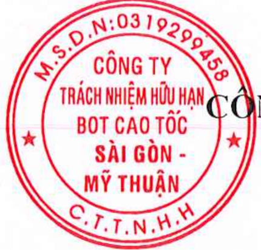

## D ÁN ĐÀU TU XÂY DUNG M RÔNG ĐUÒNG CAO TÓC THÀNH PHÓ HÒ CHÍ MINH - TRUNG LUONG - MÝ THUÂN THEO PHUONG THÚC DÔI TÁC CÔNGTUN TU VN XAYDUNGTHANHCONG

THÄM TRA

BUÓC: THIÉT KÉ KYTHUng....nm 20.2.....

Theo vn n s.1.12.V.....C.CT

HÒ SO THIÉTKE Kytên: Nglyen NNgoe  Duing TÁP X: MÔ HINH THÔNG TIN CÔNG TRINH (BIM)

TP X.2: BÁO CÁO TÓNG HP ÁP DNG BIM

TP X.2.1: PHÂN DOAN KM9+325- KM30+000

HANG MUC: CÀU VÁN – KM26+055

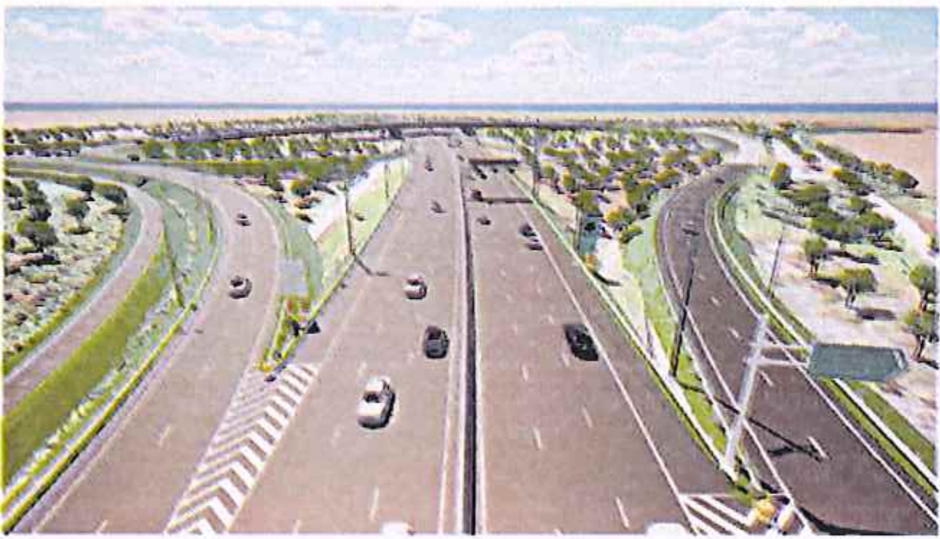

MHS: A2Z-2025-HTM-TKKT-T10.2

TP. HÒ CHÍ MINH - THÁNG 12/2025 TU VÁN THIÉT KÉ

CÔNG TY C PHÀN TU' VÁN XÂY DNG A2Z

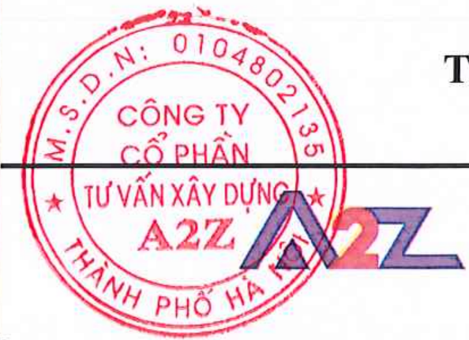

## BAN QUÅN LÝ DU ÁN 7 CÔNG TY TRÁCH NHIM HÛU HAN BOT CAO TÓC SÀI GÒN – MÝ THUÂN

-------88180-------

## DU ÁN ĐÀU TU XÂY DUNG M RÔNG DUÒNG CAO TÓC THÀNH PHÓ HÒ CHÍ MINH - TRUNG LUONG - MÝ THUN THEO PHUONG THÚC DÓI TÁC CÔNG TU

CONGTY CČ PUÁNTUVÃN

XAY DUNG THANH CÔNG

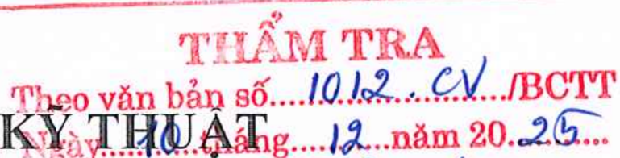

HÒ SO THIÉT KÉ

BUÓC: THIÉT KÉ KY THUAhg..1. nam 20.26...

TÁP X: MÔ HINH THÔNG TIN CÔNG TRINH (BIM)

TP X.2: BÁO CÁO TÔNG HQP ÁP DUNG BIM

TAP X.2.1: PHÂN DOAN KM9+325 - KM30+000

HANG MUC: CÀU VÁN – KM26+055

DOANH NGHIP DU ÁN CÔNG TY TRÁCH NHIM HÛU HAN BOT CAO TÓC SÀI GÒN - MÝ THUÁN TÖNG GIÁM ĐÓC

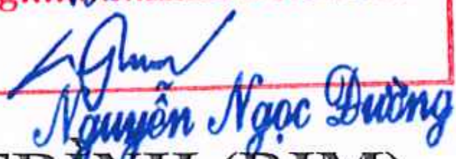

TU VÁN THIÉT KÉ CÔNG TY C PHÀN TU VÁN XÂY DUNG A2Z D. TÔNG GIÁM ĐÓC

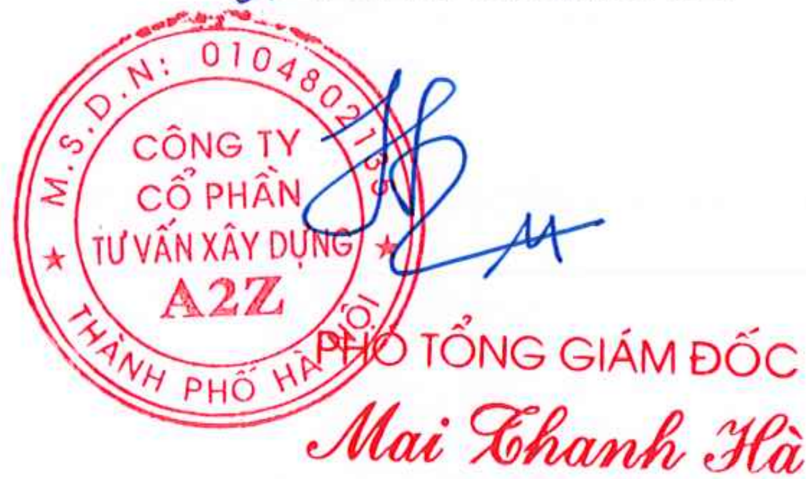

## DOANH NGHIP DU ÁN

## CÔNG TY TRÁCH NHIM HÛU HAN BOT CAO TÓC SÀI GÒN – MÝ THUÁN

-------808-------

## DU ÁN ĐÀU TU XÂY DUNG M RÔNG DUÒNG CAO TÓC

## THÀNH PHÓ HÒ CHÍ MINH - TRUNG LUONG - MÝ THUÂN THEO PHUONG THÚC DÓITÁCCÔNG TUPHAN TU VÄN XÃY DUNGTBANHCONG

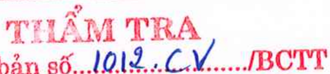

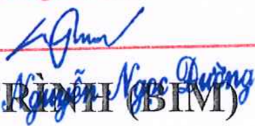

THÁM TRA

BUÓC: THIÉT KÉ KY THUA Tthang  nm 202 Theo văn bn s..10.1..C.../BCTT

HÒ SO THIÉT KÉ tn:

AGm

TÁP X: MÔ HINH THÔNG TIN CÔNG TRNBIM

TÁP X.2: BÁO CÁO TÓNG HQP ÁP DUNG BIM

TÁP X.2.1: PHÂN DOAN KM9+325 – KM30+000

HANG MUC: CÀU VÁN - KM26+055

Qun lý BIM

: Hoàng Quôc Tun

Huyl

Điu phi BIM

: Đoàn Hunh Minh

lypbr

: Nguyn Thanh Binh

Chů nhim thit k:

: Phm Vit Hùng

Qun lý cht lưng:

: Mai Thanh Hà

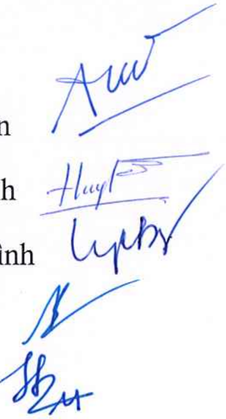

CÔNG TY C PHÀN TU VÁN XÂY DUNG A2Z P. TÔNG GIÁM ĐÓC

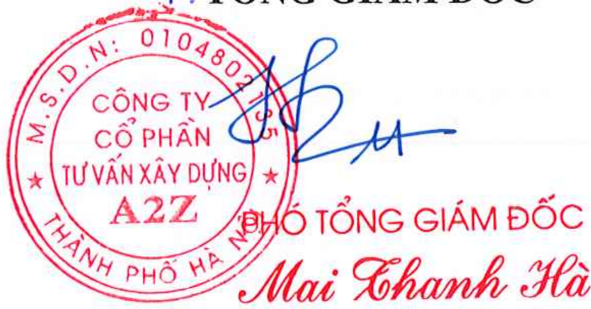

## MỤC LỤC

|   1. | TỔNG QUAN VỀ DỰ ÁN ........................................................................................ 4   |
|------|-----------------------------------------------------------------------------------------------------------------|
|   2. | CÁC QUY ĐỊNH ÁP DỤNG .................................................................................... 8     |
|   3. | MỤC TIÊU VÀ NỘI DUNG ÁP DỤNG BIM ......................................................... 9                    |
|   3. | CẤU TRÚC THƯ MỤC TRÊN CDE ..................................................................... 11              |
|   4. | MÔ HÌNH THÔNG TIN CÔNG TRÌNH ................................................................ 12                |
|   5. | BÁO CÁO XUNG ĐỘT .......................................................................................... 13  |
|   6. | KẾT LUẬN VÀ KIẾN NGHỊ ................................................................................. 13      |

DỰ ÁN ĐẦU TƯ XÂY DỰNG MỞ RỘNG ĐƯỜNG CAO TỐC THÀNH PHỐ HỒ CHÍ MINH - TRUNG LƯƠNG - MỸ THUẬN

MÔ HÌNH THÔNG TIN CÔNG TRÌNH (BIM) - BƯỚC THIẾT KẾ KỸ THUẬT

## DANH MỤC BẢNG BIỂU

| Bảng 1 Tiến độ thực hiện dự án ................................................................................................... 7   |
|----------------------------------------------------------------------------------------------------------------------------------------|
| Bảng 2 Các nội dung quy định áp dụng BIM ............................................................................... 8             |
| Bảng 3 Mục tiêu lập mô hình thông tin công trình (BIM) giai đoạn TKKT ............................. 10                                 |
| Bảng 4 Bảng phân tích các mục tiêu và nội dung áp dụng BIM ................................................ 10                         |

## DANH MỤC PHỤ LỤC

PHỤ LỤC I - MÔ HÌNH ĐIỂN HÌNH CÁC HẠNG MỤC ..................................................  15

Trang 3

DỰ ÁN ĐẦU TƯ XÂY DỰNG MỞ RỘNG ĐƯỜNG CAO TỐC THÀNH PHỐ HỒ CHÍ MINH - TRUNG LƯƠNG - MỸ THUẬN THEO PHƯƠNG THỨC ĐỐI TÁC CÔNG TƯ MÔ HÌNH THÔNG TIN CÔNG TRÌNH (BIM) - BƯỚC THIẾT KẾ KỸ THUẬT

CÔNG TY CỔ PHẦN TƯ VẤN XÂY DỰNG A2Z

----------------o0o----------------

## DỰ ÁN ĐẦU TƯ XÂY DỰNG MỞ RỘNG ĐƯỜNG CAO TỐC THÀNH PHỐ

HỒ CHÍ MINH - TRUNG LƯƠNG - MỸ THUẬN THEO PHƯƠNG THỨC ĐỐI TÁC CÔNG TƯ MÔ HÌNH THÔNG TIN CÔNG TRÌNH (BIM) BƯỚC THIẾT KẾ KỸ THUẬT

## BÁO CÁO TỔNG HỢP ÁP DỤNG BIM PHÂN ĐOẠN KM9+325-KM30+000 (CẦU VÁN)

## 1. TỔNG QUAN VỀ DỰ ÁN

## 1.1. Thông tin chung về dự án

| Tên dự án             | Dự án đầu tư xây dựng mở rộng đường cao tốc Thành phố Hồ Chí Minh - Trung Lương - Mỹ Thuận theo phương thức đối tác công tư                                                                                                                                                                                                                                                                        |
|-----------------------|----------------------------------------------------------------------------------------------------------------------------------------------------------------------------------------------------------------------------------------------------------------------------------------------------------------------------------------------------------------------------------------------------|
| Cơ quan có thẩm quyền | Bộ Xây dựng Ban Quản lý dự án 7                                                                                                                                                                                                                                                                                                                                                                    |
| Nhà đầu tư            | Liên danh Công ty Cổ phần tập đoàn Đèo Cả, Công ty Cổ phần đầu tư hạ tầng kỹ thuật Thành phố Hồ Chí Minh, Công ty Cổ phần Tasco, Tổng công ty đầu tư xây dựng Hoàng Long - CTCP, Công ty TNHH MTV Dịch vụ và Đầu tư CII                                                                                                                                                                            |
| Địa chỉ liên hệ       | Số 32 đường Thạch Thị Thanh, phường Tân Định, quận 1, TP. Hồ Chí Minh                                                                                                                                                                                                                                                                                                                              |
| Tóm tắt dự án         | 1. Phạm vi, quy mô, địa điểm thực hiện dự án 1.1. Phạm vi đầu tư: đầu tư mở rộng tuyến cao tốc Thành phố Hồ Chí Minh - Trung Lương - Mỹ Thuận cụ thể như sau: - Điểm đầu: Km9+325 tại nút giao Chợ Đệm, thuộc địa phận xã Tân Nhựt, Thành phố Hồ Chí Minh. - Điểm cuối: Km105+454 tại đầu cầu phía Bắc cầu Mỹ Thuận 2, thuộc địa phận xã An Hữu, tỉnh Đồng Tháp. - Tổng chiều dài khoảng 96,13 km. |

## CỘNG HÒA XÃ HỘI CHỦ NGHĨA VIỆT NAM Độc Lập - Tự Do - Hạnh Phúc

----------------o0o---------------Tp.Hồ Chí Minh, ngày ... tháng 12 năm 2025

MÔ HÌNH THÔNG TIN CÔNG TRÌNH (BIM) - BƯỚC THIẾT KẾ KỸ THUẬT

| 1.2. Địa điểm thực hiện dự án: Thành phố Hồ Chí Minh, tỉnh Tây Ninh và tỉnh Đồng Tháp. 1.3. Quy mô đầu tư: 1.3.1. Đường cao tốc a. Cấp đường: - Đoạn Thành phố Hồ Chí Minh - Trung Lương: quy mô giai đoạn hoàn chỉnh theo quy hoạch 10 - 12 làn xe (đoạn từ Chợ Đệm - Vành đai 4 quy mô 12 làn xe, đoạn từ Vành đai 4 - Trung Lương quy mô 10 làn xe), vận tốc thiết kế Vₜₖ=120km/h. Phân kỳ đầu tư quy mô 08 làn xe, vận tốc thiết kế Vₜₖ=120km/h theo Quy chuẩn kỹ thuật quốc gia về đường bộ cao tốc QCVN 117:2024/BGTVT, Tiêu chuẩn đường cao tốc TCVN 5729:2012 và TCVN 5729:1997. - Đoạn Trung Lương - Mỹ Thuận và đoạn từ nút giao An Thái Trung đến đầu cầu phía Bắc cầu Mỹ Thuận 2: đầu tư hoàn chỉnh quy mô 6 làn xe theo quy hoạch được duyệt, vận tốc thiết kế Vₜₖ=100 km/h theo Quy chuẩn kỹ thuật quốc gia về đường bộ cao tốc QCVN 117:2024/BGTVT, Tiêu chuẩn đường cao tốc TCVN 5729:2012. b. Mặt cắt ngang: - Đoạn Thành phố Hồ Chí Minh - Trung Lương: + Đoạn Chợ Đệm - Vành đai 4: mặt cắt ngang giai đoạn hoàn chỉnh với bề rộng nền đường Bnền = 56m. Mặt cắt ngang phân kỳ đầu tư giai đoạn 1 với bề rộng nền đường Bnền = 41m. + Đoạn Vành đai 4 - Trung Lương: mặt cắt ngang giai đoạn hoàn chỉnh với bề rộng nền đường Bnền = 48,5m. Mặt cắt ngang phân kỳ đầu tư giai đoạn 1 với bề rộng nền đường Bnền = 41m. - Đoạn Trung Lương - Mỹ Thuận và đoạn từ nút giao An Thái Trung đến đầu cầu phía Bắc cầu Mỹ Thuận 2: mặt cắt ngang hoàn chỉnh với bề rộng nền đường Bnền = 32,25m. c) Mặt đường: cấp cao A1 d) Công trình cầu - Công trình cầu thiết kế bằng bê tông cốt thép và bê tông cốt thép dự ứng lực theo các tiêu chuẩn TCVN 11823 - 1:2017   |
|----------------------------------------------------------------------------------------------------------------------------------------------------------------------------------------------------------------------------------------------------------------------------------------------------------------------------------------------------------------------------------------------------------------------------------------------------------------------------------------------------------------------------------------------------------------------------------------------------------------------------------------------------------------------------------------------------------------------------------------------------------------------------------------------------------------------------------------------------------------------------------------------------------------------------------------------------------------------------------------------------------------------------------------------------------------------------------------------------------------------------------------------------------------------------------------------------------------------------------------------------------------------------------------------------------------------------------------------------------------------------------------------------------------------------------------------------------------------------------------------------------------------------------------------------------------------------------------------------------------------------------------------------------------------------------|

## BÁO CÁO TỔNG HỢP ÁP DỤNG BIM

DỰ ÁN ĐẦU TƯ XÂY DỰNG MỞ RỘNG ĐƯỜNG CAO TỐC THÀNH PHỐ HỒ CHÍ MINH - TRUNG LƯƠNG - MỸ THUẬN THEO PHƯƠNG THỨC ĐỐI TÁC CÔNG TƯ MÔ HÌNH THÔNG TIN CÔNG TRÌNH (BIM) - BƯỚC THIẾT KẾ KỸ THUẬT

| đến TCVN 11823 - 14:2017 'Thiết kế cầu đường bộ'. - Tải trọng thiết kế HL93. đ)Nút giao: xây dựng các nút giao liên thông và trực thông bảo đảm khai thác an toàn, kết nối thuận lợi. e) Tần suất thiết kế: đảm bảo tần suất P = 1%. 1.3.2. Đường gom, đường ngang, hoàn trả đường dân sinh - Cấp đường: phù hợp với đường hiện hữu, tối thiểu bảo đảm quy mô đường cấp V đồng bằng (đối với đoạn Thành phố Hồ Chí Minh - Trung Lương) và đường giao thông nông thôn cấp B (đối với đoạn Trung Lương - Mỹ Thuận và đoạn từ nút giao An Thái Trung đến đầu cầu phía Bắc cầu Mỹ Thuận 2). - Tần suất thiết kế: theo quy định của cấp đường; đối với đường hoàn trả, bảo đảm phù hợp với hiện trạng đường đang khai thác. - Mặt đường: bê tông nhựa, láng nhựa hoặc bê tông xi măng. 1.3.3. Công trình phục vụ khai thác - Hệ thống quản lý giao thông thông minh: xây dựng mới, tận dụng và nâng cấp hệ thống quản lý giao thông thông minh, hệ thống thu phí điện tử không dừng, công trình kiểm soát tải trọng xe bảo đảm kiểm soát và điều khiển giao thông phù hợp với quy mô đầu tư tuyến đường, đáp ứng yêu cầu vận hành, khai thác đường cao tốc, bảo đảm kết nối đồng bộ, thống nhất với các tuyến lân cận. - Trạm dừng nghỉ: tại Km28+200 (đoạn Thành phố Hồ Chí Minh - Trung Lương và tại Km78+220 (đoạn Trung Lương - Mỹ Thuận). 2. Thời gian thực hiện dự án : từ năm 2025, hoàn thành đưa vào khai thác năm 2028. 3. Diện tích mặt đất, mặt nước sử dụng; nhu cầu sử dụng tài nguyên khác: tổng diện tích chiếm dụng đất khoảng 1.070,21 ha; trong đó: 949,71 ha đã giải 10 phóng mặt bằng trong giai đoạn trước đây và 120,5 ha cần giải phóng mặt bằng bổ sung (Thành phố Hồ Chí Minh khoảng 6,37 ha; tỉnh Tây Ninh khoảng 60,84 ha và tỉnh Đồng Tháp khoảng 53,29 ha).   |
|----------------------------------------------------------------------------------------------------------------------------------------------------------------------------------------------------------------------------------------------------------------------------------------------------------------------------------------------------------------------------------------------------------------------------------------------------------------------------------------------------------------------------------------------------------------------------------------------------------------------------------------------------------------------------------------------------------------------------------------------------------------------------------------------------------------------------------------------------------------------------------------------------------------------------------------------------------------------------------------------------------------------------------------------------------------------------------------------------------------------------------------------------------------------------------------------------------------------------------------------------------------------------------------------------------------------------------------------------------------------------------------------------------------------------------------------------------------------------------------------------------------------------------------------------------------------------------------------------------------------------------------------------------------------------------------------------------------------------------------------------------------------------------------|

## BÁO CÁO TỔNG HỢP ÁP DỤNG BIM

DỰ ÁN ĐẦU TƯ XÂY DỰNG MỞ RỘNG ĐƯỜNG CAO TỐC THÀNH PHỐ HỒ CHÍ MINH - TRUNG LƯƠNG - MỸ THUẬN THEO PHƯƠNG THỨC ĐỐI TÁC CÔNG TƯ

MÔ HÌNH THÔNG TIN CÔNG TRÌNH (BIM) - BƯỚC THIẾT KẾ KỸ THUẬT

| 4. Loại hợp đồng dự án PPP: Hợp đồng Xây dựng - Kinh doanh - Chuyển giao (BOT). 5. Tổng mức đầu tư: 36.172,41 tỷ đồng.   |
|--------------------------------------------------------------------------------------------------------------------------|

## 1.2. Tiến độ dự án

Bảng 1 Tiến độ thực hiện dự án

| Giai đoạn                                       | Thời gian        |
|-------------------------------------------------|------------------|
| Thẩm định, phê duyệt báo cáo nghiên cứu khả thi | Tháng 10-11/2025 |
| Lựa chọn nhà đầu tư                             | Tháng 11-12/2025 |
| Khởi công dự án                                 | 19/12/2025       |
| Triển khai thực hiện dự án                      | Năm 2025 - 2028  |

DỰ ÁN ĐẦU TƯ XÂY DỰNG MỞ RỘNG ĐƯỜNG CAO TỐC THÀNH PHỐ HỒ CHÍ MINH - TRUNG LƯƠNG - MỸ THUẬN

## 2. CÁC QUY ĐỊNH ÁP DỤNG

## 2.1. Căn cứ pháp lý ứng dụng BIM

- -Quyết định số 2500/QĐ-TTg ngày 22/12/2016 của Thủ tướng Chính phủ Phê duyệt Đề án áp dụng mô hình thông tin công trình (BIM) trong hoạt động xây dựng và quản lý vận hành công trình;
- -Quyết định số 749/QĐ-TTg ngày 03 tháng 6 năm 2020 phê duyệt 'Chương trình chuyển đổi số quốc gia đến năm 2025, định hướng đến năm 2030;
- -Quyết định số 347/QĐ-BXD ngày 02 tháng 4 năm 2021 của Bộ Xây Dựng về việc 'Công bố Hướng dẫn chi tiết áp dụng Mô hình thông tin công trình (BIM) đối với công trình dân dụng và công trình hạ tầng kỹ thuật đô thị';
- -Quyết định số 348/QĐ-BXD ngày 02 tháng 4 năm 2021 của Bộ Xây Dựng về việc 'Công bố Hướng dẫn chung áp dụng Mô hình thông tin công trình (BIM)'.
- -Quyết định số 258/QĐ-TTg ngày 17 tháng 3 năm 2023 của Thủ tướng Chính phủ về việc Phê duyệt lộ trình áp dụng Mô hình thông tin công trình (BIM) trong hoạt động xây dựng.
- -Thông tư số 12/2021/TT-BXD ngày 31 tháng 8 năm 2021 của Bộ Xây dựng ban hành định mức xây dựng;
- -Thông tư số 09/2024/TT-BXD ngày 30 tháng 8 năm 2024 của Bộ Xây dựng ban hành sửa đổi, bổ sung một số định mức xây dựng ban hành tại Thông tư số 12/2021/TT-BXD;
- -Nghị định số 175/2024/NĐ-CP ngày 30 tháng 12 năm 2024 của Chính phủ Quy định chi tiết một số điều và biện pháp thi hành Luật Xây dựng về quản lý hoạt động xây dựng.

## 2.2. Các tiêu chuẩn áp dụng BIM

Tất cả thông tin của dự án sẽ được tạo lập, chia sẻ và quản lý tham khảo các tiêu chuẩn và hướng dẫn sau:

Bảng 2 Các nội dung quy định áp dụng BIM

| B = Bắt buộc T= Tham Khảo   | B = Bắt buộc T= Tham Khảo                                                                                                                                                                                          | Áp dụng   | Áp dụng   | Áp dụng         | Áp dụng   | Áp dụng   | Áp dụng   | Áp dụng   | Áp dụng   |
|-----------------------------|--------------------------------------------------------------------------------------------------------------------------------------------------------------------------------------------------------------------|-----------|-----------|-----------------|-----------|-----------|-----------|-----------|-----------|
| Các tiêu chuẩn, hướng dẫn   | Các tiêu chuẩn, hướng dẫn                                                                                                                                                                                          | Hướng dẫn | Phối hợp  | Đặt tên tệp tin | Bản vẽ    | LOD       | CDE       | Chi phí   | Hợp đồng  |
| Trong nước                  | Quyết định số 347/QĐ-BXD ngày 02 tháng 4 năm 2021 của Bộ Xây dựng về việc Công bố Hướng dẫn chi tiết áp dụng Mô hình thông tin công trình (BIM) đối với công trình dân dụng và công trình hạ tầng kỹ thuật đô thị. | B         | T         | T               | T         | B         | B         |           | T         |

DỰ ÁN ĐẦU TƯ XÂY DỰNG MỞ RỘNG ĐƯỜNG CAO TỐC THÀNH PHỐ HỒ CHÍ MINH - TRUNG LƯƠNG - MỸ THUẬN

MÔ HÌNH THÔNG TIN CÔNG TRÌNH (BIM) - BƯỚC THIẾT KẾ KỸ THUẬT

| B = Bắt buộc T= Tham Khảo                                                                                                                                                                                                                                | Áp dụng   | Áp dụng   | Áp dụng         | Áp dụng   | Áp dụng   | Áp dụng   | Áp dụng   | Áp dụng   |
|----------------------------------------------------------------------------------------------------------------------------------------------------------------------------------------------------------------------------------------------------------|-----------|-----------|-----------------|-----------|-----------|-----------|-----------|-----------|
| Các tiêu chuẩn, hướng dẫn                                                                                                                                                                                                                                | Hướng dẫn | Phối hợp  | Đặt tên tệp tin | Bản vẽ    | LOD       | CDE       | Chi phí   | Hợp đồng  |
| Quyết định số 348/QĐ-BXD ngày 02 tháng 4 năm 2021 của Bộ Xây dựng về việc Công bố Hướng dẫn chung áp dụng Mô hình thông tin công trình (BIM).                                                                                                            | B         | T         | T               | T         | B         | B         |           | T         |
| Quyết định số 258/QĐ-TTg ngày 17 tháng 3 năm 2023 của Thủ tướng Chính phủ về việc Phê duyệt lộ trình áp dụng Mô hình thông tin công trình (BIM) trong hoạt động xây dựng                                                                                 | T         | T         |                 |           |           |           |           |           |
| Thông tư số 09/2024/TT-BXD ngày 30 tháng 8 năm 2024 của Bộ Xây dựng ban hành sửa đổi, bổ sung một số định mức xây dựng ban hành tại Thông tư số 12/2021/TT-BXD                                                                                           |           |           |                 |           |           |           | B         |           |
| TCVN 14177-1:2024: Tổ chức và số hóa thông tin về công trình xây dựng, bao gồm mô hình hóa thông tin công trình (BIM) - Quản lý thông tin sử dụng mô hình hóa thông tin công trình Phần 1: Khái niệm và nguyên tắc Phần 2: Giai đoạn chuyển giao tài sản | T         |           | T               |           |           | T         |           |           |

## 3. MỤC TIÊU VÀ NỘI DUNG ÁP DỤNG BIM

## 3.1. Mục tiêu áp dụng BIM

## 3.1.1. Mục tiêu chung

Đây là dự án có quy mô lớn, tính chất phức tạp nên việc áp dụng BIM vào Dự án đầu tư xây dựng mở rộng đường cao tốc Thành phố Hồ Chí Minh - Trung Lương - Mỹ Thuận theo phương thức đối tác công tư trong giai đoạn thiết kế kỹ thuật nhằm mục tiêu tối ưu hóa thiết kế, hạn chế sai sót.

## 3.2. Mục tiêu cụ thể

Bảng 3 Mục tiêu lập mô hình thông tin công trình (BIM) giai đoạn TKKT

|   STT | Mục tiêu                                                                            |
|-------|-------------------------------------------------------------------------------------|
|     1 | - Nâng cao chất lượng thiết kế công trình                                           |
|     2 | - Cung cấp thông tin về thiết kế để sử dụng cho các giai đoạn tiếp theo của Dự án   |
|     3 | - Cung cấp thông tin cho các bên liên quan của Dự án thông qua CDE do CĐT cung cấp. |

## 3.3. Nội dung áp dụng BIM trong dự án

Dựa trên cơ sở nội dung áp dụng BIM đã được đề cập trong tài liệu EIR mà Chủ đầu tư đã đưa ra, Tư vấn BIM thống nhất các nội dung sẽ áp dụng BIM trong dự án, cụ thể các nội dung áp dụng chi tiết như sau:

Bảng 4 Bảng phân tích các mục tiêu và nội dung áp dụng BIM

|   STT | Nội dung áp dụng                                      | Yêu cầu                                                                                                                                                                                                                         |
|-------|-------------------------------------------------------|---------------------------------------------------------------------------------------------------------------------------------------------------------------------------------------------------------------------------------|
|     1 | Xây dựng mô hình địa hình từ dữ liệu khảo sát         | Mô hình địa hình hiện trạng được xây dựng từ Point Clouds. Bề mặt tự nhiên trong phạm vi dự án được mô hình hóa dạng bề mặt 3D (3D surface) với LOD 300                                                                         |
|     2 | Xây dựng BIM cho hồ sơ Lập báo cáo nghiên cứu khả thi | Toàn bộ các hạng mục công trình của dự án được xây dựng BIM 3D với LOD 300 là ít nhất và LOI tương ứng của từng hạng mục tối thiểu như sau: mã cấu kiện, phân loại cấu kiện, mô tả cấu kiện, vị trí theo khu vực, vị trí dự án. |

DỰ ÁN ĐẦU TƯ XÂY DỰNG MỞ RỘNG ĐƯỜNG CAO TỐC THÀNH PHỐ HỒ CHÍ MINH - TRUNG LƯƠNG - MỸ THUẬN THEO PHƯƠNG THỨC ĐỐI TÁC CÔNG TƯ

MÔ HÌNH THÔNG TIN CÔNG TRÌNH (BIM) - BƯỚC THIẾT KẾ KỸ THUẬT

## 3. CẤU TRÚC THƯ MỤC TRÊN CDE

| 1-ĐANG TRIỂN KHAI 2-CHIA SẺ 3-PHÁT HÀNH 4-LƯU TRỮ   |
|-----------------------------------------------------|

## 4. MÔ HÌNH THÔNG TIN CÔNG TRÌNH

- -Mô hình thông tin công trình (BIM) Dự án đầu tư xây dựng mở rộng đường cao tốc thành phố Hồ Chí Minh - Trung Lương - Mỹ Thuận theo phương thức đối tác công tư trong giai đoạn thiết kế kỹ thuật đảm bảo theo kế hoạch thực hiện BIM (BEP) được phê duyệt.
- -Kế hoạch chuyển giao thông tin tổng thể (MIDP):

| STT   | NỘI DUNG CÔNG VIỆC       | BỘ MÔN                              | TÊN TẬP TIN                                              | MÔ TẢ                                                    | LOẠI DỮ LIỆU                                             | ĐỊNH DẠNG TRAO ĐỔI DỮ LIỆU                               | GIAI ĐOẠN CHUYỂN GIAO THÔNG TIN LẦN 1   | GIAI ĐOẠN CHUYỂN GIAO THÔNG TIN LẦN 1   | GIAI ĐOẠN CHUYỂN GIAO THÔNG TIN LẦN 1   |
|-------|--------------------------|-------------------------------------|----------------------------------------------------------|----------------------------------------------------------|----------------------------------------------------------|----------------------------------------------------------|-----------------------------------------|-----------------------------------------|-----------------------------------------|
| STT   | NỘI DUNG CÔNG VIỆC       | BỘ MÔN                              | TÊN TẬP TIN                                              | MÔ TẢ                                                    | LOẠI DỮ LIỆU                                             | ĐỊNH DẠNG TRAO ĐỔI DỮ LIỆU                               | ĐƠN VỊ CHỦ TRÌ                          | NGÀY CHUYỂN GIAO                        | LOD                                     |
| 1     | BIM GIAI ĐOẠN CHUẨN BỊ   | KẾ HOẠCH TRIỂN KHAI BIM (BEP)       | HTM-A2Z-GEN-KM26+055_CAUVAN- PP-D-BEP-0001-[A3][C01]     | Kế hoạch triển khai BIM (BEP)                            | Thuyết minh                                              | PDF                                                      | A2Z                                     | …/…/2025                                | -                                       |
| 2     | BIM CHO THIẾT KẾ         | MÔ HÌNH THÀNH PHẦN                  | Tham khảo Kế hoạch chuyển giao thông tin chi tiết (TIDP) | Tham khảo Kế hoạch chuyển giao thông tin chi tiết (TIDP) | Tham khảo Kế hoạch chuyển giao thông tin chi tiết (TIDP) | Tham khảo Kế hoạch chuyển giao thông tin chi tiết (TIDP) | A2Z                                     | …/…/2025                                | 350                                     |
| 2     | BIM CHO THIẾT KẾ         | MÔ HÌNH TỔNG                        | HTM-A2Z-BR- KM26+000_CAUVAN_GD1-M3-D- ZZ-0001-[S1][C01]  | Mô hình tổng cầu ván giai đoạn 1                         | Mô hình 3D                                               | IFC                                                      | A2Z                                     | …/…/2025                                | 300                                     |
| 2     | BIM CHO THIẾT KẾ         | MÔ HÌNH TỔNG                        | HTM-A2Z-BR- KM26+000_CAUVAN_GDTD-M3- D-ZZ-0001-[S1][C01] | Mô hình tổng cầu ván giai đoạn trước đây                 | Mô hình 3D                                               | IFC                                                      | A2Z                                     | …/…/2025                                | 300                                     |
| 3     | BẢN VẼ BIM               | BẢN VẼ MÔ HÌNH THÔNG TIN CÔNG TRÌNH | HTM-A2Z-GEN- KM26+055_CAUVAN-DR-D-ZZ- 0001-[S1][C01]     | Bản vẽ mô hình thông tin công trình cầu ván              | Bản vẽ                                                   | PDF                                                      | A2Z                                     | …/…/2025                                | -                                       |
| 4     | BẢNG TỔNG HỢP KHỐI LƯỢNG | BẢNG TỔNG HỢP KHỐI LƯỢNG BIM        | HTM-DP-GEN- KM26+055_CAUVAN-PP-D-VO- 0001-[A2][C01]      | Bảng THKL BIM đoạn Km9+325 đến Km29+000                  | Bảng THKL                                                | PDF                                                      | A2Z                                     | …/…/2025                                | -                                       |
| 5     | BÁO CÁO                  | BÁO CÁO BIM                         | HTM-A2Z-GEN- KM26+055_CAUVAN-PP-D-BIMR- 0001-[A3][C01]   | Báo cáo tổng hợp áp dụng BIM cầu ván                     | Báo cáo                                                  | PDF                                                      | A2Z                                     | …/…/2025                                | -                                       |

DỰ ÁN ĐẦU TƯ XÂY DỰNG MỞ RỘNG ĐƯỜNG CAO TỐC THÀNH PHỐ HỒ CHÍ MINH - TRUNG LƯƠNG - MỸ THUẬN THEO PHƯƠNG THỨC ĐỐI TÁC CÔNG TƯ

MÔ HÌNH THÔNG TIN CÔNG TRÌNH (BIM) - BƯỚC THIẾT KẾ KỸ THUẬT

## 5. BÁO CÁO XUNG ĐỘT

- -Các xung đột cấu kiện và bộ môn, bộ phận thiết kế và bộ phận BIM đã làm việc, thống nhất và xử lý hết các xung đột mà tư vấn BIM phát hiện.

## 6. KẾT LUẬN VÀ KIẾN NGHỊ

- -Việc áp dụng mô hình thông tin công trình BIM vào Dự án đầu tư xây dựng mở rộng đường cao tốc thành phố Hồ Chí Minh - Trung Lương - Mỹ Thuận theo phương thức đối tác công tư trong giai đoạn thiết kế kỹ thuật đã đảm bảo tối ưu hóa thiết kế, hạn chế sai sót, xử lý xung đột các hệ thống hạng mục quan trọng cũng như nội bộ kết cấu hạng mục công trình, phối hợp đồng bộ nhịp nhàng giữa các bên liên quan, kiểm soát được khối lượng, tiến độ thực hiện dự án.
- -Đồng thời, việc áp dụng BIM còn là nguồi dữ liệu cơ sở để triển khai áp dụng BIM cho các giai đoạn tiếp theo của dự án đạt được hiệu quả tốt nhất, đặc biệt là giai đoạn TKTC và quản lý vận hành sau này.
- -Kính trình Bộ xây dựng xem xét phê duyệt để triển khai các bước tiếp theo.

DỰ ÁN ĐẦU TƯ XÂY DỰNG MỞ RỘNG ĐƯỜNG CAO TỐC THÀNH PHỐ HỒ CHÍ MINH - TRUNG LƯƠNG - MỸ THUẬN

THEO PHƯƠNG THỨC ĐỐI TÁC CÔNG TƯ

MÔ HÌNH THÔNG TIN CÔNG TRÌNH (BIM) - BƯỚC THIẾT KẾ KỸ THUẬT

## PHỤ LỤC BÁO CÁO TỔNG HỢP ÁP DỤNG BIM

DỰ ÁN ĐẦU TƯ XÂY DỰNG MỞ RỘNG ĐƯỜNG CAO TỐC THÀNH PHỐ HỒ CHÍ MINH - TRUNG LƯƠNG - MỸ THUẬN

THEO PHƯƠNG THỨC ĐỐI TÁC CÔNG TƯ

MÔ HÌNH THÔNG TIN CÔNG TRÌNH (BIM) - BƯỚC THIẾT KẾ KỸ THUẬT

## PHỤ LỤC 1 MÔ HÌNH ĐIỂN HÌNH CÁC HẠNG MỤC

| PHỤ LỤC 1 - MÔ HÌNH ĐIỂN HÌNH HẠNG MỤC CẦU VÁN   | PHỤ LỤC 1 - MÔ HÌNH ĐIỂN HÌNH HẠNG MỤC CẦU VÁN   | PHỤ LỤC 1 - MÔ HÌNH ĐIỂN HÌNH HẠNG MỤC CẦU VÁN            | PHỤ LỤC 1 - MÔ HÌNH ĐIỂN HÌNH HẠNG MỤC CẦU VÁN   | PHỤ LỤC 1 - MÔ HÌNH ĐIỂN HÌNH HẠNG MỤC CẦU VÁN   | PHỤ LỤC 1 - MÔ HÌNH ĐIỂN HÌNH HẠNG MỤC CẦU VÁN   | PHỤ LỤC 1 - MÔ HÌNH ĐIỂN HÌNH HẠNG MỤC CẦU VÁN   | PHỤ LỤC 1 - MÔ HÌNH ĐIỂN HÌNH HẠNG MỤC CẦU VÁN   |
|--------------------------------------------------|--------------------------------------------------|-----------------------------------------------------------|--------------------------------------------------|--------------------------------------------------|--------------------------------------------------|--------------------------------------------------|--------------------------------------------------|
| TT                                               | HẠNG MỤC                                         | TÊN TỆP TIN                                               | MÔ TẢ                                            | LOD                                              | PHẦ N MỀM                                        | ĐƯỜNG DẪN CDE                                    | HÌNH ẢNH MÔ HÌNH                                 |
| 1                                                | Công trình Cầu                                   | HTM-A2Z-BR- KM26+000_CAUVAN_G D1-M3-D-ZZ-0001- [S1][C01]  | Mô hình tổng cầu ván giai đoạn 1                 | 300                                              | Revit                                            |                                                  |                                                  |
| 1                                                |                                                  | HTM-A2Z-BR- KM26+000_CAUVAN_G DTD-M3-D-ZZ-0001- [S1][C01] | Mô hình tổng cầu ván giai đoạn trước đây         | 300                                              | Revit                                            |                                                  |                                                  |

| PHỤ LỤC 1 - MÔ HÌNH ĐIỂN HÌNH HẠNG MỤC CẦU VÁN   | PHỤ LỤC 1 - MÔ HÌNH ĐIỂN HÌNH HẠNG MỤC CẦU VÁN   | PHỤ LỤC 1 - MÔ HÌNH ĐIỂN HÌNH HẠNG MỤC CẦU VÁN                         | PHỤ LỤC 1 - MÔ HÌNH ĐIỂN HÌNH HẠNG MỤC CẦU VÁN   | PHỤ LỤC 1 - MÔ HÌNH ĐIỂN HÌNH HẠNG MỤC CẦU VÁN   | PHỤ LỤC 1 - MÔ HÌNH ĐIỂN HÌNH HẠNG MỤC CẦU VÁN   | PHỤ LỤC 1 - MÔ HÌNH ĐIỂN HÌNH HẠNG MỤC CẦU VÁN   | PHỤ LỤC 1 - MÔ HÌNH ĐIỂN HÌNH HẠNG MỤC CẦU VÁN   | PHỤ LỤC 1 - MÔ HÌNH ĐIỂN HÌNH HẠNG MỤC CẦU VÁN   |
|--------------------------------------------------|--------------------------------------------------|------------------------------------------------------------------------|--------------------------------------------------|--------------------------------------------------|--------------------------------------------------|--------------------------------------------------|--------------------------------------------------|--------------------------------------------------|
| TT                                               | HẠNG MỤC                                         | TÊN TỆP TIN                                                            | MÔ TẢ                                            | LOD                                              | PHẦ N MỀM                                        | ĐƯỜNG DẪN CDE                                    | HÌNH ẢNH MÔ HÌNH                                 | HÌNH ẢNH MÔ HÌNH                                 |
| 1                                                | Công trình Cầu                                   | HTM-A2Z-BR- KM26+000_CAUVAN_C KND1000MO_35M_P-M3- D-SUB-0001-[S1][C01] | Mô hình cầu cọc khoan nhồi                       | 350                                              | Revit                                            |                                                  |                                                  |                                                  |
| 1                                                | Công trình Cầu                                   | HTM-A2Z-BR- KM26+000_CAUVAN_B QD_P-M3-D-SUB-0001- [S1][C01]            | Mô hình bản quá độ                               | 350                                              | Revit                                            |                                                  |                                                  |                                                  |

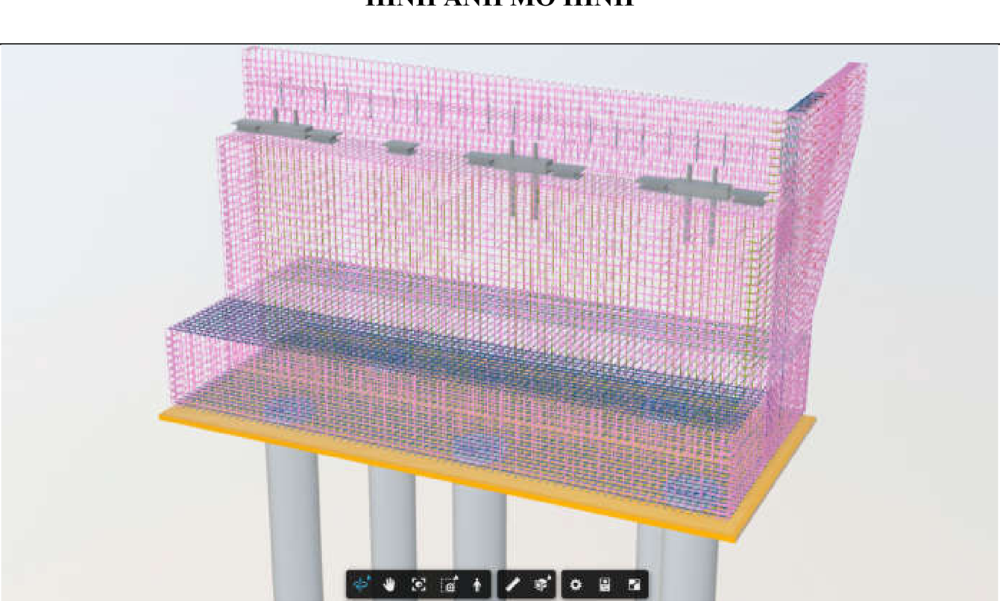

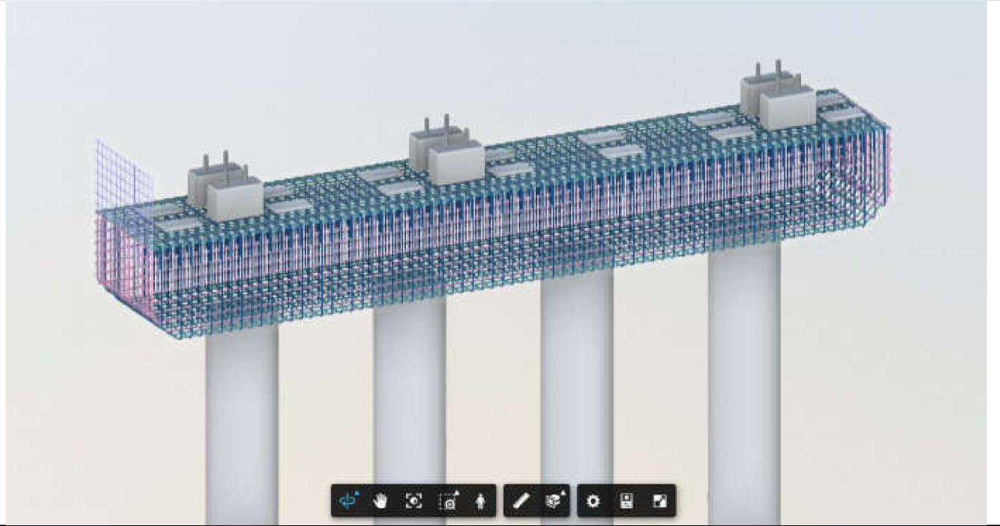

| PHỤ LỤC 1 - MÔ HÌNH ĐIỂN HÌNH HẠNG MỤC CẦU VÁN   | PHỤ LỤC 1 - MÔ HÌNH ĐIỂN HÌNH HẠNG MỤC CẦU VÁN   | PHỤ LỤC 1 - MÔ HÌNH ĐIỂN HÌNH HẠNG MỤC CẦU VÁN                | PHỤ LỤC 1 - MÔ HÌNH ĐIỂN HÌNH HẠNG MỤC CẦU VÁN   | PHỤ LỤC 1 - MÔ HÌNH ĐIỂN HÌNH HẠNG MỤC CẦU VÁN   | PHỤ LỤC 1 - MÔ HÌNH ĐIỂN HÌNH HẠNG MỤC CẦU VÁN   | PHỤ LỤC 1 - MÔ HÌNH ĐIỂN HÌNH HẠNG MỤC CẦU VÁN   | PHỤ LỤC 1 - MÔ HÌNH ĐIỂN HÌNH HẠNG MỤC CẦU VÁN   |
|--------------------------------------------------|--------------------------------------------------|---------------------------------------------------------------|--------------------------------------------------|--------------------------------------------------|--------------------------------------------------|--------------------------------------------------|--------------------------------------------------|
| TT                                               | HẠNG MỤC                                         | TÊN TỆP TIN                                                   | MÔ TẢ                                            | LOD                                              | PHẦ N MỀM                                        | ĐƯỜNG DẪN CDE                                    | HÌNH ẢNH MÔ HÌNH                                 |
| 1                                                | Công trình Cầu                                   | HTM-A2Z-BR- KM26+000_CAU_VAN_ MOM1_P-M3-D-SUB- 0001-[S1][C01] | Mô hình Mố cầu Ván                               | 350                                              | Revit                                            |                                                  |                                                  |
| 1                                                |                                                  | HTM-A2Z-BR- KM26+000_CAUVAN_X AMU_P-M3-D-SUB-0001- [S1][C01]  | Mô hình trụ cầu Ván                              | 350                                              | Revit                                            |                                                  |                                                  |

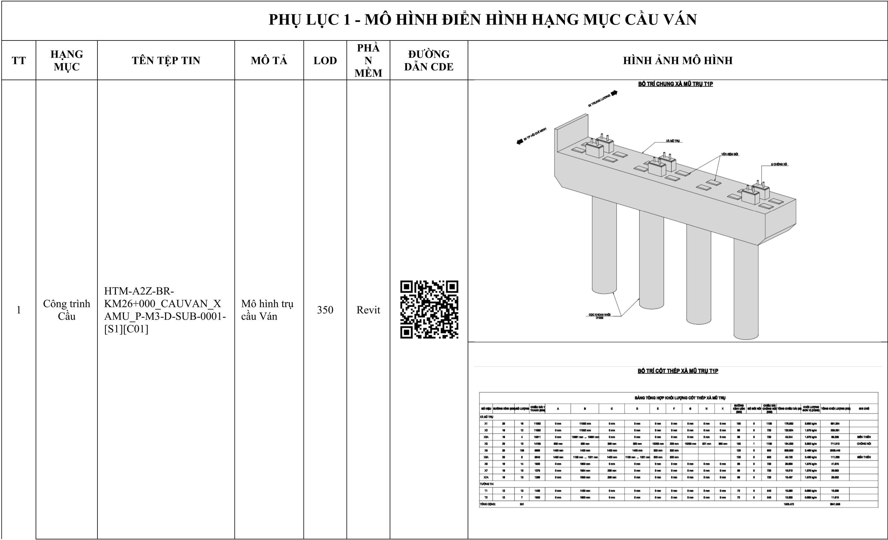

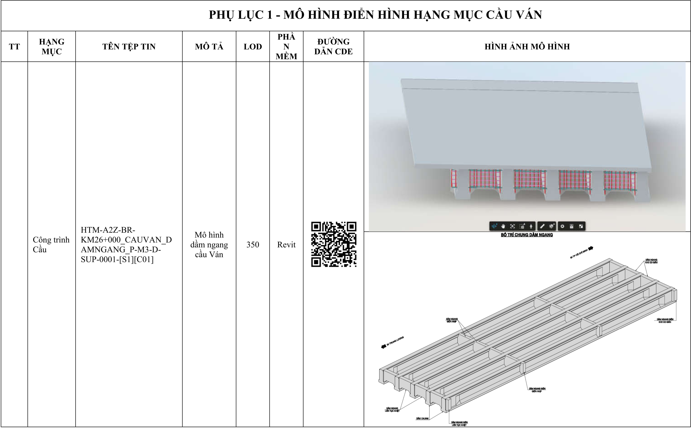

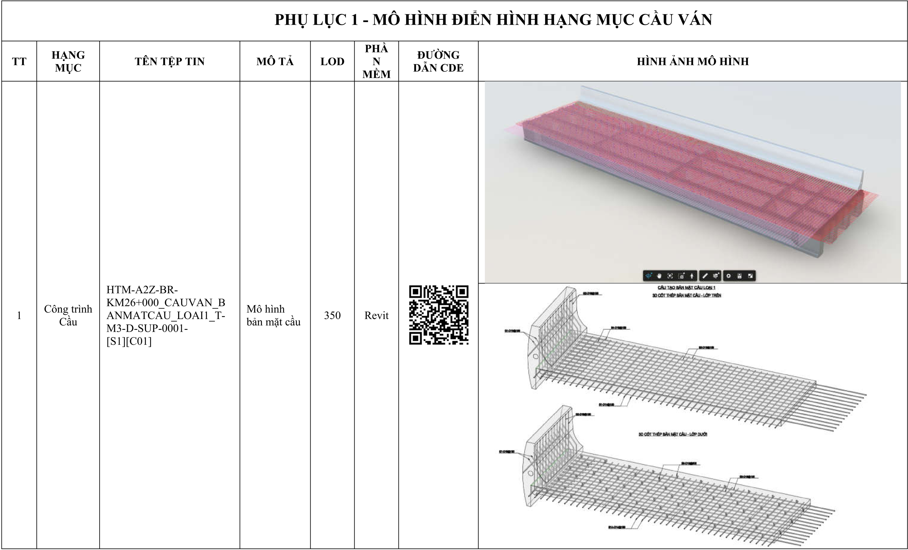

| PHỤ LỤC 1 - MÔ HÌNH ĐIỂN HÌNH HẠNG MỤC CẦU VÁN   | PHỤ LỤC 1 - MÔ HÌNH ĐIỂN HÌNH HẠNG MỤC CẦU VÁN   | PHỤ LỤC 1 - MÔ HÌNH ĐIỂN HÌNH HẠNG MỤC CẦU VÁN                              | PHỤ LỤC 1 - MÔ HÌNH ĐIỂN HÌNH HẠNG MỤC CẦU VÁN   | PHỤ LỤC 1 - MÔ HÌNH ĐIỂN HÌNH HẠNG MỤC CẦU VÁN   | PHỤ LỤC 1 - MÔ HÌNH ĐIỂN HÌNH HẠNG MỤC CẦU VÁN   | PHỤ LỤC 1 - MÔ HÌNH ĐIỂN HÌNH HẠNG MỤC CẦU VÁN   | PHỤ LỤC 1 - MÔ HÌNH ĐIỂN HÌNH HẠNG MỤC CẦU VÁN   |
|--------------------------------------------------|--------------------------------------------------|-----------------------------------------------------------------------------|--------------------------------------------------|--------------------------------------------------|--------------------------------------------------|--------------------------------------------------|--------------------------------------------------|
| TT                                               | HẠNG MỤC                                         | TÊN TỆP TIN                                                                 | MÔ TẢ                                            | LOD-G                                            | PHẦ N MỀM                                        | ĐƯỜNG DẪN CDE                                    | HÌNH ẢNH MÔ HÌNH                                 |
| 1                                                | Công trình Cầu                                   | HTM-A2Z-BR- KM26+000_CAUVAN_LI ENTUCNHIET_LOAI2_P- M3-D-SUP-0001- [S1][C01] | Mô hình bản liên tục nhiệt                       | 350                                              | Revit                                            |                                                  |                                                  |
| 1                                                | Công trình Cầu                                   | HTM-A2Z-BR- KM26+000_CAUVAN_M OINOICUNG_LOAI1_P- M3-D-SUP-0001- [S1][C01]   | Mô hình mối nối cứng                             | 350                                              | Revit                                            |                                                  |                                                  |

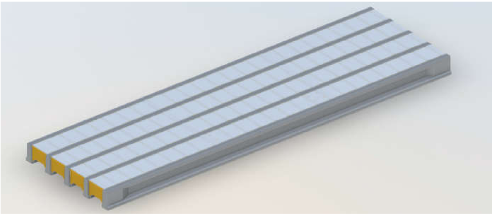

| PHỤ LỤC 1 - MÔ HÌNH ĐIỂN HÌNH HẠNG MỤC CẦU VÁN   | PHỤ LỤC 1 - MÔ HÌNH ĐIỂN HÌNH HẠNG MỤC CẦU VÁN   | PHỤ LỤC 1 - MÔ HÌNH ĐIỂN HÌNH HẠNG MỤC CẦU VÁN                      | PHỤ LỤC 1 - MÔ HÌNH ĐIỂN HÌNH HẠNG MỤC CẦU VÁN   | PHỤ LỤC 1 - MÔ HÌNH ĐIỂN HÌNH HẠNG MỤC CẦU VÁN   | PHỤ LỤC 1 - MÔ HÌNH ĐIỂN HÌNH HẠNG MỤC CẦU VÁN   | PHỤ LỤC 1 - MÔ HÌNH ĐIỂN HÌNH HẠNG MỤC CẦU VÁN   | PHỤ LỤC 1 - MÔ HÌNH ĐIỂN HÌNH HẠNG MỤC CẦU VÁN   |
|--------------------------------------------------|--------------------------------------------------|---------------------------------------------------------------------|--------------------------------------------------|--------------------------------------------------|--------------------------------------------------|--------------------------------------------------|--------------------------------------------------|
| TT                                               | HẠNG MỤC                                         | TÊN TỆP TIN                                                         | MÔ TẢ                                            | LOD-G                                            | PHẦ N MỀM                                        | ĐƯỜNG DẪN CDE                                    | HÌNH ẢNH MÔ HÌNH                                 |
| 1                                                | Công trình Cầu                                   | HTM-A2Z-BR- KM26+000_CAUVAN_TA MVANKHUON_P-M3-D- SUP-0001-[S1][C01] | Mô hình tấm ván khuôn                            | 350                                              | Revit                                            |                                                  |                                                  |

