BỘ XÂY DỰNG ---------o0o---------

TÀI LIỆU

## HƯỚNG DẪN CHUNG ÁP DỤNG MÔ HÌNH THÔNG TIN CÔNG TRÌNH (BIM)

## MỤC LỤC

## Outline (Tự động tạo)

  - [HƯỚNG DẪN CHUNG ÁP DỤNG MÔ HÌNH THÔNG TIN CÔNG TRÌNH (BIM)](#hướng-dẫn-chung-áp-dụng-mô-hình-thông-tin-công-trình-bim)
  - [Danh mục Sơ đồ, Hình vẽ](#danh-mục-sơ-đồ-hình-vẽ)
  - [1. Lời giới thiệu](#1-lời-giới-thiệu)
  - [2. Phạm vi áp dụng](#2-phạm-vi-áp-dụng)
  - [3. Tài liệu viện dẫn](#3-tài-liệu-viện-dẫn)
  - [MỞ ĐẦU](#mở-đầu)
  - [4. Thuật ngữ và định nghĩa](#4-thuật-ngữ-và-định-nghĩa)
  - [HƯỚNG DẪN CHUNG](#hướng-dẫn-chung)
  - [1.1. Áp dụng BIM trong quá trình đầu tư xây dựng](#11-áp-dụng-bim-trong-quá-trình-đầu-tư-xây-dựng)
  - [* Quy trình áp dụng BIM cho dự án thực hiện theo hình thức thiết kế - đấu thầu - thi công](#quy-trình-áp-dụng-bim-cho-dự-án-thực-hiện-theo-hình-thức-thiết-kế---đấu-thầu---thi-công)
  - [Giai đoạn thi công:](#giai-đoạn-thi-công)
  - [1.2. Tiến trình tổng quát triển khai áp dụng BIM](#12-tiến-trình-tổng-quát-triển-khai-áp-dụng-bim)
  - [1. Xác định nội dung áp dụng BIM:](#1-xác-định-nội-dung-áp-dụng-bim)
  - [2. Lựa chọn đơn vị thực hiện:](#2-lựa-chọn-đơn-vị-thực-hiện)
  - [3. Công tác chuẩn bị thực hiện cho Nhóm dự án:](#3-công-tác-chuẩn-bị-thực-hiện-cho-nhóm-dự-án)
  - [5. Kiểm tra, nghiệm thu mô hình BIM:](#5-kiểm-tra-nghiệm-thu-mô-hình-bim)
  - [1.3. Các chủ thể tham gia quá trình áp dụng BIM trong dự án](#13-các-chủ-thể-tham-gia-quá-trình-áp-dụng-bim-trong-dự-án)
  - [1.3.1. Chủ đầu tư và các đơn vị trực tiếp liên quan trong quá trình áp dụng BIM](#131-chủ-đầu-tư-và-các-đơn-vị-trực-tiếp-liên-quan-trong-quá-trình-áp-dụng-bim)
  - [Chú thích](#chú-thích)
  - [Ví dụ:](#ví-dụ)
  - [a. Chủ đầu tư](#a-chủ-đầu-tư)
  - [b. Đơn vị thực hiện](#b-đơn-vị-thực-hiện)
  - [c. Bộ phận thực hiện BIM](#c-bộ-phận-thực-hiện-bim)
  - [1.3.2. Vai trò và trách nhiệm của một số vị trí trong việc triển khai áp dụng BIM](#132-vai-trò-và-trách-nhiệm-của-một-số-vị-trí-trong-việc-triển-khai-áp-dụng-bim)
  - [a. Quản lý BIM (BIM Manager)](#a-quản-lý-bim-bim-manager)
  - [b. Điều phối BIM (BIM Coodinator)](#b-điều-phối-bim-bim-coodinator)
  - [c. Kỹ thuật viên BIM (BIM Modeler)](#c-kỹ-thuật-viên-bim-bim-modeler)
  - [1.4. Lựa chọn nội dung áp dụng BIM](#14-lựa-chọn-nội-dung-áp-dụng-bim)
  - [1.4.1.](#141)
  - [Nguyên tắc chung](#nguyên-tắc-chung)
  - [1.4.2. Xác định mục tiêu áp dụng BIM và dự kiến Nội dung áp dụng BIM tiềm năng](#142-xác-định-mục-tiêu-áp-dụng-bim-và-dự-kiến-nội-dung-áp-dụng-bim-tiềm-năng)
  - [1.4.2.1. Mục tiêu chung](#1421-mục-tiêu-chung)
  - [1.4.2.2. Mục tiêu cụ thể](#1422-mục-tiêu-cụ-thể)
  - [1.4.3. Phân tích và lựa chọn nội dung áp dụng BIM](#143-phân-tích-và-lựa-chọn-nội-dung-áp-dụng-bim)
  - [CHUẨN BỊ ÁP DỤNG BIM](#chuẩn-bị-áp-dụng-bim)
  - [2.1. Tiến trình chuẩn bị áp dụng BIM](#21-tiến-trình-chuẩn-bị-áp-dụng-bim)
  - [2.2. Hồ sơ mời thầu/ hồ sơ yêu cầu](#22-hồ-sơ-mời-thầu-hồ-sơ-yêu-cầu)
  - [2.2.1. Hồ sơ mời thầu dịch vụ tư vấn, gói thầu xây lắp có áp dụng BIM](#221-hồ-sơ-mời-thầu-dịch-vụ-tư-vấn-gói-thầu-xây-lắp-có-áp-dụng-bim)
  - [2.2.1.1. Gói thầu dịch vụ tư vấn](#2211-gói-thầu-dịch-vụ-tư-vấn)
  - [2.2.1.2. Gói thầu xây lắp](#2212-gói-thầu-xây-lắp)
  - [2.2.2. Tiêu chuẩn đánh giá nội dung về BIM trong HSDT/HSĐX](#222-tiêu-chuẩn-đánh-giá-nội-dung-về-bim-trong-hsdthsđx)
  - [2.2.3. Điều kiện hợp đồng](#223-điều-kiện-hợp-đồng)
  - [2.2.3.1. Bổ sung Điều kiện cụ thể của Hợp đồng](#2231-bổ-sung-điều-kiện-cụ-thể-của-hợp-đồng)
  - [2.2.3.2. Phụ lục thông tin](#2232-phụ-lục-thông-tin)
  - [2.2.4. Yêu cầu về thông tin trao đổi (EIR)](#224-yêu-cầu-về-thông-tin-trao-đổi-eir)
  - [2.2.5. Kế hoạch thực hiện BIM sơ bộ (Pre-BEP)](#225-kế-hoạch-thực-hiện-bim-sơ-bộ-pre-bep)
  - [2.3. Xây dựng Kế hoạch thực hiện BIM (BEP)](#23-xây-dựng-kế-hoạch-thực-hiện-bim-bep)
  - [a. Thiết lập bảng phân công trách nhiệm](#a-thiết-lập-bảng-phân-công-trách-nhiệm)
  - [Bảng phân công trách nhiệm thực hiện BIM.](#bảng-phân-công-trách-nhiệm-thực-hiện-bim)
  - [b. Thiết lập kế hoạch chuyển giao thông tin nhiệm vụ (TIDP)](#b-thiết-lập-kế-hoạch-chuyển-giao-thông-tin-nhiệm-vụ-tidp)
  - [c. Thiết lập kế hoạch chuyển giao thông tin tổng thể (MIDP)](#c-thiết-lập-kế-hoạch-chuyển-giao-thông-tin-tổng-thể-midp)
  - [THỰC HIỆN ÁP DỤNG BIM](#thực-hiện-áp-dụng-bim)
  - [3.1. Tiến trình thực hiện áp dụng](#31-tiến-trình-thực-hiện-áp-dụng)
  - [3.2. Môi trường dữ liệu chung](#32-môi-trường-dữ-liệu-chung)
  - [3.2.1. Khái niệm chung về Môi trường dữ liệu chung](#321-khái-niệm-chung-về-môi-trường-dữ-liệu-chung)
  - [3.2.2. Phân loại CDE](#322-phân-loại-cde)
  - [3.2.2.1. CDE của dự án](#3221-cde-của-dự-án)
  - [Môi trường dữ liệu chung của dự án cần đảm bảo:](#môi-trường-dữ-liệu-chung-của-dự-án-cần-đảm-bảo)
  - [3.2.2.2. CDE của Chủ đầu tư](#3222-cde-của-chủ-đầu-tư)
  - [3.2.2.3. CDE của các đơn vị tham gia dự án](#3223-cde-của-các-đơn-vị-tham-gia-dự-án)
  - [3.2.3. Các khu vực dữ liệu](#323-các-khu-vực-dữ-liệu)
  - [3.2.4. Một số mã quy ước hỗ trợ quản lý thông tin](#324-một-số-mã-quy-ước-hỗ-trợ-quản-lý-thông-tin)
  - [3.2.4.1. Mã kiểm soát phiên bản](#3241-mã-kiểm-soát-phiên-bản)
  - [a. Kiểm soát phiên bản trong quá trình làm việc (WIP)](#a-kiểm-soát-phiên-bản-trong-quá-trình-làm-việc-wip)
  - [b. Kiểm soát sửa đổi thông tin được chia sẻ (SHARE)](#b-kiểm-soát-sửa-đổi-thông-tin-được-chia-sẻ-share)
  - [c. Kiểm soát các vùng chứa thông tin được phát hành (Publish)](#c-kiểm-soát-các-vùng-chứa-thông-tin-được-phát-hành-publish)
  - [3.2.4.2. Mã trạng thái](#3242-mã-trạng-thái)
  - [3.2.5. An toàn thông tin và bảo mật](#325-an-toàn-thông-tin-và-bảo-mật)
  - [3.2.6. Một số đơn vị cung cấp giải pháp CDE thông dụng hiện nay](#326-một-số-đơn-vị-cung-cấp-giải-pháp-cde-thông-dụng-hiện-nay)
  - [3.3. Công tác chuẩn bị thực hiện cho Nhóm dự án](#33-công-tác-chuẩn-bị-thực-hiện-cho-nhóm-dự-án)
  - [3.4. Tạo lập mô hình thông tin công trình (BIM)](#34-tạo-lập-mô-hình-thông-tin-công-trình-bim)
  - [3.4.1.](#341)
  - [Yêu cầu chung trong việc mô hình hoá đối tượng](#yêu-cầu-chung-trong-việc-mô-hình-hoá-đối-tượng)
  - [3.4.2. Định dạng trao đổi dữ liệu](#342-định-dạng-trao-đổi-dữ-liệu)
  - [3.4.3. Đơn vị và hệ thống toạ độ](#343-đơn-vị-và-hệ-thống-toạ-độ)
  - [3.4.4. Quy tắc đặt tên](#344-quy-tắc-đặt-tên)
  - [3.4.4.1. Quy tắc chung](#3441-quy-tắc-chung)
  - [3.4.4.2. Quy ước đặt tên tệp tin](#3442-quy-ước-đặt-tên-tệp-tin)
  - [* Khối tích/hệ thống : Các mã tiêu chuẩn sau nên được áp dụng:](#khối-tíchhệ-thống-các-mã-tiêu-chuẩn-sau-nên-được-áp-dụng)
  - [* Cao trình/Vị trí/Lý trình : Dùng để chỉ vị trí hoặc lý trình của công trình.](#cao-trìnhvị-trílý-trình-dùng-để-chỉ-vị-trí-hoặc-lý-trinh-của-công-trinh)
  - [* Loại : Các mã tiêu chuẩn sau đây nên được áp dụng:](#loại-các-mã-tiêu-chuẩn-sau-đây-nên-được-áp-dụng)
  - [3.4.4.3. Quy tắc đặt tên đối tượng](#3443-quy-tắc-đặt-tên-đối-tượng)
  - [3.4.5. Phân chia mô hình](#345-phân-chia-mô-hình)
  - [3.4.6. Phân loại bộ phận](#346-phân-loại-bộ-phận)
  - [3.4.7. Mức độ phát triển thông tin (LOD)](#347-mức-độ-phát-triển-thông-tin-lod)
  - [3.4.7.1. Mục đích xây dựng đặc tính kỹ thuật của LOD:](#3471-mục-đích-xây-dựng-đặc-tính-kỹ-thuật-của-lod)
  - [3.4.8. Kiểm tra và đảm bảo chất lượng kỹ thuật mô hình](#348-kiểm-tra-và-đảm-bảo-chất-lượng-kỹ-thuật-mô-hình)
  - [3.4.8.1. Đảm bảo chất lượng mô hình của Bộ phận thực hiện BIM](#3481-đảm-bảo-chất-lượng-mô-hình-của-bộ-phận-thực-hiện-bim)
  - [3.4.8.2. Kiểm tra đánh giá chất lượng mô hình của Đơn vị thực hiện:](#3482-kiểm-tra-đánh-giá-chất-lượng-mô-hình-của-đơn-vị-thực-hiện)
  - [3.5. Kiểm tra và nghiệm thu mô hình của Chủ đầu tư](#35-kiểm-tra-và-nghiệm-thu-mô-hình-của-chủ-đầu-tư)
  - [3.6. Lưu trữ mô hình thông tin công trình (BIM) và đánh giá kết quả](#36-lưu-trữ-mô-hình-thông-tin-công-trình-bim-và-đánh-giá-kết-quả)
  - [3.6.1.](#361)
  - [Lưu trữ mô hình thông tin công trình (BIM)](#lưu-trữ-mô-hình-thông-tin-công-trình-bim)
  - [3.6.2. Đánh giá kết quả](#362-đánh-giá-kết-quả)
  - [NỘI DUNG ÁP DỤNG BIM PH](#nội-dung-áp-dụng-bim-ph)
  - [Một số Nội dung áp dụng BIM thông dụng:](#một-số-nội-dung-áp-dụng-bim-thông-dụng)
  - [1.1. Xây dựng mô hình hiện trạng](#11-xây-dựng-mô-hình-hiện-trạng)
  - [1.1.1. Mô tả](#111-mô-tả)
  - [1.1.2. Lợi ích](#112-lợi-ích)
  - [1.1.3. Yêu cầu](#113-yêu-cầu)
  - [1.1.3.2. Nhân lực](#1132-nhân-lực)
  - [1.1.4. Sản phẩm](#114-sản-phẩm)
  - [1.1.5. Ví dụ](#115-ví-dụ)
  - [1.2. Tạo lập mô hình BIM (3D)](#12-tạo-lập-mô-hình-bim-3d)
  - [1.2.1. Mô tả](#121-mô-tả)
  - [1.2.2. Lợi ích](#122-lợi-ích)
  - [1.2.3. Yêu cầu](#123-yêu-cầu)
  - [1.2.3.2. Nhân lực](#1232-nhân-lực)
  - [1.2.3.3. Dữ liệu](#1233-dữ-liệu)
  - [1.2.4. Sản phẩm](#124-sản-phẩm)
  - [1.2.5. Ví dụ](#125-ví-dụ)
  - [1.3. Phân tích năng lượng](#13-phân-tích-năng-lượng)
  - [1.3.1. Mô tả](#131-mô-tả)
  - [1.3.2.](#132)
  - [Lợi ích](#lợi-ích)
  - [1.3.3. Yêu cầu](#133-yêu-cầu)
  - [1.3.3.1. Phần mềm, phần cứng và dữ liệu](#1331-phần-mềm-phần-cứng-và-dữ-liệu)
  - [1.3.3.2. Nhân lực](#1332-nhân-lực)
  - [1.3.4.](#134)
  - [Sản phẩm đầu ra:](#sản-phẩm-đầu-ra)
  - [1.3.5. Ví dụ](#135-ví-dụ)
  - [1.3.6. Phân tích kết cấu](#136-phân-tích-kết-cấu)
  - [1.3.7. Mô tả](#137-mô-tả)
  - [1.3.8.](#138)
  - [Lợi ích](#lợi-ích)
  - [1.3.9. Yêu cầu](#139-yêu-cầu)
  - [1.3.9.1.](#1391)
  - [Phần cứng, phần mềm và dữ liệu](#phần-cứng-phần-mềm-và-dữ-liệu)
  - [1.3.9.2. Yêu cầu năng lực](#1392-yêu-cầu-năng-lực)
  - [1.3.10. Sản phẩm](#1310-sản-phẩm)
  - [1.3.11. Ví dụ](#1311-ví-dụ)
  - [1.4. Phân tích ánh sáng](#14-phân-tích-ánh-sáng)
  - [1.4.1. Mô tả](#141-mô-tả)
  - [1.4.2. Lợi ích](#142-lợi-ích)
  - [1.4.3. Yêu cầu](#143-yêu-cầu)
  - [1.4.3.1. Phần mềm, phần cứng và dữ liệu](#1431-phần-mềm-phần-cứng-và-dữ-liệu)
  - [1.4.3.2. Nhân lực](#1432-nhân-lực)
  - [1.4.4. Sản phẩm](#144-sản-phẩm)
  - [1.4.5. Ví dụ](#145-ví-dụ)
  - [1.5. Đánh giá thiết kế](#15-đánh-giá-thiết-kế)
  - [1.5.1. Mô tả](#151-mô-tả)
  - [1.5.2. Lợi ích](#152-lợi-ích)
  - [1.5.3. Yêu cầu](#153-yêu-cầu)
  - [1.5.3.1. Phần mềm, phần cứng và dữ liệu](#1531-phần-mềm-phần-cứng-và-dữ-liệu)
  - [1.5.3.2. Nhân lực](#1532-nhân-lực)
  - [1.5.3.3. Dữ liệu đầu vào](#1533-dữ-liệu-đầu-vào)
  - [1.5.4. Sản phẩm đầu ra:](#154-sản-phẩm-đầu-ra)
  - [1.6. Dự toán chi phí](#16-dự-toán-chi-phí)
  - [1.6.1. Mô tả](#161-mô-tả)
  - [1.6.2. Lợi ích](#162-lợi-ích)
  - [1.6.3. Yêu cầu](#163-yêu-cầu)
  - [1.6.3.1. Phần mềm, phần cứng và dữ liệu](#1631-phần-mềm-phần-cứng-và-dữ-liệu)
  - [1.6.3.2. Nhân sự](#1632-nhân-sự)
  - [1.6.4. Sản phẩm đầu ra:](#164-sản-phẩm-đầu-ra)
  - [1.6.5. Ví dụ](#165-ví-dụ)
  - [1.7. Phối hợp 3D](#17-phối-hợp-3d)
  - [1.7.1. Mô tả](#171-mô-tả)
  - [1.7.2.](#172)
  - [Lợi ích](#lợi-ích)
  - [1.7.3. Yêu cầu](#173-yêu-cầu)
  - [1.7.3.1. Phần mềm, phần cứng và dữ liệu](#1731-phần-mềm-phần-cứng-và-dữ-liệu)
  - [1.7.3.2. Nhân lực](#1732-nhân-lực)
  - [1.7.4.](#174)
  - [Sản phẩm đầu ra:](#sản-phẩm-đầu-ra)
  - [1.7.5. Ví dụ](#175-ví-dụ)
  - [1.8. Lập tiến độ dựa trên mô hình](#18-lập-tiến-độ-dựa-trên-mô-hình)
  - [1.8.1. Mô tả](#181-mô-tả)
  - [1.8.2. Lợi ích](#182-lợi-ích)
  - [1.8.3. Yêu cầu](#183-yêu-cầu)
  - [1.8.3.1. Phần mềm, phần cứng và dữ liệu](#1831-phần-mềm-phần-cứng-và-dữ-liệu)
  - [1.8.3.2. Nhân lực](#1832-nhân-lực)
  - [1.8.4. Sản phẩm đầu ra](#184-sản-phẩm-đầu-ra)
  - [1.8.5. Ví dụ](#185-ví-dụ)
  - [MỘT SỐ NỘI DUNG BỔ SUNG TRONG HSMT/ HSYC](#một-số-nội-dung-bổ-sung-trong-hsmt-hsyc)
  - [YÊU CẦU VỀ THÔNG TIN TRAO ĐỔI](#yêu-cầu-về-thông-tin-trao-đổi)
  - [Ký tự viết tắt và thuật ngữ](#ký-tự-viết-tắt-và-thuật-ngữ)
  - [1. Thông tin dự án](#1-thông-tin-dự-án)
  - [1.1. Thông tin chung](#11-thông-tin-chung)
  - [1.2. Tiến độ dự án](#12-tiến-độ-dự-án)
  - [2. Các quy định áp dụng](#2-các-quy-định-áp-dụng)
  - [3. Mục tiêu và nội dung áp dụng BIM cho dự án](#3-mục-tiêu-và-nội-dung-áp-dụng-bim-cho-dự-án)
  - [3.1. Mục tiêu áp dụng BIM](#31-mục-tiêu-áp-dụng-bim)
  - [3.2. Nội dung áp dụng BIM](#32-nội-dung-áp-dụng-bim)
  - [4. Phạm vi công việc, sản phẩm, kế hoạch chuyển giao thông tin](#4-phạm-vi-công-việc-sản-phẩm-kế-hoạch-chuyển-giao-thông-tin)
  - [4.1. Phân chia mô hình](#41-phân-chia-mô-hình)
  - [4.2. Phân chia trách nhiệm thực hiện](#42-phân-chia-trách-nhiệm-thực-hiện)
  - [4.3. Kế hoạch trao đổi thông tin phối hợp](#43-kế-hoạch-trao-đổi-thông-tin-phối-hợp)
  - [5. Mức độ phát triển thông tin](#5-mức-độ-phát-triển-thông-tin)
  - [6. Các nội dung về quản lý](#6-các-nội-dung-về-quản-lý)
  - [6.1. Môi trường dữ liệu chung CDE](#61-môi-trường-dữ-liệu-chung-cde)
  - [Tham khảo Biểu mẫu 04: Cấu trúc thư mục và vai trò của các chủ thể trong quản lý, sử dụng CDE](#tham-khảo-biểu-mẫu-04-cấu-trúc-thư-mục-và-vai-trò-của-các-chủ-thể-trong-quản-lý-sử-dụng-cde)
  - [6.1.2. Quy ước đặt tên đối tượng và tên tập tin (tên file)](#612-quy-ước-đặt-tên-đối-tượng-và-tên-tập-tin-tên-file)
  - [6.1.3. Các Yêu cầu về Siêu dữ liệu](#613-các-yêu-cầu-về-siêu-dữ-liệu)
  - [6.2. Quy trình phối hợp](#62-quy-trình-phối-hợp)
  - [7. Các nội dung về kỹ thuật](#7-các-nội-dung-về-kỹ-thuật)
  - [7.1. Nền tảng phần mềm](#71-nền-tảng-phần-mềm)
  - [7.2. Tạo lập bản vẽ](#72-tạo-lập-bản-vẽ)
  - [8. Đào tạo](#8-đào-tạo)
  - [9. Đánh giá năng lực nhà thầu](#9-đánh-giá-năng-lực-nhà-thầu)
  - [Kế hoạch thực hiện BIM sơ bộ (Pre-BEP) nêu trong HSMT](#kế-hoạch-thực-hiện-bim-sơ-bộ-pre-bep-nêu-trong-hsmt)
  - [Kế hoạch thực hiện BIM (BEP) sau khi trúng thầu](#kế-hoạch-thực-hiện-bim-bep-sau-khi-trúng-thầu)
  - [BIỂU MẪU 01: NỘI DUNG ÁP DỤNG BIM](#biểu-mẫu-01-nội-dung-áp-dụng-bim)
  - [KẾ HOẠCH TRAO ĐỔI THÔNG TIN PHỐI HỢP](#kế-hoạch-trao-đổi-thông-tin-phối-hợp)
  - [MỨC ĐỘ PHÁT TRIỂN THÔNG TIN LOD](#mức-độ-phát-triển-thông-tin-lod)
  - [CẤU TRÚC THƯ MỤC VÀ VAI TRÒ CỦA CÁC CHỦ THỂ TRONG QUẢN LÝ, SỬ DỤNG CDE](#cấu-trúc-thư-mục-và-vai-trò-của-các-chủ-thể-trong-quản-lý-sử-dụng-cde)
  - [*Ghi chú :](#ghi-chú)
  - [QUY ƯỚC ĐẶT TÊN](#quy-ước-đặt-tên)
  - [1. Quy ước chung](#1-quy-ước-chung)
  - [2. Quy ước đặt tên tệp tin](#2-quy-ước-đặt-tên-tệp-tin)
  - [* Khối tích/hệ thống : Các mã tiêu chuẩn sau được áp dụng:](#khối-tíchhệ-thống-các-mã-tiêu-chuẩn-sau-được-áp-dụng)
  - [* Loại :](#loại)
  - [* Vai trò : Mã vai trò trách nhiệm](#vai-trò-mã-vai-trò-trách-nhiệm)
  - [* Số thứ tự :](#số-thứ-tự)
  - [3. Quy tắc đặt tên đối tượng](#3-quy-tắc-đặt-tên-đối-tượng)
  - [1. Các câu hỏi chung](#1-các-câu-hỏi-chung)
  - [2. Năng lực BIM của nhân viên](#2-năng-lực-bim-của-nhân-viên)
  - [2.1. Thông tin về năng lực](#21-thông-tin-về-năng-lực)
  - [NĂNG LỰC VỀ BIM](#năng-lực-về-bim)
  - [2.2. Tổ chức chung về nguồn lực BIM](#22-tổ-chức-chung-về-nguồn-lực-bim)
  - [3. Quản lý mô hình, bản vẽ](#3-quản-lý-mô-hình-bản-vẽ)
  - [3.1. Phương pháp quản lý mô hình](#31-phương-pháp-quản-lý-mô-hình)
  - [3.2. Tiêu chuẩn, quy ước về BIM](#32-tiêu-chuẩn-quy-ước-về-bim)
  - [4. Kinh nghiệm sử dụng các giải pháp trao đổi thông tin](#4-kinh-nghiệm-sử-dụng-các-giải-pháp-trao-đổi-thông-tin)
  - [4.1. Công cụ trao đổi thông tin trên nền tảng web](#41-công-cụ-trao-đổi-thông-tin-trên-nền-tảng-web)
  - [4.2. Lưu trữ dữ liệu nội bộ](#42-lưu-trữ-dữ-liệu-nội-bộ)
  - [5. Kỹ thuật](#5-kỹ-thuật)
  - [5.1. Các phần mềm ứng dụng](#51-các-phần-mềm-ứng-dụng)
  - [5.2. Bảo trì phần mềm](#52-bảo-trì-phần-mềm)
  - [5.3. Hệ thống công nghệ thông tin](#53-hệ-thống-công-nghệ-thông-tin)
  - [6. Hiểu biết về các nội dung áp dụng BIM](#6-hiểu-biết-về-các-nội-dung-áp-dụng-bim)
  - [7. Kinh nghiệm dự án](#7-kinh-nghiệm-dự-án)
  - [KẾ HOẠCH THỰC HIỆN BIM SƠ BỘ](#kế-hoạch-thực-hiện-bim-sơ-bộ)
  - [1. Mục tiêu, mục đích BIM của dự án](#1-mục-tiêu-mục-đích-bim-của-dự-án)
  - [2. Các nội dung áp dụng BIM](#2-các-nội-dung-áp-dụng-bim)
  - [3. Chiến lược tạo lập mô hình](#3-chiến-lược-tạo-lập-mô-hình)
  - [4. Mức độ chi tiết mô hình](#4-mức-độ-chi-tiết-mô-hình)
  - [5. Ma trận trách nhiệm](#5-ma-trận-trách-nhiệm)
  - [6. Quy trình quản lý thông tin](#6-quy-trình-quản-lý-thông-tin)
  - [7. Vai trò và trách nhiệm BIM](#7-vai-trò-và-trách-nhiệm-bim)
  - [VAI TRÒ VÀ TRÁCH NHIỆM THỰC HIỆN BIM](#vai-trò-và-trách-nhiệm-thực-hiện-bim)
  - [KẾ HOẠCH THỰC HIỆN BIM](#kế-hoạch-thực-hiện-bim)
  - [KẾ HOẠCH THỰC HIỆN BIM (BEP)](#kế-hoạch-thực-hiện-bim-bep)
  - [Phiên bản tài liệu](#phiên-bản-tài-liệu)
  - [Ký tự viết tắt và thuật ngữ](#ký-tự-viết-tắt-và-thuật-ngữ)
  - [1. Các quy định áp dụng](#1-các-quy-định-áp-dụng)
  - [2. Thông tin dự án](#2-thông-tin-dự-án)
  - [2.1. Thông tin chung](#21-thông-tin-chung)
  - [2.2. Tiến độ dự án](#22-tiến-độ-dự-án)
  - [3. Mục tiêu và nội dung áp dụng BIM cho dự án](#3-mục-tiêu-và-nội-dung-áp-dụng-bim-cho-dự-án)
  - [3.1. Mục tiêu áp dụng BIM](#31-mục-tiêu-áp-dụng-bim)
  - [3.2. Nội dung áp dụng BIM](#32-nội-dung-áp-dụng-bim)
  - [4. Sơ đồ tổ chức và vai trò trách nhiệm](#4-sơ-đồ-tổ-chức-và-vai-trò-trách-nhiệm)
  - [5. Phạm vi công việc, sản phẩm, kế hoạch chuyển giao thông tin](#5-phạm-vi-công-việc-sản-phẩm-kế-hoạch-chuyển-giao-thông-tin)
  - [5.1. Phạm vi công việc và sản phẩm](#51-phạm-vi-công-việc-và-sản-phẩm)
  - [5.2. Phân chia mô hình](#52-phân-chia-mô-hình)
  - [5.3. Kế hoạch chuyển giao thông tin](#53-kế-hoạch-chuyển-giao-thông-tin)
  - [6. Mức độ phát triển thông tin (LOD)](#6-mức-độ-phát-triển-thông-tin-lod)
  - [7. Quy định phối hợp](#7-quy-định-phối-hợp)
  - [7.1. Quy trình phối hợp](#71-quy-trình-phối-hợp)
  - [7.2. Môi trường Dữ liệu Chung (CDE)](#72-môi-trường-dữ-liệu-chung-cde)
  - [7.3. Phần mềm và phiên bản](#73-phần-mềm-và-phiên-bản)
  - [7.4. Đơn vị đo lường](#74-đơn-vị-đo-lường)
  - [7.5. Hệ thống tọa độ](#75-hệ-thống-tọa-độ)
  - [7.6. Bản vẽ](#76-bản-vẽ)
  - [7.7. Trao đổi dữ liệu](#77-trao-đổi-dữ-liệu)
  - [7.8. Lịch họp dự án](#78-lịch-họp-dự-án)
  - [7.9. Kiểm tra và nghiệm thu mô hình](#79-kiểm-tra-và-nghiệm-thu-mô-hình)
  - [BẢNG PHÂN CÔNG TRÁCH NHIỆM](#bảng-phân-công-trách-nhiệm)
  - [KẾ HOẠCH TRAO ĐỔI THÔNG TIN PHỐI HỢP](#kế-hoạch-trao-đổi-thông-tin-phối-hợp)
  - [MỨC ĐỘ PHÁT TRIỂN THÔNG TIN LOD](#mức-độ-phát-triển-thông-tin-lod)
  - [KẾ HOẠCH CHUYỂN GIAO THÔNG TIN TỔNG THỂ (MIDP)](#kế-hoạch-chuyển-giao-thông-tin-tổng-thể-midp)
  - [Kế hoạch chuyển giao thông tin tổng thể (MIDP)](#kế-hoạch-chuyển-giao-thông-tin-tổng-thể-midp)
  - [CẤU TRÚC THƯ MỤC VÀ VAI TRÒ CỦA CÁC CHỦ THỂ TRONG QUẢN LÝ, SỬ DỤNG CDE](#cấu-trúc-thư-mục-và-vai-trò-của-các-chủ-thể-trong-quản-lý-sử-dụng-cde)
  - [*Ghi chú :](#ghi-chú)
  - [QUY ƯỚC ĐẶT TÊN](#quy-ước-đặt-tên)
  - [1. Quy ước chung](#1-quy-ước-chung)
  - [2. Quy ước đặt tên tệp tin](#2-quy-ước-đặt-tên-tệp-tin)
  - [* Khối tích/hệ thống : Các mã tiêu chuẩn sau được áp dụng:](#khối-tíchhệ-thống-các-mã-tiêu-chuẩn-sau-được-áp-dụng)
  - [Ví dụ:](#ví-dụ)
  - [* Loại :](#loại)
  - [* Vai trò : Mã vai trò trách nhiệm](#vai-trò-mã-vai-trò-trách-nhiệm)
  - [* Số thứ tự :](#số-thứ-tự)
  - [3. Quy tắc đặt tên đối tượng](#3-quy-tắc-đặt-tên-đối-tượng)
  - [TẦN SUẤT TRAO ĐỔI THÔNG TIN](#tần-suất-trao-đổi-thông-tin)
  - [KIỂM TRA MÔ HÌNH](#kiểm-tra-mô-hình)
  - [MỨC ĐỘ PHÁT TRIỂN THÔNG TIN PH](#mức-độ-phát-triển-thông-tin-ph)
  - [4.1. Các mức độ phát triển](#41-các-mức-độ-phát-triển)
  - [4.1.1. Mức độ phát triển thông tin 100 (LOD 100)](#411-mức-độ-phát-triển-thông-tin-100-lod-100)
  - [4.1.2. Mức độ phát triển thông tin 200 (LOD 200)](#412-mức-độ-phát-triển-thông-tin-200-lod-200)
  - [4.1.3. Mức độ phát triển thông tin 300 (LOD 300)](#413-mức-độ-phát-triển-thông-tin-300-lod-300)
  - [4.1.4. Mức độ phát triển thông tin 350 (LOD 350)](#414-mức-độ-phát-triển-thông-tin-350-lod-350)
  - [4.1.5. Mức độ phát triển thông tin 400 (LOD 400)](#415-mức-độ-phát-triển-thông-tin-400-lod-400)
  - [4.2. Tổ chức thông tin của LOD](#42-tổ-chức-thông-tin-của-lod)
  - [4.2.1. Phương pháp triển khai](#421-phương-pháp-triển-khai)
  - [4.2.2. Thiết lập yêu cầu đặc tính kỹ thuật của LOD](#422-thiết-lập-yêu-cầu-đặc-tính-kỹ-thuật-của-lod)
  - [4.2.2.1. Thành phần hình học](#4221-thành-phần-hinh-học)
  - [Trong đó:](#trong-đó)
  - [4.2.2.2. Thành phần thuộc tính được liên kết (phi hình học)](#4222-thành-phần-thuộc-tính-được-liên-kết-phi-hinh-học)
  - [TÀI LIỆU THAM KHẢO](#tài-liệu-tham-khảo)

| MỞ ĐẦU ........................................................................................................................                                                                                | 1                                                 |
|----------------------------------------------------------------------------------------------------------------------------------------------------------------------------------------------------------------|---------------------------------------------------|
| 1. LỜI GIỚI THIỆU ....................................................................................................                                                                                         | 1                                                 |
| 2. PHẠM VI ÁP DỤNG ..............................................................................................                                                                                              | 1                                                 |
| 3. TÀI LIỆU VIỆN DẪN ............................................................................................                                                                                              | 1                                                 |
| 4. THUẬT NGỮ VÀ ĐỊNH NGHĨA ...........................................................................                                                                                                         | 2                                                 |
| HƯỚNG DẪN CHUNG ................................................................................                                                                                                               | 5                                                 |
| 1.1. ÁP DỤNG BIM TRONG QUÁ TRÌNH ĐẦU TƯ XÂY DỰNG ..........................                                                                                                                                    | 5                                                 |
| 1.2. TIẾN TRÌNH TỔNG QUÁT TRIỂN KHAI ÁP DỤNG BIM ...............................                                                                                                                               | 6                                                 |
| 1.3. CÁC CHỦ THỂ THAM GIA QUÁ TRÌNH ÁP DỤNG BIM TRONG DỰ ÁN                                                                                                                                                    | ... 7                                             |
| 1.3.1. Chủ đầu tư và các đơn vị trực tiếp liên quan trong quá trình áp dụng BIM                                                                                                                                | ..... 7                                           |
| 1.3.2. Vai trò và trách nhiệm của một số vị trí trong việc triển khai áp dụng BIM ...                                                                                                                          | 12                                                |
| 1.4. LỰA CHỌN NỘI DUNG ÁP DỤNG BIM .........................................................                                                                                                                   | 12                                                |
| 1.4.1. Nguyên tắc chung ..........................................................................................                                                                                             | 12                                                |
| 1.4.2. Xác định mục tiêu áp dụng BIM và dự kiến Nội dung áp dụng BIM tiềm năng ............................................................................................................................... | 13                                                |
| 1.4.3. Phân tích và lựa chọn nội dung áp dụng BIM ................................................                                                                                                             | 14                                                |
| CHUẨN BỊ ÁP DỤNG BIM ........................................................................                                                                                                                  | 17                                                |
| 2.1. TIẾN TRÌNH CHUẨN BỊ ÁP DỤNG BIM ........................................................                                                                                                                  | 17                                                |
| 2.2. HỒ SƠ MỜI THẦU/ HỒ SƠ YÊU CẦU ............................................................                                                                                                                | 17                                                |
| 2.2.1. Hồ sơ mời thầu dịch vụ tư vấn, gói thầu xây lắp có áp dụng BIM ..................                                                                                                                       | 17                                                |
| 2.2.2. Tiêu chuẩn đánh giá nội dung về BIM trong HSDT/HSĐX ............................                                                                                                                        | 18                                                |
| 2.2.3. Điều kiện hợp đồng .......................................................................................                                                                                              | 21                                                |
| 2.2.4. Yêu cầu về thông tin trao đổi (EIR) ...............................................................                                                                                                     | 22                                                |
| 2.2.5. Kế hoạch thực hiện BIM sơ bộ (Pre-BEP) .....................................................                                                                                                            | 22                                                |
| 2.3. XÂY DỰNG KẾ HOẠCH THỰC HIỆN BIM (BEP) THỰC HIỆN ÁP DỤNG BIM.....................................................................                                                                          | ......................................... 22 26   |
| 3.1. TIẾN TRÌNH THỰC HIỆN ÁP DỤNG ..............................................................                                                                                                               | 26                                                |
| 3.2. MÔI TRƯỜNG DỮ LIỆU CHUNG ...................................................................                                                                                                              | 26                                                |
| 3.2.1. Khái niệm chung về Môi trường dữ liệu chung                                                                                                                                                             | .............................................. 26 |
| 3.2.2. Phân loại CDE ..............................................................................................                                                                                            | 27                                                |
| 3.2.3. Các khu vực dữ liệu .......................................................................................                                                                                             | 28                                                |
| 3.2.4. Một số mã quy ước hỗ trợ quản lý thông tin ..................................................                                                                                                           | 30                                                |
| 3.2.5. An toàn thông tin và bảo mật .........................................................................                                                                                                  | 33                                                |
| 3.2.6. Một số đơn vị cung cấp giải pháp CDE thông dụng hiện nay ........................                                                                                                                       | 33                                                |
| 3.3. CÔNG TÁC CHUẨN BỊ THỰC HIỆN CHO NHÓM DỰ ÁN ...........................                                                                                                                                    | 35                                                |

| 3.4. TẠO LẬP MÔ HÌNH THÔNG TIN CÔNG TRÌNH (BIM) ................................                                                                                                   | 36    |
|------------------------------------------------------------------------------------------------------------------------------------------------------------------------------------|-------|
| 3.4.1. Yêu cầu chung trong việc mô hình hoá đối tượng ..........................................                                                                                   | 36    |
| 3.4.2. Định dạng trao đổi dữ liệu ............................................................................                                                                     | 36    |
| 3.4.3. Đơn vị và hệ thống toạ độ .............................................................................                                                                     | 37    |
| 3.4.4. Quy tắc đặt tên ..............................................................................................                                                              | 37    |
| 3.4.5. Phân chia mô hình ........................................................................................                                                                  | 42    |
| 3.4.6. Phân loại bộ phận .........................................................................................                                                                 | 42    |
| 3.4.7. Mức độ phát triển thông tin (LOD) ................................................................                                                                          | 43    |
| 3.4.8. Kiểm tra và đảm bảo chất lượng kỹ thuật mô hình.........................................                                                                                    | 43    |
| 3.5. KIỂM TRA VÀ NGHIỆM THU MÔ HÌNH CỦA CHỦ ĐẦU TƯ .....................                                                                                                           | 45    |
| 3.6. LƯU TRỮ MÔ HÌNH THÔNG TIN CÔNG TRÌNH (BIM) VÀ ĐÁNH GIÁ                                                                                                                        | KẾT   |
| QUẢ ..........................................................................................................................                                                     | 45    |
| 3.6.1. Lưu trữ mô hình thông tin công trình (BIM) ..................................................                                                                               | 45    |
| 3.6.2. Đánh giá kết quả ...........................................................................................                                                                | 46    |
| PHỤ LỤC 02: MỘT SỐ NỘI DUNG BỔ SUNG TRONG HSMT/ HSYC ...............                                                                                                               | 62    |
| PHỤ LỤC 03: KẾ HOẠCH THỰC HIỆN BIM ......................................................... PHỤ LỤC 04: MỨC ĐỘ PHÁT TRIỂN THÔNG TIN ............................................. | 63 64 |

## Danh mục Sơ đồ, Hình vẽ

| Hình 1.1 Tiến trình tổng quát việc áp dụng BIM ..............................................................                                                                                                     | 6                     |
|-------------------------------------------------------------------------------------------------------------------------------------------------------------------------------------------------------------------|-----------------------|
| Hình 1.2 Sơ đồ tổ chức phối hợp, trao đổi thông tin điển hình cho việc áp dụng BIM trong ........................................................................................................................ |                       |
| dự án                                                                                                                                                                                                             | 8                     |
| Hình 2.1 Các bước trong tiến trình chuẩn bị áp dụng BIM .............................................                                                                                                             | 17                    |
| Hình 2.2 Minh hoạ Kế hoạch chuyển giao thông tin tổng thể (MIDP) ............................                                                                                                                     | 24                    |
| Hình 3.1 Các bước trong tiến trình thực hiện dự án ........................................................                                                                                                       | 26                    |
| Hình 3.2 Phân loại CDE ................................................................................................                                                                                           | 27                    |
| Hình 3.3 Cấu trúc các khu vực thông dụng của CDE .....................................................                                                                                                            | 29                    |
| Hình 3.5 Minh họa về lợi ích của việc quản lý thông tin sửa đổi trong WIP                                                                                                                                         |                       |
| ...................                                                                                                                                                                                               | 30                    |
| Hình 3.6 Ví dụ về chuyển đổi mã kiểm soát phiên bản từ WIP sang SHARE .................                                                                                                                           | 31                    |
| Hình 3.7 Ví dụ về chuyển đổi mã kiểm soát phiên bản đến giai đoạn phát hành .............                                                                                                                         | 31                    |
| Danh mục Bảng số liệu                                                                                                                                                                                             | Danh mục Bảng số liệu |
| Bảng 1.1. Mức độ tham gia của Chủ đầu tư ...................................................................                                                                                                      | 10                    |
| Bảng 1.2 Mức độ tham gia của Đơn vị thực hiện ...........................................................                                                                                                         | 10                    |
| Bảng 1.3 Mẫu xác định Mục tiêu áp dụng BIM và nội dung áp dụng BIM tiềm năng ....                                                                                                                                 | 14                    |
| Bảng 1.4 Mẫu bảng phân tích nội dung áp dụng BIM ....................................................                                                                                                             | 15                    |
| Bảng 2.1 Bảng đánh giá năng lực nhà thầu (liên quan đến nội dung BIM) .....................                                                                                                                       | 19                    |
| Bảng 3.1 Mã trạng thái cho các vùng chứa thông tin trong một CDE .............................                                                                                                                    | 32                    |
| Bảng 3.2 Các trường đặt tên tập tin. ...............................................................................                                                                                              | 38                    |

## 1. Lời giới thiệu

Hiện nay có nhiều định nghĩa về BIM khác nhau trên thế giới. Tuy nhiên BIM có thể hiểu là 'việc sử dụng các tiến bộ của công nghệ thông tin để số hoá các thông tin của công trình thể hiện thông qua mô hình không gian ba chiều (3D) nhằm hỗ trợ quá trình thiết kế, thi công, quản lý vận hành công trình'.

Hướng dẫn chung áp dụng Mô hình thông tin công trình (BIM) do Viện Kinh tế xây dựng tổ chức biên soạn, Bộ Xây dựng công bố trong khuôn khổ Đề án áp dụng mô hình thông tin công trình (BIM) trong hoạt động xây dựng và quản lý vận hành công trình theo Quyết định số 2500/QĐ-TTg ngày 22/12/2016 của Thủ tướng Chính phủ. Hướng dẫn này thay thế Hướng dẫn tạm thời áp dụng Mô hình thông tin công trình (BIM) trong giai đoạn thí điểm được công bố kèm theo Quyết định số 1057/QĐ-BXD ngày 11 tháng 10 năm 2017 của Bộ trưởng Bộ Xây dựng.

Trong Hướng dẫn này cập nhật, làm rõ thêm một số nội dung liên quan đến trình tự triển khai áp dụng BIM trong dự án đầu tư xây dựng, hướng dẫn lựa chọn nội dung áp dụng BIM, môi trường dữ liệu chung (CDE), các yêu cầu trong quá trình tạo lập mô hình và các biểu mẫu hồ sơ Yêu cầu về thông tin trao đổi (EIR) và Kế hoạch thực hiện BIM (BEP).

## 2. Phạm vi áp dụng

Hướng dẫn này để các cơ quan, tổ chức, cá nhân có liên quan tham khảo khi triển khai áp dụng BIM trong dự án đầu tư xây dựng công trình.

Nội dung Hướng dẫn cung cấp những nguyên tắc và nội dung cơ bản nhất để triển khai áp dụng BIM trong dự án đầu tư xây dựng.

## 3. Tài liệu viện dẫn

Các tài liệu viện dẫn sau là cần thiết khi áp dụng Hướng dẫn này. Đối với các tài liệu viện dẫn ghi năm công bố thì áp dụng theo phiên bản được nêu. Đối với các tài liệu viện dẫn không ghi năm công bố thì áp dụng phiên bản mới nhất, bao gồm cả các sửa đổi, bổ sung (nếu có).

- -
- Luật đấu thầu (Luật số 43/201/QH13) ngày 26 tháng 11 năm 2013;
- -Luật Xây dựng số 50/2014/QH13 ngày 18 tháng 6 năm 2014;
- -Luật Xây dựng số 62/2020/QH14 ngày 17 tháng 6 năm 2020;
- -Thông tư hướng dẫn xác định và quản lý chi phí đầu tư xây dựng số 09/2019/TTBXD ngày 26 tháng 12 năm 2019;

## MỞ ĐẦU

- -Thông tư 01/2015/TT-BKHĐT ngày 14 tháng 2 năm 2015 của Bộ Kế hoạch và đầu tư Quy định chi tiết lập Hồ sơ mời quan tâm, Hồ sơ mời thầu, Hồ sơ yêu cầu dịch vụ tư vấn;
- -BIMForum, Level of Development (LOD) Specification 2019 Part I & Commentary - For Building Information Models and Data (Chỉ dẫn về Mức độ phát triển thông tin cấu kiện 2019 Phần 1 và chú thích - Dành cho Mô hình thông tin công trình và dữ liệu);
- -The OmniClass™ Construction Classification System - Hệ thống phân loại xây dựng OmniClass;
- -The Computer Integrated Construction Research Group (The Pennsylvania State University) BIM Project Execution Planning Guide Version 2.1 (Hướng dẫn lập Kế hoạch thực hiện BIM phiên bản 2.1).

## 4. Thuật ngữ và định nghĩa

Một số thuật ngữ, định nghĩa sử dụng trong Hướng dẫn này được diễn giải, định nghĩa tại Bảng 1.1 Bảng giải thích thuật ngữ

Bảng 1 Bảng giải thích thuật ngữ

|   STT | Thuật ngữ             | Định nghĩa                                                                                                                                                         | Từ tiếng Anh                | Viết tắt   |
|-------|-----------------------|--------------------------------------------------------------------------------------------------------------------------------------------------------------------|-----------------------------|------------|
|     1 | Bộ phận thực hiện BIM | Bộ phận thực hiện BIM thuộc quản lý của Đơn vị thực hiện BIM. Bộ phận thực hiện BIM có thể là nhóm trực thuộc đơn vị thực hiện hoặc thầu phụ của đơn vị thực hiện. |                             |            |
|     2 | Chủ đầu tư            | Chủ đầu tư là tổ chức sở hữu vốn hoặc tổ chức được giao thay mặt chủ sở hữu vốn, tổ chức vay vốn trực tiếp quản lý quá trình thực hiện dự án.                      | Employer                    |            |
|     3 | Điều phối BIM         | Điều phối BIM là người chịu trách nhiệm điều phối công việc thiết kế, phối hợp.                                                                                    | BIM Coordinator             |            |
|     4 | Định dạng tập tin IFC | Định dạng IFC là chuẩn định dạng mở, giúp trao đổi dữ liệu giữa các phần mềm, phục vụ cho công tác quản lý mô hình BIM trong suốt vòng đời của dự án.              | Industry Foundation Classes | IFC        |
|     5 | Đơn vị thực hiện      | Đơn vị thực hiện là đơn vị chịu trách nhiệm chính trong quá trình thực hiện                                                                                        |                             |            |

|    |                                         | BIM. Có thể là nhà thầu chính hoặc tư vấn lập mô hình BIM.                                                                                                                                                                                                                                                                                                |                                  |         |
|----|-----------------------------------------|-----------------------------------------------------------------------------------------------------------------------------------------------------------------------------------------------------------------------------------------------------------------------------------------------------------------------------------------------------------|----------------------------------|---------|
|  6 | Kế hoạch chuyển giao thông tin nhiệm vụ | Kế hoạch chuyển giao thông tin nhiệm vụ là danh sách các sản phẩm được phân tách thành các nhiệm vụ riêng lẻ, bao gồm các nội dung chi tiết như định dạng, ngày tháng và cá nhân phụ trách. Các giai đoạn chuyển giao thông tin phải được liên kết theo giai đoạn của dự án.                                                                              | Task Information Delivery Plan   | TIDP    |
|  7 | Kế hoạch chuyển giao thông tin tổng thể | Kế hoạch chuyển giao thông tin tổng thể là kế hoạch tổng thể để thực hiện các nhiệm vụ chính trong dự án. Nó được xây dựng dựa trên các Kế hoạch chuyển giao thông tin nhiệm vụ (TIDP)                                                                                                                                                                    | Master Information Delivery Plan | MIDP    |
|  8 | Kế hoạch thực hiện BIM                  | Kế hoạch thực hiện BIM là tài liệu, trong đó xác định các tiêu chuẩn, phương pháp, các quy định sẽ sử dụng trong dự án để đáp ứng các mục tiêu và yêu cầu đặt ra trong EIR. Kế hoạch thực hiện BIM được thống nhất bởi các bên có liên quan đến quá trình thực hiện BIM. Kế hoạch thực hiện BIM được soạn thảo sau khi đã lựa chọn được đơn vị thực hiện. | BIM Execution Plan               | BEP     |
|  9 | Kế hoạch thực hiện BIM sơ bộ            | Kế hoạch thực hiện BIM sơ bộ là tài liệu của nhà thầu đề xuất phương pháp và thể hiện các yêu cầu về năng lực để đáp ứng yêu cầu của chủ đầu tư đưa ra. Đây là một phần của Hồ sơ dự thầu.                                                                                                                                                                | Pre- Appointment BEP             | Pre-BEP |
| 10 | Kỹ thuật viên BIM                       | Kỹ thuật viên BIM là người trực tiếp tạo lập mô hình BIM                                                                                                                                                                                                                                                                                                  | BIM Modeler                      |         |
| 11 | Mô hình BIM                             | Mô hình BIM là mô hình số hóa 3D chứa dữ liệu thông tin công trình                                                                                                                                                                                                                                                                                        | BIM Model                        | BIModel |
| 12 | Môi trường dữ liệu chung                | Môi trường dữ liệu chung (CDE) là nơi thu thập, lưu trữ, quản lý và phổ biến tất cả các thông tin, dữ liệu, tài liệu được tạo ra bởi các bên tham gia thực hiện BIM.                                                                                                                                                                                      | Common Data Environments         | CDE     |

|   13 | Mức độ phát triển thông tin   | Mức độ phát triển thông tin (LOD) là một khái niệm được sử dụng trong quá trình mô hình hóa, dùng để chỉ chất lượng, số lượng và mức độ chi tiết của thông tin trong mô hình BIM ở các giai đoạn khác nhau trong quá trình đầu tư xây dựng   | Level of Development              | LOD   |
|------|-------------------------------|----------------------------------------------------------------------------------------------------------------------------------------------------------------------------------------------------------------------------------------------|-----------------------------------|-------|
|   14 | Quản lý BIM                   | Quản lý BIM chịu trách nhiệm xác định chiến lược áp dụng BIM, chủ trì điều phối và quản lý thông tin trong quá trình áp dụng BIM                                                                                                             | BIM Manager                       |       |
|   15 | Nhóm dự án                    | Nhóm dự án được hiểu là nhóm các cá nhân (bao gồm chủ đầu tư/ ban quản lý dự án, của tư vấn, nhà thầu, và các đơn vị khác có liên quan) sẽ phối hợp chính để thực hiện áp dụng BIM trong dự án                                               | Project Team                      |       |
|   16 | Nhóm thực hiện BIM            | Bao gồm các Bộ phận thực hiện BIM                                                                                                                                                                                                            | Task Team (s)                     |       |
|   17 | Nhóm thực hiện chính          | Bao gồm Đơn vị thực hiện và bộ phận thực hiện BIM                                                                                                                                                                                            | Illustration of a delivery team   |       |
|   18 | Yêu cầu về thông tin trao đổi | EIR là các yêu cầu của Chủ đầu tư để tạo lập thông tin liên quan đến việc áp dụng BIM. EIR là một phần trong HSMT/HSYC                                                                                                                       | Exchange Information Requirements | EIR   |

## HƯỚNG DẪN CHUNG

## 1.1. Áp dụng BIM trong quá trình đầu tư xây dựng

Trinh t đu tư xây dng

Chun b d án

Thc hin d án

Kt thúc xây dng

Báo cáo NC tin khà thi

Báo cáo NC khà thi

Thit k xây quáp

Thi công xây dng

Nghim thu bàn giao

Mô hinh BIM - giai đon thit k so b hoc/và thit k cơ s

Mô hinh BIM - giai đon thit k xây dng

Mô hinh BIM - giai đon thi công xây dng

Mô hinh BIM – giai đon kt thúc xây dng

## * Quy trình áp dụng BIM cho dự án thực hiện theo hình thức thiết kế - đấu thầu - thi công

Khi thực hiện dự án theo hình thức Thiết kế - Đấu thầu - Thi công truyền thống, quá trình áp dụng BIM chia thành 2 giai đoạn: thiết kế và thi công. Đơn vị tư vấn (Tư vấn BIM hoặc tư vấn thiết kế) triển khai BIM trong giai đoạn thiết kế xây dựng. Tư vấn BIM hoặc nhà thầu thi công xây dựng triển khai BIM cho mục đích thi công.

Giai đoạn thiết kế:

- a. Thiết lập Kế hoạch thực hiện BIM trước khi mô hình hóa.
- b. Đội ngũ thiết kế hoặc tư vấn lập mô hình BIM xây dựng mô hình BIM theo từng bộ môn.
- c. Tạo mô hình liên hợp và phát hiện va chạm, xung đột.
- d. Va chạm, xung đột sẽ được giải quyết trong các cuộc họp phối hợp.
5. đ. Nộp hồ sơ thiết kế sau khi xử lý va chạm, xung đột theo các yêu cầu đã ghi trong BEP.

## Giai đoạn thi công:

- a. Mô hình BIM và các bản vẽ sẽ được phát hành cho nhà thầu thi công xây dựng để tham chiếu.
- b. Tư vấn lập mô hình BIM hoặc Nhà thầu chính sẽ xây dựng các mô hình tiếp theo với các thông tin chi tiết đáp ứng yêu cầu thi công và chế tạo.
* Quy trình áp dụng BIM cho dự án thực hiện theo hình thức thiết kế-thi công

Khi thực hiện dự án theo hình thức thiết kế - thi công, nhà thầu thiết kế - thi công hoặc Tư vấn BIM sẽ triển khai BIM xuyên suốt từ giai đoạn thiết kế đến giai đoạn thi công xây dựng. Quy trình cụ thể:

- a. Thiết lập Kế hoạch thực hiện BIM trước khi mô hình hóa.
- b. Đội ngũ thiết kế phối hợp với đội ngũ thi công tạo ra mô hình BIM để đáp ứng yêu cầu dự án được xác định trước.
- c. Tích hợp các mô hình BIM vào một mô hình để phối hợp và phát hiện va chạm, xung đột.

- d. Các va chạm, xung đột sẽ được giải quyết trong các cuộc họp điều phối.
2. đ. Khi tất cả các va chạm, xung đột đã được giải quyết, hồ sơ thi công có thể được phát hành.
- e. Đội ngũ thiết kế - thi công sẽ tổ chức các cuộc họp theo kế hoạch thi công để xem xét việc sử dụng mô hình BIM trong quản lý thi công ngoài hiện trường.

## 1.2. Tiến trình tổng quát triển khai áp dụng BIM

Hình 1.1 Tiến trình tổng quát việc áp dụng BIM

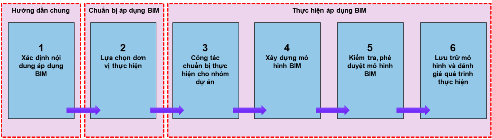

Hình 1.1 thể hiện các bước triển khai điển hình của việc tạo lập mô hình thông tin công trình (BIM) trong dự án đầu tư xây dựng, cụ thể như sau:

## 1. Xác định nội dung áp dụng BIM:

Chủ đầu tư căn cứ vào chiến lược phát triển của ngành, địa phương hoặc của tổ chức; các mục tiêu cần đạt được của dự án và khả năng đáp ứng của công nghệ BIM để lựa chọn nội dung áp dụng BIM trong dự án.

## 2. Lựa chọn đơn vị thực hiện:

Chủ đầu tư chuẩn bị Yêu cầu về thông tin trao đổi (EIR) (lồng ghép trong hồ sơ mời thầu/ hồ sơ yêu cầu), trong đó xác định rõ các yêu cầu về sản phẩm, tiến độ bàn giao. Đơn vị cung cấp dịch vụ (có thể là nhà thầu tư vấn, thi công) căn cứ vào Yêu cầu về thông tin trao đổi để xây dựng Kế hoạch thực hiện BIM sơ bộ (pre-BEP) (lồng ghép trong Hồ sơ dự thầu/hồ sơ đề xuất) trình Chủ đầu tư xem xét.

Trường hợp cần thiết Chủ đầu tư có thể yêu cầu Đơn vị cung cấp dịch vụ gửi một số mô hình mẫu mà đơn vị đã thực hiện để Chủ đầu tư xem xét và đánh giá thêm.

Trên cơ sở đánh giá các giải pháp đề xuất, năng lực của từng đơn vị cấp dịch vụ, Chủ đầu tư sẽ lựa chọn đơn vị thực hiện BIM cho dự án, tiến hành thương thảo, ký kết hợp đồng và hoàn thiện Kế hoạch thực hiện BIM (BEP).

## 3. Công tác chuẩn bị thực hiện cho Nhóm dự án:

(Nhóm dự án được hiểu là nhóm các cá nhân (bao gồm của chủ đầu tư/ban quản lý dự án, của tư vấn, nhà thầu, và các đơn vị khác có liên quan) sẽ phối hợp chính để thực hiện áp dụng BIM trong dự án)

Sau khi đã thống nhất Kế hoạch thực hiện BIM (BEP), Chủ đầu tư, Đơn vị thực hiện BIM và các bên liên quan tổ chức thiết lập các điều kiện cần thiết cho việc triển khai xây dựng và quản lý mô hình BIM. Các công việc chính bao gồm:

- -Thiết lập môi trường làm việc chung (bao gồm xây dựng môi trường dữ liệu chung (CDE), các quy định của việc phối hợp,…);
- -Tổ chức đào tạo, phổ biến các quy định cho việc phối hợp giữa các bên tham gia;
- -Thiết lập và thống nhất các biểu mẫu (bản vẽ, công văn, tài liệu,…), các tiêu chuẩn hướng dẫn áp dụng trong dự án.
4. Xây dựng / Phát triển và ứng dụng mô hình BIM:

Đơn vị thực hiện được lựa chọn sử dụng các công cụ, hướng dẫn, tiêu chuẩn đã thống nhất trong BEP để xây dựng mô hình BIM đáp ứng yêu cầu của dự án.

## 5. Kiểm tra, nghiệm thu mô hình BIM:

Đơn vị thực hiện chuyển giao mô hình BIM hoặc từng phần của Mô hình cho Chủ đầu tư để xem xét và chấp thuận đưa vào sử dụng theo các mốc thời gian đã quy định trong Kế hoạch thực hiện BIM (BEP).

6. Lưu trữ mô hình và đánh giá quá trình thực hiện:

Khi hoàn thành xây dựng mô hình BIM đáp ứng các yêu cầu theo quy định trong BEP, Chủ đầu tư tổ chức lưu trữ mô hình để sử dụng cho mục đích cụ thể và hỗ trợ các công việc ở giai đoạn sau. Chủ đầu tư phối hợp với các đơn vị liên quan tổ chức đánh giá quá trình thực hiện áp dụng BIM để rút ra bài học khi triển khai các dự án tiếp theo.

## 1.3. Các chủ thể tham gia quá trình áp dụng BIM trong dự án

## 1.3.1. Chủ đầu tư và các đơn vị trực tiếp liên quan trong quá trình áp dụng BIM

Hình 1.1 thể hiện sơ đồ tổ chức điển hình mối liên hệ trong việc áp dụng BIM cho một dự án: Chủ đầu tư, Đơn vị thực hiện (Tư vấn, nhà thầu), Bộ phận thực hiện BIM của Đơn vị thực hiện (bao gồm cả thầu phụ của Đơn vị thực hiện).

Hình 1.2 Sơ đồ tổ chức phối hợp, trao đổi thông tin điển hình cho việc áp dụng BIM trong dự án

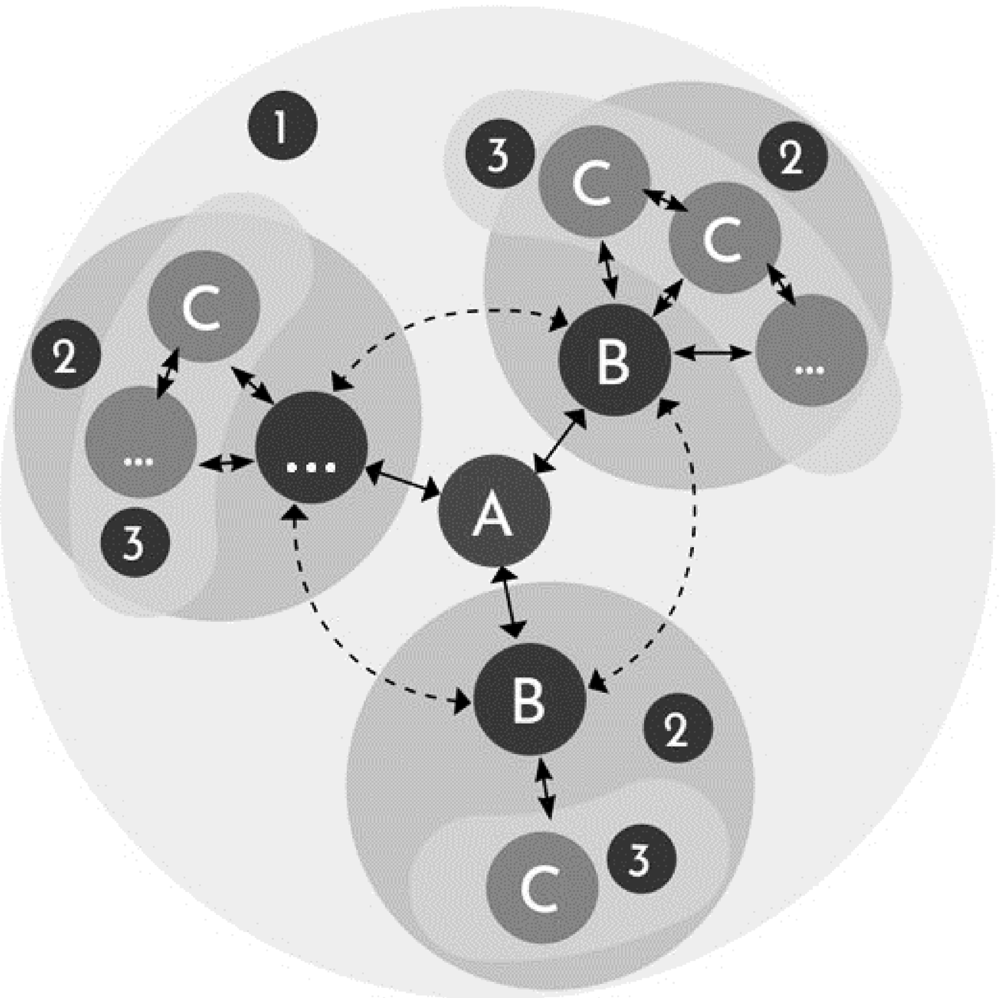

## Chú thích

- A Chủ đầu tư (hoặc đơn vị được chủ đầu tư ủy quyền quản lý)
- B Đơn vị thực hiện (nhà thầu tư vấn/ thi công)
- C Bộ phận thực hiện BIM (bao gồm thầu phụ của Đơn vị thực hiện)
- 1 Nhóm dự án
- 2 Nhóm thực hiện chính (bao gồm Đơn vị thực hiện và Bộ phận thực hiện BIM)
- 3 Nhóm thực hiện BIM
- Các yêu cầu thông tin và trao đổi thông tin
- Phối hợp trao đổi thông tin

## Ví dụ:

Sơ đồ tổ chức phối hợp, trao đổi thông tin tại một dự án:

Hình 1.3. Ví dụ sơ đồ tổ chức phối hợp, trao đổi thông tin tại một dự án

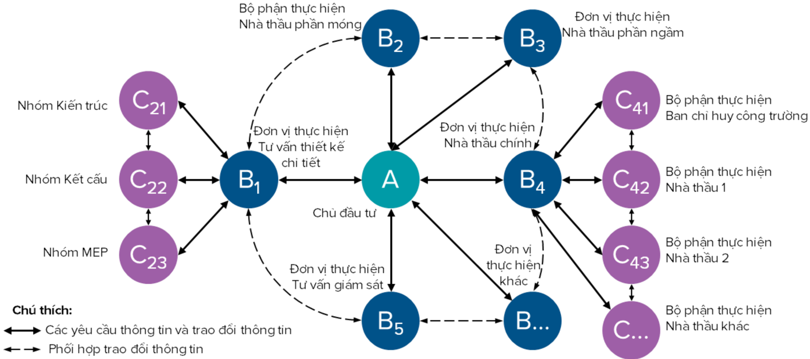

## a. Chủ đầu tư

Các nhiệm vụ chính của Chủ đầu tư trong quá trình thực hiện áp dụng BIM trong dự án:

- -Chủ đầu tư thành lập bộ phận hoặc cử cán bộ phụ trách việc áp dụng BIM cho dự án. Chủ đầu tư có thể giao nhiệm vụ này cho Ban quản lý dự án thực hiện. Cán bộ phụ trách có thể kiêm nhiệm các chức danh khác trong dự án.
- -Các hoạt động chuẩn bị lựa chọn Đơn vị thực hiện BIM: Chuẩn bị các thông tin để xây dựng Yêu cầu về thông tin trao đổi (EIR):
+ Xác định mục tiêu và nội dung áp dụng BIM cho dự án;
+ Làm rõ các yêu cầu thông tin của dự án, các mốc chuyển giao thông tin;
+ Xác định các yêu cầu cụ thể liên quan đến tạo lập, chuyển giao, quản lý mô hình (nếu có);
+ Chuẩn bị và đánh giá các số liệu, tài liệu, nguồn lực hiện có phục vụ cho việc áp dụng BIM.
- -Xây dựng hồ sơ mời thầu/hồ sơ yêu cầu, bao gồm cả các tiêu chí đánh giá, nội dung hợp đồng có liên quan đến các nội dung BIM; tổ chức đánh giá, lựa chọn Đơn vị thực hiện. Các nội dung này trong trường hợp cần thiết Chủ đầu tư có thể thuê đơn vị tư vấn có năng lực kinh nghiệm giúp trong quá trình thực hiện.
- -Chấp thuận Kế hoạch thực hiện BIM (BEP) do Đơn vị thực hiện trình.
- -Trong quá trình thực hiện BIM, Chủ đầu tư xem xét và nghiệm thu sản phẩm do Đơn vị thực hiện bàn giao theo các mốc thời gian đã thống nhất trong BEP. Xem xét điều chỉnh Kế hoạch thực hiện BIM cho phù hợp với yêu cầu, tiến độ của dự án. Trong trường hợp cần thiết, Chủ đầu tư có thể thuê đơn vị tư vấn có chuyên môn tham gia đánh giá chất lượng sản phẩm trước khi nghiệm thu.
- -Kết thúc quá trình áp dụng BIM, Chủ đầu tư chủ trì phối hợp với các đơn vị có liên quan tổ chức lưu trữ mô hình và đánh giá quá trình áp dụng BIM, các nội dung cơ bản bao gồm:

+ Sự hợp lý, đáp ứng yêu cầu của các nội dung áp dụng;
+ Các lợi ích mang lại từ việc áp dụng BIM cho dự án.

Mức độ tham gia của Chủ đầu tư đối với các công việc chính trong quá trình thực hiện áp dụng BIM thể hiện tại Bảng 1.1

Bảng 1.1. Mức độ tham gia của Chủ đầu tư

|   STT | Các nhiệm vụ chính                                   | Mức độ                                                    |
|-------|------------------------------------------------------|-----------------------------------------------------------|
|     1 | Đánh giá sự cần thiết, lựa chọn nội dung áp dụng BIM | Cao (chủ trì)                                             |
|     2 | Mời thầu                                             | Cao (chủ trì)                                             |
|     3 | Dự thầu                                              | Thấp (phối hợp làm rõ thông tin)                          |
|     4 | Đánh giá HSDT/HSĐX                                   | Cao (tổ chức đánh giá, phê duyệt)                         |
|     5 | Công tác chuẩn bị thực hiện cho Nhóm dự án           | Thấp (tham gia phối hợp)                                  |
|     6 | Tạo lập, ứng dụng mô hình                            | Thấp (theo dõi, cập nhật, điều chỉnh kế hoạch (nếu có))   |
|     7 | Kiểm tra và nghiệm thu mô hình                       | Cao (Chủ trì phối hợp với các đơn vị liên quan thực hiện) |
|     8 | Lưu trữ và đánh giá kết quả                          | Cao (Chủ trì phối hợp với các đơn vị liên quan thực hiện) |

## b. Đơn vị thực hiện

Đơn vị thực hiện chịu trách nhiệm điều phối thông tin và sự phối hợp giữa nhóm thực hiện chính với Chủ đầu tư và các đơn vị khác có liên quan.

Một số nhiệm vụ chính của Đơn vị thực hiện, bao gồm:

- -Xây dựng Kế hoạch thực hiện BIM (BEP) trình Chủ đầu tư xem xét chấp thuận;
- -Thực hiện với vai trò điều phối và quản lý tạo lập mô hình BIM;
- -Thiết lập kế hoạch, chuẩn bị nguồn lực, phân giao nhiệm vụ quyền hạn giữa các bộ phận thực hiện BIM;
- -Xác định các rủi ro có thể xảy ra trong quá trình áp dụng BIM.

Đơn vị thực hiện chủ động trong việc quản lý quá trình thực hiện BIM của Nhóm thực hiện chính.

Mức độ tham gia của Đơn vị thực hiện đối với các công việc chính thể hiện tại Bảng 1.2

Bảng 1.2 Mức độ tham gia của Đơn vị thực hiện

|   STT | Các nhiệm vụ chính                                   | Mức độ   |
|-------|------------------------------------------------------|----------|
|     1 | Đánh giá sự cần thiết, lựa chọn nội dung áp dụng BIM |          |

|   2 | Mời thầu                             |                                                                              |
|-----|--------------------------------------|------------------------------------------------------------------------------|
|   3 | Dự thầu                              | Cao (Chủ trì soạn thảo HSDT/ HSĐX)                                           |
|   4 | Đánh giá HSDT/HSĐX                   | Thấp (Phối hợp làm rõ các thông tin cần thiết)                               |
|   5 | Công tác chuẩn bị thực hiện cho nhóm | Cao (chủ trì thiết lập các nội dung cần thiết để nhóm triển khai)            |
|   6 | Tạo lập mô hình, ứng                 | Cao (Chủ trì điều phối, đảm bảo chất lượng mô hình)                          |
|   7 | Kiểm tra và nghiệm thu mô hình       | Trung bình (Tham gia phối hợp trong quá trình Chủ đầu tư kiểm tra phê duyệt) |
|   8 | Lưu trữ và đánh giá kết quả          | Trung bình (Phối hợp với chủ đầu tư đánh giá kết quả)                        |

## c. Bộ phận thực hiện BIM

Bộ phận thực hiện BIM chịu sự quản lý và hướng dẫn của Đơn vị thực hiện. Nhiệm vụ chủ yếu của Bộ phận thực hiện BIM là phối hợp với Đơn vị thực hiện hoàn thiện Kế hoạch thực hiện BIM (BEP); trực tiếp tạo lập mô hình; đề xuất các bổ sung hoặc sửa đổi cần thiết đối với tiêu chuẩn thông tin, phương pháp, thủ tục tạo lập mô hình BIM của dự án.

Năng lực của Bộ phận thực hiện BIM được đánh giá dựa trên 3 khía cạnh:

- -Năng lực quản lý thông tin (Kinh nghiệm, nhân lực)
- -Năng lực tạo lập mô hình BIM (Kinh nghiệm xây dựng các phương pháp, quy trình tạo lập mô hình; số lượng, trình độ nhân lực thực hiện công việc tạo lập mô hình)
- -Hệ thống phần cứng, phần mềm và các công cụ hỗ trợ thích hợp.

Bộ phận thực hiện BIM tạo lập Mô hình BIM theo tiêu chuẩn, phương pháp, quy trình sản xuất thông tin và tài nguyên được chia sẻ theo yêu cầu trong Kế hoạch thực hiện BIM (BEP).

Bộ phận thực hiện BIM kiểm tra các khu vực chứa thông tin trên CDE để đảm bảo các thông tin, dữ liệu phù hợp với các phương pháp và quy trình sẽ sử dụng để tạo lập thông tin mô hình. Kiểm tra nội dung của khu vực chứa thông tin trên CDE để đảm bảo đáp ứng các yêu cầu thông tin và phù hợp với phạm vi công việc, mức độ phát triển thông tin.

Trong quá trình tạo lập mô hình, việc kiểm tra chất lượng được lặp đi lặp lại. Bộ phận thực hiện BIM phải thực hiện sửa đổi, cập nhật theo yêu cầu Đơn vị thực hiện. Khi sản phẩm đã sẵn sàng để chuyển giao, Bộ phận thực hiện BIM phải gửi cho Đơn vị thực hiện để xem xét trước khi trình Chủ đầu tư xem xét chấp thuận đưa vào sử dụng.

## 1.3.2. Vai trò và trách nhiệm của một số vị trí trong việc triển khai áp dụng BIM

## a. Quản lý BIM (BIM Manager)

Quản lý BIM chịu trách nhiệm xác định chiến lược và quản lý việc áp dụng BIM. Cụ thể:

- -Chỉ đạo việc xây dựng kế hoạch;
- -Quản lý nhóm chiến lược triển khai công việc;
- -Tìm hiểu những công nghệ mới để thực hiện BIM;
- -Xác nhận tiêu chuẩn BIM dự án cho đội ngũ thiết kế trong dự án;
- -Tổ chức xây dựng Kế hoạch thực hiện BIM cho dự án;
- -Xác nhận những nội dung thông tin chung cho nhóm thiết kế;
- -Phối hợp với người được giao quản lý CDE để đảm bảo những yêu cầu được thực hiện trong môi trường BIM cho giai đoạn quản lý vận hành;
- -Thiết lập quy trình trao đổi dữ liệu cho toàn dự án trong tất cả các giai đoạn;
- -Đảm bảo mô hình liên kết đa bộ môn đạt yêu cầu.

## b. Điều phối BIM (BIM Coodinator)

Điều phối BIM chịu trách nhiệm duy trì việc tạo lập thông tin và đảm bảo chất lượng:

- -Tham gia xây dựng và triển khai Kế hoạch thực hiện BIM cho dự án;
- -Cập nhật Kế hoạch thực hiện BIM cho dự án trong quá trình triển khai;
- -Chỉ đạo lập kế hoạch, thiết lập và duy trì các file dữ liệu;
- -Đảm bảo các bên có liên quan thống nhất về Kế hoạch thực hiện BIM cho dự án;
- -Xác định và tạo điều kiện cho việc triển khai đào tạo nhân sự phù hợp với chiến lược thực hiện dự án;
- -Đảm bảo phần cứng và phần mềm cần thiết cho việc triển khai;
- -Xây dựng Mô hình BIM liên kết đa bộ môn từ những mô hình BIM từng bộ môn, xuất báo cáo xung đột tại các mốc quan trọng xác định trong Kế hoạch thực hiện BIM cho dự án;
- -Đảm bảo các xung đột trong mô hình BIM từng bộ môn được giải quyết trước khi phối hợp đa bộ môn.

## c. Kỹ thuật viên BIM (BIM Modeler)

- -Chịu trách nhiệm tạo lập, cập nhật, chỉnh sửa mô hình;
- -Trích xuất thông tin, triển khai bản vẽ từ mô hình.

## 1.4. Lựa chọn nội dung áp dụng BIM

## 1.4.1.

## Nguyên tắc chung

Việc lựa chọn Nội dung áp dụng BIM được thực như sau:

- -Bước 1: Xác định mục tiêu áp dụng BIM cho dự án và dự kiến Nội dung áp dụng BIM tiềm năng.
- -Bước 2: Lập bảng phân tích và lựa chọn Nội dung áp dụng BIM.

## 1.4.2. Xác định mục tiêu áp dụng BIM và dự kiến Nội dung áp dụng BIM tiềm năng

## 1.4.2.1. Mục tiêu chung

Việc xác định các mục tiêu áp dụng BIM tổng thể cũng như chi tiết rất quan trọng, quyết định đến việc áp dụng BIM thành công vào dự án. Các mục tiêu này được xây dựng dựa trên các lợi ích tiềm năng của việc áp dụng BIM đã được kiểm chứng (như rút ngắn tiến độ, cải thiện năng suất, nâng cao chất lượng, giảm chi phí hoặc là nơi lưu trữ dữ liệu thuận tiện phục vụ cho quá trình vận hành, bảo trì công trình,...). Các mục tiêu cũng có thể chỉ liên quan đến việc nâng cao năng lực của các thành viên trong dự án, ví dụ, chủ đầu tư sử dụng dự án làm dự án thí điểm để minh họa việc trao đổi thông tin giữa thiết kế, thi công và vận hành,...

## 1.4.2.2. Mục tiêu cụ thể

Mục tiêu áp dụng BIM cho dự án được xác định từ lợi ích của việc sử dụng mô hình BIM. Trong giai đoạn hiện nay, những lợi ích cơ bản của việc ứng dụng Mô hình thông tin công trình bao gồm:

- -Mô hình hóa để thể hiện trực quan, giúp các thành viên tham gia dự án hiểu rõ khi thảo luận, phân công các nhiệm vụ hoặc lựa chọn các giải pháp thiết kế/thi công hiệu quả; các bên liên quan hiểu rõ hơn về giải pháp thiết kế để ra các quyết định cho phù hợp;
- -Hiệu quả của việc chia sẻ thông tin bằng định dạng kỹ thuật số sẽ thuận lợi hơn trong việc phối hợp các hoạt động; tiết kiệm thời gian chuẩn bị tài liệu, trao đổi thông tin;
- -Phát hiện, kiểm soát các lỗi xung đột giữa các bộ môn thiết kế, giữa nội dung thiết kế dự kiến và công trình hiện hữu,… sẽ giảm việc thay đổi hoặc điều chỉnh, bổ sung thiết kế trong quá trình thực hiện;
- -Cải thiện chất lượng công tác lựa chọn nhà thầu, giảm rủi ro trong quá trình thực hiện do hồ sơ mời thầu có chất lượng tốt hơn;
- -Kiểm soát tốt khối lượng và tiến độ thi công từ việc kết nối mô hình với tiến độ thi công thực tế; kiểm soát chi phí từ khối lượng bóc tách trên mô hình;
- -Quản lý thông tin dữ liệu cần thiết cho quá trình vận hành và bảo trì công trình.

Khi xác định mục tiêu áp dụng BIM, Chủ đầu tư cũng nên đề xuất mức độ ưu tiên của các mục tiêu để định hướng lựa chọn nội dung áp dụng. Bảng 1.3 thể hiện ví dụ liên kết giữa Mục tiêu áp dụng BIM và các nội dung áp dụng BIM tiềm năng có thể được lựa chọn.

Bảng 1.3 Mẫu xác định Mục tiêu áp dụng BIM và nội dung áp dụng BIM tiềm năng

|   Mức độ ưu tiên | Mục tiêu áp dụng BIM                                                   | Nội dung áp dụng BIM tiềm năng                                                                     |
|------------------|------------------------------------------------------------------------|----------------------------------------------------------------------------------------------------|
|                1 | Tối ưu hoá thiết kế                                                    | - Thiết kế dựa trên nền tảng BIM - Đánh giá thiết kế - Mô phỏng, quản lý tiến độ thi công (BIM 4D) |
|                1 | Tăng cường hợp tác giữa các bên tham gia dự án                         | - Phối hợp 3D                                                                                      |
|                1 | Giảm chi phí thực hiện dự án                                           | - Đánh giá thiết kế - Dự toán chi phí (BIM 5D) - Phối hợp 3D                                       |
|                1 | Đánh giá việc sử dụng đất trong quy hoạch xây dựng                     | - Lập mô hình hiện trạng                                                                           |
|                2 | Quản lý tiến độ thi công                                               | - Mô phỏng, quản lý tiến độ thi công (BIM 4D)                                                      |
|                2 | Quản lý hồ sơ, tài liệu, thông tin trong quá trình vận hành công trình | - Quản lý tài sản - Mô hình hoàn công                                                              |
|                3 | Tối ưu hoá năng lượng của công trình                                   | - Phân tích năng lượng                                                                             |

Một số thông tin chi tiết về nội dung áp dụng BIM được trình bày tại Phụ lục 01: Nội dung áp dụng BIM.

## 1.4.3. Phân tích và lựa chọn nội dung áp dụng BIM

Mục tiêu của việc phân tích nội dung áp dụng BIM là để xem xét giữa giá trị có thể mang lại cho dự án và các yêu cầu cần thiết đối với các đơn vị tham gia để thực hiện được các nội dung áp dụng BIM này.

Bảng 1.4 thể hiện ví dụ phân tích nội dung áp dụng BIM. Ví dụ này bao gồm danh sách nội dung áp dụng BIM tiềm năng (đã được xác định tại Bước 1), cùng với các yêu cầu kinh nghiệm và năng lực cần thiết của các bên dự kiến tham gia trong dự án. Việc so sánh giữa giá trị mang lại và yêu cầu kinh nghiệm, năng lực để quyết định có thực hiện nội dung áp dụng BIM đó không.

Bảng 1.4 Mẫu bảng phân tích nội dung áp dụng BIM

| Nội dung áp dụng BIM                        |   Lợi ích cho dự án | Bên tham gia thực hiện                                              | Yêu cầu về năng lực, kinh nghiệm, chi phí   | Ghi chú   |
|---------------------------------------------|---------------------|---------------------------------------------------------------------|---------------------------------------------|-----------|
| Lập mô hình hiện trạng                      |                   2 | Đơn vị khảo sát, đơn vị tư vấn thiết kế                             | …                                           |           |
| Thiết kế dựa trên nền tảng BIM              |                   1 | Các đơn vị tư vấn thiết kế, nhà thầu thi công                       | …                                           |           |
| Đánh giá thiết kế                           |                   1 | Đơn vị tư vấn thiết kế                                              | …                                           |           |
| Phối hợp 3D                                 |                   1 | Các đơn vị tư vấn thiết kế                                          | …                                           |           |
| Mô phỏng, quản lý tiến độ thi công (BIM 4D) |                   2 | Các đơn vị tư vấn thiết kế, đơn vị quản lý dự án, nhà thầu thi công | …                                           |           |
| Dự toán chi phí (BIM 5D)                    |                   3 | Các đơn vị tư vấn thiết kế                                          | …                                           |           |
| Phân tích năng lượng                        |                   3 | Các đơn vị tư vấn thiết kế                                          |                                             |           |
| Mô hình hoàn công                           |                   3 | Nhà thầu thi công hoặc đơn vị thứ 3                                 |                                             |           |
| Quản lý tài sản                             |                   3 | Nhà thầu thi công, chủ đầu tư hoặc đơn vị thứ 3                     |                                             |           |

* Ghi chú : 1 tương ứng với cao, 2 tương ứng với trung bình, 3 tương ứng với thấp

Đánh giá yêu cầu về năng lực, kinh nghiệm thực hiện cho mỗi nội dung áp dụng BIM được xác định theo các tiêu chí sau:

- -Năng lực: Nhân lực, trang thiết bị, phần mềm. Để xác định yêu cầu về năng lực cần hiểu rõ cách thức cụ thể để thực hiện nội dung áp dụng BIM được lựa chọn.
- -Kinh nghiệm: Yêu cầu về kinh nghiệm của bên chịu trách nhiệm thực hiện (thường được thể hiện qua các công việc tương tự đã thực hiện trong những năm gần nhất).

Trong quá trình phân tích nội dung áp dụng BIM cần đánh giá chi tiết về từng nội dung áp dụng để xác định nội dung đó có phù hợp với dự án hay không; xác định lợi ích tiềm năng và so sánh lợi ích tiềm năng này với chi phí thực hiện, các rủi ro có thể xảy ra khi sử dụng hoặc không áp dụng nội dung áp dụng BIM đó.

Khi tất cả các yếu tố trên được xem xét tổng thể, chủ đấu tư sẽ đưa ra quyết định các nội dung áp dụng BIM nào sẽ được sử dụng trong dự án.

## CHUẨN BỊ ÁP DỤNG BIM

## 2.1. Tiến trình chuẩn bị áp dụng BIM

Quá trình chuẩn bị cho việc áp dụng BIM trong dự án thực hiện theo các bước nêu tại Hình 2.1.

Hình 2.1 Các bước trong tiến trình chuẩn bị áp dụng BIM

| Trách nhim                                  | Công vic                                                                       | Din gii   |
|---------------------------------------------|--------------------------------------------------------------------------------|-----------|
| Ch đu tư                                    | Lp HSMT/HSYC (bao gôm Yêu cãu v thông tin (EIR) và các ni dung chính khác)     | 2.2       |
| Đơn v thc hin (nhà thu)                     | 4 Lp HSDT/HSDX (bao gồm K hoch thc hin BIM so b (Pre-BEP), các thông tin khác) | *         |
| Chú đu tư                                   | 4 Đánh giá HSDT/HSDX (bao gồm đánh giá K hoch thc hin BIM so b (Pre-BEP))      | *         |
| Chů đu tư, Đơn v thc hin                    | Đàm phán, ký kt hp đng                                                         | *         |
| Đơn v thc hin, Chú đu tư, các bên liên quan | 4 Xây dng K hoch thc hin BIM (BEP)                                             | 2.3       |
| Ch đu tư                                    | Yêu cu Xem xét, đánh giá BEP chinh sa                                          | *         |
|                                             | Trin khai các công vic thc hin                                                 |           |

* Ghi chú: Cách thức tiến hành theo quy định chung của pháp luật hiện hành.

## 2.2. Hồ sơ mời thầu/ hồ sơ yêu cầu

## 2.2.1. Hồ sơ mời thầu dịch vụ tư vấn, gói thầu xây lắp có áp dụng BIM

## 2.2.1.1. Gói thầu dịch vụ tư vấn

Trong quá trình biên soạn Hồ sơ mời thầu, Hồ sơ yêu cầu dịch vụ tư vấn (theo Thông tư 01/2015/TT-BKHĐT) hoặc Hồ sơ mời thầu dịch vụ tư vấn qua mạng (Mẫu số 06 của Thông tư 04/2017/TT-BKHĐT), Chủ đầu tư dự án áp dụng BIM cần chú ý các biểu mẫu sau:

- -Mẫu số 4: Cơ cấu tổ chức và kinh nghiệm của Nhà thầu tư vấn (bổ sung Mẫu số 4a: Năng lực BIM);
- -Mẫu số 6: Giải pháp và phương pháp luận tổng quát do Nhà thầu đề xuất để thực hiện dịch vụ tư vấn (bổ sung thêm Mẫu số 6a: Kế hoạch thực hiện BIM sơ bộ);
- -Mẫu số 7: Danh sách chuyên gia tham gia thực hiện dịch vụ tư vấn;
- -Mẫu số 9: Tiến độ thực hiện công việc (Bổ sung thêm mẫu số 9a: Bảng phân công trách nhiệm).

Bổ sung Yêu cầu về thông tin trao đổi (EIR) vào Phần IV: Điều khoản tham chiếu của mẫu hồ sơ mời thầu.

Nội dung các biểu mẫu bổ sung tham khảo tại biểu mẫu kèm theo tại Phụ lục 02: Một số nội dung bổ sung trong HSMT/ HSYC.

## 2.2.1.2. Gói thầu xây lắp

Trong  quá  trình  biên  soạn  Hồ  sơ  mời  thầu  xây  lắp  (theo  Thông  tư  03/2015/TTBKHĐT) hoặc Hồ sơ mời thầu xây lắp qua mạng một giai đoạn hai túi hồ sơ (Mẫu số 04 của Thông tư 04/2017/TT-BKHĐT), Chủ đầu tư dự án áp dụng BIM cần chú ý các biểu mẫu sau:

- -Yêu cầu nhân sự chủ chốt (mục 2.2.a chương III Thông tư 03/2015/TT-BKHĐT, mẫu số 04A-Webform trong Mẫu số 04 của Thông tư 04/2017/TT-BKHĐT);
- -Bảng đề xuất nhân sự chủ chốt (mẫu số 15 Thông tư 03/2015/TT-BKHĐT, mẫu số 11A- Webform trong Mẫu số 04 của Thông tư 04/2017/TT-BKHĐT ).

## 2.2.2. Tiêu chuẩn đánh giá nội dung về BIM trong HSDT/HSĐX

Việc lựa chọn nhà thầu có năng lực áp dụng BIM thực hiện theo quy định chung về lựa chọn nhà thầu trong hoạt động xây dựng.

Kinh nghiệm và năng lực thực hiện của nhà thầu: Chủ đầu tư đưa ra các yêu cầu kinh nghiệm và năng lực thực hiện để nhà thầu phản hồi về khả năng đáp ứng.

- -Yêu cầu về kinh nghiệm: Số lượng dự án hoặc công việc tương tự đã thực hiện.
- -Yêu cầu về năng lực:
+ Các nhà thầu đã có kinh nghiệm, kiến thức và kỹ năng sử dụng các công cụ phần mềm vẫn phải đáp ứng việc triển khai BIM theo quy trình đã thống nhất nhằm đạt được các mục tiêu.
+ Chủ đầu tư đưa ra yêu cầu về nhân sự cho các công việc thực hiện.
+ Trang thiết bị, phần mềm, hạ tầng công nghệ thông tin: Các bên tham gia phải sử dụng máy tính có cấu hình và phần mềm phù hợp với công việc xây dựng và sử dụng mô hình BIM. Chủ đầu tư đưa ra yêu cầu về nguyên tắc liên quan đến trang thiết bị, phần mềm, hạ tầng công nghệ thông tin.

- -Kế hoạch thực hiện BIM sơ bộ (Pre-BEP): Các nhà thầu thể hiện hiểu biết về quy trình BIM và khả năng đáp ứng các nội dung áp dụng BIM.

Bảng 2.1 Bảng đánh giá năng lực nhà thầu (liên quan đến nội dung BIM)

| STT   | Tiêu chuẩn                                                                                                                                                                                                                                                                | Điểm tối đa   | Điểm tối thiểu 1   | Điểm đánh giá   |
|-------|---------------------------------------------------------------------------------------------------------------------------------------------------------------------------------------------------------------------------------------------------------------------------|---------------|--------------------|-----------------|
| 1     | Kinh nghiệm và năng lực của nhà thầu                                                                                                                                                                                                                                      |               |                    |                 |
| 1.1   | Kinh nghiệm thực hiện Hợp đồng tương tự trong thời gian gần đây (khoảng 3 năm đến 5 năm gần đây) Số lượng hợp đồng tư vấn có liên quan đến BIM                                                                                                                            |               |                    |                 |
| 1.2   | Năng lực công nghệ                                                                                                                                                                                                                                                        |               |                    |                 |
| 1.2.1 | Khả năng đáp ứng về phần mềm                                                                                                                                                                                                                                              |               |                    |                 |
| 1.2.2 | Khả năng đáp ứng về máy móc, thiết bị                                                                                                                                                                                                                                     |               |                    |                 |
| 1.3   | Uy tín của nhà thầu thông qua việc thực hiện các hợp đồng tương tự trước đó Số lượng hợp đồng tư vấn có liên quan đến BIM thực hiện vượt tiến độ, đảm bảo chất lượng theo yêu cầu (có xác nhận của chủ đầu tư)                                                            |               |                    |                 |
| 2     | Giải pháp và phương pháp luận                                                                                                                                                                                                                                             |               |                    |                 |
| 2.1   | Am hiểu về mục tiêu, nhiệm vụ, nội dung và phương án xây dựng của dự án và gói thầu đã nêu trong điều khoản tham chiếu                                                                                                                                                    |               |                    |                 |
| 2.1.1 | Am hiểu về mục tiêu, nhiệm vụ, nội dung và phương án xây dựng của dự án đã nêu trong điều khoản tham chiếu                                                                                                                                                                |               |                    |                 |
| 2.1.2 | Hiểu rõ yêu cầu, nội dung, nhiệm vụ của tư vấn cần thực hiện trong phạm vi gói thầu                                                                                                                                                                                       |               |                    |                 |
| 2.1.3 | Đề xuất kỹ thuật phù hợp với mục tiêu, nhiệm vụ, nội dung và phương án xây dựng và các yêu cầu kỹ thuật khác.                                                                                                                                                             |               |                    |                 |
| 2.2   | Cách tiếp cận và phương pháp luận                                                                                                                                                                                                                                         |               |                    |                 |
| 2.2.1 | Đề xuất về kỹ thuật bao gồm tất cả hạng mục công việc quy định trong điều khoản tham chiếu. Các hạng mục công việc được phân chia thành những nhiệm vụ cụ thể một cách hoàn chỉnh và lôgic; đồng thời có phân công cho từng chuyên gia tư vấn đề xuất cho công trình, đặc |               |                    |                 |

| STT   | Tiêu chuẩn                                                                                                                                                                                             | Điểm tối đa   | Điểm tối thiểu 1   | Điểm đánh giá   |
|-------|--------------------------------------------------------------------------------------------------------------------------------------------------------------------------------------------------------|---------------|--------------------|-----------------|
|       | biệt đã thực hiện các công việc chính về BIM như tạo lập EIR, xây dựng môi trường dữ liệu chung...                                                                                                     |               |                    |                 |
| 2.2.2 | Phương pháp luận phù hợp với nhiệm vụ của gói thầu                                                                                                                                                     |               |                    |                 |
|       | Đề xuất trình bày rõ ràng làm thế nào để thực hiện tốt được tất cả các công việc của gói thầu (về tư vấn xây dựng mô hình thông tin công trình (BIM))                                                  |               |                    |                 |
| 2.3   | Sáng kiến cải tiến                                                                                                                                                                                     |               |                    |                 |
| 2.3.1 | Đề xuất các sáng kiến cải tiến để thực hiện tốt hơn các công việc nhằm nâng cao hiệu quả thiết kế công trình đạt chất lượng về kỹ thuật và mỹ thuật; phát huy tối đa mục tiêu, nhiệm vụ của công trình |               |                    |                 |
| 2.3.2 | Cách tiếp cận và phương pháp luận của nhà thầu chuyên nghiệp và tiên tiến                                                                                                                              |               |                    |                 |
| 2.4   | Cách trình bày đề xuất                                                                                                                                                                                 |               |                    |                 |
| 2.4.1 | Đề xuất được kết cấu và trình bày một cách hợp lý, khoa học và dễ theo dõi                                                                                                                             |               |                    |                 |
| 2.4.2 | Đề xuất hoàn chỉnh và có tính thuyết phục                                                                                                                                                              |               |                    |                 |
| 2.5   | Kế hoạch triển khai                                                                                                                                                                                    |               |                    |                 |
| 2.5.1 | Kế hoạch công việc bao gồm tất cả nhiệm vụ để thực hiện gói thầu. Mỗi một nhiệm vụ cụ thể phải được phân tích, mô tả một cách hoàn chỉnh, phù hợp và rõ ràng                                           |               |                    |                 |
| 2.5.2 | Kế hoạch triển khai phù hợp với phương pháp luận và tiến độ dự kiến                                                                                                                                    |               |                    |                 |
| 2.5.3 | Các bảng biểu mô tả kế hoạch thực hiện công việc và tiến độ nộp sản phẩm thực hiện (công tác tư vấn xây dựng mô hình thông tin công trình (BIM))                                                       |               |                    |                 |
| 2.5.4 | Thời điểm và thời gian huy động nhân sự phù hợp với kế hoạch triển khai.                                                                                                                               |               |                    |                 |
| 3     | Nhân sự                                                                                                                                                                                                |               |                    |                 |
| 3.1   | Chuyên gia thực hiện quản lý BIM                                                                                                                                                                       |               |                    |                 |
| 3.1.1 | Bằng cấp Có trình độ đại học trở lên thuộc lĩnh vực kỹ thuật, kinh tế kỹ thuật, công nghệ thông tin                                                                                                    |               |                    |                 |

| STT   | Tiêu chuẩn                                                                                                                   | Điểm tối đa   | Điểm tối thiểu 1   | Điểm đánh giá   |
|-------|------------------------------------------------------------------------------------------------------------------------------|---------------|--------------------|-----------------|
| 3.1.2 | Kinh nghiệm làm việc một trong các lĩnh vực: quản lý dự án, tư vấn thiết kế, tổ chức thi công 2 Tính theo số năm kinh nghiệm |               |                    |                 |
| 3.1.3 | Kinh nghiệm thực hiện công việc điều phối, quản lý BIM Tính theo số lượng, quy mô công trình                                 |               |                    |                 |
| 3.2   | Chuyên gia thực hiện điều phối BIM                                                                                           |               |                    |                 |
| 3.2.1 | Bằng cấp Có trình độ đại học trở lên thuộc lĩnh vực kỹ thuật, kinh tế kỹ thuật, công nghệ thông tin                          |               |                    |                 |
| 3.2.2 | Kinh nghiệm làm việc trong lĩnh vực tư vấn về quản lý dự án, tư vấn thiết kế, tổ chức thi công Tính theo số năm kinh nghiệm  |               |                    |                 |
| 3.2.3 | Kinh nghiệm tham gia công tác liên quan đến BIM Tính theo số lượng, quy mô công trình                                        |               |                    |                 |
| 3.2.4 | Kinh nghiệm làm ở vị trí thực hiện điều phối BIM Tính theo số lượng, quy mô công trình                                       |               |                    |                 |
| 3.3   | Chuyên gia thực hiện dựng hình BIM                                                                                           |               |                    |                 |
| 3.3.1 | Bằng cấp Có trình độ từ Trung cấp, cao đẳng trở lên thuộc lĩnh vực kỹ thuật, kinh tế kỹ thuật, công nghệ thông tin           |               |                    |                 |
| 3.3.2 | Chứng chỉ Có chứng chỉ sử dụng phần mềm dựng mô hình BIM do các tổ chức đào tạo chuyên môn cấp                               |               |                    |                 |
|       | Tổng cộng                                                                                                                    |               |                    |                 |

Các điều kiện trên là điều kiện khung, tuỳ theo đặc điểm dự án, chủ đầu tư có thể điều chỉnh, bổ sung các tiêu chí cho phù hợp.

## 2.2.3. Điều kiện hợp đồng

## 2.2.3.1. Bổ sung Điều kiện cụ thể của Hợp đồng

Trong trường hợp đấu thầu qua mạng, Chủ đầu tư dự án áp dụng BIM có thể tham khảo Phụ lục để bổ sung các Điều kiện cụ thể của Hợp đồng trong Mẫu HSMT dịch vụ tư vấn  qua  mạng  và  Mẫu  HSMT  xây  lắp  qua  mạng  -  (Mẫu  số  06  &  04  của  Thông  tư 04/2017/TT-BKHĐT).

2 : Tính theo thời gian bắt đầu ký hợp đồng làm việc cho tổ chức tư vấn quản lý dự án, tư vấn thiết kế

## 2.2.3.2. Phụ lục thông tin

Trong trường hợp hợp đồng dự án áp dụng theo mẫu khác, Chủ đầu tư dự án áp dụng BIM có thể tham khảo phụ lục bản dịch thông tin hỗ trợ ISO 19650-2 trong giai đoạn đầu tư xây dựng (Information Protocol to support BS EN ISO 19650-2 the delivery phase of assets)

## 2.2.4. Yêu cầu về thông tin trao đổi (EIR)

Yêu cầu về thông tin trao đổi (EIR) là các yêu cầu của Chủ đầu tư để tạo lập thông tin liên quan đến việc áp dụng BIM. EIR là một phần trong HSMT/HSYC.

Khuyến khích Chủ đầu tư xây dựng EIR tổng thể cho toàn dự án nếu có các gói thầu áp dụng BIM riêng lẻ. Chủ đầu tư tự tổ chức hoặc thuê đơn vị tư vấn có kinh nghiệm lập EIR.

Nội dung chủ yếu của EIR bao gồm:

- -Thông tin dự án (Thông tin chung, tiến độ dự án);
- -Mục tiêu áp dụng BIM;
- -Nội dung áp dụng BIM;
- -Phạm vi công việc và sản phẩm;
- -Các nội dung về quản lý (Phân công trách nhiệm, CDE, quy trình phối hợp,…);
- -Các nội dung về kỹ thuật (Nền tảng, phần mềm, quy ước về thông tin,…);
- -Đánh giá năng lực nhà thầu.

Nội dung chi tiết EIR tham khảo tại mẫu kèm theo tại Phụ lục 02: Một số nội dung bổ sung trong HSMT/ HSYC.

## 2.2.5. Kế hoạch thực hiện BIM sơ bộ (Pre-BEP)

Kế hoạch thực hiện BIM sơ bộ (Pre-BEP) được Đơn vị thực hiện biên soạn với các nội dung về phương pháp, kế hoạch đề xuất nhằm đáp ứng các yêu cầu trong Yêu cầu về thông tin trao đổi (EIR) trong giai đoạn lựa chọn nhà thầu. Kế hoạch thực hiện BIM sơ bộ (Pre-BEP) là một trong những cơ sở để Chủ đầu tư lựa chọn nhà thầu.

Nội dung trong Kế hoạch thực hiện BIM sơ bộ tham khảo tại Biểu mẫu 6a - Phụ lục 02: Một số nội dung bổ sung trong HSMT/ HSYC.

## 2.3. Xây dựng Kế hoạch thực hiện BIM (BEP)

Sau khi ký kết hợp đồng, Đơn vị thực hiện phối hợp với Chủ đầu tư và các bên liên quan hoàn thiện Kế hoạch thực hiện BIM (BEP). Kế hoạch thực hiện BIM (BEP) được cập nhật, hoàn thiện trên cơ sở Kế hoạch thực hiện BIM sơ bộ (Pre-BEP).

Kế hoạch thực hiện BIM (BEP) phải được Chủ đầu tư chấp thuận trước khi tổ chức triển khai. Trong quá trình thực hiện, các bên liên quan có thể đề xuất điều chỉnh Kế hoạch thực hiện BIM (BEP) cho phù hợp với tiến độ và mục tiêu áp dụng cho dự án nếu thấy cần thiết.

Tài liệu Kế hoạch thực hiện BIM (BEP) được thực hiện trên cơ sở thống nhất với Chủ đầu tư và các đơn vị có liên quan trong dự án, do đó để việc sử dụng tài liệu BEP có hiệu quả, các thành viên trong dự án cần tự kiểm soát các phiên bản tài liệu và nội dung để đảm bảo thông tin được cập nhật kịp thời và chính xác.

Nội dung trong Kế hoạch thực hiện BIM tham khảo tại Phụ lục 03: Kế hoạch thực hiện BIM.

Một số nội dung chính Đơn vị thực hiện cần phải rà soát để hoàn thiện Kế hoạch thực hiện BIM:

## a. Thiết lập bảng phân công trách nhiệm

Bảng phân công trách nhiệm quy định rõ trách nhiệm quản lý và tạo lập mô hình trong từng giai đoạn đã xác định.

Bảng phân công trách nhiệm cần được rà soát, cập nhật liên tục trong suốt quá trình thực hiện. Bảng phân công trách nhiệm ban đầu có thể chỉ đặt ra các vai trò và trách nhiệm chung. Sau khi ký kết hợp đồng, trong quá trình thực hiện, những thành viên tham gia khác như các chuyên gia và các nhân sự khác sẽ được thêm vào khi triển khai các nội dung cụ thể.

Đơn vị thực hiện hoàn thiện Bảng phân công trách nhiệm tổng thể làm cơ sở thiết lập Bảng phân công trách nhiệm chi tiết. Một số thông tin cần xác định:

- -Nội dung, sản phẩm nào sẽ được thực hiện;
- -Thông tin được trao đổi khi nào và với ai;
- -
- Trách nhiệm tạo lập thông tin của từng nhóm.

Khi thực hiện những điều này, Đơn vị thực hiện cần xem xét:

- -Các mốc chuyển giao thông tin;
- -Bảng phân công trách nhiệm tổng hợp;
- -Các phương pháp và thủ tục sản xuất thông tin;
- -Sự phụ thuộc giữ các cá nhân/bộ phận trong quá trình thực hiện.

Nội dung Bảng phân công trách nhiệm tham khảo tại Biểu mẫu 9a - Phụ lục 02:

## Bảng phân công trách nhiệm thực hiện BIM.

## b. Thiết lập kế hoạch chuyển giao thông tin nhiệm vụ (TIDP)

Kế hoạch chuyển giao thông tin nhiệm vụ (TIDP) là danh sách các sản phẩm cần chuyển giao được phân tách thành các nhiệm vụ riêng lẻ. Kế hoạch chuyển giao thông tin nhiệm vụ (TIDP) được các Bộ phận thực hiện BIM lập dựa theo điều kiện và năng lực của bộ phận đó.

TIDP cung cấp thông tin về trách nhiệm chuyển giao các sản phẩm để các thành viên thực hiện, đồng thời cung cấp thông tin về trình tự để hoàn thiện.

Thông tin trong bảng TIDP cần chứa các thông tin sau:

- -Tên và tiêu đề;
- -Mức độ phát triển thông tin yêu cầu;
- -Thời gian thực hiện (dự tính);
- -Nội dung công việc cần thực hiện;
- -Các cột mốc chuyển giao thông tin.

## c. Thiết lập kế hoạch chuyển giao thông tin tổng thể (MIDP)

Kế hoạch chuyển giao thông tin tổng thể (MIDP) là kế hoạch chính được sử dụng để quản lý việc chuyển giao thông tin trong suốt quá trình thực hiện.

MIDP được rà soát, cập nhật chi tiết sau khi ký kết hợp đồng, Đơn vị thực hiện tập hợp các Kế hoạch chuyển giao thông tin nhiệm vụ (TIDP) để hoàn thiện Kế hoạch chuyển giao thông tin tổng thể (MIDP).

Trong quá trình thực hiện dự án, dựa vào các yếu tố: tiến độ, năng lực đội ngũ, bảng MIDP có thể được sửa đổi. Bảng MIDP được lưu trữ trên Môi trường dữ liệu chung (CDE) để tất cả những người liên quan đến nhiệm vụ có thể biết và kiểm soát.

Về cơ bản MIDP là một tập hợp các Kế hoạch chuyển giao thông tin nhiệm vụ  (TIDP) và bao gồm các chi tiết về thời điểm chuẩn bị thông tin, Bộ phận chịu trách nhiệm sản xuất thông tin, cũng như các giao thức và quy trình cho từng giai đoạn. MIDP cần phải được đối chiếu, bố trí phù hợp với kế hoạch thiết kế/thi công xây dựng.

Hình 2.2 Minh hoạ Kế hoạch chuyển giao thông tin tổng thể (MIDP)

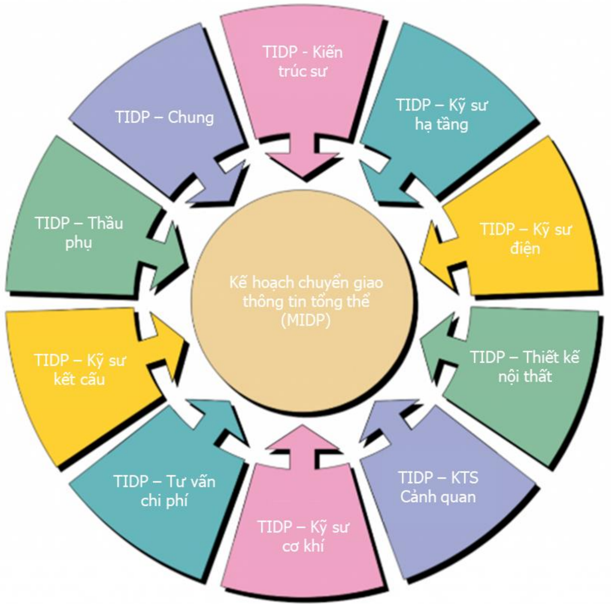

Sản phẩm chuyển giao có thể được đề cập trong MIDP bao gồm:

- -Mô hình;
- -Bản vẽ;
- -Báo cáo;
- -Thông số kỹ thuật;
- -Bảng thống kê thiết bị;
- -Bảng dữ liệu các cấu kiện, thành phần,…

Để tạo lập bảng MIDP chính xác, đầy đủ thông tin cần quan tâm các nội dung sau:

- -Xác định các giai đoạn, mốc thời gian của dự án;
- -Xác định LOD yêu cầu theo các giai đoạn dự án;
- -Xác định từng thành phần của dự án;
- -Các mô hình thông tin và bản vẽ, cần được phân chia theo các bộ môn và các hạng mục chi tiết theo thống nhất chung;
- -Sử dụng các mã trạng thái được thiết lập trong CDE để điền tên bản vẽ và kiểm soát trạng thái;
- -Đơn vị chịu trách nhiệm chuyển giao từng nội dung thông tin;
- -Thời hạn chuyển giao thông tin.

Nội dung trong Kế hoạch chuyển giao thông tin tổng thể (MIDP) tham khảo tại biểu mẫu kèm theo tại Phụ lục 03: Kế hoạch thực hiện BIM.

## THỰC HIỆN ÁP DỤNG BIM

## 3.1. Tiến trình thực hiện áp dụng

Các công việc chủ yếu của quá trình thực hiện áp dụng BIM thể hiện tại Hình 3.1

Hình 3.1 Các bước trong tiến trình thực hiện dự án

| Trách nhim              | Công vic                                                                                               |   Din gii |
|-------------------------|--------------------------------------------------------------------------------------------------------|-----------|
| Ch đu tư                | Thit lp Môi trưng d liu chung (CDE)                                                                    |       3.2 |
| Nhóm d án               | Công tác chun b thc hin cho nhóm d án                                                                  |       3.3 |
| Nhóm thc hin chính      | Tao lp mô hình thông tin công trình (BIM)                                                              |       3.4 |
| Chú đu tư               | Mô hình 4 chưa đt yêu câu Kim tra và phê duyt mô hình                                                  |       3.5 |
| Chú đu tư Đơn v thc hin | Lưu tr mô hình và đánh giá kêt quà                                                                     |       3.6 |
| Chú đu tư               | Mô hình đưc s dng 4 theo mc đích đã đt ra và làm thông tin Kt thúc giai đon tham khào cho giai đon sau |           |

## 3.2. Môi trường dữ liệu chung

## 3.2.1. Khái niệm chung về Môi trường dữ liệu chung

Môi trường dữ liệu chung (CDE) là nơi thu thập, lưu trữ, quản lý và phổ biến tất cả các thông tin, dữ liệu, tài liệu được tạo ra bởi các bên tham gia thực hiện BIM. CDE là sự kết hợp của các giải pháp kỹ thuật và quy trình làm việc.

CDE có thể rất khác nhau giữa các dự án (phụ thuộc quy mô và đặc điểm dự án). Một CDE đơn giản có thể chỉ là các ứng dụng nhỏ chia sẻ file miễn phí dựa trên nền web hoặc là các phần mềm thương mại.

CDE cho phép chia sẻ, phối hợp thông tin một cách kịp thời và chính xác giữa tất cả các thành viên tham gia tạo dựng, quản lý và sử dụng mô hình  BIM. Việc xây dựng và phát triển thông tin trong các giai đoạn thực hiện sẽ được tuần tự hóa có kiểm tra thông qua các 'cổng kiểm soát'. CDE nên được sử dụng trong suốt vòng đời của dự án.

## 3.2.2. Phân loại CDE

Phụ thuộc vào mục tiêu sử dụng, quản lý, có thể có nhiều loại CDE (Hình 3.2). Trong phạm vi tài liệu này sẽ hướng dẫn các nội dung liên quan đến việc tạo lập, quản lý CDE cho Dự án.

Hình 3.2 Phân loại CDE  3

## 3.2.2.1. CDE của dự án

Chủ đầu tư sẽ thiết lập hoặc giao Đơn vị thực hiện BIM thiết lập môi trường dữ liệu chung (CDE) của dự án để phục vụ cho các yêu cầu lưu trữ, phổ biến và hỗ trợ phối hợp, tạo lập mô hình BIM cũng như thông tin của dự án.

Đối với các dự án áp dụng BIM trong nhiều giai đoạn, Chủ đầu tư nên là người mua bản quyền và quản lý CDE để việc quản lý trao đổi thông tin giữa các giai đoạn được thống nhất.

## Môi trường dữ liệu chung của dự án cần đảm bảo:

- -Mỗi vùng chứa thông tin sẽ có một mã ID duy nhất, dựa trên một quy ước đã được thống nhất và ghi lại bao gồm các trường thông tin được phân cách với nhau bằng một kí tự phân cách;
- -Mỗi trường thông tin được gán một giá trị từ một tiêu chuẩn mã hóa đã được thống nhất và ghi lại;
- -Mỗi vùng chứa thông tin sẽ được gán các thuộc tính sau:

3  Asset Information Management - Common Data Environment: Functional Requirements, UK Government BIM Working Group - CDE Sub Group, 2018

+ Tình trạng (tính phù hợp);
+ Sửa đổi;
+ Phân loại.
- -Khả năng thay đổi trạng thái của các vùng chứa thông tin;
- -Ghi lại tên người sử dụng và thời gian khi thay đổi trạng thái việc sửa đổi vùng chứa thông tin;
- -Kiểm soát truy cập ở cấp độ vùng chứa thông tin.

Chủ đầu tư cũng có thể chỉ định một đơn vị thứ ba để lưu trữ, quản lý hoặc hỗ trợ cho CDE của dự án. Trong trường hợp này, nên được thực hiện như một gói thầu riêng biệt trước khi các đơn vị tham gia đấu thầu. Hoặc sau đó Chủ đầu tư cũng có thể chỉ định một Nhà thầu tiếp quản việc lưu trữ, quản lý hoặc hỗ trợ cho CDE của dự án.

## 3.2.2.2. CDE của Chủ đầu tư

Mục đích hệ thống CDE của Chủ đầu tư là cung cấp môi trường để thu thập và khai thác các thông tin BIM từ các dự án khác nhau của mình trong các giai đoạn của dự án (thiết kế, thi công và vận hành).

## 3.2.2.3. CDE của các đơn vị tham gia dự án

Mỗi đơn vị tham gia dự án chịu trách nhiệm cho phần thông tin mình phụ trách và nên có quy trình riêng để kiểm soát việc tạo dựng và phối hợp thông tin của riêng đơn vị. Các đơn vị cần thống nhất thời điểm, cách thức chuyển giao thông tin từ CDE của đơn vị sang CDE của dự án để thực hiện công tác phối hợp.

## 3.2.3. Các khu vực dữ liệu

Trong nội dung Hướng dẫn này chỉ đề cập đến các vấn đề liên quan đến CDE cho dự án.

Hình 3.3 Cấu trúc các khu vực thông dụng của CDE

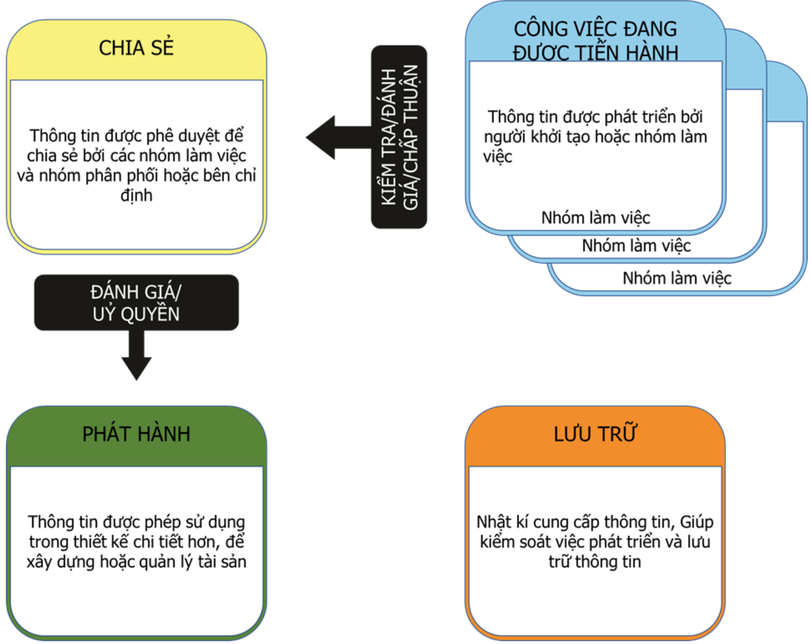

1. Khu vực 'CÔNG VIỆC ĐANG TIẾN HÀNH' (WORK IN PROGRESS, viết tắt WIP) của CDE là nơi mỗi nhóm hay cá nhân thực hiện công việc của mình, WIP được dùng để lưu trữ các thông tin chưa được chấp thuận chia sẻ cho các nhóm/cá nhân khác có liên quan. Trong một dự án có thể có nhiều khu vực WIP, thường mỗi 1 bên tham gia thực hiện có một khu vực WIP của riêng mình.
2. Khu vực 'CHIA SẺ' (SHARED) được dùng để lưu trữ thông tin đã được chấp thuận cho việc chia sẻ. Thông tin này được chia sẻ để các đơn vị khác sử dụng làm dữ liệu tham khảo cho việc phát triển nội dung có liên quan. Khi tất cả đã hoàn thành, thông tin (sản phẩm theo kế hoạch) phải được đặt ở trạng thái 'Chờ phát hành'.
3. Khu vực 'PHÁT HÀNH' (PUBLISHED DOCUMENTATION) được sử dụng để lưu trữ các thông tin được phát hành, là những thông tin đã được chấp thuận bởi chủ đầu tư.
4. Khu vực 'LƯU TRỮ' (ARCHIVE) ghi lại mọi tiến triển tại mỗi mốc thời điểm và phải lưu lại bản ghi của tất cả các trao đổi và thay đổi nhằm cung cấp các dấu vết lịch sử trao đổi để kiểm tra và đối chiếu trong trường hợp có tranh chấp…

## 3.2.4. Một số mã quy ước hỗ trợ quản lý thông tin

## 3.2.4.1. Mã kiểm soát phiên bản

Khi các vùng chứa thông tin được cập nhật, cần phải theo dõi các thay đổi giữa các phiên bản (phiên bản trước và hiện tại), theo dõi xem phiên bản nào được chia sẻ với ai.

Dưới  đây  là  minh  họa  việc  kiểm  soát  phiên  bản  (dựa  trên  tài  liệu  'Information management according to BS EN ISO 19650 - Guidance Part 2:  Processes for Project Delivery'). Hình 3.4 minh hoạ về cấu trúc mã theo dõi phiên bản của file dữ liệu.

Hình 3.4 Mã theo dõi phiên bản của file dữ liệu

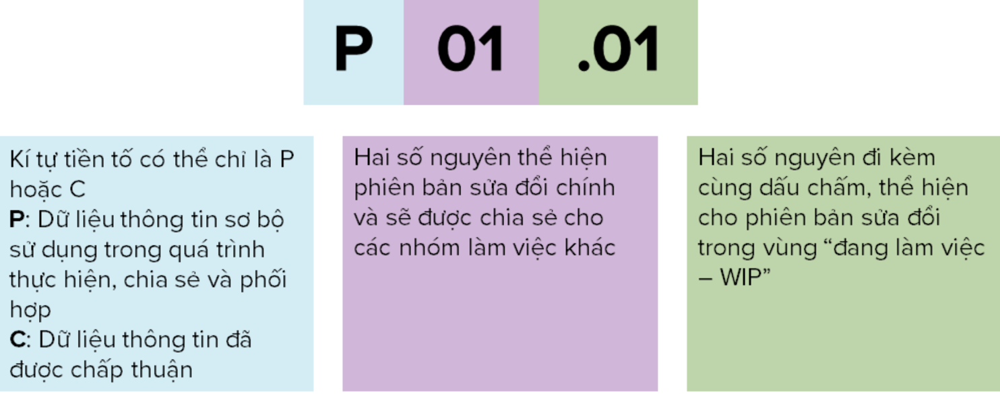

## a. Kiểm soát phiên bản trong quá trình làm việc (WIP)

Quản lý sửa đổi các vùng chứa thông tin WIP cho phép quản lý công việc và tránh mất thông tin trong quá trình thực hiện Hình 3.5 minh họa lợi ích của việc quản lý sửa đổi. Ví dụ trong hình cho thấy khi thực hiện các sửa đổi, thông tin đã được giám sát một cách kĩ lưỡng và có thể truy cập được các phiên bản cũ hơn trong trường hợp cần thiết.

Hình 3.5 Minh họa về lợi ích của việc quản lý thông tin sửa đổi trong WIP

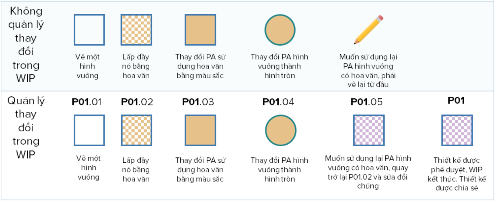

## b. Kiểm soát sửa đổi thông tin được chia sẻ (SHARE)

Trạng thái thay đổi thể hiện dưới dạng một số nguyên có hai chữ số (hiển thị trong vùng màu tím) tại Hình 3.4. Ngoài ra, thông tin đó còn thể hiện bản sửa đổi nào đang được chia sẻ ra ngoài Bộ phận thực hiện BIM. Hình 3.6 thể hiện quá trình chia sẻ thông tin từ WIP và được phát triển thêm 2 lần.

Hình 3.6 Ví dụ về chuyển đổi mã kiểm soát phiên bản từ WIP sang SHARE

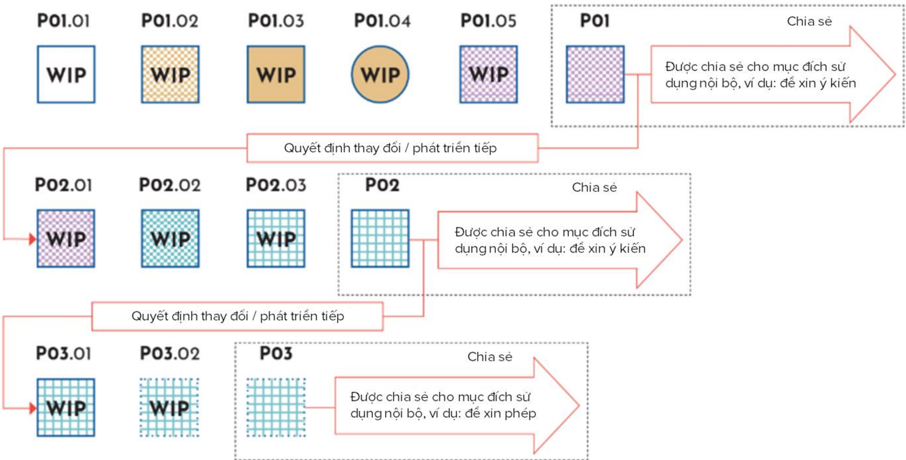

## c. Kiểm soát các vùng chứa thông tin được phát hành (Publish)

Một vùng chứa thông tin được nhận dạng là 'Phát hành' thông qua tiền tố C trong mã trạng thái. Điều này giúp một vùng chứa thông tin được phân biệt rõ là nội dung sơ bộ (P) hay Phát hành (C).

Hình 3.7 Ví dụ về chuyển đổi mã kiểm soát phiên bản đến giai đoạn phát hành

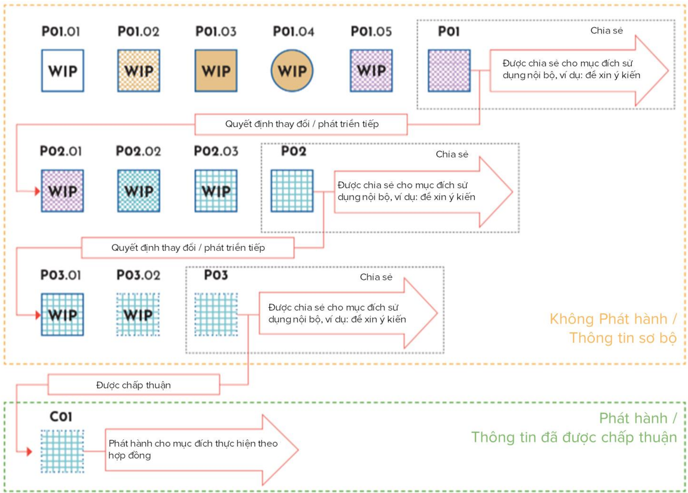

## 3.2.4.2. Mã trạng thái

Mã trạng thái trong CDE dùng để:

- -Nhận biết rõ vùng chứa thông tin nên được sử dụng và không nên sử dụng cho mục đích gì;
- -Làm rõ nơi chứa thông tin trong CDE.

Bảng 3.1 Mã trạng thái cho các vùng chứa thông tin trong một CDE là ví dụ về các mã trạng thái cho các vùng chứa thông tin trong một CDE. Mỗi mã có một mô tả tương ứng về cách thức sử dụng để thống nhất giữa các bên.

Các dự án có thể dựa vào Bảng 3.1 để điều chỉnh phù hợp với dự án.

Bảng 3.1 Mã trạng thái cho các vùng chứa thông tin trong một CDE 4

| Trạng thái                      | Mô tả                                                                                                                                                    | Hiệu chỉnh           | Dữ liệu hình học   | Dữ liệu phi hình học   | Tài liệu   |
|---------------------------------|----------------------------------------------------------------------------------------------------------------------------------------------------------|----------------------|--------------------|------------------------|------------|
| Công việc Đang Tiến hành        | Công việc Đang Tiến hành                                                                                                                                 |                      |                    |                        |            |
| S0                              | Vùng chia sẻ nội bộ trong bộ phận thực hiện BIM Thông tin, dữ liệu đang được phát triển và chưa phù hợp để chia sẻ ra bên ngoài nhóm thực hiện nhiệm vụ. | P01.01 đến P0 n .0 n | ✓                  | ✓                      | ✓          |
| Chia sẻ (Không chính thức)      | Chia sẻ (Không chính thức)                                                                                                                               |                      |                    |                        |            |
| S1                              | Dùng để phối hợp Các thông tin được gán trạng thái này chỉ nên được sử dụng để hiểu hoặc phục vụ công tác phối hợp.                                      | P01 đến P0 n         | ✓                  | ✗                      | ✗          |
| S2                              | Dùng để bổ sung thông tin dự án. Các thông tin này chỉ mang tính chất thủ tục cho dự án (biên bản cuộc họp…)                                             | P01 đến P0 n         | ✗                  | ✓                      | ✓          |
| S3                              | Phục vụ phát triển thông tin dự án: dữ liệu bản vẽ, thuyết minh, bảng kiểm…                                                                              | P01 đến P0 n         | Như yêu cầu        | ✓                      | ✓          |
| S4                              | Thông tin được sử dụng trong việc phê duyệt. Các bên tham gia phải chịu trách nhiệm pháp lý về nội dung trong phạm vi thông tin của mình.                | P01 đến P0 n         | ✗                  | ✗                      | ✓          |
| PHÁT HÀNH TÀI LIỆU (chính thức) | PHÁT HÀNH TÀI LIỆU (chính thức)                                                                                                                          |                      |                    |                        |            |
| A1, A n…                        | Hồ sơ đã được chấp thuận trong các giai đoạn.                                                                                                            | C01 đến C0 n         | ✓                  | ✓                      | ✓          |

| B1, B n…   | Hồ sơ đã được chấp thuận nhưng còn lưu ý một số vấn đề, tạm thời chưa được xử lý. P01.01 đến P0 n .0 n   | ✓   | ✓   | ✓   |
|------------|----------------------------------------------------------------------------------------------------------|-----|-----|-----|

Ghi chú:

✓ : có yêu cầu

✗ : không yêu cầu

Cấu trúc thư mục cần được quy định trong hồ sơ BEP, thống nhất sử dụng trong suốt giai đoạn dự án. Mỗi bên tham gia trong dự án có thể tổ chức khu vực WIP theo quy định riêng của mỗi tổ chức, tuy nhiên cần phải đảm bảo có phần dữ liệu ở trạng thái ban đầu trước khi chia sẻ cho các bên khác tham gia trong dự án tại các khu vực khác như SHARED, PUBLISH, ARCHIVED.

## 3.2.5. An toàn thông tin và bảo mật

Để bảo đảm an toàn thông tin và bảo mật, CDE nên có quản trị viên để quản lý. Nên có ít nhất hai quản trị viên có quyền truy cập quản trị đầy đủ vào dự án trên CDE. Quản trị viên nên là người được giao nhiệm vụ quản lý thông tin và một người khác (có thể là người thực hiện nhiệm vụ quản lý hồ sơ, tài liệu). Một số CDE có thể cung cấp quyền quản trị hạn chế cho một số người dùng được chỉ định (ví dụ: cấp quyền quản trị hạn chế cho các trưởng nhóm).

Quản trị viên CDE có các quyền sau:

- -Cấp và thu hồi quyền truy cập cho tài khoản người dùng vào CDE.
- -Tạo Nhóm phân phối và thêm / xóa tài khoản người dùng cho mỗi nhóm.
- -Tạo vai trò và thêm / xóa tài khoản người dùng cho từng vai trò.
- -Tạo vai trò và cấp quyền truy cập cho các vai trò cho các thư mục.
- -Tạo trạng thái tài liệu và cấp quyền truy cập cho từng trạng thái.

Quyền quản trị phải được cấu hình trong CDE. Ngoài tên người dùng và mật khẩu, một số chức năng quản lý người dùng sau đây cũng cần được lưu ý:

- -Quyền của người dùng (có thể tập hợp nhiều quyền khác nhau) như: chỉ xem, chỉ tải dữ liệu lên, xem + sửa, xem + sửa + tải dữ liệu lên,…
- -Người dùng chỉ được truy cập vào những khu vực phù hợp với  mục đích, vai trò công việc của mình trong CDE.

## 3.2.6. Một số đơn vị cung cấp giải pháp CDE thông dụng hiện nay

| Giải pháp   | Giải pháp   | Website                  |
|-------------|-------------|--------------------------|
|             | Aconex      | https://help.aconex.com/ |

| AEC Hub             | https://aechub.io/                                      |
|---------------------|---------------------------------------------------------|
| ALLPLAN             | https://www.allplan.com/en/                             |
| Autodesk            | https://www.autodesk.com/                               |
| Bentley ProjectWise | https://www.bentley.com/en/products/br ands/projectwise |
| Clearbox BIMXtra    | https://www.clearboxbim.com/products/ bimxtra           |
| Ecodomus            | https://ecodomus.com/                                   |
| BIM Cloud           | https://www.graphisoft.com/bimcloud/o verview/          |
| revizto             | https://revizto.com/en/                                 |
| Trimble             | https://www.trimble.com/                                |
| Viewpoint           | https://viewpoint.com/en- au/?redirected=y              |
| Groupbc             | https://www.groupbc.com/                                |
| Bimsync             | https://www.bimsync.com/                                |

| Google Drive   | https://www.drive.google.com/   |
|----------------|---------------------------------|
| Dropbox        | https://www.dropbox.com/        |
| OneDrive       | https://www.onedrive.live.com/  |

## 3.3. Công tác chuẩn bị thực hiện cho Nhóm dự án

Một số công tác cần thực hiện trước khi triển khai quá trình tạo lập Mô hình thông tin công trình:

- -Các nội dung liên quan đến xây dựng môi trường trao đổi dữ liệu chung cho dự án:
+ Thiết lập CDE;
+ Đào tạo các bên liên quan về CDE;
+ Chạy thử quy trình tải tài liệu lên CDE;
+ Chạy thử các quy trình kiểm tra tự động trên CDE (nếu có);
+ Chạy thử quy trình trao đổi tài liệu trên CDE;
+ Kiểm tra thông tin về siêu dữ liệu;
+ Kiểm tra các yêu cầu về quyền truy cập và các vấn đề liên quan đến bảo mật thông tin;
+ Kiểm tra quy trình xử lý và phê duyệt thông tin;
+ Các kiểm tra khác.
- -Kiểm tra sự sẵn sàng của hệ thống hạ tầng CNTT sử dụng cho dự án:
+ Sự đầy đủ, tương thích của các công cụ, phần mềm, phần cứng liên quan;
+ Hạ tầng mạng (internet, mạng nội bộ,…).
- -Tổ chức các cuộc họp để phổ biến, hướng dẫn một số nội dung hướng dẫn chung trong toàn dự án. Tập chung vào các nội dung sau:
+ Mục tiêu áp dụng BIM;
+ Tiêu chuẩn áp dụng;
+ Cách thức tạo lập mô hình;
+ Nền tảng CDE sẽ được sử dụng;
+ Yêu cầu về bảo mật thông tin;
+ Mốc chuyển giao thông tin;
+ Mức độ phát triển thông tin;

- -
- +
- Kế hoạch chuyển giao thông tin tổng thể;
+ Các nội dung liên quan đến kiểm tra, phê duyệt mô hình.
- -Tổng hợp các thông tin, tài liệu, số liệu sẽ được sử dụng chung cho dự án:
+ Tiêu chuẩn, phương pháp;
- +
- Chỉ dẫn kỹ thuật;
+ Mẫu (bản vẽ, khung tên, ghi chú…);
+ Thư viện (thư viện cấu kiện, vật liệu…);
- +
- Thông tin tham khảo khác.

## 3.4. Tạo lập mô hình thông tin công trình (BIM)

## 3.4.1.

## Yêu cầu chung trong việc mô hình hoá đối tượng

Trong quá trình tạo lập mô hình, cần đảm bảo các yêu cầu chung sau đây:

- -Các đối tượng được mô hình hoá bằng công cụ tương ứng hoặc thích hợp nhất trong phần mềm dựng hình;
- -Điểm gốc của đối tượng phải được thiết lập cho đối tượng BIM phù hợp để thuận lợi khi thay thế giữa các loại đối tượng với nhau;
- -Điểm gốc, hệ lưới trục, cao độ trong dự án cần được xác định để bảo đảm các mô hình thông tin được khớp nối chính xác;
- -Các đối tượng được dựng hình với tỉ lệ 1:1;
- -
- Các đối tượng sử dụng theo hệ thống đo lường quốc tế (SI);
- -Các đường đo kích thước phải được sử dụng bằng công cụ đo của phần mềm, các đường kích thước không được nằm chồng chéo lên nhau và đè lên đối tượng;
- -Các đối tượng 2D có thể được sử dụng thay cho các đối tượng không thể/không cần thiết mô hình hoá hoặc để bổ sung thông tin cho các đối tượng 3D;
- -Thông tin về vật liệu cần được gán cho đối tượng phù hợp với yêu cầu thông tin của từng giai đoạn;
- -
- Quy ước gán màu phải theo sự thống nhất của dự án;
- -Các bên thống nhất định dạng của bản vẽ: khung tên, thuộc tính, kích cỡ giấy và tỷ lệ bản vẽ, tên lớp (layer), kiểu chữ, kiểu đường nét, v.v. để đảm bảo tính đồng bộ khi trình bày;
- -Các bên thống nhất chung quy định về các chữ viết tắt, ký hiệu, định dạng văn
- bản,…
- Một số yêu cầu khác.

## 3.4.2. Định dạng trao đổi dữ liệu

Định dạng trao đổi dữ liệu trong quá trình tạo lập và chuyển giao mô hình BIM có thể ở định dạng gốc và định dạng mở.

Định dạng gốc là những định dạng chỉ có thể mở được bởi phần mềm tương ứng và phần mềm liên kết khác. Việc sử dụng các định gốc có thể gây cản trở khả năng tương tác nếu các thành viên trong nhóm đang sử dụng các loại phần mềm khác nhau. Để thuận lợi cho quá trình thực hiện và phối hợp nên lựa chọn các phần mềm tương thích với nhau (phần mềm này cho phép mở tệp tin của phần mềm khác).

Các định dạng mở là những định dạng không phụ thuộc vào nhà cung cấp phần mềm cụ thể, có nghĩa là chúng có thể mở trong bất kỳ loại phần mềm nào. Thường thì đây là những mã nguồn mở, với sự hợp tác quốc tế để phát triển.

Trong quá trình tạo lập mô hình các bên liên quan phải thống nhất về định dạng trao đổi, chuyển giao mô hình (định dạng gốc hoặc định dạng mở). Các các định dạng được sử dụng phải được chỉ định trong Kế hoạch thực hiện BIM (BEP).

Để đảm bảo việc sử dụng mô hình thông tin trong cả vòng đời của công trình, thông tin phục vụ quản lý của nghành / lĩnh vực, mô hình BIM sẽ được chuyển giao theo các định dạng mở hiện có. Đối với những yêu cầu mà trong đó các sản phẩm chuyển giao có định dạng mở chưa được hoàn thiện, có thể sử dụng định dạng gốc theo sự thoả thuận trước.

## 3.4.3. Đơn vị và hệ thống toạ độ

Tất cả các mô hình, dù ở dạng là 2D hay 3D, khi tạo lập nên sử dụng chung một gốc tọa độ và phương hướng được quy định cho toàn dự án. Điểm gốc tọa độ được xác định dựa trên hệ trục tọa độ Descartes quy ước và cùng chung đơn vị đo theo quy định.

Các mô hình nên được tạo lập dưới tỷ lệ 1:1 và nên sử dụng hệ thống đo lường quốc tế (SI). Đơn vị đo độ dài cho mô hình nên là mét (m) cho các dự án hạ tầng kỹ thuật, hoặc milimét (mm) cho các dự án dân dụng.

Thống nhất sử dụng Hệ tọa độ Quốc gia VN-2000 là hệ quy chiếu tiêu chuẩn cho các dự án.

Các bên nên trao đổi để có thể thống nhất một hướng dẫn áp dụng chung hoặc sơ đồ điểm gốc và phương hướng của dự án. Điểm gốc nên được xác lập bằng cách kết hợp cả hệ lưới trục lẫn vị trí mặt bằng của dự án. Điểm gốc của dự án tốt nhất nên được định vị ở trong hoặc gần với phạm vi dự án hoặc mặt bằng mở rộng. Phương hướng nên được quy định theo hướng bắc địa cầu.

## 3.4.4. Quy tắc đặt tên

Quy ước đặt tên sẽ được đề cập trong Kế hoạch thực hiện BIM (BEP) và được thống nhất sử dụng trong suốt quá trình thực hiện dự án.

## 3.4.4.1. Quy tắc chung

Các ký tự được phép dùng đặt tên thư mục là a-z, A-Z, dấu ngang (-) và dấu gạch dưới (\_). Không nên sử dụng dấu cách, các chữ cái có dấu trong tiếng Việt (ă, â, đ, ê, ô, ơ,ư) và các ký tự đặc biệt vì có thể gây lỗi tìm kiếm, lỗi kí tự, lỗi khi mở bằng một số phần mềm nhất định.

Các thư mục và file phải được đặt tên ngắn nhất có thể vì các giới hạn số ký tự trong các đường dẫn file bị khống chế bởi các hệ điều hành và phần mềm. Ví dụ, chiều dài dòng ký tự trong hệ thống điều hành WINDOWS không được vượt quá 256 ký tự.

## 3.4.4.2. Quy ước đặt tên tệp tin

Mỗi vùng chứa thông tin (thư mục, file) sẽ có một tên duy nhất, dựa trên một quy ước đã được thống nhất từ trước bao gồm các trường được tách rời nhau bằng dấu '-', mỗi trường được gán một giá trị từ một chuẩn mã hoá được thống nhất và dẫn chứng bằng tài liệu.

Các bên tham gia dự án có thể tham khảo cách đặt tên tập tin dưới đây để áp dụng cho dự án áp dụng BIM (Tham khảo theo Tiêu chuẩn quốc tế ISO 19650-2:2018) .

Bảng 3.2 Các trường đặt tên tập tin.

| Trường                      | Từ tiếng Anh     | Yêu cầu   | Số ký tự   |
|-----------------------------|------------------|-----------|------------|
| Dự án                       | Project          | Bắt buộc  | 2-6        |
| Đơn vị khởi tạo             | Originator       | Bắt buộc  | 3-6        |
| Khối tích hoặc hệ thống     | Volume or system | Bắt buộc  | 2          |
| Cao trình/ Vị trí/ Lý trình | Level/ Location  | Bắt buộc  | 2          |
| Loại/ Kiểu                  | Type             | Bắt buộc  | 2          |
| Vai trò                     | Role             | Bắt buộc  | 1-2        |
| Số thứ tự                   | Number           | Bắt buộc  | 4-6        |
| Mô tả                       | Description      | Tuỳ chọn  |            |
| Mã trạng thái               | Suitability      | Tuỳ chọn  |            |
| Mã phiên bản                | Revision         | Tuỳ chọn  |            |

Số lượng ký tự trong các trường thông tin cần được thống nhất lựa chọn cố định và sử dụng trong suốt thời gian thực hiện dự án.

* Dự án : Thông thường Mã dự án được lấy từ các Ký tự đầu của tên dự án, ví dụ:

| Mã hiệu   | Dự án                      |
|-----------|----------------------------|
| PTD       | Dự án Phan Thiết - Dầu Dây |
| MT2       | Dự án cầu Mỹ Thuận 2       |
| HB3       | Dự án cầu Hòa Bình 3       |

| Mã hiệu   | Đơn vị khởi tạo   |
|-----------|-------------------|
| VNC       | Công ty VNCC      |
| IBS       | Công ty IBST      |

## * Khối tích/hệ thống : Các mã tiêu chuẩn sau nên được áp dụng:

| ZZ   | tất cả khối tích/hệ thống        |
|------|----------------------------------|
| XX   | không áp dụng khối tích/hệ thống |

Với từng dự án khác nhau, danh sách này có thể được mở rộng với các mã riêng của dự án. Ví dụ:

| Mã hiệu   | Khối tích/ Hệ thống         | Từ tiếng Anh                    |
|-----------|-----------------------------|---------------------------------|
| AR        | Kiến trúc                   | Architechtural                  |
| BR        | Cầu                         | Bridge                          |
| CS        | Hệ thống thông tin liên lạc | Communication systems           |
| ES        | Hệ thống cấp điện           | Electricity distribution system |
| LS        | Hệ thống chiếu sáng         | Lighting systems                |
| ME        | Hệ cơ điện                  | Mechanical and Electrical       |
| RS        | Đường hoặc đường phố        | Road or street                  |
| RW        | Hệ thống thoát nước mưa     | Rain water                      |
| ST        | Kết cấu                     | Structural                      |
| TE        | Địa hình                    | Terrain                         |
| WS        | Hệ thống cấp nước           | Water supply system             |
| WW        | Hệ thống thoát nước thải    | Waste water                     |

## * Cao trình/Vị trí/Lý trình : Dùng để chỉ vị trí hoặc lý trình của công trình.

Mã có độ dài hai ký tự, có thể bao gồm ký tự chữ và số.

Ví dụ:

| Mã hiệu   | Cao trình/Vị trí/Lý trình              | Từ tiếng Anh                 |
|-----------|----------------------------------------|------------------------------|
| ZZ        | Nhiều cao trình/vị trí                 | Multiple levels/locations    |
| XX        | không áp dụng cho cao trình/vị trí nào | No level/location applicable |

Danh sách này có thể được mở rộng với các mã riêng của dự án.

## * Loại : Các mã tiêu chuẩn sau đây nên được áp dụng:

| Mã hiệu   | Loại                                          | Từ tiếng Anh                                    |
|-----------|-----------------------------------------------|-------------------------------------------------|
| AF        | Hình ảnh động                                 | Animation file (of a model)                     |
| BQ        | Bảng khối lượng                               | Bill of quantities                              |
| CA        | Tính toán                                     | Calculations                                    |
| CM        | Mô hình phối hợp (mô hình phối hợp đa bộ môn) | Combined model (combined multidiscipline model) |
| CP        | Kế hoạch chi phí                              | Cost plan                                       |
| CR        | Biểu diễn xung đột                            | Clash rendition                                 |
| DB        | Cơ sở dữ liệu                                 | Database                                        |
| DR        | Biểu diễn bản vẽ                              | Drawing rendition                               |
| FN        | Chú thích tập tin                             | File note                                       |
| HS        | An toàn lao động                              | Health and safety                               |
| IE        | Tập tin trao đổi thông tin                    | Information exchange file                       |
| M2        | Mô hình 2D                                    | 2D model                                        |
| M3        | Mô hình 3D                                    | 3D model                                        |
| MI        | Biên bản/ghi chú                              | Minutes / action notes                          |
| MR        | Mô hình phục vụ các nội dung áp dụng BIM khác | Model rendition for other renditions            |
| MS        | Biện pháp                                     | Method statement                                |
| PP        | Thuyết trình                                  | Presentation                                    |
| RI        | Yêu cầu thông tin                             | Request for information                         |
| RP        | Báo cáo                                       | Report                                          |
| SH        | Tiến độ                                       | Schedule                                        |
| SP        | Tiêu chuẩn                                    | Specification                                   |
| SU        | Khảo sát                                      | Survey                                          |
| VS        | Trực quan hoá                                 | Visualization                                   |

Danh sách này có thể được mở rộng với các mã riêng của dự án.

* Vai trò : Ví dụ về ký hiệu trường đặt tên cho một số vai trò đảm nhiệm theo thông lệ quốc tế

| Mã hiệu   | Vai trò đảm nhiệm             | Từ tiếng Anh                   |
|-----------|-------------------------------|--------------------------------|
| A         | Kiến trúc sư                  | Architect                      |
| B         | Giám sát công trình           | Building Surveyor              |
| C         | Kỹ sư xây dựng                | Civil Engineer                 |
| D         | Kỹ sư thoát nước              | Drainage engineer              |
| E         | Kỹ sư điện                    | Electrical Engineer            |
| F         | Quản lý cơ sở vật chất        | Facilities Manager             |
| G         | Khảo sát địa chất và địa hình | Geographical and Land Surveyor |
| K         | Chủ đầu tư                    | Client/Owner                   |

| Mã hiệu   | Vai trò đảm nhiệm        | Từ tiếng Anh               |
|-----------|--------------------------|----------------------------|
| L         | Kiến trúc sư cảnh quan   | Landscape Architect        |
| M         | Kỹ sư cơ điện            | Mechanical Engineer        |
| P         | Kỹ sư an toàn lao động   | Public Health Engineer     |
| Q         | Kỹ sư dự toán            | Quantity surveyor          |
| S         | Kỹ sư kết cấu            | Structural Engineer        |
| T         | Kỹ sư Quy hoạch          | Town and Country Planner   |
| W         | Nhà thầu                 | Contractor                 |
| X         | Nhà thầu phụ             | Subcontractor              |
| Y         | Chuyên gia thiết kế      | Specialist Designer        |
| Z         | Chung (không gán bộ môn) | General (non-disciplinary) |

Danh sách này có thể được mở rộng với các mã riêng của từng dự án với 2 ký tự.

Trong điều kiện cụ thể của dự án và quy định của pháp luật hiện hành, các vị trí/ vai trò nêu trên có thể thay đổi.

* Số thứ tự : Trường số thứ tự cần được gán cho mỗi vùng chứa thông tin khi nó nằm trong một chuỗi, không phân biệt bởi bất kỳ một trường nào khác.

Việc đánh số để mã hoá cần được quy định trong tiêu chuẩn thông tin của dự án và nó nên có độ dài từ 4-6 chữ số nguyên.

Các số 0 đứng đầu nên được sử dụng và chú ý không thể hiện các thông tin có trong các trường khác

Ví dụ: Trường số thứ tự được quy định có 4 chữ số, các vùng chứa dữ liệu sẽ được đánh số: 0001, 0002, 0003…

Ví dụ:

TMDMF3CH23-VHM-V8-ZZ-M3-A-0001

(Mô hình kiến trúc toàn bộ toà nhà)

TMDMF3CH23-VHM-V8-RO-M3-A-0001

(Mô hình kiến trúc khối mái)

TMDMF3CH23-VHM-V8-CO-M3-A-0001

(Mô hình kiến trúc lõi thang)

TMDMF3CH23-VHM-V8-FA-M3-A-0001

(Mô hình kiến trúc mặt dựng)

## 3.4.4.3. Quy tắc đặt tên đối tượng

Các đối tượng trong dự án cần được đặt theo một hệ thống nhất quán. Mỗi loại đối tượng cần có duy nhất một tên được sử dụng trong suốt vòng đời của dự án để các thông tin có thể tham chiếu được đến đối tượng đó.

Quy tắc đặt tên đối tượng sẽ tuân thủ theo các yêu cầu chung, trong đó bao gồm một số trường nội dung như sau:

| Trường thông tin         | Mô tả                                                                                                                                                                                           | Ví dụ                         |
|--------------------------|-------------------------------------------------------------------------------------------------------------------------------------------------------------------------------------------------|-------------------------------|
| Đơn vị khởi tạo          | Được sử dụng để mô tả đơn vị cung cấp đối tượng. Trong trường hợp đối tượng được cung cấp trên một thư viện nhưng được phát triển bởi một bên khác thì cần có thêm mã để chỉ thư viện cung cấp. | ERW (tên viết tắt của đơn vị) |
| Đơn vị sản xuất/ Xuất xứ | Trường này được sử dụng để xác định nhà sản xuất đối tượng. Trường này không được viết tắt. Lưu ý: đối với các đối tượng chung có thể bỏ qua.                                                   | AnCuong                       |
| Loại                     | Để xác định loại đối tượng                                                                                                                                                                      | CuaDi                         |
| Vật liệu                 | Để xác định vật liệu chính của đối tượng                                                                                                                                                        | Go                            |
| Loại phụ/ Mã sản phẩm    | Được sử dụng để thể hiện thông tin bổ sung để xác định thêm về đối tượng, phạm vi sử dụng.                                                                                                      | 2Canh                         |
| Thông tin bổ sung        | Được sử dụng để thể hiện thông tin bổ sung cần thiết, xác định đầy đủ đối tượng.                                                                                                                | 1600x2400                     |

## 3.4.5. Phân chia mô hình

Chủ đầu tư đề xuất sơ bộ về kế hoạch hoặc nguyên tắc phân chia dữ liệu mô hình thành các khối, các khu vực. Đơn vị thực hiện sẽ đề xuất về khả năng thực hiện và giải pháp trong Kế hoạch thực hiện BIM (BEP).

Trong dự án, mô hình có thể cân nhắc phân chia theo:

- -Theo bộ môn (kiến trúc, kết cấu, cơ điện);
- -Theo hạng mục công trình (phần móng, phần thân, mái,..), theo tầng điển hình, theo khu vực dự kiến trong tổ chức thi công;
- -Theo gói thầu: có thể căn cứ theo kế hoạch lựa chọn nhà thầu đã được xác định trong dự án;
- -Theo mục đích sử dụng (ví dụ sử dụng mô hình cho vấn đề mô phỏng tiết kiệm năng lượng, phân tích kết cấu,…);

Lưu ý: Cần kiểm soát dung lượng của mỗi mô hình thành phần để đảm bảo phần mềm hoạt động tốt nhất. Nếu dung lượng mô hình vượt quá giới hạn này, cần phân chia mô hình để giảm thiểu dung lượng file. Trong trường hợp cần thiết, giới hạn này có thể cân nhắc điều chỉnh.

## 3.4.6. Phân loại bộ phận

Việc phân loại bộ phận công trình căn cứ theo hướng dẫn của cơ quan có thẩm quyền (nếu có). Trường hợp cơ quan có thẩm quyền chưa hướng dẫn hoặc hướng dẫn chưa đầy đủ  thì  Chủ  đầu  tư,  Đơn  vị  thực  hiện  tham  khảo  hướng  dẫn  phân  loại  theo  hệ  thống OmniClass và các các hệ thống khác để áp dụng cho dự án.

## 3.4.7. Mức độ phát triển thông tin (LOD)

Mức độ phát triển thông tin (LOD) là một khái niệm được sử dụng trong quá trình mô hình hóa, dùng để chỉ chất lượng, số lượng và mức độ chi tiết của thông tin trong mô hình BIM ở các giai đoạn khác nhau trong quá trình đầu tư xây dựng.

Đặc tính kỹ thuật của mức độ phát triển là các minh họa và diễn giải chi tiết nhằm xác định các thuộc tính của các thành phần mô hình trong công trình ở các LOD khác nhau.

Phương pháp hay nguyên tắc sẽ được sử dụng để xác định mức độ phát triển thông tin cho dự án/ công trình và cần được nêu rõ trong EIR, Pre-BEP và BEP.

Trong mỗi giai đoạn thiết kế, thi công công trình, mỗi thành phần mô hình có thể có các mức độ phát triển khác nhau. Trong mô hình BIM, LOD chỉ áp dụng cho từng thành phần mô hình cụ thể và không phải cho toàn bộ mô hình. Vì vậy, không có quy định LOD cho toàn bộ mô hình, chỉ quy định LOD cho từng thành phần mô hình cụ thể.

## 3.4.7.1. Mục đích xây dựng đặc tính kỹ thuật của LOD:

- Giúp các chủ đầu tư và các bên liên quan xác định rõ về những thông tin gì sẽ được đưa vào một Mô hình BIM;
- Giúp người quản lý thiết kế giải thích cho các bên liên quan về các thông tin cần được cung cấp tại các thời điểm khác nhau trong quá trình thiết kế để theo dõi sự tiến triển của mô hình;
- Giúp cho các bên liên quan trong dự án hiểu rõ về khả năng sử dụng thông tin trong mô hình khi được cung cấp từ các đơn vị khác;
- Cung cấp thông tin có thể được tham chiếu trong Hợp đồng và trong Kế hoạch thực hiện BIM.

Đặc tính kỹ thuật của mức độ phát triển không thay thế cho Kế hoạch thực hiện BIM của dự án mà được sử dụng để kết hợp với Kế hoạch thực hiện BIM nhằm cung cấp các chỉ dẫn cần thiết để xây dựng mô hình với các thông tin chuyển giao cụ thể trong các giai đoạn của quá trình thiết kế, xây dựng công trình.

Thông tin chi tiết về các mức độ thông tin (LOD) tham khảo tại Phụ lục 04: Mức độ phát triển thông tin.

## 3.4.8. Kiểm tra và đảm bảo chất lượng kỹ thuật mô hình

## 3.4.8.1. Đảm bảo chất lượng mô hình của Bộ phận thực hiện BIM

Trong giai đoạn thiết kế, việc đảm bảo chất lượng của Mô hình BIM là một phần của công tác thiết kế. Các mô hình cần được kiểm tra thường xuyên trong quá trình thiết kế. Bằng cách này, có thể đảm bảo rằng hồ sơ thiết kế có nội dung kỹ thuật chính xác. Đảm bảo chất lượng mô hình thay cho đảm bảo chất lượng thiết kế truyền thống, trong đó chất lượng của giải pháp thiết kế được đề cập và xem xét theo các khía cạnh khác như kỹ thuật, kích thước hình học có tuân thủ các tiêu chuẩn, quy chuẩn và các hướng dẫn liên quan hay không. Nói chung, thiết kế và mô hình cần phải tương thích và nhất quán.

Mô hình thông tin công trình được xem xét từ 4 góc độ khác nhau:

- -Về tính tương thích của mô hình: Các mô hình có tương thích hay không? Có lỗi hay xung đột trong việc phối hợp các mô hình thành phần với nhau hay không?
- -Về tính đầy đủ thông tin của mô hình: các mô hình chứa đầy đủ thông tin, dữ liệu cần thiết trong từng giai đoạn (thiết kế, thi công, vận hành và bảo trì) hay không?
- -Về yêu cầu kỹ thuật: mô hình được tạo lập có tuân thủ theo các hướng dẫn, tiêu chuẩn, quy định chung của dự án không?
- -Về quản lý thông tin: các hồ sơ thiết kế cần được cung cấp dựa theo các nguyên tắc quản lý thông tin trong Yêu cầu về thông tin trao đổi của chủ đầu tư bao gồm: các báo cáo mô hình trong các giai đoạn, danh mục tài liệu và các tài liệu tự kiểm tra.

Bộ phận thưc hiện BIM kiểm tra chất lượng nội bộ đối với từng thành phần và cấu kiện trong các mô hình thuộc phạm vị công việc theo Kế hoạch chuyển giao thông tin nhiệm vụ (TIDP) trước khi chuyển cho Đơn vị thực hiện kiểm tra đánh giá.

## 3.4.8.2. Kiểm tra đánh giá chất lượng mô hình của Đơn vị thực hiện:

Đơn vị thực hiện kiểm tra sản phẩm theo tiến độ Kế hoạch chuyển giao thông tin nhiệm vụ (TIDP).

Bộ phận thực hiện BIM tạo dựng các mô hình thành phần trước khi phối hợp đa bộ môn. Đơn vị thực hiện xem xét và kiểm tra mà không làm thay đổi mô hình. Quá trình này được lặp đi lặp lại trong cùng một mô hình cho đến khi Đơn vị thực hiện đồng ý với Mô hình BIM. Mô hình này sẽ được lưu dưới dạng tài liệu của hồ sơ kiểm soát chất lượng.

Kiểm tra chất lượng kỹ thuật mô hình BIM được thực hiện bởi người phụ trách công việc điều phối BIM hoặc ủy quyền cho một nhân sự khác. Với mỗi mục trong danh sách kiểm tra, cần được xác định chất lượng theo mức:

- -Đạt
- -Chưa đạt

Khi mô hình được kiểm tra theo tất cả các mục trong danh sách và được xác nhận bởi Đơn vị thực hiện, Bộ phận thực hiện BIM chỉnh sửa các mục được đánh dấu là 'Chưa đạt'. Khi chỉnh sửa xong, mô hình sẽ được kiểm tra lại theo quy trình trên. Khi tất cả các mục được đánh dấu là 'Đạt' thì mô hình sẽ được chấp thuận để xem xét nghiệm thu.

Một trong những phần quan trọng nhất của Kiểm tra chất lượng kỹ thuật là phát hiện xung đột. Phần việc này cần được kiểm tra bởi người có kinh nghiệm.

* Quản lý chất lượng theo bản vẽ 2D

Đây là phương pháp quản lý chất lượng truyền thống. Các bản vẽ 2D được trích xuất từ mô hình sẽ được bàn giao cho người kiểm tra dưới dạng bản cứng hoặc bản mềm định dạng dwf hoặc pdf, và sẽ được nhận xét theo cách truyền thống. Quá trình này sẽ tiếp tục cho đến khi người kiểm tra đồng ý với mô hình BIM.

Một số nội dung kiểm tra chất lượng kỹ thuật mô hình:

- -Kiểm tra và sửa chữa các lỗi/ cảnh báo
- -Đảm bảo tất cả các mô hình sử dụng chung một 'Hệ lưới trục - cao độ'
- -Kiểm tra các liên kết CAD
- -Xóa các khung nhìn, bản vẽ… không sử dụng hoặc dư thừa.
- -Đảm bảo rằng tất cả các ghi chú, ký hiệu, đường ghi kích thước… nhất quán trên các mô hình.
- -Tuân thủ quy tắc đặt tên.

## 3.5. Kiểm tra và nghiệm thu mô hình của Chủ đầu tư

Đơn vị thực hiện chuyển giao mô hình cho Chủ đầu tư kiểm tra và nghiệm thu trước các cột mốc thời gian trong bảng Kế hoạch chuyển giao thông tin tổng thể (MIDP).

Kiểm soát chất lượng mô hình phải đảm bảo: Nội dung kỹ thuật tuân thủ theo các hướng dẫn; Thông tin dữ liệu theo yêu cầu từng giai đoạn dự án, và việc sử dụng phải phù hợp với mục đích dự định.

- -Về kỹ thuật: Mô hình được tạo lập tuân thủ theo quy trình, hướng dẫn và hệ thống phân loại;
- -Về thông tin: Mô hình phải chứa dữ liệu theo yêu cầu thông tin trong từng giai đoạn dự án (thiết kế, thi công và bảo trì...);
- -Đánh giá chất lượng: Các giải pháp xử lý xung đột giữa các đối tượng mô hình, độ chính xác và mức độ chi tiết theo yêu cầu.

Sau khi kiểm tra và nghiệm thu mô hình và các tài liệu có liên quan (báo cáo kiểm tra, xử lý xung đột,….) sẽ được chuyển sang khu vực 'Phát hành'.

## 3.6. Lưu trữ mô hình thông tin công trình (BIM) và đánh giá kết quả

## 3.6.1.

## Lưu trữ mô hình thông tin công trình (BIM)

Sau khi hoàn thành mô hình BIM, kết thúc quá trình áp dụng, Chủ đầu tư tổ chức lưu trữ mô hình BIM để phục vụ cho mục tiêu ở giai đoạn sau.

Một số nội dung sau cần quan tâm để quyết định phương án lưu trữ mô hình:

- -Các yêu cầu truy cập trong tương lai;
- -Phương án tái sử dụng thông tin trong tương lai;
- -Các chính sách lưu trữ có liên quan theo quy định (nếu có).

## 3.6.2. Đánh giá kết quả

Chủ đầu tư phối hợp với các đơn vị liên quan tổ chức đánh giá quá trình áp dụng BIM trong dự án để đưa ra các bài học từ việc áp dụng.

Một số nội dung đánh giá sau khi thực hiện áp dụng BIM:

- -Việc áp dụng BIM có mang lại lợi ích theo mục tiêu đã đề ra hay không?
- -Dự án có đáp ứng được ngân sách và kế hoạch yêu cầu không?
- -Quá trình quản lý thông tin từ mô hình BIM có mang lại kết quả cần thiết không?
- -Những lợi ích kinh tế - xã hội mang lại từ việc áp dụng BIM tại dự án là gì?

## NỘI DUNG ÁP DỤNG BIM PH

## Một số Nội dung áp dụng BIM thông dụng:

Hình 1.1 Một số Nội dung áp dụng BIM thông dụng trong dự án đầu tư xây dựng

## 1.1. Xây dựng mô hình hiện trạng

## 1.1.1. Mô tả

Xây dựng mô hình hiện trạng là tạo lập mô hình 3D về hiện trạng của một địa điểm, khu vực. Mô hình này có thể được xây dựng bằng nhiều phương pháp: bao gồm quét laser hoặc các kỹ thuật khảo sát thông thường, tùy thuộc vào các yêu cầu và và mục đích khảo sát. Khi mô hình được xây dựng, nó có thể được sử dụng để tra cứu các thông tin về địa điểm xây dựng cho cả công trình xây dựng mới hoặc cải tạo.

Ứng dụng này cung cấp cơ sở cho việc lập kế hoạch, lên phương án đồng thời cũng là đầu vào quan trọng quyết định đến chất lượng các công việc sẽ sử dụng ở giai đoạn sau.

## 1.1.2. Lợi ích

- -Làm đầu vào cho các hoạt động khác;
- -Cung cấp tài liệu về hiện trạng khu vực để sử dụng trong tương lai;
- -Nâng cao hiệu quả và độ chính xác của hồ sơ khảo sát;
- -Hỗ trợ phối hợp mô hình và thiết kế 3D.

## 1.1.3. Yêu cầu

- 1.1.3.1. Phần mềm, phần cứng và dữ liệu
- -Phần mềm mô hình hóa;
- -Phần mềm xử lý dữ liệu đám mây điểm phù hợp với các thiết bị khảo sát;
- -Thiết bị khảo sát.

## 1.1.3.2. Nhân lực

- -Khả năng thao tác, điều hướng và đánh giá mô hình 3D;
- -Kiến thức về các công cụ mô hình hoá;
- -Kiến thức về các công cụ khảo sát;
- -Khả năng sàng lọc dữ liệu được tạo tạo ra từ các công cụ khảo sát;
- -Khả năng xác định và đáp ứng mức độ chi tiết được yêu cầu;
- -Khả năng tạo Mô hình BIM từ đám mây điểm hoặc các dữ liệu khảo sát thông thường.

## 1.1.4. Sản phẩm

- -Mô hình đám mây điểm (pointcloud) của hiện trạng công trình;
- -Mô hình chi tiết hiện trạng;
- -Mô hình tham số bao gồm dữ liệu của các thành phần công trình hiện tại.

## 1.1.5. Ví dụ

Hình 1.2 Hiện trạng xây dựng công trình

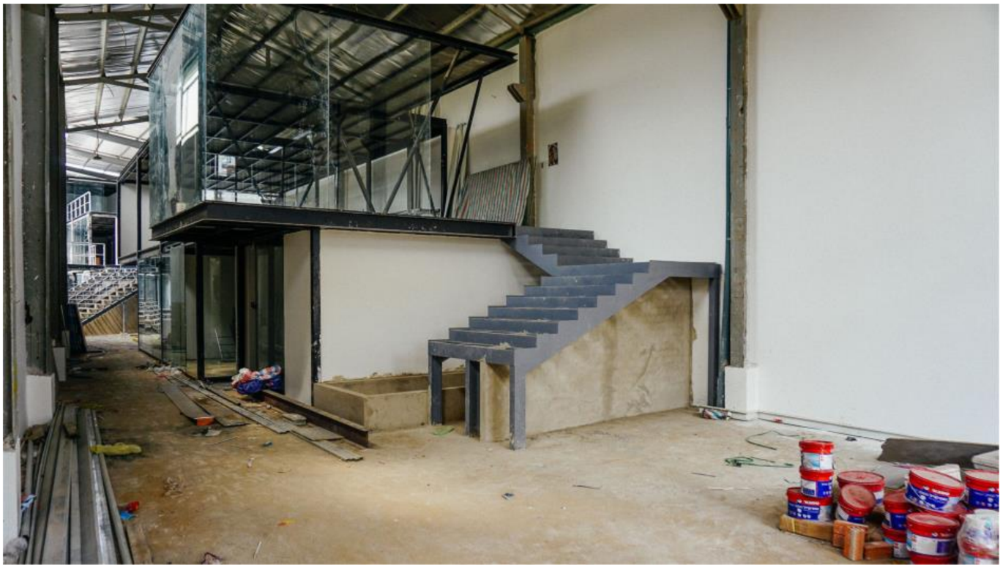

Hình 1.3 Mô hình đám mây điểm hiện trạng công trình

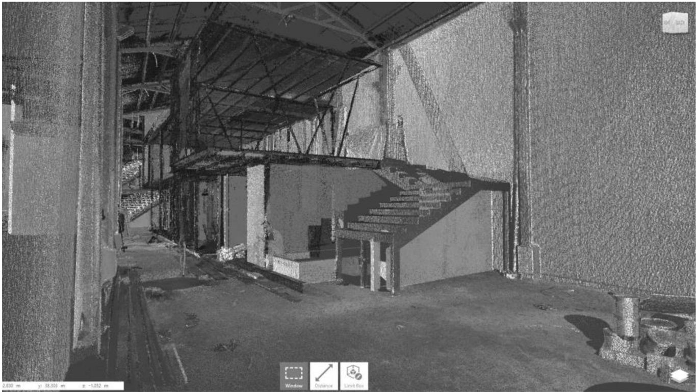

Hình 1.4 Mô hình BIM hiện trạng công trình được lập dựa theo đám mây điểm

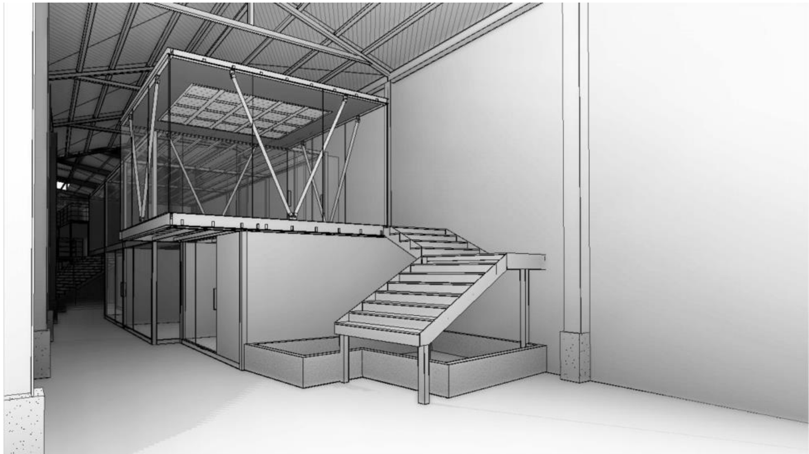

## 1.2. Tạo lập mô hình BIM (3D)

## 1.2.1. Mô tả

Mô hình BIM được tạo lập và phát triển dựa trên các thông tin cần thiết. Kết nối mô hình BIM với các thông tin khác (khối lượng, chi phí và tiến độ...) là nền tảng để phát triển các ứng dụng BIM khác như lập dự toán chi phí, quản lý tiến độ,…

## 1.2.2. Lợi ích

- -Trực quan hóa, tăng cường tính minh bạch của thiết kế cho tất cả các bên liên quan;
- -Hồ trợ quá trình kiểm soát chất lượng thiết kế, chi phí và tiến độ;
- -Hỗ trợ phối hợp giữa các bên liên quan trong dự án;
- -Hỗ trợ kiểm soát chất lượng trong thiết kế, thi công.

## 1.2.3. Yêu cầu

- 1.2.3.1. Phần mềm, phần cứng và dữ liệu
- -Phần mềm tạo lập mô hình;
- -Phần cứng đáp ứng tối thiểu yêu cầu của nhà sản xuất;
- -Hệ thống thư viện cấu kiện.

## 1.2.3.2. Nhân lực

- -Khả năng thao tác, điều hướng và tạo lập mô hình BIM;
- -Kiến thức về quy trình và phương pháp xây dựng mô hình;
- -Kinh nghiệm thiết kế và thi công.

## 1.2.3.3. Dữ liệu

- -Thông tin cần thiết với từng loại cấu kiện theo các giai đoạn và đơn vị/ cá nhân chịu trách nhiệm thực hiện.

## 1.2.4. Sản phẩm

- -Mô hình BIM có đầy đủ thông tin cần thiết tương ứng với từng giai đoạn của dự án

## 1.2.5. Ví dụ

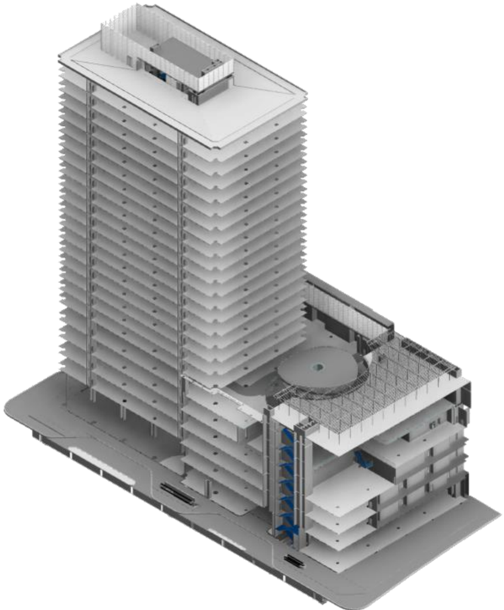

Hình 1.5 Mô hình kiến trúc dự án Crescent Mall giai đoạn 2

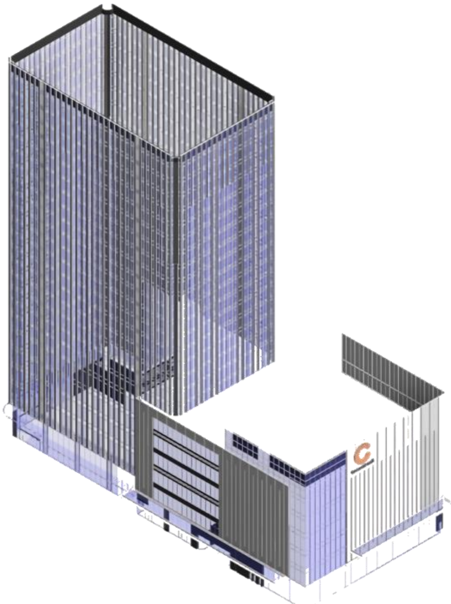

Hình 1.7 Mô hình mặt ngoài dự án Crescent Mall giai đoạn 2

Hình 1.6 Mô hình kết cấu dự án Crescent Mall giai đoạn 2

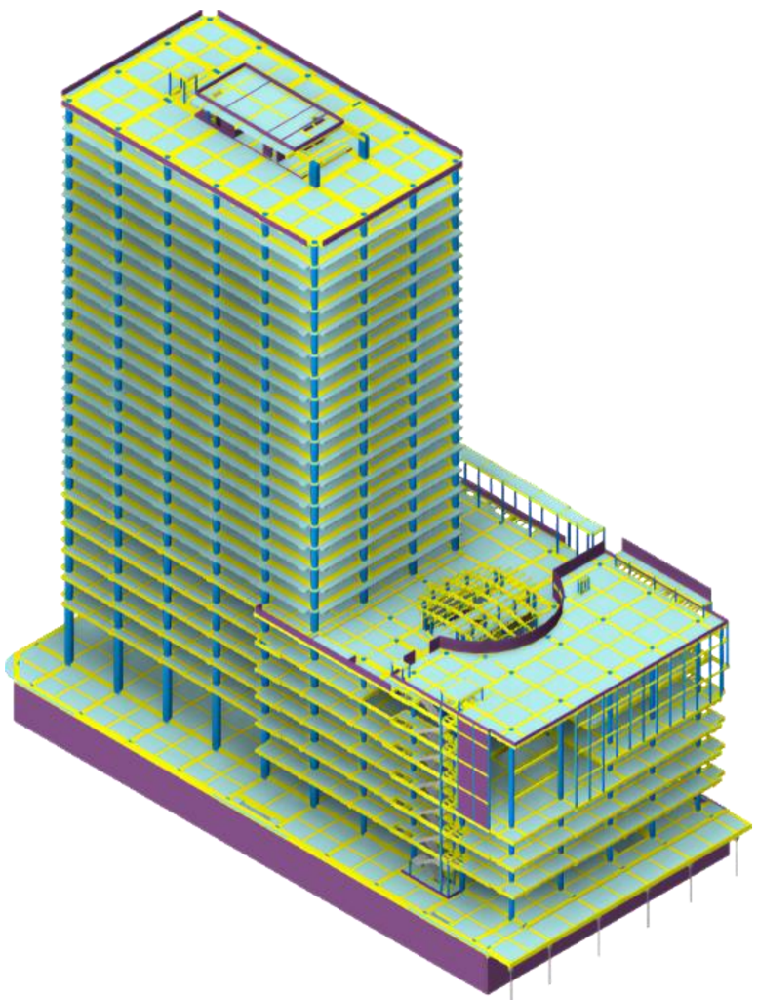

Hình 1.8 Mô hình MEP dự án Crescent Mall giai đoạn 2

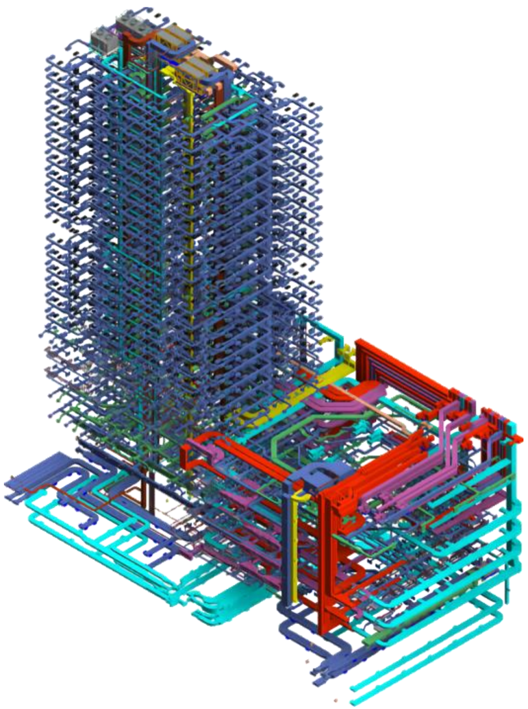

## 1.3. Phân tích năng lượng

## 1.3.1. Mô tả

Phân tích năng lượng sử dụng mô hình BIM được thực hiện trong giai đoạn thiết kế. Mục tiêu chính việc phân tích năng lượng là kiểm tra mức độ tiêu thụ năng lượng của công trình, từ đó tối ưu hóa thiết kế để giảm chi phí sử dụng năng lượng trong quá trình vận hành công trình.

Hiện nay, các phần mềm mô phỏng năng lượng thường có khả năng trích xuất mô hình và các thông tin liên quan từ mô hình BIM để phục vụ việc phân tích năng lượng. Ngoài ra, người thiết kế cũng có thể chỉnh sửa các thông số trực tiếp trên các phần mềm này trong quá trình tối ưu thiết kế.

## 1.3.2.

## Lợi ích

- -Tiết kiệm thời gian, chi phí và tăng độ chính xác trong quá trình phân tích bằng cách tự động trích xuất thông tin liên quan (hình học và phi hình học) từ mô hình BIM thay vì nhập dữ liệu theo cách thủ công;
- -
- Tối ưu hóa thiết kế để giảm chi phí vận hành.

## 1.3.3. Yêu cầu

## 1.3.3.1. Phần mềm, phần cứng và dữ liệu

- -
- Phần mềm mô phỏng và phân tích năng lượng;
- -Mô hình BIM của công trình;
- -Dữ liệu chi tiết thời tiết địa phương;
- -
- Tiêu chuẩn năng lượng phù hợp.

## 1.3.3.2. Nhân lực

- -
- Kiến thức cơ bản về các hệ thống sử dụng năng lượng trong công trình;
- -
- -
- -
- -

## 1.3.4.

- -
- -
- Kiến thức về các tiêu chuẩn năng lượng;
- Kiến thức và kinh nghiệm thiết kế các hệ thống trong công trình;
- Khả năng thao tác, điều hướng và đánh giá Mô hình BIM;
- Khả năng đánh giá mô hình thông qua các công cụ phân tích năng lượng.

## Sản phẩm đầu ra:

- Mô hình thiết kế hệ thống chiếu sáng;
- Báo cáo phân tích hệ thống chiếu sáng;
- -Thông tin các cấu kiện hệ thống chiếu sáng được chuyển cho thiết kế kiến trúc.

## 1.3.5. Ví dụ

Hình 1.9 Phân tích thông gió trong dự án bệnh viện IIH

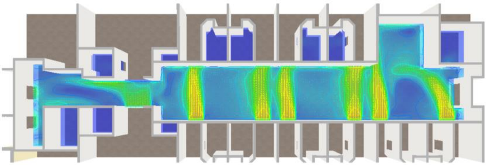

Hình 1.10 Phân tích thông gió tác động đến dự án IIH

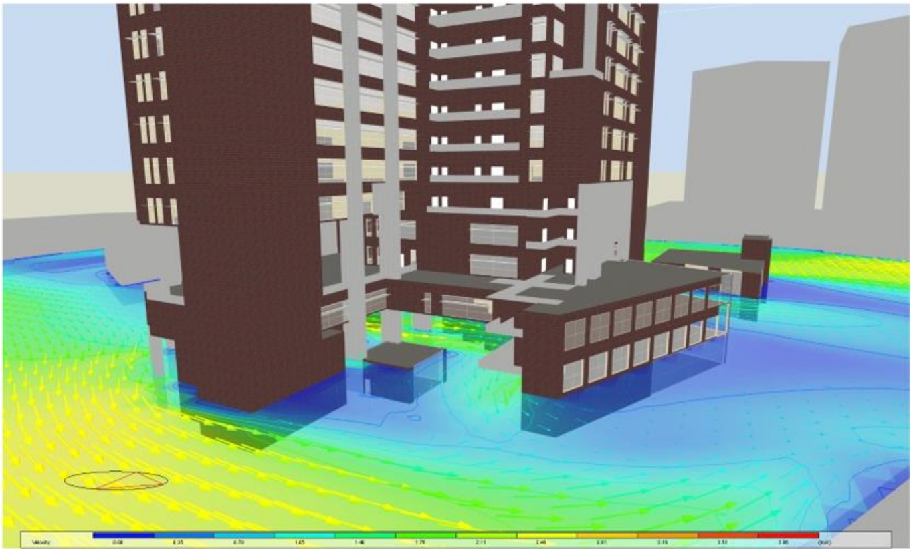

Temperature and Heat Gains - Untitled, Building 1

Hình 1.11 Kết quả phân tích tính tải lạnh điều hoà dự án IIH

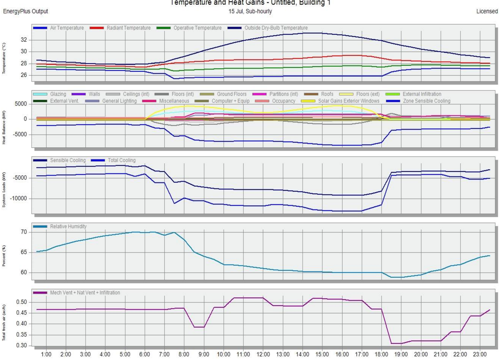

## 1.3.6. Phân tích kết cấu

## 1.3.7. Mô tả

Phân tích kết cấu bằng mô hình BIM là việc sử dụng mô hình BIM để xác định trạng thái làm việc của kết cấu công trình nhằm tối ưu hoá giải pháp kết cấu công trình. Tuy nhiên, trong một số trường hợp nếu thiết lập mô hình phân tích kết cấu riêng thì nên

đối chiếu với mô hình BIM để đảm bảo sự tương thích.

Các phần mềm phân tích kết cấu dựa trên mô hình BIM có thể trích xuất kích thước hình học, tải trọng, thông số vật liệu phục vụ quá trình phân tích này.

## 1.3.8.

## Lợi ích

- -Tiết kiệm thời gian và chi phí khi thay đổi, cập nhật phương án thiết kế;
- -
- Cải thiện chất lượng của quá trình thiết kế kết cấu.

## 1.3.9. Yêu cầu

## 1.3.9.1.

## Phần cứng, phần mềm và dữ liệu

- -Công cụ tạo lập mô hình BIM;
- -
- Công cụ và phần mềm phân tích kết cấu;
- -Tiêu chuẩn thiết kế kết cấu;
- -
- Phần cứng phù hợp để chạy phần mềm.

## 1.3.9.2. Yêu cầu năng lực

- -
- Khả năng tạo, thao tác, điều hướng và đánh giá Mô hình Kết cấu 3D;
- -
- Kinh nghiệm thiết kế và phân tích kết cấu.

## 1.3.10. Sản phẩm

- -Mô hình thiết kế kết cấu;
- -
- Báo cáo phân tích kết cấu;
- -Thông tin các chi tiết kết cấu chuyển giao cho thiết kế kiến trúc.

## 1.3.11. Ví dụ

Hình 1.12 Mô hình BIM và mô hình phân tích kết cấu

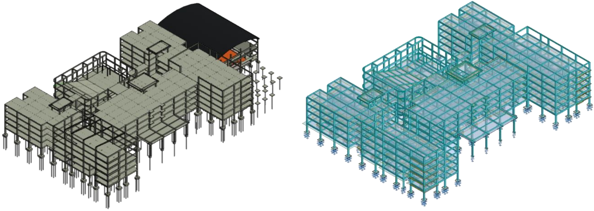

## 1.4. Phân tích ánh sáng

## 1.4.1. Mô tả

Sử dụng mô hình BIM để đánh giá cường độ ánh sáng và tính thẩm mỹ trong các điều kiện khác nhau như ánh sáng tự nhiên hoặc ánh sáng nhân tạo của không gian hoặc bề mặt.

## 1.4.2. Lợi ích

- -Xem xét trực quan trong các điều kiện ánh sáng khác nhau;
- -Định lượng cường độ ánh sáng tại các điểm nhất định;
- -Tính toán tác động ánh sáng ban ngày trong không gian;
- -Tính toán sơ bộ năng lượng tiêu thụ do chiếu sáng;
- -Đánh giá các phương án sử dụng nguồn sáng nhân tạo khác nhau.

## 1.4.3. Yêu cầu

## 1.4.3.1. Phần mềm, phần cứng và dữ liệu

- -Mô hình BIM chứa tất cả các đối tượng có tác động đến sự phân bố ánh sáng trong công trình (bao gồm vật liệu hoàn thiện, bố trí nội thất, hình thù công trình...);
- -Phần mềm phân tích, tính toán ánh sáng.

## 1.4.3.2. Nhân lực

- -Kỹ năng phân tích, đánh giá từ kết quả của phần mềm;
- -Khả năng bố trí nguồn ánh sáng phù hợp dựa trên kết quả phân tích.

## 1.4.4. Sản phẩm

- -Mô hình thiết kế hệ thống chiếu sáng;

- -Báo cáo phân tích hệ thống chiếu sáng;
- -Thông tin các cấu kiện hệ thống chiếu sáng được chuyển cho thiết kế kiến trúc.

## 1.4.5. Ví dụ

Hình 1.13 Phân tích chiếu sáng tự nhiên và bức xạ mặt trời tại dự án Trường Genesis

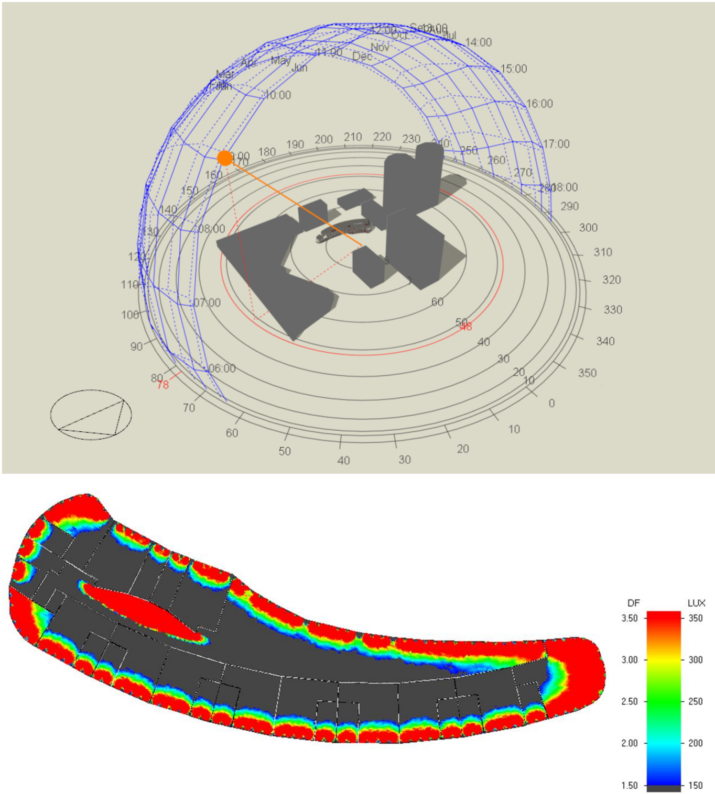

## 1.5. Đánh giá thiết kế

## 1.5.1. Mô tả

Đây là quá trình trong đó các bên liên quan xem xét, đánh giá thiết kế thông qua mô hình BIM 3D theo các tiêu chí khác nhau như: bố cục, cảnh quan, ánh sáng, công thái học, kết cấu, màu sắc,…

Ứng dụng BIM này có thể được thực hiện trong một khu vực nhỏ của dự án với độ chi tiết rất cao để phân tích phương án thiết kế và giải quyết các vấn đề có thể xảy ra trong quá trình thi công.

Ứng dụng này có thể thực hiện chỉ với phần mềm máy tính hoặc với với các thiết bị mô phỏng như công nghệ thực tế ảo, tăng cường thực tế ảo (VR/AR).

## 1.5.2. Lợi ích

- -Thuận lợi trong việc trao đổi, phối hợp giữa tư vấn thiết kế, chủ đầu tư, đơn vị thi công và đơn vị quản lý vận hành (nếu có);
- -Tăng cường phối hợp giữa các bên liên quan, giúp nâng cao chất lượng thiết kế;
- -Các phương án thiết kế có thể dễ dàng thay đổi một cách nhanh chóng; thuận lợi trong việc sửa đổi quan dựa trên phản hồi của các bên liên quan;
- -Quá trình thiết kế, xét duyệt thiết kế được rút ngắn thời gian và hiệu quả hơn.

## 1.5.3. Yêu cầu

## 1.5.3.1. Phần mềm, phần cứng và dữ liệu

- -Phần mềm đánh giá thiết kế;
- -Phần cứng đáp ứng khả năng xử lý mô hình;

## 1.5.3.2. Nhân lực

- -Khả năng thao tác, điều hướng và đánh giá mô hình 3D;
- -Khả năng mô hình hoá;
- -Khả năng phối hợp giữa các thành viên trong nhóm;
- -
- Nắm rõ các hệ thống.

## 1.5.3.3. Dữ liệu đầu vào

- -
- Xác định những yêu cầu đánh giá cần thiết;
- -Xác định những công nghệ được sử dụng để thực hiện đánh giá thiết kế (mô hình 3D, VR/AR…).

## 1.5.4. Sản phẩm đầu ra:

- -Báo cáo các phản hồi thiết kế kèm theo chỉ định bộ phận/ bên có trách nhiệm sửa.

## 1.6. Dự toán chi phí

## 1.6.1. Mô tả

Quá trình mô hình BIM được sử dụng để hỗ trợ lập dự toán và dự toán chi phí. Ứng dụng này cho phép cập nhật kịp thời các thông tin về chi phí khi có sự thay đổi đối với quá trình xây dựng. Từ mô hình BIM có thể xác định nhanh chóng các số liệu liên quan (khối lượng, diện tích, chiều dài, số lượng) để dự tính yêu cầu nguồn lực và tính toán chi phí. Lưu ý là mô hình chỉ là công cụ hỗ trợ, nó không thay thế được cho các trách nhiệm truyền thống của Kỹ sư định giá trong xây dựng.

## 1.6.2. Lợi ích

- -Định lượng chính xác khối lượng vật liệu trong mô hình;

- -Xác định nhanh chóng khối lượng để hỗ trợ quá trình ra quyết định lựa chọn phương án;
- -Tính toán chi phí nhanh hơn, độ chính xác cao hơn;
- -
- Thể hiện trực quan các thành phần trong công trình cần được dự toán chi phí;
- -Cung cấp thông tin chi phí cho chủ đầu tư trong giai đoạn ra quyết định phương án thiết kế, kể cả các thay đổi trong quá trình xây dựng;
- -Tiết kiệm thời gian cho việc xác định chi phí xây dựng; hỗ trợ cho quá trình kiểm soát chi phí;
- -Dự toán chi phí gắn với tiến độ thực hiện dự án, có thể giúp theo dõi ngân sách trong suốt quá trình thực hiện dự án.

## 1.6.3. Yêu cầu

## 1.6.3.1. Phần mềm, phần cứng và dữ liệu

- -
- Phần mềm dự toán dựa trên mô hình;
- -Mô hình thiết kế đáp ứng các yêu cầu để bóc tách khối lượng;
- -Dữ liệu về chi phí (thông tin về giá liên quan);

## 1.6.3.2. Nhân sự

- -Khả năng làm việc theo quy trình mô hình hóa để tạo thông tin về khối lượng cho việc lập dự toán;
- -Khả năng xác định khối lượng phù hợp với việc vận dụng thông tin về giá;
- -Khả năng thao tác trên mô hình để thu được khối lượng có thể sử dụng để tính toán chi phí.

## 1.6.4. Sản phẩm đầu ra:

- -Thông tin tính toán khối lượng theo cấu trúc xác định;
- -
- Dự toán chi phí.

## 1.6.5. Ví dụ

Hình 1.14 Dự toán chi phí dựa trên mô hình BIM (BIM 5D)

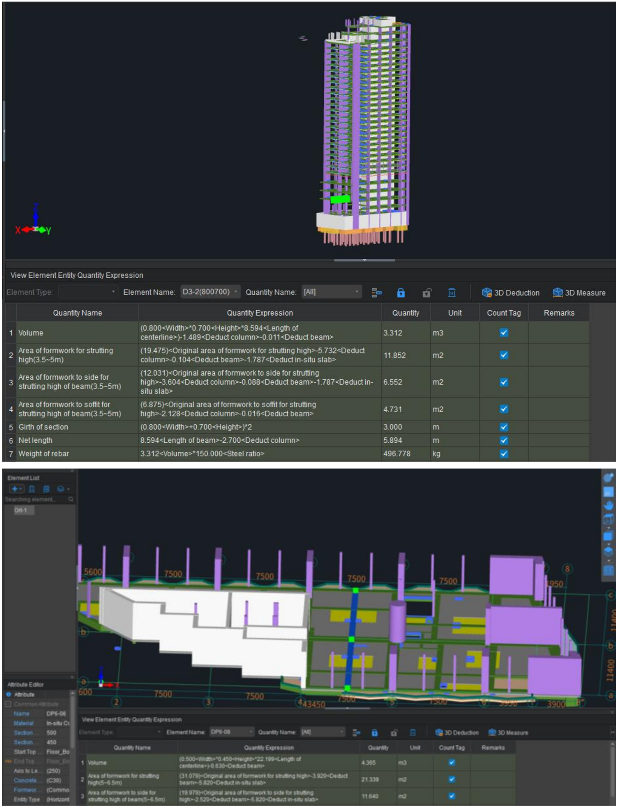

## 1.7. Phối hợp 3D

## 1.7.1. Mô tả

Đây là công việc cần thực hiện trong suốt quá trình thiết kế, thi công để xác định những xung đột trong mô hình BIM có thể dẫn đến các vấn đề ngừng trệ hoặc sai sót trên công trường. Quy trình này có thể tiến hành bằng cách sử dụng các phần mềm kiểm tra xung đột hoặc kiểm tra thủ công. Mục tiêu của phối hợp 3D là loại bỏ bất kỳ xung đột lớn do thiết kế (không kể đến các lỗi do công tác mô hình hoá) trước khi đưa vào xây dựng, lắp ráp.

## 1.7.2.

## Lợi ích

- -Trao đổi dễ dàng giữa tư vấn thiết kế, chủ đầu tư, đơn vị thi công và đơn vị quản lý vận hành;
- -
- Tăng cường phối hợp giữa các bên liên quan, giúp nâng cao chất lượng thiết kế;
- -Các phương án thiết kế có thể dễ dàng thay đổi và sửa đổi trực quan dựa trên phản hồi của các bên liên quan;
- -
- Quá trình thiết kế, xem xét thiết kế được rút ngắn và  hiệu quả hơn;

## 1.7.3. Yêu cầu

## 1.7.3.1. Phần mềm, phần cứng và dữ liệu

- -
- Phần mềm xây dựng mô hình;
- -Phần mềm đánh giá mô hình;
- -
- Phần mềm phát hiện xung đột;
- -
- Mô hình thành phần;
- -Các báo cáo, nhận xét, mô hình trong quá trình phối hợp.

## 1.7.3.2. Nhân lực

- -
- Khả năng thao tác, điều hướng, đánh giá mô hình 3D;
- -Khả năng sử dụng phần mềm phát hiện xung đột;
- -

## 1.7.4.

- -
- Kiến thức về xây dựng.

## Sản phẩm đầu ra:

- Mô hình phối hợp công trình;
- -Báo cáo phối hợp: xác định các lỗi phối hợp.

## 1.7.5. Ví dụ

Hình 1.15 Mô hình phối hợp 3 bộ môn (kiến trúc, kết cấu, MEP)

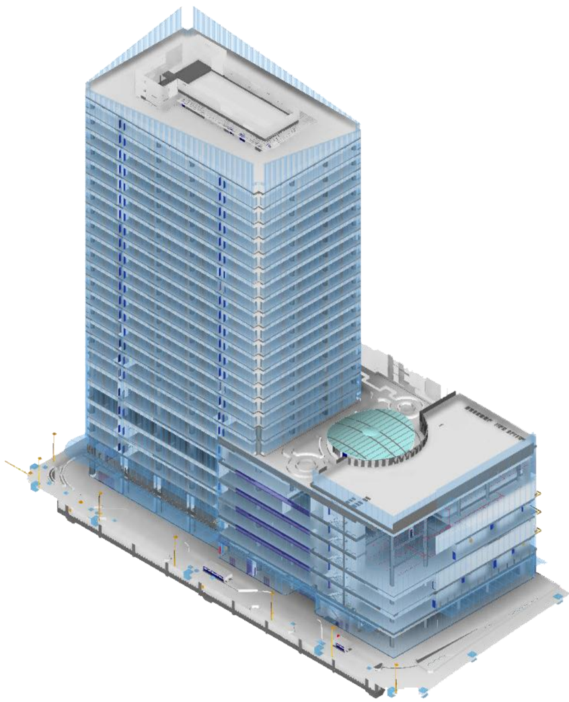

## 1.8. Lập tiến độ dựa trên mô hình

## 1.8.1. Mô tả

Đây là ứng dụng BIM mà dữ liệu thời gian được thêm vào mô hình (mô hình BIM 4D) để lên kế hoạch, tiến độ trong giai đoạn thi công. Đây là một công cụ trực quan, cung cấp cho các đơn vị tham gia dự án hiểu rõ hơn về các mốc quan trọng của dự án và kế hoạch thực hiện dự án.

## 1.8.2. Lợi ích

- -Chủ đầu tư và người tham gia dự án hiểu rõ hơn về trình tự, thời gian thi công;
- -Theo dõi tiến độ thực tế trên công trường so với các hoạt động đã được lên kế hoạch;
- -Xác định các vấn đề về trình tự thi công;
- -Xây dựng kế hoạch, chuẩn bị nguồn lực, thiết bị và vật liệu tốt hơn;
- -Theo dõi tình trạng chuẩn bị vật tư, thiết bị cho dự án;
- -Cho phép quan sát trực quan về không gian dự án, hỗ trợ phân tích để lên kế hoạch;
- -Xác định và giải quyết các xung đột về không gian trước khi thi công;
- -Là một phương pháp truyền thông trực quan, hiệu quả mô tả quá trình xây dựng.

Hình 1.16 Va chạm được phát hiện trong quá trình phối hợp mô hình

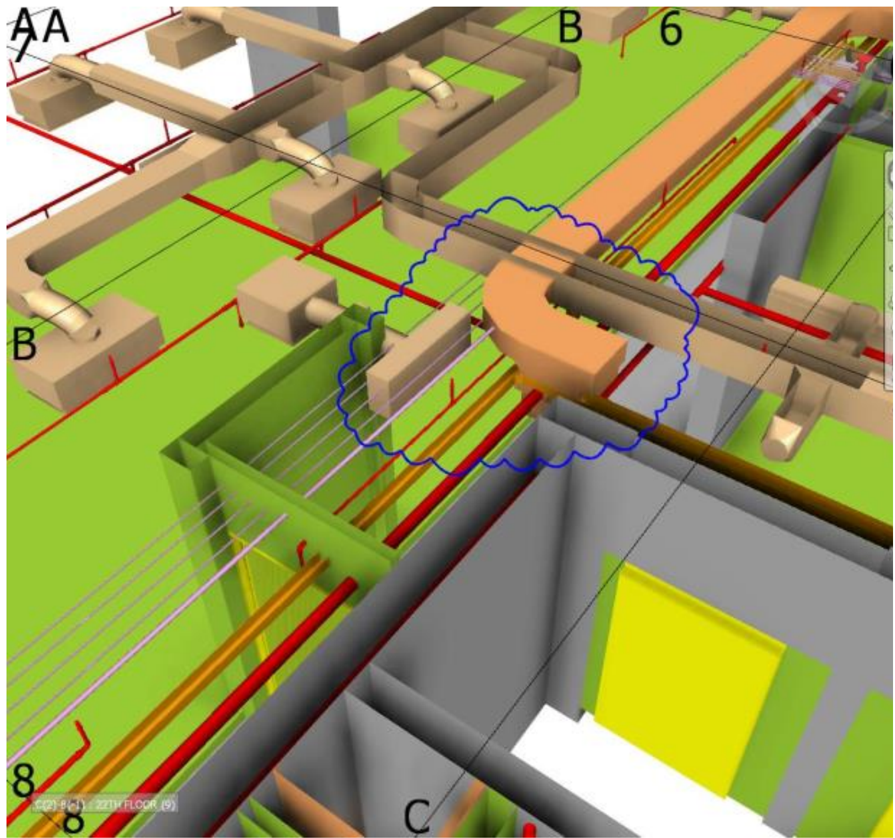

## 1.8.3. Yêu cầu

## 1.8.3.1. Phần mềm, phần cứng và dữ liệu

- -Phần mềm dựng mô hình BIM;
- -Phần mềm lên kế hoạch;
- -Phần mềm quản lý mô hình 4D;
- -Mô hình tiến độ xây dựng (mô hình 4D) (IFC, CSV, XML);
- -Bảng tiến độ xây dựng.

## 1.8.3.2. Nhân lực

- -Kiến thức về lên lập kế hoạch, trình tự thi công;
- -Khả năng thao tác, điều hướng và đánh giá mô hình 3D;
- -Kiến thức về phần mềm 4D;

## 1.8.4. Sản phẩm đầu ra

- -Mô hình mô phỏng tiến độ 4D;
- -Các báo cáo tiến độ (nếu có).

## 1.8.5. Ví dụ

Hình 1.17 Lập tiến độ dựa trên mô hình BIM

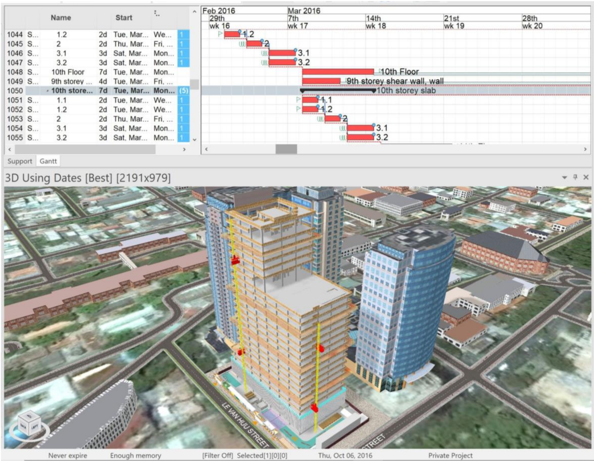

## MỘT SỐ NỘI DUNG BỔ SUNG TRONG HSMT/ HSYC

## YÊU CẦU VỀ THÔNG TIN TRAO ĐỔI

## Ký tự viết tắt và thuật ngữ

| Ký tự viết tắt          | Tiếng Anh                | Tiếng Việt                |
|-------------------------|--------------------------|---------------------------|
| ____ [Ghi tên viết tắt] | ____ [Ghi tên tiếng Anh] | ____ [Ghi tên tiếng Việt] |
| …                       | …                        | …                         |

| Thuật ngữ            | Định nghĩa                     | Tiếng Anh                               |
|----------------------|--------------------------------|-----------------------------------------|
| ____ [Ghi thuật ngữ] | ____ [Ghi nội dung định nghĩa] | ____ [Ghi tên thuật ngữ bằng tiếng Anh] |
| …                    | …                              | …                                       |

## 1. Thông tin dự án

## 1.1. Thông tin chung

Thông tin chung của dự án \_\_\_\_ [Ghi tên dự án] được trích dẫn từ nội dung trong Yêu cầu về thông tin trao đổi (EIR).

Bảng 1. Thông tin chung về dự án

| Chủ đầu tư      | ____ [Ghi tên Chủ đầu tư]     |
|-----------------|-------------------------------|
| Tên dự án       | ____ [Ghi tên Dự án]          |
| Địa chỉ         | ____ [Ghi rõ địa chỉ dự án]   |
| Địa chỉ liên hệ | ____ [Ghi rõ địa chỉ liên hệ] |
| Tóm tắt dự án   | …                             |

## 1.2. Tiến độ dự án

Các bên cần huy động nguồn lực phù hợp để đảm bảo tiến độ đã được phê duyệt.

Bảng 2. Tiến độ tổng thể dự án

| Giai đoạn                                                         | Ngày bắt đầu                                     | Ngày kết thúc                                     |
|-------------------------------------------------------------------|--------------------------------------------------|---------------------------------------------------|
| ____ [Ghi tên giai đoạn liên quan (thiết kế xây dựng, thi công…)] | ____ [Ghi ngày bắt đầu theo dạng ngày/tháng/năm] | ____ [Ghi ngày kết thúc theo dạng ngày/tháng/năm] |
| …                                                                 | …                                                | …                                                 |

## 2. Các quy định áp dụng

Tất cả thông tin của dự án sẽ được tạo lập, chia sẻ và quản lý tham khảo các tiêu chuẩn và hướng dẫn sau:

Bảng 3. Các nội dung quy định áp dụng

| M = Bắt buộc (Mandatory)      | M = Bắt buộc (Mandatory)      | M = Bắt buộc (Mandatory)      | M = Bắt buộc (Mandatory)      | M = Bắt buộc (Mandatory)      | M = Bắt buộc (Mandatory)      | M = Bắt buộc (Mandatory)      | M = Bắt buộc (Mandatory)      | M = Bắt buộc (Mandatory)      | Nội dung        | Nội dung          | Nội dung          | Nội dung   | Nội dung           | Nội dung   | Nội dung   |
|-------------------------------|-------------------------------|-------------------------------|-------------------------------|-------------------------------|-------------------------------|-------------------------------|-------------------------------|-------------------------------|-----------------|-------------------|-------------------|------------|--------------------|------------|------------|
| R = Khuyến nghị (Recommended) | R = Khuyến nghị (Recommended) | R = Khuyến nghị (Recommended) | R = Khuyến nghị (Recommended) | R = Khuyến nghị (Recommended) | R = Khuyến nghị (Recommended) | R = Khuyến nghị (Recommended) | R = Khuyến nghị (Recommended) | R = Khuyến nghị (Recommended) | Đặt tên tập tin | Đặt tên Đối tượng | Yêu cầu về bản vẽ | CDE        | Hệ thống phân loại | …          |            |
| Quy định nước                 | ____                          | [Ghi                          | tên                           | tài                           | liệu,                         | hướng                         | dẫn,                          | tiêu                          | ____            |                   |                   |            |                    |            |            |
| Quy định nước                 | chuẩn] ____                   | [Ghi                          | tên                           | tài                           | liệu,                         | hướng                         | dẫn,                          | tiêu                          |                 |                   |                   |            |                    |            |            |
| Quy định nước                 | chuẩn] …                      |                               |                               |                               |                               |                               |                               |                               |                 |                   |                   |            |                    |            |            |
| Quy định nước                 | ____                          | [Ghi                          | tên                           | tài                           | liệu,                         | hướng                         | dẫn,                          | tiêu                          |                 |                   |                   |            |                    |            |            |

chuẩn]

| Quy định trong   | ____ [Ghi tên tài liệu, hướng dẫn, tiêu chuẩn] …   |
|------------------|----------------------------------------------------|

## 3. Mục tiêu và nội dung áp dụng BIM cho dự án

## 3.1. Mục tiêu áp dụng BIM

Nhóm dự án cần tuân thủ các yêu cầu cho dự án \_\_\_\_ [Ghi tên dự án] nhằm thực hiện các mục tiêu dưới đây:

Bảng 4. Mục tiêu áp dụng BIM cho dự án

| STT   | Mục tiêu                     |
|-------|------------------------------|
| 1     | ____ [Ghi nội dung mục tiêu] |
| …     | …                            |

## 3.2. Nội dung áp dụng BIM

Các nội dung áp dụng BIM dưới đây đã được thống nhất giữa nhóm dự án và \_\_\_\_ [Ghi tên chủ đầu tư] . Trong thường hợp có thay đổi hoặc bổ sung nội dung áp dụng BIM cần thống nhất với \_\_\_\_ [Ghi tên chủ đầu tư].

Bảng 5. Nội dung áp dụng BIM

| STT   | Nội dung áp dụng BIM            |
|-------|---------------------------------|
| 1     | ____ [Ghi nội dung áp dụng BIM] |
| …     | …                               |

Tham khảo

Biểu mẫu 01: Nội dung áp dụng BIM

## 4. Phạm vi công việc, sản phẩm, kế hoạch chuyển giao thông tin

## 4.1. Phân chia mô hình

Việc phân chia mô hình có vai trò quan trọng trong việc cho phép các nhóm làm việc hiệu quả và song song. Các mô hình BIM phải được tách thành các gói công việc riêng biệt phù hợp với cơ cấu tổ chức của nhóm thực hiện Dự án, với trách nhiệm được phân công cho việc xây dựng mô hình.

Với các mô hình khởi đầu, tư vấn nên khuyến nghị tác giả của các mô hình sử dụng đối tượng chung để phù hợp cho công tác phối hợp 3D và phát hiện xung đột.

Một số yêu cầu dưới đây nên được xem xét để phân tách mô hình một cách hiệu quả:

- -Mô hình BIM không được chứa nhiều hơn một công trình, trừ trường hợp đó là mô hình liên kết hay các mô hình tổng hợp.
- -Mô hình BIM chỉ chứa thông tin của một bộ môn.

- -Nếu mô hình BIM có dung lượng tập tin phù hợp, nhà thầu nên xem xét để phân tách mô hình thành nhiều mô hình nhỏ để giảm kích thước của từng tập tin.

Bảng 6. Phân chia mô hình

| Mô hình chính                                                                                  | Mô hình thành phần                                                                                                                 |
|------------------------------------------------------------------------------------------------|------------------------------------------------------------------------------------------------------------------------------------|
| ____ [Ghi tên mô hình chính (mô hình được phân chia theo hạng mục, bộ môn, tuyến, gói thầu,…)] | ____ [Ghi tên mô hình thành phần được chia nhỏ từ mô hình chính (mô hình được phân chia theo hạng mục, bộ môn, tuyến, gói thầu,…)] |
| …                                                                                              |                                                                                                                                    |

Nhà thầu phải xem xét và xác nhận hoặc đề xuất một giải pháp thay thế cho Chiến lược phân chia mô hình ở trên trong Kế hoạch thực hiện BIM sơ bộ (Pre-BEP).

## 4.2. Phân chia trách nhiệm thực hiện

Nhà thầu cung cấp Bảng phân công trách nhiệm cho thấy vai trò và trách nhiệm các nhân sự BIM của đơn vị thực hiện các nội dung công việc.

## 4.3. Kế hoạch trao đổi thông tin phối hợp

Nhà thầu sẽ sử dụng các định dạng trao đổi sau đây cho thông tin về BIM và các sản phẩm đầu ra.

Các bên cần hiểu rõ cách sử dụng, trách nhiệm, định dạng và tần xuất chia sẻ thông tin đã được thống nhất tại Biểu mẫu 02: Kế hoạch trao đổi thông tin phối hợp .

## 5. Mức độ phát triển thông tin

Nhà thầu đảm bảo mức độ phát triển thông tin (LOD) (bao gồm thông tin hình học và phi hình học) của các thành phần và cấu kiện trong mô hình tuân theo bảng Mức độ phát triển thông tin.

Nhà thầu liệt kê LOD của các thành phần, cấu kiện theo Biểu mẫu 03: Mức độ phát triển thông tin (LOD).

## 6. Các nội dung về quản lý

## 6.1. Môi trường dữ liệu chung CDE

Các thông tin BIM trong dự án cần được trao đổi thông qua Môi trường dữ liệu chung 6.1.1. Mô tả

Giải pháp CDE nào đáp ứng và hỗ trợ các yêu cầu như ISO 19650-1: 2018 và sử dụng quy trình xử lý công việc được các nội dung: CÔNG VIỆC ĐANG TIẾN HÀNH (WIP) CHIA SẺ - ĐÃ PHÁT HÀNH - LƯU TRỮ.

\_\_\_\_ [Ghi tên chủ đầu tư] cùng với Nhà thầu chính sẽ quản lý CDE và sẽ cung cấp quyền truy cập cho các Nhà thầu. Tất cả thông tin (tức là báo cáo, bản vẽ, mô hình, đặc điểm kỹ thuật, v.v.) sẽ được tạo ra và (sau đó) được chia sẻ trong CDE. Thông tin này sẽ được trao đổi bằng CDE và quy trình làm việc theo quy định.

Nhà thầu phải sử dụng để tạo, chia sẻ và phát hành Thông tin dự án. Điều này là cần thiết cho tính nhất quán và để thông tin được quản lý và cung cấp một cách gọn gàng và kịp thời. Quy trình công việc này dựa trên quy định trong ISO 19650-1: 2018. CDE sẽ được sử dụng để cho phép quá trình này, điều này được minh họa trong hình bên dưới liên quan đến việc chia sẻ thông tin trong một môi trường dữ liệu chung.

## Tham khảo Biểu mẫu 04: Cấu trúc thư mục và vai trò của các chủ thể trong quản lý, sử dụng CDE

## 6.1.2. Quy ước đặt tên đối tượng và tên tập tin (tên file)

Bảng 7. Quy tắc đặt tên file

| Trường 1    | Trường 2   | Trường 3        | Trường 4                     | Trường 5                     | Trường 6                     | Trường 7                     | Trường 8                     |
|-------------|------------|-----------------|------------------------------|------------------------------|------------------------------|------------------------------|------------------------------|
| Mã số Dự Án | Công trình | Đơn vị khởi tạo | Khu vực hoặc Hệ thống        | Cao độ, Cao trình            | Kiểu/Loại của Tài liệu       | Bộ Môn                       | Số thứ tự của Tập tin        |
| XXXX        | XXXX       | XXXX            | XX                           | XX                           | XX                           | X                            | XXXX                         |
| Vi dụ:      | Vi dụ:     | Vi dụ:          | LT09-CC-0005-00-XX-M3-C-0001 | LT09-CC-0005-00-XX-M3-C-0001 | LT09-CC-0005-00-XX-M3-C-0001 | LT09-CC-0005-00-XX-M3-C-0001 | LT09-CC-0005-00-XX-M3-C-0001 |

Tham khảo Biểu mẫu 05: Quy ước đặt tên

## 6.1.3. Các Yêu cầu về Siêu dữ liệu

Tất cả các tập tin trong CDE sẽ được điền thông tin với siêu dữ liệu để mô tả nội dung của tập tin và phù hợp để sử dụng cho mục đích gì.

Tối thiểu thì tất cả các tập tin sẽ chứa siêu dữ liệu mô tả về sự phù hợp, trạng thái và sửa đổi của tập tin, được thể hiện trong Bảng như sau.

Bảng 8. Mô tả siêu dữ liệu

| Trạng thái               | Mô tả                                                                                                                                                    | Hiệu chỉnh           | Dữ liệu hình học   | Dữ liệu phi hình học   | Tài liệu   |
|--------------------------|----------------------------------------------------------------------------------------------------------------------------------------------------------|----------------------|--------------------|------------------------|------------|
| Công việc Đang Tiến hành | Công việc Đang Tiến hành                                                                                                                                 |                      |                    |                        |            |
| S0                       | Vùng chia sẻ nội bộ trong bộ phận thực hiện BIM Thông tin, dữ liệu đang được phát triển và chưa phù hợp để chia sẻ ra bên ngoài nhóm thực hiện nhiệm vụ. | P01.01 đến P0 n .0 n | ✓                  | ✓                      | ✓          |

| Chia sẻ                                 | (Không có giá trị pháp lý)                                                                                                                             |             |    |    |
|-----------------------------------------|--------------------------------------------------------------------------------------------------------------------------------------------------------|-------------|----|----|
| S1                                      | Dùng để phối hợp Các thông tin được gán trạng thái này chỉ nên được sử dụng để hiểu hoặc phục vụ công tác phối hợp. P01 đến P0 n                       | ✓           | ✗  | ✗  |
| S2                                      | Dùng để bổ sung thông tin dự án. Các thông tin này chỉ mang tính chất thủ tục cho dự án (biên bản cuộc họp…) P01 đến P0 n                              | ✗           | ✓  | ✓  |
| S3                                      | Phục vụ phát triển thông tin dự án: dữ liệu bản vẽ, thuyết minh, bảng kiểm… P01 đến P0 n                                                               | Như yêu cầu | ✓  | ✓  |
| S4                                      | Thông tin được sử dụng trong việc phê duyệt. Các bên tham gia phải chịu trách nhiệm pháp lý về nội dung trong phạm vi thông tin của mình. P01 đến P0 n | ✗           | ✗  | ✓  |
| PHÁT HÀNH TÀI LIỆU (có giá trị pháp lý) | PHÁT HÀNH TÀI LIỆU (có giá trị pháp lý)                                                                                                                |             |    |    |
| A1, A n…                                | Hồ sơ đã được chấp thuận trong các giai đoạn. C01 đến C0 n                                                                                             | ✓           | ✓  | ✓  |
| B1, B n…                                | Hồ sơ đã được chấp thuận nhưng còn lưu ý một số vấn đề, tạm thời chưa được xử lý P01.01 đến P0 n .0 n                                                  | ✓           | ✓  | ✓  |

## 6.2. Quy trình phối hợp

Nhà thầu sẽ phát triển một kế hoạch Phối hợp Mô hình để xác định cách Nhóm thực hiện sẽ phối hợp các mô hình theo khu vực và bộ môn riêng lẻ. Tối thiểu, các quy trình phối hợp mô hình 3D phải bao gồm:

- -Tham chiếu các mô hình mới nhất của các bộ môn được CHIA SẺ vào các mô hình đang làm việc trong WORK-IN-PROGESS để phối hợp thiết kế 'trực tiếp'
- -Duy trì một mô hình kết hợp duy nhất cho dự án, bao gồm tất cả các khu vực và bộ môn, được cập nhật hàng tuần bởi Người Quản lý BIM
- -Tiến hành phát hiện xung đột & va chạm, theo các yêu cầu được nêu dưới đây.
- -Chia sẻ mô hình kết hợp với Nhà đầu tư hàng tháng hoặc theo yêu cầu, để nhận phản hồi và đánh giá của các bên liên quan sớm.

## 7. Các nội dung về kỹ thuật

## 7.1. Nền tảng phần mềm

Nhà thầu liệt kê các phần mềm thiết kế sẽ dự định sử dụng trong dự án.

Phần mềm và các phiên bản được sử dụng bởi \_\_\_\_ [Ghi tên chủ đầu tư] được liệt kê trong bảng dưới đây cho mục đích quản lý thông tin và đánh giá sản phẩm bàn giao.

Bảng 9. Phần mềm và phiên bản

| Nội dung                                                        | Tên phần mềm            | Phiên bản            |
|-----------------------------------------------------------------|-------------------------|----------------------|
| ____ [Ghi rõ nội dung áp dụng (Tạo lập mô hình, phối hợp 3D,…)] | ____ [Ghi tên phần mềm] | ____ [Ghi phiên bản] |
| …                                                               |                         |                      |

## 7.2. Tạo lập bản vẽ

Bản vẽ được yêu cầu trích xuất trực tiếu từ các mô hình BIM. Việc bổ sung đường nét, chi tiết xây dựng và ký hiệu có thể được bổ sung vào khi cần thêm chi tiết.

Chủ đầu tư hoặc Nhà thầu đưa ra tiêu chuẩn hoặc thống nhất chung một bản vẽ mẫu.

## 8. Đào tạo

Nhà thầu được yêu cầu cung cấp chi tiết về khoá đào tạo mà nhà thầu sẽ cung cấp cho \_\_\_\_ [Ghi tên chủ đầu tư] để  đáp ứng các yêu cầu sử dụng BIM được nêu cụ thể trong tài liệu này để đảm bảo quá trình phối hợp, bàn giao và hiểu biết trong quá trình thiết kế và thi công.

\_\_\_\_ [Ghi tên chủ đầu tư] không cung cấp chương trình đào tạo công nghệ nào cho các bên khác thuộc ngoài dự án \_\_\_\_ [Ghi tên dự án].

Bảng 10. Chương trình đào tạo

| Chương trình đào tạo                | Mô tả                             |
|-------------------------------------|-----------------------------------|
| ____ [Ghi tên chương trình đào tạo] | ____ [Mô tả chương trình đào tạo] |
| …                                   | …                                 |

## 9. Đánh giá năng lực nhà thầu

Nhà thầu phải xây dựng Kế hoạch thực hiện BIM sơ bộ và các nội dung liên quan đến việc triển khai BIM cho công trình của dự án. Việc áp dụng BIM từ tổng thể đến chi tiết cần cân đối giữa nguồn lực và tiến độ yêu cầu, kế hoạch và khả năng đáp ứng.

Nhà thầu sẽ trình bày BEP này theo hai giai đoạn dưới hình thức Kế hoạch thực hiện BIM sơ bộ (Pre-BEP) và Kế hoạch thực hiện BIM (BEP)- sau khi ký kết hợp đồng; hai phiên bản như sau và được xác định chi tiết trong Phần bên dưới:

- -Pre-BEP trong HSMT - để xác nhận sự hiểu biết về các yêu cầu thông tin và đồng ý hoặc sửa đổi các yêu cầu như một phần của đề nghị nhà thầu.
- -BEP sau khi chọn thầu  - được trình bày sau khi ký kết hợp đồng và hoàn thiện Kế hoạch thực hiện BIM (BEP).

## Kế hoạch thực hiện BIM sơ bộ (Pre-BEP) nêu trong HSMT

Nhà thầu biên soạn Kế hoạch thực hiện BIM (Pre-BEP) để thể hiện phương pháp, khả năng và năng lực đề xuất để đáp ứng các yêu cầu được nêu trong EIR này.

Nội dung bắt buộc được mô tả trong Mẫu 6a.

## Kế hoạch thực hiện BIM (BEP) sau khi trúng thầu

Nhà thầu phối hợp với các bên liên quan hoàn thiện các nội dung chi tiết trong Kế hoạch thực hiện BIM (BEP) trong vòng \_\_\_\_ [Ghi thời gian] kể từ khi ký kết hợp đồng.

## BIỂU MẪU 01: NỘI DUNG ÁP DỤNG BIM

| Nội dung áp dụng BIM            | Mục tiêu áp dụng                                       |
|---------------------------------|--------------------------------------------------------|
| ____ [Ghi nội dung áp dụng BIM] | ____ [Ghi mục tiêu tương ứng với nội dung áp dụng BIM] |
| …                               | …                                                      |

## KẾ HOẠCH TRAO ĐỔI THÔNG TIN PHỐI HỢP

Để hỗ trợ cho việc hợp tác cũng như tương tác/sử dụng lại dữ liệu của nhau, Đơn vị thực hiện phải cung cấp các thông tin liên quan đến phạm vi công việc của mình như dưới đây. Lưu ý là tất cả các mục yêu cầu xác nhận 'đợi xác nhận' phải được ghi rõ trong Kế hoạch thực hiện BIM (BEP).

| Nội dung công việc                                              | Đơn vị chịu trách nhiệm                     | Phần mềm và phiên bản                       | Định dạng gốc                        | Định dạng trao đổi              | Tần suất                              |
|-----------------------------------------------------------------|---------------------------------------------|---------------------------------------------|--------------------------------------|---------------------------------|---------------------------------------|
| ___ [Nội dung công việc, có thể chia theo nội dung áp dụng BIM] | ___ [Ghi đơn vị chịu trách nhiệm thực hiện] | ___ [Ghi tên phần mềm và phiên bản sử dụng] | ___ [Ghi định dạng gốc tên phần mềm] | ___ [Ghi định dạng để trao đổi] | ___ [Ghi tần xuất trao đổi thông tin] |
| …                                                               |                                             |                                             |                                      |                                 |                                       |

## MỨC ĐỘ PHÁT TRIỂN THÔNG TIN LOD

| Mã hiệu cấu kiện              | Tên cấu kiện           | Diễn giải                | Thiết kế sơ bộ                       | Thiết kế cơ sở                       | Thiết kế kỹ thuật                    | Thiết kế bản vẽ thi công             | Hoàn công                            |
|-------------------------------|------------------------|--------------------------|--------------------------------------|--------------------------------------|--------------------------------------|--------------------------------------|--------------------------------------|
| Mã hiệu cấu kiện              | Tên cấu kiện           | Diễn giải                | LOD                                  | LOD                                  | LOD                                  | LOD                                  | LOD                                  |
| ___ [Ghi số mã hiệu cấu kiện] | ___ [Ghi tên cấu kiện] | ___ [Diễn giải cấu kiện] | ___ [Điền LOD (100,200,300,350,400)] | ___ [Điền LOD (100,200,300,350,400)] | ___ [Điền LOD (100,200,300,350,400)] | ___ [Điền LOD (100,200,300,350,400)] | ___ [Điền LOD (100,200,300,350,400)] |

Biểu mẫu 03

## CẤU TRÚC THƯ MỤC VÀ VAI TRÒ CỦA CÁC CHỦ THỂ TRONG QUẢN LÝ, SỬ DỤNG CDE

| W   | Ghi dữ liệu (Write)                  |
|-----|--------------------------------------|
| R   | Đọc dữ liệu (Read)                   |
| N   | Không được phép truy cập (No access) |

|                             | Các chủ thể tham gia   | Các chủ thể tham gia   | Các chủ thể tham gia      | Các chủ thể tham gia                 | Các chủ thể tham gia    | Các chủ thể tham gia   | Các chủ thể tham gia   |
|-----------------------------|------------------------|------------------------|---------------------------|--------------------------------------|-------------------------|------------------------|------------------------|
| Khu vực / thư mục trong CDE | Chủ đầu tư             | Nhà thầu thi công      | Tư vấn thiết kế kiến trúc | Tư vấn thiết kế Cơ, Điện, Nước (MEP) | Tư vấn thiết kế Kết cấu | Quản lý BIM            | …                      |
| WIP (Đang triển khai)       | R                      | W                      | W                         | W                                    | W                       | R                      | R                      |
| Shared (Chia sẻ)            | R                      | W                      | W                         | W                                    | W                       | R                      | R                      |
| Published (Phát hành)       | R                      | R                      | R                         | R                                    | R                       | R                      | R                      |
| Archived (Lưu trữ)          | R                      | N                      | N                         | N                                    | N                       | R                      | N                      |

## *Ghi chú :

- -Các đơn vị nên đặt tên thư mục bằng tiếng Anh, phần tiếng Việt chỉ để ghi chú.
- -Chủ đầu tư có thể lựa chọn phương án thiết lập thư mục trong CDE: Các thư mục có thể đặt ở trong từng khu vực của CDE hoặc trong mỗi thư mục chứa các khu vực làm việc của CDE.
- -Thông tin trong bảng là để minh hoạ. Tuỳ theo đặc điểm công việc triển khai thực hiện, Chủ đầu tư điều chỉnh cho phù hợp.

## QUY ƯỚC ĐẶT TÊN

Quy ước đặt tên được thống nhất sử dụng trong suốt quá trình thực hiện dự án.

## 1. Quy ước chung

Các ký tự được phép dùng đặt tên thư mục là a-z, A-Z, dấu ngang (-) và dấu gạch dưới (\_). Dấu cách, các chữ cái có dấu trong tiếng Việt (ă, â, đ, ê, ô, ơ,ư) và các ký tự đặc biệt đều không được phép sử dụng.

Các thư mục và file phải được đặt tên ngắn nhất có thể vì các giới hạn số ký tự trong các đường dẫn file bị khống chế bởi các hệ điều hành và phần mềm.

## 2. Quy ước đặt tên tệp tin

Mỗi vùng chứa thông tin (thư mục, file) sẽ có một tên duy nhất, dựa trên một quy ước đã được thống nhất từ trước bao gồm các trường được tách rời nhau bằng dấu '-', mỗi trường được gán một giá trị từ một chuẩn mã hoá được thống nhất và dẫn chứng bằng tài liệu.

Các bên tham gia dự án có thể tham khảo cách đặt tên tập tin dưới đây để áp dụng cho dự án áp dụng BIM (Tham khảo theo Tiêu chuẩn quốc tế ISO 19650-2:2018) .

| Trường                      | Từ tiếng Anh     | Yêu cầu   | Số ký tự           |
|-----------------------------|------------------|-----------|--------------------|
| Dự án                       | Project          | Bắt buộc  | ___ [Ghi số ký tự] |
| Đơn vị khởi tạo             | Originator       | Bắt buộc  | ___ [Ghi số ký tự] |
| Khối tích hoặc hệ thống     | Volume or system | Bắt buộc  | ___ [Ghi số ký tự] |
| Cao trình/ Vị trí/ Lý trình | Level/ Location  | Bắt buộc  | ___ [Ghi số ký tự] |
| Loại/ Kiểu                  | Type             | Bắt buộc  | ___ [Ghi số ký tự] |
| Vai trò                     | Role             | Bắt buộc  | ___ [Ghi số ký tự] |
| Số hiệu                     | Number           | Bắt buộc  | ___ [Ghi số ký tự] |
| Mô tả                       | Description      | Tuỳ chọn  |                    |
| Trạng thái Phù hợp          | Suitability      | Tuỳ chọn  |                    |
| Trạng thái Hiệu chỉnh       | Revision         | Tuỳ chọn  |                    |

* Mã hiệu Dự án

- : \_\_\_ [Ghi mã hiệu dự án]

* Đơn vị khởi tạo :

| Mã hiệu                  | Đơn vị khởi tạo      |
|--------------------------|----------------------|
| ___ [Ghi mã hiệu đơn vị] | ___ [Ghi tên đơn vị] |
| …                        | …                    |

## * Khối tích/hệ thống : Các mã tiêu chuẩn sau được áp dụng:

| Mã hiệu           | Khối tích/ Hệ thống                                  | Từ tiếng Anh   |
|-------------------|------------------------------------------------------|----------------|
| ___ [Ghi mã hiệu] | ___ [Ghi khối tích/ hệ thống (địa hình, hầm, cầu,…)] |                |
| …                 | …                                                    |                |

* Cao trình/Vị trí/Lý trình : Dùng để chỉ vị trí hoặc lý trình của công trình.

Mã có độ dài hai ký tự, có thể bao gồm ký tự chữ và số.

Ví dụ:

| Mã hiệu   | Cao trình/Vị trí/Lý trình              | Từ tiếng Anh                 |
|-----------|----------------------------------------|------------------------------|
| ZZ        | Nhiều cao trình/vị trí                 | Multiple levels/locations    |
| XX        | không áp dụng cho cao trình/vị trí nào | No level/location applicable |

Danh sách này có thể được mở rộng với các mã riêng của dự án.

## * Loại :

| Mã hiệu           | Loại                                                         | Từ tiếng Anh   |
|-------------------|--------------------------------------------------------------|----------------|
| ___ [Ghi mã hiệu] | ___ [Ghi loại (hình ảnh, tính toán, mô hình, thuyết minh,…)] |                |
| …                 | …                                                            |                |

Danh sách này có thể được mở rộng với các mã riêng của dự án.

## * Vai trò : Mã vai trò trách nhiệm

| Mã hiệu           | Vai trò đảm nhiệm                         | Từ tiếng Anh   |
|-------------------|-------------------------------------------|----------------|
| ___ [Ghi mã hiệu] | ___ [Ghi vai trò (kiến trúc sư, kỹ sư,…)] |                |
| …                 | …                                         |                |

## * Số thứ tự :

Độ dài số thứ tự: \_\_\_ [Ghi số ký tự] chữ số nguyên.

Các số 0 đứng đầu nên được sử dụng và chú ý không thể hiện các thông tin có trong các trường khác

Ví dụ: Trường số thứ tự được quy định có 4 chữ số, các vùng chứa dữ liệu sẽ được đánh số: 0001, 0002, 0003…

## 3. Quy tắc đặt tên đối tượng

Quy tắc đặt tên đối tượng bao gồm một số trường nội dung như sau:

## 1. Các câu hỏi chung

Vui lòng trả lời tất cả các mục dưới đây.

|   STT | Câu hỏi                                                                                                                                                                                          | Trả lời (Có/Không)   | Diễn giải (nếu có)   |
|-------|--------------------------------------------------------------------------------------------------------------------------------------------------------------------------------------------------|----------------------|----------------------|
|   1.1 | Quý Công ty có chính sách gì về BIM không? Nếu có, vui lòng cung cấp một cách chi tiết, kèm theo các tài liệu.                                                                                   |                      |                      |
|   1.2 | Ai là người chịu trách nhiệm về chiến lược BIM của quý Công ty? Vui lòng cung cấp hồ sơ cá nhân (CV) của người đó.                                                                               |                      |                      |
|   1.3 | Trong nội bộ của quý Công ty, ai sẽ chịu trách nhiệm BIM trong các dự án? Những ai sẽ hỗ trợ cho người này?                                                                                      |                      |                      |
|   1.4 | Vui lòng cung cấp danh mục các phần mềm BIM chủ đạo mà quý Công ty sử dụng, bao gồm cả các phần mềm liên quan đến công việc thiết kế. Kèm theo bản sao chứng nhận bản quyền cho các phần mềm đó. |                      |                      |

## 2. Năng lực BIM của nhân viên

Quý Công ty được yêu cầu phải chứng minh, trong nội bộ của mình, có các cơ chế đào tạo phù hợp, đảm bảo cho nhân viên có đủ kỹ năng và hiểu biết cần thiết để thực hiện áp dụng Mô hình thông tin công trình (BIM).

## 2.1. Thông tin về năng lực

| STT   | Câu hỏi                                                                                                                                                            | Trả lời (Có/Không)   | Diễn giải (nếu có)   |
|-------|--------------------------------------------------------------------------------------------------------------------------------------------------------------------|----------------------|----------------------|
| 2.1.1 | Quý Công ty có bố trí đào tạo cho nhân viên về các kỹ năng liên quan đến BIM và có tổ chức đánh giá khả năng của họ hay không? Nếu có, vui lòng cung cấp chi tiết. |                      |                      |

## NĂNG LỰC VỀ BIM

| STT   | Câu hỏi                                                                                                                                        | Trả lời (Có/Không)   | Diễn giải (nếu có)   |
|-------|------------------------------------------------------------------------------------------------------------------------------------------------|----------------------|----------------------|
| 2.1.2 | Nếu công ty bạn có tổ chức đào tạo nhân viên, vậy ai là người hướng dẫn và có tần suất như thế nào?                                            |                      |                      |
| 2.1.3 | Quý Công ty vui lòng cung cấp các chứng chỉ/bằng cấp liên quan đến CAD/BIM và Chương trình đào tạo tại chức của đội ngũ sẽ tham gia dự án này? |                      |                      |

## 2.2. Tổ chức chung về nguồn lực BIM

| Vai trò trong dự án   | Số lượng nhân viên trong công ty có thể đảm đương được   | Diễn giải về năng lực BIM   |
|-----------------------|----------------------------------------------------------|-----------------------------|
| Quản lý BIM           |                                                          |                             |
| Điều phối BIM         |                                                          |                             |
| Kỹ thuật viên BIM     |                                                          |                             |

## 3. Quản lý mô hình, bản vẽ

## 3.1. Phương pháp quản lý mô hình

Vui lòng điền đầy đủ các mục dưới đây, cung cấp các dẫn chứng phù hợp nếu có.

| STT   | Câu hỏi                                                                                                     | Trả lời (Có/Không)   | Diễn giải (nếu có)   |
|-------|-------------------------------------------------------------------------------------------------------------|----------------------|----------------------|
| 3.1.1 | Vui lòng liệt kê các phương pháp thực hiện bản vẽ và mô hình hóa BIM/CAD được sử dụng tại quý Công ty.      |                      |                      |
| 3.1.2 | Đánh giá một cách xấp xỉ về tỷ trọng kết quả đạt được cho từng phương pháp áp dụng trong một năm điển hình. |                      |                      |

## 3.2. Tiêu chuẩn, quy ước về BIM

Vui lòng điền đầy đủ các mục dưới đây, cung cấp các dẫn chứng phù hợp nếu có.

| STT   | Câu hỏi                                                                  | Trả lời (Có/Không)   | Diễn giải (nếu có)   |
|-------|--------------------------------------------------------------------------|----------------------|----------------------|
| 3.2.1 | Quý Công ty có sử dụng các tiêu chuẩn để sản xuất mô hình CAD/BIM không? | Có / Không           |                      |

|       | Nếu quý Công ty không làm việc với các tiêu chuẩn CAD/BIM, vui lòng giải thích tại sao không?                                                                                                                                                                      |            |
|-------|--------------------------------------------------------------------------------------------------------------------------------------------------------------------------------------------------------------------------------------------------------------------|------------|
| 3.2.2 | Quý Công ty có làm việc với các tiêu chuẩn được liệt kê trong Yêu cầu về thông tin rao đổi (EIR) không? Nếu các tiêu chuẩn của quý Công ty khác với các tiêu chuẩn được nêu Yêu cầu về thông tin rao đổi (EIR), vui lòng giải thích chúng được dựa trên cơ sở nào? | Có / Không |
| 3.2.3 | Làm thế nào quý Công ty có thể chứng minh hoặc các giải pháp gì được triển khai để đảm bảo tiêu chuẩn CAD/BIM được tuân thủ?s                                                                                                                                      |            |
| 3.2.4 | Quý Công ty có sản xuất mô hình BIM theo quy trình lặp đi lặp lại không? ví dụ theo các giai đoạn của Kế hoạch Công việc.                                                                                                                                          |            |
| 3.2.5 | Vui lòng khẳng định Hệ thống Quản lý Chất lượng của quý Công ty cho phép áp dụng các tiêu chuẩn CAD của Chủ đầu tư, bao gồm khung tên bản vẽ, quy ước đặt tên tập tin, kiểm soát phiên bản nếu được yêu cầu?                                                       | Có / Không |
| 3.2.6 | Quý Công ty thực hiện việc phối hợp không gian sử dụng CAD/BIM như thế nào?                                                                                                                                                                                        |            |
| 3.2.7 | Vui lòng giải thích ngắn gọn kinh nghiệm của quý Công ty về cách thức liên kết, đính kèm và nhúng dữ liệu cho các thuộc tính của đối tượng vào trong các mô hình 3D?                                                                                               |            |

## 4. Kinh nghiệm sử dụng các giải pháp trao đổi thông tin

## 4.1. Công cụ trao đổi thông tin trên nền tảng web

| STT   | Câu hỏi                                                                                                                  | Trả lời (Có/Không)   | Diễn giải (nếu có)   |
|-------|--------------------------------------------------------------------------------------------------------------------------|----------------------|----------------------|
| 4.1.1 | Vui lòng cung cấp chi tiết kinh nghiệm làm việc của quý Công ty với các công cụ dự án trên nền tảng web như mạng mở rộng | Có / Không           |                      |

|       | extranet hoặc hệ thống quản lý tài liệu trên nền web.                                                                |
|-------|----------------------------------------------------------------------------------------------------------------------|
| 4.1.2 | Quý công ty sử đã dụng công cụ phối hợp dự án hay hệ thống quản lý tài liệu trên nền tảng web nào? Vui lòng liệt kê. |

## 4.2. Lưu trữ dữ liệu nội bộ

| STT   | Câu hỏi                                                                                                                                                                                                                                                                                                                                                        | Trả lời (Có/Không)   | Diễn giải (nếu có)   |
|-------|----------------------------------------------------------------------------------------------------------------------------------------------------------------------------------------------------------------------------------------------------------------------------------------------------------------------------------------------------------------|----------------------|----------------------|
| 4.2.1 | Vui lòng cung cấp chi tiết làm thế nào các tập tin trực thuộc 'công việc-đang-tiến hành' được lưu trữ bên trong trụ sở dự án nhằm bảo đảm đội ngũ dự án của quý Công ty làm việc cộng tác với nhau và luôn luôn trên các dữ liệu mới nhất được tạo ra từ nội bộ quý Công ty và từ các nhà thiết kế bên ngoài thông qua các công cụ cộng tác trên nền tảng web. |                      |                      |

## 5. Kỹ thuật

## 5.1. Các phần mềm ứng dụng

Sau đây là các phần mềm ứng dụng hiện đang được chỉ định bởi Chủ đầu tư để sử dụng trong dự án.

Vui lòng cho biết phần mềm nào quý Công ty sử dụng và không sử dụng:

| Vai trò trong dự án   | Công cụ khởi tạo mô hình BIM   | Tuân thủ theo yêu cầu (Có / Không) Nếu 'Không', công ty bạn sử dụng công cụ BIM nào tương ứng   | Phiên bản đang được sử dụng   |
|-----------------------|--------------------------------|-------------------------------------------------------------------------------------------------|-------------------------------|
| Kiến trúc             |                                | Có / Không                                                                                      |                               |
| Kết cấu               |                                | Có / Không                                                                                      |                               |
| Cơ điện nước          |                                | Có / Không                                                                                      |                               |
| Hạ tầng               |                                | Có / Không                                                                                      |                               |
| …                     |                                |                                                                                                 |                               |

## 5.2. Bảo trì phần mềm

Vui lòng điền đầy đủ các mục dưới đây, cung cấp các dẫn chứng phù hợp nếu có.

| STT   | Câu hỏi                                                                                       | Trả lời (Có/Không)   | Diễn giải (nếu có)   |
|-------|-----------------------------------------------------------------------------------------------|----------------------|----------------------|
| 5.2.1 | Các công cụ CAD/BIM của quý Công ty bạn có được duy trì theo hợp đồng bảo trì hàng năm không? |                      |                      |

## 5.3. Hệ thống công nghệ thông tin

| STT   | Câu hỏi                                                                                                                                                                                                                                                                         | Trả lời (Có/Không)   | Diễn giải (nếu có)   |
|-------|---------------------------------------------------------------------------------------------------------------------------------------------------------------------------------------------------------------------------------------------------------------------------------|----------------------|----------------------|
| 5.3.1 | Mô tả ngắn gọn các hệ thống và quy trình khôi phục sau sự cố của quý Công ty.                                                                                                                                                                                                   |                      |                      |
| 5.3.2 | Mô tả ngắn gọn hệ thống và quy trình lưu trữ của quý Công ty.                                                                                                                                                                                                                   |                      |                      |
| 5.3.3 | Quý Công ty có hệ thống phòng chống virus máy tính, hoạt động liên tục để theo dõi tất cả lưu lượng truy cập và truy xuất không? Vui lòng cung cấp chi tiết.                                                                                                                    |                      |                      |
| 5.3.4 | Quý công ty có thường xuyên cập nhật các phần mềm phòng chống virus không?                                                                                                                                                                                                      |                      |                      |
| 5.3.5 | Nếu quý Công ty không có bất kỳ hệ thống phòng chống virus máy nào, vui lòng giải thích tại sao không?                                                                                                                                                                          |                      |                      |
| 5.3.6 | Quý Công ty có các hệ thống bảo vệ phòng chống các phần mềm gián điệp và các hệ thống đăng nhập bí mật không? Nếu quý Công ty không có bất kỳ hệ thống bảo vệ phòng chống các phần mềm gián điệp và các hệ thống đăng nhập bí mật không nào, vui lòng giải thích tại sao không? |                      |                      |
| 5.3.7 | Quý Công ty có hệ thống tường lửa không? Nếu quý Công ty không có bất cứ hệ thống tường lửa nào, vui lòng giải thích tại sao?                                                                                                                                                   |                      |                      |

## 6. Hiểu biết về các nội dung áp dụng BIM

Để đánh giá sự hiểu biết của quý Công ty trong bối cảnh mà BIM được kỳ vọng mang lại nhiều lợi ích nhưng còn khá mơ hồ, Chủ đầu tư đã xác định những nội dung áp dụng BIM cơ bản dự kiến sẽ mang lại nhiều lợi ích.

Hãy điền vào tất cả các mục dưới đây để thể hiện sự hiểu biết của quý Công ty bao gồm các dẫn chứng hỗ trợ. Các ví dụ và lợi ích liệt kê ở đây không nên được xem là toàn bộ, có thể có các lợi ích khác.

Nội dung ứng dụng BIM 1

Ví dụ

Lợi ích kỳ vọng

Quan điểm của quý Công ty

Dẫn chứng

Nội dung ứng dụng BIM 2

Ví dụ

Lợi ích kỳ vọng

Quan điểm của quý Công ty

Dẫn chứng

## 7. Kinh nghiệm dự án

Vui lòng cung cấp một cách chi tiết tối thiểu 3 Dự án gần đây có ứng dụng BIM mà quý Công ty tham gia để làm dẫn chứng tham khảo.

|                                | Dự án 1   | Dự án 2   | Dự án 3   |
|--------------------------------|-----------|-----------|-----------|
| Tên Dự án                      |           |           |           |
| Chủ đầu tư                     |           |           |           |
| Liên hệ (Số điện thoại E-Mail) |           |           |           |
| Giá trị tổng mức đầu tư Dự án  |           |           |           |
| Giá trị gói thầu BIM           |           |           |           |
| Tiến độ hợp đồng               |           |           |           |
| Phạm vi của Gói thầu BIM       |           |           |           |
| Lợi ích từ BIM mang lại        |           |           |           |

## KẾ HOẠCH THỰC HIỆN BIM SƠ BỘ

Nhà thầu Tư vấn tham khảo Điều khoản tham chiếu Yêu cầu về thông tin trao đổi (EIR) để xây dựng kế hoạch triển khai BIM và các nội dung liên quan đến việc triển khai BIM cho công trình của dự án. Việc áp dụng BIM từ tổng thể đến chi tiết cần cân đối giữa nguồn lực và tiến độ yêu cầu, kế hoạch và khả năng đáp ứng.

Các nội dung tối thiểu bao gồm:

## 1. Mục tiêu, mục đích BIM của dự án

Nhà thầu chấp thuận các mục đích, mục tiêu BIM hoặc sửa đổi đề xuất BIM được Chủ đầu tư nêu.

## 2. Các nội dung áp dụng BIM

Nhà thầu chấp nhận các nội dung áp dụng BIM bắt buộc và xác nhận các nội dung tùy chọn theo đề xuất của nhà thầu.

## 3. Chiến lược tạo lập mô hình

Nhà thầu xác nhận kế hoạch phân chia mô hình hoặc đề xuất thay thế (xem EIR để đề xuất)

Nhà thầu xác định về chiến lược phối hợp các mô hình và phát hiện/tránh xung đột.

## 4. Mức độ chi tiết mô hình

Nhà thầu chấp nhận mức độ chi tiết mô hình hoặc sửa đổi đề xuất BIM được Chủ đầu tư nêu trên.

## 5. Ma trận trách nhiệm

Nhà thầu hoàn thành ma trận trách nhiệm, xác định các nhóm thực hiện dự án chiu trách nhiệm xây dựng các mô hình/sản phẩm theo mẫu đề xuất 9a

Ma trận trách nhiệm sẽ xác định danh sách các mô hình/sản phẩm và xác nhận khi nào sẽ được giao, phù hợp với các mốc tiến độ của dự án.

## 6. Quy trình quản lý thông tin

Quy trình cộng tác - Nhà thầu mô tả cách phối hợp các mô hình thiết kế và các quy định nhiệm vụ cá nhân trong giai đoạn nghiên cứu khả thi FS

Môi trường dữ liệu dùng chung (CDE) - Nhà thầu sẽ mô tả các thiết lập CDE để cho phép các bên cộng tác, bao gồm nền tảng và quy trình công việc để đảm bảo chất lượng.

Kế hoạch đảm bảo chất lượng - Nhà thầu sẽ mô tả cách xét duyệt và chấp thuận sản phẩm trước khi nộp cho chủ đầu tư.

## 7. Vai trò và trách nhiệm BIM

Nhà thầu đề xuất sơ đồ tổ chức như các định nghĩa tại mẫu 4 với các các vai trò cá nhân thực hiện BIM cụ thể. Chi tiết hồ sơ các cá nhân để thực hiện các vai trò BIM

## VAI TRÒ VÀ TRÁCH NHIỆM THỰC HIỆN BIM

Ghi chú: Nội dung trong Bảng là để tham khảo. Chủ đầu tư có thể thay đổi cho phù hợp với yêu cầu và giai đoạn áp dụng BIM cho dự án/công trình.

Sử dụng ma trận RACI để phân phối vai trò và trách nhiệm như trình bày trong các bảng biểu dưới đây.

- -R (Responsible) = Chịu trách nhiệm thực hiện nhiệm vụ
- -A (Accountable) = Chịu trách nhiệm Phê duyệt - Phân công nhiệm vụ và xác nhận kết quả
- -C (Consulted) = Có nhiệm vụ tham mưu, cung cấp đầu vào để hoàn thành nhiệm vụ
- -I (Informed) = Có nhiệm vụ báo cáo, chia sẻ thông tin về nhiệm vụ và/hoặc kết quả
- -* = như yêu cầu

|                                                                                                                                         | Chủ đầu tư                                                           | Ban Quản lý dự án   | Tư vấn thiết kế   | Quản lý BIM   | Nhà thầu thi công   |
|-----------------------------------------------------------------------------------------------------------------------------------------|----------------------------------------------------------------------|---------------------|-------------------|---------------|---------------------|
| Góp ý về các yêu cầu liên quan đến CDE                                                                                                  | A                                                                    | I                   |                   | C             |                     |
| Cung cấp CDE                                                                                                                            | R                                                                    | I                   | I                 | I             | I                   |
| Thiết lập CDE                                                                                                                           | A                                                                    | C                   | C                 | C             | C                   |
| Bảo trì CDE                                                                                                                             | Bảo trì CDE                                                          | C                   | I                 | C             | C                   |
| Tải về/Tải lên tất cả thông tin của dự án                                                                                               | R                                                                    | R                   | R                 | R             | R                   |
| Đảm bảo phần cứng và phần mềm cần thiết đã được thiết lập trong các đơn vị để hỗ trợ hiệu quả cho quá trình cung cấp sản phẩm cho dự án | R                                                                    | R                   | R                 | R             | R                   |
| Thiết lập các yêu cầu của BIM cho dự án                                                                                                 | C                                                                    | I                   |                   | R             |                     |
| Xây dựng, thực hiện và cập nhật Kế hoạch thực hiện BIM (BEP)                                                                            | A                                                                    | I                   | C                 | R             |                     |
| Xây dựng và triển khai kế hoạch chuyển giao thông tin                                                                                   | Xây dựng và triển khai kế hoạch chuyển giao thông tin                | C                   |                   | I             | R                   |
| Thu thập và cập nhật Kế hoạch chuyển giao thông tin tổng thể (MIDP).                                                                    | Thu thập và cập nhật Kế hoạch chuyển giao thông tin tổng thể (MIDP). |                     |                   |               | R                   |
| Hướng dẫn các vấn đề liên quan đến BIM và theo dõi các bên tham gia dự án                                                               | I                                                                    | C                   |                   | I             |                     |
| Cung cấp các thông tin tham khảo (bao gồm dữ liệu khảo sát và các mô hình hiện trạng)                                                   | R                                                                    |                     |                   |               |                     |

| Tạo mô hình bao gồm hệ tọa độ gốc và hệ lưới trục để sử dụng phổ biến cho tất cả các đơn vị tham gia dự án   |     |     | I   |     | I   |
|--------------------------------------------------------------------------------------------------------------|-----|-----|-----|-----|-----|
| Cung cấp mô hình phù hợp với các yêu cầu trong Kế hoạch chuyển giao thông tin tổng thể (MIDP)                |     |     | R   |     | R   |
| Chia sẻ mô hình thông tin BIM phục vụ cho phối hợp                                                           |     |     | R   |     | R   |
| Triển khai Kế hoạch thực hiện BIM (BEP) trong đơn vị                                                         |     | R   | R   | R   | R   |
| Cung cấp các mô hình phân tích năng lượng để đội ngũ dự án đánh giá (nếu có)                                 |     |     | R   |     |     |
| Cung cấp các mô hình phân tích kết cấu để đội ngũ dự án đánh giá (nếu có)                                    |     |     | R   |     |     |
| Tạo báo cáo phát hiện xung đột từ mô hình liên kết                                                           |     |     |     |     |     |
| Xác định các dữ liệu cần thiết (bao gồm mục đích và thời gian chuyển giao)                                   | A   | C   | C   | I   | C   |
| Khởi tạo, thu thập và lưu trữ các thông tin theo yêu cầu                                                     |     | R   | R   | R   | R   |
| Xem xét và chấp thuận dữ liệu được chuyển giao trước khi đệ trình                                            |     | R   | R   | R   |     |
| Xác định các công cụ quản lý thi công phù hợp để sử dụng mô hình BIM trong quá trình thi công                |     |     |     |     |     |
| Báo cáo các rủi ro có thể dựa trên mô hình BIM và chia sẻ thông qua Môi trường dữ liệu chung (CDE)           | I   | C   | C   | I   |     |
| Tuân thủ thủ tục Kiểm tra và bảo đảm chất lượng (QA/QC) có trong hồ sơ Yêu cầu về thông tin (EIR)            |     | R   | R   |     |     |
| Đảm bảo tất cả các thông tin đáp ứng yêu cầu (chất lượng và số lượng)                                        |     | R   | R   | I   |     |
| Tin lọc tất cả các đối tượng không được sử dụng trong mô hình                                                |     | R   | R   |     |     |
| Kiểm tra và phối hợp mô hình, bao gồm công tác phát hiện xung đột đầy đủ và liên tục theo kế hoạch BIM       |     | C   | R   |     |     |
| Báo cáo chung về chất lượng mô hình về mặt hình học, vật liệu và siêu dữ liệu                                |     |     |     | R   |     |
| Báo cáo về sự tuân thủ Kế hoạch thực hiện BIM (BEP)                                                          |     |     |     | R   |     |
| Xem xét dữ liệu nhận được và so sánh với yêu cầu trong hồ sơ Yêu cầu về thông tin (EIR)                      |     | R   | R   | R   |     |
| Sử dụng mô hình trong cuộc họp giữa đội ngũ thiết kế và Chủ đầu tư                                           |     |     | R   |     |     |
| Tổ chức các cuộc họp của nhóm BIM                                                                            |     | C   | I   | I   |     |
| Tổ chức các cuộc họp chính, giai đoạn về BIM                                                                 | C   | C   | C   | R   | C   |
| Tổ chức các cuộc họp gặp gỡ học tập/đào tạo Tổ chức các cuộc họp rút kinh nghiệm                             | C I | C R | C R | C R | C R |

| Cung cấp các báo cáo hàng tháng về phát triển BIM của dự án                           | I   | R   | R   | R   | C   |
|---------------------------------------------------------------------------------------|-----|-----|-----|-----|-----|
| Cung cấp mô hình hàng tháng để kiểm tra và giám sát tiến độ thực hiện so với kế hoạch | I   |     |     |     |     |
| …                                                                                     |     |     |     |     |     |

## KẾ HOẠCH THỰC HIỆN BIM

## KẾ HOẠCH THỰC HIỆN BIM (BEP)

Tài liệu Kế hoạch thực hiện BIM (BEP) thống nhất một số nội dung nhằm hỗ trợ cho quá trình phối hợp và tạo lập thông tin được yêu cầu bởi \_\_\_ [Ghi tên chủ đầu tư] (thông qua Yêu cầu về thông tin trao đổi (EIR) cho \_\_\_ [Ghi tên dự án].

## Phiên bản tài liệu

|   Hiệu chỉnh | Người lập   | Phê duyệt   | Ngày tháng   |
|--------------|-------------|-------------|--------------|
|          0.1 |             |             |              |
|          1.0 |             |             |              |
|          2.0 |             |             |              |
|          3.0 |             |             |              |

## Ký tự viết tắt và thuật ngữ

| Ký tự viết tắt          | Tiếng Anh                | Tiếng Việt                |
|-------------------------|--------------------------|---------------------------|
| ____ [Ghi tên viết tắt] | ____ [Ghi tên tiếng Anh] | ____ [Ghi tên tiếng Việt] |
| …                       | …                        | …                         |

| Thuật ngữ                | Định nghĩa                     | Tiếng Anh                               |
|--------------------------|--------------------------------|-----------------------------------------|
| ____ [Ghi tên thuật ngữ] | ____ [Ghi nội dung định nghĩa] | ____ [Ghi tên thuật ngữ bằng tiếng Anh] |
| …                        | …                              | …                                       |

## 1. Các quy định áp dụng

Để có thể phối hợp một cách thống nhất, \_\_\_ [Ghi tên chủ đầu tư] yêu cầu các bên tuân thủ các quy định sau:

Bảng 1. Các nội dung quy định áp dụng

| M = Bắt buộc (Mandatory)      | M = Bắt buộc (Mandatory)      | M = Bắt buộc (Mandatory)      | M = Bắt buộc (Mandatory)      | M = Bắt buộc (Mandatory)      | M = Bắt buộc (Mandatory)      | M = Bắt buộc (Mandatory)      | M = Bắt buộc (Mandatory)      | M = Bắt buộc (Mandatory)      | Nội dung        | Nội dung          | Nội dung          | Nội dung   | Nội dung   | Nội dung           | Nội dung   |
|-------------------------------|-------------------------------|-------------------------------|-------------------------------|-------------------------------|-------------------------------|-------------------------------|-------------------------------|-------------------------------|-----------------|-------------------|-------------------|------------|------------|--------------------|------------|
| R = Khuyến nghị (Recommended) | R = Khuyến nghị (Recommended) | R = Khuyến nghị (Recommended) | R = Khuyến nghị (Recommended) | R = Khuyến nghị (Recommended) | R = Khuyến nghị (Recommended) | R = Khuyến nghị (Recommended) | R = Khuyến nghị (Recommended) | R = Khuyến nghị (Recommended) | Đặt tên tập tin | Đặt tên Đối tượng | Yêu cầu về bản vẽ | LOD        | CDE        | Hệ thống phân loại | …          |
| Quy định nước                 | ____                          | [Ghi                          | tên                           | tài                           | liệu,                         | hướng                         | dẫn,                          | tiêu                          | ____            |                   |                   |            |            |                    |            |
| Quy định nước                 | chuẩn] ____                   | [Ghi                          | tên                           | tài                           | liệu,                         | hướng                         | dẫn,                          | tiêu                          |                 |                   |                   |            |            |                    |            |
| Quy định nước                 | chuẩn] …                      |                               |                               |                               |                               |                               |                               |                               |                 |                   |                   |            |            |                    |            |
| trong nước                    | ____                          | [Ghi                          | tên                           | tài                           | liệu,                         | hướng                         | dẫn,                          | tiêu                          |                 |                   |                   |            |            |                    |            |
| trong nước                    | chuẩn] ____                   | [Ghi                          | tên                           | tài                           | liệu,                         | hướng                         | dẫn,                          | tiêu                          |                 |                   |                   |            |            |                    |            |
| trong nước                    | chuẩn] …                      |                               |                               |                               |                               |                               |                               |                               |                 |                   |                   |            |            |                    |            |

## 2. Thông tin dự án

## 2.1. Thông tin chung

Thông tin chung của dự án được trích dẫn từ nội dung trong Yêu cầu về thông tin trao đổi (EIR).

Bảng 2. Thông tin chung về dự án

| Chủ đầu tư      | ____ [Ghi tên Chủ đầu tư]     |
|-----------------|-------------------------------|
| Tên dự án       | ____ [Ghi tên Dự án]          |
| Địa chỉ         | ____ [Ghi rõ địa chỉ dự án]   |
| Địa chỉ liên hệ | ____ [Ghi rõ địa chỉ liên hệ] |
| Tóm tắt dự án   | …                             |

## 2.2. Tiến độ dự án

Các bên cần huy động nguồn lực phù hợp để đảm bảo tiến độ đã được phê duyệt.

Bảng 3. Tiến độ tổng thể dự án

| Giai đoạn                                                         | Ngày bắt đầu                                     | Ngày kết thúc                                     |
|-------------------------------------------------------------------|--------------------------------------------------|---------------------------------------------------|
| ____ [Ghi tên giai đoạn liên quan (thiết kế xây dựng, thi công…)] | ____ [Ghi ngày bắt đầu theo dạng ngày/tháng/năm] | ____ [Ghi ngày kết thúc theo dạng ngày/tháng/năm] |
| …                                                                 | …                                                | …                                                 |

## 3. Mục tiêu và nội dung áp dụng BIM cho dự án

## 3.1. Mục tiêu áp dụng BIM

Nhóm dự án cần tuân thủ các yêu cầu cho \_\_\_ [Ghi tên dự án] nhằm thực hiện các mục tiêu dưới đây:

Bảng 4. Mục tiêu áp dụng BIM cho dự án

| STT   | Mục tiêu                     |
|-------|------------------------------|
| 1     | ____ [Ghi nội dung mục tiêu] |
| …     | …                            |

## 3.2. Nội dung áp dụng BIM

Các nội dung áp dụng BIM dưới đây đã được thống nhất giữa nhóm dự án và \_\_\_ [Ghi tên chủ đầu tư]. Trong thường hợp có thay đổi hoặc bổ sung nội dung áp dụng BIM cần thống nhất với \_\_\_ [Ghi tên chủ đầu tư].

Bảng 5. Nội dung áp dụng BIM

| STT   | Nội dung áp dụng BIM            |
|-------|---------------------------------|
| 1     | ____ [Ghi nội dung áp dụng BIM] |
| …     | …                               |

## 4. Sơ đồ tổ chức và vai trò trách nhiệm

- -Các đơn vị có liên quan cần xây dựng sơ đồ tổ chức để thể hiện các mối liên hệ giữa các chủ thể tham gia nhằm thuận lợi trong việc phối hợp.
- -Các đơn vị có liên quan cần cử nhân sự phụ trách về BIM của đơn vị mình để thực hiện các nội dung công việc như quy định. Trách nhiệm thực hiện các công việc cụ thể tham khảo theo Biểu mẫu 01: Bảng phân công trách nhiệm

Bảng 6. Danh sách liên hệ

| Họ và tên            | Vai trò trong dự án   | Điện thoại       | Email            | Ghi chú            |
|----------------------|-----------------------|------------------|------------------|--------------------|
| Chủ đầu tư           | Chủ đầu tư            | Chủ đầu tư       | Chủ đầu tư       | Chủ đầu tư         |
| ____ [Ghi họ và tên] | ____ [Ghi vai trò]    | ____ [Ghi SĐT]   | ____ [Ghi email] | ____ [Ghi ghi chú] |
| …                    | …                     | …                | …                | ..                 |
| Đơn vị thực hiện     | Đơn vị thực hiện      | Đơn vị thực hiện | Đơn vị thực hiện | Đơn vị thực hiện   |
| ____ [Ghi họ và tên] | ____ [Ghi vai trò]    | ____ [Ghi SĐT]   | ____ [Ghi email] | ____ [Ghi ghi chú] |
| …                    | …                     | …                | …                | ..                 |
| Nhóm thực hiện       | Nhóm thực hiện        | Nhóm thực hiện   | Nhóm thực hiện   | Nhóm thực hiện     |
| ____ [Ghi họ và tên] | ____ [Ghi vai trò]    | ____ [Ghi SĐT]   | ____ [Ghi email] | ____ [Ghi ghi chú] |
| …                    | …                     | …                | …                | ..                 |
| …                    | …                     | …                | …                | …                  |

## 5. Phạm vi công việc, sản phẩm, kế hoạch chuyển giao thông tin

## 5.1. Phạm vi công việc và sản phẩm

Các mốc thời gian chính liên quan đến việc thực hiện áp dụng BIM được xác định phù hợp với tiến độ các công việc của dự án.

Bảng 7. Phạm vi công việc và sản phẩm

| Phạm vi công việc   | Mốc thời gian chính   | Sản phẩm   | Định dạng file   | Chủ trì   |
|---------------------|-----------------------|------------|------------------|-----------|

| ____ [Ghi tên giai đoạn liên quan (thiết kế xây dựng, thi công…)]    | ____ [Ghi ngày bắt đầu - kết thúc theo dạng ngày/tháng/năm]   |                         |                          |                    |
|----------------------------------------------------------------------|---------------------------------------------------------------|-------------------------|--------------------------|--------------------|
| ____ [Ghi tên bước công việc cụ thể (tạo lập mô hình, phối hợp 3D…)] | ____ [Ghi ngày bắt đầu - kết thúc theo dạng ngày/tháng/năm]   | ____ [Ghi tên sản phẩm] | ____ [Ghi tên định dạng] | ____ [Ghi vai trò] |
| …                                                                    | …                                                             |                         |                          |                    |

## 5.2. Phân chia mô hình

Việc phân chia nhỏ các mô hình cần được thống nhất và được thể hiện dưới đây.

Bảng 8. Phân chia mô hình

| Mô hình chính                                                                                  | Mô hình thành phần                                                                                                                 |
|------------------------------------------------------------------------------------------------|------------------------------------------------------------------------------------------------------------------------------------|
| ____ [Ghi tên mô hình chính (mô hình được phân chia theo hạng mục, bộ môn, tuyến, gói thầu,…)] | ____ [Ghi tên mô hình thành phần được chia nhỏ từ mô hình chính (mô hình được phân chia theo hạng mục, bộ môn, tuyến, gói thầu,…)] |
| …                                                                                              |                                                                                                                                    |

## 5.3. Kế hoạch chuyển giao thông tin

Kế hoạch chuyển giao thông tin tổng thể bao gồm các chi tiết về thời điểm, đơn vị thực hiện cho từng nội dung công việc phù hợp với các mốc thời gian của dự án.

Tham khảo Biểu mẫu 04: Kế hoạch chuyển giao thông tin tổng thể (MIDP)

## 6. Mức độ phát triển thông tin (LOD)

Các bên liên quan đến việc tạo lập mô hình cần đảm bảo Mức độ phát triển thông tin (LOD) (bao gồm thông tin về hình học và phi hình học) của các thành phần, cấu kiện phù hợp với các yêu cầu của dự án và các quy định cụ thể liên quan đến sản phẩm Mô hình.

Tham khảo Biểu mẫu 03: Mức độ phát triển thông tin (LOD)

## 7. Quy định phối hợp

## 7.1. Quy trình phối hợp

Trong trường hợp cần thiết, chủ đầu tư và các bên liên quan xây dựng quy trình phối hợp phù hợp với nội dung áp dụng BIM của dự án.

Quy trình này cần thể hiện rõ các bước công việc; thời hạn; vai trò, nhiệm vụ của các chủ thể tương ứng; sản phẩm cụ thể.

## 7.2. Môi trường Dữ liệu Chung (CDE)

Để hỗ trợ quá trình thực hiện áp dụng BIM, công tác trao đổi thông tin cần được thực hiện và kiểm soát. Các thành viên tham gia cần trao đổi thông tin thường xuyên (bao gồm cả các thông báo và biên bản cuộc họp). Các thông tin cần được lưu trữ trên môi trường dữ liệu chung (CDE) để các thành viên có liên quan có thể truy cập được kịp thời. CDE là nguồn dữ liệu trung tâm của dự án, cho phép các thành viên trao đổi thông tin, hạn chế việc lặp lại hoặc thông tin không được cập nhật.

Cấu trúc và phân quyền truy cập vào các khu vực trong CDE được quy định cụ thể tại Biểu mẫu 05: Cấu trúc thư mục và vai trò của các chủ thể trong quản lý, sử dụng CDE.

## 7.3. Phần mềm và phiên bản

Các phiên bản phần mềm cần được thống nhất trong nhóm dự án. Bất kỳ thay đổi nào về phần mềm cần được hỏi ý kiến các bên tham gia trước khi thực hiện.

Chỉ những công cụ dưới đây mới được sử dụng để tạo lập, phối hợp và phê duyệt mô hình BIM. Mục đích của việc thống nhất phần mềm và phiên bản để đảm bảo khả năng tích hợp giữa các bộ môn.

Bảng 9. Phần mềm và phiên bản

| Nội dung                                                        | Tên phần mềm            | Phiên bản            |
|-----------------------------------------------------------------|-------------------------|----------------------|
| ____ [Ghi rõ nội dung áp dụng (Tạo lập mô hình, phối hợp 3D,…)] | ____ [Ghi tên phần mềm] | ____ [Ghi phiên bản] |
| …                                                               |                         |                      |

## 7.4. Đơn vị đo lường

Tất cả các mô hình và thông tin thiết kế kèm theo được tạo lập và trao đổi sử dụng:

- -Hệ mét
- -Vẽ theo tỷ lệ 1:1 với kích thước chính xác theo đơn vị hệ m/mm.

## 7.5. Hệ thống tọa độ

Các bên cần thống nhất tạo lập và dùng chung một hệ lưới. Các điểm toạ độ chính của công trình theo hệ toạ độ xác định và hướng của mô hình so với hướng thực tế của công trình.

Bảng 10. Hệ thống toạ độ

| Hệ tọa độ      | ___ [Ghi hệ toạ độ sử dụng (VN 2000,…)]                                            |
|----------------|------------------------------------------------------------------------------------|
| Cao độ thực tế | Cốt 0.00 của công trình tương ứng cốt ___ [Ghi cốt thực tế của công trình] thực tế |

| Vị trí các điểm tọa độ chính   | Điểm                                     | Tọa độ X                                 | Tọa độ Y                                 |
|--------------------------------|------------------------------------------|------------------------------------------|------------------------------------------|
| Vị trí các điểm tọa độ chính   | X1                                       | …                                        | …                                        |
| Vị trí các điểm tọa độ chính   | X2                                       | …                                        | …                                        |
| Vị trí các điểm tọa độ chính   | …                                        | …                                        | …                                        |
| Vị trí các điểm tọa độ chính   | Xn                                       | …                                        | ….                                       |
| Vị trí các điểm tọa độ chính   | Y1                                       | …                                        | …                                        |
| Vị trí các điểm tọa độ chính   | Y2                                       | …                                        | …                                        |
| Vị trí các điểm tọa độ chính   | …                                        | …                                        | …                                        |
| Vị trí các điểm tọa độ chính   | Yn                                       | …                                        | …                                        |
| Hướng thực tế                  | ___ [Ví dụ: lệch so với hướng Bắc 12,5º] | ___ [Ví dụ: lệch so với hướng Bắc 12,5º] | ___ [Ví dụ: lệch so với hướng Bắc 12,5º] |
| …                              | …                                        | …                                        | …                                        |

## 7.6. Bản vẽ

Các bên đưa ra tiêu chuẩn hoặc thống nhất chung một bản vẽ mẫu, có thể có các thành phân: khung tên thuộc tính, kích cỡ và tỷ lệ bản vẽ, tên lớp (layer), kiểu chữ, đường nét,… để thông tin được trình bày đồng nhất.

Các bản vẽ mẫu được chia sẻ với các thành viên, đội ngũ liên quan trên Môi trường dữ liệu chung (CDE)

Các bên thống nhất một tiêu chuẩn hoặc quy định cho các ghi chú, ký hiệu, kích thước văn bản.

Đơn vị thực hiện đưa ra quy ước về màu sắc các hệ thống, cấu kiện trong mô hình nhằm đảm bảo tính đồng nhất trong phối hợp trao đổi thông tin và phối hợp thiết kế.

## 7.7. Trao đổi dữ liệu

Các bên cần tuân thủ các quy định sau:

- -Tất cả các dữ liệu cần được trao đổi qua Môi trường dữ liệu chung CDE
- -Quy định đặt tên cần tuân thủ Biểu mẫu 06: Quy ước đặt tên
- -Tất cả mô hình cần được tải lên bằng định dạng đã được thống nhất giữa các bên tại Biểu mẫu 02: Kế hoạch trao đổi thông tin phối hợp .
- -Tất cả các phiên bản cũ của mô hình cần phải được lưu trên Môi trường dữ liệu chung CDE.

Các bên cần hiểu rõ cách sử dụng, trách nhiệm, định dạng và tần suất chia sẻ thông tin đã được thống nhất tại Biểu mẫu 02: Kế hoạch trao đổi thông tin phối hợp.

## 7.8. Lịch họp dự án

Tần suất họp phối hợp BIM và các cuộc họp khác liên quan đến BIM được lên kế hoạch tại Biểu mẫu 07: Tần suất trao đổi thông tin . Lịch này có thể được điều chỉnh tuỳ thuộc vào giai đoạn và tình hình triển khai thực hiện dự án.

Các cuộc họp sẽ được chủ trì bởi nhân sự được chủ đầu tư giao nhiệm vụ quản lý BIM trừ khi các bên có thống nhất khác. Các thành viên khác có liên quan hoặc \_\_\_ [Ghi tên chủ đầu tư] nên tham dự các cuộc họp BIM để tăng cường chia sẻ thông tin và tối ưu hoá nguồn lực.

Để hỗ trợ việc trao đổi, tương tác giữa các bên, các hoạt động phối hợp BIM, phòng họp cần có những thiết bị như:

- -Màn hình lớn, máy chiếu hoặc các thiết bị tương đương
- -Máy tính để bàn hoặc xách tay với phần mềm phù hợp để mở mô hình BIM phục vụ trao đổi
- -Các thiết bị cần thiết khác

## 7.9. Kiểm tra và nghiệm thu mô hình

Các bên liên quan chịu trách nhiệm tạo lập mô hình BIM cần tuân thủ các yêu cầu sau:

- -Các mô hình được phân chia đúng như đã thống nhất ở trên.
- -Trước khi chia sẻ mô hình, cần loại bỏ tất cả các thành phần không cần thiết hoặc các liên kết CAD không cần thiết. Các đối tượng không rõ ràng cần phải được sửa chữa hoặc loại bỏ, tất cả các file phụ thuộc hoặc liên kết cần được kiểm tra trước khi chia sẻ
- -Tên file, bản vẽ của dự án được kiểm tra và phê duyệt trước khi tải lên CDE
- -Trong trường hợp có thông tin trái ngược nhau, các bên căn cứ vào mô hình tổng hợp BIM.
- -Sự đầy đủ của nội dung thông tin

Chi tiết các nội dung kiểm tra căn cứ theo Hướng dẫn chung, các hướng dẫn chi tiết và các quy định của cơ quan có thẩm quyền về yêu cầu đối với sản phẩm thiết kế.

Các quy định cụ thể xem Biểu mẫu 08: Kiểm tra mô hình.

## BẢNG PHÂN CÔNG TRÁCH NHIỆM

Ghi chú: Nội dung trong Bảng là để tham khảo. Chủ đầu tư có thể thay đổi cho phù hợp với yêu cầu và giai đoạn áp dụng BIM cho dự án/công trình.

Sử dụng ma trận RACI để phân phối vai trò và trách nhiệm như trình bày trong các bảng biểu dưới đây.

- -R (Responsible) = Chịu trách nhiệm thực hiện nhiệm vụ
- -A (Accountable) = Chịu trách nhiệm Phê duyệt - Phân công nhiệm vụ và xác nhận kết quả
- -C (Consulted) = Có nhiệm vụ tham mưu, cung cấp đầu vào để hoàn thành nhiệm vụ
- -I (Informed) = Có nhiệm vụ báo cáo, chia sẻ thông tin về nhiệm vụ và/hoặc kết quả
- -* = như yêu cầu

| TRÁCH NHIỆM                                                                                                                             | Chủ đầu tư   | Ban Quản lý dự án   | Tư vấn thiết kế   | Quản lý BIM   | Nhà thầu thi công   | …   |
|-----------------------------------------------------------------------------------------------------------------------------------------|--------------|---------------------|-------------------|---------------|---------------------|-----|
| Góp ý về các yêu cầu liên quan đến CDE                                                                                                  | A            | I                   |                   | C             |                     |     |
| Cung cấp CDE                                                                                                                            | R            | I                   | I                 | I             | I                   |     |
| Thiết lập CDE                                                                                                                           | A            | C                   | C                 | C             | C                   |     |
| Bảo trì CDE                                                                                                                             |              | C                   | I                 | C             | C                   |     |
| Tải về/Tải lên tất cả thông tin của dự án                                                                                               | R            | R                   | R                 | R             | R                   |     |
| Đảm bảo phần cứng và phần mềm cần thiết đã được thiết lập trong các đơn vị để hỗ trợ hiệu quả cho quá trình cung cấp sản phẩm cho dự án | R            | R                   | R                 | R             | R                   |     |
| Thiết lập các yêu cầu của BIM cho dự án                                                                                                 | C            | I                   |                   | R             |                     |     |
| Xây dựng, thực hiện và cập nhật Kế hoạch thực hiện BIM (BEP)                                                                            | A            | I                   | C                 | R             |                     |     |
| Xây dựng và triển khai kế hoạch chuyển giao thông tin                                                                                   |              | C                   |                   | I             | R                   |     |
| Thu thập và cập nhật Kế hoạch chuyển giao thông tin tổng thể (MIDP).                                                                    |              |                     |                   |               | R                   |     |
| Hướng dẫn các vấn đề liên quan đến BIM và theo dõi các bên tham gia dự án                                                               | I            | C                   |                   | I             |                     |     |
| Cung cấp các thông tin tham khảo (bao gồm dữ liệu khảo sát và các mô hình hiện trạng)                                                   | R            |                     |                   |               |                     |     |

| Tạo mô hình bao gồm hệ tọa độ gốc và hệ lưới trục để sử dụng phổ biến cho tất cả các đơn vị tham gia dự án   |     |     | I   |     | I   |
|--------------------------------------------------------------------------------------------------------------|-----|-----|-----|-----|-----|
| Cung cấp mô hình phù hợp với các yêu cầu trong Kế hoạch chuyển giao thông tin tổng thể (MIDP)                |     |     | R   |     | R   |
| Chia sẻ mô hình thông tin BIM phục vụ cho phối hợp                                                           |     |     | R   |     | R   |
| Triển khai Kế hoạch thực hiện BIM (BEP) trong đơn vị                                                         |     | R   | R   | R   | R   |
| Cung cấp các mô hình phân tích năng lượng để đội ngũ dự án đánh giá (nếu có)                                 |     |     | R   |     |     |
| Cung cấp các mô hình phân tích kết cấu để đội ngũ dự án đánh giá (nếu có)                                    |     |     | R   |     |     |
| Tạo báo cáo phát hiện xung đột từ mô hình liên kết                                                           |     |     |     |     |     |
| Xác định các dữ liệu cần thiết (bao gồm mục đích và thời gian chuyển giao)                                   | A   | C   | C   | I   | C   |
| Khởi tạo, thu thập và lưu trữ các thông tin theo yêu cầu                                                     |     | R   | R   | R   | R   |
| Xem xét và chấp thuận dữ liệu được chuyển giao trước khi đệ trình                                            |     | R   | R   | R   |     |
| Xác định các công cụ quản lý thi công phù hợp để sử dụng mô hình BIM trong quá trình thi công                |     |     |     |     |     |
| Báo cáo các rủi ro có thể dựa trên mô hình BIM và chia sẻ thông qua Môi trường dữ liệu chung (CDE)           | I   | C   | C   | I   |     |
| Tuân thủ thủ tục Kiểm tra và bảo đảm chất lượng (QA/QC) có trong hồ sơ Yêu cầu về thông tin (EIR)            |     | R   | R   |     |     |
| Đảm bảo tất cả các thông tin đáp ứng yêu cầu (chất lượng và số lượng)                                        |     | R   | R   | I   |     |
| Tin lọc tất cả các đối tượng không được sử dụng trong mô hình                                                |     | R   | R   |     |     |
| Kiểm tra và phối hợp mô hình, bao gồm công tác phát hiện xung đột đầy đủ và liên tục theo kế hoạch BIM       |     | C   | R   |     |     |
| Báo cáo chung về chất lượng mô hình về mặt hình học, vật liệu và siêu dữ liệu                                |     |     |     | R   |     |
| Báo cáo về sự tuân thủ Kế hoạch thực hiện BIM (BEP)                                                          |     |     |     | R   |     |
| Xem xét dữ liệu nhận được và so sánh với yêu cầu trong hồ sơ Yêu cầu về thông tin (EIR)                      |     | R   | R   | R   |     |
| Sử dụng mô hình trong cuộc họp giữa đội ngũ thiết kế và Chủ đầu tư                                           |     |     | R   |     |     |
| Tổ chức các cuộc họp của nhóm BIM                                                                            |     | C   | I   | I   |     |
| Tổ chức các cuộc họp chính, giai đoạn về BIM                                                                 | C   | C   | C   | R   | C   |
| Tổ chức các cuộc họp gặp gỡ học tập/đào tạo Tổ chức các cuộc họp rút kinh nghiệm                             | C I | C R | C R | C R | C R |

| Cung cấp các báo cáo hàng tháng về phát triển BIM của dự án                           | I   | R   | R   | R   | C   |
|---------------------------------------------------------------------------------------|-----|-----|-----|-----|-----|
| Cung cấp mô hình hàng tháng để kiểm tra và giám sát tiến độ thực hiện so với kế hoạch | I   |     |     |     |     |
| …                                                                                     |     |     |     |     |     |

## KẾ HOẠCH TRAO ĐỔI THÔNG TIN PHỐI HỢP

Để hỗ trợ cho việc hợp tác cũng như tương tác/ sử dụng lại dữ liệu của nhau, Đơn vị thực hiện phải cung cấp các thông tin liên quan đến phạm vi công việc của mình như dưới đây. Lưu ý là tất cả các mục yêu cầu xác nhận 'đợi xác nhận' phải được ghi rõ trong Kế hoạch thực hiện BIM (BEP).

| Nội dung công việc                                              | Đơn vị chịu trách nhiệm                     | Phần mềm và phiên bản                       | Định dạng gốc                        | Định dạng trao đổi              | Tần suất                              |
|-----------------------------------------------------------------|---------------------------------------------|---------------------------------------------|--------------------------------------|---------------------------------|---------------------------------------|
| ___ [Nội dung công việc, có thể chia theo nội dung áp dụng BIM] | ___ [Ghi đơn vị chịu trách nhiệm thực hiện] | ___ [Ghi tên phần mềm và phiên bản sử dụng] | ___ [Ghi định dạng gốc tên phần mềm] | ___ [Ghi định dạng để trao đổi] | ___ [Ghi tần xuất trao đổi thông tin] |
| …                                                               |                                             |                                             |                                      |                                 |                                       |

## MỨC ĐỘ PHÁT TRIỂN THÔNG TIN LOD

| Mã hiệu cấu kiện              | Tên cấu kiện           | Diễn giải                | Thiết kế sơ bộ                       | Thiết kế cơ sở                       | Thiết kế kỹ thuật                    | Thiết kế bản vẽ thi công             | Hoàn công                            |
|-------------------------------|------------------------|--------------------------|--------------------------------------|--------------------------------------|--------------------------------------|--------------------------------------|--------------------------------------|
| Mã hiệu cấu kiện              | Tên cấu kiện           | Diễn giải                | LOD                                  | LOD                                  | LOD                                  | LOD                                  | LOD                                  |
| ___ [Ghi số mã hiệu cấu kiện] | ___ [Ghi tên cấu kiện] | ___ [Diễn giải cấu kiện] | ___ [Điền LOD (100,200,300,350,400)] | ___ [Điền LOD (100,200,300,350,400)] | ___ [Điền LOD (100,200,300,350,400)] | ___ [Điền LOD (100,200,300,350,400)] | ___ [Điền LOD (100,200,300,350,400)] |

Biểu mẫu 03

## KẾ HOẠCH CHUYỂN GIAO THÔNG TIN TỔNG THỂ (MIDP)

|   Phiên bản | Ngày       | Người thực hiện   | Người kiểm tra   | Người phê duyệt   | Mô tả   |
|-------------|------------|-------------------|------------------|-------------------|---------|
|         1.0 | 01/01/2020 |                   |                  |                   |         |

## Kế hoạch chuyển giao thông tin tổng thể (MIDP)

|                                                                     |                                                                     |                                                                     |                                                                     | Tham khảo tài liệu quy ước đặt tên tệp để biết thông tin            | Tham khảo tài liệu quy ước đặt tên tệp để biết thông tin            | Tham khảo tài liệu quy ước đặt tên tệp để biết thông tin            | Tham khảo tài liệu quy ước đặt tên tệp để biết thông tin            | Tham khảo tài liệu quy ước đặt tên tệp để biết thông tin            | Tham khảo tài liệu quy ước đặt tên tệp để biết thông tin            | Tham khảo tài liệu quy ước đặt tên tệp để biết thông tin            | Tham khảo tài liệu quy ước đặt tên tệp để biết thông tin            | Giai đoạn chuyển giao thông tin #1                                  | Giai đoạn chuyển giao thông tin #1                                  | Giai đoạn chuyển giao thông tin #1                                  | Giai đoạn chuyển giao thông tin #2                                  | Giai đoạn chuyển giao thông tin #2                                  | Giai đoạn chuyển giao thông tin #2                                  |
|---------------------------------------------------------------------|---------------------------------------------------------------------|---------------------------------------------------------------------|---------------------------------------------------------------------|---------------------------------------------------------------------|---------------------------------------------------------------------|---------------------------------------------------------------------|---------------------------------------------------------------------|---------------------------------------------------------------------|---------------------------------------------------------------------|---------------------------------------------------------------------|---------------------------------------------------------------------|---------------------------------------------------------------------|---------------------------------------------------------------------|---------------------------------------------------------------------|---------------------------------------------------------------------|---------------------------------------------------------------------|---------------------------------------------------------------------|
|                                                                     |                                                                     |                                                                     |                                                                     | Tên tệp tin                                                         | Tên tệp tin                                                         | Tên tệp tin                                                         | Tên tệp tin                                                         | Tên tệp tin                                                         | Tên tệp tin                                                         | Tên tệp tin                                                         | Tên tệp tin                                                         | Giai đoạn 1                                                         | Thiết kế sơ bộ                                                      | Thiết kế sơ bộ                                                      | Giai đoạn 2                                                         | …                                                                   | …                                                                   |
| BỘ MÔN                                                              | MÔ TẢ                                                               | LOẠI DỮ LIỆU (tự động)                                              | ĐỊNH DẠNG TRAO ĐỔI DỮ LIỆU                                          | DỰ ÁN                                                               | BÊN KHỞI TẠO                                                        | KHỐI TÍCH/ HỆ THỐNG                                                 | CAO TRÌNH/VỊ TRÍ                                                    | LOẠI/ KIỂU                                                          | VAI TRÒ/ BỘ MÔN                                                     | SỐ THỨ TỰ                                                           | TÊN TỆP TIN (tự động)                                               | Bên chủ trì                                                         | Ngày chuyển giao                                                    | LOD                                                                 | Bên chủ trì                                                         | Ngày chuyển giao                                                    | LOD                                                                 |
| ___ [Ghi tên loại sản phẩm bàn giao (Mô hình, bản vẽ, báo cáo,...)] | ___ [Ghi tên loại sản phẩm bàn giao (Mô hình, bản vẽ, báo cáo,...)] | ___ [Ghi tên loại sản phẩm bàn giao (Mô hình, bản vẽ, báo cáo,...)] | ___ [Ghi tên loại sản phẩm bàn giao (Mô hình, bản vẽ, báo cáo,...)] | ___ [Ghi tên loại sản phẩm bàn giao (Mô hình, bản vẽ, báo cáo,...)] | ___ [Ghi tên loại sản phẩm bàn giao (Mô hình, bản vẽ, báo cáo,...)] | ___ [Ghi tên loại sản phẩm bàn giao (Mô hình, bản vẽ, báo cáo,...)] | ___ [Ghi tên loại sản phẩm bàn giao (Mô hình, bản vẽ, báo cáo,...)] | ___ [Ghi tên loại sản phẩm bàn giao (Mô hình, bản vẽ, báo cáo,...)] | ___ [Ghi tên loại sản phẩm bàn giao (Mô hình, bản vẽ, báo cáo,...)] | ___ [Ghi tên loại sản phẩm bàn giao (Mô hình, bản vẽ, báo cáo,...)] | ___ [Ghi tên loại sản phẩm bàn giao (Mô hình, bản vẽ, báo cáo,...)] | ___ [Ghi tên loại sản phẩm bàn giao (Mô hình, bản vẽ, báo cáo,...)] | ___ [Ghi tên loại sản phẩm bàn giao (Mô hình, bản vẽ, báo cáo,...)] | ___ [Ghi tên loại sản phẩm bàn giao (Mô hình, bản vẽ, báo cáo,...)] | ___ [Ghi tên loại sản phẩm bàn giao (Mô hình, bản vẽ, báo cáo,...)] | ___ [Ghi tên loại sản phẩm bàn giao (Mô hình, bản vẽ, báo cáo,...)] | ___ [Ghi tên loại sản phẩm bàn giao (Mô hình, bản vẽ, báo cáo,...)] |
| ___ [Ghi tên các sản                                                | ___ [Ghi tên các sản phẩm cụ thể]                                   | Mô hình 3D                                                          | ifc                                                                 | …                                                                   | …                                                                   | ZZ                                                                  | ZZ                                                                  | M3                                                                  | A                                                                   | 000001                                                              | …-…-ZZ-ZZ-M3-A-000001                                               |                                                                     |                                                                     |                                                                     |                                                                     |                                                                     |                                                                     |
| phẩm chính]                                                         | …                                                                   |                                                                     |                                                                     |                                                                     |                                                                     |                                                                     |                                                                     |                                                                     |                                                                     |                                                                     | -                                                                   |                                                                     |                                                                     |                                                                     |                                                                     |                                                                     |                                                                     |
| …                                                                   | …                                                                   |                                                                     |                                                                     |                                                                     |                                                                     |                                                                     |                                                                     |                                                                     |                                                                     |                                                                     | -                                                                   |                                                                     |                                                                     |                                                                     |                                                                     |                                                                     |                                                                     |
|                                                                     |                                                                     |                                                                     |                                                                     |                                                                     |                                                                     |                                                                     |                                                                     |                                                                     |                                                                     |                                                                     | -                                                                   |                                                                     |                                                                     |                                                                     |                                                                     |                                                                     |                                                                     |
|                                                                     |                                                                     |                                                                     |                                                                     |                                                                     |                                                                     |                                                                     |                                                                     |                                                                     |                                                                     |                                                                     | -                                                                   |                                                                     |                                                                     |                                                                     |                                                                     |                                                                     |                                                                     |
|                                                                     |                                                                     |                                                                     |                                                                     |                                                                     |                                                                     |                                                                     |                                                                     |                                                                     |                                                                     |                                                                     | -                                                                   |                                                                     |                                                                     |                                                                     |                                                                     |                                                                     |                                                                     |
|                                                                     |                                                                     |                                                                     |                                                                     |                                                                     |                                                                     |                                                                     |                                                                     |                                                                     |                                                                     |                                                                     | -                                                                   |                                                                     |                                                                     |                                                                     |                                                                     |                                                                     |                                                                     |
|                                                                     |                                                                     |                                                                     |                                                                     |                                                                     |                                                                     |                                                                     |                                                                     |                                                                     |                                                                     |                                                                     | -                                                                   |                                                                     |                                                                     |                                                                     |                                                                     |                                                                     |                                                                     |
|                                                                     |                                                                     |                                                                     |                                                                     |                                                                     |                                                                     |                                                                     |                                                                     |                                                                     |                                                                     |                                                                     | -                                                                   |                                                                     |                                                                     |                                                                     |                                                                     |                                                                     |                                                                     |
|                                                                     |                                                                     |                                                                     |                                                                     |                                                                     |                                                                     |                                                                     |                                                                     |                                                                     |                                                                     |                                                                     | -                                                                   |                                                                     |                                                                     |                                                                     |                                                                     |                                                                     |                                                                     |
|                                                                     |                                                                     |                                                                     |                                                                     |                                                                     |                                                                     |                                                                     |                                                                     |                                                                     |                                                                     |                                                                     | -                                                                   |                                                                     |                                                                     |                                                                     |                                                                     |                                                                     |                                                                     |
|                                                                     |                                                                     |                                                                     |                                                                     |                                                                     |                                                                     |                                                                     |                                                                     |                                                                     |                                                                     |                                                                     | -                                                                   |                                                                     |                                                                     |                                                                     |                                                                     |                                                                     |                                                                     |
|                                                                     |                                                                     |                                                                     |                                                                     |                                                                     |                                                                     |                                                                     |                                                                     |                                                                     |                                                                     |                                                                     | -                                                                   |                                                                     |                                                                     |                                                                     |                                                                     |                                                                     |                                                                     |
|                                                                     |                                                                     |                                                                     |                                                                     |                                                                     |                                                                     |                                                                     |                                                                     |                                                                     |                                                                     |                                                                     | -                                                                   |                                                                     |                                                                     |                                                                     |                                                                     |                                                                     |                                                                     |
|                                                                     |                                                                     |                                                                     |                                                                     |                                                                     |                                                                     |                                                                     |                                                                     |                                                                     |                                                                     |                                                                     | -                                                                   |                                                                     |                                                                     |                                                                     |                                                                     |                                                                     |                                                                     |
|                                                                     |                                                                     |                                                                     |                                                                     |                                                                     |                                                                     |                                                                     |                                                                     |                                                                     |                                                                     |                                                                     | -                                                                   |                                                                     |                                                                     |                                                                     |                                                                     |                                                                     |                                                                     |

| Mã Dự án                                       | Đơn vị khởi tạo                            | Mã Khối tích hoặc hệ thống                     | Mã Cao trình/ Vị trí/ Lý trình             | Mã           | Loại/ Kiểu                                    | Mã           | Vai trò đảm nhiệm                 |
|------------------------------------------------|--------------------------------------------|------------------------------------------------|--------------------------------------------|--------------|-----------------------------------------------|--------------|-----------------------------------|
| … …                                            | …                                          | ZZ tất cả khối tích/hệ thống                   | Tất cả cao trình/vị trí                    | AF Hình ảnh  | động                                          | A            | Kiến trúc sư                      |
|                                                |                                            | XX không áp dụng khối tích/hệ thống            | XX Không áp dụng cho cao trình/vị trí nào  | BQ           | Bảng khối lượng                               | B            | Giám sát công trình               |
|                                                |                                            | AR Kiến trúc                                   |                                            | CA           | Tính toán                                     | C            | Kỹ sư xây dựng                    |
|                                                |                                            | ST Kết cấu                                     |                                            | CM           | Mô hình phối hợp                              | D            | Kỹ sư thoát nước                  |
|                                                |                                            | BR Cầu                                         |                                            | CP           | Kế hoạch chi phí                              | E            | Kỹ sư điện                        |
|                                                |                                            |                                                |                                            | CR           | Biểu diễn xung đột                            | F            | Quản lý cơ sở vật chất            |
|                                                |                                            |                                                |                                            | DB           | Cơ sở dữ liệu                                 | G            | Khảo sát địa chất và địa hình     |
|                                                |                                            |                                                |                                            | DR           | Biểu diễn bản vẽ                              | K            | Chủ đầu tư                        |
|                                                |                                            |                                                |                                            | FN           | Chú thích tập tin                             | L            | Kiến trúc sư cảnh quan            |
|                                                |                                            |                                                |                                            | HS           | An toàn lao động                              | M            | Kỹ sư cơ điện                     |
|                                                |                                            |                                                |                                            | IE           | Tập tin trao đổi thông tin                    | P            | Kỹ sư an toàn lao động            |
|                                                |                                            |                                                |                                            | M2           | Mô hình 2D                                    | Q            | Kỹ sư dự toán                     |
|                                                |                                            |                                                |                                            | M3           | Mô hình 3D                                    | S            | Kỹ sư kết cấu                     |
|                                                |                                            |                                                |                                            | MI           | Biên bản/ghi chú                              | T            | Kỹ sư Quy hoạch                   |
|                                                |                                            |                                                |                                            | MR           | Mô hình phục vụ các nội dung áp dụng BIM khác | W            | Nhà thầu                          |
|                                                |                                            |                                                |                                            | MS           | Biện pháp                                     | X            | Nhà thầu phụ                      |
|                                                |                                            |                                                |                                            | PP           | Thuyết trình                                  | Y            | Chuyên gia thiết kế               |
|                                                |                                            |                                                |                                            | RI           | Yêu cầu thông tin                             | Z            | Chung (không gán bộ môn)          |
|                                                |                                            |                                                |                                            | RP           | Báo cáo                                       |              |                                   |
|                                                |                                            |                                                |                                            | SH           | Tiến độ                                       |              |                                   |
|                                                |                                            |                                                |                                            | SP           | Tiêu chuẩn                                    |              |                                   |
|                                                |                                            |                                                |                                            | SU           | Khảo sát                                      |              |                                   |
|                                                |                                            |                                                |                                            | VS           | Trực quan hoá                                 |              |                                   |
| Ghi chú: Các mã có thể được mở rộng theo dự án | chú: Các mã có thể được mở rộng theo dự án | Ghi chú: Các mã có thể được mở rộng theo dự án | chú: Các mã có thể được mở rộng theo dự án | Ghi chú: Các | mã có thể được mở rộng theo dự án             | Ghi chú: Các | mã có thể được mở rộng theo dự án |

## CẤU TRÚC THƯ MỤC VÀ VAI TRÒ CỦA CÁC CHỦ THỂ TRONG QUẢN LÝ, SỬ DỤNG CDE

| W   | Ghi dữ liệu (Write)                  |
|-----|--------------------------------------|
| R   | Đọc dữ liệu (Read)                   |
| N   | Không được phép truy cập (No access) |

|                             | Các chủ thể tham gia   | Các chủ thể tham gia   | Các chủ thể tham gia      | Các chủ thể tham gia                 | Các chủ thể tham gia    | Các chủ thể tham gia   | Các chủ thể tham gia   |
|-----------------------------|------------------------|------------------------|---------------------------|--------------------------------------|-------------------------|------------------------|------------------------|
| Khu vực / thư mục trong CDE | Chủ đầu tư             | Nhà thầu thi công      | Tư vấn thiết kế kiến trúc | Tư vấn thiết kế Cơ, Điện, Nước (MEP) | Tư vấn thiết kế Kết cấu | Quản lý BIM            | …                      |
| WIP (Đang triển khai)       | R                      | W                      | W                         | W                                    | W                       | R                      | R                      |
| Shared (Chia sẻ)            | R                      | W                      | W                         | W                                    | W                       | R                      | R                      |
| Published (Phát hành)       | R                      | R                      | R                         | R                                    | R                       | R                      | R                      |
| Archived (Lưu trữ)          | R                      | N                      | N                         | N                                    | N                       | R                      | N                      |

## *Ghi chú :

- -Các đơn vị nên đặt tên thư mục bằng tiếng Anh, phần tiếng Việt chỉ để ghi chú.
- -Chủ đầu tư có thể lựa chọn phương án thiết lập thư mục trong CDE: Các thư mục có thể đặt ở trong từng khu vực của CDE hoặc trong mỗi thư mục chứa các khu vực làm việc của CDE.
- -Thông tin trong bảng là để minh hoạ. Tuỳ theo đặc điểm công việc triển khai thực hiện, Chủ đầu tư điều chỉnh cho phù hợp.

## QUY ƯỚC ĐẶT TÊN

Quy ước đặt tên được thống nhất sử dụng trong suốt quá trình thực hiện dự án.

## 1. Quy ước chung

Các ký tự được phép dùng đặt tên thư mục là a-z, A-Z, dấu ngang (-) và dấu gạch dưới (\_). Dấu cách, các chữ cái có dấu trong tiếng Việt (ă, â, đ, ê, ô, ơ,ư) và các ký tự đặc biệt đều không được phép sử dụng.

Các thư mục và file phải được đặt tên ngắn nhất có thể vì các giới hạn số ký tự trong các đường dẫn file bị khống chế bởi các hệ điều hành và phần mềm.

## 2. Quy ước đặt tên tệp tin

Mỗi vùng chứa thông tin (thư mục, file) sẽ có một tên duy nhất, dựa trên một quy ước đã được thống nhất từ trước bao gồm các trường được tách rời nhau bằng dấu '-', mỗi trường được gán một giá trị từ một chuẩn mã hoá được thống nhất và dẫn chứng bằng tài liệu.

Các bên tham gia dự án có thể tham khảo cách đặt tên tập tin dưới đây để áp dụng cho dự án áp dụng BIM (Tham khảo theo Tiêu chuẩn quốc tế ISO 19650-2:2018) .

Bảng 0.1 Các trường đặt tên tập tin.

| Trường                      | Từ tiếng Anh     | Yêu cầu   | Số ký tự           |
|-----------------------------|------------------|-----------|--------------------|
| Dự án                       | Project          | Bắt buộc  | ___ [Ghi số ký tự] |
| Đơn vị khởi tạo             | Originator       | Bắt buộc  | ___ [Ghi số ký tự] |
| Khối tích hoặc hệ thống     | Volume or system | Bắt buộc  | ___ [Ghi số ký tự] |
| Cao trình/ Vị trí/ Lý trình | Level/ Location  | Bắt buộc  | ___ [Ghi số ký tự] |
| Loại/ Kiểu                  | Type             | Bắt buộc  | ___ [Ghi số ký tự] |
| Vai trò                     | Role             | Bắt buộc  | ___ [Ghi số ký tự] |
| Số hiệu                     | Number           | Bắt buộc  | ___ [Ghi số ký tự] |

| Mô tả                 | Description   | Tuỳ chọn   |
|-----------------------|---------------|------------|
| Trạng thái Phù hợp    | Suitability   | Tuỳ chọn   |
| Trạng thái Hiệu chỉnh | Revision      | Tuỳ chọn   |

* Mã hiệu Dự án : \_\_\_ [Ghi mã hiệu dự án]
* Đơn vị khởi tạo :

| Mã hiệu                  | Đơn vị khởi tạo      |
|--------------------------|----------------------|
| ___ [Ghi mã hiệu đơn vị] | ___ [Ghi tên đơn vị] |
| …                        | …                    |

## * Khối tích/hệ thống : Các mã tiêu chuẩn sau được áp dụng:

| Mã hiệu           | Khối tích/ Hệ thống                                  | Từ tiếng Anh   |
|-------------------|------------------------------------------------------|----------------|
| ___ [Ghi mã hiệu] | ___ [Ghi khối tích/ hệ thống (địa hình, hầm, cầu,…)] |                |
| …                 | …                                                    |                |

* Cao trình/Vị trí/Lý trình : Dùng để chỉ vị trí hoặc lý trình của công trình.

Mã có độ dài hai ký tự, có thể bao gồm ký tự chữ và số.

## Ví dụ:

| Mã hiệu   | Cao trình/Vị trí/Lý trình              | Từ tiếng Anh                 |
|-----------|----------------------------------------|------------------------------|
| ZZ        | Nhiều cao trình/vị trí                 | Multiple levels/locations    |
| XX        | không áp dụng cho cao trình/vị trí nào | No level/location applicable |

Danh sách này có thể được mở rộng với các mã riêng của dự án.

## * Loại :

| Mã hiệu           | Loại                                                         | Từ tiếng Anh   |
|-------------------|--------------------------------------------------------------|----------------|
| ___ [Ghi mã hiệu] | ___ [Ghi loại (hình ảnh, tính toán, mô hình, thuyết minh,…)] |                |
| …                 | …                                                            |                |

Danh sách này có thể được mở rộng với các mã riêng của dự án.

## * Vai trò : Mã vai trò trách nhiệm

| Mã hiệu           | Vai trò đảm nhiệm                         | Từ tiếng Anh   |
|-------------------|-------------------------------------------|----------------|
| ___ [Ghi mã hiệu] | ___ [Ghi vai trò (kiến trúc sư, kỹ sư,…)] |                |
| …                 | …                                         |                |

## * Số thứ tự :

Độ dài số thứ tự: \_\_\_ [Ghi số ký tự] chữ số nguyên.

Các số 0 đứng đầu nên được sử dụng và chú ý không thể hiện các thông tin có trong các trường khác

Ví dụ: Trường số thứ tự được quy định có 4 chữ số, các vùng chứa dữ liệu sẽ được đánh số: 0001, 0002, 0003…

## 3. Quy tắc đặt tên đối tượng

Quy tắc đặt tên đối tượng bao gồm một số trường nội dung như sau:

## TẦN SUẤT TRAO ĐỔI THÔNG TIN

| Loại cuộc họp                                   | Giai đoạn dự án           | Tần xuất               | Thành phần                    | Địa điểm                           |
|-------------------------------------------------|---------------------------|------------------------|-------------------------------|------------------------------------|
| Họp khởi động dự án                             | ___ [Ghi giai đoạn dự án] | ___ [Ghi tần xuất họp] | ___ [Ghi thành phần tham gia] | ___ [Ghi địa điểm (có thể online)] |
| Bảo vệ Kế hoạch thực hiện BIM                   |                           |                        |                               |                                    |
| Phối hợp thiết kế                               |                           |                        |                               |                                    |
| Đánh giá chi tiết, toàn diện quá trình thi công |                           |                        |                               |                                    |
| Các cuộc họp khác giữa nhiều bên tham gia       |                           |                        |                               |                                    |
| …                                               |                           |                        |                               |                                    |

## KIỂM TRA MÔ HÌNH

| Kiểm tra            | Nội dung                                                                                               | Phần mềm sử dụng       | Bên nhận trách nhiệm                   | Tần suất                    |
|---------------------|--------------------------------------------------------------------------------------------------------|------------------------|----------------------------------------|-----------------------------|
| Kiểm tra trực quan  | Thông tin chứa trong mô hình BIM phải được xác minh để xác định tính chính xác.                        | ___ [Ghi tên phần mềm] | ___ [Ghi ghi tên bên nhận trách nhiệm] | ___ [Ghi tần suất kiểm tra] |
| Kiểm tra xung đột   | Phát hiện các vấn đề trong mô hình nơi các thành phần khác nhau của công trình có sự va chạm, xung đột | ___ [Ghi tên phần mềm] | ___ [Ghi ghi tên bên nhận trách nhiệm] | ___ [Ghi tần suất kiểm tra] |
| Kiểm tra tiêu chuẩn | Đảm bảo việc tuân thủ các tiêu chuẩn, phương pháp, hướng dẫn áp dụng                                   | ___ [Ghi tên phần mềm] | ___ [Ghi ghi tên bên nhận trách nhiệm] | ___ [Ghi tần suất kiểm tra] |
| …                   | …                                                                                                      | …                      | …                                      | …                           |

| NỘI DUNG ÁP DỤNG BIM ................................................................. 47                             |
|-----------------------------------------------------------------------------------------------------------------------|
| KẾ HOẠCH THỰC HIỆN BIM ........................................................... 63                                 |
| MỨC ĐỘ PHÁT TRIỂN THÔNG TIN ............................................... 64                                        |
| 4.1. CÁC MỨC ĐỘ PHÁT TRIỂN .............................................................................. 64          |
| 4.1.1. Mức độ phát triển thông tin 100 (LOD 100) .................................................... 64              |
| 4.1.2. Mức độ phát triển thông tin 200 (LOD 200) .................................................... 65              |
| 4.1.3. Mức độ phát triển thông tin 300 (LOD 300) .................................................... 65              |
| 4.1.5. Mức độ phát triển thông tin 400 (LOD 400) .................................................... 66              |
| 4.2. TỔ CHỨC THÔNG TIN CỦA LOD ..................................................................... 66               |
| 4.2.1. Phương pháp triển khai .................................................................................... 66 |
| 4.2.2. Thiết lập yêu cầu đặc tính kỹ thuật của LOD ................................................... 66             |

## MỨC ĐỘ PHÁT TRIỂN THÔNG TIN PH

## 4.1. Các mức độ phát triển

LOD được chia thành nhiều mức khác nhau, mỗi mức sẽ thể hiện mức độ chi tiết thông tin và mức độ tin cậy của các thông tin được đưa vào các thành phần mô hình.

Trong một mô hình BIM ở mỗi giai đoạn thiết kế nhất định, các thành phần trong mô hình có thể có các mức độ phát triển khác nhau. Một thông tin được xác định là bắt buộc tại một mức độ phát triển, cũng có thể xuất hiện tại một mức độ phát triển trước đó, tùy theo yêu cầu của dự án.

Các thành phần mô hình tại các mức độ phát triển như LOD 350 và LOD 400 cần phải chứa các chi tiết để có thể thi công thực tế, có thể bao gồm các chi tiết của các thành phần mô hình khác có liên quan.

Hình 4.1 Minh họa các mức độ phát triển thông tin

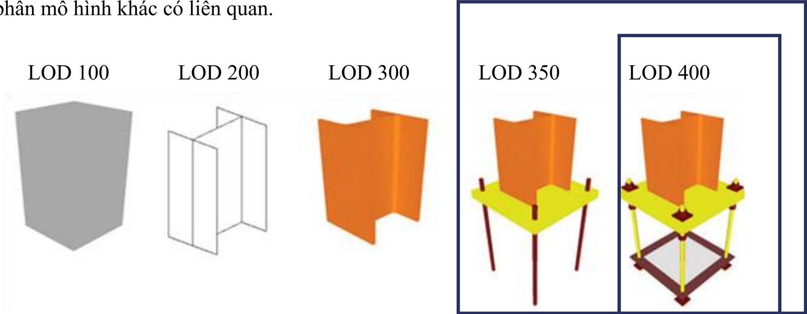

## 4.1.1. Mức độ phát triển thông tin 100 (LOD 100)

Thành phần mô hình với LOD 100 có thể được thể hiện bằng đồ họa trong mô hình như một biểu tượng hoặc một hình khối chung, đại diện, đủ điều kiện đáp ứng được các yêu cầu kỹ thuật chung của công trình. Các thông tin liên quan đến giải pháp xây dựng, chi phí dự tính cho các thành phần mô hình chính cũng được đưa vào mô hình.

Các thành phần mô hình với LOD 100 thường được sử dụng trong giai đoạn lập ý tưởng thiết kế. Mô hình với LOD 100 có thể hỗ trợ cho việc lập khái toán ước tính chi phí dựa trên số liệu về diện tích xây dựng, số lượng phòng, số lượng mét vuông sàn…. Mô hình này cũng có thể được sử dụng để phân chia giai đoạn xây dựng và xác định thời gian tổng thể thực hiện dự án.

## 4.1.2. Mức độ phát triển thông tin 200 (LOD 200)

Các thành phần mô hình được thể hiện bằng đồ họa trong mô hình với các thể hiện tương đối về số lượng, kích thước, hình dạng tương đối và vị trí gần đúng. Các thông tin phi hình học cũng có thể được đưa vào các thành phần mô hình với LOD 200.

Các thành phần mô hình với LOD 200 đã được tính toán và phân tích sơ bộ thường được được sử dụng trong giai đoạn thiết kế cơ sở và các thông tin trong các thành phần mô hình với LOD 200 được xem xét là gần đúng. Mô hình này có thể sử dụng được để ước tính chi phí xây dựng, thống kê, sắp xếp và phân loại hệ thống trong công trình.

## 4.1.3. Mức độ phát triển thông tin 300 (LOD 300)

Các thành phần mô hình được thể hiện bằng đồ họa, chính xác về số lượng, kích thước, hình dạng, vị trí và hướng. Các thông tin phi hình học cũng có thể được đưa vào các thành phần mô hình với LOD 200.

Số lượng, kích thước, hình dạng, vị trí và hướng của các thành phần được thiết kế có thể được do trực tiếp từ mô hình mà không cần tham chiếu các ghi chú, chỉ dẫn. Các thành phần mô hình với LOD 300 thể hiện các thông tin đã được tính toán và phân tích phù hợp với hệ thống tiêu chuẩn xây dựng áp dụng cho dự án, phù hợp với giai đoạn thiết kế kỹ thuật. Mô hình thông tin với LOD 300 phải cung cấp đủ thông tin để bóc tách khối lượng dự toán, dùng được để thống kê, phân loại, sắp xếp, phân chia các giai đoạn thi công.

## 4.1.4. Mức độ phát triển thông tin 350 (LOD 350)

Các thành phần mô hình được thể hiện chính xác bằng đồ họa tạo thành một hệ thống cụ thể, các thành phần mô hình thể hiện rõ về số lượng, kích thước, hình dạng, vị trí, hướng và sự liên kết với các hệ thống khác trong công trình. Các thông tin phi hình học cũng có thể được đưa vào các thành phần mô hình với LOD 350.

Với LOD 350 các bộ phận cần thiết cho sự phối hợp giữa các bộ môn và các hệ thống liên quan được thể hiện chính xác, các phần này sẽ bao gồm các chi tiết hỗ trợ hoặc chờ kết nối. Số lượng, kích thước, hình dạng, vị trí và hướng của các thành phần được thiết kế có thể đo được trực tiếp từ mô hình mà không cần tham chiếu các ghi chú, chỉ dẫn.

LOD 350 cho thấy các thông tin trong các thành phần mô hình phải chính xác và đầy đủ để phù hợp với giai đoạn triển khai bản vẽ thi công. Cung cấp đủ thông tin để bóc tách khối lượng dự toán chính xác và xuất đầy đủ các tài liệu thi công xây dựng và phân chia các giai đoạn thi công.

## 4.1.5. Mức độ phát triển thông tin 400 (LOD 400)

Các thành phần mô hình được thể hiện bằng đồ họa như một hệ thống cụ thể, các đối tượng và các bộ phận có số lượng, kích thước, hình dạng, vị trí, hướng với thông tin chi tiết cho chế tạo và lắp đặt. Các thông tin phi hình học cũng có thể được đưa vào các thành phần mô hình với LOD 400.

Các thành phần với LOD 400 được thể hiện với độ chi tiết chính xác để chế tạo và lắp đặt. Số lượng, kích thước, hình dạng, vị trí, và hướng của các bộ phận được thiết kế có thể được do trực tiếp từ mô hình mà không cần tham chiếu từ các ghi chú, chỉ dẫn.

Ở mức độ này mô hình được hiểu là mô hình thi công vì vậy phải sát thực với biện pháp thi công xây lắp. Thông qua mô hình xuất ra các tài liệu phục vụ cho gia công chế tạo và xác định khối lượng vật liệu, thiết bị cần thiết cho công trình với độ chính xác cao. Mô hình ở mức độ này thể hiện chi tiết đến biện pháp thi công và có thể cả các thông tin về phương tiện máy móc thi công.

## 4.2. Tổ chức thông tin của LOD

## 4.2.1. Phương pháp triển khai

Tất cả các thành phần công trình được liệt kê trong một Bảng thành phần mô hình. Các thành phần công trình này được giả định với LOD theo yêu cầu và được ghi trong bảng.

LOD của mỗi thành phần trong mô hình có thể khác nhau trong cùng một giai đoạn thiết kế hoặc căn cứ theo yêu cầu của việc ứng dụng BIM khác nhau.

Ví dụ: Nếu bảng liệt kê các cửa trong nhà với LOD 200 trong một mô hình nhất định, thì tất cả các cửa trong mô hình được giả định ở LOD 200.

## 4.2.2. Thiết lập yêu cầu đặc tính kỹ thuật của LOD

Mỗi thành phần mô hình thông thường chứa hai loại thông tin:

- -Thông tin hình học của các thành phần là các thông tin có thể nhìn thấy được.
- -Thông tin phi hình học là các thuộc tính số và (hoặc) các văn bản liên quan (vật liệu, cường độ, ngày tháng sản xuất và thi công…) và không thể nhìn thấy.

Do vậy, đặc tính kỹ thuật LOD sẽ bao gồm hai phần: thành phần hình học và thành phần thuộc tính được liên kết (phi hình học).

## 4.2.2.1. Thành phần hình học

Thành phần hình học bao gồm các mô tả kỹ thuật và được minh họa cụ thể với các thành phần mô hình và yêu cầu về mức độ phát triển. Trong Bảng thành phần mô hình sẽ thể hiện danh mục toàn bộ các thành phần của công trình. Mỗi thành phần mô hình sẽ thể hiện chi tiết tương ứng với các mức độ phát triển khác nhau của thành phần đó.

Mẫu bảng thành phần mô hình xem Bảng 4.1.

Bảng 4.1 Kết cấu bảng thành phần mô hình

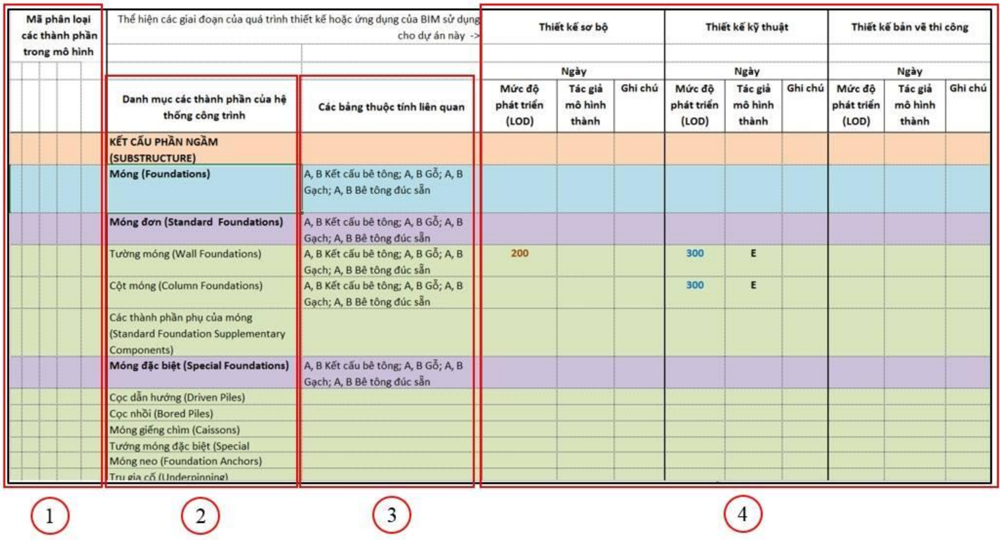

## Trong đó:

- 1 - Mã phân loại của thành phần công trình.
- 2 - Các thành phần mô hình cho công trình.
- 3 - Danh mục các thành phần của hệ thống công trình.
- 4 - Thể hiện các bảng thuộc tính sẽ được tham chiếu tương ứng với các thành phần của công trình.
- 5 - Các mốc giai đoạn của quá trình thiết kế hoặc thi công hoặc ứng dụng BIM.

Trong Bảng thành phần mô hình cần liệt kê các bảng thuộc tính liên quan cho mỗi thành phần và dẫn chiếu đến các bảng khác có chứa các thông tin thuộc tính cho các hệ thống liên quan tương ứng. Người dùng có thể thêm các bảng thuộc tính cho các chi tiết cụ thể.

Thông tin trong các mốc thực hiện bao gồm: mức độ phát triển, tác giả của thành phần mô hình, ghi chú. Tác giả của thành phần mô hình là bên chịu trách nhiệm phát triển các chi tiết của một thành phần mô hình cụ thể, đó có thể là kiến trúc sư hoặc kỹ sư…

Bảng thành phần mô hình thể hiện các mốc chuẩn cho việc hoàn thành các giai đoạn thiết kế truyền thống cũng như các mốc thời gian cụ thể của dự án để đánh giá, chuyển giao các tài liệu cụ thể, các ứng dụng khác của BIM trong dự án. Người dùng có thể sửa đổi và thêm các cột mốc khi cần thiết cho phù hợp với yêu cầu. Khi các cột mốc cho một dự án đã được xác địnhs, nên được sắp xếp theo thứ tự logich để dễ dàng theo dõi mức độ phát triển cho các thành phần mô hình.

## 4.2.2.2. Thành phần thuộc tính được liên kết (phi hình học)

Bảng thuộc tính, có chứa các thông tin thuộc tính của các thành phần công trình khác nhau. Ví dụ Bảng thuộc tính xem Bảng 4.2

Bảng 4.2 Ví dụ bảng thuộc tính thành phần

| A, B - Kt cãu thép                                                             |                                                                             |          |                          |                          |                           |                           |                           |                           |                                            |                                            |
|--------------------------------------------------------------------------------|-----------------------------------------------------------------------------|----------|--------------------------|--------------------------|---------------------------|---------------------------|---------------------------|---------------------------|--------------------------------------------|--------------------------------------------|
| Thuc tính ca s                                                                 |                                                                             |          | Phān 1 - Mô tá thuc tính | Phān 1 - Mô tá thuc tính | Phàn 2 - Mc đô phát trién | Phàn 2 - Mc đô phát trién | Phàn 2 - Mc đô phát trién | Phàn 2 - Mc đô phát trién | Phàn 3 - Các mc quan trong ca d án (Ví dy) | Phàn 3 - Các mc quan trong ca d án (Ví dy) |
| Thuôc tính thêm                                                                |                                                                             |          |                          |                          |                           |                           |                           |                           | Dyr toán Dyr toán                          | Dyr toán Dyr toán                          |
| Thuôc tính                                                                     | Kiu dū lięu                                                                 | Đon vi   | Ví dų lua chon           | Lòi chú thích            | 100 200 300 350 400       |                           |                           |                           | So bô                                      | Dáu thāu                                   |
| Loąl và kich thưc hinh dang tiu chuán (Shape Type & Size)                      | Xâu ký ty                                                                   | Ký ty    | HEA300,...               |                          |                           | x                         | x                         | x                         |                                            |                                            |
| Chju lira (Fireproofed)                                                        |                                                                             | Đúng/sai |                          |                          |                           | x                         | x                         | x                         |                                            |                                            |
| Trong lung đon vi (Weight Unit)                                                | Do luròng                                                                   |          |                          |                          |                           |                           |                           |                           |                                            |                                            |
| Vât liu (Material Grade)                                                       | Xâu ký ty                                                                   | Ký ty    | A992,..                  |                          |                           |                           | x                         | x                         |                                            |                                            |
| Lóp son phù (Coating)                                                          | Xâu ký ty                                                                   | Ký ty    | Ma kěm,.....             |                          |                           |                           |                           |                           |                                            |                                            |
| Kt cáu thép kién trúc không che phù (Archtectural Exposed Structural Steel)    | Kt cáu thép kién trúc không che phù (Archtectural Exposed Structural Steel) | Đúng/sai |                          |                          |                           |                           |                           |                           |                                            |                                            |
| Ső thú ty ché tao (Fabrication Sequence Number)                                | Só nguyên                                                                   | só       |                          |                          |                           |                           | x                         | x                         |                                            |                                            |
| Ngày tháng - Phát hành cho sån xuát (Date - Issued For Construct Ngày tháng    |                                                                             |          |                          |                          |                           |                           |                           |                           |                                            |                                            |
| Ngày tháng Cháp thut (Date - Permited)                                         | Ngày tháng                                                                  |          |                          |                          |                           |                           |                           |                           |                                            |                                            |
| Ngày tháng - Nhân bån vě chi tiét (Date - recieved for Shop Detaili Ngày tháng |                                                                             |          |                          |                          |                           |                           |                           |                           |                                            |                                            |
| Ngày tháng - Båt đàu sán xuát (Fabrication Start)                              | Ngày tháng                                                                  |          |                          |                          |                           |                           |                           |                           |                                            |                                            |
| Ngày tháng - Két thúc sån xuát (Date - Fabrication End)                        | Ngày tháng                                                                  |          |                          |                          |                           |                           |                           |                           |                                            |                                            |
| Ngày tháng - Vn chuyén (Date - Fabrication Shipped)                            | Ngày tháng                                                                  |          |                          |                          |                           |                           |                           |                           |                                            |                                            |
| Ngày tháng - Nhn hàng (Date - Fabrication Received)                            | Ngày tháng                                                                  |          |                          |                          |                           |                           |                           |                           |                                            |                                            |
| Ngày - Lap durng (Date - Erection)                                             | Ngày tháng                                                                  |          |                          |                          |                           |                           |                           |                           |                                            |                                            |
| Ngày - Nghim thu (Date - Inspected)                                            | Ngày tháng                                                                  |          |                          |                          |                           |                           |                           |                           |                                            |                                            |

Kết cấu Bảng thuộc tính thành phần bao gồm 3 phần:

Phần 1 - Mô tả thuộc tính: Bao gồm liệt kê các thuộc tính liên quan đến thành phần mô hình tương ứng (ví dụ như các thuộc tính cho kết cấu bê tông, các thuộc tính cho hệ thống điều hòa thông gió…), kiểu dữ liệu của thuộc tính, đơn vị, ví dụ cho người dùng lựa chọn và lời chú thích hoặc bình luận để diễn giải cho thuộc tính. Thuộc tính được nhóm thành 2 loại: Thuộc tính cơ sở là danh sách các thuộc tính phổ biến khi không có các yêu cầu khác được biết đến. Thuộc tính bổ sung là danh sách các thuộc tính có thể xem xét đưa thêm vào các thành phần mô hình.

Phần 2 - mức độ phát triển: phần này liên quan đến các yêu cầu thuộc tính với mức độ phát triển từ bảng thành phần mô hình. Các thuộc tính với mức độ phát triển đã được điền trước cho thấy mối tương quan giữa các thuộc tính và đặc tính kỹ thuật của mức độ phát triển. Dấu 'x' được nhập vào các ô để thể hiện yêu cầu thuộc tính này tại một mức độ phát triển nhất định, hay tại một giai đoạn nhất định của dự án.

Phần 3 - Các mốc quan trọng của dự án: được sử dụng để đánh dấu các thuộc tính nào sẽ cần thiết cho mốc nào của dự án và các thông tin chuyển giao giữa các giai đoạn sẽ được cụ thể hóa. Người dùng có thể tùy chỉnh các cột mốc trong bảng phù hợp với các cột mốc mà đã tạo ra trong bảng thành phần mô hình.

Tùy theo yêu cầu của dự án, nhóm thực hiện dự án sẽ xác định các thuộc tính yêu cầu, có một số cách xác định các thuộc tính như sau:

- -Các bên tham gia trong dự án sẽ thống nhất danh sách các thuộc tính và mối tương quan với các mức độ phát triển thông tin theo thông lệ chung phổ biến.
- -Các bên tham trong dự án xem xét mối tương quan giữa các thuộc tính và mức độ phát triển thông tin để chỉnh sửa 'Phần 2 - Mức độ phát triển' theo yêu cầu cụ thể của dự án.

- -Các bên tham gia trong dự án xác định các mốc quan trọng mới và yêu cầu về thuộc tính tại các mốc này. Điều này cho phép các bên tham gia có được sự linh hoạt trong việc xác định yêu cầu về số lượng thuộc tính.

## TÀI LIỆU THAM KHẢO

- [1] ISO (the International Organization for Standardization), BS EN ISO 19650-2:2018 -  Organization and  digitization  of  information  about  buildings  and  civil  engineering  works,  including  building information modelling (BIM) - Information management using building information modelling Part 2: Delivery phase of the assets
- [2] UK BIM Framework, Information management according to BS EN ISO 19650 Guidance Part 2: Parties, teams and processes for the delivery phase of the assets , Editition 5, September 2020
- [3] CDE  Sub  Group, Asset  Information  Management  -  Common  Data  Environment:  Functional Requirements, UK Government BIM Working Group , 2018
- [4] Building and Construction Authority, Singapore BIM Guide version 2, 2013
- [5] BIM Acceleration Committee, The New Zealand BIM Handbook - A guide to enabling BIM on built assets , 2019 third edition
- [6] Sacks,  Gurevich,  Shrestha, A  review  of  Building  Information  Modeling  protocols,  guides  and standards for Large construction , 2016
- [7] Turner & Townsend, Employers Information Requirements (EIR's) for Cambridge Assessment , 2015
- [8] The Building Information Foundation RTS, Common BIM Requirements 2012 , 2012
- [9] NBS, NBS BIM Object Standard , version 2.1, 2019
- [10] buildingSMART Finland (bSF), Common InfraBIM Requirements YIV, 2019