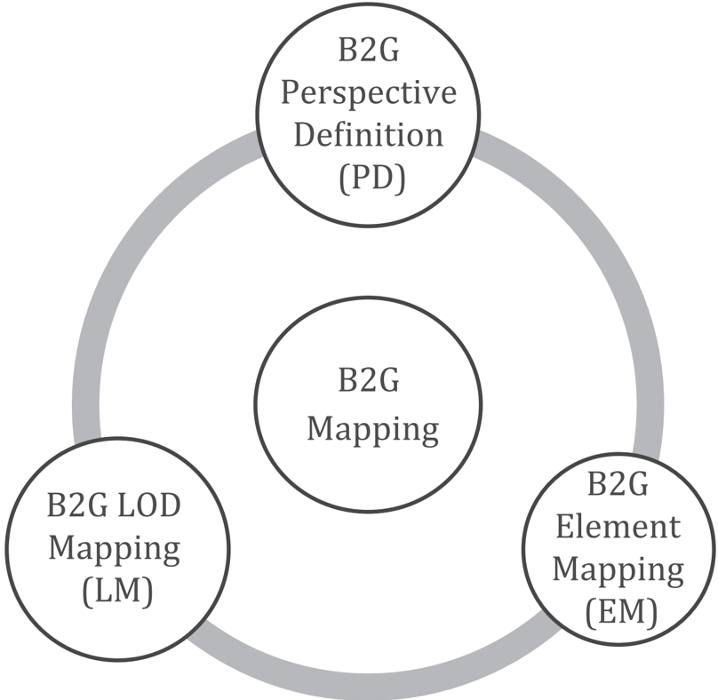
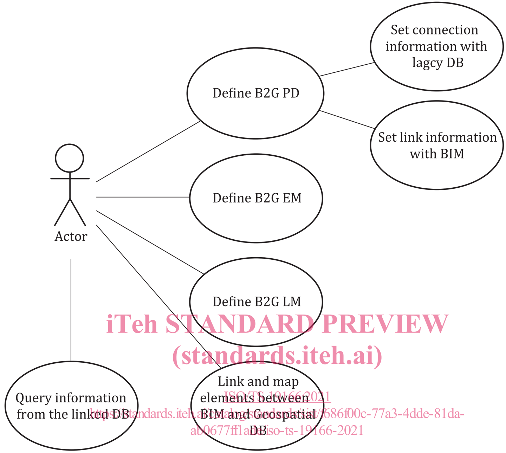
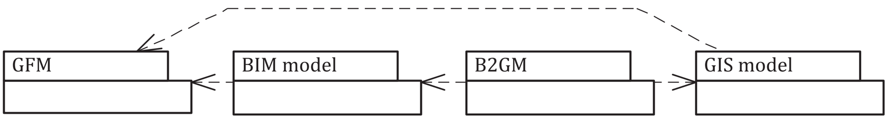

TECHNICAL

SPECIFICATION

First edition 2021-05

## Geographic information - BIM to GIS conceptual mapping (B2GM)

Information géographique - Cartographique conceptuelle de BIM à GIS (B2GM)

## iTeh STANDARD PREVIEW (standards.iteh.ai)

ISO/TS 19166:2021 https://standards.iteh.ai/catalog/standards/sist/f686f00c-77a3-4dde-81daab0677ff1ade/iso-ts-19166-2021

## ©  ISO 2021

All rights reserved. Unless otherwise specified, or required in the context of its implementation, no part of this publication may be reproduced or utilized otherwise in any form or by any means, electronic or mechanical, including photocopying, or posting on the internet or an intranet, without prior written permission. Permission can be requested from either ISO at the address below or ISO's member body in the country of the requester.

ISO copyright office CP 401 · Ch. de Blandonnet 8 CH-1214 Vernier, Geneva Phone: +41 22 749 01 11 Email: copyright@iso.org Website: www.iso.org

Published in Switzerland

## iTeh STANDARD PREVIEW

## (standards.iteh.ai)

ISO/TS 19166:2021 https://standards.iteh.ai/catalog/standards/sist/f686f00c-77a3-4dde-81daab0677ff1ade/iso-ts-19166-2021

## COPYRIGHT PROTECTED DOCUMENT

## Contents

## ISO/TS 19166:2021(E)

Page

| Foreword ........................................................................................................................................................................................................................................   | Foreword ........................................................................................................................................................................................................................................                             | Foreword ........................................................................................................................................................................................................................................                             | iv                                                                                                                  |
|-----------------------------------------------------------------------------------------------------------------------------------------------------------------------------------------------------------------------------------------------------|-------------------------------------------------------------------------------------------------------------------------------------------------------------------------------------------------------------------------------------------------------------------------------|-------------------------------------------------------------------------------------------------------------------------------------------------------------------------------------------------------------------------------------------------------------------------------|---------------------------------------------------------------------------------------------------------------------|
| Introduction ..................................................................................................................................................................................................................................     | Introduction ..................................................................................................................................................................................................................................                               | Introduction ..................................................................................................................................................................................................................................                               | v                                                                                                                   |
| 1                                                                                                                                                                                                                                                   | Scope .................................................................................................................................................................................................................................                                       | Scope .................................................................................................................................................................................................................................                                       | 1                                                                                                                   |
| 2                                                                                                                                                                                                                                                   | Normative references ......................................................................................................................................................................................                                                                   | Normative references ......................................................................................................................................................................................                                                                   | 1                                                                                                                   |
| 3                                                                                                                                                                                                                                                   | Terms and definitions .....................................................................................................................................................................................                                                                   | Terms and definitions .....................................................................................................................................................................................                                                                   | 2                                                                                                                   |
| 4                                                                                                                                                                                                                                                   | Abbreviated terms and notation ..........................................................................................................................................................                                                                                     | Abbreviated terms and notation ..........................................................................................................................................................                                                                                     | 4                                                                                                                   |
|                                                                                                                                                                                                                                                     | 4.1                                                                                                                                                                                                                                                                           | Abbreviated terms ...............................................................................................................................................................................                                                                             | 4                                                                                                                   |
|                                                                                                                                                                                                                                                     | 4.2                                                                                                                                                                                                                                                                           | UML Notation ...........................................................................................................................................................................................                                                                      | 4                                                                                                                   |
| 5                                                                                                                                                                                                                                                   | Conformance .............................................................................................................................................................................................................                                                     | Conformance .............................................................................................................................................................................................................                                                     | 5                                                                                                                   |
| 6                                                                                                                                                                                                                                                   | Conceptual Framework for BIM to GIS mapping .................................................................................................................                                                                                                                 | Conceptual Framework for BIM to GIS mapping .................................................................................................................                                                                                                                 | 5                                                                                                                   |
|                                                                                                                                                                                                                                                     | 6.1                                                                                                                                                                                                                                                                           | General ...........................................................................................................................................................................................................                                                           | 5                                                                                                                   |
|                                                                                                                                                                                                                                                     | 6.2                                                                                                                                                                                                                                                                           | Conceptual overview .........................................................................................................................................................................                                                                                 | 5                                                                                                                   |
|                                                                                                                                                                                                                                                     | 6.3                                                                                                                                                                                                                                                                           | Mechanisms ...............................................................................................................................................................................................                                                                    | 6                                                                                                                   |
| 7                                                                                                                                                                                                                                                   | BIM to GIS perspective definition ........................................................................................................................................................                                                                                    | BIM to GIS perspective definition ........................................................................................................................................................                                                                                    | 9                                                                                                                   |
|                                                                                                                                                                                                                                                     | General ...........................................................................................................................................................................................................                                                           | General ...........................................................................................................................................................................................................                                                           | 9                                                                                                                   |
|                                                                                                                                                                                                                                                     | 7.1 7.2                                                                                                                                                                                                                                                                       | Mechanisms ...............................................................................................................................................................................................                                                                    | 9                                                                                                                   |
|                                                                                                                                                                                                                                                     |                                                                                                                                                                                                                                                                               | 7.2.1 Data view ................................................................................................................................................................................                                                                              | 9                                                                                                                   |
|                                                                                                                                                                                                                                                     |                                                                                                                                                                                                                                                                               | 7.2.2 Logic view ...........................................................................................................................................................................10                                                                                |                                                                                                                     |
|                                                                                                                                                                                                                                                     |                                                                                                                                                                                                                                                                               | 7.2.3 Style view ............................................................................................................................................................................10 iTeh STANDARD PREVIEW                                                         |                                                                                                                     |
| 8                                                                                                                                                                                                                                                   | BIM to GIS element mapping ................................................................................................................................................................. (standards.iteh.ai)                                                              | BIM to GIS element mapping ................................................................................................................................................................. (standards.iteh.ai)                                                              | 11                                                                                                                  |
|                                                                                                                                                                                                                                                     | 8.1                                                                                                                                                                                                                                                                           | General ........................................................................................................................................................................................................11                                                            |                                                                                                                     |
|                                                                                                                                                                                                                                                     | 8.2                                                                                                                                                                                                                                                                           | Mechanism ...............................................................................................................................................................................................12 ISO/TS 19166:2021                                                 |                                                                                                                     |
| 9                                                                                                                                                                                                                                                   | BIM to GIS LOD Mapping ............................................................................................................................................................................ https://standards.iteh.ai/catalog/standards/sist/f686f00c-77a3-4dde-81da- | BIM to GIS LOD Mapping ............................................................................................................................................................................ https://standards.iteh.ai/catalog/standards/sist/f686f00c-77a3-4dde-81da- | 13                                                                                                                  |
|                                                                                                                                                                                                                                                     | 9.1                                                                                                                                                                                                                                                                           | General ........................................................................................................................................................................................................13 ab0677ff1ade/iso-ts-19166-2021                             |                                                                                                                     |
|                                                                                                                                                                                                                                                     | 9.2                                                                                                                                                                                                                                                                           | Mechanism ...............................................................................................................................................................................................14                                                                   |                                                                                                                     |
| Annex A (normative) Abstract test suite .......................................................................................................................................................                                                     | Annex A (normative) Abstract test suite .......................................................................................................................................................                                                                               | Annex A (normative) Abstract test suite .......................................................................................................................................................                                                                               | 16                                                                                                                  |
| Annex B (informative) B2G EM and LM example ...................................................................................................................................                                                                     | Annex B (informative) B2G EM and LM example ...................................................................................................................................                                                                                               | Annex B (informative) B2G EM and LM example ...................................................................................................................................                                                                                               | 18                                                                                                                  |
| Annex (informative)                                                                                                                                                                                                                                 | C                                                                                                                                                                                                                                                                             | Instance example using B2G PD                                                                                                                                                                                                                                                 | ................................................................................................................ 20 |
| Annex D (informative) CityGML LOD model and mapping ..........................................................................................................                                                                                      | Annex D (informative) CityGML LOD model and mapping ..........................................................................................................                                                                                                                | Annex D (informative) CityGML LOD model and mapping ..........................................................................................................                                                                                                                | 21 23                                                                                                               |
| Annex E (informative) LOD mapping rule description example ...........................................................................................                                                                                              | Annex E (informative) LOD mapping rule description example ...........................................................................................                                                                                                                        | Annex E (informative) LOD mapping rule description example ...........................................................................................                                                                                                                        |                                                                                                                     |
| Bibliography .............................................................................................................................................................................................................................          | Bibliography .............................................................................................................................................................................................................................                                    | Bibliography .............................................................................................................................................................................................................................                                    | 24                                                                                                                  |

## Foreword

ISO (the International Organization for Standardization) is a worldwide federation of national standards bodies (ISO member bodies). The work of preparing International Standards is normally carried out through ISO technical committees. Each member body interested in a subject for which a technical committee  has  been  established  has  the  right  to  be  represented  on  that  committee.  International organizations, governmental and non-governmental, in liaison with ISO, also take part in the work. ISO  collaborates  closely  with  the  International  Electrotechnical  Commission  (IEC)  on  all  matters  of electrotechnical standardization.

The procedures used to develop this document and those intended for its further maintenance are described in the ISO/IEC Directives, Part 1. In particular, the different approval criteria needed for the different types of ISO documents should be noted. This document was drafted in accordance with the editorial rules of the ISO/IEC Directives, Part 2 (see www  .iso  .org/  directives).

Attention is drawn to the possibility that some of the elements of this document may be the subject of patent rights. ISO shall not be held responsible for identifying any or all such patent rights. Details of any patent rights identified during the development of the document will be in the Introduction and/or on the ISO list of patent declarations received (see www  .iso  .org/  patents).

Any trade name used in this document is information given for the convenience of users and does not constitute an endorsement.

For  an  explanation  of  the  voluntary  nature  of  standards,  the  meaning  of  ISO  specific  terms  and expressions  related  to  conformity  assessment,  as  well  as  information  about  ISO's  adherence  to  the World Trade Organization (WTO) principles in the Technical Barriers to Trade (TBT), see www  .iso  .org/ iso/  foreword  .html. iTeh STANDARD PREVIEW (standards.iteh.ai)

This document was prepared by Technical Committee ISO/TC 211, Geographic information/Geomatics .

ISO/TS 19166:2021

Any feedback or questions on this document should be directed to the user's national standards body. A complete listing of these bodies can be found at www  .iso  .org/  members  .html. https://standards.iteh.ai/catalog/standards/sist/f686f00c-77a3-4dde-81daab0677ff1ade/iso-ts-19166-2021

## Introduction

Building Information Modelling (BIM) contains rich information related to building elements such as doors, walls, windows, MEP (mechanical, electrical, and plumbing) and others. In addition, BIM models may  include  information  about  other  features  than  buildings,  which  are  relevant  to  GIS.  From  the viewpoint of GIS, there are many benefits related to using BIM information in GIS applications. Some examples are:

- a) Indoor service implementation such as emergency management (routing, evacuation path finding under fire situation).
- b) Outdoor - indoor linkage service, such as seamless navigation.
- c) Effective facility/energy/environment management considering objects related BIM based on GIS.

Although there have been some attempts to harvest the rich information contained in BIM models and use it in GIS, there is no established way to map the information elements between the two modelling worlds. A proper mapping method is clearly required. Before the implementation of the information mapping, however, mapping mechanisms for linking appropriate information elements from BIM to GIS need to be clearly defined. In addition, for the mapping mechanisms to work together, a conceptual framework  for  the  mapping  process  based  on  open  standards  between  BIM  and  GIS  needs  to  be established.

This document provides the conceptual framework for BIM to GIS information mapping and required mapping mechanisms.

## iTeh STANDARD PREVIEW

A brief explanation of each mapping mechanism follows: (standards.iteh.ai)

- -BIM  to  GIS  Perspective  Definition  (B2G  PD):  supports  perspective  information  representation depending on the specific requirement such as the urban facility management (UFM). "Perspective" depends on the use-case. For example, to manage the urban facilities, the required data should be collected  from  the  various  data  sources,  including  BIM  model,  and  transformed  to  represent  in user-specific perspective. PD defines a Data View to extract the data required and transform the information from the various data sources. ISO/TS 19166:2021 https://standards.iteh.ai/catalog/standards/sist/f686f00c-77a3-4dde-81daab0677ff1ade/iso-ts-19166-2021
- -BIM to GIS Element Mapping (B2G EM): supports the element mapping from BIM model to GIS model. As the BIM and GIS model schemas are different, B2G EM requires a mapping rule specifying how to transform from a BIM model to GIS model element.
- -BIM to GIS LOD Mapping (B2G LM): supports the LOD mapping from BIM model to GIS model. LOD (levels  of  detail)  in  GIS  is  a  deliberate  choice  of  data  included/excluded  from  a  model  to  satisfy certain  use  cases  including  visualization.  The  relevant  geometric  and  other  information  for  the LODs required in the target GIS model need to be extracted/or queried from the BIM model. This can be defined by the LOD mapping ruleset.

This document is applicable to information query services such as urban facility management operation. BIM object visualization in GIS and other application services that require query processing depending on the relationship between BIM and GIS objects, either in the real or virtual world, will be able to use the mechanisms defined in this document for mapping the required information elements between the two systems. Although this document describes mapping information elements from BIM to GIS in general, the primary concern of this document is mapping BIM models to GIS models for visualization.

The conceptual mapping mechanism defined in this document uses existing international standards such  as  Geography  Markup  Language  (GML)  (ISO  19136-1)  and  Industry  Foundation  Classes  (IFC) (ISO  16739-1).  The  Open  Geospatial  Consortium  (OGC)'s  Land  and  Infrastructure  Conceptual  Model Standard (LandInfra) (OGC 15-111r1) defines the information model of infrastructure such as roads. As LandInfra has been designed with a common conceptual model between the BIM and GIS communities, transferring information from LandInfra BIM models to LandInfra GIS models should be reasonably straight forward. This document, therefore, concentrates on mapping from BIM models not based on LandInfra.

## iTeh STANDARD PREVIEW

## (standards.iteh.ai)

ISO/TS 19166:2021 https://standards.iteh.ai/catalog/standards/sist/f686f00c-77a3-4dde-81daab0677ff1ade/iso-ts-19166-2021

## Geographic information - BIM to GIS conceptual mapping (B2GM)

## 1 Scope

This document defines the conceptual framework and mechanisms for mapping information elements from  Building  Information  Modelling  (BIM)  to  Geographic  Information  Systems  (GIS)  to  access  the required information based on specific user requirements.

The conceptual framework for mapping BIM information to GIS is defined with the following three mapping mechanisms:

- -BIM to GIS Perspective Definition (B2G PD);
- -BIM to GIS Element Mapping (B2G EM);
- -BIM to GIS LOD Mapping (B2G LM).

This  document  does  not  describe  physical  schema  integration  or  mapping  between  BIM  and  GIS models because the physical schema integration or mapping between two heterogeneous models is very complex and can cause a variety of ambiguity problems. Developing a unified information model between BIM and GIS is a desirable goal, but it is out of the scope of this document. iTeh STANDARD PREVIEW

The scope of this document includes the following: (standards.iteh.ai)

- -definition for BIM to GIS conceptual mapping requirement description; ISO/TS 19166:2021
- -definition of BIM to GIS conceptual mapping framework and component; https://standards.iteh.ai/catalog/standards/sist/f686f00c-77a3-4dde-81daab0677ff1ade/iso-ts-19166-2021
- -definition of mapping for export from one schema into another.

The following concepts are outside the scope:

- -definition of any particular mapping application requirement and mechanism;
- -bi-directional mapping method between BIM and GIS;
- -definition of physical schema mapping between BIM and GIS;
- -definition of coordinate system mapping between BIM and GIS.

NOTE For cases involving requirements related to Geo-referencing for providing the position and orientation of  the  BIM  model  based  on  GIS,  there  exist  other  standards  such  as  ISO  19111  and  the  Information  Delivery Manual (IDM) from buildingSMART on Geo-referencing BIM.

- -definition of relationship mapping between BIM and GIS;
- -implementation of the application schema.

## 2 Normative references

The following documents are referred to in the text in such a way that some or all of their content constitutes  requirements of this document. For dated references, only the edition cited applies. For undated references, the latest edition of the referenced document (including any amendments) applies.

ISO 19103, Geographic information - Conceptual schema language

ISO 19107, Geographic information - Spatial schema

## ISO/TS 19166:2021(E)

ISO 19109, Geographic information - Rules for application schema

## 3 Terms	and	definitions

For the purposes of this document, the following terms and definitions apply.

ISO and IEC maintain terminological databases for use in standardization at the following addresses:

- -ISO Online browsing platform: available at https://  www  .iso  .org/  obp
- -IEC Electropedia: available at http://  www  .electropedia  .org/

## 3.1

## application

manipulation and processing of data in support of user requirements

[SOURCE: ISO 19101-1:2014, 4.1.1]

## 3.2

## application schema

conceptual schema for data required by one or more applications (3.1)

[SOURCE: ISO 19101-1:2014, 4.1.2]

## 3.3

## class

&lt;UML&gt;  description  of  a  set  of objects (3.9)  that  share  the  same  attributes,  operations,  methods, relationships and semantics (standards.iteh.ai)

## iTeh STANDARD PREVIEW

## ISO/TS 19166:2021

[SOURCE: ISO 19103:2015, 4.7, modified - &lt;UML&gt; domain has been added to the entry.]

## 3.4

## complex feature

https://standards.iteh.ai/catalog/standards/sist/f686f00c-77a3-4dde-81daab0677ff1ade/iso-ts-19166-2021

feature (3.6) composed of other features

[SOURCE: ISO 19109:2015, 4.3]

## 3.5

## element

&lt;BIM&gt; component including geometry, property, method, and relationship in a BIM or GIS model (3.8).

EXAMPLE In  BIM,  site,  building,  wall,  door,  and  room  are  examples  of  elements,  whereas  in  a  GIS,  site, building, wall, room with infrastructure such as road, and bridge are examples of elements.

## 3.6

## feature

abstraction of real-world phenomena

Note 1 to entry: A feature composed of other features is called a " complex feature " (3.4).

[SOURCE: ISO 19101-1:2014, 4.1.11, modified - Note 1 to entry modified.]

## level of detail

## 3.7 LOD

alternate representations of an object (3.9) at varying fidelities based on specific criteria

Note 1 to entry: The levels of detail concept of CityGML is widely accepted by the market and by the scientific community. The term 'LODX model' (X = {0, 1, 2, 3, 4}) is frequently used to address the complexity of existing city models (3.8)  and their suitability for specific applications (3.1).  Buildings are represented by non-vertical polygons,  either  at  roof  or  at  footprint  level.  In  LOD1,  volume  objects  such  as  buildings  are  modelled  in  a generalized way as prismatic block models with vertical walls and horizontal 'roofs'. In LOD2, the (prototypic) roof shape of buildings is represented, as well as thematic ground, wall, and roof surfaces along with additional structures such as balconies and dormers. LOD3 is the most detailed level for the outermost shape of objects. For buildings, openings are added as thematic objects. In LOD4, interior structures (rooms, etc.) are added to the most accurate outer representation, which is called LOD4 but almost identically to the LOD3 outer surface.

Note 2 to entry: It is important to note the distinction between the term LOD (levels of detail) in GIS usage and the term LOD in BIM LOD (Level of Development). LOD in GIS is a deliberate choice of data included/excluded from a model to satisfy certain use cases including visualization. LOD in BIM refers to the maturity of the planning process of the real-world object modelled.

[SOURCE: ISO/IEC 18023-1:2006, 3.1.8, modified - Notes 1 and 2 to entry modified.]

## 3.8 model

abstraction of some aspects of reality

## [SOURCE: ISO 19109:2015, 4.15] iTeh STANDARD PREVIEW

## 3.9 (standards.iteh.ai)

## object

&lt;UML&gt; object entity with a well-defined boundary and identity that encapsulates state and behaviour [SOURCE: ISO 19103:2015, 4.25, modified - &lt;UML&gt; domain has been added to the entry.] ISO/TS 19166:2021 https://standards.iteh.ai/catalog/standards/sist/f686f00c-77a3-4dde-81da-

## 3.10

## package

&lt;UML&gt; general purpose mechanism for organizing elements (3.5) into groups

[SOURCE: ISO 19103:2015, 4.27]

## 3.11 perspective

&lt;BIM&gt; definition of the necessary data and behaviours for the use case context

Note 1 to entry: perspective in the construction industry in general, and construction modelling in particular, is more like the common dictionary definition: 'the art of representing three-dimensional objects (3.9) on a twodimensional surface so as to give the right impression of their height, width, depth and position in relation to each other'.

Note 2 to entry: the use of 'perspective' in this document is similar to the BIM concept of 'model view', where 'Model View Definition' is 'A specification which identifies the properties and specifies the exchange requirements' - i.e. what the customer wants/needs in the model (3.8) at that stage.

## 3.12

## runtime

&lt;BIM&gt; element (3.5) consisting of code and data produced by the compilation of a source element

[SOURCE: ISO/IEC 1989:2014, 4.168, modified.]

ab0677ff1ade/iso-ts-19166-2021

## ISO/TS 19166:2021(E)

## 3.13 system

applications (3.1), services, information technology assets, or other information handling components

[SOURCE: ISO/IEC 29134:2017, 3.13]

## 3.14

## system property

customized system (3.13) settings used when automatically creating a model

EXAMPLE

GUID

## 4 Abbreviated terms and notation

## 4.1 Abbreviated terms

B2G EM

BIM to GIS element mapping

B2G LM

BIM to GIS LOD mapping

B2G PD

BIM to GIS perspective definition

B2G CM

BIM to GIS conceptual mapping

BIM

Building Information Modelling iTeh STANDARD PREVIEW

BIM model

Building Information Model (standards.iteh.ai)

B-rep

boundary representation

ETL

Extract/Transform/Load https://standards.iteh.ai/catalog/standards/sist/f686f00c-77a3-4dde-81da- ab0677ff1ade/iso-ts-19166-2021

FM

facility management

FK

foreign key

GIS

Geographic Information System

GIS model

Geographic Information System Model

GUID

Globally Unique Identifier

OBB

oriented bounding box

PD

perspective definition

PK

primary key

PSet

property set

UML

Unified Modelling Language

URI

Uniform Resource Identifier

ISO/TS 19166:2021

XML

Extensible Markup Language

## 4.2 UML Notation

In  this  document, conceptual schemas are presented in the Unified Modelling Language (UML). The user shall refer to ISO 19103 for the specific profile of UML used in this document.

## 5 Conformance

This document defines the requirements classes in Clauses 7, 8, and 9.

## 6 Conceptual Framework for BIM to GIS mapping

## 6.1 General

The BIM to GIS conceptual mapping (B2G CM) is the conceptual framework for object mapping from a BIM model to a GIS model which includes the transform ruleset related to class elements, LODs, and geometries.

B2G CM considers the following:

- -The way for users to design, predict and check the results of model integration explicitly.
- -The way for users to define, connect and integrate the data they need from a user perspective.
- -The way for users to exclude unnecessary data and determine the amount of data needed.

## 6.2 Conceptual overview

Figure  1  presents  a  conceptual  overview  of  B2G  CM  as  defined  in  this  document  and  presents  the relationship of the mapping mechanisms.

- -Perspective  definition  for  data  view.  Perspective  information  representation  depending  on  the specific use-cases such as user facility management. "Perspective" is dependent on the use-case to extract the needed data. PD consists of three mechanisms to extract the external data needed. (standards.iteh.ai)

## iTeh STANDARD PREVIEW

- -Element mapping from BIM to GIS model. To transform the elements from the BIM model to the GIS model, it is necessary to define the element mapping mechanism that transforms the BIM to GIS model elements. Element Mapping describes the mapping requirement definition related to the element mapping mechanism from the viewpoint of specific use cases. ISO/TS 19166:2021 https://standards.iteh.ai/catalog/standards/sist/f686f00c-77a3-4dde-81daab0677ff1ade/iso-ts-19166-2021
- -LOD definition and mapping from BIM model to GIS model. The LOD models define a visualization mechanism. However, there is no LOD schema in BIM objects defined in the BIM model, ISO 16739. To represent BIM geometry in a GIS, LOD information can need to be extracted from the BIM model.

Figure 1 - B2G CM Conceptual Overview

## 6.3 Mechanisms

Using the mapping framework defined in this document, it is possible to query the information from the linked database that utilizes the BIM information. Figure 2 shows use cases of querying information from an integrated database that includes both GIS and BIM information elements.

Figure 2 - Link database and integrated query based on B2G CM use cases

B2G CM supports BIM model-to-GIS model mapping under the BIM and GIS model requirement scope in Table 1. The geometry of the BIM and GIS models should be able to define the B-rep by referring to ISO 19109 GFM (general feature model) and ISO 19107 spatial schema, as shown in Figure 3.

Figure 3 - BIM and GIS model requirement

The minimum information requirements for BIM model-to-GIS model mapping by model package are defined in Table 1.