## TCVN TIÊU CHUÀN QUÓC GIA

## TCVN 14177-1:2024 Xut bn làn 1

## TÓ CHÚC VÀ SÓ HÓA THÔNG TIN VÊ CÔNG TRINH XÂY D'NG, BAO GOM MÔ HINH HÓA THÔNG TIN CÔNG TRINH (BIM) – QUÀN LÝ THÔNG TIN SÛ DUNG MÔ HINH HÓA THÔNG TIN CÔNG TRINH PHÀN 1: KHÁI NIM VÀ NGUYÊN TÁC

Organization and digitization of information about buildings and civil engineering works, including building information modelling (BIM) – Information management using building information modelling– Part 1: Concepts and principles

HÀ NI - 2024

## Mc lc

|                |                                                                      | Trang   |
|----------------|----------------------------------------------------------------------|---------|
| Li nói đàu..   | Li nói đàu..                                                         | 5       |
| Li giói thiu.. | Li giói thiu..                                                       | ..7     |
| 1              | Phm vi áp dng.                                                       | 9       |
| 2              | Tài liu vin dn..                                                     | 9       |
| 3              | Thut ng, đnh nghīa và ký hiu                                         | 9       |
| 3.1            | Thut ng chung...                                                     | 10      |
| 3.2            | Các thut ng liên quan đn tài sàn và d án.                            | .10     |
| 3.3            | Các thut ng liên quan đn quàn lý thông tin .                         | .12     |
| 4              | Thông tin tài sàn và thông tin d án, các quan đim và phi hp làm vic  | 14      |
| 4.1            | Nguyên tc.                                                           | .14     |
| 4.2            | Quàn ly thông tin theo b TCVN 14177.                                 | .15     |
| 4.3            | Các quan đim vè quàn lý thông tin ...                                | .16     |
| 5              | Xác đnh yêu cu thông tin và kt quà ca các mô hình thông tin..        | 17      |
|                | 5.1Nguyên tc..                                                       | .17     |
|                | 5.2Yêu cu thông tin t chc (OIR).                                     | .18     |
|                | 5.3 Yêu càu thông tin tài sàn (AIR).                                 | .19     |
|                | 5.4 Yêu càu thông tin d án (PIR).                                    | .19     |
|                | 5.5Yêu cu thông tin trao đi (EIR)                                    | .19     |
|                | 5.6 Mô hình thông tin tài sàn (AIM)                                  | ..20    |
|                | 5.7 Mô hinh thông tin d án (PIM)                                     | .20     |
| 6              | Chu k chuyn giao thông tin .                                         | .20     |
|                | 6.1 Nguyên tc..                                                      | ..20    |
|                | 6.2S liên kt vi vòng đi tài sàn..                                    | .20     |
|                | 6.3 Thit lp các yêu càu thông tin và k hoch chuyn giao thông tin ... | ..22    |
| 7              | Các chúc nǎng quàn lý thông tin d án và thông tin tài sn..           | .27     |
|                | 7.1 Nguyên tăc.                                                      | ..27    |
|                | 7.2Các chc nǎng quàn lý thông tin tài sàn                            | ..28    |
|                | 7.3 Các chúc năng quàn lý thông tin d án..                           | .28     |
|                | 7.4 Các chc năng quàn lý thông tin nhim v                            | .28     |
|                | Năng lc và kh năng ca nhóm chuyn giao.                               | 29      |
|                | 8.1 Nguyên tăc..                                                     | ..29    |
|                | 8.2 Đánh giá năng lc và khà nǎng                                     | ..29    |

## TCVN 14177-1:2024

## TCVN 14177-1:2024

Phi hp làm vic trong công-te-nơ thông tin ..

tin..

| 9                                                                                       |                                                                                         |     |
|-----------------------------------------------------------------------------------------|-----------------------------------------------------------------------------------------|-----|
| 10                                                                                      | K hoch chuyn giao thông tin...                                                          | .30 |
|                                                                                         | 10.1 Nguyên tc.                                                                         | .30 |
|                                                                                         | 10.2 Thi đim chuyn giao thông tin...                                                    |  31 |
| 10.3                                                                                    | Ma trn trách nhim..                                                                     | .31 |
| 10.4                                                                                    | Xác đnh chin lưc liên hp và cu trúc phân chia cho các công-te-nơ thông tin.             | .31 |
| 11                                                                                      | Quàn lý vic hp tác to lp thông tin...                                                   | .32 |
| 11.1                                                                                    | Nguyên tăc.                                                                             | .32 |
| 11.2                                                                                    | Mc đ nhu cu thông tin.                                                                  |  33 |
| 11.3                                                                                    | Chát lung thôngi tn....                                                                 |  33 |
| 12                                                                                      | Giài pháp và quy trinh môi trưng d liu chung (CDE).                                     | .33 |
| 12.1                                                                                    | Nguyên tc.                                                                              | .33 |
| 12.2                                                                                    | Trng thái công vic đang tin hành ..                                                     | .35 |
| 12.3                                                                                    | Quá trình chuyn đi kim tra/xem xét/phê duyt.                                            |  35 |
| 12.4                                                                                    | Trng thái chia sè.                                                                      |  35 |
| 12.5                                                                                    | Chuyn đi tinh trng xem xét/phê duy...                                                   | .35 |
| 12.6                                                                                    | Trng thái đ xut bn.                                                                     | .36 |
| 12.7                                                                                    | Trng thái luu tr...                                                                     |  36 |
| 13                                                                                      | Tóm tt "Mô hinh hóa thông tin công trinh (BIM) theo b TCVN 14177"                       | .36 |
| Ph lc A (tham kho) Minh ha v các chin lưc liên hp và phân chia cu trúc công-te-nơ thông | Ph lc A (tham kho) Minh ha v các chin lưc liên hp và phân chia cu trúc công-te-nơ thông |     |

.29

.39

## Lòi nói đàu

TCVN 14177-1:2024 đưc xây dng da trên c s tham khào ISO 19650-1:2018.

TCVN 14177-1:2024 do Tng Công ty Tư vn Xây dng Vit Nam – CTCP bin son, B Xây dng đ ngh, U ban Tiêu chun Đo lưrng Cht lưng Quc gia thm đnh, B Khoa hoc và Công ngh công b.

## TCVN 14177-1:2024

## Lòi giói thiu

Tiu chun này đưa ra các khái nim và nguyên tc đưc khuyn cáo cho các quá trinh kinh doanh trong līnh vc xây dng nhm h tr vic quàn lý và to lp thông tin trong vòng đi ca tài sàn xây dng (goi tt là "quàn lý thông tin") khi s dng mô hinh hóa thông tin công trinh (BIM). Các quá trinh này có th mang li kt quà kinh doanh có li cho ch s hu/đơn v khai thác s dng tài sàn, khách hàng, chui cung ng cùa h và nhng ngưi tham gia tài tr d án, bao gm cà vic m rng cơ hi hp tác, giàm thiu ri ro và giàm chi phi thông qua vic to lp và s dng các mô hình thông tin tài sn và d án.

Tiêu chun này chù yu dành cho:

- – Nhng ngưi tham gia vào vic cung cp, thit k, xây dng và/hoc khai thác s dng các tài sn đưc xây dng; và
- – Nhng ngưi tham gia vào vic thc hin các hot đng qun lý tài sn, bao gòm cà khai thác s dng và bào tri.

Tiêu chun này áp dng cho toàn b vòng đòi ca các công trinh xây dng, bao gm các giai đon xác đnh ch trương đu tư, thit k, xây dng, khai thác s dng, bo trì và phá d công trình. Tiêu chun này có th áp dng cho các tài sàn đưc xây dng và các d án thuc moi quy mô và mc đ phc tap, bao gòm: các bt đng sàn ln, mng lưi cơ s h tàng, các tòa nhà riêng lě, các thành da    '               s   a nguyên tc trong tiu chun này phài đưc áp dng theo cách tương xng và phù hp vi quy mô và mc đ phc tap ca tài sàn hoăc d án. Luu ý này đc bit xày ra trong trưng hp các doanh nghip vn un     n n      n   n   n vn  t  g  dg     n in  g   g     cac quy trinh cung cp và huy đng ký thut.

Ca n n     t t     g    n g  vong đi ca mt tài sàn. Các đi tưng này bao gòm và không gii hn  ch s hu/bên khai thác s dng tài sàn, khách hàng, ngưi qun lý tài sàn, nhóm thit k, nhóm xây dng, nhà sàn xut thit bi, chuyên gia k thut, cơ quan quàn lý, nhà đu tư, công ty bo him và ngưi s dng cui cùng.

Các yêu càu cų th vè quàn lý thông tin trong quá trình bàn giao tài sàn xây dng đưc nêu trong TCv                  ung bàn thân tiêu chun này không bao gm nghīa v áp dng TCVN 14177-2:2024 hoc bt k phn nào khác ca b TCVN 14177 (b TCVN 14177 bao gm TCVN 14177-1: 2024 T chc và s ha thông tin v nhà và công trinh xây dng, bao gm mô hinh hóa thông tin công trình (BIM) – Quàn lý thông tin s dng mô hình hóa thông tin công trinh - Phn 1: Khái nim và nguyên tc và TCVN 14177-2: 2024 T chc và s hóa thông tin v nhà và công trình xây dng, bao gm mô hinh hóa thông tin công trinh (BIM) – Quàn lý thông tin s dng mô hinh hóa thông tin công trình, Phn 2: Giai đon chuyn giao tài sàn)

Có nhiu cách khác nhau mà chǔ s hu/bên khai thác s dng tài sn hoc khách hàng có th đáp ung             n        t  he bao gm l trinh mua sm tài sàn và các thòa thun liên quan. Các khái nim và nguyên tc quàn lý dhg  g g     a  e n d  g g g a g g g og

## TCVN 14177-1:2024

và yu cu c th ca hot đng qun lý tài sàn hoc cung cp thông tin cho d án. Các yêu cu vè thông tin cn xác đinh hoc hưng dn cách thc đt đưc và các chi tit cn đưc thng nht kp thi đ yêu càu đưc chuyn giao mt cách hiu qu.

S hp tác giūa nhng bên tham gia vào các d án xây dng và quàn lý tài sn là yu t then cht đ chuyn giao/phân phi và khai thác s dng tài sàn mt cách hiu qu. Các t chc đang ngày càng làm vic nhiu trong môi trưng hp tác đ đt đưc cht lưng cao hơn và tái s dng tt hơn các kin thc, kinh nghim hin có. Kt quà quan trong ca môi trưng hp tác là khà năng đ giao tip, tái s dng và chia sě thông tin mt cách hiu quà; đng thi, gim nguy cơ mt mát, mâu thun hoc hiu sai thông tin.

Hp tác làm vic thc s đòi hi s hiu bit và tin tưng ln nhau cũng như mc đ k càng hơn ca quy trình đưc tiêu chun hóa so vi nhng gì thưng có, nu thông tin mi đưc to ra và cung cp mt cách nht quán, kip thi. Các yêu cu v thông tin cn phi đưc chuyn dc theo chui cung ng đn noi mà thông tin có th đưc to ra mt cách hiu quà nht và thông tin càn phi đưc đi chiu khi nó đưc truyn ngưc li. Hin tąi, ngun lc đáng k đưc s dng đ chinh sa thông tin phi cu trúc hoc qun lý thông tin không chính xác đưc to bi nhân lc chưa đưc đào to k lưng, gii quyt các vn đ phát sinh t kh năng phi hp ca các nhóm chuyn giao và gii quyt các vn đ liên quan đn tái s dng và tái to thông tin. Nhūng s chm tr, lāng phi này có th giàm bót nu các khái nim và nguyên tc trong tiêu chun này đưc áp dng.

Đ ci thin các phin bàn tương lai ca b TCVN 14177, ch s hu các tài sn quc gia, khách hàng công và cơ quan có thm quyn nên thu thp thông tin và kinh nghim vè vic trin khai và s dng tiêu chun này.

B TCVN 14177 có th đưc hưng li tù quy trình chính thc qun lý tài sàn, ví d như trong ISO 55000 và cūng có th đưc hưng li t phương pháp tip cn có h thng trong ISO 9001, mc dù chng nhn ISO 9001 không phi là yêu cu ca b TCVN 14177.

## TIÊU CHUÂN QUÔC GIA

T chc và s hóa thông tin v công trình xây dng, bao gm mô hình hóa thông tin công trình (BIM) – Qun lý thông tin s dng mô hình hóa thông tin công trinh –

## Phàn 1: Khái nim và nguyên tc

Organization and digitization of information about buildings and civil engineering works, including building information modelling (BIM) – Information management using building information modelling –

Part 1: Concepts and principles

## 1 Phm vi áp dng

Tiu chun này đưa ra các khái nim và nguyên tc cho vic qun lý thông tin khi đt mc đ tin cy goi là "mô hinh hóa thông tin công trinh (BIM)" theo b TCVN 14177.

Tiu chun này đưa ra các khuyn ngh v quy trình qun lý thông tin bao gm vic trao đi, ghi chép, quàn lý và to lp phiên bàn cho các bên tham gia.

Tiêu chun này có th áp dng cho toàn b vòng đi ca bt k tài sn xây dng nào, bao gm vic lp k hoch chin lưc, thit k sơ b, công tác k thut, phát trin, công vic qun lý hò sơ và thi công, khai thác s dng, bào tri, ci to, sa cha và kt thúc vòng đi tài sàn.

Tie      d   s  d n d     n     n mc đ phc tp nào đ không cn tr tính linh hot và tính đa năng đc trưng cho các chin lưc mua sm tim năng và đ gii quyt chi phi cho vic thc hin tiu chun này.

## 2 Tài liu vin dn

Các tài liu vin dn sau là cn thit khi áp dng tiu chun này. Đi vi tài liu vin dn ghi năm công b thi áp dng phin bn đưc nu. Đi vi tài liu vin dn không ghi năm công b thi áp dng phin bàn mi nht, bao gm cà các sa đi, b sung (nu có).

TCVN 14177-2:2024, T chc và s hóa thông tin v công trinh xây dng, bao gồm mô hinh hóa thông ti ng  o  g g n ng g g mg n ng n n  ng - (nng ng n donan chuyn giao tài sàn.

## 3 Thut ng, đnh nghīa và ký hiu

Trong tiu chun này, s dng các thut ng và đnh nghīa sau

## TCVN 14177-1:2024

## 3.1 Thut ng chung

## 3.1.1

## Ma trn trách nhim (responsibility matrix)

Biu đ/so đ mô tà s tham gia ca các bên trong vic hoàn thành các nhim v hoc các chuyn giao. CHÚ THíCH: Mt ma trn trách nhim có th chi ra trách nhim giài trinh, tư ván và cung cp thông tin, cng vi nghīa vu hoàn thành các nhim vų hoc các sàn phm chuyn giao.

## 3.1.2

Không gian (space)

Pbhn       i    i   i   c.

## 3.2 Các thut ngū liên quan đn tài sàn và d án

## 3.2.1

Thành viên (actor)

Cá nhân, t chc hoc mt đơn vi tham gia vào quá trinh xây dng.

CHÚ THíCH 1: Các bên/đon vi bao gm nhưng khng giói hn v phòng ban, nhóm.

CHÚ THiCH 2: Trong tiu chun này, quá trinh xày dng din ra trong sut giai đon chuyn giao (3.2.11) và giai đon khai thác s dung (3.2.12).

## 3.2.2

## Thòa thun (appointment)

Ba n   n          g   u  t  ang hóa hoc dch v.

CHÚ THÍCH: Thut ng này là mc đinh s dung cho dù ó hay không có vic tha thun chính thc giūa các bn. Các cm t "tha thun", "cam kt", "hop đng" đu có th đưc áp dung ty vào tng trưòng hop c th.

## 3.2.3

Bên thc hin (appointed party)

Bên cung cp thông tin (3.3.1) liên quan đn công vic, hàng hóa hoc dich v.

CHÚ THiCH 1: Mt bn thc hin chinh đưc xác đnh cho mi nhóm chuyn giao (3.2.6). Bên thc hin chính có th cng mt t chúc vói mt trong các nhóm trin khai (3.2.7).

Ch   a n  g         ns i    g    h n

## 3.2.4

Bên đt hàng (appointing party)

Bên nhn thông tin (3.3.1) liên quan đn công vic, hàng hóa hoc dch v t mt bên thc hin chính (3.2.3).

CH   a   g   a      n  i      h ben

## 3.2.5

## Khách hàng (client)

Tha n   tit n  t  n    i  ht ni (  i .

## 3.2.6

## Nhóm chuyn giao (delivery team)

Bên thc hin chính và các bên thc hin (3.2.3) ca ho.

CHÚ THiCH 1: Nhóm chuyn giao có th có s lưng bt k, t mt cá nhàn có th đm nhim tt cà các chc nǎng càn thit đn các nhóm trin khai (3.2.7) phc tap, có nhiu cp. S lưng và cơ cu ca mi nhóm chuyn giao ph thuc vào quy mô và đ phc tap ca caec      a   n g  an.

CHÚ THiCH 2: Nhiu nhóm chuyn giao có th đưc chi đnh đng thi và/hoc đưc chi đnh làn lưt lin quan đn mt tài sn hoc mt d án đc lp, tưong úng vói pham vi và mc đ phc tp ca các hoat đng quàn ly tài sàn hoc các chuyn giao d án.

CHÚ THiCH 3: Mt nhóm chuyn giao có th gm nhiu nhóm trin khai trong t chưc ca bên thc hin chinh hoc bát kì bn thc hin nào.

ChH       (                h nh

3.2.7

Nhóm trin khai (task team)

Các nhân s đưc tp hp đ trin khai mt công vic c th.

3.2.8

Tài sàn (asset)

Hng mc công trinh hoc thc th có giá tr tim năng hoc thc t đi vi t chc.

CHÚ THiCH: Tài sn trong tiu chun này chù đich nhm ti các tài sàn đưc hinh thành trong sut vòng đi ca mt cng trinh xy dng. t thit k, thi công, khai thác s dng và phá d.

3.2.9

Thông tin d án (project information)

Tho   n g g  n  g   n (   he

3.2.10

Vòng đòi (life cycle)

Chu k ca tài sn (3.2.8) đưc xác đnh t khi xác lp các yu cu cho đn khi chm dt s dng, bao gm ý tưng, phát trin, khai thác s dng, bào tri và thanh lý/phá d tài sn đó.

3.2.11

Giai đon chuyn giao (delivery phase)

Mt phn ca vòng đi (3.2.10), khi đó tài sn (3.2.8) đ đưc thit k, xây dng và đưa vào khai thác s dng.

CHha a n   n  d    a    g  on

3.2.12

Giai đon khai thác s dng (operational phase)

Mot       ( (     (     t.

## TCVN 14177-1:2024

3.2.13

## S kin kich hot (trigger event)

S kin đ có k hoch hoc chưa có k hoch thc hin làm thay đi mt tài sn (3.2.8) hoc trang thái ca tài sàn trong vòng đòi (3.2.10), dn đn làm thay đi kt quà trong vic trao đi thông tin (3.3.7).

CHÚ THíCH: Trong giai đn chuyn giao (3.2.11), s kin kich hot thưòng phàn ánh s kt thúc ca các bưc d án.

3.2.14

Thi đim quyt đnh quan trng (key decision point)

Thi đim trong vòng đi (3.2.10), khi mt quyt đinh quan trong đưc đưa ra ành hưng ti đnh hưng hoc tính khà thi ca ti sàn (3.2.8)

CcHhe n     n g g g n i  g  e  g   n.

## 3.3 Các thut ng liên quan đn quàn lý thông tin

3.3.1

Thông tin (information)

S din gii d liu theo đnh dng phù hp cho vic trao đi, gii thích và x lý thông tin. CHÚ THíCH: Thông tin có th đưc x ly bng con ngưri hoc tư đng.

3.3.2

Yêu càu thông tin (information requirement)

Chi dn c th v ni dung, thi gian, phương thc và đi tưng ca thông tin (3.3.1).

3.3.3

Yêu càu thông tin t chúc (organizational information requirements, OIR)

Yêu cu thông tin (3.3.2) liên quan đn mc tiêu ca t chc.

3.3.4

Yêu càu thông tin tài sàn (asset information requirements, AIR)

Yu cu thông tin (3.3.2) liên quan đn vic khai thác s dng ca mt tài sn (3.2.8).

3.3.5

Yêu càu thông tin d án (project information requirements, PIR)

Yu cu thông tin (3.3.2) liên quan đn vic chuyn giao ca mt tài sn (3.2.8).

3.3.6

Yêu càu thông tin trao đi (exchange information requirements, EIR)

Yêu cu thông tin (3.3.2) liên quan đn mt thồa thun (3.2.2).

3.3.7

Trao đồi thông tin (information exchange)

Hot đng đáp ng mt phàn hoc toàn b yêu cu thông tin (3.3.2).

## 3.3.8

Mô hinh thông tin (information model)

Tp hơp nhūng công-te-no thông tin (3.3.12) có cu trúc hoc phi cu trúc.

3.3.9

Mô hình thông tin tài sàn (asset information model, AlM)

Mô hinh thông tin (3.3.8) liên quan đn giai đon khai thác s dng (3.2.12).

3.3.10

Mô hình thông tin d án (project information model, PIM)

Mô hinh thông tin (3.3.8) liên quan đn giai đon chuyn giao (3.2.11).

CHÚ THiCH: Trong quá trinh thc hin d án, m hinh thng tin d án ó th đưc s dng đ th hin  đò thit k (mô hinh y đ thit k) hoc mô hinh s hóa ca tài sn (3.2.8) (có th còn goi là mò hinh xy dng ào).

3.3.11

Liên hp (federation)

Mt mô hinh thông tin (3.3.8) tng hp t các công-te-nơ thông tin riêng bit.

Chu  (   g        a  g      g  -   nau

3.3.12

Công-te-nø thông tin (information container)

Tp hp thông tin (3.3.1) đưc đt tên c đnh có th truy xut đưc t mt tp tin, mt h thng hoc mt úng dng lưu tr.

Chu-n        n           g  -  h o thông tin phi cu trúc gm tài liu, bàn ghi hinh (video) và bàn ghi âm;

CHÚ THiCH 2: Thông tin duy tri trong mt khoàng thi gian dài phài đưc quàn lý, tc là phài loąi trr nhng d liu thông tin tm thi như kt quà tim kim trên internet;

C a  n    n tg   d   -   é  g     nh

## 3.3.13

Mā trng thái (status code)

Siêu d liu (meta-data) mô tà s phù hp ca ni dung công-te-no thông tin (3.3.12).

3.3.14

Mô hinh hóa thông tin công trình (BIM – building information modeling)

S     d s  n   (         ga  e xy dng và khai thác s dng, là cơ s tin cy đ đưa ra các quyt đnh.

CHÚ THiCH: Các tài sàn xây dng bao gm nhưng không gii hn các công trinh, nhà máy.

## TCVN 14177-1:2024

## 3.3.15

Môi truòng d liu chung (CDE – common data environment)

Ngun thông tin (3.3.1) đưc thng nht cho bt k d án hoc tài sn (3.2.8), đ thu thp, qun lý, và ph bin cho công te-nơ thông tin (3.3.12) thông qua mt quá trinh quàn lý.

CHÚ THÍCH: Quá trinh làm vic trong môi trưòng dū liu chung (CDE) mô tà các phương thc đưc s dng và giài pháp CDE có th cung cp công ngh đ h tr các tin trinh đó.

## 3.3.16

Múc đ nhu cu thông tin (level of information need)

Khung xác đnh phm vi và mc đ chi tit ca thông tin (3.3.1).

on     g    e  i        ng

## 3.3.17

Năng lc (capability)

Thưc đo khà năng hot đng và thc hin.

CH n                n n   g n    h n thông tin (3.3.1).

## 3.3.18

Khà năng (capacity)

Nguồn lc săn có đ thc hin d án.

CHÚ THíCH: Trong ni dung ca tiu chun này, thut ng "khà nǎng" lin quan đn phưong tn, ngun lc và quy trinh đ quàn lý thông tin (3.3.1).

## A    n      n  n   n i

## 4.1 Nguyên tc

o n  n n g ng  n (  n g g  mg tn (n n n g g n tr thông tin cn thit cho vic đưa ra quyt đnh trong sut vòng đi ca mt tài sn môi trưng xây dng. Các mô hinh này bao gm công vic thit k và xây dng công trinh mi, ci to công trinh và khai thác s dng, bo tri. Lưng thông tin đưc tích lūy trong mô hinh thông tin đưc s dng vi nhiu mc đích khác nhau và s tăng lên trong quá trinh chuyn giao d án và quàn lý tài sn.

AlM và PIM có th bao gồm dū liu thông tin cu trúc hoc phi cu trúc. Thông tin cu trúc như các mô hinh hinh hc, các bng lich trình và các cơ s d liu. Các thông tin phi cu trúc như tài liu, bn ghi hinh (video), bàn ghi âm. Các thông tin vt lý như mãu đt, mãu sn phm, nên đưc qun lý bng cách s dng quy trình quàn lý thông tin đưc nêu trong tiêu chun này thông qua các tham chiu chéo, ví d như mã s ca các mãu.

Hu ht các d án thc hin đu lin quan đn mt tài sn hin hu, ngay cà khi đa đim thc hin d án chưa đưc phát trin trưc đó. Các d án này càn tng hp các thông tin liên quan đn nhũng tài sn đã có đ h tr cho vic phát trin d án và thông tin cho các bên thc hin chính làm vic trong d án.

uad n     na   n n in  n ina n  n  n  im khi bt đu và kt thúc d án. Thông tin v tài sn và d án có giá tr đáng k đi vi các bên đt hàng, bên thc hin chính và bên thc hin tham gia qun lý tài sàn và chuyn giao d án. Điu này bao gm c nhng trưng hp không có mt tha thun chính thc nào tồn ti.

Bên đt hàng, bên thc hin chính và các bên thc hin bao gm ch s hu, đơn vi khai thác s dng, quàn lý tài sn xây dng; nhng ngưi cung cp thit k và xây dng d án. Thông tin v d án và tài sàn cũng có giá tr vi các nhà hoch đinh chính sách, các cơ quan quàn lý, nhà đàu tư, bào him và các bên khác.

## 4.2 Quàn lý thông tin theo b TCVN 14177

Các khuyn nghi và yêu cu cho vic quàn lý thông tin theo b TCVN 14177 da trên vic phi hp, hp tác làm vic gia bên đt hàng, bên thc hin chính và (các) bên thc hin. Tt c các bên tham gia cn đm bào tuân th theo nguyên tc ca b TCVN 14177.

Qun lý thông tin có th đưc th hin qua chui các bưc thc hin như bưc 1, 2, 3 trong Hinh 1. Hinh này th hin vic phát trin tiêu chun, tin b trong công ngh và s tinh vi trong vic quàn lý th d n       n g      dg d n a ng ch yu  bưc 2, nhưng cūng có th úng dng mt phàn  bưc 1 và 3.

Bưc 2 đưc xác đnh như sau: "Mô hinh hóa thông tin công trinh theo b TCVN 14177". Bưc này là nơi kt hp các quá trinh quàn lý thông tin th công và t đng đ to ra mt mô hinh thông tin

Hinh 1 - Quan đim v các buc hoàn thin ca mô hinh và s hóa trinh t quàn lý thông tin

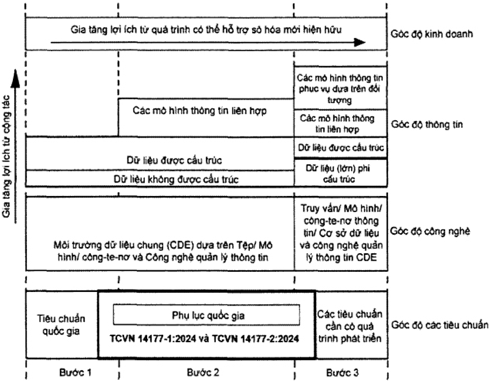

## TCVN 14177-1:2024

## 4.3 Các quan đim v quàn lý thông tin

Các quan đim qun lý thông tin khác nhau nên đưc xác nhn trong quá trinh quàn lý thông tin và nên đưc kt hp trong quá trình theo nhng cách sau:

- Trong mô tà chi tit ca yêu cu ca thông tin;
- – Trong k hoch chuyn giao thông tin; và
- – Trong vic chuyn giao thông tin.

Các quan đim quàn lý thông tin nên đưc xác đnh theo tng trưng hp c th, nhưng có 4 quan đim mô tà trong Bng 1 đưc khuyn khích áp dng. Các quan đim khác nu phù hp có th ng dng tùy thuc vào tính cht ca d án và tài sn.

Bàng 1 – Quan đim quàn lý thông tin

| Quan điêm                                    | Mc đích                                                                                                      | Ví d v các sn phm chuyn giao                                                   |
|----------------------------------------------|--------------------------------------------------------------------------------------------------------------|--------------------------------------------------------------------------------|
| Quan đim ca ch s hu tài sàn                  | Đ thit lp và duy trì mc đich ca tài sn hoc d án. Đ đưa ra các quyt đnh kinh doanh chin lưc                   | K hoch kinh doanh Đánh giá danh mųc tài sàn chin lưc Phân tich chi phí vòng đi |
| Quan đièm ca nguri s dng tài sn              | Đ xác đnh các yêu cu thc s ca ngưi dùng và đàm bo tài sn đúng cht lưng và năng lc.                           | Tóm tt d án AIM PIM Tài liu v sàn phm                                          |
| Quan đièm quàn lý chuyn giao d án hoc tài sn | Lp k hoch và tǒ chúc công vic, huy đng các ngun lc phù hp, phi hp và kim soát thc hin.                       | K hoch, ví d K hoąch thc hin BIM So đò t chúc Đnh nghīa chúc năng              |
| Quan đim ca xã hi                            | Đ đm bo li ích ca cng đng đưc quan tâm trong sut vòng đi ca tài sn (lp k hoch, bàn giao và khai thác s dng). | Quyt đinh chính tri Quy hoch Giáy phép xây dng, chuyn nhưng                    |

CHÚ THÍCH: Vi d v các sn phm chuyn giao ó lin quan đn gc đ ca tirng quan đim và không th hin quyèn s hūu đi vói chuyn giao hoc ai thrc hin to ra các chuyn giao.

## 5 Xác đnh yêu cu thông tin và kt quà ca các mô hinh thông tin

## 5.1 Nguyên tc

Bên đt hàng nên hiu nhng thông tin càn thit liên quan đn (các) tài sàn hoc (các) d án mà ho trin khai thc hin nhàm h tr cho t chc hoc mc tiêu ca d án ca h. Nhng yêu cu này có th đn t b phn ph trách bên phía t chc ca h hoc các đi tác bên ngoài tham gia thc hin khác. Bên đt hàng nên cung cp các yêu càu rō ràng cho các t chc và cá nhân khác đ hiu v các thông tin công vic thc hin. Công vic này cn thit cho d án và tài sàn trong mi quy mô, nhưng các nguyên tc cn áp dung phù hp theo quy mô tương ng. Đi vi các bên đt hàng chưa có kinh nghim thì khuyn cáo càn tim kim chuyên gia h tr thc hin công vic này.

Các bên thc hin, bao gòm các bên thc hin chính, có th b sung yêu cu thông tin ca h vào ni dung nhn đưc. Mt s yêu cu v thông tin có th đưc chuyn cho các bên thc hin, đc bit khi vic trao đi thông tin trong nhóm chuyn giao là cn thit và thông tin này không đưc trao đi vi bên đt hàng.

Beno  in  n n   n      h      n a tài sàn đưc quàn lý. Nhng mc đích có th bao gm:

- – Đăng ký tài sàn: đăng ký tài sàn cn đưc cung cp đ h tr vic kim toán và báo cáo chính xác; vic đăng ký tài sàn nên bao gm cà tài sàn không gian và vt cht cūng như các nhóm thuc v chúng;
- H tr vic tuân th và trách nhim pháp lý: bên đt hàng nên nêu rõ thông tin cn thit đ h tr đm bo an toàn sinh mng và sc khe cho ngưi s dng;
- Qun lý ri ro: thông tin nên đưc yêu cu hoc bt buc đ h tr quàn lý ri ro, đc bit đ xác đnh và xem xét các ri ro có th găp phi ca mt d án hoc tài sàn, ví d như thàm ha t nhiên, các hin tưng thi tit cc đoan hoc ha hon; hoc
- – H tr các vn đ kinh doanh: bên đt hàng nên nêu rō thông tin càn thit cho h tr k vng kinh doanh v quyn s hu và khai thác s dng tài sàn; điu này nên bao gm vic phát trin liên tc ca các tác đng và các khía cnh có li sau đây cho tài sn k t khi đưc bàn giao sm nht:
- Quàn lý công sut và mc s dng: nên cung cp tài liu v công sut và mc s dng tài sn d kin đ hồ tr vic so sánh mc s dng và thc t s dng cũng như qun lý danh mc đu tư;
- Qun lý an ninh và giám sát: thông tin nên đưc yu cu hoc bt buc đ h tr vic qun lý an iun n   n d d       i    n  i n inh
- Hồ tr cài to: ci to tng không gian hoc v trí và toàn b tài sn nên đưc h tr thông tin chi tit vè công sut, v din tích, không gian, sc cha, đièu kin môi trưng và khà năng chju lc ca kt cu;
- Các tác đng đưc d đoán và thc t: bên đt hàng nên yêu cu thông tin liên quan đn các tác đng t cht lưng, chi phi, k hoch, khí thi, năng lưng, cht thi, tiêu th nưc hoc các tác đng môi trưng khác;
- Khai thác s dng: các thông tin càn thit cho hot đng bình thưng ca tài sàn nên đưc cung cp đ giúp bên đt hàng d kin chi phí khai thác s dng tài sàn;

## TCVN 14177-1:2024

- Bo trì và sa cha: nên cung cp thông tin v các nhim v bào tri, bao gm bào cà bo trì phòng nga theo k hoch đ giúp bên đt hàng d đoán và lp k hoch chi phí bo trì;
- Thay th: thông tin v tham chiu hoc tui th và chi phí dich v thay th d kin phi có sn cho bên đt hàng đ d đoán chi phí thay th; vic tái s dng tài sàn vt cht nên đưc h tr bng thông tin chi tit liên quan đn vt liu cu thành chính; và
- Chm dt vic s dng và phá d: thông tin khuyn cáo v vic dng s dng càn đưc d đoán đ giúp bên đt hàng lp k hoch cho các chi phí kt thúc/phá d công trinh.

Các yêu càu thông tin liên quan đn giai đon chuyn giao tài sàn nên đưc th hin dưi dng các bưc ca d án đưc bên đt hàng hoc bên thc hin chính d kin s dng.

Các yu càu thông tin liên quan đn giai đon khai thác s dng ca tài sn phi đưc th hin dưi dng các s kin kích hot d kin trong vòng đi như vic bo trì theo k hoch, kim tra thit bį cha cháy, thay th thit bi hoc thay đi đơn vi qun lý tài sn.

Caec n g  n n n nn  n n n      n g n n

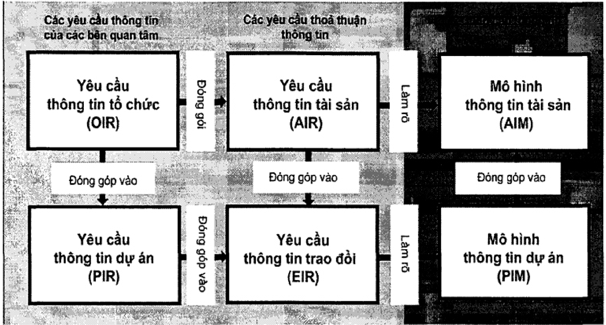

CHÚ THÍCH: Trong hinh này, "đóng góp vào" ó nghīa là "cung cp đàu vào cho", "làm r" có nghīa là "xác đinh ni dung, cu trc và phưrong pháp lun".

Hinh 2 - Phân cp ca các yêu cu ca thông tin

## 5.2 Yêu càu thông tin t chúc (OIR)

OIR gii thích thông tin cn thit đ trà li hoc đáp ng nhng mc tiêu chin lưc cp cao ca bên đt hàng. Nhng yêu cu này có th phát sinh vì nhiu lý do, bao gm:

- Chin lưc vn hành kinh doanh;
- Chin luc quàn lý tài sàn;
- Lp k hoch danh mc đu tư;
- Trách nhim pháp lý;

- Hoąch đinh chính sách.

OlR có th tn ti vì nhūng lý do khác ngoài quàn ly tài sn, ví dų liên quan đn vic np các chi phí tài chính hàng năm. OIR cho mc đích này không đưc xem xét trong tiêu chun này.

## 5.3Yêu càu thông tin tài sàn (AIR)

AlR đt ra các khía cnh quàn lý, thương mi và k thut ca vic to lp thông tin tài sàn. Các khía cnh quàn lý và thương mi nên bao gm tiu chun thông tin và các phương pháp và quy trình to lp mà nhóm chuyn giao cn thc hin.

Các khia cnh k thut ca yêu càu thông tin tài sn (AIR) chi r nhng thông tin càn thit đ trà li cho yêu càu thông tin t chc (OIR) liên quan đn tài sàn. Các yu cu này phài đưc th hin theo cách có th kt hp vào các tha thun qun lý tài sn đ h tr vic đưa ra quyt đnh ca t chc.

Mt tp hp các AIR cn đưc chun b cho tng s kin kích hot trong sut quá trinh khai thác s dng tài sn và trong các trưng hp liên quan khác cũng nên tham chiu đn các yêu cu v bào mt

Khi có chui cung ng, AIR mà bên thc hin chính nhn đưc có th đưc chia nhò và giao đi theo bt k tha thun nào ca bên thc hin chính. AIR mà bên thc hin chính nhn đưc có th đưc b sung thêm theo yêu cu thông tin ca bên thc hin chính.

Trong chin lưc và k hoch qun lý tài sn có th có mt s tha thun khác nhau. AlR t tt cà nhng tha thun này nên to thành mt tp hp các yu cu thông tin mch lc và phi hp duy nht, đù đ giài quyt tt cà các OIR liên quan đn tài sn.

## 5.4 Yêu càu thông tin d án (PIR)

PIR gii thích thông tin cn thit đ trà li hoc thông báo nhng mc tiu chin lưc cp cao ca bên đt hàng liên quan đn mt d án tài sn đưc xây dng c th. PIR đưc xác đnh tù cà quá trình quàn lý d án và quá trinh qun lý tài sàn.

Mt tp hp các yu cu thông tin nên đưc chun b cho tùng thi đim quyt đnh quan trng ca bên đt hàng trong sut d án.

Các khách hàng truyn thng có th phát trin mt b PIR chung, có hoc không có sa đi, áp dng trên tt cà các d án ca h.

## 5.5 Yêu cu thông tin trao đi (EIR)

Ei      i  t y  g   n        t a cana n   d n a n ng g ng g  g n n   g n inh to lp mà nhóm chuyn giao càn thc hin.

Ca  n lt    tt  it  t t      eh tt   n cau n           n t         ng dha  b      t  ns       n  n d d d d án.

EIR nên đưc xác đnh khi các tha thun đưc thit lp. C th, EIR mà bên đt hàng nhn đưc có th đưc chia nhò và giao đi theo bt k tha thun nào ca bên thc hin chính và theo sut chui cung ng. EIR mà các bên thc hin nhn đưc, bao gm cà các bên thc hin chính, có th đưc b sung thêm bng EIR ca riêng h. Mt s EIR có th đưc chuyn cho các bên thc hin ca ho, đc

## TCVN 14177-1:2024

bit khi vic trao đi thông tin trong nhóm chuyn giao là càn thit và thông tin này không đưc trao đi vi bên đt hàng.

Trong mt d án có th có mt s tha thun khác nhau. EIR trong tt cà các thồa thun này nên to thành mtt   t n i  e     d n   it t      l

## 5.6 Mô hình thông tin tài sàn (AIM)

AlM h tr bên đt hàng thit lp chin lưc quy trinh qun lý tài sàn thưòng nht. Mô hinh cūng có th cung cp thông tin khi bt đu quá trinh chuyn giao d án. Ví d, AlM có th bao gm s đăng ký thit bi, chi phí bo tri tich lūy, h sơ v ngày lp đt và bo trì, chi tit v quyn s hu tài sn và các chi tit khác mà bên đt hàng coi là có giá tr và qun lý có h thng.

## 5.7 Mô hình thông tin d án (PIM)

PIM h tr cho vic chuyn giao d án và đóng góp vào AlM đ h tr các hot đng qun lý tài sn. PIM cūng càn đ lưu tr d liu dài hn cho d án nhm mc đích kim toán. Ví dų, PIM có th bao gm các thông tin hinh hc, vį tri các thit bi, thông s thit k trong quá trinh thit k d án, gii pháp thi công, k hoch, chi phí và chi tit ca h thng, thành phn và thit b lp đt, bao gm cà yu càu v bo trì trong quá trinh xây dng.

## 6 Chu kò chuyn giao thông tin

## 6.1 Nguyên tåc

Vic xác đnh và chuyn giao thông tin v d án và tài sàn tuân th theo 4 nguyên tc tng quan, mi nguyên tc đưc làm rô trong các mc sau:

- 1) Thông tin cn thit cho vic ra quyt đnh trong tt cà các phàn ca vòng đi tài sn, bao gm k cà kis h n  n   n     ns n   n  d in   su dng tài sàn, tt cà đu là mt phn ca h thng quàn ly tài sn tồng th.
- 2) Thông tin đưc xác đnh lūy tin thông qua mt tp hp các yu cu do bên đt hàng xác đnh. Vic chuyn giao thông tin đưc lên k hoch và chuyn giao lūy tin bi các nhóm chuyn giao. Ngoài ra, mt s thông tin tham khào cũng có th đưc bên đt hàng cung cp cho mt hoc nhiu bên thc hin.
3. cnn  n n n  n   m nn   n n  n n  e chuyn cho bên có liên quan nht hoc đu mi mà thông tin có th đưc cung cp d dàng nht.
- 4) Trao đồi thông tin bao gm vic chia s và phi hp thông tin thông qua CDE, s dng các tiêu chun m bt c khi nào có th và các quá trình khai thác s dng đưc xác đnh r ràng đ cho phép tt cà các t chc liên quan tip cn d liu mt cách nht quán.

Các nguyên tc này nên đưc áp dng theo cách tưrơng ng vi bi cành quàn lý tài sàn hoc chuyn giao d án.

## 6.2 S liên kt vi vòng đi tài sàn

AlM và PIM đưc to ra trong sut vòng đi ca tài sn và đưc s dng trong sut vòng đi ca tài sàn đ đưa ra các quyt đnh liên quan đn tài sàn và d án.

Hình 3 cho thy vòng đi tài sn cho giai đon khai thác s dng và chuyn giao tài sn (vòng tròn màu đen) và mt s hot đng qun lý thông tin (đim A đn C). Ngoài ba đim đưc th hin trong

## CHÚ DÃN:

AIM

Mô hinh thông tin tài sàn

PIM

Mô hinh thông tin d án

A Bt đàu giai đon chuyn giao – Chuyn thông tin liên quan t AlM sang PIM

- B Cài tin phát trin mô hinh ý tưng thành mô hinh xây dng ào

- C Kt thúc giai đon chuyn giao – Chuyn thông tin liên quan tù PIM sang AlM

## Hinh 3 - Tồng quan vòng đi quàn lý thông tin d án và thông tin tài sàn

Tu   n     n    n t  n    o  v 14177:

- Bên đt hàng trc tip liên quan đn vic qun lý tài sàn vi vic đt đưc mc tiêu kinh doanh ca h thông qua các chính sách, chin lưc và k hoch quàn lý tài sàn;
- Kim soát thông tin tài sn phù hp và kip thi là mt trong nhng yu t cơ bn đ qun lý tài sn thành công; và
- Cp quàn lý cao nht ca ch s hu/đơn v khai thác s dng sē điu hành và quàn tr công vic quàn lý thông tin tài sàn.
- Các nguyên tc chính sau đây rt quan trong vi vic quàn lý thông tin tài sn:

## TCVN 14177-1:2024

hinh, vic xác minh ý đnh ca đơn v thit k nên đưc thc hin thông qua vic xem xét hiu sut ca tài sàn trong giai đon khai thác s dng. Thi gian s ph thuc vào thi đim và tàn sut ca các bài kim tra sau khi hoàn thành và đánh giá hiu sut đưc thc hin. Nu vic xác minh không thành công có th yêu cu các bin pháp khc phc. Trong sut giai đon khai thác s dng, các s kién   n in d   n t  n   n n     n  ie trao đi thông tin.

Hinh 3 mô tà vic qun lý thông tin trong bi cành mt h thng quàn lý ti sn.

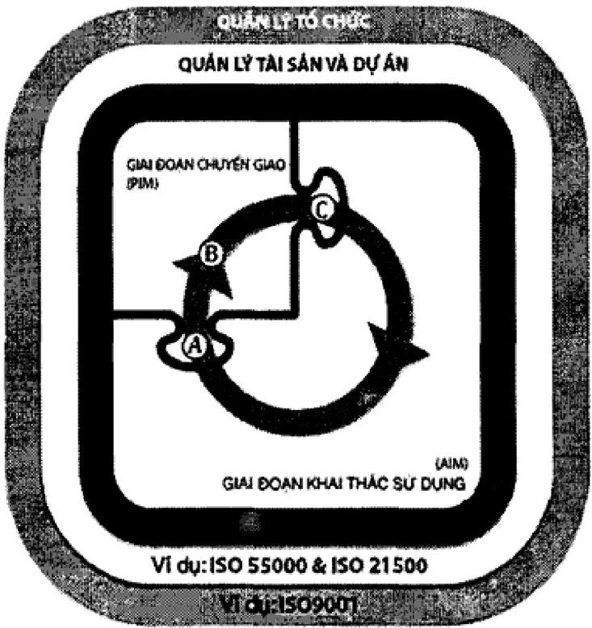

## TCVN 14177-1:2024

- T g n  g ag  ns     g      dn tin d án);
- – Úng dng quy trình lp k hoch – thc hin – kim tra – hành đng (đ phát trin và cung cp thông tin tài sàn hoc thông tin d án);
- – S tham gia ca moi ngưi, khuyn khích các thao tác phù hp là yu t quan trong trong vic cung cp thông tin đuc nht quán; và
- –Tp trung vào vic chia s các bài hc kinh nghim và ci tin liên tc.

## 6.3 Thit lp các yêu càu thông tin và k hoch chuyn giao thông tin

## 6.3.1 Nguyên tc chung

Tt cà thông tin tài sàn và thông tin d án s đưc cung cp trong sut vòng đi tài sàn nên đưc bên đt hàng chi đnh thông qua mt tp hp các yêu càu thông tin. Các yêu cu thông tin liên quan nên du dn nn n n  n n n n  m n n       n khi mt b phn ca t chc ban hành, hưng dn công vic cho mt b phn khác cùng t chc. Bên th  g n     n           n  hng xem xét trưc tha thun. Vic đáp úng các yêu cu thông tin sē đưc quàn lý và phát trin bi tng bên thc hin chính và bao gm ké hoch quàn lý tài sàn hoc hot đng chuyn giao d án ca h. Thông tin đưc quàn lý và chuyn giao bi tng bên thc hin chinh và đưc chp nhn bi bên đưa ra yêu cu. Chu trinh phàn hi chuyn giao thông tin s đưc sa đi nu cn thit. Sơ đò chung cho quá trinh này đưc th hin ti Hinh 4.

Đánh giá ri ro trong vic cung cp thông tin tài sàn hoc thông tin d án phi đưc đưa vào đánh giá ri ro tng th ca tài sàn hoc d án, sao cho bàn cht ri ro ca chuyn giao thông tin, hu quà và kha        n    a n    n a xem xét khi đánh giá ri ro chuyn giao thông tin.

cai n    l        i  i  n  t   din quan trong liên quan đn tài sn ti các thi đim khác nhau trong quá trình chuyn giao và khai thác s dng tài sàn. Ké hoch chuyn giao thông tin đưc thc hin mõi khi bên thc hin chính nhn đưc yu cu liên quan đn hot đng quàn lý tài sn hoc chuyn giao d án. Điu này bao gm các yh  b b  n bt     é    b bn bs b  bt dich v nào khác và các tha thun đưc thc hin tun t thành mt chui cung ng, ví d như trong mt nhóm thi công Hinh 5 Minh ha cho vic phân chia các quá trinh quàn lý thông tin và cách áp dng cho trng tha thun trong mt d án. Mt s phân chia quá trinh tương t s áp dng cho tng thồa thun trong sut quá trinh quàn lý tài sàn Chuồi các yêu cu thông tin và cung cp thông tin có mt s đc đim chính đưc gii thích trong 6.3.2 đn 6.3.5 và đưc minh ha cho mt hinh thc mua sm c th.

Hinh 4 – Chi dn chung và hoch đnh chuyn giao thông tin

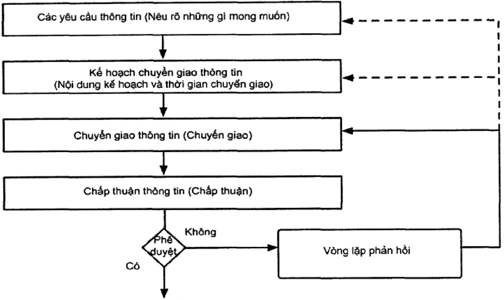

Hinh 5 - Minh ha cho các quá trinh phân chia quàn lý thông tin

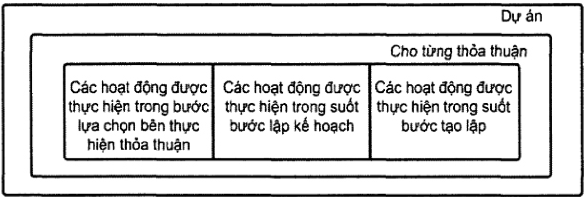

Các nguyên tc khác liên quan đn chc năng quàn lý thông tin, khà năng hp tác làm vic và năng lc ca bên thc hin đưc nêu trong các Điu 7, 8 và 9. Các nguyên tc khác liên liên quan đn to lp và chuyn giao thông tin đưc nêu trong các Điu 11 và 12.

## 6.3.2 Nhóm chuyn giao cung cp thông tin cho các quyt đnh ca chù s hūu/đon v khai thác s dng tài sàn hoc khách hàng

Hinh 6 th hin trưng hp mt quyt đnh quan trng đưc đưa ra bi bên đt hàng. Quyt đinh đó đưa ra ti thòi đim quyt đnh quan trong, hình thoi, nơi mt tp hp yêu cu thông tin đưc xác đnh

## TCVN 14177-1:2024

và chuyn cho nhóm chuyn giao (bên thc hin chính và nhũng bên thc hin khác khi thích hp). Thông tin đưc chuyn giao thông qua trao đi thông tin to thành vòng tròn khép kín.

Bên đt hàng nên xác đnh các thi đim càn đưa ra quyt đinh quan trong và cǎn c theo thông tin yêu cu t nhóm chuyn giao đ đưa ra quyt đinh. Bt k thay đi quan trong nào đi vi các yêu cu ca thông tin cn đưc tho lun và thng nht gia bên đt hàng và bên thc hin chính, mt trong hai bên có th đ xut yêu càu đó.

Hinh 6 – Mi quan h gia các quyt đnh quan trng và thông tin tù bên thc hin chính

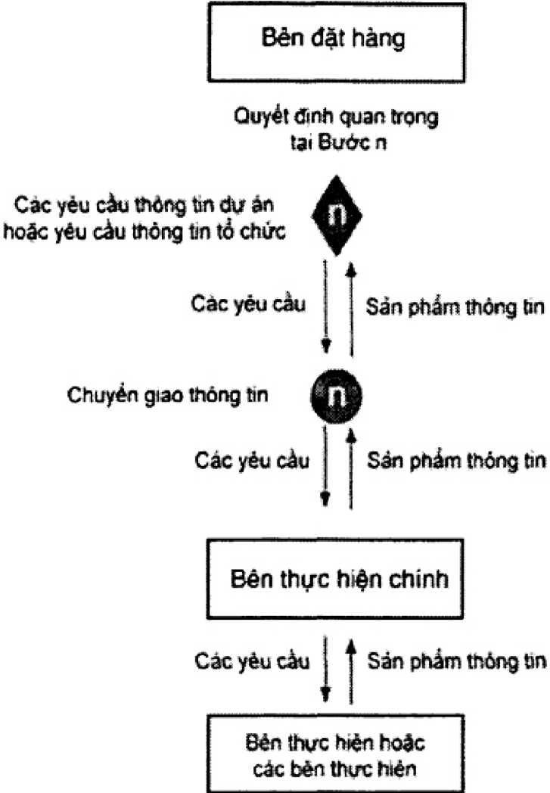

## 6.3.3 Xác minh và xác nhn thông tin khi bt đàu và kt thúc các bưc ca d án

Hinh 7 th hin quá trình trao đồi thông tin din ra t thi đim kt thúc mt bưc chuyn giao d án và bt đàu bưc chuyn giao tip theo. Vòng tròn khép kín th hin s trao đi thông tin.

Các mūi tên doc th hin các yêu cu thông tin và các chuyn giao thông tin gia bên đt hàng và bên thc hin chính. Mūi tên tròn  bên trái ca mūi tên dc th hin vic cung cp thông tin ca bên thc hin chính, vic bên đt hàng kim tra thông tin đó so vi các yu cu và bt k s lp li nào càn thit đ hoàn thành vic trao đi thông tin (ví d khi yêu cu thông tin bi thiu hoc cung cp cht lưng chưa đáp ng). Mūi tên tròn  bên phi mūi tên dc th hin vic cung cp thông tin t bên đt hàng cho bên thc hin chính, vic kim tra thông tin đó so vi các yêu cu cn thit đ bt đu bưc d án tip theo và bt k s lp li nào đ hoàn thành vic trao đi thông tin.

Trong các phương pháp xác nhn và xác minh, yu t quan trng là quy trinh phê duyt và chp thun phi đưc thng nht và ghi li trưc khi thc hin trao đi thông tin.

Điu đc bit quan trong là kim tra thông tin làn th hai, đ bt đàu mt bưc mi, đưc thc hin khi có s thay đi ca bên thc hin gia mt bưc và bưc tip theo, đc bit chú y đn khà năng s dng ca thông tin nhn đưc. Vic kim tra làn th hai nên đưc thc hin khi có s chm trê trưc khi bưc d án tip theo bt đu. Mt s trưng hp vic kim tra thông tin làn hai là không càn thit, ví d khi cùng mt bên thc hin chính chuyn giao cà hai bưc d án và không có s chm tr tin đ d án gia các bưc.

Thông tin cūng càn đưc kim tra nu có s thay đi bên thc hin chính ca d án. Trong nhng trưng hp này, mi hn ch v vic s dng thông tin ca bên thc hin trưc đó đu phi đưc xem xét.

Hinh 7 – Kim tra thông tin trong sut quá trinh trao đi thông tin

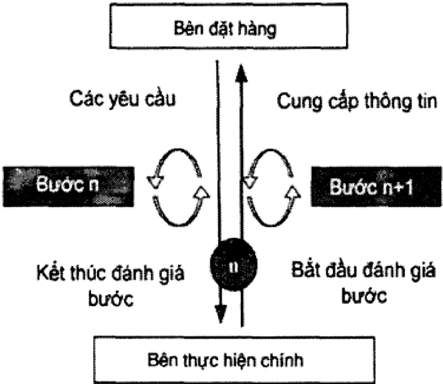

## 6.3.4 Thông tin đưc thit lp tù toàn b các nhóm chuyn giao

Hinh 8 th hin cách thc thông tin đưc chuyn giao trong quá trinh trao đi thông tin t các nhóm chuyn giao m rng cho vic thit k,  bên trái và cho vic thi công  bên phi. Đi vi hinh thc mua sm đưc minh ha, các đưng chám ngang th hin, như mt ví dų, mc đ ca tha thun. Mi bên thc hin chính có th y quyn toàn b hoc mt phn các yêu càu thông tin nhn đưc t be  n   n ng  ng g    ng n    n   ng  n ben thc hin chính trong vic đáp ng yêu cu thông tin tài sn (AIR) hoc yu cu thông tin trao đi (EIR), ne       i        n    nng bên thc hin chính t nhóm chuyn giao ca h và chuyn giao đn bên đt hàng, có th kim tra và trình li như đưc giài thích trong Hinh 7.

Nena  n d n  n      n  n     nom xác nhn thông tin mà ho sē ph trách trong các trao đồi thông tin trong tương lai.

Trao đi thông tin vói bên đt hàng

Hinh 8 – Ví d v thông tin đưc cung cp bi toàn b các nhóm chuyn giao

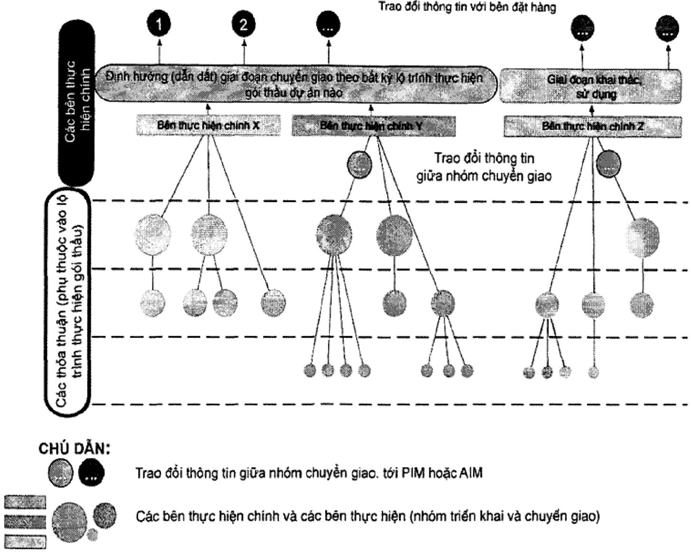

## 6.3.5 Tóm tt vic chuyn giao thông tin t các nhóm chuyn giao d án và tài sàn

Hinh 9 minh ha chui các yêu càu và chuyn giao thông tin cho mt hình thc mua sm c th. Có th s dng các cách sp xp khác nhau cho các bưc d án, các thòi đim quyt đnh quan trong khác nhau và các trao đi thông tin khác nhau vi hinh minh ha. Ví d là vic cung cp thông tin tin đ t chi huy thi công đn khách hàng. Tuy nhiên, các đim chính đưc gii thích trong 6.3.2, 6.3.3 và 6.3.4 nên áp dng cho tt cà các b trí chuyn giao d án và qun lý tài sn.

Hinh 9 – Ví d v vic chuyn giao thông tin thông qua các trao đi thông tin đ hồ tr các quyt đnh quan trng cùa bên đt hàng

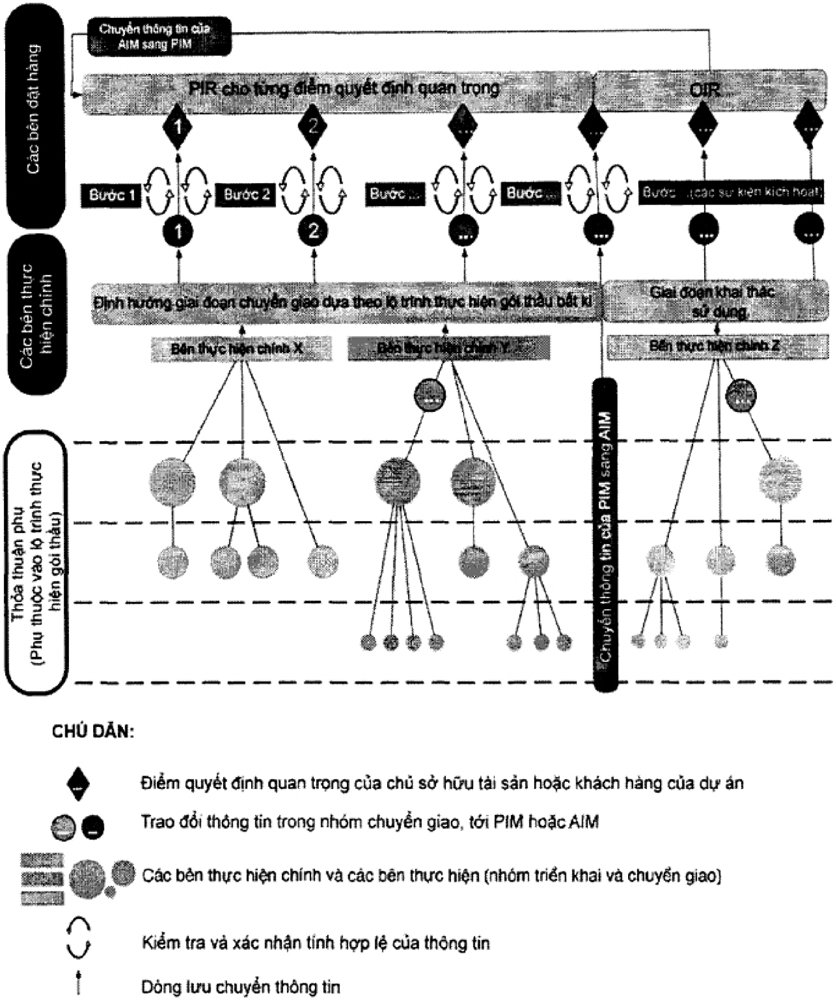

## 7 Các chúc năng qun lý thông tin d án và thông tin tài sàn

## 7.1 Nguyên tc

S rō ràng v chc năng, trách nhim, quyn hn và phm vi ca bt k nhim v nào là điu thit yu ca vic quàn lý thông tin hiu qu. Các chc nǎng nên đưc đưa vào tha thun, thông qua mt lich trinh dch v c th hoc bng cách đ cp các nghīa v chung.

Tic         t n n     i    nca tng chc năng và nên đưc liên kt vi các tài liu tha thun khác. Các chc năng, trách nhim,

## TCVN 14177-1:2024

quyn hn qun lý thông tin cn đưc phân b cho các bên trên cơ s phù hp và khà năng thc hin. Trong các doanh nghip hoc d án nh, nhiu chc nǎng có th thc hin bi cùng mt nhân s hoc môt bên.

Các chc năng qun lý thông tin không nên xem là trách nhim ca thit k. Tuy nhiên, đi vi các tài sn hoc d án có quy mô nhò và it phc tp, các chc năng qun lý thông tin có th thc hin cùng vi các chc năng khác như qun lý tài sn, quàn lý d án, điu hành nhóm thit k hoc kim soát thi công.

Điu quan trong là không đưc nhàm ln giūa các chc năng và các trách nhim vi chc danh công vic hoc chc danh chuyên môn hoc các chc danh khác.

Tron       d nd  n n   ns    n   ang c th hồ tr thông tin hoc quá trình quàn lý thông tin đ hồ tr làm vic theo nhóm hoc hp tác. Điu này s cho phép tp trung tt hơn vào các khía cnh khác nhau ca quàn lý thông tin đ thc hin hiu quà quá trình quàn lý thông tin.

## 7.2 Các chúc năng quàn lý thông tin tài sàn

Mc đ phc tap ca chc năng quàn lý thông tin tài sàn phàn ánh quy mô, mc đ phúc tp ca tài sn hoc danh mc tài sàn đưc quàn lý. Điu quan trong là các chc năng đưc phân công trong sut vòng đi ca tài sàn. Tuy nhiên, do tính cht dài hn ca qun lý tài sn, gàn như các chc năng đó sê đưc thc hin bi các t chc hoc các cá nhân k nhim. Do đó, điu quan trong là lp k hoa   n u n bu   n n n   in

Liên quan đn tài sn, vic quàn lý thông tin tài sàn có th đưc giao cho mt hoc nhiu cá nhân trong s nhân vin ca bên đt hàng. Qun lý thông tin tài sàn lin quan đn vic länh đo xác nhn thông tin đưc cung cp t mi bên thc hin và lănh đo vic cho phép đưra thông tin đó vào mô hinh thông tin tài sàn s          n  n       n (n)

Khi kt thúc bt k d án nào, thông tin chính cn bàn giao bao gồm cà thông tin càn thit đ khai thác s dng và bo trì tài sn. Do đó, vic quàn lý thông tin tài sàn tham gia  tt cà các bưc chuyn giao d án như đnh nghĩa trong Bàng 1.

## 7.3 Các chúc năng quàn lý thông tin d án

S phc tp ca chc năng quàn ly thông tin d án càn phàn ánh quy mô và mc đ phc tp ca thông tin d án. Điu quan trong là các chc năng đưc phân công trong sut d án, nhưng trinh t ca các tha thun và phm vi ca chúng phi phàn ánh l trinh mua sm đang đưc s dng.

Qun lý thông tin d án liên quan đn vic điu hành thit lp tiêu chun thông tin ca d án, các phương pháp và quy trinh to lp cũng như môi trưng d liu chung (CDE) ca d án.

Bei   h           n        vie phân b các trách nhim này nên c th theo tng d án và đưc ghi li trong các tài liu tha thun.

## 7.4 Các chúc năng quàn lý thông tin nhim v

Khi các nhóm chuyn giao đưc chia thành nhiu nhóm trin khai, các chc nǎng quàn lý thông tin nhim v nên đưc giao cho tng nhóm trin khai. Quàn lý thông tin  cp đ nhóm trin khai càn quan tâm đn thông tin liên quan đn nhim v đó và yêu càu phi hp thông tin trên nhièu nhim v.

## 8 Năng lc và khà năng ca nhóm chuyn giao

## 8.1 Nguyên tc

Beo n  g   n n   n           a yêu cu thông tin. Vic đánh giá này có th thc hin bi bên đt hàng, bi chính nhóm chuyn giao tim năng hoc mt bên đc lp. Phm vi đánh giá nên đưc cung cp cho nhóm chuyn giao tim năng. Vic xem xét có th có nhiu bưc, vi d như sơ tuyn nhưng phi đưc hoàn thành trưc khi ký kt tha thun.

Năng lc đè cp đn khà nǎng thc hin mt hot đng nht đnh, ví d như kinh nghim, k năng hoc khà năng k thut càn thit. Khà năng lin quan đn vic có th hoàn thành mt hot đng trong thi gian càn thit.

i   n u n    n ua     n   da hn tưrơng t thì phm vi đánh giá có th giàm xung chǐ còn các khía cnh liên quan đn đánh giá năng lc và khà năng. Ví dų, trong mt tha thun khung ca d án, kinh nghim ca nhóm chuyn giao tièm năng và khà năng đáp ng công ngh thông tin càn thit không càn đánh giá cho mi d án m  t                   t nn khung bào trì tài sàn, năng lc thc hin ca nhóm chuyn giao tim năng chī càn đưc đánh giá li theo các khong thi gian đưc xác đnh trưc trong khung tha thun thay vì trưc mi hot đng bão tri.

## 8.2 Đánh giá năng lc và khà năng

Vic đánh giá năng c và khà năng ca nhóm chuyn giao tim năng nên bao gm ít nht nhng ni dung sau:

- Cam kt tuân th tiêu chun và các yêu cu thông tin;
- kha d          n  g ng d  th làm vic trong mt công-te-nơ thông tin;
- Khà năng tip cn và tri nghim các công ngh thông tin đưc chi đnh s dng hoc d kin s dng trong các yêu càu thông tin hoc do nhóm chuyn giao đ xut; và
- S lưng nhân vin có kinh nghim và năng lc phù hp trong nhóm chuyn giao tim năng sån sàng làm vic vi các công vic liên quan đn tài sàn hoc d án đưc đè xut.

## 9 Phi hp làm vic trong công-te-nơ thông tin

Vic phi hp to lp thông tin nên đưc quy đnh theo điu khoàn chung ca cu trúc thông tin cho phép đt đưc các nguyên tc cơ bàn ca hot đng phi hp làm vic trong công-te-nơ thông tin. Nhūng nguyên tc cơ bàn này như sau:

- a) Các tác già to lp thông tin, tuân theo các tha thun s hu trí tu mà ho kim soát và kim tra, chī tim ngun cung cp thông tin đã đưc phê duyt khác khi đưc yêu cu bng cách tham khào, liên hp hoc trao đi thông tin trc tip;
- b) Cung cp các yêu cu thông tin rõ ràng  cp đ tng quan, bi các bên quan tâm liên quan đn d án hoc tài sn, và cp đ chi tit bi bên đt hàng;

## TCVN 14177-1:2024

- c) Xem xét đè xut phương pháp tip cn, năng lc và khà năng ca tng nhóm chuyn giao trưc khi giao nhim v so vi các yêu cu;
- d) Cung cp môi trưng d liu chung (CDE) đ qun lý và lưu trū thông tin đưc chia sě, vi tính khà dng thích hp và đm bo cho tt cà các cá nhân hoc các bên đưc yêu cu to lp, s dng và duy trì thông tin đó;
3. ā) Các mô hình thông tin đưc phát trin bng cách s dng công ngh phù hp vi tài liu này;
- e) Các quá trinh liên quan đn bo mt thông tin nên đưc thc hin trong sut vòng đi ca tài sàn dt  g ng  n n g n g  t    ng    th thc hin đưc.

## 10 K hoch chuyn giao thông tin

## 10.1 Nguyên tc

Lp k hoch chuyn giao thông tin là trách nhim ca tng bên thc hin chính và bên thc hin. Các k hoch nên đưc xây dng đ đáp ng các yu cu thông tin do bên đt hàng đt ra và phn ánh phm vi ca tha thun trong tồng th vòng đi tài sàn. Mi k hoch chuyn giao thông tin nên nêu rô:

- – Cách thc đ đáp ng các yu cu đưc xác đnh trong AIR hoc EIR;
- Thi đim thông tin sê đưc chuyn giao, trưc tiên liên quan đn các bưc ca d án hoc các mc quàn lý tài sn và sau đó liên quan đn ngày chuyn giao thc t;
- – Cách thc thông tin s đưc chuyn giao;
- – Cách thc thông tin s đưc phi hp vi thông tin ca các bên thc hin khác liên quan;
- Thông tin sē đưc chuyn giao;
- Ngui chju trách nhim chuyn giao thông tin; và
- Ngưi nhn thông tin.

Yêu cu ti thiu ca mt s k hoch cung cp thông tin đưc thc hin bi bên thc hin chính hoc bên thc hin trưc tha thun, vì ni dung này s là mt phàn quá trinh đánh giá ca bên đt hàng. Saub n d     n t t    t n n  n      nna trình huy đng. Nên lp k hoch chuyn giao thông tin b sung nu có thay đi v các yu cu thông tin hoc nhóm chuyn giao.

Nhóm chuyn giao nên xem xét gii pháp quàn lý thông tin trưc khi bt đàu thc hin nhim vų thit k ký thut, thi công hoc qun lý tài sn. Điu này nên bao gm nhng ni dung sau đây:

- Các điu kin tha thun càn thit và các điu chinh đ đưc chun bi và thng nht;
- Các quá trình quàn lý thông tin đuc áp dng;
- – K hoch chuyn giao thông tin da trên khà năng ca nhóm chuyn giao;
- Nhóm chuyn giao có các k nǎng và nǎng lc phù hp; và
- Công ngh hồ tr và cho phép qun lý thông tin theo tiêu chun này.

Đ xut đưa vào k hoch đào to liên quan đn k năng và năng c.

Thông tin đưc chuyn giao thông qua trao đi thông tin đưc xác đnh trưc. Trao đi thông tin có th din ra gia bên đt hàng và các bên thc hin chính, cűng như gia các đơn v đưc chī đnh chính vói nhau.

Vic cung cp thông tin phù hp vi các yêu cu thông tin là mt trong nhng tiêu chí đ hoàn thành mt d án hoc hot đng quàn lý tài sàn. Mi công-te-nơ thông tin liên quan trc tip đn mt hoc nhiu yêu cu thông tin đă đưc xác đnh trưc.

## 10.2 Thi đim chuyn giao thông tin

Mt k hoch chuyn giao thông tin đưc xác đinh cho toàn b d án hoc vic qun lý tài sàn ngn hn, trung hn theo lich trinh và tha thun ca các bên. Trong các trưng hp phc tp, k hoch có th đưc hp nht t các k hoch chuyn giao cho tng d án hoc nhim v qun lý tài sàn.

Tho '  n n h  mg  ng  g  n   m n i c tham chiu đn lich trình quàn lý d án và qun lý tài sàn khi đã đưc bit nhng điu này.

## 10.3Ma trn trách nhim

Ma trn trách nhim đưc to ra như mt phàn ca quá trinh lp k hoch chuyn giao thông tin  mt hoc nhiu cp đ chi tit. Các trc ca ma trn trách nhim càn xác đinh:

- Các chúc năng quàn lý thông tin;
- Hoc d án hoc nhim v quàn lý thông tin tài sn hoc các chuyn giao thông tin nu thích hp.

Ni dung ca ma trn trách nhim th hin chi tit phù hp lin quan đn các trc.

## 10.4 Xác đnh chin lưc liên hp và cu trúc phân chia cho các công-te-nơ thông tin

még  a a  a  a a - g  i  n g    n h oca to lp thông tin t các nhóm trin khai ring bit tưong ng vi mc đ nhu cu thông tin trong 11.2.

chie it g a ut   da u   ns u t t n  d   ac mn d    -- n n na  n  n d i  a  n hia có th thc hin bng cách xem xét mô hinh thông tin  các góc nhìn khác nhau, như chc năng, không gian và hình hc. Ý tưng phân chia chc năng có th đưc h tr thông qua thě hin mô hình ngǔ nghĩa. Th hin mô hinh hình hc thưng đưc s dng trong sut giai đon chuyn giao.

Chin lưc lin hp đưc phát trin thành mt hoc nhiu nhóm phân chia cu trúc công-te-nơ thông tin on   -   t  ns    i        t nhau. Chin lưc liên hp và phân chia cu trúc công-te-nơ thông tin giài thích phương pháp quàn lý các giao din đưc liên kt vi tài sàn trong giai đon chuyn giao hoc giai đon khai thác s dng. Các cách sp xp khác nhau ca các công-te-nơ thông tin đưc xác đnh cho các mc đích khác nhau, ví d nh d  g         d   ha   n nug ng vi mc đ phc tp ca tài sn hoc d án. Gii thích và ví d v ng dng khác nhau ca chin lưc liên hp và phân chia cu trúc cho công-te-nơ thông tin đưc đưa ra trong Ph lc A.

## TCVN 14177-1:2024

Chin lưc liên hp và phân chia cu trúc công-te-nơ thông tin đưc cp nht khi có nhóm trin khai mi đưc chi đnh/a chn. Vic cp nht cũng có th đưc yêu cu do tính cht công vic đang thc hin thay đi, đc bit khi s thay đi t vic quàn lý tài sn sang chuyn giao d án và ngưc li.

Các công-te-nơ thông tin trong phân chia cu trúc công-te-nơ thông tin nên đưc tham chiu chéo đn các nhóm trin khai. Trong trưng hp chin lưc liên hp và phân chia cu trúc công-te-nơ thông tin chi xác đnh mt tp hp ca công-te-nơ thông tin, mi nhóm trin khai phài đưc phân b mt hoc nin  g  d n  n g na -      g   -- nt nhóm trin khai.

Vi  nn   a  --   in d n d   n i  n chin lưc liên quan đn d án hoc tài sn và nên đưc thng nht cách phi hp. Chin lưc liên hp và phân chia cu trúc công-te-nơ thông tin nên đưc s hu và qun lý bi các nhóm chc năng nm r cách tip cn chin lưc đ chuyn giao d án và qun lý tài sàn.

chi   t  é  n  ua -     d n d   ben tham gia vào các hot đng tài sn hoc d án. Vic chun b và lưu hành các minh ha hoc mò tà ci i    i   t t        e  t   can trúc công-te-nơ thông tin nên đưc xem xét và có th hn ch vic lưu thông ca chúng.

## 11 Quàn lý vic hp tác to lp thông tin

## 11.1 Nguyên tc

Gii pháp CDE nên đưc trin khai đ cho phép nhng ngưi yêu cu thông tin có th truy cp thông tin đ thc hin chc năng ca h. Gii pháp có th đưc thc hin theo nhiu cách và s dng nhiu công ngh khác nhau. Trong "BIM theo b TCVN 14177", gii pháp và quy trinh CDE cho phép phát trin mô hình thông tin liên hp. Điu này bao gồm các mô hinh thông tin tù các bên thc hin chính, các nhóm chuyn giao hoc các nhóm trin khai khác nhau. Cht lưng bào mt và thông tin đưc xem xét khi thích hp, đưc tich hp vào đnh nghĩa hoc các đ xut cho CDE. Các ý tưng và nguyên tc chi tit hơn v giài pháp và quy trinh CDE đưc nêu trong Điu 12.

Càn tránh các vn đ v mô hinh thông tin trong sut quá trinh to lp thông tin thay vì đưc phát hin sau khi chuyn giao thông tin. Các vn đ có th là không gian, ví d như các b phn kt cu và công vic thi công chim cùng mt không gian hoc v chc năng, ví dų như vt liu chng cháy không uo  i      n n           t ie kiu khác nhau, ví dų như "cng" khi hai vt th chim cùng mt không gian hoc "mm" khi mt đi tưng chim không gian khai thác s dng hoc bo triì ca đi tưng khác hoc "thi gian" khi hai đi tưng hin din trong cùng mt nơi vào cùng mt thi đim. Nguyên tc này cng c yu cu v chin luc liên hp (xem Điu 10.4)

Tt  i u   nn    n nd    u ns n   ie đ lp đt, kt ni, bo trì và thay th, và đưc thay th bng thông tin c th ngay khi nhn đưc. Tt can    n n n on  n i n d  n n n  n  an

## 11.2 Múc đ nhu càu thông tin

Mc đ nhu cu thông tin ca mi thông tin đưc chuyn giao phi đưc xác đnh theo mc đích ca thông tin. Điu này bao gm vic xác đinh s phù hp v cht lưng, s lưng và mc đ chi tit ca thông tin. Mc đ nhu càu thông tin và có th thay đi tùy theo các ln chuyn giao.

Mt lot các s liu có săn đ xác đinh mc đ nhu cu thông tin. Ví d: hai s liu b sung nhưng đc lp có th xác đnh hinh hc và ch s v cht lưng, s lưng và mc đ chi tit. Khi các s liu này đă đưc xác đnh, chúng s đưc s dng đ xác đnh mc đ nhu càu thông tin trên toàn b d án hoc tài sn. Tt cà điu này đưc mô tà rō ràng trong OIR, PIR, AIR hay EIR.

Mc đ nhu càu thông tin đưc xác đnh bng lưng thông tin yêu càu ti thiu đ đáp ng yu cu liên quan, bao gm cà thông tin do các bên thc hin khác yêu cu. Vưt quá mc ti thiu đu đưc xem là lăng phí. Các bên thc hin chinh nên cân nhc ri ro bng vic nhp thông tin đi tưng t đng vào mô hình thông tin có th đưa ra mc đ nhu càu thông tin cao hơn cp đ yêu càu. S liên quan ca thông tin chuyn giao không phi lúc nào cũng tương quan vi mc đ chi tit ca nó. Tuy nhiên, mc đ nhu càu thông tin có liên h mt thit vi chin lưc liên hp (xem Điu 10.4). Mc đ chi tit ca thông tin ch và s ti thiu phài đưc coi trng như thông tin hình hc.

## 11.3 Cht lưng thông tin

Thông tin đưc quàn lý trong CDE phi d hiu vi tt cà các bên tham gia. Nhůng điu sau đây nên đưc thng nht đ h tr vic quàn lý cht lưng thông tin:

- – Các đinh dang thông tin;
- Các đnh dng chuyn giao;
- Cu trúc ca mô hinh thông tin;
- Phương pháp cu trúc và phân loai thông tin;
- Đt tên thuc tính cho siêu d liu, ví d các thuc tính hng mc xây dng và các chuyn giao thông tin.

Vic phân loi đi tưng phi phù hp vi nguyên tc trong TCVN 14176-2:2024. Thông tin đi tưng phi phù hp vi ISO 12006-3, đ h tr cho vic trao đi đi tưng.

Vic kim tra t đng các thông tin trong CDE nên đưc cân nhc.

## 12 Giài pháp và quy trinh môi trưòng dū liu chung (CDE)

## 12.1 Nguyên tc

Gii pháp và quy trình CDE nên đưc s dng đ quàn lý thông tin trong sut quá trinh qun lý tài sàn v g g   ann  n n d  n   n   n  n n quàn lý thông tin trong TCVN 14177-2:2024, 5.6 và 5.7.

Khi kt thúc mt d án, các công-te-nơ thông tin càn thit cho vic qun lý tài sn đưc chuyn t PIM sang AlM. Các công-te-nơ thông tin d án còn li, bt k công-te-nơ thông tin d án nào  trng thái lưu tr, nên đưc gi li  dng chǐ đc trong trưng hp có tranh chp và đ giúp rút kinh nghim. Khoàng thi gian đ lưu gi các công-te-nơ thông tin d án đưc xác đinh trong EIR.

## TCVN 14177-1:2024

ans g  tg a tma  d g g a a -g n tna g  n n an

- Đang thc hin (xem 12.2);
- Đâ chia sè (xem 12.4);
- Đ xut bàn (xem 12.6).

Các công-te-nơ thông tin hin hành có th tn ti trên cà ba trng thái, tùy thuc vào s phát trin ca chúng. Cng càn có trang thái lưu trū (xem 12.7) cung cp nht ký v tt cà các giao dch trong côngte-nơ thông tin và du vt đi chiu quá trình phát trin.

Các trng thái này th hin trong sơ đ minh ha  Hinh 10. Hinh 10 minh ha th hin đơn giàn hóa quy trinh làm vic trên CDE, liên quan đn nhiu làn điu chīnh ca dů liu, nhiu làn xem xét, phê duyt và ùy quyn, và nhièu mc nht ký bn ghi lưu tr các công-te-nơ thông tin  các trang thái.

Vic chuyn đi trng thái tuân theo quá trinh xem xét và phê duyt (12.3 và 12.5).

Mi công-te-nơ thông tin đưc quàn lý thông qua CDE nên có siu d liu bao gòm:

- 1) Mā sa đi, phù hp vi tiu chun đã chp thun; và
- 2) Mã trng thái, hin thi (các) cách s dng thông tin đưc phép.

Ban đu, siu d liu đưc đưa ra bi ngưi to lp và sau đó đưc sa đi bi quá trinh phê duyt và y quyn. S dng công-te-nơ thông tin cho các mc đich khác vi mã trng thái đang hin th ca d liu gây ri ro cho ngưi s dng.

Gii pháp CDE có th bao gm cà khà năng quàn lý cơ s dū liu đ quàn lý các thuc tính ca côngte-nơ thông tin và siu dū liu, và khà năng truyn ti đ đưa ra thông báo cp nht cho các thành viên trong nhóm và duy trì quá trình kim tra vic x lý thông tin.

Toàn b mô hình thông tin thưng không t chc  mt nơi, đc bit đi vi tài sn hoc d án ln, phc tap, hoc các nhóm phân tán. Da trên công-te-nơ thông tin phi hp làm vic cho phép quy trinh CDE đưc chuyn giao trên các h thóng máy tính hoc nn tàng công ngh khác nhau.

Nhng li th ca vic áp dng gii pháp và quy trinh CDE bao gm:

- – Trách nhim đi vi thông tin trong mi công-te-nơ thông tin vn thuc v t chc to lp, mc dù nò đưc chia sè và s dng li nhưng chi t chc to lp đưc phép sa đi;
- – Chia sè các công-te-nơ thông tin làm giàm thi gian và chi phí trong vic to thông tin phi hp; và
- – Có sån mt bàn kim tra đy đ vè vic to lp thông tin đ s dng trong và sau mi hot đng chuyn giao d án và quàn lý tài sàn.

Hinh 10 – Khái nim môi trưòng dū liu chung

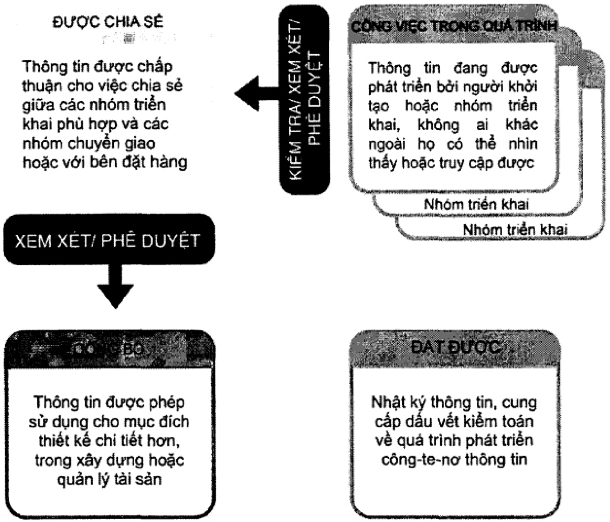

## 12.2 Trng thái công vic đang tin hành

Trng thái công vic đang tin hành đưc s dng cho thông tin đang đưc phát trin bi nhóm trin khai. Mt công-te-nơ thông tin  trng thái này s không th hin th hoc truy cp đưc đi vi bt k nhóm trin khai khác. Điu này đc bit quan trng nu giài pháp môi trưng d liu chung (CDE) đưc trin khai thông qua mt h thng chia sě, ví d: máy chů chia s hoc cng thông tin web.

## 12.3 Quá trình chuyn đi kim tra/xem xét/phê duyt

Quá trinh chuyn đồi kim tra/xem xét/phê duyt so sánh công-te-nơ thông tin vi ké hoch chuyn giao thông tin và vi các tiêu chun, phương pháp và quy trình to lp thông tin đã đưc chp thun. Quá trình chuyn đi kim tra/xem xét/phê duyt nên đưc thc hin bi nhóm trin khai ban đu.

## 12.4 Trng thái chia sè

Mc đích ca trng thái chia s cũng đưc s dng cho các công-te-nơ thông tin đã đưc phê duyt đ chia s vi bên đt hàng và săn sàng cho phép. Vic s dng trng thái chia sè này có th đưc goi là trng thái chia sè khách hàng.

## 12.5 Chuyn đi tinh trng xem xét/phê duyt

Chuyn đi tinh trng xem xét/phê duyt so sánh tát cà các công-te-nơ thông tin khi trao đi thông tin đ kim tra các yêu càu thông tin liên quan v s phi hp, s hoàn thin và tính chính xác. Nu côngte-nơ thông tin đáp úng đưc các yêu cu thông tin, trng thái đưc chuyn thành đã xut bn. Các

## TCVN 14177-1:2024

công-te-nơ thông tin không đáp ng đưc các yu cu thông tin đưc trà v trng thái công vic đang tin hành đ sa đi và trinh li.

Phê duyt s tách riêng thông tin ( trng thái đă xut bàn) có th đưc dùng trong bưc chuyn giao d '              t        dn oi tn g    g   g    n n    n g tg s

## 12.6 Trng thái đā xut bàn

Trng thái đã xut bn đưc dùng cho thông tin mà đā đưc cp phép s dng, ví d: vic xây dng m  d       s    n   ic     n i trong quá trinh khai thác s dng tài sn chi bao gm thông tin  trng thái đå xut bàn hoc trng thái luu tr.

## 12.7 Trng thái lưu trū

Trng thái lưu tr đưc s dng đ cha nht ký ca tt cà các công-te-nơ thông tin đă đưc chia sě và xut bàn trong sut quá trình quàn lý thông tin cũng như là du vt kim toán ca quá trinh phát trin ca các công-te-nơ thông tin. Mt công-te-nơ thông tin đưc tham chiu  trng thái lưu tr mà trưc đây là trng thái đã xut bn th hin thông tin có khà năng đã đưc s dng cho công vic thit k chi tit hơn, cho thi công công trinh hoc đ qun lý tài sn.

## 13 Tóm tt "Mô hinh hóa thông tin công trinh (BIM) theo b TCVN 14177"

Quàn lý thông tin khác vi to lp và chuyn giao thông tin, nhưng chúng đưc liên kt cht chē vi nhau. Qun ly thông tin đưc áp dng trong sut toàn b vòng đi ca tài sn. Các chc năng quàn ly cho     n     d h      n   e bên thc hin) và không nht thit phi yêu cu chǐ đnh/la chn t các t chc mi.

Lưng thông tin đang đưc quàn lý thưòng sē tăng lên trong cà giai đon chuyn giao và giai đon khai thác s dng. Tuy nhiên, chǐ nên cung cp hoc chuyn giao nhng thông tin liên quan giūa các hot đng trong giai đon khai thác s dng, giai đon chuyn giao.

Mt quá trinh qun lý thông tin đưc bt đu mi khi có mt tha thun cung cp thông tin mi ca giai đon chuyn giao hoc giai đon khai thác s dng bt k tha thun này là chính thc hay không chính thc. Quá trinh này bao gm vic chun b các yêu cu thông tin, xem xét các bên thc hin tim năng liên quan đn qun lý thông tin, lp k hoch ban đu, chi tit v cách thc và và thi gian thông tnk        s   n   n  n    s k chúng đưc đưa vào các h thng khai thác s dng. Quá trình quàn lý thông tin cn đưc áp dng sao cho tương xng vi quy mô và đ phc tap ca các hot đng qun lý d án hoc qun lý tài sàn.

Caen n n n b    n  n n n n Gn n n n iao Chu         h          hnng bua  ng g d a n   n n ng d  n d da n n  tn hin chính khi điu này đã đưc bên đt hàng cho phép.

Quy trinh CDE đưc s dng đ h tr hp tác to lp, qun lý, chia s và trao đi ca tt cà thông tin trong các giai đon khai thác s dng và chuyn giao.

## TCVN 14177-1:2024

Các mô hinh thông tin bao gm các chuyn giao thông tin liên kt đưc to lp bi tin trinh CDE nhm gii quyt các vn đè ca tt cà các bên quan tâm.

Trong quá trinh quàn lý thông tin, s lưng và mô tà các phàn trong vòng đi tài sàn (hinh ch nht khép kín), các mc trao đi thông tin (hinh tròn khép kín) và các thi đim quyt đnh cho các nhóm chuyn giao, các bên quan tâm hoc bên đt hàng (hình kim cương) nên phàn ánh thc tin đia phương, bên quan tâm và các yêu càu ca bên đt hàng, và bt k vǎn bn hoc yêu cu c th nào đi vi vic chuyn giao d án hoc qun lý tài sàn.

Các khái nim và nguyên tc trên đưc tóm tt trong Hinh 11.

Hinh 11 – Ví d v chuyn giao thông tin thông qua trao đi thông tin đ h tr các quyt đnh quan trong cùa bên đt hàng

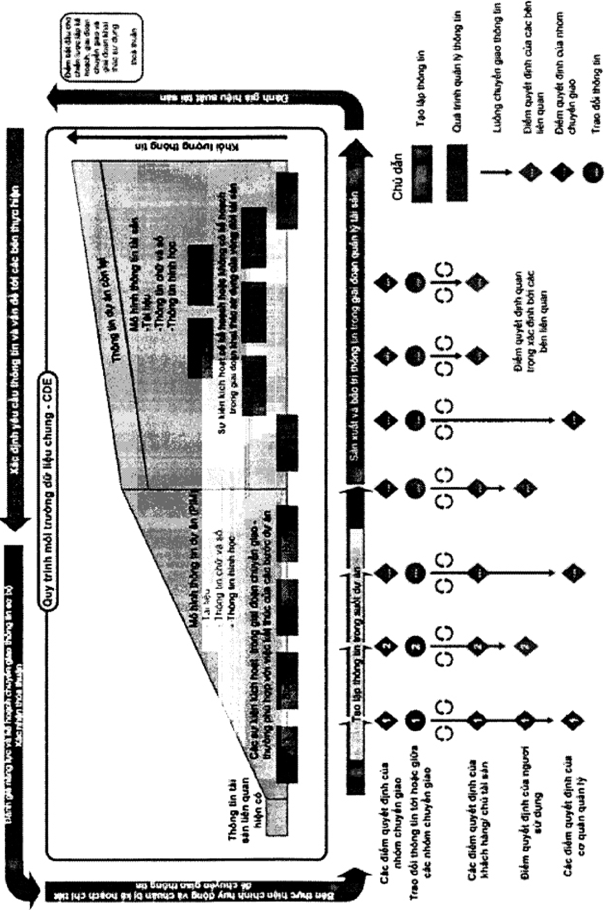

## Ph lc A

(tham khào)

## Minh ha v các chin lưc liên hp và phân chia cu trúc công-te-nơ thông tin

## A.1 Thông tin chung

Các chin lưc liên hp và các phân chia cu trúc công-te-nơ thông tin là nhng khái nim quan trng đ qun lý các mô hinh thông tin liên kt trong "BIM theo b TCVN 14177".

S liên hp và phân chia công-te-nơ thông tin đưc s dng đ:

- Cho phép các nhóm trin khai khác nhau làm vic trên các phàn khác nhau ca mô hinh thông tin cùng mt lúc mà không gây ra các vn đè v phi hp, ví d: các xung đt v không gian hoc không tưrơng thich v chc nǎng;
- – Hồ tr bo mt thông tin;
- – D dàng truyn tài thông tin bng cách giàm kích thưc các công-te-nơ thông tin riêng bit.

n   n d  n  n   n a g -- n d  ng  dnm dch vų cho các nhóm trin khai.

## A.2 Làm vic đồng thòi

Mt chin lưc liên hp cho phép làm vic đng thi xác đnh các ranh gii không gian, trong đó mi nhóm trin khai cn xác đnh các h thóng, thành phn hoc cu kin xây dng mà nhóm chju trách nhim.

Đi vi mt tài sn như mt tòa nhà, chin lưc liên hp có th đưc xác đinh thông qua mt tp hp cea  ng   ng n a  -g in  ng  nn  n n a hai hinh này đu liên quan ti các līnh vc thit k khác nhau.

## A.3 Bào mt thông tin

Mt       a a    n      n i tin nên tách các công-te-nơ thông tin hoc các phn ca tài sn theo các quyn truy cp thông tin. Đi vi mt tài sn liên quan đn tư pháp hình s, chng hn như nhà tù, cp đ hn ch khác nhau có th đưc áp dng đi vi các thông tin chung v đa đim công trinh (chng hn như v tri, tuyn đưng đi ca phương tin), đi vi thông tin thit k và xây dng tng th (chng hn như các mt bng sàn, không gian lân cn, các bin pháp x lý h thng thông gió và sưi m) và đi vi thông tin cų th v an  ns t   n n    n    n   it    e giam gi). Điu này đưc minh ha trong Hinh A.2.

## A.4 Truyèn tài thông tin

Mt      a -   a    g g  g  ten ga                     n   bena ti xung vi cơ s h tàng công ngh thông tin c th, ví dų 250 Mb. Mô hình thông tin khi đó nên đưc chia nhò đ không có công-te-n thông tin/vùng cha thông tin đơn lè nào ln hơn 250 Mb.

## TCVN 14177-1:2024

## CHÚ DÃN:

- 1 Kiên trúc;
- 2 Kt cu;
- 3 H thông cơ khí;
- 4 Điên;
- 5 Nuóc.

Hinh A.1 – Minh ha chin lưc liên hp không gian theo nguyên tc trong d án xây dng

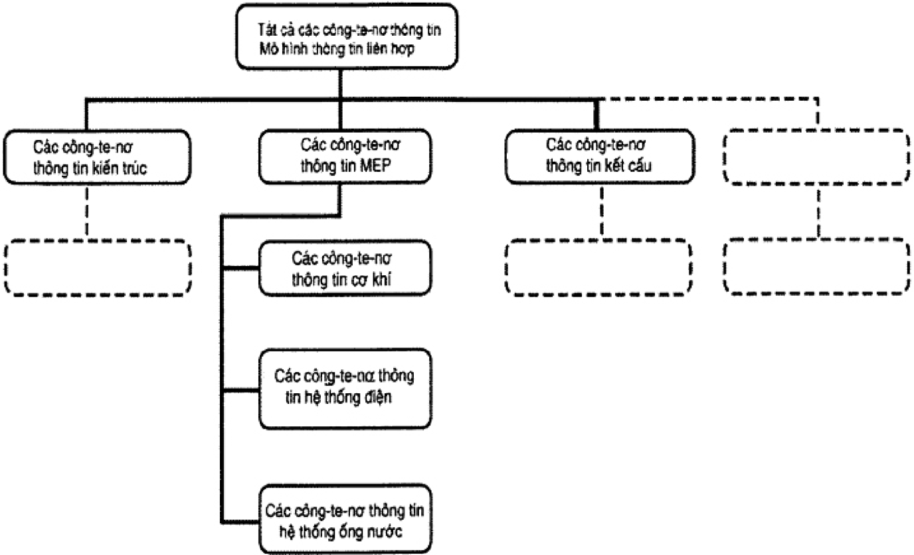

Hinh A.2 – Minh ha phân chia cu trúc công-te-nơ thông tin đ làm vic đồng thi

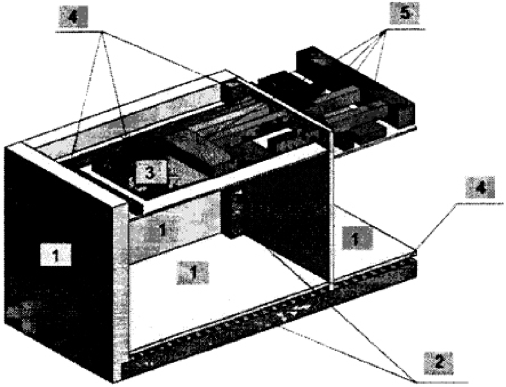

## TCVN 14177-1:2024

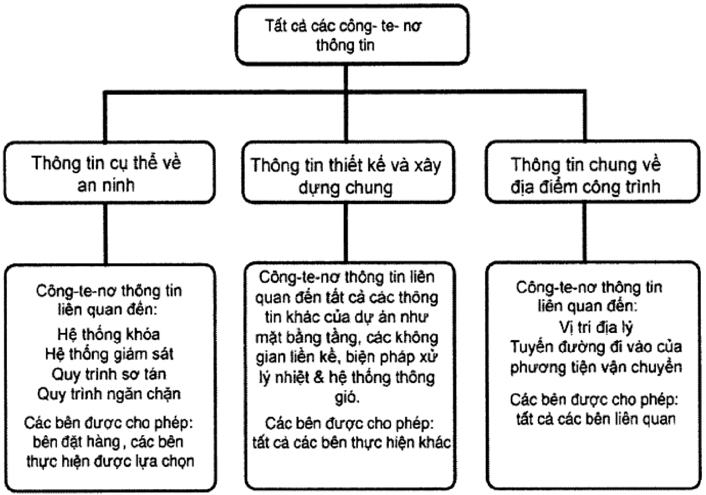

Hinh A.3 – Minh ha phân chia cu trúc công-te-nơ thông tin đ bào mt thông tin