## TCVN TIÊU CHUÂN QUÓC GIA

## TCVN 14177-2:2024

Xut bàn làn 1

## TÔ CHÚC VÀ SÓ HÓA THÔNG TIN VÈ CÔNG TRINH XÂY D'NG, BAO GÔM MÔ HINH HÓA THÔNG TIN CÔNG TRINH (BIM) - QUÀN LÝ THÔNG TIN S DNG MÔ HINH HÓA THÔNG TIN CÔNG TRINH – PHÀN 2: GIAI DOAN CHUYÉN GIAO TÀI SÀN

Organization and digitization of information about buildings and civil engineering works, including building information modelling (BIM) – Information management using building information modelling –

Part 2: Delivery phase of the assets

## Mc lc

## TCVN 14177-2:2024

## Trang

| Li nói đàu 5                                                   | Li nói đàu 5                                                                            |
|----------------------------------------------------------------|-----------------------------------------------------------------------------------------|
| 0                                                              | Li giói thiu. 7                                                                         |
|                                                                | 0.1 Mc đích .. 7                                                                        |
|                                                                | 0.2 Mi liên h vói các tiêu chun khác.. .8                                               |
|                                                                | 0.3 Li ích ca b TCVN 14177 8                                                            |
|                                                                | 0.4 Mi liên h gia các bên và các nhóm cho mc đích quàn lý thông tin ... .9              |
| 1                                                              | Phm vi áp dng.... .11                                                                   |
| 2                                                              | Tài liu vin dn.. .11                                                                    |
| 3                                                              | Thut ng và đinh nghīa và ký hiu.... .12                                                 |
| 3.1                                                            | Thut ng và đnh nghīa .12                                                                |
| 3.1.1 Thut ng chung. .12                                       | 3.1.1 Thut ng chung. .12                                                                |
|                                                                | 3.1.2 Các thut ng liên quan đn tài sàn và d án (terms related to assets and projects).. |
| 3.2                                                            | Ký hiu. .13                                                                             |
| 4                                                              | ua  n  n nn n  g n  n .13                                                               |
| 5                                                              | Quá trinh quàn lý thông tin trong giai đon chuyn giao tài sn.. 14                       |
| 5.1                                                            | Quá trinh quàn lý thông tin – Các hot đng đánh giá và xác đjnh nhu cu... 14             |
| 5.2                                                            | Quá trinh quàn lý thông tin – H sơ yêu cu. 18                                           |
| 5.3                                                            | Quá trinh qun lý thông tin – Hò sơ đ xut  ..21                                          |
| 5.4                                                            | Quá trinh quàn lý thông tin – Tha thun... .25                                           |
| 5.5                                                            | Quá trinh qun lý thông tin – Huy đng ... ..29                                           |
| 5.6                                                            | Quá trinh qun lý thông tin - Các hot đng hp tác to lp thông tin.... ..31                |
| 5.7                                                            | Quá trinh qun lý thông tin – Chuyn giao mô hinh thông tin . ..33                        |
| 5.8                                                            | Quá trinh qun lý thông tin – Kt thúc chuyn giao d án... ..35                            |
| Ph lc A (tham khào) Ma trn trách nhim quàn lý thông tin. ..37  | Ph lc A (tham khào) Ma trn trách nhim quàn lý thông tin. ..37                           |
| Phų lc B (tham khào) Ví d thc hin theo TCVN 14177-2:2024. ..41 | Phų lc B (tham khào) Ví d thc hin theo TCVN 14177-2:2024. ..41                          |
| Thư mc tài liu tham khào. ..48                                 | Thư mc tài liu tham khào. ..48                                                          |

## Lòi nói đàu

TCVN 14177-2:2024 đưc xây dng da trên cơ s tham khão ISO 19650-2:2018.

TCVN 14177-2:2024 do Tồng Công ty Tư vn xây dng Vit Nam – CTCP biên son, B Xây dng đ ngh, U ban Tiêu chun Đo lưòng Cht lưng Quc gia thm đnh, B Khoa hc và Công ngh công b.

## 0 Lòi giói thiu

## 0.1 Mc đích

Muo g         t  t  dd       h ng giai đon chuyn giao tài sàn và cung cp môi trưng hp tác và thương mi phù hp trong đó (nhiu) bên thc hin chính có th to ra thông tin mt cách hiu quà và tit kim.

Tiu chun này có th áp dng cho các tài sàn đưc xây dng và các d án xây dng thuc mi quy mô và moi mc đ phc tp, bao gm các bt đng sàn ln, mng lưi cơ s ha tng, các tòa nhà riêng l và các phàn cơ s h tàng cūng như các d án hoc chương trinh chuyn giao. Tuy nhiên, nhng yêu cu trong tiêu chun này phi đưc áp dng theo cách tương xng và phù hp vi quy mô va   s  n  n s  i  n       d d   ben thc hin d án cn đưc lng ghép  mc đ cao nht có th vi các quy trinh đưc văn bàn hóa đ mua sm và huy đng ký thut.

Te in          g  n,  nn   nn n   t này đưc s dng đ gii thiu danh sách các mc mà bn đưc đ cp càn suy nghī cn thn liên quan đn yêu cu chính đưc mô tà trong điu. Các cân nhc liên quan, thi gian cn thit đ hoàn tn  'n n n d d n    d n  g   n    im ca (nhng) bên liên quan và chính sách ca bt k quc gia nào v vic gii thiu mô hinh hóa thông ioe       s  n o   n    g n   loai bò vì không liên quan đn vic "phài xem xét" rt nhanh chóng.

Mt cách đ giúp xác đnh ni dung trong s nhng ni dung "phi xem xét" có tính phù hp có th là e   d n  n  n             a

Tiu chun này có th đưc s dng bi mt bên đt hàng bt k. Nu bên đt hàng d đnh áp dng tiu chun này cho bt k tài sn (d án) nào thì điu này phi đưc phn ánh trong tho thun.

Tiêu chun này xác đnh quy trình quàn lý thông tin, bao gm các hot đng mà qua đó các nhóm chuyn giao hp tác khi to thông tin và giàm thiu các hot đng lāng phi. Tiêu chun này ch yu dành cho nhůng đi tưng sau (xem Hình 1):

- – Nhũng bên tham gia vào vic quàn lý hoc to ra thông tin trong giai đoan chuyn giao tài sn;
- – Nhng bên tham gia vào vic xác đnh và mua sm các d án xây dng;
- – Nhng bên liēn quan đn vic chi đnh cų th và to điu kin thun li cho công vic cng tác;
- Nhng bên tham gia vào vic thit k, xây dng, khai thác s dng, bo trì và ngng hot đng tài sàn; và
- Nhng bên chu trách nhim to ra giá tr cho t chc t cơ s tài sàn ca ho.

Ti  n n   n  n   n  n  n un g   iao tài sàn đã xây dng, cn đưc xem xét và sa đi thưng xuyên cho đn khi đt kt quà tt nht.

## CHÚ DÅN:

AIM

Mô hình thông tin tài sàn

PIM

Mô hinh thông tin dư án

A Bt đàu giai đon chuyn giao – Chuyn thông tin liēn quan t AlM sang PIM

B Cài tin phát trin mò hinh yý tưrng thành mô hinh xây dng ào

C Kt thúc giai đon chuyn giao – Chuyn thông tin liên quan t PIM sang AlM

Hinh 1 - Phm vi ca tiêu chun này

## 0.2 Mi liên h vi các tiêu chun khác

Các khái nim và nguyên tc liên quan đn vic áp dng các yêu cu trong tiêu chun này đưc tham khào da trên ISO 19650.

Các thông tin chung trong quàn lý tài sn ca tiêu chun này có th thy tưrơng đng trong ISO 55000.

B:                 02. TCVN 14176-2:2024 đ phù hp vi tiêu chun tài liu và qun lý ca t chc.

## 0.3 Li ích ca b TCVN 14177

Mc đích ca b tiu chun này là h tr tt cà các bên đt đưc mc tiêu ca minh trong quá trinh tham gia vào hot đng xây dng thông qua vic to lp, s dng và quàn lý thông tin mt cách tưròng minh và hiu quà.

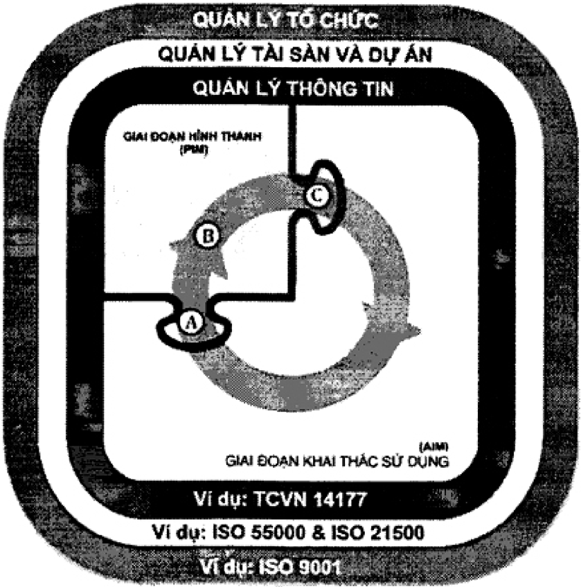

## 0.4 Mi liên h giūa các bên và các nhóm cho mc đích quàn lý thông tin

Mc đich trong tiêu chun này, Hinh s 2 biu th mi liên h gia các bên và các nhóm v mt liên kt thông tin, không bt buc phi là liên h hp đng.

Các thut ng dành cho c các bên và các nhóm đưc s dng xuyên sut tiu chun này đ xác đnh và chi đjnh bên chu trách nhim cho tng nhánh hot đng.

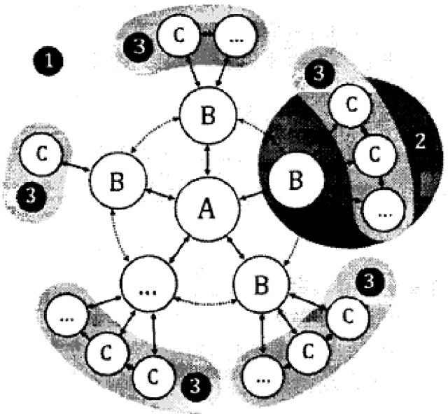

## CHÚ DÅN:

- A Bên đăt hàng

- B Bên thc hin chính

- C Bên thc hin

Linh hot thay đi s lương tham gia

- 1 Nhóm d án

- 2 Nhóm chuyn giao/phân phôi

- 3 Nhóm trièn khai

- Các yêu càu thông tin và trao đi thông tin

- Phi hp thông tin

Hinh 2 – Mi liên h giũa các bên và các nhóm cho mc đích quàn lý thông tin

## TIÊU CHUÂN QUÓC GIA

T chúc và s hóa thông tin v công trình xây dng, bao gm mô hình hóa thông tin công trinh (BIM) – Quàn lý thông tin s dng mô hình hóa thông tin công trình –

## Phàn 2: Giai đon chuyn giao tài sn

Organization and digitization of information about buildings and civil engineering works, including building information modelling (BIM) – Information management using building information modelling –

Part 2: Delivery phase of the assets

## 1 Phm vi áp dng

Tiêu chun này quy đnh các yêu cu v qun lý thông tin, dưi dng quá trinh qun lý, trong bi cành giai đon chuyn giao tài sn và trao đi thông tin bng cách s dng mô hinh hoá thông tin công trình.

Tiu chun này có th đưc áp dng cho tt cà các loi tài sàn cũng như cho mi loi hình và quy mô t chc, cho bt k chin lưc mua sm đã la chon.

CHÚ THÍCH 1: "BIM" Trong mt s trưng hp có th đưc hiu là mô hinh thông tin công trình, trong tiu chun này khuyén cáo s dung chung t "Mô hinh hóa thông tin công trinh".

CHÚ THíCH 2: Các ni dung trong tiêu chun này đưc hiu và áp dng mt cách tương xng, phù hp vi trng quy mô và mc đ phc tp ca d án.

## 2 Tài liu vin dn

Cae n  i   n   n   n d    i n  i   nam công b thì áp dng phiên bn đưc nêu. Đi vi các tài liu vin dn không ghi năm công b thì áp dng phiên bn mi nht, bao gm c các sa đi, b sung (nu có).

TCv    n           n    -n n tin công trinh (BIM) – Quàn lý thông tin s dng mô hinh hóa thông tin công trình – Phn 1: Khái nim và đinh nghīa;

TCVN 14176-2:2024, Công trinh xây dng – T chúc thông tin v công trình xây dng – Phn 2: Khung phân loi.

## TCVN 14177-2:2024

## 3 Thut ng và đnh nghīa và ký hiu

## 3.1 Thut ng và đnh nghīa

Trong tiêu chun này s dng các thut ng, đnh nghĩa trong TCVN 14177-1:2024 và các thut ng, đnh nghīa sau:

## 3.1.1 Thut ngű chung

3.1.1.1

Tiêu chí cháp nhn (acceptance criteria)

Bng chng cn thit đ đánh giá tha thun/yu cu đ đưc hoàn thành.

3.1.2 Các thut ng liên quan đn tài sàn và d án (terms related to assets and projects)

3.1.2.1

Nhóm d án (project team)

Bên đt hàng và tt cà các nhóm chuyn giao.

3.1.2.2

K hoch công vic (plan of work)

Tài liu mô tà chi tit các nhim v chính, nhân lc trong các giai đon thit k, thi công và bo trì ca môt d án.

Che    n s  a    i   g        n

3.1.3 Thut ngů liên quan dn quàn lý thông tin (terms related to information management)

3.1.3.1

K hoch thc hin BIM (BIM execution plan – BEP)

kh  n s c  a a   n    a d h a  en giao thc hin.

CHÚ THiCH: K hoch thc hin BIM trong h sơ đè xut càn tp trung vào phương pháp tip cn đưc đ xut ca nhóm chuyn giao đi vi quàn lý thông tin, năng lc và khà năng ca ho đ qun lý thông tin.

## 3.1.3.2

Móc chuyên giao thông tin (information delivery milestone)

S kin đưc đưa vào lich trình cho vic trao đi thông tin đưc xác đjnh trưc.

## 3.1.3.3

K hoch chuyn giao thông tin tồng th (master information delivery plan – MIDP) K hoch kt hp tt cà các k hoch chuyn giao thông tin nhim v (3.1.3.4) CHul   g g      ,,  ,  i ,  n  he

## 3.1.3.4

K hoch chuyn giao thông tin nhim v (task information delivery plan – TIDP) Lich trinh và thi gian phân phi các công-te-nơ thông tin cho tùng nhóm trin khai c th.

## 3.2 Ký hiu

- [ ] Bt đàu

- [ ] Kt thúc

- [ ] Quá trinh ph đã thu gon

- [x] 2.3 Hành đong

CHh  g    s           u        del and Notation) cho các t chúc khác nhau.

CHÚ THÍCH 2: Các ký hiu này có th đưc đièu chinh t UML - Ngôn ng mô hinh hóa thóng nht (Unified Modeling Language) đ có th mô hinh ha phàn mèm trong chuyn đi s.

## 4Quàn lý thông tin trong giai đon chuyn giao tài sàn/d án

Quá trinh qun lý thông tin (Hinh 3) s đưc áp dng trong sut giai đon chuyn giao cho tng tha thun, không phų thuc vào bưóc thc hin.

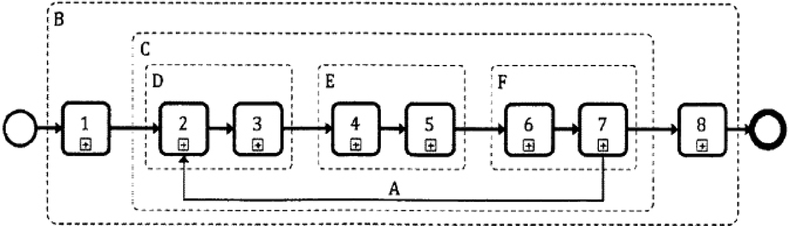

## Các hot đng:

- Đánh giá và xác đinh nhu càu
- Hò so yêu càu
- 3 Hò so đè xut
- 4 Thòa thun
- 5 Huy đng ngun lc
- 6 Hp tác to lp thông tin
- 7 Chuyn giao mô hinh thông tin
- 8 Két thúc (két thúc giai đon chuyn giao)

## Hinh 3 – Quá trinh quàn lý thông tin trong giai đon chuyn giao tài sàn

CHÚ THÍCH 1: Chính nhng hot đng này đā đưc s dng làm cu trúc cho tiu chun này, cų th là Điu 5.

CH       d g            in

CHÚ THÍCH 3: Trong trưng hp quá trinh qun lý thông tin đưc thc hin trong t chc, tha thun có th đưc b sung bng hưóng dn công vic ni b, sau đó là cháp nhn hưóng dān công vic và xác nhn đ tiép tuc. Xem TCVN 14177-1:2024, 6.3 và 8.1 đ bit thêm thông tin.

## 5 Quá trình qun lý thông tin trong giai đon chuyn giao tài sàn

## 5.1 Quá trinh quàn lý thông tin – Các hot đng đánh giá và xác đnh nhu cu

## 5.1.1 Chi đnh các cá nhân đàm nhn nhim v quàn lý thông tin

Bên đt hàng phi chú trng đn vic qun lý thông tin hiu quà trong sut d án và phàn ánh đưc chin lưc quàn lý thông tin tài sàn dài hn, như đưc mô tà trong TCVN 14177-1:2024, 5.3, bàng cách chi đinh các cá nhân thuc t chc ca bên đt hàng đm nhn nhim v qun lý thông tin thay mt cho bên đt hàng. Ngoài ra, bên đt hàng có th chi đnh mt bên thc hin chính tim năng hoc m t g   n n  n   n     a bên đt hàng phài thit lp rõ phm vi công vic.

Đ thc hin vic này, bên đt hàng phài xem xét:

- – Các nhim vų mà bên thc hin chính tim năng hoc bên th ba s chju trách nhim;
- – Thm quyn bên đt hàng s cp cho bên thc hin chính tim nǎng hoc bên th ba; và
- A Mô hinh thng tin đưc trin khai bi các nhóm chuyn giao tiép ni nhau (cho trng thòa thun)
- B Các hot đng đưc thc hin cho mi d án
- C Các hot đng đưc thc hin theo mi thòa thun
- D Các hot đng đưc thc hin trong bưc la chon thàu (cho mi thoa thun)
- E Các hoat đng đưc thc hin trong bưc lp k hoach thông tin (cho mõi thòa thun)
- F Các hoat đng trong bưc tao lp thông tin (cho mi tha thuân)

- – Năng lc (kin thc hoc các k năng) mà các cá nhân đàm nhn nhim vų quàn lý thông tin cn có.

ch n                 i        m vų quàn lý thông tin, vic s dng ma trn trách nhim quàn lý thông tin (Phų lc A) có th giúp thit lp phm vi các dich vų càn thiét.

## 5.1.2 Thit lp yêu cu thông tin d án

Bên đt hàng phài thit lp các yêu càu ca thông tin d án, như đưc mô tà trong TCVN 141771:2024, 5.3, đ gii quyt các câu hi mà bên đt hàng cn có các câu trà li ti mi đim quyt đinh quan trong trong sut d án.

Đ làm điu này, bên đt hàng phi xem xét:

- Quy mô d án;
- – Mc đích d kin v thông tin nào s đưc s dng bi bên đt hàng;
- – K hoch thc hin công vic ca d án;
- – L trinh gói thàu d kin;
- – S lưng đim quyt đinh quan trong cn đưra ra sut tin trinh ca d án;
- Các quyt đnh mà bên đt hàng cn đưa ra ti mi đim quyt đinh quan trong; và
- – Các câu hi mà bên đt hàng cn câu trà li đ đưa ra nhng quyt đnh sáng sut.

## 5.1.3 Thit lp các mc chuyn giao thông tin d án

Ben         a  i         an Đ làm đưc điu này, bên đt hàng phài xem xét:

- – Các thi đim quyt đnh quan trong ca bên đt hàng;
- – Nghīa v chuyn giao thông tin (nu có);
- – Bàn cht và ni dung ca thông tin đưc chuyn giao ti mi thi đim quyt đnh quan trong; vi
- – Thi gian tương ng vi mi thi đim quyt đnh quan trong mà mô hinh thồng tin đưc chuyn giao.

## 5.1.4 Thit lp tiêu chun thông tin d án

Bn d      g n         dé t d  t m tiêu chun thông tin ca d án.

Đ làm đưc điu này, bên đt hàng phi xem xét:

- a) Vic trao đi ca thông tin:
2. – Trong ni b t chc ca bên đt hàng;
3. – Gia bên đt hàng vi các bên liên quan bên ngoài;
4. – Gia bên đt hàng vi các đơn v khai thác s dng hoc bào trì;
5. – Gia bên thc hin chính tim năng và bên đt hàng;
6. – Gia các bên thc hin tièm nǎng trong cùng d án, và

## TCVN 14177-2:2024

- – Gia các d án đc lp.
- b) Phương tin đ cu trúc và phân loi thông tin.
- c) Phương pháp đ xác đnh mc đ ca thông tin yêu cu; và
- d) Vic s dng thông tin trong giai đon khai thác s dng tài sn.

## 5.1.5 Thit lp các phương pháp và quy trình to lp thông tin d án

Bên đt hàng phi thit lp các phương pháp và quy trinh to lp thông tin c th mà t chc ca ho yêu cu trong khuôn kh các phương pháp và quy trinh to lp thông tin ca d án.

Đ làm điu này, bên đt hàng phi xem xét:

- a) Thu thp thông tin tài sn hin hu.
- b) Vic to lp, xem xét hoc phê duyt thông tin mi.
- c) Vn đ bo mt hoc phân phi thông tin; và
- d) Chuyn giao thông tin cho bên đt hàng.

## 5.1.6 Thit lp thông tin tham chiu ca d án và tài nguyên chia s

Ben    i    s i   n     d t d  t c bên thc hin chính tim năng trong quá trình đu thàu hoc tha thun, s dng các tiêu chun d liu m bt c khi nào có th đ tránh trùng lp n lc và các vn đ v khà năng tương tác.

Khi thc hin vic này, bên đt hàng s xem xét:

- a) Các thông tin tài sàn hin hu:
2. – T trong t chc cùa bên đt hàng;
3. – Tù các bên khai thác s dng các tài sàn có liên quan (các công ty dich v tin ích; v.v...);
4. nn dd
5. – Trong các thư vin công cng và các tu liu lich s khác.
6. – Các ngun thông tin đưc chia s, ví d:
7. – Các mãu kt quà ca quá trinh (k hoch thc hin BIM, k hoch chuyn giao thông tin tng th, v.v.);
8. – Các mu công-te-nơ thông tin (các mô hinh hinh hc 2D/3D, các văn bàn, v.v.);
9. – Thư vin mu (đưng nét, mô phng vt liu, etc.); hoc
10. – Thư vin đi tưng (các ký hiu 2D, các vt th 3D, v.v.)
- b) Các thư vin đi tưng đưc xác đnh trong các tiu chun quc gia và khu vc.

CHÚ THÍCH: Bn đt hàng có th tim kim s h tr t các nhà cung cp chuyên bit đ thit lp thông tin tham chiu hoc tài nguyên chia sè.

## 5.1.7 Thit lp môi trưng d liu chung d án

Ba    n m (     ii   n dl t d  tn ca d án đ phc v các yêu cu chung ca d án và đ h tr hp tác to lâp thông tin (5.6).

Môi trưng d liu chung ca d án s có th:

- a) Mi công-te-nơ thông tin s có mt mã đnh danh (ID) duy nht, da trên mt quy ưc đã đưc thng nht và nêu rõ bng văn bàn, bao gm các līnh vc đưc tách ri bng du phân cách:
- b) Mi trưrng đưc gán mt giá tr t mt tiu chun mã ha đă đưc thng nht và nu rō bng văn bn.
- c) Mồi công-te-nơ thông tin s đưc gán các thuc tính sau:
4. – Trang thái (sư phù hp);
5. – Phiên bàn (thông tin v hiu chīnh);
6. – Phân loi (phù hp vi h thng khung phân loi đưc xác đnh trong TCVN 14176-2:2024.
- d) Khà năng chuyn tip giūa các trng thái ca các công-te-nơ thông tin.
- e) Ghi li tên ngưi s dng và ngày chuyn đi các phiên bn công-te-nơ thông tin; và
- f) Kim soát quyn truy cp  mc đ công-te-nơ thông tin.

Đc bit khuyn cáo rng CDE ca d án phi đưc thc hin trưc khi phát hành h sơ yu cu đ thon          i        c    oan

Bn đt hàng cūng có th chi đnh mt bên th ba đ làm ch trì, qun lý hoc h tr CDE ca d án. Trong trưng hp này, khuyn cáo rng vic này đưc thc hin như mt gói tha thun riêng trưc khi các bên thc hin bt đu mua sm. Hoc sau này, bên đt hàng cũng có th chi đnh/la chn mt bên thc hin chính đ làm ch trì, qun lý hoc h tr CDE d án. Trong cà hai trưng hp, bên đt hàng xác đnh yêu cu, đc tà yêu cu chc năng và yêu cu phi chc năng.

## 5.1.8 Thit lp giao thúc thông tin ca d án

Bm     i           d tha thun cp phép liên quan sau đó và mt cách thích hp, sē đưc đưa vào tt cà các gói tha thuân.

Đ làm vic này, bên đt hàng phi xem xét:

- – Nghīa v c th ca bên đt hàng, bên thc hin chính tièm năng và các bên thc hin tièm năng liên quan đn vic qun lý hoc tao lp thông tin, bao gm cà vic s dung môi trưng d liu chung ca d án;
- – Bt k s đm bo hoc trách nhim pháp lý nào có liên quan đn mô hinh thông tin d án;
- – Nn tàng và các vn đ liên quan v quyn s hu trí tu v thông tin;
- – Cách s dung thông tin tài sàn hin hūu;
- Cách s dng tài nguyên chia sè;
- Cách s dng thông tin trong thi gian thc hin d án, bao gòm các điu khoàn cp phép liên quan và;

## TCVN 14177-2:2024

- S dng li thông tin sau tha thun hoc trưng hp chm dt thòa thun.

## 5.1.9 Các hot đng đánh giá và xác đnh nhu càu

Các hot đng đánh giá và xác đinh nhu cu đưc trinh bày trong Hinh 4

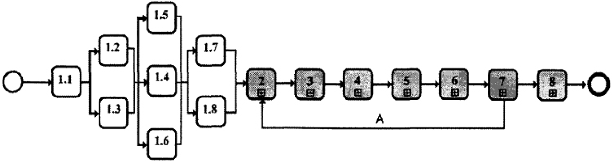

## CHÚ DÃN:

1.1

- Chi đnh các cá nhân đàm nhn nhim v quàn lý thông tin
- 1.2 Thit lp các yu cu thông tin ca d án
- 1.3 Thit lp các mc chuyn giao thông tin ca d án
- 1.4 Thit lp tiu chun thông tin d án
- 1.5 Thit lp các phương pháp và quy trinh to lp thông tin ca d án
- 1.6 Thit lp thông tin tham chiu và tài nguyên chia sè
- 1.7 Thit lp môi trưng dū liu chung d án
- 1.8 Thit lp giao thc thông tin trong (cùa) d án

A Mô hinh thông tin đưc tin hành bi các nhóm chuyn giao tip theo cho mi thòa thun. CHÚ THíCH: Các hot đng đưc hin thj song song nhàm nhn mnh rng các hot đng này có th đưc thc hin đòng thi và áp dung cho tt cà các trưng hơp.

## Hinh 4 – Quá trinh qun lý thông tin – Các hot đng đánh giá và xác đnh nhu càu

## 5.2 Quá trình quàn lý thông tin — Hò sơ yêu cu

## 5.2.1 Thit lp các yêu cu thông tin trao đi ca bên đt hàng

Bên đt hàng phi thit lp các yêu cu thông tin trao đi đ đáp ng yu cu ca bên thc hin chính tim nǎng trong quá trình tha thun.

Đ làm đưc vic này, bên đt hàng phi:

- ha  a a ia n ng ag  n g ng a n g ng   n  tnnn hin như th cn xem xét:
- – Các yêu càu thông tin t chúc (OIR);
- – Các yêu cu thông tin tài sàn (AIR); và

- – Các yêu cu thông tin d án (PIR).
- b) Thit lp mc đ nhu cu đ đáp ng vi mi yêu cu thông tin

CHÚ THíCH: Các phương pháp khác nhm mô tà trng thái thông tin, chng hn như đ chính xác, có th đưc b sung sau khi xem xét tính phù hp ca chúng.

- Ttix i    i     '      t n   tiee t
- – Tiu chun thông tin ca d án;
- – Các phương pháp và quy trinh to lp thông tin ca d án, và
- S dng thông tin tham chiu hoc tài nguyên chia sè do bên đt hàng cung cp.
- d) Thit lp thông tin h tr mà bên thc hin chính tièm năng có th cn, nhm gii thich đy đ tng yêu cu thông tin hoc tiu chí chp nhn, và đ thc hin điu này phi xem xét:
- – Thông tin tài sàn hin hu,
- – Các tài nguyên chia sè;
- – Các tài liu h tr hoc tài liu hưóng dn;
- – Vin dn các tiêu chun quc t, quc gia hoc ngành có liên quan; và
- – Ví d v các sn phm chuyn giao thông tin tưrơng t.
- e) Thit lp các thi đim (ngày) mà mi yêu càu phài đưc đáp úng, liên quan đn các mc quan trng trong vic cung cp thông tin ca d án và các thi đim quyt đinh quan trng ca bên đt hàng, đ thc hin vic này phi xem xét:
- – Thi gian cn thit đ bên đt hàng xem xét và chp thun thông tin;
- – Các quá trinh đm bo ni b ca bên đt hàng.

## 5.2.2 Tp hp thông tin tham chiu và tài nguyên chia sė

Bên đt hàng phi tp hp các thông tin tham chiu hoc các tài nguyên chia s đưc d đnh cung cp cho bên thc hin chính tim năng trong quá trình la chn hoc chi đnh đơn v thc hin.

Đ thc hin vic này, bên đt hàng phi xem xét:

- – Thông tin tham chiu hoc các ngun tài nguyên chia sè đưc xác đinh trong quá trình khi to d án;
- – Thông tin đưc to lp trong bưc trưc ca d án; và
- – S phù hp ca thông tin có th đưc s dng bi bn thc hin chính tim năng.

lun g     n  s e   n   n      niet lp sơ đ xut trong mt môi trưng bo mt, chng hn như môi trưng d liu chung ca d án. Lưu ý rng các bn đt hàng cn xác đnh tính phù hp mà thông tin có th đưc các bên thit lp so đ xut và nhóm chuyn giao s dng bng mã trng thái liên kt vi tng công-te-nơ thông tin.

## TCVN 14177-2:2024

## TCVN 14177-2:2024

## 5.2.3 Thit lp các yêu cu h so đ xut và tiêu chí đánh giá

Be         s n d ti        d  t ye cu ca ho.

Đ làm điu này, bên đt hàng phi xem xét:

- – Ni dung ca k hoch thc hin BIM (giai đon trưc khi ký tha thun) ca nhóm chuyn giao;
- Nǎng lc ca các cá nhân tièm nǎng đàm nhn nhim v quàn lý thông tin đi din cho nhóm chuyn giao;
- – Đánh giá ca bên thc hin chính tièm năng v năng lc và khà nǎng ca nhóm chuyn giao;
- – Phương án huy đng ca nhóm chuyn giao;
- – Đánh giá ri ro trong vic cung cp thông tin ca nhóm chuyn giao.

## 5.2.4 Biên son hò so yêu cu

Bên đt hàng phi tng hp thông tin đ đưa vào h sơ yêu cu.

Đ làm nhng điu này, bên đt hàng phi xem xét:

- – Nhng yêu cu thông tin trao đi ca bên đt hàng;
- – Thông tin tham chiu và tài nguyên chia sè có liên quan (trong môi trưng d liu chung ca d án);
- – Phn hi làm rō hò sơ yêu càu và tiêu chí đánh giá (nu có);
- – Các mc chuyn giao thông tin d án;
- Tiêu chun thông tin ca d án;
- Các phương pháp và quy trình to lp thông tin ca d án, và
- – Giao thúc thông tin ca d án.

## 5.2.5Các hot đng cho h sơ yêu càu

Các hot đng cho h sơ yêu cu th hin trong Hinh 5.

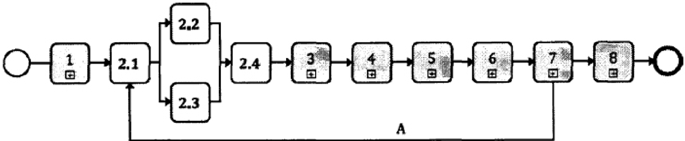

## CHÚ DÃN:

2.1 Thit lp các yêu càu thông tin trao đi ca bên đt hàng 2.2 Tp hp thông tin tham chiu và tài nguyên chia sè 2.3 Thit lp các yêu cu h sơ đ xut và tiêu chí đánh giá 2.4 Biên son h sơ yu cu A Mô hinh thông tin đưc tin hành bi các nhóm chuyn giao cho mi thòa thun ut    n        g    s s   n    h oi

<!-- formula-not-decoded -->

## 5.3 Quá trinh quàn lý thông tin – Hồ sơ đ xut

## 5.3.1 Đ c các nhân s đàm nhn nhim v quàn lý thông tin

Bên thc hin chính tièm nǎng phi quan tâm đn vic qun lý thông tin hiu quà trong sut thoà thun bng cách đ c các cá nhân trong t chc ca minh đ đàm nhn nhim v qun lý thông tin thay mt cho bên thc hin chính.

Ngoài ra, bên thc hin chính tim năng có th chi đnh mt bên thc hin tim năng hoc bên th ba đ đm nhn toàn b hoc mt phn chc năng qun lý thông tin, trong trưng hp này, bên thc hin chính phài thit lp phm vi dich v.

Đ thc hin vic này, bên đt hàng phi xem xét:

- – Các yêu càu thông tin trao đi ca bên đt hàng;
- Các nhim v mà bên thc hin chính tim năng hoc bên th ba s chu trách nhim;
- Thm quyn mà bên thc hin chinh tim năng s y quyn cho bên thc hin tièm năng hoc bên thú ba;
- – Năng lc (kin thc hoc k năng) mà các cá nhân đm nhn nhim v s cn; và
- Các tha thun xác thc v vic gii quyt nu xung đt li ích tim n có th phát sinh.

Bn đt hàng có th bồ nhim bên thc hin chính đ đm nhn toàn b hoc mt phàn chc nǎng quàn lý thông tin thay mt h. Trong trưng hp này, đ tránh mi xung đt li ích tim n, khuyn cáo là đ các cá nhân đàm nhn chúc năng quàn lý thông tin thay mt cho bên đt hàng hoc bên thc hin chính.

## TCVN 14177-2:2024

## 5.3.2 Thit lp k hoch thc hin BIM sơ b ca nhóm chuyn giao (trưc khi ký tha thun)

Bên thc hin chính tim năng phi thit lp k hoch thc hin BIM sơ b (trưc khi ký tha thun) ca nhóm chuyn giao vào h sơ đ xut ca bên thc hin chính tim năng.

Đ làm điu này, bên thc hin chính tim năng phi xem xét:

- a) Tên và lý lich trích ngang ca các cá nhân đi din cho nhóm chuyn giao d án đưc đ xut đ tham gia đàm nhn nhim vų quàn lý thông tin;
- b) Chin lurc chuyn giao thông tin ca nhóm chuyn giao, bao gòm:
3. – Cách tip cn ca nhóm chuyn giao đ đáp ng các yêu cu thông tin trao đi bên đt hàng;
4. – Mt tp hp các mc tiu cng tác phi hp to lp thông tin;
5. – Tồng quan vè cơ cu t chc và các mi liên h thương mi ca nhóm chuyn giao; và
6. – Tng quan v thành phàn nhóm chuyn giao d án, dưi hình thc mt hoc nhiu nhóm trin khai.
- c) Chin lưc liên hp đè xut s đưc nhóm chuyn giao thông qua;
8. o   nn   i    i  o       (d tu a  n n  n n  d n n   a   n d n an
- e) Các đ xut hoc hiu chinh ca nhóm chuyn giao v pháp và quy trinh to lp thông tin ca d án nhm nâng cao hiu quà, gòm có:
10. – Thu thp thông tin tài sn hin hūu;
11. – To lp, xem xét, phê duyt và cp phép thông tin;
12. – Bo mt và phân phi thông tin; và
13. – Chuyn giao thông tin cho bên đt hàng.
- f) Mi đ xut hoc hiu chinh ca nhóm chuyn giao v tiêu chun thông tin ca d án nhm nâng cao hiu quà, gồm có:
- Trao đi thông tin gia các nhóm trin khai;
16. – Phân phi thông tin vi các đơn v bên ngoài; hoc
17. – Chuyn giao thông tin cho bên đt hàng.
- g) Danh muc phn mm d kin (bao gm phiên bàn s dung), phàn cng và h tng công ngh thông tin mà nhóm chuyn giao d kién s dung.

## 5.3.3 Đánh giá năng lc và khà năng ca nhóm trin khai

Mi nhóm trin khai phi chju trách nhim đánh giá năng lc và khà năng cung cp đ chuyn giao thông tin ca mình da theo các yêu càu chuyn giao thông tin ca bên đt hàng và k hoch thc hin BIM đưc đ xut (trưc khi ký tha thun) ca nhóm chuyn giao.

Đ làm điu này, mi nhóm trin khai phi xem xét:

- a) Năng lc và khà năng đ quàn lý thông tin ca nhóm trin khai, da trên:

- Kinh nghim liên quan và s lưng thành viên nhóm trin khai đã quàn lý thông tin theo chin lưc chuyn giao thông tin đ xuát; và
- – Các chương trinh ging dy và đào to mà các thành viên nhóm trin khai đå tham gia.
- b) Năng lc và khà năng to lp thông tin ca nhóm trin khai, da trên:
- – Kinh nghim lin quan và s lưng thành viên nhóm trin khai đă to lp thông tin phù hp vi các phương pháp và quy trinh to lp thông tin ca d án; và
- – Các chương trinh ging dy và đào to mà các thành viên nhóm trin khai đã tham gia;
- c) Khà năng săn có ca công ngh thông tin (CNTT) trong ni b nhóm trin khai, da trên:
- K hoch CNTT đưc đ xut;
- – Thông s ký thut và s lưng phàn cng ca nhóm trin khai;
- –Cu trúc, công sut ti đa và mc đ s dng hin hành ca h tàng CNTT ca nhóm trin khai;
- – Các tha thun h tr và mc đ cung cp dich v sån có cho nhóm trin khai.

## 5.3.4 Thit lp năng lc và khà năng ca nhóm chuyn giao

Bên thc hin chính tim năng phài thit lp năng lc và khà năng ca nhóm chuyn giao bàng cách tp hp các đánh giá đưc thc hin bi mi nhóm trin khai đ đưa ra bàn tóm tt v năng lc qun lý và to lp thông tin cũng như khà năng chuyn giao thông tin kp thi ca nhóm chuyn giao.

## 5.3.5 Thit lp k hoch huy đng ca nhóm chuyn giao

Bên thc hin chính tim năng phài thit lp k hoch huy đng cho nhóm chuyn giao mà đưc bt đu và thc hin trong quá trinh huy đng (5.5).

Đ làm đưc đièu này, bên thc hin chính tim năng phi xem xét cách tip cn, khung thi gian và trách nhim cho:

- – Th nghim và vic ghi nhn văn bn các pháp và quy trinh to lp thông tin đ xuát;
- Th nghim trao đi thông tin gia các nhóm trin khai;
- Th nghim chuyn giao thông tin cho bên đt hàng;
- – Cu hình và th nghim vn hành CDE ca d án theo 5.1.7;
- – Cu hinh và th nghim vn hành CDE ca nhóm chuyn giao (đã phân b) và khà năng kt ni vi CDE ca d án (nu có) theo 5.1.7;
- – Mua sm, lp đt, cu hinh và th nghim vn hành phàn mm b sung, phàn cng và h tng CNTT;
- – Phát trin tài nguyên chia sè s đưc s dng bi nhóm chuyn giao d án;
- -Phát trin và t chc tp hun (các kin thc cn thit) cho các thành viên nhóm chuyn giao d án;
- – Phát trin và t chc đào to (các k năng cn thit) cho các thành viên nhóm chuyn giao d án;
- y   g  n   n   n    n na
- – H tr các cá nhân, tồ chc tham gia nhóm chuyn giao trong sut thòa thun.

## TCVN 14177-2:2024

## 5.3.6 Thit lp danh mc ri ro ca nhóm chuyn giao

Ben    n a    n     nd g     bao gm các ri ro liên quan đn vic cung cp thông tin đúng thi hn, phù hp vi các yêu cu chuyn ia  a  i n   n g   n    n na

Đ làm đưc điu này, bên thc hin chính tim năng phi xem xét các ri ro liên quan đn:

- – Các già đnh mà nhóm chuyn giao đưa ra liên quan đn các yêu cu thông tin trao đi ca bên đt hàng;
- – Đáp ng các mc chuyn giao trong vic cung cp thông tin d án ca bên thc hin;
- – Các ni dung ca giao thúc thông tin d án;
- – Đáp ng chin lưc chuyn giao thông tin đă đ xut;
- – Thông qua tiêu chun thông tin ca d án cūng như phương pháp và quy trình to lp thông tin;
- – Bao gm (hoc không bao gm) các sa đi đưc đ xut cho tiu chun thông tin ca d án; và
- – Huy đng nhóm chuyn giao đ đt đưc năng lc và khà năng cn thit.

CHÚ THíCH: Đăng ký ri ro ca nhóm chuyn giao có th đưc kt hp trong các danh mc ri ro khác s dung trong sut d án.

## 5.3.7 Tồng hp h so đ xut ca nhóm chuyn giao

Bên thc hin chính tim năng phi tng hp (nu có) các mc sau đ đưa vào hò sơ đ xut ca nhóm chuyn giao:

- – (Trưc khi ký tha thun) k hoch thc hin BIM sơ b (5.3.2);
- Tóm tt năng lc và kh năng (5.3.4);
- – K hoch huy đng (5.3.5); và
- – Đánh giá ri ro chuyn giao thông tin (5.3.6).

## 5.3.8 Các hot đng cho hò so đ xut

Các hot đng cho h sơ đ xut th hin như Hinh 6.

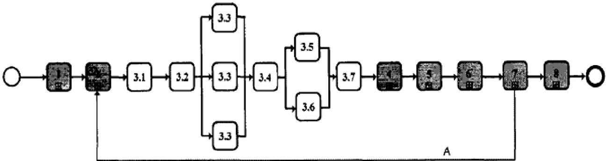

## CHÚ DÃN:

- 3.1 Đ c các nhân s có nhim v quàn lý thông tin
- 3.2 Thit lp k hoch thc hin BIM ca nhóm chuyn giao (trưc khi ký tha thun)
- 3.3 Đánh giá nǎng lc và khà nǎng ca nhóm trin khai
- 3.4 Thit lp năng lc và khà năng ca nhóm chuyn giao
- 3.5 Thit lp k hoch huy đng ca nhóm chuyn giao
- 3.6 Thit lp danh mc ri ro ca nhóm chuyn giao
- 3.7 Tng hp h sơ đ xut ca nhóm chuyn giao
- A Tin trinh mô hình thông tin ca nhóm chuyn giao tip theo cho mi thòa thun.

CHÚ THÍCH 1: Hot đng 3.3 đưc hin th nhièu làn nhm nhn mnh rng mi nhóm trin khai đu phi thc hin mc này.

Ca   a n            g s  g  n   ng  h i

## Hinh 6 – Quá trình quàn lý thông tin – Hồ sơ đ xut

## 5.4Quá trinh quàn lý thông tin – Thòa thun

## 5.4.1Xác nhn k hoch thc hin BIM ca nhóm chuyn giao

Bên thc hin chính phi xác nhn k hoch thc hin BIM ca nhóm chuyn giao trong thồa thun vi tng bên thc hin.

Đ làm điu này, bên thc hin chính phài xem xét:

- a) Xác nhn các cá nhân c th s đm nhn nhim vų quàn lý thông tin trong nhóm chuyn giao;
2. C(h o   a o ia o a G a o     aa
- c) Cp nht ma trn trách nhim cp đ cao ca nhóm chuyn giao d án (theo yêu càu);
- d) Xác nhn và ghi nhn vǎn bn các phương pháp và quy trinh to lp thông tin đưc đ xut ca nhóm chuyn giao;
- e) Thng nht vi bên đt hàng bt k b sung hoc sa đi nào đi vi tiu chun thông tin ca d án; và
6. an     ng g    ng n 'g n  n   n giao sě s dng.

## TCVN 14177-2:2024

## 5.4.2 Thit lp ma trn trách nhim chi tit ca nhóm chuyn giao

Be      t   a  n h    s d    in chi tit, trong đó xác đnh:

- Thông tin nào s đưc to lp;
- – Thi gian thông tin đưc trao đi và đi tưng trao đi thông tin; và
- – Nhóm trin khai chju trách nhim cho vic to lp các thông tin tương ng;

Đ thc hin vic này, bên thc hin chính phi xem xét:

- – Các mc chuyn giao thông tin;
- – Ma trn trách nhim múc đ cao;
- – Các phương pháp và quy trinh to lp thông tin ca d án;
- – Các thành phn cu trúc phân chia ca công-te-nơ thông tin đưc phân b cho tng nhóm trin khai; và
- – Các yu t phų thuc trong quá trinh to lp thông tin.

## Gi n            i hinh

Bên thc hin chính phi thit lp các yêu cu thông tin trao đi cho mi bên thc hin khi phi hp vi các nhóm ni b, bên thc hin chính nên thit lp mt k hoch rõ ràng v các yêu cu thông tin như đ đt đưc tha thun chính thc.

Đ làm đièu này bên thc hin chính phi xem xét:

- a) Xác đnh r tng yêu cu thông tin, và đ thc hin điu này cn xem xét:
2. – Các yêu cu thông tin t bên đt hàng, bên thc hin chính yêu cu bên thc hin đáp ng; và
3. – Bt k các yu cu thông tin b sung mà bên thc hin chính yêu cu bên thc hin phi đáp ng;
- b) Thit lp mc nhu cu thông tin nhm đáp ng trng yêu cu ca thông tin sn xut; CHÚ THiCH: Các phương pháp đo lưng khác đ mò tà trng thái thông tin, chng han như mc đ chinh xác, có th đưc

b sung sau khi xem xét tính phù hp cùa chúng.

- c) Thit lp tiu chí chp nhn cho tng yêu cu thông tin, và đ thc hin điu này càn xem xét:
- Tiêu chun thông tin ca d án;
3. – Các phương pháp và quy trinh to lp thông tin ca d án; và
4. – Vic s dng thồng tin tham chiu hoc tài nguyên chia sè đưc bên đt hàng hoc bên thc hin chính cung cp;
- d) Thit lp thi hn (ngày) mà mi yêu cu phi đưc đáp ng, có liên quan đn các mc chuyn giao thông tin ca d án, và đ thc hin phi xem xét:
6. – Thi gian cn thit đ bên thc hin chính xem xét và chp thun thông tin, và
7. – Các quá trinh ni b nhm đàm bo cht lưng ca bên thc hin chính;

## TCVN 14177-2:2024

- e) Thit lp thông tin hồ tr mà bên thc hin có th cn, giúp hiu rō hoc đánh giá đy đ tng yêu cu thông tin hoc các tiu chí chp nhn , và đ thc hin điu này phi xem xét:
- Thông tin tài sàn hin hūu;
3. – Các tài nguyên chia sè;
4. – Tài liu h tr hoc tài liu hưng dn;
5. – Tham chiu đn các tiêu chun ngành, quc gia hoc quc t có liên quan; và
6. – Các mu sàn phm chuyn giao thông tin tương t.

## 5.4.4 Thit lp các k hoch chuyn giao thông tin nhim v

Mi nhóm trin khai phài thit lp mt k hoch chuyn giao thông tin nhim vų (TIDP), và duy trì trong sut quá trình thc hin tha thun.

Đ làm vic này, nhóm trin khai phài xem xét:

- – Các mc chuyn giao thông tin ca d án;
- – Trách nhim ca nhóm trin khai trong ma trn trách nhim chi tit;
- – Các yêu cu thông tin ca bên thc hin chính;
- – Các tài nguyên chia sè có săn trong nhóm chuyn giao; và
- To ht (t d     nd l     t i    i in Đi vi mi công-te-nơ thông tin, k hoch chuyn giao thông tin nhim vų (TIDP) cn lit k và xác đnh:
- Tên và tiêu đè;
- – Phiên bàn thông tin trưc hoc phiên bn phų thuc;
- – Mc đ nhu càu thông tin;
- – Thi gian to lp thông tin (uưc tính);
- – Tác già thông tin chu trách nhim cho vic to lp thông tin; và
- – Các mc chuyn giao thông tin.

## 5.4.5 Thit lp k hoch chuyn giao thông tin tồng th

Be    (     i  n    d    tie khai đ thit lp k hoch chuyn giao thông tin tồng th (MIDP) ca nhóm chuyn giao.

Đ làm điu này, bên thc hin chính phài xem xét:

- – Các trách nhim đưc giao trong ma trn trách nhim chi tit;
- – Thông tin trưc đó hoc s ph thuc vào thông tin gia các nhóm trin khai;
- Tn  t   n  n  n     n  n i
- – Thi gian bên đt hàng cn có đ xem xét và chp thun mô hình thông tin.

## TCVN 14177-2:2024

Saun h      n (d     n     can

- – Xác đinh các mc chuyn giao và các ngày trong k hoch chuyn giao thông tin tng th (MIDP);
- Thông báo tng nhóm trin khai và lưu ý nu có bt c thay đi nào ca k hoch chuyn giao thông tin nhim vų (TIDP); và
- Th   n  n        s  g     g iao thông tin ca d án.

## 5.4.6 Hoàn thin các hò sơ tha thun bên thc hin chính

Bên đt hàng phi xem xét nhng điu dưi đây, trong đó nhng điu này càn đưc bao gm trong hò sơ tha thun đã hoàn chinh cho bên thc hin chính và đưc quàn lý thông qua quy trinh kim soát thay đi trong sut thi gian ca tha thun:

- – Các yêu cu thông tin trao đi ca bên đt hàng;
- – Tiu chun thông tin ca d án (bao gồm bt k b sung hoc sa đi đå đưc thng nht);
- – Giao thc thông tin ca d án (bao gm bt k b sung hoc sa đi đã đưc thng nht);
- – K hoch thc hin BIM ca nhóm chuyn giao; và
- – K hoch chuyn giao thông tin tồng th (MIDP) ca nhóm chuyn giao.

## 5.4.7 Hoàn thin các h sơ tha thun ca bên thc hin

Bn thc hin chính phi xem xét nhng điu dưi đây, trong đó nhng điu này cn đưc bao gm trong h sơ tha thun đå hoàn chīnh cho bên thc hin và đưc quàn lý thông qua quy trình kim sot thay đi trong sut thi gian ca tha thun:

- -Các yêu cu thông tin trao đồi ca bên thc hin chính;
- –Tiu chun thông tin ca d án (bao gm bt k b sung hoc sa đi đå đưc thng nht) (xem 5.1.4);
- – Giao thc thông tin ca d án (bao gm bt k b sung hoc sa đi đă đưc thng nht);
- – K hoch thc hin BIM ca nhóm chuyn giao; và
- – K hoch chuyn giao thông tin nhim v (TIDP) đ đưc thng nht.

## 5.4.8 Các hot đng thòa thun

Các hot đng đi vi tha thun th hin trong Hinh 7.

## TCVN 14177-2:2024

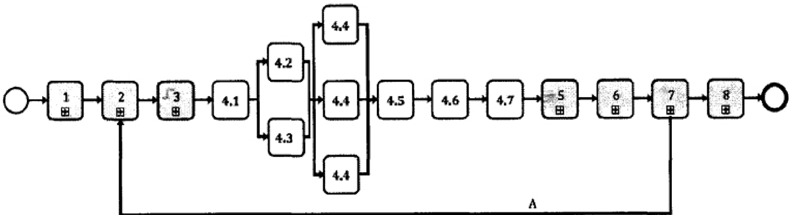

## CHÚ DÅN:

- 4.1 Xác nhn k hoąch thc hin BIM ca nhóm chuyn giao
- 4.2 Thit lp ma trn trách nhim chi tit ca nhóm chuyn giao
- 4.3 Thit lp các yêu cu chuyn giao thông tin ca bên thc hin chính
- 4.4 Thit lp các k hoch cung cp thông tin nhim v
- 4.5 Thit lp k hoch chuyn giao thông tin tồng th
- 4.6 Hoàn thin các hò sơ thòa thun bên thc hin chính
- 4.7 Hoàn thin các hò sơ thồa thun bên thc hin
- A Mô hinh thông tin đưc tin hành bi các nhóm chuyn giao d án cho trng thồa thun

CHÚ THÍCH 1: Các hot đng đưc hin th song song nhàm nhn mnh rng các hot đng này có th đưc thc hin đng thòi.

CHÚ THíCH 2: Hoat đng 4.4 đưc hin th nhiu làn đ nhn manh rng mi nhóm trin khai càn thc hin hot đng

<!-- formula-not-decoded -->

## 5.5 Quá trinh quàn lý thông tin – Huy đng

## 5.5.1 Huy đng nguồn lc

Bên thc hin chính phi huy đng các ngun lc như đã đưc xác đnh trong k hoch huy đng ca nhóm chuyn giao (5.3.5).

Đ làm điu này, bên thc hin chính phi xem xét:

- Xác nhn nguồn lc săn có ca tng nhóm trin khai;
- Phát trin và chuyn giao giàng dy các ch đè hoc t chc các lp tp hun v phm vi d án, cac  c  (ti  c c  c c  cn  c  C   vien nhóm chuyn giao, và
- – Phát trin và thc hành đào to (yêu cu ký năng) cho các thành viên nhóm chuyn giao.

## 5.5.2 Huy đng công ngh thông tin

Bên thc hin chính phi huy đng công ngh thông tin như đã đưc xác đnh trong k hoch huy đng ca nhóm chuyn giao (5.3.5).

## TCVN 14177-2:2024

Đ làm điu này, bên thc hin chinh phi:

- – Mua sm, lp đt, xác đnh cu hinh và th nghim phàn mm, phàn cng và hą tàng công ngh thông tin (theo yêu cu);
- – Cu hinh và th nghim CDE ca d án theo 5.1.7;
- – Cu hinh và th nghim CDE (đā phân b) ca nhóm chuyn giao và kh năng kt ni ca nó vi CDE d án (nu có) theo 5.1.7;
- Th nghim công vic trao đi thông tin gia các nhóm trin khai; và
- – Th nghim chuyn giao thông tin cho bên đt hàng.

## 5.5.3 Th nghim các phương pháp và quy trình to lp thông tin ca d án

Bên thc hin chính phi th nghim các phương pháp và quy trinh to lp thông tin ca d án như đã đưc xác đnh trong k hoch huy đng ca nhóm chuyn giao (5.3.5).

Đ làm điu này, bên thc hin chính phi xem xét:

- – Th nghim và ghi nhn văn bàn các phương pháp và quy trinh to lp thông tin ca d án;
- – Sàng lc và xác minh tính khà thi cu trúc phân chia ca công-te-nơ thông tin đã đ xut;
- – Phát trin tài nguyên chia s đ nhóm chuyn giao s dng; và
- – Truyn đt các phương pháp và quy trinh to lp thông tin ca d án cho tt cà các nhóm trin khai.

## 5.5.4 Các hot đng huy đng

Các hot đng huy đng đưc th hin trong Hinh 8.

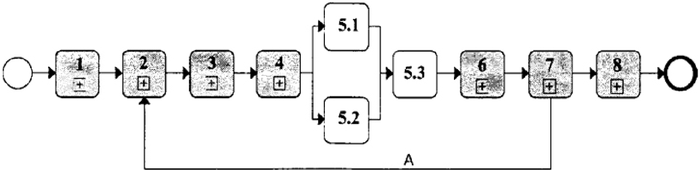

## CHÚ DÃN:

- 5.1 Huy đng ngun lc
- 5.2 Huy đng công ngh thông tin
- 5.3 Te  n     g  n d d g  m
- A Mô hinh thông tin đưc tin hành bi các nhóm chuyn giao tip theo cho mi tha thun

CHÚ THiCH: Các hot đng đưc hin th song song đ nhn mnh rng các hot đng này có th đưc thc hin đng thi.

<!-- formula-not-decoded -->

## 5e     g    -      ng ing

## 5.6.1 Kim tra tính sn có ca thông tin tham chiu và các tài nguyên chia sė

Trưc khi to lp thông tin, mi nhóm trin khai phài kim tra xem h có truy cp đưc vào h thng thông tin tham chiu và tài nguyên chia sě trong môi trưng d liu chung ca d án không. Nu không. h cn phài thông báo càng sm càng tt cho bên thc hin chinh và đánh giá tác đng tim n mà có th nh hưng đn đn k hoch chuyn giao thông tin nhim v (TIDP).

## 5.6.2 To lp thông tin

Moi ng n n     a g    g a h

Đ làm điu này, nhóm trin khai phi xem xét:

- a) To lp thông tin:
2. – Tuân th tiêu chun thông tin ca d án, và
3. – Phù hp vi các phương pháp và quy trinh to lp thông tin ca d án;
- b) Không to lp thông tin mà:
- Vurt quá mc nhu càu thông tin;
6. – Nm ngoài phm vi các yu t đă đưc phân b trong cu trúc phân chia ca công-te-nơ thông tin;
7. – Trùng lp vi các thông tin thuc phm vi to lp ca các nhóm trin khai khác, hoc
8. – Cha chi tit không cn thit.
- c) Phi hp và tham chiu chéo toàn b thông tin vi nhng thông tin đưc chia sě trong môi trưng dū liu chung ca d án, phù hp vi các phương pháp và quy trinh to lp thông tin ca d án; và

d) Phi hp không gian các mô hình hinh hc vi nhau đưc chia s phù hp, nm trong môi trưng d liu chung ca d án.

Trong trưng hp có vn đ v phi hp, các nhóm trin khai có liên quan cn hp tác đ tìm mt gii pháp khà thi. Nu không th tim đưc gii pháp, các nhóm trin khai cn thông báo cho bên thc hin chính.

## 5.6.3 Thc hin kim tra đàm bào chát lưng

Mi nhóm trin khai phi thc hin vic kim tra đm bào cht lưng ca tng công-te-nơ thông tin, phù hp vi các phương pháp và quy trình to lp thông tin ca d án, trưc khi đm nhn xem xét thông tin bên trong nó (5.6.4).

Đ làm điu này, nhóm trin khai phi kim tra công-te-nơ thông tin phù hp vi tiêu chun thông tin ca d án.

Mi làn hoàn thành vic kim tra, nhóm trin khai s:

- a) Nu kim tra thành công:
- Đánh du công-te-nơ thông tin đă đưc kim tra; và
- Ghi li kt quà kim tra; hoc

## TCVN 14177-2:2024

- b) Nu kim tra không thành công:
2. – Tù chi công-te-nơ thông tin, và
3. -- Thông báo cho tác già to lp thông tin v kt qu và hành đng khc phc càn thit.

CHÚ THÍCH 1: Vic kim tra có th đưc thưc hin t đng trong m trưng d liu chung ca d án.

Ch-g  g a   d     g t  n  g   a  n  h o thông tin đó; do đó không th thay th cho vic xem xét và chp thun ni dung thông tin bên trong (5.6.4)

## 5.6.4 Xem xét thông tin và chp thun chia sė

Theo đúng các phương pháp và quy trinh to lp thông tin ca d án, mi nhóm trin khai phi xem xeta g  tn g g g  tng  g g g tg g --tg g g  tuna dư án.

Đ làm điu này, nhóm trin khai phi xem xét:

- – Các yêu cu thông tin ca bên thc hin chính
- Mc đ nhu cu thông tin; và
- – Thông tin cn thit đ phi hp vi các nhóm trin khai khác.

Mi ln hoàn thành vic xem xét, nhóm trin khai d án sê:

- a) Nu kim tra thành công:
2. – Gán mã trng thái phù hp cho thông tin trong công-te-nơ thông tin thông tin có th đưc s dng,
3. – Chp thun công-te-nơ thông tin thông tin đưc chia s;
- b) Nu kim tra không thành công:
5. – Ghi li lý do xem xét không thành công;
6. – Ghi li moi sa đi đ nhóm trin khai hoàn thành, và
- Tùr chi công-te-nơ thông tin.

## 5.6.5 Xem xét mô hinh thông tin

Nhóm chuyn giao phài tin hành xem xét mô hình thông tin theo đúng các phương pháp và quy trinh to lp thông tin ca d án, đ to điu kin cho vic phi hp thông tin liên tc cho tng thành phàn ca mô hình thông tin.

Đ làm điu này, nhóm chuyn giao phài xem xét:

- – Các yêu cu thông tin và tiu chí chp thun ca bên đt hàng; và
- – Các công-te-nơ thông tin đưc lit kê trong k hoch chuyn giao thông tin tng th.

## 5.6.6 Các hot đng hp tác to lp thông tin

Các hot đng hp tác to lp thông tin đưc th hin trong Hinh 9.

## TCVN 14177-2:2024

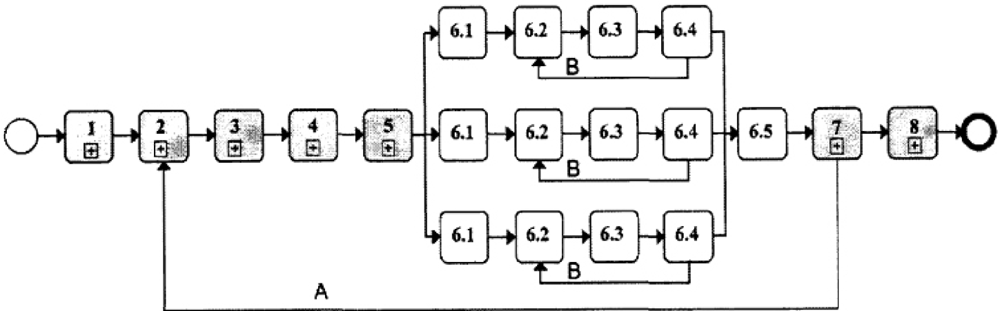

## CHÚ DÃN:

- 6.1 Kim tra tính săn có ca thông tin tham chiu và tài nguyên chia sě
- 6.2 To lp thông tin
- 6.3 Kim tra đàm bào cht lưrng hoàn chinh
- 6.4 Xem xét thông tin và chp thun chia sě
- 6.5 Xem xét mô hinh thông tin
- A Mô hinh thông tin đưc tin hành bi các nhóm chuyn giao tip theo cho mi tha thun
- B Sa đi công-te-nơ thông tin mói

Che          g               h em xét mô hinh thông tin.

CHh  g                 g         an đ đ trinh cho bên thc hin chính cháp thun.

## Hinh 9 – Quá trinh quàn lý thông tin – Các hot đng hp tác to lp thông tin

## 5.7 Quá trinh quàn lý thông tin – Chuyn giao mô hình thông tin

## 5.7.1Đ trinh mô hinh thông tin đ bên thc hin chính chp nhn

Trưc khi chuyn giao mô hinh thông tin cho bên đt hàng, mi nhóm trin khai phài đ trinh mô hinh thông tin ca h cho bên thc hin chính đ cho phép trong môi trưng dū liu chung ca d án.

## 5.7.2 Xem xét và chp nhn mô hinh thông tin

Ben dnd   n  n     n     d n   va quy trinh to lp thông tin ca d án.

Đ làm điu này, bên thc hin chính phi xem xét:

- Dana  g  g g hng   g  n   n o g h
- Các yêu cu thông tin trao đi ca bên đt hàng;
- Các yêu càu thông tin trao đi ca bên thc hin chính;
- Tiêu chí chp nhn cho tùrng yêu cu thông tin; và

## TCVN 14177-2:2024

- – Mc đ nhu cu thông tin cho tùng yêu cu thông tin.

Nu vic xem xét thành công, bên thc hin chính phài cp quyn cho mô hinh thông tin và hưng dn mồi nhóm trin khai đ trinh thông tin ca h đ bên đt hàng chp thun trong môi trưng d liu chung cùa d án.

Ne      m n   n   n  n  t  n dan các nhóm trin khai sa đi thông tin và đ trình li cho bên đt hàng chính chp thun.

viec      (dana  i  n         a  n đ phi hp, do đó, bên thc hin chính có th chp nhn hoc t chi toàn b mô hình thông tin.

## s  Gn  n    hn  hn g hun

Mi nhóm trin khai phi đ trinh thông tin ca ho đ bên đt hàng xem xét và chp thun trong môi trưòng d liu chung ca d án.

## 5.7.4 Xem xét và chp thun mô hinh thông tin

Bên đt hàng phi thc hin vic xem xét mô hình thông tin phù hp vi các phương pháp và quy trình to lp thông tin ca d án.

Đ thc hin vic này, bên đt hàng phi xem xét

- – Danh mc các sàn phm chuyn giao thông tin trong k hoch chuyn giao thông tin tồng th
- Các yêu cu thông tin trao đi ca bên đt hàng;
- – Các tiêu chí chp thun cho tng yêu cu thông tin; và
- – Mc đ nhu càu thông tin cho tng yêu cu thông tin.

Nu vic xem xét thành công, bên đt hàng phài chp nhn mô hình thông tin như mt sn phm chuyn giao trong môi trưng d liu chung ca d án.

Nu vic xem xét không thành công, bên đt hàng s t chi mô hình thông tin và hưng dn bên thc hin chính sa đi thông tin và đ trinh li đ bên đt hàng chp thun.

Vic chp thun mt phn thông tin đưc trao đi (như đưc xác đnh trong MIDP) có th dn đn các vn                      n

## 5.7.5 Các hot đng chuyn giao mô hinh thông tin

Cac ing    n g   g  n  n 0o

## TCVN 14177-2:2024

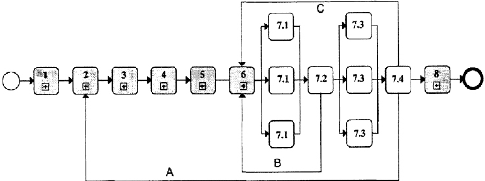

## CHÚ DÁN:

- 7.1 Đ trinh mô hinh thông tin đ bên thc hin chính chp nhn
- 7.2 Xem xét và chp nhn mô hinh thông tin
- 7.3 Đ trinh mô hinh thông tin đ bên đt hàng chp thun
- 7.4 Xem xét và chp thun mô hình thông tin
- A Mô hinh thông tin đưc tin hành bi các nhóm chuyn giao cho mi tha thun
- B Mô hình thông tin b t chi bi bên thc hin chính
- C Mô hinh thông tin b t chi bi bên đt hàng

## Hinh 10 - Quá trinh quàn lý thông tin – Chuyn giao mô hinh thông tin

## 5.8 Quá trinh quàn lý thông tin – Kt thúc chuyn giao d án

## 5.8.1 Luu trũ mô hinh thông tin d án

Khi cháp thun mô hinh thông tin d án hoàn chinh, bên đt hàng phài lưru tr các công-te-nơ thông tin trong môi trưng d liu chung ca d án theo các phương pháp và quy trinh to lp thông tin ca d án.

Đ làm nhng vic này, bên đt hàng phi xem xét:

- – Nhng công-te-nơ thông tin s càn s dng đ hinh thành mô hinh thông tin tài sn;
- – Yêu càu truy cp trong tương lai;
- Tái s dng trong tương lai; và
- – Các quy đinh v lưu trů có liên quan s đưc áp dng.

## 5.8.2 Ghi li bài hc kinh nghim cho các d án trong turơng lai

Khi phi hp vi tng bên thc hin chính, bên đt hàng phi có các bài hc kinh nghim trong quá trinh thc hin d án và lưu chúng li trong nơi lưu tr phù hp đ phc v cho các d án trong tương lai.

Khuyn cáo rng các bài hc kinh nghim nên đưc thu thp xuyên sut quá trinh thc hin d án.

## TCVN 14177-2:2024

## 5.8.3 Các hot đng kt thúc chuyn giao d án

Các hot đng kt thúc chuyn giao d án đưc th hin trong Hinh 11.

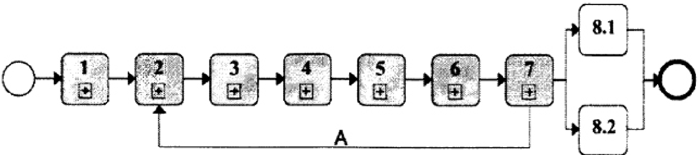

## CHÚ DÃN:

8.1 Luu trū mô hinh thông tin d án 8.2 Ghi li bài hc kinh nghim cho các d án trong tương lai A Mô hinh thông tin đưc tin hành bi các nhóm chuyn giao tip theo cho tng tha thun CHÚ THÍCH: Các hoąt đng đưc hin th song song nhm nhn mnh rng các hot đng này có th đưc thc hin đng thi.

Hinh 11 – Quá trinh quàn lý thông tin – Kt thúc chuyn giao d án

## Ph lc A (tham khào)

## Ma trn trách nhim quàn lý thông tin

## Bàng A.1 – Mu ma trn trách nhim quàn lý thông tin

| Đinh danh   | CHÚ DÃN: R (Responsible) Chju trách nhim thc hin nhim vų A (Accountable) Chju trách nhim phê duyt, phân công nhim vų và xác nhn kt quà   | Bên đăt hàng   | Bên thú ba   | Bên thc hin chính   | Bên thc hin   |
|-------------|------------------------------------------------------------------------------------------------------------------------------------------|----------------|--------------|---------------------|---------------|
| 5.1.1       | Chi đinh các cá nhân đàm nhn nhim v quàn lý thông tin                                                                                    |                |              |                     |               |
| 5.1.2       | Thit lp yêu cu thông tin d án                                                                                                            |                |              |                     |               |
| 5.1.3       | Thit lp các mc chuyn giao thông tin d án                                                                                                 |                |              |                     |               |
| 5.1.4       | Thit lp tiu chun thông tin d án                                                                                                          |                |              |                     |               |
| 5.1.5       | Thit lp các phương pháp và quy trinh to lp thông tin d án                                                                                |                |              |                     |               |
| 5.1.6       | Thit lp thông tin tham chiu d án và tài nguyên chia sě                                                                                   |                |              |                     |               |
| 5.1.7 5.1.8 | Thit lp môi trưng d liu chung ca d án Thit lp giao thc thông tin ca d                                                                    |                |              |                     |               |
|             | án                                                                                                                                       |                |              |                     |               |
| 5.2.1       | Thit lp các yêu cu thông tin trao đi ca bên đt hàng                                                                                      |                |              |                     |               |
| 5.2.5       | Tp hp thông tin tham chiu và tài nguyên chia sě                                                                                          |                |              |                     |               |

## TCVN 14177-2:2024

## Bàng A.1 (tip tc)

| Dinh danh   | CHÚ DÄN: R (Responsible) Chju trách nhim thc hin nhim v A (Accountable) Chju trách nhim phê duyt, phân công nhim v và xác nhn kt quà   | Bên đăt hàng   | Bên thú ba   | Bên thc hin chính   | Bên thc hin   |
|-------------|----------------------------------------------------------------------------------------------------------------------------------------|----------------|--------------|---------------------|---------------|
| 5.2.4       | Biên son h sơ yêu cu                                                                                                                   |                |              |                     |               |
| 5.3.1       | Đ c các nhân s đm nhn qun ly thông tin                                                                                                 |                |              |                     |               |
| 5.3.2       | Thit lp k hoch thc hin BIM so b ca nhóm chuyn giao (trưc khi ký tha thun)                                                              |                |              |                     |               |
| 5.3.3       | Đánh giá năng lc và khà nǎng ca nhóm trin khai                                                                                         |                |              |                     |               |
| 5.3.4       | Thit lp năng lc và khà năng ca nhóm chuyn giao                                                                                         |                |              |                     |               |
| 5.3.5       | Thit lp k hoch huy đng ca nhóm chuyn giao                                                                                              |                |              |                     |               |
| 5.3.6       | Thit lp danh mc ri ro ca nhóm chuyn giao                                                                                               |                |              |                     |               |
| 5.3.7       | Tồng hp h sơ đ xut ca nhóm chuyn giao                                                                                                  |                |              |                     |               |
| 5.4.1       | Xác nhn k hoch thc hin BIM ca nhóm chuyn giao                                                                                          |                |              |                     |               |
| 5.4.2       | Thit lp ma trn trách nhim chi tit ca nhóm chuyn giao                                                                                   |                |              |                     |               |

## Bàng A.1 (tip tuc)

| Dinh danh   | R (Responsible) Chju trách nhim thc hin nhim vų A (Accountable) Chu trách nhim phê duyt, phân công nhim vų và xác nhn kt quà C (Consulted) Tư vn trong quá trình   | Bên đt hàng   | Bên th ba   | Bên thc hin chính   | Bên thc hin   |
|-------------|--------------------------------------------------------------------------------------------------------------------------------------------------------------------|---------------|-------------|---------------------|---------------|
| 5.4.3       | Thit lp các yêu càu chuyn giao thông tin ca bên thc hin chính                                                                                                      |               |             |                     |               |
| 5.4.4       | Thit lp các k hoch chuyn giao thông tin nhim vų (TIDP)                                                                                                             |               |             |                     |               |
| 5.4.5       | Thit lp k hoch chuyn giao thông tin tồng th (MIDP)                                                                                                                 |               |             |                     |               |
| 5.4.6       | Hoàn thin các h sơ tha thun bên thc hin chính                                                                                                                      |               |             |                     |               |
| 5.4.7       | Hoàn thin các h sơ tha thun ca bên thc hin                                                                                                                         |               |             |                     |               |
| 5.5.1       | Huy đng ngun lc                                                                                                                                                    |               |             |                     |               |
| 5.5.2       | Huy đng công ngh thông tin                                                                                                                                         |               |             |                     |               |
| 5.5.3       | Th nghim các phương pháp và quy trinh to lp thông tin ca d án                                                                                                      |               |             |                     |               |
| 5.6.1       | Kim tra tính săn có ca thông tin tham chiu và các tài nguyên chia sě                                                                                               |               |             |                     |               |
| 5.6.2       | To lp thông tin                                                                                                                                                    |               |             |                     |               |
| 5.6.3       | Thc hin kim tra đàm bo chát luong                                                                                                                                  |               |             |                     |               |

## TCVN 14177-2:2024

## Bàng A.1 (kt thúc)

| Đinh danh   | CHÚ DÃN: R (Responsible) Chju trách nhim thc hin nhim vų A (Accountable) Chiu trách nhim phê duyt, phân công nhim v và xác nhn kt quà   | Bên đăt hàng   | Bên thú ba   | Bên thc hin chính   | Bên thc hin   |
|-------------|-----------------------------------------------------------------------------------------------------------------------------------------|----------------|--------------|---------------------|---------------|
| 5.6.4       | Xem xét thông tin và chp thun chia sè                                                                                                   |                |              |                     |               |
| 5.6.5       | Xem xét mô hinh thông tin                                                                                                               |                |              |                     |               |
| 5.7.1       | Đ trình mô hinh thông tin đ bên thc hin chính chp nhn                                                                                   |                |              |                     |               |
| 5.7.2       | Xem xét và cháp nhn mô hình thông tin                                                                                                   |                |              |                     |               |
| 5.7.3       | Đ trình np mô hinh thông tin đ bên đt hàng chp thun                                                                                     |                |              |                     |               |
| 5.7.4       | Xem xét và chp thun mô hình thông tin                                                                                                   |                |              |                     |               |
| 5.8.1       | Luu tr mô hình thông tin d án                                                                                                           |                |              |                     |               |
| 5.8.2       | Ghi li bài hc kinh nghim cho các d án trong tương lai                                                                                   |                |              |                     |               |

## B.1 Thông tin chung

Vai trò ca ph lc đi vi tiêu chun là làm rő vic trin khai tiu chun trong mt quc gia, nhưng không ngăn càn s hp tác và tha thun quc t.

Đi vi các d án hp tác quc t, có th chon phų lc quc t hoc phų lc quc gia c th.

Phų lc sē h tr ngưi dùng hiu đưc vic thc hin tiêu chun này bng cách dich các thut ng chính và m rng các yêu càu.

## B.2 Mã đnh danh công-te-nơ thông tin (ID)

## B.2.1 Làm rõ

TCVN 14177-2:2024, (5.1.7.a) nêu rõ: "Môi trưòng d liu chung ca d án s cho phép mi công-tenơ thông tin s có mt mă đjnh danh (ID) duy nht, da trên mt quy ưc đã đưc thng nht và nêu rō bng văn bn, bao gm các trưng thông tin đưc tách ri bng du phân cách".

## B.2.2 Công-te-nơ thông tin

Mă đnh danh (ID) duy nht cho các công-te-nơ thông tin trong môi trưòng d liu chung có th đưc xác đnh bng cách s dng các trưng sau, đưc phân tách bng du cách, theo quy uc sau.

Hinh B.1 — Đnh danh các công-te-nơ thông tin trong môi trưòng d liu chung

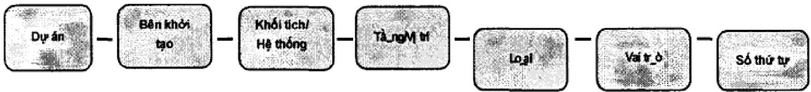

CHÚ THÍCH 1: Nu mt cồng-te-nơ thông tin bį xóa hoc xut khi môi trưng dū liu chung thì các trưng b sung "s phù hp" và "phin bàn sa đi", đưc phàn tách bng du cách, phi đưc thêm vào mā đinh danh (ID) ca nó dưi đng hu tó.

CHÚ THíCH 2: Ty thuc vào tng gói tha thun c th và các bên thc hin c th, có th linh hot trong quy đnh trưng ID.

## B.2.3 Du phân cách

Dáu phân cách sau s đưc s dng.

Dáu gach ni - Tr (**) tham chiu Unicode U+002D

(**): Du gach ni – trong bng ch cái la tinh, đã đưc thêm vào b mã chun quc t Unicode phiên bàn 1.1 (năm 1993)

## Ph lc B (tham khào)

## Ví d thc hin theo TCVN 14177-2:2024

## TCVN 14177-2:2024

## B.3 Trưòng mã hóa

## B.3.1 Làm rõ

Ti 5.1.7 b nêu r: "Môi trưng d liu chung ca d án s cho phép mi trưng đưc đưc gán mt giá tr t mt tiu chun mã hóa đã đưc thng nht và ghi lai".

CHÚ THÍCH: Vic mã ha cho tng trưng phi đưc xác đnh t các mã hóa sau.

## B.3.2 D án

Duy nht mt må đnh danh d án phi đưc xác đnh khi bt đu d án. Nó nên đc lp và khác bit r ràng vi mă s công vic ni b ca bt k t chc cá nhân nào và c đnh trong tiu chun thông tin d án. Khuyn cáo rng mā cho các ch đ, hot đng và nhân t d án có t hai đn sáu ký t. CHÚ THíCH 1: Khng có m tiu chun cho trưng d án. Mă đnh danh d án phų thuc vào quyt đnh ca bn đt hàng hoc bên khi tao d án CHÚ THÍCH 2: Mt d án có th đưc chia thành các d án thành phàn. ht  i n                       h

mi d án thành phàn hoc giai đon đó có th đưc gán mt đnh danh.

## B.3.3 Bên khi to

Cn xác đinh mt må đnh danh duy nht cho mi t chc khi tham gia d án, đ xác đnh t chc chu trách nhim to lp thông tin trong công-te-nơ thông tin và c đnh trong tiêu chun thông tin d án. Khuyn cáo rng mã cho trưng bên khi to có t ba ti sáu ký t.

CHÚ THíCH: Khi mt đ án bao gm nhiu d án thành phàn hoc mt d án thành phàn có nhiu giai đon, mi d án thành phàn hoc giai đon có th đưc gán mt mă đinh danh.

## B.3.4 Khi tích (***)/ H thông (****)

Phi xác đnh mt mã đnh danh duy nht cho tng khi tích/h thng và c đnh trong tiu chun thông thn y g g g  ng  ng m  ng n   t Các m tiêu chun sau đây nên đưc áp dng. ZZ tt cà các khi tich/h thông XX không áp dng cho khi tích /h thng nào

CHÚ THÍCH: Danh sách này có th m rng vi các mā dành ring cho d án.

## B.3.5 Tàng/Vį trí

Càn xác đnh mt må đnh danh duy nht cho tng tng/v trí và c đnh trong tiu chun thông tin d án. Khuyn cáo mã cho trưòng tàng/vi tri có hai ký t. Các mã tiêu chun sau đây nên đưc áp dng. ZZ nhiu mc đ/v trí XX không áp dng cho tàng/vi trí nào 01 tàng 1/tàng trêt 02 tàng 2, v.v.

## 42

```
M1 tng lng M1 trên tàng 1 M2 tàng lng M2 trên tàng 2, v.v. B1 tàng hàm 1 B2 tàng hàm 2, v.v. CHÚ THÍCH 1: Danh sách này có th đưc m rng bng các mă dành ring cho d án. CHÚ THíCH 2: Mā vi trí cho các tài sn không phi là tòa nhà có th yêu càu mă dành riêng cho d án.
```

## B.3.6 Loi

Càn xác đnh mt mã đnh danh duy nhát cho tng loi thông tin, đ xác đinh loi thông tin đưc gi trong công-te-nơ thông tin và đưc c đnh trong tiu chun thông tin d án. Khuyn cáo mã cho trưng loai có hai ký t.

Các mă tiêu chun sau đây nên đưc áp dung.

AF

tp file đông (ca mt mô hình)

BQ

CA

CM

co

CP

CR

DB

bàng khi lưng

tính toán

mô hình kt hp (mô hình kt hp nhiu b môn)

tương úng

k hoch chi phí

phiên bàn xung đt

cơ s d liu

DR

th hin bàng hinh vē

- FN ghi chú tp tin

HS

súc khoè và an toàn

IE

M2

M3

MI

MR

h sơ trao đi thông tin

mô hình 2D

mô hinh 3D

biên bàn /ghi chú hành đng

th hin bng mô hinh cho các din ha khác, vi d: phân tích nhit, v.v.

- MS tuyên b phương pháp
- PP trinh bày
- PR chưong trinh
- RD bàng d liu ca phòng

CHÚ THÍCH: Là bàng thng k vi trí, thông s, vt liu hoàn thin, vt dng, thit b... ca phòng. Bàng này có th to t các trưng dū liu khác nhau tùy theo nhu càu thông tin ca các bên.

## TCVN 14177-2:2024

- RI yêu cu thông tin

RP báo cáo

SA lich trinh giài quyt

SH lich

SN danh sách cn khc phc

CHÚ THÍCH: Là bng thng kê các li nhò còn tn ti đ lưu ý hoc đ theo di khc phc

SP chi dn ký thut

- SU khão sát

- VS trc quan hóa

CHÚ THÍCH: Danh sách này có th đưc m rng vi các mă dành ring cho d án.

## B.3.7 Vai trò

Cn xác đinh mt mã đnh danh duy nht cho tng vai trò trong d án mà t chc giao và c đnh trong tiêu chun thông tin d án. Khuyn cáo mã cho trưng vai trò là mt hoc hai ký t.

Các mã tiêu chun sau đây nên đưc áp dng.

- A kin trúc su
- B khào sát công trinh
- C k sư xây dng
- D ký su nưc, giao thông
- E ký su đin
- F quàn lý cơ s vt cht
- G kho sát đia cht và đja hinh
- H thit k h thông sui m, thông gió
- 1 thit k ni tht
- K ch đu tư/khách hàng
- L kin trúc su cành quan
- M ký sư cơ khí
- P ký sư an toàn và súc khoè
- Q ký su đinh giá
- S ký sư kt cu
- T quàn lý quy hoch đô thi
- W nhà thàu
- X nhà thàu phų
- Y nhà thit k chuyên bit

## Z chung (không thuc b môn/chuyên ngành nêu trên)

CHÚ THiCH: Danh sách này có th đưc m rng bng hai mã dành riêng cho d án

## B.3.8 S thú t

Mt s thú t phi đưc gán cho mồi công-te-nơ thông tin khi nó là mt trong mt chuồi ch không phi đưc phân bit bi bt k trưng nào khác.

Vic đánh s cho mã hóa tiu chuàn phi đưc c đnh trong tiêu chun thông tin d án và nó đưc khuyn cáo rng nó có đ dài t bn đn sáu ch s nguyên.

CHÚ HíCH: Nên s dng các s 0  đu và càn thn trng đ không th hin thông tin có trong các trưng khác.

## B.4 Siêu dū liu công-te-nơ thông tin

## B.4.1 Làm rō

Ti 5.1.7 c nêu rõ: "Môi trưng d liu chung ca d án sê cho phép mồi nơi cha công-te-nơ thông tin  d  n  d      s   i      eo khung phân loi trong TCVN 14176-2:2024).

Các thuc tính (siêu dū liu) cho các công-te-nơ thông tin trong môi trưng d liu chung đưc đè xut bng các t mã hóa sau.

## B.4.2 Trng thái

Bàng B.1 - Mā trng thái cho các công-te-nơ thông tin trong môi trưòng dū liu chung

| Mã                            | Mô tà                         | Phiên bàn                              |
|-------------------------------|-------------------------------|----------------------------------------|
| Tin trinh công vic            | Tin trinh công vic            | Tin trinh công vic                     |
| SO                            | Trng thái khi to ban đàu      | Phiên bàn sơ b và các phiên bàn sa đði |
| Chia sè (không trong hp đồng) | Chia sè (không trong hp đồng) | Chia sè (không trong hp đồng)          |
| S1                            | Phc v cho phi hp              | Phiên bàn sơ b                         |
| S2                            | Phc v cho ph bin thông tin    | Phiên bn sơ b                          |
| S3                            | Phc v cho xem xét và góp ý    | Phiên bàn sơ b                         |
| S4                            | Phc v cho phê duyt giai đon   | Phiên bàn sơ b                         |
| S5                            | Thu hi                        | Không có giá tr đưc gn kèm             |

## TCVN 14177-2:2024

Bàng B.1 (kt thúc)

| Mã                                                    | Mô tà                               | Phiên bàn                |
|-------------------------------------------------------|-------------------------------------|--------------------------|
| S6 (có th không áp dng)                               | Phù hp đ y quyn PIM                 | Phiên bn so b            |
| S7 (có th không áp dng)                               | Phù hp đ y quyn AIM                 | Phiên bn sơ b            |
| Đā xut bn (trong hp đng)                              | Đā xut bn (trong hp đng)            | Đā xut bn (trong hp đng) |
| A1, An, v.v.                                          | Đưc y quyn và chp thun              | Phiên bn ca hp đng       |
| B1, Bn, v.v.                                          | Chp thun mt phàn (Vi các khuyn cáo) | Phiên bàn sơ b           |
| Đā xut bàn (chp thun mô hinh thông tin tài sàn - AIM) |                                     |                          |
| CR                                                    | Hồ sơ hoàn công                     | Phiên bn ca hp đng       |

CHÚ THiCH: Danh sách này có th đưc m rng cho các mā trưng thông tin khác phù hp vi các yu cu c th ca bn đt hàng và đưc c đinh trong tiu chun thông tin d án.

## B.4.3 Sa đi

Bàn sa đi sơ b ca công-te-nơ thông tin phi là hai s nguyên, có tin t là chū cái "P". ví d: P01. Các bn sa đi sơ b ca công-te-nơ thông tin  trng thái "đang tin hành" cũng cn có hai hu tó s nguyên đ xác đinh phiên bn ca bn sa đi sơ b, vi d: P02.05.

Bn sa đi ban đàu ca công-te-nơ thông tin phi là P01.01.

Các sa đi theo hp đòng ca các công-te-nơ thông tin phi là hai s nguyên, có tièn t là ch cái "C", ví d: C01.

## B.4.4 Phân loi

vi   tn  tn  tn      --  g   d ben đt hàng chính la chon trong giai đon đánh giá và xác đnh nhu càu.

Có th tham khào TCVN 14176-2:2024.

Có th theo h phân loi Uniclass hoc Omniclass.

## B.5 Trao đi mô hinh thông tin

## B.5.1 Làm rō

Ti 5.2.1 nêu rõ: "Bên đt hàng phài thit lp yêu càu thông tin trao đi đ bên thc hin tim năng phài đáp úng trong sut tha thun".

Các mu thông tin đưc trao đi vi bên đt hàng, tr khi có quy đnh ngưc li trong tiêu chun thông tin d án, nên bao gòm

- a) Thông tin hình hc  đnh dng đc quyn hoc đinh dng d liu m;
- b) Thông tin phi hinh hc  đnh dng d liu m, đưc cha trong mt công-te-nơ thông tin duy nht; và
- c) Tài liu  đnh dng d liu m.

CHÚ THíCH 1: D liu thông tin hinh hc: Thông tin hinh hc là d liu chinh to nên mô hinh 3D. Chúng có th hiu đơn gin là các thông tin đưc tao nên tù toán hc, các dng hinh hc đưc hình thành bng các đưng, đim hoc đưng cong... chúng là các thông tin/ dū liu dùng đ lp đt, xây dưng nên công trinh. (nu hinh dang chúng không xác đnh đưc bng toán hc thi nó không phài là thông tin hình hoc).

che   a   e   n a   g a    e  n g     Hh db liu này thưng là thông tin lin kt vi tài sn như mô tà đc tính sàn phm, thông s ky thut, hoc các ni dung vè quàn lý, bàn giao...

CHhu             i    hac

## B.6Yêu càu thông tin cùa d án

## B.6.1 Làm rō

TCVN 14177-2:2024, (5.1.2) nêu rô: "Bên đt hàng phi xác lp thông tin ca d án các yêu cu, như đưc mô tà trong TCVN 14177-1:2024, (5.3), đ gii quyt các câu hi đ bên đt hàng cn phi trà li ti mi thi đim quyt đinh quan trong trong sut d án".

## TCVN 14177-2:2024

## Thư mc tài liu tham khào

- [1] TCVN 11866:2017 (ISO 21500:2012), Huóng dn quàn lý d án;
2. TCVN 12690:2019, Công ngh thông tin – Ký hiu và mô hinh quy trình nghip v cho nhóm quàn lý đi turng;
3. [ε] ISO 22263:2008, Organization of information about construction works – Framework for ma nng n -  n g g n  n g n   n thông tin d án);
4. [4]ISO 55000:2014, Asset management – Overview, principles and terminology (Quån lý tài sàn – Tồng quan, nguyên tc và thut ngǔ).