# Báo Cáo So Sánh EIR và Quyết định 347, 348 (Dự án HTM)

*Báo cáo được sinh tự động dựa trên từ khóa và phân tích cấu trúc tài liệu.*

| Tiêu chí | EIR Dự án HTM | QĐ 348 | QĐ 347 | Đánh giá sơ bộ |
|---|---|---|---|---|
| [348] 1. Thông tin dự án | **## 2.1. Thông tin chung**  | **## 1. Thông tin dự án**   **## 1.1. Thông tin chung** Thông tin chung của dự án \_\_\_\_ [Ghi tên dự án] được trích dẫn từ nội dung trong Yêu cầu về thông tin trao đổi (EIR).  Bảng 1. Thông tin chung về dự án  | Chủ đầu tư      | ____ [Ghi tên Chủ đầu tư]     | |-----------------|-------------------------------| | Tên dự án       | ____ [Ghi tên Dự án]          | | Địa chỉ         | ____ [Ghi rõ địa chỉ dự án]   | | Địa chỉ liên hệ | ____ [Ghi rõ địa chỉ liên hệ] | | Tóm tắt dự án   | …                             |  **## 1.2. Tiến độ dự án** Các bên cần huy động nguồn lực phù hợp để đảm bảo tiến độ đã được phê duyệt.  Bảng 2. Tiến độ tổng thể dự án  | Giai đoạn                                                         | Ngày bắt đầu                                     | Ngày kết thúc                                     | |-------------------------------------------------------------------|--------------------------------------------------|---------------------------------------------------| | ____ [Ghi tên giai đoạn liên quan (thiết ...  **## 2. Thông tin dự án**   **## 2.1. Thông tin chung** Thông tin chung của dự án được trích dẫn từ nội dung trong Yêu cầu về thông tin trao đổi (EIR).  Bảng 2. Thông tin chung về dự án  | Chủ đầu tư      | ____ [Ghi tên Chủ đầu tư]     | |-----------------|-------------------------------| | Tên dự án       | ____ [Ghi tên Dự án]          | | Địa chỉ         | ____ [Ghi rõ địa chỉ dự án]   | | Địa chỉ liên hệ | ____ [Ghi rõ địa chỉ liên hệ] | | Tóm tắt dự án   | …                             |  **## 2.2. Tiến độ dự án** Các bên cần huy động nguồn lực phù hợp để đảm bảo tiến độ đã được phê duyệt.  Bảng 3. Tiến độ tổng thể dự án  | Giai đoạn                                                         | Ngày bắt đầu                                     | Ngày kết thúc                                     | |-------------------------------------------------------------------|--------------------------------------------------|---------------------------------------------------| | ____ [Ghi tên giai đoạn liên quan (thiết ... | Không tìm thấy thông tin rõ ràng. | Có quy định đối chiếu |
| [348] 2. Các quy định áp dụng | **## 3.1. Căn cứ pháp lý ứ ng d ụ ng BIM** - -Quy ết đị nh s ố 2500/QĐ -TTg ngày 22/12/2016 c ủ a Th ủ tướ ng Chính ph ủ Phê duy ệ t Đề án áp d ụ ng mô hình thông tin công trình (BIM) trong ho ạt độ ng xây d ự ng và qu ả n lý v ậ n hành công trình; - -Quy ết đị nh s ố 749/QĐ -TTg ngày 03 tháng 6 năm 2020 phê duyệt 'Chương trình chuy ển đổ i s ố qu ốc gia đến năm 2025, định hướng đến năm 2030; - -Quy ết đị nh s ố 347/QĐ -BXD ngày 02 tháng 4 năm 2021 củ a B ộ Xây D ự ng v ề vi ệ c 'Công bố Hướ ng d ẫ n chi ti ế t áp d ụng Mô hình thông tin... | **## 2. Các quy định áp dụng** Tất cả thông tin của dự án sẽ được tạo lập, chia sẻ và quản lý tham khảo các tiêu chuẩn và hướng dẫn sau:  Bảng 3. Các nội dung quy định áp dụng  | M = Bắt buộc (Mandatory)      | M = Bắt buộc (Mandatory)      | M = Bắt buộc (Mandatory)      | M = Bắt buộc (Mandatory)      | M = Bắt buộc (Mandatory)      | M = Bắt buộc (Mandatory)      | M = Bắt buộc (Mandatory)      | M = Bắt buộc (Mandatory)      | M = Bắt buộc (Mandatory)      | Nội dung        | Nội dung          | Nội dung          | Nội d...  **## 1. Các quy định áp dụng** Để có thể phối hợp một cách thống nhất, \_\_\_ [Ghi tên chủ đầu tư] yêu cầu các bên tuân thủ các quy định sau:  Bảng 1. Các nội dung quy định áp dụng  | M = Bắt buộc (Mandatory)      | M = Bắt buộc (Mandatory)      | M = Bắt buộc (Mandatory)      | M = Bắt buộc (Mandatory)      | M = Bắt buộc (Mandatory)      | M = Bắt buộc (Mandatory)      | M = Bắt buộc (Mandatory)      | M = Bắt buộc (Mandatory)      | M = Bắt buộc (Mandatory)      | Nội dung        | Nội dung          | Nội dung          | ... | Không tìm thấy thông tin rõ ràng. | Có quy định đối chiếu |
| [348] 3. Mục tiêu và nội dung BIM | Không tìm thấy thông tin rõ ràng. | **## 1. Xác định nội dung áp dụng BIM:** Chủ đầu tư căn cứ vào chiến lược phát triển của ngành, địa phương hoặc của tổ chức; các mục tiêu cần đạt được của dự án và khả năng đáp ứng của công nghệ BIM để lựa chọn nội dung áp dụng BIM trong dự án.  **## 1.4. Lựa chọn nội dung áp dụng BIM**   **## 1.4.2. Xác định mục tiêu áp dụng BIM và dự kiến Nội dung áp dụng BIM tiềm năng**   **## 1.4.2.1. Mục tiêu chung** Việc xác định các mục tiêu áp dụng BIM tổng thể cũng như chi tiết rất quan trọng, quyết định đến việc áp dụng BIM thành công vào dự án. Các mục tiêu này được xây dựng dựa trên các lợi ích tiềm năng của việc áp dụng BIM đã được kiểm chứng (như rút ngắn tiến độ, cải thiện năng suất, nâng cao chất lượng, giảm chi phí hoặc là nơi lưu trữ dữ liệu thuận tiện phục vụ cho quá trình vận hành, bảo trì công trình,...). Các mục tiêu cũng có thể chỉ liên quan đến việc nâng cao năng lực của các thành viên ...  **## 1.4.2.2. Mục tiêu cụ thể** Mục tiêu áp dụng BIM cho dự án được xác định từ lợi ích của việc sử dụng mô hình BIM. Trong giai đoạn hiện nay, những lợi ích cơ bản của việc ứng dụng Mô hình thông tin công trình bao gồm:  - -Mô hình hóa để thể hiện trực quan, giúp các thành viên tham gia dự án hiểu rõ khi thảo luận, phân công các nhiệm vụ hoặc lựa chọn các giải pháp thiết kế/thi công hiệu quả; các bên liên quan hiểu rõ hơn về giải pháp thiết kế để ra các quyết định cho phù hợp; - -Hiệu quả của việc chia sẻ thông tin bằng định...  **## 1.4.3. Phân tích và lựa chọn nội dung áp dụng BIM** Mục tiêu của việc phân tích nội dung áp dụng BIM là để xem xét giữa giá trị có thể mang lại cho dự án và các yêu cầu cần thiết đối với các đơn vị tham gia để thực hiện được các nội dung áp dụng BIM này.  Bảng 1.4 thể hiện ví dụ phân tích nội dung áp dụng BIM. Ví dụ này bao gồm danh sách nội dung áp dụng BIM tiềm năng (đã được xác định tại Bước 1), cùng với các yêu cầu kinh nghiệm và năng lực cần thiết của các bên dự kiến tham gia trong dự án. Việc so sánh giữa giá trị mang lại và yêu cầu kinh ng...  **## 3.4.7.1. Mục đích xây dựng đặc tính kỹ thuật của LOD:** - Giúp các chủ đầu tư và các bên liên quan xác định rõ về những thông tin gì sẽ được đưa vào một Mô hình BIM; - Giúp người quản lý thiết kế giải thích cho các bên liên quan về các thông tin cần được cung cấp tại các thời điểm khác nhau trong quá trình thiết kế để theo dõi sự tiến triển của mô hình; - Giúp cho các bên liên quan trong dự án hiểu rõ về khả năng sử dụng thông tin trong mô hình khi được cung cấp từ các đơn vị khác; - Cung cấp thông tin có thể được tham chiếu trong Hợp đồng và tr...  **## NỘI DUNG ÁP DỤNG BIM PH**   **## Một số Nội dung áp dụng BIM thông dụng:** Hình 1.1 Một số Nội dung áp dụng BIM thông dụng trong dự án đầu tư xây dựng  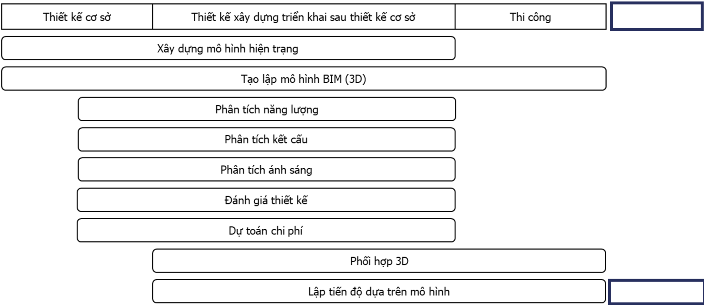  **## 3. Mục tiêu và nội dung áp dụng BIM cho dự án**   **## 3.1. Mục tiêu áp dụng BIM** Nhóm dự án cần tuân thủ các yêu cầu cho \_\_\_ [Ghi tên dự án] nhằm thực hiện các mục tiêu dưới đây:  Bảng 4. Mục tiêu áp dụng BIM cho dự án  | STT   | Mục tiêu                     | |-------|------------------------------| | 1     | ____ [Ghi nội dung mục tiêu] | | …     | …                            |  **## 3.2. Nội dung áp dụng BIM** Các nội dung áp dụng BIM dưới đây đã được thống nhất giữa nhóm dự án và \_\_\_ [Ghi tên chủ đầu tư]. Trong thường hợp có thay đổi hoặc bổ sung nội dung áp dụng BIM cần thống nhất với \_\_\_ [Ghi tên chủ đầu tư].  Bảng 5. Nội dung áp dụng BIM  | STT   | Nội dung áp dụng BIM            | |-------|---------------------------------| | 1     | ____ [Ghi nội dung áp dụng BIM] | | …     | …                               |  **## BIỂU MẪU 01: NỘI DUNG ÁP DỤNG BIM** | Nội dung áp dụng BIM            | Mục tiêu áp dụng                                       | |---------------------------------|--------------------------------------------------------| | ____ [Ghi nội dung áp dụng BIM] | ____ [Ghi mục tiêu tương ứng với nội dung áp dụng BIM] | | …                               | …                                                      |  **## 5.1. Các phần mềm ứng dụng** Sau đây là các phần mềm ứng dụng hiện đang được chỉ định bởi Chủ đầu tư để sử dụng trong dự án.  Vui lòng cho biết phần mềm nào quý Công ty sử dụng và không sử dụng:  | Vai trò trong dự án   | Công cụ khởi tạo mô hình BIM   | Tuân thủ theo yêu cầu (Có / Không) Nếu 'Không', công ty bạn sử dụng công cụ BIM nào tương ứng   | Phiên bản đang được sử dụng   | |-----------------------|--------------------------------|--------------------------------------------------------------------------------------...  **## 6. Hiểu biết về các nội dung áp dụng BIM** Để đánh giá sự hiểu biết của quý Công ty trong bối cảnh mà BIM được kỳ vọng mang lại nhiều lợi ích nhưng còn khá mơ hồ, Chủ đầu tư đã xác định những nội dung áp dụng BIM cơ bản dự kiến sẽ mang lại nhiều lợi ích.  Hãy điền vào tất cả các mục dưới đây để thể hiện sự hiểu biết của quý Công ty bao gồm các dẫn chứng hỗ trợ. Các ví dụ và lợi ích liệt kê ở đây không nên được xem là toàn bộ, có thể có các lợi ích khác.  Nội dung ứng dụng BIM 1  Ví dụ  Lợi ích kỳ vọng  Quan điểm của quý Công ty  Dẫn chứn...  **## 1. Mục tiêu, mục đích BIM của dự án** Nhà thầu chấp thuận các mục đích, mục tiêu BIM hoặc sửa đổi đề xuất BIM được Chủ đầu tư nêu.  **## 2. Các nội dung áp dụng BIM** Nhà thầu chấp nhận các nội dung áp dụng BIM bắt buộc và xác nhận các nội dung tùy chọn theo đề xuất của nhà thầu. | Không tìm thấy thông tin rõ ràng. | Cần Review |
| [348] 4. Phạm vi công việc và sản phẩm | Không tìm thấy thông tin rõ ràng. | **## b. Thiết lập kế hoạch chuyển giao thông tin nhiệm vụ (TIDP)** Kế hoạch chuyển giao thông tin nhiệm vụ (TIDP) là danh sách các sản phẩm cần chuyển giao được phân tách thành các nhiệm vụ riêng lẻ. Kế hoạch chuyển giao thông tin nhiệm vụ (TIDP) được các Bộ phận thực hiện BIM lập dựa theo điều kiện và năng lực của bộ phận đó.  TIDP cung cấp thông tin về trách nhiệm chuyển giao các sản phẩm để các thành viên thực hiện, đồng thời cung cấp thông tin về trình tự để hoàn thiện.  Thông tin trong bảng TIDP cần chứa các thông tin sau:  - -Tên và tiêu đề; - -Mức độ ph...  **## c. Thiết lập kế hoạch chuyển giao thông tin tổng thể (MIDP)** Kế hoạch chuyển giao thông tin tổng thể (MIDP) là kế hoạch chính được sử dụng để quản lý việc chuyển giao thông tin trong suốt quá trình thực hiện.  MIDP được rà soát, cập nhật chi tiết sau khi ký kết hợp đồng, Đơn vị thực hiện tập hợp các Kế hoạch chuyển giao thông tin nhiệm vụ (TIDP) để hoàn thiện Kế hoạch chuyển giao thông tin tổng thể (MIDP).  Trong quá trình thực hiện dự án, dựa vào các yếu tố: tiến độ, năng lực đội ngũ, bảng MIDP có thể được sửa đổi. Bảng MIDP được lưu trữ trên Môi trườn...  **## 1.1.4. Sản phẩm** - -Mô hình đám mây điểm (pointcloud) của hiện trạng công trình; - -Mô hình chi tiết hiện trạng; - -Mô hình tham số bao gồm dữ liệu của các thành phần công trình hiện tại.  **## 1.2.4. Sản phẩm** - -Mô hình BIM có đầy đủ thông tin cần thiết tương ứng với từng giai đoạn của dự án  **## Sản phẩm đầu ra:** - Mô hình phối hợp công trình; - -Báo cáo phối hợp: xác định các lỗi phối hợp.  **## 1.3.10. Sản phẩm** - -Mô hình thiết kế kết cấu; - - - Báo cáo phân tích kết cấu; - -Thông tin các chi tiết kết cấu chuyển giao cho thiết kế kiến trúc.  **## 1.4.4. Sản phẩm** - -Mô hình thiết kế hệ thống chiếu sáng;  - -Báo cáo phân tích hệ thống chiếu sáng; - -Thông tin các cấu kiện hệ thống chiếu sáng được chuyển cho thiết kế kiến trúc.  **## 1.5.4. Sản phẩm đầu ra:** - -Báo cáo các phản hồi thiết kế kèm theo chỉ định bộ phận/ bên có trách nhiệm sửa.  **## 1.6.4. Sản phẩm đầu ra:** - -Thông tin tính toán khối lượng theo cấu trúc xác định; - - - Dự toán chi phí.  **## 1.8.4. Sản phẩm đầu ra** - -Mô hình mô phỏng tiến độ 4D; - -Các báo cáo tiến độ (nếu có).  **## 4. Phạm vi công việc, sản phẩm, kế hoạch chuyển giao thông tin**   **## 4.2. Phân chia trách nhiệm thực hiện** Nhà thầu cung cấp Bảng phân công trách nhiệm cho thấy vai trò và trách nhiệm các nhân sự BIM của đơn vị thực hiện các nội dung công việc.  **## 5. Phạm vi công việc, sản phẩm, kế hoạch chuyển giao thông tin**   **## 5.1. Phạm vi công việc và sản phẩm** Các mốc thời gian chính liên quan đến việc thực hiện áp dụng BIM được xác định phù hợp với tiến độ các công việc của dự án.  Bảng 7. Phạm vi công việc và sản phẩm  | Phạm vi công việc   | Mốc thời gian chính   | Sản phẩm   | Định dạng file   | Chủ trì   | |---------------------|-----------------------|------------|------------------|-----------|  | ____ [Ghi tên giai đoạn liên quan (thiết kế xây dựng, thi công…)]    | ____ [Ghi ngày bắt đầu - kết thúc theo dạng ngày/tháng/năm]   |             ...  **## 5.3. Kế hoạch chuyển giao thông tin** Kế hoạch chuyển giao thông tin tổng thể bao gồm các chi tiết về thời điểm, đơn vị thực hiện cho từng nội dung công việc phù hợp với các mốc thời gian của dự án.  Tham khảo Biểu mẫu 04: Kế hoạch chuyển giao thông tin tổng thể (MIDP)  **## KẾ HOẠCH CHUYỂN GIAO THÔNG TIN TỔNG THỂ (MIDP)** |   Phiên bản | Ngày       | Người thực hiện   | Người kiểm tra   | Người phê duyệt   | Mô tả   | |-------------|------------|-------------------|------------------|-------------------|---------| |         1.0 | 01/01/2020 |                   |                  |                   |         |  **## Kế hoạch chuyển giao thông tin tổng thể (MIDP)** 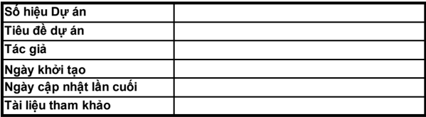    |                                                                     |                                                                     |                                                                     |                                                                     | Tham khảo tài liệu... | **## c. Đầu ra / Sản phẩm** Bản vẽ và mô hình đầy đủ thông tin đảm bảo khả năng thi công ngoài công trường phù hợp với BEP.  Hình 18 Mô hình hệ thống cấp thoát nước của Dự án Bệnh viện Hồng Ngọc - Mỹ Đình trong giai đoạn thiết kế bản vẽ thi công  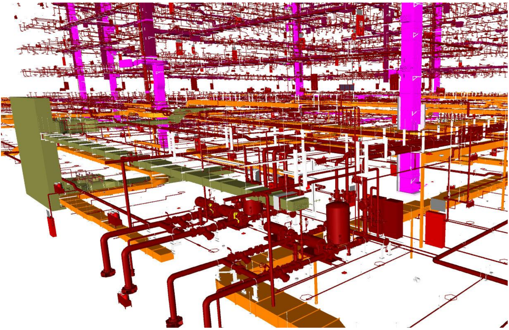  Hình 19 Mô hình phòng máy của Dự án D26 Trụ sở Viettel trong giai đoạn thiết kế bản vẽ thi công   đầy đủ thông tin theo yêu cầu.  **## Đầu ra/ sản phẩm**  | Cần Review |
| [348] 5. Mức độ phát triển thông tin | Không tìm thấy thông tin rõ ràng. | **## 3.4.7. Mức độ phát triển thông tin (LOD)** Mức độ phát triển thông tin (LOD) là một khái niệm được sử dụng trong quá trình mô hình hóa, dùng để chỉ chất lượng, số lượng và mức độ chi tiết của thông tin trong mô hình BIM ở các giai đoạn khác nhau trong quá trình đầu tư xây dựng.  Đặc tính kỹ thuật của mức độ phát triển là các minh họa và diễn giải chi tiết nhằm xác định các thuộc tính của các thành phần mô hình trong công trình ở các LOD khác nhau.  Phương pháp hay nguyên tắc sẽ được sử dụng để xác định mức độ phát triển thông tin cho...  **## 3.4.7.1. Mục đích xây dựng đặc tính kỹ thuật của LOD:** - Giúp các chủ đầu tư và các bên liên quan xác định rõ về những thông tin gì sẽ được đưa vào một Mô hình BIM; - Giúp người quản lý thiết kế giải thích cho các bên liên quan về các thông tin cần được cung cấp tại các thời điểm khác nhau trong quá trình thiết kế để theo dõi sự tiến triển của mô hình; - Giúp cho các bên liên quan trong dự án hiểu rõ về khả năng sử dụng thông tin trong mô hình khi được cung cấp từ các đơn vị khác; - Cung cấp thông tin có thể được tham chiếu trong Hợp đồng và tr...  **## 5. Mức độ phát triển thông tin** Nhà thầu đảm bảo mức độ phát triển thông tin (LOD) (bao gồm thông tin hình học và phi hình học) của các thành phần và cấu kiện trong mô hình tuân theo bảng Mức độ phát triển thông tin.  Nhà thầu liệt kê LOD của các thành phần, cấu kiện theo Biểu mẫu 03: Mức độ phát triển thông tin (LOD).  **## MỨC ĐỘ PHÁT TRIỂN THÔNG TIN LOD** | Mã hiệu cấu kiện              | Tên cấu kiện           | Diễn giải                | Thiết kế sơ bộ                       | Thiết kế cơ sở                       | Thiết kế kỹ thuật                    | Thiết kế bản vẽ thi công             | Hoàn công                            | |-------------------------------|------------------------|--------------------------|--------------------------------------|--------------------------------------|--------------------------------------|-----------------...  **## 6. Mức độ phát triển thông tin (LOD)** Các bên liên quan đến việc tạo lập mô hình cần đảm bảo Mức độ phát triển thông tin (LOD) (bao gồm thông tin về hình học và phi hình học) của các thành phần, cấu kiện phù hợp với các yêu cầu của dự án và các quy định cụ thể liên quan đến sản phẩm Mô hình.  Tham khảo Biểu mẫu 03: Mức độ phát triển thông tin (LOD)  **## MỨC ĐỘ PHÁT TRIỂN THÔNG TIN PH**   **## 4.1. Các mức độ phát triển** LOD được chia thành nhiều mức khác nhau, mỗi mức sẽ thể hiện mức độ chi tiết thông tin và mức độ tin cậy của các thông tin được đưa vào các thành phần mô hình.  Trong một mô hình BIM ở mỗi giai đoạn thiết kế nhất định, các thành phần trong mô hình có thể có các mức độ phát triển khác nhau. Một thông tin được xác định là bắt buộc tại một mức độ phát triển, cũng có thể xuất hiện tại một mức độ phát triển trước đó, tùy theo yêu cầu của dự án.  Các thành phần mô hình tại các mức độ phát triển như LO...  **## 4.1.1. Mức độ phát triển thông tin 100 (LOD 100)** Thành phần mô hình với LOD 100 có thể được thể hiện bằng đồ họa trong mô hình như một biểu tượng hoặc một hình khối chung, đại diện, đủ điều kiện đáp ứng được các yêu cầu kỹ thuật chung của công trình. Các thông tin liên quan đến giải pháp xây dựng, chi phí dự tính cho các thành phần mô hình chính cũng được đưa vào mô hình.  Các thành phần mô hình với LOD 100 thường được sử dụng trong giai đoạn lập ý tưởng thiết kế. Mô hình với LOD 100 có thể hỗ trợ cho việc lập khái toán ước tính chi phí dựa tr...  **## 4.1.2. Mức độ phát triển thông tin 200 (LOD 200)** Các thành phần mô hình được thể hiện bằng đồ họa trong mô hình với các thể hiện tương đối về số lượng, kích thước, hình dạng tương đối và vị trí gần đúng. Các thông tin phi hình học cũng có thể được đưa vào các thành phần mô hình với LOD 200.  Các thành phần mô hình với LOD 200 đã được tính toán và phân tích sơ bộ thường được được sử dụng trong giai đoạn thiết kế cơ sở và các thông tin trong các thành phần mô hình với LOD 200 được xem xét là gần đúng. Mô hình này có thể sử dụng được để ước tính ...  **## 4.1.3. Mức độ phát triển thông tin 300 (LOD 300)** Các thành phần mô hình được thể hiện bằng đồ họa, chính xác về số lượng, kích thước, hình dạng, vị trí và hướng. Các thông tin phi hình học cũng có thể được đưa vào các thành phần mô hình với LOD 200.  Số lượng, kích thước, hình dạng, vị trí và hướng của các thành phần được thiết kế có thể được do trực tiếp từ mô hình mà không cần tham chiếu các ghi chú, chỉ dẫn. Các thành phần mô hình với LOD 300 thể hiện các thông tin đã được tính toán và phân tích phù hợp với hệ thống tiêu chuẩn xây dựng áp d...  **## 4.1.4. Mức độ phát triển thông tin 350 (LOD 350)** Các thành phần mô hình được thể hiện chính xác bằng đồ họa tạo thành một hệ thống cụ thể, các thành phần mô hình thể hiện rõ về số lượng, kích thước, hình dạng, vị trí, hướng và sự liên kết với các hệ thống khác trong công trình. Các thông tin phi hình học cũng có thể được đưa vào các thành phần mô hình với LOD 350.  Với LOD 350 các bộ phận cần thiết cho sự phối hợp giữa các bộ môn và các hệ thống liên quan được thể hiện chính xác, các phần này sẽ bao gồm các chi tiết hỗ trợ hoặc chờ kết nối. Số...  **## 4.1.5. Mức độ phát triển thông tin 400 (LOD 400)**   Các thành phần mô hình được thể hiện bằng đồ họa như một hệ thống cụ thể, các đối tượng và các bộ phận có số lượng, kích thước, hình dạng, vị trí, hướng với thông tin chi tiết cho chế tạo và lắp đặt. Các thông tin phi hình học cũng có thể được đưa vào các thành phần mô hình với LOD 400.  Các thành phần với LOD 400 được thể hiện với độ chi tiết chính xác để chế tạo và lắp đặt. Số lượng, kích thước,...  **## 4.2. Tổ chức thông tin của LOD**   **## 4.2.2. Thiết lập yêu cầu đặc tính kỹ thuật của LOD** Mỗi thành phần mô hình thông thường chứa hai loại thông tin:  - -Thông tin hình học của các thành phần là các thông tin có thể nhìn thấy được. - -Thông tin phi hình học là các thuộc tính số và (hoặc) các văn bản liên quan (vật liệu, cường độ, ngày tháng sản xuất và thi công…) và không thể nhìn thấy.  Do vậy, đặc tính kỹ thuật LOD sẽ bao gồm hai phần: thành phần hình học và thành phần thuộc tính được liên kết (phi hình học). | **## 2. Mức độ phát triển thông tin** Mức độ phát triển thông tin một số bộ phận cấu kiện công trình hạ tầng kỹ thuật đô thị tham khảo Phụ lục 03: Mức độ phát triển thông tin của một số loại cấu kiện trong công trình hạ tầng kỹ thuật đô thị (giao thông, cấp thoát nước).  Mức độ phát triển thông tin phi hình học cho các bộ phận của cầu tham khảo Phụ lục 04: Mức độ phát triển thông tin phi hình học của một số cấu kiện trong công trình cầu.  **## PHỤ LỤC 01: MỨC ĐỘ PHÁT TRIỂN THÔNG TIN HÌNH HỌC CỦA MỘT SỐ LOẠI CẤU KIỆN TRONG CÔNG TRÌNH XÂY DỰNG DÂN DỰNG DÂN DỤNG** Ghi chú: Bảng trên chỉ hướng dẫn thêm Mức độ phát triển thông tin của một số loại cấu kiện theo từng giai đoạn thực hiện dự án có tính chất thông dụng. Đối với các loại cấu kiện khác Chủ đầu tư lựa chọn LOD cho phù hợp với mục tiêu.  | Tên mô hình             | Các phần tử của mô hình   | Giai đoạn dự án          | LOD     | |-------------------------|---------------------------|--------------------------|---------| | Mô hình hạ tầng khu vực | f1, f2                    | Thiết kế cơ sở          ...  **## BẢNG MỨC ĐỘ PHÁT TRIỂN THÔNG TIN PHI HÌNH HỌC BỘ MÔN KIẾN TRÚC - KẾT CẤU** 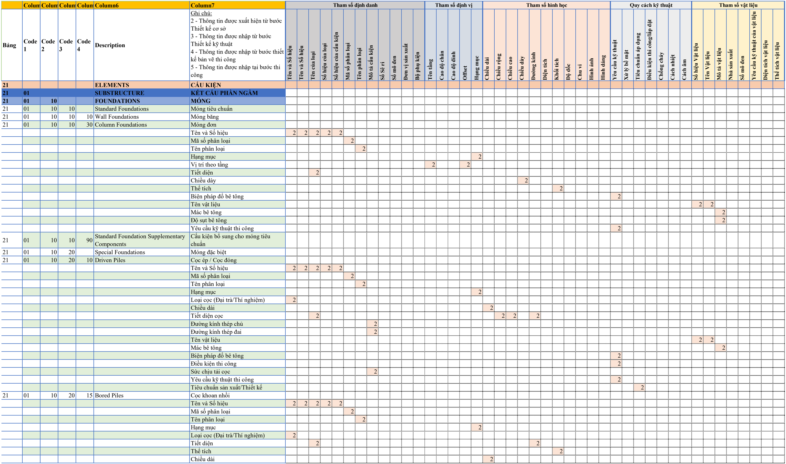  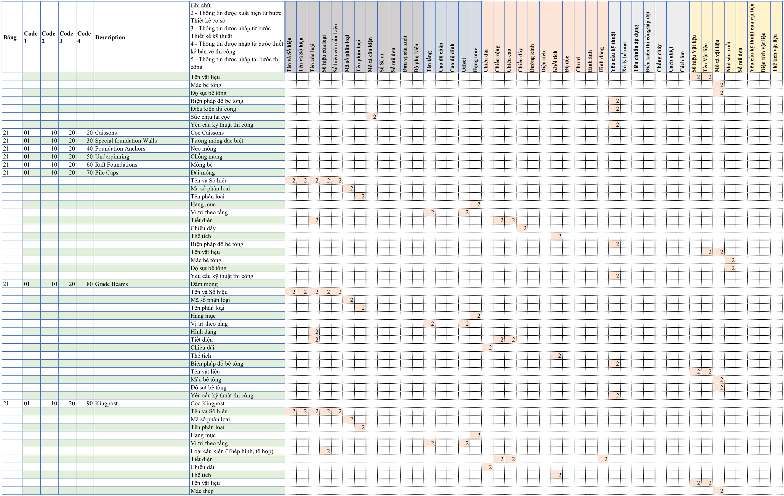  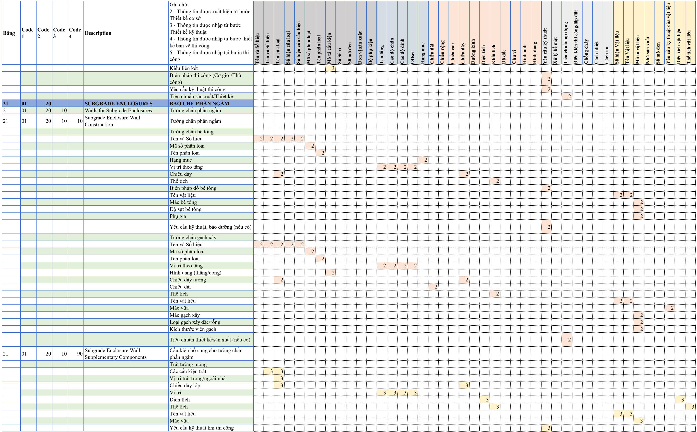  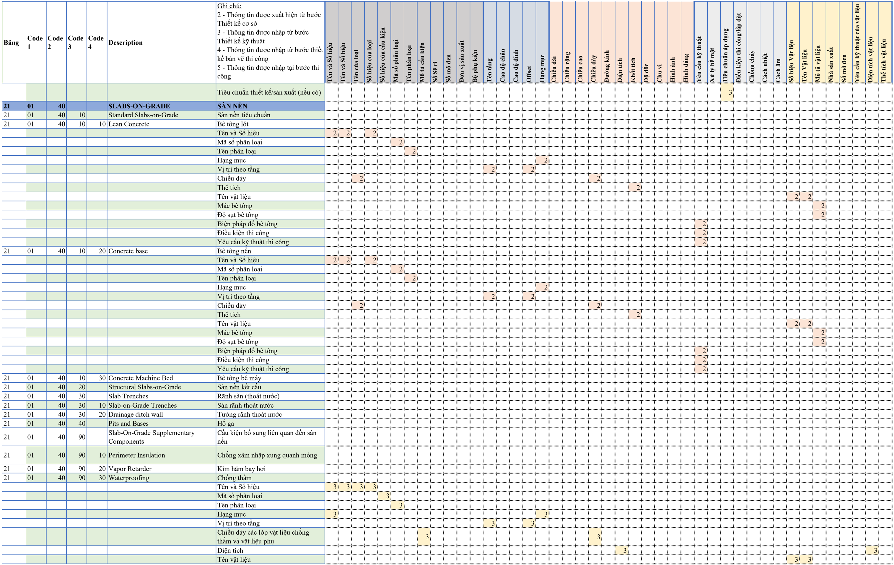  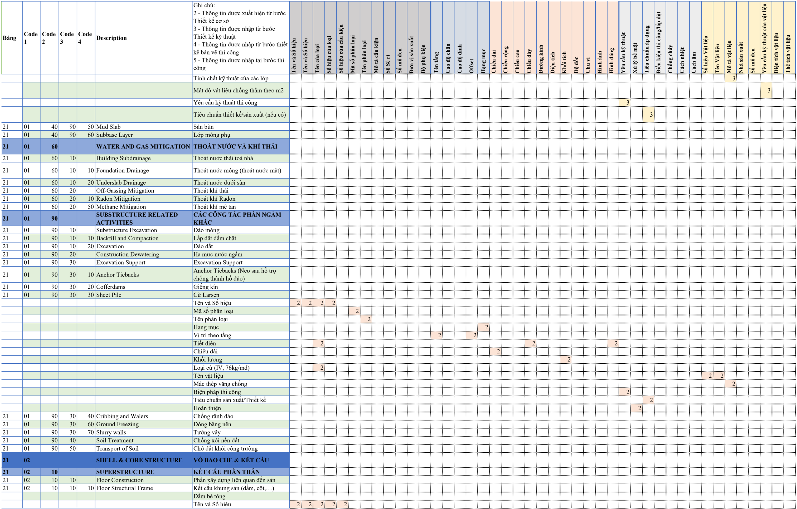  ...  **## BẢNG MỨC ĐỘ PHÁT TRIỂN THÔNG TIN PHI HÌNH HỌC BỘ MÔN MEP** 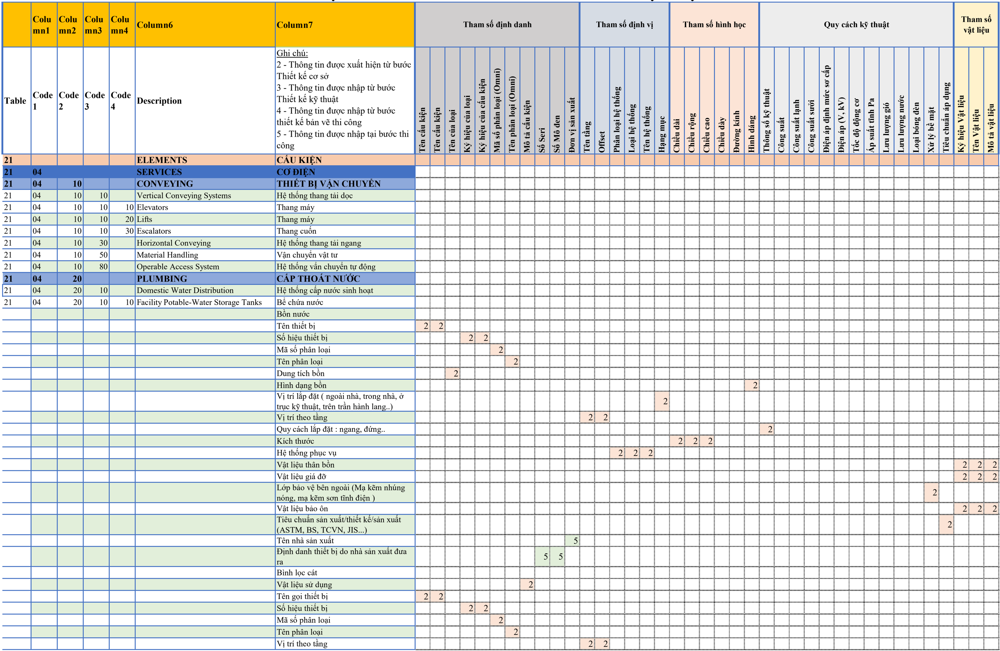  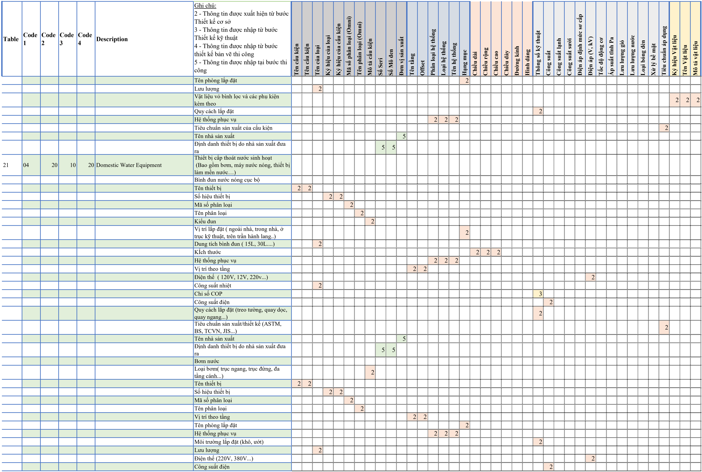  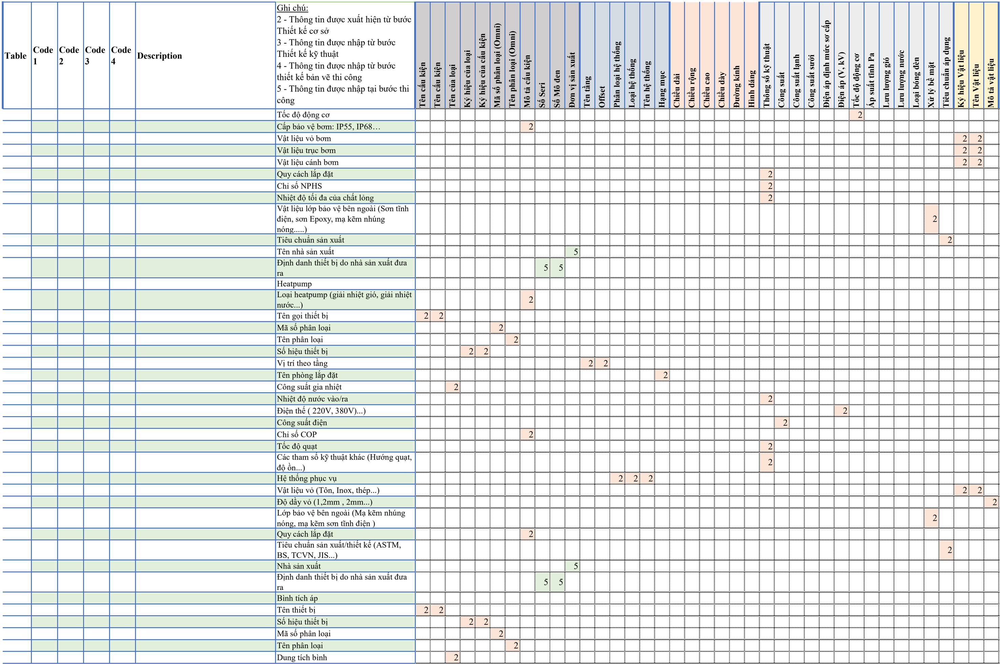  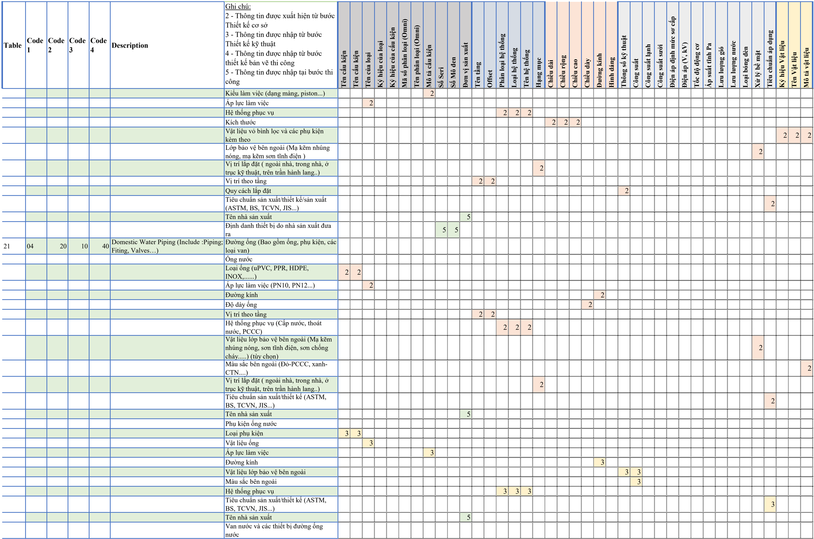  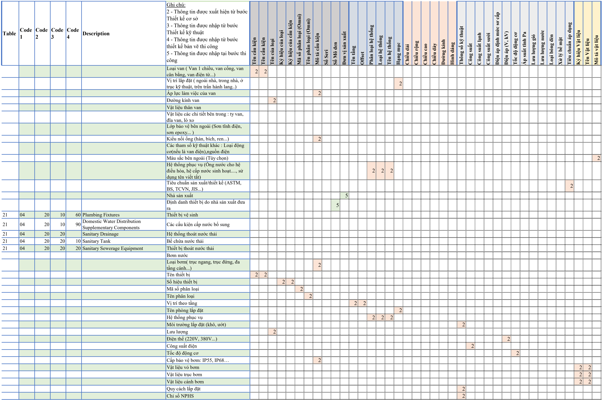  ...  **## PHỤ LỤC 03: MỨC ĐỘ PHÁT TRIỂN THÔNG TIN CỦA MỘT SỐ LOẠI CẤU KIỆN TRONG CÔNG TRÌNH HẠ TẦNG KỸ THUẬT ĐÔ THỊ (GIAO THÔNG, CẤP THOÁT NƯỚC)**   **## 1. Ví dụ Bảng mức độ phát triển mô hình theo giai đoạn trình tự đầu tư** | Loại đối tượng                |   Giai đoạn thiết kế cơ sở |   Giai đoạn thiết kế kỹ thuật |   Giai đoạn thiết kế BVTC | |-------------------------------|----------------------------|-------------------------------|---------------------------| | Địa hình                      |                        200 |                           300 |                       300 | | San lấp mặt bằng              |                        200 |                           300 |                       350 | | Đào mó...  **## PHỤ LỤC 04: MỨC ĐỘ PHÁT TRIỂN THÔNG TIN PHI HÌNH HỌC CỦA MỘT SỐ CẤU KIỆN TRONG CÔNG TRÌNH CẦU**  | Cần Review |
| [348] 6. Các nội dung về quản lý | **## 7.1. Môi trườ ng d ữ li ệ u chung CDE** Các thông tin BIM trong d ự án c ầ n đượ c trao đổ i thông qua Môi tr ườ ng d ữ li ệ u chung.  Ch ủ đầu tư quả n lý CDE và phân quy ề n phù h ợ p cho các bên liên quan. T ấ t c ả thông tin (báo cáo, b ả n v ẽ, mô hình, đặc điể m k ỹ thu ật, v.v.) đượ c t ạo ra và đượ c chia s ẻ trong CDE. Thông tin này s ẽ được trao đổ i b ằ ng CDE và quy trình làm vi ệc do Tư vấ n l ậ p trong PreBEP và CĐT phê duyệt để th ự c hi ệ n.  Tư vấ n BIM ph ả i s ử d ụ ng để t ạ o, chia s ẻ và phát hành Thông tin d ự á... | **## 3.2. Môi trường dữ liệu chung**   **## 3.2.1. Khái niệm chung về Môi trường dữ liệu chung** Môi trường dữ liệu chung (CDE) là nơi thu thập, lưu trữ, quản lý và phổ biến tất cả các thông tin, dữ liệu, tài liệu được tạo ra bởi các bên tham gia thực hiện BIM. CDE là sự kết hợp của các giải pháp kỹ thuật và quy trình làm việc.  CDE có thể rất khác nhau giữa các dự án (phụ thuộc quy mô và đặc điểm dự án). Một CDE đơn giản có thể chỉ là các ứng dụng nhỏ chia sẻ file miễn phí dựa trên nền web hoặc là các phần mềm thương mại.  CDE cho phép chia sẻ, phối hợp thông tin một cách kịp thời và chín...  **## 3.2.2. Phân loại CDE** Phụ thuộc vào mục tiêu sử dụng, quản lý, có thể có nhiều loại CDE (Hình 3.2). Trong phạm vi tài liệu này sẽ hướng dẫn các nội dung liên quan đến việc tạo lập, quản lý CDE cho Dự án.  Hình 3.2 Phân loại CDE  3  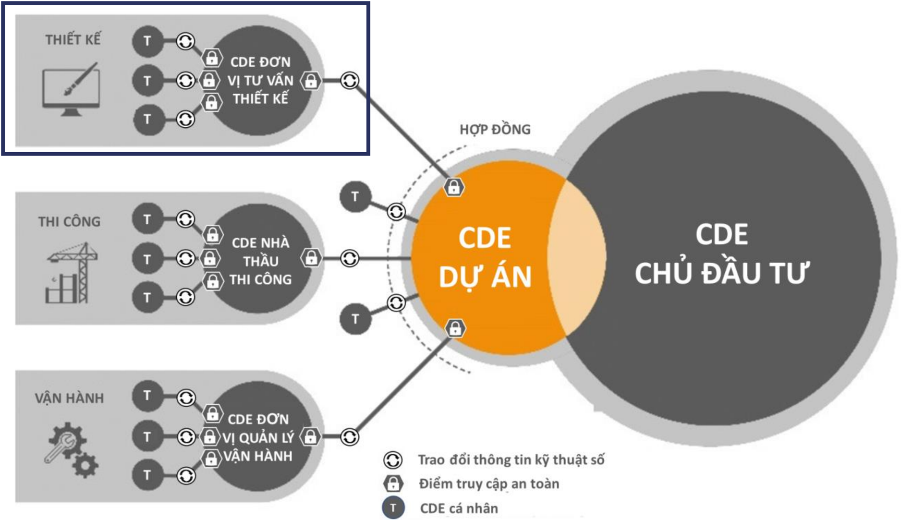  **## 3.2.2.1. CDE của dự án** Chủ đầu tư sẽ thiết lập hoặc giao Đơn vị thực hiện BIM thiết lập môi trường dữ liệu chung (CDE) của dự án để phục vụ cho các yêu cầu lưu trữ, phổ biến và hỗ trợ phối hợp, tạo lập mô hình BIM cũng như thông tin của dự án.  Đối với các dự án áp dụng BIM trong nhiều giai đoạn, Chủ đầu tư nên là người mua bản quyền và quản lý CDE để việc quản lý trao đổi thông tin giữa các giai đoạn được thống nhất.  **## Môi trường dữ liệu chung của dự án cần đảm bảo:** - -Mỗi vùng chứa thông tin sẽ có một mã ID duy nhất, dựa trên một quy ước đã được thống nhất và ghi lại bao gồm các trường thông tin được phân cách với nhau bằng một kí tự phân cách; - -Mỗi trường thông tin được gán một giá trị từ một tiêu chuẩn mã hóa đã được thống nhất và ghi lại; - -Mỗi vùng chứa thông tin sẽ được gán các thuộc tính sau:  3  Asset Information Management - Common Data Environment: Functional Requirements, UK Government BIM Working Group - CDE Sub Group, 2018  + Tình trạng (tí...  **## 3.2.2.2. CDE của Chủ đầu tư** Mục đích hệ thống CDE của Chủ đầu tư là cung cấp môi trường để thu thập và khai thác các thông tin BIM từ các dự án khác nhau của mình trong các giai đoạn của dự án (thiết kế, thi công và vận hành).  **## 3.2.2.3. CDE của các đơn vị tham gia dự án** Mỗi đơn vị tham gia dự án chịu trách nhiệm cho phần thông tin mình phụ trách và nên có quy trình riêng để kiểm soát việc tạo dựng và phối hợp thông tin của riêng đơn vị. Các đơn vị cần thống nhất thời điểm, cách thức chuyển giao thông tin từ CDE của đơn vị sang CDE của dự án để thực hiện công tác phối hợp.  **## 3.2.6. Một số đơn vị cung cấp giải pháp CDE thông dụng hiện nay** | Giải pháp   | Giải pháp   | Website                  | |-------------|-------------|--------------------------| |             | Aconex      | https://help.aconex.com/ |         và được thống nhất sử dụng trong suốt quá trình thực hiện dự án.  **## 3.4.4.3. Quy tắc đặt tên đối tượng** Các đối tượng trong dự án cần được đặt theo một hệ thống nhất quán. Mỗi loại đối tượng cần có duy nhất một tên được sử dụng trong suốt vòng đời của dự án để các thông tin có thể tham chiếu được đến đối tượng đó.  Quy tắc đặt tên đối tượng sẽ tuân thủ theo các yêu cầu chung, trong đó bao gồm một số trường nội dung như sau:    | Trường thông tin         | Mô tả                                         ...  **## 1.7. Phối hợp 3D**   **## 4.3. Kế hoạch trao đổi thông tin phối hợp** Nhà thầu sẽ sử dụng các định dạng trao đổi sau đây cho thông tin về BIM và các sản phẩm đầu ra.  Các bên cần hiểu rõ cách sử dụng, trách nhiệm, định dạng và tần xuất chia sẻ thông tin đã được thống nhất tại Biểu mẫu 02: Kế hoạch trao đổi thông tin phối hợp .  **## 6. Các nội dung về quản lý**   **## 6.1. Môi trường dữ liệu chung CDE** Các thông tin BIM trong dự án cần được trao đổi thông qua Môi trường dữ liệu chung 6.1.1. Mô tả  Giải pháp CDE nào đáp ứng và hỗ trợ các yêu cầu như ISO 19650-1: 2018 và sử dụng quy trình xử lý công việc được các nội dung: CÔNG VIỆC ĐANG TIẾN HÀNH (WIP) CHIA SẺ - ĐÃ PHÁT HÀNH - LƯU TRỮ.  \_\_\_\_ [Ghi tên chủ đầu tư] cùng với Nhà thầu chính sẽ quản lý CDE và sẽ cung cấp quyền truy cập cho các Nhà thầu. Tất cả thông tin (tức là báo cáo, bản vẽ, mô hình, đặc điểm kỹ thuật, v.v.) sẽ được tạo ra v...  **## Tham khảo Biểu mẫu 04: Cấu trúc thư mục và vai trò của các chủ thể trong quản lý, sử dụng CDE**   **## 6.2. Quy trình phối hợp** Nhà thầu sẽ phát triển một kế hoạch Phối hợp Mô hình để xác định cách Nhóm thực hiện sẽ phối hợp các mô hình theo khu vực và bộ môn riêng lẻ. Tối thiểu, các quy trình phối hợp mô hình 3D phải bao gồm:  - -Tham chiếu các mô hình mới nhất của các bộ môn được CHIA SẺ vào các mô hình đang làm việc trong WORK-IN-PROGESS để phối hợp thiết kế 'trực tiếp' - -Duy trì một mô hình kết hợp duy nhất cho dự án, bao gồm tất cả các khu vực và bộ môn, được cập nhật hàng tuần bởi Người Quản lý BIM - -Tiến hành ph...  **## KẾ HOẠCH TRAO ĐỔI THÔNG TIN PHỐI HỢP** Để hỗ trợ cho việc hợp tác cũng như tương tác/ sử dụng lại dữ liệu của nhau, Đơn vị thực hiện phải cung cấp các thông tin liên quan đến phạm vi công việc của mình như dưới đây. Lưu ý là tất cả các mục yêu cầu xác nhận 'đợi xác nhận' phải được ghi rõ trong Kế hoạch thực hiện BIM (BEP).  | Nội dung công việc                                              | Đơn vị chịu trách nhiệm                     | Phần mềm và phiên bản                       | Định dạng gốc                        | Định dạng trao...  **## CẤU TRÚC THƯ MỤC VÀ VAI TRÒ CỦA CÁC CHỦ THỂ TRONG QUẢN LÝ, SỬ DỤNG CDE** | W   | Ghi dữ liệu (Write)                  | |-----|--------------------------------------| | R   | Đọc dữ liệu (Read)                   | | N   | Không được phép truy cập (No access) |  |                             | Các chủ thể tham gia   | Các chủ thể tham gia   | Các chủ thể tham gia      | Các chủ thể tham gia                 | Các chủ thể tham gia    | Các chủ thể tham gia   | Các chủ thể tham gia   | |-----------------------------|------------------------|------------------------|-----...  **## 3. Quy tắc đặt tên đối tượng** Quy tắc đặt tên đối tượng bao gồm một số trường nội dung như sau:    **## 7. Quy định phối hợp**   **## 7.1. Quy trình phối hợp** Trong trường hợp cần thiết, chủ đầu tư và các bên liên quan xây dựng quy trình phối hợp phù hợp với nội dung áp dụng BIM của dự án.  Quy trình này cần thể hiện rõ các bước công việc; thời hạn; vai trò, nhiệm vụ của các chủ thể tương ứng; sản phẩm cụ thể.  **## 7.2. Môi trường Dữ liệu Chung (CDE)** Để hỗ trợ quá trình thực hiện áp dụng BIM, công tác trao đổi thông tin cần được thực hiện và kiểm soát. Các thành viên tham gia cần trao đổi thông tin thường xuyên (bao gồm cả các thông báo và biên bản cuộc họp). Các thông tin cần được lưu trữ trên môi trường dữ liệu chung (CDE) để các thành viên có liên quan có thể truy cập được kịp thời. CDE là nguồn dữ liệu trung tâm của dự án, cho phép các thành viên trao đổi thông tin, hạn chế việc lặp lại hoặc thông tin không được cập nhật.  Cấu trúc và ph... | **## 4. Hướng dẫn phối hợp và xử lý xung đột**   **## 4.1. Trách nhiệm trong việc phối hợp đa bộ môn ở giai đoạn thiết kế** Thực hiện trong quá trình phối hợp đa bộ môn liên quan đến nhiệm vụ của một số thành viên trong nhóm thực hiện bao gồm: Điều phối BIM (BIM Coordinator) và các Kỹ thuật viên BIM (BIM Modeller). Vai trò và trách nhiệm của Quản lý BIM, Điều phối BIM, Kỹ thuật viên BIM được hướng dẫn tại tại Hướng dẫn chung áp dụng Mô hình thông tin công trình (BIM).  Trách nhiệm cụ thể của từng thành viên trong việc phối hợp xử lý xung đột có thể được quy định khác nhau trong từng dự án. Dưới đây là một số trách ...  **## 4.2. Phương pháp phối hợp** Phối hợp đa bộ môn cần được thực hiện theo đúng kế hoạch đã đặt ra. Tại mỗi giai đoạn thực hiện dự án, việc phối hợp đa bộ môn sẽ được tập chung vào các thông tin cần thiết phải bàn giao ở giai đoạn đó.  **## a. Phối hợp giai đoạn thiết kế sơ bộ** Trong giai đoạn thiết kế sơ bộ, đơn vị tư vấn khảo sát chuyển các thông tin cần thiết về vị trí, toạ độ, bề mặt địa hình (nếu có)… của công trình cho bộ phận thiết kế (thông thường là bộ phận thiết kế kiến trúc). Từ đó, bộ phận thiết kế kiến trúc thiết lập toạ độ gốc, hệ lưới, trục, cao trình, lập mô hình khối.  Ở giai đoạn này, các kiến trúc sư có thể thực hiện cả mô hình kết cấu. Tuy nhiên cần tham khảo thêm ý kiến về chuyên môn của các kỹ sư kết cấu.  **## b. Phối hợp thiết kế giai đoạn thiết kế cơ sở** Trong giai đoạn thiết kế cơ sở, phối hợp mô hình chủ yếu giữa mô hình kiến trúc và mô hình kết cấu. Bộ phận thiết kế kiến trúc, kết cấu và cơ điện tham gia phối hợp trao đổi thông tin và đưa ra các yêu cầu về không gian, kỹ thuật,…  Trong quá trình mô hình hoá bộ môn kết cấu, mô hình kiến trúc cần được liên kết để thuận tiện trong quá trình lên phương án, lập mô hình. Quy trình phối hợp giữa mô hình kiến trúc và kết cấu thể hiện tại Hình 1  Hình 1 Phối hợp mô hình giữa kiến trúc và kết...  **## c. Phối hợp thiết kế giai đoạn thiết kế kỹ thuật, bản vẽ thi công** Mô hình kiến trúc/ kết cấu sẽ được liên kết vào mô hình cơ điện. Bộ phận thiết kế cơ điện sẽ đặt các cấu kiện, đường ống, máng cáp, bố trí lỗ mở xuyên tầng,… vào vị trí dự kiến. Quản lý BIM cần xác định các khu vực quan trọng ưu tiên phối hợp.  Trong quá trình mô hình hoá, các bộ phận thiết kế cần chủ động xử lý các lỗi va chạm (nếu có). Quá trình phối hợp giữa các bộ môn trong giai đoạn thiết kế kỹ thuật/ bản vẽ thi công được thể hiện tại Hình 2.  Hình 2 Phối hợp mô hình giữa kiến trúc/ kết ...  **## 4.3. Tần suất phối hợp** Thời gian, tần suất, nội dung và thời điểm phối hợp cần được thống nhất trước trong kế hoạch triển khai công tác và phải được phổ biến rộng rãi cho các bên liên quan.  **## e. Quy tắc đặt tên** Việc đặt tên góc nhìn, tên va chạm, báo cáo, ghi chú… tuân thủ yêu cầu về quy tắc đặt tên của chủ đầu tư hoặc quy định của cơ quan nhà nước có thẩm quyền (nếu có). | Có quy định đối chiếu |
| [348] 7. Các nội dung về kỹ thuật | Không tìm thấy thông tin rõ ràng. | **## 1.3.3.1. Phần mềm, phần cứng và dữ liệu** - - - Phần mềm mô phỏng và phân tích năng lượng; - -Mô hình BIM của công trình; - -Dữ liệu chi tiết thời tiết địa phương; - - - Tiêu chuẩn năng lượng phù hợp.  **## Phần cứng, phần mềm và dữ liệu** - -Công cụ tạo lập mô hình BIM; - - - Công cụ và phần mềm phân tích kết cấu; - -Tiêu chuẩn thiết kế kết cấu; - - - Phần cứng phù hợp để chạy phần mềm.  **## 1.4.3.1. Phần mềm, phần cứng và dữ liệu** - -Mô hình BIM chứa tất cả các đối tượng có tác động đến sự phân bố ánh sáng trong công trình (bao gồm vật liệu hoàn thiện, bố trí nội thất, hình thù công trình...); - -Phần mềm phân tích, tính toán ánh sáng.  **## 1.5.3.1. Phần mềm, phần cứng và dữ liệu** - -Phần mềm đánh giá thiết kế; - -Phần cứng đáp ứng khả năng xử lý mô hình;  **## 1.6.3.1. Phần mềm, phần cứng và dữ liệu** - - - Phần mềm dự toán dựa trên mô hình; - -Mô hình thiết kế đáp ứng các yêu cầu để bóc tách khối lượng; - -Dữ liệu về chi phí (thông tin về giá liên quan);  **## 1.7.3.1. Phần mềm, phần cứng và dữ liệu** - - - Phần mềm xây dựng mô hình; - -Phần mềm đánh giá mô hình; - - - Phần mềm phát hiện xung đột; - - - Mô hình thành phần; - -Các báo cáo, nhận xét, mô hình trong quá trình phối hợp.  **## 1.8.3.1. Phần mềm, phần cứng và dữ liệu** - -Phần mềm dựng mô hình BIM; - -Phần mềm lên kế hoạch; - -Phần mềm quản lý mô hình 4D; - -Mô hình tiến độ xây dựng (mô hình 4D) (IFC, CSV, XML); - -Bảng tiến độ xây dựng.  **## 7. Các nội dung về kỹ thuật**   **## 7.1. Nền tảng phần mềm** Nhà thầu liệt kê các phần mềm thiết kế sẽ dự định sử dụng trong dự án.  Phần mềm và các phiên bản được sử dụng bởi \_\_\_\_ [Ghi tên chủ đầu tư] được liệt kê trong bảng dưới đây cho mục đích quản lý thông tin và đánh giá sản phẩm bàn giao.  Bảng 9. Phần mềm và phiên bản  | Nội dung                                                        | Tên phần mềm            | Phiên bản            | |-----------------------------------------------------------------|-------------------------|----------------...  **## 7.2. Tạo lập bản vẽ** Bản vẽ được yêu cầu trích xuất trực tiếu từ các mô hình BIM. Việc bổ sung đường nét, chi tiết xây dựng và ký hiệu có thể được bổ sung vào khi cần thêm chi tiết.  Chủ đầu tư hoặc Nhà thầu đưa ra tiêu chuẩn hoặc thống nhất chung một bản vẽ mẫu.  **## 5.1. Các phần mềm ứng dụng** Sau đây là các phần mềm ứng dụng hiện đang được chỉ định bởi Chủ đầu tư để sử dụng trong dự án.  Vui lòng cho biết phần mềm nào quý Công ty sử dụng và không sử dụng:  | Vai trò trong dự án   | Công cụ khởi tạo mô hình BIM   | Tuân thủ theo yêu cầu (Có / Không) Nếu 'Không', công ty bạn sử dụng công cụ BIM nào tương ứng   | Phiên bản đang được sử dụng   | |-----------------------|--------------------------------|--------------------------------------------------------------------------------------...  **## 5.2. Bảo trì phần mềm** Vui lòng điền đầy đủ các mục dưới đây, cung cấp các dẫn chứng phù hợp nếu có.  | STT   | Câu hỏi                                                                                       | Trả lời (Có/Không)   | Diễn giải (nếu có)   | |-------|-----------------------------------------------------------------------------------------------|----------------------|----------------------| | 5.2.1 | Các công cụ CAD/BIM của quý Công ty bạn có được duy trì theo hợp đồng bảo trì hàng năm không? |            ...  **## 7.3. Phần mềm và phiên bản** Các phiên bản phần mềm cần được thống nhất trong nhóm dự án. Bất kỳ thay đổi nào về phần mềm cần được hỏi ý kiến các bên tham gia trước khi thực hiện.  Chỉ những công cụ dưới đây mới được sử dụng để tạo lập, phối hợp và phê duyệt mô hình BIM. Mục đích của việc thống nhất phần mềm và phiên bản để đảm bảo khả năng tích hợp giữa các bộ môn.  Bảng 9. Phần mềm và phiên bản  | Nội dung                                                        | Tên phần mềm            | Phiên bản            | |--------... | Không tìm thấy thông tin rõ ràng. | Cần Review |
| [348] 8. Đào tạo | Không tìm thấy thông tin rõ ràng. | **## 8. Đào tạo** Nhà thầu được yêu cầu cung cấp chi tiết về khoá đào tạo mà nhà thầu sẽ cung cấp cho \_\_\_\_ [Ghi tên chủ đầu tư] để  đáp ứng các yêu cầu sử dụng BIM được nêu cụ thể trong tài liệu này để đảm bảo quá trình phối hợp, bàn giao và hiểu biết trong quá trình thiết kế và thi công.  \_\_\_\_ [Ghi tên chủ đầu tư] không cung cấp chương trình đào tạo công nghệ nào cho các bên khác thuộc ngoài dự án \_\_\_\_ [Ghi tên dự án].  Bảng 10. Chương trình đào tạo  | Chương trình đào tạo                | Mô tả    ... | Không tìm thấy thông tin rõ ràng. | Cần Review |
| [348] 9. Đánh giá năng lực | Không tìm thấy thông tin rõ ràng. | **## 9. Đánh giá năng lực nhà thầu** Nhà thầu phải xây dựng Kế hoạch thực hiện BIM sơ bộ và các nội dung liên quan đến việc triển khai BIM cho công trình của dự án. Việc áp dụng BIM từ tổng thể đến chi tiết cần cân đối giữa nguồn lực và tiến độ yêu cầu, kế hoạch và khả năng đáp ứng.  Nhà thầu sẽ trình bày BEP này theo hai giai đoạn dưới hình thức Kế hoạch thực hiện BIM sơ bộ (Pre-BEP) và Kế hoạch thực hiện BIM (BEP)- sau khi ký kết hợp đồng; hai phiên bản như sau và được xác định chi tiết trong Phần bên dưới:  - -Pre-BEP trong HSMT... | Không tìm thấy thông tin rõ ràng. | Cần Review |
| [347] Yêu cầu thông tin cho Kiến trúc/Kết cấu/Cơ điện | Không tìm thấy thông tin rõ ràng. | **## 1.3.6. Phân tích kết cấu**  | **## Yêu cầu thông tin trao đổi đối với bộ môn kiến trúc**   **## 5.5. Nội dung kiểm tra chủ yếu mô hình kiến trúc** | Nội dung                                                                                                                                                                | Đạt   | Không đạt   | Ghi chú   | |-------------------------------------------------------------------------------------------------------------------------------------------------------------------------|-------|-------------|-----------| | Đáp ứng các yêu cầu chung trong việc mô hình hoá đối tượng                           ...  **## 6. Yêu cầu thông tin trao đổi đối với bộ môn kết cấu**   **## 6.5. Danh sách kiểm tra chủ yếu cho mô hình kết cấu** | Nội dung kiểm tra                                                                                                       | Đạt   | Không đạt   | Ghi chú   | |-------------------------------------------------------------------------------------------------------------------------|-------|-------------|-----------| | Đáp ứng các yêu cầu chung trong việc mô hình hoá đối tượng                                                              |       |             |           | | Mô hình ở định dạng đã...  **## 7. Yêu cầu thông tin trao đổi đối với bộ môn cơ điện**   **## 7.1.1. Hệ thống HVAC** - a. Yêu cầu đầu vào 2. -Phương án thiết kế sơ bộ, sản phẩm đầu ra thiết kế sơ bộ (nếu có); 3. - 4. Hệ lưới trục chung; 5. -Hiểu rõ yêu cầu về thực hiện BIM đối với công trình; 6. - 7. Điện chiếu sáng và nguồn điện (nếu có).  **## 7.2.1. Hệ thống HVAC** - a. Yêu cầu đầu vào 2. - 3. Mô hình cơ điện giai đoạn thiết kế cơ sở (nếu có); 4. -Hồ sơ giai đoạn thiết kế cơ sở kèm các quyết định phê duyệt dự án; 5. -Kế hoạch thực hiện BIM (BEP).  **## Hệ thống HVAC**   **## 7.4. Mức độ mô hình hoá đối với hệ thống cơ điện** | Giai đoạn          | Mức độ mô hình hoá   | Nội dung                                                                                                                           | Yêu cầu kiểm tra xung đột             | |--------------------|----------------------|------------------------------------------------------------------------------------------------------------------------------------|---------------------------------------| | Thiết kế sơ bộ     | 10%                  | Phòng máy và khô...  **## 7.5. Danh sách kiểm tra chủ yếu cho mô hình cơ điện** | Nội dung                                                        | Đạt   | Không đạt   | Ghi chú   | |-----------------------------------------------------------------|-------|-------------|-----------| | Mô hình ở định dạng đã được thống nhất                          |       |             |           | | Tiêu chuẩn BIM của dự án                                        |       |             |           | | Mô hình có tuân thủ định dạng file của dự án                    |       |             | ...  **## 1. Mô hình kiến trúc**   **## a. Các hệ thống kiến trúc** Mô hình hóa các cấu kiện kiến trúc đến một mức độ thể hiện ý định thiết kế và thể hiện chính xác giải pháp thiết kế.  **## 2. Mô hình kết cấu**   **## b. Hệ thống kết cấu** - b1. Móng: - -Móng bè; - -Móng cọc khoan nhồi; - -Móng cọc ép; - - - Móng đơn; - - - Móng băng.  **## Mô hình CƠ ĐIỆN**   **## c. Hệ thống HVAC:**   **## BẢNG MỨC ĐỘ PHÁT TRIỂN THÔNG TIN PHI HÌNH HỌC BỘ MÔN KIẾN TRÚC - KẾT CẤU**           ... | Cần Review |
| [347] Yêu cầu thông tin cho Công trình giao thông (Cầu/Đường) | **## YÊU CẦU THÔNG TIN TRAO ĐỔI EXCHANGE INFORMATION REQUIREMENTS (EIR)** DỰ ÁN ĐẦU TƯ XÂY DỰNG MỞ RỘNG ĐƯỜNG CAO TỐC THÀNH PHỐ HỒ CHÍ MINH - TRUNG LƯƠNG - MỸ THUẬN THEO PHƯƠNG THỨC ĐỐI TÁC CÔNG TƯ  ÁP DỤNG MÔ HÌNH THÔNG TIN CÔNG TRÌNH (BIM)  BƯỚC THIẾT KẾ KỸ THUẬT   Yeu cau thong tin_TKKT_V3_images/HTM_(EIR) Yeu cau thong tin_TKKT_V3_images\image_000001_a353093aa558ff3778ce62d80a2fedd8d85fbba42177fdf04d667dba620db67b.png)  **## CHƯƠNG 5. PH Ạ M VI CÔNG VI Ệ C, S Ả N PH Ẩ M, K Ế HO Ạ CH CHUY Ể N GIAO THÔNG TIN**  | **## 2.2. Hồ sơ mời thầu/ hồ sơ yêu cầu**   **## 2.2.4. Yêu cầu về thông tin trao đổi (EIR)** Yêu cầu về thông tin trao đổi (EIR) là các yêu cầu của Chủ đầu tư để tạo lập thông tin liên quan đến việc áp dụng BIM. EIR là một phần trong HSMT/HSYC.  Khuyến khích Chủ đầu tư xây dựng EIR tổng thể cho toàn dự án nếu có các gói thầu áp dụng BIM riêng lẻ. Chủ đầu tư tự tổ chức hoặc thuê đơn vị tư vấn có kinh nghiệm lập EIR.  Nội dung chủ yếu của EIR bao gồm:  - -Thông tin dự án (Thông tin chung, tiến độ dự án); - -Mục tiêu áp dụng BIM; - -Nội dung áp dụng BIM; - -Phạm vi công việc và sản phẩm; -...  **## b. Thiết lập kế hoạch chuyển giao thông tin nhiệm vụ (TIDP)** Kế hoạch chuyển giao thông tin nhiệm vụ (TIDP) là danh sách các sản phẩm cần chuyển giao được phân tách thành các nhiệm vụ riêng lẻ. Kế hoạch chuyển giao thông tin nhiệm vụ (TIDP) được các Bộ phận thực hiện BIM lập dựa theo điều kiện và năng lực của bộ phận đó.  TIDP cung cấp thông tin về trách nhiệm chuyển giao các sản phẩm để các thành viên thực hiện, đồng thời cung cấp thông tin về trình tự để hoàn thiện.  Thông tin trong bảng TIDP cần chứa các thông tin sau:  - -Tên và tiêu đề; - -Mức độ ph...  **## c. Thiết lập kế hoạch chuyển giao thông tin tổng thể (MIDP)** Kế hoạch chuyển giao thông tin tổng thể (MIDP) là kế hoạch chính được sử dụng để quản lý việc chuyển giao thông tin trong suốt quá trình thực hiện.  MIDP được rà soát, cập nhật chi tiết sau khi ký kết hợp đồng, Đơn vị thực hiện tập hợp các Kế hoạch chuyển giao thông tin nhiệm vụ (TIDP) để hoàn thiện Kế hoạch chuyển giao thông tin tổng thể (MIDP).  Trong quá trình thực hiện dự án, dựa vào các yếu tố: tiến độ, năng lực đội ngũ, bảng MIDP có thể được sửa đổi. Bảng MIDP được lưu trữ trên Môi trườn...  **## Yêu cầu chung trong việc mô hình hoá đối tượng** Trong quá trình tạo lập mô hình, cần đảm bảo các yêu cầu chung sau đây:  - -Các đối tượng được mô hình hoá bằng công cụ tương ứng hoặc thích hợp nhất trong phần mềm dựng hình; - -Điểm gốc của đối tượng phải được thiết lập cho đối tượng BIM phù hợp để thuận lợi khi thay thế giữa các loại đối tượng với nhau; - -Điểm gốc, hệ lưới trục, cao độ trong dự án cần được xác định để bảo đảm các mô hình thông tin được khớp nối chính xác; - -Các đối tượng được dựng hình với tỉ lệ 1:1; - - - Các đối tượng...  **## 1.1.3. Yêu cầu** - 1.1.3.1. Phần mềm, phần cứng và dữ liệu - -Phần mềm mô hình hóa; - -Phần mềm xử lý dữ liệu đám mây điểm phù hợp với các thiết bị khảo sát; - -Thiết bị khảo sát.  **## 1.2.3. Yêu cầu** - 1.2.3.1. Phần mềm, phần cứng và dữ liệu - -Phần mềm tạo lập mô hình; - -Phần cứng đáp ứng tối thiểu yêu cầu của nhà sản xuất; - -Hệ thống thư viện cấu kiện.  **## 1.3.3. Yêu cầu**   **## 1.3.9. Yêu cầu**   **## 1.3.9.2. Yêu cầu năng lực** - - - Khả năng tạo, thao tác, điều hướng và đánh giá Mô hình Kết cấu 3D; - - - Kinh nghiệm thiết kế và phân tích kết cấu.  **## 1.4.3. Yêu cầu**   **## 1.5.3. Yêu cầu**   **## 1.6.3. Yêu cầu**   **## 1.7.3. Yêu cầu**   **## 1.8.3. Yêu cầu**   **## YÊU CẦU VỀ THÔNG TIN TRAO ĐỔI**   **## 4. Phạm vi công việc, sản phẩm, kế hoạch chuyển giao thông tin**   **## 6.1.3. Các Yêu cầu về Siêu dữ liệu** Tất cả các tập tin trong CDE sẽ được điền thông tin với siêu dữ liệu để mô tả nội dung của tập tin và phù hợp để sử dụng cho mục đích gì.  Tối thiểu thì tất cả các tập tin sẽ chứa siêu dữ liệu mô tả về sự phù hợp, trạng thái và sửa đổi của tập tin, được thể hiện trong Bảng như sau.  Bảng 8. Mô tả siêu dữ liệu  | Trạng thái               | Mô tả                                                                                                                                                    | Hi...  **## 5. Phạm vi công việc, sản phẩm, kế hoạch chuyển giao thông tin**   **## 5.3. Kế hoạch chuyển giao thông tin** Kế hoạch chuyển giao thông tin tổng thể bao gồm các chi tiết về thời điểm, đơn vị thực hiện cho từng nội dung công việc phù hợp với các mốc thời gian của dự án.  Tham khảo Biểu mẫu 04: Kế hoạch chuyển giao thông tin tổng thể (MIDP)  **## KẾ HOẠCH CHUYỂN GIAO THÔNG TIN TỔNG THỂ (MIDP)** |   Phiên bản | Ngày       | Người thực hiện   | Người kiểm tra   | Người phê duyệt   | Mô tả   | |-------------|------------|-------------------|------------------|-------------------|---------| |         1.0 | 01/01/2020 |                   |                  |                   |         |  **## Kế hoạch chuyển giao thông tin tổng thể (MIDP)**     |                                                                     |                                                                     |                                                                     |                                                                     | Tham khảo tài liệu...  **## 4.2.2. Thiết lập yêu cầu đặc tính kỹ thuật của LOD** Mỗi thành phần mô hình thông thường chứa hai loại thông tin:  - -Thông tin hình học của các thành phần là các thông tin có thể nhìn thấy được. - -Thông tin phi hình học là các thuộc tính số và (hoặc) các văn bản liên quan (vật liệu, cường độ, ngày tháng sản xuất và thi công…) và không thể nhìn thấy.  Do vậy, đặc tính kỹ thuật LOD sẽ bao gồm hai phần: thành phần hình học và thành phần thuộc tính được liên kết (phi hình học). | **## Yêu cầu thông tin trao đổi đối với bộ môn kiến trúc**   **## a. Yêu cầu đầu vào** - -Mô hình cơ điện giai đoạn thiết kế kỹ thuật (nếu có); - -Hồ sơ thiết kế kỹ thuật; - -Chỉ dẫn kỹ thuật có liên quan (nếu có).  **## b. Yêu cầu về mô hình thông tin** - -Thể hiện hệ thống chi tiết bao gồm thiết bị và đường ống; - -Phối hợp với kết cấu, kiến trúc sư và các mô hình khác, xử lý triệt để các xung đột; - -Kiểm tra và xem xét các giao diện cơ/ điện; - -Thể hiện rõ vị trí bố trí đường ống, các thông tin liên quan khác; - -Phối hợp xung đột đa bộ môn với dung sai đến +/- 50mm.  **## Yêu cầu về mô hình thông tin** - -Xây dựng sơ đồ hệ thống cơ sở và xác định các yêu cầu đặc biệt (nếu có); - -Xác nhận yêu cầu không gian phòng/ vị trí và yêu cầu đường truyền điện; - - - Kích thước dự tính phòng máy chính (máy biến áp, máy phát điện, máy tổng); - - - Xác định các yêu cầu giao diện với các mô hình khác; - - - Phương pháp phân phối điện khu vực.  **## 6. Yêu cầu thông tin trao đổi đối với bộ môn kết cấu**   **## 7. Yêu cầu thông tin trao đổi đối với bộ môn cơ điện**   **## PHẦN 2: MỘT SỐ NỘI DUNG TRIỂN KHAI BIM TRONG CÔNG TRÌNH HẠ TẦNG KỸ THUẬT ĐÔ THỊ**   **## 4. Một số yêu cầu đối với mô hình hoá bề mặt**   **## 4.1. Các yêu cầu độ chính xác của đối tượng là bề mặt ( bao gồm đường, địa hình)** Các yêu cầu độ chính xác của mô hình thiết kế gồm:  - -Các yêu cầu nội dung về thông tin và thuộc tính; - -Yêu cầu tính liên tục đối với các Breaklines và Surface (đường ngắt (đường dẫn) và bề mặt) : tại các vị trí bề mặt có sự thay đổi theo dạng dải như lề đường, chân taluy thì phải có đường breakline (đường dẫn hướng) để đảm bảo mô hình bề mặt được chính xác, đảm bảo lưới tam giác không được cắt qua đường breakline; - -Yêu cầu hình học đối với đường ngắt, bề mặt, các đối tượng và các đối t...  **## 4.2. Tính liên tục của các đối tượng đường ngắt (Breaklines) và bề mặt (Surface)**   **## Yêu cầu** Tất cả các đường ngắt và bề mặt trong thiết kế cuối cùng phải cần liên tục nhất có thể. Các bề mặt không được có các thay đổi theo chiều thẳng đứng và không cho phép có các đường ngắt trùng lặp trên bề mặt.  **## 4.4. Độ chính xác hình học của mô hình bề mặt Yêu cầu** Các đường ngắt không được lệch ra khỏi đường hình học đã tính nhiều hơn 3mm và cự ly điểm đường nét không được vượt quá 10m.  **## 5. Yêu cầu thông tin trao đổi đối với công trình giao thông (cầu, đường)**   **## e2. Đường ống cấp nước:** Đường ống có kích thước đường kính lớn hơn 5cm, bao gồm bất kì lớp bao bọc nào trong mô hình.  - e3. Đồ đạc: bồn rửa, đồ vệ sinh, bể nước, bồn rửa sàn - e4. Phòng cháy chữa cháy: - -Đường ống của hệ thống Sprinkler có kích thước trên 5cm; - -Đầu phun Sprinkler; - -Ống nước đứng Stand\_Pipe, trụ cứu hoả, đường ống nước chữa cháy  bao gồm không gian sử dụng. - e5. Các yêu cầu lối vào khu vực, yêu cầu không gian của hệ thống, khoảng cách của van và không gian hoạt động khác phải được mô hình hóa nh...  **## 4. Mô hình hạ tầng khu vực**   **## f. Công trình hạ tầng khu vực:** Mô hình các cấu kiện của công trình hạ tầng khu vực sau đây ở mức tối thiểu f1. Địa hình:  Địa hình 3D của tất cả công trường xây dựng như được thiết kế, bao gồm tường chắn. Mô hình này phải bao gồm địa điểm và các khu vực xung quanh góp phần vào hệ thống thoát nước của khu vực hoặc tác động đến công trường xây dựng. Trong hầu hết các trường hợp, điều này sẽ yêu cầu các tuyến đường liền kề phải được mô hình hóa.  **## f3. Công trình hạ tầng kỹ thuật vá các bộ phận chi tiết:** Mô hình hóa tất cả các kết cấu của trạm bơm, hệ thống nhiên liệu, hố ga và các hạng mục chính khác ảnh hưởng đến thông tin đầu vào của dự án hoặc có thể trở thành hạn chế thiết kế của dự án. Tất cả các mục phải được tham chiếu địa lý sao cho tất cả các hạng mục có thể được xem dưới dạng lớp phủ trong mô hình thông tin tòa nhà.  - -Hệ thống Điện; - -Hệ thống chiếu sáng (Cột điện...); - -Hệ thống viễn thông; - -Hệ thống truyền dữ liệu; - -Hệ thống cấp nước (Nước sinh hoạt, nước phòng cháy chữa chá...  **## PHỤ LỤC 03: MỨC ĐỘ PHÁT TRIỂN THÔNG TIN CỦA MỘT SỐ LOẠI CẤU KIỆN TRONG CÔNG TRÌNH HẠ TẦNG KỸ THUẬT ĐÔ THỊ (GIAO THÔNG, CẤP THOÁT NƯỚC)**   **## 2. Địa hình** |   LOD | Mô tả                                                                                                                                                             | LOI                                         | Hình ảnh*   | |-------|-------------------------------------------------------------------------------------------------------------------------------------------------------------------|---------------------------------------------|-------------| |   100 | Dạng địa hình được thể...  **## 5. Đào đất dạng tuyến** |   LOD | Mô tả                                        | LOI                                  | Hình ảnh*   | |-------|----------------------------------------------|--------------------------------------|-------------| |   100 | Hiện thị phần đào đất dưới dạng đường thằng. | Loại Độ cao Độ dốc Tên lớp           |             | |   200 | Hiển thị phần đào đất dưới dạng 3D           | Loại Độ cao Độ dốc Tên lớp Phân loại |             | |   300 | Hiển thị phần đào đất cho ống dưới dạng 3D.  | Loạ...  **## 6. Đường bộ và đường sắt** |   LOD | Mô tả                                                             | LOI                                                        | Hình ảnh*   | |-------|-------------------------------------------------------------------|------------------------------------------------------------|-------------| |   100 | Hiển thị đường trung tâm của đường hoặc là đường sắt dưới dạng 2D | Loại Kích thước Tên lớp                                    |             | |   200 | Hiển thị bề mặt 2D cho bề mặt đ...  **## 7. Trang thiết bị của đường bộ và đường sắt** |   LOD | Mô tả                                                                                  | LOI                    | Hình ảnh*   | |-------|----------------------------------------------------------------------------------------|------------------------|-------------| |   100 | Đặc điểm kỹ thuật của vị trí thiết bị đường bộ và đường sắt.                           | Loại Tên lớp           |             | |   200 | Đặc điểm kỹ thuật, kích thước, vị trí của đường và các thiết bị đường sắt.  ...  **## 8. Hệ thống đường ống hiện trạng** |   LOD | Mô tả                                                                                                                                                    | LOI                                             | Hình ảnh*   | |-------|----------------------------------------------------------------------------------------------------------------------------------------------------------|-------------------------------------------------|-------------| |   100 | Vị trí tương đối của đường ống d...  **## 19. Hệ thống đường ống** |   LOD | Mô tả                                                                                                                                                       | LOI                                                                               | Hình ảnh*   | |-------|-------------------------------------------------------------------------------------------------------------------------------------------------------------|-------------------------------------------------------------------...  **## PHỤ LỤC 04: MỨC ĐỘ PHÁT TRIỂN THÔNG TIN PHI HÌNH HỌC CỦA MỘT SỐ CẤU KIỆN TRONG CÔNG TRÌNH CẦU**   **## 9. Mặt đường- cầu** | Giai đoạn          | Tham số                                                | |--------------------|--------------------------------------------------------| | thiết kế           | Mã số cấu kiện                                         | |                    | Độ bền nén thiết kế (MPa)                              | |                    | Lớp bê tông bảo vệ                                     | |                    | Mác bê tông                                            | |                   ... | Có quy định đối chiếu |